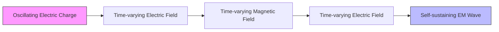
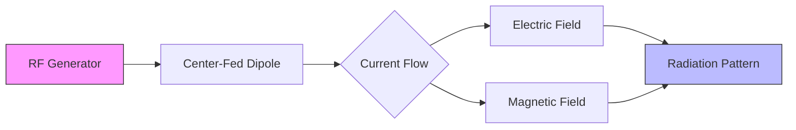
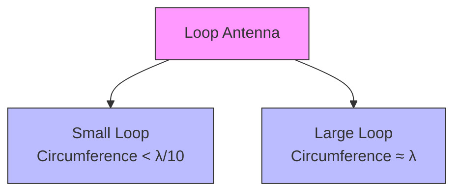
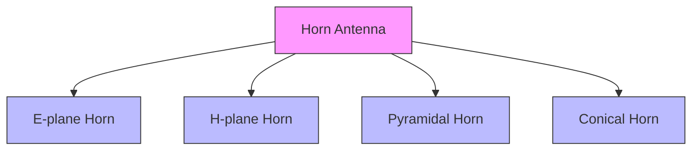
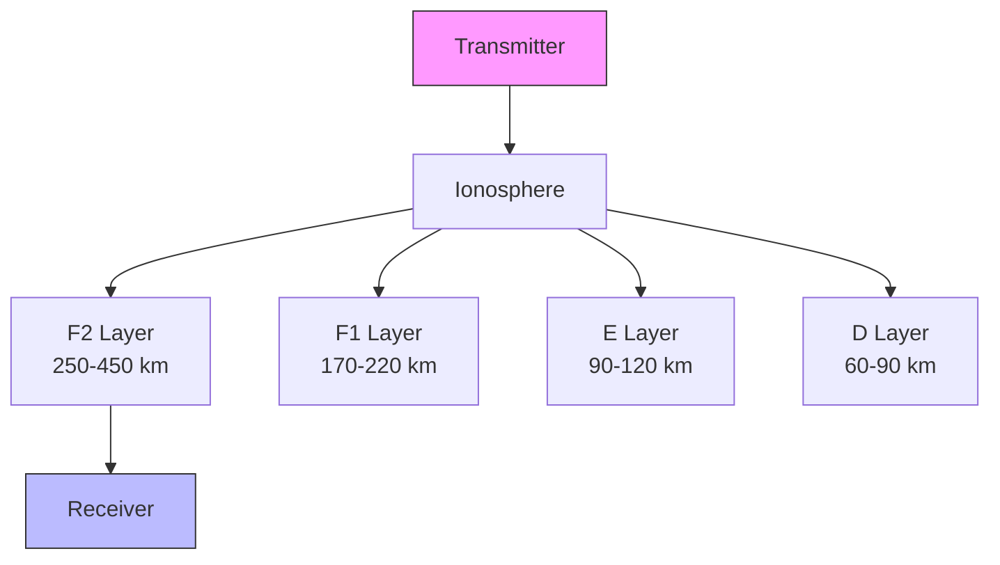
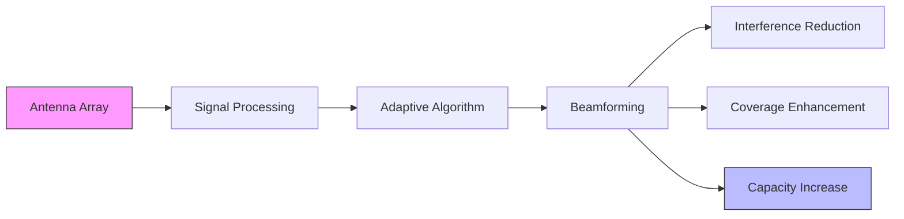
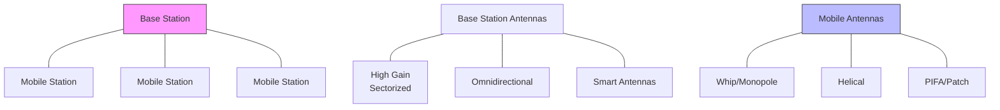

## Question 1(a) [3 marks]

**Define: (1) Directivity, (2) Gain, and (3) HPBW**

**Answer**:

**Table: Antenna Parameters Definitions**

| Parameter | Definition |
|-----------|------------|
| **Directivity** | The ratio of radiation intensity in a given direction to the average radiation intensity in all directions, |
| **Gain** | The ratio of power radiated in a specific direction to the power that would be radiated by an isotropic antenna with the same input power |
| **HPBW (Half Power Beam Width)** | The angular width of the main lobe where the power falls to half (-3dB) of its maximum value |

**Mnemonic:** "DGH: Direction Gets Higher power with narrow beam"

## Question 1(b) [4 marks]

**List the properties of electromagnetic waves**

**Answer**:

**Table: Properties of Electromagnetic Waves**

| Property | Description |
|----------|-------------|
| **Transverse nature** | Electric and magnetic fields are perpendicular to each other and to direction of propagation |
| **Velocity** | Travel at speed of light (3×10⁸ m/s) in free space |
| **Frequency range** | Vary from few Hz to several THz |
| **Energy transport** | Carry energy from one point to another without need of medium |
| **Reflection** | Can be reflected from conducting surfaces |
| **Refraction** | Change direction when passing between different media |
| **Diffraction** | Can bend around obstacles |
| **Polarization** | The orientation of electric field vector |

**Mnemonic:** "TVFERRDP: Travel Very Fast, Energy Reflects Refracts Diffracts Polarizes"

## Question 1(c) [7 marks]

**Explain physical concept of generation of Electromagnetic wave**

**Answer**:

**Diagram: Generation of Electromagnetic Wave**



**Process of EM Wave Generation:**

- **Accelerating charge**: When electric charge accelerates, it produces time-varying electric field
- **Changing electric field**: This creates a time-varying magnetic field
- **Changing magnetic field**: In turn creates a time-varying electric field
- **Self-propagation**: This mutual creation of fields results in self-propagating wave
- **Energy transfer**: EM waves transfer energy from transmitter to receiver

**Maxwell's Equations**: These four equations mathematically describe the generation and propagation of EM waves:

1. Electric field from charges (Gauss's law)
2. No magnetic monopoles exist
3. Electric fields from changing magnetic fields (Faraday's law)
4. Magnetic fields from currents and changing electric fields (Ampere's law)

**Mnemonic:** "CASES: Charges Accelerate, Self-sustaining Electric-Magnetic fields"

## Question 1(c) OR [7 marks]

**Explain how electromagnetic field radiated from a center fed dipole**

**Answer**:

**Diagram: Radiation from Center-Fed Dipole**



**Radiation Process:**

| Stage | Process |
|-------|---------|
| **1. Current excitation** | RF signal applied at center of dipole creates alternating current |
| **2. Current distribution** | Sinusoidal current distribution forms along dipole, maximum at center, zero at ends |
| **3. Electric field** | Oscillating charges create time-varying electric field perpendicular to dipole |
| **4. Magnetic field** | Current flow creates magnetic field perpendicular to both dipole and electric field |
| **5. Near field** | Complex field pattern forms close to antenna (< λ/2π) |
| **6. Far field** | At distances > 2λ, radiation stabilizes to form distinctive pattern with main and side lobes |

**Characteristics:**

- **Maximum radiation**: Perpendicular to dipole axis
- **Null radiation**: Along dipole axis
- **Omnidirectional**: In azimuth plane (perpendicular to dipole)
- **Polarization**: Same as orientation of dipole

**Mnemonic:** "COME-FR: Current Oscillates, Making Electric-magnetic Fields that Radiate"

## Question 2(a) [3 marks]

**Differentiate the resonant and non-resonant antennas**

**Answer**:

**Table: Resonant vs Non-Resonant Antennas**

| Parameter | Resonant Antennas | Non-Resonant Antennas |
|-----------|-------------------|------------------------|
| **Physical length** | Multiple of λ/2 (usually λ/2 or λ) | Not related to wavelength (typically > λ) |
| **Standing waves** | Strong standing waves present | Minimal standing waves |
| **Current distribution** | Sinusoidal with maximum at center | Traveling wave with uniform amplitude |
| **Input impedance** | Resistive (at resonant frequency) | Complex (resistive + reactive) |
| **Bandwidth** | Narrow bandwidth | Wide bandwidth |
| **Examples** | Half-wave dipole, folded dipole | Rhombic antenna, traveling wave antenna |

**Mnemonic:** "SIN-CIB: Size, Impedance, Narrow vs Complex, Impedance, Broad"

## Question 2(b) [4 marks]

**Explain Yagi antenna and discuss its radiation characteristics**

**Answer**:

**Diagram: Yagi-Uda Antenna**

```goat
      Feed point
         |
         v
   R     D     D1    D2    D3  
   |     |     |     |     |
   |     |     |     |     |
  [=]---[=]---[=]---[=]---[=]
   |     |     |     |     |
   |     |     |     |     |
 Reflector Driven  Directors
         Element
```

**Yagi Antenna Components:**

- **Driven element**: Half-wave dipole connected to transmission line
- **Reflector**: Slightly longer than driven element, placed behind it
- **Directors**: Multiple elements shorter than driven element, placed in front

**Radiation Characteristics:**

- **Directivity**: High (7-12 dBi) with more directors
- **Radiation pattern**: Unidirectional, narrow beam along director axis
- **Front-to-back ratio**: 15-20 dB (good rejection of signals from rear)
- **Bandwidth**: Moderate (around 5% of center frequency)
- **Gain**: Increases with number of directors (typically 3-20 dBi)

**Mnemonic:** "DRDU: Directors Radiate, Driven powers, Unidirectional beam"

## Question 2(c) [7 marks]

**Describe radiation characteristics of resonant wire antennas and draw the current distribution of λ/2, 3λ/2 and 5λ/2 antenna**

**Answer**:

**Diagram: Current Distribution on Resonant Wire Antennas**

```goat
λ/2:     |<------- λ/2 ------->|
         +----------+----------+
         |          |          |
         v          ^          v
         |          |          |
         |          |          |
Current: *          *          *
        min        max        min

3λ/2:    |<------------- 3λ/2 ------------->|
         +-----+-----+-----+-----+-----+-----+
         |     |     |     |     |     |     |
         v     ^     v     ^     v     ^     v
         |     |     |     |     |     |     |
         |     |     |     |     |     |     |
Current: *     *     *     *     *     *     *
        min   max   min   max   min   max   min

5λ/2:    |<------------------ 5λ/2 ------------------>|
         +----+----+----+----+----+----+----+----+----+
         |    |    |    |    |    |    |    |    |    |
         v    ^    v    ^    v    ^    v    ^    v    ^
         |    |    |    |    |    |    |    |    |    |
         |    |    |    |    |    |    |    |    |    |
Current: *    *    *    *    *    *    *    *    *    *
        min  max  min  max  min  max  min  max  min  max
```

**Radiation Characteristics of Resonant Wire Antennas:**

| Characteristic | Description |
|----------------|-------------|
| **Current distribution** | Sinusoidal, with maximum at center for λ/2, additional maxima for longer antennas |
| **Input impedance** | Approximately 73Ω for λ/2, varies for longer antennas |
| **Radiation pattern** | Figure-8 pattern (λ/2), more complex lobes for longer antennas |
| **Directivity** | 2.15 dBi for λ/2, increases with length but with multiple lobes |
| **Polarization** | Linear, parallel to wire orientation |
| **Efficiency** | High for properly constructed antennas |

**Key Points:**

- λ/2 antenna has single current maximum at center
- 3λ/2 antenna has three half-cycles of current distribution
- 5λ/2 antenna has five half-cycles of current distribution
- More half-wavelengths create more radiation lobes
- Feed point is typically at current maximum for best impedance match

**Mnemonic:** "SIMPLE: Sinusoidal In Middle Produces Lobes Efficiently"

## Question 2(a) OR [3 marks]

**Differentiate the broad side and end fire array antennas**

**Answer**:

**Table: Broadside vs End Fire Array Antennas**

| Parameter | Broadside Array | End Fire Array |
|-----------|-----------------|----------------|
| **Direction of maximum radiation** | Perpendicular to the array axis | Along the array axis |
| **Phase difference** | 0° (in-phase) | 180° or progressive phase |
| **Element spacing** | Typically λ/2 | Typically λ/4 to λ/2 |
| **Radiation pattern** | Narrow in plane containing array axis | Narrow in plane perpendicular to array elements |
| **Directivity** | High, increases with number of elements | High, increases with number of elements |
| **Applications** | Fixed point-to-point links | Direction finding, radar |

**Mnemonic:** "BEPODS: Broadside-End, Perpendicular-Or-Direction, Spacing"

## Question 2(b) OR [4 marks]

**Explain loop antenna and discuss its radiation characteristics**

**Answer**:

**Diagram: Loop Antenna Types**



**Loop Antenna Characteristics:**

| Parameter | Small Loop | Large Loop |
|-----------|------------|------------|
| **Current distribution** | Uniform around loop | Varies around circumference |
| **Radiation pattern** | Figure-8 (perpendicular to loop plane) | More complex with multiple lobes |
| **Directivity** | Low (1.5 dBi) | Higher (3-4 dBi) |
| **Polarization** | Magnetic field perpendicular to loop | Electric field in plane of loop |
| **Input impedance** | Very low (< 10Ω) | Higher (50-200Ω) |
| **Applications** | Direction finding, AM receivers | HF communications, RFID |

**Mnemonic:** "SCALED: Size Changes Antenna's Lobes, Efficiency, and Direction"

## Question 2(c) OR [7 marks]

**Describe radiation characteristics of non resonant wire antennas and draw the radiation pattern of λ/2, 3λ/2 and 5λ/2 antenna**

**Answer**:

**Diagram: Radiation Patterns of Wire Antennas**

```goat
λ/2 Dipole:
                  * *
               *       *
              *         *
             *           *
            *             *
           *      ---      *
           *     |   |     *
           *     |   |     *
           *      ---      *
            *             *
             *           *
              *         *
               *       *
                  * *

3λ/2 Dipole:
                 *     *
              *           *
             *       *     *
            *      / \      *
           *      /   \      *
          *      |     |      *
          *      |     |      *
          *      |     |      *
          *      \     /      *
           *      \   /      *
            *      \ /      *
             *       *     *
              *           *
                 *     *

5λ/2 Dipole:
                *   *   *
             *               *
            *    *       *    *
           *   /   \   /   \   *
          *   /     \ /     \   *
         *   |       |       |   *
         *   |       |       |   *
         *   |       |       |   *
         *   \       |       /   *
          *   \     / \     /   *
           *   \   /   \   /   *
            *    *       *    *
             *               *
                *   *   *
```

**Non-Resonant Wire Antenna Characteristics:**

| Characteristic | Description |
|----------------|-------------|
| **Current distribution** | Traveling waves with minimal standing waves |
| **Termination** | Usually terminated with resistive load to prevent reflections |
| **Bandwidth** | Wide bandwidth operation |
| **Input impedance** | More constant across frequency range |
| **Radiation pattern** | λ/2: Single main lobe on each side<br>3λ/2: Three main lobes on each side<br>5λ/2: Five main lobes on each side |
| **Directivity** | Increases with length but divided among multiple lobes |
| **Efficiency** | Lower than resonant antennas due to resistive termination |

**Key Points:**

- Non-resonant antennas use traveling waves instead of standing waves
- Rhombic antenna is a common non-resonant antenna
- λ/2 pattern has 2 main lobes (figure-8 pattern)
- 3λ/2 pattern has 6 main lobes (3 on each side)
- 5λ/2 pattern has 10 main lobes (5 on each side)
- More lobes appear as length increases
- Main beam angle changes with frequency

**Mnemonic:** "TRIBE-WL: Traveling Resistance Improves Bandwidth, Efficiency Worse, Lobes multiply"

## Question 3(a) [3 marks]

**Write short note on micro strip (patch) antenna**

**Answer**:

**Diagram: Microstrip Patch Antenna**

```goat
       Top View                 Side View
    +------------+           +------------+
    |            |           |////////////| <- Patch
    |            |           +------------+
    |    Patch   |           |            | <- Dielectric
    |            |           +------------+
    |            |           |____________| <- Ground plane
    +------------+
    |   Feed     |
    +---+----+---+
        |
```

**Microstrip Patch Antenna:**

- **Structure**: Metal patch on dielectric substrate with ground plane
- **Size**: Typically λ/2 × λ/2 or λ/2 × λ/4
- **Feed methods**: Microstrip line, coaxial probe, aperture coupling
- **Radiation**: From fringing fields at patch edges
- **Polarization**: Linear or circular depending on patch shape
- **Bandwidth**: Narrow (3-5% of center frequency)
- **Applications**: Mobile devices, satellites, aircraft, RFID

**Mnemonic:** "SLIM-PCB: Small, Lightweight, Integrable Microwave Printed Circuit Board"

## Question 3(b) [4 marks]

**Explain helical antenna and discuss its radiation characteristics**

**Answer**:

**Diagram: Helical Antenna**

```goat
                  ^
                 /|\
                / | \  Direction of maximum radiation
               /  |  \
              /   |   \
             /    |    \
            /     |     \
      coil /      |      \
          /       |       \
  +------+--------+---------+
  |      |        |         |
  |      +--------+         |
  |      |                  |
  |      |                  |
  |      |                  |
  |      |                  |
  | _____+                  |
  |/     |                  |
  +------+------------------+
         |
      Ground plane
```

**Helical Antenna Characteristics:**

| Parameter | Normal Mode | Axial Mode |
|-----------|-------------|------------|
| **Helix circumference** | Small (< λ/π) | About λ |
| **Radiation pattern** | Omnidirectional (like dipole) | Directional (end-fire) |
| **Polarization** | Linear, perpendicular to helix axis | Circular (RHCP or LHCP) |
| **Input impedance** | High (120-200Ω) | 100-200Ω |
| **Bandwidth** | Narrow | Wide (up to 70%) |
| **Applications** | Mobile phones, FM radio | Satellite comms, space telemetry |

**Key Parameters:**

- Diameter (D)
- Spacing between turns (S)
- Number of turns (N)
- Pitch angle (α)

**Mnemonic:** "NASA-CP: Normal Axial Spacing Affects Circular Polarization"

## Question 3(c) [7 marks]

**Explain horn antenna and discuss its radiation characteristics**

**Answer**:

**Diagram: Types of Horn Antennas**



**Diagram: Horn Antenna Structure**

```goat
      Waveguide                Horn
    +-----------+-------------+
    |           |            /|
    |           |           / |
    |           |          /  |
    |    RF     |         /   |
    |   Feed    |        /    |
    |           |       /     |
    |           |      /      |
    |           |     /       |
    +-----------+----+--------+
```

**Horn Antenna Characteristics:**

| Characteristic | Description |
|----------------|-------------|
| **Operating principle** | Gradual transition from waveguide to free space |
| **Frequency range** | Microwave and mm-wave (1-300 GHz) |
| **Directivity** | Medium to high (10-20 dBi) |
| **Radiation pattern** | Directional with main lobe in forward direction |
| **Beamwidth** | E-plane: 40-50°, H-plane: 40-50°, Pyramidal: depends on dimensions |
| **Polarization** | Linear (matches waveguide) |
| **Bandwidth** | Very wide (>100%) |
| **Efficiency** | Very high (>90%) |
| **Applications** | Radar, satellite communications, EMC testing, radio astronomy |

**Types of Horn Antennas:**

- **E-plane horn**: Flared in electric field direction
- **H-plane horn**: Flared in magnetic field direction
- **Pyramidal horn**: Flared in both planes
- **Conical horn**: Circular waveguide with conical flare

**Mnemonic:** "POWER-HF: Pyramidal Or Waveguide Extended, Radiates High Frequencies"

## Question 3(a) OR [3 marks]

**Write short note on slot antenna**

**Answer**:

**Diagram: Slot Antenna**

```goat
            +------------------------------+
            |                              |
            |                              |
            |                              |
            |         +---------+          |
            |         |         |          |
            |         |  Slot   |          |
            |         |         |          |
            |         +---------+          |
            |                              |
            |                              |
            |                              |
            +------------------------------+
                    Conductive Sheet
```

**Slot Antenna:**

- **Structure**: Narrow slot cut in conductive sheet/plane
- **Size**: Typically λ/2 long for resonance
- **Feed method**: Across the slot at center or offset
- **Radiation pattern**: Similar to dipole but rotated 90° (Babinet's principle)
- **Polarization**: Linear, perpendicular to slot length
- **Impedance**: High (several hundred ohms)
- **Applications**: Aircraft, satellites, base stations

**Key Points:**

- Complementary to dipole (Babinet's principle)
- Radiates equally from both sides of plane
- Can be flush-mounted (advantage for aerodynamics)
- Can be covered with dielectric without affecting performance

**Mnemonic:** "SCRAP: Slot Cut Radiates Alternating Polarization"

## Question 3(b) OR [4 marks]

**Explain parabolic reflector antenna and discuss its radiation characteristics**

**Answer**:

**Diagram: Parabolic Reflector Antenna**

```goat
                      +
                     /|\
                    / | \
                   /  |  \
        Incoming  /   |   \  Reflected
          Waves  /    |    \   Waves
                /     |     \
               /      |      \
              /       |       \
             /        |        \
            /         |         \
           /          |          \
          /           |           \
     +---+------------+------------+---+
         \            |            /
          \           |           /
           \          |          /
            \         |         /
             \        |        /
              \       |       /
               \      |      /
                \     |     /
                 \    |    /
                  \   |   /
                   \  |  /
                    \ | /
                     \|/
                      +
                     Feed
                     Point
```

**Parabolic Reflector Antenna Characteristics:**

| Characteristic | Description |
|----------------|-------------|
| **Operating principle** | Focuses parallel incoming waves to focal point (receiving) or collimates waves from focal point (transmitting) |
| **Frequency range** | From UHF to millimeter waves (300 MHz - 300 GHz) |
| **Directivity** | Very high (30-40 dBi for large dishes) |
| **Radiation pattern** | Highly directional, narrow main beam |
| **Beamwidth** | Inversely proportional to diameter (θ ≈ 70λ/D degrees) |
| **Feed types** | Prime focus, Cassegrain, Gregorian, offset |
| **Efficiency** | 50-70% depending on feed design and blockage |
| **Applications** | Satellite communications, radio astronomy, radar, microwave links |

**Key Parameters:**

- Diameter (D)
- Focal length (f)
- f/D ratio (typically 0.3-0.6)

**Mnemonic:** "FIND-SHF: Focused, Intense Narrow Directivity for Super High Frequencies"

## Question 3(c) OR [7 marks]

**Describe V and inverted V antenna**

**Answer**:

**Diagram: V and Inverted V Antennas**

```goat
V Antenna:

            Feed
            Point
              +
             / \
            /   \
           /     \
          /       \
         /         \
        /           \
       /             \
      /               \
     /                 \
    +                   +
   Ground              Ground


Inverted V Antenna:

              +
              |
              | Support
              |
              |
       +------+------+
      /               \
     /                 \
    /                   \
   /                     \
  /                       \
 /                         \
+                           +
|                           |
Feed Point
```

**V Antenna Characteristics:**

| Characteristic | Description |
|----------------|-------------|
| **Construction** | Two equal length wires arranged in V-shape |
| **Angle between arms** | 10-90° (affects directivity) |
| **Length of each arm** | Typically multiple wavelengths (1-6λ) |
| **Radiation pattern** | Bidirectional for larger angles, unidirectional for smaller angles |
| **Directivity** | 3-15 dBi (increases with arm length and decreases with angle) |
| **Input impedance** | 300-900Ω (depends on included angle) |
| **Applications** | HF long-distance communications, shortwave broadcasting |

**Inverted V Antenna Characteristics:**

| Characteristic | Description |
|----------------|-------------|
| **Construction** | Similar to dipole but bent down in V-shape |
| **Angle between arms** | 90-120° typically |
| **Length of each arm** | λ/4 each (total λ/2) |
| **Radiation pattern** | Omnidirectional (slightly more overhead than dipole) |
| **Input impedance** | Lower than dipole (typically 50Ω) |
| **Height requirement** | Only center needs to be high |
| **Applications** | Amateur radio, general HF communications |

**Key Differences:**

- V antenna is horizontally oriented, Inverted V is vertically oriented with center up
- V antenna usually has longer arms for directivity
- Inverted V requires only one support point (center)
- V antenna has higher directivity, Inverted V is more omnidirectional

**Mnemonic:** "VOVO: V Outward (radiation), V One-support (inverted)"

## Question 4(a) [3 marks]

**Define: (1) Reflection, (2) Refraction and (3) Diffraction**

**Answer**:

**Table: Wave Phenomena Definitions**

| Phenomenon | Definition |
|------------|------------|
| **Reflection** | The bouncing back of electromagnetic waves when they strike a boundary between two different media without penetrating the second medium |
| **Refraction** | The bending of electromagnetic waves when they pass from one medium to another due to change in wave velocity |
| **Diffraction** | The bending of electromagnetic waves around obstacles or through openings, allowing waves to propagate into shadowed regions |

**Mnemonic:** "RRD: Rays Rebound, Redirect, Disperse"

## Question 4(b) [4 marks]

**List HAM radio application for communication**

**Answer**:

**Table: HAM Radio Applications for Communication**

| Application Category | Specific Applications |
|----------------------|------------------------|
| **Emergency communications** | Disaster relief, emergency response, weather reporting |
| **Public service** | Community events, search and rescue, traffic monitoring |
| **Technical experimentation** | Antenna design, propagation studies, digital modes testing |
| **International goodwill** | DX communication, contesting, international friendship |
| **Personal recreation** | Casual conversations, hobby groups, radio clubs |
| **Educational outreach** | School programs, STEM activities, training new operators |
| **Space communication** | Satellite operation, ISS contact, EME (moon bounce) |
| **Digital communication** | APRS, packet radio, FT8, RTTY, PSK31 |

**Mnemonic:** "EPTIPS-D: Emergency, Public, Technical, International, Personal, Space, Digital"

## Question 4(c) [7 marks]

**Explain ionosphere's layers and sky wave propagation**

**Answer**:

**Diagram: Ionospheric Layers and Sky Wave Propagation**



**Ionospheric Layers:**

| Layer | Altitude | Characteristics | Effect on Radio Waves |
|-------|----------|-----------------|------------------------|
| **D Layer** | 60-90 km | Low ionization, exists only during daylight | Absorbs LF/MF signals, minimal refraction |
| **E Layer** | 90-120 km | Medium ionization, stronger during day | Refracts HF waves up to 5 MHz |
| **F1 Layer** | 170-220 km | Present only during day, merges with F2 at night | Refracts higher HF frequencies |
| **F2 Layer** | 250-450 km | Highest ionization, present day and night | Main layer for long-distance HF communication |

**Sky Wave Propagation Parameters:**

| Parameter | Definition |
|-----------|------------|
| **Virtual Height** | Apparent height where reflection seems to occur (higher than actual due to gradual refraction) |
| **Critical Frequency** | Maximum frequency that can be reflected when transmitted vertically |
| **Maximum Usable Frequency (MUF)** | Highest frequency that can be used for communication between two points |
| **Skip Distance** | Minimum distance from transmitter where sky waves return to Earth |
| **Lowest Usable Frequency (LUF)** | Minimum frequency that provides reliable communication (below which D-layer absorption is too high) |
| **Optimum Working Frequency (OWF)** | Typically 85% of MUF, provides most reliable communication |

**Mnemonic:** "DEFMSL: During day, Every Frequency Makes Somewhat Longer paths"

## Question 4(a) OR [3 marks]

**Define: (1) MUF, (2) LUF and (3) Skip distance**

**Answer**:

**Table: Sky Wave Propagation Terms**

| Term | Definition |
|------|------------|
| **MUF (Maximum Usable Frequency)** | The highest frequency that can be used for reliable communication between two specific points via ionospheric reflection |
| **LUF (Lowest Usable Frequency)** | The minimum frequency that provides adequate signal strength for reliable communication despite D-layer absorption |
| **Skip Distance** | The minimum distance from a transmitter at which a sky wave of a specific frequency returns to Earth |

**Mnemonic:** "MLS: Maximum frequency Leaps, Lowest frequency Seeps, Skip distance Spans"

## Question 4(b) OR [4 marks]

**List HAM radio digital modes of communication**

**Answer**:

**Table: HAM Radio Digital Modes**

| Digital Mode | Description | Typical Frequency Bands |
|--------------|-------------|-------------------------|
| **FT8** | Low power, narrow bandwidth, automated exchange | HF bands (especially 20m, 40m, 80m) |
| **PSK31** | Phase Shift Keying, keyboard-to-keyboard | HF bands (especially 20m, 40m) |
| **RTTY** | Radio Teletype, oldest digital mode | HF bands |
| **APRS** | Automatic Packet Reporting System, position reporting | VHF (typically 144.39 MHz in US) |
| **SSTV** | Slow Scan Television, image transmission | HF bands (especially 20m) |
| **JT65/JT9** | Weak signal modes for EME and DX | HF and VHF bands |
| **WINLINK** | Email over radio | HF and VHF bands |
| **DMR** | Digital Mobile Radio, voice digital mode | VHF and UHF bands |

**Mnemonic:** "PRAW-JDW: PSK, RTTY, APRS, WINLINK, JT65, DMR"

## Question 4(c) OR [7 marks]

**Explain space wave propagation**

**Answer**:

**Diagram: Space Wave Propagation**

```goat
                             /\/\/\/\/\/\/\/\/\/\  Troposphere
      Tx                    /                    \              Rx
  +---+---+                /                      \         +----+----+
  |       |  Direct Wave  /                        \        |         |
  |       |--------------|--------------------------|------>|         |
  |       |              |                          |       |         |
  +-------+              |                          |       +---------+
      |                  |                          |             ^
      |                  |                          |             |
      |                  |                          |             |
      |                  |                          |             |
      |                  v                          v             |
      |              +------+                    +------+         |
      |              |      |                    |      |         |
      |              |      |                    |      |         |
      |              |      |                    |      |         |
      |              |      |                    |      |         |
      |              +------+                    +------+         |
      |                 |                           |             |
      |                 |                           |             |
      v                 |        Earth              |             |
  Reflected Wave -------|---------------------------|------------>|
```

**Space Wave Propagation:**

Space wave propagation refers to radio waves that travel through the troposphere (lower atmosphere) rather than via ionospheric reflection. It includes:

| Component | Description |
|-----------|-------------|
| **Direct wave** | Travels in straight line from transmitter to receiver (line-of-sight) |
| **Ground-reflected wave** | Reflects off Earth's surface before reaching receiver |
| **Surface wave** | Follows Earth's curvature due to diffraction |

**Types of Space Wave Propagation:**

1. **Tropospheric Scatter Propagation:**
   - **Mechanism**: Signal scattering by irregularities in troposphere
   - **Frequency range**: VHF, UHF, SHF (100 MHz - 10 GHz)
   - **Distance**: 100-800 km (beyond horizon)
   - **Characteristics**: High power required, fading common, reliable
   - **Applications**: Military communications, backup links

2. **Duct Propagation:**
   - **Mechanism**: Trapping of waves in atmospheric ducts (layers with abnormal refractive index)
   - **Frequency range**: VHF, UHF, microwave
   - **Distance**: Up to 2000 km (far beyond horizon)
   - **Characteristics**: Seasonal/weather dependent, mainly over water
   - **Applications**: Maritime communications, coastal radar

**Factors Affecting Space Wave Propagation:**

- **Height of antennas**: Higher antennas increase range
- **Frequency**: Higher frequencies experience less diffraction
- **Terrain**: Obstacles block signals (Fresnel zone clearance needed)
- **Weather**: Temperature inversions, humidity affect ducting
- **Earth's curvature**: Limits line-of-sight distance

**Mnemonic:** "DRIFT-SD: Direct Routes, Irregular Formations of Troposphere, Scatter and Ducts"

## Question 5(a) [3 marks]

**Define: (1) Beam area (2) Beam efficiency, and (3) Effective aperture**

**Answer**:

**Table: Antenna Beam Parameters**

| Parameter | Definition |
|-----------|------------|
| **Beam Area** | The solid angle through which all of the power radiated by the antenna would pass if the radiation intensity was constant at its maximum value |
| **Beam Efficiency** | The ratio of power radiated in the main beam to the total power radiated by the antenna |
| **Effective Aperture** | The ratio of power received by the antenna to the power density of the incident wave |

**Mnemonic:** "BEA: Beam area Encloses, efficiency Excludes sidelobes, Aperture Extracts power"

## Question 5(b) [4 marks]

**Describe need of smart antenna**

**Answer**:

**Diagram: Smart Antenna System**



**Need for Smart Antennas:**

| Need | Description |
|------|-------------|
| **Spectrum efficiency** | Reuse frequencies more effectively in same geographic area |
| **Capacity enhancement** | Support more users in same bandwidth through spatial separation |
| **Coverage extension** | Increase range by focusing energy in desired directions |
| **Interference reduction** | Minimize effects of co-channel interference and jammers |
| **Energy efficiency** | Reduce transmitted power by focusing energy only where needed |
| **Multipath mitigation** | Reduce fading by selecting optimal signal paths |
| **Location services** | Enable direction finding and positioning applications |
| **Signal quality** | Improve SNR through spatial filtering |

**Mnemonic:** "SLIM-ACES: Spectrum efficiency, Location services, Interference reduction, Multipath mitigation, Adaptive beams, Capacity, Energy, Signal quality"

## Question 5(c) [7 marks]

**Draw the DTH Receiver indoor and outdoor black diagram and discuss its functions**

**Answer**:

**Diagram: DTH Receiver System Block Diagram**

```goat
      OUTDOOR UNIT                          INDOOR UNIT
+---------------------+             +-------------------------+
|                     |             |                         |
|  +-------------+    |             |   +--------------+      |
|  |             |    |             |   |              |      |
|  |  Satellite  |    |  Coaxial    |   |    Tuner/    |      |
|  |   Dish      |----+---Cable-----+-->| Demodulator  |      |
|  |             |    |             |   |              |      |
|  +-------------+    |             |   +--------------+      |
|        |            |             |          |              |
|  +-------------+    |             |   +--------------+      |
|  |    LNB      |    |             |   |   MPEG-2/4   |      |
|  | (Low Noise  |    |             |   |   Decoder    |      |   +-------+
|  |  Block)     |    |             |   |              |------|-->|  TV   |
|  +-------------+    |             |   +--------------+      |   |       |
|                     |             |          |              |   +-------+
+---------------------+             |   +--------------+      |
                                    |   | Conditional  |      |
                                    |   |   Access     |      |
                                    |   |   Module     |      |
                                    |   +--------------+      |
                                    |          |              |
                                    |   +--------------+      |
                                    |   |   System     |      |
                                    |   | Controller/  |      |
                                    |   |     CPU      |      |
                                    |   +--------------+      |
                                    |          |              |
                                    |   +--------------+      |
                                    |   |    User      |      |
                                    |   |  Interface   |      |
                                    |   +--------------+      |
                                    |                         |
                                    +-------------------------+
```

**DTH Receiver System Components and Functions:**

**Outdoor Unit Components:**

| Component | Function |
|-----------|----------|
| **Satellite Dish** | Collects and reflects weak satellite signals to focal point |
| **LNB (Low Noise Block)** | Receives signals from dish, amplifies them with minimal noise addition, and converts high frequency (10-12 GHz) to lower IF frequency (950-2150 MHz) |

**Indoor Unit Components:**

| Component | Function |
|-----------|----------|
| **Tuner/Demodulator** | Selects desired channel frequency, demodulates signal to extract digital data stream |
| **MPEG-2/4 Decoder** | Decodes compressed video/audio signals into viewable/audible content |
| **Conditional Access Module** | Provides security and decryption for subscribed channels |
| **System Controller/CPU** | Manages overall operation, processes user commands, updates software |
| **User Interface** | Provides on-screen display, receives remote control inputs |

**Signal Flow Process:**

1. Satellite dish collects signals and focuses them to LNB
2. LNB amplifies, filters and converts signals to lower frequency
3. Coaxial cable carries IF signals to indoor unit
4. Tuner selects channel and demodulates signal
5. Conditional access module decrypts authorized content
6. MPEG decoder converts digital stream to audio/video
7. Output sent to television for viewing

**Mnemonic:** "SALT-DCU: Satellite dish And LNB Transmit, Demodulator Converts and Unscrambles"

## Question 5(a) OR [3 marks]

**Define: (1) Antenna, (2) Folded dipole, and (3) Antenna array**

**Answer**:

**Table: Antenna Definitions**

| Term | Definition |
|------|------------|
| **Antenna** | A device that converts electrical signals into electromagnetic waves for transmission or electromagnetic waves into electrical signals for reception |
| **Folded Dipole** | A dipole antenna modified by adding a second conductor connected at both ends to the first, forming a narrow loop with feed point at the bottom center |
| **Antenna Array** | A system of multiple antenna elements arranged in a specific geometric pattern to achieve desired radiation characteristics |

**Mnemonic:** "AFD: Antenna Feeds, Folded Doubles impedance, Directivity increases with Arrays"

## Question 5(b) OR [4 marks]

**Describe application of smart antenna**

**Answer**:

**Table: Smart Antenna Applications**

| Application Area | Specific Applications |
|------------------|------------------------|
| **Mobile Communications** | Base stations for 4G/5G networks, capacity enhancement, coverage improvement |
| **Wi-Fi Systems** | MIMO routers, extended range access points, interference mitigation in dense deployments |
| **Radar Systems** | Phased array radars, target tracking, electronic warfare, weather radars |
| **Satellite Communications** | Adaptive beamforming, tracking earth stations, interference rejection |
| **Military/Defense** | Jammers, secure communications, reconnaissance, surveillance |
| **IoT Networks** | Low-power wide-area networks, directional coverage for sensors |
| **Vehicle Communications** | V2X communications, autonomous vehicles, collision avoidance |
| **Indoor Positioning** | Location-based services, asset tracking, emergency services |

**Key Smart Antenna Technologies:**

- **Switched Beam**: Predetermined fixed beam patterns
- **Adaptive Array**: Dynamic beam adjustment based on signal environment
- **MIMO (Multiple Input Multiple Output)**: Multiple antennas for spatial multiplexing

**Mnemonic:** "SWIM-MIV: Satellite, Wireless, IoT, Military, Mobile, Indoor positioning, Vehicles"

## Question 5(c) OR [7 marks]

**Explain Terrestrial mobile communication antennas and also discuss about base station and mobile station antennas**

**Answer**:

**Diagram: Terrestrial Mobile Communication System**



**Base Station Antennas:**

| Antenna Type | Characteristics | Applications |
|--------------|-----------------|--------------|
| **Omnidirectional** | - 360° horizontal coverage<br>- 6-12 dBi gain<br>- Vertical polarization<br>- Collinear arrays | - Rural areas<br>- Low traffic density<br>- Small cells |
| **Sectorized** | - 65-120° sector coverage<br>- 12-20 dBi gain<br>- Vertical/slant polarization<br>- Panel design | - Urban/suburban areas<br>- Frequency reuse<br>- High capacity networks |
| **Diversity Antennas** | - Multiple elements<br>- Space/polarization diversity<br>- Reduced fading | - Multipath environments<br>- High reliability links |
| **Smart Antennas** | - Adaptive beamforming<br>- Multiple elements<br>- 15-25 dBi gain | - High capacity areas<br>- Interference reduction<br>- 4G/5G systems |

**Mobile Station Antennas:**

| Antenna Type | Characteristics | Applications |
|--------------|-----------------|--------------|
| **Whip/Monopole** | - External antenna<br>- λ/4 length<br>- Omnidirectional<br>- 2-3 dBi gain | - Vehicle-mounted phones<br>- Older handsets<br>- Rural area devices |
| **Helical** | - Compact size<br>- Good bandwidth<br>- Flexible design<br>- 0-2 dBi gain | - Portable radios<br>- Early mobile phones |
| **PIFA (Planar Inverted-F)** | - Internal antenna<br>- Compact size<br>- Multiband operation<br>- 0-2 dBi gain | - Modern smartphones<br>- Tablets<br>- IoT devices |
| **Patch/Microstrip** | - Low profile<br>- Directional pattern<br>- Dual polarization<br>- 5-8 dBi gain | - Data cards<br>- Fixed wireless terminals<br>- High-speed data devices |

**Key Considerations for Mobile Communication Antennas:**

1. **Base Station Requirements:**
   - High gain for coverage
   - Focused beams for capacity
   - Downtilt to control interference
   - Diversity for multipath mitigation
   - Weather resistance

2. **Mobile Station Requirements:**
   - Small size and low profile
   - Multiband operation
   - Omnidirectional pattern
   - SAR (Specific Absorption Rate) compliance
   - Integration with device design

**Mnemonic:** "BOMBS-WHIP: Base Omni/Multi-Beam/Smart, Whip/Helical/Inverted-F/Patch"
