## પ્રશ્ન 1(અ) [3 ગુણ]

**CCTV ના મેઇંટેનન્સ ની પ્રક્રિયા વર્ણવો.**

**જવાબ**:

**Table: CCTV મેઇંટેનન્સ પ્રક્રિયા**

| સ્ટેપ | પ્રક્રિયા | વિગત |
|------|-----------|---------|
| 1 | **કેમેરા ક્લીનિંગ** | મહિને એક વાર લેન્સ અને હાઉસિંગ સાફ કરો |
| 2 | **કેબલ ઇન્સ્પેક્શન** | ત્રિમાસિક નુકસાન/એક્સપોઝર તપાસો |
| 3 | **રેકોર્ડિંગ ચેક** | માસિક ડેટા સંગ્રહ અને પ્લેબેક ચકાસો |
| 4 | **ફર્મવેર અપડેટ** | ઉપલબ્ધ હોય ત્યારે સૉફ્ટવેર અપડેટ કરો |
| 5 | **એંગલ એડજસ્ટમેન્ટ** | જરૂર મુજબ કેમેરા ફરીથી ગોઠવો |

**મેમરી ટ્રીક:** "CCRU: ક્લીન, ચેક, રેકોર્ડ, અપડેટ"

## પ્રશ્ન 1(બ) [4 ગુણ]

**મેઇંટેનન્સ ના પ્રકારો લખો અને ટૂંકમા સમજાવો.**

**જવાબ**:

**Table: મેઇંટેનન્સના પ્રકારો**

| પ્રકાર | વર્ણન | ક્યારે કરવામાં આવે છે | ફાયદા |
|------|-------------|----------------|----------|
| **પ્રિવેન્ટિવ** | નિયમિત તપાસ ખરાબી પહેલાં | નિર્ધારિત સમયાંતરે | અનપેક્ષિત ડાઉનટાઇમ ઘટાડે છે |
| **કરેક્ટિવ** | ઉપકરણ તૂટી જાય ત્યારે રિપેર | નિષ્ફળતા પછી | કાર્યક્ષમતા પુનઃસ્થાપિત કરે છે |
| **પ્રિડિક્ટિવ** | ડેટાનો ઉપયોગ નિષ્ફળતાની આગાહી કરવા | વિશ્લેષણ આધારિત | મેઇંટેનન્સનો સમય અનુકૂળ કરે છે |
| **કન્ડિશન-બેઝ્ડ** | વાસ્તવિક ઉપકરણની સ્થિતિ મોનિટર કરે છે | સ્થિતિ સૂચવે ત્યારે | બિનજરૂરી મેઇંટેનન્સ ઘટાડે છે |

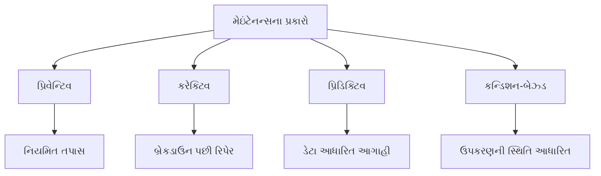

**મેમરી ટ્રીક:** "PCPC: પ્રિવેન્ટ, કરેક્ટ, પ્રિડિક્ટ, કન્ડિશન"

## પ્રશ્ન 1(ક) [7 ગુણ]

**વોશીંગ મશીનના મેઇંટેનન્સ અને ટ્રબલશૂટીંગ ની પ્રક્રિયા સમજાવો.**

**જવાબ**:

**Table: વોશીંગ મશીન મેઇંટેનન્સ અને ટ્રબલશૂટિંગ**

| સમસ્યા | સંભવિત કારણ | ટ્રબલશૂટિંગ સ્ટેપ્સ |
|---------|---------------|----------------------|
| **મશીન ચાલુ ન થવું** | પાવર સમસ્યા, ડોર લોક | પાવર સપ્લાય તપાસો, ડોર બરાબર બંધ છે તે ખાતરી કરો |
| **પાણી ન ભરાવું** | પાણીનો પુરવઠો, ઇનલેટ વાલ્વ | પાણીના નળ તપાસો, ઇનલેટ હોઝમાં બ્લોક તપાસો |
| **પાણી ન નીકળવું** | બ્લોક થયેલ ફિલ્ટર, ડ્રેન પંપ | ફિલ્ટર સાફ કરો, ડ્રેન હોઝ વળાંક માટે તપાસો |
| **વધુ વાઇબ્રેશન** | અસંતુલિત લોડ, શિપિંગ બોલ્ટ્સ | કપડાં પુનઃવિતરિત કરો, શિપિંગ બોલ્ટ્સ દૂર કર્યા છે તે તપાસો |
| **પાણી લીકેજ** | ક્ષતિગ્રસ્ત હોઝ, ઢીલા કનેક્શન | કનેક્શન તપાસો અને કસો, ક્ષતિગ્રસ્ત હોઝ બદલો |

**નિયમિત મેઇંટેનન્સ:**

- **માસિક**: ડિટરજન્ટ ડ્રોઅર અને ડોર સીલ સાફ કરો
- **ત્રિમાસિક**: ખાલી ગરમ સાયકલ વિનેગર/ક્લીનર સાથે ચલાવો
- **અર્ધવાર્ષિક**: હોઝમાં તિરાડો તપાસો, ફિલ્ટર સાફ કરો

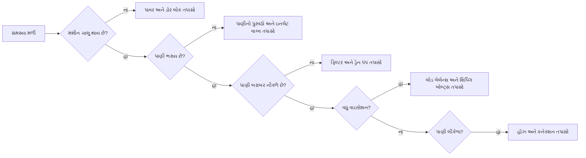

**મેમરી ટ્રીક:** "POWER: પાવર, ઑબ્ઝર્વ, વોટર, એક્ઝામિન, રિપેર"

## પ્રશ્ન 1(ક OR) [7 ગુણ]

**ડીજીટલ ટીવી ના મેઇંટેનન્સ અને ટ્રબલશૂટીંગ ની પ્રક્રિયા સમજાવો.**

**જવાબ**:

**Table: ડિજિટલ ટીવી મેઇંટેનન્સ અને ટ્રબલશૂટિંગ**

| સમસ્યા | સંભવિત કારણ | ટ્રબલશૂટિંગ સ્ટેપ્સ |
|---------|---------------|----------------------|
| **પાવર ન આવવો** | પાવર સપ્લાય સમસ્યા | પાવર કોર્ડ, વોલ આઉટલેટ તપાસો, જુદા સોકેટમાં પ્રયાસ કરો |
| **ચિત્ર ન દેખાવું** | ઇનપુટ/સોર્સ પસંદગી | યોગ્ય ઇનપુટ પસંદ કર્યું છે તે તપાસો, સોર્સ ઉપકરણ તપાસો |
| **નબળું રિસેપ્શન** | એન્ટેના/કેબલ સમસ્યા | કેબલ કનેક્શન તપાસો, એન્ટેના સ્થિતિ બદલો |
| **વિકૃત રંગો** | ડિસ્પ્લે સેટિંગ્સ | પિક્ચર સેટિંગ્સ ડિફોલ્ટ પર રીસેટ કરો |
| **રિમોટ કામ ન કરવું** | બેટરી સમસ્યા, સેન્સર બ્લોક | બેટરી બદલો, IR સેન્સર બ્લોક નથી તેની ખાતરી કરો |

**નિયમિત મેઇંટેનન્સ:**

- **સાપ્તાહિક**: માઇક્રોફાઇબર કપડાથી સ્ક્રીન સાવચેતીથી સાફ કરો
- **માસિક**: કેબલ કનેક્શન તપાસો અને કસો
- **વાર્ષિક**: જો ઉપલબ્ધ હોય તો ફર્મવેર અપડેટ કરો

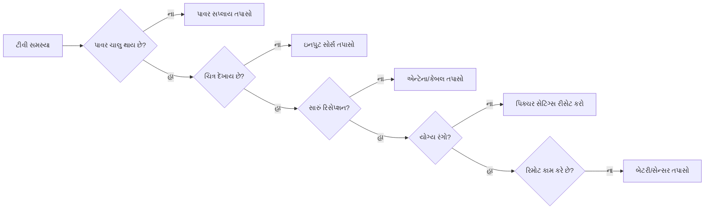

**મેમરી ટ્રીક:** "SPIRE: સપ્લાય, પિક્ચર, ઇનપુટ, રિસેપ્શન, ઇલેક્ટ્રોનિક્સ"

## પ્રશ્ન 2(અ) [3 ગુણ]

**વ્યાખ્યા આપો: (૧) બ્રાઈટનેસ (૨) લ્યુમિનેન્સ (3) ક્રોમિનેન્સ**

**જવાબ**:

**Table: ટીવી ડિસ્પ્લે ટર્મ્સ**

| પદ | વ્યાખ્યા | માપન એકમ |
|------|------------|-------------|
| **બ્રાઈટનેસ** | ડિસ્પ્લેમાંથી પ્રકાશની તીવ્રતાનું અનુભવાતું મૂલ્ય | સબ્જેક્ટિવ પર્સેપ્શન (નિટ્સ) |
| **લ્યુમિનેન્સ** | પ્રતિ એકમ ક્ષેત્રફળ માટે પ્રકાશની તીવ્રતાનું ઓબ્જેક્ટિવ માપન | કેન્ડેલા પ્રતિ ચોરસ મીટર (cd/m²) |
| **ક્રોમિનેન્સ** | વિડિઓ સિગ્નલમાં બ્રાઈટનેસથી સ્વતંત્ર રંગ માહિતી | U અને V કોમ્પોનન્ટ્સ |

**મેમરી ટ્રીક:** "BLC: બ્રાઈટનેસ એટલે પ્રકાશ અનુભવ, લ્યુમિનેન્સ એટલે ગણિત પ્રકાશ, ક્રોમિનેન્સ એટલે રંગ માહિતી"

## પ્રશ્ન 2(બ) [4 ગુણ]

**ડીટીએચ રિસિવર નો બ્લોક ડાયેગ્રામ દોરો અને સમજાવો.**

**જવાબ**:

**DTH રિસિવર બ્લોક ડાયાગ્રામ:**

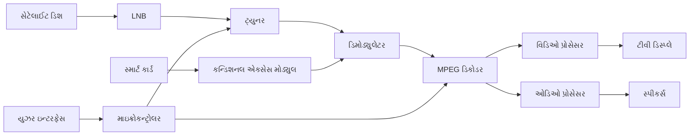

**Table: DTH રિસિવર કોમ્પોનન્ટ્સ**

| કોમ્પોનન્ટ | કાર્ય |
|-----------|----------|
| **સેટેલાઈટ ડિશ** | અવકાશમાંથી સેટેલાઈટ સિગ્નલ્સ મેળવે છે |
| **LNB (લો નોઈઝ બ્લોક)** | ઉચ્ચ-આવૃત્તિના સિગ્નલ્સને નીચી આવૃત્તિમાં પરિવર્તિત કરે છે |
| **ટ્યુનર** | ચોક્કસ ચેનલ ફ્રિક્વન્સી પસંદ કરે છે |
| **ડિમોડ્યુલેટર** | કેરિયર સિગ્નલમાંથી ડિજિટલ ડેટા કાઢે છે |
| **MPEG ડિકોડર** | ઓડિઓ/વિડિઓ ડેટા ડિકમ્પ્રેસ કરે છે |
| **કન્ડિશનલ એક્સેસ મોડ્યુલ** | સબ્સ્ક્રિપ્શન એક્સેસ નિયંત્રિત કરે છે |

**મેમરી ટ્રીક:** "SLTDM: સેટેલાઈટ કેપ્ચર કરે, LNB કન્વર્ટ કરે, ટ્યુનર સિલેક્ટ કરે, ડિમોડ્યુલેટર એક્સટ્રેક્ટ કરે, MPEG ડિકોડ કરે"

## પ્રશ્ન 2(ક) [7 ગુણ]

**કલર ટીવી રિસિવર નો બ્લોક ડાયેગ્રામ દોરો અને સમજાવો.**

**જવાબ**:

**કલર ટીવી રિસિવર બ્લોક ડાયાગ્રામ:**

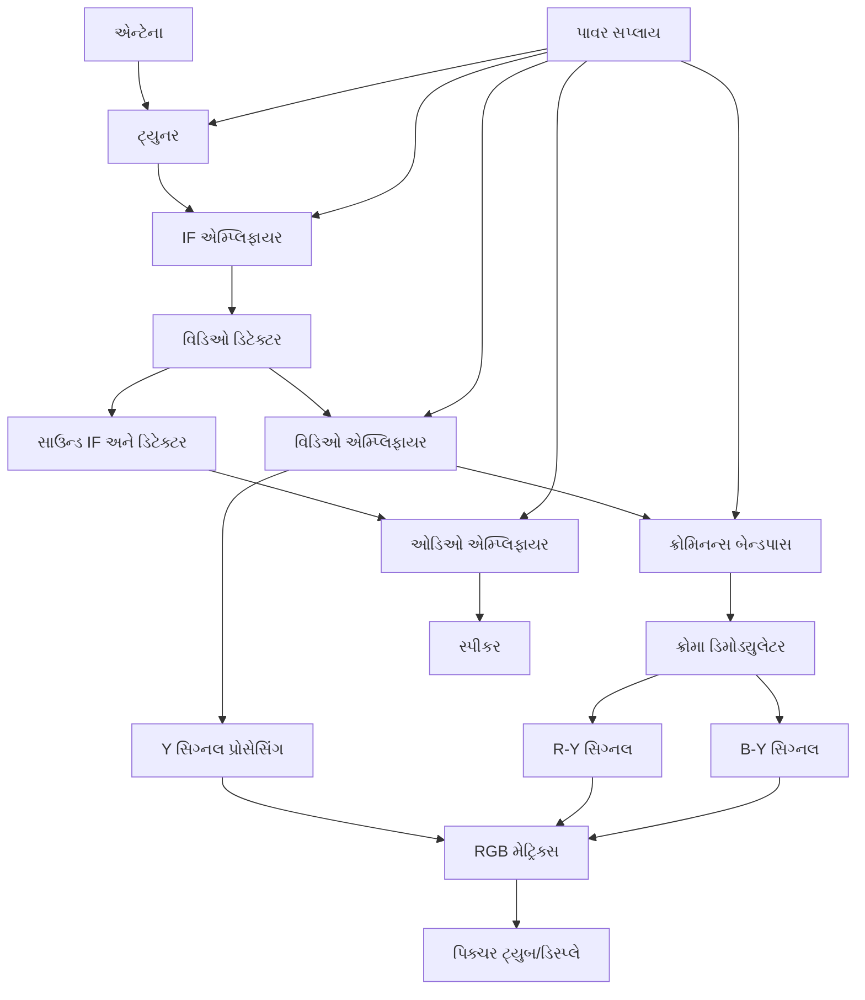

**Table: કલર ટીવી કોમ્પોનન્ટ્સ અને ફંક્શન્સ**

| સેક્શન | ફંક્શન | મુખ્ય કોમ્પોનન્ટ્સ |
|---------|----------|----------------|
| **ટ્યુનર** | ઇચ્છિત ચેનલ પસંદ કરે છે | RF એમ્પ્લિફાયર, મિક્સર, લોકલ ઓસિલેટર |
| **IF એમ્પ્લિફાયર** | ઇન્ટરમીડિયેટ ફ્રિક્વન્સી એમ્પ્લિફાય કરે છે | બેન્ડપાસ ફિલ્ટર્સ, એમ્પ્લિફાયર્સ |
| **વિડિઓ ડિટેક્ટર** | વિડિઓ સિગ્નલ એક્સટ્રેક્ટ કરે છે | ડાયોડ ડિટેક્ટર, ફિલ્ટર્સ |
| **ક્રોમિનન્સ સેક્શન** | રંગ માહિતી પ્રોસેસ કરે છે | બેન્ડપાસ ફિલ્ટર, કલર ડિમોડ્યુલેટર |
| **લ્યુમિનન્સ સેક્શન** | બ્રાઈટનેસ માહિતી પ્રોસેસ કરે છે | Y સિગ્નલ એમ્પ્લિફાયર |
| **RGB મેટ્રિક્સ** | ડિસ્પ્લે માટે સિગ્નલ્સ ભેગા કરે છે | મિક્સિંગ સર્કિટ્સ |
| **ઓડિઓ સેક્શન** | અવાજ પ્રોસેસ કરે છે | સાઉન્ડ IF, ડિટેક્ટર, એમ્પ્લિફાયર |

**મેમરી ટ્રીક:** "TIVACRL: ટ્યુનર ટ્યુન કરે, IF એમ્પ્લિફાય કરે, વિડિઓ ડિટેક્ટ કરે, ઓડિઓ અલગ કરે, ક્રોમિનન્સ ડિમોડ્યુલેટ કરે, RGB મિક્સ કરે, લાઈટ ડિસ્પ્લે કરે"

## પ્રશ્ન 2(અ OR) [3 ગુણ]

**એલઇડી ટીવી પર ટૂંકનોંધ લખો.**

**જવાબ**:

**Table: LED ટીવી ટેક્નોલોજી**

| પાસું | વર્ણન |
|--------|-------------|
| **મૂળભૂત ટેક્નોલોજી** | ડિસ્પ્લે બેકલાઈટિંગ માટે લાઈટ એમિટિંગ ડાયોડ્સનો ઉપયોગ કરે છે |
| **પ્રકારો** | એજ-લિટ (કિનારે LED), ડાયરેક્ટ-લિટ (સ્ક્રીન પાછળ LED), ફુલ-એરે (લોકલ ડિમિંગ સાથે) |
| **ફાયદા** | પાતળી પ્રોફાઇલ, ઊર્જા કાર્યક્ષમ, વધુ સારો કોન્ટ્રાસ્ટ રેશિયો, LCD કરતાં લાંબો જીવનકાળ |
| **ડિસ્પ્લે પેનલ** | હજુ પણ LCD પેનલનો ઉપયોગ કરે છે; LED ફક્ત બેકલાઈટિંગ માટે છે |

**મેમરી ટ્રીક:** "BEST: બેકલાઈટિંગ LED સાથે, એનર્જી અસરકારક, સ્લિમ ડિઝાઇન, ટ્રુ કલર્સ"

## પ્રશ્ન 2(બ OR) [4 ગુણ]

**પદો ટૂંક મા સમજાવો: (૧)હ્યુ (૨) સેચ્યુરેશન**

**જવાબ**:

**Table: રંગ ગુણધર્મો**

| પદ | વ્યાખ્યા | રેન્જ | ઉદાહરણ |
|------|------------|-------|---------|
| **હ્યુ** | વાસ્તવિક રંગ તરંગ લંબાઈ (લાલ, વાદળી, લીલો, વગેરે) | કલર વ્હીલ પર 0-360 ડિગ્રી | લાલ=0°, લીલો=120°, વાદળી=240° |
| **સેચ્યુરેશન** | રંગની તીવ્રતા અથવા શુદ્ધતા (કેટલો જીવંત) | 0-100% (ગ્રે થી શુદ્ધ રંગ) | 0%=ગ્રેસ્કેલ, 100%=જીવંત રંગ |

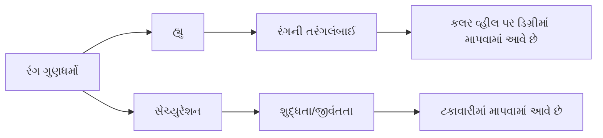

**મેમરી ટ્રીક:** "HS: હ્યુ એટલે રંગનો શેડ, સેચ્યુરેશન એટલે રંગની સ્ટ્રેન્થ"

## પ્રશ્ન 2(ક OR) [7 ગુણ]

**કલર સર્કલ ડાયેગ્રામ અને ગ્રાસમેનના નિયમ ની મદદ થી એડીટીવ કલર મિક્સિંગ સમજાવો.**

**જવાબ**:

**Table: એડિટિવ કલર મિક્સિંગ પ્રિન્સિપલ્સ**

| રંગનું સંયોજન | પરિણામ | RGB મૂલ્ય |
|-------------------|--------|-----------|
| **લાલ + લીલો** | પીળો | (255,255,0) |
| **લીલો + વાદળી** | સિયાન | (0,255,255) |
| **વાદળી + લાલ** | મેજેન્ટા | (255,0,255) |
| **લાલ + લીલો + વાદળી** | સફેદ | (255,255,255) |
| **કોઈ રંગ નહીં** | કાળો | (0,0,0) |

**ગ્રાસમેનના નિયમો:**

- **નિયમ 1**: કોઈપણ રંગ ત્રણ પ્રાથમિક રંગો મિશ્ર કરીને બનાવી શકાય છે
- **નિયમ 2**: રંગનો દેખાવ માત્ર તેના ટ્રિસ્ટિમ્યુલસ મૂલ્યો પર આધારિત છે
- **નિયમ 3**: એડિટિવ મિક્સિંગમાં, ટ્રિસ્ટિમ્યુલસ મૂલ્યો એકસાથે ઉમેરાય છે

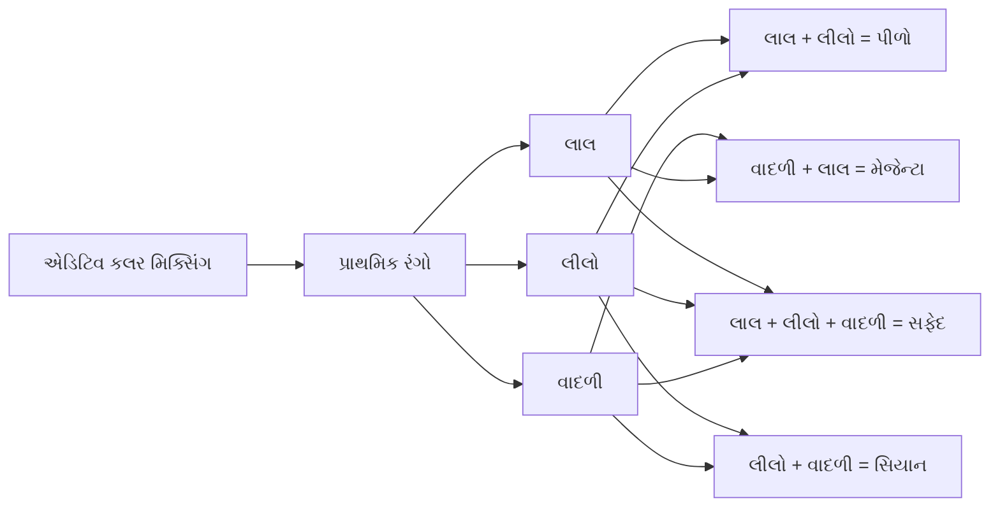

**કલર સર્કલ ડાયાગ્રામ:**

```goat
    Yellow
      /\
     /  \
    /    \
Red ------Green
    \    /
     \  /
      \/
   Magenta----Cyan
       \    /
        \  /
         \/
        Blue
```

**મેમરી ટ્રીક:** "RGB-CMY-W: લાલ, લીલો, વાદળી, સિયાન, મેજેન્ટા, પીળો, અને સફેદ બનાવે છે"

## પ્રશ્ન 3(અ) [3 ગુણ]

**માઇક્રોવેવ ઓવન માટે વાયરિંગ અને સેફ્ટી ઇંસ્ટ્રક્શન લખો.**

**જવાબ**:

**Table: માઇક્રોવેવ ઓવન વાયરિંગ અને સેફ્ટી ઇન્સ્ટ્રક્શન્સ**

| કેટેગરી | સૂચનાઓ |
|----------|--------------|
| **વાયરિંગ** | 15-20A સર્કિટ સાથે ગ્રાઉન્ડેડ આઉટલેટનો ઉપયોગ કરો |
| **પાવર** | વોલ્ટેજ રેટિંગ સાથે મેળ ખાય તેની ખાતરી કરો (સામાન્ય રીતે 220-240V) |
| **ઇન્સ્ટોલેશન** | વેન્ટિલેશન માટે તમામ બાજુએ 5 સેમી જગ્યા રાખો |
| **સેફ્ટી** | ક્યારેય ખાલી ન ચલાવો, ક્યારેય ડોર ઇન્ટરલોક્સ બાયપાસ ન કરો |
| **મેઇંટેનન્સ** | સર્વિસિંગ પહેલાં પાવર ડિસ્કનેક્ટ કરો, કેપેસિટર ડિસ્ચાર્જ કરો |

**મેમરી ટ્રીક:** "POWER: પ્રોપર આઉટલેટ, વાયરિંગ ચેક, એમ્પ્ટી ઓપરેશન અવોઇડેડ, રિપેર્સ બાય પ્રોફેશનલ્સ"

## પ્રશ્ન 3(બ) [4 ગુણ]

**એર કંડીશનર ની કાર્યપધ્ધતિ સમજાવો.**

**જવાબ**:

**Table: એર કન્ડિશનર વર્કિંગ સાયકલ**

| કોમ્પોનન્ટ | ફંક્શન | પ્રક્રિયા |
|-----------|----------|---------|
| **કમ્પ્રેસર** | રેફ્રિજરન્ટ પ્રેશરાઇઝ કરે છે | ઓછા દબાણવાળી ગેસને ઉચ્ચ દબાણવાળી ગેસમાં પરિવર્તિત કરે છે |
| **કન્ડેન્સર** | બહાર ગરમી છોડે છે | ગેસને પ્રવાહીમાં પરિવર્તિત કરે છે, ગરમી કાઢે છે |
| **એક્સપાન્શન વાલ્વ** | રેફ્રિજરન્ટનો પ્રવાહ નિયંત્રિત કરે છે | પ્રવાહીનું દબાણ ઘટાડે છે |
| **ઇવેપોરેટર** | રૂમમાંથી ગરમી શોષે છે | પ્રવાહીને ગેસમાં પરિવર્તિત કરે છે, હવા ઠંડી કરે છે |
| **થર્મોસ્ટેટ** | તાપમાન નિયંત્રિત કરે છે | કમ્પ્રેસર ઓપરેશન રેગ્યુલેટ કરે છે |

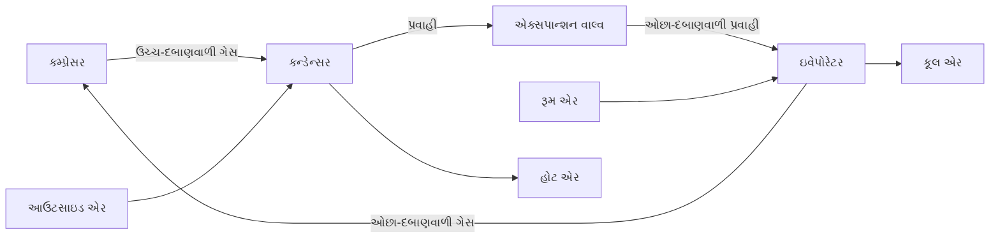

**મેમરી ટ્રીક:** "CELT: કમ્પ્રેસ ગેસ, એક્સપેલ હીટ, લોઅર પ્રેશર, ટેક ઇન હીટ"

## પ્રશ્ન 3(ક) [7 ગુણ]

**વોશિંગ મશીન માટે ઇલેક્ટ્રોનિક કંટ્રોલર અને ફજી લોજીક વોશિંગ મશીન સમજાવો. વોશિંગ મશીન ના ટેકનીકલ સ્પેસીફીકેશનો પણ લખો.**

**જવાબ**:

**Table: વોશિંગ મશીનમાં ઇલેક્ટ્રોનિક કંટ્રોલર**

| કોમ્પોનન્ટ | ફંક્શન |
|-----------|----------|
| **માઇક્રોકંટ્રોલર** | બધા ઓપરેશન્સ નિયંત્રિત કરતું સેન્ટ્રલ પ્રોસેસિંગ યુનિટ |
| **સેન્સર્સ** | વોટર લેવલ, તાપમાન, લોડ બેલેન્સ, ડોર સ્ટેટસ ડિટેક્ટ કરે છે |
| **ઇનપુટ ઇન્ટરફેસ** | પ્રોગ્રામ પસંદગી માટે બટન/ટચ પેનલ |
| **ડિસ્પ્લે** | પ્રોગ્રામ સ્ટેટસ, બાકી સમય, એરર કોડ્સ બતાવે છે |
| **એક્ચ્યુએટર ડ્રાઇવર્સ** | મોટર, વાલ્વ, હીટર, પંપ નિયંત્રિત કરે છે |

**ફજી લોજિક વોશિંગ મશીન:**

- શ્રેષ્ઠ વોશિંગ માટે આર્ટિફિશિયલ ઇન્ટેલિજન્સનો ઉપયોગ કરે છે
- લોડના આધારે વોટર લેવલ, વોશ ટાઇમ અને સ્પિન સ્પીડ એડજસ્ટ કરે છે
- ચોક્કસ મૂલ્યોને બદલે અંદાજિત તર્ક વડે નિર્ણયો લે છે
- વિવિધ ફેબ્રિક પ્રકારો અને મેલના સ્તરો સાથે આપોઆપ અનુકૂલન કરે છે

**ટેકનિકલ સ્પેસિફિકેશન્સ:**

- **ક્ષમતા**: 6-10 કિલો (ફ્રન્ટ લોડ), 5-8 કિલો (ટોપ લોડ)
- **એનર્જી રેટિંગ**: A+++ થી B (EU સ્ટાન્ડર્ડ)
- **વોટર કન્ઝમ્પશન**: સાયકલ દીઠ 40-70 લિટર
- **સ્પિન સ્પીડ**: 800-1600 RPM
- **સાયકલ ઓપ્શન્સ**: 8-16 પ્રોગ્રામ્સ

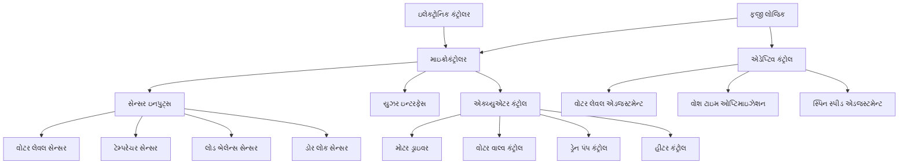

**મેમરી ટ્રીક:** "SCRAM: સેન્સર્સ ડિટેક્ટ, કંટ્રોલર પ્રોસેસ, રૂલ્સ એપ્લાઇડ, એક્ચ્યુએટર્સ ઓપરેટ, મશીન એડેપ્ટ"

## પ્રશ્ન 3(અ OR) [3 ગુણ]

**સોલર પાવર સીસ્ટમના મેઇન કોમ્પોનન્ટો અને સોલર પાવર સીસ્ટમના સ્પેસીફીકેશનો લખો.**

**જવાબ**:

**Table: સોલર પાવર સિસ્ટમ કોમ્પોનન્ટ્સ**

| કોમ્પોનન્ટ | ફંક્શન |
|-----------|----------|
| **સોલર પેનલ્સ** | સૂર્યપ્રકાશને DC વીજળીમાં રૂપાંતરિત કરે છે |
| **ઇન્વર્ટર** | DC પાવરને AC પાવરમાં રૂપાંતરિત કરે છે |
| **બેટરી બેંક** | પછીના ઉપયોગ માટે ઊર્જા સંગ્રહિત કરે છે |
| **ચાર્જ કંટ્રોલર** | બેટરીના ઓવરચાર્જિંગને અટકાવે છે |
| **માઉન્ટિંગ સ્ટ્રક્ચર** | પેનલોને ટેકો આપે છે અને શ્રેષ્ઠ રીતે એંગલ કરે છે |

**સ્પેસિફિકેશન્સ:**

- **પેનલ કેપેસિટી**: પેનલ દીઠ 250-400 વોટ
- **સિસ્ટમ સાઇઝ**: 1-10 kW (રહેણાંક)
- **બેટરી કેપેસિટી**: 100-200 Ah
- **ઇન્વર્ટર એફિશિયન્સી**: 90-97%
- **અપેક્ષિત જીવનકાળ**: 25-30 વર્ષ (પેનલ)

**મેમરી ટ્રીક:** "PIBCM: પેનલ કલેક્ટ, ઇન્વર્ટર કન્વર્ટ, બેટરી સ્ટોર, કંટ્રોલર પ્રોટેક્ટ, માઉન્ટ્સ સપોર્ટ"

## પ્રશ્ન 3(બ OR) [4 ગુણ]

**રેફ્રીજરેટર ની કાર્યપધ્ધતિ સમજાવો.**

**જવાબ**:

**Table: રેફ્રિજરેટર વર્કિંગ સાયકલ**

| સ્ટેજ | પ્રક્રિયા | કોમ્પોનન્ટ | રેફ્રિજરન્ટની સ્થિતિ |
|-------|---------|-----------|----------------------|
| 1 | કમ્પ્રેશન | કમ્પ્રેસર | ઓછા દબાણવાળી ગેસ → ઉચ્ચ દબાણવાળી ગેસ |
| 2 | કન્ડેન્સેશન | કન્ડેન્સર કોઇલ્સ | ઉચ્ચ દબાણવાળી ગેસ → ઉચ્ચ દબાણવાળી પ્રવાહી |
| 3 | એક્સપાન્શન | એક્સપાન્શન વાલ્વ | ઉચ્ચ દબાણવાળી પ્રવાહી → ઓછા દબાણવાળી પ્રવાહી |
| 4 | ઇવેપોરેશન | ઇવેપોરેટર કોઇલ્સ | ઓછા દબાણવાળી પ્રવાહી → ઓછા દબાણવાળી ગેસ |

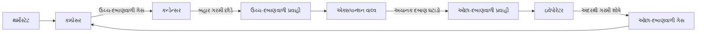

**મેમરી ટ્રીક:** "CEHE: કમ્પ્રેસ ગેસ, એક્સપેલ હીટ, હાલ્વ પ્રેશર, એક્સટ્રેક્ટ હીટ"

## પ્રશ્ન 3(ક OR) [7 ગુણ]

**માઇક્રોવેવ ઓવન નો બ્લોક ડાયેગ્રામ દોરો અને સમજાવો. માઇક્રોવેવ ઓવન ના પ્રકારો, એપ્લીકેશનો અને ટેકનીકલ સ્પેસીફીકેશનો લખો.**

**જવાબ**:

**માઇક્રોવેવ ઓવન બ્લોક ડાયાગ્રામ:**

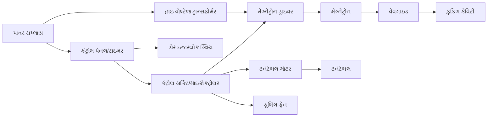

**માઇક્રોવેવ ઓવનના પ્રકારો:**

- **સોલો**: ફક્ત બેઝિક હીટિંગ અને ડિફ્રોસ્ટિંગ
- **ગ્રિલ**: વધારાના ગ્રિલિંગ એલિમેન્ટ સાથે
- **કન્વેક્શન**: માઇક્રોવેવ સાથે કન્વેક્શન હીટિંગ
- **ઓવર-ધ-રેન્જ (OTR)**: વેન્ટિલેશન સિસ્ટમ સાથે
- **બિલ્ટ-ઇન**: કેબિનેટ ઇન્સ્ટોલેશન માટે ડિઝાઇન કરેલ

**એપ્લિકેશન્સ:**

- **કુકિંગ**: ઝડપી ભોજન તૈયારી
- **રિહીટિંગ**: બચેલા ખોરાક
- **ડિફ્રોસ્ટિંગ**: ફ્રોઝન ફૂડ
- **સ્ટેરિલાઇઝેશન**: નાની વસ્તુઓ
- **કોમર્શિયલ**: ફૂડ સર્વિસ ઇન્ડસ્ટ્રી

**ટેકનિકલ સ્પેસિફિકેશન્સ:**

- **કેપેસિટી**: 20-40 લિટર
- **પાવર આઉટપુટ**: 700-1200 વોટ
- **પાવર કન્ઝમ્પશન**: 1100-1500 વોટ
- **ફ્રિક્વન્સી**: 2.45 GHz
- **વોલ્ટેજ**: 220-240V AC

**મેમરી ટ્રીક:** "MICROWAVES: મેગ્નેટ્રોન જનરેટ કરે, ઇન્ટીરિયર રિસીવ કરે, કંટ્રોલ રેગ્યુલેટ કરે, રોટેટિંગ ટર્નટેબલ, ઓવન કેવિટી, વેવગાઇડ ડાયરેક્ટ કરે, AC પાવર આપે, વેન્ટિલેશન કૂલ કરે, ઇલેક્ટ્રોનિક ટાઇમર, સેફ્ટી ઇન્ટરલોક્સ"

## પ્રશ્ન 4(અ) [3 ગુણ]

**એમએફ પ્રિંટર અને એલસીડી પ્રોજેક્ટર ના સ્પેસીફીકેશનો લખો.**

**જવાબ**:

**Table: મલ્ટી-ફંક્શન પ્રિંટર સ્પેસિફિકેશન્સ**

| સ્પેસિફિકેશન | સામાન્ય રેન્જ |
|---------------|---------------|
| **પ્રિન્ટ રિઝોલ્યુશન** | 600-4800 dpi |
| **પ્રિન્ટ સ્પીડ** | 20-40 ppm (બ્લેક), 15-30 ppm (કલર) |
| **સ્કેન રિઝોલ્યુશન** | 600-1200 dpi |
| **કનેક્ટિવિટી** | Wi-Fi, ઇથરનેટ, USB, ક્લાઉડ |
| **પેપર કેપેસિટી** | 100-500 શીટ્સ |

**Table: LCD પ્રોજેક્ટર સ્પેસિફિકેશન્સ**

| સ્પેસિફિકેશન | સામાન્ય રેન્જ |
|---------------|---------------|
| **બ્રાઈટનેસ** | 2000-5000 લુમેન્સ |
| **રિઝોલ્યુશન** | XGA (1024×768) થી 4K (3840×2160) |
| **કોન્ટ્રાસ્ટ રેશિયો** | 2000:1 થી 100,000:1 |
| **લેમ્પ લાઇફ** | 4000-8000 કલાક |
| **કનેક્ટિવિટી** | HDMI, VGA, USB, વાયરલેસ |

**મેમરી ટ્રીક:** "PSCPL: પ્રિન્ટ રિઝોલ્યુશન, સ્પીડ, કનેક્ટિવિટી, પ્રોજેક્શન બ્રાઈટનેસ, લેમ્પ લાઇફ"

## પ્રશ્ન 4(બ) [4 ગુણ]

**ઇન્કજેટ પ્રિંટર નો બ્લોક ડાયેગ્રામ દોરો અને તેની કાર્યપધ્ધતિ ટૂંક મા સમજાવો**

**જવાબ**:

**ઇન્કજેટ પ્રિંટર બ્લોક ડાયાગ્રામ:**

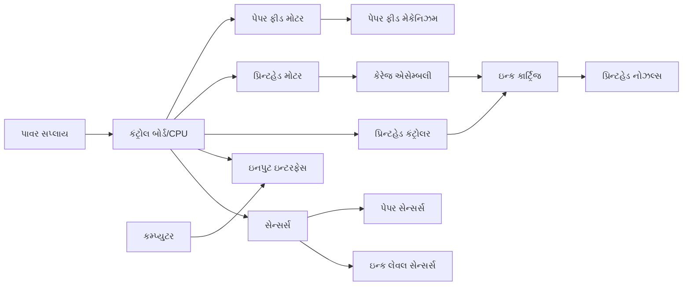

**ઇન્કજેટ પ્રિંટરની કાર્યપદ્ધતિ:**

1. **ડોક્યુમેન્ટ પ્રોસેસિંગ**: કંટ્રોલ બોર્ડ ડેટા મેળવે છે અને પ્રિન્ટર કમાન્ડમાં રૂપાંતરિત કરે છે
2. **પેપર લોડિંગ**: ફીડ મોટર ટ્રેમાંથી પેપર ખેંચે છે
3. **પ્રિન્ટિંગ**: પ્રિન્ટહેડ પેપર પર ચાલે છે અને નાના ઇન્ક ડ્રોપલેટ્સ છોડે છે
4. **ડ્રોપલેટ ફોર્મેશન**: થર્મલ અથવા પિઝોઇલેક્ટ્રિક પદ્ધતિ દ્વારા ઇન્ક ડ્રોપલેટ્સને પેપર પર મોકલે છે
5. **પેપર એડવાન્સમેન્ટ**: પ્રિન્ટિંગ પૂર્ણ થાય ત્યાં સુધી પેપર લાઇન બાય લાઇન આગળ વધે છે

**મેમરી ટ્રીક:** "PIPES: પેપર ફીડ્સ, ઇન્ક ઇજેક્ટ્સ, પ્રિન્ટહેડ મૂવ્સ, ઇલેક્ટ્રોનિક કંટ્રોલ, શીટ એડવાન્સીસ"

## પ્રશ્ન 4(ક) [7 ગુણ]

**ફોટોકોપીયર ની કાર્યપધ્ધતિ બ્લોક ડાયેગ્રામ સાથે સમજાવો અને તેના ટેકનીકલ સ્પેસીફીકેશનો લખો.**

**જવાબ**:

**ફોટોકોપીયર બ્લોક ડાયાગ્રામ:**

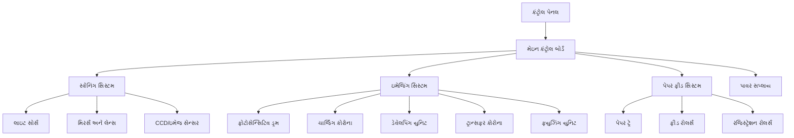

**ફોટોકોપીયરની કાર્યપદ્ધતિ:**

1. **ચાર્જિંગ**: ફોટોસેન્સિટિવ ડ્રમને યુનિફોર્મ ઇલેક્ટ્રોસ્ટેટિક ચાર્જ આપવામાં આવે છે
2. **એક્સપોઝર**: ઓરિજિનલ ડોક્યુમેન્ટ સ્કેન થાય છે, ડ્રમ પર પ્રકાશ પેટર્ન બનાવે છે
3. **ડેવેલપિંગ**: ટોનર કણો ડ્રમ પર ચાર્જ કરેલા ક્ષેત્રો તરફ આકર્ષાય છે
4. **ટ્રાન્સફર**: ટોનર ઇમેજ ડ્રમ પરથી પેપર પર ટ્રાન્સફર થાય છે
5. **ફ્યુઝિંગ**: હીટ અને પ્રેશરથી ટોનર કાયમી રીતે પેપર પર ફિક્સ થાય છે
6. **ક્લીનિંગ**: આગલા સાયકલ માટે ડ્રમ સાફ કરવામાં આવે છે

**ટેકનિકલ સ્પેસિફિકેશન્સ:**

- **સ્પીડ**: 20-60 પેજ પ્રતિ મિનિટ
- **રિઝોલ્યુશન**: 600-1200 dpi
- **પેપર કેપેસિટી**: 250-2000 શીટ્સ
- **મેક્સિમમ પેપર સાઇઝ**: A3/11×17 ઇંચ
- **ઝૂમ રેન્જ**: 25-400%
- **મેમરી**: 512MB-2GB
- **કનેક્ટિવિટી**: ઇથરનેટ, USB, Wi-Fi

**મેમરી ટ્રીક:** "CETFC: ચાર્જ ડ્રમ, એક્સપોઝ ઇમેજ, ટ્રાન્સફર ટોનર, ફ્યુઝ પર્મેનન્ટલી, ક્લીન ડ્રમ"

## પ્રશ્ન 4(અ OR) [3 ગુણ]

**CCTV ઉપર ટૂંક નોંધ લખો.**

**જવાબ**:

**Table: CCTV સિસ્ટમ ઓવરવ્યુ**

| પાસું | વર્ણન |
|--------|-------------|
| **ફુલ ફોર્મ** | ક્લોઝ્ડ-સર્કિટ ટેલિવિઝન |
| **હેતુ** | સિક્યુરિટી મોનિટરિંગ અને સર્વેલન્સ |
| **કોમ્પોનન્ટ્સ** | કેમેરા, DVR/NVR, મોનિટર્સ, કેબલ્સ, પાવર સપ્લાય |
| **પ્રકારો** | એનાલોગ, IP (ડિજિટલ), વાયરલેસ, HD-CVI/TVI/SDI |
| **ફીચર્સ** | મોશન ડિટેક્શન, નાઇટ વિઝન, રિમોટ વ્યુઇંગ |

**કી એપ્લિકેશન્સ:**

- બિલ્ડિંગ્સનું સિક્યુરિટી મોનિટરિંગ
- ટ્રાફિક મોનિટરિંગ
- રિટેલ લોસ પ્રિવેન્શન
- પબ્લિક એરિયા સર્વેલન્સ
- હોમ સિક્યુરિટી

**મેમરી ટ્રીક:** "SCRAM: સિક્યુરિટી મોનિટરિંગ, ક્લોઝ્ડ સર્કિટ, રેકોર્ડિંગ ફુટેજ, એક્સેસ રેસ્ટ્રિક્ટેડ, મોનિટરિંગ કન્ટિન્યુઅસ"

## પ્રશ્ન 4(બ OR) [4 ગુણ]

**એલસીડી પ્રોજેક્ટર ની કાર્યપધ્ધતિ બ્લોક ડાયેગ્રામ સાથે સમજાવો**

**જવાબ**:

**LCD પ્રોજેક્ટર બ્લોક ડાયાગ્રામ:**

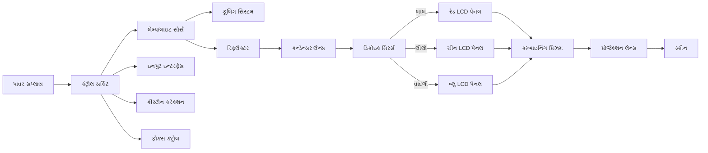

**LCD પ્રોજેક્ટરની કાર્યપદ્ધતિ:**

1. **લાઇટ જનરેશન**: હાઇ-ઇન્ટેન્સિટી લેમ્પ સફેદ પ્રકાશ ઉત્પન્ન કરે છે
2. **કલર સેપરેશન**: ડિક્રોઇક મિરર્સ પ્રકાશને RGB કોમ્પોનન્ટ્સમાં વિભાજિત કરે છે
3. **ઇમેજ ફોર્મેશન**: LCD પેનલ્સ ઇનપુટ સિગ્નલના આધારે પ્રકાશને મોડ્યુલેટ કરે છે
4. **રિકમ્બિનેશન**: પ્રિઝમ RGB ઇમેજને ફુલ-કલર ઇમેજમાં જોડે છે
5. **પ્રોજેક્શન**: લેન્સ સિસ્ટમ અંતિમ ઇમેજને સ્ક્રીન પર પ્રોજેક્ટ કરે છે

**મેમરી ટ્રીક:** "LSCIP: લાઇટ સોર્સ જનરેટ્સ, સ્પ્લિટ ઇન્ટુ કલર્સ, કંટ્રોલ વિથ LCDs, ઇમેજ કંબાઇન્ડ, પ્રોજેક્ટેડ ઓન સ્ક્રીન"

## પ્રશ્ન 4(ક OR) [7 ગુણ]

**લેસર પ્રિંટર ની કાર્યપધ્ધતિ બ્લોક ડાયેગ્રામ સાથે સમજાવો**

**જવાબ**:

**લેસર પ્રિંટર બ્લોક ડાયાગ્રામ:**

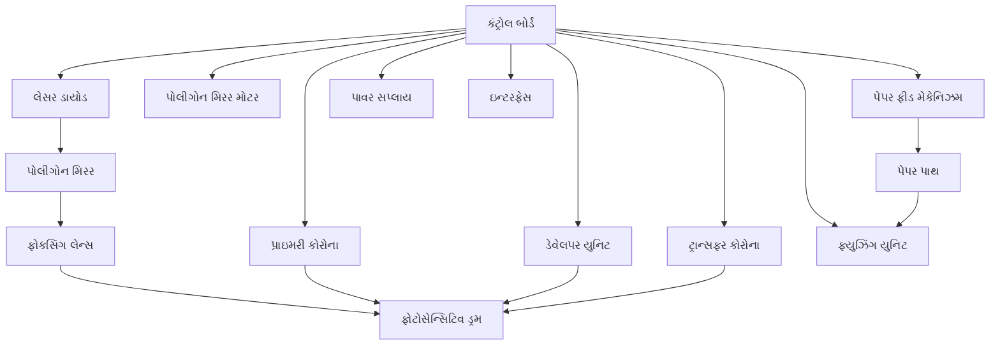

**લેસર પ્રિન્ટિંગ પ્રોસેસ:**

**Table: લેસર પ્રિન્ટિંગના છ સ્ટેપ્સ**

| સ્ટેપ | પ્રક્રિયા | કોમ્પોનન્ટ | ફંક્શન |
|------|---------|-----------|----------|
| 1 | **ક્લીનિંગ** | ક્લીનિંગ બ્લેડ | ડ્રમ પરથી બાકી ટોનર દૂર કરે છે |
| 2 | **ચાર્જિંગ** | પ્રાઇમરી કોરોના | ડ્રમને યુનિફોર્મ નેગેટિવ ચાર્જ આપે છે |
| 3 | **રાઇટિંગ** | લેસર અને મિરર | ડ્રમ પર ઇલેક્ટ્રોસ્ટેટિક ઇમેજ બનાવે છે |
| 4 | **ડેવેલપિંગ** | ડેવેલપર યુનિટ | ડ્રમના ચાર્જ કરેલા ક્ષેત્રોમાં ટોનર લગાવે છે |
| 5 | **ટ્રાન્સફરિંગ** | ટ્રાન્સફર કોરોના | ડ્રમથી પેપર પર ટોનર ખસેડે છે |
| 6 | **ફ્યુઝિંગ** | ફ્યુઝર યુનિટ | ટોનરને કાયમી રીતે પેપર પર પિગળાવે છે |

**ટેકનિકલ સ્પેસિફિકેશન્સ:**

- **પ્રિન્ટ સ્પીડ**: 20-50 ppm
- **રિઝોલ્યુશન**: 600-2400 dpi
- **મેમરી**: 128MB-1GB
- **ડ્યુટી સાયકલ**: 10,000-150,000 પેજ/મહિનો
- **કનેક્ટિવિટી**: USB, ઇથરનેટ, Wi-Fi

**મેમરી ટ્રીક:** "CCWDTF: ક્લીન ડ્રમ, ચાર્જ યુનિફોર્મલી, રાઇટ વિથ લેસર, ડેવેલપ વિથ ટોનર, ટ્રાન્સફર ટુ પેપર, ફ્યુઝ પર્મેનન્ટલી"

## પ્રશ્ન 5(અ) [3 ગુણ]

**વ્યાખ્યા આપો: (૧) પીચ (૨) રીવબર્રેશન (3) માઇક્રોફોન**

**જવાબ**:

**Table: ઓડિઓ ટર્મિનોલોજી**

| પદ | વ્યાખ્યા | માપન એકમ |
|------|------------|-------------|
| **પીચ** | ધ્વનિની અનુભવાતી આવૃત્તિ; ટોન કેટલો ઊંચો કે નીચો લાગે છે | હર્ટ્ઝ (Hz) |
| **રીવબર્રેશન** | સ્ત્રોત બંધ થયા પછી ધ્વનિનું સાતત્ય; પરાવર્તનને કારણે થાય છે | સેકન્ડ (RT60) |
| **માઇક્રોફોન** | ટ્રાન્સડ્યુસર જે ધ્વનિ તરંગોને ઇલેક્ટ્રિકલ સિગ્નલમાં રૂપાંતરિત કરે છે | સેન્સિટિવિટી dB/mV/Pa માં |

**મેમરી ટ્રીક:** "PRM: પીચ એટલે ફ્રિક્વન્સી, રીવબર્રેશન એટલે રિફ્લેક્શન, માઇક્રોફોન એટલે કન્વર્ટર"

## પ્રશ્ન 5(બ) [4 ગુણ]

**પીએ સિસ્ટમનો બ્લોક ડાયેગ્રામ દોરો અને સમજાવો**

**જવાબ**:

**PA સિસ્ટમ બ્લોક ડાયાગ્રામ:**

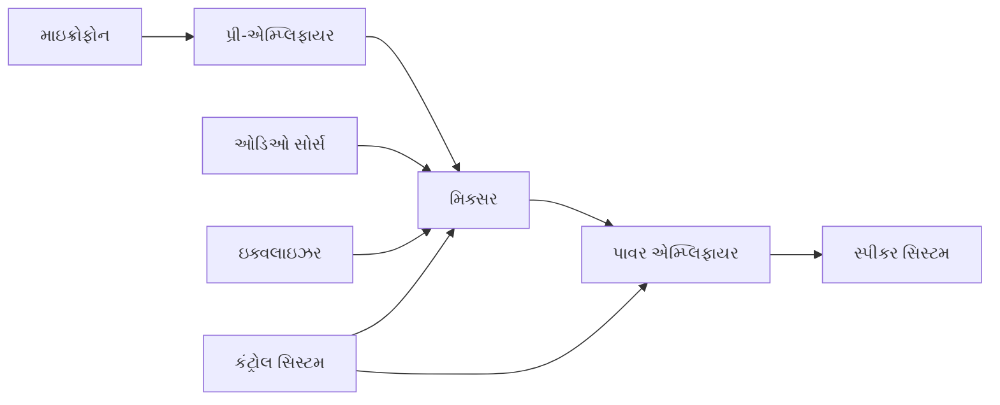

**Table: PA સિસ્ટમ કોમ્પોનન્ટ્સ**

| કોમ્પોનન્ટ | ફંક્શન |
|-----------|----------|
| **માઇક્રોફોન** | અવાજ કેપ્ચર કરે છે અને ઇલેક્ટ્રિકલ સિગ્નલમાં કન્વર્ટ કરે છે |
| **પ્રી-એમ્પ્લિફાયર** | નબળા માઇક્રોફોન સિગ્નલને લાઇન લેવલ સુધી બૂસ્ટ કરે છે |
| **મિક્સર** | મલ્ટિપલ ઓડિઓ સોર્સ કમ્બાઇન કરે છે, લેવલ્સ એડજસ્ટ કરે છે |
| **ઇક્વલાઇઝર** | શ્રેષ્ઠ સાઉન્ડ માટે ફ્રિક્વન્સી રિસ્પોન્સ એડજસ્ટ કરે છે |
| **પાવર એમ્પ્લિફાયર** | સ્પીકર્સને ડ્રાઇવ કરવા માટે સિગ્નલ સ્ટ્રેન્થ વધારે છે |
| **સ્પીકર સિસ્ટમ** | ઇલેક્ટ્રિકલ સિગ્નલને પાછા ધ્વનિ તરંગોમાં કન્વર્ટ કરે છે |

**મેમરી ટ્રીક:** "MPMEPA: માઇક્રોફોન પિક્સ, પ્રીએમ્પ મેગ્નિફાઇઝ, ઇક્વલાઇઝર એડજસ્ટ્સ, પાવર એમ્પ્લિફાયર ડ્રાઇવ્સ, ઓડિયન્સ હિયર્સ"

## પ્રશ્ન 5(ક) [7 ગુણ]

**ક્રિસ્ટલ માઇક્રોફોન સમજાવો.**

**જવાબ**:

**Table: ક્રિસ્ટલ માઇક્રોફોન ખાસિયતો**

| ખાસિયત | વર્ણન |
|----------------|-------------|
| **ઓપરેટિંગ પ્રિન્સિપલ** | પિએઝોઇલેક્ટ્રિક ઇફેક્ટ |
| **રચના** | મેટલ પ્લેટ્સ વચ્ચે ક્રિસ્ટલ એલિમેન્ટ (રોશેલ સોલ્ટ) |
| **રિસ્પોન્સ** | હાઇ આઉટપુટ, મોડરેટ ફ્રિક્વન્સી રિસ્પોન્સ |
| **ઇમ્પીડન્સ** | ખૂબ ઊંચી (સામાન્ય રીતે > 1 MΩ) |
| **ટકાઉપણું** | હીટ અને ભેજ પ્રત્યે સંવેદનશીલ |

**કાર્યપ્રણાલી:**
જ્યારે ધ્વનિ તરંગો ડાયાફ્રામ પર આઘાત કરે છે, ત્યારે તેઓ ક્રિસ્ટલ એલિમેન્ટ પર દબાણ ઉત્પન્ન કરે છે. પિએઝોઇલેક્ટ્રિક અસરને કારણે, ક્રિસ્ટલ મિકેનિકલ સ્ટ્રેસના પ્રમાણમાં વોલ્ટેજ ઉત્પન્ન કરે છે. આ વોલ્ટેજ ધ્વનિનું ઇલેક્ટ્રિકલ પ્રતિનિધિત્વ છે.

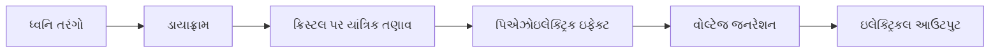

**એપ્લિકેશન્સ:**

- ટેલિફોન રિસીવર્સ
- એકુસ્ટિક ઇન્સ્ટ્રુમેન્ટ્સ માટે કોન્ટેક્ટ પિકઅપ્સ
- ઓછી કિંમતના રેકોર્ડિંગ ડિવાઇસીસ
- પબ્લિક એડ્રેસ સિસ્ટમ્સ

**ફાયદા અને મર્યાદાઓ:**

| ફાયદા | મર્યાદાઓ |
|------------|-------------|
| ઉચ્ચ આઉટપુટ વોલ્ટેજ | નબળી ફ્રિક્વન્સી રિસ્પોન્સ |
| બાહ્ય પાવર જરૂરી નથી | તાપમાન/ભેજ પ્રત્યે સંવેદનશીલ |
| સરળ રચના | ઉચ્ચ ડિસ્ટોર્શન |
| ઓછી કિંમત | નાજુક ક્રિસ્ટલ એલિમેન્ટ |

**મેમરી ટ્રીક:** "PIES: પ્રેશર અપ્લાઇડ, ઇમ્પીડન્સ હાઇ, ઇલેક્ટ્રિસિટી જનરેટેડ, સાઉન્ડ કન્વર્ટેડ"

## પ્રશ્ન 5(અ OR) [3 ગુણ]

**હોમ થીયેટર સાઉંડ સિસ્ટમ નો બ્લોક ડાયેગ્રામ દોરો.**

**જવાબ**:

**હોમ થીયેટર સાઉન્ડ સિસ્ટમ બ્લોક ડાયાગ્રામ:**

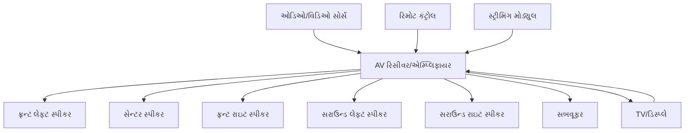

**મેમરી ટ્રીક:** "SAVS: સોર્સ પ્રોવાઇડ્સ, એમ્પ્લિફાયર પ્રોસેસીસ, વેરિયસ સ્પીકર્સ ડિલિવર, સરાઉન્ડ એક્સપીરિયન્સ ક્રિએટેડ"

## પ્રશ્ન 5(બ OR) [4 ગુણ]

**ઓપ્ટિકલ સાઉન્ડ રેકોર્ડિંગ સમજાવો.**

**જવાબ**:

**Table: ઓપ્ટિકલ સાઉન્ડ રેકોર્ડિંગ પ્રક્રિયા**

| સ્ટેપ | પ્રક્રિયા | કોમ્પોનન્ટ |
|------|---------|-----------|
| 1 | **સાઉન્ડ કેપ્ચર** | માઇક્રોફોન ધ્વનિને ઇલેક્ટ્રિકલ સિગ્નલમાં રૂપાંતરિત કરે છે |
| 2 | **મોડ્યુલેશન** | સિગ્નલ લાઇટ સોર્સની તીવ્રતા અથવા એરિયા મોડ્યુલેટ કરે છે |
| 3 | **એક્સપોઝર** | મોડ્યુલેટેડ લાઇટ ફોટોગ્રાફિક ફિલ્મને એક્સપોઝ કરે છે |
| 4 | **ડેવેલપમેન્ટ** | દૃશ્યમાન સાઉન્ડ ટ્રેક બનાવવા માટે ફિલ્મ પ્રોસેસ કરવામાં આવે છે |
| 5 | **પ્લેબેક** | લાઇટ ટ્રેક મારફતે પસાર થાય છે, ફોટોડિટેક્ટર ઇલેક્ટ્રિકલ સિગ્નલમાં રૂપાંતરિત કરે છે |

**ઓપ્ટિકલ સાઉન્ડ ટ્રેક્સના પ્રકારો:**

- **વેરિએબલ ડેન્સિટી**: લાઇટની તીવ્રતા બદલાય છે (ઘાટા/પાતળા ક્ષેત્રો)
- **વેરિએબલ એરિયા**: અપારદર્શક પૃષ્ઠભૂમિ સામે પારદર્શક ક્ષેત્રની પહોળાઈ બદલાય છે

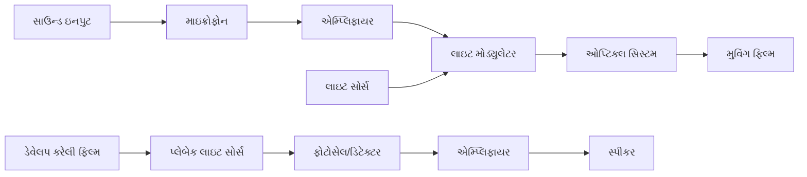

**મેમરી ટ્રીક:** "CAREP: કેપ્ચર સાઉન્ડ, એમ્પ્લિફાય સિગ્નલ, રેકોર્ડ ઓપ્ટિકલી, એક્સપોઝ ફિલ્મ, પ્લે બેક"

## પ્રશ્ન 5(ક OR) [7 ગુણ]

**લાઉડસ્પીકર ની વ્યાખ્યા આપો. લાઉડસ્પીકર ના પ્રકારો લખો અને કોઇ પણ એક લાઉડસ્પીકર ની કાર્યપધ્ધતિ સમજાવો.**

**જવાબ**:

**વ્યાખ્યા:**
લાઉડસ્પીકર એ ઇલેક્ટ્રોએકુસ્ટિક ટ્રાન્સડ્યુસર છે જે ઇલેક્ટ્રિકલ સિગ્નલને ધ્વનિ તરંગોમાં રૂપાંતરિત કરે છે, જેમાં ડાયાફ્રામ હલનચલન કરીને વાયુના દબાણમાં ફેરફાર કરે છે.

**Table: લાઉડસ્પીકરના પ્રકારો**

| પ્રકાર | કાર્યસિદ્ધાંત | ફ્રિક્વન્સી રેન્જ | એપ્લિકેશન્સ |
|------|-------------------|-----------------|--------------|
| **ડાયનેમિક/મુવિંગ કોઇલ** | ઇલેક્ટ્રોમેગ્નેટિક ઇન્ડક્શન | 20Hz-20kHz | સૌથી સામાન્ય, જનરલ પર્પઝ |
| **ઇલેક્ટ્રોસ્ટેટિક** | પ્લેટ્સ વચ્ચે ઇલેક્ટ્રોસ્ટેટિક ફોર્સ | 100Hz-20kHz | હાઇ-ફિડેલિટી ઓડિઓ સિસ્ટમ્સ |
| **પિએઝોઇલેક્ટ્રિક** | પિએઝોઇલેક્ટ્રિક ઇફેક્ટ | 1kHz-25kHz | ટ્વીટર્સ, અલાર્મ્સ, બઝર્સ |
| **રિબન** | મેગ્નેટિક ફિલ્ડમાં રિબન મારફતે કરંટ | 2kHz-50kHz | હાઇ-ફ્રિક્વન્સી રિપ્રોડક્શન |
| **પ્લેનર મેગ્નેટિક** | કન્ડક્ટર શીટ પર મેગ્નેટિક ફોર્સ | 30Hz-20kHz | ઓડિયોફાઇલ હેડફોન્સ, સ્પીકર્સ |

**ડાયનેમિક/મુવિંગ કોઇલ લાઉડસ્પીકરની કાર્યપદ્ધતિ:**

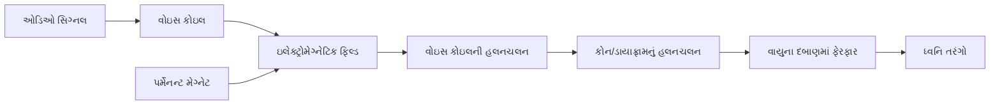

**કાર્યપદ્ધતિ:**

1. ઓડિઓ કરંટ વોઇસ કોઇલમાંથી પસાર થાય છે
2. કરંટ ઇલેક્ટ્રોમેગ્નેટિક ફિલ્ડ ઉત્પન્ન કરે છે
3. ઇલેક્ટ્રોમેગ્નેટિક ફિલ્ડ પર્મેનન્ટ મેગ્નેટ સાથે ઇન્ટરેક્ટ કરે છે
4. સિગ્નલ પોલેરિટીના આધારે વોઇસ કોઇલ આગળ/પાછળ ખસે છે
5. જોડાયેલ કોન/ડાયાફ્રામ ખસે છે, જે વાયુના દબાણમાં ફેરફાર કરે છે
6. વાયુના દબાણના ફેરફારો ધ્વનિ તરંગો તરીકે ફેલાય છે

**કોમ્પોનન્ટ્સ:**

- **કોન/ડાયાફ્રામ**: ધ્વનિ ઉત્પન્ન કરવા માટે વાયુને ખસેડે છે
- **વોઇસ કોઇલ**: ઓડિઓ સિગ્નલ કરંટ વહન કરે છે
- **મેગ્નેટ**: સ્ટેટિક મેગ્નેટિક ફિલ્ડ ઉત્પન્ન કરે છે
- **સસ્પેન્શન**: કોનને કેન્દ્રિત રાખે છે, હલનચલનની મંજૂરી આપે છે
- **ફ્રેમ/બાસ્કેટ**: કોમ્પોનન્ટ્સને યોગ્ય એલાઇનમેન્ટમાં રાખે છે

**મેમરી ટ્રીક:** "SEPVADICS: સિગ્નલ એન્ટર્સ, પ્રોડ્યુસેસ વાઇબ્રેશન્સ, એક્ટિવેટ્સ ડાયાફ્રામ, ઇન કોઓર્ડીનેશન વિથ સસ્પેન્શન"
