## Question 1(a) [3 marks]

**Describe maintenance procedure of CCTV.**

**Answer**:

**Table: CCTV Maintenance Procedure**

| Step | Procedure | Details |
|------|-----------|---------|
| 1 | **Camera Cleaning** | Clean lenses and housings monthly |
| 2 | **Cable Inspection** | Check for damage/exposure quarterly |
| 3 | **Recording Check** | Verify data storage and playback monthly |
| 4 | **Firmware Updates** | Update software when available |
| 5 | **Angle Adjustment** | Realign cameras as needed |

**Mnemonic:** "CCRU: Clean, Check, Record, Update"

## Question 1(b) [4 marks]

**List the types of maintenance and explain in brief.**

**Answer**:

**Table: Types of Maintenance**

| Type | Description | When Performed | Benefits |
|------|-------------|----------------|----------|
| **Preventive** | Regular checks before failure | Scheduled intervals | Reduces unexpected downtime |
| **Corrective** | Repairs after equipment breaks | After failure occurs | Restores functionality |
| **Predictive** | Uses data to predict failures | Based on analysis | Optimizes maintenance timing |
| **Condition-based** | Monitors actual equipment state | When conditions indicate | Reduces unnecessary maintenance |

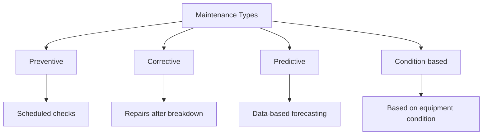

**Mnemonic:** "PCPC: Prevent, Correct, Predict, Condition"

## Question 1(c) [7 marks]

**Explain maintenance and troubleshooting procedure of Washing Machine.**

**Answer**:

**Table: Washing Machine Maintenance and Troubleshooting**

| Problem | Possible Cause | Troubleshooting Steps |
|---------|---------------|----------------------|
| **Machine not starting** | Power issue, door lock | Check power supply, ensure door is closed properly |
| **Not filling with water** | Water supply, inlet valve | Check water taps, inspect inlet hoses for blocks |
| **Not draining** | Clogged filter, drain pump | Clean filter, check drain hose for kinks |
| **Excessive vibration** | Unbalanced load, shipping bolts | Redistribute clothes, check if shipping bolts removed |
| **Leaking water** | Damaged hoses, loose connections | Inspect and tighten connections, replace damaged hoses |

**Regular Maintenance:**

- **Monthly**: Clean detergent drawer and door seal
- **Quarterly**: Run empty hot cycle with vinegar/cleaner
- **Bi-annually**: Check hoses for cracks, clean filter

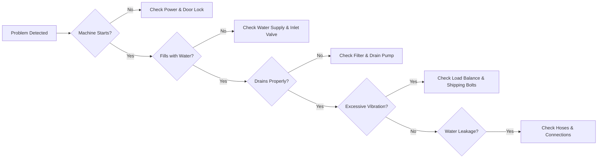

**Mnemonic:** "POWER: Power, Observe, Water, Examine, Repair"

## Question 1(c OR) [7 marks]

**Explain maintenance and troubleshooting procedure of Digital TV.**

**Answer**:

**Table: Digital TV Maintenance and Troubleshooting**

| Problem | Possible Cause | Troubleshooting Steps |
|---------|---------------|----------------------|
| **No power** | Power supply issue | Check power cord, wall outlet, try different socket |
| **No picture** | Input/source selection | Verify correct input selected, check source device |
| **Poor reception** | Antenna/cable issue | Check cable connections, reposition antenna |
| **Distorted colors** | Display settings | Reset picture settings to default |
| **Remote not working** | Battery issue, sensor blocked | Replace batteries, ensure IR sensor not blocked |

**Regular Maintenance:**

- **Weekly**: Dust screen carefully with microfiber cloth
- **Monthly**: Check and tighten cable connections
- **Annually**: Update firmware if available

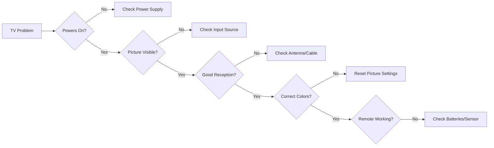

**Mnemonic:** "SPIRE: Supply, Picture, Input, Reception, Electronics"

## Question 2(a) [3 marks]

**Define: (1) Brightness (2) Luminance (3) Chrominance**

**Answer**:

**Table: Key TV Display Terms**

| Term | Definition | Measured In |
|------|------------|-------------|
| **Brightness** | Perceived intensity of light output from display | Subjective perception (nits) |
| **Luminance** | Objective measurement of light intensity per unit area | Candela per square meter (cd/m²) |
| **Chrominance** | Color information in video signal independent of brightness | U and V components |

**Mnemonic:** "BLC: Brightness is Light perception, Luminance is Calculated light, Chrominance is Color information"

## Question 2(b) [4 marks]

**Draw and explain block diagram of DTH receiver.**

**Answer**:

**DTH Receiver Block Diagram:**

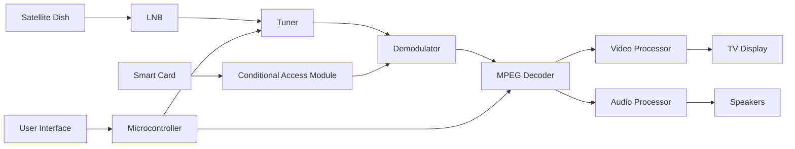

**Table: DTH Receiver Components**

| Component | Function |
|-----------|----------|
| **Satellite Dish** | Receives satellite signals from space |
| **LNB (Low Noise Block)** | Converts high-frequency signals to lower frequency |
| **Tuner** | Selects specific channel frequency |
| **Demodulator** | Extracts digital data from carrier signal |
| **MPEG Decoder** | Decompresses audio/video data |
| **Conditional Access Module** | Controls subscription access |

**Mnemonic:** "SLTDM: Satellite captures, LNB converts, Tuner selects, Demodulator extracts, MPEG decodes"

## Question 2(c) [7 marks]

**Draw and explain block diagram of colour TV receiver.**

**Answer**:

**Colour TV Receiver Block Diagram:**

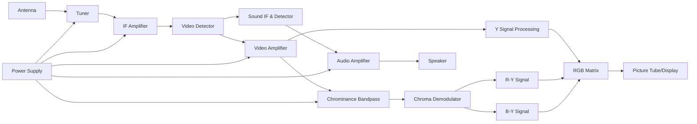

**Table: Colour TV Components and Functions**

| Section | Function | Key Components |
|---------|----------|----------------|
| **Tuner** | Selects desired channel | RF amplifier, mixer, local oscillator |
| **IF Amplifier** | Amplifies intermediate frequency | Bandpass filters, amplifiers |
| **Video Detector** | Extracts video signal | Diode detector, filters |
| **Chrominance Section** | Processes color information | Bandpass filter, color demodulator |
| **Luminance Section** | Processes brightness information | Y signal amplifier |
| **RGB Matrix** | Combines signals for display | Mixing circuits |
| **Audio Section** | Processes sound | Sound IF, detector, amplifier |

**Mnemonic:** "TIVACRL: Tuner tunes, IF amplifies, Video detects, Audio separates, Chrominance demodulates, RGB mixes, Light displays"

## Question 2(a OR) [3 marks]

**Write a short note on LED TV.**

**Answer**:

**Table: LED TV Technology**

| Aspect | Description |
|--------|-------------|
| **Basic Technology** | Uses Light Emitting Diodes for display backlighting |
| **Types** | Edge-lit (LEDs at edges), Direct-lit (LEDs behind screen), Full-array (with local dimming) |
| **Advantages** | Thinner profile, energy efficient, better contrast ratio, longer lifespan than LCD |
| **Display Panel** | Still uses LCD panel; LEDs are only for backlighting |

**Mnemonic:** "BEST: Backlighting with LEDs, Energy efficient, Slim design, True colors"

## Question 2(b OR) [4 marks]

**Briefly explain the terms: (1) Hue (2) Saturation**

**Answer**:

**Table: Color Properties**

| Term | Definition | Range | Example |
|------|------------|-------|---------|
| **Hue** | Actual color wavelength (red, blue, green, etc.) | 0-360 degrees on color wheel | Red=0°, Green=120°, Blue=240° |
| **Saturation** | Intensity or purity of color (how vivid) | 0-100% (gray to pure color) | 0%=grayscale, 100%=vivid color |

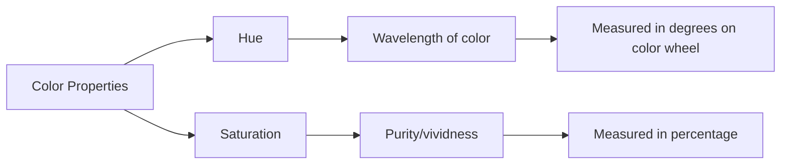

**Mnemonic:** "HS: Hue is the color Shade, Saturation is the color Strength"

## Question 2(c OR) [7 marks]

**Explain additive colour mixing using colour circle diagram and Grassman's law.**

**Answer**:

**Table: Additive Color Mixing Principles**

| Color Combination | Result | RGB Value |
|-------------------|--------|-----------|
| **Red + Green** | Yellow | (255,255,0) |
| **Green + Blue** | Cyan | (0,255,255) |
| **Blue + Red** | Magenta | (255,0,255) |
| **Red + Green + Blue** | White | (255,255,255) |
| **No colors** | Black | (0,0,0) |

**Grassman's Laws:**

- **Law 1**: Any color can be created by mixing three primary colors
- **Law 2**: The appearance of a color depends only on its tristimulus values
- **Law 3**: In additive mixing, the tristimulus values add together

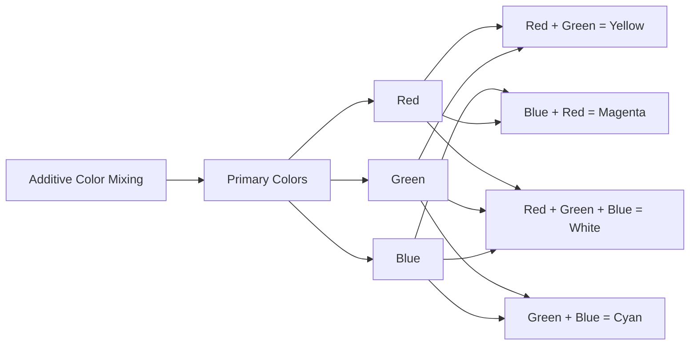

**Color Circle Diagram:**

```goat
    Yellow
      /\
     /  \
    /    \
Red ------Green
    \    /
     \  /
      \/
   Magenta----Cyan
       \    /
        \  /
         \/
        Blue
```

**Mnemonic:** "RGB-CMY-W: Red, Green, Blue make Cyan, Magenta, Yellow, and White"

## Question 3(a) [3 marks]

**List wiring and safety instructions for microwave oven.**

**Answer**:

**Table: Microwave Oven Wiring and Safety Instructions**

| Category | Instructions |
|----------|--------------|
| **Wiring** | Use grounded outlet with dedicated 15-20A circuit |
| **Power** | Ensure voltage matches rating (typically 220-240V) |
| **Installation** | Allow 5cm clearance on all sides for ventilation |
| **Safety** | Never operate empty, never bypass door interlocks |
| **Maintenance** | Disconnect power before servicing, discharge capacitor |

**Mnemonic:** "POWER: Proper Outlet, Wiring check, Empty operation avoided, Repairs by professionals"

## Question 3(b) [4 marks]

**Explain working of Air conditioner.**

**Answer**:

**Table: Air Conditioner Working Cycle**

| Component | Function | Process |
|-----------|----------|---------|
| **Compressor** | Pressurizes refrigerant | Converts low-pressure gas to high-pressure gas |
| **Condenser** | Releases heat outside | Converts gas to liquid, expels heat |
| **Expansion Valve** | Regulates refrigerant flow | Reduces pressure of liquid |
| **Evaporator** | Absorbs heat from room | Converts liquid to gas, cools air |
| **Thermostat** | Controls temperature | Regulates compressor operation |

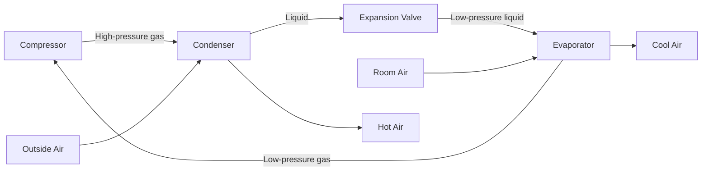

**Mnemonic:** "CELT: Compress gas, Expel heat, Lower pressure, Take in heat"

## Question 3(c) [7 marks]

**Explain electronic controller for washing machine and fuzzy logic washing machine. Also list technical specifications of washing machine.**

**Answer**:

**Table: Electronic Controller in Washing Machines**

| Component | Function |
|-----------|----------|
| **Microcontroller** | Central processing unit controlling all operations |
| **Sensors** | Detect water level, temperature, load balance, door status |
| **Input Interface** | Buttons/touch panel for program selection |
| **Display** | Shows program status, time remaining, error codes |
| **Actuator Drivers** | Control motor, valves, heater, pump |

**Fuzzy Logic in Washing Machines:**

- Uses artificial intelligence for optimal washing
- Adjusts water level, wash time, and spin speed based on load
- Makes decisions using approximate reasoning instead of precise values
- Adapts to different fabric types and soil levels automatically

**Technical Specifications:**

- **Capacity**: 6-10 kg (front load), 5-8 kg (top load)
- **Energy Rating**: A+++ to B (EU standards)
- **Water Consumption**: 40-70 liters per cycle
- **Spin Speed**: 800-1600 RPM
- **Cycle Options**: 8-16 programs

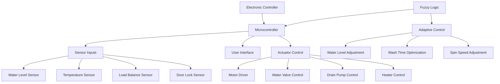

**Mnemonic:** "SCRAM: Sensors detect, Controller processes, Rules applied, Actuators operate, Machine adapts"

## Question 3(a OR) [3 marks]

**State main components of solar power system and specifications of solar power system.**

**Answer**:

**Table: Solar Power System Components**

| Component | Function |
|-----------|----------|
| **Solar Panels** | Convert sunlight to DC electricity |
| **Inverter** | Converts DC to AC power |
| **Battery Bank** | Stores energy for later use |
| **Charge Controller** | Prevents battery overcharging |
| **Mounting Structure** | Supports and angles panels optimally |

**Specifications:**

- **Panel Capacity**: 250-400 Watts per panel
- **System Size**: 1-10 kW (residential)
- **Battery Capacity**: 100-200 Ah
- **Inverter Efficiency**: 90-97%
- **Expected Lifespan**: 25-30 years (panels)

**Mnemonic:** "PIBCM: Panels collect, Inverter converts, Batteries store, Controller protects, Mounts support"

## Question 3(b OR) [4 marks]

**Explain working of Refrigerator.**

**Answer**:

**Table: Refrigerator Working Cycle**

| Stage | Process | Component | State of Refrigerant |
|-------|---------|-----------|----------------------|
| 1 | Compression | Compressor | Low pressure gas → High pressure gas |
| 2 | Condensation | Condenser coils | High pressure gas → High pressure liquid |
| 3 | Expansion | Expansion valve | High pressure liquid → Low pressure liquid |
| 4 | Evaporation | Evaporator coils | Low pressure liquid → Low pressure gas |


**Mnemonic:** "CEHE: Compress gas, Expel heat, Halve pressure, Extract heat"

## Question 3(c OR) [7 marks]

**Draw and explain block diagram of Microwave oven. List types, applications and technical specifications of microwave oven.**

**Answer**:

**Microwave Oven Block Diagram:**

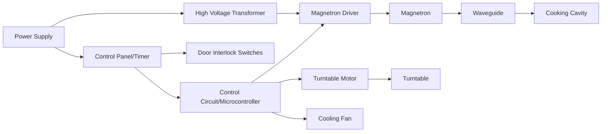

**Types of Microwave Ovens:**

- **Solo**: Basic heating and defrosting only
- **Grill**: Has additional grilling element
- **Convection**: Combines microwave with convection heating
- **Over-the-Range (OTR)**: Includes ventilation system
- **Built-in**: Designed for cabinet installation

**Applications:**

- **Cooking**: Fast meal preparation
- **Reheating**: Leftover foods
- **Defrosting**: Frozen foods
- **Sterilization**: Small items
- **Commercial**: Food service industry

**Technical Specifications:**

- **Capacity**: 20-40 liters
- **Power Output**: 700-1200 watts
- **Power Consumption**: 1100-1500 watts
- **Frequency**: 2.45 GHz
- **Voltage**: 220-240V AC

**Mnemonic:** "MICROWAVES: Magnetron generates, Interior receives, Control regulates, Rotating turntable, Oven cavity, Waveguide directs, Alternating current powers, Ventilation cools, Electronic timer, Safety interlocks"

## Question 4(a) [3 marks]

**List specifications of MF printer and LCD projector.**

**Answer**:

**Table: Multi-Function Printer Specifications**

| Specification | Typical Range |
|---------------|---------------|
| **Print Resolution** | 600-4800 dpi |
| **Print Speed** | 20-40 ppm (black), 15-30 ppm (color) |
| **Scan Resolution** | 600-1200 dpi |
| **Connectivity** | Wi-Fi, Ethernet, USB, Cloud |
| **Paper Capacity** | 100-500 sheets |

**Table: LCD Projector Specifications**

| Specification | Typical Range |
|---------------|---------------|
| **Brightness** | 2000-5000 lumens |
| **Resolution** | XGA (1024×768) to 4K (3840×2160) |
| **Contrast Ratio** | 2000:1 to 100,000:1 |
| **Lamp Life** | 4000-8000 hours |
| **Connectivity** | HDMI, VGA, USB, Wireless |

**Mnemonic:** "PSCPL: Print resolution, Speed, Connectivity, Projection brightness, Lamp life"

## Question 4(b) [4 marks]

**Draw block diagram of Inkjet printer and explain its working in brief.**

**Answer**:

**Inkjet Printer Block Diagram:**

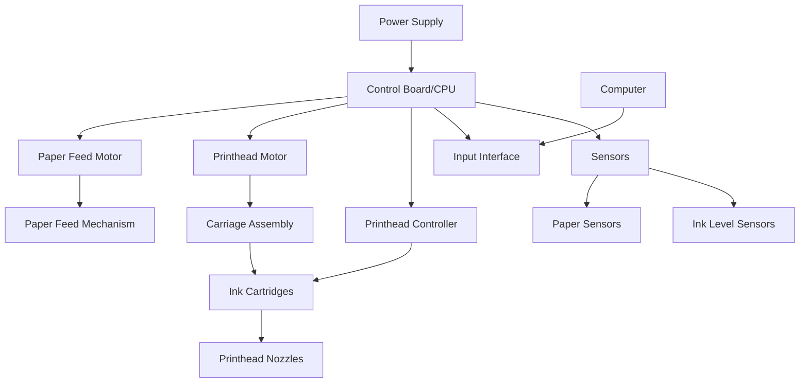

**Working of Inkjet Printer:**

1. **Document Processing**: Control board receives data and converts to printer commands
2. **Paper Loading**: Feed motor pulls paper from tray
3. **Printing**: Printhead moves across paper while ejecting tiny ink droplets
4. **Droplet Formation**: Thermal or piezoelectric method forces ink droplets onto paper
5. **Paper Advancement**: Paper advances line by line until printing completes

**Mnemonic:** "PIPES: Paper feeds, Ink ejects, Printhead moves, Electronic control, Sheet advances"

## Question 4(c) [7 marks]

**Explain working of Photocopier with block diagram and list its specifications.**

**Answer**:

**Photocopier Block Diagram:**

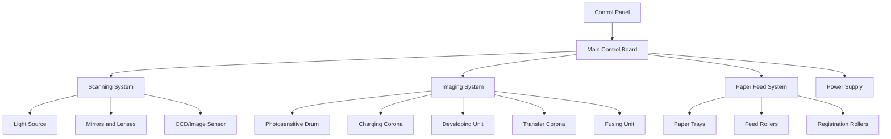

**Working of Photocopier:**

1. **Charging**: Photosensitive drum receives uniform electrostatic charge
2. **Exposure**: Original document scanned, creating light pattern on drum
3. **Developing**: Toner particles attracted to charged areas on drum
4. **Transfer**: Toner image transferred from drum to paper
5. **Fusing**: Heat and pressure melt toner permanently onto paper
6. **Cleaning**: Drum cleaned for next cycle

**Technical Specifications:**

- **Speed**: 20-60 pages per minute
- **Resolution**: 600-1200 dpi
- **Paper Capacity**: 250-2000 sheets
- **Maximum Paper Size**: A3/11×17 inches
- **Zoom Range**: 25-400%
- **Memory**: 512MB-2GB
- **Connectivity**: Ethernet, USB, Wi-Fi

**Mnemonic:** "CETFC: Charge drum, Expose image, Transfer toner, Fuse permanently, Clean drum"

## Question 4(a OR) [3 marks]

**Write a short note on CCTV.**

**Answer**:

**Table: CCTV System Overview**

| Aspect | Description |
|--------|-------------|
| **Full Form** | Closed-Circuit Television |
| **Purpose** | Security monitoring and surveillance |
| **Components** | Cameras, DVR/NVR, monitors, cables, power supply |
| **Types** | Analog, IP (digital), Wireless, HD-CVI/TVI/SDI |
| **Features** | Motion detection, night vision, remote viewing |

**Key Applications:**

- Security monitoring of buildings
- Traffic monitoring
- Retail loss prevention
- Public area surveillance
- Home security

**Mnemonic:** "SCRAM: Security monitoring, Closed circuit, Recording footage, Access restricted, Monitoring continuous"

## Question 4(b OR) [4 marks]

**Explain working of LCD projector with block diagram.**

**Answer**:

**LCD Projector Block Diagram:**

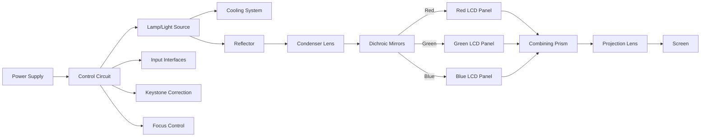

**Working of LCD Projector:**

1. **Light Generation**: High-intensity lamp produces white light
2. **Color Separation**: Dichroic mirrors split light into RGB components
3. **Image Formation**: LCD panels modulate light based on input signal
4. **Recombination**: Prism combines RGB images into full-color image
5. **Projection**: Lens system projects final image onto screen

**Mnemonic:** "LSCIP: Light source generates, Split into colors, Control with LCDs, Image combined, Projected on screen"

## Question 4(c OR) [7 marks]

**Explain working of laser printer with block diagram.**

**Answer**:

**Laser Printer Block Diagram:**

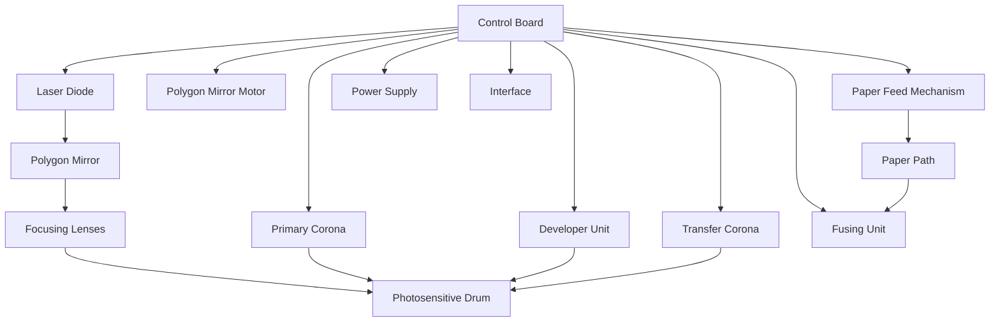

**Laser Printing Process:**

**Table: Six Steps of Laser Printing**

| Step | Process | Component | Function |
|------|---------|-----------|----------|
| 1 | **Cleaning** | Cleaning blade | Removes residual toner from drum |
| 2 | **Charging** | Primary corona | Applies uniform negative charge to drum |
| 3 | **Writing** | Laser & mirror | Creates electrostatic image on drum |
| 4 | **Developing** | Developer unit | Applies toner to charged areas of drum |
| 5 | **Transferring** | Transfer corona | Moves toner from drum to paper |
| 6 | **Fusing** | Fuser unit | Melts toner permanently onto paper |

**Technical Specifications:**

- **Print Speed**: 20-50 ppm
- **Resolution**: 600-2400 dpi
- **Memory**: 128MB-1GB
- **Duty Cycle**: 10,000-150,000 pages/month
- **Connectivity**: USB, Ethernet, Wi-Fi

**Mnemonic:** "CCWDTF: Clean drum, Charge uniformly, Write with laser, Develop with toner, Transfer to paper, Fuse permanently"

## Question 5(a) [3 marks]

**Define: (1) Pitch (2) Reverberation (3) Microphone.**

**Answer**:

**Table: Audio Terminology**

| Term | Definition | Measured In |
|------|------------|-------------|
| **Pitch** | Perceived frequency of sound; how high or low a tone seems | Hertz (Hz) |
| **Reverberation** | Persistence of sound after source stops; caused by reflections | Seconds (RT60) |
| **Microphone** | Transducer that converts sound waves into electrical signals | Sensitivity in dB/mV/Pa |

**Mnemonic:** "PRM: Pitch is frequency, Reverberation is reflection, Microphone is converter"

## Question 5(b) [4 marks]

**Draw and explain block diagram of PA system.**

**Answer**:

**PA System Block Diagram:**

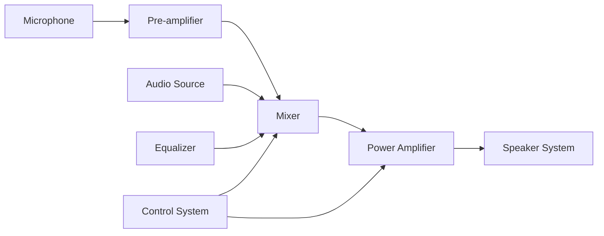

**Table: PA System Components**

| Component | Function |
|-----------|----------|
| **Microphone** | Captures sound and converts to electrical signals |
| **Pre-amplifier** | Boosts weak microphone signals to line level |
| **Mixer** | Combines multiple audio sources, adjusts levels |
| **Equalizer** | Adjusts frequency response for optimal sound |
| **Power Amplifier** | Increases signal strength to drive speakers |
| **Speaker System** | Converts electrical signals back to sound waves |

**Mnemonic:** "MPMEPA: Microphone Picks, Preamp Magnifies, Equalizer adjusts, Power Amplifier drives, Audience hears"

## Question 5(c) [7 marks]

**Explain Crystal microphone.**

**Answer**:

**Table: Crystal Microphone Characteristics**

| Characteristic | Description |
|----------------|-------------|
| **Operating Principle** | Piezoelectric effect |
| **Construction** | Crystal element (Rochelle salt) between metal plates |
| **Response** | High output, moderate frequency response |
| **Impedance** | Very high (typically > 1 MΩ) |
| **Durability** | Sensitive to heat and humidity |

**Working Principle:**
When sound waves strike the diaphragm, they create pressure on the crystal element. Due to the piezoelectric effect, the crystal generates a voltage proportional to the mechanical stress. This voltage is the electrical representation of the sound.

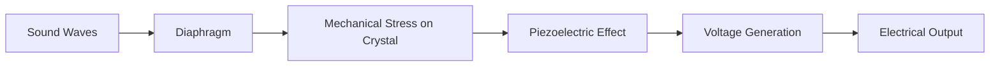

**Applications:**

- Telephone receivers
- Contact pickups for acoustic instruments
- Low-cost recording devices
- Public address systems

**Advantages and Limitations:**

| Advantages | Limitations |
|------------|-------------|
| High output voltage | Poor frequency response |
| No external power needed | Sensitive to temperature/humidity |
| Simple construction | Higher distortion |
| Low cost | Fragile crystal element |

**Mnemonic:** "PIES: Pressure applied, Impedance high, Electricity generated, Sound converted"

## Question 5(a OR) [3 marks]

**Draw block diagram of Home theatre sound system.**

**Answer**:

**Home Theatre Sound System Block Diagram:**

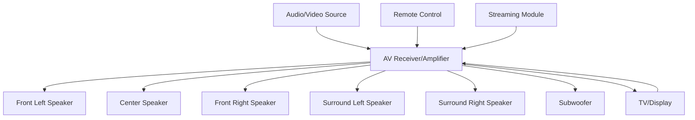

**Mnemonic:** "SAVS: Source provides, Amplifier processes, Various speakers deliver, Surround experience created"

## Question 5(b OR) [4 marks]

**Explain optical sound recording.**

**Answer**:

**Table: Optical Sound Recording Process**

| Step | Process | Component |
|------|---------|-----------|
| 1 | **Sound Capture** | Microphone converts sound to electrical signals |
| 2 | **Modulation** | Signal modulates light source intensity or area |
| 3 | **Exposure** | Modulated light exposes photographic film |
| 4 | **Development** | Film processed to create visible sound track |
| 5 | **Playback** | Light passes through track, photodetector converts to electrical signal |

**Types of Optical Sound Tracks:**

- **Variable Density**: Light intensity varies (darker/lighter areas)
- **Variable Area**: Transparent area width varies against opaque background

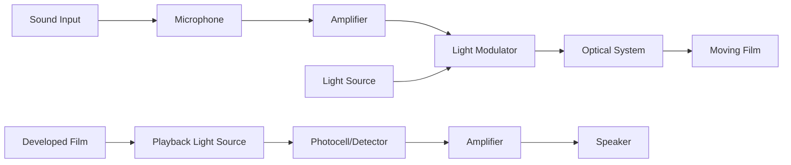

**Mnemonic:** "CAREP: Capture sound, Amplify signal, Record optically, Expose film, Play back"

## Question 5(c OR) [7 marks]

**Define loudspeaker. List types of loudspeakers and explain working of any one type of loudspeaker.**

**Answer**:

**Definition:**
A loudspeaker is an electroacoustic transducer that converts electrical signals into sound waves by moving a diaphragm that creates air pressure variations.

**Table: Types of Loudspeakers**

| Type | Working Principle | Frequency Range | Applications |
|------|-------------------|-----------------|--------------|
| **Dynamic/Moving Coil** | Electromagnetic induction | 20Hz-20kHz | Most common, general purpose |
| **Electrostatic** | Electrostatic force between plates | 100Hz-20kHz | High-fidelity audio systems |
| **Piezoelectric** | Piezoelectric effect | 1kHz-25kHz | Tweeters, alarms, buzzers |
| **Ribbon** | Current through ribbon in magnetic field | 2kHz-50kHz | High-frequency reproduction |
| **Planar Magnetic** | Magnetic force on conductor sheet | 30Hz-20kHz | Audiophile headphones, speakers |

**Working of Dynamic/Moving Coil Loudspeaker:**

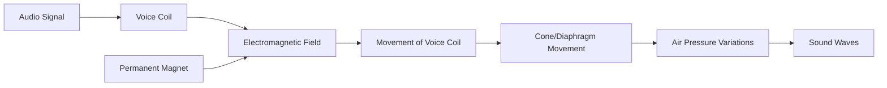

**Working Process:**

1. Audio current flows through voice coil
2. Current creates electromagnetic field
3. Electromagnetic field interacts with permanent magnet
4. Voice coil moves forward/backward based on signal polarity
5. Attached cone/diaphragm moves, creating air pressure variations
6. Air pressure variations propagate as sound waves

**Components:**

- **Cone/Diaphragm**: Moves air to create sound
- **Voice Coil**: Carries audio signal current
- **Magnet**: Creates static magnetic field
- **Suspension**: Keeps cone centered, allows movement
- **Frame/Basket**: Holds components in proper alignment

**Mnemonic:** "SEPVADICS: Signal Enters, Produces Vibrations, Activates Diaphragm, In Coordination with Suspension"
