## પ્રશ્ન 1(અ) [3 ગુણ]

**લાઉડનેસ, ફાઈડાલીટી અને રીવાર્બેરાશનની માત્ર વ્યાખ્યા આપો.**

**જવાબ**:

- **લાઉડનેસ**: માનવ કાન દ્વારા ધ્વનિની તીવ્રતાની આત્મલક્ષી ધારણા, જે ડેસિબલ (dB)માં માપવામાં આવે છે.
- **ફાઈડાલીટી**: એક સિસ્ટમ મૂળ ઇનપુટ સિગ્નલને કેટલી સચોટતાથી પુનઃઉત્પાદિત કરે છે તેનું માપ.
- **રીવાર્બેરાશન**: મૂળ ધ્વનિ સ્રોત બંધ થયા પછી પણ ધ્વનિનું ચાલુ રહેવું, જે બંધ જગ્યામાં અનેક પરાવર્તનોને કારણે થાય છે.

**મેમરી ટ્રીક:** "LFR: ધ્વનિને વિશ્વાસપૂર્વક સાંભળો અને રૂમના પડઘાઓને સમજો"

## પ્રશ્ન 1(બ) [4 ગુણ]

**પીએ સિસ્ટમને તેના બ્લોક ડાયાગ્રામ વડે સમજાવો.**

**જવાબ**:

**ડાયાગ્રામ:**

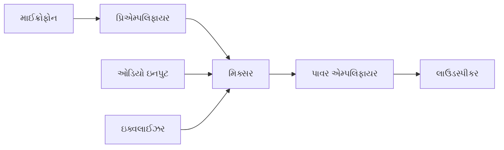

- **માઈક્રોફોન**: ધ્વનિ તરંગોને ઇલેક્ટ્રિકલ સિગ્નલમાં રૂપાંતરિત કરે છે
- **પ્રિએમ્પલિફાયર**: નબળા માઈક્રોફોન સિગ્નલ્સને લાઈન લેવલ સુધી વધારે છે
- **મિક્સર**: અનેક ઓડિયો સિગ્નલ્સને ભેગા કરે છે અને લેવલ એડજસ્ટ કરે છે
- **પાવર એમ્પલિફાયર**: લાઉડસ્પીકર ચલાવવા માટે સિગ્નલની પાવર વધારે છે
- **લાઉડસ્પીકર**: ઇલેક્ટ્રિકલ સિગ્નલને પાછા ધ્વનિ તરંગોમાં રૂપાંતરિત કરે છે

**મેમરી ટ્રીક:** "MPMEL: ઘણા લોકો ઉત્તમ શ્રોતાઓ બનાવે છે"

## પ્રશ્ન 1(ક) [7 ગુણ]

**માઈક્રોફોનની કોઈ પણ બે લાક્ષણિકતાઓ સમજાવી વાયરલેસ માઈક્રોફોન સમજાવો.**

**જવાબ**:

**માઈક્રોફોનની લાક્ષણિકતાઓ:**

| લાક્ષણિકતા | વર્ણન |
|---------------|-------------|
| **સેન્સિટિવિટી** | માઈક્રોફોન કેટલી કાર્યક્ષમતાથી ધ્વનિ દબાણને ઇલેક્ટ્રિકલ આઉટપુટમાં રૂપાંતરિત કરે છે તે માપે છે (mV/Pa) |
| **દિશાત્મક પેટર્ન** | પિકઅપ એરિયા નક્કી કરે છે (ઓમ્નિડાયરેક્શનલ, કાર્ડિયોઇડ, હાયપરકાર્ડિયોઇડ, બાયડાયરેક્શનલ) |

**વાયરલેસ માઈક્રોફોન:**

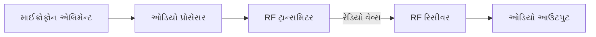

- **માઈક્રોફોન એલિમેન્ટ**: ધ્વનિ પકડી તેને ઇલેક્ટ્રિકલ સિગ્નલમાં રૂપાંતરિત કરે છે
- **RF ટ્રાન્સમિટર**: ઓડિયોને રેડિયો ફ્રિક્વન્સી કેરિયર પર મોડ્યુલેટ કરે છે
- **ટ્રાન્સમિશન**: સામાન્ય ફ્રિક્વન્સી બેન્ડ UHF (470-698 MHz) અથવા VHF (174-216 MHz) છે
- **RF રિસીવર**: સિગ્નલને ફરીથી ઓડિયોમાં ડિમોડ્યુલેટ કરે છે
- **ફાયદાઓ**: ગતિશીલતા, કેબલ પ્રતિબંધો નથી, સ્ટેજ પર ગરબડ ઘટાડે છે

**મેમરી ટ્રીક:** "SMART: સેન્સિટિવિટી ધ્વનિની પ્રતિક્રિયાને સાચી રીતે માપે છે"

## પ્રશ્ન 1(ક) OR [7 ગુણ]

**લાઉડસ્પીકરની કોઈ પણ બે લાક્ષણિકતાઓ સમજાવી પરમેનેન્ટ મેગ્નેટ લાઉડસ્પીકર સમજાવો.**

**જવાબ**:

**લાઉડસ્પીકરની લાક્ષણિકતાઓ:**

| લાક્ષણિકતા | વર્ણન |
|---------------|-------------|
| **ફ્રિક્વન્સી રિસ્પોન્સ** | સ્પીકર કયા ફ્રિક્વન્સી રેન્જ (Hz) ફરીથી ઉત્પન્ન કરી શકે છે (સામાન્ય રીતે 20Hz-20kHz) |
| **ઇમ્પીડન્સ** | ઇલેક્ટ્રિકલ રેઝિસ્ટન્સ (ઓહ્મ) જે એમ્પલિફાયરથી પાવર ટ્રાન્સફરને અસર કરે છે (સામાન્ય રીતે 4-8Ω) |

**પરમેનેન્ટ મેગ્નેટ લાઉડસ્પીકર:**

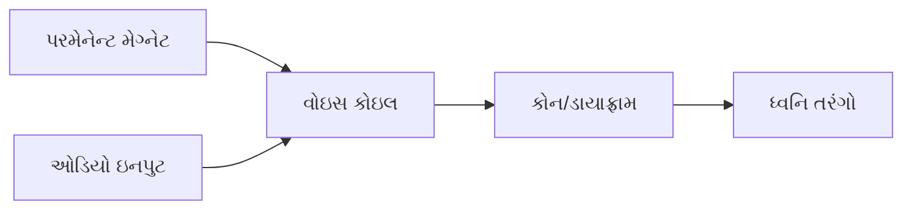

- **પરમેનેન્ટ મેગ્નેટ**: સ્થિર ચુંબકીય ક્ષેત્ર બનાવે છે (સામાન્ય રીતે ફેરાઇટ અથવા નિયોડિમિયમ)
- **વોઇસ કોઇલ**: તાર કોઇલ જે ઓડિયો કરંટ વહન કરે છે, ચલિત ચુંબકીય ક્ષેત્ર બનાવે છે
- **કોન/ડાયાફ્રામ**: વોઇસ કોઇલની ગતિના જવાબમાં ખસે છે
- **કાર્યસિદ્ધાંત**: સ્થિર ચુંબકીય ક્ષેત્ર અને વોઇસ કોઇલના ચલિત ક્ષેત્ર વચ્ચેની ક્રિયા-પ્રતિક્રિયા યાંત્રિક ગતિ ઉત્પન્ન કરે છે
- **ફાયદાઓ**: વધુ કાર્યક્ષમ, ફિલ્ડ કોઇલ પાવરની જરૂર નથી, કોમ્પેક્ટ ડિઝાઇન

**મેમરી ટ્રીક:** "FIRM: ફ્રિક્વન્સી ઇમ્પીડન્સને મેગ્નેટની જરૂર પડે છે"

## પ્રશ્ન 2(અ) [3 ગુણ]

**આસ્પેક્ટ રેશીઓ, લ્યુમિનેન્સ અને ક્રોમિનેન્સની માત્ર વ્યાખ્યા આપો.**

**જવાબ**:

- **આસ્પેક્ટ રેશીઓ**: ટેલિવિઝન સ્ક્રીનની પહોળાઈથી ઊંચાઈનો ગુણોત્તર (સામાન્ય રીતે HDTV માટે 16:9, જૂના TV માટે 4:3).
- **લ્યુમિનેન્સ**: વિડિયો સિગ્નલનો બ્રાઇટનેસ ઘટક જે તીવ્રતાની માહિતી વહન કરે છે (Y તરીકે દર્શાવાય છે).
- **ક્રોમિનેન્સ**: વિડિયો સિગ્નલનો રંગ ઘટક જે રંગની માહિતી વહન કરે છે (U અને V અથવા Cb અને Cr તરીકે દર્શાવાય છે).

**મેમરી ટ્રીક:** "ALC: બધા પ્રકાશમાં રંગ હોય છે"

## પ્રશ્ન 2(બ) [4 ગુણ]

**પાલ –ડી ડીકોડરનો ફક્ત ડાયાગ્રામ દોરો. ક્રોમા સિગ્નલનાં બે ઘટકો યુ અને વી ને કેવી રીતે છુટા પાડવામાં આવે છે?**

**જવાબ**:

**ડાયાગ્રામ:**

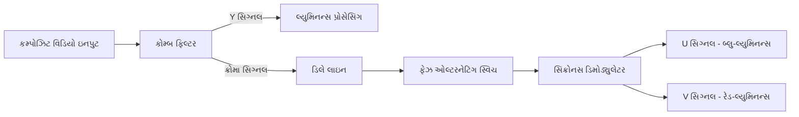

- **કોમ્બ ફિલ્ટર**: લ્યુમિનન્સ (Y)ને ક્રોમિનન્સ સિગ્નલથી અલગ કરે છે
- **ડિલે લાઇન**: ક્રોમા સિગ્નલને એક લાઇન પીરિયડ (64μs) સુધી વિલંબિત કરે છે
- **ફેઝ ઓલ્ટરનેટિંગ સ્વિચ**: વૈકલ્પિક લાઈનો પર V ઘટકને ઉલટાવે છે
- **સિંક્રોનસ ડિમોડ્યુલેટર**: U અને V ઘટકોને કાઢવા માટે સબકેરિયર રેફરન્સનો ઉપયોગ કરે છે
- **U ઘટક**: બ્લુ-માઈનસ-લ્યુમિનન્સ (B-Y) રજૂ કરે છે
- **V ઘટક**: રેડ-માઈનસ-લ્યુમિનન્સ (R-Y) રજૂ કરે છે

**મેમરી ટ્રીક:** "CODES: ક્રોમિનન્સ માત્ર સિગ્નલ્સ કાઢીને ડિકોડિંગ કરે છે"

## પ્રશ્ન 2(ક) [7 ગુણ]

**એલસીડી ટીવીની કાર્યપદ્ધતિ સમજાવો. કોઈ પણ બે ટેકનીકલ સ્પેસિફિકેશન લખો.**

**જવાબ**:

**LCD ટેલિવિઝન કાર્યપદ્ધતિ:**

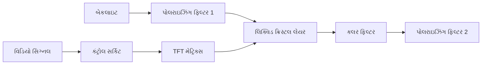

**કાર્યપ્રક્રિયા:**

1. **બેકલાઇટ**: CCFL અથવા LED સફેદ પ્રકાશનો સ્ત્રોત પૂરો પાડે છે
2. **TFT મેટ્રિક્સ**: થિન-ફિલ્મ ટ્રાન્ઝિસ્ટર્સ દરેક પિક્સેલ પર વોલ્ટેજને નિયંત્રિત કરે છે
3. **લિક્વિડ ક્રિસ્ટલ લેયર**: અણુઓ લાગુ વોલ્ટેજના આધારે વળે છે
4. **પોલરાઇઝર્સ**: પ્રથમ ફિલ્ટર પ્રકાશને સંરેખિત કરે છે, બીજો માત્ર ફેરવેલા પ્રકાશને પસાર કરે છે
5. **કલર ફિલ્ટર્સ**: RGB ફિલ્ટર્સ રંગીન પિક્સેલ બનાવે છે
6. **ઇમેજ ફોર્મેશન**: વેરિંગ વોલ્ટેજ દરેક પિક્સેલ દ્વારા પ્રકાશના માર્ગને નિયંત્રિત કરે છે

**ટેકનીકલ સ્પેસિફિકેશન:**

- **રેઝોલ્યુશન**: 1920×1080 (ફુલ HD) અથવા 3840×2160 (4K UHD)
- **રિફ્રેશ રેટ**: 60Hz, 120Hz, અથવા 240Hz

**મેમરી ટ્રીક:** "BALTIC: બેકલાઇટ રંગોને પ્રકાશિત કરવા માટે તરલ પદાર્થને સક્રિય કરે છે"

## પ્રશ્ન 2(અ) OR [3 ગુણ]

**ગ્રાસમેનનો નિયમ લખી તેને એડીટીવ મિક્સિંગના કોન્સેપ્ટથી સમજાવો.**

**જવાબ**:

**ગ્રાસમેનનો નિયમ:**
કોઈપણ રંગને ત્રણ પ્રાથમિક રંગોના રૈખિક સંયોજન દ્વારા મેળવી શકાય છે.

**એડિટિવ કલર મિક્સિંગ સમજૂતી:**

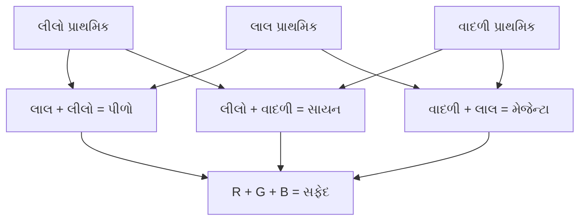

- **સિદ્ધાંત**: અલગ-અલગ રંગોનો પ્રકાશ ઉમેરવાથી નવા રંગો ઉત્પન્ન થાય છે
- **પ્રાથમિક રંગો**: લાલ, લીલો, અને વાદળી
- **ગૌણ રંગો**: પીળો (R+G), સાયન (G+B), મેજેન્ટા (B+R)
- **ઉદાહરણ**: RGB ની સમાન તીવ્રતા સફેદ પ્રકાશ બનાવે છે

**મેમરી ટ્રીક:** "RGB-ACM: લાલ લીલો વાદળી - ઉમેરણ વધુ રંગો બનાવે છે"

## પ્રશ્ન 2(બ) OR [4 ગુણ]

**ડીટીએચ રિસિવરનો બ્લોક ડાયાગ્રામ દોરો અને સમજાવો.**

**જવાબ**:

**ડાયાગ્રામ:**

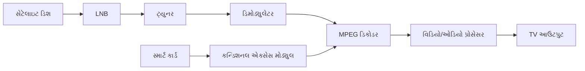

- **સેટેલાઇટ ડિશ**: નબળા સેટેલાઇટ સિગ્નલ્સ એકત્રિત કરે છે (10.7-12.75 GHz)
- **LNB** (લો નોઇઝ બ્લોક): સિગ્નલને એમ્પલિફાય કરે છે અને ઓછી ફ્રિક્વન્સીમાં રૂપાંતરિત કરે છે (950-2150 MHz)
- **ટ્યુનર**: ઇચ્છિત ટ્રાન્સપોન્ડર ફ્રિક્વન્સી પસંદ કરે છે
- **ડિમોડ્યુલેટર**: કેરિયર સિગ્નલમાંથી ડિજિટલ ડેટા કાઢે છે
- **MPEG ડિકોડર**: ઓડિયો/વિડિયો ડેટાને ડિકોમ્પ્રેસ કરે છે
- **CAM અને સ્માર્ટ કાર્ડ**: ડિક્રિપ્શન અને સબ્સ્ક્રિપ્શન વેરિફિકેશન પૂરા પાડે છે
- **આઉટપુટ**: ટેલિવિઝન પર પ્રદર્શિત કરવા માટે સિગ્નલ્સ પ્રોસેસ કરે છે

**મેમરી ટ્રીક:** "SLTD-MCS: સેટેલાઇટ્સ ડિકોડર્સ મારફતે ક્લિયર સિગ્નલ્સ જોડે છે"

## પ્રશ્ન 2(ક) OR [7 ગુણ]

**નીચે દશાર્વ્યા મુજબની ફ્રીક્વન્શી આપો. (used in color TV system)**

**જવાબ**:

| પેરામીટર | ફ્રિક્વન્સી/સ્ટાન્ડર્ડ |
|-----------|-------------------|
| **VIF (વિડિયો ઇન્ટરમીડિયેટ ફ્રિક્વન્સી)** | 38.9 MHz (PAL-B/G) |
| **SIF (સાઉન્ડ ઇન્ટરમીડિયેટ ફ્રિક્વન્સી)** | 33.4 MHz (PAL-B/G) |
| **કલર સબ કેરિયર ફ્રિક્વન્સી** | 4.43361875 MHz (PAL) |
| **વર્ટિકલ બ્લેન્કિંગ ફ્રિક્વન્સી** | 50 Hz (PAL) |
| **હોરિઝોન્ટલ સિંક ફ્રિક્વન્સી** | 15.625 kHz (PAL) |
| **ઇન્ટર કેરિયર સાઉન્ડ સિગ્નલ ફ્રિક્વન્સી** | 5.5 MHz (PAL-B/G) |
| **એક ચેનલની બેન્ડવીથ** | 7 MHz (VHF), 8 MHz (UHF) |

**મેમરી ટ્રીક:** "વિડિયો સ્પેશિયલ કલર વર્ટિકલી હોરિઝોન્ટલી ઇન્ટર ચેનલ"

## પ્રશ્ન 3(અ) [3 ગુણ]

**ફઝી લોજીક એટલે શું? વોશિંગ મશીનમાં તેનો ઉપયોગ સમજાવો.**

**જવાબ**:

**ફઝી લોજીક**: ગાણિતિક અભિગમ જે નિશ્ચિત, બાઇનરી લોજિકને બદલે આશરે તર્ક સાથે કામ કરે છે, 0 અને 1 વચ્ચે સત્ય મૂલ્યોની ડિગ્રીની મંજૂરી આપે છે.

**વોશિંગ મશીનમાં ઉપયોગ:**

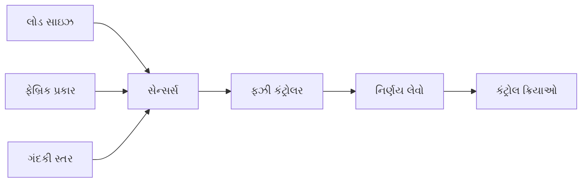

- **ઇનપુટ વેરિએબલ્સ**: લોડ વજન, ફેબ્રિક પ્રકાર, પાણીની કઠોરતા, ગંદકી સ્તર
- **પ્રોસેસિંગ**: કંટ્રોલર એકસાથે બહુવિધ સ્થિતિઓનું મૂલ્યાંકન કરે છે
- **આઉટપુટ**: પાણીનું સ્તર, ધોવાનો સમય, રિન્સ સાયકલ, સ્પિન સ્પીડ સમાયોજિત કરે છે

**મેમરી ટ્રીક:** "FIND: ફઝી ઇન્ટેલિજન્સ નિર્ણયોનું નેવિગેશન કરે છે"

## પ્રશ્ન 3(બ) [4 ગુણ]

**એર કન્ડીશનીંગની વ્યાખ્યા આપો. ફ્રિજની કાર્યપધ્ધતિ સમજાવો. ફ્રિજનાં ટેકનીકલ સ્પેસિફિકેશન લખો.**

**જવાબ**:

**એર કન્ડીશનીંગ**: આરામ સુધારવા માટે ઇનડોર હવામાંથી ગરમી અને ભેજ દૂર કરવાની પ્રક્રિયા.

**ફ્રિજ કાર્યપધ્ધતિ:**

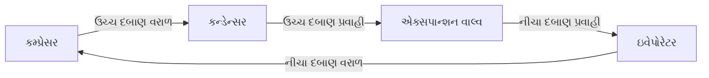

**કાર્ય સાયકલ:**

1. **કમ્પ્રેસર**: રેફ્રિજરન્ટ ગેસને કોમ્પ્રેસ કરે છે, તાપમાન વધારે છે
2. **કન્ડેન્સર**: ગરમ ગેસ બહારની હવામાં ગરમી છોડે છે, પ્રવાહી બની જાય છે
3. **એક્સપાન્શન વાલ્વ**: પ્રવાહી વિસ્તરે છે, ઝડપથી ઠંડું થાય છે
4. **ઇવેપોરેટર**: ઠંડું રેફ્રિજરન્ટ કેબિનેટની અંદરથી ગરમી શોષે છે

**ટેકનીકલ સ્પેસિફિકેશન્સ:**

- **કેપેસિટી**: 150-500 લિટર્સ
- **એનર્જી રેટિંગ**: 3-5 સ્ટાર
- **પાવર કન્ઝમ્પશન**: 100-300 kWh/વર્ષ

**મેમરી ટ્રીક:** "CEVA: કોમ્પ્રેસ, એક્સપેલ ગરમી, વાલ્વ એક્સપાન્ડ્સ, એબ્સોર્બ ગરમી"

## પ્રશ્ન 3(ક) [7 ગુણ]

**ફન્કશનલ ડાયાગ્રામ વડે માઈક્રોવેવ ઓવનની કાર્યપધ્ધતી સમજાવી તેના ટેકનીકલ સ્પેસિફિકેશન લખો.**

**જવાબ**:

**માઈક્રોવેવ ઓવન કાર્યપધ્ધતિ:**

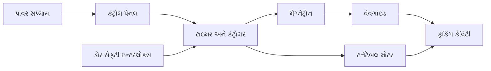

**કાર્યસિદ્ધાંત:**

1. **મેગ્નેટ્રોન**: 2.45 GHz ફ્રિક્વન્સી પર માઇક્રોવેવ્સ ઉત્પન્ન કરે છે
2. **વેવગાઇડ**: કુકિંગ કેવિટીમાં માઇક્રોવેવ્સનું માર્ગદર્શન કરે છે
3. **પાણીના અણુઓ**: માઇક્રોવેવ્સ પાણીના અણુઓને કંપિત કરે છે
4. **ગરમી ઉત્પાદન**: આણ્વિક કંપન ઘર્ષણ અને ગરમી પેદા કરે છે
5. **ટર્નટેબલ**: સમાન રાંધવા માટે ખોરાક ફેરવે છે
6. **સેફ્ટી ઇન્ટરલોક્સ**: ડોર ખુલ્લો હોય ત્યારે ઓપરેશન અટકાવે છે

**ટેકનીકલ સ્પેસિફિકેશન્સ:**

- **પાવર આઉટપુટ**: 700-1200 વોટ
- **ફ્રિક્વન્સી**: 2.45 GHz
- **કેપેસિટી**: 20-40 લિટર્સ
- **કુકિંગ મોડ્સ**: માઇક્રોવેવ, ગ્રિલ, કન્વેક્શન, કોમ્બિનેશન

**મેમરી ટ્રીક:** "MICRO: મેગ્નેટ્રોન કંપિત આંદોલનો દ્વારા રાંધવાની શરૂઆત કરે છે"

## પ્રશ્ન 3(અ) OR [3 ગુણ]

**સોલાર પેનલના ટેકનીકલ સ્પેસિફિકેશન આપો. સોલાર રૂફ ટોપ સીસ્ટમનાં ફાયદા અને ગેરફાયદા આપો.**

**જવાબ**:

**સોલાર પેનલ ટેકનીકલ સ્પેસિફિકેશન્સ:**

- **પાવર રેટિંગ**: 250-400 Wp (વોટ પીક)
- **કાર્યક્ષમતા**: 15-22%
- **સેલ પ્રકાર**: મોનોક્રિસ્ટલાઇન, પોલિક્રિસ્ટલાઇન, અથવા થિન ફિલ્મ

**ફાયદા અને ગેરફાયદા:**

| ફાયદા | ગેરફાયદા |
|------------|---------------|
| **નવીકરણીય ઊર્જા સ્ત્રોત** | **ઉચ્ચ પ્રારંભિક ખર્ચ** |
| **વીજળી બિલમાં ઘટાડો** | **હવામાન પર આધારિત** |
| **ઓછો જાળવણી ખર્ચ** | **મોટી જગ્યાની જરૂર** |
| **અવાજ પ્રદૂષણ નથી** | **રાત્રે મર્યાદિત ઉત્પાદન** |

**મેમરી ટ્રીક:** "SERLN: સોલાર એનર્જી લાંબા ગાળે ખર્ચ ઘટાડે છે"

## પ્રશ્ન 3(બ) OR [4 ગુણ]

**વોશિંગ મશીનનાં અલગ અલગ પ્રકારો જણાવી ફ્રન્ટલોડ અને ટોપ લોડ પ્રકારના વોશિંગ મશીન ની સરખામણી કરો.**

**જવાબ**:

**વોશિંગ મશીનના પ્રકારો:**

- ટોપ લોડ (એજિટેટર અને ઇમ્પેલર)
- ફ્રન્ટ લોડ
- સેમી-ઓટોમેટિક
- ફુલી ઓટોમેટિક

**સરખામણી:**

| પેરામીટર | ફ્રન્ટ લોડ | ટોપ લોડ |
|-----------|------------|----------|
| **પાણીનો વપરાશ** | ઓછો (40-60 લિટર) | વધારે (80-120 લિટર) |
| **ઊર્જા કાર્યક્ષમતા** | ઉચ્ચ | નીચી |
| **સફાઈ પ્રદર્શન** | વધુ સારું | સારું |
| **જગ્યાની જરૂરિયાત** | સ્ટેક કરી શકાય છે | ઉપર ક્લિયરન્સની જરૂર છે |
| **કિંમત** | ઉચ્ચ | નીચી |
| **સાયકલ સમયગાળો** | લાંબો (60-120 મિનિટ) | ટૂંકો (30-60 મિનિટ) |

**મેમરી ટ્રીક:** "FTEST: ફ્રન્ટ-લોડર વધારાની જગ્યા લે છે પરંતુ કાર્યક્ષમતામાં વિજય મેળવે છે"

## પ્રશ્ન 3(ક) OR [7 ગુણ]

**સોલાર રૂફ ટોપ સીસ્ટમને વર્ગીકૃત કરો. ગ્રીડ ક્નેકટેડ સોલાર રૂફ ટોપ સીસ્ટમને યોગ્ય ડાયાગ્રામ વડે સમજાવો. સોલાર રૂફ ટોપ સીસ્ટમની જાળવણી માટેના પગલા જણાવો.**

**જવાબ**:

**સોલાર રૂફટોપ સિસ્ટમનું વર્ગીકરણ:**

- **ગ્રિડ-કનેક્ટેડ** (ઓન-ગ્રિડ)
- **ઓફ-ગ્રિડ** (સ્ટેન્ડઅલોન)
- **હાઇબ્રિડ** (બેટરી બેકઅપ સાથે)

**ગ્રિડ-કનેક્ટેડ સોલાર સિસ્ટમ:**

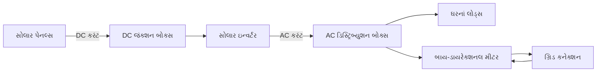

**કાર્યપ્રણાલી:**

1. **સોલાર પેનલ્સ**: સૂર્યપ્રકાશને DC વીજળીમાં રૂપાંતરિત કરે છે
2. **જંક્શન બોક્સ**: આઉટપુટ્સને જોડે છે, સુરક્ષા પ્રદાન કરે છે
3. **ઇન્વર્ટર**: DC ને ગ્રિડ-સંગત AC માં રૂપાંતરિત કરે છે
4. **ડિસ્ટ્રિબ્યુશન બોક્સ**: લોડ્સને પાવર વિતરિત કરે છે
5. **બાય-ડાયરેક્શનલ મીટર**: વીજળીના આયાત/નિકાસને માપે છે
6. **વધારાનું ઉત્પાદન**: ગ્રિડમાં પાછું ફીડ કરે છે (નેટ મીટરિંગ)

**જાળવણી પગલાં:**

1. પેનલોની નિયમિત સફાઈ (ધૂળ, પક્ષીઓનો કચરો)
2. ક્ષારના લીધે ઇલેક્ટ્રિકલ કનેક્શન તપાસવા
3. ઇન્વર્ટર ડેટા મારફતે સિસ્ટમ પરફોર્મન્સ મોનિટરિંગ
4. છાંયડો અટકાવવા નજીકના વૃક્ષોની છટણી
5. લાયક ટેકનિશિયન દ્વારા વાર્ષિક નિરીક્ષણ

**મેમરી ટ્રીક:** "SPICED: સોલાર પેનલ્સ ઇન્વર્ટ કરંટ ઇલેક્ટ્રિકલ ડિસ્ટ્રિબ્યુશન માટે"

## પ્રશ્ન 4(અ) [3 ગુણ]

**ફોટો કોપીયર મશીનનો કાર્યસિદ્ધાંત લેટેન્ટ ઇમેજના કોન્સેપ્ટ વડે ટૂંકમાં સમજાવો.**

**જવાબ**:

**ફોટોકોપિયર કાર્યસિદ્ધાંત:**

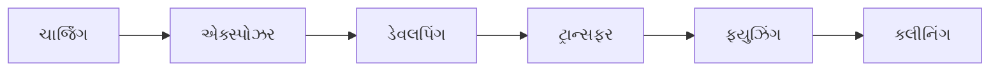

**લેટેન્ટ ઈમેજ કોન્સેપ્ટ:**

- **ચાર્જિંગ**: ફોટોસેન્સિટિવ ડ્રમને સમાન પોઝિટિવ ચાર્જ મળે છે
- **એક્સ્પોઝર**: પ્રકાશ મૂળ દસ્તાવેજમાંથી ડ્રમ પર પ્રતિબિંબિત થાય છે
- **લેટેન્ટ ઈમેજ**: પ્રકાશિત વિસ્તારો ડ્રમને ડિસ્ચાર્જ કરે છે, અદૃશ્ય ઇલેક્ટ્રોસ્ટેટિક ઈમેજ બનાવે છે
- **ડેવલપમેન્ટ**: નેગેટિવ ચાર્જ્ડ ટોનર કણો પોઝિટિવ એરિયા તરફ આકર્ષાય છે
- **ટ્રાન્સફર**: ઇલેક્ટ્રિકલ આકર્ષણ દ્વારા ટોનર કાગળ પર ટ્રાન્સફર થાય છે
- **ફ્યુઝિંગ**: ગરમી અને દબાણ ટોનરને કાગળ સાથે કાયમી રીતે જોડે છે

**મેમરી ટ્રીક:** "CEDTFC: ચાર્જિંગ એક્સ્પોઝર ડેવલપ્સ ધ ફાઇનલ કોપી"

## પ્રશ્ન 4(બ) [4 ગુણ]

**યોગ્ય ડાયાગ્રામ વડે લેસર પ્રિન્ટરનો કાર્યસિદ્ધાંત સમજાવો.**

**જવાબ**:

**લેસર પ્રિન્ટર કાર્યપદ્ધતિ:**

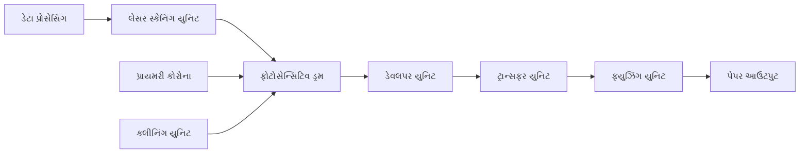

**કાર્યપ્રક્રિયા:**

1. **રાસ્ટર ઈમેજ પ્રોસેસિંગ**: કમ્પ્યુટર ડેટા બિટમેપમાં રૂપાંતરિત થાય છે
2. **ચાર્જિંગ**: કોરોના વાયર ડ્રમને એકસરખો નેગેટિવ ચાર્જ આપે છે
3. **રાઇટિંગ**: લેસર બીમ ઈમેજના પેટર્નમાં ચાર્જને ન્યુટ્રલાઈઝ કરે છે
4. **ડેવલપિંગ**: ટોનર ન્યુટ્રલાઈઝડ એરિયા તરફ આકર્ષાય છે
5. **ટ્રાન્સફર**: ટોનરને આકર્ષિત કરવા કાગળને પોઝિટિવ ચાર્જ આપવામાં આવે છે
6. **ફ્યુઝિંગ**: હીટ રોલર્સ ટોનરને કાગળ પર કાયમી રીતે પિગળાવે છે
7. **ક્લીનિંગ**: ડ્રમ પરથી વધારાનો ટોનર આગલા સાયકલ માટે દૂર કરવામાં આવે છે

**મેમરી ટ્રીક:** "RASTER: રાસ્ટર-ઈમેજ સ્ટેટિક ટોનર આકર્ષે છે, ઇલેક્ટ્રિસિટી રિલીઝ કરે છે"

## પ્રશ્ન 4(ક) [7 ગુણ]

**ઈંટરનેટ સાથે ક્નેક્ટેડ ડીજીટલ આઈપી કેમેરાવાળો સીસીટીવી સીસ્ટમનો ડાયાગ્રામ દોરીને સમજાવો. અલગ અલગ પાંચ કેમેરાનાં નામ આપો. પીઓઈ કેબલ એટલે શું?**

**જવાબ**:

**IP CCTV સિસ્ટમ:**

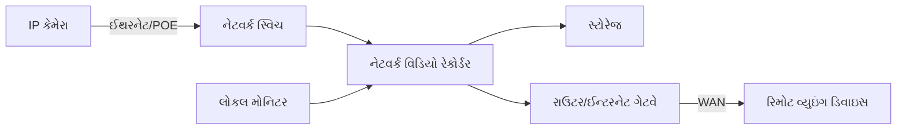

**કાર્યપદ્ધતિ:**

1. **IP કેમેરા**: વિડિયો કેપ્ચર કરી ડિજિટાઈઝ કરે છે
2. **નેટવર્ક ઇન્ફ્રાસ્ટ્રક્ચર**: TCP/IP પ્રોટોકોલ દ્વારા ડેટા ટ્રાન્સમિટ કરે છે
3. **NVR**: વિડિયો સ્ટ્રીમ રેકોર્ડ, મેનેજ અને પ્રોસેસ કરે છે
4. **સ્ટોરેજ**: હાર્ડ ડ્રાઈવ રેકોર્ડ કરેલ ફૂટેજ સંગ્રહ કરે છે
5. **રાઉટર**: રિમોટ વ્યુઇંગ માટે સુરક્ષિત ઇન્ટરનેટ એક્સેસ પ્રદાન કરે છે

**કેમેરાના પ્રકારો:**

1. **ડોમ કેમેરા**: ઇનડોર સીલિંગ-માઉન્ટેડ, વેન્ડલ-રેઝિસ્ટન્ટ
2. **બુલેટ કેમેરા**: આઉટડોર વોલ-માઉન્ટેડ, લોંગ-રેન્જ
3. **PTZ કેમેરા**: પેન, ટિલ્ટ, ઝૂમ ક્ષમતાઓ વિશાળ કવરેજ માટે
4. **ફિશઆઈ કેમેરા**: સિંગલ લેન્સ સાથે 360° પેનોરમિક વ્યુ
5. **થર્મલ કેમેરા**: અંધકારમાં હીટ સિગ્નેચર શોધે છે

**POE કેબલ**: પાવર ઓવર ઈથરનેટ - એક ટેકનોલોજી જે એક જ ઈથરનેટ કેબલ પર પાવર અને ડેટા બંને વહન કરે છે, અલગ પાવર કેબલની જરૂરિયાત દૂર કરે છે.

**મેમરી ટ્રીક:** "INSPIRE: ઇન્ટરનેટ નેટવર્કિંગ રિમોટ વાતાવરણમાં જગ્યાઓ સુરક્ષિત કરે છે"

## પ્રશ્ન 4(અ) OR [3 ગુણ]

**ઈંટરનેટ સાથે ક્નેક્ટેડ ડીજીટલ આઈપી કેમેરા વાળી સીસીટીવી સીસ્ટમનાં ફાયદા અને ગેરફાયદા આપો.**

**જવાબ**:

**IP કેમેરા CCTV સિસ્ટમના ફાયદા અને ગેરફાયદા:**

| ફાયદા | ગેરફાયદા |
|------|------|
| **ઉચ્ચ રેઝોલ્યુશન** (1080p થી 4K) | **ઉચ્ચ પ્રારંભિક ખર્ચ** |
| **રિમોટ વ્યુઇંગ** ઇન્ટરનેટ દ્વારા | **બેન્ડવિડ્થ જરૂરિયાતો** |
| **સ્કેલેબિલિટી** & સરળ વિસ્તરણ | **સાયબર સુરક્ષા જોખમો** |
| **પાવર ઓવર ઈથરનેટ** (POE) | **નેટવર્ક ડિપેન્ડન્સી** |
| **એડવાન્સ્ડ એનાલિટિક્સ** ક્ષમતાઓ | **જટિલ કોન્ફિગરેશન** |

**મેમરી ટ્રીક:** "HIGHER: હાઈ-રેઝોલ્યુશન ઇમેજ ગિવ્સ હાયર ઇવેલ્યુએશન રિમોટલી"

## પ્રશ્ન 4(બ) OR [4 ગુણ]

**ઈન્કજેટ પ્રિન્ટરને યોગ્ય ડાયાગ્રામ વડે સમજાવો.**

**જવાબ**:

**ઇન્કજેટ પ્રિન્ટર કાર્યપદ્ધતિ:**

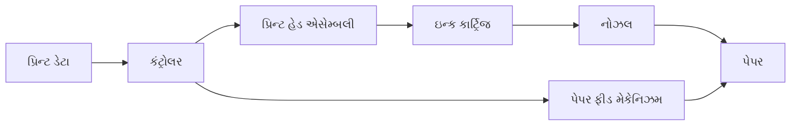

**કાર્યપ્રક્રિયા:**

1. **ડેટા પ્રોસેસિંગ**: કંટ્રોલર ડિજિટલ ડેટાને નોઝલ ઇન્સ્ટ્રક્શન્સમાં રૂપાંતરિત કરે છે
2. **પેપર લોડિંગ**: ફીડ રોલર્સ પેપરને યોગ્ય રીતે સ્થિત કરે છે
3. **પ્રિન્ટ હેડ મૂવમેન્ટ**: કેરિજ પેપર પર પ્રિન્ટહેડને ખસેડે છે
4. **ઇન્ક ઇજેક્શન**: બે પદ્ધતિઓ:
   - થર્મલ: નાના રેઝિસ્ટર્સ ઇન્કને ગરમ કરે છે જેથી બબલ્સ બને છે, ડ્રોપલેટ્સને દબાણ આપે છે
   - પિઝોઇલેક્ટ્રિક: ક્રિસ્ટલ તત્વો વળે છે જેથી ઇન્ક નોઝલ દ્વારા બહાર આવે છે
5. **સૂકવણી**: ઇન્ક પેપરની સપાટી પર ચોંટી જાય છે

**મેમરી ટ્રીક:** "PRINT: પેપર રિસીવ્સ ઇન્ક થ્રુ ન્યુમરસ ટાઇની-નોઝલ"

## પ્રશ્ન 4(ક) OR [7 ગુણ]

**સાદા કેમેરા અને ડીવીઆર વાળી સીસીટીવી સીસ્ટમનો ડાયાગ્રામ દોરો અને સમજાવો. વપરાતા અલગ અલગ પ્રકારનાં કેબલોની યાદી આપો. આધુનિક સીસીટીવી સીસ્ટમમાં વપરાતા અલગ અલગ પ્રકારનાં ચાર કેમેરાઓની ચર્ચા કરો.**

**જવાબ**:

**એનાલોગ CCTV સિસ્ટમ:**

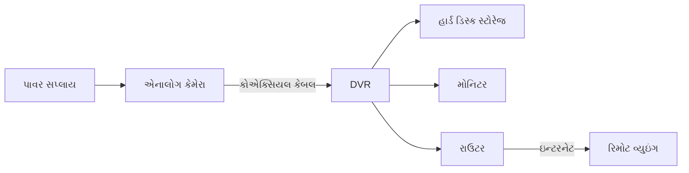

**કાર્યપદ્ધતિ:**

1. **એનાલોગ કેમેરા**: સતત એનાલોગ સિગ્નલ તરીકે વિડિયો કેપ્ચર કરે છે
2. **DVR**: એનાલોગ સિગ્નલને રેકોર્ડિંગ માટે ડિજિટલ ફોર્મેટમાં રૂપાંતરિત કરે છે
3. **સ્ટોરેજ**: આંતરિક હાર્ડ ડ્રાઇવ પર ફૂટેજ રેકોર્ડ કરે છે
4. **વ્યુઇંગ**: લોકલ મોનિટર્સ અને રિમોટ એક્સેસ વિકલ્પો

**કેબલના પ્રકારો:**

1. **કોએક્સિયલ કેબલ** (RG59, RG6): પરંપરાગત એનાલોગ કેમેરા કનેક્શન
2. **ટ્વિસ્ટેડ પેર** (CAT5/6): IP કેમેરા માટે અથવા બેલન્સ સાથે
3. **પાવર કેબલ**: કેમેરાઓને વીજળી પૂરી પાડે છે
4. **ફાઇબર ઓપ્ટિક**: લાંબા અંતરના ટ્રાન્સમિશન માટે
5. **સાયમીઝ કેબલ**: કોએક્સિયલ અને પાવર કેબલ સંયોજિત

**કેમેરા કેટેગરીઝ:**

1. **ફિક્સ્ડ કેમેરા**: સ્થિર વ્યુ એંગલ, કોઈ હલનચલન નહીં
2. **વેરિફોકલ કેમેરા**: અલગ-અલગ ફોકલ લંબાઈ માટે એડજસ્ટેબલ લેન્સ
3. **નાઇટ વિઝન કેમેરા**: ઓછા પ્રકાશમાં IR ઇલ્યુમિનેટર્સ
4. **હાઈ ડાયનેમિક રેન્જ (HDR)**: મિક્સ્ડ લાઇટિંગમાં બેલેન્સ્ડ એક્સપોઝર

**મેમરી ટ્રીક:** "CARD: કોએક્સિયલ એનાલોગ રેકોર્ડિંગ ડિવાઇસીસ"

## પ્રશ્ન 5(અ) [3 ગુણ]

**માત્ર વ્યાખ્યા આપો. : મેન્ટેનેન્સ, પ્રિવેન્ટીવ મેન્ટેનેન્સ અને પ્રેડીક્તિવ મેન્ટેનેન્સ**

**જવાબ**:

- **મેન્ટેનેન્સ**: નિયમિત નિરીક્ષણ, સફાઈ અને રિપેર દ્વારા ઉપકરણને યોગ્ય ઓપરેટિંગ સ્થિતિમાં જાળવવાની પ્રક્રિયા.
- **પ્રિવેન્ટિવ મેન્ટેનેન્સ**: ઉપકરણ નિષ્ફળતાઓ થાય તે પહેલાં તેને અટકાવવા માટે કરવામાં આવતી નિયોજિત જાળવણી પ્રવૃત્તિઓ.
- **પ્રેડિક્ટિવ મેન્ટેનેન્સ**: સ્થિતિ-આધારિત જાળવણી અભિગમ જે ઉપકરણ નિષ્ફળતા ક્યારે થઈ શકે તે અંગેની આગાહી કરવા માટે ડેટા એનાલિસિસ અને મોનિટરિંગ ટેકનિક્સનો ઉપયોગ કરે છે.

**મેમરી ટ્રીક:** "MPP: સક્રિય રીતે જાળવો, સમસ્યાઓની આગાહી કરો"

## પ્રશ્ન 5(બ) [4 ગુણ]

**પબ્લિક એડ્રેસ સીસ્ટમના મેન્ટેનેન્સની ચર્ચા કરો.**

**જવાબ**:

**PA સિસ્ટમ મેન્ટેનેન્સ:**

| કમ્પોનન્ટ | મેન્ટેનેન્સ કાર્યો |
|-----------|-------------------|
| **માઇક્રોફોન** | • વિન્ડસ્ક્રીન અને ગ્રીલ્સ સાફ કરો • નુકસાન માટે કેબલ્સ તપાસો • યોગ્ય સેન્સિટિવિટી માટે ટેસ્ટ કરો |
| **એમ્પ્લિફાયર** | • કૂલિંગ વેન્ટ્સ સાફ કરો • પાવર કનેક્શન્સ ચેક કરો • ઓવરહીટિંગ માટે તપાસો |
| **સ્પીકર્સ** | • માઉન્ટિંગ બ્રેકેટ્સ તપાસો • ડિસ્ટોર્શન માટે ટેસ્ટ કરો • વાયરિંગ કનેક્શન્સ ચેક કરો |
| **કેબલ્સ & કનેક્શન્સ** | • કન્ટિન્યુટી ટેસ્ટ કરો • ડેમેજ્ડ કેબલ્સ બદલો • ઢીલા કનેક્શન સુરક્ષિત કરો |

**પીરિયોડિક મેન્ટેનેન્સ:**

- અઠવાડિક: બેઝિક ઓપરેશન્સ ચેક
- માસિક: સિગ્નલ પાથ ટેસ્ટિંગ
- ત્રિમાસિક: વ્યાપક નિરીક્ષણ
- વાર્ષિક: પ્રોફેશનલ સર્વિસ

**મેમરી ટ્રીક:** "MACS: માઇક્રોફોન્સ, એમ્પ્લિફાયર્સ, કનેક્શન્સ, સ્પીકર્સ"

## પ્રશ્ન 5(ક) [7 ગુણ]

**વોશિંગ મશીનનાં કોઈ પણ ત્રણ ફોલ્ટ જણાવો. વોશિંગ મશીનનાં જનરલ મેન્ટેનેન્સની ચર્ચા કરો.**

**જવાબ**:

**સામાન્ય વોશિંગ મશીન ફોલ્ટ્સ:**

1. **પાણી ન ભરાવું**: ખરાબ ઇનલેટ વાલ્વ, ચોક્ડ ફિલ્ટર, પાણીના દબાણની સમસ્યાઓ
2. **સ્પિનિંગ ન કરવું**: બેલ્ટની સમસ્યાઓ, મોટર સમસ્યાઓ, અસંતુલિત લોડ
3. **વધુ પડતી કંપન**: અસમાન ફીટ, સસ્પેન્શન સમસ્યાઓ, ડ્રમ ડેમેજ

**જનરલ મેન્ટેનેન્સ:**

| કમ્પોનન્ટ | મેન્ટેનેન્સ પ્રક્રિયા |
|-----------|------------------------|
| **ડ્રમ/ટબ** | • અવશેષ દૂર કરવા માટે દર મહિને સાફ કરો • વિદેશી વસ્તુઓ માટે તપાસો • વાઇટ વિનેગર સાથે ક્લીનિંગ સાયકલ ચલાવો |
| **ફિલ્ટર્સ** | • દરેક ઉપયોગ પછી લિન્ટ ફિલ્ટર સાફ કરો • દર મહિને પમ્પ ફિલ્ટર સાફ કરો • દર ત્રિમાસિક પાણી ઇનલેટ ફિલ્ટર્સ તપાસો |
| **હોઝ** | • તિરાડો અથવા લીકેજ માટે તપાસો • દર 3-5 વર્ષે બદલો • યોગ્ય કનેક્શન સુનિશ્ચિત કરો |
| **ડોર સીલ** | • મોલ્ડ અટકાવવા માટે ઉપયોગ પછી સાફ કરો • ફાટેલા માટે તપાસો • ઉપયોગમાં ન હોય ત્યારે દરવાજો થોડો ખુલ્લો રાખો |
| **ડિસ્પેન્સર્સ** | • દર મહિને દૂર કરી સાફ કરો • બ્લોકેજ માટે તપાસો • ડિટરજન્ટ બિલ્ડઅપ દૂર કરો |

**મેમરી ટ્રીક:** "WATCH: પાણી અને ટબ ક્લિનિંગ મદદ કરે છે"

## પ્રશ્ન 5(અ) OR [3 ગુણ]

**પ્રેડીક્તિવ મેન્ટેનેન્સ અને પ્રિવેન્ટીવ મેન્ટેનેન્સની સરખામણી કરો.**

**જવાબ**:

**પ્રિડિક્ટિવ vs. પ્રિવેન્ટિવ મેન્ટેનેન્સની સરખામણી:**

| પેરામીટર | પ્રિડિક્ટિવ મેન્ટેનેન્સ | પ્રિવેન્ટિવ મેન્ટેનેન્સ |
|-----------|------------------------|-------------------------|
| **અભિગમ** | સ્થિતિ-આધારિત | સમય-આધારિત |
| **સમય** | ડેટાના આધારે જરૂર પડે ત્યારે | સ્થિતિને ધ્યાનમાં લીધા વિના ફિક્સ્ડ શેડ્યૂલ |
| **તકનીકો** | વાઇબ્રેશન એનાલિસિસ, થર્મલ ઇમેજિંગ, ઓઇલ એનાલિસિસ | વિઝ્યુઅલ ઇન્સ્પેક્શન, ક્લીનિંગ, લુબ્રિકેશન |
| **ખર્ચ** | ઉચ્ચ પ્રારંભિક સેટઅપ, લાંબા ગાળે ઓછો | નીચો પ્રારંભિક ખર્ચ, સંભવિત રીતે લાંબા ગાળે ઉચ્ચ |
| **ડાઉનટાઇમ** | મિનિમાઇઝ્ડ, આગળથી આયોજિત | નિયમિત શેડ્યૂલ્ડ ડાઉનટાઇમ |
| **ઉપકરણ ઉપયોગ** | મહત્તમ જીવનકાળ | કેટલાક કમ્પોનન્ટ્સ વહેલા બદલાય છે |

**મેમરી ટ્રીક:** "TIMED: ટેસ્ટિંગ બરાબર જરૂર પડે ત્યારે જ મેન્ટેનન્સ ઓળખે છે"

## પ્રશ્ન 5(બ) OR [4 ગુણ]

**એલસીડી ટીવીનાં મેન્ટેનેન્સ અને ટ્રબલ શૂટિંગની ચર્ચા કરો.**

**જવાબ**:

**LCD TV મેન્ટેનેન્સ:**

| કમ્પોનન્ટ | મેન્ટેનેન્સ કાર્યો |
|-----------|-------------------|
| **સ્ક્રીન** | • માઇક્રોફાઇબર કપડાથી સાફ કરો • લિક્વિડ ક્લીનર્સ ટાળો • ડેડ પિક્સેલ માટે તપાસો |
| **વેન્ટિલેશન** | • વેન્ટ્સમાંથી ધૂળ દૂર કરો • યોગ્ય એરફ્લો સુનિશ્ચિત કરો • ફેન ઓપરેશન ચેક કરો |
| **કનેક્શન્સ** | • કેબલ કનેક્શન્સ વેરિફાઇ કરો • ક્ષાર માટે તપાસો • HDMI પોર્ટ્સ ટેસ્ટ કરો |
| **સોફ્ટવેર** | • ફર્મવેર નિયમિત અપડેટ કરો • જરૂર પડે તો સેટિંગ્સ રીસેટ કરો |

**સામાન્ય ટ્રબલશૂટિંગ સમસ્યાઓ:**

| સમસ્યા | સંભવિત ઉકેલો |
|---------|-------------------|
| **પાવર નથી** | પાવર કોર્ડ, આઉટલેટ, આંતરિક ફ્યુઝ તપાસો |
| **પિક્ચર નથી** | ઇનપુટ સોર્સ, બેકલાઇટ ફેલ્યોર, T-Con બોર્ડ વેરિફાઇ કરો |
| **સ્ક્રીન પર લાઇન્સ** | રિબન કેબલ્સ, સ્ક્રીન ડેમેજ, T-Con બોર્ડ તપાસો |
| **ઓડિયો સમસ્યાઓ** | સ્પીકર કનેક્શન, ઓડિયો સેટિંગ્સ, એમ્પ્લિફાયર બોર્ડ |

**મેમરી ટ્રીક:** "PVCS: પિક્સેલ્સ, વેન્ટિલેશન, કનેક્શન્સ, સોફ્ટવેર"

## પ્રશ્ન 5(ક) OR [7 ગુણ]

**કોમ્પ્યુટર સિસ્ટમમાં લેસર પ્રિન્ટરના ઈન્સ્ટોલેશન પ્રક્રિયાને સમજાવો. તેના મેન્ટેનેન્સ અને ફોલ્ટ ફાઈન્ડીંગ સમજાવો.**

**જવાબ**:

**લેસર પ્રિન્ટર ઇન્સ્ટોલેશન:**

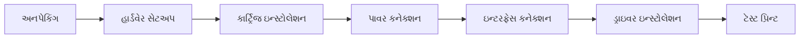

**ઇન્સ્ટોલેશન સ્ટેપ્સ:**

1. **સેટઅપ લોકેશન**: ફ્લેટ, સ્ટેબલ સરફેસ યોગ્ય વેન્ટિલેશન સાથે
2. **પેકેજિંગ રિમૂવ**: ટેપ, પ્રોટેક્ટિવ ફિલ્મ્સ, શિપિંગ લોક્સ દૂર કરો
3. **કન્ઝ્યુમેબલ્સ ઇન્સ્ટોલ**: ટોનર કાર્ટ્રિજ, ઇમેજિંગ ડ્રમ જો અલગ હોય
4. **પાવર કનેક્ટ**: ગ્રાઉન્ડેડ આઉટલેટમાં પ્લગ કરો
5. **ઇન્ટરફેસ કનેક્ટ**: USB, ઈથરનેટ, અથવા Wi-Fi સેટઅપ
6. **ડ્રાઇવર ઇન્સ્ટોલ**: ઇન્ક્લુડેડ CD અથવા મેન્યુફેક્ચરર વેબસાઇટથી
7. **સેટિંગ્સ કોન્ફિગર**: નેટવર્ક પેરામીટર્સ, પેપર સાઇઝ, ડિફોલ્ટ ટ્રે

**મેન્ટેનેન્સ:**

| કમ્પોનન્ટ | મેન્ટેનેન્સ કાર્ય |
|-----------|-----------------|
| **પેપર પાથ** | માસિક કોમ્પ્રેસ્ડ એર વડે સાફ કરો |
| **ટોનર એરિયા** | ટોનર બદલતી વખતે સાવચેતીથી વેક્યુમ કરો |
| **રોલર્સ** | ત્રિમાસિક આઇસોપ્રોપિલ આલ્કોહોલથી સાફ કરો |
| **એક્સટીરિયર** | જરૂર મુજબ ભીના કપડાથી સાફ કરો |

**ટ્રબલશૂટિંગ:**

| સમસ્યા | સોલ્યુશન |
|---------|----------|
| **પેપર જામ** | પેપર પાથ તપાસો, રોલર્સ સાફ કરો, પેપર સ્પેસિફિકેશન્સ વેરિફાય કરો |
| **સ્ટ્રીકિંગ** | કોરોના વાયર સાફ કરો, ડ્રમ ઘસાઈ ગયેલ હોય તો બદલો |
| **લાઇટ પ્રિન્ટિંગ** | ડેન્સિટી સેટિંગ્સ એડજસ્ટ કરો, ટોનર બદલો |
| **કનેક્શન સમસ્યાઓ** | કેબલ્સ તપાસો, ડ્રાઇવર્સ ફરીથી ઇન્સ્ટોલ કરો, પ્રિન્ટર રીસેટ કરો |

**મેમરી ટ્રીક:** "SECURE: સેટઅપ, એક્ઝિક્યુટ ડ્રાઇવર્સ, ક્લીન રેગ્યુલરલી, અપડેટ, રિપ્લેસ કન્ઝ્યુમેબલ્સ, એક્ઝામિન પ્રોબ્લેમ્સ"
