## Question 1(a) [3 marks]

**Give definition (Only) of Loudness, Fidelity and Reverberation**

**Answer**:

- **Loudness**: The subjective perception of sound intensity by the human ear, measured in decibels (dB).
- **Fidelity**: The degree to which a system reproduces sound that is faithful to the original input signal.
- **Reverberation**: The persistence of sound after the original sound source has stopped, caused by multiple reflections within an enclosed space.

**Mnemonic:** "LFR: Listen Faithfully to Room echoes"

## Question 1(b) [4 marks]

**Draw and explain block diagram of PA system**

**Answer**:

**Diagram:**

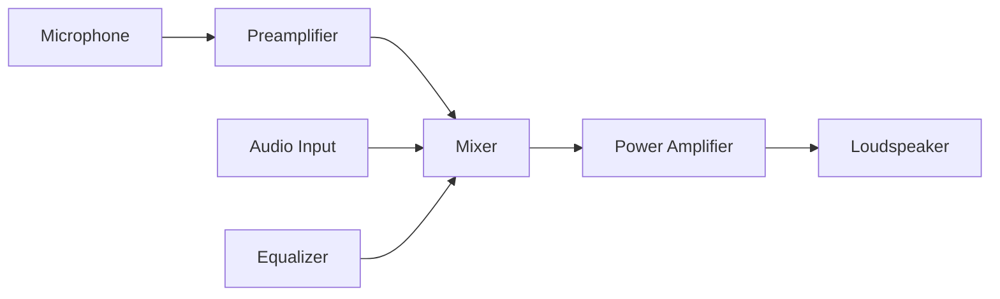

- **Microphone**: Converts sound waves into electrical signals
- **Preamplifier**: Boosts weak microphone signals to line level
- **Mixer**: Combines multiple audio signals and adjusts levels
- **Power Amplifier**: Increases signal power to drive loudspeakers
- **Loudspeaker**: Converts electrical signals back into sound waves

**Mnemonic:** "MPMEL: Many People Make Excellent Listeners"

## Question 1(c) [7 marks]

**Discuss any two characteristic of Microphone and Explain wireless microphone**

**Answer**:

**Microphone Characteristics:**

| Characteristic | Description |
|---------------|-------------|
| **Sensitivity** | Measures how efficiently microphone converts acoustic pressure to electrical output (mV/Pa) |
| **Directional Pattern** | Defines pickup area (omnidirectional, cardioid, hypercardioid, bidirectional) |

**Wireless Microphone:**

- **Microphone Element**: Captures sound and converts to electrical signals
- **RF Transmitter**: Modulates audio onto radio frequency carrier
- **Transmission**: Typical frequency bands are UHF (470-698 MHz) or VHF (174-216 MHz)
- **RF Receiver**: Demodulates signal back to audio
- **Advantages**: Mobility, no cable restrictions, reduces stage clutter

**Mnemonic:** "SMART: Sensitivity Measures Audio Response Truly"

## Question 1(c) OR [7 marks]

**Discuss any two characteristics of loudspeaker and explain permanent magnet loudspeaker.**

**Answer**:

**Loudspeaker Characteristics:**

| Characteristic | Description |
|---------------|-------------|
| **Frequency Response** | Range of frequencies (Hz) speaker can reproduce (typically 20Hz-20kHz) |
| **Impedance** | Electrical resistance (ohms) that affects power transfer from amplifier (typically 4-8Ω) |

**Permanent Magnet Loudspeaker:**

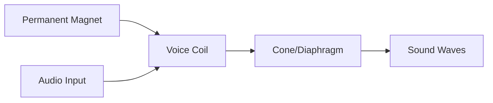

- **Permanent Magnet**: Creates fixed magnetic field (usually ferrite or neodymium)
- **Voice Coil**: Wire coil that carries audio current, creating variable magnetic field
- **Cone/Diaphragm**: Moves in response to voice coil movement
- **Working Principle**: Interaction between fixed magnetic field and varying field from voice coil creates mechanical movement
- **Advantages**: More efficient, no field coil power required, compact design

**Mnemonic:** "FIRM: Frequency Impedance Require Magnets"

## Question 2(a) [3 marks]

**Define only: Aspect ratio, Luminance and chrominance**

**Answer**:

- **Aspect Ratio**: The ratio of width to height of a television screen (commonly 16:9 for HDTV, 4:3 for older TVs).
- **Luminance**: The brightness component of a video signal that carries intensity information (represented as Y).
- **Chrominance**: The color component of a video signal that carries color information (represented as U and V or Cb and Cr).

**Mnemonic:** "ALC: All Light Contains color"

## Question 2(b) [4 marks]

**Draw PAL-D decoder only and explain separation of U and V component of chroma signal.**

**Answer**:

**Diagram:**

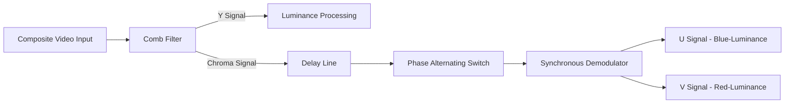

- **Comb Filter**: Separates luminance (Y) from chrominance signal
- **Delay Line**: Delays chroma signal by one line period (64μs)
- **Phase Alternating Switch**: Inverts V component on alternate lines
- **Synchronous Demodulator**: Uses subcarrier reference to extract U and V components
- **U Component**: Represents Blue-minus-Luminance (B-Y)
- **V Component**: Represents Red-minus-Luminance (R-Y)

**Mnemonic:** "CODES: Chrominance Only Decodes Extracting Signals"

## Question 2(c) [7 marks]

**Explain in detail working of LCD television. Give any two technical specifications of it.**

**Answer**:

**LCD Television Working:**

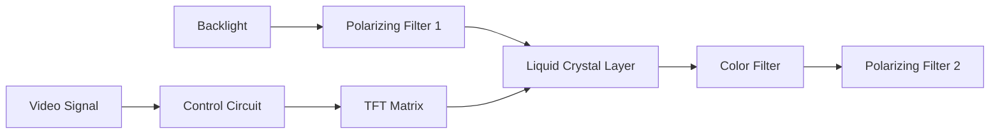

**Working Process:**

1. **Backlight**: CCFL or LED provides white light source
2. **TFT Matrix**: Thin-film transistors control voltage to each pixel
3. **Liquid Crystal Layer**: Molecules twist based on applied voltage
4. **Polarizers**: First filter aligns light, second passes only rotated light
5. **Color Filters**: RGB filters create colored pixels
6. **Image Formation**: Varying voltage controls light passage through each pixel

**Technical Specifications:**

- **Resolution**: 1920×1080 (Full HD) or 3840×2160 (4K UHD)
- **Refresh Rate**: 60Hz, 120Hz, or 240Hz

**Mnemonic:** "BALTIC: Backlight Activates Liquid To Illuminate Colors"

## Question 2(a) OR [3 marks]

**State Grassmens law & explain it with concept of additive mixing.**

**Answer**:

**Grassmann's Law:**
Any color can be matched by a linear combination of three primary colors.

**Additive Color Mixing Explanation:**

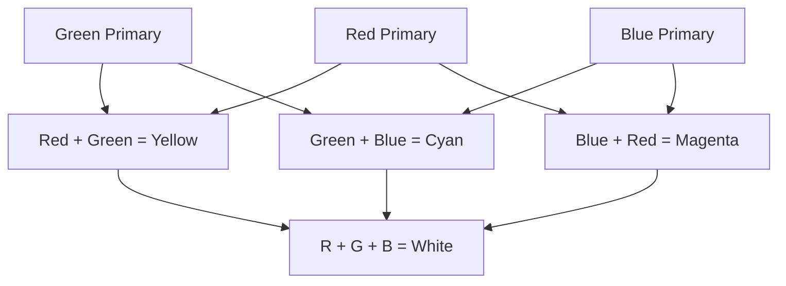

- **Principle**: Adding light of different colors creates new colors
- **Primary Colors**: Red, Green, and Blue
- **Secondary Colors**: Yellow (R+G), Cyan (G+B), Magenta (B+R)
- **Example**: Equal intensities of RGB create white light

**Mnemonic:** "RGB-ACM: Red Green Blue - Additive Creates More"

## Question 2(b) OR [4 marks]

**Draw block diagram of DTH receiver and explain it.**

**Answer**:

**Diagram:**

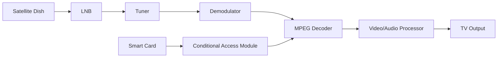

- **Satellite Dish**: Collects weak satellite signals (10.7-12.75 GHz)
- **LNB** (Low Noise Block): Amplifies and converts signal to lower frequency (950-2150 MHz)
- **Tuner**: Selects desired transponder frequency
- **Demodulator**: Extracts digital data from carrier signal
- **MPEG Decoder**: Decompresses audio/video data
- **CAM & Smart Card**: Provide decryption and subscription verification
- **Output**: Processes signals for display on television

**Mnemonic:** "SLTD-MCS: Satellites Link Through Decoders Making Clear Signals"

## Question 2(c) OR [7 marks]

**State following frequency/standard (used in color TV system)**

**Answer**:

| Parameter | Frequency/Standard |
|-----------|-------------------|
| **VIF (Video Intermediate Frequency)** | 38.9 MHz (PAL-B/G) |
| **SIF (Sound Intermediate Frequency)** | 33.4 MHz (PAL-B/G) |
| **Color Sub-carrier Frequency** | 4.43361875 MHz (PAL) |
| **Vertical Blanking Frequency** | 50 Hz (PAL) |
| **Horizontal Synchronizing Frequency** | 15.625 kHz (PAL) |
| **Inter Carrier Sound Signal Frequency** | 5.5 MHz (PAL-B/G) |
| **One Channel Bandwidth** | 7 MHz (VHF), 8 MHz (UHF) |

**Mnemonic:** "Very Special Colors Vertically Harmonize In One Channel"

## Question 3(a) [3 marks]

**What is fuzzy logic? Explain its usage in washing machine.**

**Answer**:

**Fuzzy Logic**: A mathematical approach that deals with approximate reasoning rather than fixed, binary logic, allowing for degrees of truth values between 0 and 1.

**Usage in Washing Machine:**

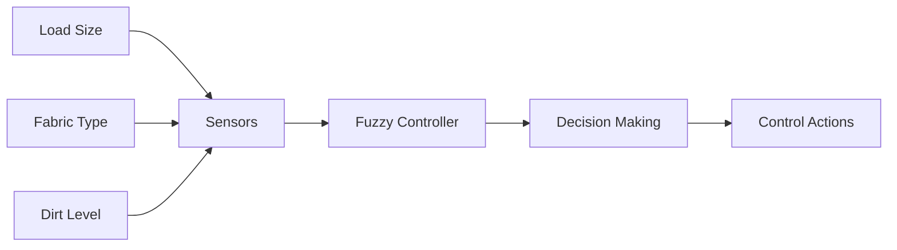

- **Input Variables**: Load weight, fabric type, water hardness, dirt level
- **Processing**: Controller evaluates multiple conditions simultaneously
- **Output**: Adjusts water level, wash time, rinse cycles, spin speed

**Mnemonic:** "FIND: Fuzzy Intelligence Navigates Decisions"

## Question 3(b) [4 marks]

**Define air conditioning. Explain working of fridge. State its technical specification.**

**Answer**:

**Air Conditioning**: The process of removing heat and moisture from indoor air to improve comfort.

**Refrigerator Working:**

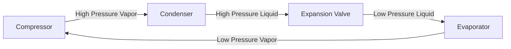

**Working Cycle:**

1. **Compressor**: Compresses refrigerant gas, raising temperature
2. **Condenser**: Hot gas releases heat to outside, becomes liquid
3. **Expansion Valve**: Liquid expands, cools rapidly
4. **Evaporator**: Cold refrigerant absorbs heat from inside cabinet

**Technical Specifications:**

- **Capacity**: 150-500 liters
- **Energy Rating**: 3-5 Star
- **Power Consumption**: 100-300 kWh/year

**Mnemonic:** "CEVA: Compress, Expel heat, Valve expands, Absorb heat"

## Question 3(c) [7 marks]

**Explain working principle of Microwave oven using functional block diagram. State its technical specifications.**

**Answer**:

**Microwave Oven Working:**

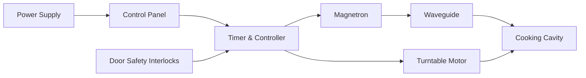

**Working Principle:**

1. **Magnetron**: Generates microwaves at 2.45 GHz frequency
2. **Waveguide**: Directs microwaves into cooking cavity
3. **Water Molecules**: Microwaves cause water molecules to vibrate
4. **Heat Generation**: Molecular vibration creates friction and heat
5. **Turntable**: Rotates food for even cooking
6. **Safety Interlocks**: Prevent operation when door is open

**Technical Specifications:**

- **Power Output**: 700-1200 watts
- **Frequency**: 2.45 GHz
- **Capacity**: 20-40 liters
- **Cooking Modes**: Microwave, Grill, Convection, Combination

**Mnemonic:** "MICRO: Magnetron Initiates Cooking by Rotating Oscillations"

## Question 3(a) OR [3 marks]

**Give technical specification of solar panel. State advantages and disadvantages of solar roof top system**

**Answer**:

**Solar Panel Technical Specifications:**

- **Power Rating**: 250-400 Wp (Watt peak)
- **Efficiency**: 15-22%
- **Cell Type**: Monocrystalline, Polycrystalline, or Thin Film

**Advantages and Disadvantages:**

| Advantages | Disadvantages |
|------------|---------------|
| **Renewable Energy Source** | **High Initial Cost** |
| **Reduces Electricity Bills** | **Weather Dependent** |
| **Low Maintenance Cost** | **Requires Large Space** |
| **No Noise Pollution** | **Limited Nighttime Generation** |

**Mnemonic:** "SERLN: Solar Energy Reduces Long-term Numbers"

## Question 3(b) OR [4 marks]

**State various types of washing machine. Compare frontload and top load washing machine.**

**Answer**:

**Types of Washing Machines:**

- Top Load (Agitator & Impeller)
- Front Load
- Semi-Automatic
- Fully Automatic

**Comparison:**

| Parameter | Front Load | Top Load |
|-----------|------------|----------|
| **Water Consumption** | Lower (40-60 liters) | Higher (80-120 liters) |
| **Energy Efficiency** | Higher | Lower |
| **Cleaning Performance** | Better | Good |
| **Space Requirement** | Can be stacked | Needs top clearance |
| **Cost** | Higher | Lower |
| **Cycle Duration** | Longer (60-120 min) | Shorter (30-60 min) |

**Mnemonic:** "FTEST: Front-loaders Take Extra Space but Triumph in efficiency"

## Question 3(c) OR [7 marks]

**Give classification of solar rooftop system. Explain working of solar rooftop system (Grid connected online) with suitable diagram. State steps to maintain solar roof top system.**

**Answer**:

**Classification of Solar Rooftop Systems:**

- **Grid-Connected** (On-grid)
- **Off-Grid** (Standalone)
- **Hybrid** (With battery backup)

**Grid-Connected Solar System:**

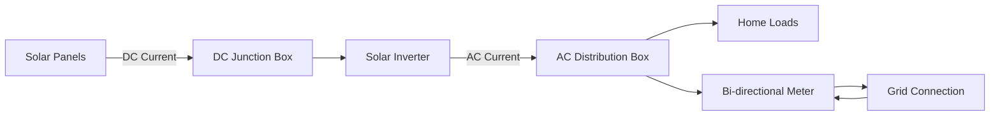

**Working:**

1. **Solar Panels**: Convert sunlight to DC electricity
2. **Junction Box**: Combines outputs, provides protection
3. **Inverter**: Converts DC to grid-compatible AC
4. **Distribution Box**: Distributes power to loads
5. **Bi-directional Meter**: Measures import/export of electricity
6. **Excess Generation**: Feeds back to grid (Net metering)

**Maintenance Steps:**

1. Regular cleaning of panels (dust, bird droppings)
2. Checking electrical connections for corrosion
3. Monitoring system performance via inverter data
4. Trimming nearby trees to prevent shading
5. Annual inspection by qualified technician

**Mnemonic:** "SPICED: Solar Panels Invert Current for Electrical Distribution"

## Question 4(a) [3 marks]

**Explain in brief working principle of photo copier machine with concept of latent image.**

**Answer**:

**Photocopier Working Principle:**

**Latent Image Concept:**

- **Charging**: Photosensitive drum receives uniform positive charge
- **Exposure**: Light reflects from original document onto drum
- **Latent Image**: Light areas discharge drum creating invisible electrostatic image
- **Development**: Negatively charged toner particles attracted to positive areas
- **Transfer**: Toner transferred to paper through electrical attraction
- **Fusing**: Heat and pressure permanently bond toner to paper

**Mnemonic:** "CEDTFC: Charging Exposure Develops The Final Copy"

## Question 4(b) [4 marks]

**Explain working of Laser printer with suitable diagram**

**Answer**:

**Laser Printer Working:**

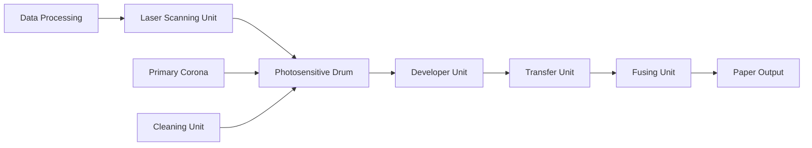

**Working Process:**

1. **Raster Image Processing**: Computer data converted to bitmap
2. **Charging**: Corona wire gives drum uniform negative charge
3. **Writing**: Laser beam neutralizes charge in pattern of image
4. **Developing**: Toner attracted to neutralized areas
5. **Transfer**: Paper given positive charge to attract toner
6. **Fusing**: Heat rollers melt toner permanently onto paper
7. **Cleaning**: Excess toner removed from drum for next cycle

**Mnemonic:** "RASTER: Raster-image Attracts Static Toner, Electricity Releases"

## Question 4(c) [7 marks]

**Draw and explain block diagram of CCTV system using Digital IP camera connected with internet. List at least five different camera used in CCTV system. What is meaning of POE cable?**

**Answer**:

**IP CCTV System:**

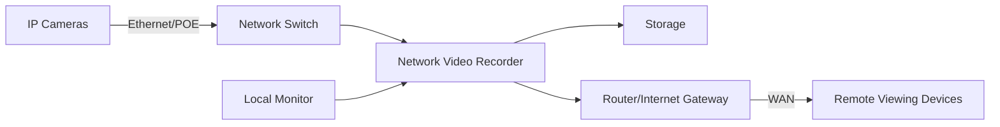

**Working:**

1. **IP Cameras**: Capture and digitize video
2. **Network Infrastructure**: Transmits data via TCP/IP protocols
3. **NVR**: Records, manages, and processes video streams
4. **Storage**: Hard drives store recorded footage
5. **Router**: Provides secure internet access for remote viewing

**Camera Types:**

1. **Dome Cameras**: Indoor ceiling-mounted, vandal-resistant
2. **Bullet Cameras**: Outdoor wall-mounted, long-range
3. **PTZ Cameras**: Pan, tilt, zoom capabilities for wide coverage
4. **Fisheye Cameras**: 360° panoramic view with single lens
5. **Thermal Cameras**: Detect heat signatures in darkness

**POE Cable**: Power Over Ethernet - A technology that carries both power and data over a single Ethernet cable, eliminating the need for separate power cables.

**Mnemonic:** "INSPIRE: Internet Networking Secures Places In Remote Environments"

## Question 4(a) OR [3 marks]

**Discuss pros and cons of internet based Digital IP camera CCTV system**

**Answer**:

**Pros and Cons of IP Camera CCTV Systems:**

| Pros | Cons |
|------|------|
| **Higher Resolution** (1080p to 4K) | **Higher Initial Cost** |
| **Remote Viewing** via internet | **Bandwidth Requirements** |
| **Scalability** & easy expansion | **Cybersecurity Risks** |
| **Power Over Ethernet** (POE) | **Network Dependency** |
| **Advanced Analytics** capabilities | **Complex Configuration** |

**Mnemonic:** "HIGHER: High-resolution Images Give Higher Evaluation Remotely"

## Question 4(b) OR [4 marks]

**Explain working of inkjet printer with suitable diagram**

**Answer**:

**Inkjet Printer Working:**

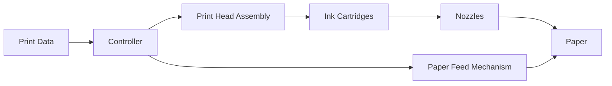

**Working Process:**

1. **Data Processing**: Controller converts digital data to nozzle instructions
2. **Paper Loading**: Feed rollers position paper correctly
3. **Print Head Movement**: Carriage moves printhead across paper
4. **Ink Ejection**: Two methods:
   - Thermal: Tiny resistors heat ink to create bubbles, forcing droplets
   - Piezoelectric: Crystal elements flex to push ink through nozzles
5. **Drying**: Ink adheres to paper surface

**Mnemonic:** "PRINT: Paper Receives Ink through Numerous Tiny-nozzles"

## Question 4(c) OR [7 marks]

**Draw and explain block diagram of CCTV system using simple analog camera and DVR. List types of cable used in CCTV system. Discuss at least four different categories of camera used in modern CCTV system.**

**Answer**:

**Analog CCTV System:**

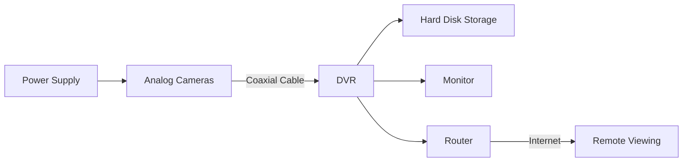

**Working:**

1. **Analog Cameras**: Capture video as continuous analog signals
2. **DVR**: Converts analog signals to digital format for recording
3. **Storage**: Records footage on internal hard drives
4. **Viewing**: Local monitors and remote access options

**Cable Types:**

1. **Coaxial Cable** (RG59, RG6): Traditional analog camera connection
2. **Twisted Pair** (CAT5/6): For IP cameras or with baluns
3. **Power Cable**: Supplies electricity to cameras
4. **Fiber Optic**: For long-distance transmissions
5. **Siamese Cable**: Combined coaxial and power cable

**Camera Categories:**

1. **Fixed Cameras**: Constant view angle, no movement
2. **Varifocal Cameras**: Adjustable lens for different focal lengths
3. **Night Vision Cameras**: IR illuminators for low-light conditions
4. **High Dynamic Range (HDR)**: Balanced exposure in mixed lighting

**Mnemonic:** "CARD: Coaxial Analog Recording Devices"

## Question 5(a) [3 marks]

**Define only: Maintenance, Preventive maintenance and Predictive maintenance.**

**Answer**:

- **Maintenance**: The process of preserving equipment in proper operating condition through regular inspection, cleaning, and repair.
- **Preventive Maintenance**: Scheduled maintenance activities performed to prevent equipment failures before they occur.
- **Predictive Maintenance**: Condition-based maintenance approach that uses data analysis and monitoring techniques to predict when equipment failure might occur.

**Mnemonic:** "MPP: Maintain Proactively, Predict problems"

## Question 5(b) [4 marks]

**Discuss maintenance of public address system.**

**Answer**:

**PA System Maintenance:**

| Component | Maintenance Tasks |
|-----------|-------------------|
| **Microphones** | • Clean windscreens and grilles • Check cables for damage • Test for proper sensitivity |
| **Amplifiers** | • Clean cooling vents • Check power connections • Inspect for overheating |
| **Speakers** | • Inspect mounting brackets • Test for distortion • Check wiring connections |
| **Cables & Connections** | • Test continuity • Replace damaged cables • Secure loose connections |

**Periodic Maintenance:**

- Weekly: Basic operations check
- Monthly: Signal path testing
- Quarterly: Comprehensive inspection
- Annually: Professional service

**Mnemonic:** "MACS: Microphones, Amplifiers, Connections, Speakers"

## Question 5(c) [7 marks]

**State any three faults of washing machine. Discuss in general maintenance of washing machine.**

**Answer**:

**Common Washing Machine Faults:**

1. **Water Not Filling**: Faulty inlet valve, clogged filter, water pressure issues
2. **Not Spinning**: Belt issues, motor problems, unbalanced load
3. **Excessive Vibration**: Uneven feet, suspension issues, drum damage

**General Maintenance:**

| Component | Maintenance Procedure |
|-----------|------------------------|
| **Drum/Tub** | • Clean monthly to remove residue • Check for foreign objects • Run cleaning cycle with white vinegar |
| **Filters** | • Clean lint filter after each use • Clean pump filter monthly • Check water inlet filters quarterly |
| **Hoses** | • Inspect for cracks or leaks • Replace every 3-5 years • Ensure proper connection |
| **Door Seal** | • Wipe after use to prevent mold • Check for tears • Keep door ajar when not in use |
| **Dispensers** | • Remove and clean monthly • Check for blockages • Remove detergent buildup |

**Mnemonic:** "WATCH: Water And Tub Cleaning Helps"

## Question 5(a) OR [3 marks]

**Compare predictive and preventive maintenance.**

**Answer**:

**Comparison of Predictive vs. Preventive Maintenance:**

| Parameter | Predictive Maintenance | Preventive Maintenance |
|-----------|------------------------|-------------------------|
| **Approach** | Condition-based | Time-based |
| **Timing** | When needed based on data | Fixed schedule regardless of condition |
| **Techniques** | Vibration analysis, thermal imaging, oil analysis | Visual inspection, cleaning, lubrication |
| **Cost** | Higher initial setup, lower long-term | Lower initial cost, potentially higher long-term |
| **Downtime** | Minimized, planned ahead | Regular scheduled downtime |
| **Equipment Usage** | Maximized lifespan | Some components replaced prematurely |

**Mnemonic:** "TIMED: Testing Identifies Maintenance Exactly when Due"

## Question 5(b) OR [4 marks]

**Discuss maintenance and troubleshooting of LCD TV.**

**Answer**:

**LCD TV Maintenance:**

| Component | Maintenance Tasks |
|-----------|-------------------|
| **Screen** | • Clean with microfiber cloth • Avoid liquid cleaners • Check for dead pixels |
| **Ventilation** | • Remove dust from vents • Ensure proper airflow • Check fan operation |
| **Connections** | • Verify cable connections • Check for corrosion • Test HDMI ports |
| **Software** | • Update firmware regularly • Reset settings if needed |

**Common Troubleshooting Issues:**

| Problem | Possible Solutions |
|---------|-------------------|
| **No Power** | Check power cord, outlet, internal fuse |
| **No Picture** | Verify input source, backlight failure, T-Con board |
| **Lines on Screen** | Check ribbon cables, screen damage, T-Con board |
| **Audio Issues** | Speaker connections, audio settings, amplifier board |

**Mnemonic:** "PVCS: Pixels, Ventilation, Connections, Software"

## Question 5(c) OR [7 marks]

**Explain installation of laser printers in your computer system. Discuss its maintenance and troubleshooting procedure.**

**Answer**:

**Laser Printer Installation:**

**Installation Steps:**

1. **Setup Location**: Flat, stable surface with proper ventilation
2. **Remove Packaging**: Remove tape, protective films, shipping locks
3. **Install Consumables**: Toner cartridge, imaging drum if separate
4. **Connect Power**: Plug into grounded outlet
5. **Connect Interface**: USB, Ethernet, or Wi-Fi setup
6. **Install Driver**: From included CD or manufacturer website
7. **Configure Settings**: Network parameters, paper size, default tray

**Maintenance:**

| Component | Maintenance Task |
|-----------|-----------------|
| **Paper Path** | Clean with compressed air monthly |
| **Toner Area** | Vacuum carefully when replacing toner |
| **Rollers** | Clean with isopropyl alcohol quarterly |
| **Exterior** | Wipe with damp cloth as needed |

**Troubleshooting:**

| Problem | Solution |
|---------|----------|
| **Paper Jams** | Check paper path, clean rollers, verify paper specifications |
| **Streaking** | Clean corona wire, replace drum if worn |
| **Light Printing** | Adjust density settings, replace toner |
| **Connection Issues** | Check cables, reinstall drivers, reset printer |

**Mnemonic:** "SECURE: Setup, Execute drivers, Clean Regularly, Update, Replace consumables, Examine problems"
