## પ્રશ્ન 1(અ) [3 marks]

**મેઇંટેનન્સ ના ભિન્ન પ્રકારો ટૂંકમા સમજાવો.**

**જવાબ**:

| મેઇંટેનન્સનો પ્રકાર | વિગત |
|---|---|
| **પ્રિવેન્ટિવ મેઇંટેનન્સ** | નિયમિત ચકાસણી અને સર્વિસિંગ દ્વારા બ્રેકડાઉન અટકાવવા |
| **કરેક્ટિવ મેઇંટેનન્સ** | ઉપકરણ ખરાબ થયા પછી કામગીરી પુનઃસ્થાપિત કરવા |
| **પ્રિડિક્ટિવ મેઇંટેનન્સ** | સ્થિતિ મોનિટરિંગનો ઉપયોગ કરીને મેઇંટેનન્સની જરૂર પડશે તે અગાઉથી નક્કી કરવું |

**મેમરી ટ્રીક:** "PCPro" - પ્રિવેન્ટિવ પ્રતિબંધિત કરે છે, કરેક્ટિવ સુધારે છે, પ્રિડિક્ટિવ આગાહી કરે છે

## પ્રશ્ન 1(બ) [4 marks]

**વોશિંગ મશીનના મેઇંટેનન્સની પ્રક્રિયા સમજાવો.**

**જવાબ**:

**વોશિંગ મશીનની મેઇંટેનન્સ પ્રક્રિયા:**


- **ફિલ્ટર સફાઈ**: દર મહિને લિન્ટ ફિલ્ટર કાઢીને સાફ કરવું
- **હોસ નિરીક્ષણ**: દર 3 મહિને તિરાડો અને લીકેજ માટે તપાસ કરવી
- **લોડ વિતરણ**: કંપન અટકાવવા માટે યોગ્ય સંતુલન સુનિશ્ચિત કરવું
- **ડ્રમ સફાઈ**: ત્રિમાસિક ખાલી ગરમ પાણીના ચક્ર સાથે વિનેગર ચલાવવું

**મેમરી ટ્રીક:** "FHLD" - ફિલ્ટર્સ, હોસેસ, લોડ્સ, ડ્રમને નિયમિત ધ્યાન આપવાની જરૂર છે

## પ્રશ્ન 1(ક) [7 marks]

**માઇક્રોવેવ ઓવન ના મેઇંટેનન્સ અને ટ્રબલશૂટિંગની પ્રક્રિયા સમજાવો.**

**જવાબ**:

**માઇક્રોવેવ ઓવનનું મેઇંટેનન્સ અને ટ્રબલશૂટિંગ:**

| મેઇંટેનન્સ કાર્ય | પ્રક્રિયા | આવર્તન |
|---|---|---|
| બાહ્ય સફાઈ | હળવા ડિટર્જન્ટથી સાફ કરવું | સાપ્તાહિક |
| આંતરિક સફાઈ | ખોરાકના કણો અને ગ્રીસ સાફ કરવા | દરેક છલકાય પછી |
| દરવાજાની સીલ ચેક | નુકસાન અથવા લીકેજ માટે તપાસ | માસિક |
| વેન્ટિલેશન ચેક | વેન્ટ્સ અવરોધિત ન હોય તે સુનિશ્ચિત કરવું | માસિક |

**ટ્રબલશૂટિંગ પ્રક્રિયા:**

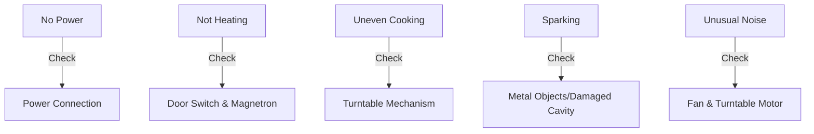

- **પાવર સમસ્યાઓ**: ફ્યુઝ, સર્કિટ બ્રેકર, અને કોર્ડ ચેક કરો
- **હીટિંગ સમસ્યાઓ**: દરવાજા સ્વિચ, હાઈ વોલ્ટેજ કેપેસિટર, મેગ્નેટ્રોન ટેસ્ટ કરો
- **સલામતી પ્રથમ**: ક્યારેય ડેમેજ્ડ દરવાજા અથવા સીલ સાથે ઓપરેટ ન કરો

**મેમરી ટ્રીક:** "POWER" - પાવર, ઓવન ઇન્ટીરિયર, વાયરિંગ, ઇલેક્ટ્રોનિક્સ, રેડિએશન સીલ્સ

## પ્રશ્ન 1(ક OR) [7 marks]

**પ્રોજેક્ટર ના મેઇંટેનન્સ અનેટ્રબલશૂટિંગની પ્રક્રિયા સમજાવો.**

**જવાબ**:

**પ્રોજેક્ટરનું મેઇંટેનન્સ અને ટ્રબલશૂટિંગ:**

| મેઇંટેનન્સ કાર્ય | પ્રક્રિયા | આવર્તન |
|---|---|---|
| લેન્સ સફાઈ | લેન્સ ક્લોથ અને સોલ્યુશન વાપરવું | માસિક |
| ફિલ્ટર સફાઈ | કાઢીને ધૂળ સાફ કરવી | દર 100 કલાકે |
| લેમ્પ ઇન્સ્પેક્શન | ડિસ્કલરેશન/ડિમિંગ માટે તપાસ | દર 300 કલાકે |
| વેન્ટિલેશન | યોગ્ય એરફ્લો સુનિશ્ચિત કરવું | દરેક ઉપયોગ પહેલાં |

**ટ્રબલશૂટિંગ પ્રક્રિયા:**

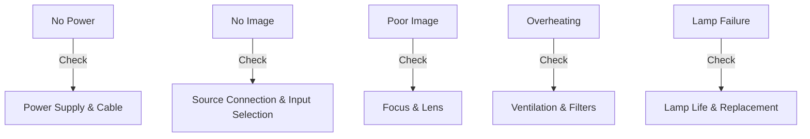

- **ઇમેજ સમસ્યાઓ**: ફોકસ, રેઝોલ્યુશન, કીસ્ટોન કરેક્શન એડજસ્ટ કરવું
- **લેમ્પ સમસ્યાઓ**: લેમ્પ કલાકો ચેક કરો, મર્યાદા વટાવી જાય તો બદલો
- **કનેક્ટિવિટી**: ઇનપુટ સોર્સ અને કેબલ કનેક્શનો ચકાસો
- **થર્મલ સમસ્યાઓ**: ફિલ્ટર્સ સાફ કરો અને યોગ્ય વેન્ટિલેશન સુનિશ્ચિત કરો

**મેમરી ટ્રીક:** "FLAMVE" - ફિલ્ટર્સ, લેમ્પ, એરફ્લો, માઉન્ટિંગ, વોલ્ટેજ, એન્વાયરમેન્ટ

## પ્રશ્ન 2(અ) [3 marks]

**પદો ટૂંક મા સમજાવો (1) હ્યુ (2) બ્રાઈટનેસ**

**જવાબ**:

| પદ | વિગત |
|---|---|
| **હ્યુ** | શુદ્ધ રંગ લક્ષણ જે રંગોને અલગ પાડે છે (લાલ, લીલો, વાદળી, વગેરે) પ્રકાશ તરંગલંબાઈના આધારે |
| **બ્રાઈટનેસ** | રંગમાંથી ઉત્સર્જિત અથવા પરાવર્તિત પ્રકાશની માત્રા, જે નક્કી કરે છે કે તે કેટલો પ્રકાશિત અથવા અંધકારમય દેખાય છે |

**ડાયાગ્રામ:**

```goat
             Hue
          (Color Type)
              ↑
              |
Saturation ←--+--→ Brightness
(Intensity)   |   (Lightness)
              ↓
            Value
```

**મેમરી ટ્રીક:** "HB-WC" - હ્યુ નક્કી કરે છે કયો રંગ, બ્રાઈટનેસ નક્કી કરે છે સફેદથી કાળા સ્તર

## પ્રશ્ન 2(બ) [4 marks]

**એલસીડી ટીવી પર ટૂંકનોંધ લખો**

**જવાબ**:

**એલસીડી ટીવી ટેકનોલોજી:**


- **કાર્ય સિદ્ધાંત**: લિક્વિડ ક્રિસ્ટલનો ઉપયોગ કરે છે જે પ્રકાશને પાસ/બ્લોક કરવા માટે ટ્વિસ્ટ/અનટ્વિસ્ટ થાય છે
- **મુખ્ય ઘટકો**: બેકલાઇટ, પોલરાઇઝિંગ ફિલ્ટર્સ, લિક્વિડ ક્રિસ્ટલ મેટ્રિક્સ, કલર ફિલ્ટર્સ
- **ફાયદાઓ**: પાતળી પ્રોફાઇલ, ઊર્જા કાર્યક્ષમ, કોઈ રેડિએશન નહીં, તીક્ષ્ણ છબી
- **મર્યાદાઓ**: મર્યાદિત વ્યૂઇંગ એંગલ, નવી ટેક્નોલોજી કરતાં ધીમો રિસ્પોન્સ ટાઇમ

**મેમરી ટ્રીક:** "BPLCS" - બેકલાઇટ પાસ લાઇટ થ્રુ ક્રિસ્ટલ્સ ટુ સ્ક્રીન

## પ્રશ્ન 2(ક) [7 marks]

**ડીટીએચ રિસિવર નો બ્લોક ડાયેગ્રામ દોરો અને સમજાવો.**

**જવાબ**:

**DTH રિસીવર બ્લોક ડાયાગ્રામ:**

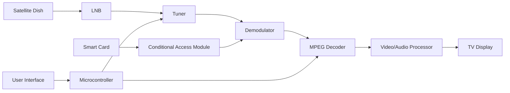

- **સેટેલાઇટ ડિશ**: સેટેલાઇટથી સિગ્નલ્સ કેપ્ચર કરે છે
- **LNB (લો નોઇઝ બ્લોક)**: ઉચ્ચ ફ્રિક્વન્સી સિગ્નલ્સને નીચી ફ્રિક્વન્સીમાં કન્વર્ટ કરે છે
- **ટ્યુનર**: ચોક્કસ ચેનલ ફ્રિક્વન્સી પસંદ કરે છે
- **ડિમોડ્યુલેટર**: કેરિયર સિગ્નલમાંથી ડિજિટલ માહિતી એક્સટ્રેક્ટ કરે છે
- **MPEG ડિકોડર**: વિડિયો/ઓડિયો ડેટા ડિકમ્પ્રેસ કરે છે
- **કન્ડિશનલ એક્સેસ મોડ્યુલ**: સબ્સ્ક્રિપ્શન ઍક્સેસ નિયંત્રિત કરે છે
- **માઇક્રોકન્ટ્રોલર**: સમગ્ર ઓપરેશન અને યુઝર ઇનપુટ્સ નિયંત્રિત કરે છે

**મેમરી ટ્રીક:** "SLTDMP" - સેટેલાઇટ, LNB, ટ્યુનર, ડિમોડ્યુલેટર, MPEG, પ્રોસેસર

## પ્રશ્ન 2(અ OR) [3 marks]

**પદો ટૂંક મા સમજાવો (1) લ્યુમિનેન્સ (2) ક્રોમિનેન્સ**

**જવાબ**:

| પદ | વિગત |
|---|---|
| **લ્યુમિનેન્સ** | વિડિયો સિગ્નલનો બ્રાઇટનેસ અથવા તીવ્રતા ઘટક (Y) જે બ્લેક અને વ્હાઇટ માહિતી લઈ જાય છે |
| **ક્રોમિનેન્સ** | વિડિયો સિગ્નલનો રંગ ઘટક (Cb, Cr) જે હ્યુ અને સેચુરેશન માહિતી લઈ જાય છે |

**ડાયાગ્રામ:**

```goat
Video Signal
    |
    +----------+----------+
    |                     |
Luminance (Y)      Chrominance (C)
(Brightness)         /         \
                    /           \
                   /             \
            Blue-Y (Cb)       Red-Y (Cr)
            (Blue diff)       (Red diff)
```

**મેમરી ટ્રીક:** "LC-BH" - લ્યુમિનેન્સ બ્રાઇટનેસ નિયંત્રિત કરે છે, ક્રોમિનેન્સ હ્યુ નિયંત્રિત કરે છે

## પ્રશ્ન 2(બ OR) [4 marks]

**ગ્રાસમેનનો નિયમ સમજાવો.**

**જવાબ**:

**ગ્રાસમેનના રંગ મિશ્રણના નિયમો:**

| નિયમ | વિગત |
|---|---|
| **સિમેટ્રી** | જો રંગ A, રંગ B સાથે મેળ ખાય છે, તો B, A સાથે મેળ ખાય છે |
| **પ્રોપોર્શનલિટી** | જો A, B સાથે મેળ ખાય છે, તો nA, nB સાથે મેળ ખાય છે (કોઈપણ તીવ્રતા n માટે) |
| **એડિટિવિટી** | જો A, B સાથે મેળ ખાય છે અને C, D સાથે મેળ ખાય છે, તો A+C, B+D સાથે મેળ ખાય છે |

- **એપ્લિકેશન**: ડિસ્પ્લેમાં RGB રંગ મોડેલનો આધાર બને છે
- **મહત્વ**: ત્રણ પ્રાથમિક રંગોને મિશ્રિત કરીને કોઈપણ રંગ બનાવવાની મંજૂરી આપે છે
- **મર્યાદા**: માત્ર પ્રકાશ (એડિટિવ મિક્સિંગ) માટે લાગુ પડે છે, પિગમેન્ટ્સ માટે નહીં

**મેમરી ટ્રીક:** "SPA Color" - સિમેટ્રી, પ્રોપોર્શનલિટી, એડિટિવિટી રંગ મેચિંગ માટેના નિયમો

## પ્રશ્ન 2(ક OR) [7 marks]

**કલર ટીવી રિસિવર નો બ્લોક ડાયેગ્રામ દોરો અને સમજાવો.**

**જવાબ**:

**કલર ટીવી રિસીવર બ્લોક ડાયાગ્રામ:**

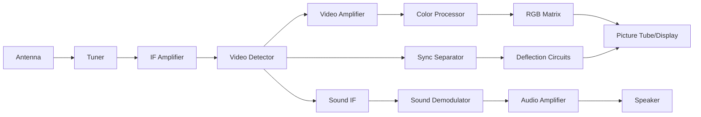

- **ટ્યુનર**: ઇચ્છિત ચેનલ ફ્રિક્વન્સી પસંદ કરે છે
- **IF એમ્પ્લિફાયર**: ઇન્ટરમીડિયેટ ફ્રિક્વન્સી સિગ્નલ્સને એમ્પ્લિફાય કરે છે
- **વિડિયો ડિટેક્ટર**: વિડિયો અને ઓડિયો માહિતી એક્સટ્રેક્ટ કરે છે
- **કલર પ્રોસેસર**: લ્યુમિનન્સ અને ક્રોમિનન્સને અલગ કરે છે
- **RGB મેટ્રિક્સ**: કલર સિગ્નલ્સને રેડ, ગ્રીન, બ્લુમાં કન્વર્ટ કરે છે
- **સિન્ક સેપરેટર**: હોરિઝોન્ટલ અને વર્ટિકલ સિન્ક એક્સટ્રેક્ટ કરે છે
- **ડિફ્લેક્શન સર્કિટ્સ**: ઇલેક્ટ્રોન બીમ સ્કેનિંગ નિયંત્રિત કરે છે

**મેમરી ટ્રીક:** "TIVCRDS" - ટ્યુનર, IF, વિડિયો, કલર, RGB, ડિફ્લેક્શન, સ્પીકર

## પ્રશ્ન 3(અ) [3 marks]

**સોલર પાવર સિસ્ટમના મેઇન કોમ્પોનન્ટો અને સોલર પાવર સિસ્ટમના સ્પેસિફિકેશનો લખો.**

**જવાબ**:

**સોલર પાવર સિસ્ટમના મુખ્ય ઘટકો:**

| ઘટક | કાર્ય |
|---|---|
| **સોલર પેનલ્સ** | સૂર્યપ્રકાશને વીજળીમાં રૂપાંતરિત કરે છે |
| **ચાર્જ કન્ટ્રોલર** | બેટરી ચાર્જિંગ નિયંત્રિત કરે છે |
| **બેટરી બેંક** | વીજ ઊર્જા સંગ્રહિત કરે છે |
| **ઈન્વર્ટર** | DCને AC વીજળીમાં રૂપાંતરિત કરે છે |
| **માઉન્ટિંગ સ્ટ્રક્ચર** | પેનલને ટેકો આપે છે અને પોઝિશન આપે છે |

**સ્પેસિફિકેશનો:**

- **પેનલ રેટિંગ**: 100-400W પ્રતિ પેનલ
- **બેટરી કેપેસિટી**: 100-200Ah
- **ઈન્વર્ટર રેટિંગ**: 500-5000W
- **સિસ્ટમ વોલ્ટેજ**: 12/24/48V

**મેમરી ટ્રીક:** "SCBIM" - સોલર પેનલ્સ, કન્ટ્રોલર, બેટરી, ઈન્વર્ટર, માઉન્ટિંગ

## પ્રશ્ન 3(બ) [4 marks]

**માઇક્રોવેવ ઓવન ના પ્રકારો, એપ્લિકેશનો અને ટેક્નિકલ સ્પેસિફિકેશનો લખો.**

**જવાબ**:

**માઇક્રોવેવ ઓવનના પ્રકારો:**

| પ્રકાર | વિશેષતાઓ |
|---|---|
| **સોલો** | માત્ર બેઝિક હીટિંગ અને ડિફ્રોસ્ટિંગ |
| **ગ્રિલ** | વધારાનું ગ્રિલિંગ એલિમેન્ટ |
| **કન્વેક્શન** | હીટિંગ એલિમેન્ટ અને બેકિંગ માટે ફેન ધરાવે છે |
| **કોમ્બિનેશન** | માઇક્રોવેવ, ગ્રિલ અને કન્વેક્શન એકીકૃત કરે છે |

**એપ્લિકેશનો:**

- ફૂડ રીહીટિંગ
- ડિફ્રોસ્ટિંગ
- કુકિંગ
- બેકિંગ (કન્વેક્શન મોડેલ્સ)

**ટેક્નિકલ સ્પેસિફિકેશનો:**

- **પાવર**: 700-1200 વોટ્સ
- **કેપેસિટી**: 20-40 લિટર
- **ફ્રિક્વન્સી**: 2.45 GHz
- **વોલ્ટેજ**: 220-240V AC

**મેમરી ટ્રીક:** "SGCC" - સોલો, ગ્રિલ, કન્વેક્શન, કોમ્બો ઓવન્સ વિવિધ કુકિંગ જરૂરિયાતો માટે

## પ્રશ્ન 3(ક) [7 marks]

**એર કંડીશનર અને રેફ્રિજરેટરની કાર્યપધ્ધતિ સમજાવો**

**જવાબ**:

**એર કંડીશનર અને રેફ્રિજરેટરનો કાર્ય સિદ્ધાંત:**

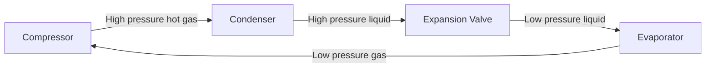

**સામાન્ય ઘટકો:**

- **કમ્પ્રેસર**: રેફ્રિજરન્ટ ગેસને દબાણ આપે છે
- **કન્ડેન્સર**: ગરમી છોડે છે, ગેસને પ્રવાહીમાં રૂપાંતરિત કરે છે
- **એક્સપાન્શન વાલ્વ**: પ્રવાહી રેફ્રિજરન્ટનું દબાણ ઘટાડે છે
- **ઇવેપોરેટર**: ગરમી શોષે છે, પ્રવાહીને ગેસમાં રૂપાંતરિત કરે છે

**તફાવતો:**

| પાસું | એર કંડીશનર | રેફ્રિજરેટર |
|---|---|---|
| **હેતુ** | સમગ્ર રૂમને ઠંડુ કરે છે | ઇન્સ્યુલેટેડ કેબિનેટમાં ઠંડક જાળવે છે |
| **તાપમાન** | સામાન્ય રીતે 18-26°C | 2-8°C (ફ્રિજ), -18°C (ફ્રીઝર) |
| **નિયંત્રણ** | રિમોટ સાથે થર્મોસ્ટેટ | મેન્યુઅલ અથવા ડિજિટલ થર્મોસ્ટેટ |

**મેમરી ટ્રીક:** "CEVA" - કમ્પ્રેશન, એક્સપાન્શન, વેપરાઇઝેશન, એબ્સોર્પશન સાયકલ

## પ્રશ્ન 3(અ OR) [3 marks]

**એર કંડીશનર અને રેફ્રિજરેટર ના ટેક્નિકલ સ્પેસિફિકેશનો લખો.**

**જવાબ**:

**ટેક્નિકલ સ્પેસિફિકેશનો:**

| સ્પેસિફિકેશન | એર કંડીશનર | રેફ્રિજરેટર |
|---|---|---|
| **કૂલિંગ કેપેસિટી** | 1-2 ટન (12,000-24,000 BTU) | 100-500 લિટર કેપેસિટી |
| **પાવર કન્ઝમ્પશન** | 1000-2500 વોટ્સ | 100-400 વોટ્સ |
| **એનર્જી એફિશિયન્સી** | ISEER/સ્ટાર રેટિંગ 3-5 | BEE સ્ટાર રેટિંગ 3-5 |
| **રેફ્રિજરન્ટ પ્રકાર** | R32, R410A | R600a, R134a |
| **વોલ્ટેજ/ફ્રિક્વન્સી** | 220-240V/50Hz | 220-240V/50Hz |

**મેમરી ટ્રીક:** "CPERS" - કેપેસિટી, પાવર, એફિશિયન્સી, રેફ્રિજરન્ટ, સપ્લાય સ્પેસિફિકેશન્સ

## પ્રશ્ન 3(બ OR) [4 marks]

**વોશિંગ મશીન માટે ઇલેક્ટ્રોનિક કંટ્રોલર સમજાવો.**

**જવાબ**:

**વોશિંગ મશીન માટે ઇલેક્ટ્રોનિક કંટ્રોલર:**

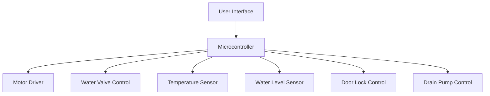

- **માઇક્રોકન્ટ્રોલર**: બધી ઓપરેશન નિયંત્રિત કરતું સેન્ટ્રલ પ્રોસેસિંગ યુનિટ
- **સેન્સર્સ**: વોટર લેવલ, તાપમાન, લોડ બેલેન્સ, દરવાજાની સ્થિતિ
- **એક્ચુએટર્સ**: મોટર ડ્રાઇવર, વોટર વાલ્વ, હીટર, ડ્રેઇન પમ્પ
- **યુઝર ઇન્ટરફેસ**: પ્રોગ્રામ સિલેક્શન, તાપમાન, સ્પિન સ્પીડ સેટિંગ્સ

**મેમરી ટ્રીક:** "MIST-WAD" - માઇક્રોકન્ટ્રોલર ઇન્ટિગ્રેટ્સ સેન્સર્સ અને ટાઇમર્સ ફોર વોટર, એજિટેશન એન્ડ ડ્રેનેજ

## પ્રશ્ન 3(ક OR) [7 marks]

**માઇક્રોવેવ ઓવન નો બ્લોક ડાયેગ્રામ દોરો અને સમજાવો. માઇક્રોવેવ ઓવન માટે વાયરિંગ અને સેફ્ટી ઇન્સ્ટ્રક્શન લખો.**

**જવાબ**:

**માઇક્રોવેવ ઓવન બ્લોક ડાયાગ્રામ:**

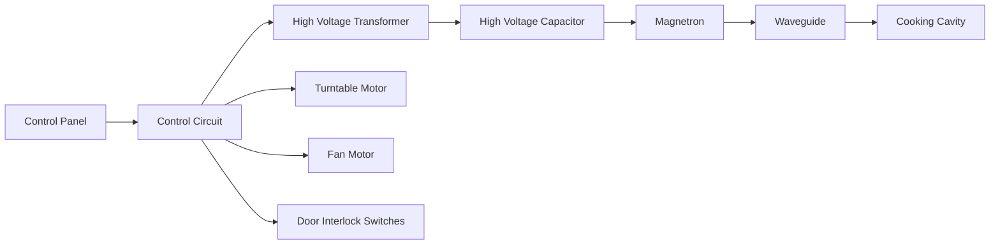

- **કન્ટ્રોલ સર્કિટ**: યુઝર ઇનપુટ્સ પ્રોસેસ કરે છે અને ટાઇમિંગ નિયંત્રિત કરે છે
- **હાઈ વોલ્ટેજ ટ્રાન્સફોર્મર**: વોલ્ટેજને 2000-4000V સુધી સ્ટેપ અપ કરે છે
- **મેગ્નેટ્રોન**: 2.45 GHz પર માઇક્રોવેવ રેડિએશન ઉત્પન્ન કરે છે
- **વેવગાઇડ**: માઇક્રોવેવ્સને કુકિંગ કેવિટીમાં દોરે છે
- **ટર્નટેબલ**: રોટેશન દ્વારા સમાન કુકિંગ સુનિશ્ચિત કરે છે

**સેફ્ટી ઇન્સ્ટ્રક્શન્સ:**

- દરવાજો ખુલ્લો અથવા ડેમેજ્ડ હોય ત્યારે ક્યારેય ઓપરેટ ન કરો
- યોગ્ય ગ્રાઉન્ડિંગ સુનિશ્ચિત કરો
- સેફ્ટી ઇન્ટરલૉક્સને ઓવરરાઇડ ન કરો
- ફક્ત માઇક્રોવેવ-સેફ કન્ટેનર વાપરો

**વાયરિંગ ઇન્સ્ટ્રક્શન્સ:**

- યોગ્ય ગેજ પાવર કેબલ વાપરો (સામાન્ય રીતે 14-16 AWG)
- 15-20A સર્કિટ સાથે જોડો
- યોગ્ય ગ્રાઉન્ડ કનેક્શન સુનિશ્ચિત કરો
- વાયરિંગને હીટ સોર્સથી દૂર રાખો

**મેમરી ટ્રીક:** "MAGIC" - મેગ્નેટ્રોન એન્ડ ગાઇડેડ વેવ્સ ઇનટુ કેવિટી

## પ્રશ્ન 4(અ) [3 marks]

**ફોટોકોપિયર નો બ્લોક ડાયેગ્રામ દોરો.**

**જવાબ**:

**ફોટોકોપિયર બ્લોક ડાયાગ્રામ:**

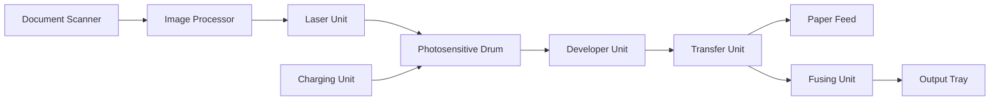

- **સ્કેનર**: મૂળ દસ્તાવેજની છબી કેપ્ચર કરે છે
- **ડ્રમ**: ઇલેક્ટ્રોસ્ટેટિક ઇમેજ ધારણ કરે છે
- **ડેવલપર**: ચાર્જ થયેલા એરિયા પર ટોનર લાગુ કરે છે
- **ટ્રાન્સફર**: ટોનરને પેપર પર ટ્રાન્સફર કરે છે
- **ફ્યુઝર**: ટોનરને કાયમી રીતે પેપર પર પિગળાવે છે

**મેમરી ટ્રીક:** "SDTFO" - સ્કેન, ડેવલપ, ટ્રાન્સફર, ફ્યુઝ, આઉટપુટ

## પ્રશ્ન 4(બ) [4 marks]

**એમએફ પ્રિંટર અને CCTV ના સ્પેસિફિકેશનો લખો.**

**જવાબ**:

**સ્પેસિફિકેશનો:**

| MF પ્રિંટર સ્પેસિફિકેશનો | CCTV સ્પેસિફિકેશનો |
|---|---|
| **પ્રિન્ટ રેઝોલ્યુશન**: 600-1200 dpi | **કેમેરા રેઝોલ્યુશન**: 2-8 MP |
| **પ્રિન્ટ સ્પીડ**: 15-40 ppm | **ફ્રેમ રેટ**: 15-30 fps |
| **સ્કેન રેઝોલ્યુશન**: 300-600 dpi | **સ્ટોરેજ**: 1-8 TB HDD/NVR |
| **પેપર કેપેસિટી**: 150-500 શીટ્સ | **નાઇટ વિઝન**: 10-30m રેન્જ |
| **કનેક્ટિવિટી**: USB, ઇથરનેટ, Wi-Fi | **કનેક્ટિવિટી**: કોએક્સિયલ/IP/વાયરલેસ |
| **ફંક્શન્સ**: પ્રિન્ટ, સ્કેન, કોપી, ફેક્સ | **વિડિયો ફોર્મેટ**: H.264/H.265 |

**મેમરી ટ્રીક:** "RSCPF" - રેઝોલ્યુશન, સ્પીડ, કેપેસિટી, પ્રોટોકોલ, ફંક્શન સ્પેસિફિકેશન્સ

## પ્રશ્ન 4(ક) [7 marks]

**લેસર પ્રિંટરની કાર્યપધ્ધતિ બ્લોક ડાયેગ્રામ સાથે સમજાવો**

**જવાબ**:

**લેસર પ્રિંટર કાર્યપધ્ધતિ:**

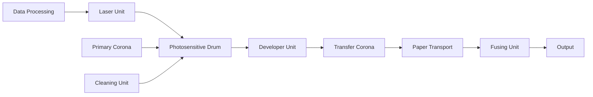

**કાર્ય પ્રક્રિયા:**

1. **ચાર્જિંગ**: કોરોના વાયર ડ્રમને યુનિફોર્મ નેગેટિવ ચાર્જ આપે છે
2. **રાઇટિંગ**: લેસર ઇમેજ બનાવવા માટે ડ્રમ પરના ચાર્જને ન્યુટ્રલાઇઝ કરે છે
3. **ડેવલપિંગ**: ટોનર ડ્રમના ડિસ્ચાર્જ થયેલા વિસ્તારો પર ચોંટે છે
4. **ટ્રાન્સફર**: પેપરને પોઝિટિવ ચાર્જ મળે છે, ટોનરને આકર્ષે છે
5. **ફ્યુઝિંગ**: હીટ અને પ્રેશર ટોનરને પેપર પર પિગળાવે છે
6. **ક્લીનિંગ**: ડ્રમ પરથી બાકી ટોનર દૂર કરવામાં આવે છે

- **રેઝોલ્યુશન**: લેસર પ્રિસિઝન દ્વારા નક્કી થાય છે (600-1200 dpi)
- **સ્પીડ**: ડ્રમ રોટેશન અને પેપર ટ્રાન્સપોર્ટ પર આધારિત છે (15-40 ppm)

**મેમરી ટ્રીક:** "CWTFC" - ચાર્જ, રાઇટ, ટ્રાન્સફર, ફ્યુઝ, ક્લીન સાયકલ

## પ્રશ્ન 4(અ OR) [3 marks]

**CCTV નો બ્લોક ડાયેગ્રામ દોરો.**

**જવાબ**:

**CCTV સિસ્ટમ બ્લોક ડાયાગ્રામ:**

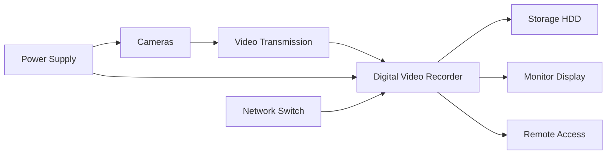

- **કેમેરા**: વિડિયો ફુટેજ કેપ્ચર કરે છે
- **ટ્રાન્સમિશન**: કોએક્સિયલ કેબલ/IP નેટવર્ક/વાયરલેસ
- **DVR/NVR**: વિડિયો પ્રોસેસ અને રેકોર્ડ કરે છે
- **સ્ટોરેજ**: ફુટેજ રિટેન્શન માટે હાર્ડ ડ્રાઇવ
- **મોનિટર**: લાઇવ અથવા રેકોર્ડેડ ફુટેજ દર્શાવે છે

**મેમરી ટ્રીક:** "CTDSM" - કેમેરા, ટ્રાન્સમિશન, DVR, સ્ટોરેજ, મોનિટર સિસ્ટમ

## પ્રશ્ન 4(બ OR) [4 marks]

**ઇંક જેટ પ્રિંટર અને ફોટોકોપિયર ના સ્પેસિફિકેશનો લખો.**

**જવાબ**:

**સ્પેસિફિકેશનો:**

| ઇંક જેટ પ્રિંટર સ્પેસિફિકેશનો | ફોટોકોપિયર સ્પેસિફિકેશનો |
|---|---|
| **પ્રિન્ટ રેઝોલ્યુશન**: 1200-4800 dpi | **કોપી રેઝોલ્યુશન**: 600-1200 dpi |
| **પ્રિન્ટ સ્પીડ**: 8-20 ppm | **કોપી સ્પીડ**: 20-60 cpm |
| **ઇન્ક પ્રકાર**: ડાય/પિગમેન્ટ | **ટોનર પ્રકાર**: ડ્રાય/લિક્વિડ |
| **પેપર કેપેસિટી**: 100-250 શીટ્સ | **પેપર કેપેસિટી**: 250-2000 શીટ્સ |
| **કનેક્ટિવિટી**: USB, Wi-Fi | **ફંક્શન્સ**: કોપી, સ્કેન, પ્રિન્ટ, ફેક્સ |
| **ડ્યુટી સાયકલ**: 1,000-5,000 પેજ/મહિનો | **ડ્યુટી સાયકલ**: 10,000-100,000 પેજ/મહિનો |

**મેમરી ટ્રીક:** "RSIPCD" - રેઝોલ્યુશન, સ્પીડ, ઇન્ક/ટોનર, પેપર કેપેસિટી, કનેક્ટિવિટી, ડ્યુટી સાયકલ

## પ્રશ્ન 4(ક OR) [7 marks]

**એલસીડી પ્રોજેક્ટરની કાર્યપધ્ધતિ બ્લોક ડાયેગ્રામ સાથે સમજાવો અને તેના ટેક્નિકલ સ્પેસિફિકેશનો લખો.**

**જવાબ**:

**LCD પ્રોજેક્ટર કાર્યપધ્ધતિ:**

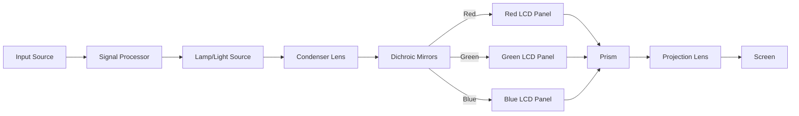

**કાર્ય પ્રક્રિયા:**

1. **લાઇટ જનરેશન**: હાઈ-ઇન્ટેન્સિટી લેમ્પ વ્હાઈટ લાઇટ ઉત્પન્ન કરે છે
2. **કલર સેપરેશન**: ડાયક્રોઇક મિરર લાઇટને RGB માં વિભાજિત કરે છે
3. **મોડ્યુલેશન**: LCD પેનલ દરેક રંગ માટે લાઇટ ઇન્ટેન્સિટી નિયંત્રિત કરે છે
4. **રિકોમ્બિનેશન**: પ્રિઝમ RGB ઇમેજને ફરીથી એકત્રિત કરે છે
5. **પ્રોજેક્શન**: લેન્સ સિસ્ટમ ઇમેજને સ્ક્રીન પર પ્રોજેક્ટ કરે છે

**સ્પેસિફિકેશનો:**

- **રેઝોલ્યુશન**: XGA (1024×768), WXGA (1280×800), FHD (1920×1080)
- **બ્રાઇટનેસ**: 2000-5000 ANSI લુમેન્સ
- **કોન્ટ્રાસ્ટ રેશિયો**: 2000:1 થી 20000:1
- **લેમ્પ લાઇફ**: 3000-6000 કલાક
- **થ્રો રેશિયો**: 0.5:1 થી 2.0:1
- **કનેક્ટિવિટી**: HDMI, VGA, USB, Wi-Fi

**મેમરી ટ્રીક:** "LSPMPS" - લેમ્પ, સ્પ્લિટ, પેનલ્સ, મોડ્યુલેટ, પ્રિઝમ, સ્ક્રીન

## પ્રશ્ન 5(અ) [3 marks]

**પીએ સિસ્ટમનો બ્લોક ડાયેગ્રામ દોરો**

**જવાબ**:

**પબ્લિક એડ્રેસ (PA) સિસ્ટમ બ્લોક ડાયાગ્રામ:**

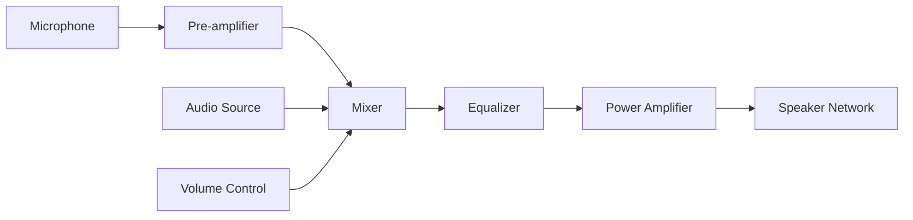

- **માઇક્રોફોન**: ધ્વનિને ઇલેક્ટ્રિકલ સિગ્નલમાં રૂપાંતરિત કરે છે
- **પ્રી-એમ્પ્લિફાયર**: માઇક્રોફોન સિગ્નલને બૂસ્ટ કરે છે
- **મિક્સર**: મલ્ટિપલ ઓડિયો સોર્સને જોડે છે
- **ઇક્વલાઇઝર**: ફ્રિક્વન્સી રિસ્પોન્સ એડજસ્ટ કરે છે
- **પાવર એમ્પ્લિફાયર**: સિગ્નલ પાવર વધારે છે
- **સ્પીકર્સ**: ઇલેક્ટ્રિકલ સિગ્નલને પાછા ધ્વનિમાં કન્વર્ટ કરે છે

**મેમરી ટ્રીક:** "MMEPS" - માઇક્રોફોન, મિક્સર, ઇક્વલાઇઝર, પાવર એમ્પ, સ્પીકર્સ

## પ્રશ્ન 5(બ) [4 marks]

**ટ્વીટર અને વૂફર સમજાવો**

**જવાબ**:

**સ્પીકર કોમ્પોનન્ટ્સ:**

| ફીચર | ટ્વીટર | વૂફર |
|---|---|---|
| **ફ્રિક્વન્સી રેન્જ** | હાઈ (2kHz-20kHz) | લો (20Hz-2kHz) |
| **સાઇઝ** | સ્મોલ (0.5"-1.5") | લાર્જ (4"-15") |
| **ડાયાફ્રામ** | લાઇટ, રિજિડ (ડોમ/કોન) | હેવી, ફ્લેક્સિબલ કોન |
| **વોઇસ કોઇલ** | સ્મોલ ડાયામીટર | લાર્જ ડાયામીટર |
| **કેબિનેટ ડિઝાઇન** | હોર્ન/સીલ્ડ | પોર્ટેડ/સીલ્ડ/બાસ રિફ્લેક્સ |

**કાર્ય સિદ્ધાંત:**

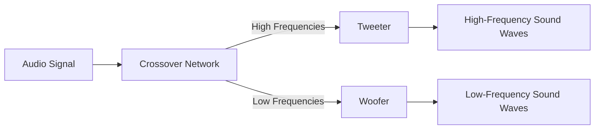

- **ટ્વીટર**: ઉચ્ચ આવૃત્તિઓને સ્પષ્ટતા અને વિગતવાર રીતે રીપ્રોડ્યુસ કરે છે
- **વૂફર**: ઓછી આવૃત્તિઓને પાવર અને ડેપ્થ સાથે રીપ્રોડ્યુસ કરે છે

**મેમરી ટ્રીક:** "THSL" - ટ્વીટર્સ હેન્ડલ હાઇસ, સ્મોલ એન્ડ લાઇટ; વૂફર્સ હેન્ડલ લોસ

## પ્રશ્ન 5(ક) [7 marks]

**માઇક્રોફોનની વ્યાખ્યા આપો. માઇક્રોફોનના પ્રકારો લખો અને કોઇ પણ એક માઇક્રોફોનની કાર્યપધ્ધતિ સમજાવો.**

**જવાબ**:

**માઇક્રોફોનની વ્યાખ્યા:**
માઇક્રોફોન એક ઇલેક્ટ્રોએકોસ્ટિક ટ્રાન્સડ્યુસર છે જે ધ્વનિ તરંગોને ઇલેક્ટ્રિકલ સિગ્નલમાં રૂપાંતરિત કરે છે.

**માઇક્રોફોનના પ્રકારો:**

| પ્રકાર | કાર્ય સિદ્ધાંત | એપ્લિકેશન્સ |
|---|---|---|
| **ડાયનેમિક** | ઇલેક્ટ્રોમેગ્નેટિક ઇન્ડક્શન | લાઇવ પરફોર્મન્સ, બ્રોડકાસ્ટિંગ |
| **કન્ડેન્સર** | ઇલેક્ટ્રોસ્ટેટિક પ્રિન્સિપલ | સ્ટુડિયો રેકોર્ડિંગ, સ્માર્ટફોન |
| **રિબન** | ઇલેક્ટ્રોમેગ્નેટિક ઇન્ડક્શન | સ્ટુડિયો વોકલ્સ, ઇન્સ્ટ્રુમેન્ટ્સ |
| **કાર્બન** | રેઝિસ્ટન્સ વેરિએશન | જૂના ટેલિફોન |
| **પિઝોઇલેક્ટ્રિક** | પિઝોઇલેક્ટ્રિક ઇફેક્ટ | કોન્ટેક્ટ માઇક, ઇન્સ્ટ્રુમેન્ટ્સ |
| **MEMS** | માઇક્રો-ઇલેક્ટ્રોમિકેનિકલ | લેપટોપ, નાના ડિવાઇસ |

**ડાયનેમિક માઇક્રોફોન કાર્યપધ્ધતિ:**


- **સાઉન્ડ કેપ્ચર**: ડાયાફ્રામ ધ્વનિ તરંગો સાથે કંપન કરે છે
- **ટ્રાન્સડક્શન**: ડાયાફ્રામ સાથે જોડાયેલી કોઇલ ચુંબકીય ક્ષેત્રમાં હલનચલન કરે છે
- **સિગ્નલ જનરેશન**: હલનચલન ધ્વનિની તીવ્રતાના પ્રમાણમાં વોલ્ટેજ પ્રેરિત કરે છે
- **આઉટપુટ**: ઓછા ઇમ્પિડન્સ, મજબૂત સિગ્નલ જેને ન્યૂનતમ એમ્પ્લિફિકેશનની જરૂર પડે છે
- **ફાયદાઓ**: ટકાઉ, ઉચ્ચ SPL સંભાળી શકે છે, બાહ્ય પાવરની જરૂર નથી

**મેમરી ટ્રીક:** "DDCMIO" - ડાયાફ્રામ ડિસ્પ્લેસિસ કોઇલ ઇન મેગ્નેટિક ફિલ્ડ ઇન્ડ્યુસિંગ આઉટપુટ

## પ્રશ્ન 5(અ OR) [3 marks]

**વ્યાખ્યા આપો: (૧) પિચ (૨) લાઉડસ્પીકર (3) રીવર્બરેશન**

**જવાબ**:

**વ્યાખ્યાઓ:**

| પદ | વ્યાખ્યા |
|---|---|
| **પિચ** | ધ્વનિની અનુભવાતી આવૃત્તિ જે નક્કી કરે છે કે તે કેટલો "ઊંચો" અથવા "નીચો" સંભળાય છે |
| **લાઉડસ્પીકર** | એક ઇલેક્ટ્રોએકોસ્ટિક ટ્રાન્સડ્યુસર જે ઇલેક્ટ્રિકલ સિગ્નલને ધ્વનિ તરંગોમાં રૂપાંતરિત કરે છે |
| **રીવર્બરેશન** | મૂળ ધ્વનિ બંધ થયા પછી પણ બહુવિધ પરાવર્તનોને કારણે ધ્વનિની સાતત્યતા |

**ડાયાગ્રામ:**

```goat
Reverberation
    |
    v
Original Sound -----> Early Reflections -----> Late Reflections
    ^                       |                       |
    |                       v                       v
Direct Sound           Clarity (≤80ms)       Spaciousness (>80ms)
```

**મેમરી ટ્રીક:** "PLR Sound" - પિચ ટોન વ્યાખ્યાયિત કરે છે, લાઉડસ્પીકર તેને ઉત્પન્ન કરે છે, રીવર્બરેશન તેને વિસ્તારે છે

## પ્રશ્ન 5(બ OR) [4 marks]

**હોમ થિયેટર સાઉંડ સિસ્ટમ નો બ્લોક ડાયેગ્રામ દોરો અને ટૂંકમા સમજાવો.**

**જવાબ**:

**હોમ થિયેટર સાઉંડ સિસ્ટમ:**

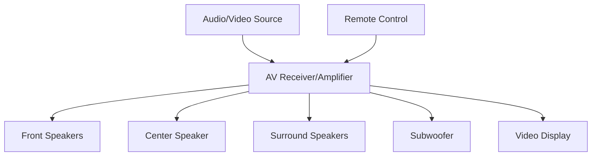

- **AV રિસીવર**: ઓડિયો/વિડિયો સિગ્નલ પ્રોસેસ કરતું સેન્ટ્રલ હબ
- **ફ્રન્ટ સ્પીકર્સ**: સ્ટીરિયો સાઉન્ડ માટે લેફ્ટ અને રાઇટ ચેનલ
- **સેન્ટર સ્પીકર**: ડાયલોગ અને સેન્ટ્રલ સાઉન્ડ ડેલિવર કરે છે
- **સરાઉન્ડ સ્પીકર્સ**: એમ્બિયન્ટ સાઉન્ડ સાથે ઇમર્સિવ વાતાવરણ બનાવે છે
- **સબવૂફર**: 120Hz નીચેના લો-ફ્રિક્વન્સી ઇફેક્ટ્સ (LFE) રીપ્રોડ્યુસ કરે છે
- **કોન્ફિગરેશન**: સામાન્ય સેટઅપમાં 2.1, 5.1, 7.1, અથવા 9.1 ચેનલ સિસ્ટમ શામેલ છે

**મેમરી ટ્રીક:** "AFSCS" - એમ્પ્લિફાયર ડ્રાઇવ્સ ફ્રન્ટ, સરાઉન્ડ, સેન્ટર સ્પીકર્સ એન્ડ સબવૂફર

## પ્રશ્ન 5(ક OR) [7 marks]

**ઇલેક્ટ્રોસ્ટેટિક લાઉડસ્પીકર અને પરમેનેન્ટ મેગ્નેટ લાઉડસ્પીકર સમજાવો.**

**જવાબ**:

**લાઉડસ્પીકર પ્રકારોની તુલના:**

| ફીચર | ઇલેક્ટ્રોસ્ટેટિક સ્પીકર | પરમેનેન્ટ મેગ્નેટ સ્પીકર |
|---|---|---|
| **કાર્ય સિદ્ધાંત** | પ્લેટ્સ વચ્ચે ઇલેક્ટ્રોસ્ટેટિક બળ | ઇલેક્ટ્રોમેગ્નેટિક ઇન્ડક્શન |
| **બંધારણ** | સ્ટેટર પ્લેટ્સ વચ્ચે પાતળું ડાયાફ્રામ | ચુંબકીય ક્ષેત્રમાં વોઇસ કોઇલ સાથે જોડાયેલું કોન |
| **પાવર રિક્વાયરમેન્ટ** | ઉચ્ચ વોલ્ટેજ પોલરાઇઝિંગ સપ્લાયની જરૂર | સિગ્નલ સિવાય બાહ્ય પાવરની જરૂર નથી |
| **ફ્રિક્વન્સી રિસ્પોન્સ** | ઉત્કૃષ્ટ મિડ/હાઇ ફ્રિક્વન્સી | યોગ્ય ડિઝાઇન સાથે સંપૂર્ણ રેન્જમાં સારું |
| **એફિશિયન્સી** | ઓછી (1-3%) | મધ્યમ (2-5%) |
| **ડિસ્ટોર્શન** | ખૂબ ઓછું | મધ્યમ |

**ઇલેક્ટ્રોસ્ટેટિક સ્પીકર કાર્યપધ્ધતિ:**

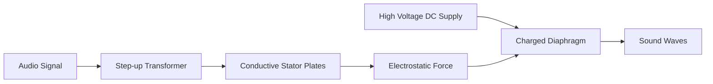

- **ડાયાફ્રામ**: કન્ડક્ટિવ કોટિંગ સાથે પાતળું, હલકું મેમ્બ્રેન
- **ઓપરેશન**: ઓડિયો સિગ્નલ સ્ટેટર પ્લેટ્સ પરના ચાર્જમાં ફેરફાર કરે છે, જે ડાયાફ્રામ પર બદલાતું બળ ઉત્પન્ન કરે છે

**પરમેનેન્ટ મેગ્નેટ સ્પીકર કાર્યપધ્ધતિ:**

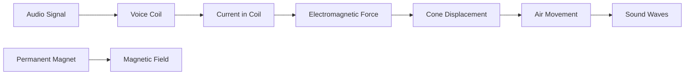

- **વોઇસ કોઇલ**: સ્પીકર કોન સાથે જોડાયેલી તારની વાઇન્ડિંગ
- **ઓપરેશન**: કોઇલ મારફતે વીજપ્રવાહ ચુંબકીય ક્ષેત્ર ઉત્પન્ન કરે છે જે પરમેનેન્ટ મેગ્નેટ સાથે ઇન્ટરેક્ટ કરે છે
- **ફાયદાઓ**: મજબૂત ડિઝાઇન, સારી પાવર હેન્ડલિંગ, ઉચ્ચ વોલ્ટેજની જરૂર નથી
- **એપ્લિકેશન્સ**: સામાન્ય ઓડિયો રીપ્રોડક્શન માટે સૌથી સામાન્ય સ્પીકર ડિઝાઇન

**મેમરી ટ્રીક:** "ESPM" - ઇલેક્ટ્રોસ્ટેટિક યુઝિસ સ્ટેટિક ચાર્જિસ, પરમેનેન્ટ મેગ્નેટ યુઝિસ મેગ્નેટિક ફોર્સિસ
