## Question 1(a) [3 marks]

**Explain different types of maintenance in brief.**

**Answer**:

| Type of Maintenance | Description |
|---|---|
| **Preventive Maintenance** | Scheduled regular inspection and servicing to prevent breakdowns |
| **Corrective Maintenance** | Repairs performed after equipment failure to restore functionality |
| **Predictive Maintenance** | Uses condition monitoring to predict when maintenance will be needed |

**Mnemonic:** "PCPro" - Preventive prevents, Corrective cures, Predictive predicts

## Question 1(b) [4 marks]

**Explain maintenance procedure of Washing Machine.**

**Answer**:

**Maintenance Procedure for Washing Machine:**


- **Filter Cleaning**: Remove and clean lint filter monthly
- **Hose Inspection**: Check for cracks and leaks every 3 months
- **Load Distribution**: Ensure proper balancing to prevent vibration
- **Drum Cleaning**: Run empty hot water cycle with vinegar quarterly

**Mnemonic:** "FHLD" - Filters, Hoses, Loads, Drum need regular attention

## Question 1(c) [7 marks]

**Explain maintenance and troubleshooting procedure of Microwave Oven.**

**Answer**:

**Maintenance and Troubleshooting for Microwave Oven:**

| Maintenance Task | Procedure | Frequency |
|---|---|---|
| External Cleaning | Wipe with mild detergent | Weekly |
| Internal Cleaning | Clean food particles and grease | After each spill |
| Door Seal Check | Inspect for damage or leakage | Monthly |
| Ventilation Check | Ensure vents are unobstructed | Monthly |

**Troubleshooting Procedure:**

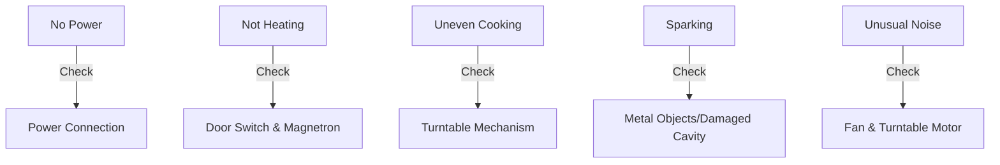

- **Power Issues**: Check fuse, circuit breaker, and cord
- **Heating Problems**: Test door switch, high voltage capacitor, magnetron
- **Safety First**: Never operate with damaged door or seals

**Mnemonic:** "POWER" - Power, Oven interior, Wiring, Electronics, Radiation seals

## Question 1(c OR) [7 marks]

**Explain maintenance and troubleshooting procedure of projector.**

**Answer**:

**Maintenance and Troubleshooting for Projector:**

| Maintenance Task | Procedure | Frequency |
|---|---|---|
| Lens Cleaning | Use lens cloth and solution | Monthly |
| Filter Cleaning | Remove and clean dust | Every 100 hours |
| Lamp Inspection | Check for discoloration/dimming | Every 300 hours |
| Ventilation | Ensure proper airflow | Before each use |

**Troubleshooting Procedure:**

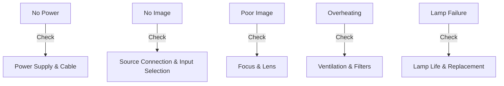

- **Image Issues**: Adjust focus, resolution, keystone correction
- **Lamp Problems**: Check lamp hours, replace if exceeding limit
- **Connectivity**: Verify input source and cable connections
- **Thermal Issues**: Clean filters and ensure proper ventilation

**Mnemonic:** "FLAMVE" - Filters, Lamp, Airflow, Mounting, Voltage, Environment

## Question 2(a) [3 marks]

**Explain the terms in brief: (1) Hue (2) Brightness**

**Answer**:

| Term | Description |
|---|---|
| **Hue** | The pure color attribute that distinguishes colors (red, green, blue, etc.) based on light wavelength |
| **Brightness** | The amount of light emitted or reflected from a color, determining how light or dark it appears |

**Diagram:**

```goat
             Hue
          (Color Type)
              ↑
              |
Saturation ←--+--→ Brightness
(Intensity)   |   (Lightness)
              ↓
            Value
```

**Mnemonic:** "HB-WC" - Hue determines What Color, Brightness determines White-to-black level

## Question 2(b) [4 marks]

**Write a short note on LCD TV.**

**Answer**:

**LCD TV Technology:**


- **Working Principle**: Uses liquid crystals that twist/untwist to allow/block light
- **Key Components**: Backlight, polarizing filters, liquid crystal matrix, color filters
- **Advantages**: Thin profile, energy efficient, no radiation, sharp image
- **Limitations**: Limited viewing angle, slower response time than newer technologies

**Mnemonic:** "BPLCS" - Backlight Passes Light through Crystals to Screen

## Question 2(c) [7 marks]

**Draw and explain block diagram of DTH receiver.**

**Answer**:

**DTH Receiver Block Diagram:**

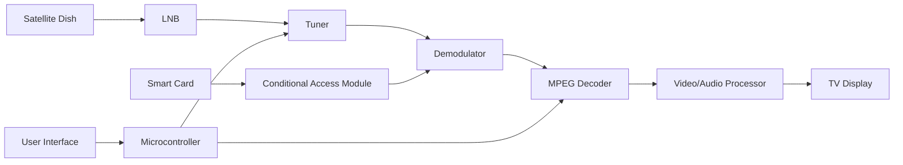

- **Satellite Dish**: Captures signals from satellite
- **LNB (Low Noise Block)**: Converts high frequency signals to lower frequency
- **Tuner**: Selects specific channel frequency
- **Demodulator**: Extracts digital information from carrier signal
- **MPEG Decoder**: Decompresses video/audio data
- **Conditional Access Module**: Controls subscription access
- **Microcontroller**: Controls overall operation and user inputs

**Mnemonic:** "SLTDMP" - Satellite, LNB, Tuner, Demodulator, MPEG, Processor

## Question 2(a OR) [3 marks]

**Explain the terms in brief: (1) Luminance (2) chrominance**

**Answer**:

| Term | Description |
|---|---|
| **Luminance** | The brightness or intensity component of a video signal (Y) that carries black and white information |
| **Chrominance** | The color component of a video signal (Cb, Cr) that carries hue and saturation information |

**Diagram:**

```goat
Video Signal
    |
    +----------+----------+
    |                     |
Luminance (Y)      Chrominance (C)
(Brightness)         /         \
                    /           \
                   /             \
            Blue-Y (Cb)       Red-Y (Cr)
            (Blue diff)       (Red diff)
```

**Mnemonic:** "LC-BH" - Luminance controls Brightness, Chrominance controls Hue

## Question 2(b OR) [4 marks]

**Explain Grassman's law.**

**Answer**:

**Grassman's Laws of Color Mixing:**

| Law | Description |
|---|---|
| **Symmetry** | If color A matches color B, then B matches A |
| **Proportionality** | If A matches B, then nA matches nB (for any intensity n) |
| **Additivity** | If A matches B and C matches D, then A+C matches B+D |

- **Application**: Forms the basis of RGB color model in displays
- **Significance**: Allows creating any color by mixing three primary colors
- **Limitation**: Applies only to light (additive mixing), not pigments

**Mnemonic:** "SPA Color" - Symmetry, Proportionality, Additivity laws for Color matching

## Question 2(c OR) [7 marks]

**Draw and explain block diagram of colour TV receiver.**

**Answer**:

**Colour TV Receiver Block Diagram:**

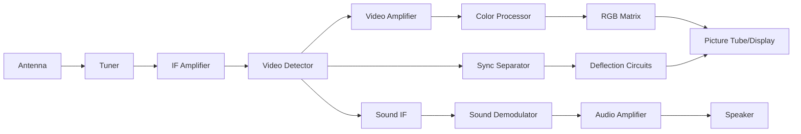

- **Tuner**: Selects desired channel frequency
- **IF Amplifier**: Amplifies intermediate frequency signals
- **Video Detector**: Extracts video and audio information
- **Color Processor**: Separates luminance and chrominance
- **RGB Matrix**: Converts color signals to red, green, blue
- **Sync Separator**: Extracts horizontal and vertical sync
- **Deflection Circuits**: Control electron beam scanning

**Mnemonic:** "TIVCRDS" - Tuner, IF, Video, Color, RGB, Deflection, Speaker

## Question 3(a) [3 marks]

**State main components of solar power system and specifications of solar power system.**

**Answer**:

**Main Components of Solar Power System:**

| Component | Function |
|---|---|
| **Solar Panels** | Convert sunlight to electricity |
| **Charge Controller** | Regulates battery charging |
| **Battery Bank** | Stores electrical energy |
| **Inverter** | Converts DC to AC electricity |
| **Mounting Structure** | Supports and positions panels |

**Specifications:**

- **Panel Rating**: 100-400W per panel
- **Battery Capacity**: 100-200Ah
- **Inverter Rating**: 500-5000W
- **System Voltage**: 12/24/48V

**Mnemonic:** "SCBIM" - Solar panels, Controller, Battery, Inverter, Mounting

## Question 3(b) [4 marks]

**List types, applications and technical specifications of microwave oven.**

**Answer**:

**Types of Microwave Ovens:**

| Type | Features |
|---|---|
| **Solo** | Basic heating and defrosting only |
| **Grill** | Additional grilling element |
| **Convection** | Has heating element and fan for baking |
| **Combination** | Integrates microwave, grill and convection |

**Applications:**

- Food reheating
- Defrosting
- Cooking
- Baking (convection models)

**Technical Specifications:**

- **Power**: 700-1200 Watts
- **Capacity**: 20-40 Liters
- **Frequency**: 2.45 GHz
- **Voltage**: 220-240V AC

**Mnemonic:** "SGCC" - Solo, Grill, Convection, Combo ovens for various cooking needs

## Question 3(c) [7 marks]

**Explain working of Air conditioner and Refrigerator**

**Answer**:

**Working Principle of Air Conditioner and Refrigerator:**

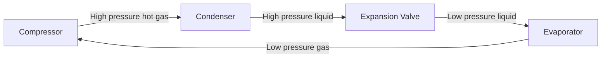

**Common Components:**

- **Compressor**: Pressurizes refrigerant gas
- **Condenser**: Releases heat, converts gas to liquid
- **Expansion Valve**: Reduces pressure of liquid refrigerant
- **Evaporator**: Absorbs heat, converts liquid to gas

**Differences:**

| Aspect | Air Conditioner | Refrigerator |
|---|---|---|
| **Purpose** | Cools entire room | Maintains cold in insulated cabinet |
| **Temperature** | 18-26°C typically | 2-8°C (fridge), -18°C (freezer) |
| **Control** | Thermostat with remote | Manual or digital thermostat |

**Mnemonic:** "CEVA" - Compression, Expansion, Vaporization, Absorption cycle

## Question 3(a OR) [3 marks]

**List technical specifications of Air conditioner and Refrigerator**

**Answer**:

**Technical Specifications:**

| Specification | Air Conditioner | Refrigerator |
|---|---|---|
| **Cooling Capacity** | 1-2 ton (12,000-24,000 BTU) | 100-500 liters capacity |
| **Power Consumption** | 1000-2500 watts | 100-400 watts |
| **Energy Efficiency** | ISEER/Star Rating 3-5 | BEE Star Rating 3-5 |
| **Refrigerant Type** | R32, R410A | R600a, R134a |
| **Voltage/Frequency** | 220-240V/50Hz | 220-240V/50Hz |

**Mnemonic:** "CPERS" - Capacity, Power, Efficiency, Refrigerant, Supply specifications

## Question 3(b OR) [4 marks]

**Explain electronic controller for washing machine.**

**Answer**:

**Electronic Controller for Washing Machine:**

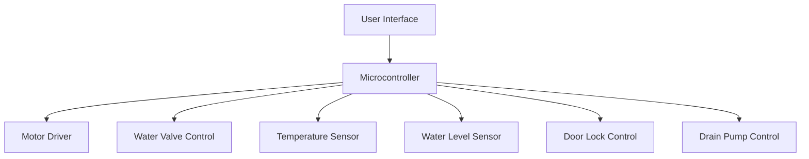

- **Microcontroller**: Central processing unit that controls all operations
- **Sensors**: Water level, temperature, load balance, door position
- **Actuators**: Motor driver, water valves, heater, drain pump
- **User Interface**: Program selection, temperature, spin speed settings

**Mnemonic:** "MIST-WAD" - Microcontroller Integrates Sensors and Timers for Water, Agitation and Drainage

## Question 3(c OR) [7 marks]

**Draw and explain block diagram of Microwave oven. List wiring and safety instructions for microwave oven**

**Answer**:

**Microwave Oven Block Diagram:**

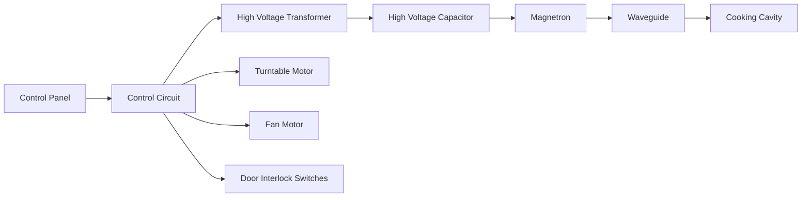

- **Control Circuit**: Processes user inputs and controls timing
- **High Voltage Transformer**: Steps up voltage to 2000-4000V
- **Magnetron**: Generates microwave radiation at 2.45 GHz
- **Waveguide**: Directs microwaves into cooking cavity
- **Turntable**: Ensures even cooking through rotation

**Safety Instructions:**

- Never operate with door open or damaged
- Ensure proper grounding
- Don't override safety interlocks
- Use microwave-safe containers only

**Wiring Instructions:**

- Use appropriate gauge power cable (typically 14-16 AWG)
- Connect to dedicated 15-20A circuit
- Ensure proper ground connection
- Keep wiring away from heat sources

**Mnemonic:** "MAGIC" - Magnetron And Guided waves Into Cavity

## Question 4(a) [3 marks]

**Draw block diagram of Photocopier.**

**Answer**:

**Photocopier Block Diagram:**

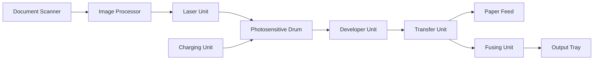

- **Scanner**: Captures original document image
- **Drum**: Holds electrostatic image
- **Developer**: Applies toner to charged areas
- **Transfer**: Transfers toner to paper
- **Fuser**: Melts toner permanently onto paper

**Mnemonic:** "SDTFO" - Scan, Develop, Transfer, Fuse, Output

## Question 4(b) [4 marks]

**List specifications of MF printer and CCTV.**

**Answer**:

**Specifications:**

| MF Printer Specifications | CCTV Specifications |
|---|---|
| **Print Resolution**: 600-1200 dpi | **Camera Resolution**: 2-8 MP |
| **Print Speed**: 15-40 ppm | **Frame Rate**: 15-30 fps |
| **Scan Resolution**: 300-600 dpi | **Storage**: 1-8 TB HDD/NVR |
| **Paper Capacity**: 150-500 sheets | **Night Vision**: 10-30m range |
| **Connectivity**: USB, Ethernet, Wi-Fi | **Connectivity**: Coaxial/IP/Wireless |
| **Functions**: Print, Scan, Copy, Fax | **Video Format**: H.264/H.265 |

**Mnemonic:** "RSCPF" - Resolution, Speed, Capacity, Protocol, Function specifications

## Question 4(c) [7 marks]

**Explain working of laser printer with block diagram.**

**Answer**:

**Laser Printer Working:**

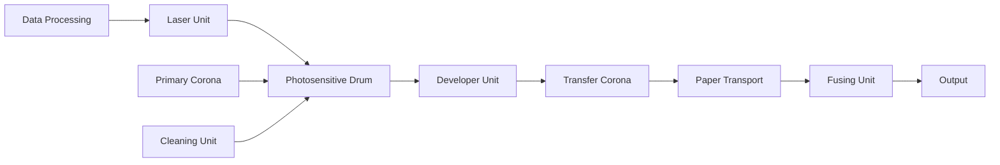

**Working Process:**

1. **Charging**: Corona wire gives drum uniform negative charge
2. **Writing**: Laser neutralizes charges on drum to form image
3. **Developing**: Toner adheres to discharged areas of drum
4. **Transfer**: Paper receives positive charge, attracts toner
5. **Fusing**: Heat and pressure melt toner onto paper
6. **Cleaning**: Residual toner is removed from drum

- **Resolution**: Determined by laser precision (600-1200 dpi)
- **Speed**: Based on drum rotation and paper transport (15-40 ppm)

**Mnemonic:** "CWTFC" - Charge, Write, Transfer, Fuse, Clean cycle

## Question 4(a OR) [3 marks]

**Draw block diagram of CCTV.**

**Answer**:

**CCTV System Block Diagram:**

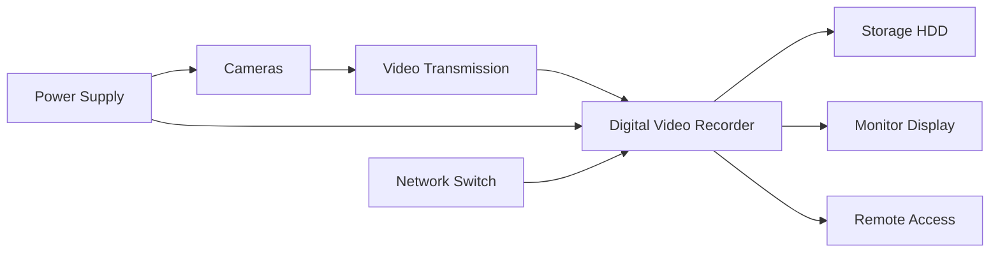

- **Cameras**: Capture video footage
- **Transmission**: Coaxial cable/IP network/Wireless
- **DVR/NVR**: Processes and records video
- **Storage**: Hard drives for footage retention
- **Monitor**: Displays live or recorded footage

**Mnemonic:** "CTDSM" - Camera, Transmission, DVR, Storage, Monitor system

## Question 4(b OR) [4 marks]

**List specifications of inkjet printer and Photocopier.**

**Answer**:

**Specifications:**

| Inkjet Printer Specifications | Photocopier Specifications |
|---|---|
| **Print Resolution**: 1200-4800 dpi | **Copy Resolution**: 600-1200 dpi |
| **Print Speed**: 8-20 ppm | **Copy Speed**: 20-60 cpm |
| **Ink Type**: Dye/Pigment | **Toner Type**: Dry/Liquid |
| **Paper Capacity**: 100-250 sheets | **Paper Capacity**: 250-2000 sheets |
| **Connectivity**: USB, Wi-Fi | **Functions**: Copy, Scan, Print, Fax |
| **Duty Cycle**: 1,000-5,000 pages/month | **Duty Cycle**: 10,000-100,000 pages/month |

**Mnemonic:** "RSIPCD" - Resolution, Speed, Ink/toner, Paper capacity, Connectivity, Duty cycle

## Question 4(c OR) [7 marks]

**Explain working of LCD projector with block diagram and list its specifications.**

**Answer**:

**LCD Projector Working:**

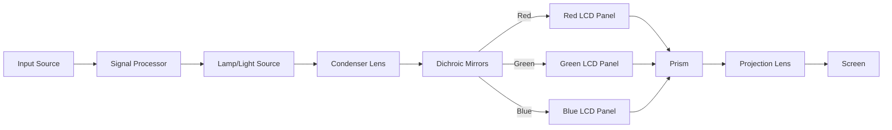

**Working Process:**

1. **Light Generation**: High-intensity lamp produces white light
2. **Color Separation**: Dichroic mirrors split light into RGB
3. **Modulation**: LCD panels control light intensity for each color
4. **Recombination**: Prism reassembles RGB images
5. **Projection**: Lens system projects image onto screen

**Specifications:**

- **Resolution**: XGA (1024×768), WXGA (1280×800), FHD (1920×1080)
- **Brightness**: 2000-5000 ANSI lumens
- **Contrast Ratio**: 2000:1 to 20000:1
- **Lamp Life**: 3000-6000 hours
- **Throw Ratio**: 0.5:1 to 2.0:1
- **Connectivity**: HDMI, VGA, USB, Wi-Fi

**Mnemonic:** "LSPMPS" - Lamp, Split, Panels, Modulate, Prism, Screen

## Question 5(a) [3 marks]

**Draw block diagram of PA system.**

**Answer**:

**Public Address (PA) System Block Diagram:**

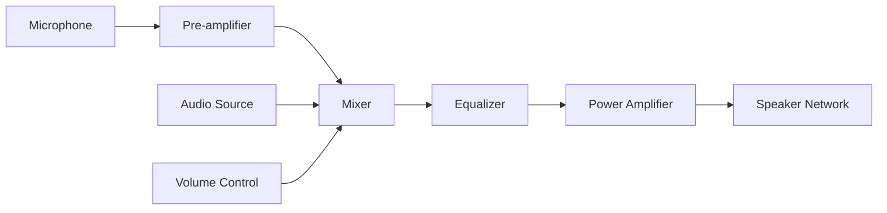

- **Microphone**: Converts sound to electrical signals
- **Pre-amplifier**: Boosts microphone signal
- **Mixer**: Combines multiple audio sources
- **Equalizer**: Adjusts frequency response
- **Power Amplifier**: Increases signal power
- **Speakers**: Convert electrical signals back to sound

**Mnemonic:** "MMEPS" - Microphone, Mixer, Equalizer, Power amp, Speakers

## Question 5(b) [4 marks]

**Explain tweeter and woofer.**

**Answer**:

**Speaker Components:**

| Feature | Tweeter | Woofer |
|---|---|---|
| **Frequency Range** | High (2kHz-20kHz) | Low (20Hz-2kHz) |
| **Size** | Small (0.5"-1.5") | Large (4"-15") |
| **Diaphragm** | Light, rigid (dome/cone) | Heavy, flexible cone |
| **Voice Coil** | Small diameter | Large diameter |
| **Cabinet Design** | Horn/sealed | Ported/sealed/bass reflex |

**Working Principle:**

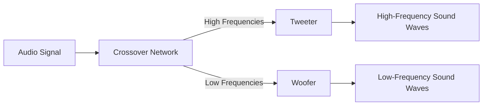

- **Tweeter**: Reproduces high frequencies with clarity and detail
- **Woofer**: Reproduces low frequencies with power and depth

**Mnemonic:** "THSL" - Tweeters handle Highs, Small and Light; Woofers handle Lows

## Question 5(c) [7 marks]

**Define microphone. List types of microphone and explain working of any one type of microphone.**

**Answer**:

**Microphone Definition:**
A microphone is an electroacoustic transducer that converts sound waves into electrical signals.

**Types of Microphones:**

| Type | Working Principle | Applications |
|---|---|---|
| **Dynamic** | Electromagnetic induction | Live performance, broadcasting |
| **Condenser** | Electrostatic principles | Studio recording, smartphones |
| **Ribbon** | Electromagnetic induction | Studio vocals, instruments |
| **Carbon** | Resistance variation | Old telephones |
| **Piezoelectric** | Piezoelectric effect | Contact mics, instruments |
| **MEMS** | Micro-electromechanical | Laptops, tiny devices |

**Dynamic Microphone Working:**


- **Sound Capture**: Diaphragm vibrates with sound waves
- **Transduction**: Coil attached to diaphragm moves within magnetic field
- **Signal Generation**: Movement induces voltage proportional to sound intensity
- **Output**: Low impedance, strong signal requiring minimal amplification
- **Advantages**: Durable, handles high SPL, no external power needed

**Mnemonic:** "DDCMIO" - Diaphragm Displaces Coil in Magnetic field Inducing Output

## Question 5(a OR) [3 marks]

**Define: (1) Pitch (2) Loudspeaker (3) Reverberation.**

**Answer**:

**Definitions:**

| Term | Definition |
|---|---|
| **Pitch** | The perceived frequency of a sound that determines how "high" or "low" it sounds |
| **Loudspeaker** | An electroacoustic transducer that converts electrical signals into sound waves |
| **Reverberation** | The persistence of sound after the original sound has stopped due to multiple reflections |

**Diagram:**

```goat
Reverberation
    |
    v
Original Sound -----> Early Reflections -----> Late Reflections
    ^                       |                       |
    |                       v                       v
Direct Sound           Clarity (≤80ms)       Spaciousness (>80ms)
```

**Mnemonic:** "PLR Sound" - Pitch defines tone, Loudspeaker produces it, Reverberation extends it

## Question 5(b OR) [4 marks]

**Draw block diagram of Home theatre sound system and explain in brief.**

**Answer**:

**Home Theatre Sound System:**

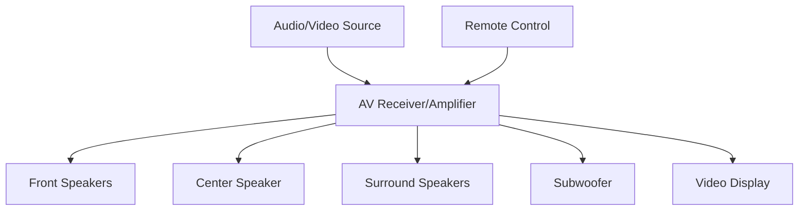

- **AV Receiver**: Central hub that processes audio/video signals
- **Front Speakers**: Left and right channels for stereo sound
- **Center Speaker**: Delivers dialog and central sounds
- **Surround Speakers**: Create immersive environment with ambient sounds
- **Subwoofer**: Reproduces low-frequency effects (LFE) below 120Hz
- **Configuration**: Common setups include 2.1, 5.1, 7.1, or 9.1 channel systems

**Mnemonic:** "AFSCS" - Amplifier drives Front, Surround, Center Speakers and Subwoofer

## Question 5(c OR) [7 marks]

**Explain Electrostatic loudspeaker and permanent magnet loudspeaker.**

**Answer**:

**Comparison of Loudspeaker Types:**

| Feature | Electrostatic Speaker | Permanent Magnet Speaker |
|---|---|---|
| **Working Principle** | Electrostatic forces between plates | Electromagnetic induction |
| **Construction** | Thin diaphragm between stator plates | Cone attached to voice coil in magnetic field |
| **Power Requirements** | Needs high voltage polarizing supply | No external power beyond signal |
| **Frequency Response** | Excellent mid/high frequency | Good across full range with proper design |
| **Efficiency** | Low (1-3%) | Moderate (2-5%) |
| **Distortion** | Very low | Moderate |

**Electrostatic Speaker Working:**

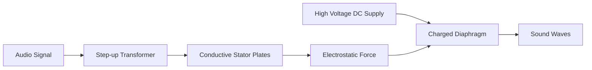

- **Diaphragm**: Thin, lightweight membrane with conductive coating
- **Operation**: Audio signal varies charge on stator plates, creating varying force on diaphragm

**Permanent Magnet Speaker Working:**

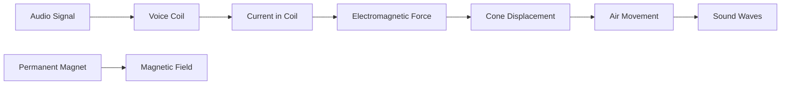

- **Voice Coil**: Winding of wire attached to speaker cone
- **Operation**: Current through coil creates magnetic field that interacts with permanent magnet
- **Advantages**: Robust design, good power handling, no high voltage required
- **Applications**: Most common speaker design for general audio reproduction

**Mnemonic:** "ESPM" - Electrostatic uses Static charges, Permanent Magnet uses Magnetic forces
