## પ્રશ્ન 1(અ) [3 ગુણ]

**ફક્ત વ્યાખ્યા આપો. : 1. લાઉડનેસ 2.ટીમ્બર 3. ઇકો**

**જવાબ**:

| શબ્દ | વ્યાખ્યા |
|------|------------|
| **લાઉડનેસ** | અવાજની તીવ્રતાની સબજેક્ટિવ સમજ જે અવાજના દબાણ અને આવૃત્તિ પર આધારિત છે |
| **ટીમ્બર** | અવાજની ગુણવત્તા જે વિવિધ વાદ્ય યંત્રો અથવા અવાજને એક જ સૂર વગાડતી વખતે અલગ કરે છે |
| **ઇકો** | અવાજનું પરાવર્તન જે શ્રોતા પાસે સીધા અવાજ પછી 50ms કરતાં વધુ વિલંબ સાથે પહોંચે છે |

**મેમરી ટ્રીક:** "LTE: લાઉડનેસ શક્તિ માપે છે, ટીમ્બર વિશિષ્ટતા આપે છે, ઇકો વિલંબિત પરત આવે છે"

## પ્રશ્ન 1(બ) [4 ગુણ]

**લાઉડસ્પીકરના પ્રકારોની યાદી બનાવો અને તેમાંથી કોઈપણ એક સમજાવો**

**જવાબ**:

**લાઉડસ્પીકરના પ્રકારો:**

| પ્રકાર | મુખ્ય લક્ષણો |
|------|-------------|
| ડાયનામિક/મૂવિંગ કોઇલ | ઇલેક્ટ્રોમેગ્નેટિક કોઇલનો ઉપયોગ |
| ઇલેક્ટ્રોસ્ટેટિક | ચાર્જ્ડ ડાયાફ્રામનો ઉપયોગ |
| રિબન | પાતળી ધાતુ રિબનનો ઉપયોગ |
| પિઝોઇલેક્ટ્રિક | ક્રિસ્ટલનો ઉપયોગ જે કંપન કરે છે |
| હોર્ન | એકોસ્ટિક હોર્નનો એમ્પ્લિફિકેશન માટે ઉપયોગ |
| પ્લેનર મેગ્નેટિક | ડાયાફ્રામ પર મેગ્નેટિક સ્ટ્રિપ્સનો ઉપયોગ |

**ડાયનામિક/મૂવિંગ કોઇલ લાઉડસ્પીકર:**


- **મેગ્નેટિક સ્ટ્રક્ચર**: પર્મેનન્ટ મેગ્નેટ સ્થિર મેગ્નેટિક ફિલ્ડ બનાવે છે
- **વોઇસ કોઇલ**: ઓડિયો કરંટ મેળવે છે અને બદલાતા મેગ્નેટિક ફિલ્ડ બનાવે છે
- **ડાયાફ્રામ/કોન**: વોઇસ કોઇલ સાથે જોડાયેલ છે, કંપન કરીને ધ્વનિ તરંગો પેદા કરે છે

**મેમરી ટ્રીક:** "COPPER-D: કોઇલ ઓસીલેટ્સ, પર્મેનન્ટ મેગ્નેટ પુલ/પુશ કરે છે, ડાયાફ્રામ દ્વારા રેઝોનન્સ ઉત્સર્જિત થાય છે"

## પ્રશ્ન 1(ક) [7 ગુણ]

**માઇક્રોફોનના પ્રકારોની સૂચિ બનાવો. તેની લાક્ષણિકતાઓ જણાવો અને વાયરલેસ માઇક્રોફોનને વિગતવાર સમજાવો**

**જવાબ**:

**માઇક્રોફોનના પ્રકારો:**

| પ્રકાર | કાર્યપ્રણાલી |
|------|---------------------|
| ડાયનામિક | મેગ્નેટિક ફિલ્ડમાં મૂવિંગ કોઇલ |
| કન્ડેન્સર | વેરિએબલ કેપેસિટન્સ |
| કાર્બન | વેરિએબલ રેઝિસ્ટન્સ |
| રિબન | મેગ્નેટિક ફિલ્ડમાં રિબન મૂવમેન્ટ |
| ક્રિસ્ટલ/પિઝોઇલેક્ટ્રિક | ક્રિસ્ટલ ડિફોર્મેશન |
| ઇલેક્ટ્રેટ | પર્મેનન્ટલી ચાર્જ્ડ મટીરિયલ |
| MEMS | માઇક્રો-ઇલેક્ટ્રો-મિકેનિકલ સિસ્ટમ્સ |

**માઇક્રોફોનની લાક્ષણિકતાઓ:**

- **સેન્સિટિવિટી**: આપેલા ધ્વનિ દબાણ માટે આઉટપુટ લેવલ
- **ફ્રિક્વન્સી રિસ્પોન્સ**: કેપ્ચર કરેલ આવૃત્તિઓની શ્રેણી
- **દિશાત્મક પેટર્ન**: પિકઅપ પેટર્ન (ઓમ્નિડિરેક્શનલ, કાર્ડિઓઇડ, વગેરે)
- **ઇમ્પીડન્સ**: AC સિગ્નલ્સ માટે ઇલેક્ટ્રિકલ રેઝિસ્ટન્સ
- **સિગ્નલ-ટુ-નોઇઝ રેશિયો**: ઇચ્છિત સિગ્નલ વિરુદ્ધ બેકગ્રાઉન્ડ નોઇઝ

**વાયરલેસ માઇક્રોફોન સિસ્ટમ:**


- **માઇક્રોફોન એલિમેન્ટ**: ધ્વનિને ઇલેક્ટ્રિકલ સિગ્નલ્સમાં રૂપાંતરિત કરે છે
- **ટ્રાન્સમિટર**: ઓડિયોને રેડિયો ફ્રિક્વન્સી કેરિયર પર મોડ્યુલેટ કરે છે
- **રિસીવર**: RF સિગ્નલ કેપ્ચર કરે છે અને ઓડિયો રિકવર કરવા માટે ડીમોડ્યુલેટ કરે છે
- **ઓપરેટિંગ ફ્રિક્વન્સી**: VHF (30-300 MHz) અથવા UHF (300-3000 MHz) બેન્ડનો ઉપયોગ
- **બેટરી ઓપરેશન**: ટ્રાન્સમિટર માટે પાવર સોર્સની જરૂર પડે છે

**મેમરી ટ્રીક:** "WIRED: વાયરલેસ ઇઝ રેડિયો-એનેબલ્ડ ડિવાઇસ"

## પ્રશ્ન 1(ક OR) [7 ગુણ]

**લાઉડસ્પીકર્સની લાક્ષણિકતાઓ જણાવો અને પરમેનેન્ટ મેગ્નેટ લાઉડસ્પીકરને તેના ફાયદા અને ગેરફાયદા સાથે સમજાવો.**

**જવાબ**:

**લાઉડસ્પીકરની લાક્ષણિકતાઓ:**

| લાક્ષણિકતા | વર્ણન |
|----------------|-------------|
| ફ્રિક્વન્સી રિસ્પોન્સ | ફરીથી ઉત્પાદિત આવૃત્તિઓની શ્રેણી (20Hz-20kHz આદર્શ) |
| સેન્સિટિવિટી | સાઉન્ડ પ્રેશર લેવલ (dB) 1W ઇનપુટ અને 1m અંતર પર |
| ઇમ્પીડન્સ | ઇલેક્ટ્રિકલ રેઝિસ્ટન્સ (સામાન્ય રીતે 4, 8, અથવા 16 ઓહ્મ) |
| પાવર હેન્ડલિંગ | નુકસાન વિના મહત્તમ પાવર (વોટ્સ) |
| દિશાત્મકતા | ધ્વનિ વિતરણ પેટર્ન |
| વિકૃતિ | મૂળ સિગ્નલનો અવાંછિત ફેરફાર |

**પર્મેનન્ટ મેગ્નેટ લાઉડસ્પીકર:**

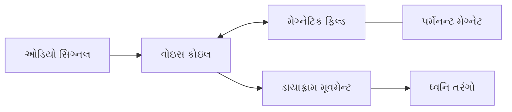

**કાર્યપ્રણાલી:**

- વોઇસ કોઇલ ઇલેક્ટ્રિકલ ઓડિયો સિગ્નલ્સ મેળવે છે
- મેગ્નેટિક ફિલ્ડ ઇન્ટરેક્શન્સ કોઇલની ગતિ કરાવે છે
- જોડાયેલા ડાયાફ્રામ કંપન કરીને ધ્વનિ પેદા કરે છે
- પર્મેનન્ટ મેગ્નેટ સતત મેગ્નેટિક ફિલ્ડ પ્રદાન કરે છે

**ફાયદા:**

- **સ્તા-અસરકારક**: મેગ્નેટિક ફિલ્ડ માટે બાહ્ય પાવરની જરૂર નથી
- **વિશ્વસનીય**: સરળ ડિઝાઇન સાથે ઓછા નિષ્ફળતા પોઇન્ટ્સ
- **કોમ્પેક્ટ**: ફિલ્ડ કોઇલ અથવા પાવર સપ્લાયની જરૂર નથી
- **કાર્યક્ષમ**: પાવર-ટુ-સાઉન્ડ રૂપાંતરણ સારું

**ગેરફાયદા:**

- **મર્યાદિત પાવર**: મેગ્નેટિક ફિલ્ડની શક્તિ નિશ્ચિત છે
- **મેગ્નેટ ડિટીરિયોરેશન**: સમય જતાં નબળું પડી શકે છે
- **વજન**: મજબૂત ચુંબકો એકમને ભારે બનાવી શકે છે
- **હીટ સેન્સિટિવિટી**: પ્રદર્શન તાપમાન દ્વારા અસર પામે છે

**મેમરી ટ્રીક:** "PMLS: પર્મેનન્ટ મેગ્નેટ જોરથી બોલે છે"

## પ્રશ્ન 2(અ) [3 ગુણ]

**વ્યાખ્યાયિત કરો 1. આસ્પેક્ટ રેશિયો 2. ક્રોમિનેન્સ 3. એડિટિવ મિક્સિંગ**

**જવાબ**:

| શબ્દ | વ્યાખ્યા |
|------|------------|
| **આસ્પેક્ટ રેશિયો** | ટેલિવિઝન અથવા ડિસ્પ્લે સ્ક્રીનની પહોળાઈનો ઊંચાઈ સાથેનો ગુણોત્તર (દા.ત., 16:9, 4:3) |
| **ક્રોમિનેન્સ** | વિડિયો સિગ્નલમાં રંગની માહિતી, લ્યુમિનન્સ અથવા બ્રાઇટનેસથી સ્વતંત્ર |
| **એડિટિવ મિક્સિંગ** | વિવિધ રંગીન પ્રકાશને ભેગા કરીને નવા રંગો બનાવવાની પ્રક્રિયા, જ્યાં બધા પ્રાથમિક રંગોને મિક્સ કરવાથી સફેદ રંગ ઉત્પન્ન થાય છે |

**મેમરી ટ્રીક:** "ACA: આસ્પેક્ટ પરિમાણો નક્કી કરે છે, ક્રોમિનન્સ રંગ ઉમેરે છે, એડિટિવ મિક્સિંગ પ્રકાશ બનાવે છે"

## પ્રશ્ન 2(બ) [4 ગુણ]

**ઇન્ટરલેસ સ્કેનિંગ સમજાવો**

**જવાબ**:

**ઇન્ટરલેસ સ્કેનિંગ:**

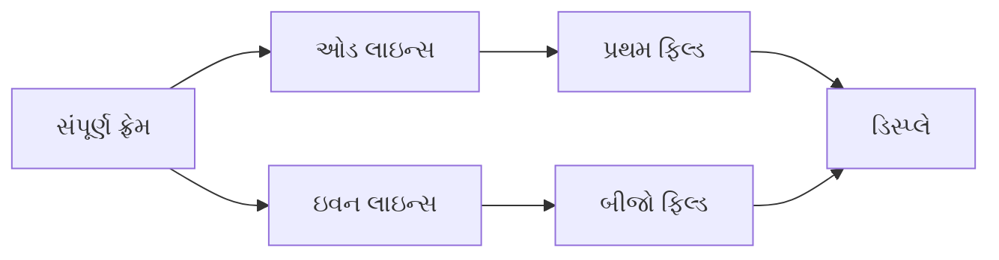

**પ્રક્રિયા:**

- ફ્રેમ બે ફિલ્ડ્સમાં વિભાજિત: ઓડ-નંબરની લાઇન્સ અને ઇવન-નંબરની લાઇન્સ
- પ્રથમ ફિલ્ડ બધી ઓડ-નંબરની લાઇન્સ (1,3,5...) દર્શાવે છે
- બીજો ફિલ્ડ બધી ઇવન-નંબરની લાઇન્સ (2,4,6...) દર્શાવે છે
- ફિલ્ડ્સ વારાફરતી પ્રદર્શિત થાય છે, સંપૂર્ણ ફ્રેમનો ભ્રમ ઉત્પન્ન કરે છે
- સ્ટાન્ડર્ડ રેટ: 50/60 ફિલ્ડ્સ પ્રતિ સેકન્ડ (25/30 ફ્રેમ્સ પ્રતિ સેકન્ડ)

**મુખ્ય લાભ**: લંબવત રિઝોલ્યુશનને જાળવી રાખીને બેન્ડવિડ્થ ઘટાડે છે

**મેમરી ટ્રીક:** "ODD-EVEN: એક ડિસ્પ્લે, પછી વિલંબિત વધારાની વિઝ્યુઅલ એન્હાન્સમેન્ટ નેક્સ્ટ"

## પ્રશ્ન 2(ક) [7 ગુણ]

**LED ટેલિવિઝનના કાર્ય સિદ્ધાંતની ચર્ચા કરો. તેના ફાયદા જણાવો અને તેની LCD ટેલિવિઝન સાથે સરખામણી કરો.**

**જવાબ**:

**LED TV કાર્યપ્રણાલી:**

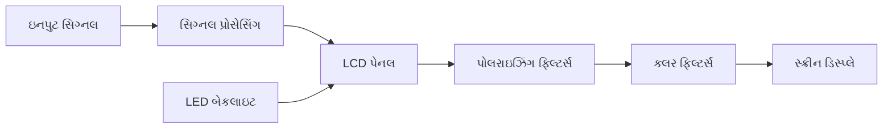

**મુખ્ય ઘટકો:**

- **LED બેકલાઇટ**: લાઇટ સોર્સ (એજ-લિટ અથવા ફુલ-એરે)
- **LCD પેનલ**: લિક્વિડ ક્રિસ્ટલ લેયર પ્રકાશના પસાર થવાને નિયંત્રિત કરે છે
- **TFT મેટ્રિક્સ**: થિન-ફિલ્મ ટ્રાન્ઝિસ્ટર્સ દરેક પિક્સેલને નિયંત્રિત કરે છે
- **કલર ફિલ્ટર્સ**: સફેદ બેકલાઇટથી RGB રંગો બનાવે છે
- **પોલરાઇઝિંગ ફિલ્ટર્સ**: પ્રકાશની દિશા અને તીવ્રતાને નિયંત્રિત કરે છે

**LED TV ના ફાયદા:**

- **એનર્જી એફિશિયન્ટ**: ઓછી પાવર વપરાશ
- **પાતળી ડિઝાઇન**: પાતળી પ્રોફાઇલ મળે છે
- **બેટર કોન્ટ્રાસ્ટ**: ખાસ કરીને લોકલ ડિમિંગ સાથે
- **લોંગર લાઇફસ્પાન**: LEDs 50,000-100,000 કલાક ચાલે છે
- **ઇકો-ફ્રેન્ડલી**: મર્ક્યુરી કન્ટેન્ટ નથી

**LCD TV સાથે તુલના:**

| ફીચર | LED TV | LCD TV |
|---------|--------|--------|
| બેકલાઇટ | LED લાઇટ્સ | CCFL (કોલ્ડ કેથોડ ફ્લોરસેન્ટ લેમ્પ્સ) |
| જાડાઈ | પાતળી (25-40mm) | જાડી (100-150mm) |
| પાવર વપરાશ | નીચો | ઊંચો |
| કોન્ટ્રાસ્ટ રેશિયો | સારું (3000:1-8000:1) | નીચું (1000:1-2000:1) |
| કલર રિપ્રોડક્શન | વધુ વાઇબ્રન્ટ | ઓછું વાઇબ્રન્ટ |
| લાઇફસ્પાન | 50,000-100,000 કલાક | 30,000-60,000 કલાક |
| કિંમત | ઊંચી | નીચી |

**મેમરી ટ્રીક:** "LEDGE: લાઇટ એમિટિંગ ડાયોડ્સ ગિવ એક્સેલન્સ"

## પ્રશ્ન 2(અ) [3 ગુણ]

**કલર ટેલિવિઝન સિસ્ટમના કોઈપણ છ ધોરણો જણાવો.**

**જવાબ**:

| સ્ટાન્ડર્ડ | પ્રદેશ/લક્ષણો |
|----------|-----------------|
| **PAL** (ફેઝ ઓલ્ટરનેટિંગ લાઇન) | યુરોપ, ઓસ્ટ્રેલિયા, 625 લાઇન્સ, 25 fps |
| **NTSC** (નેશનલ ટેલિવિઝન સિસ્ટમ કમિટી) | નોર્થ અમેરિકા, જાપાન, 525 લાઇન્સ, 30 fps |
| **SECAM** (સિક્વેન્શિયલ કલર વિથ મેમરી) | ફ્રાન્સ, રશિયા, 625 લાઇન્સ, 25 fps |
| **PAL-M** | બ્રાઝિલ, 525 લાઇન્સ, 30 fps |
| **PAL-N** | આર્જેન્ટિના, પેરાગ્વે, ઉરુગ્વે |
| **ATSC** (એડવાન્સ્ડ ટેલિવિઝન સિસ્ટમ્સ કમિટી) | ડિજિટલ સ્ટાન્ડર્ડ, નોર્થ અમેરિકા |
| **DVB-T** (ડિજિટલ વિડિયો બ્રોડકાસ્ટિંગ-ટેરેસ્ટ્રિયલ) | ડિજિટલ સ્ટાન્ડર્ડ, યુરોપ |
| **ISDB** (ઇન્ટીગ્રેટેડ સર્વિસિસ ડિજિટલ બ્રોડકાસ્ટિંગ) | ડિજિટલ સ્ટાન્ડર્ડ, જાપાન, બ્રાઝિલ |

**મેમરી ટ્રીક:** "PANS-ADI: PAL, ATSC, NTSC, SECAM - ઓલ ડિસ્પ્લે ઇમેજિસ"

## પ્રશ્ન 2(બ) [4 ગુણ]

**એલસીડી ટેલિવિઝનની કામગીરી સમજાવો.**

**જવાબ**:

**LCD ટેલિવિઝન વર્કિંગ:**

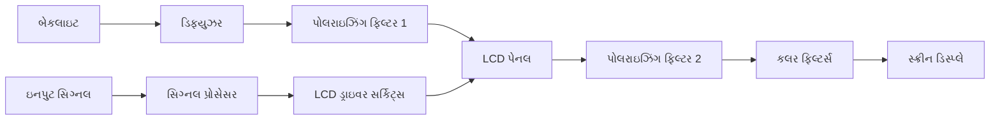

**ઓપરેટિંગ પ્રિન્સિપલ:**

- **બેકલાઇટ**: સફેદ પ્રકાશ સ્ત્રોત પ્રદાન કરે છે
- **પોલરાઇઝિંગ ફિલ્ટર્સ**: બે ફિલ્ટર 90° પર એકબીજાથી
- **લિક્વિડ ક્રિસ્ટલ્સ**: પ્રકાશના પસાર થવાને નિયંત્રિત કરવા માટે ટ્વિસ્ટ/અનટ્વિસ્ટ
- **TFT એરે**: દરેક પિક્સેલ માટે વોલ્ટેજ નિયંત્રિત કરે છે
- **કલર ફિલ્ટર્સ**: સફેદ પ્રકાશથી RGB રંગો બનાવે છે

**મેમરી ટ્રીક:** "BPLTC: બેકલાઇટ લિક્વિડ ક્રિસ્ટલ્સ દ્વારા પસાર થાય છે અને રંગ બને છે"

## પ્રશ્ન 2(ક) [7 ગુણ]

**PAL-D ડીકોડરનો બ્લોક ડાયાગ્રામ દોરો અને સમજાવો.**

**જવાબ**:

**PAL-D ડિકોડર:**

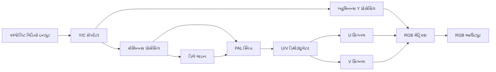

**PAL-D ડિકોડર ઘટકો:**

- **Y/C સેપરેટર**: લ્યુમિનન્સ (Y) ને ક્રોમિનન્સ (C) થી અલગ કરે છે
- **લ્યુમિનન્સ પ્રોસેસિંગ**: બ્રાઇટનેસ અને કોન્ટ્રાસ્ટ વધારે છે
- **ક્રોમિનન્સ પ્રોસેસિંગ**: કલર સબકેરિયર એક્સટ્રેક્ટ કરે છે
- **ડિલે લાઇન**: સિગ્નલને એક લાઇન (64µs) દ્વારા વિલંબિત કરે છે
- **PAL સ્વિચ**: વૈકલ્પિક લાઇન્સ પર V સિગ્નલના ફેઝને રિવર્સ કરે છે
- **U/V ડિમોડ્યુલેટર**: U (B-Y) અને V (R-Y) કલર ડિફરન્સ સિગ્નલ્સ એક્સટ્રેક્ટ કરે છે
- **RGB મેટ્રિક્સ**: RGB સિગ્નલ્સ ઉત્પન્ન કરવા માટે Y, U, V ને જોડે છે

**મુખ્ય વિશેષતા**: ફેઝ અલ્ટરનેશન લગાતાર લાઇન્સની સરેરાશ લઈને ફેઝ ભૂલોને સુધારે છે

**મેમરી ટ્રીક:** "PAL સ્વિચિંગ, ડિલેઇંગ, અનસ્ક્રેમ્બલિંગ વેરિએશન્સ દ્વારા રંગોને યોગ્ય રીતે ડિકોડ કરે છે"

## પ્રશ્ન 3(અ) [3 ગુણ]

**રૂફટોપ સોલાર પાવર પ્લાન્ટનું વર્ગીકરણ આપો અને તેમાંથી કોઈપણ એક પ્લાન્ટ સમજાવો.**

**જવાબ**:

**રૂફટોપ સોલાર પાવર પ્લાન્ટના પ્રકારો:**

| પ્રકાર | વર્ણન |
|------|-------------|
| **ગ્રિડ-કનેક્ટેડ** | યુટિલિટી ગ્રિડ સાથે જોડાયેલ, બેટરી નથી |
| **ઓફ-ગ્રિડ** | બેટરી સ્ટોરેજ સાથે સ્ટેન્ડઅલોન સિસ્ટમ |
| **હાઇબ્રિડ** | ગ્રિડ-કનેક્ટેડ અને ઓફ-ગ્રિડ મોડ બંનેમાં કામ કરી શકે છે |

**ગ્રિડ-કનેક્ટેડ સિસ્ટમ:**

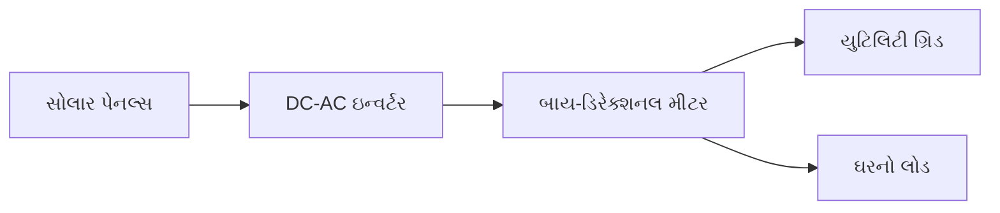

- **સોલાર પેનલ્સ**: સૂર્યપ્રકાશને DC વીજળીમાં રૂપાંતરિત કરે છે
- **ઇન્વર્ટર**: DCને ગ્રિડ-કમ્પેટિબલ ACમાં રૂપાંતરિત કરે છે
- **મીટર**: નિકાસ/આયાત કરેલી પાવર માપે છે
- **ગ્રિડ કનેક્શન**: વધારાની પાવર ગ્રિડને આપવામાં આવે છે

**મેમરી ટ્રીક:** "GOH: ગ્રિડ કનેક્ટ કરે છે, ઓફ-ગ્રિડ સ્ટોર કરે છે, હાઇબ્રિડ બંને કરે છે"

## પ્રશ્ન 3(બ) [4 ગુણ]

**રેફ્રિજરેટર અને સ્પ્લિટ એર કન્ડિશન, (દરેકના) ના ઓછામાં ઓછા ચાર ટેકનિકલ સ્પેસિફિકેશન આપો.**

**જવાબ**:

**રેફ્રિજરેટર સ્પેસિફિકેશન:**

| સ્પેસિફિકેશન | સામાન્ય રેન્જ/વર્ણન |
|---------------|---------------------------|
| **કેપેસિટી** | 150-750 લિટર |
| **એનર્જી રેટિંગ** | સ્ટાર રેટિંગ (1-5 સ્ટાર) |
| **પાવર કન્ઝમ્પશન** | 100-400 kWh પ્રતિ વર્ષ |
| **કમ્પ્રેસર પ્રકાર** | રેસિપ્રોકેટિંગ અથવા ઇન્વર્ટર |
| **ડિફ્રોસ્ટ સિસ્ટમ** | મેન્યુઅલ, ફ્રોસ્ટ-ફ્રી, અથવા ડાયરેક્ટ કૂલ |
| **રેફ્રિજરન્ટ પ્રકાર** | R-600a, R-134a |
| **તાપમાન રેન્જ** | 2-8°C (રેફ્રિજરેટર), -18 થી -24°C (ફ્રીઝર) |

**સ્પ્લિટ એર કન્ડિશનર સ્પેસિફિકેશન:**

| સ્પેસિફિકેશન | સામાન્ય રેન્જ/વર્ણન |
|---------------|---------------------------|
| **કૂલિંગ કેપેસિટી** | 1-2 ટન (12,000-24,000 BTU/hr) |
| **એનર્જી એફિશિયન્સી રેશિયો (EER)** | 2.8-3.5 W/W |
| **ISEER રેટિંગ** | સ્ટાર રેટિંગ (1-5 સ્ટાર) |
| **પાવર કન્ઝમ્પશન** | 800-2500 વોટ |
| **રેફ્રિજરન્ટ પ્રકાર** | R-32, R-410A |
| **નોઇઝ લેવલ** | 30-55 dB |
| **ઓપરેટિંગ તાપમાન રેન્જ** | 18-32°C (ઇનડોર), -5 થી 55°C (આઉટડોર) |

**મેમરી ટ્રીક:** "CERT: કેપેસિટી, એફિશિયન્સી, રેફ્રિજરન્ટ ટાઇપ, ટેમ્પરેચર"

## પ્રશ્ન 3(ક) [7 ગુણ]

**માઇક્રોવેવ ઓવનને તેના કાર્યકારી સિદ્ધાંત, કાર્યકારી બ્લોક ડાયાગ્રામ અને ઓપરેટિવ સ્થિતિમાં હોય ત્યારે તેની સલામતીની સાવચેતીઓના સંદર્ભમાં સમજાવો.**

**જવાબ**:

**માઇક્રોવેવ ઓવન કાર્યપ્રણાલી:**
ખોરાકમાં પાણીના અણુઓ હોય છે, જે ધ્રુવીય છે. માઇક્રોવેવ્સ આ અણુઓને ઝડપથી ફરવા (2.45 GHz) કારણ બને છે, જેનાથી ઘર્ષણ ઉત્પન્ન થાય છે અને સમગ્ર ખોરાકમાં ગરમી પેદા થાય છે.

**ફંક્શનલ બ્લોક ડાયાગ્રામ:**

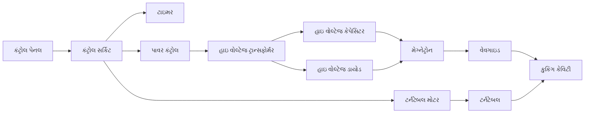

**મુખ્ય ઘટકો:**

- **મેગ્નેટ્રોન**: માઇક્રોવેવ રેડિએશન (2.45 GHz) ઉત્પન્ન કરે છે
- **વેવગાઇડ**: માઇક્રોવેવને કુકિંગ કેવિટી તરફ નિર્દેશિત કરે છે
- **ટર્નટેબલ**: સમાન કુકિંગ સુનિશ્ચિત કરે છે
- **કંટ્રોલ સર્કિટ**: સમય અને પાવરનું સંચાલન કરે છે
- **હાઇ વોલ્ટેજ સર્કિટ**: મેગ્નેટ્રોનને પાવર આપે છે

**સલામતી સાવચેતીઓ:**

- **ડોર ઇન્ટરલોક્સ**: બહુવિધ સ્વિચ જે દરવાજો ખુલ્લો હોય ત્યારે ઓપરેશનને રોકે છે
- **મોનિટરિંગ સર્કિટ**: જો ઇન્ટરલોક્સ નિષ્ફળ જાય તો બંધ કરે છે
- **કેવિટી મેશ સ્ક્રીન**: માઇક્રોવેવ્સને બહાર નીકળતા અટકાવે છે
- **ક્યારેય ખાલી ચલાવશો નહીં**: મેગ્નેટ્રોનને નુકસાન પહોંચાડી શકે છે
- **કોઈ ધાતુની વસ્તુઓ નહીં**: આર્કિંગ અને નુકસાન થઈ શકે છે
- **નિયમિત સફાઈ**: ખોરાકનો ભરાવો અને આર્કિંગને અટકાવે છે
- **નુકસાન પામેલા સીલથી બચો**: માઇક્રોવેવ લીકેજની મંજૂરી આપી શકે છે

**મેમરી ટ્રીક:** "MICROWAVE: મેગ્નેટ્રોન ઇનિશિએટ્સ કુકિંગ, રેડિએશન ઓન્લી વિધિન ઓથોરાઇઝ્ડ વેસલ એન્વાયરમેન્ટ"

## પ્રશ્ન 3(અ OR) [3 ગુણ]

**રૂફટોપ સોલાર પાવર પ્લાન્ટમાં વપરાતા વિવિધ હાર્ડવેરનાં નામ લખો અને તેમાં વપરાતી સોલાર પેનલ સમજાવો.**

**જવાબ**:

**રૂફટોપ સોલાર પાવર પ્લાન્ટ હાર્ડવેર:**

| ઘટક | કાર્ય |
|-----------|----------|
| **સોલાર પેનલ્સ** | સૂર્યપ્રકાશને DC વીજળીમાં રૂપાંતરિત કરે છે |
| **માઉન્ટિંગ સ્ટ્રક્ચર** | શ્રેષ્ઠ ખૂણે પેનલોને ટેકો આપે છે |
| **ઇન્વર્ટર** | DC પાવરને AC પાવરમાં રૂપાંતરિત કરે છે |
| **બેટરીઓ** (વૈકલ્પિક) | પછીના ઉપયોગ માટે ઊર્જા સંગ્રહ કરે છે |
| **ચાર્જ કંટ્રોલર** | બેટરી ચાર્જિંગને નિયંત્રિત કરે છે (ઓફ-ગ્રિડ સિસ્ટમમાં) |
| **જંક્શન બોક્સ** | કનેક્શન પોઇન્ટ્સ અને સુરક્ષા પ્રદાન કરે છે |
| **મીટર્સ** | પાવર જનરેશન/કન્ઝમ્પશન માપે છે |
| **કેબલ્સ અને કનેક્ટર્સ** | ઘટકો વચ્ચે પાવર ટ્રાન્સમિટ કરે છે |

**સોલાર પેનલ્સ:**

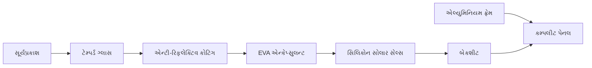

- **મોનોક્રિસ્ટલાઇન**: ઉચ્ચ કાર્યક્ષમતા (15-22%), ઘેરા રંગ, લાંબો જીવનકાળ
- **પોલીક્રિસ્ટલાઇન**: ઓછી કિંમત, વાદળી દેખાવ, 13-17% કાર્યક્ષમતા
- **થિન-ફિલ્મ**: ફ્લેક્સિબલ, હલકા વજન, ઓછી કાર્યક્ષમતા (10-12%)
- **સામાન્ય આઉટપુટ**: 250-400W પ્રતિ પેનલ
- **જીવનકાળ**: વોરંટી સાથે 25-30 વર્ષ

**મેમરી ટ્રીક:** "SIMPLE: સોલાર પેનલ્સ ઇન્ટિગ્રેટ મલ્ટિપલ ફોટોવોલ્ટેઇક લેયર્સ એફિશિયન્ટલી"

## પ્રશ્ન 3(બ OR) [4 ગુણ]

**માઇક્રોવેવ ઓવન અને વોશિંગ મશીનના પ્રત્યેકના ઓછામાં ઓછા ચાર ટેકનિકલ સ્પેસિફિકેશન આપો**

**જવાબ**:

**માઇક્રોવેવ ઓવન સ્પેસિફિકેશન:**

| સ્પેસિફિકેશન | સામાન્ય રેન્જ/વર્ણન |
|---------------|---------------------------|
| **પાવર આઉટપુટ** | 700-1200 વોટ |
| **કેપેસિટી** | 15-42 લિટર |
| **ફ્રિક્વન્સી** | 2.45 GHz |
| **ઓપરેટિંગ મોડ્સ** | માઇક્રોવેવ, ગ્રિલ, કન્વેક્શન, કોમ્બો |
| **કંટ્રોલ ટાઇપ** | મિકેનિકલ, ડિજિટલ, ટચ પેનલ |
| **પાવર કન્ઝમ્પશન** | 1000-1500 વોટ |
| **ટાઇમર રેન્જ** | 0-60 મિનિટ |

**વોશિંગ મશીન સ્પેસિફિકેશન:**

| સ્પેસિફિકેશન | સામાન્ય રેન્જ/વર્ણન |
|---------------|---------------------------|
| **કેપેસિટી** | 5-12 કિલો |
| **વોશિંગ ટેક્નોલોજી** | એજિટેટર, ઇમ્પેલર, ડ્રમ |
| **સ્પિન સ્પીડ** | 700-1600 RPM |
| **વોટર કન્ઝમ્પશન** | 30-80 લિટર પ્રતિ સાયકલ |
| **એનર્જી રેટિંગ** | સ્ટાર રેટિંગ (1-5 સ્ટાર) |
| **પ્રોગ્રામ ઓપ્શન્સ** | 8-16 પ્રોગ્રામ્સ |
| **મોટર ટાઇપ** | યુનિવર્સલ, ઇન્વર્ટર, ડાયરેક્ટ ડ્રાઇવ |

**મેમરી ટ્રીક:** "CPFWS: કેપેસિટી, પાવર, ફ્રિક્વન્સી, વોશિંગ ટેક્નોલોજી, સ્પિન સ્પીડ"

## પ્રશ્ન 3(ક OR) [7 ગુણ]

**વોશિંગ મશીનનું વર્ગીકરણ આપો. ટોપ લોડ વોશિંગ મશીનની કામગીરી, કાર્યકારી બ્લોક ડાયાગ્રામ અને કામ કરવાની વ્યૂહરચના/કપડા ધોવાના પગલાંઓ સંદર્ભે સમજાવો**

**જવાબ**:

**વોશિંગ મશીન વર્ગીકરણ:**

| પ્રકાર | ઉપપ્રકાર | મુખ્ય લક્ષણો |
|------|---------|-------------|
| **ટોપ લોડ** | એજિટેટર | સેન્ટ્રલ પોસ્ટ જે ફરે છે |
|  | ઇમ્પેલર | નીચે રોટેટિંગ ડિસ્ક |
| **ફ્રન્ટ લોડ** | હોરિઝોન્ટલ એક્સિસ | ટમ્બલિંગ એક્શન, પાણી કાર્યક્ષમ |
| **ઓટોમેશન દ્વારા** | ફુલી ઓટોમેટિક | સંપૂર્ણ સાયકલ ઓટોમેશન |
|  | સેમી-ઓટોમેટિક | મેન્યુઅલ ઇન્ટરવેન્શનની જરૂર |
| **ફંક્શન દ્વારા** | વોશર ઓન્લી | માત્ર વોશિંગ ફંક્શન |
|  | વોશર-ડ્રાયર | વોશિંગ અને ડ્રાઇંગ સંયુક્ત |

**ટોપ લોડ વોશિંગ મશીન ફંક્શનલ બ્લોક ડાયાગ્રામ:**

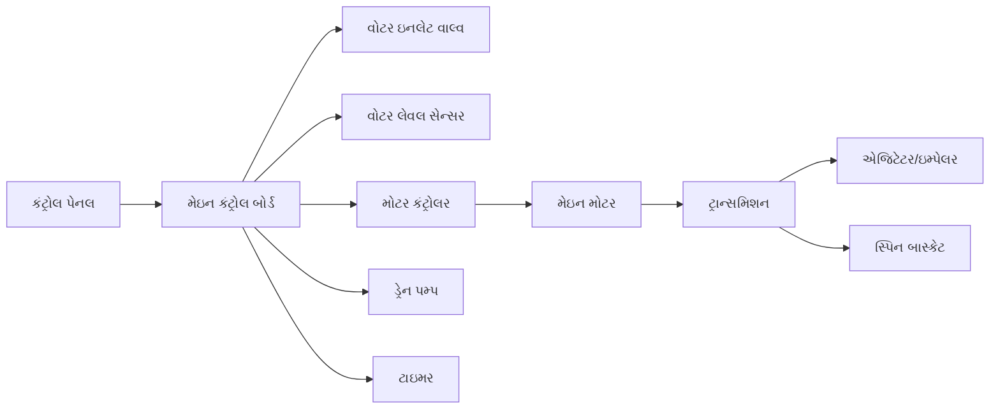

**કાર્ય વ્યૂહરચના/પગલાં:**

1. **ફિલ ફેઝ**:
   - વોટર ઇનલેટ વાલ્વ ખુલે છે
   - ટબ પ્રીસેટ લેવલ સુધી ભરાય છે
   - ડિટરજન્ટ પાણી સાથે મિક્સ થાય છે

2. **વોશ ફેઝ**:
   - મોટર એજિટેટર/ઇમ્પેલરને ચલાવે છે
   - પાણીના પ્રવાહો બનાવે છે
   - કપડાં સાબુવાળા પાણીમાં ફરે છે
   - મેકેનિકલ એક્શન દ્વારા ગંદકી છૂટી પડે છે

3. **ડ્રેન ફેઝ**:
   - ડ્રેન પમ્પ સક્રિય થાય છે
   - સાબુવાળું પાણી નીકળી જાય છે

4. **રિન્સ ફેઝ**:
   - તાજું પાણી પ્રવેશે છે
   - એજિટેટર/ઇમ્પેલર સાબુના અવશેષો દૂર કરે છે
   - અનેક વખત રીપીટ થઈ શકે છે

5. **સ્પિન ફેઝ**:
   - બાસ્કેટ ઉચ્ચ ગતિએ ફરે છે
   - સેન્ટ્રિફ્યુગલ ફોર્સ પાણી દૂર કરે છે
   - કપડાં આંશિક રીતે સૂકાય છે

**મેમરી ટ્રીક:** "FWDRS: ફિલ, વોશ, ડ્રેન, રિન્સ, સ્પિન"

## પ્રશ્ન 4(અ) [3 ગુણ]

**લેસર પ્રિન્ટરના કાર્ય સિદ્ધાંતને સમજાવો. તેની ટેકનિકલ સ્પેસિફિકેશન આપો.**

**જવાબ**:

**લેસર પ્રિન્ટર કાર્યપ્રણાલી:**
ઇલેક્ટ્રોફોટોગ્રાફી પર આધારિત જ્યાં લેસર બીમ ફોટોસેન્સિટિવ ડ્રમ પર ઇલેક્ટ્રોસ્ટેટિક ઇમેજ બનાવે છે, જે ટોનર પાર્ટિકલ્સને આકર્ષે છે જે પછી પેપર પર ટ્રાન્સફર થાય છે અને ગરમીથી ફ્યુઝ થાય છે.

**ટેક્નિકલ સ્પેસિફિકેશન:**

| સ્પેસિફિકેશન | સામાન્ય રેન્જ/મૂલ્યો |
|---------------|----------------------|
| **પ્રિન્ટ રિઝોલ્યુશન** | 600-1200 dpi |
| **પ્રિન્ટ સ્પીડ** | 20-50 ppm (પેજિસ પર મિનિટ) |
| **ડ્યુટી સાયકલ** | 10,000-100,000 પેજિસ/મહિનો |
| **મેમરી** | 64-512 MB |
| **કનેક્ટિવિટી** | USB, ઈથરનેટ, Wi-Fi |
| **પેપર કેપેસિટી** | 250-500 શીટ્સ |
| **પાવર કન્ઝમ્પશન** | 300-800W (એક્ટિવ), <10W (સ્ટેન્ડબાય) |

**મેમરી ટ્રીક:** "RSCDCP: રિઝોલ્યુશન, સ્પીડ, સાયકલ, ડ્યુટી, કનેક્ટિવિટી, પાવર"

## પ્રશ્ન 4(બ) [4 ગુણ]

**ફોટો કોપીયર મશીનના કાર્યકારી સિદ્ધાંતને સમજાવો. તેના ટેકનિકલ સ્પેસિફિકેશન આપો.**

**જવાબ**:

**ફોટોકોપિયર કાર્યપ્રણાલી:**
ઝેરોગ્રાફી (ડ્રાય કોપિંગ) પ્રક્રિયાનો ઉપયોગ કરે છે જ્યાં પ્રકાશ મૂળ દસ્તાવેજ પરથી ચાર્જ્ડ ફોટોરિસેપ્ટર ડ્રમ પર પરાવર્તિત થાય છે, ઇલેક્ટ્રિકલ ઇમેજ બનાવે છે જે ટોનર પાર્ટિકલ્સને આકર્ષે છે જે પછી પેપર પર ટ્રાન્સફર અને ફ્યુઝ થાય છે.

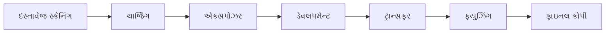

**ટેક્નિકલ સ્પેસિફિકેશન:**

| સ્પેસિફિકેશન | સામાન્ય મૂલ્યો |
|---------------|---------------|
| **કોપી સ્પીડ** | 20-60 cpm (કોપિસ પર મિનિટ) |
| **રિઝોલ્યુશન** | 600-1200 dpi |
| **પેપર સાઇઝ સપોર્ટ** | A5 થી A3 |
| **ઝૂમ રેન્જ** | 25%-400% |
| **પેપર કેપેસિટી** | 250-2000 શીટ્સ |
| **વોર્મ-અપ ટાઇમ** | 10-30 સેકન્ડ |
| **મલ્ટિપલ કોપી** | 1-999 કોપિસ |
| **પાવર કન્ઝમ્પશન** | 1.0-1.5 kW (ઓપરેટિંગ) |

**મેમરી ટ્રીક:** "CRSPWMP: કોપી સ્પીડ, રિઝોલ્યુશન, સાઇઝ, પેપર કેપેસિટી, વોર્મ-અપ, મલ્ટિપલ કોપી, પાવર"

## પ્રશ્ન 4(ક) [7 ગુણ]

**વાયરલેસ સીસીટીવી કેમેરા સિસ્ટમની યોજના દોરો અને સમજાવો. નેટવર્ક વિડિયો રેકોર્ડર સમજાવો. CCTV સિસ્ટમમાં ઉપયોગમાં લેવાતા વિવિધ કેમેરાના પ્રકાર લખો અને તેમાંથી કોઈપણ એક સમજાવો.**

**જવાબ**:

**વાયરલેસ CCTV કેમેરા સિસ્ટમ:**

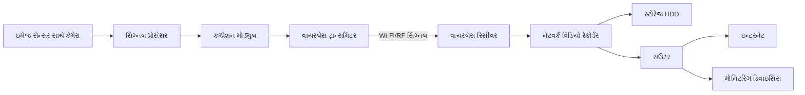

**નેટવર્ક વિડિયો રેકોર્ડર (NVR):**

- **ફંક્શન**: IP કેમેરાઓથી વિડિયો સ્ટ્રીમ્સ રેકોર્ડ કરે છે
- **મુખ્ય ઘટકો**:
  - CPU: મલ્ટિપલ વિડિયો સ્ટ્રીમ્સ પ્રોસેસ કરે છે
  - સ્ટોરેજ: મલ્ટિપલ હાર્ડ ડ્રાઇવ્સ (2-16TB ટિપિકલ)
  - નેટવર્ક ઇન્ટરફેસ: કેમેરા અને નેટવર્ક સાથે જોડાય છે
  - વિડિયો મેનેજમેન્ટ સોફ્ટવેર: રેકોર્ડિંગ શેડ્યુલ્સ કંટ્રોલ કરે છે
- **ફીચર્સ**:
  - મોશન ડિટેક્શન રેકોર્ડિંગ
  - રિમોટ એક્સેસ કેપેબિલિટીસ
  - વિડિયો એનાલિટિક્સ
  - સિમલ્ટેનિયસ રેકોર્ડિંગ અને પ્લેબેક

**CCTV કેમેરા પ્રકારો:**

| કેમેરા પ્રકાર | મુખ્ય લક્ષણો |
|-------------|-------------|
| **ડોમ કેમેરા** | સીલિંગ માઉન્ટેડ, વેન્ડલ-રેસિસ્ટન્ટ |
| **બુલેટ કેમેરા** | લોંગ-રેન્જ વ્યુઇંગ, વેધર-રેસિસ્ટન્ટ |
| **PTZ કેમેરા** | પેન, ટિલ્ટ, ઝૂમ કેપેબિલિટીસ |
| **બોક્સ કેમેરા** | કસ્ટમાઇઝેબલ લેન્સ ઓપ્શન્સ |
| **થર્મલ કેમેરા** | હીટ ડિટેક્શન, અંધકારમાં કામ કરે છે |
| **ફિશઆઇ/360° કેમેરા** | વાઇડ-એંગલ પેનોરમિક વ્યુ |

**IP કેમેરા સમજૂતી:**

- ડિજિટલ સિગ્નલ પ્રોસેસિંગનો ઉપયોગ કરે છે
- નેટવર્ક સાથે સીધો જોડાય છે (ઈથરનેટ/Wi-Fi)
- બિલ્ટ-ઇન વેબ સર્વર છે
- ઉચ્ચ રિઝોલ્યુશન (2-8MP ટિપિકલ)
- પાવર ઓવર ઈથરનેટ (PoE) ક્ષમતા
- ટુ-વે ઓડિયો કમ્યુનિકેશન
- એડવાન્સ્ડ એનાલિટિક્સ કેપેબિલિટીસ

**મેમરી ટ્રીક:** "WISP-NET: વાયરલેસ ઇમેજિસ સિક્યોરલી પ્રોસેસ્ડ, નેટવર્ક્ડ, એનેબલિંગ ટ્રેકિંગ"

## પ્રશ્ન 4(અ OR) [3 ગુણ]

**ઇંકજેટ પ્રિન્ટરના કાર્યકારી સિદ્ધાંતને સમજાવો. તેની તકનીકી લાક્ષણિકતાઓ આપો.**

**જવાબ**:

**ઇંકજેટ પ્રિન્ટર કાર્યપ્રણાલી:**
પ્રવાહી શાહીના નાના ટીપાંને કાગળ પર પ્રક્ષેપિત કરીને ચિત્રો બનાવે છે. પ્રિન્ટહેડમાં સૂક્ષ્મ નોઝલ્સ હોય છે જે શાહીના ટીપાંને ચોક્કસ જરૂરી જગ્યાએ ફેંકે છે જેથી ટેક્સ્ટ અને ચિત્રો બને.

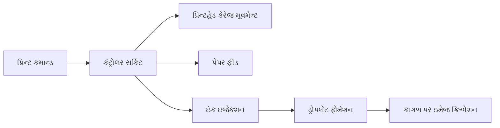

**ટેક્નિકલ સ્પેસિફિકેશન:**

| સ્પેસિફિકેશન | સામાન્ય મૂલ્યો |
|---------------|---------------|
| **પ્રિન્ટ રિઝોલ્યુશન** | 1200-4800 dpi |
| **પ્રિન્ટ સ્પીડ** | 8-20 ppm (બ્લેક), 4-15 ppm (કલર) |
| **ઇંક ટાઇપ** | ડાય-બેઝ્ડ અથવા પિગમેન્ટ-બેઝ્ડ |
| **કનેક્ટિવિટી** | USB, Wi-Fi, ઈથરનેટ |
| **પેપર કેપેસિટી** | 100-250 શીટ્સ |
| **ડ્રોપલેટ સાઇઝ** | 1-3 પિકોલિટર્સ |
| **કલર સિસ્ટમ** | 4-8 ઇંક કાર્ટ્રિજિસ |

**મેમરી ટ્રીક:** "RIPS-CCD: રિઝોલ્યુશન, ઇંક ટાઇપ, પ્રિન્ટ સ્પીડ, સાઇઝ ઓફ ડ્રોપલેટ, કનેક્ટિવિટી, કેપેસિટી, ડ્રોપલેટ"

## પ્રશ્ન 4(બ OR) [4 ગુણ]

**ટેલિવિઝન રીસીવર અને વોશિંગ મશીનની જાળવણી અને રિપેરિંગ સમજાવો.**

**જવાબ**:

**ટેલિવિઝન મેઇન્ટેનન્સ:**

| મેઇન્ટેનન્સ ટાસ્ક | ફ્રિક્વન્સી |
|-----------------|-----------|
| ડસ્ટ ક્લીનિંગ | માસિક |
| સોફ્ટવેર અપડેટ્સ | ઉપલબ્ધ થાય ત્યારે |
| સ્ક્રીન ક્લીનિંગ | સાપ્તાહિક |
| વેન્ટિલેશન ચેક | માસિક |
| બ્રાઇટનેસ/કોન્ટ્રાસ્ટ એડજસ્ટમેન્ટ | જરૂર પડે ત્યારે |

**ટેલિવિઝન ટ્રબલશૂટિંગ:**

| સમસ્યા | સંભવિત ઉકેલ |
|---------|------------------|
| નો પાવર | પાવર કેબલ, આઉટલેટ, ફ્યુઝ ચેક કરો |
| પિક્ચર નથી પણ સાઉન્ડ કામ કરે છે | વિડિયો કેબલ, પિક્ચર સેટિંગ્સ ચેક કરો |
| સાઉન્ડ નથી પણ પિક્ચર કામ કરે છે | ઓડિયો સેટિંગ્સ, સ્પીકર કનેક્શન્સ ચેક કરો |
| ખરાબ પિક્ચર ક્વોલિટી | સેટિંગ્સ એડજસ્ટ કરો, સિગ્નલ સ્ટ્રેન્થ ચેક કરો |
| રિમોટ કામ કરતું નથી | બેટરી બદલો, IR સેન્સર સાફ કરો |

**વોશિંગ મશીન મેઇન્ટેનન્સ:**

| મેઇન્ટેનન્સ ટાસ્ક | ફ્રિક્વન્સી |
|-----------------|-----------|
| ડ્રમ અને ગેસ્કેટ સાફ કરો | માસિક |
| ફિલ્ટર ચેક/ક્લીન કરો | માસિક |
| ડિટર્જન્ટ ડ્રોઅર સાફ કરો | માસિક |
| ખાલી હોટ સાયકલ ચલાવો | ત્રિમાસિક |
| લીકેજ માટે હોસેસ ચેક કરો | ત્રિમાસિક |

**વોશિંગ મશીન ટ્રબલશૂટિંગ:**

| સમસ્યા | સંભવિત ઉકેલ |
|---------|------------------|
| સ્પિનિંગ નથી | લોડ બેલેન્સ, ડોર લોક ચેક કરો |
| પાણી લીક થાય છે | હોસેસ, ડોર સીલ, ડ્રેન પમ્પ ચેક કરો |
| ડ્રેન થતું નથી | ફિલ્ટર સાફ કરો, ડ્રેન હોસ ચેક કરો |
| વધુ વાઇબ્રેશન | મશીન લેવલ કરો, સસ્પેન્શન ચેક કરો |
| ડોર ખુલતો નથી | સેફ્ટી લોક રિલીઝ થવાની રાહ જુઓ |

**મેમરી ટ્રીક:** "CREST: ક્લીન રેગ્યુલરલી, એક્ઝામિન કનેક્શન્સ, સર્વિસ ફિલ્ટર્સ, ટેસ્ટ ફંક્શન્સ"

## પ્રશ્ન 4(ક OR) [7 ગુણ]

**સીસીટીવી વ્યાખ્યાયિત કરો. ઘરમાં સ્થાપિત સીસીટીવી કેમેરા સિસ્ટમને schematic દોરીને સમજાવો. એનાલોગ કેમેરા, ડિજિટલ કેમેરા અને IP કેમેરાનું વર્ણન કરો અને તેમનાં વચ્ચેનો તફાવત આપો.**

**જવાબ**:

**CCTV (ક્લોઝ્ડ-સર્કિટ ટેલિવિઝન):**
એક વિડિયો સર્વેલન્સ સિસ્ટમ જે સિગ્નલ્સને ચોક્કસ, મર્યાદિત મોનિટર સેટ પર ટ્રાન્સમિટ કરે છે, બ્રોડકાસ્ટ ટેલિવિઝનથી વિપરીત. તે ઘરો, વ્યવસાયો અને જાહેર સ્થળોમાં સર્વેલન્સ અને સુરક્ષા મોનિટરિંગ માટે વપરાય છે.

**ઘરમાં CCTV સિસ્ટમ સ્કેમેટિક:**

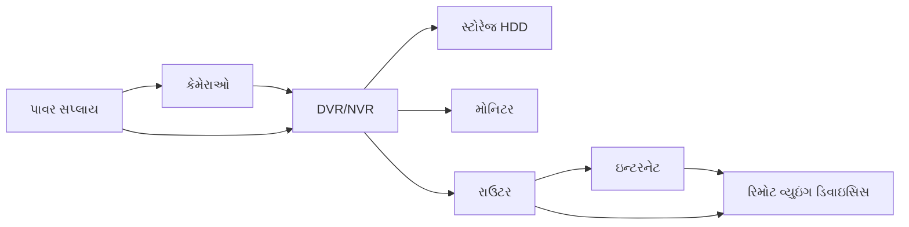

**કેમેરા પ્રકારો:**

**1. એનાલોગ કેમેરા:**

- પરંપરાગત કોએક્સિયલ કેબલ કનેક્શન્સનો ઉપયોગ કરે છે
- સામાન્ય રીતે 720×576 રિઝોલ્યુશન (સ્ટાન્ડર્ડ ડેફિનિશન)
- રેકોર્ડિંગ માટે DVR (ડિજિટલ વિડિયો રેકોર્ડર)ની જરૂર પડે છે
- મર્યાદિત કેબલ રન અંતર (300-500m)
- સરળ ઇન્સ્ટોલેશન, ઓછી કિંમત

**2. ડિજિટલ કેમેરા:**

- કેમેરા પર એનાલોગ સિગ્નલને ડિજિટલમાં કન્વર્ટ કરે છે
- ટ્રાન્સમિશન માટે કોએક્સિયલ કેબલ અથવા ટ્વિસ્ટેડ પેરનો ઉપયોગ
- એનાલોગ કરતાં સારું રિઝોલ્યુશન (2MP સુધી)
- સુધારેલ ઇમેજ ક્વોલિટી અને સ્ટેબિલિટી
- પરંપરાગત DVR સિસ્ટમ સાથે કામ કરે છે

**3. IP કેમેરા:**

- કેપ્ચરથી ટ્રાન્સમિશન સુધી સંપૂર્ણ ડિજિટલ
- ઈથરનેટ/Wi-Fi દ્વારા નેટવર્ક સાથે સીધું જોડાય છે
- ઉચ્ચ રિઝોલ્યુશન (2-8MP અથવા વધુ)
- રેકોર્ડિંગ માટે NVR (નેટવર્ક વિડિયો રેકોર્ડર)નો ઉપયોગ
- એડવાન્સ્ડ ફીચર્સ: રિમોટ વ્યુઇંગ, એનાલિટિક્સ, PoE

**તુલના ટેબલ:**

| ફીચર | એનાલોગ કેમેરા | ડિજિટલ કેમેરા | IP કેમેરા |
|---------|--------------|---------------|-----------|
| સિગ્નલ | એનાલોગ | એનાલોગ-ટુ-ડિજિટલ | ડિજિટલ |
| રિઝોલ્યુશન | SD (700 TVL સુધી) | HD (2MP સુધી) | HD/UHD (2-12MP) |
| કેબલિંગ | કોએક્સિયલ | કોએક્સિયલ/ટ્વિસ્ટેડ પેર | ઈથરનેટ/Wi-Fi |
| રેકોર્ડર | DVR | DVR | NVR |
| સેટઅપ કોમ્પ્લેક્સિટી | ઓછી | મધ્યમ | ઉચ્ચ |
| કિંમત | ઓછી | મધ્યમ | ઉચ્ચ |
| રિમોટ એક્સેસ | મર્યાદિત | મર્યાદિત | એડવાન્સ્ડ |

**મેમરી ટ્રીક:** "ADI: એનાલોગ જૂની ટેક્નોલોજી છે, IP નવીનતાનું પ્રતિનિધિત્વ કરે છે"

## પ્રશ્ન 5(અ) [3 ગુણ]

**જાળવણીને વ્યાખ્યાયિત કરો. તેના પ્રકારો જણાવો. તેમાંથી કોઈપણ એક સમજાવો**

**જવાબ**:

**જાળવણી:**
ઉપકરણોની નિષ્ફળતાઓને રોકવા અને ઉપકરણના જીવનકાળને લંબાવવા માટે નિયમિત નિરીક્ષણ, સર્વિસિંગ, રિપેર, અને ઘટકોના બદલાવ દ્વારા ઉપકરણને કાર્યરત સ્થિતિમાં જાળવવાની પ્રક્રિયા.

**જાળવણીના પ્રકારો:**

| પ્રકાર | વર્ણન |
|------|-------------|
| **પ્રિવેન્ટિવ** | નિષ્ફળતાઓને રોકવા માટે નિયમિત શેડ્યુલ્ડ મેઇન્ટેનન્સ |
| **પ્રેડિક્ટિવ** | નિષ્ફળતાઓની આગાહી કરવા માટે મોનિટરિંગ અને ડેટા એનાલિસિસ પર આધારિત |
| **કરેક્ટિવ/બ્રેકડાઉન** | ઉપકરણ નિષ્ફળ થયા પછી કરવામાં આવે છે |
| **કન્ડિશન-બેઝ્ડ** | વાસ્તવિક ઉપકરણની સ્થિતિ પર આધારિત |
| **રિલાયબિલિટી-સેન્ટર્ડ** | સિસ્ટમ ફંક્શન જાળવવા પર ધ્યાન કેન્દ્રિત કરે છે |

**પ્રિવેન્ટિવ મેઇન્ટેનન્સ:**

- ઉપકરણની સ્થિતિને ધ્યાનમાં લીધા વિના શેડ્યુલ્ડ અંતરાલે કરવામાં આવે છે
- ક્લીનિંગ, લુબ્રિકેટિંગ, એડજસ્ટિંગ, અને વિયર કોમ્પોનન્ટ્સ બદલવાનો સમાવેશ થાય છે
- અનપેક્ષિત નિષ્ફળતાઓને રોકવા અને ઉપકરણના જીવનકાળને લંબાવવાનો ઉદ્દેશ્ય
- ઉત્પાદકની સેવા ભલામણોને અનુસરે છે
- ઉદાહરણો: ફિલ્ટર ચેન્જ, બેલ્ટ રિપ્લેસમેન્ટ, કેલિબ્રેશન, લુબ્રિકેશન

**મેમરી ટ્રીક:** "PPCR: પ્રિવેન્ટ પ્રોબ્લેમ્સ થ્રુ ચેકઅપ્સ રેગ્યુલરલી"

## પ્રશ્ન 5(બ) [4 ગુણ]

**PA સિસ્ટમ્સ અને હોમ થિયેટર સિસ્ટમની જાળવણી વિશે સમજાવો.**

**જવાબ**:

**PA સિસ્ટમ મેઇન્ટેનન્સ:**

| કોમ્પોનન્ટ | મેઇન્ટેનન્સ ટાસ્ક |
|-----------|------------------|
| **સ્પીકર્સ** | કનેક્શન્સ ચેક કરો, નુકસાન માટે ઇન્સ્પેક્ટ કરો, ડસ્ટ સાફ કરો |
| **એમ્પ્લિફાયર્સ** | કુલિંગ વેન્ટ્સ સાફ કરો, ઓવરહીટિંગ ચેક કરો, કેબલ્સ ઇન્સ્પેક્ટ કરો |
| **માઇક્રોફોન્સ** | ગ્રિલ્સ સાફ કરો, કેબલ્સ ચેક કરો, યોગ્ય ઓપરેશન માટે ટેસ્ટ કરો |
| **કેબલ્સ** | નુકસાન માટે ઇન્સ્પેક્ટ કરો, કનેક્શન્સ ટાઇટ છે તેની ખાતરી કરો |
| **મિક્સર્સ** | ફેડર્સ/નોબ્સ સાફ કરો, ઇનપુટ/આઉટપુટ લેવલ્સ ચેક કરો |

**મુખ્ય પ્રક્રિયાઓ:**

- નોઇઝ ટાળવા માટે યોગ્ય ગ્રાઉન્ડિંગ વેરિફાય કરો
- ઉપયોગ પહેલાં ઓછા વોલ્યુમ પર સિસ્ટમ ટેસ્ટ કરો
- ઉપકરણોને સૂકા અને ડસ્ટ-ફ્રી રાખો
- ઉત્પાદકની ક્લીનિંગ સૂચનાઓને અનુસરો
- ટ્રબલશૂટિંગ માટે કોઈપણ સમસ્યાઓનું દસ્તાવેજીકરણ કરો

**હોમ થિયેટર સિસ્ટમ મેઇન્ટેનન્સ:**

| કોમ્પોનન્ટ | મેઇન્ટેનન્સ ટાસ્ક |
|-----------|------------------|
| **AV રિસીવર** | વેન્ટિલેશન જાળવો, ફર્મવેર અપડેટ કરો, કનેક્શન્સ ચેક કરો |
| **સ્પીકર્સ** | કનેક્શન્સ ચેક કરો, ડસ્ટ સાફ કરો, પોઝિશનિંગ વેરિફાય કરો |
| **સબવૂફર** | રેટલિંગ ચેક કરો, શ્રેષ્ઠ સાઉન્ડ માટે પ્લેસમેન્ટ એડજસ્ટ કરો |
| **ડિસ્પ્લે ડિવાઇસ** | સ્ક્રીન યોગ્ય રીતે સાફ કરો, સેટિંગ્સ ચેક કરો |
| **સોર્સ ડિવાઇસિસ** | ઓપ્ટિકલ ડ્રાઇવ્સ સાફ કરો, ફર્મવેર અપડેટ કરો |

**મુખ્ય પ્રક્રિયાઓ:**

- સમયાંતરે ઓડિયો સેટિંગ્સ કેલિબ્રેટ કરો
- યોગ્ય HDMI કનેક્શન્સ વેરિફાય કરો
- રિમોટ કંટ્રોલ્સ સાફ અને તાજી બેટરી સાથે રાખો
- બધા ઘટકો માટે યોગ્ય વેન્ટિલેશન જાળવો
- બધા ચેનલ્સ ચકાસવા માટે સ્પીકર ટેસ્ટ ટોન્સ ચલાવો

**મેમરી ટ્રીક:** "CAVS: ક્લીન, એડજસ્ટ, વેરિફાય કનેક્શન્સ, સર્વિસ રેગ્યુલરલી"

## પ્રશ્ન 5(ક) [7 ગુણ]

**DTH ટેકનોલોજીનો બ્લોક ડાયાગ્રામ દોરો અને સમજાવો. DTH સિસ્ટમમાં વપરાતા હાર્ડવેર ઘટકોની ચર્ચા કરો. વર્તમાન DTH સિસ્ટમમાં હાલમાં પ્રદાન કરવામાં આવતી વિવિધ આધુનિક સુવિધાઓની ચર્ચા કરો.**

**જવાબ**:

**DTH (ડાયરેક્ટ ટુ હોમ) ટેક્નોલોજી બ્લોક ડાયાગ્રામ:**

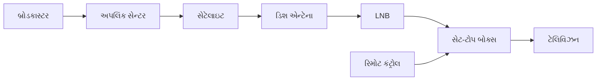

**DTH હાર્ડવેર ઘટકો:**

1. **સેટેલાઇટ ડિશ એન્ટેના**:
   - સેટેલાઇટ સિગ્નલ્સ કેપ્ચર કરતું પેરાબોલિક રિફ્લેક્ટર
   - સાઇઝ સામાન્ય રીતે 45-90cm ડાયામીટર
   - સેટેલાઇટ પોઝિશન સાથે ચોક્કસ એલાઇન થવું જરૂરી

2. **LNB (લો નોઇઝ બ્લોક)**:
   - ડિશ દ્વારા રિફ્લેક્ટ થયેલા સિગ્નલ્સ મેળવે છે
   - નોઇઝને મિનિમાઇઝ કરતાં નબળા સિગ્નલ્સને એમ્પ્લિફાય કરે છે
   - ઉચ્ચ ફ્રિક્વન્સી સિગ્નલ્સને નીચી ફ્રિક્વન્સીમાં રૂપાંતરિત કરે છે
   - ટિપિકલ ફ્રિક્વન્સી: 10.7-12.75 GHz થી 950-2150 MHz

3. **કોએક્સિયલ કેબલ**:
   - LNBને સેટ-ટોપ બોક્સ સાથે જોડે છે
   - F-કનેક્ટર્સ સાથે RG-6 પ્રકાર
   - મિનિમલ સિગ્નલ લોસ લક્ષણો

4. **સેટ-ટોપ બોક્સ (STB)**:
   - સેટેલાઇટ સિગ્નલ્સને ડીમોડ્યુલેટ અને ડિકોડ કરે છે
   - કન્ડિશનલ એક્સેસ સિસ્ટમ ધરાવે છે
   - MPEG-2/MPEG-4/H.264 વિડિયો પ્રોસેસ કરે છે
   - યુઝર ઇન્ટરફેસ અને પ્રોગ્રામ ગાઇડ પ્રદાન કરે છે

5. **સ્માર્ટ કાર્ડ**:
   - સબ્સ્ક્રાઇબર માહિતી ધરાવે છે
   - એન્ક્રિપ્ટેડ ચેનલ્સનું ડિક્રિપ્શન કરવા સક્ષમ બનાવે છે
   - સબ્સ્ક્રિપ્શન વિગતો સ્ટોર કરે છે

**DTH સિસ્ટમ્સની આધુનિક વિશેષતાઓ:**

| વિશેષતા | વર્ણન |
|---------|-------------|
| **HD અને 4K ચેનલ્સ** | હાઇ-ડેફિનિશન અને અલ્ટ્રા-હાઇ-ડેફિનિશન કન્ટેન્ટ |
| **ઇન્ટરેક્ટિવ TV** | ઓન-ડિમાન્ડ કન્ટેન્ટ, વોટિંગ, ગેમ્સ |
| **મલ્ટી-રૂમ વ્યુઇંગ** | એક જ સબ્સ્ક્રિપ્શન અનેક TVs પર |
| **રેકોર્ડિંગ કેપેબિલિટી** | બિલ્ટ-ઇન અથવા એક્સટર્નલ DVR ફંક્શનાલિટી |
| **મોબાઇલ એપ કંટ્રોલ** | સ્માર્ટફોન દ્વારા રિમોટ કંટ્રોલ |
| **વૉઇસ કંટ્રોલ** | વૉઇસ-એક્ટિવેટેડ કમાન્ડ્સ |
| **કેચ-અપ TV** | અનેક દિવસો સુધી મિસ થયેલા પ્રોગ્રામ્સ જોવા |
| **OTT ઇન્ટિગ્રેશન** | Netflix, Prime Video વગેરેનો એક્સેસ |
| **કન્ટેન્ટ રેકમેન્ડેશન** | AI-આધારિત વ્યક્તિગત સૂચનો |
| **પેરેન્ટલ કંટ્રોલ્સ** | રેટિંગ્સ આધારિત કન્ટેન્ટ પ્રતિબંધ |

**મેમરી ટ્રીક:** "DISH-STB: ડાયરેક્ટ ઇન્ફોર્મેશન સેટેલાઇટ હબ - સિગ્નલ્સ ટ્રાન્સમિટેડ ટુ બોક્સ"

## પ્રશ્ન 5(અ OR) [3 ગુણ]

**અનુમાનિત અને નિવારક જાળવણી વચ્ચે તફાવત કરો.**

**જવાબ**:

| પાસાં | પ્રેડિક્ટિવ મેઇન્ટેનન્સ | પ્રિવેન્ટિવ મેઇન્ટેનન્સ |
|--------|------------------------|------------------------|
| **આધાર** | ઉપકરણની સ્થિતિ | સમય અથવા ઉપયોગ અંતરાલ |
| **અભિગમ** | ડેટા-સંચાલિત મોનિટરિંગ | પૂર્વ-નિર્ધારિત સેવા |
| **સમયાંકન** | નિષ્ફળતાની આગાહી થાય તે પહેલાં | સ્થિતિને ધ્યાનમાં લીધા વિના નિયમિત અંતરાલે |
| **વપરાયેલા સાધનો** | સેન્સર્સ, વાઇબ્રેશન એનાલિસિસ, થર્મલ ઇમેજિંગ | મેઇન્ટેનન્સ શેડ્યુલ્સ, ચેકલિસ્ટ |
| **ખર્ચ** | ઉચ્ચ પ્રારંભિક સેટઅપ, લાંબા ગાળાનો ઓછો | પ્રારંભિક ઓછો, સંભવિત લાંબા ગાળાનો વધુ |
| **ડાઉનટાઇમ** | મિનિમલ, આયોજિત | નિયમિત આયોજિત ડાઉનટાઇમ |
| **રિસોર્સ એફિશિયન્સી** | ઉચ્ચ (ફક્ત જરૂર પડે ત્યારે સેવા) | ઓછી (બિનજરૂરી સેવા કરી શકે) |
| **ઉદાહરણ** | ઓઇલ એનાલિસિસ ડિગ્રેડેશન બતાવે તો ચેન્જ ટ્રિગર થાય | સ્થિતિને ધ્યાનમાં લીધા વિના દર 5,000 કિમી એ ઓઇલ ચેન્જ કરવામાં આવે |

**મેમરી ટ્રીક:** "TIME vs DATA: ટાઇમ્ડ ઇન્ટરવલ્સ મેઇન્ટેનન્સ એવરીવ્હેર vs ડેટા એનાલિસિસ ટ્રિગર્સ એક્શન"

## પ્રશ્ન 5(બ OR) [4 ગુણ]

**માઇક્રોવેવ ઓવન માટે મુશ્કેલી નિવારણ પ્રક્રિયા અને સલામતીની સાવચેતીઓનું વર્ણન કરો.**

**જવાબ**:

**માઇક્રોવેવ ઓવન ટ્રબલશૂટિંગ પ્રક્રિયા:**

1. **પ્રારંભિક આકારણી**:
   - પાવર કનેક્શન અને આઉટલેટ ચકાસો
   - પાવર સૂચના માટે ડિસ્પ્લે/લાઇટ્સ ચેક કરો
   - સામાન્ય ઓપરેશનલ અવાજો સાંભળો

2. **સામાન્ય સમસ્યાઓ અને ચેકિંગ**:
   - **નો પાવર**: ફ્યુઝ, ડોર સ્વિચ, કંટ્રોલ બોર્ડ ચેક કરો
   - **નો હીટિંગ**: મેગ્નેટ્રોન, હાઇ વોલ્ટેજ કોમ્પોનન્ટ્સ ચેક કરો
   - **ટર્નટેબલ કામ કરતું નથી**: મોટર, ડ્રાઇવ કપલિંગ ચેક કરો
   - **નોઇઝી ઓપરેશન**: ફેન, મેગ્નેટ્રોન, ટર્નટેબલની તપાસ કરો
   - **સ્પાર્કિંગ**: ધાતુની વસ્તુઓ, ડેમેજ્ડ રેક/કેવિટી જુઓ

3. **ડાયગ્નોસ્ટિક સ્ટેપ્સ**:
   - ડિસ્પ્લે પર એરર કોડ ચેક કરો
   - ડોર ઇન્ટરલૉક સ્વિચિસ ટેસ્ટ કરો
   - ઘટકોમાં યોગ્ય વોલ્ટેજ ચકાસો
   - બળેલા ઘટકો અથવા વાયરિંગ માટે તપાસ કરો

**સલામતી સાવચેતીઓ:**

| સાવચેતી | કારણ |
|------------|--------|
| **સર્વિસ પહેલાં અનપ્લગ** | ઇલેક્ટ્રિક શોક અટકાવે છે |
| **કેપેસિટર ડિસ્ચાર્જ કરો** | અનપ્લગ કર્યા પછી પણ લીથલ વોલ્ટેજ સ્ટોર કરે છે |
| **60 સેકન્ડ રાહ જુઓ** | કેપેસિટરને કુદરતી રીતે ડિસ્ચાર્જ થવા દે છે |
| **ક્યારેય ખાલી ન ચલાવો** | મેગ્નેટ્રોનને નુકસાન થઈ શકે છે |
| **માઇક્રોવેવ લીકેજ ચેક કરો** | કેલિબ્રેટેડ લીકેજ ડિટેક્ટરનો ઉપયોગ કરીને |
| **ઇન્ટરલોક્સને ડિફીટ ન કરો** | આવશ્યક સલામતી સુવિધા છે |
| **ઇન્સ્યુલેટેડ ગ્લોવ્સ પહેરો** | ઇલેક્ટ્રિકલ શોકથી સુરક્ષા |
| **રિપેર વેરિફાય કરો** | સેવામાં પાછા આપતા પહેલાં સંપૂર્ણ ટેસ્ટ કરો |

**મેમરી ટ્રીક:** "DUEL-SAFE: ડિસ્કનેક્ટ પાવર, યુઝ ડિસ્ચાર્જ ટૂલ, એક્ઝામિન સિસ્ટેમેટિકલી, લુક ફોર ડેમેજ - સેફ્ટી ઓલવેઝ ફર્સ્ટ, એવરી ટાઇમ"

## પ્રશ્ન 5(ક OR) [7 ગુણ]

**PA સિસ્ટમનો બ્લોક ડાયાગ્રામ દોરો અને સમજાવો. ઓડિટોરિયમ માટે ડિઝાઇન કરતી વખતે ડિઝાઇન પરિમાણોની ચર્ચા કરો. આઉટપુટ ઇમ્પીડેન્સ તરીકે 8 ઓહ્મ ધરાવતા PA સિસ્ટમ એમ્પ્લિફાયર સાથે ચાર 8 ઓહ્મ સ્પીકર્સનું જોડાણનો ડાયાગ્રામ દોરો.**

**જવાબ**:

**PA સિસ્ટમ બ્લોક ડાયાગ્રામ:**

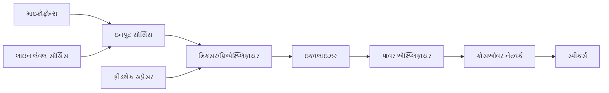

**PA સિસ્ટમ ઘટકો:**

- **ઇનપુટ સોર્સિસ**: માઇક્રોફોન્સ, ઇન્સ્ટ્રુમેન્ટ્સ, મીડિયા પ્લેયર્સ
- **મિક્સર/પ્રિએમ્પ્લિફાયર**: ઇનપુટ સિગ્નલ્સને ભેગા કરે અને એડજસ્ટ કરે છે
- **ઇક્વલાઇઝર**: ફ્રિક્વન્સી રિસ્પોન્સ એડજસ્ટ કરે છે
- **પાવર એમ્પ્લિફાયર**: સ્પીકર્સને ડ્રાઇવ કરવા માટે સિગ્નલ પાવર વધારે છે
- **ક્રોસઓવર નેટવર્ક**: યોગ્ય સ્પીકર્સ માટે ફ્રિક્વન્સીનું વિભાજન કરે છે
- **સ્પીકર્સ**: ઇલેક્ટ્રિકલ સિગ્નલ્સને ધ્વનિમાં રૂપાંતરિત કરે છે
- **ફીડબેક સપ્રેસર**: ઓડિયો ફીડબેકને અટકાવે છે

**ઓડિટોરિયમ ડિઝાઇન પેરામીટર્સ:**

| પેરામીટર | વિચારણા |
|-----------|---------------|
| **રૂમ એકોસ્ટિક્સ** | રિવર્બરેશન ટાઇમ (1.0-2.0s ઓપ્ટિમલ), ઇકો કંટ્રોલ |
| **સ્પીકર પ્લેસમેન્ટ** | કવરેજ એંગલ, અંતર, ઊંચાઈ, ફીડબેક ઘટાડવી |
| **પાવર રિક્વાયરમેન્ટ્સ** | સ્પીચ માટે 1-2W પ્રતિ વ્યક્તિ, મ્યુઝિક માટે 2-3W |
| **ફ્રિક્વન્સી રિસ્પોન્સ** | સ્પીચ માટે 100Hz-12kHz, મ્યુઝિક માટે 40Hz-16kHz |
| **સ્પીચ ઇન્ટેલિજિબિલિટી** | STI (સ્પીચ ટ્રાન્સમિશન ઇન્ડેક્સ) > 0.60 |
| **એમ્બિયન્ટ નોઇઝ** | NC-25 થી NC-30 (નોઇઝ ક્રાઇટેરિયન) |
| **સાઉન્ડ પ્રેશર લેવલ** | શ્રેષ્ઠ શ્રવણ માટે 85-95dB |
| **લાઇન એરે vs. પોઇન્ટ સોર્સ** | રૂમ સાઇઝ અને શેપ પર આધારિત |

**8Ω સ્પીકર્સને 8Ω એમ્પ્લિફાયર સાથે કનેક્શન ડાયાગ્રામ:**

**સિરીઝ-પેરેલલ કનેક્શન:**

```goat
     Amplifier
  Output (8 Ohm)
        |
        |
   +----+----+
   |         |
   |         |
   v         v
 Speaker1  Speaker3
 (8 Ohm)   (8 Ohm)
   |         |
   |         |
   v         v
 Speaker2  Speaker4
 (8 Ohm)   (8 Ohm)
   |         |
   |         |
   +---------+
```

- બે સિરીઝમાં સ્પીકર્સની બે પેરેલલ બ્રાન્ચ
- દરેક સિરીઝ બ્રાન્ચ = 16Ω (8Ω + 8Ω)
- પેરેલલમાં બે 16Ω બ્રાન્ચ = 8Ω ટોટલ (16Ω ÷ 2)
- એમ્પ્લિફાયર સાથે યોગ્ય ઇમ્પીડન્સ મેચ જાળવે છે
- બધા સ્પીકર્સને સમાન રીતે પાવર વિતરિત કરે છે

**મેમરી ટ્રીક:** "PASS: પ્રોપર એમ્પ્લિફિકેશન, સ્પીકર પ્લેસમેન્ટ, સિરીઝ-પેરેલલ વાયરિંગ"
