## Question 1(a) [3 marks]

**Define only: 1. Loudness 2. Timbre 3. Echo**

**Answer**:

| Term | Definition |
|------|------------|
| **Loudness** | The subjective perception of sound intensity that depends on sound pressure and frequency |
| **Timbre** | The quality of sound that distinguishes different instruments or voices playing the same note |
| **Echo** | A sound reflection that arrives at the listener with a delay greater than 50ms after the direct sound |

**Mnemonic:** "LTE: Loudness measures strength, Timbre gives uniqueness, Echo comes back delayed"

## Question 1(b) [4 marks]

**List Type of loudspeaker and explain any one of them**

**Answer**:

**Types of Loudspeakers:**

| Type | Key Feature |
|------|-------------|
| Dynamic/Moving Coil | Uses electromagnetic coil |
| Electrostatic | Uses charged diaphragm |
| Ribbon | Uses thin metal ribbon |
| Piezoelectric | Uses crystals that vibrate |
| Horn | Uses acoustic horn for amplification |
| Planar Magnetic | Uses magnetic strips on diaphragm |

**Dynamic/Moving Coil Loudspeaker:**


- **Magnetic Structure**: Permanent magnet creates static magnetic field
- **Voice Coil**: Receives audio current and creates varying magnetic field
- **Diaphragm/Cone**: Attached to voice coil, vibrates to produce sound waves

**Mnemonic:** "COPPER-D: Coil Oscillates, Permanent magnet Pulls/Pushes, Emitting Resonance through Diaphragm"

## Question 1(c) [7 marks]

**List types of Microphone. State its Characteristics and explain Wireless Microphone in detail.**

**Answer**:

**Types of Microphones:**

| Type | Operating Principle |
|------|---------------------|
| Dynamic | Moving coil in magnetic field |
| Condenser | Variable capacitance |
| Carbon | Variable resistance |
| Ribbon | Ribbon movement in magnetic field |
| Crystal/Piezoelectric | Crystal deformation |
| Electret | Permanently charged material |
| MEMS | Micro-Electro-Mechanical Systems |

**Microphone Characteristics:**

- **Sensitivity**: Output level for given sound pressure
- **Frequency Response**: Range of frequencies captured
- **Directional Pattern**: Pickup pattern (omnidirectional, cardioid, etc.)
- **Impedance**: Electrical resistance to AC signals
- **Signal-to-Noise Ratio**: Desired signal vs. background noise

**Wireless Microphone System:**


- **Microphone Element**: Converts sound to electrical signals
- **Transmitter**: Modulates audio onto radio frequency carrier
- **Receiver**: Captures RF signal and demodulates to recover audio
- **Operating Frequency**: Uses VHF (30-300 MHz) or UHF (300-3000 MHz) bands
- **Battery Operation**: Requires power source for transmitter

**Mnemonic:** "WIRED: Wireless Is Radio-Enabled Device"

## Question 1(c OR) [7 marks]

**State characteristics of Loudspeakers and explain pearmeant magnet loudspeaker with its advantages and disadvantages.**

**Answer**:

**Loudspeaker Characteristics:**

| Characteristic | Description |
|----------------|-------------|
| Frequency Response | Range of frequencies reproduced (20Hz-20kHz ideal) |
| Sensitivity | Sound pressure level (dB) with 1W input at 1m distance |
| Impedance | Electrical resistance (typically 4, 8, or 16 ohms) |
| Power Handling | Maximum power without damage (watts) |
| Directivity | Sound dispersion pattern |
| Distortion | Unwanted alteration of the original signal |

**Permanent Magnet Loudspeaker:**

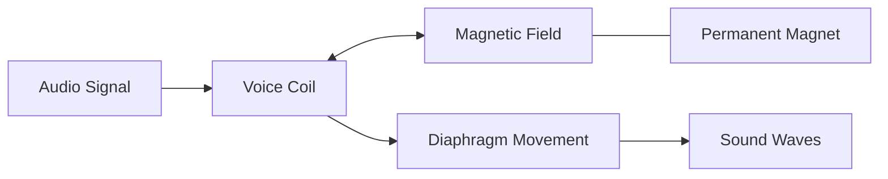

**Working Principle:**

- Voice coil receives electrical audio signals
- Magnetic field interactions cause coil movement
- Attached diaphragm vibrates to produce sound
- Permanent magnet provides constant magnetic field

**Advantages:**

- **Cost-effective**: No external power for magnetic field
- **Reliable**: Simple design with fewer failure points
- **Compact**: No field coil or power supply needed
- **Efficient**: Good power-to-sound conversion

**Disadvantages:**

- **Limited Power**: Magnetic field strength is fixed
- **Magnet Deterioration**: Can weaken over time
- **Weight**: Strong magnets can make unit heavy
- **Heat Sensitivity**: Performance affected by temperature

**Mnemonic:** "PMLS: Permanent Magnet Loudly Speaks"

## Question 2(a) [3 marks]

**Define 1. Aspect ratio 2. Chrominance 3. Additive Mixing**

**Answer**:

| Term | Definition |
|------|------------|
| **Aspect Ratio** | The ratio of width to height of a television or display screen (e.g., 16:9, 4:3) |
| **Chrominance** | The color information in a video signal, independent of the luminance or brightness |
| **Additive Mixing** | The process of combining different colored lights to create new colors, where mixing all primary colors produces white |

**Mnemonic:** "ACA: Aspect sets dimensions, Chrominance adds color, Additive mixing creates brightness"

## Question 2(b) [4 marks]

**Explain interlace scanning**

**Answer**:

**Interlace Scanning:**

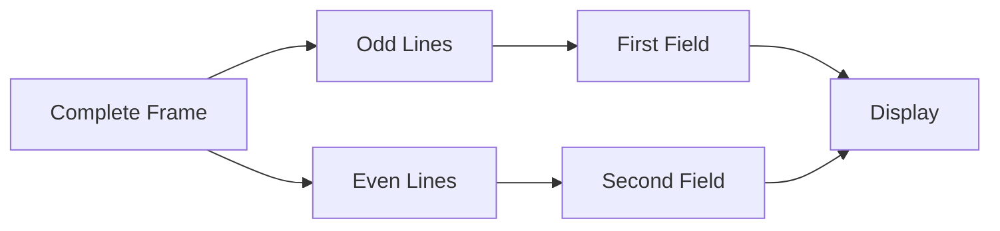

**Process:**

- Frame divided into two fields: odd-numbered lines and even-numbered lines
- First field displays all odd-numbered lines (1,3,5...)
- Second field displays all even-numbered lines (2,4,6...)
- Fields displayed alternately, creating illusion of full frame
- Standard rate: 50/60 fields per second (25/30 frames per second)

**Key Benefit**: Reduces bandwidth while maintaining perceived vertical resolution

**Mnemonic:** "ODD-EVEN: One Display, then Delayed Extra Visual Enhancement Next"

## Question 2(c) [7 marks]

**Discuss working principle of LED Television. State its advantages and compare it with LCD television.**

**Answer**:

**LED TV Working Principle:**

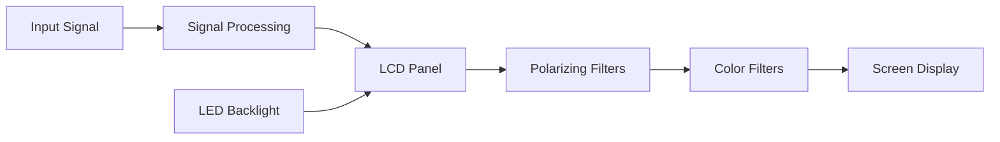

**Key Components:**

- **LED Backlight**: Light source (edge-lit or full-array)
- **LCD Panel**: Liquid crystal layer controls light passage
- **TFT Matrix**: Thin-film transistors control each pixel
- **Color Filters**: Create RGB colors from white backlight
- **Polarizing Filters**: Control light direction and intensity

**Advantages of LED TV:**

- **Energy Efficient**: Consumes less power
- **Thinner Design**: Allows for slim profile
- **Better Contrast**: Especially with local dimming
- **Longer Lifespan**: LEDs last 50,000-100,000 hours
- **Eco-Friendly**: No mercury content

**Comparison with LCD TV:**

| Feature | LED TV | LCD TV |
|---------|--------|--------|
| Backlight | LED lights | CCFL (Cold Cathode Fluorescent Lamps) |
| Thickness | Thinner (25-40mm) | Thicker (100-150mm) |
| Power Consumption | Lower | Higher |
| Contrast Ratio | Better (3000:1-8000:1) | Lower (1000:1-2000:1) |
| Color Reproduction | More vibrant | Less vibrant |
| Lifespan | 50,000-100,000 hours | 30,000-60,000 hours |
| Cost | Higher | Lower |

**Mnemonic:** "LEDGE: Light Emitting Diodes Give Excellence"

## Question 2(a) [3 marks]

**State any six standards of Color television system.**

**Answer**:

| Standard | Region/Features |
|----------|-----------------|
| **PAL** (Phase Alternating Line) | Europe, Australia, 625 lines, 25 fps |
| **NTSC** (National Television System Committee) | North America, Japan, 525 lines, 30 fps |
| **SECAM** (Sequential Color with Memory) | France, Russia, 625 lines, 25 fps |
| **PAL-M** | Brazil, 525 lines, 30 fps |
| **PAL-N** | Argentina, Paraguay, Uruguay |
| **ATSC** (Advanced Television Systems Committee) | Digital standard, North America |
| **DVB-T** (Digital Video Broadcasting-Terrestrial) | Digital standard, Europe |
| **ISDB** (Integrated Services Digital Broadcasting) | Digital standard, Japan, Brazil |

**Mnemonic:** "PANS-ADI: PAL, ATSC, NTSC, SECAM - All Display Images"

## Question 2(b) [4 marks]

**Explain working of LCD Television.**

**Answer**:

**LCD Television Working:**

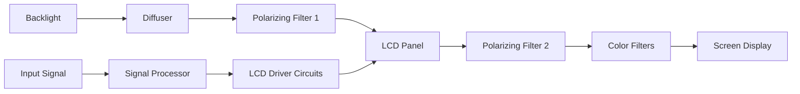

**Operating Principle:**

- **Backlight**: Provides white light source
- **Polarizing Filters**: Two filters at 90° to each other
- **Liquid Crystals**: Twist/untwist to control light passage
- **TFT Array**: Controls voltage to each pixel
- **Color Filters**: Create RGB colors from white light

**Mnemonic:** "BPLTC: Backlight Passes through Liquid crystals That Color"

## Question 2(c) [7 marks]

**Draw and Explain block diagram of PAL-D decoder.**

**Answer**:

**PAL-D Decoder:**

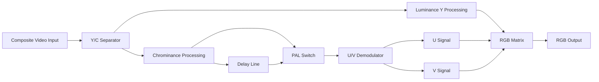

**PAL-D Decoder Components:**

- **Y/C Separator**: Separates luminance (Y) from chrominance (C)
- **Luminance Processing**: Enhances brightness and contrast
- **Chrominance Processing**: Extracts color subcarrier
- **Delay Line**: Delays signal by one line (64µs)
- **PAL Switch**: Reverses phase of V signal on alternate lines
- **U/V Demodulator**: Extracts U (B-Y) and V (R-Y) color difference signals
- **RGB Matrix**: Combines Y, U, V to produce RGB signals

**Key Feature**: Phase alternation corrects phase errors by averaging consecutive lines

**Mnemonic:** "PAL Decodes Color Right By Switching, Delaying, Unscrambling Variations"

## Question 3(a) [3 marks]

**Give classification of rooftop Solar power plant and explain any one plant.**

**Answer**:

**Rooftop Solar Power Plant Types:**

| Type | Description |
|------|-------------|
| **Grid-Connected** | Connected to utility grid, no batteries |
| **Off-Grid** | Standalone system with battery storage |
| **Hybrid** | Can operate in both grid-connected and off-grid modes |

**Grid-Connected System:**

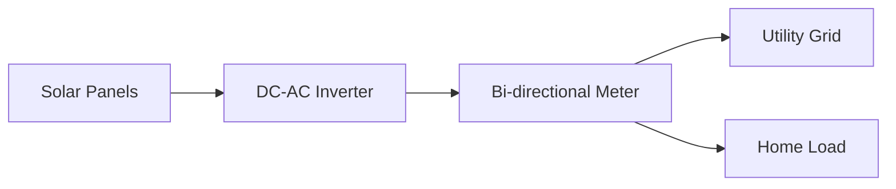

- **Solar Panels**: Convert sunlight to DC electricity
- **Inverter**: Converts DC to grid-compatible AC
- **Meter**: Measures power exported/imported
- **Grid Connection**: Excess power fed to grid

**Mnemonic:** "GOH: Grid connects, Off-grid stores, Hybrid does both"

## Question 3(b) [4 marks]

**Give at least four technical specification of Refrigerator and split Air condition each.**

**Answer**:

**Refrigerator Specifications:**

| Specification | Typical Range/Description |
|---------------|---------------------------|
| **Capacity** | 150-750 liters |
| **Energy Rating** | Star rating (1-5 stars) |
| **Power Consumption** | 100-400 kWh per year |
| **Compressor Type** | Reciprocating or inverter |
| **Defrost System** | Manual, frost-free, or direct cool |
| **Refrigerant Type** | R-600a, R-134a |
| **Temperature Range** | 2-8°C (refrigerator), -18 to -24°C (freezer) |

**Split Air Conditioner Specifications:**

| Specification | Typical Range/Description |
|---------------|---------------------------|
| **Cooling Capacity** | 1-2 tons (12,000-24,000 BTU/hr) |
| **Energy Efficiency Ratio (EER)** | 2.8-3.5 W/W |
| **ISEER Rating** | Star rating (1-5 stars) |
| **Power Consumption** | 800-2500 watts |
| **Refrigerant Type** | R-32, R-410A |
| **Noise Level** | 30-55 dB |
| **Operating Temperature Range** | 18-32°C (indoor), -5 to 55°C (outdoor) |

**Mnemonic:** "CERT: Capacity, Efficiency, Refrigerant Type, Temperature"

## Question 3(c) [7 marks]

**Explain working of Microwave oven with respect to its working principle, functional block diagram and its safety precautions while in operative condition.**

**Answer**:

**Microwave Oven Working Principle:**
Food contains water molecules, which are polar. Microwaves cause these molecules to rotate rapidly (2.45 GHz), creating friction and generating heat throughout the food.

**Functional Block Diagram:**

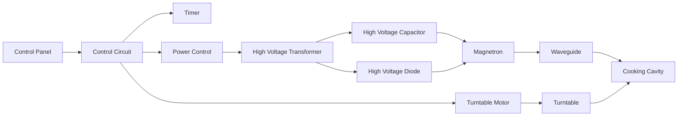

**Key Components:**

- **Magnetron**: Generates microwave radiation (2.45 GHz)
- **Waveguide**: Directs microwaves to cooking cavity
- **Turntable**: Ensures even cooking
- **Control Circuit**: Manages timing and power
- **High Voltage Circuit**: Powers the magnetron

**Safety Precautions:**

- **Door Interlocks**: Multiple switches prevent operation when door is open
- **Monitoring Circuit**: Shuts down if interlocks fail
- **Cavity Mesh Screen**: Blocks microwaves from escaping
- **Never Operate Empty**: Can damage magnetron
- **No Metal Objects**: Can cause arcing and damage
- **Regular Cleaning**: Prevents food buildup and arcing
- **Avoid Damaged Seals**: May allow microwave leakage

**Mnemonic:** "MICROWAVE: Magnetron Initiates Cooking, Radiation Only Within Authorized Vessel Environment"

## Question 3(a OR) [3 marks]

**State various hardware used in rooftop solar power plant and explain solar panels used in it.**

**Answer**:

**Rooftop Solar Power Plant Hardware:**

| Component | Function |
|-----------|----------|
| **Solar Panels** | Convert sunlight to DC electricity |
| **Mounting Structure** | Supports panels at optimal angle |
| **Inverter** | Converts DC to AC power |
| **Batteries** (optional) | Store energy for later use |
| **Charge Controller** | Regulates battery charging (in off-grid systems) |
| **Junction Boxes** | Provide connection points and protection |
| **Meters** | Measure power generation/consumption |
| **Cables & Connectors** | Transmit power between components |

**Solar Panels:**

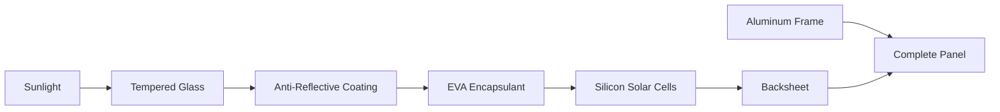

- **Monocrystalline**: Higher efficiency (15-22%), darker color, longer lifespan
- **Polycrystalline**: Lower cost, blue appearance, 13-17% efficiency
- **Thin-Film**: Flexible, lightweight, lower efficiency (10-12%)
- **Typical Output**: 250-400W per panel
- **Lifespan**: 25-30 years with warranty

**Mnemonic:** "SIMPLE: Solar panels Integrate Multiple Photovoltaic Layers Efficiently"

## Question 3(b OR) [4 marks]

**Give at least four technical specification of Microwave oven and washing machine each.**

**Answer**:

**Microwave Oven Specifications:**

| Specification | Typical Range/Description |
|---------------|---------------------------|
| **Power Output** | 700-1200 watts |
| **Capacity** | 15-42 liters |
| **Frequency** | 2.45 GHz |
| **Operating Modes** | Microwave, grill, convection, combo |
| **Control Type** | Mechanical, digital, touch panel |
| **Power Consumption** | 1000-1500 watts |
| **Timer Range** | 0-60 minutes |

**Washing Machine Specifications:**

| Specification | Typical Range/Description |
|---------------|---------------------------|
| **Capacity** | 5-12 kg |
| **Washing Technology** | Agitator, impeller, drum |
| **Spin Speed** | 700-1600 RPM |
| **Water Consumption** | 30-80 liters per cycle |
| **Energy Rating** | Star rating (1-5 stars) |
| **Program Options** | 8-16 programs |
| **Motor Type** | Universal, inverter, direct drive |

**Mnemonic:** "CPFWS: Capacity, Power, Frequency, Washing technology, Spin speed"

## Question 3(c OR) [7 marks]

**Give classification of washing machine. Explain working of top load washing machine with respect to its functional block diagram and working strategy/steps to wash clothes.**

**Answer**:

**Washing Machine Classification:**

| Type | Subtype | Key Features |
|------|---------|-------------|
| **Top Load** | Agitator | Central post that rotates |
|  | Impeller | Rotating disk at bottom |
| **Front Load** | Horizontal Axis | Tumbling action, water efficient |
| **By Automation** | Fully Automatic | Complete cycle automation |
|  | Semi-Automatic | Manual intervention required |
| **By Function** | Washer Only | Washing function only |
|  | Washer-Dryer | Combined washing and drying |

**Top Load Washing Machine Functional Block Diagram:**

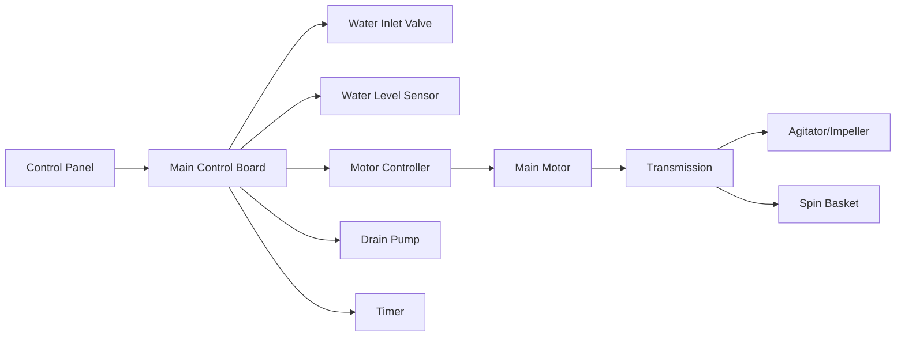

**Working Strategy/Steps:**

1. **Fill Phase**:
   - Water inlet valve opens
   - Tub fills to preset level
   - Detergent mixed with water

2. **Wash Phase**:
   - Motor drives agitator/impeller
   - Creates water currents
   - Clothing moves through soapy water
   - Dirt loosened by mechanical action

3. **Drain Phase**:
   - Drain pump activates
   - Soapy water removed

4. **Rinse Phase**:
   - Fresh water enters
   - Agitator/impeller removes soap residue
   - May repeat multiple times

5. **Spin Phase**:
   - Basket rotates at high speed
   - Centrifugal force removes water
   - Clothes partially dried

**Mnemonic:** "FWDRS: Fill, Wash, Drain, Rinse, Spin"

## Question 4(a) [3 marks]

**Explain working principle of laser printer. Give its technical specifications.**

**Answer**:

**Laser Printer Working Principle:**
Based on electrophotography where a laser beam creates an electrostatic image on a photosensitive drum, which attracts toner particles that are then transferred to paper and fused with heat.

**Technical Specifications:**

| Specification | Typical Range/Values |
|---------------|----------------------|
| **Print Resolution** | 600-1200 dpi |
| **Print Speed** | 20-50 ppm (pages per minute) |
| **Duty Cycle** | 10,000-100,000 pages/month |
| **Memory** | 64-512 MB |
| **Connectivity** | USB, Ethernet, Wi-Fi |
| **Paper Capacity** | 250-500 sheets |
| **Power Consumption** | 300-800W (active), <10W (standby) |

**Mnemonic:** "RSCDCP: Resolution, Speed, Cycle, Duty, Connectivity, Power"

## Question 4(b) [4 marks]

**Explain working principle of Photo copier machine. State its technical specifications.**

**Answer**:

**Photocopier Working Principle:**
Uses xerography (dry copying) process where light reflects off the original document onto a charged photoreceptor drum, creating an electrical image that attracts toner particles which are transferred and fused to paper.


**Technical Specifications:**

| Specification | Typical Values |
|---------------|---------------|
| **Copy Speed** | 20-60 cpm (copies per minute) |
| **Resolution** | 600-1200 dpi |
| **Paper Size Support** | A5 to A3 |
| **Zoom Range** | 25%-400% |
| **Paper Capacity** | 250-2000 sheets |
| **Warm-up Time** | 10-30 seconds |
| **Multiple Copy** | 1-999 copies |
| **Power Consumption** | 1.0-1.5 kW (operating) |

**Mnemonic:** "CRSPWMP: Copy speed, Resolution, Size, Paper capacity, Warm-up, Multiple copy, Power"

## Question 4(c) [7 marks]

**Draw and explain schematic of wireless CCTV camera system. Explain Network video recorder. State types of camera used in CCTV system and explain any one of them.**

**Answer**:

**Wireless CCTV Camera System:**

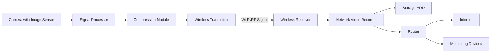

**Network Video Recorder (NVR):**

- **Function**: Records video streams from IP cameras
- **Key Components**:
  - CPU: Processes multiple video streams
  - Storage: Multiple hard drives (2-16TB typical)
  - Network Interface: Connects to cameras and network
  - Video Management Software: Controls recording schedules
- **Features**:
  - Motion detection recording
  - Remote access capabilities
  - Video analytics
  - Simultaneous recording and playback

**Types of CCTV Cameras:**

| Camera Type | Key Features |
|-------------|-------------|
| **Dome Camera** | Ceiling mounted, vandal-resistant |
| **Bullet Camera** | Long-range viewing, weather-resistant |
| **PTZ Camera** | Pan, tilt, zoom capabilities |
| **Box Camera** | Customizable lens options |
| **Thermal Camera** | Heat detection, works in darkness |
| **Fisheye/360° Camera** | Wide-angle panoramic view |

**IP Camera Explained:**

- Uses digital signal processing
- Connects directly to network
- Has built-in web server
- Higher resolution (2-8MP typical)
- Power over Ethernet (PoE) capability
- Two-way audio communication
- Advanced analytics capabilities

**Mnemonic:** "WISP-NET: Wireless Images Securely Processed, Networked, Enabling Tracking"

## Question 4(a OR) [3 marks]

**Explain working principle of inkjet printer. Give its technical specifications.**

**Answer**:

**Inkjet Printer Working Principle:**
Creates images by propelling tiny droplets of liquid ink onto paper. The printhead contains hundreds of microscopic nozzles that eject ink droplets precisely where needed to form text and images.

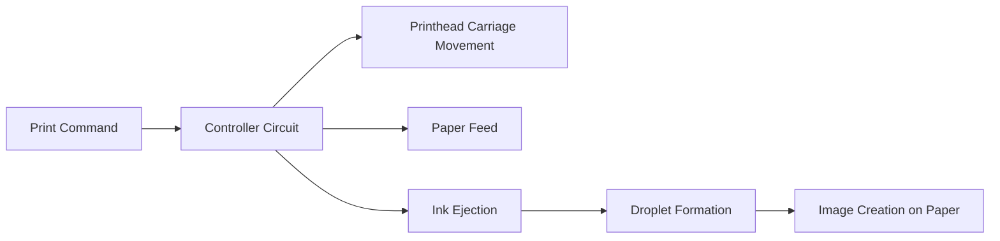

**Technical Specifications:**

| Specification | Typical Values |
|---------------|---------------|
| **Print Resolution** | 1200-4800 dpi |
| **Print Speed** | 8-20 ppm (black), 4-15 ppm (color) |
| **Ink Type** | Dye-based or pigment-based |
| **Connectivity** | USB, Wi-Fi, Ethernet |
| **Paper Capacity** | 100-250 sheets |
| **Droplet Size** | 1-3 picoliters |
| **Color System** | 4-8 ink cartridges |

**Mnemonic:** "RIPS-CCD: Resolution, Ink type, Print speed, Size of droplet, Connectivity, Capacity, Droplet"

## Question 4(b OR) [4 marks]

**Explain maintenance and trouble shooting of television receiver and Washing machine.**

**Answer**:

**Television Maintenance:**

| Maintenance Task | Frequency |
|-----------------|-----------|
| Dust cleaning | Monthly |
| Software updates | As available |
| Screen cleaning | Weekly |
| Ventilation check | Monthly |
| Brightness/contrast adjustment | As needed |

**Television Troubleshooting:**

| Problem | Possible Solution |
|---------|------------------|
| No power | Check power cable, outlet, fuse |
| No picture but sound works | Check video cable, picture settings |
| No sound but picture works | Check audio settings, speaker connections |
| Poor picture quality | Adjust settings, check signal strength |
| Remote not working | Replace batteries, clean IR sensor |

**Washing Machine Maintenance:**

| Maintenance Task | Frequency |
|-----------------|-----------|
| Clean drum and gasket | Monthly |
| Check/clean filter | Monthly |
| Clean detergent drawer | Monthly |
| Run empty hot cycle | Quarterly |
| Check hoses for leaks | Quarterly |

**Washing Machine Troubleshooting:**

| Problem | Possible Solution |
|---------|------------------|
| Not spinning | Check load balance, door lock |
| Leaking water | Check hoses, door seal, drain pump |
| Not draining | Clean filter, check drain hose |
| Excessive vibration | Level machine, check suspension |
| Door won't open | Wait for safety lock release |

**Mnemonic:** "CREST: Clean Regularly, Examine connections, Service filters, Test functions"

## Question 4(c OR) [7 marks]

**Define CCTV. Explain with schematic CCTV camera system installed in a home. Describe analog camera, Digital camera and IP camera and differentiate them.**

**Answer**:

**CCTV (Closed-Circuit Television):**
A video surveillance system that transmits signals to a specific, limited set of monitors, unlike broadcast television. It's used for surveillance and security monitoring in homes, businesses, and public spaces.

**Home CCTV System Schematic:**

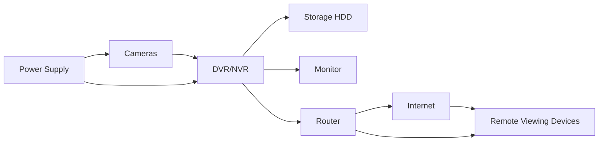

**Camera Types:**

**Analog Camera:**

- Transmits continuous analog signal via coaxial cable
- Typically 720×576 resolution (standard definition)
- Requires DVR (Digital Video Recorder) for recording
- Limited cable run distance (300-500m)
- Simpler installation, lower cost

**Digital Camera:**

- Converts analog signal to digital at camera
- Uses coaxial cable or twisted pair for transmission
- Better resolution than analog (up to 2MP)
- Improved image quality and stability
- Works with traditional DVR systems

**IP Camera:**

- Fully digital from capture to transmission
- Connects directly to network via Ethernet/Wi-Fi
- High resolution (2-8MP or higher)
- Uses NVR (Network Video Recorder) for recording
- Advanced features: remote viewing, analytics, PoE

**Comparison Table:**

| Feature | Analog Camera | Digital Camera | IP Camera |
|---------|--------------|---------------|-----------|
| Signal | Analog | Analog-to-Digital | Digital |
| Resolution | SD (up to 700 TVL) | HD (up to 2MP) | HD/UHD (2-12MP) |
| Cabling | Coaxial | Coaxial/Twisted pair | Ethernet/Wi-Fi |
| Recorder | DVR | DVR | NVR |
| Setup Complexity | Low | Medium | High |
| Price | Lower | Medium | Higher |
| Remote Access | Limited | Limited | Advanced |

**Mnemonic:** "ADI: Analog uses Decaying technology, IP represents Innovation"

## Question 5(a) [3 marks]

**Define maintenance. State its types. Explain any one of them.**

**Answer**:

**Maintenance:**
The process of preserving equipment in operational condition by regular inspection, servicing, repair, and replacement of components to prevent failures and extend equipment life.

**Types of Maintenance:**

| Type | Description |
|------|-------------|
| **Preventive** | Scheduled regular maintenance to prevent failures |
| **Predictive** | Based on monitoring and data analysis to predict failures |
| **Corrective/Breakdown** | Performed after equipment failure occurs |
| **Condition-based** | Based on actual equipment condition |
| **Reliability-centered** | Focuses on maintaining system function |

**Preventive Maintenance:**

- Conducted at scheduled intervals regardless of equipment condition
- Includes cleaning, lubricating, adjusting, and replacing wear components
- Aims to prevent unexpected failures and extend equipment life
- Follows manufacturer's service recommendations
- Examples: filter changes, belt replacements, calibration, lubrication

**Mnemonic:** "PPCR: Prevent Problems through Checkups Regularly"

## Question 5(b) [4 marks]

**Explaining maintenance of PA systems and Home theatre system.**

**Answer**:

**PA System Maintenance:**

| Component | Maintenance Task |
|-----------|------------------|
| **Speakers** | Check connections, inspect for damage, clean dust |
| **Amplifiers** | Clean cooling vents, check for overheating, inspect cables |
| **Microphones** | Clean grilles, check cables, test for proper operation |
| **Cables** | Inspect for damage, verify connections are tight |
| **Mixers** | Clean faders/knobs, check input/output levels |

**Key Procedures:**

- Verify proper grounding to avoid noise
- Test system at low volume before use
- Keep equipment dry and dust-free
- Follow manufacturer's cleaning instructions
- Document any issues for troubleshooting

**Home Theatre System Maintenance:**

| Component | Maintenance Task |
|-----------|------------------|
| **AV Receiver** | Keep ventilated, update firmware, check connections |
| **Speakers** | Check connections, clean dust, verify positioning |
| **Subwoofer** | Check for rattling, adjust placement for optimal sound |
| **Display Device** | Clean screen properly, check settings |
| **Source Devices** | Clean optical drives, update firmware |

**Key Procedures:**

- Calibrate audio settings periodically
- Verify proper HDMI connections
- Keep remote controls clean and with fresh batteries
- Maintain proper ventilation for all components
- Run speaker test tones to verify all channels

**Mnemonic:** "CAVS: Clean, Adjust, Verify connections, Service regularly"

## Question 5(c) [7 marks]

**Draw and Explain block diagram of DTH technology. Discuss hardware components used in DTH system. Discuss various modern features currently provided in current DTH system.**

**Answer**:

**DTH (Direct To Home) Technology Block Diagram:**

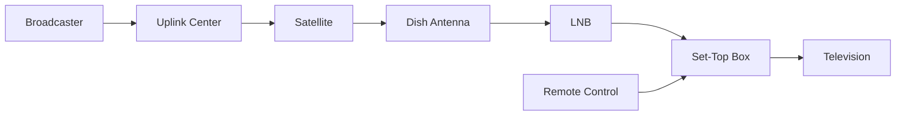

**DTH Hardware Components:**

1. **Satellite Dish Antenna**:
   - Parabolic reflector that captures satellite signals
   - Size typically 45-90cm diameter
   - Must be accurately aligned to satellite position

2. **LNB (Low Noise Block)**:
   - Receives signals reflected by dish
   - Amplifies weak signals while minimizing noise
   - Converts high frequency signals to lower frequency
   - Typical frequency: 10.7-12.75 GHz down to 950-2150 MHz

3. **Coaxial Cable**:
   - Connects LNB to set-top box
   - RG-6 type with F-connectors
   - Minimal signal loss characteristics

4. **Set-Top Box (STB)**:
   - Demodulates and decodes satellite signals
   - Contains conditional access system
   - Processes MPEG-2/MPEG-4/H.264 video
   - Provides user interface and program guide

5. **Smart Card**:
   - Contains subscriber information
   - Enables decryption of encrypted channels
   - Stores subscription details

**Modern Features of DTH Systems:**

| Feature | Description |
|---------|-------------|
| **HD & 4K Channels** | High-definition and ultra-high-definition content |
| **Interactive TV** | On-demand content, voting, games |
| **Multi-room Viewing** | Same subscription on multiple TVs |
| **Recording Capability** | Built-in or external DVR functionality |
| **Mobile App Control** | Remote control via smartphone |
| **Voice Control** | Voice-activated commands |
| **Catch-up TV** | Watch missed programs for several days |
| **OTT Integration** | Access to Netflix, Prime Video, etc. |
| **Content Recommendation** | AI-based personalized suggestions |
| **Parental Controls** | Content restriction based on ratings |

**Mnemonic:** "DISH-STB: Direct Information Satellite Hub - Signals Transmitted to Box"

## Question 5(a OR) [3 marks]

**Differentiate between predictive and preventive maintenance.**

**Answer**:

| Aspect | Predictive Maintenance | Preventive Maintenance |
|--------|------------------------|------------------------|
| **Basis** | Equipment condition | Time or usage intervals |
| **Approach** | Data-driven monitoring | Pre-scheduled service |
| **Timing** | Just before failure predicted | Regular intervals regardless of condition |
| **Tools Used** | Sensors, vibration analysis, thermal imaging | Maintenance schedules, checklists |
| **Cost** | Higher initial setup, lower long-term | Lower initial, potentially higher long-term |
| **Downtime** | Minimal, planned | Regular planned downtime |
| **Resource Efficiency** | Higher (service only when needed) | Lower (may service unnecessarily) |
| **Example** | Oil analysis showing degradation triggers change | Oil changed every 5,000 km regardless of condition |

**Mnemonic:** "TIME vs DATA: Timed Intervals Maintenance Everywhere vs Data Analysis Triggers Action"

## Question 5(b OR) [4 marks]

**Describe troubleshooting procedure and safety precautions for microwave oven.**

**Answer**:

**Microwave Oven Troubleshooting Procedure:**

1. **Initial Assessment**:
   - Verify power connection and outlet
   - Check display/lights for power indication
   - Listen for normal operational sounds

2. **Common Issues and Checks**:
   - **No Power**: Check fuse, door switches, control board
   - **No Heating**: Check magnetron, high voltage components
   - **Turntable Not Working**: Check motor, drive coupling
   - **Noisy Operation**: Inspect fan, magnetron, turntable
   - **Sparking**: Look for metal objects, damaged rack/cavity

3. **Diagnostic Steps**:
   - Check error codes on display
   - Test door interlock switches
   - Verify proper voltage at components
   - Inspect for burnt components or wiring

**Safety Precautions:**

| Precaution | Reason |
|------------|--------|
| **Unplug Before Service** | Prevents electric shock |
| **Discharge Capacitor** | Stores lethal voltage even when unplugged |
| **Wait 60 Seconds** | Allows capacitor to discharge naturally |
| **Never Run Empty** | Can damage magnetron |
| **Check Microwave Leakage** | Using calibrated leakage detector |
| **Don't Defeat Interlocks** | Essential safety feature |
| **Wear Insulated Gloves** | Protection from electrical shock |
| **Verify Repairs** | Test thoroughly before returning to service |

**Mnemonic:** "DUEL-SAFE: Disconnect power, Use discharge tool, Examine systematically, Look for damage - Safety Always First, Every time"

## Question 5(c OR) [7 marks]

**Draw and explain block diagram of PA system. Discuss design parameters while designing for auditorium. Draw connection diagram of four 8 Ohm speakers to PA system amplifier having 8 Ohm as output impedance.**

**Answer**:

**PA System Block Diagram:**

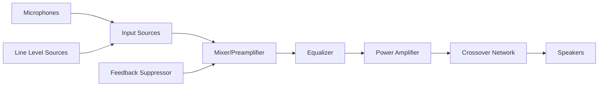

**PA System Components:**

- **Input Sources**: Microphones, instruments, media players
- **Mixer/Preamplifier**: Combines and adjusts input signals
- **Equalizer**: Adjusts frequency response
- **Power Amplifier**: Increases signal power to drive speakers
- **Crossover Network**: Divides frequencies for appropriate speakers
- **Speakers**: Converts electrical signals to sound
- **Feedback Suppressor**: Prevents audio feedback

**Auditorium Design Parameters:**

| Parameter | Consideration |
|-----------|---------------|
| **Room Acoustics** | Reverberation time (1.0-2.0s optimal), echo control |
| **Speaker Placement** | Coverage angle, distance, height, minimizing feedback |
| **Power Requirements** | 1-2W per person for speech, 2-3W for music |
| **Frequency Response** | 100Hz-12kHz for speech, 40Hz-16kHz for music |
| **Speech Intelligibility** | STI (Speech Transmission Index) > 0.60 |
| **Ambient Noise** | NC-25 to NC-30 (Noise Criterion) |
| **Sound Pressure Level** | 85-95dB for optimal listening |
| **Line Array vs. Point Source** | Based on room size and shape |

**Connection Diagram for 8Ω Speakers to 8Ω Amplifier:**

**Series-Parallel Connection:**

```goat
     Amplifier
  Output (8 Ohm)
        |
        |
   +----+----+
   |         |
   |         |
   v         v
 Speaker1  Speaker3
 (8 Ohm)   (8 Ohm)
   |         |
   |         |
   v         v
 Speaker2  Speaker4
 (8 Ohm)   (8 Ohm)
   |         |
   |         |
   +---------+
```

- Two parallel branches of two speakers in series
- Each series branch = 16Ω (8Ω + 8Ω)
- Two 16Ω branches in parallel = 8Ω total (16Ω ÷ 2)
- Maintains proper impedance match with amplifier
- Distributes power evenly to all speakers

**Mnemonic:** "PASS: Proper Amplification, Speaker placement, Series-parallel wiring"
