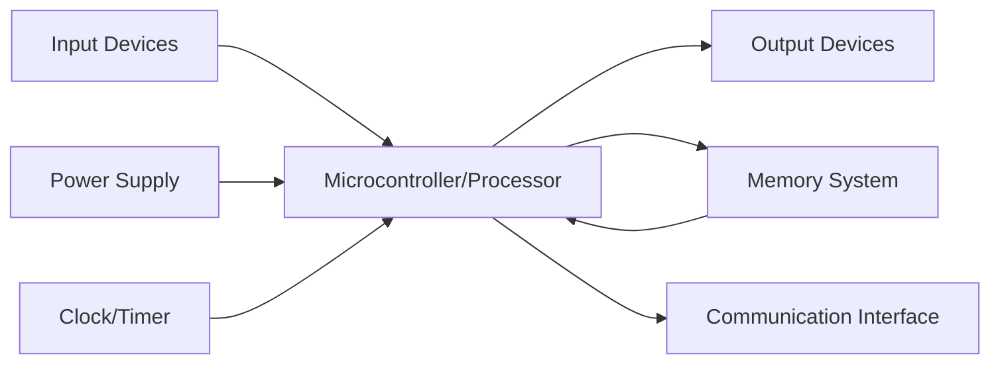
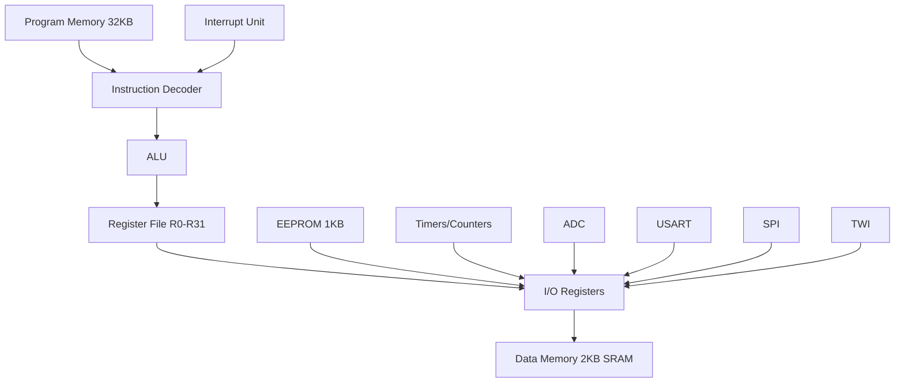
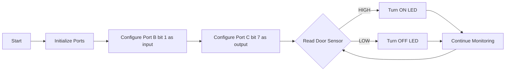
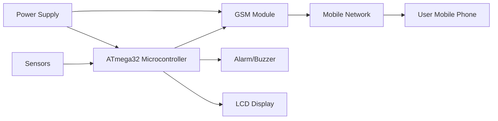
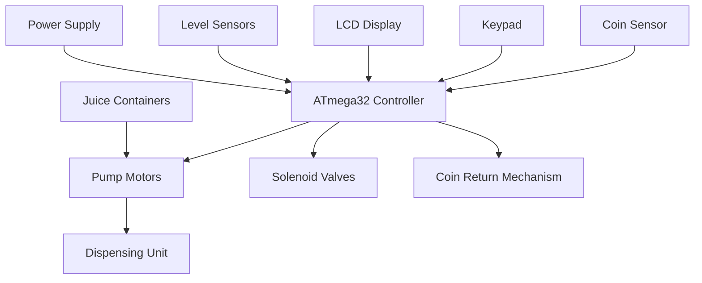

## પ્રશ્ન 1(અ) [3 ગુણ]

**એમ્બેડેડ સિસ્ટમની વ્યાખ્યા શું છે? એમ્બેડેડ સિસ્ટમનું ઉદાહરણ આપો.**

**જવાબ**:
**એમ્બેડેડ સિસ્ટમ** એ એક વિશેષ કમ્પ્યુટર સિસ્ટમ છે જે ચોક્કસ કાર્યો કરવા માટે સમર્પિત કાર્યો સાથે ડિઝાઇન કરવામાં આવે છે. તે હાર્ડવેર અને સોફ્ટવેર ઘટકોને જોડે છે જે વિશાળ સિસ્ટમમાં એકીકૃત થાય છે.

**મુખ્ય લક્ષણો:**

- **રીઅલ-ટાઇમ ઓપરેશન**: નિર્દિષ્ટ સમય મર્યાદામાં ઇનપુટ્સનો પ્રતિસાદ આપે છે
- **સમર્પિત કાર્ય**: ચોક્કસ એપ્લિકેશન માટે ડિઝાઇન કરેલું
- **રિસોર્સ મર્યાદાઓ**: મર્યાદિત મેમરી, પાવર અને પ્રોસેસિંગ ક્ષમતાઓ

**ઉદાહરણ**: વોશિંગ મશીન કન્ટ્રોલર જે વોશ સાઇકલ્સ, પાણીનું તાપમાન અને ટાઇમિંગને આપમેળે મેનેજ કરે છે.

**મેમરી ટ્રીક:** "SMART Embedded" - **S**pecialized, **M**icroprocessor-based, **A**pplication-specific, **R**eal-time, **T**ask-oriented

---

## પ્રશ્ન 1(બ) [4 ગુણ]

**રીઅલ-ટાઇમ ઓપરેટિંગ સિસ્ટમ (RTOS) ને વ્યાખ્યાયિત કરો અને RTOS ની ત્રણ લાક્ષણિકતાઓની યાદી બનાવો.**

**જવાબ**:
**RTOS** એ એક ઓપરેટિંગ સિસ્ટમ છે જે રીઅલ-ટાઇમ એપ્લિકેશન્સને હેન્ડલ કરવા માટે ડિઝાઇન કરવામાં આવ્યું છે જ્યાં સિસ્ટમ ઓપરેશન માટે ટાઇમિંગ અવરોધો નિર્ણાયક છે.

| લાક્ષણિકતા | વર્ણન |
|---|---|
| **નિર્ધારિત પ્રતિસાદ** | નિર્ણાયક કાર્યો માટે ગેરંટીડ રિસ્પોન્સ ટાઇમ |
| **પ્રાથમિકતા-આધારિત શેડ્યુલિંગ** | ઉચ્ચ પ્રાથમિકતાના કાર્યો નીચા પ્રાથમિકતાના કાર્યો પહેલાં ચાલે છે |
| **મલ્ટિટાસ્કિંગ સપોર્ટ** | બહુવિધ કાર્યો એકસાથે ચાલી શકે છે |

**વધારાની વિશેષતાઓ:**

- **કાર્ય વ્યવસ્થાપન**: બહુવિધ સમાંતર પ્રક્રિયાઓને અસરકારક રીતે હેન્ડલ કરે છે
- **ઇન્ટરપ્ટ હેન્ડલિંગ**: બાહ્ય ઘટનાઓને ઝડપી પ્રતિસાદ
- **મેમરી વ્યવસ્થાપન**: એમ્બેડેડ એપ્લિકેશન્સ માટે ઓપ્ટિમાઇઝ્ડ

**મેમરી ટ્રીક:** "DPM RTOS" - **D**eterministic, **P**riority-based, **M**ultitasking

---

## પ્રશ્ન 1(ક) [7 ગુણ]

**અ) એમ્બેડેડ સિસ્ટમનો જનરલ બ્લોક ડાયાગ્રામ દોરો**
**બ) એમ્બેડેડ સિસ્ટમ માટે માઇક્રોકન્ટ્રોલર પસંદ કરવાના માપદંડો સમજાવો.**

**જવાબ**:

**અ) જનરલ બ્લોક ડાયાગ્રામ:**



**બ) માઇક્રોકન્ટ્રોલર પસંદગીના માપદંડો:**

| માપદંડ | વિચારણાઓ |
|---|---|
| **પ્રોસેસિંગ સ્પીડ** | ક્લોક ફ્રીક્વન્સી, ઇન્સ્ટ્રક્શન એક્ઝિક્યુશન ટાઇમ |
| **મેમરી જરૂરિયાતો** | Flash, RAM, EEPROM ક્ષમતા |
| **I/O ક્ષમતાઓ** | પિન્સની સંખ્યા, વિશેષ કાર્યો |
| **પાવર વપરાશ** | બેટરી લાઇફ, સ્લીપ મોડ્સ |
| **કિંમત** | બજેટ અવરોધો, વોલ્યુમ પ્રાઇસિંગ |
| **ડેવલપમેન્ટ ટૂલ્સ** | કમ્પાઇલર, ડિબગર ઉપલબ્ધતા |

**મુખ્ય પરિબળો:**

- **પ્રદર્શન આવશ્યકતાઓ**: પ્રોસેસિંગ સ્પીડ અને રીઅલ-ટાઇમ અવરોધો
- **ઇન્ટરફેસ જરૂરિયાતો**: ADC, PWM, કમ્યુનિકેશન પ્રોટોકોલ્સ
- **પર્યાવરણીય પરિસ્થિતિઓ**: ઓપરેટિંગ તાપમાન, ભેજ

**મેમરી ટ્રીક:** "PMPICD Selection" - **P**erformance, **M**emory, **P**ower, **I**nterface, **C**ost, **D**evelopment tools

---

## પ્રશ્ન 1(ક) અથવા [7 ગુણ]

**ATmega32 ની પિન ગોઠવણી સમજાવો.**

**જવાબ**:
ATmega32 એ 40-પિન માઇક્રોકન્ટ્રોલર છે જેમાં ચાર 8-બિટ I/O પોર્ટ્સ અને વિવિધ વિશેષ કાર્યાત્મક પિન્સ છે.

**પોર્ટ ગોઠવણી:**

| પોર્ટ | પિન્સ | કાર્યો |
|---|---|---|
| **Port A** | PA0-PA7 | ADC ચેનલ્સ, જનરલ I/O |
| **Port B** | PB0-PB7 | SPI, PWM, બાહ્ય ઇન્ટરપ્ટ્સ |
| **Port C** | PC0-PC7 | TWI, જનરલ I/O |
| **Port D** | PD0-PD7 | USART, બાહ્ય ઇન્ટરપ્ટ્સ, PWM |

**વિશેષ પિન્સ:**

- **VCC/GND**: પાવર સપ્લાઇ પિન્સ
- **AVCC/AGND**: ADC માટે એનાલોગ પાવર સપ્લાઇ
- **XTAL1/XTAL2**: ક્રિસ્ટલ ઓસિલેટર કનેક્શન્સ
- **RESET**: એક્ટિવ લો રીસેટ ઇનપુટ
- **AREF**: ADC રેફરન્સ વોલ્ટેજ

**પિન કાર્યો:**

- **ડ્યૂઅલ-પર્પઝ પિન્સ**: મોટાભાગની પિન્સમાં વૈકલ્પિક કાર્યો છે
- **ઇનપુટ/આઉટપુટ ક્ષમતા**: બધી પોર્ટ પિન્સ દ્વિદિશીય છે
- **આંતરિક પુલ-અપ**: ઇનપુટ પિન્સ માટે સોફ્ટવેર રૂપરેખાંકિત

**મેમરી ટ્રીક:** "ABCD Ports" - **A**DC, **B**us interfaces, **C**ommunication, **D**ata transfer

---

## પ્રશ્ન 2(અ) [3 ગુણ]

**ATMEGA32 નું ડેટા મેમરી આર્કિટેક્ચર સમજાવો.**

**જવાબ**:
ATmega32 ડેટા મેમરી ત્રણ વિભાગોનો સમાવેશ કરે છે જે એકીકૃત સરનામા સ્થળમાં આયોજિત છે.

**મેમરી સંગઠન:**

| વિભાગ | સરનામા શ્રેણી | કદ | હેતુ |
|---|---|---|---|
| **જનરલ રજિસ્ટર્સ** | 0x00-0x1F | 32 બાઇટ્સ | વર્કિંગ રજિસ્ટર્સ R0-R31 |
| **I/O રજિસ્ટર્સ** | 0x20-0x5F | 64 બાઇટ્સ | કન્ટ્રોલ અને સ્ટેટસ રજિસ્ટર્સ |
| **આંતરિક SRAM** | 0x60-0x45F | 2048 બાઇટ્સ | ડેટા સ્ટોરેજ અને સ્ટેક |

**મુખ્ય વિશેષતાઓ:**

- **એકીકૃત એડ્રેસિંગ**: બધી મેમરી એક સરનામા સ્થળ દ્વારા સુલભ
- **રજિસ્ટર ફાઇલ**: અંકગણિત અને તર્ક ઓપરેશન્સ માટે R0-R31
- **સ્ટેક પોઇન્ટર**: SRAM માં સ્ટેકની ટોપ તરફ નિર્દેશ કરે છે

**મેમરી ટ્રીક:** "GIS Memory" - **G**eneral registers, **I**O registers, **S**RAM

---

## પ્રશ્ન 2(બ) [4 ગુણ]

**પ્રોગ્રામ સ્ટેટસ વર્ડ સમજાવો.**

**જવાબ**:
**SREG (સ્ટેટસ રજિસ્ટર)** માં ફ્લેગ્સ છે જે અંકગણિત અને તર્ક ઓપરેશન્સના પરિણામને પ્રતિબિંબિત કરે છે.

**SREG બિટ રૂપરેખાંકન:**

| બિટ | ફ્લેગ | વર્ણન |
|---|---|---|
| **બિટ 7** | I | ગ્લોબલ ઇન્ટરપ્ટ એનેબલ |
| **બિટ 6** | T | બિટ કોપી સ્ટોરેજ |
| **બિટ 5** | H | હાફ કેરી ફ્લેગ |
| **બિટ 4** | S | સાઇન ફ્લેગ |
| **બિટ 3** | V | ઓવરફ્લો ફ્લેગ |
| **બિટ 2** | N | નેગેટિવ ફ્લેગ |
| **બિટ 1** | Z | ઝીરો ફ્લેગ |
| **બિટ 0** | C | કેરી ફ્લેગ |

**ફ્લેગ કાર્યો:**

- **અંકગણિત ઓપરેશન્સ**: C, Z, N, V, H ફ્લેગ્સ આપમેળે અપડેટ થાય છે
- **શરતી બ્રાન્ચિંગ**: નિર્ણય લેવા માટે ફ્લેગ્સનો ઉપયોગ
- **ઇન્ટરપ્ટ નિયંત્રણ**: I ફ્લેગ ગ્લોબલ ઇન્ટરપ્ટ્સને સક્ષમ/અક્ષમ કરે છે

**મેમરી ટ્રીક:** "I THSVNZC" - **I**nterrupt, **T**ransfer, **H**alf-carry, **S**ign, o**V**erflow, **N**egative, **Z**ero, **C**arry

---

## પ્રશ્ન 2(ક) [7 ગુણ]

**ATMEGA32 ના આર્કિટેક્ચર દોરો અને સમજાવો.**

**જવાબ**:

**ATmega32 આર્કિટેક્ચર:**



**આર્કિટેક્ચર ઘટકો:**

| ઘટક | વર્ણન |
|---|---|
| **હાર્વર્ડ આર્કિટેક્ચર** | અલગ પ્રોગ્રામ અને ડેટા મેમરી બસ |
| **RISC કોર** | 131 સૂચનાઓ, મોટાભાગે સિંગલ-સાઇકલ એક્ઝિક્યુશન |
| **ALU** | 8-બિટ અંકગણિત અને તર્ક ઓપરેશન્સ |
| **રજિસ્ટર ફાઇલ** | 32 × 8-બિટ વર્કિંગ રજિસ્ટર્સ |

**મેમરી સિસ્ટમ:**

- **પ્રોગ્રામ મેમરી**: સૂચનાઓ સંગ્રહ કરવા માટે 32KB Flash
- **ડેટા મેમરી**: ચલો અને સ્ટેક માટે 2KB SRAM
- **EEPROM**: 1KB નોન-વોલેટાઇલ ડેટા સ્ટોરેજ

**પેરિફેરલ વિશેષતાઓ:**

- **ત્રણ ટાઇમર/કાઉન્ટર્સ**: 8-બિટ અને 16-બિટ ટાઇમર્સ
- **8-ચેનલ ADC**: 10-બિટ રીઝોલ્યુશન
- **કમ્યુનિકેશન ઇન્ટરફેસ**: USART, SPI, TWI

**મેમરી ટ્રીક:** "HRAM Micro" - **H**arvard architecture, **R**ISC core, **A**LU, **M**emory system

---

## પ્રશ્ન 2 અથવા(અ) [3 ગુણ]

**ATMEGA32 ના પ્રોગ્રામ કાઉન્ટર સમજાવો.**

**જવાબ**:
**પ્રોગ્રામ કાઉન્ટર (PC)** એ 16-બિટ રજિસ્ટર છે જે એક્ઝિક્યુટ થવાની આગલી સૂચનાનું સરનામું ધરાવે છે.

**PC લાક્ષણિકતાઓ:**

| વિશેષતા | વર્ણન |
|---|---|
| **કદ** | 16-બિટ (64KB પ્રોગ્રામ મેમરીને સરનામું આપી શકે છે) |
| **રીસેટ વેલ્યુ** | 0x0000 (શરૂઆતથી એક્ઝિક્યુશન શરૂ કરે છે) |
| **વૃદ્ધિ** | સૂચના મેળવ્યા પછી આપમેળે વધે છે |
| **જમ્પ/બ્રાન્ચ** | જમ્પ, બ્રાન્ચ અને કોલ સૂચનાઓ દ્વારા સુધારેલું |

**PC ઓપરેશન્સ:**

- **અનુક્રમિક એક્ઝિક્યુશન**: મોટાભાગની સૂચનાઓ માટે PC 1 વધે છે
- **બ્રાન્ચ સૂચનાઓ**: PC ને ટાર્ગેટ એડ્રેસ સાથે લોડ કરવામાં આવે છે
- **ઇન્ટરપ્ટ હેન્ડલિંગ**: PC સ્ટેકમાં સાચવાય છે, ઇન્ટરપ્ટ વેક્ટર સાથે લોડ કરાય છે

**મેમરી ટ્રીક:** "SRIB PC" - **S**equential, **R**eset, **I**ncrement, **B**ranch

---

## પ્રશ્ન 2 અથવા(બ) [4 ગુણ]

**AVR માઇક્રોકન્ટ્રોલરમાં ક્લોક અને રીસેટ સર્કિટની ભૂમિકા સમજાવો.**

**જવાબ**:

**ક્લોક સિસ્ટમ:**

| ક્લોક સ્રોત | વર્ણન |
|---|---|
| **બાહ્ય ક્રિસ્ટલ** | ઉચ્ચ ચોકસાઇ, 1-16 MHz સામાન્ય |
| **આંતરિક RC** | બિલ્ટ-ઇન 8 MHz ઓસિલેટર |
| **બાહ્ય ક્લોક** | બાહ્ય ક્લોક સિગ્નલ ઇનપુટ |
| **લો-ફ્રીક્વન્સી ક્રિસ્ટલ** | RTC એપ્લિકેશન્સ માટે 32.768 kHz |

**રીસેટ સર્કિટ કાર્યો:**

- **પાવર-ઓન રીસેટ**: પાવર લાગુ થયા પછી આપમેળે રીસેટ
- **બ્રાઉન-આઉટ રીસેટ**: સપ્લાઇ વોલ્ટેજ ઘટે છે ત્યારે રીસેટ
- **બાહ્ય રીસેટ**: RESET પિન દ્વારા મેન્યુઅલ રીસેટ
- **વોચડોગ રીસેટ**: વોચડોગ ટાઇમર ટાઇમઆઉટથી રીસેટ

**મુખ્ય વિશેષતાઓ:**

- **ક્લોક વિતરણ**: સિસ્ટમ ક્લોક CPU અને પેરિફેરલ્સ ચલાવે છે
- **રીસેટ ક્રમ**: બધા રજિસ્ટર્સને ડિફોલ્ટ વેલ્યુમાં પ્રારંભ કરે છે
- **ફ્યુઝ બિટ્સ**: ક્લોક સ્રોત અને રીસેટ વિકલ્પો રૂપરેખાંકિત કરે છે

**મેમરી ટ્રીક:** "CEIL Clock" - **C**rystal, **E**xternal, **I**nternal, **L**ow-frequency

---

## પ્રશ્ન 2 અથવા(ક) [7 ગુણ]

**TCCRn અને TIFR ટાઇમર રજિસ્ટર સમજાવો**

**જવાબ**:

**TCCRn (ટાઇમર/કાઉન્ટર કન્ટ્રોલ રજિસ્ટર):**

| રજિસ્ટર | કાર્ય |
|---|---|
| **TCCR0** | Timer0 ઓપરેશન મોડ નિયંત્રિત કરે છે |
| **TCCR1A/B** | Timer1 (16-બિટ) ઓપરેશન નિયંત્રિત કરે છે |
| **TCCR2** | Timer2 ઓપરેશન મોડ નિયંત્રિત કરે છે |

**TCCR બિટ કાર્યો:**

- **ક્લોક સિલેક્ટ (CS)**: ક્લોક સ્રોત અને પ્રીસ્કેલર પસંદ કરે છે
- **વેવફોર્મ જનરેશન (WGM)**: ટાઇમર મોડ સેટ કરે છે (Normal, CTC, PWM)
- **કમ્પેર આઉટપુટ મોડ (COM)**: આઉટપુટ પિન વર્તન નિયંત્રિત કરે છે

**TIFR (ટાઇમર ઇન્ટરપ્ટ ફ્લેગ રજિસ્ટર):**

| બિટ | ફ્લેગ | વર્ણન |
|---|---|---|
| **TOV** | ટાઇમર ઓવરફ્લો | ટાઇમર ઓવરફ્લો થાય છે ત્યારે સેટ થાય છે |
| **OCF** | આઉટપુટ કમ્પેર | કમ્પેર મેચ થાય છે ત્યારે સેટ થાય છે |
| **ICF** | ઇનપુટ કેપ્ચર | ઇનપુટ કેપ્ચર ઇવેન્ટ થાય છે ત્યારે સેટ થાય છે |

**ટાઇમર ઓપરેશન્સ:**

- **મોડ પસંદગી**: Normal, CTC, Fast PWM, Phase Correct PWM
- **ઇન્ટરપ્ટ જનરેશન**: સક્ષમ હોય ત્યારે ફ્લેગ્સ ઇન્ટરપ્ટ ટ્રિગર કરે છે
- **આઉટપુટ જનરેશન**: મોટર કન્ટ્રોલ, LED ડિમિંગ માટે PWM સિગ્નલ્સ

**મેમરી ટ્રીક:** "TCCR WGM" - **T**imer **C**ontrol, **C**lock, **R**egister, **W**aveform **G**eneration **M**ode

---

## પ્રશ્ન 3(અ) [3 ગુણ]

**C માં પ્રોગ્રામિંગ AVR માટે વિવિધ ડેટા ટાઇપ અલગ પાડો**

**જવાબ**:

**AVR C ડેટા ટાઇપ્સ:**

| ડેટા ટાઇપ | કદ | શ્રેણી | ઉપયોગ |
|---|---|---|---|
| **char** | 8-બિટ | -128 to 127 | અક્ષરો, નાના પૂર્ણાંકો |
| **unsigned char** | 8-બિટ | 0 to 255 | પોર્ટ મૂલ્યો, ફ્લેગ્સ |
| **int** | 16-બિટ | -32768 to 32767 | સામાન્ય પૂર્ણાંકો |
| **unsigned int** | 16-બિટ | 0 to 65535 | કાઉન્ટર્સ, સરનામાઓ |
| **long** | 32-બિટ | -2³¹ to 2³¹-1 | મોટી ગણતરીઓ |
| **float** | 32-બિટ | ±3.4×10³⁸ | દશાંશ ગણતરીઓ |

**વિશેષ વિચારણાઓ:**

- **મેમરી કાર્યક્ષમ**: સૌથી નાની યોગ્ય ડેટા ટાઇપનો ઉપયોગ કરો
- **પોર્ટ ઓપરેશન્સ**: 8-બિટ પોર્ટ્સ માટે unsigned char
- **ટાઇમિંગ ગણતરીઓ**: ટાઇમર મૂલ્યો માટે unsigned int

**મેમરી ટ્રીક:** "CUIL Float" - **C**har, **U**nsigned, **I**nt, **L**ong, **Float**

---

## પ્રશ્ન 3(બ) [4 ગુણ]

**પોર્ટ C ના તમામ બિટ્સને 200 વખત ટૉગલ કરવા માટે C પ્રોગ્રામ લખો.**

**જવાબ**:

```c
#include <avr/io.h>
#include <util/delay.h>

int main() {
    DDRC = 0xFF;        // પોર્ટ C ને આઉટપુટ તરીકે સેટ કરો
    unsigned int count = 0;
    
    while(count < 200) {
        PORTC = 0xFF;   // બધા બિટ્સ high સેટ કરો
        _delay_ms(100); // વિલંબ
        PORTC = 0x00;   // બધા બિટ્સ low સેટ કરો
        _delay_ms(100); // વિલંબ
        count++;        // કાઉન્ટર વધારો
    }
    return 0;
}
```

**પ્રોગ્રામ સમજૂતી:**

- **DDRC = 0xFF**: પોર્ટ C ના બધા પિન્સને આઉટપુટ તરીકે રૂપરેખાંકિત કરે છે
- **ટૉગલ ઓપરેશન**: 0xFF અને 0x00 વચ્ચે ફેરબદલી કરે છે
- **કાઉન્ટર**: ટૉગલ સાઇકલ્સની સંખ્યા ટ્રેક કરે છે
- **વિલંબ**: ટૉગલ ઓપરેશન માટે દૃશ્યમાન ટાઇમિંગ પ્રદાન કરે છે

**મેમરી ટ્રીક:** "DTC Loop" - **D**DR setup, **T**oggle bits, **C**ount iterations, **L**oop control

---

## પ્રશ્ન 3(ક) [7 ગુણ]

**અ) LED PORTB ના પિન સાથે જોડાયેલ છે. LED પર 0 થી FFh સુધીની ગણતરી બતાવવા માટે AVR પ્રોગ્રામ્સ લખો**
**બ) પોર્ટ C માંથી ડેટાનો બાઇટ મેળવવા માટે AVR C પ્રોગ્રામ લખો. જો તે 100 કરતા ઓછો હોય તો તેને પોર્ટ B પર મોકલો; નહીંતર, તેને પોર્ટ D પર મોકલો.**

**જવાબ**:

**અ) બાઇનરી કાઉન્ટર ડિસ્પ્લે:**

```c
#include <avr/io.h>
#include <util/delay.h>

int main() {
    DDRB = 0xFF;           // પોર્ટ B ને આઉટપુટ તરીકે
    unsigned char count = 0;
    
    while(1) {
        PORTB = count;     // LED પર કાઉન્ટ દર્શાવો
        _delay_ms(500);    // દૃશ્યતા માટે વિલંબ
        count++;           // કાઉન્ટર વધારો
        if(count > 0xFF)   // 255 પછી રીસેટ કરો
            count = 0;
    }
    return 0;
}
```

**બ) શરતી ડેટા ટ્રાન્સફર:**

```c
#include <avr/io.h>

int main() {
    DDRC = 0x00;    // પોર્ટ C ને ઇનપુટ તરીકે
    DDRB = 0xFF;    // પોર્ટ B ને આઉટપુટ તરીકે
    DDRD = 0xFF;    // પોર્ટ D ને આઉટપુટ તરીકે
    
    while(1) {
        unsigned char data = PINC;  // પોર્ટ C માંથી વાંચો
        
        if(data < 100) {
            PORTB = data;           // પોર્ટ B પર મોકલો
            PORTD = 0x00;          // પોર્ટ D સાફ કરો
        } else {
            PORTD = data;           // પોર્ટ D પર મોકલો
            PORTB = 0x00;          // પોર્ટ B સાફ કરો
        }
    }
    return 0;
}
```

**મુખ્ય પ્રોગ્રામિંગ વિભાવનાઓ:**

- **પોર્ટ દિશા**: DDR રજિસ્ટર્સ ઇનપુટ/આઉટપુટ રૂપરેખાંકિત કરે છે
- **ડેટા વાંચવું**: PIN રજિસ્ટર્સ ઇનપુટ મૂલ્યો વાંચે છે
- **શરતી તર્ક**: નિર્ણય લેવા માટે if-else નિવેદનો

**મેમરી ટ્રીક:** "RCC Data" - **R**ead input, **C**ompare value, **C**onditional output

---

## પ્રશ્ન 3 અથવા(અ) [3 ગુણ]

**-3 થી +3 પોર્ટ B ની કિંમતો મોકલવા માટે AVR C પ્રોગ્રામ લખો**

**જવાબ**:

```c
#include <avr/io.h>
#include <util/delay.h>

int main() {
    DDRB = 0xFF;              // પોર્ટ B ને આઉટપુટ તરીકે
    signed char values[] = {-3, -2, -1, 0, 1, 2, 3};
    unsigned char i = 0;
    
    while(1) {
        PORTB = values[i];    // પોર્ટ B પર મૂલ્ય મોકલો
        _delay_ms(1000);      // 1 સેકન્ડ વિલંબ
        i++;                  // આગલું મૂલ્ય
        if(i > 6) i = 0;      // ઇન્ડેક્સ રીસેટ કરો
    }
    return 0;
}
```

**પ્રોગ્રામ વિશેષતાઓ:**

- **સાઇન ડેટા**: નકારાત્મક મૂલ્યો માટે signed char નો ઉપયોગ
- **અરે સ્ટોરેજ**: સરળ પહોંચ માટે અરેમાં મૂલ્યો સંગ્રહ
- **ચક્રીય ઓપરેશન**: તમામ મૂલ્યો દ્વારા સતત ચક્ર

**મેમરી ટ્રીક:** "SAC Values" - **S**igned char, **A**rray storage, **C**yclic operation

---

## પ્રશ્ન 3 અથવા(બ) [4 ગુણ]

**ASCII અક્ષરો 0,1,2,3,4,5,A,B,C અને D માટે હેક્સ મૂલ્યો પોર્ટ B પર મોકલવા માટે AVR C પ્રોગ્રામ લખો.**

**જવાબ**:

```c
#include <avr/io.h>
#include <util/delay.h>

int main() {
    DDRB = 0xFF;    // પોર્ટ B ને આઉટપુટ તરીકે
    
    // ASCII હેક્સ મૂલ્યો અરે
    unsigned char ascii_values[] = {
        0x30,  // '0'
        0x31,  // '1' 
        0x32,  // '2'
        0x33,  // '3'
        0x34,  // '4'
        0x35,  // '5'
        0x41,  // 'A'
        0x42,  // 'B'
        0x43,  // 'C'
        0x44   // 'D'
    };
    
    unsigned char i = 0;
    
    while(1) {
        PORTB = ascii_values[i];  // ASCII મૂલ્ય મોકલો
        _delay_ms(500);           // વિલંબ
        i++;                      // આગલો અક્ષર
        if(i > 9) i = 0;          // ઇન્ડેક્સ રીસેટ કરો
    }
    return 0;
}
```

**ASCII મૂલ્યો ટેબલ:**

| અક્ષર | હેક્સ મૂલ્ય | બાઇનરી |
|---|---|---|
| '0' | 0x30 | 00110000 |
| '1' | 0x31 | 00110001 |
| 'A' | 0x41 | 01000001 |
| 'B' | 0x42 | 01000010 |

**મેમરી ટ્રીક:** "HAC ASCII" - **H**ex values, **A**rray storage, **C**yclic transmission

---

## પ્રશ્ન 3 અથવા(ક) [7 ગુણ]

**ડોર સેન્સર પોર્ટ B ના બિટ 1 સાથે જોડાયેલ છે, અને LED પોર્ટ C ના બિટ 7 સાથે જોડાયેલ છે. ડોર સેન્સર પર દેખરેખ રાખવા માટે AVR C પ્રોગ્રામ લખો અને જ્યારે તે ખુલે છે (PIN HIGH છે), LED ચાલુ કરો. ફ્લો ચાર્ટ પણ દોરો.**

**જવાબ**:

**C પ્રોગ્રામ:**

```c
#include <avr/io.h>

int main() {
    DDRB = 0xFD;    // પોર્ટ B બિટ 1 ઇનપુટ તરીકે (0), અન્ય આઉટપુટ (1)
    DDRC = 0xFF;    // પોર્ટ C આઉટપુટ તરીકે
    PORTB = 0x02;   // બિટ 1 માટે પુલ-અપ સક્ષમ કરો
    
    while(1) {
        if(PINB & 0x02) {      // તપાસો કે ડોર સેન્સર HIGH છે કે
            PORTC |= 0x80;     // LED ચાલુ કરો (બિટ 7)
        } else {
            PORTC &= 0x7F;     // LED બંધ કરો (બિટ 7)
        }
    }
    return 0;
}
```

**ફ્લો ચાર્ટ:**



**બિટ ઓપરેશન્સ:**

- **ઇનપુટ વાંચવું**: `PINB & 0x02` બિટ 1 તપાસે છે
- **LED નિયંત્રણ**: `PORTC |= 0x80` બિટ 7 સેટ કરે છે
- **LED બંધ**: `PORTC &= 0x7F` બિટ 7 સાફ કરે છે

**મેમરી ટ્રીક:** "BIC Door" - **B**it manipulation, **I**nput monitoring, **C**onditional LED control

---

## પ્રશ્ન 4(અ) [3 ગુણ]

**ADC માટેનું ADMUX રજિસ્ટર સમજાવો**

**જવાબ**:

**ADMUX (ADC મલ્ટિપ્લેક્સર સિલેક્શન રજિસ્ટર):**

| બિટ | નામ | વર્ણન |
|---|---|---|
| **બિટ 7-6** | REFS1:0 | રેફરન્સ સિલેક્શન |
| **બિટ 5** | ADLAR | ADC લેફ્ટ એડજસ્ટ રિઝલ્ટ |
| **બિટ 4-0** | MUX4:0 | એનાલોગ ચેનલ સિલેક્શન |

**રેફરન્સ સિલેક્શન (REFS1:0):**

- **00**: AREF, આંતરિક Vref બંધ
- **01**: AREF પિન પર બાહ્ય કેપેસિટર સાથે AVCC
- **10**: આરક્ષિત
- **11**: આંતરિક 2.56V રેફરન્સ

**ચેનલ સિલેક્શન (MUX4:0):**

- **00000-00111**: ADC0-ADC7 (સિંગલ-એન્ડેડ ઇનપુટ્સ)
- **અન્ય કમ્બિનેશન્સ**: ગેઇન સાથે ડિફરન્શિયલ ઇનપુટ્સ

**મુખ્ય કાર્યો:**

- **વોલ્ટેજ રેફરન્સ**: ADC માપ શ્રેણી નક્કી કરે છે
- **ચેનલ મલ્ટિપ્લેક્સિંગ**: કયા એનાલોગ ઇનપુટને કન્વર્ટ કરવું તે પસંદ કરે છે
- **રિઝલ્ટ એલાઇનમેન્ટ**: ડાબું અથવા જમણું જસ્ટિફાઇડ ADC પરિણામ

**મેમરી ટ્રીક:** "RAM ADMUX" - **R**eference, **A**lignment, **M**ultiplexer

---

## પ્રશ્ન 4(બ) [4 ગુણ]

**વિવિધ એલસીડી પિન સમજાવો.**

**જવાબ**:

**16x2 LCD પિન રૂપરેખાંકન:**

| પિન | સિમ્બોલ | કાર્ય |
|---|---|---|
| **1** | VSS | ગ્રાઉન્ડ (0V) |
| **2** | VDD | પાવર સપ્લાઇ (+5V) |
| **3** | V0 | કોન્ટ્રાસ્ટ એડજસ્ટમેન્ટ |
| **4** | RS | રજિસ્ટર સિલેક્ટ (ડેટા/કમાન્ડ) |
| **5** | R/W | રીડ/રાઇટ સિલેક્ટ |
| **6** | E | એનેબલ સિગ્નલ |
| **7-14** | D0-D7 | ડેટા બસ (8-બિટ) |
| **15** | A | બેકલાઇટ એનોડ (+) |
| **16** | K | બેકલાઇટ કેથોડ (-) |

**કન્ટ્રોલ પિન કાર્યો:**

- **RS = 0**: કમાન્ડ રજિસ્ટર પસંદ
- **RS = 1**: ડેટા રજિસ્ટર પસંદ
- **R/W = 0**: રાઇટ ઓપરેશન
- **R/W = 1**: રીડ ઓપરેશન
- **E**: એનેબલ પલ્સ ઓપરેશન ટ્રિગર કરે છે

**કનેક્શન મોડ્સ:**

- **8-બિટ મોડ**: બધા ડેટા પિન્સ D0-D7 જોડાયેલા
- **4-બિટ મોડ**: માત્ર D4-D7 ઉપયોગ (માઇક્રોકન્ટ્રોલર પિન્સ બચાવે છે)

**મેમરી ટ્રીક:** "VCR EDB LCD" - **V**power, **C**ontrast, **R**egister select, **E**nable, **D**ata **B**us

---

## પ્રશ્ન 4(ક) [7 ગુણ]

**20µs વિલંબ સાથે PORTB ના તમામ બિટ્સને સતત ટૉગલ કરવા માટે પ્રોગ્રામ લખો. વિલંબ જનરેટ કરવા માટે Timer0, નોર્મલ મોડ અને કોઈ Prescaler નો ઉપયોગ કરો**

**જવાબ**:

```c
#include <avr/io.h>

void delay_20us() {
    TCNT0 = 0;          // ટાઇમર કાઉન્ટર સાફ કરો
    TCCR0 = 0x01;       // કોઈ prescaler નહીં, નોર્મલ મોડ
    while(TCNT0 < 160); // 20µs માટે રાહ જુઓ (8MHz/1 * 20µs = 160)
    TCCR0 = 0;          // ટાઇમર બંધ કરો
}

int main() {
    DDRB = 0xFF;        // પોર્ટ B આઉટપુટ તરીકે
    
    while(1) {
        PORTB = 0xFF;   // બધા બિટ્સ high સેટ કરો
        delay_20us();   // 20µs વિલંબ
        PORTB = 0x00;   // બધા બિટ્સ low સેટ કરો
        delay_20us();   // 20µs વિલંબ
    }
    return 0;
}
```

**ટાઇમર ગણતરી:**

- **ક્લોક ફ્રીક્વન્સી**: 8 MHz (ધારણા)
- **ટાઇમર રીઝોલ્યુશન**: 1/8MHz = 0.125µs પ્રતિ કાઉન્ટ
- **જરૂરી કાઉન્ટ્સ**: 20µs / 0.125µs = 160 કાઉન્ટ્સ

**Timer0 રૂપરેખાંકન:**

| સેટિંગ | મૂલ્ય | વર્ણન |
|---|---|---|
| **મોડ** | નોર્મલ | 0 થી 255 સુધી ગણે છે |
| **Prescaler** | 1 | કોઈ પ્રીસ્કેલિંગ નહીં |
| **ક્લોક સ્રોત** | સિસ્ટમ ક્લોક | 8 MHz |

**પ્રોગ્રામ ફ્લો:**

- **પ્રારંભ કરો**: પોર્ટ B ને આઉટપુટ તરીકે સેટ કરો
- **ટૉગલ high**: PORTB = 0xFF, 20µs રાહ જુઓ
- **ટૉગલ low**: PORTB = 0x00, 20µs રાહ જુઓ
- **પુનરાવર્તન**: સતત ઓપરેશન

**મેમરી ટ્રીક:** "TNP Timer" - **T**imer0, **N**ormal mode, **P**rescaler none

---

## પ્રશ્ન 4 અથવા(અ) [3 ગુણ]

**ટૂંકી નોંધ બે વાયર ઇન્ટરફેસ (TWI)**

**જવાબ**:

**TWI (બે વાયર ઇન્ટરફેસ) - I2C પ્રોટોકોલ:**

**મુખ્ય વિશેષતાઓ:**

| વિશેષતા | વર્ણન |
|---|---|
| **બે વાયર** | SDA (ડેટા) અને SCL (ક્લોક) |
| **મલ્ટી-માસ્ટર** | બહુવિધ માસ્ટર્સ બસ નિયંત્રિત કરી શકે છે |
| **મલ્ટી-સ્લેવ** | 127 સુધી સ્લેવ ડિવાઇસ |
| **સરનામું-આધારિત** | 7-બિટ અથવા 10-બિટ ડિવાઇસ સરનામું |
| **દ્વિદિશીય** | બંને દિશામાં ડેટા વહે છે |

**બસ લાક્ષણિકતાઓ:**

- **ઓપન-ડ્રેઇન**: પુલ-અપ રેઝિસ્ટર્સ આવશ્યક (4.7kΩ સામાન્ય)
- **સિન્ક્રોનસ**: માસ્ટર દ્વારા ક્લોક પ્રદાન કરાય છે
- **સ્ટાર્ટ/સ્ટોપ કન્ડિશન્સ**: કમ્યુનિકેશન માટે વિશેષ ક્રમ

**સામાન્ય એપ્લિકેશન્સ:**

- **EEPROMs**: નોન-વોલેટાઇલ મેમરી સ્ટોરેજ
- **RTC મોડ્યુલ્સ**: રીઅલ-ટાઇમ ક્લોક ડિવાઇસ
- **સેન્સર્સ**: તાપમાન, દબાણ, એક્સેલેરોમીટર
- **ડિસ્પ્લે કન્ટ્રોલર્સ**: OLED, LCD કન્ટ્રોલર્સ

**મેમરી ટ્રીક:** "SDA SCL TWI" - **S**erial **D**ata, **S**erial **CL**ock, **T**wo **W**ire **I**nterface

---

## પ્રશ્ન 4 અથવા(બ) [4 ગુણ]

**ADC માટેનું ADCSRA રજિસ્ટર સમજાવો**

**જવાબ**:

**ADCSRA (ADC કન્ટ્રોલ અને સ્ટેટસ રજિસ્ટર A):**

| બિટ | નામ | કાર્ય |
|---|---|---|
| **બિટ 7** | ADEN | ADC એનેબલ |
| **બિટ 6** | ADSC | ADC સ્ટાર્ટ કન્વર્ઝન |
| **બિટ 5** | ADATE | ADC ઓટો ટ્રિગર એનેબલ |
| **બિટ 4** | ADIF | ADC ઇન્ટરપ્ટ ફ્લેગ |
| **બિટ 3** | ADIE | ADC ઇન્ટરપ્ટ એનેબલ |
| **બિટ 2-0** | ADPS2:0 | ADC પ્રીસ્કેલર સિલેક્ટ |

**પ્રીસ્કેલર સેટિંગ્સ (ADPS2:0):**

| બાઇનરી | વિભાજન પરિબળ | ADC ક્લોક (8MHz) |
|---|---|---|
| 000 | 2 | 4 MHz |
| 001 | 2 | 4 MHz |
| 010 | 4 | 2 MHz |
| 011 | 8 | 1 MHz |
| 100 | 16 | 500 kHz |
| 101 | 32 | 250 kHz |
| 110 | 64 | 125 kHz |
| 111 | 128 | 62.5 kHz |

**કન્ટ્રોલ કાર્યો:**

- **ADEN**: ADC ઓપરેશન સક્ષમ કરવા માટે સેટ કરવું આવશ્યક
- **ADSC**: કન્વર્ઝન શરૂ કરવા માટે સેટ કરો, પૂર્ણ થાય ત્યારે સાફ થાય છે
- **ADIF**: કન્વર્ઝન પૂર્ણ થાય ત્યારે સેટ થાય છે
- **Prescaler**: શ્રેષ્ઠ ચોકસાઇ માટે ADC ક્લોક 50-200 kHz હોવી જોઈએ

**મેમરી ટ્રીક:** "EASCID ADC" - **E**nable, **A**uto-trigger, **S**tart, **C**onversion, **I**nterrupt, **D**ivider

---

## પ્રશ્ન 4 અથવા(ક) [7 ગુણ]

**PORTC.3 પિન પર 16 Khz ફ્રીક્વન્સીની સ્ક્વેર વેવ જનરેટ કરવા માટે પ્રોગ્રામ લખો. ક્રિસ્ટલ ફ્રીક્વન્સી 8 Mhz ધારો**

**જવાબ**:

```c
#include <avr/io.h>
#include <avr/interrupt.h>

int main() {
    // PC3 ને આઉટપુટ તરીકે રૂપરેખાંકિત કરો
    DDRC |= (1 << PC3);
    
    // Timer1 CTC મોડ રૂપરેખાંકન
    TCCR1A = 0x00;                    // નોર્મલ પોર્ટ ઓપરેશન
    TCCR1B = (1 << WGM12) | (1 << CS10); // CTC મોડ, કોઈ prescaler નહીં
    
    // 16 kHz માટે OCR1A મૂલ્ય ગણતરી કરો
    // Period = 1/16000 = 62.5µs
    // Half period = 31.25µs  
    // OCR1A = (8MHz * 31.25µs) - 1 = 249
    OCR1A = 249;
    
    // Timer1 Compare A ઇન્ટરપ્ટ સક્ષમ કરો
    TIMSK |= (1 << OCIE1A);
    
    // ગ્લોબલ ઇન્ટરપ્ટ્સ સક્ષમ કરો
    sei();
    
    while(1) {
        // મુખ્ય લુપ - ઇન્ટરપ્ટ દ્વારા સ્ક્વેર વેવ જનરેટ
    }
    return 0;
}

// Timer1 Compare A ઇન્ટરપ્ટ સર્વિસ રૂટિન
ISR(TIMER1_COMPA_vect) {
    PORTC ^= (1 << PC3);    // PC3 ટૉગલ કરો
}
```

**ફ્રીક્વન્સી ગણતરી:**

| પેરામીટર | મૂલ્ય | ફોર્મ્યુલા |
|---|---|---|
| **ટાર્ગેટ ફ્રીક્વન્સી** | 16 kHz | આપેલ |
| **Period** | 62.5 µs | 1/16000 |
| **Half period** | 31.25 µs | Period/2 |
| **ટાઇમર કાઉન્ટ્સ** | 250 | 8MHz × 31.25µs |
| **OCR1A મૂલ્ય** | 249 | કાઉન્ટ્સ - 1 |

**ટાઇમર રૂપરેખાંકન:**

- **મોડ**: CTC (Clear Timer on Compare)
- **Prescaler**: 1 (કોઈ પ્રીસ્કેલિંગ નહીં)
- **ઇન્ટરપ્ટ**: કમ્પેર મેચ આઉટપુટ પિન ટૉગલ કરે છે

**મેમરી ટ્રીક:** "CTC Square" - **C**TC mode, **T**imer interrupt, **C**ompare match

---

## પ્રશ્ન 5(અ) [3 ગુણ]

**Polling અને Interrupt વચ્ચેનો તફાવત**

**જવાબ**:

**Polling વિ Interrupt સરખામણી:**

| પાસું | Polling | Interrupt |
|---|---|---|
| **CPU ઉપયોગ** | સતત સ્ટેટસ તપાસે છે | ઇવેન્ટ થાય ત્યાં સુધી CPU મુક્ત |
| **પ્રતિસાદ સમય** | વેરિએબલ, પોલિંગ ફ્રીક્વન્સી પર આધાર રાખે છે | ઝડપી, તાત્કાલિક પ્રતિસાદ |
| **પાવર વપરાશ** | સતત તપાસવાને કારણે વધારે | ઓછું, CPU સ્લીપ કરી શકે છે |
| **પ્રોગ્રામિંગ** | સરળ, અનુક્રમિક કોડ | જટિલ, ISR આવશ્યક |
| **રીઅલ-ટાઇમ** | નિર્ણાયક ટાઇમિંગ માટે યોગ્ય નથી | રીઅલ-ટાઇમ સિસ્ટમ્સ માટે ઉત્તમ |

**મુખ્ય તફાવતો:**

- **કાર્યક્ષમતા**: ઇન્ટરપ્ટ્સ વધુ CPU કાર્યક્ષમ છે
- **ટાઇમિંગ**: ઇન્ટરપ્ટ્સ નિર્ધારિત પ્રતિસાદ પ્રદાન કરે છે
- **જટિલતા**: પોલિંગ અમલીકરણ અને ડિબગ કરવામાં સરળ છે

**મેમરી ટ્રીક:** "PIE Method" - **P**olling inefficient, **I**nterrupt efficient, **E**vent-driven

---

## પ્રશ્ન 5(બ) [4 ગુણ]

**AVR ATmega32 સાથે LM35 ઇન્ટરફેસ સમજાવો.**

**જવાબ**:

**LM35 તાપમાન સેન્સર ઇન્ટરફેસ:**

```goat
    +5V ----+
            |
        +---+---+
        |  LM35 |
        |       |
        +---+---+
            |
            +---- To ADC Pin (PA0)
```

**LM35 લાક્ષણિકતાઓ:**

| પેરામીટર | મૂલ્ય | વર્ણન |
|---|---|---|
| **આઉટપુટ** | 10mV/°C | લિનિયર તાપમાન ગુણાંક |
| **શ્રેણી** | 0°C to 100°C | ઓપરેટિંગ તાપમાન શ્રેણી |
| **સપ્લાઇ** | 4V to 30V | પાવર સપ્લાઇ શ્રેણી |
| **ચોકસાઇ** | ±0.5°C | તાપમાન ચોકસાઇ |

**ઇન્ટરફેસ કોડ:**

```c
#include <avr/io.h>

void ADC_init() {
    ADMUX = 0x40;   // AVCC રેફરન્સ, ADC0 ચેનલ
    ADCSRA = 0x87;  // ADC સક્ષમ કરો, prescaler 128
}

unsigned int read_temperature() {
    ADCSRA |= (1 << ADSC);      // કન્વર્ઝન શરૂ કરો
    while(ADCSRA & (1 << ADSC)); // પૂર્ણતા માટે રાહ જુઓ
    
    // ADC મૂલ્યને તાપમાનમાં કન્વર્ટ કરો
    // Temperature = (ADC * 5000) / (1024 * 10)
    unsigned int temp = (ADC * 5000) / 10240;
    return temp;
}
```

**ગણતરી:**

- **ADC રીઝોલ્યુશન**: 10-બિટ (0-1023)
- **રેફરન્સ વોલ્ટેજ**: 5V
- **LM35 સ્કેલ**: 10mV/°C
- **ફોર્મ્યુલા**: Temperature = (ADC_Value × 5000mV) / (1024 × 10mV/°C)

**મેમરી ટ્રીક:** "LAC Temperature" - **L**M35 sensor, **A**DC conversion, **C**alculation formula

---

## પ્રશ્ન 5(ક) [7 ગુણ]

**AVR ATmega32 સાથે DC મોટરને ઇન્ટરફેસ કરવા માટે પ્રોગ્રામ લખો.**

**જવાબ**:

**DC મોટર ઇન્ટરફેસ સર્કિટ:**

```goat
    ATmega32                L293D Motor Driver              DC Motor
    +--------+            +----------------+              +-------+
    |  PD5   |----------->| IN1         O1 |------------->|   +   |
    |  PD6   |----------->| IN2         O2 |------------->|   -   |
    |  PD4   |----------->| EN1            |              +-------+
    +--------+            +----------------+
                          |                |
                         +5V              GND
```

**મોટર કન્ટ્રોલ પ્રોગ્રામ:**

```c
#include <avr/io.h>
#include <util/delay.h>

void motor_init() {
    DDRD |= (1 << PD4) | (1 << PD5) | (1 << PD6); // આઉટપુટ તરીકે સેટ કરો
}

void motor_forward() {
    PORTD |= (1 << PD4);   // મોટર સક્ષમ કરો
    PORTD |= (1 << PD5);   // IN1 = 1
    PORTD &= ~(1 << PD6);  // IN2 = 0
}

void motor_reverse() {
    PORTD |= (1 << PD4);   // મોટર સક્ષમ કરો
    PORTD &= ~(1 << PD5);  // IN1 = 0
    PORTD |= (1 << PD6);   // IN2 = 1
}

void motor_stop() {
    PORTD &= ~(1 << PD4);  // મોટર અક્ષમ કરો
}

int main() {
    motor_init();
    
    while(1) {
        motor_forward();    // 2 સેકન્ડ માટે આગળ
        _delay_ms(2000);
        
        motor_stop();       // 1 સેકન્ડ માટે બંધ
        _delay_ms(1000);
        
        motor_reverse();    // 2 સેકન્ડ માટે પાછળ
        _delay_ms(2000);
        
        motor_stop();       // 1 સેકન્ડ માટે બંધ
        _delay_ms(1000);
    }
    return 0;
}
```

**L293D Truth Table:**

| EN | IN1 | IN2 | મોટર ક્રિયા |
|---|---|---|---|
| 0 | X | X | બંધ |
| 1 | 0 | 0 | બંધ |
| 1 | 0 | 1 | રિવર્સ |
| 1 | 1 | 0 | ફોરવર્ડ |
| 1 | 1 | 1 | બંધ |

**મુખ્ય ઘટકો:**

- **L293D**: ડ્યુઅલ H-બ્રિજ મોટર ડ્રાઇવર IC
- **એનેબલ પિન**: મોટર પાવર નિયંત્રિત કરે છે
- **દિશા પિન્સ**: IN1, IN2 રોટેશન દિશા નિયંત્રિત કરે છે
- **પ્રોટેક્શન**: બેક EMF પ્રોટેક્શન માટે બિલ્ટ-ઇન ડાયોડ

**મેમરી ટ્રીક:** "LED Motor" - **L**293D driver, **E**nable control, **D**irection pins

---

## પ્રશ્ન 5 અથવા(અ) [3 ગુણ]

**GSM આધારિત સિક્યુરિટી સિસ્ટમના બેઝિક બ્લોક ડાયાગ્રામ સમજાવો.**

**જવાબ**:

**GSM સિક્યુરિટી સિસ્ટમ બ્લોક ડાયાગ્રામ:**



**સિસ્ટમ ઘટકો:**

| ઘટક | કાર્ય |
|---|---|
| **સેન્સર્સ** | PIR, દરવાજા/બારી સેન્સર્સ, ધુમાડો ડિટેક્ટર |
| **માઇક્રોકન્ટ્રોલર** | સેન્સર ડેટા પ્રોસેસ કરે છે, સિસ્ટમ નિયંત્રિત કરે છે |
| **GSM મોડ્યુલ** | SMS અલર્ટ મોકલે છે, કોલ કરે છે |
| **ડિસ્પ્લે** | સિસ્ટમ સ્ટેટસ બતાવે છે |
| **અલાર્મ** | સ્થાનિક ઓડિયો/વિઝ્યુઅલ અલર્ટ |

**કાર્યકારી સિદ્ધાંત:**

- **સેન્સર મોનિટરિંગ**: સુરક્ષા ઝોનની સતત દેખરેખ
- **ઇવેન્ટ ડિટેક્શન**: અનધિકૃત પ્રવેશ શોધાયા પર ટ્રિગર
- **અલર્ટ જનરેશન**: પૂર્વનિર્ધારિત નંબરો પર SMS મોકલવામાં આવે છે
- **સ્થાનિક અલાર્મ**: તાત્કાલિક ઓડિયો/વિઝ્યુઅલ ચેતવણી

**મુખ્ય વિશેષતાઓ:**

- **રિમોટ મોનિટરિંગ**: SMS દ્વારા રીઅલ-ટાઇમ અલર્ટ
- **બહુવિધ સેન્સર્સ**: વિવિધ ઘૂસણખોરી શોધ પદ્ધતિઓ
- **બેકઅપ પાવર**: પાવર નિષ્ફળતા માટે બેટરી બેકઅપ

**મેમરી ટ્રીક:** "SGMA Security" - **S**ensors, **G**SM module, **M**icrocontroller, **A**lerts

---

## પ્રશ્ન 5 અથવા(બ) [4 ગુણ]

**AVR ATmega32 સાથે રિલે ઇન્ટરફેસ સમજાવો.**

**જવાબ**:

**રિલે ઇન્ટરફેસ સર્કિટ:**

```goat
    ATmega32              ULN2803           Relay        Load
    +--------+           +--------+        +-----+     +------+
    |   PB0  |---------->| IN1 O1 |------->| COM |---->| AC   |
    |   PB1  |---------->| IN2 O2 |------->| NO  |     | Load |
    +--------+           +--------+        +-----+     +------+
                         |        |
                        GND      +12V
```

**રિલે ઇન્ટરફેસ કોડ:**

```c
#include <avr/io.h>
#include <util/delay.h>

void relay_init() {
    DDRB |= (1 << PB0) | (1 << PB1); // આઉટપુટ પિન્સ તરીકે સેટ કરો
}

void relay1_on() {
    PORTB |= (1 << PB0);  // રિલે 1 સક્રિય કરો
}

void relay1_off() {
    PORTB &= ~(1 << PB0); // રિલે 1 નિષ્ક્રિય કરો
}

void relay2_on() {
    PORTB |= (1 << PB1);  // રિલે 2 સક્રિય કરો
}

void relay2_off() {
    PORTB &= ~(1 << PB1); // રિલે 2 નિષ્ક્રિય કરો
}

int main() {
    relay_init();
    
    while(1) {
        relay1_on();        // રિલે 1 ચાલુ કરો
        _delay_ms(2000);
        relay1_off();       // રિલે 1 બંધ કરો
        
        relay2_on();        // રિલે 2 ચાલુ કરો
        _delay_ms(2000);
        relay2_off();       // રિલે 2 બંધ કરો
        
        _delay_ms(1000);
    }
    return 0;
}
```

**ULN2803 વિશેષતાઓ:**

| વિશેષતા | વર્ણન |
|---|---|
| **8 ચેનલ્સ** | આઠ ડાર્લિંગ્ટન પેર ડ્રાઇવર્સ |
| **હાઇ કરન્ટ** | ચેનલ દીઠ 500mA સુધી |
| **પ્રોટેક્શન** | બિલ્ટ-ઇન ફ્લાયબેક ડાયોડ |
| **ઇનપુટ વોલ્ટેજ** | 5V TTL સુસંગત |
| **આઉટપુટ વોલ્ટેજ** | 50V સુધી |

**એપ્લિકેશન્સ:**

- **હોમ ઓટોમેશન**: લાઇટ, ફેન કન્ટ્રોલ
- **ઇન્ડસ્ટ્રિયલ કન્ટ્રોલ**: મોટર, વાલ્વ ઓપરેશન
- **સિક્યુરિટી સિસ્ટમ્સ**: દરવાજા લોક, અલાર્મ

**મેમરી ટ્રીક:** "ULN Relay" - **U**LN2803 driver, **L**oad control, **N**on-contact switching

---

## પ્રશ્ન 5 અથવા(ક) [7 ગુણ]

**ઓટોમેટિક જ્યુસ વેન્ડિંગ મશીન દોરો અને સમજાવો**

**જવાબ**:

**ઓટોમેટિક જ્યુસ વેન્ડિંગ મશીન બ્લોક ડાયાગ્રામ:**



**સિસ્ટમ ઘટકો:**

| ઘટક | કાર્ય |
|---|---|
| **કોઇન સેન્સર** | દાખલ કરેલા સિક્કાઓ શોધે છે અને માન્ય કરે છે |
| **કીપેડ** | યુઝર સિલેક્શન ઇન્ટરફેસ (4x4 મેટ્રિક્સ) |
| **LCD ડિસ્પ્લે** | મેનુ, કિંમત, સ્ટેટસ મેસેજ બતાવે છે |
| **પંપ મોટર્સ** | પસંદ કરેલ જ્યુસ વિતરિત કરે છે |
| **સોલેનોઇડ વાલ્વ** | જ્યુસ ફ્લો કન્ટ્રોલ કરે છે |
| **લેવલ સેન્સર્સ** | જ્યુસ કન્ટેનર લેવલ મોનિટર કરે છે |
| **કોઇન રિટર્ન** | વધારાના પૈસા પરત કરે છે |

**સિસ્ટમ ઓપરેશન:**

1. **ઇનિશિયલાઇઝેશન**: સ્વાગત સંદેશ અને જ્યુસ મેનુ દર્શાવો
2. **કોઇન ઇનપુટ**: યુઝર સિક્કાઓ દાખલ કરે છે, સિસ્ટમ રકમ માન્ય કરે છે
3. **સિલેક્શન**: યુઝર જ્યુસ પ્રકાર પસંદ કરવા માટે કીપેડ દબાવે છે
4. **વેલિડેશન**: પૂરતા પૈસા અને જ્યુસ ઉપલબ્ધ છે કે કેમ તપાસો
5. **ડિસ્પેન્સિંગ**: પસંદ કરેલ જ્યુસ માટે પંપ અને વાલ્વ સક્રિય કરો
6. **પૂર્ણતા**: જો કોઈ બાકી રકમ હોય તો પરત કરો, આભાર સંદેશ દર્શાવો

**કન્ટ્રોલ લોજિક:**

```c
// વેન્ડિંગ મશીન ઓપરેશન માટે સ્યુડો કોડ
void vending_machine() {
    display_menu();
    
    while(1) {
        if(coin_inserted()) {
            total_amount += validate_coin();
            update_display();
        }
        
        if(selection_made()) {
            juice_type = get_selection();
            if(total_amount >= juice_price[juice_type]) {
                if(juice_available[juice_type]) {
                    dispense_juice(juice_type);
                    return_change();
                    reset_system();
                } else {
                    display_error("Stock Nathi");
                }
            } else {
                display_error("Nakafi Rakam");
            }
        }
    }
}
```

**મુખ્ય વિશેષતાઓ:**

- **બહુવિધ જ્યુસ પ્રકારો**: 4-6 વિવિધ ફ્લેવર્સ
- **ઓટોમેટિક ડિસ્પેન્સિંગ**: ચોક્કસ વોલ્યુમ કન્ટ્રોલ
- **ચેન્જ રિટર્ન**: ચોક્કસ બાકી રકમ ગણે છે અને પરત કરે છે
- **ઇન્વેન્ટરી ટ્રેકિંગ**: જ્યુસ લેવલ મોનિટર કરે છે
- **એરર હેન્ડલિંગ**: વિવિધ ફોલ્ટ કન્ડિશન્સ હેન્ડલ કરે છે

**સેફ્ટી વિશેષતાઓ:**

- **ઓવર-ડિસ્પેન્સિંગ પ્રોટેક્શન**: ટાઇમર-આધારિત પંપ કન્ટ્રોલ
- **કોઇન વેલિડેશન**: નકલી સિક્કા સ્વીકારવાનું અટકાવે છે
- **લેવલ મોનિટરિંગ**: પંપના ડ્રાય રનિંગને અટકાવે છે
- **ઇમર્જન્સી સ્ટોપ**: મેન્યુઅલ ઓવરરાઇડ ક્ષમતા

**મેમરી ટ્રીક:** "CLPDV Juice" - **C**oin sensor, **L**CD display, **P**ump motors, **D**ispensing unit, **V**alve control
