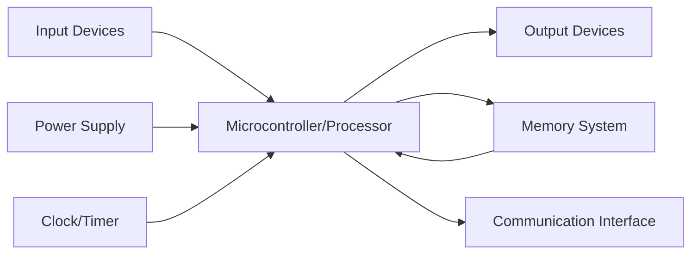
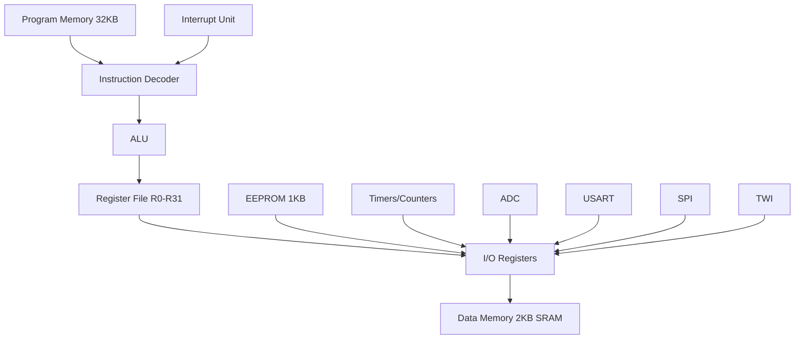
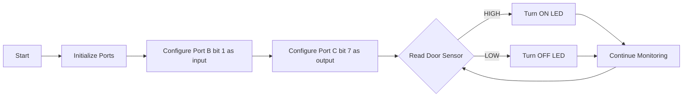
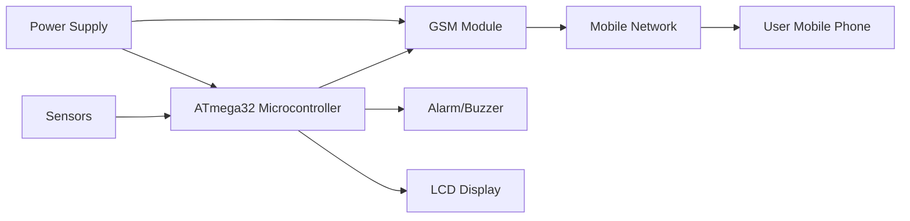
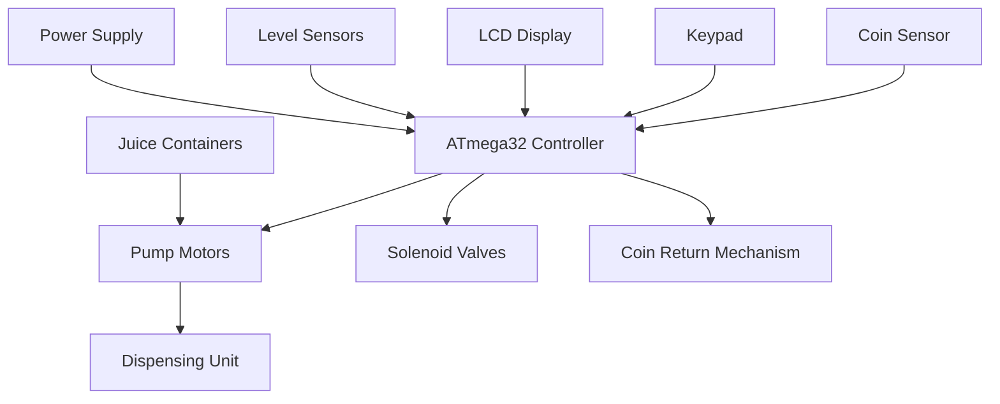

## Question 1(a) [3 marks]

**What is the definition of an embedded system? Provide an example of an embedded system.**

**Answer**:
An **embedded system** is a specialized computer system designed to perform specific tasks with dedicated functions. It combines hardware and software components that are integrated into a larger system.

**Key Features:**

- **Real-time operation**: Responds to inputs within specified time limits
- **Dedicated function**: Designed for specific applications
- **Resource constraints**: Limited memory, power, and processing capabilities

**Example**: Washing machine controller that manages wash cycles, water temperature, and timing automatically.

**Mnemonic:** "SMART Embedded" - **S**pecialized, **M**icroprocessor-based, **A**pplication-specific, **R**eal-time, **T**ask-oriented

---

## Question 1(b) [4 marks]

**Define a Real-Time Operating System (RTOS) and list three characteristics of RTOS.**

**Answer**:
**RTOS** is an operating system designed to handle real-time applications where timing constraints are critical for system operation.

| Characteristic | Description |
|---|---|
| **Deterministic Response** | Guaranteed response time for critical tasks |
| **Priority-based Scheduling** | High-priority tasks execute before low-priority tasks |
| **Multitasking Support** | Multiple tasks can run concurrently |

**Additional Features:**

- **Task management**: Efficiently handles multiple concurrent processes
- **Interrupt handling**: Quick response to external events
- **Memory management**: Optimized for embedded applications

**Mnemonic:** "DPM RTOS" - **D**eterministic, **P**riority-based, **M**ultitasking

---

## Question 1(c) [7 marks]

**a) Draw the general block diagram of Embedded System**
**b) Explain the criteria for choosing a microcontroller for an embedded system.**

**Answer**:

**a) General Block Diagram:**



**b) Microcontroller Selection Criteria:**

| Criteria | Considerations |
|---|---|
| **Processing Speed** | Clock frequency, instruction execution time |
| **Memory Requirements** | Flash, RAM, EEPROM capacity |
| **I/O Capabilities** | Number of pins, special functions |
| **Power Consumption** | Battery life, sleep modes |
| **Cost** | Budget constraints, volume pricing |
| **Development Tools** | Compiler, debugger availability |

**Key Factors:**

- **Performance requirements**: Processing speed and real-time constraints
- **Interface needs**: ADC, PWM, communication protocols
- **Environmental conditions**: Operating temperature, humidity

**Mnemonic:** "PMPICD Selection" - **P**erformance, **M**emory, **P**ower, **I**nterface, **C**ost, **D**evelopment tools

---

## Question 1(c) OR [7 marks]

**Explain the pin configuration of the ATmega32.**

**Answer**:
ATmega32 is a 40-pin microcontroller with four 8-bit I/O ports and various special function pins.

**Port Configuration:**

| Port | Pins | Functions |
|---|---|---|
| **Port A** | PA0-PA7 | ADC channels, general I/O |
| **Port B** | PB0-PB7 | SPI, PWM, external interrupts |
| **Port C** | PC0-PC7 | TWI, general I/O |
| **Port D** | PD0-PD7 | USART, external interrupts, PWM |

**Special Pins:**

- **VCC/GND**: Power supply pins
- **AVCC/AGND**: Analog power supply for ADC
- **XTAL1/XTAL2**: Crystal oscillator connections
- **RESET**: Active low reset input
- **AREF**: ADC reference voltage

**Pin Functions:**

- **Dual-purpose pins**: Most pins have alternate functions
- **Input/Output capability**: All port pins are bidirectional
- **Internal pull-up**: Software configurable for input pins

**Mnemonic:** "ABCD Ports" - **A**DC, **B**us interfaces, **C**ommunication, **D**ata transfer

---

## Question 2(a) [3 marks]

**Explain the data memory architecture of ATMEGA32.**

**Answer**:
ATmega32 data memory consists of three sections organized in a unified address space.

**Memory Organization:**

| Section | Address Range | Size | Purpose |
|---|---|---|---|
| **General Registers** | 0x00-0x1F | 32 bytes | Working registers R0-R31 |
| **I/O Registers** | 0x20-0x5F | 64 bytes | Control and status registers |
| **Internal SRAM** | 0x60-0x45F | 2048 bytes | Data storage and stack |

**Key Features:**

- **Unified addressing**: All memory accessible through single address space
- **Register file**: R0-R31 for arithmetic and logic operations
- **Stack pointer**: Points to top of stack in SRAM

**Mnemonic:** "GIS Memory" - **G**eneral registers, **I**O registers, **S**RAM

---

## Question 2(b) [4 marks]

**Explain the Program Status Word.**

**Answer**:
**SREG (Status Register)** contains flags that reflect the result of arithmetic and logic operations.

**SREG Bit Configuration:**

| Bit | Flag | Description |
|---|---|---|
| **Bit 7** | I | Global Interrupt Enable |
| **Bit 6** | T | Bit Copy Storage |
| **Bit 5** | H | Half Carry Flag |
| **Bit 4** | S | Sign Flag |
| **Bit 3** | V | Overflow Flag |
| **Bit 2** | N | Negative Flag |
| **Bit 1** | Z | Zero Flag |
| **Bit 0** | C | Carry Flag |

**Flag Functions:**

- **Arithmetic operations**: C, Z, N, V, H flags updated automatically
- **Conditional branching**: Flags used for decision making
- **Interrupt control**: I flag enables/disables global interrupts

**Mnemonic:** "I THSVNZC" - **I**nterrupt, **T**ransfer, **H**alf-carry, **S**ign, o**V**erflow, **N**egative, **Z**ero, **C**arry

---

## Question 2(c) [7 marks]

**Draw and explain the architecture of ATMEGA32.**

**Answer**:

**ATmega32 Architecture:**



**Architecture Components:**

| Component | Description |
|---|---|
| **Harvard Architecture** | Separate program and data memory buses |
| **RISC Core** | 131 instructions, mostly single-cycle execution |
| **ALU** | 8-bit arithmetic and logic operations |
| **Register File** | 32 × 8-bit working registers |

**Memory System:**

- **Program memory**: 32KB Flash for storing instructions
- **Data memory**: 2KB SRAM for variables and stack
- **EEPROM**: 1KB non-volatile data storage

**Peripheral Features:**

- **Three timer/counters**: 8-bit and 16-bit timers
- **8-channel ADC**: 10-bit resolution
- **Communication interfaces**: USART, SPI, TWI

**Mnemonic:** "HRAM Micro" - **H**arvard architecture, **R**ISC core, **A**LU, **M**emory system

---

## Question 2 OR(a) [3 marks]

**Explain Program Counter of ATMEGA32.**

**Answer**:
**Program Counter (PC)** is a 16-bit register that holds the address of the next instruction to be executed.

**PC Characteristics:**

| Feature | Description |
|---|---|
| **Size** | 16-bit (can address 64KB program memory) |
| **Reset Value** | 0x0000 (starts execution from beginning) |
| **Increment** | Automatically incremented after instruction fetch |
| **Jump/Branch** | Modified by jump, branch, and call instructions |

**PC Operations:**

- **Sequential execution**: PC increments by 1 for most instructions
- **Branch instructions**: PC loaded with target address
- **Interrupt handling**: PC saved on stack, loaded with interrupt vector

**Mnemonic:** "SRIB PC" - **S**equential, **R**eset, **I**ncrement, **B**ranch

---

## Question 2 OR(b) [4 marks]

**Explain the role of clock and reset circuits in an AVR microcontroller.**

**Answer**:

**Clock System:**

| Clock Source | Description |
|---|---|
| **External Crystal** | High accuracy, 1-16 MHz typical |
| **Internal RC** | Built-in 8 MHz oscillator |
| **External Clock** | External clock signal input |
| **Low-frequency Crystal** | 32.768 kHz for RTC applications |

**Reset Circuit Functions:**

- **Power-on Reset**: Automatic reset when power is applied
- **Brown-out Reset**: Reset when supply voltage drops
- **External Reset**: Manual reset through RESET pin
- **Watchdog Reset**: Reset from watchdog timer timeout

**Key Features:**

- **Clock distribution**: System clock drives CPU and peripherals
- **Reset sequence**: Initializes all registers to default values
- **Fuse bits**: Configure clock source and reset options

**Mnemonic:** "CEIL Clock" - **C**rystal, **E**xternal, **I**nternal, **L**ow-frequency

---

## Question 2 OR(c) [7 marks]

**Explain TCCRn and TIFR Timer Register**

**Answer**:

**TCCRn (Timer/Counter Control Register):**

| Register | Function |
|---|---|
| **TCCR0** | Controls Timer0 operation mode |
| **TCCR1A/B** | Controls Timer1 (16-bit) operation |
| **TCCR2** | Controls Timer2 operation mode |

**TCCR Bit Functions:**

- **Clock Select (CS)**: Selects clock source and prescaler
- **Waveform Generation (WGM)**: Sets timer mode (Normal, CTC, PWM)
- **Compare Output Mode (COM)**: Controls output pin behavior

**TIFR (Timer Interrupt Flag Register):**

| Bit | Flag | Description |
|---|---|---|
| **TOV** | Timer Overflow | Set when timer overflows |
| **OCF** | Output Compare | Set when compare match occurs |
| **ICF** | Input Capture | Set when input capture event occurs |

**Timer Operations:**

- **Mode selection**: Normal, CTC, Fast PWM, Phase Correct PWM
- **Interrupt generation**: Flags trigger interrupts when enabled
- **Output generation**: PWM signals for motor control, LED dimming

**Mnemonic:** "TCCR WGM" - **T**imer **C**ontrol, **C**lock, **R**egister, **W**aveform **G**eneration **M**ode

---

## Question 3(a) [3 marks]

**Distinguish different data types for programming AVR in C.**

**Answer**:

**AVR C Data Types:**

| Data Type | Size | Range | Usage |
|---|---|---|---|
| **char** | 8-bit | -128 to 127 | Characters, small integers |
| **unsigned char** | 8-bit | 0 to 255 | Port values, flags |
| **int** | 16-bit | -32768 to 32767 | General integers |
| **unsigned int** | 16-bit | 0 to 65535 | Counters, addresses |
| **long** | 32-bit | -2³¹ to 2³¹-1 | Large calculations |
| **float** | 32-bit | ±3.4×10³⁸ | Decimal calculations |

**Special Considerations:**

- **Memory efficient**: Use smallest suitable data type
- **Port operations**: unsigned char for 8-bit ports
- **Timing calculations**: unsigned int for timer values

**Mnemonic:** "CUIL Float" - **C**har, **U**nsigned, **I**nt, **L**ong, **Float**

---

## Question 3(b) [4 marks]

**Write a C program to toggle all the bits of Port C 200 times.**

**Answer**:

```c
#include <avr/io.h>
#include <util/delay.h>

int main() {
    DDRC = 0xFF;        // Set Port C as output
    unsigned int count = 0;
    
    while(count < 200) {
        PORTC = 0xFF;   // Set all bits high
        _delay_ms(100); // Delay
        PORTC = 0x00;   // Set all bits low  
        _delay_ms(100); // Delay
        count++;        // Increment counter
    }
    return 0;
}
```

**Program Explanation:**

- **DDRC = 0xFF**: Configures all Port C pins as outputs
- **Toggle operation**: Alternates between 0xFF and 0x00
- **Counter**: Tracks number of toggle cycles
- **Delay**: Provides visible timing for toggle operation

**Mnemonic:** "DTC Loop" - **D**DR setup, **T**oggle bits, **C**ount iterations, **L**oop control

---

## Question 3(c) [7 marks]

**a) LED are connected to Pins of PORTB. Write an AVR programs to show the count from 0 to FFh on the LED**
**b) Write an AVR C program to get a byte of data from Port C. If it is less than 100 send it to Port B; otherwise, send it to Port D.**

**Answer**:

**a) Binary Counter Display:**

```c
#include <avr/io.h>
#include <util/delay.h>

int main() {
    DDRB = 0xFF;           // Port B as output
    unsigned char count = 0;
    
    while(1) {
        PORTB = count;     // Display count on LEDs
        _delay_ms(500);    // Delay for visibility
        count++;           // Increment counter
        if(count > 0xFF)   // Reset after 255
            count = 0;
    }
    return 0;
}
```

**b) Conditional Data Transfer:**

```c
#include <avr/io.h>

int main() {
    DDRC = 0x00;    // Port C as input
    DDRB = 0xFF;    // Port B as output  
    DDRD = 0xFF;    // Port D as output
    
    while(1) {
        unsigned char data = PINC;  // Read from Port C
        
        if(data < 100) {
            PORTB = data;           // Send to Port B
            PORTD = 0x00;          // Clear Port D
        } else {
            PORTD = data;           // Send to Port D
            PORTB = 0x00;          // Clear Port B
        }
    }
    return 0;
}
```

**Key Programming Concepts:**

- **Port direction**: DDR registers configure input/output
- **Data reading**: PIN registers read input values
- **Conditional logic**: if-else statements for decision making

**Mnemonic:** "RCC Data" - **R**ead input, **C**ompare value, **C**onditional output

---

## Question 3 OR(a) [3 marks]

**Write AVR C program to send values of -3 to +3 Port B**

**Answer**:

```c
#include <avr/io.h>
#include <util/delay.h>

int main() {
    DDRB = 0xFF;              // Port B as output
    signed char values[] = {-3, -2, -1, 0, 1, 2, 3};
    unsigned char i = 0;
    
    while(1) {
        PORTB = values[i];    // Send value to Port B
        _delay_ms(1000);      // 1 second delay
        i++;                  // Next value
        if(i > 6) i = 0;      // Reset index
    }
    return 0;
}
```

**Program Features:**

- **Signed data**: Uses signed char for negative values
- **Array storage**: Values stored in array for easy access
- **Cyclic operation**: Continuously cycles through all values

**Mnemonic:** "SAC Values" - **S**igned char, **A**rray storage, **C**yclic operation

---

## Question 3 OR(b) [4 marks]

**Write AVR C program to send hex values for ASCII characters 0,1,2,3,4,5,A,B,C and D to port B.**

**Answer**:

```c
#include <avr/io.h>
#include <util/delay.h>

int main() {
    DDRB = 0xFF;    // Port B as output
    
    // ASCII hex values array
    unsigned char ascii_values[] = {
        0x30,  // '0'
        0x31,  // '1' 
        0x32,  // '2'
        0x33,  // '3'
        0x34,  // '4'
        0x35,  // '5'
        0x41,  // 'A'
        0x42,  // 'B'
        0x43,  // 'C'
        0x44   // 'D'
    };
    
    unsigned char i = 0;
    
    while(1) {
        PORTB = ascii_values[i];  // Send ASCII value
        _delay_ms(500);           // Delay
        i++;                      // Next character
        if(i > 9) i = 0;          // Reset index
    }
    return 0;
}
```

**ASCII Values Table:**

| Character | Hex Value | Binary |
|---|---|---|
| '0' | 0x30 | 00110000 |
| '1' | 0x31 | 00110001 |
| 'A' | 0x41 | 01000001 |
| 'B' | 0x42 | 01000010 |

**Mnemonic:** "HAC ASCII" - **H**ex values, **A**rray storage, **C**yclic transmission

---

## Question 3 OR(c) [7 marks]

**A door sensor is connected to bit 1 of Port B, and an LED is connected to bit 7 of Port C. Write an AVR C program to monitor the door sensor and, when it opens (PIN is HIGH), turn on the LED. Also draw Flow chart.**

**Answer**:

**C Program:**

```c
#include <avr/io.h>

int main() {
    DDRB = 0xFD;    // Port B bit 1 as input (0), others output (1)
    DDRC = 0xFF;    // Port C as output
    PORTB = 0x02;   // Enable pull-up for bit 1
    
    while(1) {
        if(PINB & 0x02) {      // Check if door sensor is HIGH
            PORTC |= 0x80;     // Turn ON LED (bit 7)
        } else {
            PORTC &= 0x7F;     // Turn OFF LED (bit 7)
        }
    }
    return 0;
}
```

**Flow Chart:**



**Bit Operations:**

- **Input reading**: `PINB & 0x02` checks bit 1
- **LED control**: `PORTC |= 0x80` sets bit 7
- **LED off**: `PORTC &= 0x7F` clears bit 7

**Mnemonic:** "BIC Door" - **B**it manipulation, **I**nput monitoring, **C**onditional LED control

---

## Question 4(a) [3 marks]

**Explain ADMUX ADC Register**

**Answer**:

**ADMUX (ADC Multiplexer Selection Register):**

| Bit | Name | Description |
|---|---|---|
| **Bit 7-6** | REFS1:0 | Reference Selection |
| **Bit 5** | ADLAR | ADC Left Adjust Result |
| **Bit 4-0** | MUX4:0 | Analog Channel Selection |

**Reference Selection (REFS1:0):**

- **00**: AREF, Internal Vref turned off
- **01**: AVCC with external capacitor at AREF pin  
- **10**: Reserved
- **11**: Internal 2.56V reference

**Channel Selection (MUX4:0):**

- **00000-00111**: ADC0-ADC7 (single-ended inputs)
- **Other combinations**: Differential inputs with gain

**Key Functions:**

- **Voltage reference**: Determines ADC measurement range
- **Channel multiplexing**: Selects which analog input to convert
- **Result alignment**: Left or right justified ADC result

**Mnemonic:** "RAM ADMUX" - **R**eference, **A**lignment, **M**ultiplexer

---

## Question 4(b) [4 marks]

**Explain Different LCD Pins.**

**Answer**:

**16x2 LCD Pin Configuration:**

| Pin | Symbol | Function |
|---|---|---|
| **1** | VSS | Ground (0V) |
| **2** | VDD | Power supply (+5V) |
| **3** | V0 | Contrast adjustment |
| **4** | RS | Register Select (Data/Command) |
| **5** | R/W | Read/Write select |
| **6** | E | Enable signal |
| **7-14** | D0-D7 | Data bus (8-bit) |
| **15** | A | Backlight anode (+) |
| **16** | K | Backlight cathode (-) |

**Control Pin Functions:**

- **RS = 0**: Command register selected
- **RS = 1**: Data register selected  
- **R/W = 0**: Write operation
- **R/W = 1**: Read operation
- **E**: Enable pulse triggers operation

**Connection Modes:**

- **8-bit mode**: All data pins D0-D7 connected
- **4-bit mode**: Only D4-D7 used (saves microcontroller pins)

**Mnemonic:** "VCR EDB LCD" - **V**power, **C**ontrast, **R**egister select, **E**nable, **D**ata **B**us

---

## Question 4(c) [7 marks]

**Write a Program to toggle all the bits of PORTB continually with 20µs delay. Use Timer0, normal mode and no Prescaler to generate delay**

**Answer**:

```c
#include <avr/io.h>

void delay_20us() {
    TCNT0 = 0;          // Clear timer counter
    TCCR0 = 0x01;       // No prescaler, normal mode
    while(TCNT0 < 160); // Wait for 20µs (8MHz/1 * 20µs = 160)
    TCCR0 = 0;          // Stop timer
}

int main() {
    DDRB = 0xFF;        // Port B as output
    
    while(1) {
        PORTB = 0xFF;   // Set all bits high
        delay_20us();   // 20µs delay
        PORTB = 0x00;   // Set all bits low
        delay_20us();   // 20µs delay
    }
    return 0;
}
```

**Timer Calculation:**

- **Clock frequency**: 8 MHz (assumption)
- **Timer resolution**: 1/8MHz = 0.125µs per count
- **Required counts**: 20µs / 0.125µs = 160 counts

**Timer0 Configuration:**

| Setting | Value | Description |
|---|---|---|
| **Mode** | Normal | Counts from 0 to 255 |
| **Prescaler** | 1 | No prescaling |
| **Clock source** | System clock | 8 MHz |

**Program Flow:**

- **Initialize**: Set Port B as output
- **Toggle high**: PORTB = 0xFF, wait 20µs
- **Toggle low**: PORTB = 0x00, wait 20µs
- **Repeat**: Continuous operation

**Mnemonic:** "TNP Timer" - **T**imer0, **N**ormal mode, **P**rescaler none

---

## Question 4 OR(a) [3 marks]

**Short note Two wire Interface (TWI)**

**Answer**:

**TWI (Two Wire Interface) - I2C Protocol:**

**Key Features:**

| Feature | Description |
|---|---|
| **Two wires** | SDA (data) and SCL (clock) |
| **Multi-master** | Multiple masters can control bus |
| **Multi-slave** | Up to 127 slave devices |
| **Address-based** | 7-bit or 10-bit device addressing |
| **Bidirectional** | Data flows in both directions |

**Bus Characteristics:**

- **Open-drain**: Requires pull-up resistors (4.7kΩ typical)
- **Synchronous**: Clock provided by master
- **Start/Stop conditions**: Special sequences for communication

**Common Applications:**

- **EEPROMs**: Non-volatile memory storage
- **RTC modules**: Real-time clock devices  
- **Sensors**: Temperature, pressure, accelerometer
- **Display controllers**: OLED, LCD controllers

**Mnemonic:** "SDA SCL TWI" - **S**erial **D**ata, **S**erial **CL**ock, **T**wo **W**ire **I**nterface

---

## Question 4 OR(b) [4 marks]

**Explain ADCSRA ADC Register**

**Answer**:

**ADCSRA (ADC Control and Status Register A):**

| Bit | Name | Function |
|---|---|---|
| **Bit 7** | ADEN | ADC Enable |
| **Bit 6** | ADSC | ADC Start Conversion |
| **Bit 5** | ADATE | ADC Auto Trigger Enable |
| **Bit 4** | ADIF | ADC Interrupt Flag |
| **Bit 3** | ADIE | ADC Interrupt Enable |
| **Bit 2-0** | ADPS2:0 | ADC Prescaler Select |

**Prescaler Settings (ADPS2:0):**

| Binary | Division Factor | ADC Clock (8MHz) |
|---|---|---|
| 000 | 2 | 4 MHz |
| 001 | 2 | 4 MHz |
| 010 | 4 | 2 MHz |
| 011 | 8 | 1 MHz |
| 100 | 16 | 500 kHz |
| 101 | 32 | 250 kHz |
| 110 | 64 | 125 kHz |
| 111 | 128 | 62.5 kHz |

**Control Functions:**

- **ADEN**: Must be set to enable ADC operation
- **ADSC**: Set to start conversion, cleared when complete
- **ADIF**: Set when conversion completes
- **Prescaler**: ADC clock should be 50-200 kHz for optimal accuracy

**Mnemonic:** "EASCID ADC" - **E**nable, **A**uto-trigger, **S**tart, **C**onversion, **I**nterrupt, **D**ivider

---

## Question 4 OR(c) [7 marks]

**Write a Program to generate a square wave of 16 Khz frequency on pin PORTC.3. Assume Crystal Frequency 8 Mhz**

**Answer**:

```c
#include <avr/io.h>
#include <avr/interrupt.h>

int main() {
    // Configure PC3 as output
    DDRC |= (1 << PC3);
    
    // Timer1 CTC mode configuration
    TCCR1A = 0x00;                    // Normal port operation
    TCCR1B = (1 << WGM12) | (1 << CS10); // CTC mode, no prescaler
    
    // Calculate OCR1A value for 16 kHz
    // Period = 1/16000 = 62.5µs
    // Half period = 31.25µs  
    // OCR1A = (8MHz * 31.25µs) - 1 = 249
    OCR1A = 249;
    
    // Enable Timer1 Compare A interrupt
    TIMSK |= (1 << OCIE1A);
    
    // Enable global interrupts
    sei();
    
    while(1) {
        // Main loop - square wave generated by interrupt
    }
    return 0;
}

// Timer1 Compare A interrupt service routine
ISR(TIMER1_COMPA_vect) {
    PORTC ^= (1 << PC3);    // Toggle PC3
}
```

**Frequency Calculation:**

| Parameter | Value | Formula |
|---|---|---|
| **Target frequency** | 16 kHz | Given |
| **Period** | 62.5 µs | 1/16000 |
| **Half period** | 31.25 µs | Period/2 |
| **Timer counts** | 250 | 8MHz × 31.25µs |
| **OCR1A value** | 249 | Counts - 1 |

**Timer Configuration:**

- **Mode**: CTC (Clear Timer on Compare)
- **Prescaler**: 1 (no prescaling)
- **Interrupt**: Compare match toggles output pin

**Mnemonic:** "CTC Square" - **C**TC mode, **T**imer interrupt, **C**ompare match

---

## Question 5(a) [3 marks]

**Difference between Polling and Interrupt**

**Answer**:

**Polling vs Interrupt Comparison:**

| Aspect | Polling | Interrupt |
|---|---|---|
| **CPU Usage** | Continuously checks status | CPU free until event occurs |
| **Response Time** | Variable, depends on polling frequency | Fast, immediate response |
| **Power Consumption** | Higher due to continuous checking | Lower, CPU can sleep |
| **Programming** | Simple, sequential code | Complex, requires ISR |
| **Real-time** | Not suitable for critical timing | Excellent for real-time systems |

**Key Differences:**

- **Efficiency**: Interrupts are more CPU efficient
- **Timing**: Interrupts provide deterministic response
- **Complexity**: Polling is easier to implement and debug

**Mnemonic:** "PIE Method" - **P**olling inefficient, **I**nterrupt efficient, **E**vent-driven

---

## Question 5(b) [4 marks]

**Explain LM35 Interface with AVR ATmega32.**

**Answer**:

**LM35 Temperature Sensor Interface:**

```goat
    +5V ----+
            |
        +---+---+
        |  LM35 |
        |       |
        +---+---+
            |
            +---- To ADC Pin (PA0)
```

**LM35 Characteristics:**

| Parameter | Value | Description |
|---|---|---|
| **Output** | 10mV/°C | Linear temperature coefficient |
| **Range** | 0°C to 100°C | Operating temperature range |
| **Supply** | 4V to 30V | Power supply range |
| **Accuracy** | ±0.5°C | Temperature accuracy |

**Interface Code:**

```c
#include <avr/io.h>

void ADC_init() {
    ADMUX = 0x40;   // AVCC reference, ADC0 channel
    ADCSRA = 0x87;  // Enable ADC, prescaler 128
}

unsigned int read_temperature() {
    ADCSRA |= (1 << ADSC);      // Start conversion
    while(ADCSRA & (1 << ADSC)); // Wait for completion
    
    // Convert ADC value to temperature
    // Temperature = (ADC * 5000) / (1024 * 10)
    unsigned int temp = (ADC * 5000) / 10240;
    return temp;
}
```

**Calculation:**

- **ADC Resolution**: 10-bit (0-1023)
- **Reference Voltage**: 5V
- **LM35 Scale**: 10mV/°C
- **Formula**: Temperature = (ADC_Value × 5000mV) / (1024 × 10mV/°C)

**Mnemonic:** "LAC Temperature" - **L**M35 sensor, **A**DC conversion, **C**alculation formula

---

## Question 5(c) [7 marks]

**Write a program to interface DC Motor with AVR ATmega32.**

**Answer**:

**DC Motor Interface Circuit:**

```goat
    ATmega32                L293D Motor Driver              DC Motor
    +--------+            +----------------+              +-------+
    |  PD5   |----------->| IN1         O1 |------------->|   +   |
    |  PD6   |----------->| IN2         O2 |------------->|   -   |
    |  PD4   |----------->| EN1            |              +-------+
    +--------+            +----------------+
                          |                |
                         +5V              GND
```

**Motor Control Program:**

```c
#include <avr/io.h>
#include <util/delay.h>

void motor_init() {
    DDRD |= (1 << PD4) | (1 << PD5) | (1 << PD6); // Set as output
}

void motor_forward() {
    PORTD |= (1 << PD4);   // Enable motor
    PORTD |= (1 << PD5);   // IN1 = 1
    PORTD &= ~(1 << PD6);  // IN2 = 0
}

void motor_reverse() {
    PORTD |= (1 << PD4);   // Enable motor
    PORTD &= ~(1 << PD5);  // IN1 = 0
    PORTD |= (1 << PD6);   // IN2 = 1
}

void motor_stop() {
    PORTD &= ~(1 << PD4);  // Disable motor
}

int main() {
    motor_init();
    
    while(1) {
        motor_forward();    // Forward for 2 seconds
        _delay_ms(2000);
        
        motor_stop();       // Stop for 1 second
        _delay_ms(1000);
        
        motor_reverse();    // Reverse for 2 seconds
        _delay_ms(2000);
        
        motor_stop();       // Stop for 1 second
        _delay_ms(1000);
    }
    return 0;
}
```

**L293D Truth Table:**

| EN | IN1 | IN2 | Motor Action |
|---|---|---|---|
| 0 | X | X | Stop |
| 1 | 0 | 0 | Stop |
| 1 | 0 | 1 | Reverse |
| 1 | 1 | 0 | Forward |
| 1 | 1 | 1 | Stop |

**Key Components:**

- **L293D**: Dual H-bridge motor driver IC
- **Enable pin**: Controls motor power
- **Direction pins**: IN1, IN2 control rotation direction
- **Protection**: Built-in diodes for back EMF protection

**Mnemonic:** "LED Motor" - **L**293D driver, **E**nable control, **D**irection pins

---

## Question 5 OR(a) [3 marks]

**Explain basic block diagram of GSM based security system.**

**Answer**:

**GSM Security System Block Diagram:**



**System Components:**

| Component | Function |
|---|---|
| **Sensors** | PIR, door/window sensors, smoke detector |
| **Microcontroller** | Process sensor data, control system |
| **GSM Module** | Send SMS alerts, make calls |
| **Display** | Show system status |
| **Alarm** | Local audio/visual alert |

**Working Principle:**

- **Sensor monitoring**: Continuous surveillance of security zones
- **Event detection**: Triggered when unauthorized access detected
- **Alert generation**: SMS sent to predefined numbers
- **Local alarm**: Immediate audio/visual warning

**Key Features:**

- **Remote monitoring**: Real-time alerts via SMS
- **Multiple sensors**: Various intrusion detection methods
- **Backup power**: Battery backup for power failures

**Mnemonic:** "SGMA Security" - **S**ensors, **G**SM module, **M**icrocontroller, **A**lerts

---

## Question 5 OR(b) [4 marks]

**Explain Relay Interface with AVR ATmega32.**

**Answer**:

**Relay Interface Circuit:**

```goat
    ATmega32              ULN2803           Relay        Load
    +--------+           +--------+        +-----+     +------+
    |   PB0  |---------->| IN1 O1 |------->| COM |---->| AC   |
    |   PB1  |---------->| IN2 O2 |------->| NO  |     | Load |
    +--------+           +--------+        +-----+     +------+
                         |        |
                        GND      +12V
```

**Relay Interface Code:**

```c
#include <avr/io.h>
#include <util/delay.h>

void relay_init() {
    DDRB |= (1 << PB0) | (1 << PB1); // Set as output pins
}

void relay1_on() {
    PORTB |= (1 << PB0);  // Activate relay 1
}

void relay1_off() {
    PORTB &= ~(1 << PB0); // Deactivate relay 1
}

void relay2_on() {
    PORTB |= (1 << PB1);  // Activate relay 2
}

void relay2_off() {
    PORTB &= ~(1 << PB1); // Deactivate relay 2
}

int main() {
    relay_init();
    
    while(1) {
        relay1_on();        // Turn on relay 1
        _delay_ms(2000);
        relay1_off();       // Turn off relay 1
        
        relay2_on();        // Turn on relay 2
        _delay_ms(2000);
        relay2_off();       // Turn off relay 2
        
        _delay_ms(1000);
    }
    return 0;
}
```

**ULN2803 Features:**

| Feature | Description |
|---|---|
| **8 Channels** | Eight Darlington pair drivers |
| **High Current** | Up to 500mA per channel |
| **Protection** | Built-in flyback diodes |
| **Input Voltage** | 5V TTL compatible |
| **Output Voltage** | Up to 50V |

**Applications:**

- **Home automation**: Light, fan control
- **Industrial control**: Motor, valve operation
- **Security systems**: Door locks, alarms

**Mnemonic:** "ULN Relay" - **U**LN2803 driver, **L**oad control, **N**on-contact switching

---

## Question 5 OR(c) [7 marks]

**Draw and Explain Automatic Juice vending machine**

**Answer**:

**Automatic Juice Vending Machine Block Diagram:**



**System Components:**

| Component | Function |
|---|---|---|
| **Coin Sensor** | Detects and validates inserted coins |
| **Keypad** | User selection interface (4x4 matrix) |
| **LCD Display** | Shows menu, price, status messages |
| **Pump Motors** | Dispense selected juice |
| **Solenoid Valves** | Control juice flow |
| **Level Sensors** | Monitor juice container levels |
| **Coin Return** | Returns excess money |

**System Operation:**

1. **Initialization**: Display welcome message and juice menu
2. **Coin Input**: User inserts coins, system validates amount
3. **Selection**: User presses keypad to select juice type
4. **Validation**: Check if enough money and juice available
5. **Dispensing**: Activate pump and valve for selected juice
6. **Completion**: Return change if any, display thank you message

**Control Logic:**

```c
// Pseudo code for vending machine operation
void vending_machine() {
    display_menu();
    
    while(1) {
        if(coin_inserted()) {
            total_amount += validate_coin();
            update_display();
        }
        
        if(selection_made()) {
            juice_type = get_selection();
            if(total_amount >= juice_price[juice_type]) {
                if(juice_available[juice_type]) {
                    dispense_juice(juice_type);
                    return_change();
                    reset_system();
                } else {
                    display_error("Out of Stock");
                }
            } else {
                display_error("Insufficient Amount");
            }
        }
    }
}
```

**Key Features:**

- **Multiple juice types**: 4-6 different flavors
- **Automatic dispensing**: Precise volume control
- **Change return**: Calculates and returns exact change
- **Inventory tracking**: Monitors juice levels
- **Error handling**: Handles various fault conditions

**Safety Features:**

- **Over-dispensing protection**: Timer-based pump control
- **Coin validation**: Prevents fake coin acceptance
- **Level monitoring**: Prevents dry running of pumps
- **Emergency stop**: Manual override capability

**Mnemonic:** "CLPDV Juice" - **C**oin sensor, **L**CD display, **P**ump motors, **D**ispensing unit, **V**alve control
