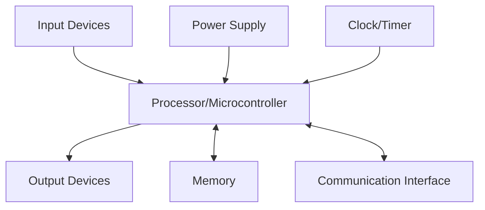
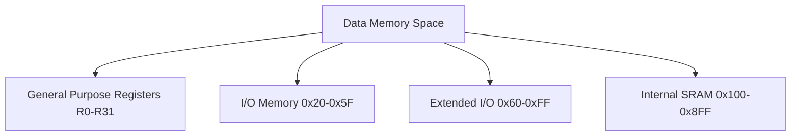
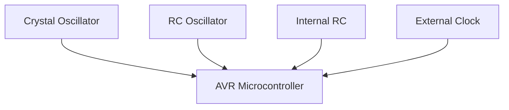
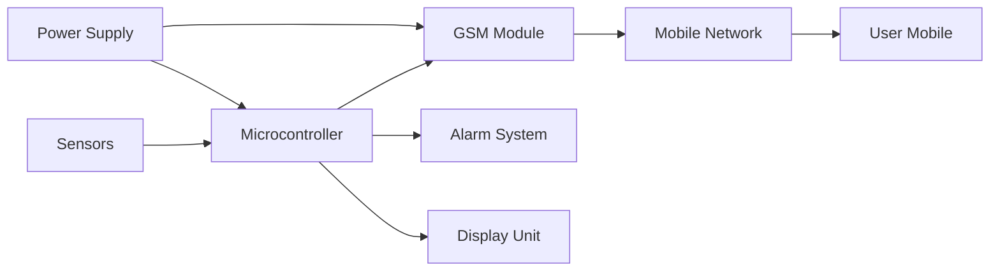
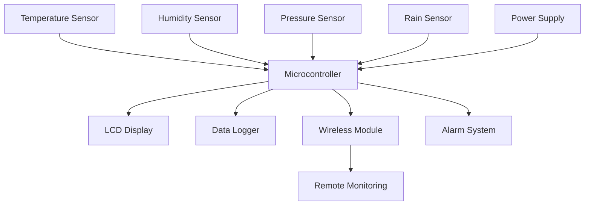

## પ્રશ્ન 1(અ) [3 માર્ક્સ]

**ATmega32 ની લાક્ષણિકતાઓ જણાવો.**

**જવાબ**:

| લાક્ષણિકતા | વર્ણન |
|------------|--------|
| **Flash Memory** | 32KB programmable memory |
| **SRAM** | 2KB internal SRAM |
| **EEPROM** | 1KB non-volatile data storage |
| **I/O Pins** | 32 programmable I/O lines |
| **Timers** | 3 flexible timer/counters |
| **ADC** | 10-bit 8-channel ADC |

- **Operating Voltage**: 2.7V થી 5.5V રેંજ
- **Clock Speed**: 16 MHz સુધી ની ઓપરેશન
- **Communication**: USART, SPI, I2C interfaces

**યાદી માટે**: "Fast SRAM Enjoys Input Timers And Communication"

---

## પ્રશ્ન 1(બ) [4 માર્ક્સ]

**માઈક્રોકંટ્રોલર પસંદ કરવા માટેના માપદંડો લખો.**

**જવાબ**:

| માપદંડો | વિચારણા |
|----------|-----------|
| **Processing Speed** | Clock frequency આવશ્યકતાઓ |
| **Memory Size** | Program અને data storage જરૂરિયાત |
| **I/O Requirements** | જરૂરી pins ની સંખ્યા |
| **Power Consumption** | Battery life વિચારણાઓ |
| **Cost** | Budget મર્યાદાઓ |
| **Development Tools** | Compiler અને debugger ઉપલબ્ધતા |

- **Application Type**: Real-time vs general purpose
- **Communication Needs**: Serial, parallel, wireless protocols
- **Package Size**: Final product માં space constraints

**યાદી માટે**: "Processing Memory I/O Power Cost Development Application Communication Package"

---

## પ્રશ્ન 1(ક) [7 માર્ક્સ]

**એમ્બેડેડ સિસ્ટમનો સામાન્ય બ્લોક ડાયાગ્રામ દોરો અને સમજાવો.**

**જવાબ**:



**બ્લોક કાર્યો**:

- **Processor**: Instructions execute કરતું central processing unit
- **Memory**: Program code અને data temporary store કરે છે
- **Input Devices**: Sensors, switches જે system input આપે છે
- **Output Devices**: Actuators, displays જે results બતાવે છે
- **Communication**: External device connectivity માટે interfaces
- **Power Supply**: બધા components ને stable voltage પૂરું પાડે છે
- **Clock/Timer**: System operations અને timing synchronize કરે છે

**યાદી માટે**: "Processors Memory Input Output Communication Power Clock"

---

## પ્રશ્ન 1(ક OR) [7 માર્ક્સ]

**રીયલ ટાઈમ ઓપરેટિંગ સિસ્ટમને વ્યાખ્યાયિત કરો અને તેની લાક્ષણિકતાઓ સમજાવો.**

**જવાબ**:

**Real Time Operating System (RTOS)**: કડક time constraints માં data અને events process કરવા માટે design કરેલું operating system.

| લાક્ષણિકતા | વર્ણન |
|-------------|--------|
| **Deterministic** | Predictable response times |
| **Preemptive** | Higher priority tasks interrupt lower ones |
| **Multitasking** | Multiple tasks concurrently run થાય છે |
| **Fast Context Switch** | Quick task switching capability |
| **Priority Scheduling** | Tasks priority પર આધારે execute થાય છે |
| **Interrupt Handling** | Efficient interrupt processing |

- **Hard Real-time**: Deadline miss થવાથી system failure થાય છે
- **Soft Real-time**: Deadline miss થવાથી performance degraded થાય છે
- **Time Constraints**: Operations deadline માં complete થવા જોઈએ

**યાદી માટે**: "Deterministic Preemptive Multitasking Fast Priority Interrupt"

---

## પ્રશ્ન 2(અ) [3 માર્ક્સ]

**ATmega32 નો પીન ડાયાગ્રામ દોરો.**

**જવાબ**:

```goat
      +---U---+
PB0   |1    40| PA0
PB1   |2    39| PA1  
PB2   |3    38| PA2
PB3   |4    37| PA3
PB4   |5    36| PA4
PB5   |6    35| PA5
PB6   |7    34| PA6
PB7   |8    33| PA7
RESET |9    32| AREF
VCC   |10   31| GND
GND   |11   30| AVCC
XTAL2 |12   29| PC7
XTAL1 |13   28| PC6
PD0   |14   27| PC5
PD1   |15   26| PC4
PD2   |16   25| PC3
PD3   |17   24| PC2
PD4   |18   23| PC1
PD5   |19   22| PC0
PD6   |20   21| PD7
      +-------+
```

**યાદી માટે**: "Port B A Reset Vcc Ground Crystal Port D C"

---

## પ્રશ્ન 2(બ) [4 માર્ક્સ]

**ATmega32 નો સ્ટેટસ રજિસ્ટર સમજાવો.**

**જવાબ**:

| Bit | Name | Function |
|-----|------|----------|
| **Bit 7** | I | Global Interrupt Enable |
| **Bit 6** | T | Bit Copy Storage |
| **Bit 5** | H | Half Carry Flag |
| **Bit 4** | S | Sign Bit |
| **Bit 3** | V | Overflow Flag |
| **Bit 2** | N | Negative Flag |
| **Bit 1** | Z | Zero Flag |
| **Bit 0** | C | Carry Flag |

- **Status Register (SREG)**: Arithmetic operation results contain કરે છે
- **Flags Update**: ALU operations દ્વારા automatically set/clear થાય છે
- **Conditional Branching**: Program flow control માટે વપરાય છે

**યાદી માટે**: "I Think Half Sign Overflow Negative Zero Carry"

---

## પ્રશ્ન 2(ક) [7 માર્ક્સ]

**ATmega32 ની ડેટા મેમરી વિગતવાર સમજાવો.**

**જવાબ**:



**મેમરી સંગઠન**:

- **General Purpose Registers**: Data operations માટે 32 registers (R0-R31)
- **I/O Memory**: Peripheral control registers નો direct access
- **Extended I/O**: Additional peripheral registers અને stack pointer
- **Internal SRAM**: Variables અને stack માટે 2KB volatile memory
- **Address Space**: 0x00 થી 0x8FF સુધી linear addressing
- **Stack Operation**: High memory addresses થી downward grows થાય છે

**યાદી માટે**: "General I/O Extended SRAM Address Stack"

---

## પ્રશ્ન 2(અ OR) [3 માર્ક્સ]

**DDRx, PINx અને PORTx રજિસ્ટરના કાર્યો લખો.**

**જવાબ**:

| Register | Function |
|----------|----------|
| **DDRx** | Data Direction Register - pin ને input/output તરીકે configure કરે છે |
| **PINx** | Pin Input Register - current pin state read કરે છે |
| **PORTx** | Port Output Register - output pins પર data write કરે છે |

- **DDRx Bit**: 1 = Output, 0 = Input configuration
- **PINx Read**: Pins પર actual voltage level return કરે છે
- **PORTx Write**: Pin output હોય ત્યારે output state control કરે છે

**યાદી માટે**: "Direction Input Output"

---

## પ્રશ્ન 2(બ OR) [4 માર્ક્સ]

**AVR માં EEPROM સાથે સંકળાયેલા વિવિધ I/O રજિસ્ટરો સમજાવો.**

**જવાબ**:

| Register | Function |
|----------|----------|
| **EEARH/EEARL** | EEPROM Address Register (9-bit address) |
| **EEDR** | EEPROM Data Register |
| **EECR** | EEPROM Control Register |

**EECR Control Bits**:

- **EERIE**: EEPROM Ready Interrupt Enable
- **EEMWE**: EEPROM Master Write Enable  
- **EEWE**: EEPROM Write Enable
- **EERE**: EEPROM Read Enable

**Programming Sequence**: Address set કરો → Data set કરો → Master write enable કરો → Write enable કરો

**યાદી માટે**: "Address Data Control Ready Master Write Read"

---

## પ્રશ્ન 2(ક OR) [7 માર્ક્સ]

**ક્લોક સોર્સને AVR સાથે જોડવાની વિવિધ રીતો સમજાવો.**

**જવાબ**:

| Clock Source | વર્ણન |
|--------------|--------|
| **External Crystal** | High precision, 1-16MHz |
| **External RC** | Low cost, moderate precision |
| **Internal RC** | Built-in 1/8MHz, કોઈ external components નહીં |
| **External Clock** | External clock signal input |



**Clock Configuration**:

- **Fuse Bits**: CKSEL3:0 અને SUT1:0 clock source select કરે છે
- **Startup Time**: Different sources માં અલગ અલગ startup delays હોય છે
- **Frequency Range**: Internal RC 1MHz અથવા 8MHz provide કરે છે
- **External Components**: Crystal ને stability માટે capacitors જોઈએ છે

**યાદી માટે**: "Crystal RC Internal External Fuse Startup Frequency Components"

---

## પ્રશ્ન 3(અ) [3 માર્ક્સ]

**Timer 1 સાથે સંકળાયેલા રજિસ્ટરોનું કાર્ય લખો.**

**જવાબ**:

| Register | Function |
|----------|----------|
| **TCNT1H/TCNT1L** | Timer/Counter 1 register (16-bit) |
| **TCCR1A/TCCR1B** | Timer/Counter 1 Control registers |
| **ICR1H/ICR1L** | Input Capture register |
| **OCR1AH/OCR1AL** | Output Compare A register |
| **OCR1BH/OCR1BL** | Output Compare B register |

- **TIMSK**: Timer Interrupt Mask register
- **TIFR**: Timer Interrupt Flag register

**યાદી માટે**: "Timer Control Input Output Mask Flag"

---

## પ્રશ્ન 3(બ) [4 માર્ક્સ]

**Timer 0 ને સામાન્ય મોડમાં પ્રોગ્રામ કરવાના મુદ્દાઓ લખો.**

**જવાબ**:

**Programming Steps**:

1. **Timer Mode Set કરો**: Normal mode માટે TCCR0 configure કરો
2. **Prescaler Select કરો**: Clock division ratio choose કરો
3. **Initial Value Load કરો**: TCNT0 register set કરો
4. **Interrupts Enable કરો**: જરૂર હોય તો TIMSK માં TOIE0 set કરો
5. **Timer Start કરો**: TCCR0 માં prescaler bits set કરો

```c
TCCR0 = 0x05;    // Normal mode, prescaler 1024
TCNT0 = 0x00;    // Initial value
TIMSK |= 0x01;   // Enable overflow interrupt
```

**યાદી માટે**: "Set Select Load Enable Start"

---

## પ્રશ્ન 3(ક) [7 માર્ક્સ]

**ડેટા બાઈટોને સીરીયલી રીસીવ કરાવવા અને તેમને PORTA પર મૂકવા માટેનો C પ્રોગ્રામ લખો. બાઉડ રેટ 9600, 8-બીટ, અને 1-બીટ સેટ કરો.**

**જવાબ**:

```c
#include <avr/io.h>

void USART_Init() {
    // Baud rate 9600 set કરો (8MHz clock માટે)
    UBRRH = 0x00;
    UBRRL = 51;
    
    // Receiver enable કરો
    UCSRB = (1<<RXEN);
    
    // Frame format set કરો: 8 data bits, 1 stop bit
    UCSRC = (1<<URSEL)|(3<<UCSZ0);
}

unsigned char USART_Receive() {
    // Data receive થવા માટે wait કરો
    while(!(UCSRA & (1<<RXC)));
    return UDR;
}

int main() {
    DDRA = 0xFF;        // PORTA output તરીકે
    USART_Init();       // USART initialize કરો
    
    while(1) {
        PORTA = USART_Receive();  // Receive કરો અને display કરો
    }
    return 0;
}
```

**યાદી માટે**: "Initialize Receive Display Loop"

---

## પ્રશ્ન 3(અ OR) [3 માર્ક્સ]

**AVR માં સીરીયલ કોમ્યુનિકેશન સાથે સંકળાયેલા રજિસ્ટરોના કાર્યો લખો.**

**જવાબ**:

| Register | Function |
|----------|----------|
| **UDR** | USART Data Register |
| **UCSRA** | USART Control and Status Register A |
| **UCSRB** | USART Control and Status Register B |
| **UCSRC** | USART Control and Status Register C |
| **UBRRH/UBRRL** | USART Baud Rate Registers |

**મુખ્ય કાર્યો**: Data transmission/reception, status monitoring, control configuration

**યાદી માટે**: "Data Control Status Baud"

---

## પ્રશ્ન 3(બ OR) [4 માર્ક્સ]

**ડેટા સીરીયલી ટ્રાન્સફર કરવા માટે AVR ને પ્રોગ્રામ કરવાના મુદ્દાઓની ચર્ચા કરો.**

**જવાબ**:

**Programming Steps**:

1. **Baud Rate Set કરો**: UBRRH/UBRRL registers configure કરો
2. **Transmitter Enable કરો**: UCSRB માં TXEN bit set કરો
3. **Frame Format Set કરો**: UCSRC માં data bits, stop bits configure કરો
4. **Empty Buffer માટે Wait કરો**: UCSRA માં UDRE flag check કરો
5. **Data Load કરો**: UDR register માં data write કરો

```c
void USART_Transmit(unsigned char data) {
    while(!(UCSRA & (1<<UDRE)));  // Empty buffer માટે wait કરો
    UDR = data;                   // Data send કરો
}
```

**યાદી માટે**: "Baud Enable Format Wait Load"

---

## પ્રશ્ન 3(ક OR) [7 માર્ક્સ]

**દર 2 મિલિસેકન્ડે માત્ર PORTB.4 બીટને સતત ટોગલ કરવા માટેનો C પ્રોગ્રામ લખો. Delay જનરેટ કરવા timer 1ને પ્રીસ્કેલર વગર નોર્મલ મોડમાં ઉપયોગ કરો. XTAL=8MHz ધારો.**

**જવાબ**:

```c
#include <avr/io.h>
#include <avr/interrupt.h>

volatile unsigned int timer_count = 0;

ISR(TIMER1_OVF_vect) {
    timer_count++;
    if(timer_count >= 1) {  // લગભગ 2ms
        PORTB ^= (1<<4);    // PORTB.4 toggle કરો
        timer_count = 0;
        TCNT1 = 49911;      // 2ms delay માટે reload કરો
    }
}

int main() {
    DDRB |= (1<<4);         // PORTB.4 output તરીકે
    
    // Timer1 Normal mode, no prescaler
    TCCR1A = 0x00;
    TCCR1B = 0x01;          // No prescaler
    
    TCNT1 = 49911;          // 2ms માટે initial value
    TIMSK |= (1<<TOIE1);    // Timer1 overflow interrupt enable કરો
    
    sei();                  // Global interrupts enable કરો
    
    while(1) {
        // Main loop
    }
    return 0;
}
```

**ગણતરી**: 8MHz clock સાથે 2ms delay માટે: 8MHz × 2ms = 16000 cycles
Timer1 counts: 65536 - 16000 = 49536 (adjustment માટે લગભગ 49911)

**યાદી માટે**: "Configure Timer Calculate Enable Loop"

---

## પ્રશ્ન 4(અ) [3 માર્ક્સ]

**ULN2803 નો ATmega32 સાથે ઇન્ટરફેસિંગ ડાયાગ્રામ દોરો.**

**જવાબ**:

```goat
ATmega32          ULN2803          Load
+---------+      +--------+      +------+
|   PB0   |----->|   1    |----->| Relay|
|   PB1   |----->|   2    |----->| LED  |
|   PB2   |----->|   3    |----->| Motor|
|   PB3   |----->|   4    |      +------+
|   PB4   |----->|   5    |         |
|   PB5   |----->|   6    |         |
|   PB6   |----->|   7    |         |
|   PB7   |----->|   8    |         |
|         |      |   9    |<--------+  +12V
|   GND   |----->|  10    |
+---------+      +--------+
```

**કનેક્શન વિગતો**:

- **Input**: ATmega32 PORTB pins થી ULN2803 inputs
- **Output**: ULN2803 outputs high current loads drive કરે છે
- **Common**: Pin 9 positive supply સાથે, Pin 10 ground સાથે connects થાય છે

**યાદી માટે**: "Input Output Common Supply Ground"

---

## પ્રશ્ન 4(બ) [4 માર્ક્સ]

**Port B પરથી ડેટા બાઈટ લેવો અને તેને Port C પર મોકલવા AVR માટેનો C પ્રોગ્રામ લખો.**

**જવાબ**:

```c
#include <avr/io.h>

int main() {
    DDRB = 0x00;    // PORTB input તરીકે
    DDRC = 0xFF;    // PORTC output તરીકે
    PORTB = 0xFF;   // PORTB પર pull-up resistors enable કરો
    
    unsigned char data;
    
    while(1) {
        data = PINB;     // PORTB થી data read કરો
        PORTC = data;    // PORTC પર data send કરો
    }
    
    return 0;
}
```

**પ્રોગ્રામ Flow**:

- **Ports Configure કરો**: Direction registers set કરો
- **Pull-ups Enable કરો**: Internal pull-up resistors activate કરો
- **Data Read કરો**: PINB register થી byte get કરો
- **Data Write કરો**: PORTC register પર byte output કરો

**યાદી માટે**: "Configure Enable Read Write"

---

## પ્રશ્ન 4(ક) [7 માર્ક્સ]

**MAX7221 નો ATmega32 સાથે ઇન્ટરફેસિંગ ડાયાગ્રામ દોરો અને સમજાવો.**

**જવાબ**:

```goat
ATmega32              MAX7221           7-Segment Display
+---------+          +---------+        +-------------+
|   PB5   |--------->|   DIN   |        |     a       |
|   PB7   |--------->|   CLK   |        |   f   b     |
|   PB4   |--------->|   LOAD  |        |     g       |
|   VCC   |--------->|   VCC   |        |   e   c     |
|   GND   |--------->|   GND   |        |     d   dp  |
+---------+          |  DIG0-7 |------->+-------------+
                     | SEG A-G |
                     |   DP    |
                     +---------+
```

**Interface વર્ણન**:

- **SPI Communication**: 3-wire SPI protocol વાપરે છે
- **DIN (Data In)**: PB5 (MOSI) થી serial data input
- **CLK (Clock)**: PB7 (SCK) થી clock signal
- **LOAD (Chip Select)**: PB4 (SS) થી latch signal
- **Multiplexed Display**: 8 seven-segment digits સુધી control કરે છે
- **Current Control**: LEDs માટે internal current limiting

**Programming Steps**: SPI initialize કરો → Address send કરો → Data send કરો → LOAD pin toggle કરો

**યાદી માટે**: "SPI Data Clock Load Multiplex Current Program"

## પ્રશ્ન 4(અ OR) [3 માર્ક્સ]

**LM35 નો ATmega32 સાથે ઇન્ટરફેસિંગ ડાયાગ્રામ દોરો.**

**જવાબ**:

```goat
LM35 Temperature Sensor    ATmega32
+-------------------+     +-----------+
|        VCC        |---->|    VCC    |
|                   |     |           |
|       OUT         |---->|   PA0     | (ADC0)
|                   |     |           |
|       GND         |---->|   GND     |
+-------------------+     +-----------+
```

**કનેક્શન વિગતો**:

- **VCC**: +5V supply સાથે connect કરો
- **OUT**: ADC channel (PA0) પર analog output
- **GND**: Ground સાથે connect કરો
- **Output**: 10mV/°C linear voltage output

**યાદી માટે**: "VCC OUT GND Linear"

---

## પ્રશ્ન 4(બ OR) [4 માર્ક્સ]

**Port C ના બીટ-5 ને મોનીટર કરો, જો તે HIGH હોય તો 55H ને Port B પર મોકલો નહીં તો AAH ને Port B પર મોકલવા AVR માટેનો C પ્રોગ્રામ લખો.**

**જવાબ**:

```c
#include <avr/io.h>

int main() {
    DDRC &= ~(1<<5);    // PC5 input તરીકે
    DDRB = 0xFF;        // PORTB output તરીકે
    PORTC |= (1<<5);    // PC5 પર pull-up enable કરો
    
    while(1) {
        if(PINC & (1<<5)) {     // Bit 5 HIGH છે કે નહીં check કરો
            PORTB = 0x55;       // PORTB પર 55H send કરો
        }
        else {
            PORTB = 0xAA;       // PORTB પર AAH send કરો
        }
    }
    
    return 0;
}
```

**પ્રોગ્રામ Logic**:

- **Bit Monitor**: Bit masking વાપરીને PC5 status check કરો
- **Conditional Output**: Input આધારે અલગ અલગ values send કરો
- **Continuous Loop**: Changes માટે continuously monitor કરો

**યાદી માટે**: "Monitor Conditional Output Loop"

---

## પ્રશ્ન 4(ક OR) [7 માર્ક્સ]

**AVR માં SPI ને પ્રોગ્રામ કરવા માટેના રજિસ્ટરોની ચર્ચા કરો.**

**જવાબ**:

| Register | Function |
|----------|----------|
| **SPCR** | SPI Control Register |
| **SPSR** | SPI Status Register |
| **SPDR** | SPI Data Register |

**SPCR Control Bits**:

- **SPIE**: SPI Interrupt Enable
- **SPE**: SPI Enable
- **DORD**: Data Order (MSB/LSB first)
- **MSTR**: Master/Slave Select
- **CPOL**: Clock Polarity
- **CPHA**: Clock Phase
- **SPR1:0**: SPI Clock Rate Select

**SPSR Status Bits**:

- **SPIF**: SPI Interrupt Flag
- **WCOL**: Write Collision Flag
- **SPI2X**: Double SPI Speed

**Programming Sequence**: SPCR configure કરો → SPI enable કરો → SPDR write કરો → SPIF માટે wait કરો → SPDR read કરો

**યાદી માટે**: "Control Status Data Configure Enable Write Wait Read"

---

## પ્રશ્ન 5(અ) [3 માર્ક્સ]

**મોટર ડ્રાઇવર આઈસી L293D નો પીન ડાયાગ્રામ દોરો.**

**જવાબ**:

```goat
    L293D
   +--U--+
EN1|1  16|VCC
1A |2  15|4A
1Y |3  14|4Y
GND|4  13|GND
GND|5  12|GND
2Y |6  11|3Y
2A |7  10|3A
VCC|8   9|EN2
   +-----+
```

**Pin કાર્યો**:

- **EN1, EN2**: Motor control માટે enable pins
- **1A, 2A, 3A, 4A**: Microcontroller થી input pins
- **1Y, 2Y, 3Y, 4Y**: Motors પર output pins
- **VCC**: Logic અને motor supply voltages
- **GND**: Ground connections

**યાદી માટે**: "Enable Input Output Supply Ground"

---

## પ્રશ્ન 5(બ) [4 માર્ક્સ]

**ADMUX રજિસ્ટર દોરો અને સમજાવો.**

**જવાબ**:

| Bit 7 | Bit 6 | Bit 5 | Bit 4 | Bit 3 | Bit 2 | Bit 1 | Bit 0 |
|-------|-------|-------|-------|-------|-------|-------|-------|
| REFS1 | REFS0 | ADLAR | MUX4  | MUX3  | MUX2  | MUX1  | MUX0  |

**Bit કાર્યો**:

- **REFS1:0**: Reference Selection (00=AREF, 01=AVCC, 11=Internal 2.56V)
- **ADLAR**: ADC Left Adjust Result (data format)
- **MUX4:0**: Analog Channel Selection (32 possible channels)

**Channel Selection ઉદાહરણો**:

- **00000**: ADC0 (PA0)
- **00001**: ADC1 (PA1)
- **00111**: ADC7 (PA7)

**યાદી માટે**: "Reference Adjust Multiplex Channel"

---

## પ્રશ્ન 5(ક) [7 માર્ક્સ]

**GSM આધારિત સિક્યુરિટિ સિસ્ટમનો બ્લોક ડાયાગ્રામ સમજાવો.**

**જવાબ**:



**સિસ્ટમ ઘટકો**:

- **Sensors**: PIR, door/window sensors intrusion detect કરે છે
- **Microcontroller**: Sensor data process કરે છે અને system control કરે છે
- **GSM Module**: Registered numbers પર SMS/calls send કરે છે
- **Mobile Network**: Cellular infrastructure સાથે connects કરે છે
- **Alarm System**: Local audio/visual alerts
- **Display Unit**: System status અને messages show કરે છે
- **Power Supply**: Continuous operation માટે battery backup
- **Operation Flow**: Sensor detects → Microcontroller processes → GSM sends alert → User receives notification → Alarm activates

**યાદી માટે**: "Sensors Microcontroller GSM Mobile Alarm Display Power Operation"

---

## પ્રશ્ન 5(અ OR) [3 માર્ક્સ]

**મોટર ડ્રાઇવર L293D નો ઉપયોગ કરી ડી.સી. મોટરને ATmega32 સાથે ઇન્ટરફેસ કરવાનો સર્કિટ ડાયાગ્રામ દોરો.**

**જવાબ**:

```goat
ATmega32      L293D        DC Motor
+---------+  +------+     +-------+
|   PB0   |->|EN1   |     |   M   |
|   PB1   |->|1A    |     |   O   |
|   PB2   |->|2A  1Y|---->|   T   |
|         |  |    2Y|---->|   O   |
|   VCC   |->|VCC   |     |   R   |
|   GND   |->|GND   |     +-------+
+---------+  +------+
```

**કનેક્શન્સ**:

- **PB0 → EN1**: Motor operation enable કરે છે
- **PB1 → 1A, PB2 → 2A**: Direction control inputs
- **1Y, 2Y → Motor**: Motor terminals પર output
- **VCC, GND**: Power supply connections

**Motor Control**: 1A, 2A પર અલગ અલગ input combinations motor direction અને speed control કરે છે

**યાદી માટે**: "Enable Direction Output Power Control"

---

## પ્રશ્ન 5(બ OR) [4 માર્ક્સ]

**ADCSRA રજિસ્ટર દોરો અને સમજાવો.**

**જવાબ**:

| Bit 7 | Bit 6 | Bit 5 | Bit 4 | Bit 3 | Bit 2 | Bit 1 | Bit 0 |
|-------|-------|-------|-------|-------|-------|-------|-------|
| ADEN  | ADSC  | ADATE | ADIF  | ADIE  | ADPS2 | ADPS1 | ADPS0 |

**Bit કાર્યો**:

- **ADEN**: ADC Enable
- **ADSC**: ADC Start Conversion
- **ADATE**: ADC Auto Trigger Enable
- **ADIF**: ADC Interrupt Flag
- **ADIE**: ADC Interrupt Enable
- **ADPS2:0**: ADC Prescaler Select (division factor)

**Prescaler Settings**: 000=2, 001=2, 010=4, 011=8, 100=16, 101=32, 110=64, 111=128

**Programming**: ADEN set કરો → Prescaler configure કરો → ADSC set કરો → ADIF માટે wait કરો

**યાદી માટે**: "Enable Start Auto Interrupt Prescaler Configure"

---

## પ્રશ્ન 5(ક OR) [7 માર્ક્સ]

**વેધર મોનીટરીંગ સિસ્ટમનો બ્લોક ડાયાગ્રામ સમજાવો.**

**જવાબ**:



**સિસ્ટમ ઘટકો**:

- **Temperature Sensor**: Ambient temperature measure કરે છે (LM35/DS18B20)
- **Humidity Sensor**: Moisture content monitor કરે છે (DHT22)
- **Pressure Sensor**: Atmospheric pressure changes detect કરે છે
- **Rain Sensor**: Precipitation levels detect કરે છે
- **Microcontroller**: Data collection માટે central processing unit
- **LCD Display**: Local visual data presentation
- **Data Logger**: Historical weather data store કરે છે
- **Wireless Module**: Remote locations પર data transmit કરે છે
- **Alarm System**: Extreme weather conditions માટે alerts
- **Power Supply**: System ને stable power પૂરું પાડે છે

**ઓપરેશન**: Sensors data collect કરે છે → Microcontroller processes કરે છે → Display updates થાય છે → Data logging થાય છે → Wireless transmission થાય છે → Alert generation થાય છે

**યાદી માટે**: "Temperature Humidity Pressure Rain Microcontroller Display Logger Wireless Alarm Operation"
