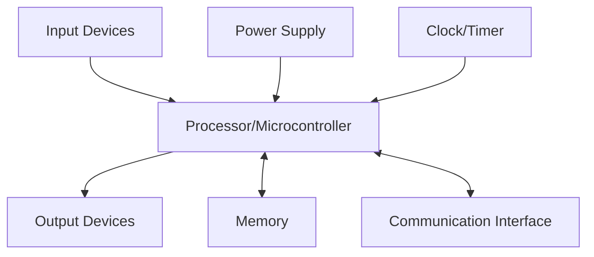
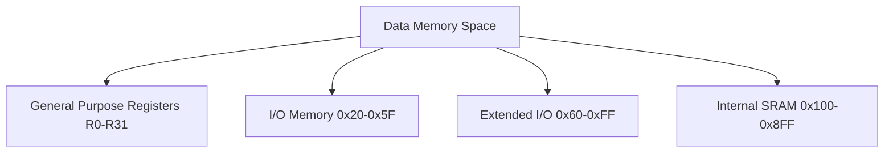
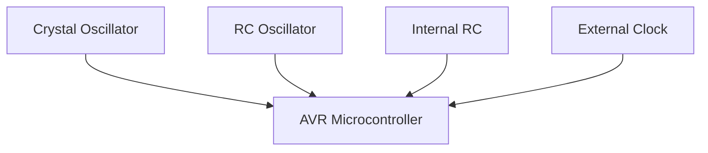
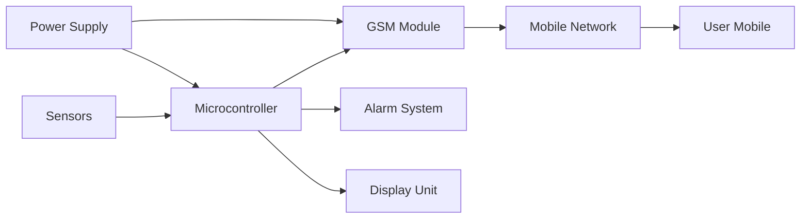
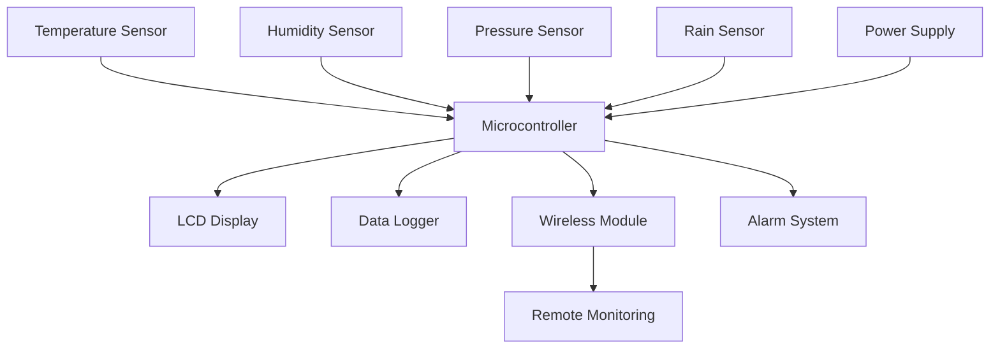

## Question 1(a) [3 marks]

**State the features of ATmega32.**

**Answer**:

| Feature | Description |
|---------|-------------|
| **Flash Memory** | 32KB programmable memory |
| **SRAM** | 2KB internal SRAM |
| **EEPROM** | 1KB non-volatile data storage |
| **I/O Pins** | 32 programmable I/O lines |
| **Timers** | 3 flexible timer/counters |
| **ADC** | 10-bit 8-channel ADC |

- **Operating Voltage**: 2.7V to 5.5V range
- **Clock Speed**: Up to 16 MHz operation
- **Communication**: USART, SPI, I2C interfaces

**Mnemonic:** "Fast SRAM Enjoys Input Timers And Communication"

---

## Question 1(b) [4 marks]

**Write criteria for choosing microcontroller.**

**Answer**:

| Criteria | Consideration |
|----------|---------------|
| **Processing Speed** | Clock frequency requirements |
| **Memory Size** | Program and data storage needs |
| **I/O Requirements** | Number of pins needed |
| **Power Consumption** | Battery life considerations |
| **Cost** | Budget constraints |
| **Development Tools** | Compiler and debugger availability |

- **Application Type**: Real-time vs general purpose
- **Communication Needs**: Serial, parallel, wireless protocols
- **Package Size**: Space constraints in final product

**Mnemonic:** "Processing Memory I/O Power Cost Development Application Communication Package"

---

## Question 1(c) [7 marks]

**Draw and explain general block diagram of embedded system.**

**Answer**:



**Block Functions**:

- **Processor**: Central processing unit executing instructions
- **Memory**: Stores program code and data temporarily
- **Input Devices**: Sensors, switches providing system input
- **Output Devices**: Actuators, displays showing results
- **Communication**: Interfaces for external device connectivity
- **Power Supply**: Provides stable voltage to all components
- **Clock/Timer**: Synchronizes system operations and timing

**Mnemonic:** "Processors Memory Input Output Communication Power Clock"

---

## Question 1(c OR) [7 marks]

**Define real time operating system and explain its characteristics.**

**Answer**:

**Real Time Operating System (RTOS)**: Operating system designed to process data and events within strict time constraints.

| Characteristic | Description |
|----------------|-------------|
| **Deterministic** | Predictable response times |
| **Preemptive** | Higher priority tasks interrupt lower ones |
| **Multitasking** | Multiple tasks run concurrently |
| **Fast Context Switch** | Quick task switching capability |
| **Priority Scheduling** | Tasks executed based on priority |
| **Interrupt Handling** | Efficient interrupt processing |

- **Hard Real-time**: Missing deadline causes system failure
- **Soft Real-time**: Missing deadline degrades performance
- **Time Constraints**: Operations must complete within deadlines

**Mnemonic:** "Deterministic Preemptive Multitasking Fast Priority Interrupt"

---

## Question 2(a) [3 marks]

**Draw pin diagram of ATmega32.**

**Answer**:

```goat
      +---U---+
PB0   |1    40| PA0
PB1   |2    39| PA1  
PB2   |3    38| PA2
PB3   |4    37| PA3
PB4   |5    36| PA4
PB5   |6    35| PA5
PB6   |7    34| PA6
PB7   |8    33| PA7
RESET |9    32| AREF
VCC   |10   31| GND
GND   |11   30| AVCC
XTAL2 |12   29| PC7
XTAL1 |13   28| PC6
PD0   |14   27| PC5
PD1   |15   26| PC4
PD2   |16   25| PC3
PD3   |17   24| PC2
PD4   |18   23| PC1
PD5   |19   22| PC0
PD6   |20   21| PD7
      +-------+
```

**Mnemonic:** "Port B A Reset Vcc Ground Crystal Port D C"

---

## Question 2(b) [4 marks]

**Explain status register of ATmega32.**

**Answer**:

| Bit | Name | Function |
|-----|------|----------|
| **Bit 7** | I | Global Interrupt Enable |
| **Bit 6** | T | Bit Copy Storage |
| **Bit 5** | H | Half Carry Flag |
| **Bit 4** | S | Sign Bit |
| **Bit 3** | V | Overflow Flag |
| **Bit 2** | N | Negative Flag |
| **Bit 1** | Z | Zero Flag |
| **Bit 0** | C | Carry Flag |

- **Status Register (SREG)**: Contains arithmetic operation results
- **Flags Update**: Automatically set/cleared by ALU operations
- **Conditional Branching**: Used for program flow control

**Mnemonic:** "I Think Half Sign Overflow Negative Zero Carry"

---

## Question 2(c) [7 marks]

**Explain data memory of ATmega32 in detail.**

**Answer**:



**Memory Organization**:

- **General Purpose Registers**: 32 registers (R0-R31) for data operations
- **I/O Memory**: Direct access to peripheral control registers
- **Extended I/O**: Additional peripheral registers and stack pointer
- **Internal SRAM**: 2KB volatile memory for variables and stack
- **Address Space**: Linear addressing from 0x00 to 0x8FF
- **Stack Operation**: Grows downward from high memory addresses

**Mnemonic:** "General I/O Extended SRAM Address Stack"

---

## Question 2(a OR) [3 marks]

**Write functions of DDRx, PINx and PORTx registers.**

**Answer**:

| Register | Function |
|----------|----------|
| **DDRx** | Data Direction Register - configures pin as input/output |
| **PINx** | Pin Input Register - reads current pin state |
| **PORTx** | Port Output Register - writes data to output pins |

- **DDRx Bit**: 1 = Output, 0 = Input configuration
- **PINx Read**: Returns actual voltage level on pins
- **PORTx Write**: Controls output state when pin is output

**Mnemonic:** "Direction Input Output"

---

## Question 2(b OR) [4 marks]

**Explain different I/O registers associated with EEPROM in AVR.**

**Answer**:

| Register | Function |
|----------|----------|
| **EEARH/EEARL** | EEPROM Address Register (9-bit address) |
| **EEDR** | EEPROM Data Register |
| **EECR** | EEPROM Control Register |

**EECR Control Bits**:

- **EERIE**: EEPROM Ready Interrupt Enable
- **EEMWE**: EEPROM Master Write Enable  
- **EEWE**: EEPROM Write Enable
- **EERE**: EEPROM Read Enable

**Programming Sequence**: Set address → Set data → Enable master write → Enable write

**Mnemonic:** "Address Data Control Ready Master Write Read"

---

## Question 2(c OR) [7 marks]

**Explain different ways of connecting clock sources to the AVR.**

**Answer**:

| Clock Source | Description |
|--------------|-------------|
| **External Crystal** | High precision, 1-16MHz |
| **External RC** | Low cost, moderate precision |
| **Internal RC** | Built-in 1/8MHz, no external components |
| **External Clock** | External clock signal input |



**Clock Configuration**:

- **Fuse Bits**: CKSEL3:0 and SUT1:0 select clock source
- **Startup Time**: Different sources have varying startup delays
- **Frequency Range**: Internal RC provides 1MHz or 8MHz
- **External Components**: Crystal requires capacitors for stability

**Mnemonic:** "Crystal RC Internal External Fuse Startup Frequency Components"

---

## Question 3(a) [3 marks]

**Write function of registers associated with Timer 1.**

**Answer**:

| Register | Function |
|----------|----------|
| **TCNT1H/TCNT1L** | Timer/Counter 1 register (16-bit) |
| **TCCR1A/TCCR1B** | Timer/Counter 1 Control registers |
| **ICR1H/ICR1L** | Input Capture register |
| **OCR1AH/OCR1AL** | Output Compare A register |
| **OCR1BH/OCR1BL** | Output Compare B register |

- **TIMSK**: Timer Interrupt Mask register
- **TIFR**: Timer Interrupt Flag register

**Mnemonic:** "Timer Control Input Output Mask Flag"

---

## Question 3(b) [4 marks]

**Discuss steps to program Timer0 in Normal mode.**

**Answer**:

**Programming Steps**:

1. **Set Timer Mode**: Configure TCCR0 for Normal mode
2. **Select Prescaler**: Choose clock division ratio
3. **Load Initial Value**: Set TCNT0 register
4. **Enable Interrupts**: Set TOIE0 in TIMSK (if needed)
5. **Start Timer**: Set prescaler bits in TCCR0

```c
TCCR0 = 0x05;    // Normal mode, prescaler 1024
TCNT0 = 0x00;    // Initial value
TIMSK |= 0x01;   // Enable overflow interrupt
```

**Mnemonic:** "Set Select Load Enable Start"

---

## Question 3(c) [7 marks]

**Write a C program to receive bytes of data serially and put them on PORT A. Set the baud rate at 9600, 8-bit, and 1 stop bit.**

**Answer**:

```c
#include <avr/io.h>

void USART_Init() {
    // Set baud rate to 9600 (assuming 8MHz clock)
    UBRRH = 0x00;
    UBRRL = 51;
    
    // Enable receiver
    UCSRB = (1<<RXEN);
    
    // Set frame format: 8 data bits, 1 stop bit
    UCSRC = (1<<URSEL)|(3<<UCSZ0);
}

unsigned char USART_Receive() {
    // Wait for data to be received
    while(!(UCSRA & (1<<RXC)));
    return UDR;
}

int main() {
    DDRA = 0xFF;        // PORTA as output
    USART_Init();       // Initialize USART
    
    while(1) {
        PORTA = USART_Receive();  // Receive and display
    }
    return 0;
}
```

**Mnemonic:** "Initialize Receive Display Loop"

---

## Question 3(a OR) [3 marks]

**Write function of registers associated with Serial Communication in AVR.**

**Answer**:

| Register | Function |
|----------|----------|
| **UDR** | USART Data Register |
| **UCSRA** | USART Control and Status Register A |
| **UCSRB** | USART Control and Status Register B |
| **UCSRC** | USART Control and Status Register C |
| **UBRRH/UBRRL** | USART Baud Rate Registers |

**Key Functions**: Data transmission/reception, status monitoring, control configuration

**Mnemonic:** "Data Control Status Baud"

---

## Question 3(b OR) [4 marks]

**Discuss steps to program AVR to transfer data serially.**

**Answer**:

**Programming Steps**:

1. **Set Baud Rate**: Configure UBRRH/UBRRL registers
2. **Enable Transmitter**: Set TXEN bit in UCSRB
3. **Set Frame Format**: Configure data bits, stop bits in UCSRC
4. **Wait for Empty Buffer**: Check UDRE flag in UCSRA
5. **Load Data**: Write data to UDR register

```c
void USART_Transmit(unsigned char data) {
    while(!(UCSRA & (1<<UDRE)));  // Wait for empty buffer
    UDR = data;                   // Send data
}
```

**Mnemonic:** "Baud Enable Format Wait Load"

---

## Question 3(c OR) [7 marks]

**Write a C program to toggle only the PORTB.4 bit continuously every 2 ms. Use timer 1, Normal mode, and no prescaler to create the delay. Assume XTAL=8MHz.**

**Answer**:

```c
#include <avr/io.h>
#include <avr/interrupt.h>

volatile unsigned int timer_count = 0;

ISR(TIMER1_OVF_vect) {
    timer_count++;
    if(timer_count >= 1) {  // Approximately 2ms
        PORTB ^= (1<<4);    // Toggle PORTB.4
        timer_count = 0;
        TCNT1 = 49911;      // Reload for 2ms delay
    }
}

int main() {
    DDRB |= (1<<4);         // PORTB.4 as output
    
    // Timer1 Normal mode, no prescaler
    TCCR1A = 0x00;
    TCCR1B = 0x01;          // No prescaler
    
    TCNT1 = 49911;          // Initial value for 2ms
    TIMSK |= (1<<TOIE1);    // Enable Timer1 overflow interrupt
    
    sei();                  // Enable global interrupts
    
    while(1) {
        // Main loop
    }
    return 0;
}
```

**Calculation**: For 2ms delay with 8MHz clock: 8MHz × 2ms = 16000 cycles
Timer1 counts: 65536 - 16000 = 49536 (approximately 49911 for adjustment)

**Mnemonic:** "Configure Timer Calculate Enable Loop"

---

## Question 4(a) [3 marks]

**Draw interfacing diagram of ULN2803 with ATmega32.**

**Answer**:

```goat
ATmega32          ULN2803          Load
+---------+      +--------+      +------+
|   PB0   |----->|   1    |----->| Relay|
|   PB1   |----->|   2    |----->| LED  |
|   PB2   |----->|   3    |----->| Motor|
|   PB3   |----->|   4    |      +------+
|   PB4   |----->|   5    |         |
|   PB5   |----->|   6    |         |
|   PB6   |----->|   7    |         |
|   PB7   |----->|   8    |         |
|         |      |   9    |<--------+  +12V
|   GND   |----->|  10    |
+---------+      +--------+
```

**Connection Details**:

- **Input**: ATmega32 PORTB pins to ULN2803 inputs
- **Output**: ULN2803 outputs drive high current loads
- **Common**: Pin 9 connects to positive supply, Pin 10 to ground

**Mnemonic:** "Input Output Common Supply Ground"

---

## Question 4(b) [4 marks]

**Write an AVR C program to get a byte of data from Port B, and then send it to Port C.**

**Answer**:

```c
#include <avr/io.h>

int main() {
    DDRB = 0x00;    // PORTB as input
    DDRC = 0xFF;    // PORTC as output
    PORTB = 0xFF;   // Enable pull-up resistors on PORTB
    
    unsigned char data;
    
    while(1) {
        data = PINB;     // Read data from PORTB
        PORTC = data;    // Send data to PORTC
    }
    
    return 0;
}
```

**Program Flow**:

- **Configure Ports**: Set direction registers
- **Enable Pull-ups**: Activate internal pull-up resistors
- **Read Data**: Get byte from PINB register
- **Write Data**: Output byte to PORTC register

**Mnemonic:** "Configure Enable Read Write"

---

## Question 4(c) [7 marks]

**Draw and explain interfacing of MAX7221 with ATmega32.**

**Answer**:

```goat
ATmega32              MAX7221           7-Segment Display
+---------+          +---------+        +-------------+
|   PB5   |--------->|   DIN   |        |     a       |
|   PB7   |--------->|   CLK   |        |   f   b     |
|   PB4   |--------->|   LOAD  |        |     g       |
|   VCC   |--------->|   VCC   |        |   e   c     |
|   GND   |--------->|   GND   |        |     d   dp  |
+---------+          |  DIG0-7 |------->+-------------+
                     | SEG A-G |
                     |   DP    |
                     +---------+
```

**Interface Description**:

- **SPI Communication**: Uses 3-wire SPI protocol
- **DIN (Data In)**: Serial data input from PB5 (MOSI)
- **CLK (Clock)**: Clock signal from PB7 (SCK)
- **LOAD (Chip Select)**: Latch signal from PB4 (SS)
- **Multiplexed Display**: Controls up to 8 seven-segment digits
- **Current Control**: Internal current limiting for LEDs

**Programming Steps**: Initialize SPI → Send address → Send data → Toggle LOAD pin

**Mnemonic:** "SPI Data Clock Load Multiplex Current Program"

---

## Question 4(a OR) [3 marks]

**Draw interfacing diagram of LM35 with ATmega32.**

**Answer**:

```goat
LM35 Temperature Sensor    ATmega32
+-------------------+     +-----------+
|        VCC        |---->|    VCC    |
|                   |     |           |
|       OUT         |---->|   PA0     | (ADC0)
|                   |     |           |
|       GND         |---->|   GND     |
+-------------------+     +-----------+
```

**Connection Details**:

- **VCC**: Connect to +5V supply
- **OUT**: Analog output to ADC channel (PA0)
- **GND**: Connect to ground
- **Output**: 10mV/°C linear voltage output

**Mnemonic:** "VCC OUT GND Linear"

---

## Question 4(b OR) [4 marks]

**Write an AVR C program to monitor bit 5 of port C, if it is HIGH, send 55H to Port B; otherwise, send AAH to Port B.**

**Answer**:

```c
#include <avr/io.h>

int main() {
    DDRC &= ~(1<<5);    // PC5 as input
    DDRB = 0xFF;        // PORTB as output
    PORTC |= (1<<5);    // Enable pull-up on PC5
    
    while(1) {
        if(PINC & (1<<5)) {     // Check if bit 5 is HIGH
            PORTB = 0x55;       // Send 55H to PORTB
        }
        else {
            PORTB = 0xAA;       // Send AAH to PORTB
        }
    }
    
    return 0;
}
```

**Program Logic**:

- **Monitor Bit**: Check PC5 status using bit masking
- **Conditional Output**: Send different values based on input
- **Continuous Loop**: Monitor continuously for changes

**Mnemonic:** "Monitor Conditional Output Loop"

---

## Question 4(c OR) [7 marks]

**Discuss registers used to program SPI in the AVR.**

**Answer**:

| Register | Function |
|----------|----------|
| **SPCR** | SPI Control Register |
| **SPSR** | SPI Status Register |
| **SPDR** | SPI Data Register |

**SPCR Control Bits**:

- **SPIE**: SPI Interrupt Enable
- **SPE**: SPI Enable
- **DORD**: Data Order (MSB/LSB first)
- **MSTR**: Master/Slave Select
- **CPOL**: Clock Polarity
- **CPHA**: Clock Phase
- **SPR1:0**: SPI Clock Rate Select

**SPSR Status Bits**:

- **SPIF**: SPI Interrupt Flag
- **WCOL**: Write Collision Flag
- **SPI2X**: Double SPI Speed

**Programming Sequence**: Configure SPCR → Enable SPI → Write SPDR → Wait for SPIF → Read SPDR

**Mnemonic:** "Control Status Data Configure Enable Write Wait Read"

---

## Question 5(a) [3 marks]

**Draw pin diagram of L293D motor driver IC.**

**Answer**:

```goat
    L293D
   +--U--+
EN1|1  16|VCC
1A |2  15|4A
1Y |3  14|4Y
GND|4  13|GND
GND|5  12|GND
2Y |6  11|3Y
2A |7  10|3A
VCC|8   9|EN2
   +-----+
```

**Pin Functions**:

- **EN1, EN2**: Enable pins for motor control
- **1A, 2A, 3A, 4A**: Input pins from microcontroller
- **1Y, 2Y, 3Y, 4Y**: Output pins to motors
- **VCC**: Logic and motor supply voltages
- **GND**: Ground connections

**Mnemonic:** "Enable Input Output Supply Ground"

---

## Question 5(b) [4 marks]

**Draw and explain ADMUX register.**

**Answer**:

| Bit 7 | Bit 6 | Bit 5 | Bit 4 | Bit 3 | Bit 2 | Bit 1 | Bit 0 |
|-------|-------|-------|-------|-------|-------|-------|-------|
| REFS1 | REFS0 | ADLAR | MUX4  | MUX3  | MUX2  | MUX1  | MUX0  |

**Bit Functions**:

- **REFS1:0**: Reference Selection (00=AREF, 01=AVCC, 11=Internal 2.56V)
- **ADLAR**: ADC Left Adjust Result (data format)
- **MUX4:0**: Analog Channel Selection (32 possible channels)

**Channel Selection Examples**:

- **00000**: ADC0 (PA0)
- **00001**: ADC1 (PA1)
- **00111**: ADC7 (PA7)

**Mnemonic:** "Reference Adjust Multiplex Channel"

---

## Question 5(c) [7 marks]

**Explain the block diagram of GSM based security system.**

**Answer**:



**System Components**:

- **Sensors**: PIR, door/window sensors detect intrusion
- **Microcontroller**: Processes sensor data and controls system
- **GSM Module**: Sends SMS/calls to registered numbers
- **Mobile Network**: Connects to cellular infrastructure
- **Alarm System**: Local audio/visual alerts
- **Display Unit**: Shows system status and messages
- **Power Supply**: Battery backup for continuous operation

**Operation Flow**: Sensor detects → Microcontroller processes → GSM sends alert → User receives notification → Alarm activates

**Mnemonic:** "Sensors Microcontroller GSM Mobile Alarm Display Power Operation"

---

## Question 5(a OR) [3 marks]

**Draw circuit diagram to interface DC motor with ATmega32 using L293D motor driver.**

**Answer**:

```goat
ATmega32      L293D        DC Motor
+---------+  +------+     +-------+
|   PB0   |->|EN1   |     |   M   |
|   PB1   |->|1A    |     |   O   |
|   PB2   |->|2A  1Y|---->|   T   |
|         |  |    2Y|---->|   O   |
|   VCC   |->|VCC   |     |   R   |
|   GND   |->|GND   |     +-------+
+---------+  +------+
```

**Connections**:

- **PB0 → EN1**: Enable motor operation
- **PB1 → 1A, PB2 → 2A**: Direction control inputs
- **1Y, 2Y → Motor**: Output to motor terminals
- **VCC, GND**: Power supply connections

**Motor Control**: Different input combinations on 1A, 2A control motor direction and speed

**Mnemonic:** "Enable Direction Output Power Control"

---

## Question 5(b OR) [4 marks]

**Draw and explain ADCSRA register.**

**Answer**:

| Bit 7 | Bit 6 | Bit 5 | Bit 4 | Bit 3 | Bit 2 | Bit 1 | Bit 0 |
|-------|-------|-------|-------|-------|-------|-------|-------|
| ADEN  | ADSC  | ADATE | ADIF  | ADIE  | ADPS2 | ADPS1 | ADPS0 |

**Bit Functions**:

- **ADEN**: ADC Enable
- **ADSC**: ADC Start Conversion
- **ADATE**: ADC Auto Trigger Enable
- **ADIF**: ADC Interrupt Flag
- **ADIE**: ADC Interrupt Enable
- **ADPS2:0**: ADC Prescaler Select (division factor)

**Prescaler Settings**: 000=2, 001=2, 010=4, 011=8, 100=16, 101=32, 110=64, 111=128

**Programming**: Set ADEN → Configure prescaler → Set ADSC → Wait for ADIF

**Mnemonic:** "Enable Start Auto Interrupt Prescaler Configure"

---

## Question 5(c OR) [7 marks]

**Explain the block diagram of Weather monitoring system.**

**Answer**:



**System Components**:

- **Temperature Sensor**: Measures ambient temperature (LM35/DS18B20)
- **Humidity Sensor**: Monitors moisture content (DHT22)
- **Pressure Sensor**: Detects atmospheric pressure changes
- **Rain Sensor**: Detects precipitation levels
- **Microcontroller**: Central processing unit for data collection
- **LCD Display**: Local visual data presentation
- **Data Logger**: Stores historical weather data
- **Wireless Module**: Transmits data to remote locations
- **Alarm System**: Alerts for extreme weather conditions

**Operation**: Sensors collect data → Microcontroller processes → Display updates → Data logging → Wireless transmission → Alert generation

**Mnemonic:** "Temperature Humidity Pressure Rain Microcontroller Display Logger Wireless Alarm Operation"
