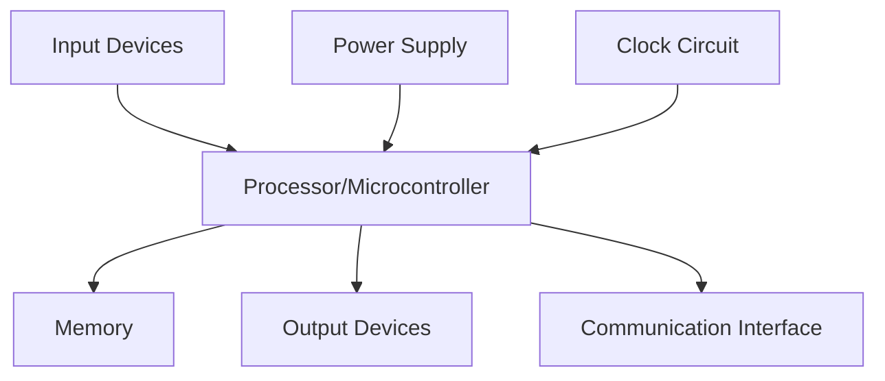
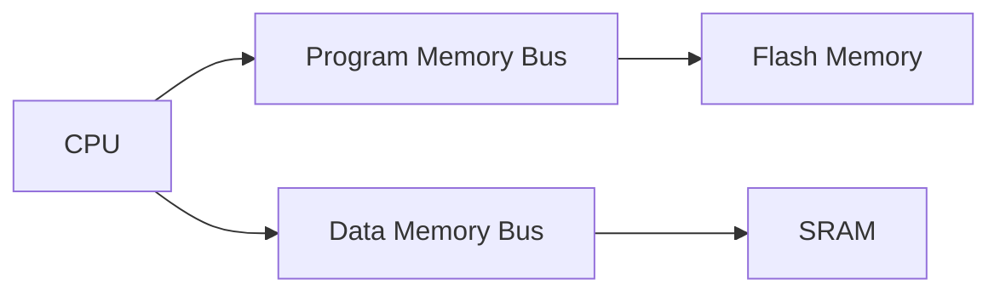
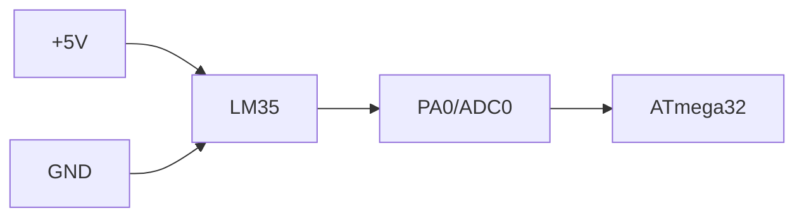
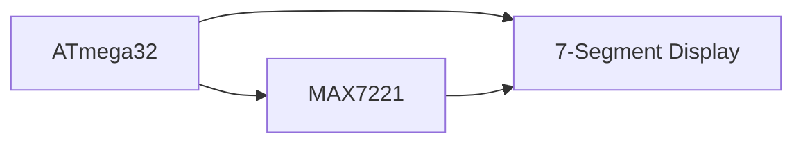
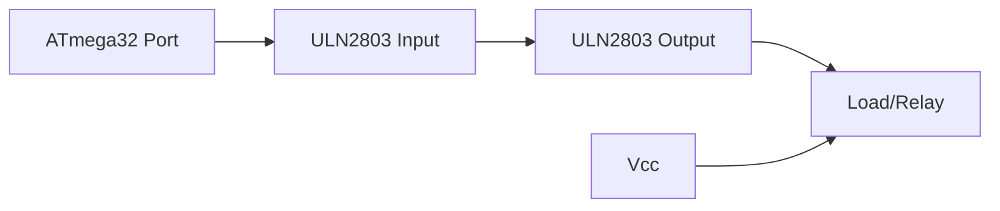
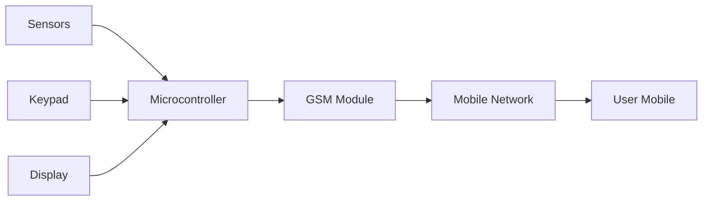
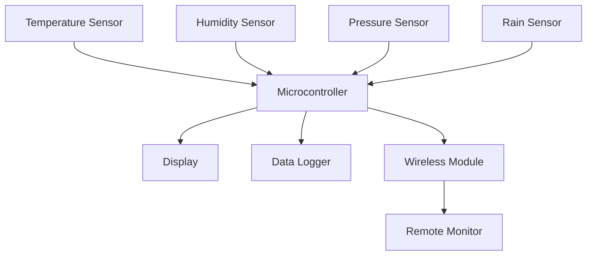

## પ્રશ્ન 1(અ) [3 ગુણ]

**TIFR register દોરો અને તેનું પૂરું નામ લખો.**

**જવાબ**:

**TIFR Register ડાયાગ્રામ:**
```goat
+----+----+----+-----+-----+----+----+----+
| 7  | 6  |  5 |  4  |  3  | 2  | 1  | 0  |
+----+----+----+-----+-----+----+----+----+
|OCF2|TOV2|ICF1|OCF1A|OCF1B|TOV1|OCF0|TOV0|
+----+----+----+-----+-----+----+----+----+
```

**પૂરું નામ**: Timer/Counter Interrupt Flag Register

- **TOV0**: Timer0 Overflow Flag
- **OCF0**: Timer0 Output Compare Flag  
- **TOV1**: Timer1 Overflow Flag

**મેમરી ટ્રીક:** "Timer Interrupts Flag Register"

## પ્રશ્ન 1(બ) [4 ગુણ]

**ATmega32 ની ડેટા મેમરીની ચર્ચા કરો.**

**જવાબ**:

| મેમરી પ્રકાર | કદ | Address Range | હેતુ |
|-------------|------|---------------|---------|
| General Purpose Registers | 32 bytes | 0x00-0x1F | R0-R31 registers |
| I/O Memory | 64 bytes | 0x20-0x5F | Control registers |
| Internal SRAM | 2048 bytes | 0x60-0x85F | Variable storage |

- **General Purpose Registers**: અંકગણિત કામગીરી અને અસ્થાયી સંગ્રહ માટે વપરાય છે
- **I/O Memory**: પેરિફેરલ કંટ્રોલ અને સ્ટેટસ રજિસ્ટર્સ ધરાવે છે
- **Internal SRAM**: સ્ટેક, વેરિયેબલ્સ અને ડાયનેમિક મેમરી માટે વપરાય છે

**મેમરી ટ્રીક:** "General I/O SRAM Memory"

## પ્રશ્ન 1(ક) [7 ગુણ]

**એમ્બેડેડ સિસ્ટમનો જનરલ બ્લોક ડાયાગ્રામ દોરી સમજાવો.**

**જવાબ**:



| ઘટક | કાર્ય |
|-----------|----------|
| Processor | સમગ્ર સિસ્ટમ ઓપરેશન કંટ્રોલ કરે છે |
| Memory | પ્રોગ્રામ અને ડેટા સ્ટોર કરે છે |
| Input Devices | સેન્સર, સ્વિચ, કીબોર્ડ |
| Output Devices | LEDs, ડિસ્પ્લે, મોટર |
| Communication | UART, SPI, I2C ઇન્ટરફેસ |

- **Real-time Operation**: સિસ્ટમ નિર્ધારિત સમય મર્યાદામાં ઇનપુટ્સને પ્રતિસાદ આપે છે
- **Dedicated Function**: ચોક્કસ એપ્લિકેશન માટે ડિઝાઇન કરવામાં આવે છે
- **Resource Constraints**: મર્યાદિત મેમરી, પાવર અને પ્રોસેસિંગ ક્ષમતા

**મેમરી ટ્રીક:** "Processor Memory Input Output Communication"

## પ્રશ્ન 1(ક OR) [7 ગુણ]

**રીયલ ટાઇમ ઓપરેટિંગ સિસ્ટમને વ્યાખ્યાયિત કરો અને તેની લાક્ષણિકતાઓ સમજાવો.**

**જવાબ**:

**વ્યાખ્યા**: Real Time Operating System (RTOS) એ એવી ઓપરેટિંગ સિસ્ટમ છે જે મહત્વપૂર્ણ કાર્યો માટે નિર્દિષ્ટ સમય મર્યાદામાં પ્રતિસાદની ગેરેંટી આપે છે.

| લાક્ષણિકતા | વર્ણન |
|----------------|-------------|
| Deterministic | અનુમાનિત પ્રતિસાદ સમય |
| Multitasking | બહુવિધ કાર્યોનું અમલીકરણ |
| Priority-based | ઉચ્ચ પ્રાથમિકતા કાર્યો પહેલા |
| Minimal Latency | ઝડપી ઇન્ટરપ્ટ પ્રતિસાદ |

- **Hard Real-time**: ડેડલાઇન ચૂકવાથી સિસ્ટમ નિષ્ફળતા થાય છે
- **Soft Real-time**: ડેડલાઇન ચૂકવાથી પ્રદર્શન ઘટે છે
- **Task Scheduling**: Preemptive priority-based scheduling મહત્વપૂર્ણ કાર્યો પહેલા ચલાવવાની ખાતરી કરે છે

**મેમરી ટ્રીક:** "Deterministic Multitasking Priority Minimal"

## પ્રશ્ન 2(અ) [3 ગુણ]

**એમ્બેડેડ સિસ્ટમ માટે માઇક્રોકન્ટ્રોલર પસંદ કરવા માટેના માપદંડો લખો.**

**જવાબ**:

| માપદંડ | મહત્વ |
|----------|------------|
| Processing Speed | એપ્લિકેશન જરૂરિયાતો સાથે મેળ |
| Memory Size | પૂરતી ROM/RAM |
| I/O Pins | પર્યાપ્ત પેરિફેરલ ઇન્ટરફેસ |
| Power Consumption | બેટરી લાઇફ વિચારણા |
| Cost | બજેટ મર્યાદા |
| Development Tools | કમ્પાઇલર, ડીબગર ઉપલબ્ધતા |

**મેમરી ટ્રીક:** "Speed Memory I/O Power Cost Tools"

## પ્રશ્ન 2(બ) [4 ગુણ]

**AVR માં હાર્વર્ડ આર્કિટેક્ચરની ચર્ચા કરો.**

**જવાબ**:

**હાર્વર્ડ આર્કિટેક્ચર લક્ષણો:**

| લક્ષણ | વર્ણન |
|---------|-------------|
| Separate Buses | પ્રોગ્રામ અને ડેટાને સ્વતંત્ર બસ |
| Simultaneous Access | એકસાથે instruction fetch અને data access |
| Different Memory Types | પ્રોગ્રામ માટે Flash, ડેટા માટે SRAM |



- **ફાયદો**: સમાંતર એક્સેસને કારણે ઉચ્ચ પ્રદર્શન
- **16-bit Instructions**: મોટાભાગની instructions એક clock cycle માં execute થાય છે

**મેમરી ટ્રીક:** "Separate Simultaneous Different Performance"

## પ્રશ્ન 2(ક) [7 ગુણ]

**ક્લોક સોર્સને AVR સાથે જોડવાની વિવિધ રીતોની ચર્ચા કરો.**

**જવાબ**:

| ક્લોક સોર્સ | ફ્રિક્વન્સી રેન્જ | એપ્લિકેશન |
|--------------|----------------|-------------|
| External Crystal | 1-16 MHz | ઉચ્ચ ચોકસાઈ એપ્લિકેશન |
| External RC | 1-8 MHz | કિફાયતી સોલ્યુશન |
| Internal RC | 1-8 MHz | ડિફોલ્ટ, બાહ્ય components નથી |
| External Clock | Up to 16 MHz | સિંક્રોનાઇઝ્ડ સિસ્ટમ્સ |

**Fuse Bits દ્વારા ક્લોક પસંદગી:**
```goat
CKSEL3:0 bits determine clock source
CKDIV8 bit divides clock by 8
SUT1:0 bits set startup time
```

- **Crystal Oscillator**: સૌથી સ્થિર, બાહ્ય crystal અને capacitors જરૂરી
- **RC Oscillator**: ઓછી ચોકસાઈ પરંતુ સસ્તી
- **Internal Oscillator**: ફેક્ટરી કેલિબ્રેટેડ, તાપમાન આધારિત

**મેમરી ટ્રીક:** "Crystal RC Internal External"

## પ્રશ્ન 2(અ OR) [3 ગુણ]

**ATmega32 માટે code ROM, SRAM અને EEPROM નું કદ તેમજ I/O pins, ADC અને Timers ની સંખ્યા લખો.**

**જવાબ**:

| સ્પેસિફિકેશન | ATmega32 |
|---------------|----------|
| Flash ROM | 32 KB |
| SRAM | 2 KB |
| EEPROM | 1 KB |
| I/O Pins | 32 pins |
| ADC Channels | 8 channels |
| Timers | 3 timers |

**મેમરી ટ્રીક:** "32K Flash 2K SRAM 1K EEPROM 32 I/O 8 ADC 3 Timers"

## પ્રશ્ન 2(બ OR) [4 ગુણ]

**ATmega32 પિન ડાયાગ્રામ દોરો અને Vcc, AVcc અને Aref પિનનું કાર્ય લખો.**

**જવાબ**:

**પિન કાર્યો:**

| પિન | કાર્ય |
|-----|----------|
| Vcc | મુખ્ય પાવર સપ્લાય (+5V) |
| AVcc | ADC માટે એનાલોગ પાવર સપ્લાય |
| Aref | ADC રેફરન્સ વોલ્ટેજ |

```goat
        ATmega32
    +--------------+
Vcc-|1           40|-AVcc
    |              |
    |              |
    |              |
    |              |
Aref|32          20|-GND
    +--------------+
```

- **Vcc**: ડિજિટલ સર્કિટ્સને પાવર સપ્લાય કરે છે
- **AVcc**: નોઇઝ ઘટાડવા માટે ADC માટે અલગ સપ્લાય
- **Aref**: ADC કન્વર્ઝન માટે બાહ્ય રેફરન્સ

**મેમરી ટ્રીક:** "Vcc Digital AVcc Analog Aref Reference"

## પ્રશ્ન 2(ક OR) [7 ગુણ]

**AVR સ્ટેટસ રજિસ્ટર વિગતવાર સમજાવો.**

**જવાબ**:

**SREG (Status Register) બિટ્સ:**

| બિટ | નામ | કાર્ય |
|-----|------|----------|
| 7 | I | Global Interrupt Enable |
| 6 | T | Bit Copy Storage |
| 5 | H | Half Carry Flag |
| 4 | S | Sign Flag |
| 3 | V | Overflow Flag |
| 2 | N | Negative Flag |
| 1 | Z | Zero Flag |
| 0 | C | Carry Flag |

```goat
+---+---+---+---+---+---+---+---+
| I | T | H | S | V | N | Z | C |
+---+---+---+---+---+---+---+---+
  7   6   5   4   3   2   1   0
```

- **I Flag**: ગ્લોબલ ઇન્ટરપ્ટ enable/disable કંટ્રોલ કરે છે
- **Arithmetic Flags**: ALU ઓપરેશન પછી C, Z, N, V, S, H અપડેટ થાય છે
- **T Flag**: બિટ મેનિપ્યુલેશન માટે BLD અને BST instructions દ્વારા વપરાય છે

**મેમરી ટ્રીક:** "I Transfer Half Sign oVerflow Negative Zero Carry"

## પ્રશ્ન 3(અ) [3 ગુણ]

**AVR માઇક્રોકન્ટ્રોલર માટે RESET સર્કિટ સમજાવો.**

**જવાબ**:

**રીસેટ સોર્સ:**

| રીસેટ સોર્સ | વર્ણન |
|--------------|-------------|
| Power-on Reset | પાવર લાગુ કરવામાં આવે ત્યારે |
| External Reset | RESET pin દ્વારા |
| Brown-out Reset | વોલ્ટેજ ઘટે ત્યારે |
| Watchdog Reset | Watchdog timer overflow |

```goat
Vcc ----[R]----+---- RESET pin
               |
               C
               |
              GND
```

- **રીસેટ અવધિ**: ઓછામાં ઓછા 2 clock cycles
- **રીસેટ વેક્ટર**: પ્રોગ્રામ address 0x0000 થી શરૂ થાય છે

**મેમરી ટ્રીક:** "Power External Brown-out Watchdog"

## પ્રશ્ન 3(બ) [4 ગુણ]

**EEPROM સાથે સંકળાયેલ I/O રજિસ્ટરની યાદી બનાવો. EEPROM પર data write કરવા માટેના પ્રોગ્રામિંગ સ્ટેપ્સ લખો.**

**જવાબ**:

**EEPROM રજિસ્ટર્સ:**

| રજિસ્ટર | કાર્ય |
|----------|----------|
| EEAR | EEPROM Address Register |
| EEDR | EEPROM Data Register |
| EECR | EEPROM Control Register |

**પ્રોગ્રામિંગ સ્ટેપ્સ:**

1. પાછલી write પૂર્ણ થવાની રાહ જુઓ (EEWE bit ચેક કરો)
2. EEAR રજિસ્ટરમાં address સેટ કરો
3. EEDR રજિસ્ટરમાં data સેટ કરો
4. EECR માં EEMWE bit સેટ કરો
5. 4 clock cycles અંદર EEWE bit સેટ કરો

**મેમરી ટ્રીક:** "Wait Address Data Master-Write Enable-Write"

## પ્રશ્ન 3(ક) [7 ગુણ]

**TCCR0 રજિસ્ટર દોરી વિગતવાર સમજાવો.**

**જવાબ**:

**TCCR0 (Timer/Counter0 Control Register):**

| બિટ | નામ | કાર્ય |
|-----|------|----------|
| 7 | FOC0 | Force Output Compare |
| 6,3 | WGM01,WGM00 | Waveform Generation Mode |
| 5,4 | COM01,COM00 | Compare Output Mode |
| 2,1,0 | CS02,CS01,CS00 | Clock Select |

```goat
+-----+-----+-----+-----+-----+-----+-----+-----+
|FOC0 |WGM01|COM01|COM00|WGM00|CS02 |CS01 |CS00 |
+-----+-----+-----+-----+-----+-----+-----+-----+
  7     6     5     4     3     2     1     0
```

**ક્લોક સિલેક્ટ વિકલ્પો:**

- 000: કોઈ ક્લોક નહીં (Timer બંધ)
- 001: clk/1 (પ્રેસ્કેલિંગ નહીં)
- 010: clk/8, 011: clk/64
- 100: clk/256, 101: clk/1024

**મેમરી ટ્રીક:** "Force Waveform Compare Clock Select"

## પ્રશ્ન 3(અ OR) [3 ગુણ]

**Timer 1 સાથે સંકળાયેલા રજિસ્ટરોની યાદી બનાવો.**

**જવાબ**:

**Timer1 રજિસ્ટર્સ:**

| રજિસ્ટર | કાર્ય |
|----------|----------|
| TCCR1A | Timer1 Control Register A |
| TCCR1B | Timer1 Control Register B |
| TCNT1H/L | Timer1 Counter Register |
| OCR1AH/L | Output Compare Register A |
| OCR1BH/L | Output Compare Register B |
| ICR1H/L | Input Capture Register |

**મેમરી ટ્રીક:** "Control Counter Output-Compare Input-Capture"

## પ્રશ્ન 3(બ OR) [4 ગુણ]

**EEPROM ના 0x005F લોકેશન પર 'G' સ્ટોર કરવા માટે AVR C પ્રોગ્રામ લખો.**

**જવાબ**:

```c
#include <avr/io.h>
#include <avr/eeprom.h>

void eeprom_write_byte_custom(uint16_t addr, uint8_t data)
{
    while(EECR & (1<<EEWE));  // Wait for previous write
    EEAR = addr;              // Set address
    EEDR = data;              // Set data
    EECR |= (1<<EEMWE);       // Master write enable
    EECR |= (1<<EEWE);        // Write enable
}

int main()
{
    eeprom_write_byte_custom(0x005F, 'G');
    return 0;
}
```

**પ્રોગ્રામ સ્ટેપ્સ:**

- પૂર્ણતા માટે EEWE bit ચેક કરો
- EEAR માં address 0x005F લોડ કરો
- EEDR માં 'G' (ASCII 71) લોડ કરો
- Master write સક્ષમ કરો, પછી write enable કરો

**મેમરી ટ્રીક:** "Wait Address Data Master Write"

## પ્રશ્ન 3(ક OR) [7 ગુણ]

**દર 70 μs પર માત્ર PORTB.4 બિટને ટૉગલ કરવા માટે C પ્રોગ્રામ લખો. Delay બનાવવા માટે Timer0નો 1:8 પ્રેસ્કેલર સાથે નોર્મલ મોડનો ઉપયોગ કરો. XTAL = 8 MHz.**

**જવાબ**:

```c
#include <avr/io.h>

int main()
{
    DDRB |= (1<<4);           // Set PB4 as output
    TCCR0 = 0x02;             // Prescaler 1:8
    
    while(1)
    {
        TCNT0 = 186;          // Load initial value
        while(!(TIFR & (1<<TOV0))); // Wait for overflow
        TIFR |= (1<<TOV0);    // Clear flag
        PORTB ^= (1<<4);      // Toggle PB4
    }
    return 0;
}
```

**ગણતરી:**

- ક્લોક = 8MHz/8 = 1MHz
- 70μs માટે: Count = 70 cycles
- પ્રારંભિક મૂલ્ય = 256-70 = 186

**મેમરી ટ્રીક:** "Direction Control Count Wait Clear Toggle"

## પ્રશ્ન 4(અ) [3 ગુણ]

**Port C ના બિટ 5 ને મોનિટર કરવા માટેનો AVR C પ્રોગ્રામ લખો. જો તે HIGH હોય, તો Port B પર 55H મોકલો; અન્યથા, AAH Port B પર મોકલો.**

**જવાબ**:

```c
#include <avr/io.h>

int main()
{
    DDRC &= ~(1<<5);          // PC5 as input
    DDRB = 0xFF;              // Port B as output
    
    while(1)
    {
        if(PINC & (1<<5))     // Check PC5
            PORTB = 0x55;     // Send 55H if HIGH
        else
            PORTB = 0xAA;     // Send AAH if LOW
    }
    return 0;
}
```

**પ્રોગ્રામ લૉજિક:**

- PC5 ને input તરીકે, Port B ને output તરીકે કૉન્ફિગર કરો
- સતત PC5 સ્થિતિ ચેક કરો
- ઇનપુટના આધારે 0x55 અથવા 0xAA આઉટપુટ કરો

**મેમરી ટ્રીક:** "Direction Check Output"

## પ્રશ્ન 4(બ) [4 ગુણ]

**LM35 ને ATmega32 સાથે ઇન્ટરફેસિંગ દોરો અને સમજાવો.**

**જવાબ**:



**કનેક્શન ટેબલ:**

| LM35 પિન | ATmega32 પિન | કાર્ય |
|----------|--------------|----------|
| Vcc | +5V | પાવર સપ્લાય |
| Output | PA0 (ADC0) | એનાલોગ વોલ્ટેજ |
| GND | GND | ગ્રાઉન્ડ |

- **તાપમાન કન્વર્ઝન**: 10mV/°C આઉટપુટ
- **ADC રિઝોલ્યુશન**: 10-bit (0-1023)
- **વોલ્ટેજ રેન્જ**: 0V થી 5V (0°C થી 500°C)

**મેમરી ટ્રીક:** "Power Output Ground Temperature"

## પ્રશ્ન 4(ક) [7 ગુણ]

**MAX7221 ને ATmega32 સાથે ઇન્ટરફેસિંગ દોરો અને સમજાવો.**

**જવાબ**:



**કનેક્શન ટેબલ:**

| MAX7221 પિન | ATmega32 પિન | કાર્ય |
|-------------|--------------|----------|
| DIN | MOSI (PB5) | સીરિયલ ડેટા ઇનપુટ |
| CLK | SCK (PB7) | સીરિયલ ક્લોક |
| LOAD | SS (PB4) | ચિપ સિલેક્ટ |

**લક્ષણો:**

- **SPI ઇન્ટરફેસ**: સીરિયલ કમ્યુનિકેશન પ્રોટોકોલ
- **8-ડિજિટ ડિસ્પ્લે**: 8 સેવન-સેગમેન્ટ ડિસ્પ્લે સુધી કંટ્રોલ કરે છે
- **બિલ્ટ-ઇન ડીકોડર**: BCD થી સેવન-સેગમેન્ટ કન્વર્ઝન
- **બ્રાઇટનેસ કંટ્રોલ**: 16 ઇન્ટેન્સિટી લેવલ

**પ્રોગ્રામિંગ સ્ટેપ્સ:**

1. SPI ને master મોડમાં પ્રારંભ કરો
2. Address અને data bytes મોકલો
3. ડેટા latch કરવા માટે LOAD સિગ્નલ pulse કરો

**મેમરી ટ્રીક:** "Serial Clock Load Display"

## પ્રશ્ન 4(અ OR) [3 ગુણ]

**Port B માંથી ડેટા બાઇટ મેળવી તેને Port C પર મોકલવા માટે AVR C પ્રોગ્રામ લખો.**

**જવાબ**:

```c
#include <avr/io.h>

int main()
{
    DDRB = 0x00;              // Port B as input
    DDRC = 0xFF;              // Port C as output
    
    uint8_t data;
    
    while(1)
    {
        data = PINB;          // Read from Port B
        PORTC = data;         // Send to Port C
    }
    return 0;
}
```

**પ્રોગ્રામ કાર્ય:**

- Port B ને input તરીકે, Port C ને output તરીકે કૉન્ફિગર કરો
- સતત PINB માંથી વાંચો અને PORTC માં લખો

**મેમરી ટ્રીક:** "Input Output Read Write"

## પ્રશ્ન 4(બ OR) [4 ગુણ]

**ULN2803 ને ATmega32 સાથે ઇન્ટરફેસિંગ દોરો અને સમજાવો.**

**જવાબ**:



**ULN2803 લક્ષણો:**

| લક્ષણ | વર્ણન |
|---------|-------------|
| 8 Darlington Arrays | હાઇ કરન્ટ સ્વિચિંગ |
| Input Current | 500μA સામાન્ય |
| Output Current | 500mA પ્રતિ ચેનલ |
| Built-in Flyback Diodes | ઇન્ડક્ટિવ લોડ પ્રોટેક્શન |

- **એપ્લિકેશન**: રિલે, મોટર, સોલેનોઇડ ચલાવવા માટે
- **વોલ્ટેજ ડ્રોપ**: Darlington pair માં સામાન્ય 1.2V
- **એક્ટિવ લો આઉટપુટ**: ઇનપુટ high હોય ત્યારે આઉટપુટ low જાય છે

**મેમરી ટ્રીક:** "Darlington Current Protection Drive"

## પ્રશ્ન 4(ક OR) [7 ગુણ]

**AVR માં SPI ને પ્રોગ્રામ કરવા માટે વપરાતા રજિસ્ટરોની ચર્ચા કરો.**

**જવાબ**:

**SPI રજિસ્ટર્સ:**

| રજિસ્ટર | બિટ્સ | કાર્ય |
|----------|------|----------|
| SPCR | SPE, DORD, MSTR, CPOL | SPI Control Register |
| SPSR | SPIF, WCOL, SPI2X | SPI Status Register |
| SPDR | - | SPI Data Register |

**SPCR રજિસ્ટર બિટ્સ:**

- **SPE**: SPI Enable
- **DORD**: Data Order (MSB/LSB first)
- **MSTR**: Master/Slave Select
- **CPOL**: Clock Polarity
- **CPHA**: Clock Phase

**SPSR રજિસ્ટર બિટ્સ:**

- **SPIF**: SPI Interrupt Flag
- **WCOL**: Write Collision Flag
- **SPI2X**: Double Speed Mode

**પ્રોગ્રામિંગ સિક્વન્સ:**

1. SPI pins ને input/output તરીકે કૉન્ફિગર કરો
2. ઇચ્છિત મોડ માટે SPCR રજિસ્ટર સેટ કરો
3. SPDR માં ડેટા લખો
4. SPIF flag ની રાહ જુઓ
5. SPDR માંથી પ્રાપ્ત ડેટા વાંચો

**મેમરી ટ્રીક:** "Control Status Data Enable Order Master"

## પ્રશ્ન 5(અ) [3 ગુણ]

**L293D મોટર ડ્રાઇવર IC નો પિન ડાયાગ્રામ દોરો અને સમજાવો.**

**જવાબ**:

```goat
        L293D
    +-----------+
1EN-|1        16|-Vcc1
1A--|2        15|-4A
1Y--|3        14|-4Y
GND-|4        13|-GND
GND-|5        12|-GND
2Y--|6        11|-3Y
2A--|7        10|-3A
Vcc2|8         9|-2EN
    +-----------+
```

**પિન કાર્યો:**

| પિન | કાર્ય |
|-----|----------|
| 1A, 2A | મોટર 1 માટે ઇનપુટ સિગ્નલ |
| 3A, 4A | મોટર 2 માટે ઇનપુટ સિગ્નલ |
| 1Y, 2Y | મોટર 1 માટે આઉટપુટ |
| 3Y, 4Y | મોટર 2 માટે આઉટપુટ |
| 1EN, 2EN | મોટર માટે enable pins |
| Vcc1 | લૉજિક સપ્લાય (+5V) |
| Vcc2 | મોટર સપ્લાય (+12V) |

**મેમરી ટ્રીક:** "Input Output Enable Logic Motor Supply"

## પ્રશ્ન 5(બ) [4 ગુણ]

**ADMUX રજિસ્ટર દોરો અને સમજાવો.**

**જવાબ**:

**ADMUX (ADC Multiplexer Selection Register):**

| બિટ | નામ | કાર્ય |
|-----|------|----------|
| 7,6 | REFS1,REFS0 | Reference Selection |
| 5 | ADLAR | ADC Left Adjust Result |
| 4-0 | MUX4-MUX0 | Analog Channel Selection |

```goat
+------+------+------+------+------+------+------+------+
|REFS1 |REFS0 |ADLAR | MUX4 | MUX3 | MUX2 | MUX1 | MUX0 |
+------+------+------+------+------+------+------+------+
   7      6      5      4      3      2      1      0
```

**રેફરન્સ પસંદગી:**

- 00: AREF pin
- 01: AVcc with external capacitor
- 11: Internal 2.56V reference

**ચેનલ પસંદગી:** MUX bits ADC0-ADC7 ચેનલ પસંદ કરે છે

**મેમરી ટ્રીક:** "Reference Adjust Multiplexer Channel"

## પ્રશ્ન 5(ક) [7 ગુણ]

**GSM આધારિત સિક્યોરિટી સિસ્ટમ સમજાવો.**

**જવાબ**:



**સિસ્ટમ ઘટકો:**

| ઘટક | કાર્ય |
|-----------|----------|
| PIR Sensor | ગતિ શોધ |
| Door Sensor | પ્રવેશ શોધ |
| GSM Module | SMS/Call કમ્યુનિકેશન |
| Microcontroller | સિસ્ટમ કંટ્રોલ |
| Keypad | યુઝર ઇન્ટરફેસ |
| Display | સ્થિતિ સૂચન |

**કાર્યશીલ સિદ્ધાંત:**

1. સેન્સર્સ આક્રમણ શોધે છે
2. માઇક્રોકન્ટ્રોલર સિગ્નલ પ્રોસેસ કરે છે
3. GSM મોડ્યુલ SMS alert મોકલે છે
4. યુઝર નોટિફિકેશન મેળવે છે
5. સિસ્ટમ રિમોટલી arm/disarm કરી શકાય છે

**લક્ષણો:**

- **રિમોટ મોનિટરિંગ**: SMS નોટિફિકેશન
- **બહુવિધ સેન્સર્સ**: PIR, door, window સેન્સર્સ
- **યુઝર ઇન્ટરફેસ**: LCD ડિસ્પ્લે અને કીપેડ
- **એમર્જન્સી રિસ્પોન્સ**: ઓટોમેટિક એલર્ટ સિસ્ટમ

**મેમરી ટ્રીક:** "Sensors Process Communicate Alert Control"

## પ્રશ્ન 5(અ OR) [3 ગુણ]

**L293D મોટર ડ્રાઇવરનો ઉપયોગ કરી DC મોટરને ATmega32 સાથે ઇન્ટરફેસ કરવા માટે સર્કિટ ડાયાગ્રામ દોરો.**

**જવાબ**:

```goat
ATmega32          L293D           DC Motor
    |               |               |
PA0 -----------> 1A(2)         1Y(3) -----> Motor +
PA1 -----------> 2A(7)         2Y(6) -----> Motor -
PA2 -----------> 1EN(1)
    |               |
   GND ----------> GND(4,5,12,13)
   +5V ----------> Vcc1(16)
   +12V ---------> Vcc2(8)
```

**કનેક્શન ટેબલ:**

| ATmega32 | L293D | કાર્ય |
|----------|-------|----------|
| PA0 | 1A (Pin 2) | દિશા નિયંત્રણ 1 |
| PA1 | 2A (Pin 7) | દિશા નિયંત્રણ 2 |
| PA2 | 1EN (Pin 1) | મોટર enable |

**મોટર કંટ્રોલ:**

- PA0=1, PA1=0: ઘડિયાળની દિશામાં ફેરવો
- PA0=0, PA1=1: ઘડિયાળની વિરુદ્ધ દિશામાં ફેરવો
- PA2=0: મોટર બંધ

**મેમરી ટ્રીક:** "Direction Enable Control Stop"

## પ્રશ્ન 5(બ OR) [4 ગુણ]

**ADCSRA રજિસ્ટર દોરો અને સમજાવો.**

**જવાબ**:

**ADCSRA (ADC Control and Status Register A):**

| બિટ | નામ | કાર્ય |
|-----|------|----------|
| 7 | ADEN | ADC Enable |
| 6 | ADSC | ADC Start Conversion |
| 5 | ADATE | ADC Auto Trigger Enable |
| 4 | ADIF | ADC Interrupt Flag |
| 3 | ADIE | ADC Interrupt Enable |
| 2-0 | ADPS2-ADPS0 | ADC Prescaler Select |

```goat
+-----+-----+-----+-----+-----+-----+-----+-----+
|ADEN |ADSC |ADATE|ADIF |ADIE |ADPS2|ADPS1|ADPS0|
+-----+-----+-----+-----+-----+-----+-----+-----+
  7     6     5     4     3     2     1     0
```

**પ્રેસ્કેલર પસંદગી:**

- 000: ડિવિઝન ફેક્ટર 2
- 001: ડિવિઝન ફેક્ટર 2
- 010: ડિવિઝન ફેક્ટર 4
- 011: ડિવિઝન ફેક્ટર 8

**ADC ઓપરેશન સ્ટેપ્સ:**

1. ADC સક્ષમ કરવા માટે ADEN સેટ કરો
2. કન્વર્ઝન શરૂ કરવા માટે ADSC સેટ કરો
3. ADIF flag ની રાહ જુઓ
4. ADCH:ADCL માંથી પરિણામ વાંચો

**મેમરી ટ્રીક:** "Enable Start Auto Interrupt Prescaler"

## પ્રશ્ન 5(ક OR) [7 ગુણ]

**વેધર મોનિટરિંગ સિસ્ટમ સમજાવો.**

**જવાબ**:



**સિસ્ટમ ઘટકો:**

| સેન્સર | પેરામીટર | ઇન્ટરફેસ |
|--------|-----------|-----------|
| LM35 | તાપમાન | Analog (ADC) |
| DHT11 | ભેજ | Digital |
| BMP180 | દબાણ | I2C |
| Rain Sensor | વરસાદ | Digital |

**લક્ષણો:**

- **મલ્ટિ-પેરામીટર મોનિટરિંગ**: તાપમાન, ભેજ, દબાણ, વરસાદ
- **ડેટા લૉગિંગ**: EEPROM/SD કાર્ડમાં રીડિંગ્સ સ્ટોર કરો
- **રીયલ-ટાઇમ ડિસ્પ્લે**: LCD વર્તમાન રીડિંગ્સ દર્શાવે છે
- **વાયરલેસ કમ્યુનિકેશન**: રિમોટ મોનિટરિંગ માટે WiFi/GSM
- **એલર્ટ સિસ્ટમ**: થ્રેશોલ્ડ-આધારિત ચેતવણીઓ

**એપ્લિકેશન્સ:**

- કૃષિ મોનિટરિંગ
- હવામાન આગાહી
- પર્યાવરણીય સંશોધન
- સ્માર્ટ હોમ ઓટોમેશન

**સિસ્ટમ ફાયદા:**

- **ઓટોમેટેડ ડેટા કલેક્શન**: સતત મોનિટરિંગ
- **રિમોટ એક્સેસ**: ગમે ત્યાંથી ડેટા જુઓ
- **ઐતિહાસિક વિશ્લેષણ**: ટ્રેન્ડ ઓળખ
- **પ્રારંભિક ચેતવણી**: આત્યંતિક હવામાન એલર્ટ્સ

**મેમરી ટ્રીક:** "Temperature Humidity Pressure Rain Display Log Wireless"

---

**પરીક્ષાનું અંત**

**મહત્વપૂર્ણ સૂચનાઓ:**

- આ સોલ્યુશન કમજોર વિદ્યાર્થીઓ માટે સરળ ભાષામાં તૈયાર કરવામાં આવ્યું છે
- દરેક જવાબમાં ટેબલ, ડાયાગ્રામ અને મેમરી ટ્રીક્સ શામેલ છે
- કોડ બ્લોક્સ સરળ અને સમજવામાં સહેલા રાખવામાં આવ્યા છે
- શબ્દ મર્યાદાનું કડક પાલન કરવામાં આવ્યું છે
