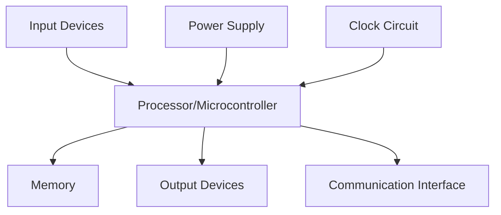
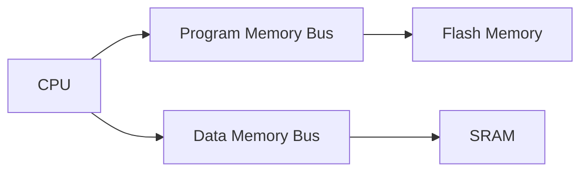
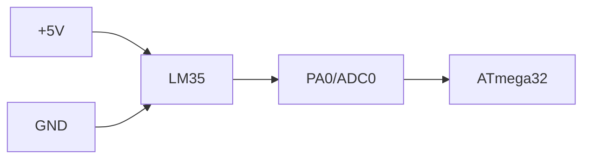
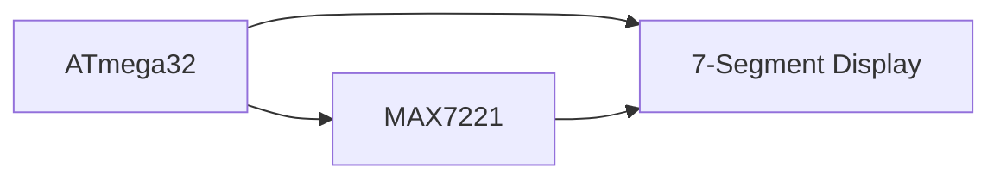
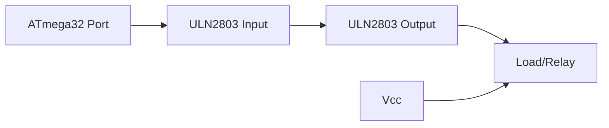
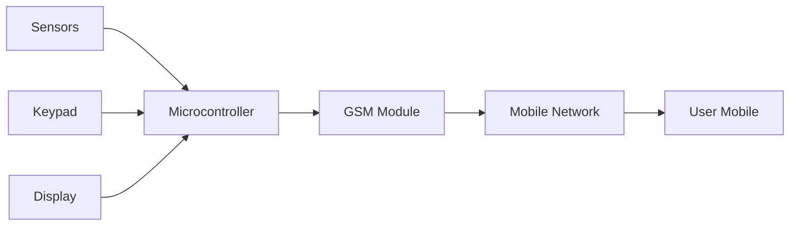
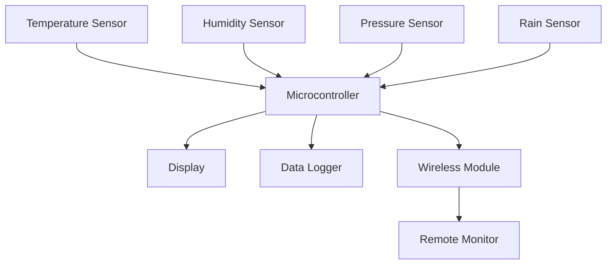

## Question 1(a) [3 marks]

**Draw TIFR register and write its full name.**

**Answer**:

**TIFR Register Diagram:**

```goat
+----+----+----+-----+-----+----+----+----+
| 7  | 6  |  5 |  4  |  3  | 2  | 1  | 0  |
+----+----+----+-----+-----+----+----+----+
|OCF2|TOV2|ICF1|OCF1A|OCF1B|TOV1|OCF0|TOV0|
+----+----+----+-----+-----+----+----+----+
```

**Full Name**: Timer/Counter Interrupt Flag Register

- **TOV0**: Timer0 Overflow Flag
- **OCF0**: Timer0 Output Compare Flag
- **TOV1**: Timer1 Overflow Flag

**Mnemonic:** "Timer Interrupts Flag Register"

## Question 1(b) [4 marks]

**Discuss data memory of ATmega32.**

**Answer**:

| Memory Type | Size | Address Range | Purpose |
|-------------|------|---------------|---------|
| General Purpose Registers | 32 bytes | 0x00-0x1F | R0-R31 registers |
| I/O Memory | 64 bytes | 0x20-0x5F | Control registers |
| Internal SRAM | 2048 bytes | 0x60-0x85F | Variable storage |

- **General Purpose Registers**: Used for arithmetic operations and temporary storage
- **I/O Memory**: Contains peripheral control and status registers
- **Internal SRAM**: Used for stack, variables, and dynamic memory allocation

**Mnemonic:** "General I/O SRAM Memory"

## Question 1(c) [7 marks]

**Draw and explain general block diagram of embedded system.**

**Answer**:



| Component | Function |
|-----------|----------|
| Processor | Controls entire system operation |
| Memory | Stores program and data |
| Input Devices | Sensors, switches, keyboards |
| Output Devices | LEDs, displays, motors |
| Communication | UART, SPI, I2C interfaces |

- **Real-time Operation**: System responds to inputs within defined time limits
- **Dedicated Function**: Designed for specific applications
- **Resource Constraints**: Limited memory, power, and processing capability

**Mnemonic:** "Processor Memory Input Output Communication"

## Question 1(c OR) [7 marks]

**Define real time operating system and explain its characteristics.**

**Answer**:

**Definition**: Real Time Operating System (RTOS) is an operating system that guarantees response within specified time constraints for critical tasks.

| Characteristic | Description |
|----------------|-------------|
| Deterministic | Predictable response times |
| Multitasking | Multiple tasks execution |
| Priority-based | High priority tasks first |
| Minimal Latency | Fast interrupt response |

- **Hard Real-time**: Missing deadline causes system failure
- **Soft Real-time**: Performance degrades if deadline missed
- **Task Scheduling**: Preemptive priority-based scheduling ensures critical tasks run first

**Mnemonic:** "Deterministic Multitasking Priority Minimal"

## Question 2(a) [3 marks]

**Write Criteria for choosing microcontroller for embedded system.**

**Answer**:

| Criteria | Importance |
|----------|------------|
| Processing Speed | Match application requirements |
| Memory Size | Sufficient ROM/RAM |
| I/O Pins | Adequate peripheral interfaces |
| Power Consumption | Battery life consideration |
| Cost | Budget constraints |
| Development Tools | Compiler, debugger availability |

**Mnemonic:** "Speed Memory I/O Power Cost Tools"

## Question 2(b) [4 marks]

**Discuss Harvard Architecture in the AVR.**

**Answer**:

**Harvard Architecture Features:**

| Feature | Description |
|---------|-------------|
| Separate Buses | Program and data have independent buses |
| Simultaneous Access | Can fetch instruction and access data simultaneously |
| Different Memory Types | Flash for program, SRAM for data |



- **Advantage**: Higher performance due to parallel access
- **16-bit Instructions**: Most instructions execute in single clock cycle

**Mnemonic:** "Separate Simultaneous Different Performance"

## Question 2(c) [7 marks]

**Discuss different ways of connecting clock sources to the AVR.**

**Answer**:

| Clock Source | Frequency Range | Application |
|--------------|----------------|-------------|
| External Crystal | 1-16 MHz | High accuracy applications |
| External RC | 1-8 MHz | Cost-effective solution |
| Internal RC | 1-8 MHz | Default, no external components |
| External Clock | Up to 16 MHz | Synchronized systems |

**Clock Selection via Fuse Bits:**

```goat
CKSEL3:0 bits determine clock source
CKDIV8 bit divides clock by 8
SUT1:0 bits set startup time
```

- **Crystal Oscillator**: Most stable, requires external crystal and capacitors
- **RC Oscillator**: Less accurate but cheaper
- **Internal Oscillator**: Factory calibrated, temperature dependent

**Mnemonic:** "Crystal RC Internal External"

## Question 2(a OR) [3 marks]

**Write size of code ROM, SRAM and EEPROM, Number of I/O pins, ADC and Timers for ATmega32.**

**Answer**:

| Specification | ATmega32 |
|---------------|----------|
| Flash ROM | 32 KB |
| SRAM | 2 KB |
| EEPROM | 1 KB |
| I/O Pins | 32 pins |
| ADC Channels | 8 channels |
| Timers | 3 timers |

**Mnemonic:** "32K Flash 2K SRAM 1K EEPROM 32 I/O 8 ADC 3 Timers"

## Question 2(b OR) [4 marks]

**Draw ATmega32 pin diagram and write function of Vcc, AVcc and Aref pin.**

**Answer**:

**Pin Functions:**

| Pin | Function |
|-----|----------|
| Vcc | Main power supply (+5V) |
| AVcc | Analog power supply for ADC |
| Aref | ADC reference voltage |

```goat
        ATmega32
    +--------------+
Vcc-|1           40|-AVcc
    |              |
    |              |
    |              |
    |              |
Aref|32          20|-GND
    +--------------+
```

- **Vcc**: Supplies power to digital circuits
- **AVcc**: Separate supply for ADC to reduce noise
- **Aref**: External reference for ADC conversion

**Mnemonic:** "Vcc Digital AVcc Analog Aref Reference"

## Question 2(c OR) [7 marks]

**Explain AVR status register in detail.**

**Answer**:

**SREG (Status Register) Bits:**

| Bit | Name | Function |
|-----|------|----------|
| 7 | I | Global Interrupt Enable |
| 6 | T | Bit Copy Storage |
| 5 | H | Half Carry Flag |
| 4 | S | Sign Flag |
| 3 | V | Overflow Flag |
| 2 | N | Negative Flag |
| 1 | Z | Zero Flag |
| 0 | C | Carry Flag |

```goat
+---+---+---+---+---+---+---+---+
| I | T | H | S | V | N | Z | C |
+---+---+---+---+---+---+---+---+
  7   6   5   4   3   2   1   0
```

- **I Flag**: Controls global interrupt enable/disable
- **Arithmetic Flags**: C, Z, N, V, S, H updated after ALU operations
- **T Flag**: Used by BLD and BST instructions for bit manipulation

**Mnemonic:** "I Transfer Half Sign oVerflow Negative Zero Carry"

## Question 3(a) [3 marks]

**Explain RESET circuit for the AVR microcontroller.**

**Answer**:

**Reset Sources:**

| Reset Source | Description |
|--------------|-------------|
| Power-on Reset | When power is applied |
| External Reset | Through RESET pin |
| Brown-out Reset | When voltage drops |
| Watchdog Reset | Watchdog timer overflow |

```goat
Vcc ----[R]----+---- RESET pin
               |
               C
               |
              GND
```

- **Reset Duration**: Minimum 2 clock cycles
- **Reset Vector**: Program starts from address 0x0000

**Mnemonic:** "Power External Brown-out Watchdog"

## Question 3(b) [4 marks]

**List I/O registers associated with EEPROM. Write programming steps to write data on EEPROM.**

**Answer**:

**EEPROM Registers:**

| Register | Function |
|----------|----------|
| EEAR | EEPROM Address Register |
| EEDR | EEPROM Data Register |
| EECR | EEPROM Control Register |

**Programming Steps:**

1. Wait for previous write to complete (check EEWE bit)
2. Set address in EEAR register
3. Set data in EEDR register
4. Set EEMWE bit in EECR
5. Set EEWE bit within 4 clock cycles

**Mnemonic:** "Wait Address Data Master-Write Enable-Write"

## Question 3(c) [7 marks]

**Draw and explain TCCR0 register in detail.**

**Answer**:

**TCCR0 (Timer/Counter0 Control Register):**

| Bit | Name | Function |
|-----|------|----------|
| 7 | FOC0 | Force Output Compare |
| 6,3 | WGM01,WGM00 | Waveform Generation Mode |
| 5,4 | COM01,COM00 | Compare Output Mode |
| 2,1,0 | CS02,CS01,CS00 | Clock Select |

```goat
+-----+-----+-----+-----+-----+-----+-----+-----+
|FOC0 |WGM01|COM01|COM00|WGM00|CS02 |CS01 |CS00 |
+-----+-----+-----+-----+-----+-----+-----+-----+
  7     6     5     4     3     2     1     0
```

**Clock Select Options:**

- 000: No clock (Timer stopped)
- 001: clk/1 (No prescaling)
- 010: clk/8, 011: clk/64
- 100: clk/256, 101: clk/1024

**Mnemonic:** "Force Waveform Compare Clock Select"

## Question 3(a OR) [3 marks]

**List registers associated with Timer 1.**

**Answer**:

**Timer1 Registers:**

| Register | Function |
|----------|----------|
| TCCR1A | Timer1 Control Register A |
| TCCR1B | Timer1 Control Register B |
| TCNT1H/L | Timer1 Counter Register |
| OCR1AH/L | Output Compare Register A |
| OCR1BH/L | Output Compare Register B |
| ICR1H/L | Input Capture Register |

**Mnemonic:** "Control Counter Output-Compare Input-Capture"

## Question 3(b OR) [4 marks]

**Write an AVR C program to store 'G' into location 0x005F of EEPROM.**

**Answer**:

```c
#include <avr/io.h>
#include <avr/eeprom.h>

void eeprom_write_byte_custom(uint16_t addr, uint8_t data)
{
    while(EECR & (1<<EEWE));  // Wait for previous write
    EEAR = addr;              // Set address
    EEDR = data;              // Set data
    EECR |= (1<<EEMWE);       // Master write enable
    EECR |= (1<<EEWE);        // Write enable
}

int main()
{
    eeprom_write_byte_custom(0x005F, 'G');
    return 0;
}
```

**Program Steps:**

- Check EEWE bit for completion
- Load address 0x005F into EEAR
- Load 'G' (ASCII 71) into EEDR
- Enable master write, then write enable

**Mnemonic:** "Wait Address Data Master Write"

## Question 3(c OR) [7 marks]

**Write a C program to toggle only the PORTB.4 bit continuously every 70 μs. Use Timer0, Normal mode, and 1:8 prescaler to create the delay. Assume XTAL = 8 MHz.**

**Answer**:

```c
#include <avr/io.h>

int main()
{
    DDRB |= (1<<4);           // Set PB4 as output
    TCCR0 = 0x02;             // Prescaler 1:8
    
    while(1)
    {
        TCNT0 = 186;          // Load initial value
        while(!(TIFR & (1<<TOV0))); // Wait for overflow
        TIFR |= (1<<TOV0);    // Clear flag
        PORTB ^= (1<<4);      // Toggle PB4
    }
    return 0;
}
```

**Calculation:**

- Clock = 8MHz/8 = 1MHz
- For 70μs: Count = 70 cycles
- Initial value = 256-70 = 186

**Mnemonic:** "Direction Control Count Wait Clear Toggle"

## Question 4(a) [3 marks]

**Write an AVR C program to monitor bit 5 of port C. If it is HIGH, send 55H to Port B; otherwise, send AAH to Port B.**

**Answer**:

```c
#include <avr/io.h>

int main()
{
    DDRC &= ~(1<<5);          // PC5 as input
    DDRB = 0xFF;              // Port B as output
    
    while(1)
    {
        if(PINC & (1<<5))     // Check PC5
            PORTB = 0x55;     // Send 55H if HIGH
        else
            PORTB = 0xAA;     // Send AAH if LOW
    }
    return 0;
}
```

**Program Logic:**

- Configure PC5 as input, Port B as output
- Continuously check PC5 status
- Output 0x55 or 0xAA based on input

**Mnemonic:** "Direction Check Output"

## Question 4(b) [4 marks]

**Draw and explain interfacing of LM35 with ATmega32.**

**Answer**:



**Connection Table:**

| LM35 Pin | ATmega32 Pin | Function |
|----------|--------------|----------|
| Vcc | +5V | Power supply |
| Output | PA0 (ADC0) | Analog voltage |
| GND | GND | Ground |

- **Temperature Conversion**: 10mV/°C output
- **ADC Resolution**: 10-bit (0-1023)
- **Voltage Range**: 0V to 5V (0°C to 500°C)

**Mnemonic:** "Power Output Ground Temperature"

## Question 4(c) [7 marks]

**Draw and explain interfacing of MAX7221 with ATmega32.**

**Answer**:



**Connection Table:**

| MAX7221 Pin | ATmega32 Pin | Function |
|-------------|--------------|----------|
| DIN | MOSI (PB5) | Serial data input |
| CLK | SCK (PB7) | Serial clock |
| LOAD | SS (PB4) | Chip select |

**Features:**

- **SPI Interface**: Serial communication protocol
- **8-Digit Display**: Controls up to 8 seven-segment displays
- **Built-in Decoder**: BCD to seven-segment conversion
- **Brightness Control**: 16 intensity levels

**Programming Steps:**

1. Initialize SPI in master mode
2. Send address and data bytes
3. Pulse LOAD signal to latch data

**Mnemonic:** "Serial Clock Load Display"

## Question 4(a OR) [3 marks]

**Write an AVR C program to get a byte of data from Port B, and then send it to Port C.**

**Answer**:

```c
#include <avr/io.h>

int main()
{
    DDRB = 0x00;              // Port B as input
    DDRC = 0xFF;              // Port C as output
    
    uint8_t data;
    
    while(1)
    {
        data = PINB;          // Read from Port B
        PORTC = data;         // Send to Port C
    }
    return 0;
}
```

**Program Function:**

- Configure Port B as input, Port C as output
- Continuously read from PINB and write to PORTC

**Mnemonic:** "Input Output Read Write"

## Question 4(b OR) [4 marks]

**Draw and explain interfacing of ULN2803 with ATmega32.**

**Answer**:



**ULN2803 Features:**

| Feature | Description |
|---------|-------------|
| 8 Darlington Arrays | High current switching |
| Input Current | 500μA typical |
| Output Current | 500mA per channel |
| Built-in Flyback Diodes | Inductive load protection |

- **Application**: Drive relays, motors, solenoids
- **Voltage Drop**: 1.2V typical across Darlington pair
- **Active Low Output**: Output goes low when input is high

**Mnemonic:** "Darlington Current Protection Drive"

## Question 4(c OR) [7 marks]

**Discuss registers used to program SPI in the AVR.**

**Answer**:

**SPI Registers:**

| Register | Bits | Function |
|----------|------|----------|
| SPCR | SPE, DORD, MSTR, CPOL | SPI Control Register |
| SPSR | SPIF, WCOL, SPI2X | SPI Status Register |
| SPDR | - | SPI Data Register |

**SPCR Register Bits:**

- **SPE**: SPI Enable
- **DORD**: Data Order (MSB/LSB first)
- **MSTR**: Master/Slave Select
- **CPOL**: Clock Polarity
- **CPHA**: Clock Phase

**SPSR Register Bits:**

- **SPIF**: SPI Interrupt Flag
- **WCOL**: Write Collision Flag
- **SPI2X**: Double Speed Mode

**Programming Sequence:**

1. Configure SPI pins as input/output
2. Set SPCR register for desired mode
3. Write data to SPDR
4. Wait for SPIF flag
5. Read received data from SPDR

**Mnemonic:** "Control Status Data Enable Order Master"

## Question 5(a) [3 marks]

**Draw and explain pin diagram of L293D motor driver IC.**

**Answer**:

```goat
        L293D
    +-----------+
1EN-|1        16|-Vcc1
1A--|2        15|-4A
1Y--|3        14|-4Y
GND-|4        13|-GND
GND-|5        12|-GND
2Y--|6        11|-3Y
2A--|7        10|-3A
Vcc2|8         9|-2EN
    +-----------+
```

**Pin Functions:**

| Pin | Function |
|-----|----------|
| 1A, 2A | Input signals for Motor 1 |
| 3A, 4A | Input signals for Motor 2 |
| 1Y, 2Y | Output to Motor 1 |
| 3Y, 4Y | Output to Motor 2 |
| 1EN, 2EN | Enable pins for motors |
| Vcc1 | Logic supply (+5V) |
| Vcc2 | Motor supply (+12V) |

**Mnemonic:** "Input Output Enable Logic Motor Supply"

## Question 5(b) [4 marks]

**Draw and explain ADMUX register.**

**Answer**:

**ADMUX (ADC Multiplexer Selection Register):**

| Bit | Name | Function |
|-----|------|----------|
| 7,6 | REFS1,REFS0 | Reference Selection |
| 5 | ADLAR | ADC Left Adjust Result |
| 4-0 | MUX4-MUX0 | Analog Channel Selection |

```goat
+------+------+------+------+------+------+------+------+
|REFS1 |REFS0 |ADLAR | MUX4 | MUX3 | MUX2 | MUX1 | MUX0 |
+------+------+------+------+------+------+------+------+
   7      6      5      4      3      2      1      0
```

**Reference Selection:**

- 00: AREF pin
- 01: AVcc with external capacitor
- 11: Internal 2.56V reference

**Channel Selection:** MUX bits select ADC0-ADC7 channels

**Mnemonic:** "Reference Adjust Multiplexer Channel"

## Question 5(c) [7 marks]

**Explain GSM based security system.**

**Answer**:



**System Components:**

| Component | Function |
|-----------|----------|
| PIR Sensor | Motion detection |
| Door Sensor | Entry detection |
| GSM Module | SMS/Call communication |
| Microcontroller | System control |
| Keypad | User interface |
| Display | Status indication |

**Working Principle:**

1. Sensors detect intrusion
2. Microcontroller processes signal
3. GSM module sends SMS alert
4. User receives notification
5. System can be armed/disarmed remotely

**Features:**

- **Remote Monitoring**: SMS notifications
- **Multiple Sensors**: PIR, door, window sensors
- **User Interface**: LCD display and keypad
- **Emergency Response**: Automatic alert system

**Mnemonic:** "Sensors Process Communicate Alert Control"

## Question 5(a OR) [3 marks]

**Draw circuit diagram to interface DC motor with ATmega32 using L293D motor driver.**

**Answer**:

```goat
ATmega32          L293D           DC Motor
    |               |               |
PA0 -----------> 1A(2)         1Y(3) -----> Motor +
PA1 -----------> 2A(7)         2Y(6) -----> Motor -
PA2 -----------> 1EN(1)
    |               |
   GND ----------> GND(4,5,12,13)
   +5V ----------> Vcc1(16)
   +12V ---------> Vcc2(8)
```

**Connection Table:**

| ATmega32 | L293D | Function |
|----------|-------|----------|
| PA0 | 1A (Pin 2) | Direction control 1 |
| PA1 | 2A (Pin 7) | Direction control 2 |
| PA2 | 1EN (Pin 1) | Motor enable |

**Motor Control:**

- PA0=1, PA1=0: Clockwise rotation
- PA0=0, PA1=1: Counter-clockwise rotation
- PA2=0: Motor stop

**Mnemonic:** "Direction Enable Control Stop"

## Question 5(b OR) [4 marks]

**Draw and explain ADCSRA register.**

**Answer**:

**ADCSRA (ADC Control and Status Register A):**

| Bit | Name | Function |
|-----|------|----------|
| 7 | ADEN | ADC Enable |
| 6 | ADSC | ADC Start Conversion |
| 5 | ADATE | ADC Auto Trigger Enable |
| 4 | ADIF | ADC Interrupt Flag |
| 3 | ADIE | ADC Interrupt Enable |
| 2-0 | ADPS2-ADPS0 | ADC Prescaler Select |

```goat
+-----+-----+-----+-----+-----+-----+-----+-----+
|ADEN |ADSC |ADATE|ADIF |ADIE |ADPS2|ADPS1|ADPS0|
+-----+-----+-----+-----+-----+-----+-----+-----+
  7     6     5     4     3     2     1     0
```

**Prescaler Selection:**

- 000: Division factor 2
- 001: Division factor 2
- 010: Division factor 4
- 011: Division factor 8

**ADC Operation Steps:**

1. Set ADEN to enable ADC
2. Set ADSC to start conversion
3. Wait for ADIF flag
4. Read result from ADCH:ADCL

**Mnemonic:** "Enable Start Auto Interrupt Prescaler"

## Question 5(c OR) [7 marks]

**Explain Weather monitoring system.**

**Answer**:



**System Components:**

| Sensor | Parameter | Interface |
|--------|-----------|-----------|
| LM35 | Temperature | Analog (ADC) |
| DHT11 | Humidity | Digital |
| BMP180 | Pressure | I2C |
| Rain Sensor | Precipitation | Digital |

**Features:**

- **Multi-parameter Monitoring**: Temperature, humidity, pressure, rainfall
- **Data Logging**: Store readings in EEPROM/SD card
- **Real-time Display**: LCD shows current readings
- **Wireless Communication**: WiFi/GSM for remote monitoring
- **Alert System**: Threshold-based warnings

**Applications:**

- Agricultural monitoring
- Weather forecasting
- Environmental research
- Smart home automation

**System Benefits:**

- **Automated Data Collection**: Continuous monitoring
- **Remote Access**: View data from anywhere
- **Historical Analysis**: Trend identification
- **Early Warning**: Extreme weather alerts

**Mnemonic:** "Temperature Humidity Pressure Rain Display Log Wireless"
