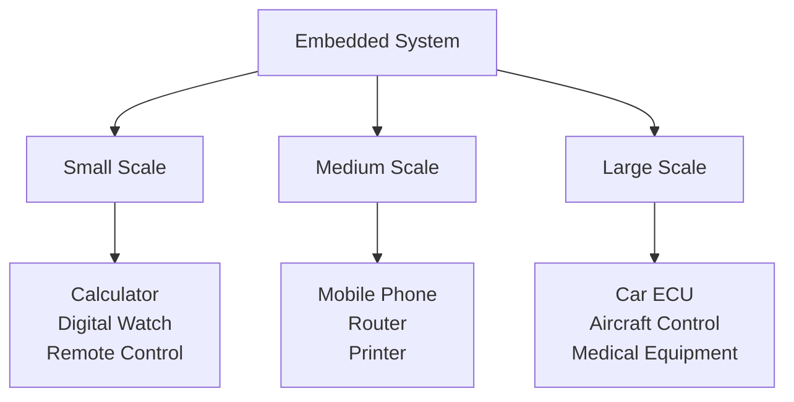
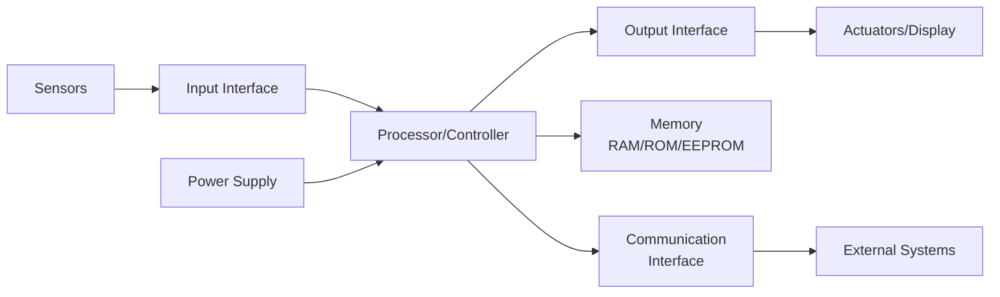
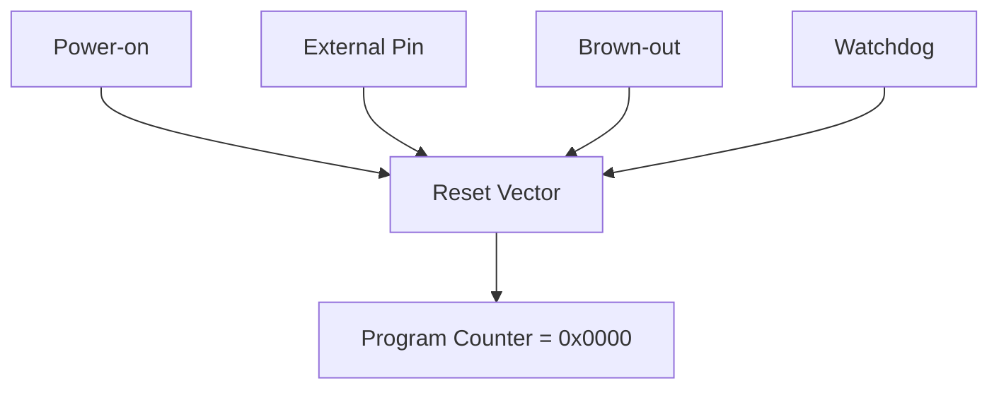
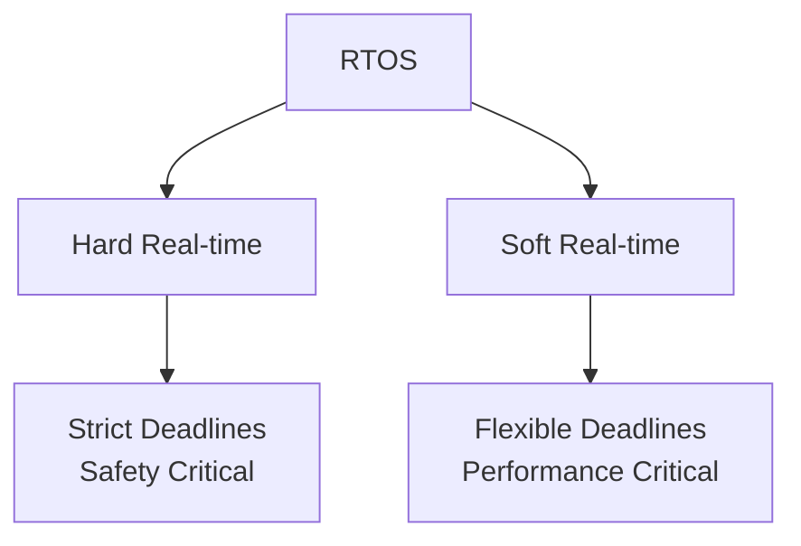
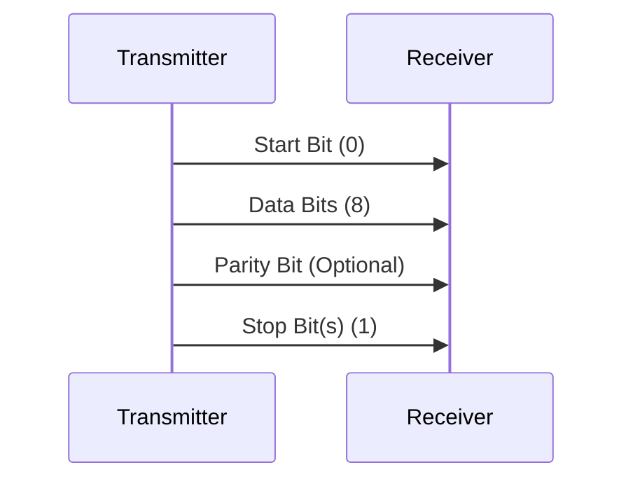
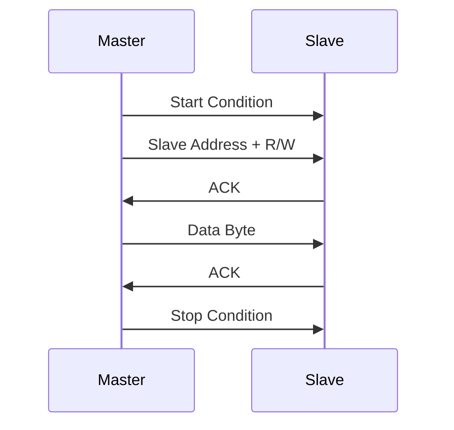
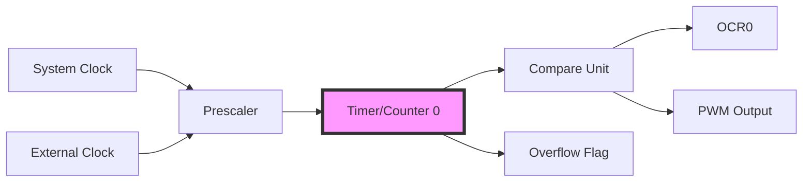
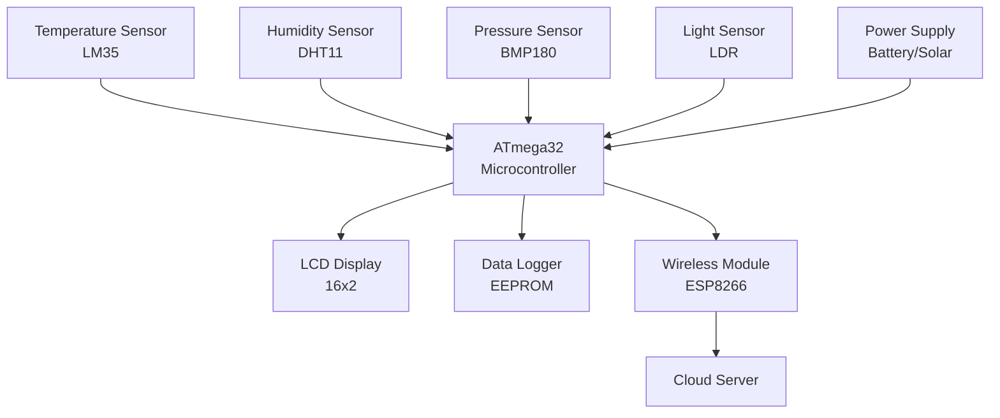
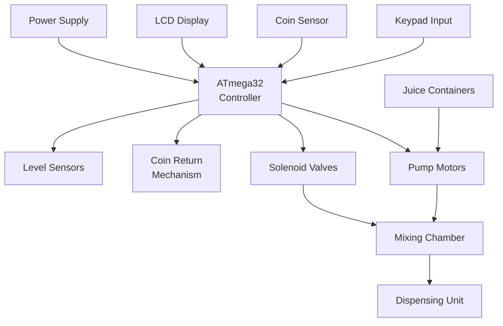

## પ્રશ્ન 1(અ) [3 ગુણ]

**ATmega32 ની વિશેષતાઓ લખો.**

**જવાબ**:

| વિશેષતા | વર્ણન |
|---------|-------------|
| **આર્કિટેક્ચર** | 8-bit RISC પ્રોસેસર |
| **મેમરી** | 32KB ફ્લેશ, 2KB SRAM, 1KB EEPROM |
| **I/O પોર્ટ્સ** | 32 પ્રોગ્રામેબલ I/O પિન્સ |
| **ટાઇમર્સ** | 3 ટાઇમર્સ (Timer0, Timer1, Timer2) |
| **ADC** | 10-bit, 8-channel ADC |
| **કમ્યુનિકેશન** | USART, SPI, I2C (TWI) |

- **હાઇ પર્ફોર્મન્સ**: 16MHz પર 16 MIPS
- **લો પાવર**: બહુવિધ સ્લીપ મોડ્સ
- **ઓપરેટિંગ વોલ્ટેજ**: 2.7V થી 5.5V

**મેમરી ટ્રીક:** "ARM-TIC" (Architecture-RISC, Memory-32KB, Timers-3, I/O-32pins, Communication-3types)

---

## પ્રશ્ન 1(બ) [4 ગુણ]

**માઇક્રોકંટ્રોલર પસંદ કરવા માટેના માપદંડો લખી સમજાવો.**

**જવાબ**:

| માપદંડ | વિચારણા |
|----------|---------------|
| **પર્ફોર્મન્સ** | સ્પીડ, ઇન્સ્ટ્રક્શન સેટ, આર્કિટેક્ચર |
| **મેમરી** | RAM, ROM, EEPROM આવશ્યકતાઓ |
| **I/O જરૂરિયાતો** | પિન્સની સંખ્યા, સ્પેશિયલ ફંક્શન્સ |
| **પાવર કન્ઝમ્પશન** | બેટરી લાઇફ, સ્લીપ મોડ્સ |
| **કિંમત** | યુનિટ પ્રાઇસ, ડેવલપમેન્ટ કોસ્ટ |
| **ડેવલપમેન્ટ ટૂલ્સ** | કમ્પાઇલર, ડીબગર ઉપલબ્ધતા |

- **એપ્લિકેશન જરૂરિયાતો**: રિયલ-ટાઇમ કન્સ્ટ્રેઇન્ટ્સ, પ્રોસેસિંગ નીડ્સ
- **પેકેજ સાઇઝ**: ફાઇનલ પ્રોડક્ટમાં સ્પેસ લિમિટેશન્સ
- **પેરિફેરલ સપોર્ટ**: ADC, ટાઇમર્સ, કમ્યુનિકેશન ઇન્ટરફેસ

**મેમરી ટ્રીક:** "PM-IPCD" (Performance, Memory, I/O, Power, Cost, Development)

---

## પ્રશ્ન 1(ક) [7 ગુણ]

**Embedded System ને વ્યાખ્યાયિત કરો. નાના, મધ્યમ અને વિશાળ Embedded System ની ઉપયોગિતાની યાદી બનાવો.**

**જવાબ**:

**વ્યાખ્યા**: Embedded System એ મોટા યાંત્રિક અથવા ઇલેક્ટ્રિકલ સિસ્ટમમાં ચોક્કસ કામ કરતું કમ્પ્યુટર સિસ્ટમ છે, જે વિશિષ્ટ કામો રિયલ-ટાઇમ મર્યાદા સાથે કરવા માટે ડિઝાઇન કરવામાં આવે છે.

**એપ્લિકેશન ટેબલ**:

| સિસ્ટમ પ્રકાર | મેમરી સાઇઝ | એપ્લિકેશન્સ |
|-------------|-------------|--------------|
| **નાના સ્કેલ** | <64KB | કેલ્ક્યુલેટર, ડિજિટલ વોચ, રમકડાં |
| **મધ્યમ સ્કેલ** | 64KB-1MB | મોબાઇલ ફોન, રાઉટર, પ્રિન્ટર |
| **વિશાળ સ્કેલ** | >1MB | ઓટોમોબાઇલ, એરક્રાફ્ટ સિસ્ટમ, સેટેલાઇટ |



**લાક્ષણિકતાઓ**:

- **રિયલ-ટાઇમ ઓપરેશન**: પ્રિડિક્ટેબલ રિસ્પોન્સ ટાઇમ
- **રિસોર્સ કન્સ્ટ્રેઇન્ટ્સ**: મર્યાદિત મેમરી અને પ્રોસેસિંગ પાવર
- **ડેડિકેટેડ ફંક્શનાલિટી**: સિંગલ-પર્પઝ ડિઝાઇન

**મેમરી ટ્રીક:** "SML-CMP" (Small-Calculator/Medium-Mobile/Large-Lifesupport)

---

## પ્રશ્ન 1(ક) OR [7 ગુણ]

**Embedded system નો સામાન્ય બ્લોક ડાયાગ્રામ દોરી સમજાવો.**

**જવાબ**:



**બ્લોક ફંક્શન્સ**:

| બ્લોક | કાર્ય |
|-------|----------|
| **પ્રોસેસર** | સેન્ટ્રલ પ્રોસેસિંગ યુનિટ (CPU/MCU) |
| **ઇનપુટ ઇન્ટરફેસ** | સેન્સર ડેટા એક્વિઝિશન, યુઝર ઇનપુટ |
| **આઉટપુટ ઇન્ટરફેસ** | એક્ચ્યુએટર કંટ્રોલ, ડિસ્પ્લે આઉટપુટ |
| **મેમરી** | પ્રોગ્રામ સ્ટોરેજ, ડેટા સ્ટોરેજ |
| **કમ્યુનિકેશન** | બાહ્ય સિસ્ટમ કનેક્ટિવિટી |

- **ઇનપુટ પ્રોસેસિંગ**: ADC, ડિજિટલ ઇનપુટ કન્ડિશનિંગ
- **આઉટપુટ કંટ્રોલ**: PWM, રિલે ડ્રાઇવર્સ, LED ડિસ્પ્લે
- **પાવર મેનેજમેન્ટ**: વોલ્ટેજ રેગ્યુલેશન, પાવર ઓપ્ટિમાઇઝેશન

**મેમરી ટ્રીક:** "PIOMCP" (Processor, Input, Output, Memory, Communication, Power)

---

## પ્રશ્ન 2(અ) [3 ગુણ]

**EEPROM નું પૂરું નામ લખો અને તેના વિશે સમજાવો.**

**જવાબ**:

**પૂરું નામ**: Electrically Erasable Programmable Read-Only Memory

**EEPROM રજિસ્ટર્સ**:

| રજિસ્ટર | કાર્ય |
|----------|----------|
| **EEAR** | EEPROM Address Register |
| **EEDR** | EEPROM Data Register |
| **EECR** | EEPROM Control Register |

- **EEAR**: EEPROM એક્સેસ માટે 10-bit એડ્રેસ (0-1023) હોલ્ડ કરે છે
- **EEDR**: રીડ/રાઇટ ઓપરેશન માટે ડેટા રજિસ્ટર
- **EECR**: કંટ્રોલ બિટ્સ - EERE (Read Enable), EEWE (Write Enable)

**મેમરી ટ્રીક:** "AAD-CRE" (Address-EEAR, Data-EEDR, Control-EECR)

---

## પ્રશ્ન 2(બ) [4 ગુણ]

**ATmega32માં રીસેટ સર્કિટ વિશે સમજાવો.**

**જવાબ**:

**રીસેટ સોર્સ ટેબલ**:

| રીસેટ પ્રકાર | ટ્રિગર કન્ડિશન |
|------------|-------------------|
| **પાવર-ઓન રીસેટ** | VCC થ્રેશહોલ્ડ ઉપર વધે છે |
| **એક્સટર્નલ રીસેટ** | RESET પિન લો પુલ કરવામાં આવે છે |
| **બ્રાઉન-આઉટ રીસેટ** | VCC થ્રેશહોલ્ડ નીચે પડે છે |
| **વોચડોગ રીસેટ** | વોચડોગ ટાઇમર ઓવરફ્લો |



- **રીસેટ ડ્યુરેશન**: મિનિમમ 2 ક્લોક સાઇકલ્સ
- **રીસેટ વેક્ટર**: પ્રોગ્રામ એક્ઝિક્યુશન એડ્રેસ 0x0000 થી શરૂ થાય છે
- **હાર્ડવેર કનેક્શન**: એક્સટર્નલ રીસેટ માટે પુલ-અપ રેઝિસ્ટર જરૂરી

**મેમરી ટ્રીક:** "PEBW" (Power-on, External, Brown-out, Watchdog)

---

## પ્રશ્ન 2(ક) [7 ગુણ]

**રિયલ ટાઇમ ઓપરેટિંગ સિસ્ટમની વ્યાખ્યા આપો અને તેની લાક્ષણિકતાઓ સમજાવો.**

**જવાબ**:

**વ્યાખ્યા**: રિયલ ટાઇમ ઓપરેટિંગ સિસ્ટમ (RTOS) એ એવું ઓપરેટિંગ સિસ્ટમ છે જે કડક ટાઇમિંગ કન્સ્ટ્રેઇન્ટ્સ અને પ્રિડિક્ટેબલ રિસ્પોન્સ ટાઇમ સાથે રિયલ-ટાઇમ એપ્લિકેશન્સ હેન્ડલ કરવા માટે ડિઝાઇન કરવામાં આવે છે.

**લાક્ષણિકતાઓ ટેબલ**:

| લાક્ષણિકતા | વર્ણન |
|----------------|-------------|
| **ડિટર્મિનિસ્ટિક** | પ્રિડિક્ટેબલ એક્ઝિક્યુશન ટાઇમ |
| **પ્રીએમ્પ્ટિવ** | હાઇ પ્રાયોરિટી ટાસ્ક લો પ્રાયોરિટીને ઇન્ટરપ્ટ કરે છે |
| **મલ્ટિટાસ્કિંગ** | મલ્ટિપલ ટાસ્ક એક્ઝિક્યુશન |
| **ફાસ્ટ રિસ્પોન્સ** | મિનિમલ ઇન્ટરપ્ટ લેટન્સી |
| **પ્રાયોરિટી-બેસ્ડ** | પ્રાયોરિટી આધારિત ટાસ્ક શિડ્યુલિંગ |
| **રિસોર્સ મેનેજમેન્ટ** | એફિશિયન્ટ મેમરી અને CPU ઉપયોગ |



- **ટાસ્ક શિડ્યુલિંગ**: રાઉન્ડ-રોબિન, પ્રાયોરિટી-બેસ્ડ અલ્ગોરિધમ્સ
- **ઇન્ટર-ટાસ્ક કમ્યુનિકેશન**: સેમાફોર્સ, મેસેજ ક્યુ
- **મેમરી મેનેજમેન્ટ**: પ્રિડિક્ટેબિલિટી માટે સ્ટેટિક એલોકેશન

**મેમરી ટ્રીક:** "DPM-FPR" (Deterministic, Preemptive, Multitasking, Fast, Priority, Resource)

---

## પ્રશ્ન 2(અ) OR [3 ગુણ]

**AVR ફેમિલી વિશે સમજાવો.**

**જવાબ**:

**AVR ફેમિલી વર્ગીકરણ**:

| AVR પ્રકાર | વિશેષતાઓ |
|----------|----------|
| **ATtiny** | 8-32 પિન્સ, બેસિક ફીચર્સ |
| **ATmega** | 28-100 પિન્સ, ફુલ ફીચર્સ |
| **ATxmega** | એડવાન્સ ફીચર્સ, DMA |

- **આર્કિટેક્ચર**: 8-bit RISC, હાર્વર્ડ આર્કિટેક્ચર
- **ઇન્સ્ટ્રક્શન સેટ**: 130+ ઇન્સ્ટ્રક્શન્સ, સિંગલ સાઇકલ એક્ઝિક્યુશન
- **મેમરી**: ફ્લેશ પ્રોગ્રામ મેમરી, SRAM, EEPROM

**મેમરી ટ્રીક:** "TAX" (Tiny-basic, mega-full, Xmega-advanced)

---

## પ્રશ્ન 2(બ) OR [4 ગુણ]

**ATmega32માં ક્લોક સોર્સની પસંદગી માટે ફ્યૂઝ બિટ્સનું મહત્વ સમજાવો.**

**જવાબ**:

**ક્લોક સોર્સ સિલેક્શન**:

| ફ્યૂઝ બિટ્સ | ક્લોક સોર્સ |
|-----------|--------------|
| **CKSEL3:0** | ક્લોક સોર્સ સિલેક્શન |
| **SUT1:0** | સ્ટાર્ટ-અપ ટાઇમ સિલેક્શન |

**ક્લોક ઓપ્શન્સ ટેબલ**:

| CKSEL મૂલ્ય | ક્લોક સોર્સ | ફ્રીક્વન્સી |
|-------------|--------------|-----------|
| 0001 | એક્સટર્નલ ક્રિસ્ટલ | 1-8 MHz |
| 0010 | એક્સટર્નલ ક્રિસ્ટલ | 8+ MHz |
| 0100 | ઇન્ટર્નલ RC | 8 MHz |
| 0000 | એક્સટર્નલ ક્લોક | યુઝર ડિફાઇન્ડ |

- **ક્રિસ્ટલ સિલેક્શન**: એક્સટર્નલ ક્રિસ્ટલ અને કૅપેસિટર જરૂરી
- **RC ઓસિલેટર**: બિલ્ટ-ઇન, ઓછું એક્યુરેટ પણ સુવિધાજનક
- **સ્ટાર્ટ-અપ ટાઇમ**: ક્રિસ્ટલ સ્ટેબિલાઇઝેશનની મંજૂરી આપે છે

**મેમરી ટ્રીક:** "CRIS" (Crystal, RC, Internal, Start-up)

---

## પ્રશ્ન 2(ક) OR [7 ગુણ]

**ATmega32નો પિન ડાયાગ્રામ દોરી MISO, MOSI, SCK &AREF Pin નું કાર્ય સમજાવો.**

**જવાબ**:

```goat
        +----------+
    PB0 |1      40| PA0
    PB1 |2      39| PA1  
    PB2 |3      38| PA2
    PB3 |4      37| PA3
    PB4 |5      36| PA4
MOSI PB5|6      35| PA5
MISO PB6|7      34| PA6
 SCK PB7|8      33| PA7
   RESET|9      32| AREF
    VCC |10     31| GND
    GND |11     30| AVCC
   XTAL2|12     29| PC7
   XTAL1|13     28| PC6
        +----------+
```

**પિન ફંક્શન્સ ટેબલ**:

| પિન | કાર્ય | વર્ણન |
|-----|----------|-------------|
| **MOSI** | Master Out Slave In | માસ્ટરથી સ્લેવમાં SPI ડેટા આઉટપુટ |
| **MISO** | Master In Slave Out | સ્લેવથી માસ્ટરમાં SPI ડેટા ઇનપુટ |
| **SCK** | Serial Clock | SPI ક્લોક સિગ્નલ |
| **AREF** | Analog Reference | ADC રેફરન્સ વોલ્ટેજ |

- **SPI કમ્યુનિકેશન**: MOSI, MISO, SCK મળીને સીરિયલ ડેટા ટ્રાન્સફર માટે કામ કરે છે
- **ADC રેફરન્સ**: AREF, ADC કન્વર્ઝન માટે સ્થિર વોલ્ટેજ રેફરન્સ પ્રદાન કરે છે
- **પિન મલ્ટિપ્લેક્સિંગ**: આ પિન્સ GPIO તરીકે વૈકલ્પિક કાર્યો ધરાવે છે

**મેમરી ટ્રીક:** "MMS-A" (MOSI-out, MISO-in, SCK-clock, AREF-reference)

---

## પ્રશ્ન 3(અ) [3 ગુણ]

**ATmega32 માં DDR I/O રજિસ્ટરની ભૂમિકા સમજાવો.**

**જવાબ**:

**DDR (Data Direction Register) કાર્યો**:

| બિટ મૂલ્ય | પિન કન્ફિગરેશન |
|-----------|-------------------|
| **0** | ઇનપુટ પિન |
| **1** | આઉટપુટ પિન |

- **પોર્ટ કંટ્રોલ**: દરેક પોર્ટનું અનુરૂપ DDR (DDRA, DDRB, DDRC, DDRD) છે
- **બિટ-વાઇઝ કંટ્રોલ**: વ્યક્તિગત પિન દિશા કંટ્રોલ
- **ડિફોલ્ટ સ્થિતિ**: રીસેટ પછી બધા પિન્સ ઇનપુટ (DDR = 0x00)

**કોડ ઉદાહરણ**:

```c
DDRA = 0xFF;  // બધા Port A પિન્સ આઉટપુટ તરીકે
DDRB = 0x0F;  // PB0-PB3 આઉટપુટ, PB4-PB7 ઇનપુટ
```

**મેમરી ટ્રીક:** "DDR-IO" (Data Direction Register controls Input/Output)

---

## પ્રશ્ન 3(બ) [4 ગુણ]

**Port B પરથી ડેટાને રીડ કરાવી Port C પર મોકલવા માટેનો AVR C પ્રોગ્રામ લખો.**

**જવાબ**:

```c
#include <avr/io.h>

int main(void)
{
    unsigned char data;
    
    // Port B ને ઇનપુટ તરીકે કન્ફિગર કરો
    DDRB = 0x00;
    
    // Port C ને આઉટપુટ તરીકે કન્ફિગર કરો 
    DDRC = 0xFF;
    
    while(1)
    {
        // Port B થી ડેટા રીડ કરો
        data = PINB;
        
        // Port C પર ડેટા મોકલો
        PORTC = data;
    }
    
    return 0;
}
```

**પ્રોગ્રામ સમજૂતી**:

- **DDRB = 0x00**: બધા Port B પિન્સને ઇનપુટ તરીકે સેટ કરે છે
- **DDRC = 0xFF**: બધા Port C પિન્સને આઉટપુટ તરીકે સેટ કરે છે
- **PINB**: Port B પિન્સની વર્તમાન સ્થિતિ રીડ કરે છે
- **PORTC**: Port C આઉટપુટ પિન્સ પર ડેટા લખે છે

**મેમરી ટ્રીક:** "RSTO" (Read-PINB, Set-DDR, Transfer-data, Output-PORTC)

---

## પ્રશ્ન 3(ક) [7 ગુણ]

**PORT B ના પિન નં 1 પર ડોર સેન્સર જોડાયેલ છે અને PORT C ના પિન નં 7 પર LED જોડાયેલ છે. દરવાજા ઉપર લાગેલા સેન્સરને મોનિટર કરતાં રહો અને જ્યારે દરવાજો ખુલે ત્યારે LED ચાલુ થાય તે માટેનો AVR C પ્રોગ્રામ લખો.**

**જવાબ**:

```c
#include <avr/io.h>

int main(void)
{
    // PB1 ને ઇનપુટ તરીકે કન્ફિગર કરો (ડોર સેન્સર)
    DDRB &= ~(1<<1);  // બિટ 1 ક્લિયર કરો
    
    // PC7 ને આઉટપુટ તરીકે કન્ફિગર કરો (LED)
    DDRC |= (1<<7);   // બિટ 7 સેટ કરો
    
    // PB1 માટે પુલ-અપ એનેબલ કરો
    PORTB |= (1<<1);
    
    while(1)
    {
        // ડોર સેન્સરની સ્થિતિ ચેક કરો
        if(PINB & (1<<1))
        {
            // દરવાજો બંધ - LED બંધ કરો
            PORTC &= ~(1<<7);
        }
        else
        {
            // દરવાજો ખુલ્લો - LED ચાલુ કરો
            PORTC |= (1<<7);
        }
    }
    
    return 0;
}
```

**હાર્ડવેર કનેક્શન**:

- **ડોર સેન્સર**: PB1 અને GND વચ્ચે જોડાયેલ
- **LED**: કરન્ટ લિમિટિંગ રેઝિસ્ટર દ્વારા PC7 સાથે જોડાયેલ
- **પુલ-અપ**: PB1 માટે ઇન્ટર્નલ પુલ-અપ એનેબલ

**પ્રોગ્રામ લોજિક**:

- **સેન્સર બંધ**: PB1 = HIGH, LED OFF
- **સેન્સર ખુલ્લું**: PB1 = LOW, LED ON

**મેમરી ટ્રીક:** "DCOL" (Door-sensor, Configure-pins, Open-check, LED-control)

---

## પ્રશ્ન 3(અ) OR [3 ગુણ]

**AVR C પ્રોગ્રામ ના ડેટા ટાઇપની ચર્ચા કરો.**

**જવાબ**:

**AVR C ડેટા ટાઇપ્સ ટેબલ**:

| ડેટા ટાઇપ | સાઇઝ | રેન્જ |
|-----------|------|-------|
| **char** | 8-bit | -128 થી 127 |
| **unsigned char** | 8-bit | 0 થી 255 |
| **int** | 16-bit | -32768 થી 32767 |
| **unsigned int** | 16-bit | 0 થી 65535 |
| **long** | 32-bit | -2³¹ થી 2³¹-1 |
| **float** | 32-bit | IEEE 754 ફોર્મેટ |

- **મેમરી એફિશિયન્સી**: સૌથી નાનો યોગ્ય ડેટા ટાઇપ વાપરો
- **અનસાઇન્ડ ટાઇપ્સ**: ફક્ત પોઝિટિવ વેલ્યુ માટે, રેન્જ બમાવે છે
- **બિટ ફિલ્ડ્સ**: સ્પેસિફિક બિટ-વિડ્થ વેરિએબલ્સ ડિફાઇન કરી શકાય છે

**મેમરી ટ્રીક:** "CIL-FUB" (Char-8bit, Int-16bit, Long-32bit, Float-32bit, Unsigned-positive, Bit-specific)

---

## પ્રશ્ન 3(બ) OR [4 ગુણ]

**સિરિયલ કોમ્યુનિકેશન પ્રોટોકોલ સમજાવો.**

**જવાબ**:

**સિરિયલ કોમ્યુનિકેશન પેરામીટર્સ**:

| પેરામીટર | વર્ણન |
|-----------|-------------|
| **બોડ રેટ** | ડેટા ટ્રાન્સમિશન સ્પીડ (બિટ્સ/સેકન્ડ) |
| **ડેટા બિટ્સ** | ડેટા બિટ્સની સંખ્યા (5-9) |
| **પેરિટી** | એરર ચેકિંગ (None, Even, Odd) |
| **સ્ટોપ બિટ્સ** | ફ્રેમના અંતનું માર્કર (1 અથવા 2) |



- **એસિંક્રોનસ**: કોઈ ક્લોક સિગ્નલ નથી, સ્ટાર્ટ/સ્ટોપ બિટ્સ વાપરે છે
- **RS232 સ્ટાન્ડર્ડ**: ±12V લેવલ્સ, TTL લેવલ્સમાં કન્વર્ટ થાય છે
- **સામાન્ય બોડ રેટ્સ**: 9600, 19200, 38400, 115200

**મેમરી ટ્રીક:** "BDPS" (Baud-rate, Data-bits, Parity-check, Stop-bits)

---

## પ્રશ્ન 3(ક) OR [7 ગુણ]

**Port B ના પિન નં. 0 અને પિન નં. 1 ને રીડ કરી નીચે આપેલા ટેબલ પ્રમાણે ASCII કેરેક્ટર Port D પર મોકલાવા માટેનો AVR C પ્રોગ્રામ લખો**

**જવાબ**:

```c
#include <avr/io.h>

int main(void)
{
    unsigned char input;
    
    // PB1 અને PB0 ને ઇનપુટ તરીકે કન્ફિગર કરો
    DDRB &= ~((1<<1)|(1<<0));
    
    // Port D ને આઉટપુટ તરીકે કન્ફિગર કરો
    DDRD = 0xFF;
    
    // PB1 અને PB0 માટે પુલ-અપ એનેબલ કરો
    PORTB |= (1<<1)|(1<<0);
    
    while(1)
    {
        // PB1 અને PB0 રીડ કરો
        input = PINB & 0x03;  // અન્ય બિટ્સ માસ્ક કરો
        
        switch(input)
        {
            case 0x00:  // Pin1=0, Pin0=0
                PORTD = '0';  // ASCII '0' = 0x30
                break;
                
            case 0x01:  // Pin1=0, Pin0=1
                PORTD = '1';  // ASCII '1' = 0x31
                break;
                
            case 0x02:  // Pin1=1, Pin0=0
                PORTD = '2';  // ASCII '2' = 0x32
                break;
                
            case 0x03:  // Pin1=1, Pin0=1
                PORTD = '3';  // ASCII '3' = 0x33
                break;
        }
    }
    
    return 0;
}
```

**ટ્રુથ ટેબલ અમલીકરણ**:

| Pin1 | Pin0 | ઇનપુટ મૂલ્ય | ASCII આઉટપુટ |
|------|------|-------------|--------------|
| 0 | 0 | 0x00 | '0' (0x30) |
| 0 | 1 | 0x01 | '1' (0x31) |
| 1 | 0 | 0x02 | '2' (0x32) |
| 1 | 1 | 0x03 | '3' (0x33) |

**મેમરી ટ્રીક:** "MATS" (Mask-inputs, ASCII-conversion, Truth-table, Switch-case)

---

## પ્રશ્ન 4(અ) [3 ગુણ]

**ATmega32 સાથે રિલે ડ્રાઇવર ULN2803નું ઇન્ટરફેસિંગ ડાયાગ્રામ દોરો.**

**જવાબ**:

```goat
ATmega32          ULN2803         Relay
                                 
PC0 ------>|1    18|-----------> +12V
PC1 ------>|2    17|    
PC2 ------>|3    16|    
PC3 ------>|4    15|    
PC4 ------>|5    14|    
PC5 ------>|6    13|    
PC6 ------>|7    12|    
PC7 ------>|8    11|    
           |9    10|-----------> GND
           ULN2803    
                       
    COM1 of Relay connected to +12V
    NO1 of Relay connected to Load
    GND common for all
```

**કોમ્પોનન્ટ ફંક્શન્સ**:

- **ULN2803**: ડાર્લિંગ્ટન ટ્રાન્ઝિસ્ટર એરે, કરન્ટ એમ્પ્લિફિકેશન
- **પ્રોટેક્શન ડાયોડ્સ**: ઇન્ડક્ટિવ લોડ્સ માટે બિલ્ટ-ઇન ફ્લાયબેક ડાયોડ્સ
- **રિલે કોઇલ**: 12V જરૂરી, ULN2803 આઉટપુટ દ્વારા કંટ્રોલ

**મેમરી ટ્રીક:** "UPC" (ULN-driver, Port-control, Current-amplify)

---

## પ્રશ્ન 4(બ) [4 ગુણ]

**પોલિંગ મેથડથી A/D કન્વર્ટરને પ્રોગ્રામ કરવા માટેના સ્ટેપ્સ લખો.**

**જવાબ**:

**ADC પ્રોગ્રામિંગ સ્ટેપ્સ**:

| સ્ટેપ | ક્રિયા |
|------|--------|
| **1** | ADMUX રજિસ્ટર કન્ફિગર કરો (રેફરન્સ, ચેનલ) |
| **2** | ADCSRA રજિસ્ટર કન્ફિગર કરો (એનેબલ, પ્રીસ્કેલર) |
| **3** | કન્વર્ઝન સ્ટાર્ટ કરો (ADSC બિટ સેટ કરો) |
| **4** | કન્વર્ઝન પૂર્ણ થવાની રાહ જુઓ (ADIF ફ્લેગ પોલ કરો) |
| **5** | ADCL અને ADCH થી પરિણામ રીડ કરો |

**કોડ અમલીકરણ**:

```c
// સ્ટેપ 1: ADMUX કન્ફિગર કરો
ADMUX = (1<<REFS0);  // AVCC રેફરન્સ, ચેનલ 0

// સ્ટેપ 2: પ્રીસ્કેલર સાથે ADC એનેબલ કરો
ADCSRA = (1<<ADEN)|(1<<ADPS2)|(1<<ADPS1)|(1<<ADPS0);

// સ્ટેપ 3: કન્વર્ઝન સ્ટાર્ટ કરો
ADCSRA |= (1<<ADSC);

// સ્ટેપ 4: પૂર્ણતાની રાહ જુઓ
while(!(ADCSRA & (1<<ADIF)));

// સ્ટેપ 5: પરિણામ રીડ કરો
result = ADC;  // ADCL અને ADCH નું સંયોજન
```

**મેમરી ટ્રીક:** "CCSWR" (Configure-ADMUX, Configure-ADCSRA, Start-conversion, Wait-complete, Read-result)

---

## પ્રશ્ન 4(ક) [7 ગુણ]

**I2C 2 વાયર સિરિયલ ઇન્ટરફેસ પ્રોટોકોલ વિસ્તારવાર સમજાવો**

**જવાબ**:

**I2C પ્રોટોકોલ ફીચર્સ**:

| ફીચર | વર્ણન |
|---------|-------------|
| **બે વાયર** | SDA (ડેટા) અને SCL (ક્લોક) |
| **મલ્ટિ-માસ્ટર** | બહુવિધ માસ્ટર બસ કંટ્રોલ કરી શકે છે |
| **એડ્રેસિંગ** | 7-bit અથવા 10-bit ડિવાઇસ એડ્રેસ |
| **બાઇડાયરેક્શનલ** | બંને દિશામાં ડેટા ફ્લો |



**I2C ફ્રેમ સ્ટ્રક્ચર**:

- **સ્ટાર્ટ કન્ડિશન**: SCL હાઇ હોય ત્યારે SDA લો જાય છે
- **એડ્રેસ ફ્રેમ**: 7-bit એડ્રેસ + R/W બિટ
- **ડેટા ફ્રેમ**: 8-bit ડેટા + ACK/NACK
- **સ્ટોપ કન્ડિશન**: SCL હાઇ હોય ત્યારે SDA હાઇ જાય છે

**ATmega32 માં TWI રજિસ્ટર્સ**:

| રજિસ્ટર | કાર્ય |
|----------|----------|
| **TWCR** | કંટ્રોલ અને સ્ટેટસ |
| **TWDR** | ડેટા રજિસ્ટર |
| **TWAR** | એડ્રેસ રજિસ્ટર |
| **TWSR** | સ્ટેટસ રજિસ્ટર |

- **ક્લોક સ્ટ્રેચિંગ**: સ્લેવ માસ્ટરને ધીરે કરવા માટે SCL લો હોલ્ડ કરી શકે છે
- **આર્બિટ્રેશન**: મલ્ટિ-માસ્ટર સિસ્ટમ્સમાં કોલિઝન અટકાવે છે
- **પુલ-અપ રેઝિસ્ટર્સ**: SDA અને SCL બંને લાઇન્સ પર જરૂરી (સામાન્ય રીતે 4.7kΩ)

**મેમરી ટ્રીક:** "SAD-CSA" (Start-Address-Data, Control-Status-Address)

---

## પ્રશ્ન 4(અ) OR [3 ગુણ]

**8-બિટ ટાઇમરનો ઉપયોગ કરી DC મોટરની સ્પીડ કંટ્રોલ કરવા માટે કોઈ પણ એક PWM મોડ સમજાવો.**

**જવાબ**:

**ફાસ્ટ PWM મોડ (મોડ 3)**:

| પેરામીટર | મૂલ્ય |
|-----------|-------|
| **WGM બિટ્સ** | WGM01=1, WGM00=1 |
| **TOP મૂલ્ય** | 0xFF (255) |
| **રેઝોલ્યુશન** | 8-bit |
| **ફ્રીક્વન્સી** | fclk/(256×prescaler) |

**PWM કન્ફિગરેશન**:

```c
// ફાસ્ટ PWM માટે Timer0 કન્ફિગર કરો
TCCR0 = (1<<WGM01)|(1<<WGM00)|(1<<COM01)|(1<<CS01);

// ડ્યુટી સાઇકલ સેટ કરો (0-255)
OCR0 = 128;  // 50% ડ્યુટી સાઇકલ
```


- **ડ્યુટી સાઇકલ કંટ્રોલ**: OCR0 મૂલ્ય મોટરની સ્પીડ નક્કી કરે છે
- **નોન-ઇન્વર્ટિંગ મોડ**: હાઇ પલ્સ વિડ્થ = OCR0/255
- **મોટર કંટ્રોલ**: વધારે ડ્યુટી સાઇકલ = વધારે સ્પીડ

**મેમરી ટ્રીક:** "FTO" (Fast-PWM, Timer0, OCR0-control)

---

## પ્રશ્ન 4(બ) OR [4 ગુણ]

**SPI ડિવાઇસમાંથી ડેટા રીડ કરવા માટેના સ્ટેપ્સ લખો.**

**જવાબ**:

**SPI રીડ સ્ટેપ્સ**:

| સ્ટેપ | ક્રિયા |
|------|--------|
| **1** | SPI કંટ્રોલ રજિસ્ટર (SPCR) કન્ફિગર કરો |
| **2** | સ્લેવ સિલેક્ટ કરવા માટે SS પિન લો કરો |
| **3** | SPDR માં ડમી ડેટા લખો |
| **4** | ટ્રાન્સમિશન પૂર્ણ થવાની રાહ જુઓ (SPIF ફ્લેગ) |
| **5** | SPDR થી રિસીવ કરેલો ડેટા રીડ કરો |
| **6** | સ્લેવ ડિસિલેક્ટ કરવા માટે SS પિન હાઇ કરો |

**કોડ અમલીકરણ**:

```c
// સ્ટેપ 1: SPI ને માસ્ટર તરીકે કન્ફિગર કરો
SPCR = (1<<SPE)|(1<<MSTR)|(1<<SPR0);

// સ્ટેપ 2: સ્લેવ સિલેક્ટ કરો
PORTB &= ~(1<<SS);

// સ્ટેપ 3: ડમી બાઇટ મોકલો
SPDR = 0xFF;

// સ્ટેપ 4: પૂર્ણતાની રાહ જુઓ
while(!(SPSR & (1<<SPIF)));

// સ્ટેપ 5: ડેટા રીડ કરો
data = SPDR;

// સ્ટેપ 6: સ્લેવ ડિસિલેક્ટ કરો
PORTB |= (1<<SS);
```

**SPI ટાઇમિંગ**:

- **ક્લોક પોલેરિટી**: CPOL બિટ આઇડલ સ્ટેટ નક્કી કરે છે
- **ક્લોક ફેઝ**: CPHA બિટ સેમ્પલિંગ એજ નક્કી કરે છે
- **ડેટા ઓર્ડર**: MSB ફર્સ્ટ (ડિફોલ્ટ) અથવા LSB ફર્સ્ટ

**મેમરી ટ્રીક:** "CSWWRD" (Configure, Select, Write-dummy, Wait, Read-data, Deselect)

---

## પ્રશ્ન 4(ક) OR [7 ગુણ]

**ATmega32 સાથે LM35 ઇન્ટરફેસિંગ ડાયાગ્રામ દોરી સમજાવો.**

**જવાબ**:

```goat
    LM35 Temperature Sensor
    
    +5V -----> VCC (Pin 1)
               |
    ATmega32   |    LM35
    PA0 <----- OUTPUT (Pin 2)
               |
    GND -----> GND (Pin 3)
    
    Optional: 0.1µF capacitor between 
    VCC and GND for noise filtering
```

**LM35 સ્પેસિફિકેશન્સ**:

| પેરામીટર | મૂલ્ય |
|-----------|-------|
| **આઉટપુટ** | 10mV/°C |
| **રેન્જ** | 0°C થી 100°C |
| **સપ્લાય** | 4V થી 30V |
| **એક્યુરસી** | ±0.5°C |

**ટેમ્પરેચર રીડિંગ માટે ADC કોડ**:

```c
#include <avr/io.h>

unsigned int readTemperature(void)
{
    unsigned int adcValue, temperature;
    
    // ADC કન્ફિગર કરો
    ADMUX = (1<<REFS0);  // AVCC રેફરન્સ, PA0
    ADCSRA = (1<<ADEN)|(1<<ADPS2)|(1<<ADPS1)|(1<<ADPS0);
    
    // કન્વર્ઝન સ્ટાર્ટ કરો
    ADCSRA |= (1<<ADSC);
    
    // પૂર્ણતાની રાહ જુઓ
    while(!(ADCSRA & (1<<ADIF)));
    
    // ADC મૂલ્ય રીડ કરો
    adcValue = ADC;
    
    // ટેમ્પરેચરમાં કન્વર્ટ કરો
    // ADC = (Vin × 1024) / Vref
    // Vin = (10mV/°C) × Temp
    temperature = (adcValue * 500) / 1024;
    
    return temperature;
}
```

**ટેમ્પરેચર કેલ્ક્યુલેશન**:

- **ADC રેઝોલ્યુશન**: 10-bit (0-1023)
- **રેફરન્સ વોલ્ટેજ**: 5V
- **LM35 આઉટપુટ**: 10mV/°C
- **ફોર્મ્યુલા**: Temp = (ADC × 5000mV) / (1024 × 10mV/°C)

**મેમરી ટ્રીક:** "VARC" (Voltage-output, ADC-conversion, Reference-5V, Calculation-formula)

---

## પ્રશ્ન 5(અ) [3 ગુણ]

**Timer 0 માટે વર્કિંગ બ્લોક ડાયાગ્રામ દોરો.**

**જવાબ**:



**Timer0 કોમ્પોનન્ટ્સ**:

| કોમ્પોનન્ટ | કાર્ય |
|-----------|----------|
| **પ્રીસ્કેલર** | ક્લોક ડિવિઝન (1,8,64,256,1024) |
| **કાઉન્ટર** | 8-bit અપ કાઉન્ટર (0-255) |
| **કોમ્પેર યુનિટ** | કાઉન્ટરને OCR0 સાથે કોમ્પેર કરે છે |
| **ઓવરફ્લો** | કાઉન્ટર ઓવરફ્લો થાય ત્યારે ફ્લેગ સેટ કરે છે |

- **ક્લોક સોર્સ**: ઇન્ટર્નલ ક્લોક અથવા એક્સટર્નલ પિન
- **મોડ્સ**: નોર્મલ, CTC, ફાસ્ટ PWM, ફેઝ કરેક્ટ PWM
- **ઇન્ટરપ્ટ**: ટાઇમર ઓવરફ્લો અને કોમ્પેર મેચ

**મેમરી ટ્રીક:** "PCCO" (Prescaler, Counter, Compare, Overflow)

---

## પ્રશ્ન 5(બ) [4 ગુણ]

**ATmega32 સાથે MAX7221 ઇન્ટરફેસિંગ ડાયાગ્રામ દોરો**

**જવાબ**:

```goat
ATmega32                    MAX7221
                           
PB5(MOSI) -----------> DIN (Pin 1)
PB7(SCK)  -----------> CLK (Pin 13)
PB4(SS)   -----------> CS  (Pin 12)
                       
                       V+ (Pin 19) <--- +5V
                       GND(Pin 4,9) <--- GND
                       
         7-Segment Display Connections:
         SEG A-G, DP connected to Pins 14-17, 20-23
         DIG 0-7 connected to Pins 2-3, 5-8, 10-11
```

**MAX7221 ફીચર્સ**:

| ફીચર | વર્ણન |
|---------|-------------|
| **ડિસ્પ્લે ડ્રાઇવર** | 8-digit 7-segment LED ડ્રાઇવર |
| **SPI ઇન્ટરફેસ** | સીરિયલ ડેટા ઇનપુટ |
| **કરન્ટ કંટ્રોલ** | એડજસ્ટેબલ સેગમેન્ટ કરન્ટ |
| **શટડાઉન મોડ** | પાવર સેવિંગ ફીચર |

**ઇનિશિયલાઇઝેશન કોડ**:

```c
void MAX7221_init(void)
{
    // SPI પિન્સ કન્ફિગર કરો
    DDRB |= (1<<PB5)|(1<<PB7)|(1<<PB4);  // MOSI, SCK, SS આઉટપુટ તરીકે
    
    // SPI ઇનિશિયલાઇઝ કરો
    SPCR = (1<<SPE)|(1<<MSTR)|(1<<SPR0);
    
    // MAX7221 વેક અપ કરો
    MAX7221_write(0x0C, 0x01);  // શટડાઉન રજિસ્ટર
    
    // ડિકોડ મોડ સેટ કરો
    MAX7221_write(0x09, 0xFF);  // બધા ડિજિટ્સ માટે BCD ડિકોડ
    
    // ઇન્ટેન્સિટી સેટ કરો
    MAX7221_write(0x0A, 0x08);  // મધ્યમ બ્રાઇટનેસ
    
    // સ્કેન લિમિટ સેટ કરો
    MAX7221_write(0x0B, 0x07);  // બધા 8 ડિજિટ્સ ડિસ્પ્લે કરો
}
```

**મેમરી ટ્રીક:** "SCD-ISS" (SPI-interface, Current-control, Decode-mode, Initialize-setup, Scan-limit)

---

## પ્રશ્ન 5(ક) [7 ગુણ]

**વેધર મોનિટરિંગ સિસ્ટમ સમજાવો.**

**જવાબ**:

**સિસ્ટમ બ્લોક ડાયાગ્રામ**:



**સિસ્ટમ કોમ્પોનન્ટ્સ**:

| કોમ્પોનન્ટ | કાર્ય | ઇન્ટરફેસ |
|-----------|----------|-----------|
| **LM35** | ટેમ્પરેચર માપન | ADC |
| **DHT11** | હ્યુમિડિટી અને ટેમ્પરેચર | ડિજિટલ I/O |
| **BMP180** | વાતાવરણીય દબાણ | I2C |
| **LCD** | લોકલ ડિસ્પ્લે | પેરેલલ |
| **ESP8266** | WiFi કનેક્ટિવિટી | UART |
| **EEPROM** | ડેટા સ્ટોરેજ | I2C |

**ફીચર્સ અને એપ્લિકેશન્સ**:

- **રિયલ-ટાઇમ મોનિટરિંગ**: સતત સેન્સર ડેટા કલેક્શન
- **ડેટા લોગિંગ**: EEPROM માં હિસ્ટોરિકલ ડેટા સ્ટોરેજ
- **રિમોટ એક્સેસ**: ક્લાઉડ અપલોડ માટે WiFi કનેક્ટિવિટી
- **પાવર મેનેજમેન્ટ**: સોલાર ચાર્જિંગ સાથે બેટરી બેકઅપ
- **એલર્ટ સિસ્ટમ**: થ્રેશહોલ્ડ-બેસ્ડ વોર્નિંગ્સ
- **એગ્રિકલ્ચરલ યુઝ**: ક્રોપ મોનિટરિંગ, ઇરિગેશન કંટ્રોલ
- **હોમ ઓટોમેશન**: HVAC કંટ્રોલ, એનર્જી મેનેજમેન્ટ

**સોફ્ટવેર ફંક્શન્સ**:

- **સેન્સર રીડિંગ**: ADC કન્વર્ઝન, I2C કમ્યુનિકેશન
- **ડેટા પ્રોસેસિંગ**: કેલિબ્રેશન, ફિલ્ટરિંગ, એવરેજિંગ
- **ડિસ્પ્લે અપડેટ**: LCD ફોર્મેટિંગ, યુઝર ઇન્ટરફેસ
- **કમ્યુનિકેશન**: WiFi ડેટા ટ્રાન્સમિશન, પ્રોટોકોલ હેન્ડલિંગ
- **સ્ટોરેજ મેનેજમેન્ટ**: EEPROM રીડ/રાઇટ, ડેટા કમ્પ્રેશન

**મેમરી ટ્રીક:** "SMART-W" (Sensors, Monitoring, Alert, Remote, Temperature, Weather)

---

## પ્રશ્ન 5(અ) OR [3 ગુણ]

**ટાઇમર/કાઉન્ટર કંટ્રોલ રજિસ્ટર TCCR0 દોરી સમજાવો.**

**જવાબ**:

**TCCR0 રજિસ્ટર બિટ સ્ટ્રક્ચર**:

```goat
Bit:    7     6     5     4     3     2     1    0
      +----+-----+-----+-----+-----+-----+-----+-----+
TCCR0 |FOC0|WGM00|COM01|COM00|WGM01| CS02| CS01| CS00|
      +----+-----+-----+-----+-----+-----+-----+-----+
```

**બિટ ફંક્શન્સ ટેબલ**:

| બિટ | નામ | કાર્ય |
|-----|------|----------|
| **FOC0** | Force Output Compare | ફોર્સ કોમ્પેર મેચ |
| **WGM01:00** | Waveform Generation | ટાઇમર મોડ સિલેક્શન |
| **COM01:00** | Compare Output Mode | આઉટપુટ પિન બિહેવિયર |
| **CS02:00** | Clock Select | પ્રીસ્કેલર સિલેક્શન |

**ક્લોક સિલેક્ટ ઓપ્શન્સ**:

| CS02:00 | ક્લોક સોર્સ |
|---------|--------------|
| 000 | કોઈ ક્લોક નહીં (બંધ) |
| 001 | clk/1 (કોઈ પ્રીસ્કેલિંગ નહીં) |
| 010 | clk/8 |
| 011 | clk/64 |
| 100 | clk/256 |
| 101 | clk/1024 |
| 110 | T0 પર એક્સટર્નલ ક્લોક (ફોલિંગ) |
| 111 | T0 પર એક્સટર્નલ ક્લોક (રાઇઝિંગ) |

**વેવફોર્મ જનરેશન મોડ્સ**:

| WGM01:00 | મોડ | વર્ણન |
|----------|------|-------------|
| 00 | નોર્મલ | 0xFF સુધી કાઉન્ટ |
| 01 | PWM, ફેઝ કરેક્ટ | અપ/ડાઉન કાઉન્ટ |
| 10 | CTC | કોમ્પેર પર ટાઇમર ક્લિયર |
| 11 | ફાસ્ટ PWM | 0xFF સુધી કાઉન્ટ |

**મેમરી ટ્રીક:** "FWC-CS" (Force, Waveform, Compare, Clock-Select)

---

## પ્રશ્ન 5(બ) OR [4 ગુણ]

**મોટર ડ્રાઇવર L293D નું કાર્ય સમજાવો.**

**જવાબ**:

**L293D મોટર ડ્રાઇવર ફીચર્સ**:

| ફીચર | સ્પેસિફિકેશન |
|---------|---------------|
| **ચેનલ્સ** | ડ્યુઅલ H-બ્રિજ, 2 મોટર્સ |
| **સપ્લાય વોલ્ટેજ** | 4.5V થી 36V |
| **આઉટપુટ કરન્ટ** | ચેનલ દીઠ 600mA |
| **લોજિક વોલ્ટેજ** | 5V TTL કોમ્પેટિબલ |
| **પ્રોટેક્શન** | થર્મલ શટડાઉન |

**પિન કન્ફિગરેશન**:

```goat
        L293D
    +---------+
EN1 |1      16| VCC1 (+5V)
IN1 |2      15| IN4
OUT1|3      14| OUT4
GND |4      13| GND
GND |5      12| GND
OUT2|6      11| OUT3
IN2 |7      10| IN3
VCC2|8       9| EN2
    +---------+
```

**H-બ્રિજ ઓપરેશન**:

| IN1 | IN2 | મોટર એક્શન |
|-----|-----|--------------|
| 0 | 0 | સ્ટોપ (બ્રેક) |
| 0 | 1 | CCW રોટેટ |
| 1 | 0 | CW રોટેટ |
| 1 | 1 | સ્ટોપ (બ્રેક) |

**કંટ્રોલ ફંક્શન્સ**:

- **ડાયરેક્શન કંટ્રોલ**: IN1, IN2 રોટેશન ડાયરેક્શન નક્કી કરે છે
- **સ્પીડ કંટ્રોલ**: એનેબલ પિન્સ (EN1, EN2) પર PWM
- **ડ્યુઅલ સપ્લાય**: લોજિક માટે VCC1, મોટર પાવર માટે VCC2
- **એનેબલ કંટ્રોલ**: EN પિન્સ મોટર ઓપરેશન એનેબલ/ડિસેબલ કરે છે

**એપ્લિકેશન્સ**:

- **રોબોટિક્સ**: ડિફરન્શિયલ ડ્રાઇવ રોબોટ્સ
- **ઓટોમેશન**: કન્વેયર બેલ્ટ કંટ્રોલ
- **RC વેહિકલ્સ**: મોટર સ્પીડ અને ડાયરેક્શન કંટ્રોલ

**મેમરી ટ્રીક:** "DHIE" (Dual-channel, H-bridge, Input-control, Enable-PWM)

---

## પ્રશ્ન 5(ક) OR [7 ગુણ]

**ઓટોમેટિક જૂસ વેન્ડિંગ મશીન સમજાવો.**

**જવાબ**:

**સિસ્ટમ બ્લોક ડાયાગ્રામ**:



**સિસ્ટમ કોમ્પોનન્ટ્સ**:

| કોમ્પોનન્ટ | કાર્ય | ઇન્ટરફેસ |
|-----------|----------|-----------|
| **કીપેડ** | જૂસ સિલેક્શન | ડિજિટલ I/O |
| **કોઇન સેન્સર** | પેમેન્ટ ડિટેક્શન | ઇન્ટરપ્ટ |
| **LCD ડિસ્પ્લે** | યુઝર ઇન્ટરફેસ | પેરેલલ |
| **પંપ મોટર્સ** | જૂસ પંપિંગ | PWM કંટ્રોલ |
| **સોલેનોઇડ વાલ્વ** | ફ્લો કંટ્રોલ | ડિજિટલ આઉટપુટ |
| **લેવલ સેન્સર્સ** | કન્ટેનર મોનિટરિંગ | ADC/ડિજિટલ |

**ઓપરેશન સિક્વન્સ**:

1. **મેન્યુ ડિસ્પ્લે**: ઉપલબ્ધ જૂસ અને કિંમતો બતાવો
2. **યુઝર સિલેક્શન**: કસ્ટમર કીપેડ વાયા જૂસ ટાઇપ સિલેક્ટ કરે છે
3. **પેમેન્ટ પ્રોસેસ**: કોઇન ઇન્સર્શન અને વેલિડેશન
4. **લેવલ ચેક**: ઇંગ્રીડિયન્ટ ઉપલબ્ધતા વેરિફાઇ કરો
5. **ડિસ્પેન્સિંગ**: સિક્વન્સમાં પંપ્સ અને વાલ્વ એક્ટિવેટ કરો
6. **મિક્સિંગ**: મિક્સિંગ રેશિયો અને ટાઇમ કંટ્રોલ કરો
7. **કમ્પ્લિશન**: કમ્પ્લિશન મેસેજ ડિસ્પ્લે કરો અને ચેન્જ રિટર્ન કરો

**કંટ્રોલ અલ્ગોરિધમ**:

```c
void dispensJuice(uint8_t selection, uint16_t amount)
{
    // ઇંગ્રીડિયન્ટ લેવલ્સ ચેક કરો
    if(checkLevels(selection))
    {
        // મિક્સિંગ રેશિયો કેલ્ક્યુલેટ કરો
        calculateRatio(selection);
        
        // ડિસ્પેન્સિંગ સિક્વન્સ સ્ટાર્ટ કરો
        activatePump(selection, amount);
        
        // મિક્સિંગ ટાઇમ કંટ્રોલ કરો
        startTimer(MIXING_TIME);
        
        // ટ્રાન્ઝેક્શન પૂર્ણ કરો
        displayMessage("તમારા જૂસનો આનંદ માણો!");
    }
    else
    {
        displayMessage("ઇંગ્રીડિયન્ટ ઉપલબ્ધ નથી");
        returnCoins();
    }
}
```

**ફીચર્સ**:

- **મલ્ટિપલ ફ્લેવર્સ**: વિવિધ જૂસ કોમ્બિનેશન્સ
- **પેમેન્ટ સિસ્ટમ**: કોઇન એક્સેપ્ટન્સ અને ચેન્જ રિટર્ન
- **ઇન્વેન્ટરી મેનેજમેન્ટ**: લેવલ મોનિટરિંગ અને એલર્ટ્સ
- **યુઝર ઇન્ટરફેસ**: મેન્યુ ડિસ્પ્લે અને સિલેક્શન
- **સેફ્ટી ફીચર્સ**: ઓવરફ્લો પ્રોટેક્શન, ઇમર્જન્સી સ્ટોપ
- **મેઇન્ટેનન્સ મોડ**: સર્વિસ અને ક્લીનિંગ સાઇકલ્સ

**એપ્લિકેશન્સ**:

- **કમર્શિયલ**: શોપિંગ મોલ્સ, ઓફિસો, સ્કૂલો
- **ઇન્ડસ્ટ્રિયલ**: ફેક્ટરી કેફેટેરિયા, હોસ્પિટલો
- **પબ્લિક પ્લેસીસ**: એરપોર્ટ્સ, ટ્રેન સ્ટેશન્સ

**મેમરી ટ્રીક:** "JUMPS" (Juice-selection, User-interface, Mixing-control, Payment-system, Sensors-monitoring)
