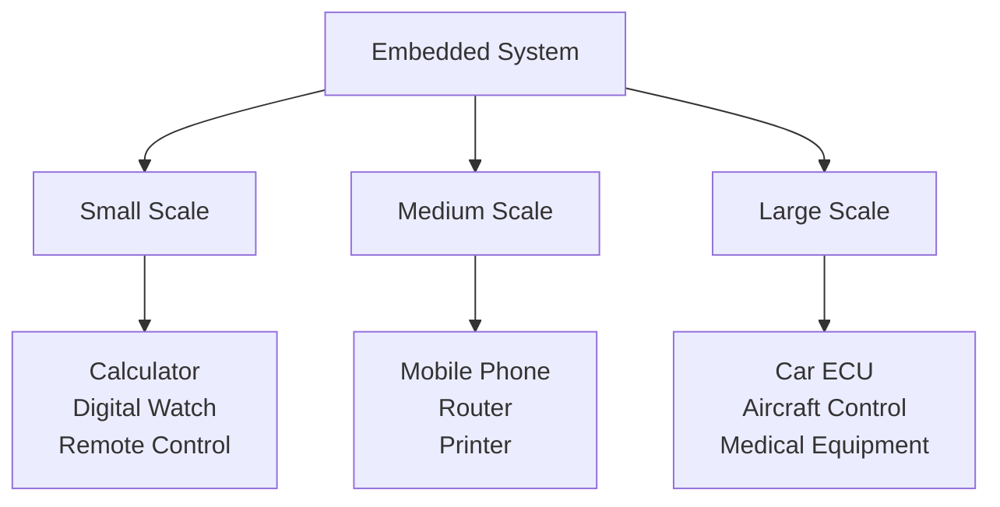
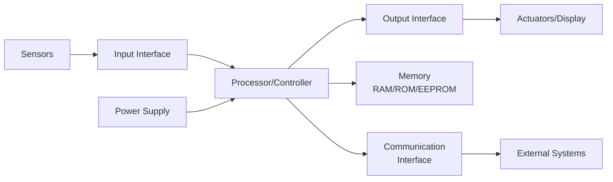
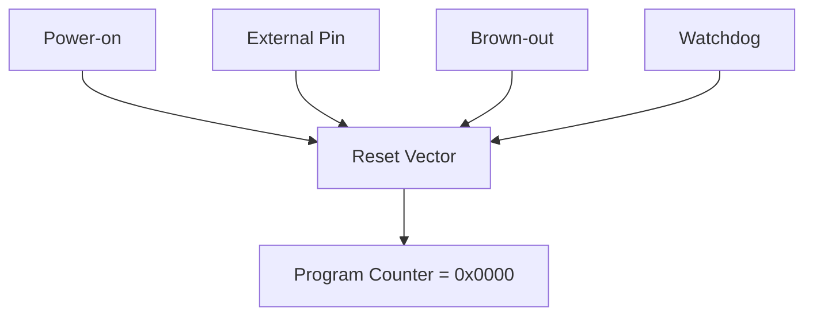
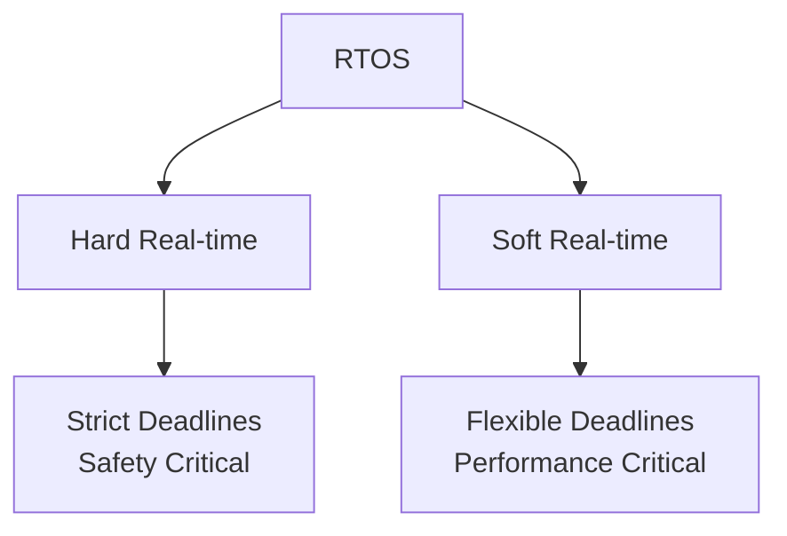
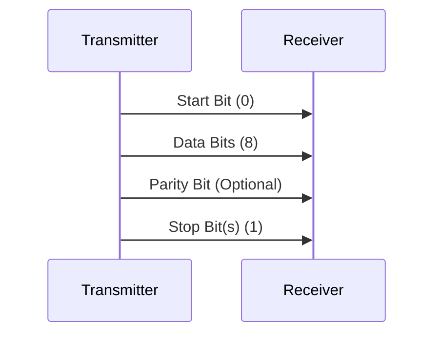
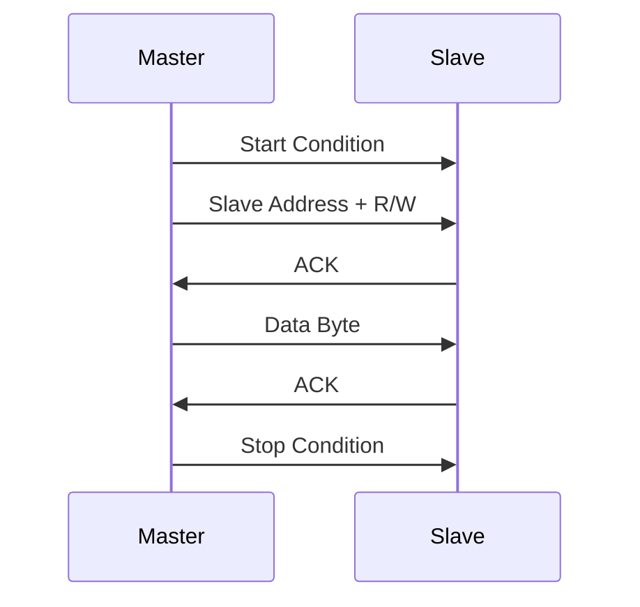
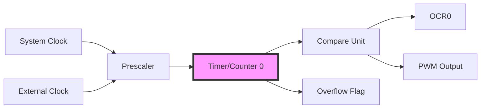
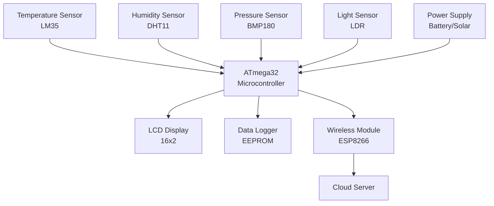
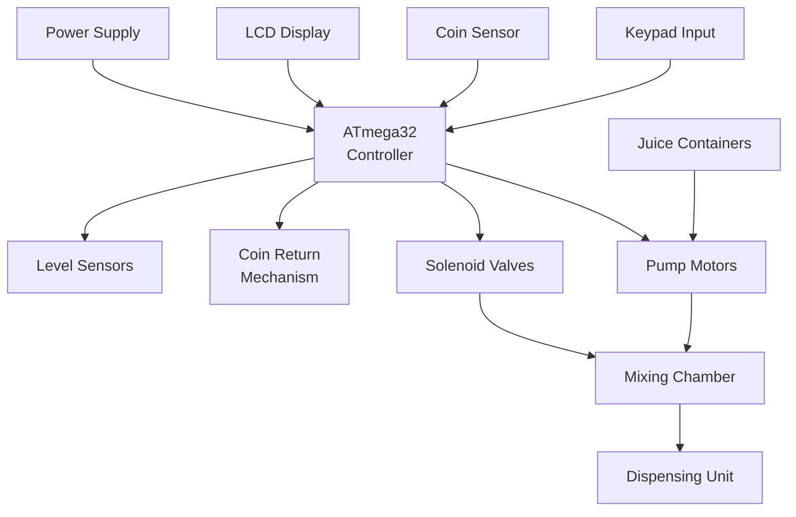

## Question 1(a) [3 marks]

**State the features of ATmega32.**

**Answer**:

| Feature | Description |
|---------|-------------|
| **Architecture** | 8-bit RISC processor |
| **Memory** | 32KB Flash, 2KB SRAM, 1KB EEPROM |
| **I/O Ports** | 32 programmable I/O pins |
| **Timers** | 3 timers (Timer0, Timer1, Timer2) |
| **ADC** | 10-bit, 8-channel ADC |
| **Communication** | USART, SPI, I2C (TWI) |

- **High Performance**: 16 MIPS at 16MHz
- **Low Power**: Multiple sleep modes
- **Operating Voltage**: 2.7V to 5.5V

**Mnemonic:** "ARM-TIC" (Architecture-RISC, Memory-32KB, Timers-3, I/O-32pins, Communication-3types)

---

## Question 1(b) [4 marks]

**Explain criteria for choosing microcontroller.**

**Answer**:

| Criteria | Consideration |
|----------|---------------|
| **Performance** | Speed, instruction set, architecture |
| **Memory** | RAM, ROM, EEPROM requirements |
| **I/O Requirements** | Number of pins, special functions |
| **Power Consumption** | Battery life, sleep modes |
| **Cost** | Unit price, development cost |
| **Development Tools** | Compiler, debugger availability |

- **Application Requirements**: Real-time constraints, processing needs
- **Package Size**: Space limitations in final product
- **Peripheral Support**: ADC, timers, communication interfaces

**Mnemonic:** "PM-IPCD" (Performance, Memory, I/O, Power, Cost, Development)

---

## Question 1(c) [7 marks]

**Define the Embedded System. List the Application of Small, Medium, Large Embedded System.**

**Answer**:

**Definition**: Embedded system is a computer system with dedicated function within a larger mechanical or electrical system, designed to perform specific tasks with real-time constraints.

**Applications Table**:

| System Type | Memory Size | Applications |
|-------------|-------------|--------------|
| **Small Scale** | <64KB | Calculator, Digital watch, Toys |
| **Medium Scale** | 64KB-1MB | Mobile phones, Routers, Printers |
| **Large Scale** | >1MB | Automobiles, Aircraft systems, Satellites |



**Characteristics**:

- **Real-time Operation**: Predictable response times
- **Resource Constraints**: Limited memory and processing power
- **Dedicated Functionality**: Single-purpose design

**Mnemonic:** "SML-CMP" (Small-Calculator/Medium-Mobile/Large-Lifesupport)

---

## Question 1(c) OR [7 marks]

**Draw and explain general block diagram of embedded system.**

**Answer**:



**Block Functions**:

| Block | Function |
|-------|----------|
| **Processor** | Central processing unit (CPU/MCU) |
| **Input Interface** | Sensor data acquisition, user input |
| **Output Interface** | Actuator control, display output |
| **Memory** | Program storage, data storage |
| **Communication** | External system connectivity |

- **Input Processing**: ADC, digital input conditioning
- **Output Control**: PWM, relay drivers, LED displays
- **Power Management**: Voltage regulation, power optimization

**Mnemonic:** "PIOMCP" (Processor, Input, Output, Memory, Communication, Power)

---

## Question 2(a) [3 marks]

**Write a Full form of EEPROM and explain EEPROM registers.**

**Answer**:

**Full Form**: Electrically Erasable Programmable Read-Only Memory

**EEPROM Registers**:

| Register | Function |
|----------|----------|
| **EEAR** | EEPROM Address Register |
| **EEDR** | EEPROM Data Register |
| **EECR** | EEPROM Control Register |

- **EEAR**: Holds 10-bit address (0-1023) for EEPROM access
- **EEDR**: Data register for read/write operations
- **EECR**: Control bits - EERE (Read Enable), EEWE (Write Enable)

**Mnemonic:** "AAD-CRE" (Address-EEAR, Data-EEDR, Control-EECR)

---

## Question 2(b) [4 marks]

**Explain reset circuits for ATmega32**

**Answer**:

**Reset Sources Table**:

| Reset Type | Trigger Condition |
|------------|-------------------|
| **Power-on Reset** | VCC rises above threshold |
| **External Reset** | RESET pin pulled low |
| **Brown-out Reset** | VCC falls below threshold |
| **Watchdog Reset** | Watchdog timer overflow |



- **Reset Duration**: Minimum 2 clock cycles
- **Reset Vector**: Program execution starts from address 0x0000
- **Hardware Connection**: External reset requires pull-up resistor

**Mnemonic:** "PEBW" (Power-on, External, Brown-out, Watchdog)

---

## Question 2(c) [7 marks]

**Define Real Time Operating System and explain its characteristics.**

**Answer**:

**Definition**: Real Time Operating System (RTOS) is an operating system designed to handle real-time applications with strict timing constraints and predictable response times.

**Characteristics Table**:

| Characteristic | Description |
|----------------|-------------|
| **Deterministic** | Predictable execution times |
| **Preemptive** | Higher priority tasks interrupt lower ones |
| **Multitasking** | Multiple tasks execution |
| **Fast Response** | Minimal interrupt latency |
| **Priority-based** | Task scheduling based on priority |
| **Resource Management** | Efficient memory and CPU usage |



- **Task Scheduling**: Round-robin, priority-based algorithms
- **Inter-task Communication**: Semaphores, message queues
- **Memory Management**: Static allocation for predictability

**Mnemonic:** "DPM-FPR" (Deterministic, Preemptive, Multitasking, Fast, Priority, Resource)

---

## Question 2(a) OR [3 marks]

**Explain AVR family.**

**Answer**:

**AVR Family Classification**:

| AVR Type | Features |
|----------|----------|
| **ATtiny** | 8-32 pins, basic features |
| **ATmega** | 28-100 pins, full features |
| **ATxmega** | Advanced features, DMA |

- **Architecture**: 8-bit RISC, Harvard architecture
- **Instruction Set**: 130+ instructions, single cycle execution
- **Memory**: Flash program memory, SRAM, EEPROM

**Mnemonic:** "TAX" (Tiny-basic, mega-full, Xmega-advanced)

---

## Question 2(b) OR [4 marks]

**Explain the use of fuse bits for selection of ATmega32 clock sources.**

**Answer**:

**Clock Source Selection**:

| Fuse Bits | Clock Source |
|-----------|--------------|
| **CKSEL3:0** | Clock source selection |
| **SUT1:0** | Start-up time selection |

**Clock Options Table**:

| CKSEL Value | Clock Source | Frequency |
|-------------|--------------|-----------|
| 0001 | External Crystal | 1-8 MHz |
| 0010 | External Crystal | 8+ MHz |
| 0100 | Internal RC | 8 MHz |
| 0000 | External Clock | User defined |

- **Crystal Selection**: Requires external crystal and capacitors
- **RC Oscillator**: Built-in, less accurate but convenient
- **Start-up Time**: Allows crystal stabilization

**Mnemonic:** "CRIS" (Crystal, RC, Internal, Start-up)

---

## Question 2(c) OR [7 marks]

**Draw ATmega32 pin configuration and explain function of MISO, MOSI, SCK & AREF Pin.**

**Answer**:

```goat
        +----------+
    PB0 |1      40| PA0
    PB1 |2      39| PA1  
    PB2 |3      38| PA2
    PB3 |4      37| PA3
    PB4 |5      36| PA4
MOSI PB5|6      35| PA5
MISO PB6|7      34| PA6
 SCK PB7|8      33| PA7
   RESET|9      32| AREF
    VCC |10     31| GND
    GND |11     30| AVCC
   XTAL2|12     29| PC7
   XTAL1|13     28| PC6
        +----------+
```

**Pin Functions Table**:

| Pin | Function | Description |
|-----|----------|-------------|
| **MOSI** | Master Out Slave In | SPI data output from master |
| **MISO** | Master In Slave Out | SPI data input to master |
| **SCK** | Serial Clock | SPI clock signal |
| **AREF** | Analog Reference | ADC reference voltage |

- **SPI Communication**: MOSI, MISO, SCK work together for serial data transfer
- **ADC Reference**: AREF provides stable voltage reference for ADC conversion
- **Pin Multiplexing**: These pins have alternate functions as GPIO

**Mnemonic:** "MMS-A" (MOSI-out, MISO-in, SCK-clock, AREF-reference)

---

## Question 3(a) [3 marks]

**Explain Role of DDR I/O Register**

**Answer**:

**DDR (Data Direction Register) Functions**:

| Bit Value | Pin Configuration |
|-----------|-------------------|
| **0** | Input pin |
| **1** | Output pin |

- **Port Control**: Each port has corresponding DDR (DDRA, DDRB, DDRC, DDRD)
- **Bit-wise Control**: Individual pin direction control
- **Default State**: All pins input (DDR = 0x00) after reset

**Code Example**:

```c
DDRA = 0xFF;  // All Port A pins as output
DDRB = 0x0F;  // PB0-PB3 output, PB4-PB7 input
```

**Mnemonic:** "DDR-IO" (Data Direction Register controls Input/Output)

---

## Question 3(b) [4 marks]

**Write an AVR C program to get a byte of data from Port B, and then send it to Port C.**

**Answer**:

```c
#include <avr/io.h>

int main(void)
{
    unsigned char data;
    
    // Configure Port B as input
    DDRB = 0x00;
    
    // Configure Port C as output  
    DDRC = 0xFF;
    
    while(1)
    {
        // Read data from Port B
        data = PINB;
        
        // Send data to Port C
        PORTC = data;
    }
    
    return 0;
}
```

**Program Explanation**:

- **DDRB = 0x00**: Sets all Port B pins as input
- **DDRC = 0xFF**: Sets all Port C pins as output
- **PINB**: Reads current state of Port B pins
- **PORTC**: Writes data to Port C output pins

**Mnemonic:** "RSTO" (Read-PINB, Set-DDR, Transfer-data, Output-PORTC)

---

## Question 3(c) [7 marks]

**A door sensor is connected to the port B pin 1, and an LED is connected to port C pin7. Write an AVR C program to monitor the door sensor and, when it opens, turn on the LED.**

**Answer**:

```c
#include <avr/io.h>

int main(void)
{
    // Configure PB1 as input (door sensor)
    DDRB &= ~(1<<1);  // Clear bit 1
    
    // Configure PC7 as output (LED)
    DDRC |= (1<<7);   // Set bit 7
    
    // Enable pull-up for PB1
    PORTB |= (1<<1);
    
    while(1)
    {
        // Check door sensor status
        if(PINB & (1<<1))
        {
            // Door closed - turn off LED
            PORTC &= ~(1<<7);
        }
        else
        {
            // Door open - turn on LED  
            PORTC |= (1<<7);
        }
    }
    
    return 0;
}
```

**Hardware Connection**:

- **Door Sensor**: Connected between PB1 and GND
- **LED**: Connected to PC7 through current limiting resistor
- **Pull-up**: Internal pull-up enabled for PB1

**Program Logic**:

- **Sensor Closed**: PB1 = HIGH, LED OFF
- **Sensor Open**: PB1 = LOW, LED ON

**Mnemonic:** "DCOL" (Door-sensor, Configure-pins, Open-check, LED-control)

---

## Question 3(a) OR [3 marks]

**Discuss Data Types in AVR C programming.**

**Answer**:

**AVR C Data Types Table**:

| Data Type | Size | Range |
|-----------|------|-------|
| **char** | 8-bit | -128 to 127 |
| **unsigned char** | 8-bit | 0 to 255 |
| **int** | 16-bit | -32768 to 32767 |
| **unsigned int** | 16-bit | 0 to 65535 |
| **long** | 32-bit | -2³¹ to 2³¹-1 |
| **float** | 32-bit | IEEE 754 format |

- **Memory Efficiency**: Use smallest appropriate data type
- **Unsigned Types**: For positive values only, doubles range
- **Bit Fields**: Can define specific bit-width variables

**Mnemonic:** "CIL-FUB" (Char-8bit, Int-16bit, Long-32bit, Float-32bit, Unsigned-positive, Bit-specific)

---

## Question 3(b) OR [4 marks]

**Explain Serial Communication Protocol.**

**Answer**:

**Serial Communication Parameters**:

| Parameter | Description |
|-----------|-------------|
| **Baud Rate** | Data transmission speed (bits/second) |
| **Data Bits** | Number of data bits (5-9) |
| **Parity** | Error checking (None, Even, Odd) |
| **Stop Bits** | End of frame marker (1 or 2) |



- **Asynchronous**: No clock signal, uses start/stop bits
- **RS232 Standard**: ±12V levels, converted to TTL levels
- **Common Baud Rates**: 9600, 19200, 38400, 115200

**Mnemonic:** "BDPS" (Baud-rate, Data-bits, Parity-check, Stop-bits)

---

## Question 3(c) OR [7 marks]

**Write an AVR C program to read pins 1 and 0 of Port B and issue an ASCII character to Port D according to the following table:**

**Answer**:

```c
#include <avr/io.h>

int main(void)
{
    unsigned char input;
    
    // Configure PB1 and PB0 as input
    DDRB &= ~((1<<1)|(1<<0));
    
    // Configure Port D as output
    DDRD = 0xFF;
    
    // Enable pull-ups for PB1 and PB0
    PORTB |= (1<<1)|(1<<0);
    
    while(1)
    {
        // Read PB1 and PB0
        input = PINB & 0x03;  // Mask other bits
        
        switch(input)
        {
            case 0x00:  // Pin1=0, Pin0=0
                PORTD = '0';  // ASCII '0' = 0x30
                break;
                
            case 0x01:  // Pin1=0, Pin0=1
                PORTD = '1';  // ASCII '1' = 0x31
                break;
                
            case 0x02:  // Pin1=1, Pin0=0
                PORTD = '2';  // ASCII '2' = 0x32
                break;
                
            case 0x03:  // Pin1=1, Pin0=1
                PORTD = '3';  // ASCII '3' = 0x33
                break;
        }
    }
    
    return 0;
}
```

**Truth Table Implementation**:

| Pin1 | Pin0 | Input Value | ASCII Output |
|------|------|-------------|--------------|
| 0 | 0 | 0x00 | '0' (0x30) |
| 0 | 1 | 0x01 | '1' (0x31) |
| 1 | 0 | 0x02 | '2' (0x32) |
| 1 | 1 | 0x03 | '3' (0x33) |

**Mnemonic:** "MATS" (Mask-inputs, ASCII-conversion, Truth-table, Switch-case)

---

## Question 4(a) [3 marks]

**Draw interfacing diagram of relay and relay driver ULN2803 with ATmega32**

**Answer**:

```goat
ATmega32          ULN2803         Relay
                                 
PC0 ------>|1    18|-----------> +12V
PC1 ------>|2    17|    
PC2 ------>|3    16|    
PC3 ------>|4    15|    
PC4 ------>|5    14|    
PC5 ------>|6    13|    
PC6 ------>|7    12|    
PC7 ------>|8    11|    
           |9    10|-----------> GND
           ULN2803    
                       
    COM1 of Relay connected to +12V
    NO1 of Relay connected to Load
    GND common for all
```

**Component Functions**:

- **ULN2803**: Darlington transistor array, current amplification
- **Protection Diodes**: Built-in flyback diodes for inductive loads
- **Relay Coil**: Requires 12V, controlled by ULN2803 output

**Mnemonic:** "UPC" (ULN-driver, Port-control, Current-amplify)

---

## Question 4(b) [4 marks]

**Write steps of programming the A/D converter using polling method**

**Answer**:

**ADC Programming Steps**:

| Step | Action |
|------|--------|
| **1** | Configure ADMUX register (reference, channel) |
| **2** | Configure ADCSRA register (enable, prescaler) |
| **3** | Start conversion (set ADSC bit) |
| **4** | Wait for conversion complete (poll ADIF flag) |
| **5** | Read result from ADCL and ADCH |

**Code Implementation**:

```c
// Step 1: Configure ADMUX
ADMUX = (1<<REFS0);  // AVCC reference, channel 0

// Step 2: Enable ADC with prescaler
ADCSRA = (1<<ADEN)|(1<<ADPS2)|(1<<ADPS1)|(1<<ADPS0);

// Step 3: Start conversion
ADCSRA |= (1<<ADSC);

// Step 4: Wait for completion
while(!(ADCSRA & (1<<ADIF)));

// Step 5: Read result
result = ADC;  // Combined ADCL and ADCH
```

**Mnemonic:** "CCSWR" (Configure-ADMUX, Configure-ADCSRA, Start-conversion, Wait-complete, Read-result)

---

## Question 4(c) [7 marks]

**Explain I2C-Two Wire Serial Interface (TWI) Protocol in detail.**

**Answer**:

**I2C Protocol Features**:

| Feature | Description |
|---------|-------------|
| **Two Wires** | SDA (Data) and SCL (Clock) |
| **Multi-master** | Multiple masters can control bus |
| **Addressing** | 7-bit or 10-bit device addresses |
| **Bidirectional** | Data flows both directions |



**I2C Frame Structure**:

- **Start Condition**: SDA goes low while SCL is high
- **Address Frame**: 7-bit address + R/W bit
- **Data Frame**: 8-bit data + ACK/NACK
- **Stop Condition**: SDA goes high while SCL is high

**TWI Registers in ATmega32**:

| Register | Function |
|----------|----------|
| **TWCR** | Control and status |
| **TWDR** | Data register |
| **TWAR** | Address register |
| **TWSR** | Status register |

- **Clock Stretching**: Slave can hold SCL low to slow down master
- **Arbitration**: Prevents collisions in multi-master systems
- **Pull-up Resistors**: Required on both SDA and SCL lines (4.7kΩ typical)

**Mnemonic:** "SAD-CSA" (Start-Address-Data, Control-Status-Address)

---

## Question 4(a) OR [3 marks]

**Explain any one PWM mode for controlling speed of DC motor by using 8-bit timer**

**Answer**:

**Fast PWM Mode (Mode 3)**:

| Parameter | Value |
|-----------|-------|
| **WGM bits** | WGM01=1, WGM00=1 |
| **TOP value** | 0xFF (255) |
| **Resolution** | 8-bit |
| **Frequency** | fclk/(256×prescaler) |

**PWM Configuration**:

```c
// Configure Timer0 for Fast PWM
TCCR0 = (1<<WGM01)|(1<<WGM00)|(1<<COM01)|(1<<CS01);

// Set duty cycle (0-255)
OCR0 = 128;  // 50% duty cycle
```


- **Duty Cycle Control**: OCR0 value determines motor speed
- **Non-inverting Mode**: High pulse width = OCR0/255
- **Motor Control**: Higher duty cycle = higher speed

**Mnemonic:** "FTO" (Fast-PWM, Timer0, OCR0-control)

---

## Question 4(b) OR [4 marks]

**Write steps for reading data from an SPI device**

**Answer**:

**SPI Read Steps**:

| Step | Action |
|------|--------|
| **1** | Configure SPI control register (SPCR) |
| **2** | Set SS pin low to select slave |
| **3** | Write dummy data to SPDR |
| **4** | Wait for transmission complete (SPIF flag) |
| **5** | Read received data from SPDR |
| **6** | Set SS pin high to deselect slave |

**Code Implementation**:

```c
// Step 1: Configure SPI as master
SPCR = (1<<SPE)|(1<<MSTR)|(1<<SPR0);

// Step 2: Select slave
PORTB &= ~(1<<SS);

// Step 3: Send dummy byte
SPDR = 0xFF;

// Step 4: Wait for complete
while(!(SPSR & (1<<SPIF)));

// Step 5: Read data
data = SPDR;

// Step 6: Deselect slave
PORTB |= (1<<SS);
```

**SPI Timing**:

- **Clock Polarity**: CPOL bit determines idle state
- **Clock Phase**: CPHA bit determines sampling edge
- **Data Order**: MSB first (default) or LSB first

**Mnemonic:** "CSWWRD" (Configure, Select, Write-dummy, Wait, Read-data, Deselect)

---

## Question 4(c) OR [7 marks]

**Draw and explain interfacing diagram of LM35 with ATmega32.**

**Answer**:

```goat
    LM35 Temperature Sensor
    
    +5V -----> VCC (Pin 1)
               |
    ATmega32   |    LM35
    PA0 <----- OUTPUT (Pin 2)
               |
    GND -----> GND (Pin 3)
    
    Optional: 0.1µF capacitor between 
    VCC and GND for noise filtering
```

**LM35 Specifications**:

| Parameter | Value |
|-----------|-------|
| **Output** | 10mV/°C |
| **Range** | 0°C to 100°C |
| **Supply** | 4V to 30V |
| **Accuracy** | ±0.5°C |

**ADC Code for Temperature Reading**:

```c
#include <avr/io.h>

unsigned int readTemperature(void)
{
    unsigned int adcValue, temperature;
    
    // Configure ADC
    ADMUX = (1<<REFS0);  // AVCC reference, PA0
    ADCSRA = (1<<ADEN)|(1<<ADPS2)|(1<<ADPS1)|(1<<ADPS0);
    
    // Start conversion
    ADCSRA |= (1<<ADSC);
    
    // Wait for completion
    while(!(ADCSRA & (1<<ADIF)));
    
    // Read ADC value
    adcValue = ADC;
    
    // Convert to temperature
    // ADC = (Vin × 1024) / Vref
    // Vin = (10mV/°C) × Temp
    temperature = (adcValue * 500) / 1024;
    
    return temperature;
}
```

**Temperature Calculation**:

- **ADC Resolution**: 10-bit (0-1023)
- **Reference Voltage**: 5V
- **LM35 Output**: 10mV/°C
- **Formula**: Temp = (ADC × 5000mV) / (1024 × 10mV/°C)

**Mnemonic:** "VARC" (Voltage-output, ADC-conversion, Reference-5V, Calculation-formula)

---

## Question 5(a) [3 marks]

**Draw Timer 0 Working Block diagram.**

**Answer**:



**Timer0 Components**:

| Component | Function |
|-----------|----------|
| **Prescaler** | Clock division (1,8,64,256,1024) |
| **Counter** | 8-bit up counter (0-255) |
| **Compare Unit** | Compares counter with OCR0 |
| **Overflow** | Sets flag when counter overflows |

- **Clock Sources**: Internal clock or external pin
- **Modes**: Normal, CTC, Fast PWM, Phase Correct PWM
- **Interrupt**: Timer overflow and compare match

**Mnemonic:** "PCCO" (Prescaler, Counter, Compare, Overflow)

---

## Question 5(b) [4 marks]

**Draw Interfacing of MAX7221 to ATmega32.**

**Answer**:

```goat
ATmega32                    MAX7221
                           
PB5(MOSI) -----------> DIN (Pin 1)
PB7(SCK)  -----------> CLK (Pin 13)
PB4(SS)   -----------> CS  (Pin 12)
                       
                       V+ (Pin 19) <--- +5V
                       GND(Pin 4,9) <--- GND
                       
         7-Segment Display Connections:
         SEG A-G, DP connected to Pins 14-17, 20-23
         DIG 0-7 connected to Pins 2-3, 5-8, 10-11
```

**MAX7221 Features**:

| Feature | Description |
|---------|-------------|
| **Display Driver** | 8-digit 7-segment LED driver |
| **SPI Interface** | Serial data input |
| **Current Control** | Adjustable segment current |
| **Shutdown Mode** | Power saving feature |

**Initialization Code**:

```c
void MAX7221_init(void)
{
    // Configure SPI pins
    DDRB |= (1<<PB5)|(1<<PB7)|(1<<PB4);  // MOSI, SCK, SS as output
    
    // Initialize SPI
    SPCR = (1<<SPE)|(1<<MSTR)|(1<<SPR0);
    
    // Wake up MAX7221
    MAX7221_write(0x0C, 0x01);  // Shutdown register
    
    // Set decode mode
    MAX7221_write(0x09, 0xFF);  // BCD decode for all digits
    
    // Set intensity
    MAX7221_write(0x0A, 0x08);  // Medium brightness
    
    // Set scan limit
    MAX7221_write(0x0B, 0x07);  // Display all 8 digits
}
```

**Mnemonic:** "SCD-ISS" (SPI-interface, Current-control, Decode-mode, Initialize-setup, Scan-limit)

---

## Question 5(c) [7 marks]

**Explain Weather Monitoring System.**

**Answer**:

**System Block Diagram**:



**System Components**:

| Component | Function | Interface |
|-----------|----------|-----------|
| **LM35** | Temperature measurement | ADC |
| **DHT11** | Humidity & temperature | Digital I/O |
| **BMP180** | Atmospheric pressure | I2C |
| **LCD** | Local display | Parallel |
| **ESP8266** | WiFi connectivity | UART |
| **EEPROM** | Data storage | I2C |

**Features and Applications**:

- **Real-time Monitoring**: Continuous sensor data collection
- **Data Logging**: Historical data storage in EEPROM
- **Remote Access**: WiFi connectivity for cloud upload
- **Power Management**: Battery backup with solar charging
- **Alert System**: Threshold-based warnings
- **Agricultural Use**: Crop monitoring, irrigation control
- **Home Automation**: HVAC control, energy management

**Software Functions**:

- **Sensor Reading**: ADC conversion, I2C communication
- **Data Processing**: Calibration, filtering, averaging
- **Display Update**: LCD formatting, user interface
- **Communication**: WiFi data transmission, protocol handling
- **Storage Management**: EEPROM read/write, data compression

**Mnemonic:** "SMART-W" (Sensors, Monitoring, Alert, Remote, Temperature, Weather)

---

## Question 5(a) OR [3 marks]

**Draw and explain Timer/Counter Control Register 0(TCCR0)**

**Answer**:

**TCCR0 Register Bit Structure**:

```goat
Bit:    7     6     5     4     3     2     1    0
      +----+-----+-----+-----+-----+-----+-----+-----+
TCCR0 |FOC0|WGM00|COM01|COM00|WGM01| CS02| CS01| CS00|
      +----+-----+-----+-----+-----+-----+-----+-----+
```

**Bit Functions Table**:

| Bit | Name | Function |
|-----|------|----------|
| **FOC0** | Force Output Compare | Force compare match |
| **WGM01:00** | Waveform Generation | Timer mode selection |
| **COM01:00** | Compare Output Mode | Output pin behavior |
| **CS02:00** | Clock Select | Prescaler selection |

**Clock Select Options**:

| CS02:00 | Clock Source |
|---------|--------------|
| 000 | No clock (stopped) |
| 001 | clk/1 (no prescaling) |
| 010 | clk/8 |
| 011 | clk/64 |
| 100 | clk/256 |
| 101 | clk/1024 |
| 110 | External clock on T0 (falling) |
| 111 | External clock on T0 (rising) |

**Waveform Generation Modes**:

| WGM01:00 | Mode | Description |
|----------|------|-------------|
| 00 | Normal | Count up to 0xFF |
| 01 | PWM, Phase Correct | Count up/down |
| 10 | CTC | Clear Timer on Compare |
| 11 | Fast PWM | Count up to 0xFF |

**Mnemonic:** "FWC-CS" (Force, Waveform, Compare, Clock-Select)

---

## Question 5(b) OR [4 marks]

**Explain the function of motor driver L293D.**

**Answer**:

**L293D Motor Driver Features**:

| Feature | Specification |
|---------|---------------|
| **Channels** | Dual H-bridge, 2 motors |
| **Supply Voltage** | 4.5V to 36V |
| **Output Current** | 600mA per channel |
| **Logic Voltage** | 5V TTL compatible |
| **Protection** | Thermal shutdown |

**Pin Configuration**:

```goat
        L293D
    +---------+
EN1 |1      16| VCC1 (+5V)
IN1 |2      15| IN4
OUT1|3      14| OUT4
GND |4      13| GND
GND |5      12| GND
OUT2|6      11| OUT3
IN2 |7      10| IN3
VCC2|8       9| EN2
    +---------+
```

**H-Bridge Operation**:

| IN1 | IN2 | Motor Action |
|-----|-----|--------------|
| 0 | 0 | Stop (brake) |
| 0 | 1 | Rotate CCW |
| 1 | 0 | Rotate CW |
| 1 | 1 | Stop (brake) |

**Control Functions**:

- **Direction Control**: IN1, IN2 determine rotation direction
- **Speed Control**: PWM on Enable pins (EN1, EN2)
- **Dual Supply**: VCC1 for logic, VCC2 for motor power
- **Enable Control**: EN pins enable/disable motor operation

**Applications**:

- **Robotics**: Differential drive robots
- **Automation**: Conveyor belt control
- **RC Vehicles**: Motor speed and direction control

**Mnemonic:** "DHIE" (Dual-channel, H-bridge, Input-control, Enable-PWM)

---

## Question 5(c) OR [7 marks]

**Explain Automatic Juice vending machine.**

**Answer**:

**System Block Diagram**:



**System Components**:

| Component | Function | Interface |
|-----------|----------|-----------|
| **Keypad** | Juice selection | Digital I/O |
| **Coin Sensor** | Payment detection | Interrupt |
| **LCD Display** | User interface | Parallel |
| **Pump Motors** | Juice pumping | PWM control |
| **Solenoid Valves** | Flow control | Digital output |
| **Level Sensors** | Container monitoring | ADC/Digital |

**Operation Sequence**:

1. **Display Menu**: Show available juices and prices
2. **User Selection**: Customer selects juice type via keypad
3. **Payment Process**: Coin insertion and validation
4. **Level Check**: Verify ingredient availability
5. **Dispensing**: Activate pumps and valves in sequence
6. **Mixing**: Control mixing ratios and time
7. **Completion**: Display completion message and return change

**Control Algorithm**:

```c
void dispensJuice(uint8_t selection, uint16_t amount)
{
    // Check ingredient levels
    if(checkLevels(selection))
    {
        // Calculate mixing ratios
        calculateRatio(selection);
        
        // Start dispensing sequence
        activatePump(selection, amount);
        
        // Control mixing time
        startTimer(MIXING_TIME);
        
        // Complete transaction
        displayMessage("Enjoy your juice!");
    }
    else
    {
        displayMessage("Ingredient not available");
        returnCoins();
    }
}
```

**Features**:

- **Multiple Flavors**: Different juice combinations
- **Payment System**: Coin acceptance and change return
- **Inventory Management**: Level monitoring and alerts
- **User Interface**: Menu display and selection
- **Safety Features**: Overflow protection, emergency stop
- **Maintenance Mode**: Service and cleaning cycles

**Applications**:

- **Commercial**: Shopping malls, offices, schools
- **Industrial**: Factory cafeterias, hospitals
- **Public Places**: Airports, train stations

**Mnemonic:** "JUMPS" (Juice-selection, User-interface, Mixing-control, Payment-system, Sensors-monitoring)
