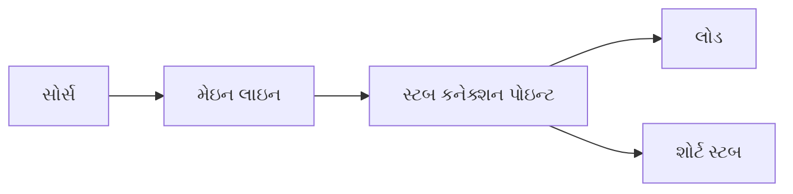
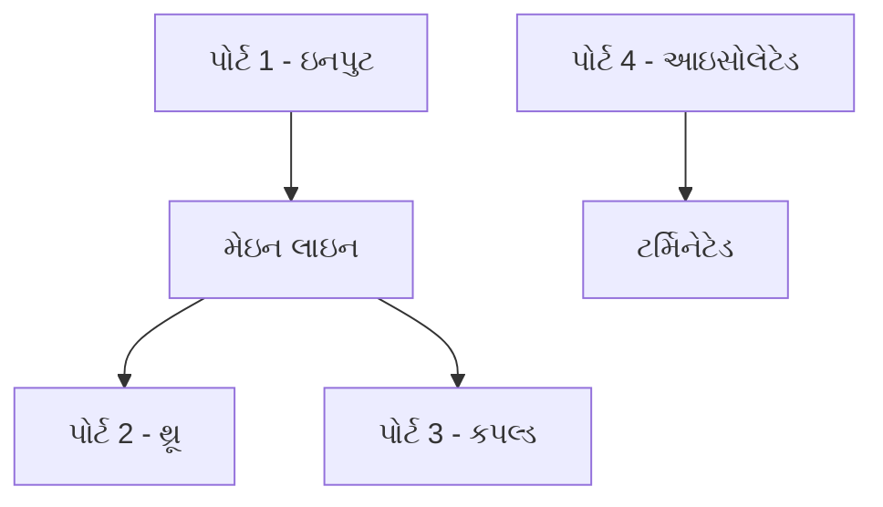
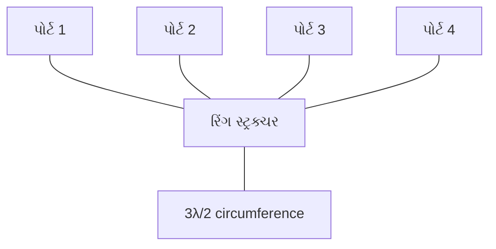
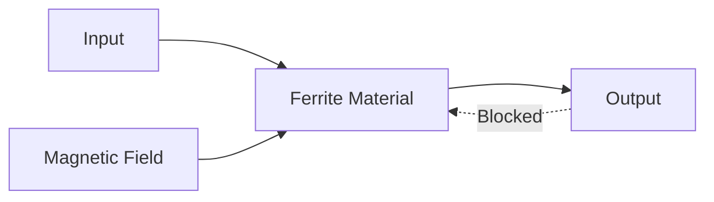
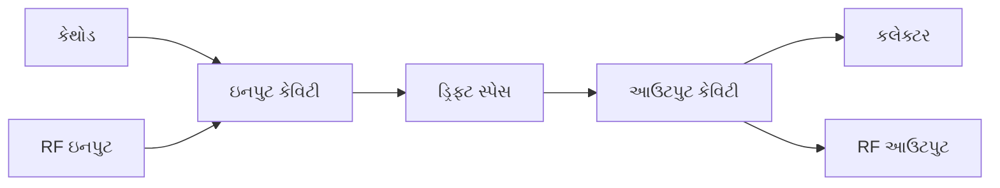
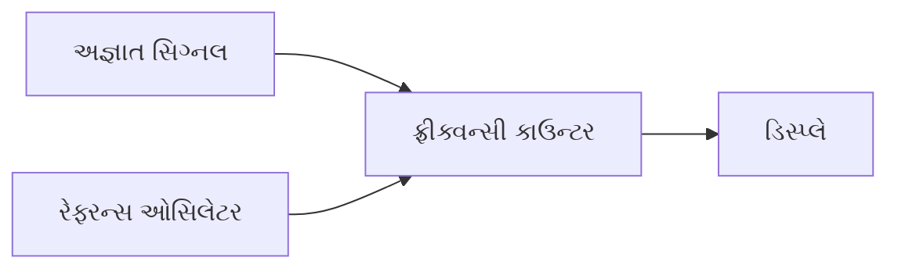
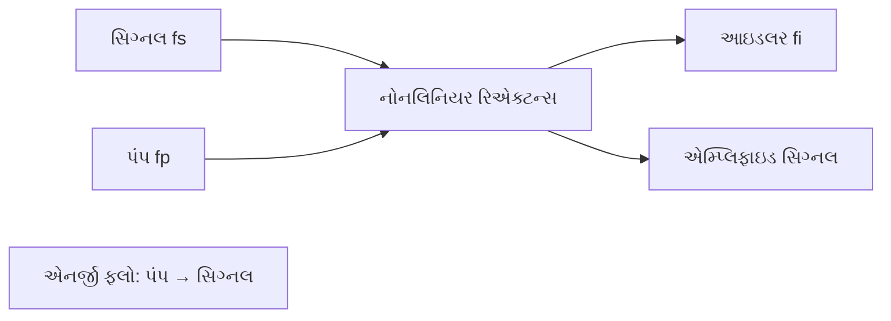
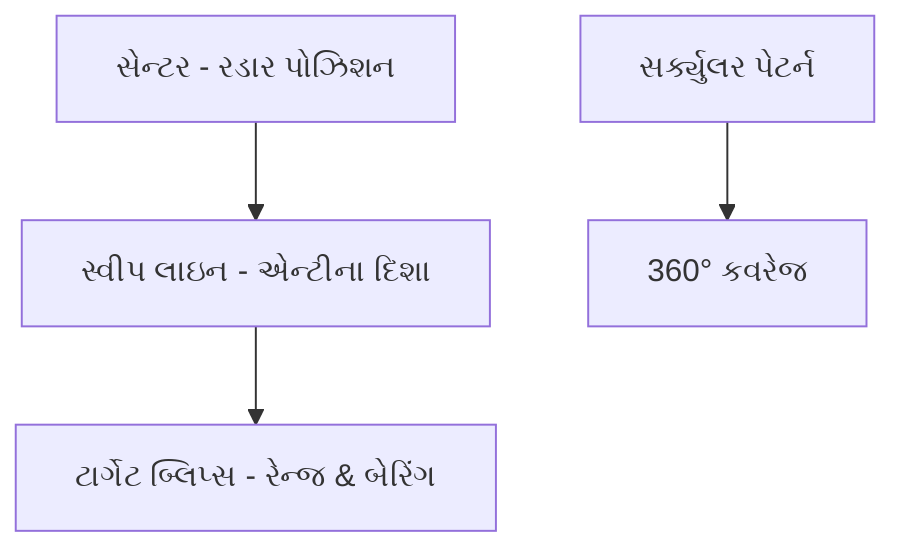
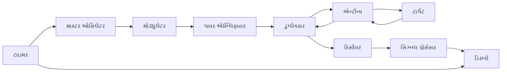
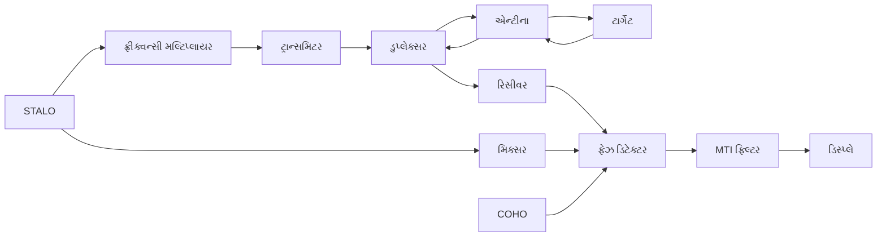

## પ્રશ્ન 1(અ) [3 માર્ક્સ]

**વિવિધ માઇક્રોવેવ બેન્ડની તેમની આવૃત્તિ શ્રેણી સાથેની યાદી કરો.**

**જવાબ**:

**માઇક્રોવેવ આવૃત્તિ બેન્ડ કોષ્ટક:**

| બેન્ડ | આવૃત્તિ શ્રેણી | તરંગલંબાઇ |
|------|----------------|------------|
| **L Band** | 1-2 GHz | 30-15 cm |
| **S Band** | 2-4 GHz | 15-7.5 cm |
| **C Band** | 4-8 GHz | 7.5-3.75 cm |
| **X Band** | 8-12 GHz | 3.75-2.5 cm |
| **Ku Band** | 12-18 GHz | 2.5-1.67 cm |
| **K Band** | 18-27 GHz | 1.67-1.11 cm |
| **Ka Band** | 27-40 GHz | 1.11-0.75 cm |

**મેમરી ટ્રીક:** "લાર્જ શીપ્સ કેન eXામીન કિંડલી યુઝિંગ નોલેજ ઓલવેઝ"

---

## પ્રશ્ન 1(બ) [4 માર્ક્સ]

**ટ્રાન્સમિશન લાઇનનું સામાન્ય સમકક્ષ સર્કિટ દોરો. લોસલેસ લાઇન માટે લાક્ષણિક અવબાધ માટેનું સમીકરણ લખો.**

**જવાબ**:

**ટ્રાન્સમિશન લાઇન સમકક્ષ સર્કિટ:**

```goat
    R      L
  ----▬▬▬▬----
 |             |
 |      C      | G
 |    -----    |
 |             |
  -------------
      dx
```

**સર્કિટ એલિમેન્ટ્સ:**

- **R**: યુનિટ લંબાઇ દીઠ શ્રેણી પ્રતિકાર
- **L**: યુનિટ લંબાઇ દીઠ શ્રેણી ઇન્ડક્ટન્સ  
- **C**: યુનિટ લંબાઇ દીઠ શન્ટ કેપેસિટન્સ
- **G**: યુનિટ લંબાઇ દીઠ શન્ટ કન્ડક્ટન્સ

**લોસલેસ લાઇન માટે (R = 0, G = 0):**

**લાક્ષણિક અવબાધ:** Z₀ = √(L/C)

**મુખ્ય મુદ્દાઓ:**

- **લોસલેસ સ્થિતિ**: ટ્રાન્સમિશન દરમિયાન કોઈ પાવર લોસ નથી
- **અવબાધ મેચિંગ**: Z₀ રિફ્લેક્શન વર્તન નક્કી કરે છે

**મેમરી ટ્રીક:** "લોસલેસ લાઇન્સ લવ કોન્સ્ટન્ટ ઇમ્પિડન્સ"

---

## પ્રશ્ન 1(ક) [7 માર્ક્સ]

**એક જ સ્ટબનો ઉપયોગ કરીને ઇમ્પિડન્સ મેચિંગ પ્રક્રિયા સમજાવો.**

**જવાબ**:

**સિંગલ સ્ટબ મેચિંગ પ્રક્રિયા:**



**મેચિંગ પગલાં:**

| પગલું | પ્રક્રિયા | હેતુ |
|------|---------|---------|
| **1** | લોડ એડમિટન્સ કેલ્ક્યુલેટ કરો | Y_L = 1/Z_L શોધો |
| **2** | જનરેટર તરફ મૂવ કરો | પોઇન્ટ શોધો જ્યાં G = G₀ |
| **3** | સ્ટબ સસેપ્ટન્સ ઉમેરો | રિએક્ટિવ ભાગ કેન્સલ કરો |
| **4** | મેચિંગ હાસિલ કરો | Y_total = Y₀ |

**ડિઝાઇન સમીકરણો:**

- **સ્ટબ સુધી અંતર:** d = (λ/2π) × tan⁻¹(√(R_L/R₀))
- **સ્ટબ લંબાઇ:** l = (λ/2π) × tan⁻¹(B_stub/Y₀)

**એપ્લિકેશન્સ:**

- **એન્ટીના મેચિંગ**
- **એમ્પ્લિફાયર ઇનપુટ/આઉટપુટ**
- **ફિલ્ટર ડિઝાઇન**

**મેમરી ટ્રીક:** "સિંગલ સ્ટબ્સ સ્ટોપ સ્ટેન્ડિંગ વેવ્સ સક્સેસફુલી"

---

## પ્રશ્ન 1(ક) વૈકલ્પિક [7 માર્ક્સ]

**લંબચોરસ અને ગોળાકાર વેવગાઇડ્સની તુલના કરો.**

**જવાબ**:

**તુલના કોષ્ટક:**

| પેરામીટર | લંબચોરસ વેવગાઇડ | ગોળાકાર વેવગાઇડ |
|-----------|----------------------|-------------------|
| **આકાર** | લંબચોરસ ક્રોસ-સેક્શન | ગોળાકાર ક્રોસ-સેક્શન |
| **ડોમિનન્ટ મોડ** | TE₁₀ | TE₁₁ |
| **કટઓફ ફ્રિક્વન્સી** | fc = c/(2a) for TE₁₀ | fc = 1.841c/(2πa) for TE₁₁ |
| **પાવર હેન્ડલિંગ** | ઓછું | વધારે |
| **મેન્યુફેક્ચરિંગ** | સરળ | મુશ્કેલ |
| **મોડ સેપરેશન** | સારું | નબળું |
| **એપ્લિકેશન્સ** | રડાર, માઇક્રોવેવ ઓવન | સેટેલાઇટ કમ્યુનિકેશન |

**મુખ્ય ફાયદાઓ:**

- **લંબચોરસ**: બહેતર મોડ નિયંત્રણ, સરળ ફેબ્રિકેશન
- **ગોળાકાર**: વધારે પાવર ક્ષમતા, રોટેટિંગ પોલરાઇઝેશન

**મેમરી ટ્રીક:** "રેક્ટેંગ્યુલર ઇઝ રેગ્યુલર, સર્ક્યુલર કેરીઝ કરન્ટ"

---

## પ્રશ્ન 2(અ) [3 માર્ક્સ]

**ગ્રુપ વેલોસિટી અને ફેઝ વેલોસિટીની વ્યાખ્યા કરો અને વચ્ચેનો સંબંધ લખો.**

**જવાબ**:

**વેગની વ્યાખ્યાઓ:**

| વેગનો પ્રકાર | ફોર્મ્યુલા | ભૌતિક અર્થ |
|---------------|---------|------------------|
| **ફેઝ વેલોસિટી** | vₚ = ω/β = c/√(1-(fc/f)²) | સ્થિર ફેઝની ઝડપ |
| **ગ્રુપ વેલોસિટી** | vₘ = dω/dβ = c√(1-(fc/f)²) | સિગ્નલ એનર્જીની ઝડપ |

**સંબંધ:** vₚ × vₘ = c²

**મુખ્ય મુદ્દાઓ:**

- **ફેઝ વેલોસિટી**: હંમેશા > c (પ્રકાશની ઝડપ)
- **ગ્રુપ વેલોસિટી**: હંમેશા < c
- **સિગ્નલ પ્રવાસ**: ગ્રુપ વેલોસિટી પર

**મેમરી ટ્રીક:** "ફેઝ ઇઝ ફાસ્ટ, ગ્રુપ કેરીઝ મેસેજ"

---

## પ્રશ્ન 2(બ) [4 માર્ક્સ]

**ડાયરેક્શનલ કપ્લરના સિદ્ધાંતો અને કાર્યનું વર્ણન કરો.**

**જવાબ**:

**ડાયરેક્શનલ કપ્લર સિદ્ધાંત:**



**કાર્ય સિદ્ધાંત:**

- **ઇલેક્ટ્રોમેગ્નેટિક કપલિંગ** બે ટ્રાન્સમિશન લાઇન વચ્ચે
- **પાવર વિભાજન** કપલિંગ ફેક્ટર આધારિત
- **દિશાત્મક સંવેદનશીલતા** તરંગ દિશા તરફ

**મુખ્ય પેરામીટર્સ:**

- **કપલિંગ ફેક્ટર**: C = 10 log(P₁/P₃) dB
- **ડાયરેક્ટિવિટી**: D = 10 log(P₃/P₄) dB
- **ઇન્સર્શન લોસ**: IL = 10 log(P₁/P₂) dB

**મેમરી ટ્રીક:** "ડાયરેક્શનલ કપ્લર્સ ડિવાઇડ પાવર પ્રિસાઇસલી"

---

## પ્રશ્ન 2(ક) [7 માર્ક્સ]

**બાંધકામ, ઓપરેશન અને એપ્લિકેશન સાથે મેજિક TEE સમજાવો.**

**જવાબ**:

**મેજિક TEE બાંધકામ:**

```goat
         E-Arm (Port 3)
              |
              |
    Port 1----+----Port 2
              |
              |
         H-Arm (Port 4)
```

**ઓપરેટિંગ સિદ્ધાંતો:**

| પોર્ટ | કાર્ય | ફીલ્ડ પેટર્ન |
|------|----------|---------------|
| **પોર્ટ 1 અને 2** | કોલિનિયર પોર્ટ્સ | સિમેટ્રિક |
| **પોર્ટ 3 (E-આર્મ)** | E-પ્લેન પોર્ટ | ઇલેક્ટ્રિક ફીલ્ડ કપલિંગ |
| **પોર્ટ 4 (H-આર્મ)** | H-પ્લેન પોર્ટ | મેગ્નેટિક ફીલ્ડ કપલિંગ |

**સ્કેટરિંગ ગુણધર્મો:**

- **આઇસોલેશન**: પોર્ટ 3 ↔ પોર્ટ 4
- **પાવર વિભાજન**: મેચ થયું હોય ત્યારે સમાન વિભાજન
- **ફેઝ સંબંધો**: 0° અને 180°

**એપ્લિકેશન્સ:**

- **મિક્સર્સ અને મોડ્યુલેટર્સ**
- **પાવર કમ્બાઇનર્સ**
- **ઇમ્પિડન્સ બ્રિજ**
- **એન્ટીના ફીડ્સ**

**મેમરી ટ્રીક:** "મેજિક TEE ક્રિએટ્સ પરફેક્ટ આઇસોલેશન"

---

## પ્રશ્ન 2(અ) વૈકલ્પિક [3 માર્ક્સ]

**લંબચોરસ વેવગાઇડ માટે TE₁₀, TE₂₀ મોડ્સ દોરો.**

**જવાબ**:

**TE₁₀ મોડ (ડોમિનન્ટ મોડ):**

```goat
  a
+-------------+
|      ^      | b
|   E  ^  E   |
|      ^      |
+-------------+
  Field Lines
```

**TE₂₀ મોડ:**

```goat
  a
+-------------+
|  ^     v    | b
|  ^  E  v  E |
|  ^     v    |
+-------------+
  Two Half-Waves
```

**મોડ લાક્ષણિકતાઓ:**

- **TE₁₀**: x-દિશામાં એક હાફ-વેવ વેરિએશન
- **TE₂₀**: x-દિશામાં બે હાફ-વેવ વેરિએશન
- **ફીલ્ડ પેટર્ન**: ઇલેક્ટ્રિક ફીલ્ડ પ્રોપેગેશન પર લંબ

**મેમરી ટ્રીક:** "TE મોડ્સ હેવ ઇલેક્ટ્રિક ટ્રાન્સવર્સ"

---

## પ્રશ્ન 2(બ) વૈકલ્પિક [4 માર્ક્સ]

**જરૂરી સ્કેચ સાથે હાઇબ્રિડ રિંગનું વર્ણન કરો.**

**જવાબ**:

**હાઇબ્રિડ રિંગ સ્ટ્રક્ચર:**



**ઓપરેટિંગ સિદ્ધાંત:**

- **રિંગ સર્કમફરન્સ**: 3λ/2
- **પોર્ટ સ્પેસિંગ**: λ/4 અંતરે
- **પાવર વિભાજન**: એડજેસન્ટ પોર્ટ્સ વચ્ચે સમાન વિભાજન

**મુખ્ય લક્ષણો:**

- **આઇસોલેશન**: વિરુદ્ધ પોર્ટ્સ વચ્ચે
- **ફેઝ સંબંધો**: 0° અને 180°
- **ઇમ્પિડન્સ**: બધા પોર્ટ્સ પર મેચ

**મેમરી ટ્રીક:** "હાઇબ્રિડ રિંગ્સ હેન્ડલ હાફ-વેવલેન્થ્સ"

---

## પ્રશ્ન 2(ક) વૈકલ્પિક [7 માર્ક્સ]

**સિદ્ધાંતો, બાંધકામ અને ઓપરેશન સાથે આઇસોલેટર સમજાવો.**

**જવાબ**:

**આઇસોલેટર સિદ્ધાંત:**



**બાંધકામ એલિમેન્ટ્સ:**

| કોમ્પોનન્ટ | કાર્ય | મટીરિયલ |
|-----------|----------|----------|
| **ફેરાઇટ** | નોન-રેસિપ્રોકલ મીડિયમ | Yttrium Iron Garnet |
| **મેગ્નેટ** | બાયાસ ફીલ્ડ | પર્મેનન્ટ મેગ્નેટ |
| **રેઝિસ્ટિવ લોડ** | રિવર્સ પાવર એબસોર્બ | કાર્બન/સિરામિક |

**ઓપરેટિંગ સિદ્ધાંત:**

- **ફેરાડે રોટેશન** મેગ્નેટાઇઝ્ડ ફેરાઇટમાં
- **નોન-રેસિપ્રોકલ** ફેઝ શિફ્ટ
- **ફોરવર્ડ ટ્રાન્સમિશન**: લો લોસ
- **રિવર્સ ટ્રાન્સમિશન**: હાઇ એટેન્યુએશન

**એપ્લિકેશન્સ:**

- **એમ્પ્લિફાયર પ્રોટેક્શન**
- **ઓસિલેટર આઇસોલેશન**
- **એન્ટીના સિસ્ટમ્સ**

**સ્પેસિફિકેશન્સ:**

- **આઇસોલેશન**: 20-30 dB સામાન્ય
- **ઇન્સર્શન લોસ**: < 0.5 dB

**મેમરી ટ્રીક:** "આઇસોલેટર્સ ઇગ્નોર રિવર્સ રિફ્લેક્શન્સ"

---

## પ્રશ્ન 3(અ) [3 માર્ક્સ]

**ટ્રાવેલિંગ વેવ ટ્યુબ એમ્પ્લિફાયર દોરો.**

**જવાબ**:

**TWT એમ્પ્લિફાયર સ્ટ્રક્ચર:**

```goat
Electron Gun    Helix Structure    Collector
     |               |                |
     v               v                v
    [|]---> ~~~~~~~~~~~~~~~~~~~~~~~~ -->|
         Electron    RF Input         RF Output
         Beam        Coupler          Coupler
                        |
                   Attenuator
```

**મુખ્ય કોમ્પોનન્ટ્સ:**

- **ઇલેક્ટ્રોન ગન**: ઇલેક્ટ્રોન બીમ પેદા કરે છે
- **હેલિક્સ**: સ્લો-વેવ સ્ટ્રક્ચર
- **કપ્લર્સ**: ઇનપુટ/આઉટપુટ RF કનેક્શન્સ
- **કલેક્ટર**: ખર્ચાયેલા ઇલેક્ટ્રોન્સ એકત્રિત કરે છે

**મેમરી ટ્રીક:** "TWT ટ્રાન્સફર્સ વેવ થ્રૂ હેલિક્સ"

---

## પ્રશ્ન 3(બ) [4 માર્ક્સ]

**માઇક્રોવેવ રેડિયેશનને કારણે વિવિધ પ્રકારના જોખમોનું વર્ણન કરો.**

**જવાબ**:

**માઇક્રોવેવ રેડિયેશન જોખમો:**

| જોખમનો પ્રકાર | અસરો | સેફ્ટી લિમિટ |
|-------------|---------|--------------|
| **HERP** (Personnel) | ટિશ્યુ હીટિંગ, બર્ન્સ | 10 mW/cm² |
| **HERO** (Ordnance) | વિસ્ફોટક વિસ્ફોટ | વેરિયેબલ |
| **HERF** (Fuel) | ફ્યુઅલ ઇગ્નિશન | 5 mW/cm² |

**જૈવિક અસરો:**

- **થર્મલ અસરો**: 41°C થી વધારે ટિશ્યુ હીટિંગ
- **નોન-થર્મલ અસરો**: કોશિકા નુકસાન
- **સંવેદનશીલ અંગો**: આંખો, પ્રજનન અંગો

**સુરક્ષા પગલાં:**

- **શીલ્ડિંગ**: કન્ડક્ટિવ એન્ક્લોઝર્સ
- **અંતર**: પાવર ડેન્સિટી ∝ 1/r²
- **સમય મર્યાદા**: એક્સપોઝર ડ્યુરેશન નિયંત્રણ
- **ચેતવણી સિસ્ટમ**: રેડિયેશન ડિટેક્ટર્સ

**મેમરી ટ્રીક:** "હીટ એનર્જી રિક્વાયર્સ પ્રોપર પ્રોટેક્શન"

---

## પ્રશ્ન 3(ક) [7 માર્ક્સ]

**એપલગેટ ડાયાગ્રામ સાથે બે કેવિટી ક્લાયસ્ટ્રોન બાંધકામ અને ઓપરેશન સમજાવો.**

**જવાબ**:

**બે-કેવિટી ક્લાયસ્ટ્રોન સ્ટ્રક્ચર:**



**એપલગેટ ડાયાગ્રામ:**

```goat
Velocity
   ^
   |    Bunched    Bunched
   |   /      \   /      \
v0 +--+        \-/        \--
   |   \        /\        /
   |    Bunched    Bunched
   |
   +-------------------------> Distance
   Input   Drift    Output
   Cavity  Space    Cavity
```

**ઓપરેશન સિદ્ધાંત:**

| સ્ટેજ | પ્રક્રિયા | પરિણામ |
|-------|---------|---------|
| **વેલોસિટી મોડ્યુલેશન** | RF ઇનપુટ ઇલેક્ટ્રોન સ્પીડ બદલે છે | સ્પીડ વેરિએશન |
| **બંચિંગ** | ઝડપી ઇલેક્ટ્રોન્સ ધીમા ઇલેક્ટ્રોન્સને પકડે છે | કરન્ટ બંચ |
| **એનર્જી એક્સટ્રેક્શન** | બંચ આઉટપુટ કેવિટી સાથે ઇન્ટરેક્ટ કરે છે | RF એમ્પ્લિફિકેશન |

**મુખ્ય પેરામીટર્સ:**

- **ટ્રાન્ઝિટ ટાઇમ**: બંચિંગ માટે મહત્વપૂર્ણ
- **ડ્રિફ્ટ સ્પેસ લંબાઇ**: મહત્તમ બંચિંગ માટે ઓપ્ટિમાઇઝ
- **કેવિટી ટ્યુનિંગ**: રેઝોનન્ટ ફ્રીક્વન્સી મેચિંગ

**એપ્લિકેશન્સ:**

- **રડાર ટ્રાન્સમિટર્સ**
- **સેટેલાઇટ કમ્યુનિકેશન્સ**
- **લિનિયર એક્સેલેરેટર્સ**

**મેમરી ટ્રીક:** "ક્લાયસ્ટ્રોન્સ ક્રિએટ બંચ થ્રૂ વેલોસિટી વેરિએશન"

---

## પ્રશ્ન 3(અ) વૈકલ્પિક [3 માર્ક્સ]

**માઇક્રોવેવ આવૃત્તિ માટે એટેન્યુએશન માપન પદ્ધતિનો બ્લોક ડાયાગ્રામ દોરો.**

**જવાબ**:

**એટેન્યુએશન માપન સેટઅપ:**


**માપન પ્રક્રિયા:**

- **રેફરન્સ માપ**: DUT વિના
- **ઇન્સર્શન માપ**: DUT સાથે
- **એટેન્યુએશન કેલ્ક્યુલેશન**: A = P₁ - P₂ (dB)

**મેમરી ટ્રીક:** "એટેન્યુએશન એપિયર્સ આફ્ટર એક્યુરેટ એસેસમેન્ટ"

---

## પ્રશ્ન 3(બ) વૈકલ્પિક [4 માર્ક્સ]

**માઇક્રોવેવ રેન્જ પર વેક્યુમ ટ્યુબની મર્યાદાનું વર્ણન કરો.**

**જવાબ**:

**વેક્યુમ ટ્યુબ મર્યાદાઓ:**

| મર્યાદા | કારણ | અસર |
|------------|-------|--------|
| **ટ્રાન્ઝિટ ટાઇમ** | ઇલેક્ટ્રોન મુસાફરીનો સમય | ઊંચી આવૃત્તિ પર ઘટતો ગેઇન |
| **લીડ ઇન્ડક્ટન્સ** | કનેક્ટિંગ વાયર ઇન્ડક્ટન્સ | નબળી ઇમ્પિડન્સ મેચિંગ |
| **ઇન્ટર-ઇલેક્ટ્રોડ કેપેસિટન્સ** | પ્લેટ-કેથોડ કેપેસિટન્સ | ફીડબેક અને અસ્થિરતા |
| **સ્કિન ઇફેક્ટ** | હાઇ-ફ્રીક્વન્સી કરન્ટ વિતરણ | વધતો પ્રતિકાર |

**આવૃત્તિ-સંબંધિત સમસ્યાઓ:**

- **ઇનપુટ ઇમ્પિડન્સ**: રિએક્ટિવ બને છે
- **ગેઇન-બેન્ડવિડ્થ**: પ્રોડક્ટ મર્યાદા
- **નોઇઝ ફિગર**: આવૃત્તિ સાથે વધે છે
- **પાવર હેન્ડલિંગ**: ઘટે છે

**સોલ્યુશન્સ:**

- **સ્પેશિયલ ટ્યુબ ડિઝાઇન**: લાઇટહાઉસ ટ્યુબ્સ
- **કેવિટી રેઝોનેટર્સ**: ટ્યુન્ડ સર્કિટ રિપ્લેસ કરે છે
- **શોર્ટ લીડ્સ**: ઇન્ડક્ટન્સ મિનિમાઇઝ કરે છે

**મેમરી ટ્રીક:** "વેક્યુમ ટ્યુબ્સ ફેઇલ ફાસ્ટ એટ હાઇ ફ્રીક્વન્સીઝ"

---

## પ્રશ્ન 3(ક) વૈકલ્પિક [7 માર્ક્સ]

**મેગ્નેટ્રોનના સિદ્ધાંત, બાંધકામ, ઇલેક્ટ્રિક અને મેગ્નેટિક ફીલ્ડની અસર અને ઓપરેશન વિગતવાર સમજાવો.**

**જવાબ**:

**મેગ્નેટ્રોન બાંધકામ:**

```goat
        Anode Vanes
    +-----+-----+-----+
   /   1  |  2  |  3   \
  /       |     |       \
 /    8   |  C  |   4    \
|         |     |         |
|    7    |  +  |    5    |
 \        |     |        /
  \   6   |     |       /
   \-----+-----+-----/
        Cathode (C)
```

**ઓપરેટિંગ સિદ્ધાંત:**

| ફીલ્ડ | દિશા | અસર |
|-------|-----------|--------|
| **ઇલેક્ટ્રિક ફીલ્ડ** | રેડિયલ (કેથોડથી એનોડ) | ઇલેક્ટ્રોન્સને એક્સેલેરેટ કરે છે |
| **મેગ્નેટિક ફીલ્ડ** | એક્સિયલ (પેજ પર લંબ) | ઇલેક્ટ્રોન્સને ડિફ્લેક્ટ કરે છે |
| **સંયુક્ત અસર** | સાયક્લોઇડ મોશન | ફેઝ સિંક્રોનાઇઝેશન |

**ઓપરેશન સ્ટેજો:**

1. **ઇલેક્ટ્રોન ઇમિશન**: ગરમ કેથોડ ઇલેક્ટ્રોન્સ બહાર કાઢે છે
2. **સાયક્લોઇડ મોશન**: E×B ફીલ્ડ્સ સ્પાયરલ પાથ બનાવે છે
3. **સિંક્રોનાઇઝેશન**: ઇલેક્ટ્રોન્સ RF ફીલ્ડ સાથે સિંક્રોનાઇઝ કરે છે
4. **એનર્જી ટ્રાન્સફર**: કાઇનેટિક એનર્જી → RF એનર્જી
5. **આઉટપુટ કપલિંગ**: વેવગાઇડ દ્વારા RF એક્ષ્ટ્રેક્ટ કરવામાં આવે છે

**મુખ્ય પેરામીટર્સ:**

- **મેગ્નેટિક ફ્લક્સ ડેન્સિટી**: B = 2πmf/e
- **હલ કટઓફ વોલ્ટેજ**: VH = (eB²R²)/(8m)
- **આવૃત્તિ**: f = eB/(2πm) × (એનોડ મોડ્સ)

**એપ્લિકેશન્સ:**

- **માઇક્રોવેવ ઓવન્સ** (2.45 GHz)
- **રડાર ટ્રાન્સમિટર્સ**
- **ઇન્ડસ્ટ્રિયલ હીટિંગ**

**મેમરી ટ્રીક:** "મેગ્નેટ્રોન્સ મેક માઇક્રોવેવ્સ થ્રૂ મેગ્નેટિક મોશન"

---

## પ્રશ્ન 4(અ) [3 માર્ક્સ]

**ગ્રાફનો ઉપયોગ કરીને વેરેક્ટર ડાયોડના કાર્ય સિદ્ધાંતને સમજાવો.**

**જવાબ**:

**વેરેક્ટર ડાયોડ લાક્ષણિકતાઓ:**

```goat
Capacitance (pF)
      ^
      |     
   100|\    
      | \   
    50|  \  
      |   \ 
    10|    \
      |     \_____
      +--------------> Reverse Voltage (V)
      0   5   10   15
```

**કાર્ય સિદ્ધાંત:**

- **રિવર્સ બાયાસ ઓપરેશન**: ડાયોડ રિવર્સમાં ઓપરેટ કરે છે
- **ડિપ્લેશન લેયર**: ડાયલેક્ટ્રિક તરીકે કામ કરે છે
- **વેરિયેબલ કેપેસિટન્સ**: C ∝ 1/√VR
- **વોલ્ટેજ ટ્યુનિંગ**: વોલ્ટેજ દ્વારા કેપેસિટન્સ નિયંત્રિત

**એપ્લિકેશન્સ:**

- **વોલ્ટેજ-કંટ્રોલડ ઓસિલેટર્સ**
- **ફ્રીક્વન્સી મલ્ટિપ્લાયર્સ**
- **પેરામેટ્રિક એમ્પ્લિફાયર્સ**

**મેમરી ટ્રીક:** "વેરેક્ટર્સ વેરી કેપેસિટન્સ વાયા વોલ્ટેજ"

---

## પ્રશ્ન 4(બ) [4 માર્ક્સ]

**ગન ડાયોડ માટે ગન અસર અને નકારાત્મક અવરોધકતા સમજાવો.**

**જવાબ**:

**ગન અસર મિકેનિઝમ:**

| પેરામીટર | લોઅર વેલી | અપર વેલી |
|-----------|--------------|--------------|
| **એનર્જી લેવલ** | લોઅર | હાયર |
| **ઇલેક્ટ્રોન મોબિલિટી** | હાઇ (μ₁) | લો (μ₂) |
| **ઇફેક્ટિવ માસ** | લાઇટ | હેવી |

**ટ્રાન્સફર લક્ષણ:**

```goat
Current (mA)
      ^
      |   /\
      |  /  \ Negative
      | /    \ Resistance
      |/      \ Region
      +--------\--> Voltage (V)
             Threshold
```

**નકારાત્મક અવરોધકતા:**

- **થ્રેશોલ્ડ વોલ્ટેજ**: ઇલેક્ટ્રોન્સ અપર વેલીમાં ટ્રાન્સફર કરે છે
- **કરન્ટ ઘટાડો**: ઘટતી મોબિલિટીને કારણે
- **ઓસિલેશન**: નકારાત્મક અવરોધકતા સક્ષમ કરે છે
- **ડોમેઇન ફોર્મેશન**: હાઇ-ફીલ્ડ ડોમેઇન્સ પ્રોપેગેટ કરે છે

**મુખ્ય મુદ્દાઓ:**

- **મટીરિયલ્સ**: GaAs, InP
- **આવૃત્તિ રેન્જ**: 1-100 GHz
- **કાર્યક્ષમતા**: 5-20%

**મેમરી ટ્રીક:** "ગન ડાયોડ્સ જનરેટ ઓસિલેશન્સ થ્રૂ નેગેટિવ રેઝિસ્ટન્સ"

---

## પ્રશ્ન 4(ક) [7 માર્ક્સ]

**માઇક્રોવેવ આવૃત્તિ માટે આવૃત્તિ માપન પદ્ધતિ સમજાવો.**

**જવાબ**:

**ડાયરેક્ટ ફ્રીક્વન્સી માપ:**



**અપ્રત્યક્ષ પદ્ધતિઓ:**

| પદ્ધતિ | સિદ્ધાંત | ચોકસાઈ |
|--------|-----------|----------|
| **વેવમીટર** | કેવિટી રેઝોનન્સ | ±0.1% |
| **બીટ ફ્રીક્વન્સી** | હેટેરોડાયન મિક્સિંગ | ±0.01% |
| **સ્ટેન્ડિંગ વેવ** | λ/2 માપ | ±0.5% |

**કેવિટી વેવમીટર સેટઅપ:**

```goat
   Waveguide
  +-------------+
  |    +---+    |
--+    | C |    +-- Output
  |    +---+    |
  +-------------+
   Tuning Screw
```

**માપન પ્રક્રિયા:**

1. **કપલિંગ**: સિગ્નલ લાઇન સાથે નબળી કપલિંગ
2. **ટ્યુનિંગ**: રેઝોનન્સ માટે કેવિટી એડજસ્ટ કરો
3. **ઇન્ડિકેશન**: મિનિમમ/મહત્તમ માટે આઉટપુટ મોનિટર કરો
4. **કેલિબ્રેશન**: કેલિબ્રેટેડ સ્કેલથી આવૃત્તિ વાંચો

**બીટ ફ્રીક્વન્સી પદ્ધતિ:**

- **લોકલ ઓસિલેટર**: જાણીતી રેફરન્સ આવૃત્તિ
- **મિક્સર**: બીટ ફ્રીક્વન્સી જનરેટ કરે છે
- **માપ**: fbeat = |fsignal - fLO|

**મેમરી ટ્રીક:** "ફ્રીક્વન્સી ફાઉન્ડ થ્રૂ કેરફુલ કેવિટી કેલિબ્રેશન"

---

## પ્રશ્ન 4(અ) વૈકલ્પિક [3 માર્ક્સ]

**સ્વિચ તરીકે PIN ડાયોડનું કાર્ય સમજાવો.**

**જવાબ**:

**PIN ડાયોડ સ્ટ્રક્ચર:**

```goat
P+ Region | Intrinsic | N+ Region
    |         |           |
    +---------+-----------+
   Holes   No Carriers  Electrons
```

**સ્વિચિંગ ઓપરેશન:**

| બાયાસ સ્થિતિ | ઇન્ટ્રિન્સિક રીજન | RF ઇમ્પિડન્સ | સ્વિચ સ્થિતિ |
|----------------|------------------|--------------|--------------|
| **ફોરવર્ડ બાયાસ** | કેરિયર્સથી ભરેલું | લો (~1Ω) | ON (બંધ) |
| **રિવર્સ બાયાસ** | ડિપ્લીટેડ | હાઇ (~10kΩ) | OFF (ખુલ્લું) |
| **ઝીરો બાયાસ** | અલ્પ કેરિયર્સ | મીડિયમ | વેરિયેબલ |

**મુખ્ય ફાયદાઓ:**

- **ફાસ્ટ સ્વિચિંગ**: નેનોસેકંડ રિસ્પોન્સ
- **લો ઇન્સર્શન લોસ**: જ્યારે ON હોય
- **હાઇ આઇસોલેશન**: જ્યારે OFF હોય
- **વાઇડ ફ્રીક્વન્સી રેન્જ**: DC થી માઇક્રોવેવ

**એપ્લિકેશન્સ:**

- **RF સ્વિચ**
- **મોડ્યુલેટર્સ**
- **એટેન્યુએટર્સ**
- **ફેઝ શિફ્ટર્સ**

**મેમરી ટ્રીક:** "PIN ડાયોડ્સ પરફોર્મ પરફેક્ટ સ્વિચિંગ"

---

## પ્રશ્ન 4(બ) વૈકલ્પિક [4 માર્ક્સ]

**સ્ટ્રિપલાઇન અને માઇક્રોસ્ટ્રિપ સર્કિટ સમજાવો.**

**જવાબ**:

**સ્ટ્રિપલાઇન કન્ફિગરેશન:**

```goat
  Ground Plane
 ---------------
     Dielectric
 -----+--------- <- Signal Conductor
     Dielectric
 ---------------
  Ground Plane
```

**માઇક્રોસ્ટ્રિપ કન્ફિગરેશન:**

```goat
  Signal Conductor
 -----+---------
    Dielectric
 ---------------
   Ground Plane
```

**તુલના કોષ્ટક:**

| પેરામીટર | સ્ટ્રિપલાઇન | માઇક્રોસ્ટ્રિપ |
|-----------|-----------|------------|
| **ગ્રાઉન્ડ પ્લેન્સ** | બે (સેન્ડવિચ) | એક (તળિયે) |
| **શીલ્ડિંગ** | સંપૂર્ણ | આંશિક |
| **ડિસ્પર્શન** | ઓછું | વધારે |
| **મેન્યુફેક્ચરિંગ** | જટિલ | સરળ |
| **કિંમત** | વધારે | ઓછી |

**એપ્લિકેશન્સ:**

- **સ્ટ્રિપલાઇન**: હાઇ-પરફોર્મન્સ સિસ્ટમ્સ
- **માઇક્રોસ્ટ્રિપ**: PCB સર્કિટ્સ, એન્ટીનાસ

**ડિઝાઇન સમીકરણો:**

- **લાક્ષણિક અવબાધ**: w/h રેશિયોનું ફંક્શન
- **ઇફેક્ટિવ પર્મિટિવિટી**: εeff = (εr + 1)/2

**મેમરી ટ્રીક:** "સ્ટ્રિપલાઇન્સ આર સેન્ડવિચ્ડ, માઇક્રોસ્ટ્રિપ્સ આર માઉન્ટેડ"

---

## પ્રશ્ન 4(ક) વૈકલ્પિક [7 માર્ક્સ]

**પેરામેટ્રિક એમ્પ્લિફાયર માટે એમ્પ્લિફિકેશનના સિદ્ધાંતો અને પ્રક્રિયા સમજાવો.**

**જવાબ**:

**પેરામેટ્રિક એમ્પ્લિફાયર સિદ્ધાંત:**



**આવૃત્તિ સંબંધો:**

| પેરામીટર | સંબંધ | સામાન્ય વેલ્યુઝ |
|-----------|--------------|----------------|
| **પંપ ફ્રીક્વન્સી** | fp = fs + fi | 10 GHz |
| **સિગ્નલ ફ્રીક્વન્સી** | fs (ઇનપુટ) | 1 GHz |
| **આઇડલર ફ્રીક્વન્સી** | fi = fp - fs | 9 GHz |

**એમ્પ્લિફિકેશન પ્રક્રિયા:**

1. **નોનલિનિયર એલિમેન્ટ**: વેરેક્ટર ડાયોડ ટાઇમ-વેરીંગ કેપેસિટન્સ પ્રદાન કરે છે
2. **પંપ પાવર**: હાઇ-ફ્રીક્વન્સી પંપ એનર્જી સપ્લાય કરે છે
3. **ફ્રીક્વન્સી મિક્સિંગ**: ત્રણ-આવૃત્તિ ઇન્ટરેક્શન
4. **એનર્જી ટ્રાન્સફર**: પંપ એનર્જી → સિગ્નલ એનર્જી
5. **ઇમ્પિડન્સ મેચિંગ**: પાવર ટ્રાન્સફર ઓપ્ટિમાઇઝ કરો

**સર્કિટ કન્ફિગરેશન:**

```goat
Signal --+-- Varactor --+-- Amplified
Input   |    Diode     |    Output
        |              |
       +++             +++
       |C|             |L| Idler
       | |             | | Circuit
       +++             +++
        |              |
      Pump ------------+
      Input
```

**મુખ્ય ફાયદાઓ:**

- **લો નોઇઝ ફિગર**: ક્વાન્ટમ લિમિટની નજીક
- **હાઇ ગેઇન**: 10-20 dB સામાન્ય
- **વાઇડ બેન્ડવિડ્થ**: પંપ સર્કિટ દ્વારા મર્યાદિત

**એપ્લિકેશન્સ:**

- **સેટેલાઇટ રિસીવર્સ**
- **રેડિયો એસ્ટ્રોનોમી**
- **લો-નોઇઝ એમ્પ્લિફાયર્સ**

**ડિઝાઇન વિચારણાઓ:**

- **પંપ પાવર**: નોનલિનિયર ઓપરેશન માટે પૂરતું
- **ઇમ્પિડન્સ મેચિંગ**: ત્રણેય આવૃત્તિઓ
- **સ્થિરતા**: ઓસિલેશન અટકાવો

**મેમરી ટ્રીક:** "પેરામેટ્રિક એમ્પ્લિફાયર્સ પંપ પાવર ઇન્ટુ સિગ્નલ પરફેક્ટલી"

---

## પ્રશ્ન 5(અ) [3 માર્ક્સ]

**RADAR અને SONAR ની સરખામણી કરો.**

**જવાબ**:

**RADAR vs SONAR તુલના:**

| પેરામીટર | RADAR | SONAR |
|-----------|-------|-------|
| **તરંગ પ્રકાર** | ઇલેક્ટ્રોમેગ્નેટિક | અકૌસ્ટિક |
| **માધ્યમ** | હવા/વેક્યુમ | પાણી |
| **આવૃત્તિ** | 300 MHz - 30 GHz | 1 kHz - 1 MHz |
| **ઝડપ** | 3×10⁸ m/s | 1500 m/s (પાણી) |
| **રેન્જ** | 1000 km સુધી | 100 km સુધી |
| **એપ્લિકેશન્સ** | એરક્રાફ્ટ, હવામાન | સબમરીન, માછીમારી |

**સામાન્ય સિદ્ધાંતો:**

- **ઇકો રેન્જિંગ**: ટાઇમ-ઓફ-ફ્લાઇટ માપો
- **ડોપ્લર ઇફેક્ટ**: ગતિશીલ લક્ષ્યો શોધો
- **બીમ ફોર્મિંગ**: દિશાત્મક ટ્રાન્સમિશન

**મુખ્ય તફાવતો:**

- **પ્રોપેગેશન**: EM તરંગો vs ધ્વનિ તરંગો
- **એટેન્યુએશન**: વિવિધ લોસ મિકેનિઝમ
- **રિઝોલ્યુશન**: આવૃત્તિ આધારિત

**મેમરી ટ્રીક:** "RADAR સીઝ રેડિયો વેવ્સ, SONAR હિયર્સ સાઉન્ડ વેવ્સ"

---

## પ્રશ્ન 5(બ) [4 માર્ક્સ]

**RADAR પ્રદર્શન પદ્ધતિનું નામ લખો અને કોઈપણ એકને સમજાવો.**

**જવાબ**:

**RADAR પ્રદર્શન પદ્ધતિઓ:**

| ડિસ્પ્લે પ્રકાર | વર્ણન | એપ્લિકેશન |
|--------------|-------------|-------------|
| **A-Scope** | રેન્જ vs એમ્પ્લિટ્યુડ | ટાર્ગેટ ડિટેક્શન |
| **B-Scope** | રેન્જ vs અઝીમુથ | 2D પોઝિશન |
| **C-Scope** | અઝીમુથ vs એલિવેશન | 3D ટ્રેકિંગ |
| **PPI** | પ્લેન પોઝિશન ઇન્ડિકેટર | એર ટ્રાફિક કંટ્રોલ |
| **RHI** | રેન્જ હાઇટ ઇન્ડિકેટર | વેધર રડાર |

**PPI ડિસ્પ્લે સમજૂતી:**



**PPI લક્ષણો:**

- **પોલર કોઓર્ડિનેટ**: રેન્જ અને બેરિંગ
- **રોટેટિંગ સ્વીપ**: એન્ટીના રોટેશનને અનુસરે છે
- **પર્સિસ્ટન્સ**: ટાર્ગેટ્સ દૃશ્યમાન રહે છે
- **સ્કેલ સિલેક્શન**: એડજસ્ટેબલ રેન્જ

**ડિસ્પ્લે પ્રક્રિયા:**

1. **સ્વીપ જનરેશન**: એન્ટીના સાથે સિંક્રોનાઇઝ
2. **ટાર્ગેટ પ્લોટિંગ**: અંતર અને દિશા
3. **ઇન્ટેન્સિટી મોડ્યુલેશન**: ટાર્ગેટ સ્ટ્રેન્થ
4. **મેપ ઓવરલે**: ભૌગોલિક સંદર્ભ

**મેમરી ટ્રીક:** "PPI પ્રોવાઇડ્સ પરફેક્ટ પોઝિશન ઇન્ફોર્મેશન"

---

## પ્રશ્ન 5(ક) [7 માર્ક્સ]

**બ્લોક ડાયાગ્રામ સાથે મૂળભૂત પલ્સ રડાર સિસ્ટમ સમજાવો.**

**જવાબ**:

**પલ્સ રડાર બ્લોક ડાયાગ્રામ:**



**સિસ્ટમ કોમ્પોનન્ટ્સ:**

| કોમ્પોનન્ટ | કાર્ય | મુખ્ય પેરામીટર્સ |
|-----------|----------|----------------|
| **માસ્ટર ઓસિલેટર** | RF સિગ્નલ જનરેટ કરે છે | ફ્રીક્વન્સી સ્થિરતા |
| **મોડ્યુલેટર** | પલ્સ ટ્રેઇન બનાવે છે | પલ્સ વિડ્થ, PRF |
| **પાવર એમ્પ્લિફાયર** | ટ્રાન્સમિટ પાવર બૂસ્ટ કરે છે | પીક પાવર, કાર્યક્ષમતા |
| **ડુપ્લેક્સર** | Tx/Rx સ્વિચ કરે છે | આઇસોલેશન, સ્વિચિંગ ટાઇમ |
| **એન્ટીના** | રેડિયેટ/રિસીવ કરે છે | ગેઇન, બીમવિડ્થ |
| **રિસીવર** | ઇકો સિગ્નલ્સ એમ્પ્લિફાય કરે છે | સેન્સિટિવિટી, બેન્ડવિડ્થ |

**ઓપરેટિંગ સીક્વન્સ:**

1. **ટ્રાન્સમિશન ફેઝ**:
   - માસ્ટર ઓસિલેટર RF જનરેટ કરે છે
   - મોડ્યુલેટર પલ્સ બનાવે છે
   - પાવર એમ્પ્લિફાયર સિગ્નલ બૂસ્ટ કરે છે
   - ડુપ્લેક્સર એન્ટીના તરફ રૂટ કરે છે

2. **રિસેપ્શન ફેઝ**:
   - એન્ટીના ઇકો રિસીવ કરે છે
   - ડુપ્લેક્સર રિસીવર તરફ રૂટ કરે છે
   - સિગ્નલ પ્રોસેસિંગ માહિતી એક્સટ્રેક્ટ કરે છે
   - ડિસ્પ્લે ટાર્ગેટ ડેટા બતાવે છે

**મુખ્ય સમીકરણો:**

- **રેન્જ**: R = ct/2 (જ્યાં t = રાઉન્ડ-ટ્રિપ ટાઇમ)
- **મહત્તમ રેન્જ**: Rmax = cPRT/2
- **રેન્જ રિઝોલ્યુશન**: ΔR = cτ/2

**પરફોર્મન્સ પેરામીટર્સ:**

- **PRF**: પલ્સ રિપેટિશન ફ્રીક્વન્સી
- **ડ્યુટી સાયકલ**: τ × PRF
- **એવરેજ પાવર**: પીક પાવર × ડ્યુટી સાયકલ

**મેમરી ટ્રીક:** "પલ્સ રડાર પ્રોપર્લી પ્રોસેસ રિફ્લેક્ટેડ સિગ્નલ્સ"

---

## પ્રશ્ન 5(અ) વૈકલ્પિક [3 માર્ક્સ]

**માઇક્રોવેવ આવૃત્તિની એપ્લિકેશનની સૂચિ બનાવો.**

**જવાબ**:

**માઇક્રોવેવ એપ્લિકેશન્સ:**

| એપ્લિકેશન કેટેગરી | વિશિષ્ટ ઉપયોગો | આવૃત્તિ બેન્ડ |
|---------------------|---------------|----------------|
| **કમ્યુનિકેશન** | સેટેલાઇટ, સેલ્યુલર, WiFi | 1-40 GHz |
| **રડાર સિસ્ટમ્સ** | હવામાન, એર ટ્રાફિક, મિલિટરી | 1-35 GHz |
| **ઇન્ડસ્ટ્રિયલ** | હીટિંગ, ડ્રાયિંગ, મેડિકલ | 0.9-5.8 GHz |
| **નેવિગેશન** | GPS, એરક્રાફ્ટ લેન્ડિંગ | 1-15 GHz |
| **સાયન્ટિફિક** | રેડિયો એસ્ટ્રોનોમી, રિસર્ચ | 1-300 GHz |
| **મેડિકલ** | ડાયાથર્મી, કેન્સર ટ્રીટમેન્ટ | 0.9-2.45 GHz |
| **ઘરેલું** | માઇક્રોવેવ ઓવન્સ | 2.45 GHz |

**મુખ્ય મુદ્દાઓ:**

- **ISM બેન્ડ્સ** (ઇન્ડસ્ટ્રિયલ, સાયન્ટિફિક, મેડિકલ): લાઇસન્સ-ફ્રી
- **પેનેટ્રેશન ક્ષમતા**: આવૃત્તિ અને મટીરિયલ પર આધાર રાખે છે
- **એટમોસ્ફેરિક એબસોર્પ્શન**: આવૃત્તિ સાથે વધે છે

**મેમરી ટ્રીક:** "માઇક્રોવેવ્સ સર્વ મેની એપ્લિકેશન્સ પરફેક્ટલી"

---

## પ્રશ્ન 5(બ) વૈકલ્પિક [4 માર્ક્સ]

**PULSED RADAR અને CW RADAR ની સરખામણી કરો.**

**જવાબ**:

**PULSED vs CW RADAR તુલના:**

| પેરામીટર | પલ્સ્ડ RADAR | CW RADAR |
|-----------|--------------|----------|
| **ટ્રાન્સમિશન** | પલ્સ ટ્રેઇન | કન્ટિન્યુઅસ વેવ |
| **રેન્જ માપ** | ટાઇમ-ઓફ-ફ્લાઇટ | ફ્રીક્વન્સી શિફ્ટ |
| **વેલોસિટી માપ** | પલ્સમાં ડોપ્લર | ડાયરેક્ટ ડોપ્લર |
| **એન્ટીના** | સિંગલ (ડુપ્લેક્સર) | અલગ Tx/Rx |
| **પાવર** | હાઇ પીક, લો એવરેજ | લો કન્ટિન્યુઅસ |
| **રેન્જ રિઝોલ્યુશન** | પલ્સ વિડ્થ લિમિટેડ | નબળું |
| **વેલોસિટી રિઝોલ્યુશન** | લિમિટેડ | ઉત્કૃષ્ટ |
| **જટિલતા** | હાઇ | લો |
| **કિંમત** | વધારે | ઓછી |

**ઓપરેશનલ તફાવતો:**

**પલ્સ્ડ RADAR:**

- **રેન્જ સમીકરણ**: R = ct/2
- **મહત્તમ રેન્જ**: PRF દ્વારા મર્યાદિત
- **બ્લાઇન્ડ રેન્જ**: cPRT/2 ના મલ્ટિપલ
- **એપ્લિકેશન્સ**: લોંગ-રેન્જ ડિટેક્શન

**CW RADAR:**

- **ડોપ્લર સમીકરણ**: fd = 2vr/λ
- **રેન્જ માપ**: FM મોડ્યુલેશન જરૂરી
- **કોઈ બ્લાઇન્ડ રેન્જ નથી**: કન્ટિન્યુઅસ ઓપરેશન
- **એપ્લિકેશન્સ**: સ્પીડ માપ, પ્રોક્સિમિટી

**મુખ્ય ફાયદાઓ:**

- **પલ્સ્ડ**: બહેતર રેન્જ ક્ષમતા, ટાર્ગેટ સેપરેશન
- **CW**: બહેતર વેલોસિટી એક્યુરસી, સરળ ડિઝાઇન

**મેમરી ટ્રીક:** "પલ્સ્ડ મેઝર્સ રેન્જ, CW મેઝર્સ વેલોસિટી"

---

## પ્રશ્ન 5(ક) વૈકલ્પિક [7 માર્ક્સ]

**બ્લોક ડાયાગ્રામ સાથે MTI રડાર સમજાવો.**

**જવાબ**:

**MTI RADAR બ્લોક ડાયાગ્રામ:**



**MTI સિસ્ટમ કોમ્પોનન્ટ્સ:**

| કોમ્પોનન્ટ | સંપૂર્ણ નામ | કાર્ય |
|-----------|-----------|----------|
| **STALO** | સ્ટેબલ લોકલ ઓસિલેટર | રેફરન્સ આવૃત્તિ |
| **COHO** | કોહેરન્ટ ઓસિલેટર | ફેઝ રેફરન્સ |
| **MTI ફિલ્ટર** | મૂવિંગ ટાર્ગેટ ઇન્ડિકેટર | ક્લટર સપ્રેશન |
| **ફેઝ ડિટેક્ટર** | - | સિગ્નલ ફેઝની તુલના |

**MTI ઓપરેટિંગ સિદ્ધાંત:**

**પલ્સ-ટુ-પલ્સ તુલના:**

```goat
Signal Amplitude
       ^
       |    Fixed Target (Clutter)
       |    ________________
       |   |                |
       |   |                |
       |   |                |
   ____+___|________________|____
       |                        
       |    Moving Target
       |     /\      /\
       |    /  \    /  \
       |   /    \  /    \
   ____+__/______\/______\______
       |
       +-------------------------> Time
           Pulse 1    Pulse 2
```

**MTI પ્રક્રિયા:**

1. **કોહેરન્ટ ટ્રાન્સમિશન**: ફેઝ સંબંધો જાળવો
2. **ઇકો રિસેપ્શન**: ફેઝ માહિતી સાચવો
3. **ફેઝ તુલના**: ક્રમિક પલ્સની તુલના કરો
4. **ક્લટર કેન્સલેશન**: સ્થિર રિટર્ન ઘટાડો
5. **મૂવિંગ ટાર્ગેટ ડિટેક્શન**: ગતિશીલ ટાર્ગેટ વધારો

**મુખ્ય સમીકરણો:**

- **ડોપ્લર આવૃત્તિ**: fd = 2vr cos(θ)/λ
- **ફેઝ ચેંજ**: Δφ = 4πvr/λ × PRT
- **બ્લાઇન્ડ સ્પીડ્સ**: vb = nλ/(2PRT)

**MTI સુધારણા પરિબળ:**

- **વ્યાખ્યા**: MTI પહેલા/પછી ક્લટર પાવરનો ગુણોત્તર
- **સામાન્ય મૂલ્યો**: 20-40 dB
- **અસર કરતા પરિબળો**: સિસ્ટમ સ્થિરતા, ક્લટર લક્ષણો

**મર્યાદાઓ:**

- **બ્લાઇન્ડ સ્પીડ્સ**: ચોક્કસ વેગ પર ટાર્ગેટ્સ અદૃશ્ય
- **સ્પર્શક ટાર્ગેટ્સ**: રેડિયલ વેલોસિટી કોમ્પોનન્ટ જરૂરી
- **હવામાન અસરો**: વાતાવરણીય વધઘટ

**એપ્લિકેશન્સ:**

- **એર ટ્રાફિક કંટ્રોલ**: ગ્રાઉન્ડ ક્લટરથી એરક્રાફ્ટ અલગ કરો
- **વેધર રડાર**: ભૂપ્રદેશથી વરસાદ અલગ કરો
- **મિલિટરી રડાર**: ગતિશીલ વાહનો/એરક્રાફ્ટ શોધો

**મેમરી ટ્રીક:** "MTI મેક્સ ટાર્ગેટ્સ આઇડેન્ટિફાયેબલ બાય મૂવમેન્ટ"
