## Question 1(a) [3 marks]

**List different microwave bands with their frequency range.**

**Answer**:

**Table: Microwave Frequency Bands**

| Band | Frequency Range | Wavelength |
|------|----------------|------------|
| **L Band** | 1-2 GHz | 30-15 cm |
| **S Band** | 2-4 GHz | 15-7.5 cm |
| **C Band** | 4-8 GHz | 7.5-3.75 cm |
| **X Band** | 8-12 GHz | 3.75-2.5 cm |
| **Ku Band** | 12-18 GHz | 2.5-1.67 cm |
| **K Band** | 18-27 GHz | 1.67-1.11 cm |
| **Ka Band** | 27-40 GHz | 1.11-0.75 cm |

**Mnemonic:** "Large Ships Can eXamine Kindly Using Knowledge Always"

---

## Question 1(b) [4 marks]

**Draw the general equivalent circuit of the transmission line. Write the equation for characteristic impedance for a lossless line.**

**Answer**:

**Transmission Line Equivalent Circuit:**

```goat
    R      L
  ----▬▬▬▬----
 |             |
 |      C      | G
 |    -----    |
 |             |
  -------------
      dx
```

**Circuit Elements:**

- **R**: Series resistance per unit length
- **L**: Series inductance per unit length  
- **C**: Shunt capacitance per unit length
- **G**: Shunt conductance per unit length

**For Lossless Line (R = 0, G = 0):**

**Characteristic Impedance:** Z₀ = √(L/C)

**Key Points:**

- **Lossless condition**: No power loss during transmission
- **Impedance matching**: Z₀ determines reflection behavior

**Mnemonic:** "Lossless Lines Love Constant Impedance"

---

## Question 1(c) [7 marks]

**Explain the impedance matching process using a single stub.**

**Answer**:

**Single Stub Matching Process:**

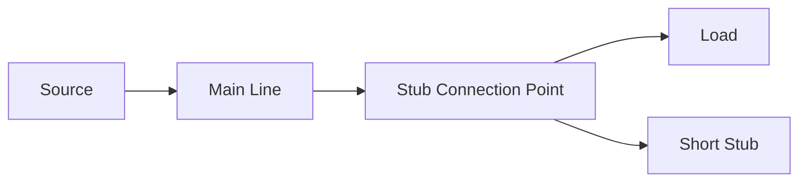

**Matching Steps:**

| Step | Process | Purpose |
|------|---------|---------|
| **1** | Calculate load admittance | Find Y_L = 1/Z_L |
| **2** | Move toward generator | Find point where G = G₀ |
| **3** | Add stub susceptance | Cancel reactive part |
| **4** | Achieve matching | Y_total = Y₀ |

**Design Equations:**

- **Distance to stub:** d = (λ/2π) × tan⁻¹(√(R_L/R₀))
- **Stub length:** l = (λ/2π) × tan⁻¹(B_stub/Y₀)

**Applications:**

- **Antenna matching**
- **Amplifier input/output**
- **Filter design**

**Mnemonic:** "Single Stubs Stop Standing Waves Successfully"

---

## Question 1(c) OR [7 marks]

**Compare rectangular and circular waveguides.**

**Answer**:

**Comparison Table:**

| Parameter | Rectangular Waveguide | Circular Waveguide |
|-----------|----------------------|-------------------|
| **Shape** | Rectangular cross-section | Circular cross-section |
| **Dominant Mode** | TE₁₀ | TE₁₁ |
| **Cutoff Frequency** | fc = c/(2a) for TE₁₀ | fc = 1.841c/(2πa) for TE₁₁ |
| **Power Handling** | Lower | Higher |
| **Manufacturing** | Easy | Difficult |
| **Mode Separation** | Good | Poor |
| **Applications** | Radar, microwave ovens | Satellite communication |

**Key Advantages:**

- **Rectangular**: Better mode control, easier fabrication
- **Circular**: Higher power capacity, rotating polarization

**Mnemonic:** "Rectangular is Regular, Circular Carries Current"

---

## Question 2(a) [3 marks]

**Define group velocity and phase velocity in relation to them.**

**Answer**:

**Velocity Definitions:**

| Velocity Type | Formula | Physical Meaning |
|---------------|---------|------------------|
| **Phase Velocity** | vₚ = ω/β = c/√(1-(fc/f)²) | Speed of constant phase |
| **Group Velocity** | vₘ = dω/dβ = c√(1-(fc/f)²) | Speed of signal energy |

**Relationship:** vₚ × vₘ = c²

**Key Points:**

- **Phase velocity**: Always > c (speed of light)
- **Group velocity**: Always < c
- **Signal travels**: At group velocity

**Mnemonic:** "Phase is Fast, Group Carries Message"

---

## Question 2(b) [4 marks]

**Describe the principles and workings of the Directional coupler.**

**Answer**:

**Directional Coupler Principle:**

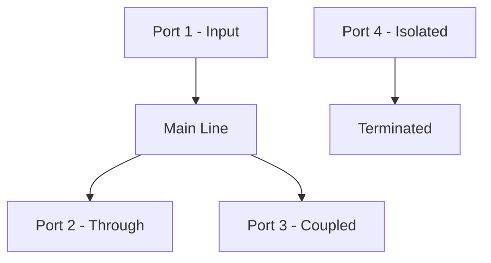

**Working Principle:**

- **Electromagnetic coupling** between two transmission lines
- **Power division** based on coupling factor
- **Directional sensitivity** to wave direction

**Key Parameters:**

- **Coupling Factor**: C = 10 log(P₁/P₃) dB
- **Directivity**: D = 10 log(P₃/P₄) dB
- **Insertion Loss**: IL = 10 log(P₁/P₂) dB

**Mnemonic:** "Directional Couplers Divide Power Precisely"

---

## Question 2(c) [7 marks]

**Explain Magic TEE with construction, operation and application.**

**Answer**:

**Magic TEE Construction:**

```goat
         E-Arm (Port 3)
              |
              |
    Port 1----+----Port 2
              |
              |
         H-Arm (Port 4)
```

**Operating Principles:**

| Port | Function | Field Pattern |
|------|----------|---------------|
| **Port 1 & 2** | Collinear ports | Symmetric |
| **Port 3 (E-Arm)** | E-plane port | Electric field coupling |
| **Port 4 (H-Arm)** | H-plane port | Magnetic field coupling |

**Scattering Properties:**

- **Isolation**: Port 3 ↔ Port 4
- **Power division**: Equal split when matched
- **Phase relationships**: 0° and 180°

**Applications:**

- **Mixers and modulators**
- **Power combiners**
- **Impedance bridges**
- **Antenna feeds**

**Mnemonic:** "Magic TEE Creates Perfect Isolation"

---

## Question 2(a) OR [3 marks]

**Draw TE₁₀, TE₂₀ modes for rectangular waveguide.**

**Answer**:

**TE₁₀ Mode (Dominant Mode):**

```goat
  a
┌─────────────┐
│      ↑      │ b
│   E  ↑  E   │
│      ↑      │
└─────────────┘
  Field Lines
```

**TE₂₀ Mode:**

```goat
  a
┌─────────────┐
│  ↑     ↓    │ b
│  ↑  E  ↓  E │
│  ↑     ↓    │
└─────────────┘
  Two Half-Waves
```

**Mode Characteristics:**

- **TE₁₀**: One half-wave variation in x-direction
- **TE₂₀**: Two half-wave variations in x-direction
- **Field patterns**: Electric field perpendicular to propagation

**Mnemonic:** "TE modes have Electric Transverse"

---

## Question 2(b) OR [4 marks]

**Describe the Hybrid Ring with a necessary sketch.**

**Answer**:

**Hybrid Ring Structure:**

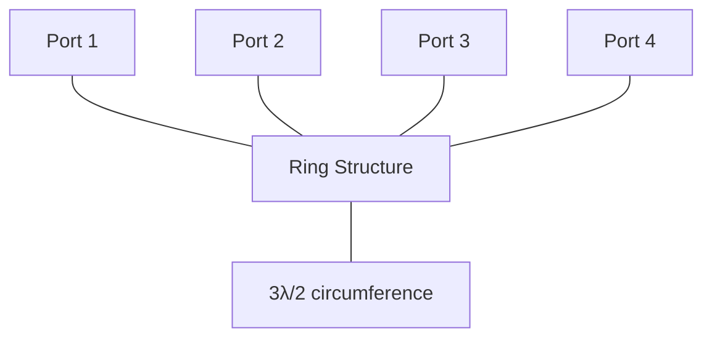

**Operating Principle:**

- **Ring circumference**: 3λ/2
- **Port spacing**: λ/4 apart
- **Power division**: Equal split between adjacent ports

**Key Features:**

- **Isolation**: Between opposite ports
- **Phase relationships**: 0° and 180°
- **Impedance**: Matched at all ports

**Mnemonic:** "Hybrid Rings Handle Half-wavelengths"

---

## Question 2(c) OR [7 marks]

**Explain the Isolator with principles, construction and operation.**

**Answer**:

**Isolator Principle:**

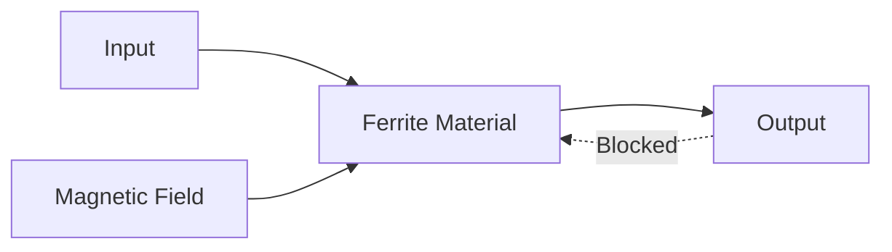

**Construction Elements:**

| Component | Function | Material |
|-----------|----------|----------|
| **Ferrite** | Non-reciprocal medium | Yttrium Iron Garnet |
| **Magnet** | Bias field | Permanent magnet |
| **Resistive Load** | Absorb reverse power | Carbon/ceramic |

**Operating Principle:**

- **Faraday rotation** in magnetized ferrite
- **Non-reciprocal** phase shift
- **Forward transmission**: Low loss
- **Reverse transmission**: High attenuation

**Applications:**

- **Amplifier protection**
- **Oscillator isolation**
- **Antenna systems**

**Specifications:**

- **Isolation**: 20-30 dB typical
- **Insertion Loss**: < 0.5 dB

**Mnemonic:** "Isolators Ignore Reverse Reflections"

---

## Question 3(a) [3 marks]

**Draw a Traveling wave tube amplifier.**

**Answer**:

**TWT Amplifier Structure:**

```goat
Electron Gun    Helix Structure    Collector
     |               |                |
     v               v                v
    [|]---> ~~~~~~~~~~~~~~~~~~~~~~~~ -->|
         Electron    RF Input         RF Output
         Beam        Coupler          Coupler
                        |
                   Attenuator
```

**Key Components:**

- **Electron gun**: Produces electron beam
- **Helix**: Slow-wave structure
- **Couplers**: Input/output RF connections
- **Collector**: Collects spent electrons

**Mnemonic:** "TWT Transfers Wave Through Helix"

---

## Question 3(b) [4 marks]

**Describes various types of hazards due to microwave radiation.**

**Answer**:

**Microwave Radiation Hazards:**

| Hazard Type | Effects | Safety Limit |
|-------------|---------|--------------|
| **HERP** (Personnel) | Tissue heating, burns | 10 mW/cm² |
| **HERO** (Ordnance) | Explosive detonation | Variable |
| **HERF** (Fuel) | Fuel ignition | 5 mW/cm² |

**Biological Effects:**

- **Thermal effects**: Tissue heating above 41°C
- **Non-thermal effects**: Cellular damage
- **Sensitive organs**: Eyes, reproductive organs

**Protection Measures:**

- **Shielding**: Conductive enclosures
- **Distance**: Power density ∝ 1/r²
- **Time limits**: Exposure duration control
- **Warning systems**: Radiation detectors

**Mnemonic:** "Heat Energy Requires Proper Protection"

---

## Question 3(c) [7 marks]

**Explain two cavity klystrons construction and operation with an Applegate diagram.**

**Answer**:

**Two-Cavity Klystron Structure:**

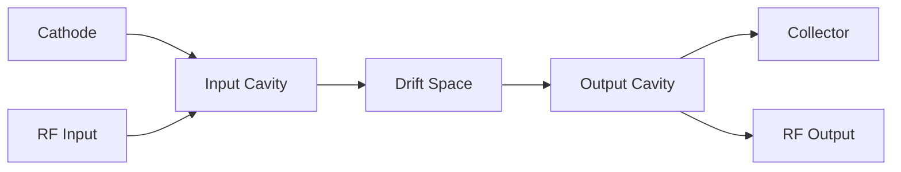

**Applegate Diagram:**

```goat
Velocity
   ^
   |    Bunched    Bunched
   |   /      \   /      \
v₀ +--+        \-/        \--
   |   \        /\        /
   |    Bunched    Bunched
   |
   +-------------------------> Distance
   Input   Drift    Output
   Cavity  Space    Cavity
```

**Operation Principle:**

| Stage | Process | Result |
|-------|---------|---------|
| **Velocity Modulation** | RF input varies electron speed | Speed variation |
| **Bunching** | Fast electrons catch slow ones | Current bunches |
| **Energy Extraction** | Bunches interact with output cavity | RF amplification |

**Key Parameters:**

- **Transit time**: Critical for bunching
- **Drift space length**: Optimized for maximum bunching
- **Cavity tuning**: Resonant frequency matching

**Applications:**

- **Radar transmitters**
- **Satellite communications**
- **Linear accelerators**

**Mnemonic:** "Klystrons Create Bunches Through Velocity Variation"

---

## Question 3(a) OR [3 marks]

**Draw the block diagram of the attenuation measurement method for microwave frequency.**

**Answer**:

**Attenuation Measurement Setup:**

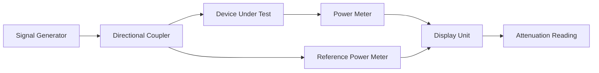

**Measurement Process:**

- **Reference measurement**: Without DUT
- **Insertion measurement**: With DUT
- **Attenuation calculation**: A = P₁ - P₂ (dB)

**Mnemonic:** "Attenuation Appears After Accurate Assessment"

---

## Question 3(b) OR [4 marks]

**Describe the limitation of vacuum tubes at microwave range.**

**Answer**:

**Vacuum Tube Limitations:**

| Limitation | Cause | Effect |
|------------|-------|--------|
| **Transit Time** | Finite electron travel time | Reduced gain at high frequency |
| **Lead Inductance** | Connecting wire inductance | Poor impedance matching |
| **Inter-electrode Capacitance** | Plate-cathode capacitance | Feedback and instability |
| **Skin Effect** | High-frequency current distribution | Increased resistance |

**Frequency-Related Problems:**

- **Input impedance**: Becomes reactive
- **Gain-bandwidth**: Product limitation
- **Noise figure**: Increases with frequency
- **Power handling**: Decreases

**Solutions:**

- **Special tube designs**: Lighthouse tubes
- **Cavity resonators**: Replace tuned circuits
- **Short leads**: Minimize inductance

**Mnemonic:** "Vacuum Tubes Fail Fast at High Frequencies"

---

## Question 3(c) OR [7 marks]

**Explain the Principle, construction, effect of the electric and magnetic field and operation of the magnetron in detail.**

**Answer**:

**Magnetron Construction:**

```goat
        Anode Vanes
    ╭─────┬─────┬─────╮
   ╱   1  │  2  │  3   ╲
  ╱       │     │       ╲
 ╱    8   │  C  │   4    ╲
│         │     │         │
│    7    │  +  │    5    │
 ╲        │     │        ╱
  ╲   6   │     │       ╱
   ╲─────┴─────┴─────╱
        Cathode (C)
```

**Operating Principle:**

| Field | Direction | Effect |
|-------|-----------|--------|
| **Electric Field** | Radial (cathode to anode) | Accelerates electrons |
| **Magnetic Field** | Axial (perpendicular to page) | Deflects electrons |
| **Combined Effect** | Cycloid motion | Phase synchronization |

**Operation Stages:**

1. **Electron Emission**: Heated cathode emits electrons
2. **Cycloid Motion**: E×B fields create spiral paths
3. **Synchronization**: Electrons synchronize with RF field
4. **Energy Transfer**: Kinetic energy → RF energy
5. **Output Coupling**: RF extracted through waveguide

**Key Parameters:**

- **Magnetic flux density**: B = 2πmf/e
- **Hull cutoff voltage**: VH = (eB²R²)/(8m)
- **Frequency**: f = eB/(2πm) × (anode modes)

**Applications:**

- **Microwave ovens** (2.45 GHz)
- **Radar transmitters**
- **Industrial heating**

**Mnemonic:** "Magnetrons Make Microwaves Through Magnetic Motion"

---

## Question 4(a) [3 marks]

**Explain the working principle of a varactor diode using a graph.**

**Answer**:

**Varactor Diode Characteristics:**

```goat
Capacitance (pF)
      ^
      |     
   100|╲    
      | ╲   
    50|  ╲  
      |   ╲ 
    10|    ╲
      |     ╲_____
      +─────────────> Reverse Voltage (V)
      0   5   10   15
```

**Working Principle:**

- **Reverse bias operation**: Diode operated in reverse
- **Depletion layer**: Acts as dielectric
- **Variable capacitance**: C ∝ 1/√VR
- **Voltage tuning**: Capacitance controlled by voltage

**Applications:**

- **Voltage-controlled oscillators**
- **Frequency multipliers**
- **Parametric amplifiers**

**Mnemonic:** "Varactors Vary Capacitance Via Voltage"

---

## Question 4(b) [4 marks]

**Explain the Gunn Effect and negative resistance for Gunn diode.**

**Answer**:

**Gunn Effect Mechanism:**

| Parameter | Lower Valley | Upper Valley |
|-----------|--------------|--------------|
| **Energy Level** | Lower | Higher |
| **Electron Mobility** | High (μ₁) | Low (μ₂) |
| **Effective Mass** | Light | Heavy |

**Transfer Characteristic:**

```goat
Current (mA)
      ^
      |   ╱╲
      |  ╱  ╲ Negative
      | ╱    ╲ Resistance
      |╱      ╲ Region
      +────────╲──> Voltage (V)
             Threshold
```

**Negative Resistance:**

- **Threshold voltage**: Electrons transfer to upper valley
- **Current decrease**: Due to reduced mobility
- **Oscillation**: Negative resistance enables
- **Domain formation**: High-field domains propagate

**Key Points:**

- **Materials**: GaAs, InP
- **Frequency range**: 1-100 GHz
- **Efficiency**: 5-20%

**Mnemonic:** "Gunn diodes Generate oscillations through Negative resistance"

---

## Question 4(c) [7 marks]

**Explain frequency measurement method for microwave frequency.**

**Answer**:

**Direct Frequency Measurement:**

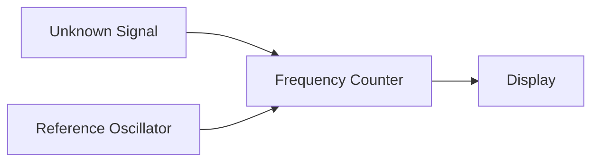

**Indirect Methods:**

| Method | Principle | Accuracy |
|--------|-----------|----------|
| **Wavemeter** | Cavity resonance | ±0.1% |
| **Beat Frequency** | Heterodyne mixing | ±0.01% |
| **Standing Wave** | λ/2 measurement | ±0.5% |

**Cavity Wavemeter Setup:**

```goat
   Waveguide
  ┌─────────────┐
  │    ┌───┐    │
──┤    │ C │    ├── Output
  │    └───┘    │
  └─────────────┘
   Tuning Screw
```

**Measurement Procedure:**

1. **Coupling**: Weakly couple to signal line
2. **Tuning**: Adjust cavity for resonance
3. **Indication**: Monitor output for minimum/maximum
4. **Calibration**: Read frequency from calibrated scale

**Beat Frequency Method:**

- **Local oscillator**: Known reference frequency
- **Mixer**: Generates beat frequency
- **Measurement**: fbeat = |fsignal - fLO|

**Mnemonic:** "Frequency Found through Careful Cavity Calibration"

---

## Question 4(a) OR [3 marks]

**Explain the working of a PIN diode as a switch.**

**Answer**:

**PIN Diode Structure:**

```goat
P+ Region | Intrinsic | N+ Region
    │         │           │
    ├─────────┼───────────┤
   Holes   No Carriers  Electrons
```

**Switching Operation:**

| Bias Condition | Intrinsic Region | RF Impedance | Switch State |
|----------------|------------------|--------------|--------------|
| **Forward Bias** | Flooded with carriers | Low (~1Ω) | ON (Closed) |
| **Reverse Bias** | Depleted | High (~10kΩ) | OFF (Open) |
| **Zero Bias** | Few carriers | Medium | Variable |

**Key Advantages:**

- **Fast switching**: Nanosecond response
- **Low insertion loss**: When ON
- **High isolation**: When OFF
- **Wide frequency range**: DC to microwave

**Applications:**

- **RF switches**
- **Modulators**
- **Attenuators**
- **Phase shifters**

**Mnemonic:** "PIN diodes Perform Perfect switching"

---

## Question 4(b) OR [4 marks]

**Explain stripeline and Microstrip circuits.**

**Answer**:

**Stripline Configuration:**

```goat
  Ground Plane
 ───────────────
     Dielectric
 ─────┬─────────  ← Signal Conductor
     Dielectric
 ───────────────
  Ground Plane
```

**Microstrip Configuration:**

```goat
  Signal Conductor
 ─────┬─────────
    Dielectric
 ───────────────
   Ground Plane
```

**Comparison Table:**

| Parameter | Stripline | Microstrip |
|-----------|-----------|------------|
| **Ground Planes** | Two (sandwich) | One (bottom) |
| **Shielding** | Complete | Partial |
| **Dispersion** | Lower | Higher |
| **Manufacturing** | Complex | Simple |
| **Cost** | Higher | Lower |

**Applications:**

- **Stripline**: High-performance systems
- **Microstrip**: PCB circuits, antennas

**Design Equations:**

- **Characteristic impedance**: Function of w/h ratio
- **Effective permittivity**: εeff = (εr + 1)/2

**Mnemonic:** "Striplines are Sandwiched, Microstrips are Mounted"

---

## Question 4(c) OR [7 marks]

**Explain the principles and process of amplification for a Parametric amplifier.**

**Answer**:

**Parametric Amplifier Principle:**

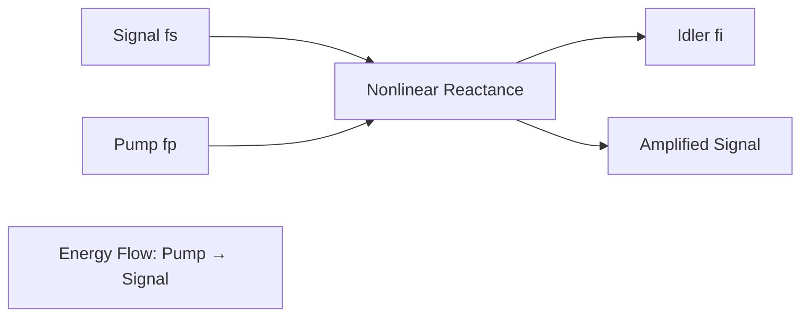

**Frequency Relationships:**

| Parameter | Relationship | Typical Values |
|-----------|--------------|----------------|
| **Pump Frequency** | fp = fs + fi | 10 GHz |
| **Signal Frequency** | fs (input) | 1 GHz |
| **Idler Frequency** | fi = fp - fs | 9 GHz |

**Amplification Process:**

1. **Nonlinear Element**: Varactor diode provides time-varying capacitance
2. **Pump Power**: High-frequency pump supplies energy
3. **Frequency Mixing**: Three-frequency interaction
4. **Energy Transfer**: Pump energy → Signal energy
5. **Impedance Matching**: Optimize power transfer

**Circuit Configuration:**

```goat
Signal ──┬── Varactor ──┬── Amplified
Input   │    Diode     │    Output
        │              │
       ┌┴┐            ┌┴┐
       │C│            │L│ Idler
       │ │            │ │ Circuit
       └─┘            └─┘
        │              │
      Pump ────────────┘
      Input
```

**Key Advantages:**

- **Low noise figure**: Near quantum limit
- **High gain**: 10-20 dB typical
- **Wide bandwidth**: Limited by pump circuit

**Applications:**

- **Satellite receivers**
- **Radio astronomy**
- **Low-noise amplifiers**

**Design Considerations:**

- **Pump power**: Sufficient for nonlinear operation
- **Impedance matching**: All three frequencies
- **Stability**: Prevent oscillation

**Mnemonic:** "Parametric amplifiers Pump Power into signal Perfectly"

---

## Question 5(a) [3 marks]

**Compare RADAR and SONAR.**

**Answer**:

**RADAR vs SONAR Comparison:**

| Parameter | RADAR | SONAR |
|-----------|-------|-------|
| **Wave Type** | Electromagnetic | Acoustic |
| **Medium** | Air/Vacuum | Water |
| **Frequency** | 300 MHz - 30 GHz | 1 kHz - 1 MHz |
| **Speed** | 3×10⁸ m/s | 1500 m/s (water) |
| **Range** | Up to 1000 km | Up to 100 km |
| **Applications** | Aircraft, weather | Submarines, fishing |

**Common Principles:**

- **Echo ranging**: Measure time-of-flight
- **Doppler effect**: Detect moving targets
- **Beam forming**: Directional transmission

**Key Differences:**

- **Propagation**: EM waves vs sound waves
- **Attenuation**: Different loss mechanisms
- **Resolution**: Frequency dependent

**Mnemonic:** "RADAR sees Radio waves, SONAR hears Sound waves"

---

## Question 5(b) [4 marks]

**Write the name of RADAR display method and explain anyone.**

**Answer**:

**RADAR Display Methods:**

| Display Type | Description | Application |
|--------------|-------------|-------------|
| **A-Scope** | Range vs amplitude | Target detection |
| **B-Scope** | Range vs azimuth | 2D position |
| **C-Scope** | Azimuth vs elevation | 3D tracking |
| **PPI** | Plan Position Indicator | Air traffic control |
| **RHI** | Range Height Indicator | Weather radar |

**PPI Display Explanation:**

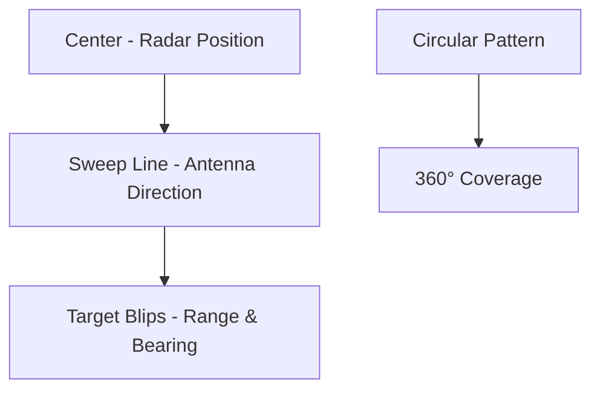

**PPI Features:**

- **Polar coordinates**: Range and bearing
- **Rotating sweep**: Follows antenna rotation
- **Persistence**: Targets remain visible
- **Scale selection**: Adjustable range

**Display Process:**

1. **Sweep generation**: Synchronized with antenna
2. **Target plotting**: Distance and direction
3. **Intensity modulation**: Target strength
4. **Map overlay**: Geographic reference

**Mnemonic:** "PPI Provides Perfect Position Information"

---

## Question 5(c) [7 marks]

**Explain the basic pulse radar system with a block diagram.**

**Answer**:

**Pulse Radar Block Diagram:**

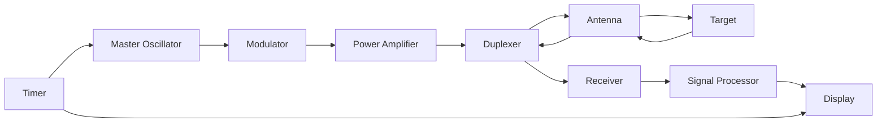

**System Components:**

| Component | Function | Key Parameters |
|-----------|----------|----------------|
| **Master Oscillator** | Generate RF signal | Frequency stability |
| **Modulator** | Create pulse train | Pulse width, PRF |
| **Power Amplifier** | Boost transmit power | Peak power, efficiency |
| **Duplexer** | Switch Tx/Rx | Isolation, switching time |
| **Antenna** | Radiate/receive | Gain, beamwidth |
| **Receiver** | Amplify echo signals | Sensitivity, bandwidth |

**Operating Sequence:**

1. **Transmission Phase**:
   - Master oscillator generates RF
   - Modulator creates pulses
   - Power amplifier boosts signal
   - Duplexer routes to antenna

2. **Reception Phase**:
   - Antenna receives echoes
   - Duplexer routes to receiver
   - Signal processing extracts information
   - Display shows target data

**Key Equations:**

- **Range**: R = ct/2 (where t = round-trip time)
- **Maximum range**: Rmax = cPRT/2
- **Range resolution**: ΔR = cτ/2

**Performance Parameters:**

- **PRF**: Pulse Repetition Frequency
- **Duty cycle**: τ × PRF
- **Average power**: Peak power × duty cycle

**Mnemonic:** "Pulse Radar Properly Processes Reflected signals"

---

## Question 5(a) OR [3 marks]

**List the application of microwave frequency.**

**Answer**:

**Microwave Applications:**

| Application Category | Specific Uses | Frequency Band |
|---------------------|---------------|----------------|
| **Communication** | Satellite, cellular, WiFi | 1-40 GHz |
| **Radar Systems** | Weather, air traffic, military | 1-35 GHz |
| **Industrial** | Heating, drying, medical | 0.9-5.8 GHz |
| **Navigation** | GPS, aircraft landing | 1-15 GHz |
| **Scientific** | Radio astronomy, research | 1-300 GHz |
| **Medical** | Diathermy, cancer treatment | 0.9-2.45 GHz |
| **Domestic** | Microwave ovens | 2.45 GHz |

**Key Points:**

- **ISM bands** (Industrial, Scientific, Medical): License-free
- **Penetration ability**: Depends on frequency and material
- **Atmospheric absorption**: Increases with frequency

**Mnemonic:** "Microwaves Serve Many Applications Perfectly"

---

## Question 5(b) OR [4 marks]

**Compare PULSED RADAR and CW RADAR.**

**Answer**:

**PULSED vs CW RADAR Comparison:**

| Parameter | Pulsed RADAR | CW RADAR |
|-----------|--------------|----------|
| **Transmission** | Pulse train | Continuous wave |
| **Range Measurement** | Time-of-flight | Frequency shift |
| **Velocity Measurement** | Doppler in pulses | Direct Doppler |
| **Antenna** | Single (duplexer) | Separate Tx/Rx |
| **Power** | High peak, low average | Low continuous |
| **Range Resolution** | Pulse width limited | Poor |
| **Velocity Resolution** | Limited | Excellent |
| **Complexity** | High | Low |
| **Cost** | Higher | Lower |

**Operational Differences:**

**Pulsed RADAR:**

- **Range equation**: R = ct/2
- **Maximum range**: Limited by PRF
- **Blind ranges**: Multiple of cPRT/2
- **Applications**: Long-range detection

**CW RADAR:**

- **Doppler equation**: fd = 2vr/λ
- **Range measurement**: Requires FM modulation
- **No blind ranges**: Continuous operation
- **Applications**: Speed measurement, proximity

**Key Advantages:**

- **Pulsed**: Better range capability, target separation
- **CW**: Better velocity accuracy, simpler design

**Mnemonic:** "Pulsed measures Range, CW measures Velocity"

---

## Question 5(c) OR [7 marks]

**Explain MTI Radar with the block diagram.**

**Answer**:

**MTI RADAR Block Diagram:**

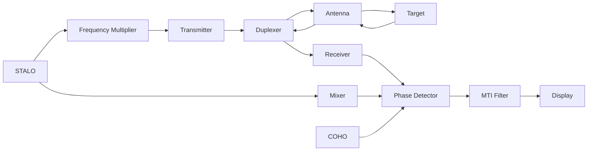

**MTI System Components:**

| Component | Full Form | Function |
|-----------|-----------|----------|
| **STALO** | Stable Local Oscillator | Reference frequency |
| **COHO** | Coherent Oscillator | Phase reference |
| **MTI Filter** | Moving Target Indicator | Clutter suppression |
| **Phase Detector** | - | Compare signal phases |

**MTI Operating Principle:**

**Pulse-to-Pulse Comparison:**

```goat
Signal Amplitude
       ^
       |    Fixed Target (Clutter)
       |    ________________
       |   |                |
       |   |                |
       |   |                |
   ____+___|________________|____
       |                        
       |    Moving Target
       |     /\      /\
       |    /  \    /  \
       |   /    \  /    \
   ____+__/______\/______\______
       |
       +-------------------------> Time
           Pulse 1    Pulse 2
```

**MTI Process:**

1. **Coherent transmission**: Maintain phase relationships
2. **Echo reception**: Preserve phase information
3. **Phase comparison**: Compare successive pulses
4. **Clutter cancellation**: Subtract stationary returns
5. **Moving target detection**: Enhance moving targets

**Key Equations:**

- **Doppler frequency**: fd = 2vr cos(θ)/λ
- **Phase change**: Δφ = 4πvr/λ × PRT
- **Blind speeds**: vb = nλ/(2PRT)

**MTI Improvement Factor:**

- **Definition**: Ratio of clutter power before/after MTI
- **Typical values**: 20-40 dB
- **Factors affecting**: System stability, clutter characteristics

**Limitations:**

- **Blind speeds**: Targets invisible at certain velocities
- **Tangential targets**: Radial velocity component needed
- **Weather effects**: Atmospheric fluctuations

**Applications:**

- **Air traffic control**: Separate aircraft from ground clutter
- **Weather radar**: Distinguish precipitation from terrain
- **Military radar**: Detect moving vehicles/aircraft

**Mnemonic:** "MTI Makes Targets Identifiable by Movement"
