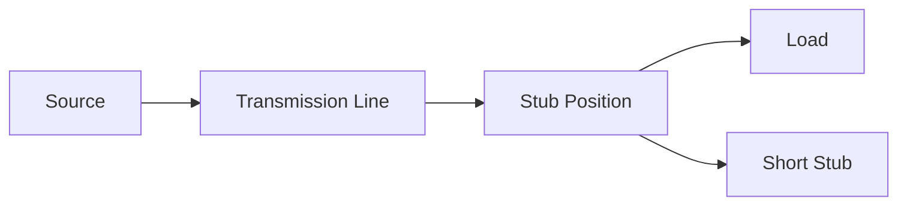
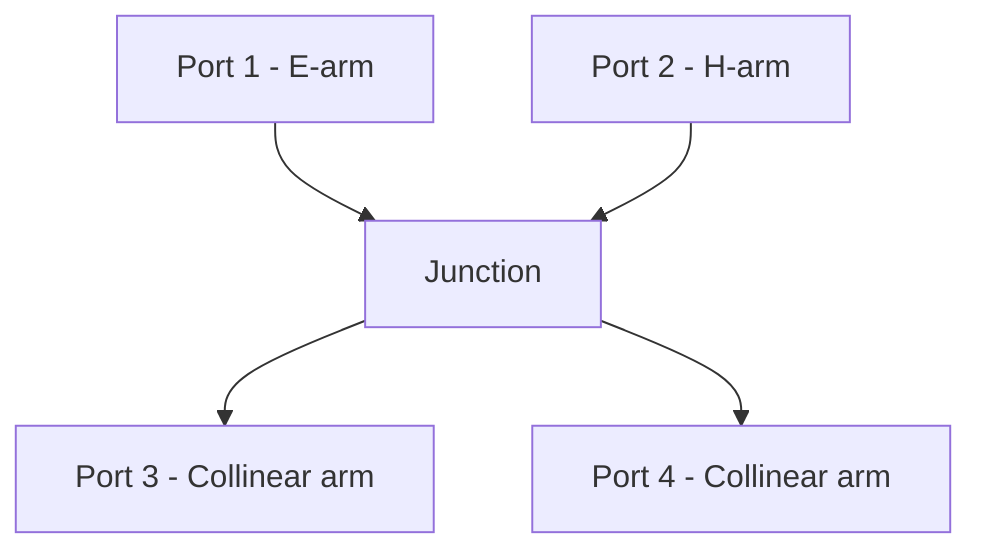
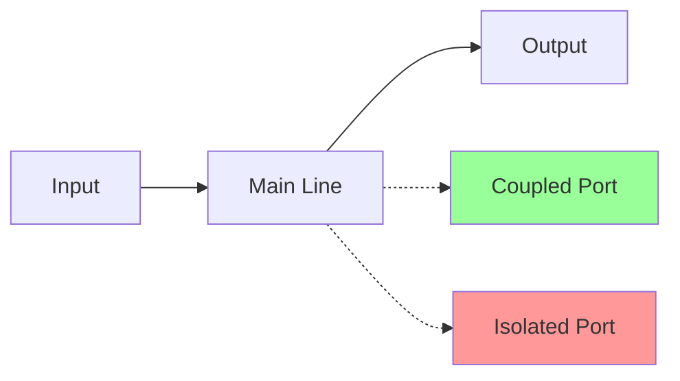
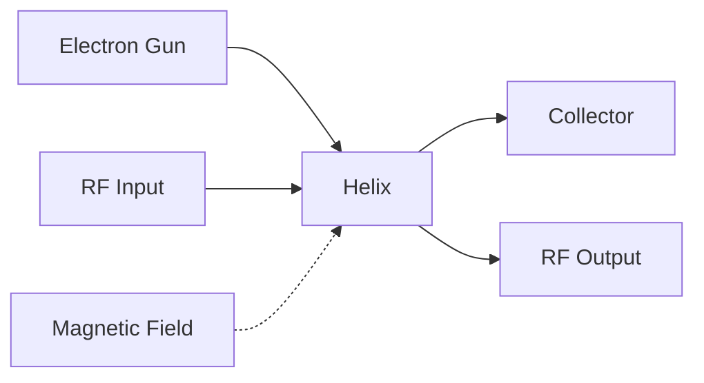
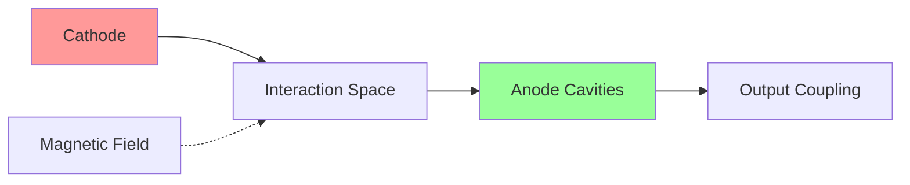
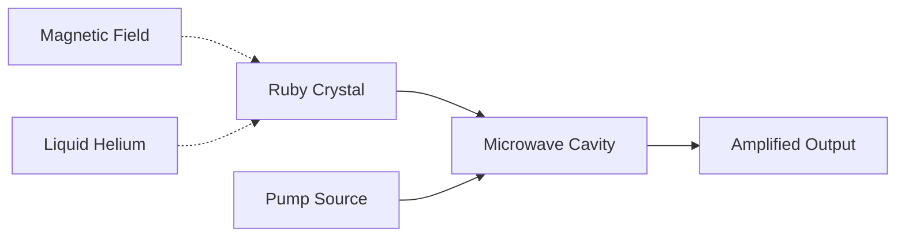
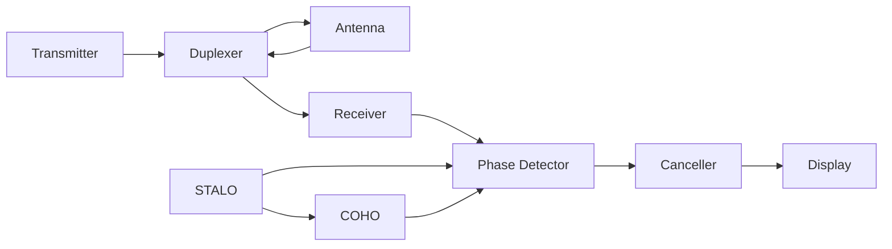
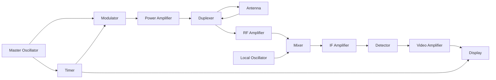

## પ્રશ્ન 1(અ) [3 ગુણ]

**ચાર માઇક્રોવેવ આવર્તન બેન્ડની તેમની આવર્ત શ્રેણી સાથે અને તેનાં ઉપયોગો સાથેની સૂચી બનાવો.**

**જવાબ**:

| બેન્ડ | આવર્તન શ્રેણી | ઉપયોગો |
|------|-------------|--------|
| **L-band** | 1-2 GHz | GPS, Mobile communication |
| **S-band** | 2-4 GHz | WiFi, Bluetooth, Radar |
| **C-band** | 4-8 GHz | Satellite communication |
| **X-band** | 8-12 GHz | Military radar, Weather radar |

**મેમરી ટ્રીક:** "Little Satellites Communicate eXcellently"

---

## પ્રશ્ન 1(બ) [4 ગુણ]

**એક જ સ્ટ્બનો ઉપયોગ કરીને impedance matching ની પ્રક્રિયા સમજાવો.**

**જવાબ**:

**Single stub matching** એ **short-circuited stub** વડે reflection દૂર કરવાની પદ્ધતિ છે.

**પ્રક્રિયા:**

- **Stub લંબાઈ**: Reactive impedance પ્રદાન કરે છે
- **Stub સ્થાન**: Load થી Smith chart વડે ગણવામાં આવે છે
- **Matching condition**: Real part = Z₀, imaginary part = 0



**મેમરી ટ્રીક:** "Stub Positioned for Perfect Matching"

---

## પ્રશ્ન 1(ક) [7 ગુણ]

**લોસલેસ ટ્રાન્સમિશન લાઇનની લાક્ષણિકતાઓ જણાવો અને બે વાયર ટ્રાન્સમિશન લાઇન માટે સામાન્ય સમીકરણ મેળવો.**

**જવાબ**:

**લોસલેસ લાઇનની લાક્ષણિકતાઓ:**

- **કોઈ power loss નથી**: R = 0, G = 0
- **સ્થિર amplitude**: કોઈ attenuation નથી
- **માત્ર phase delay**: સિગ્નલ delayed પણ weakened નથી
- **Standing wave pattern**: Reflections ને કારણે બને છે

**સામાન્ય સમીકરણો:**

Voltage માટે: **V(z) = V₊e^(-γz) + V₋e^(γz)**
Current માટે: **I(z) = (V₊/Z₀)e^(-γz) - (V₋/Z₀)e^(γz)**

જ્યાં:

- **γ = α + jβ** (propagation constant)
- **Z₀ = √(L/C)** (characteristic impedance)
- **Lossless line માટે**: α = 0, γ = jβ

**મેમરી ટ્રીક:** "Lossless Lines Love Low Loss"

---

## પ્રશ્ન 1(ક) OR [7 ગુણ]

**સ્થાયી તરંગ વ્યાખ્યાયિત કરો. શોર્ટ સર્કિટ અને ઓપન સર્કિટ લાઇન માટે સ્ટેન્ડિંગ વેવ પેટર્ન દોરો અને સમજાવો.**

**જવાબ**:

**Standing Wave:** **આગળ અને પરાવર્તિત તરંગોના** constructive અને destructive interference થી બનતો સ્થિર pattern.

**Short Circuit Line:**

- **Current maximum** short circuit પર
- **Voltage minimum** short circuit પર
- **Minima વચ્ચેનું અંતર**: λ/2

**Open Circuit Line:**

- **Voltage maximum** open circuit પર
- **Current minimum** open circuit પર
- **Maxima વચ્ચેનું અંતર**: λ/2

```goat
Short Circuit:     Open Circuit:
                  
V |    /\            V |  /\    /\
  |   /  \             |/    \/    \
  |  /    \            |           
  |_/______\           |____________
    0  λ/4  λ/2         0  λ/4  λ/2
    
I |  /\    /\        I |    /\
  | /  \  /  \         |   /  \
  |/    \/    \        |  /    \
  |             \      |_/______\
    0  λ/4  λ/2         0  λ/4  λ/2
```

**મેમરી ટ્રીક:** "Short Circuits Current, Open Circuits Voltage"

---

## પ્રશ્ન 2(અ) [3 ગુણ]

**મેજિક TEE ની કામગીરી દોરો અને સમજાવો.**

**જવાબ**:

**Magic TEE** એ E-plane અને H-plane tees ને મિલાવીને બનાવેલ **ચાર પોર્ટ** વાળી device છે જે opposite ports વચ્ચે isolation આપે છે.



**કામગીરી:**

- **E-arm અને H-arm**: એકબીજાથી isolated રહે છે
- **Sum port**: Collinear arms ના signals ને add કરે છે
- **Difference port**: Signals ને subtract કરે છે

**મેમરી ટ્રીક:** "Magic Tee Mixes Modes"

---

## પ્રશ્ન 2(બ) [4 ગુણ]

**હાયબ્રિડ રિંગની કામગીરી સમજાવો.**

**જવાબ**:

**Hybrid Ring** એ **ચાર પોર્ટ** વાળી **ગોળાકાર waveguide** છે જે power division અને isolation માટે વપરાય છે.

**બાંધકામ:**

- **Ring circumference**: 1.5λ
- **Port spacing**: Adjacent ports વચ્ચે λ/4
- **Matched impedance**: દરેક port Z₀ સાથે matched

**કામગીરી:**

- **Power splitting**: Input બે output ports વચ્ચે સમાન રીતે વહેંચાય છે
- **Isolation**: Opposite ports isolated રહે છે
- **Phase difference**: Output ports વચ્ચે 180°

**મેમરી ટ્રીક:** "Ring Runs Round for Power Sharing"

---

## પ્રશ્ન 2(ક) [7 ગુણ]

**"સર્ક્યુલેટર" ના બાંધકામ અને કાર્યસિદ્ધાંત સમજાવો. તેની એપ્લિકેશનોની સૂચિ બનાવો.**

**જવાબ**:

**બાંધકામ:**

- **ત્રણ પોર્ટ device** **ferrite material** સાથે
- **Permanent magnet** magnetic field બનાવે છે
- **Y-junction waveguide** structure


**કાર્યસિદ્ધાંત:**

- **Faraday rotation**: Magnetic field wave polarization ને rotate કરે છે
- **Unidirectional flow**: Power માત્ર એક દિશામાં વહે છે
- **Non-reciprocal**: વિરુદ્ધ દિશાઓ માટે અલગ behavior

**ઉપયોગો:**

- **Radar systems**: Transmitter ને receiver થી isolate કરે છે
- **Communication**: TX/RX માટે antenna sharing
- **Microwave amplifiers**: Feedback અટકાવે છે

**મેમરી ટ્રીક:** "Circulator Circles Clockwise Continuously"

---

## પ્રશ્ન 2(અ) OR [3 ગુણ]

**લંબચોરસ વેવગાઇડ અને ગોળાઇવાળું વેવગાઇડની તુલના કરો.**

**જવાબ**:

| પેરામીટર | લંબચોરસ | ગોળાકાર |
|----------|---------|--------|
| **Cross-section** | Rectangle | Circle |
| **Dominant mode** | TE₁₀ | TE₁₁ |
| **Cutoff frequency** | સરળ calculation | જટિલ calculation |
| **Manufacturing** | સરળ | મધ્યમ |
| **Power handling** | ઓછી | વધારે |

**મેમરી ટ્રીક:** "Rectangles are Regular, Circles are Complex"

---

## પ્રશ્ન 2(બ) OR [4 ગુણ]

**ડાયરેક્શનલ કપ્લરનું કાર્યસિદ્ધાંત દોરો અને સમજાવો.**

**જવાબ**:

**Directional Coupler** **forward power** ને sample કરે છે અને reflected power થી isolation આપે છે.



**કામગીરી:**

- **Coupling factor**: Extract થતી power નક્કી કરે છે (10-20 dB સામાન્ય)
- **Directivity**: Forward ને reverse power થી isolate કરે છે
- **Insertion loss**: Main line માં minimal loss

**પેરામીટર્સ:**

- **C = 10 log(P₁/P₃)** (Coupling factor)
- **D = 10 log(P₃/P₄)** (Directivity)

**મેમરી ટ્રીક:** "Coupler Couples Carefully in Correct Direction"

---

## પ્રશ્ન 2(ક) OR [7 ગુણ]

**"Travelling Wave Tube" ના બાંધકામ અને કાર્યસિદ્ધાંત સમજાવો. તેની એપ્લિકેશનોની સૂચિ બનાવો.**

**જવાબ**:

**બાંધકામ:**

- **Electron gun**: Electron beam emit કરે છે
- **Helix structure**: RF wave ને slow કરે છે
- **Collector**: Spent electrons collect કરે છે
- **Magnetic focusing**: Beam ને focused રાખે છે



**કાર્યસિદ્ધાંત:**

- **Velocity synchronization**: Electron velocity ≈ RF wave velocity
- **Energy transfer**: Electrons RF wave ને energy આપે છે
- **Continuous interaction**: સંપૂર્ણ helix length પર

**ઉપયોગો:**

- **Satellite communication**: High power amplification
- **Radar transmitters**: High gain amplification
- **Electronic warfare**: Jamming systems

**મેમરી ટ્રીક:** "TWT Transfers Tremendous power Through Travel"

---

## પ્રશ્ન 3(અ) [3 ગુણ]

**ઉચ્ચ VSWR માપન માટે પરોક્ષ પદ્ધતિ સમજાવો.**

**જવાબ**:

**Indirect Method** **calibrated attenuator** વાપરીને **high VSWR** ને measure કરે છે.

**પ્રક્રિયા:**

- **Calibrated attenuator** insert કરો (10-20 dB)
- **Reduced VSWR** measure કરો (VSWR₂)
- **Actual VSWR** calculate કરો: VSWR₁ = VSWR₂ × Attenuator ratio

**ફોર્મ્યુલા**: **VSWR_actual = VSWR_measured × 10^(Attenuation/20)**

**મેમરી ટ્રીક:** "Indirect method uses Intermediate Attenuation"

---

## પ્રશ્ન 3(બ) [4 ગુણ]

**કનવેંશનલ ટ્યૂબ્સની આવર્તન મર્યાદાઓ લખો અને સમજાવો.**

**જવાબ**:

**આવર્તન મર્યાદાઓ:**

- **Transit time effect**: Electron transit time significant બને છે
- **Interelectrode capacitance**: High frequency response limit કરે છે
- **Lead inductance**: Parasitic inductance gain ઘટાડે છે
- **Skin effect**: Current માત્ર surface પર વહે છે

**અસરો:**

- **Reduced gain**: fα કરતાં વધારે frequencies પર
- **Increased noise**: Shot noise ને કારણે
- **Phase shift**: Signal processing માં delay

**ઉકેલો:**

- **Electrode spacing ઘટાડો**
- **Special tube designs વાપરો**
- **Cavity resonators employ કરો**

**મેમરી ટ્રીક:** "Transit Time Troubles Traditional Tubes"

---

## પ્રશ્ન 3(ક) [7 ગુણ]

**એપ્લિગેટ ડાયાગ્રામ સાથે ટૂ કેવિટી ક્લીસ્ટ્રોનનું બાંધકામ અને કાર્ય સમજાવો. તેના ફાયદાઓની યાદી આપો.**

**જવાબ**:

**બાંધકામ:**

- **Electron gun**: Electron beam produce કરે છે
- **Input cavity**: Beam ને velocity modulate કરે છે
- **Drift region**: Beam bunching થાય છે
- **Output cavity**: RF energy extract કરે છે
- **Collector**: Electrons collect કરે છે

**Applegate Diagram:**

```goat
Distance →
    |
    |  ×××××××××××××  ← Fast electrons
    |     ×××××××××    ← Medium electrons  
    |        ××××××    ← Slow electrons
Time|                 
    ↓        Bunching occurs
    
Input        Drift        Output
Cavity       Space        Cavity
```

**કામગીરી:**

- **Velocity modulation**: Input cavity electron velocity vary કરે છે
- **Density modulation**: Electrons drift space માં bunch થાય છે
- **Energy extraction**: Bunched beam output cavity ને energy transfer કરે છે

**ફાયદાઓ:**

- **High power output**: કેટલાક kilowatts
- **High efficiency**: 40-60%
- **Low noise**: Semiconductor devices કરતાં સારી
- **Stable operation**: Excellent frequency stability

**મેમરી ટ્રીક:** "Klystron Kicks with Kinetic Bunching"

---

## પ્રશ્ન 3(અ) OR [3 ગુણ]

**BWOનું બાંધકામ અને કાર્ય સમજાવો.**

**જવાબ**:

**BWO (Backward Wave Oscillator)** **backward wave interaction** વાપરીને oscillation કરે છે.

**બાંધકામ:**

- **Electron gun**: Electron beam emit કરે છે
- **Slow wave structure**: Helix અથવા coupled cavities
- **Collector**: Input end પર
- **Output**: Input end થી

**કામગીરી:**

- **Backward wave**: Electron beam ની વિરુદ્ધ દિશામાં travel કરે છે
- **Negative resistance**: Beam backward wave ને energy આપે છે
- **Oscillation**: જ્યારે gain > losses

**મેમરી ટ્રીક:** "BWO goes Backward While Oscillating"

---

## પ્રશ્ન 3(બ) OR [4 ગુણ]

**માઇક્રોવેવ રેડિયેશનને કારણે જોખમો સમજાવો.**

**જવાબ**:

**જોખમોના પ્રકારો:**

- **HERP**: Hazards of Electromagnetic Radiation to Personnel
- **HERO**: Hazards of Electromagnetic Radiation to Ordnance  
- **HERF**: Hazards of Electromagnetic Radiation to Fuel

**અસરો:**

- **Thermal heating**: High power પર tissue heating
- **આંખોને નુકસાન**: Cataract formation
- **Reproductive effects**: Fertility પર સંભવિત અસર
- **Pacemaker interference**: Electronic device malfunction

**સુરક્ષા:**

- **Power density limits**: < 10 mW/cm²
- **Safety distances**: Far field calculations
- **Warning signs**: Radiation hazard markers
- **Personal monitors**: RF exposure meters

**મેમરી ટ્રીક:** "Microwaves Make Multiple Medical Maladies"

---

## પ્રશ્ન 3(ક) OR [7 ગુણ]

**સુઘડ સ્કેચ સાથે મેગ્નેટ્રોનનું બાંધકામ અને કાર્ય સમજાવો. તેની એપ્લિકેશનોની સૂચિ બનાવો.**

**જવાબ**:

**બાંધકામ:**

- **Circular cathode**: Central hot cathode
- **Cylindrical anode**: Resonant cavities સાથે
- **Permanent magnet**: Axial magnetic field પ્રદાન કરે છે
- **Output coupling**: Loop અથવા probe



**કામગીરી:**

- **Electron cloud**: Interaction space માં બને છે
- **Cycloid motion**: E અને B fields ને કારણે
- **Resonant cavities**: Operating frequency નક્કી કરે છે
- **π-mode oscillation**: Alternate cavities opposite phase માં

**ઉપયોગો:**

- **Microwave ovens**: 2.45 GHz heating
- **Radar systems**: High power pulses
- **Industrial heating**: Material processing
- **Medical diathermy**: Therapeutic heating

**મેમરી ટ્રીક:** "Magnetron Makes Microwaves Magnificently"

---

## પ્રશ્ન 4(અ) [3 ગુણ]

**P-i-N ડાયોડની કામગીરી સમજાવો.**

**જવાબ**:

**P-i-N Diode** માં P અને N regions વચ્ચે **intrinsic layer** છે, જે **voltage-controlled resistor** તરીકે કામ કરે છે.

**બાંધકામ:**

- **P region**: Heavily doped
- **I region**: Intrinsic (undoped)  
- **N region**: Heavily doped

**કામગીરી:**

- **Forward bias**: Low resistance (1-10 Ω)
- **Reverse bias**: High resistance (>10 kΩ)
- **RF switch**: Microwave signals control કરે છે
- **Variable attenuator**: DC bias સાથે resistance vary થાય છે

**મેમરી ટ્રીક:** "PIN controls Power IN Networks"

---

## પ્રશ્ન 4(બ) [4 ગુણ]

**સુઘડ સ્કેચ સાથે વેરેક્ટર ડાયોડના કાર્ય સમજાવો.**

**જવાબ**:

**Varactor Diode** junction capacitance variation વાપરીને **voltage-controlled capacitor** તરીકે કામ કરે છે.

```goat
    +V
     |
  ┌──┴──┐
  │  P  │  N  │ ← Junction
  └──┬──┘
     |
     0V
     
Capacitance vs Voltage:
C |    
  |\    
  | \   
  |  \  
  |___\____
    0  -V (reverse bias)
```

**કામગીરી:**

- **Reverse bias**: Junction deplete કરે છે, capacitance ઘટે છે
- **Bias voltage**: Capacitance value control કરે છે
- **Capacitance ratio**: સામાન્ય રીતે 3:1 થી 10:1
- **Frequency tuning**: Oscillators અને filters માં વપરાય છે

**ઉપયોગો:**

- **VCO tuning**: Voltage controlled oscillators
- **AFC circuits**: Automatic frequency control
- **Parametric amplifiers**: Low noise amplification

**મેમરી ટ્રીક:** "Varactor Varies Capacitance with Voltage"

---

## પ્રશ્ન 4(ક) [7 ગુણ]

**ટનલ ડાયોડનું બાંધકામ અને કાર્ય સમજાવો અને ટનલ બનાવવાની ઘટનાને વિગતવાર સમજાવો. તેની એપ્લિકેશનોની સૂચિ બનાવો.**

**જવાબ**:

**બાંધકામ:**

- **Heavily doped P-N junction**: બંને બાજુ degenerately doped
- **Thin junction**: ~10 nm width
- **Quantum tunneling**: Electrons energy barrier માંથી tunnel કરે છે

**Tunneling Phenomenon:**

- **Quantum effect**: Electrons energy barrier માંથી પસાર થાય છે
- **Band overlap**: Conduction band valence band સાથે overlap કરે છે
- **Probability function**: Tunneling probability barrier width પર depend કરે છે
- **No thermal activation**: Room temperature પર થાય છે

```goat
I-V Characteristic:
I |   
  |  /\    ← Negative resistance
  | /  \   
  |/    \  
  |      \___
  |____________ V
    0  Vp  Vv
    
Vp = Peak voltage
Vv = Valley voltage
```

**કામગીરી:**

- **Forward bias 0-Vp**: Current વધે છે (tunneling)
- **Vp to Vv**: Negative resistance region
- **Beyond Vv**: Normal diode operation

**ઉપયોગો:**

- **High-speed switching**: Picosecond switching
- **Oscillators**: Microwave frequency generation
- **Amplifiers**: Low noise amplification
- **Memory circuits**: Bistable operation

**મેમરી ટ્રીક:** "Tunnel Diode Tunnels Through barriers Terrifically"

---

## પ્રશ્ન 4(અ) OR [3 ગુણ]

**IMPATT ડાયોડની કામગીરીનું વર્ણન કરો.**

**જવાબ**:

**IMPATT (Impact Avalanche Transit Time)** diode **avalanche multiplication** અને **transit time delay** વાપરીને oscillation કરે છે.

**કામગીરી:**

- **Avalanche zone**: Impact ionization carriers બનાવે છે
- **Drift zone**: Carriers constant velocity સાથે drift કરે છે
- **Transit time**: 180° phase shift પ્રદાન કરે છે
- **Negative resistance**: Phase delay ને કારણે

**મુખ્ય parameters:**

- **Breakdown voltage**: સામાન્ય રીતે 20-100V
- **Efficiency**: 10-20%
- **Frequency range**: 1-300 GHz

**મેમરી ટ્રીક:** "IMPATT Impacts with Avalanche Transit Time"

---

## પ્રશ્ન 4(બ) OR [4 ગુણ]

**પેરામેટ્રિક એમ્પ્લીફાયર માટે આવર્તન ઉપર અને નીચે રૂપાંતરણ સમજાવો.**

**જવાબ**:

**Parametric Amplifier** **time-varying reactance** વાપરીને amplification અને frequency conversion કરે છે.

**Up-conversion:**

- **Signal frequency**: fs (input)
- **Pump frequency**: fp (ઘણી વધારે)
- **Output frequency**: fo = fp + fs
- **Energy transfer**: Pump થી signal માં

**Down-conversion:**

- **Signal frequency**: fs (input)  
- **Pump frequency**: fp
- **Output frequency**: fo = fp - fs
- **Mixer operation**: Frequency translation

**ફાયદાઓ:**

- **Low noise**: Quantum-limited performance
- **High gain**: 20-30 dB સામાન્ય
- **Wide bandwidth**: કેટલાક GHz

**મેમરી ટ્રીક:** "Parametric Pump Provides frequency conversion Plus gain"

---

## પ્રશ્ન 4(ક) OR [7 ગુણ]

**RUBY MASER ના બાંધકામ અને કાર્ય સિદ્ધાંતનું વર્ણન કરો. તેની એપ્લિકેશનોની સૂચિ બનાવો.**

**જવાબ**:

**બાંધકામ:**

- **Ruby crystal**: Al₂O₃ lattice માં Cr³⁺ ions
- **Magnetic field**: Strong DC magnetic field
- **Microwave cavity**: Signal frequency પર resonant
- **Pump source**: High frequency klystron
- **Cryogenic cooling**: Liquid helium temperature



**કાર્યસિદ્ધાંત:**

- **Energy levels**: Cr³⁺ ions ને ત્રણ energy levels છે
- **Population inversion**: Pump upper level માં વધારે atoms બનાવે છે
- **Stimulated emission**: Signal photons emission trigger કરે છે
- **Coherent amplification**: Phase-coherent amplification

**Three-level system:**

- **Ground state**: E₁ (સૌથી વધારે populated)
- **Intermediate state**: E₂ (signal frequency)
- **Upper state**: E₃ (pump frequency)

**ઉપયોગો:**

- **Radio astronomy**: Ultra-low noise receivers
- **Satellite communication**: Ground station amplifiers
- **Deep space communication**: NASA tracking stations
- **Research**: Quantum electronics experiments

**મેમરી ટ્રીક:** "RUBY MASER Makes Amazingly Sensitive Electromagnetic Receivers"

---

## પ્રશ્ન 5(અ) [3 ગુણ]

**MTI RADARના કાર્યાત્મક બ્લોક ડાયાગ્રામ દોરો અને સમજાવો.**

**જવાબ**:

**MTI RADAR** **successive echoes** ની comparison કરીને **moving targets** detect કરે છે અને fixed targets cancel કરે છે.



**Components:**

- **STALO**: Stable Local Oscillator
- **COHO**: Coherent Oscillator  
- **Phase detector**: Echo phases compare કરે છે
- **Canceller**: Fixed target echoes remove કરે છે

**મેમરી ટ્રીક:** "MTI Makes Targets Intelligible by Motion"

---

## પ્રશ્ન 5(બ) [4 ગુણ]

**RADAR ને SONAR સાથે સરખાવો.**

**જવાબ**:

| પેરામીટર | RADAR | SONAR |
|----------|-------|-------|
| **Wave type** | Electromagnetic | Acoustic |
| **Medium** | Air/vacuum | Water |
| **Speed** | 3×10⁸ m/s | 1500 m/s |
| **Frequency** | GHz | kHz |
| **Range** | 100+ km | 10-50 km |
| **Applications** | Air/space | Underwater |

**સામાન્ય લક્ષણો:**

- **Pulse-echo principle**
- **Range measurement**
- **Target detection**

**મેમરી ટ્રીક:** "RADAR Radiates, SONAR Sounds"

---

## પ્રશ્ન 5(ક) [7 ગુણ]

**મહત્તમ RADAR રેંજનું સમીકરણ મેળવો. મહત્તમ રડાર રેંજને અસર કરતા પરિબળો સમજાવો.**

**જવાબ**:

**RADAR Range Equation:**

**R_max = ⁴√[(P_t × G² × λ² × σ) / (64π³ × P_min × L)]**

જ્યાં:

- **P_t**: Transmitter power (W)
- **G**: Antenna gain (dimensionless)
- **λ**: Wavelength (m)
- **σ**: Target cross-section (m²)
- **P_min**: Minimum detectable power (W)
- **L**: System losses (dimensionless)

**Derivation steps:**

1. **Power density at target**: P_t×G/(4πR²)
2. **Power intercepted**: σ × Power density
3. **Power at receiver**: Intercepted power × G/(4πR²)
4. **P_min સાથે સમાન કરો** અને R માટે solve કરો

**Range ને અસર કરતા પરિબળો:**

**Range વધારતા પરિબળો:**

- **Higher transmitter power**: R ∝ P_t^(1/4)
- **Larger antenna gain**: R ∝ G^(1/2)
- **Larger target RCS**: R ∝ σ^(1/4)
- **Lower system losses**: R ∝ L^(-1/4)

**Range ઘટાડતા પરિબળો:**

- **Higher frequency**: R ∝ λ^(1/2)
- **Atmospheric losses**: Absorption અને scattering
- **Ground clutter**: Interfering reflections

**મેમરી ટ્રીક:** "RADAR Range Requires Robust Power and Proper Parameters"

---

## પ્રશ્ન 5(અ) OR [3 ગુણ]

**CW Doppler RADAR માં ડોપ્લર અસરનું વર્ણન કરો.**

**જવાબ**:

**Doppler Effect** જ્યારે target RADAR ની સાપેક્ષ રીતે move કરે છે ત્યારે **frequency shift** કરે છે.

**Doppler Frequency:**
**f_d = (2 × V_r × f_0) / c**

જ્યાં:

- **V_r**: Radial velocity (m/s)
- **f_0**: Transmitted frequency (Hz)
- **c**: Speed of light (3×10⁸ m/s)

**લક્ષણો:**

- **Approaching target**: f_d positive
- **Receding target**: f_d negative
- **Factor of 2**: Two-way propagation ને કારણે

**મેમરી ટ્રીક:** "Doppler Detects Direction with Doubled frequency shift"

---

## પ્રશ્ન 5(બ) OR [4 ગુણ]

**RADAR માટે PPI ડિસ્પ્લે પદ્ધતિ સમજાવો**

**જવાબ**:

**PPI (Plan Position Indicator)** RADAR coverage area નો **top view** બતાવે છે range અને bearing information સાથે.

**Display Features:**

- **Circular screen**: Center RADAR location represent કરે છે
- **Rotating trace**: Antenna rotation સાથે synchronized
- **Range rings**: Distance માટે concentric circles
- **Bearing scale**: Circumference આસપાસ 0-360°

**કામગીરી:**

- **Sweep rotation**: Antenna rotation match કરે છે
- **Echo intensity**: Brightness control કરે છે
- **Persistence**: Afterglow target visibility maintain કરે છે
- **Range scale**: Selectable range settings

**ઉપયોગો:**

- **Air traffic control**: Aircraft positioning
- **Marine navigation**: Ship અને obstacle detection
- **Weather monitoring**: Storm tracking

**મેમરી ટ્રીક:** "PPI Provides Position Information Perfectly"

---

## પ્રશ્ન 5(ક) OR [7 ગુણ]

**પલ્સ રડારનો બ્લોક ડાયાગ્રામ દોરો અને કાર્યસિદ્ધાંત સમજાવો.**

**જવાબ**:



**કاર્યસિદ્ધાંત:**

**Transmission:**

- **Master oscillator**: RF carrier generate કરે છે
- **Modulator**: Short pulses બનાવે છે
- **Power amplifier**: Pulse power amplify કરે છે
- **Duplexer**: Pulse ને antenna તરફ route કરે છે

**Reception:**

- **Echo reception**: Antenna reflected signals receive કરે છે
- **RF amplification**: Low noise amplification
- **Mixing**: Intermediate frequency માં convert કરે છે
- **IF amplification**: Further amplification
- **Detection**: Video signal extract કરે છે
- **Display**: Range vs amplitude show કરે છે

**મુખ્ય Parameters:**

- **Pulse width**: Range resolution નક્કી કરે છે
- **PRF**: Pulse repetition frequency
- **Peak power**: Maximum range capability
- **Duty cycle**: Average power consideration

**ફાયદાઓ:**

- **High peak power**: Long range capability
- **Good range resolution**: Narrow pulses
- **Simple processing**: Direct detection

**મેમરી ટ્રીક:** "Pulse RADAR Pulses Powerfully for Precise Position"
