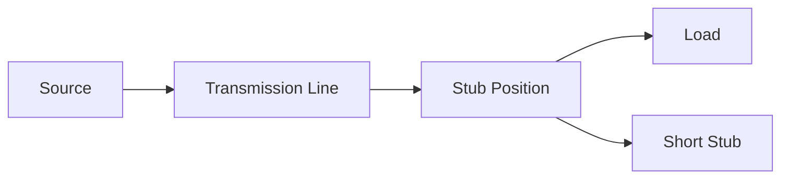
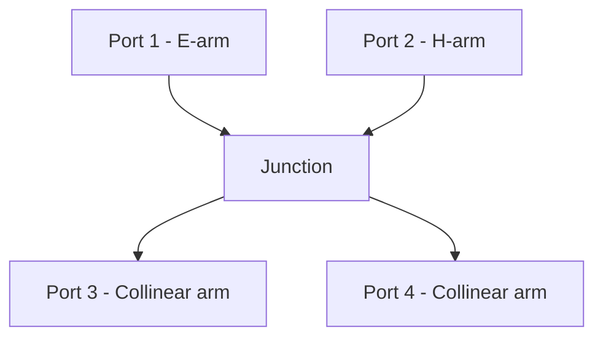
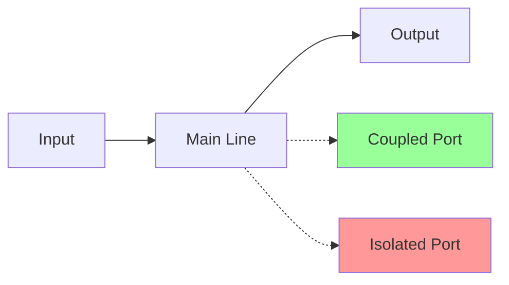
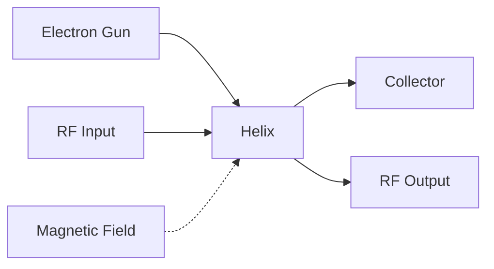
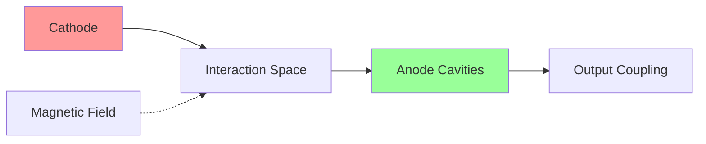
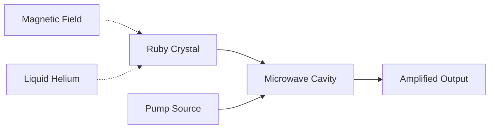
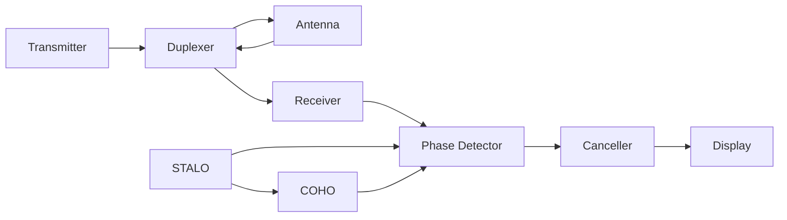
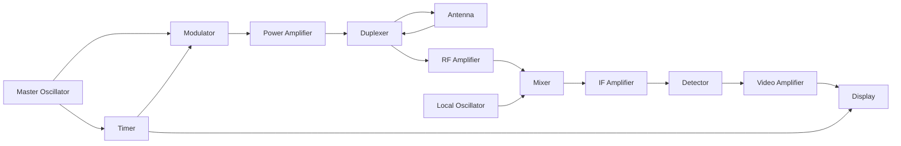

## Question 1(a) [3 marks]

**List four microwave frequency bands with their frequency range and applications.**

**Answer**:

| Band | Frequency Range | Applications |
|------|----------------|--------------|
| **L-band** | 1-2 GHz | GPS, Mobile communication |
| **S-band** | 2-4 GHz | WiFi, Bluetooth, Radar |
| **C-band** | 4-8 GHz | Satellite communication |
| **X-band** | 8-12 GHz | Military radar, Weather radar |

**Mnemonic:** "Little Satellites Communicate eXcellently"

---

## Question 1(b) [4 marks]

**Explain the impedance matching process using a single stub.**

**Answer**:

**Single stub matching** removes reflections by adding a **short-circuited stub** at specific distance from load.

**Process:**

- **Stub length**: Provides reactive impedance
- **Stub position**: Calculated from load using Smith chart
- **Matching condition**: Real part = Z₀, imaginary part = 0



**Mnemonic:** "Stub Positioned for Perfect Matching"

---

## Question 1(c) [7 marks]

**State characteristics of lossless transmission line and obtain the general equation for a two-wire transmission line.**

**Answer**:

**Characteristics of Lossless Line:**

- **No power loss**: R = 0, G = 0
- **Constant amplitude**: No attenuation
- **Phase delay only**: Signal delayed but not weakened
- **Standing wave pattern**: Due to reflections

**General Equations:**

For voltage: **V(z) = V₊e^(-γz) + V₋e^(γz)**
For current: **I(z) = (V₊/Z₀)e^(-γz) - (V₋/Z₀)e^(γz)**

Where:

- **γ = α + jβ** (propagation constant)
- **Z₀ = √(L/C)** (characteristic impedance)
- **For lossless line**: α = 0, γ = jβ

**Mnemonic:** "Lossless Lines Love Low Loss"

---

## Question 1(c) OR [7 marks]

**Define standing wave. Draw and explain the standing wave pattern for short circuit and open circuit line.**

**Answer**:

**Standing Wave:** Fixed pattern formed by **forward and reflected waves** interfering constructively and destructively.

**Short Circuit Line:**

- **Current maximum** at short circuit
- **Voltage minimum** at short circuit
- **Distance between minima**: λ/2

**Open Circuit Line:**

- **Voltage maximum** at open circuit
- **Current minimum** at open circuit
- **Distance between maxima**: λ/2

```goat
Short Circuit:     Open Circuit:
                  
V |    /\            V |  /\    /\
  |   /  \             |/    \/    \
  |  /    \            |           
  |_/______\           |____________
    0  λ/4  λ/2         0  λ/4  λ/2
    
I |  /\    /\        I |    /\
  | /  \  /  \         |   /  \
  |/    \/    \        |  /    \
  |             \      |_/______\
    0  λ/4  λ/2         0  λ/4  λ/2
```

**Mnemonic:** "Short Circuits Current, Open Circuits Voltage"

---

## Question 2(a) [3 marks]

**Draw and explain the working of Magic TEE.**

**Answer**:

**Magic TEE** combines E-plane and H-plane tees with **four ports** providing isolation between opposite ports.



**Working:**

- **E-arm and H-arm**: Isolated from each other
- **Sum port**: Adds signals from collinear arms
- **Difference port**: Subtracts signals

**Mnemonic:** "Magic Tee Mixes Modes"

---

## Question 2(b) [4 marks]

**Explain the working of Hybrid ring.**

**Answer**:

**Hybrid Ring** is a **circular waveguide** with **four ports** spaced at specific intervals for power division and isolation.

**Construction:**

- **Ring circumference**: 1.5λ
- **Port spacing**: λ/4 between adjacent ports
- **Matched impedance**: Each port matched to Z₀

**Working:**

- **Power splitting**: Input splits equally between two output ports
- **Isolation**: Opposite ports are isolated
- **Phase difference**: 180° between output ports

**Mnemonic:** "Ring Runs Round for Power Sharing"

---

## Question 2(c) [7 marks]

**Explain the construction and working principle of "CIRCULATOR". List its applications.**

**Answer**:

**Construction:**

- **Three-port device** with **ferrite material**
- **Permanent magnet** creates magnetic field
- **Y-junction waveguide** structure


**Working Principle:**

- **Faraday rotation**: Magnetic field rotates wave polarization
- **Unidirectional flow**: Power flows in one direction only
- **Non-reciprocal**: Different behavior for opposite directions

**Applications:**

- **Radar systems**: Isolates transmitter from receiver
- **Communication**: Antenna sharing for TX/RX
- **Microwave amplifiers**: Prevents feedback

**Mnemonic:** "Circulator Circles Clockwise Continuously"

---

## Question 2(a) OR [3 marks]

**Compare rectangular waveguide and circular waveguide.**

**Answer**:

| Parameter | Rectangular | Circular |
|-----------|-------------|----------|
| **Cross-section** | Rectangle | Circle |
| **Dominant mode** | TE₁₀ | TE₁₁ |
| **Cutoff frequency** | Easy calculation | Complex calculation |
| **Manufacturing** | Simple | Moderate |
| **Power handling** | Lower | Higher |

**Mnemonic:** "Rectangles are Regular, Circles are Complex"

---

## Question 2(b) OR [4 marks]

**Draw and explain the working of a directional coupler.**

**Answer**:

**Directional Coupler** samples **forward power** while providing isolation from reflected power.



**Working:**

- **Coupling factor**: Determines power extracted (10-20 dB typical)
- **Directivity**: Isolates forward from reverse power
- **Insertion loss**: Minimal loss in main line

**Parameters:**

- **C = 10 log(P₁/P₃)** (Coupling factor)
- **D = 10 log(P₃/P₄)** (Directivity)

**Mnemonic:** "Coupler Couples Carefully in Correct Direction"

---

## Question 2(c) OR [7 marks]

**Explain the construction and working principle of "Travelling Wave Tube". List its applications.**

**Answer**:

**Construction:**

- **Electron gun**: Emits electron beam
- **Helix structure**: Slows down RF wave
- **Collector**: Collects spent electrons
- **Magnetic focusing**: Keeps beam focused



**Working Principle:**

- **Velocity synchronization**: Electron velocity ≈ RF wave velocity
- **Energy transfer**: Electrons give energy to RF wave
- **Continuous interaction**: Along entire helix length

**Applications:**

- **Satellite communication**: High power amplification
- **Radar transmitters**: High gain amplification
- **Electronic warfare**: Jamming systems

**Mnemonic:** "TWT Transfers Tremendous power Through Travel"

---

## Question 3(a) [3 marks]

**Explain the Indirect method for higher VSWR measurement.**

**Answer**:

**Indirect Method** measures **high VSWR** by using **attenuator** to reduce signal level for accurate measurement.

**Procedure:**

- **Insert calibrated attenuator** (10-20 dB)
- **Measure reduced VSWR** (VSWR₂)
- **Calculate actual VSWR**: VSWR₁ = VSWR₂ × Attenuator ratio

**Formula**: **VSWR_actual = VSWR_measured × 10^(Attenuation/20)**

**Mnemonic:** "Indirect method uses Intermediate Attenuation"

---

## Question 3(b) [4 marks]

**Write and explain the frequency limitations of conventional tubes.**

**Answer**:

**Frequency Limitations:**

- **Transit time effect**: Electron transit time becomes significant
- **Interelectrode capacitance**: Limits high frequency response
- **Lead inductance**: Parasitic inductance reduces gain
- **Skin effect**: Current flows on surface only

**Effects:**

- **Reduced gain**: At frequencies above fα
- **Increased noise**: Due to shot noise
- **Phase shift**: Delays signal processing

**Solutions:**

- **Reduce electrode spacing**
- **Use special tube designs**
- **Employ cavity resonators**

**Mnemonic:** "Transit Time Troubles Traditional Tubes"

---

## Question 3(c) [7 marks]

**Explain construction and working of Two cavity klystron with applegate diagram. List its advantages.**

**Answer**:

**Construction:**

- **Electron gun**: Produces electron beam
- **Input cavity**: Velocity modulates beam
- **Drift region**: Beam bunching occurs
- **Output cavity**: Extracts RF energy
- **Collector**: Collects electrons

**Applegate Diagram:**

```goat
Distance →
    |
    |  ×××××××××××××  ← Fast electrons
    |     ×××××××××    ← Medium electrons  
    |        ××××××    ← Slow electrons
Time|                 
    ↓        Bunching occurs
    
Input        Drift        Output
Cavity       Space        Cavity
```

**Working:**

- **Velocity modulation**: Input cavity varies electron velocity
- **Density modulation**: Electrons bunch in drift space
- **Energy extraction**: Bunched beam transfers energy to output cavity

**Advantages:**

- **High power output**: Several kilowatts
- **High efficiency**: 40-60%
- **Low noise**: Better than semiconductor devices
- **Stable operation**: Excellent frequency stability

**Mnemonic:** "Klystron Kicks with Kinetic Bunching"

---

## Question 3(a) OR [3 marks]

**Explain construction and working of BWO.**

**Answer**:

**BWO (Backward Wave Oscillator)** uses **backward wave interaction** for oscillation.

**Construction:**

- **Electron gun**: Emits electron beam
- **Slow wave structure**: Helix or coupled cavities
- **Collector**: At input end
- **Output**: From input end

**Working:**

- **Backward wave**: Travels opposite to electron beam
- **Negative resistance**: Beam provides energy to backward wave
- **Oscillation**: When gain > losses

**Mnemonic:** "BWO goes Backward While Oscillating"

---

## Question 3(b) OR [4 marks]

**Explain hazards due to microwave radiation.**

**Answer**:

**Types of Hazards:**

- **HERP**: Hazards of Electromagnetic Radiation to Personnel
- **HERO**: Hazards of Electromagnetic Radiation to Ordnance  
- **HERF**: Hazards of Electromagnetic Radiation to Fuel

**Effects:**

- **Thermal heating**: Tissue heating at high power
- **Eye damage**: Cataract formation
- **Reproductive effects**: Potential fertility issues
- **Pacemaker interference**: Electronic device malfunction

**Protection:**

- **Power density limits**: < 10 mW/cm²
- **Safety distances**: Far field calculations
- **Warning signs**: Radiation hazard markers
- **Personal monitors**: RF exposure meters

**Mnemonic:** "Microwaves Make Multiple Medical Maladies"

---

## Question 3(c) OR [7 marks]

**Explain construction and working of magnetron with neat sketch. List its applications.**

**Answer**:

**Construction:**

- **Circular cathode**: Central hot cathode
- **Cylindrical anode**: With resonant cavities
- **Permanent magnet**: Provides axial magnetic field
- **Output coupling**: Loop or probe



**Working:**

- **Electron cloud**: Forms in interaction space
- **Cycloid motion**: Due to E and B fields
- **Resonant cavities**: Determine operating frequency
- **π-mode oscillation**: Alternate cavities have opposite phase

**Applications:**

- **Microwave ovens**: 2.45 GHz heating
- **Radar systems**: High power pulses
- **Industrial heating**: Material processing
- **Medical diathermy**: Therapeutic heating

**Mnemonic:** "Magnetron Makes Microwaves Magnificently"

---

## Question 4(a) [3 marks]

**Explain working of P-i-N diode.**

**Answer**:

**P-i-N Diode** has **intrinsic layer** between P and N regions, acting as **voltage-controlled resistor**.

**Structure:**

- **P region**: Heavily doped
- **I region**: Intrinsic (undoped)  
- **N region**: Heavily doped

**Working:**

- **Forward bias**: Low resistance (1-10 Ω)
- **Reverse bias**: High resistance (>10 kΩ)
- **RF switch**: Controls microwave signals
- **Variable attenuator**: Resistance varies with DC bias

**Mnemonic:** "PIN controls Power IN Networks"

---

## Question 4(b) [4 marks]

**Explain the working of Varactor diode with sketch.**

**Answer**:

**Varactor Diode** acts as **voltage-controlled capacitor** using junction capacitance variation.

```goat
    +V
     |
  ┌──┴──┐
  │  P  │  N  │ ← Junction
  └──┬──┘
     |
     0V
     
Capacitance vs Voltage:
C |    
  |\    
  | \   
  |  \  
  |___\____
    0  -V (reverse bias)
```

**Working:**

- **Reverse bias**: Depletes junction, reduces capacitance
- **Bias voltage**: Controls capacitance value
- **Capacitance ratio**: Typically 3:1 to 10:1
- **Frequency tuning**: Used in oscillators and filters

**Applications:**

- **VCO tuning**: Voltage controlled oscillators
- **AFC circuits**: Automatic frequency control
- **Parametric amplifiers**: Low noise amplification

**Mnemonic:** "Varactor Varies Capacitance with Voltage"

---

## Question 4(c) [7 marks]

**Explain construction and working of Tunnel Diode and explain tunneling phenomenon in detail. List its applications.**

**Answer**:

**Construction:**

- **Heavily doped P-N junction**: Both sides degenerately doped
- **Thin junction**: ~10 nm width
- **Quantum tunneling**: Electrons tunnel through barrier

**Tunneling Phenomenon:**

- **Quantum effect**: Electrons pass through energy barrier
- **Band overlap**: Conduction band overlaps valence band
- **Probability function**: Tunneling probability depends on barrier width
- **No thermal activation**: Occurs at room temperature

```goat
I-V Characteristic:
I |   
  |  /\    ← Negative resistance
  | /  \   
  |/    \  
  |      \___
  |____________ V
    0  Vp  Vv
    
Vp = Peak voltage
Vv = Valley voltage
```

**Working:**

- **Forward bias 0-Vp**: Current increases (tunneling)
- **Vp to Vv**: Negative resistance region
- **Beyond Vv**: Normal diode operation

**Applications:**

- **High-speed switching**: Picosecond switching
- **Oscillators**: Microwave frequency generation
- **Amplifiers**: Low noise amplification
- **Memory circuits**: Bistable operation

**Mnemonic:** "Tunnel Diode Tunnels Through barriers Terrifically"

---

## Question 4(a) OR [3 marks]

**Describe the operation of IMPATT diode.**

**Answer**:

**IMPATT (Impact Avalanche Transit Time)** diode uses **avalanche multiplication** and **transit time delay** for oscillation.

**Operation:**

- **Avalanche zone**: Impact ionization creates carriers
- **Drift zone**: Carriers drift with constant velocity
- **Transit time**: Provides 180° phase shift
- **Negative resistance**: Due to phase delay

**Key parameters:**

- **Breakdown voltage**: Typically 20-100V
- **Efficiency**: 10-20%
- **Frequency range**: 1-300 GHz

**Mnemonic:** "IMPATT Impacts with Avalanche Transit Time"

---

## Question 4(b) OR [4 marks]

**Explain the frequency up and down conversion concepts for parametric amplifier.**

**Answer**:

**Parametric Amplifier** uses **time-varying reactance** for amplification and frequency conversion.

**Up-conversion:**

- **Signal frequency**: fs (input)
- **Pump frequency**: fp (much higher)
- **Output frequency**: fo = fp + fs
- **Energy transfer**: From pump to signal

**Down-conversion:**

- **Signal frequency**: fs (input)  
- **Pump frequency**: fp
- **Output frequency**: fo = fp - fs
- **Mixer operation**: Frequency translation

**Advantages:**

- **Low noise**: Quantum-limited performance
- **High gain**: 20-30 dB typical
- **Wide bandwidth**: Several GHz

**Mnemonic:** "Parametric Pump Provides frequency conversion Plus gain"

---

## Question 4(c) OR [7 marks]

**Describe the construction and working principle of RUBY MASER. List its applications.**

**Answer**:

**Construction:**

- **Ruby crystal**: Cr³⁺ ions in Al₂O₃ lattice
- **Magnetic field**: Strong DC magnetic field
- **Microwave cavity**: Resonant at signal frequency
- **Pump source**: High frequency klystron
- **Cryogenic cooling**: Liquid helium temperature



**Working Principle:**

- **Energy levels**: Cr³⁺ ions have three energy levels
- **Population inversion**: Pump creates more atoms in upper level
- **Stimulated emission**: Signal photons trigger emission
- **Coherent amplification**: Phase-coherent amplification

**Three-level system:**

- **Ground state**: E₁ (most populated)
- **Intermediate state**: E₂ (signal frequency)
- **Upper state**: E₃ (pump frequency)

**Applications:**

- **Radio astronomy**: Ultra-low noise receivers
- **Satellite communication**: Ground station amplifiers
- **Deep space communication**: NASA tracking stations
- **Research**: Quantum electronics experiments

**Mnemonic:** "RUBY MASER Makes Amazingly Sensitive Electromagnetic Receivers"

---

## Question 5(a) [3 marks]

**Draw and explain the functional block diagram of MTI RADAR.**

**Answer**:

**MTI RADAR** detects **moving targets** by comparing **successive echoes** and canceling fixed targets.



**Components:**

- **STALO**: Stable Local Oscillator
- **COHO**: Coherent Oscillator  
- **Phase detector**: Compares echo phases
- **Canceller**: Removes fixed target echoes

**Mnemonic:** "MTI Makes Targets Intelligible by Motion"

---

## Question 5(b) [4 marks]

**Compare RADAR with SONAR.**

**Answer**:

| Parameter | RADAR | SONAR |
|-----------|-------|-------|
| **Wave type** | Electromagnetic | Acoustic |
| **Medium** | Air/vacuum | Water |
| **Speed** | 3×10⁸ m/s | 1500 m/s |
| **Frequency** | GHz | kHz |
| **Range** | 100+ km | 10-50 km |
| **Applications** | Air/space | Underwater |

**Common features:**

- **Pulse-echo principle**
- **Range measurement**
- **Target detection**

**Mnemonic:** "RADAR Radiates, SONAR Sounds"

---

## Question 5(c) [7 marks]

**Obtain the equation of maximum RADAR range. Explain the factors affecting the maximum radar range.**

**Answer**:

**RADAR Range Equation:**

**R_max = ⁴√[(P_t × G² × λ² × σ) / (64π³ × P_min × L)]**

Where:

- **P_t**: Transmitter power (W)
- **G**: Antenna gain (dimensionless)
- **λ**: Wavelength (m)
- **σ**: Target cross-section (m²)
- **P_min**: Minimum detectable power (W)
- **L**: System losses (dimensionless)

**Derivation steps:**

1. **Power density at target**: P_t×G/(4πR²)
2. **Power intercepted**: σ × Power density
3. **Power at receiver**: Intercepted power × G/(4πR²)
4. **Set equal to P_min** and solve for R

**Factors Affecting Range:**

**Increase Range:**

- **Higher transmitter power**: R ∝ P_t^(1/4)
- **Larger antenna gain**: R ∝ G^(1/2)
- **Larger target RCS**: R ∝ σ^(1/4)
- **Lower system losses**: R ∝ L^(-1/4)

**Decrease Range:**

- **Higher frequency**: R ∝ λ^(1/2)
- **Atmospheric losses**: Absorption and scattering
- **Ground clutter**: Interfering reflections

**Mnemonic:** "RADAR Range Requires Robust Power and Proper Parameters"

---

## Question 5(a) OR [3 marks]

**Describe the Doppler effect in CW Doppler RADAR.**

**Answer**:

**Doppler Effect** causes **frequency shift** when target moves relative to RADAR.

**Doppler Frequency:**
**f_d = (2 × V_r × f_0) / c**

Where:

- **V_r**: Radial velocity (m/s)
- **f_0**: Transmitted frequency (Hz)
- **c**: Speed of light (3×10⁸ m/s)

**Characteristics:**

- **Approaching target**: f_d positive
- **Receding target**: f_d negative
- **Factor of 2**: Due to two-way propagation

**Mnemonic:** "Doppler Detects Direction with Doubled frequency shift"

---

## Question 5(b) OR [4 marks]

**Explain PPI Display method for RADAR**

**Answer**:

**PPI (Plan Position Indicator)** shows **top view** of RADAR coverage area with range and bearing information.

**Display Features:**

- **Circular screen**: Center represents RADAR location
- **Rotating trace**: Synchronized with antenna rotation
- **Range rings**: Concentric circles for distance
- **Bearing scale**: 0-360° around circumference

**Operation:**

- **Sweep rotation**: Matches antenna rotation
- **Echo intensity**: Controls brightness
- **Persistence**: Afterglow maintains target visibility
- **Range scale**: Selectable range settings

**Applications:**

- **Air traffic control**: Aircraft positioning
- **Marine navigation**: Ship and obstacle detection
- **Weather monitoring**: Storm tracking

**Mnemonic:** "PPI Provides Position Information Perfectly"

---

## Question 5(c) OR [7 marks]

**Draw the block diagram of Pulse radar and explain the working principle.**

**Answer**:



**Working Principle:**

**Transmission:**

- **Master oscillator**: Generates RF carrier
- **Modulator**: Creates short pulses
- **Power amplifier**: Amplifies pulse power
- **Duplexer**: Routes pulse to antenna

**Reception:**

- **Echo reception**: Antenna receives reflected signals
- **RF amplification**: Low noise amplification
- **Mixing**: Converts to intermediate frequency
- **IF amplification**: Further amplification
- **Detection**: Extracts video signal
- **Display**: Shows range vs amplitude

**Key Parameters:**

- **Pulse width**: Determines range resolution
- **PRF**: Pulse repetition frequency
- **Peak power**: Maximum range capability
- **Duty cycle**: Average power consideration

**Advantages:**

- **High peak power**: Long range capability
- **Good range resolution**: Narrow pulses
- **Simple processing**: Direct detection

**Mnemonic:** "Pulse RADAR Pulses Powerfully for Precise Position"
