## પ્રશ્ન 1(અ) [3 ગુણ]

**ટ્રાન્સમિશન લાઇન માં વોલ્ટેજ અને કરંટ માટે સ્ટેન્ડિંગ વેવ પેટર્નને સ્કેચ કરો, જ્યારે તે (i) શોર્ટ સર્કિટ, (ii) ઓપન સર્કિટ અને (iii) મેચ્ડ લોડ સાથે સમાપ્ત થાય છે.**

**જવાબ**:

**આકૃતિ:**

```goat
Short Circuit (Z_L = 0):
     V      
     |      
     |      
     |______|______|______|______ 0V
       λ/4   λ/2   3λ/4    λ
     
     I      
   I_max ---|---|---|---
     |                  
     |      
     0 __________________ 0A

Open Circuit (Z_L = ∞):
   V_max ---|---|---|---
     |                  
     V      
     0 __________________ 0V
       λ/4   λ/2   3λ/4    λ
     
     I      
     |      
     |      
     |______|______|______|______ 0A
       λ/4   λ/2   3λ/4    λ

Matched Load (Z_L = Z_0):
     V      
   ---|---|---|---|--- Constant
     
     I      
   ---|---|---|---|--- Constant
```

- **શોર્ટ સર્કિટ**: લોડ પર વોલ્ટેજ ન્યૂનતમ, કરંટ મહત્તમ
- **ઓપન સર્કિટ**: લોડ પર વોલ્ટેજ મહત્તમ, કરંટ ન્યૂનતમ  
- **મેચ્ડ લોડ**: સ્થિર વોલ્ટેજ અને કરંટ, કોઈ પ્રતિબિંબ નથી

**યાદાશ્ત સૂત્ર**: "SOC - શોર્ટ કરંટ ખોલે, ઓપન કરંટ બંધ કરે"

## પ્રશ્ન 1(બ) [4 ગુણ]

**માઇક્રોવેવ ફ્રીક્વન્સી માટે બે સમાંતર વાયર ટ્રાન્સમિશન લાઇનના સમકક્ષ સર્કિટનો નકશો દોરો અને સમજાવો.**

**જવાબ**:

**આકૃતિ:**

```goat
       R      L      R      L
    ---|^^^|--|||||---|^^^|--|||||---
    |      |       |      |       |
    |      G       C      G       C
    |     |||     ---    |||     ---
    |     |||     ---    |||     ---
    ---|^^^|--|||||---|^^^|--|||||---
       R      L      R      L
       
       ←-- Δz --→
```

- **R**: એકમ લંબાઈ દીઠ શ્રેણી પ્રતિકાર (કંડક્ટર લોસિસ)
- **L**: એકમ લંબાઈ દીઠ શ્રેણી ઇન્ડક્ટન્સ (ચુંબકીય ક્ષેત્ર સંગ્રહ)
- **G**: એકમ લંબાઈ દીઠ શંટ કંડક્ટન્સ (ડાઇઇલેક્ટ્રિક લોસિસ)
- **C**: એકમ લંબાઈ દીઠ શંટ કેપેસિટન્સ (વિદ્યુત ક્ષેત્ર સંગ્રહ)

**પ્રાથમિક સ્થિરાંકો કોષ્ટક:**

| પરિમાપ | પ્રતીક | એકમ | અસર |
|---------|--------|------|------|
| પ્રતિકાર | R | Ω/m | શક્તિ નુકસાન |
| ઇન્ડક્ટન્સ | L | H/m | ચુંબકીય ઊર્જા |
| કંડક્ટન્સ | G | S/m | લીકેજ કરંટ |
| કેપેસિટન્સ | C | F/m | વિદ્યુત ઊર્જા |

**યાદાશ્ત સૂત્ર**: "RLGC - ખરેખર મોટી કેબલ્સ"

## પ્રશ્ન 1(ક) [7 ગુણ]

**આઇસોલેટર ના સિદ્ધાંત, બાંધકામ અને કાર્યને જરૂરી સ્કેચ સાથે સમજાવો.**

**જવાબ**:

**સિદ્ધાંત**: આઇસોલેટર માઇક્રોવેવ સિગ્નલને ફક્ત આગળની દિશામાં જ પસાર કરવા દે છે **ફેરાઇટ મટિરિયલ** અને **ફેરાડે રોટેશન અસર** નો ઉપયોગ કરીને.

**બાંધકામ આકૃતિ:**

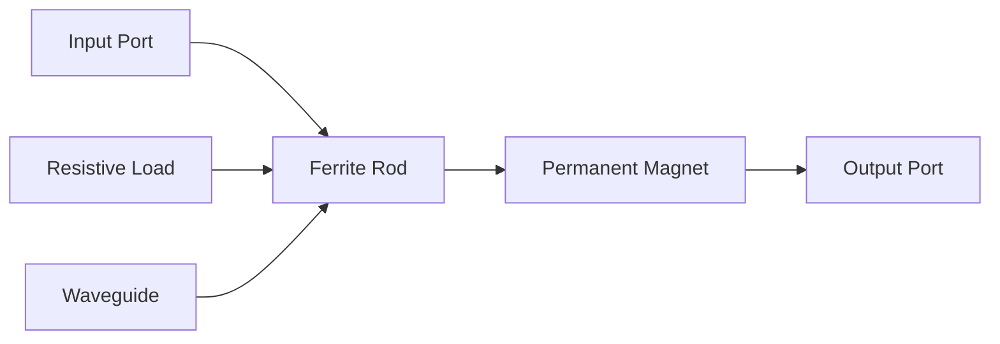

**કાર્યપ્રણાલી**:

- **આગળની દિશા**: સિગ્નલ ઓછા નુકસાન સાથે ફેરાઇટ માંથી પસાર થાય છે
- **પાછળની દિશા**: સિગ્નલ 45° ફેરવાય છે અને રેઝિસ્ટિવ લોડ દ્વારા શોષાય છે
- **ચુંબકીય ક્ષેત્ર** ફેરાઇટ મટિરિયલને બાયાસ કરે છે
- **આઇસોલેશન**: સામાન્ય રીતે 20-30 dB

**ઉપયોગો**:

- **ટ્રાન્સમિટરને સુરક્ષા** રિફ્લેક્ટેડ પાવર થી
- **એમ્પ્લિફાયર સર્કિટમાં ઓસિલેશન** અટકાવે છે
- **સોર્સ ઇમ્પીડન્સ મેચિંગ** જાળવે છે

**વિશેષતાઓ કોષ્ટક:**

| પરિમાપ | મૂલ્ય | એકમ |
|---------|-------|------|
| આઇસોલેશન | 20-30 | dB |
| ઇન્સર્શન લોસ | 0.5-1 | dB |
| VSWR | <1.5 | - |

**યાદાશ્ત સૂત્ર**: "આગળ અલગ કરો, પાછળ શોષો"

## પ્રશ્ન 1(ક) વિકલ્પ [7 ગુણ]

**ટ્રાન્સમિશન લાઇન અને વેવગાઇડની સરખામણી કરો.**

**જવાબ**:

**સરખામણી કોષ્ટક:**

| પરિમાપ | ટ્રાન્સમિશન લાઇન | વેવગાઇડ |
|---------|------------------|-----------|
| **ફ્રીક્વન્સી રેન્જ** | DC થી માઇક્રોવેવ | કટઓફ ફ્રીક્વન્સી ઉપર |
| **પાવર હેન્ડલિંગ** | મર્યાદિત | ઉચ્ચ પાવર ક્ષમતા |
| **લોસિસ** | વધારે (I²R લોસિસ) | ઓછા (કોઈ કેન્દ્રીય કંડક્ટર નથી) |
| **સાઇઝ** | કોમ્પેક્ટ | નીચી ફ્રીક્વન્સીએ મોટું |
| **મોડ્સ** | TEM મોડ | TE અને TM મોડ્સ |
| **ઇન્સ્ટોલેશન** | સરળ | જટિલ માઉન્ટિંગ |
| **કિંમત** | ઓછી | વધારે |
| **બેન્ડવિડ્થ** | વિશાળ | મોડ્સ દ્વારા મર્યાદિત |

**મુખ્ય તફાવતો**:

- **ટ્રાન્સમિશન લાઇન**: બે કંડક્ટર વાપરે છે, TEM મોડ સપોર્ટ કરે છે
- **વેવગાઇડ**: સિંગલ હોલો કંડક્ટર, TE/TM મોડ્સ સપોર્ટ કરે છે
- **કટઓફ ફ્રીક્વન્સી**: વેવગાઇડ માં લઘુત્તમ ઓપરેટિંગ ફ્રીક્વન્સી
- **ફીલ્ડ પેટર્ન**: અલગ ઇલેક્ટ્રોમેગ્નેટિક ફીલ્ડ વિતરણ

**ઉપયોગો**:

- **ટ્રાન્સમિશન લાઇન**: લો પાવર, બ્રોડબેન્ડ એપ્લિકેશન
- **વેવગાઇડ**: હાઇ પાવર રડાર, સેટેલાઇટ કોમ્યુનિકેશન

**યાદાશ્ત સૂત્ર**: "ટ્રાન્સમિશન બે-વાયર ચાલે, વેવગાઇડ વિશાળ ચાલે"

## પ્રશ્ન 2(અ) [3 ગુણ]

**વ્યાખ્યા આપો: (i) VSWR, (ii) રિફ્લેક્શન કોઇફિશન્ટ, અને (iii) સ્કિન અસર**

**જવાબ**:

**વ્યાખ્યાઓ:**

- **VSWR (વોલ્ટેજ સ્ટેન્ડિંગ વેવ રેશિયો)**: ટ્રાન્સમિશન લાઇન પર મહત્તમ અને ન્યૂનતમ વોલ્ટેજ એમ્પ્લિટ્યુડનો ગુણોત્તર
  - ફોર્મ્યુલા: VSWR = V_max/V_min = (1+|Γ|)/(1-|Γ|)
  
- **રિફ્લેક્શન કોઇફિશન્ટ (Γ)**: પ્રતિબિંબિત અને આવતા વોલ્ટેજ એમ્પ્લિટ્યુડનો ગુણોત્તર
  - ફોર્મ્યુલા: Γ = (Z_L - Z_0)/(Z_L + Z_0)
  
- **સ્કિન અસર**: ઉચ્ચ ફ્રીક્વન્સીએ કરંટ મુખ્યત્વે કંડક્ટરની સપાટી પર વહે છે
  - સ્કિન ડેપ્થ: δ = √(2/ωμσ)

**પરિમાપો કોષ્ટક:**

| પરિમાપ | રેન્જ | આદર્શ મૂલ્ય |
|---------|-------|-------------|
| VSWR | 1 થી ∞ | 1 (મેચ્ડ) |
| |Γ| | 0 થી 1 | 0 (કોઈ પ્રતિબિંબ નથી) |
| સ્કિન ડેપ્થ | μm થી mm | ફ્રીક્વન્સી આધારિત |

**યાદાશ્ત સૂત્ર**: "VSWR વેરિયે, ગામા ગાઇડ, સ્કિન સંકોચે"

## પ્રશ્ન 2(બ) [4 ગુણ]

**યોગ્ય સ્કેચ સાથે ટુ-હોલ ડાયરેક્શનલ કપ્લરનું કાર્ય સમજાવો.**

**જવાબ**:

**બાંધકામ આકૃતિ:**

```goat
Main Waveguide:
|===============================|
|    →  P1      →  P2           |
|===============================|
         ○    ○  ← Two holes
|===============================|
|    ←  P4      ←  P3           |
|===============================|
Auxiliary Waveguide
```

**કાર્યપ્રણાલી સિદ્ધાંત**:

- **બે છિદ્રો** λ/4 અંતરે વેવગાઇડ વચ્ચે ઊર્જા કપલ કરે છે
- **આગળનું તરંગ**: કપલ્ડ સિગ્નલ P3 પર ઉમેરાય, P4 પર રદ થાય
- **પાછળનું તરંગ**: કપલ્ડ સિગ્નલ P4 પર ઉમેરાય, P3 પર રદ થાય
- **ડાયરેક્ટિવિટી**: યોગ્ય છિદ્ર અંતર અને સાઇઝ દ્વારા પ્રાપ્ત

**કપલિંગ મેકેનિઝમ**:

- **ઇલેક્ટ્રિક ફીલ્ડ કપલિંગ** છિદ્રો દ્વારા
- **ફેઝ ડિફરન્સ** ડાયરેક્શનલ કપલિંગ બનાવે છે
- **કપલિંગ ફેક્ટર**: C = 10 log(P1/P3) dB

**પર્ફોર્મન્સ પરિમાપો:**

| પરિમાપ | સામાન્ય મૂલ્ય |
|---------|---------------|
| કપલિંગ | 10-30 dB |
| ડાયરેક્ટિવિટી | 25-40 dB |
| VSWR | <1.3 |

**યાદાશ્ત સૂત્ર**: "બે છિદ્ર, બે દિશા, સંપૂર્ણ નિયંત્રણ"

## પ્રશ્ન 2(ક) [7 ગુણ]

**વેવગાઇડ દ્વારા માઇક્રોવેવનું પ્રસારણ વર્ણવો અને કટ ઓફ તરંગલંબાઇનું સમીકરણ મેળવો.**

**જવાબ**:

**પ્રસારણ સિદ્ધાંત**:
ઇલેક્ટ્રોમેગ્નેટિક તરંગો વેવગાઇડ દ્વારા **TE અને TM મોડ્સ** માં વિશિષ્ટ ફીલ્ડ પેટર્ન સાથે પ્રસારિત થાય છે.

**તરંગ સમીકરણ**:
લંબચોરસ વેવગાઇડ માટે, તરંગ સમીકરણ:
∇²E + γ²E = 0

જ્યાં γ² = β² - k²

**કટઓફ તરંગલંબાઇ વ્યુત્પત્તિ:**

**TE_mn મોડ** માટે લંબચોરસ વેવગાઇડમાં:

- **કટઓફ ફ્રીક્વન્સી**: f_c = (c/2)√[(m/a)² + (n/b)²]
- **કટઓફ તરંગલંબાઇ**: λ_c = 2/√[(m/a)² + (n/b)²]

**ડોમિનન્ટ TE₁₀ મોડ** માટે:

- λ_c = 2a (જ્યાં a એ પહોળું પરિમાણ છે)

**પ્રસારણ શરતો**:

- **કટઓફ નીચે** (f < f_c): એવનેસન્ટ તરંગ, ઘાતાંકીય ક્ષય
- **કટઓફ ઉપર** (f > f_c): પ્રસારિત તરંગ
- **ફેઝ વેગ**: v_p = c/√[1 - (f_c/f)²]
- **ગ્રુપ વેગ**: v_g = c√[1 - (f_c/f)²]

**મોડ ચાર્ટ:**

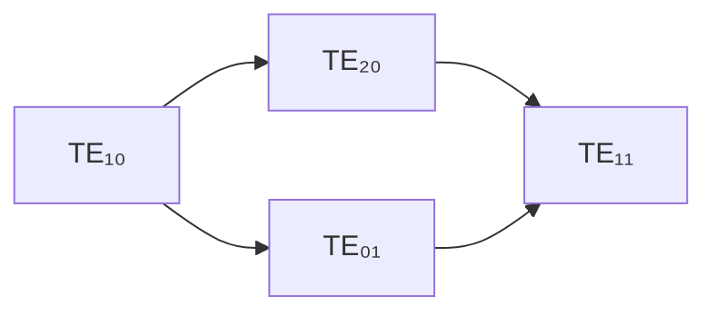

**મુખ્ય સંબંધો**:

- v_p × v_g = c²
- λ_g = λ₀/√[1 - (λ₀/λ_c)²]

**યાદાશ્ત સૂત્ર**: "કટ-ઓફ આવે, પ્રસારણ આગળ વધે"

## પ્રશ્ન 2(અ) વિકલ્પ [3 ગુણ]

**સિંગલ સ્ટબનો ઉપયોગ કરીને ઇમ્પીડન્સ મેચિંગ સમજાવો.**

**જવાબ**:

**સિદ્ધાંત**: સિંગલ સ્ટબ મેચિંગ **શોર્ટ-સર્કિટેડ** અથવા **ઓપન-સર્કિટેડ** સ્ટબનો ઉપયોગ કરીને લોડ ઇમ્પીડન્સના રિએક્ટિવ ઘટકને રદ કરે છે.

**સ્ટબ આકૃતિ:**

```goat
Source ---|---●---|--- Load
  Z₀      |       |    Z_L
          |       |
         ---      |
        Stub      |
         l_s      d
```

**ડિઝાઇન સ્ટેપ્સ**:

- **સ્ટેપ 1**: અંતર 'd' શોધો જ્યાં નોર્મલાઇઝ્ડ કંડક્ટન્સ = 1
- **સ્ટેપ 2**: જરૂરી સ્ટબ સસેપ્ટન્સ ગણો: B_s = -B_load  
- **સ્ટેપ 3**: સ્ટબ લંબાઇ નક્કી કરો: l_s B_s થી

**સ્મિથ ચાર્ટ પદ્ધતિ**:

- નોર્મલાઇઝ્ડ લોડ ઇમ્પીડન્સ પ્લોટ કરો
- મેચિંગ પોઇન્ટ શોધવા જનરેટર તરફ આગળ વધો
- કેન્દ્ર પોઇન્ટ પ્રાપ્ત કરવા સ્ટબ સસેપ્ટન્સ ઉમેરો

**યાદાશ્ત સૂત્ર**: "સિંગલ સ્ટબ સસેપ્ટન્સ ઉકેલે"

## પ્રશ્ન 2(બ) વિકલ્પ [4 ગુણ]

**હાઇબ્રિડ રિંગને જરૂરી સ્કેચ સાથે સમજાવો.**

**જવાબ**:

**બાંધકામ આકૃતિ:**

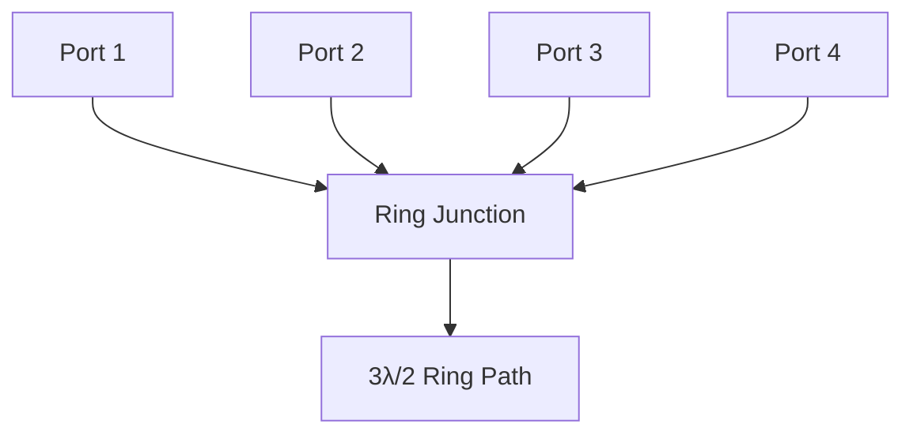

**કાર્યપ્રણાલી સિદ્ધાંત**:

- **રિંગ પરિધિ**: 3λ/2 (1.5 તરંગલંબાઇ)
- **સમાન પાથ લંબાઇ** દરેક પોર્ટથી વિરુદ્ધ પોર્ટ સુધી
- **180° ફેઝ ડિફરન્સ** બાજુના પોર્ટ વચ્ચે

**S-મેટ્રિક્સ ગુણધર્મો**:

- **આઇસોલેશન**: પોર્ટ 1-3 અને પોર્ટ 2-4 આઇસોલેટેડ છે
- **પાવર ડિવિઝન**: 180° ફેઝ ડિફરન્સ સાથે સમાન વિભાજન
- **ઇમ્પીડન્સ**: બધા પોર્ટ Z₀ સાથે મેચ્ડ

**ઉપયોગો**:

- **બેલેન્સ્ડ મિક્સર**
- **પુશ-પુલ એમ્પ્લિફાયર**
- **ફેઝ તુલના સર્કિટ**

**પર્ફોર્મન્સ કોષ્ટક:**

| પરિમાપ | મૂલ્ય |
|---------|-------|
| આઇસોલેશન | >25 dB |
| રિટર્ન લોસ | >20 dB |
| ફેઝ બેલેન્સ | ±5° |

**યાદાશ્ત સૂત્ર**: "રિંગ ફરે, પોર્ટ જોડાય"

## પ્રશ્ન 2(ક) વિકલ્પ [7 ગુણ]

**મેજિક ટીના બાંધકામ, કાર્ય અને કોઈપણ એક એપ્લિકેશનને જરૂરી ડાયાગ્રામ સાથે સમજાવો.**

**જવાબ**:

**બાંધકામ**: મેજિક ટી **E-પ્લેન** અને **H-પ્લેન** ટીઝને તેમના જંક્શન પર જોડીને બને છે.

**સ્ટ્રક્ચર આકૃતિ:**

```goat
       H-arm (Sum port)
           |
           |
    -------●------- 
   |               |
E-arm     Junction  Collinear
(Diff)              arms
   |               |
    -------●-------
           |
           |
       Matched load
```

**કાર્યપ્રણાલી સિદ્ધાંત**:

- **પોર્ટ 1,2**: કોલિનિયર આર્મ્સ (ઇનપુટ/આઉટપુટ પોર્ટ)
- **પોર્ટ 3**: H-આર્મ (સમ/Σ પોર્ટ)  
- **પોર્ટ 4**: E-આર્મ (ડિફરન્સ/Δ પોર્ટ)
- **આઇસોલેશન**: સમ અને ડિફરન્સ પોર્ટ વચ્ચે

**S-મેટ્રિક્સ ગુણધર્મો:**

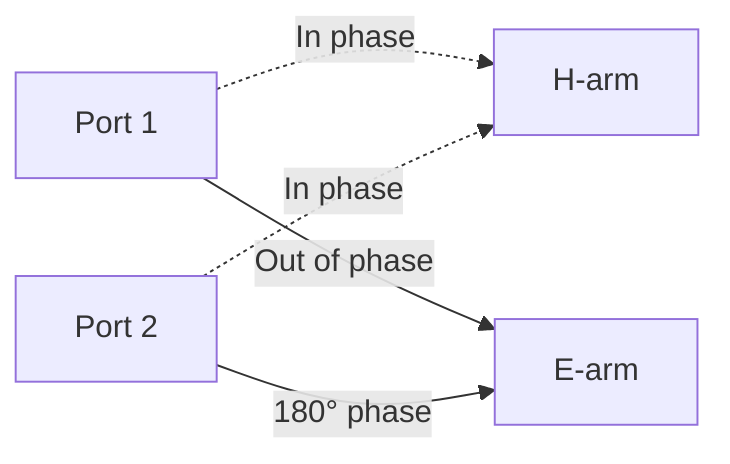

**એપ્લિકેશન - રડાર ડુપ્લેક્સર:**

- **ટ્રાન્સમિટ**: પાવર H-આર્મમાં આપવામાં આવે, પોર્ટ 1,2 માં સમાન વિભાજન
- **રિસીવ**: પ્રાપ્ત સિગ્નલ E-આર્મ પર રિસીવર માટે ભેગા થાય
- **આઇસોલેશન**: ટ્રાન્સમિશન દરમિયાન રિસીવરનું રક્ષણ
- **ફાયદો**: ટ્રાન્સમિટ/રિસીવ માટે સિંગલ એન્ટેના

**પર્ફોર્મન્સ સ્પેસિફિકેશન:**

| પરિમાપ | મૂલ્ય |
|---------|-------|
| આઇસોલેશન | >30 dB |
| VSWR | <1.3 |
| પાવર સ્પ્લિટ | 3 dB |
| ફેઝ બેલેન્સ | ±5° |

**મુખ્ય લક્ષણો**:

- **સિમેટ્રિક સ્ટ્રક્ચર** સમાન પાવર વિભાજન ખાતરી આપે છે
- **ઓર્થોગોનલ ફીલ્ડ્સ** પોર્ટ આઇસોલેશન પ્રદાન કરે છે
- **બ્રોડબેન્ડ ઓપરેશન** ઓક્ટેવ બેન્ડવિડ્થ પર

**યાદાશ્ત સૂત્ર**: "મેજિક આઇસોલેશન બનાવે, ટી સાથે ટ્રાન્સમિટ"

## પ્રશ્ન 3(અ) [3 ગુણ]

**બ્લોક ડાયાગ્રામની મદદથી એટેન્યુએશન માપન સમજાવો.**

**જવાબ**:

**બ્લોક ડાયાગ્રામ:**

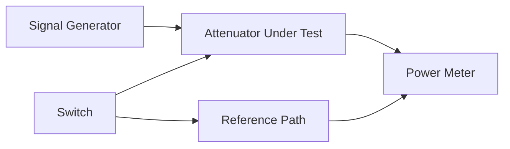

**માપન પ્રક્રિયા**:

- **સ્ટેપ 1**: એટેન્યુએટર વિના પાવર માપો (P₁)
- **સ્ટેપ 2**: એટેન્યુએટર નાખો, પાવર માપો (P₂)  
- **સ્ટેપ 3**: એટેન્યુએશન ગણો = 10 log(P₁/P₂) dB

**પદ્ધતિઓ**:

- **સબસ્ટિટ્યુશન પદ્ધતિ**: જાણીતા એટેન્યુએટર સાથે તુલના
- **ડાયરેક્ટ પદ્ધતિ**: ઇનપુટ અને આઉટપુટ પાવર માપો
- **IF સબસ્ટિટ્યુશન**: ઇન્ટરમીડિયેટ ફ્રીક્વન્સીનો ઉપયોગ

**યાદાશ્ત સૂત્ર**: "એટેન્યુએશન = પાવર₁/પાવર₂"

## પ્રશ્ન 3(બ) [4 ગુણ]

**એપલગેટ ડાયાગ્રામની મદદથી બે કેવિટી ક્લિસ્ટ્રોનમાં વેગ મોડ્યુલેશન સમજાવો.**

**જવાબ**:

**બે કેવિટી ક્લિસ્ટ્રોન આકૃતિ:**

```goat
Electron -----> ●======● -----> ●======● -----> Collector
Gun            Input    Drift   Output
               Cavity   Space   Cavity
                 |               |
              RF Input         RF Output
```

**એપલગેટ ડાયાગ્રામ:**

```goat
Distance →
   |     
   |  ╱  ╲     ╱  ╲     ╱  ╲
   | ╱    ╲   ╱    ╲   ╱    ╲
   |╱      ╲ ╱      ╲ ╱      ╲
   |        X        X        X  ← Bunching
Tim|       ╱ ╲      ╱ ╲      ╱ ╲  
   ↓      ╱   ╲    ╱   ╲    ╱   ╲
         ╱     ╲  ╱     ╲  ╱     ╲
        ╱       ╲╱       ╲╱       ╲
Fast electrons ←→ Slow electrons
```

**વેલોસિટી મોડ્યુલેશન પ્રક્રિયા**:

- **ઇનપુટ કેવિટી**: ઇલેક્ટ્રોન RF ફીલ્ડથી ઊર્જા મેળવે/ગુમાવે છે
- **ડ્રિફ્ટ સ્પેસ**: ઝડપી ઇલેક્ટ્રોન ધીમા ઇલેક્ટ્રોનને મળે છે
- **બંચિંગ**: ઇલેક્ટ્રોન ડેન્સિટી સમયાંતરે બદલાય છે
- **આઉટપુટ કેવિટી**: બંચ્ડ ઇલેક્ટ્રોન RF કરંટ ઇન્ડ્યુસ કરે છે

**મુખ્ય પરિમાપો**:

- **ટ્રાન્ઝિટ ટાઇમ**: τ = L/v₀ (જ્યાં L = ડ્રિફ્ટ સ્પેસ લંબાઇ)
- **બંચિંગ પરિમાપ**: X = βn/2
- **ઓપ્ટિમમ બંચિંગ**: X = 1.84

**યાદાશ્ત સૂત્ર**: "વેલોસિટી વેરિયે, બંચિંગ બિલ્ડ"

## પ્રશ્ન 3(ક) [7 ગુણ]

**મેગ્નેટ્રોનમાં વિદ્યુત અને ચુંબકીય ક્ષેત્રના સિદ્ધાંત, નિર્માણ અને અસર સમજાવો.**

**જવાબ**:

**સિદ્ધાંત**: મેગ્નેટ્રોન **ક્રોસ્ડ ઇલેક્ટ્રિક અને મેગ્નેટિક ફીલ્ડ્સ** નો ઉપયોગ કરીને **સાયક્લોટ્રોન મોશન** ઓફ ઇલેક્ટ્રોન દ્વારા હાઇ-પાવર માઇક્રોવેવ ઓસિલેશન જનરેટ કરે છે.

**બાંધકામ આકૃતિ:**

```goat
    Permanent Magnet (N)
         ↓  ↓  ↓  ↓
    ┌─────────────────┐
    │  ○  ○  ○  ○  ○  │ ← Resonant Cavities
    │○               ○│
    │  ●─ Cathode ─●  │ ← Central cathode
    │○               ○│
    │  ○  ○  ○  ○  ○  │
    └─────────────────┘
         ↑  ↑  ↑  ↑
    Permanent Magnet (S)
```

**ફીલ્ડ અસરો**:

- **ઇલેક્ટ્રિક ફીલ્ડ (E)**: રેડિયલ, કેથોડથી એનોડ સુધી
- **મેગ્નેટિક ફીલ્ડ (B)**: એક્સિયલ, E-ફીલ્ડને લંબ
- **ક્રોસ્ડ ફીલ્ડ્સ**: સાયક્લોઇડલ ઇલેક્ટ્રોન મોશન બનાવે છે

**ઇલેક્ટ્રોન મોશન એનાલિસિસ:**


**ઓપરેટિંગ કન્ડિશન્સ**:

- **કટઓફ કન્ડિશન**: E/B = v_drift
- **સિંક્રોનિઝમ**: ઇલેક્ટ્રોન ડ્રિફ્ટ વેલોસિટી ફેઝ વેલોસિટી સાથે મેચ થાય
- **હલ કટઓફ**: ઓપરેશન માટે લઘુત્તમ મેગ્નેટિક ફીલ્ડ

**રેઝોનન્ટ કેવિટીઝ**:

- **π-મોડ ઓપરેશન**: અલ્ટરનેટ કેવિટીમાં વિરુદ્ધ ફેઝ
- **ફ્રીક્વન્સી**: f = c/(2√LC) કેવિટી રેઝોનન્સ માટે
- **મોડ સેપરેશન**: મોડ કોમ્પીટિશન અટકાવે છે

**પર્ફોર્મન્સ લક્ષણો:**

| પરિમાપ | સામાન્ય મૂલ્ય |
|---------|---------------|
| કાર્યક્ષમતા | 60-80% |
| પાવર આઉટપુટ | 10 kW - 10 MW |
| ફ્રીક્વન્સી | 1-100 GHz |
| પલ્સ/CW | બંને મોડ્સ |

**ફાયદાઓ**:

- **ઉચ્ચ કાર્યક્ષમતા** અન્ય ટ્યુબ્સ સાથે સરખામણીમાં
- **ઉચ્ચ પાવર ક્ષમતા**
- **કોમ્પેક્ટ સ્ટ્રક્ચર**
- **સારી ફ્રીક્વન્સી સ્થિરતા**

**ઉપયોગો**:

- **રડાર ટ્રાન્સમિટર**
- **માઇક્રોવેવ ઓવન**
- **ઇન્ડસ્ટ્રિયલ હીટિંગ**
- **ઇલેક્ટ્રોનિક વોરફેર**

**યાદાશ્ત સૂત્ર**: "મેગ્નેટ્રોન મેગ્નેટિક મોશન દ્વારા માઇક્રોવેવ બનાવે"

## પ્રશ્ન 3(અ) વિકલ્પ [3 ગુણ]

**TWT (ટ્રાવેલિંગ વેવ ટ્યુબ)નું એમ્પ્લિફાયર તરીકે કાર્ય સમજાવો.**

**જવાબ**:

**TWT સ્ટ્રક્ચર:**

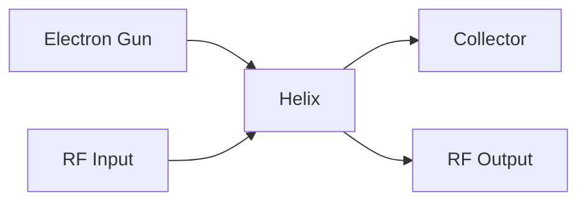

**એમ્પ્લિફિકેશન પ્રક્રિયા**:

- **ઇલેક્ટ્રોન બીમ** હેલિક્સ એક્સિસ સાથે ચાલે છે
- **RF સિગ્નલ** હેલિક્સ સાથે પ્રસારિત થાય છે (સ્લો વેવ સ્ટ્રક્ચર)
- **વેલોસિટી સિંક્રોનિઝમ**: v_electron ≈ v_RF
- **એનર્જી ટ્રાન્સફર** DC બીમથી RF વેવમાં

**ગેઇન મેકેનિઝમ**:

- **બંચિંગ**: RF ફીલ્ડ ઇલેક્ટ્રોન વેલોસિટી મોડ્યુલેટ કરે છે
- **ઇન્ડ્યુસ્ડ કરંટ**: બંચ્ડ ઇલેક્ટ્રોન હેલિક્સમાં RF કરંટ ઇન્ડ્યુસ કરે છે
- **પ્રોગ્રેસિવ એમ્પ્લિફિકેશન** હેલિક્સ લંબાઇ સાથે

**યાદાશ્ત સૂત્ર**: "ટ્રાવેલિંગ વેવ એનર્જી ટ્રાન્સફર કરે"

## પ્રશ્ન 3(બ) વિકલ્પ [4 ગુણ]

**માઇક્રોવેવ ફ્રીક્વન્સી માટે ઓછો પાવર માપવા માટે બોલોમીટર પદ્ધતિ સમજાવો.**

**જવાબ**:

**સિદ્ધાંત**: બોलોમીટર રેઝિસ્ટિવ એલિમેન્ટમાં **તાપમાન વૃદ્ધિ** ડિટેક્ટ કરીને માઇક્રોવેવ પાવર માપે છે.

**બોલોમીટર પ્રકારો**:

- **થર્મિસ્ટર**: નેગેટિવ ટેમ્પરેચર કોઇફિશન્ટ
- **બેરેટર**: પોઝિટિવ ટેમ્પરેચર કોઇફિશન્ટ

**સર્કિટ આકૃતિ:**

```goat
    RF Power -----> [Bolometer] -----> Temperature
         |              |               Change
         |              |                 |
    DC Bridge ←---------●---------→ DC Voltmeter
```

**માપન પ્રક્રિયા**:

- **સ્ટેપ 1**: ફક્ત DC પાવર સાથે બ્રિજ બેલેન્સ કરો
- **સ્ટેપ 2**: RF પાવર લગાવો, બ્રિજ અનબેલેન્સ નોંધો
- **સ્ટેપ 3**: બ્રિજ ફરીથી બેલેન્સ કરવા DC પાવર ઘટાડો
- **સ્ટેપ 4**: RF પાવર = DC પાવરમાં ઘટાડો

**ફાયદાઓ**:

- **ઉચ્ચ સેન્સિટિવિટી** (µW થી mW રેન્જ)
- **સ્ક્વેર લો રિસ્પોન્સ**
- **બ્રોડબેન્ડ ઓપરેશન**

**યાદાશ્ત સૂત્ર**: "બોલોમીટર બર્ન, બ્રિજ બેલેન્સ"

## પ્રશ્ન 3(ક) વિકલ્પ [7 ગુણ]

**બ્લોક ડાયાગ્રામની મદદથી ફ્રીક્વન્સી અને તરંગલંબાઇ માપન પદ્ધતિ સમજાવો.**

**જવાબ**:

**ફ્રીક્વન્સી માપન - ડાયરેક્ટ પદ્ધતિ:**

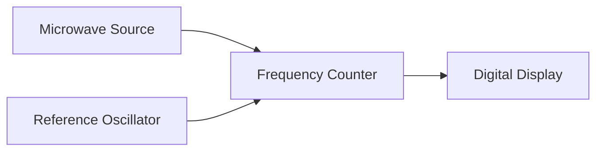

**ફ્રીક્વન્સી માપન - હેટરોડાઇન પદ્ધતિ:**

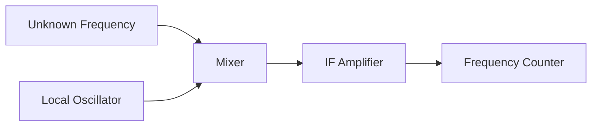

**તરંગલંબાઇ માપન - સ્લોટેડ લાઇન પદ્ધતિ:**

**સેટઅપ આકૃતિ:**

```goat
Microwave --|-----|====|-----|-- Slotted Line --|-- Load
Source      |  Isolator  |                     |
            |            |                     |
         Attenuator   Detector              Movable
                                           Probe
```

**માપન પ્રક્રિયા:**

**ફ્રી સ્પેસ તરંગલંબાઇ (λ₀):**

- **સ્ટેપ 1**: મેચ્ડ લોડ કનેક્ટ કરો, ફ્રીક્વન્સી માપો
- **સ્ટેપ 2**: λ₀ = c/f ગણો

**ગાઇડેડ તરંગલંબાઇ (λ_g):**

- **સ્ટેપ 1**: શોર્ટ સર્કિટ કનેક્ટ કરો, બે સતત મિનિમા શોધો
- **સ્ટેપ 2**: λ_g = 2 × મિનિમા વચ્ચેનું અંતર
- **સ્ટેપ 3**: ચકાસો: λ_g = λ₀/√[1-(λ₀/λ_c)²]

**કટ-ઓફ તરંગલંબાઇ (λ_c):**

- **પદ્ધતિ 1**: વેવગાઇડ પરિમાણોથી: λ_c = 2a (TE₁₀ માટે)
- **પદ્ધતિ 2**: λ₀ અને λ_g થી: λ_c = λ₀/√[1-(λ₀/λ_g)²]

**માપન કોષ્ટક:**

| પરિમાપ | પદ્ધતિ | ચોકસાઈ |
|---------|--------|----------|
| ફ્રીક્વન્સી | ડાયરેક્ટ કાઉન્ટિંગ | ±0.01% |
| λ₀ | f થી ગણતરી | ±0.01% |
| λ_g | સ્લોટેડ લાઇન | ±1% |
| λ_c | ગણતરી/માપન | ±2% |

**દરેક પદ્ધતિના ફાયદાઓ:**

- **ડાયરેક્ટ પદ્ધતિ**: ઉચ્ચ ચોકસાઈ, સરળ
- **હેટરોડાઇન પદ્ધતિ**: વિસ્તૃત ફ્રીક્વન્સી રેન્જ
- **સ્લોટેડ લાઇન**: ગાઇડેડ પરિમાપો સીધું માપે છે

**ભૂલના સ્ત્રોતો:**

- **પ્રોબ કપલિંગ** વેરિયેશન
- **ટેમ્પરેચર અસર** પરિમાણો પર
- **ડિટેક્ટર નોન-લિનિયરિટી**
- **સ્ટેન્ડિંગ વેવ** ડિસ્ટર્બન્સ

**ઉપયોગો:**

- **વેવગાઇડ કેરેક્ટરાઇઝેશન**
- **મટિરિયલ પ્રોપર્ટી માપન**
- **એન્ટેના ટેસ્ટિંગ**
- **કોમ્પોનન્ટ વેરિફિકેશન**

**યાદાશ્ત સૂત્ર**: "ફ્રીક્વન્સી પહેલા, તરંગલંબાઇ માપન સાથે"

## પ્રશ્ન 4(અ) [3 ગુણ]

**માઇક્રોવેવ ફ્રીક્વન્સી માટે વેક્યૂમ ટ્યુબની ફ્રીક્વન્સી મર્યાદાઓ જણાવો.**

**જવાબ**:

**ફ્રીક્વન્સી મર્યાદાઓ:**

- **ટ્રાન્ઝિટ ટાઇમ અસર**: ઇલેક્ટ્રોન ટ્રાન્ઝિટ ટાઇમ RF પીરિયડ સાથે સરખાવાય
- **ઇન્ટર-ઇલેક્ટ્રોડ કેપેસિટન્સ**: ઉચ્ચ ફ્રીક્વન્સીએ ગેઇન ઘટાડે છે  
- **લીડ ઇન્ડક્ટન્સ**: પેરાસિટિક ઇન્ડક્ટન્સ પર્ફોર્મન્સ મર્યાદિત કરે છે
- **સ્કિન અસર**: કરંટ કન્સન્ટ્રેશન અસરકારક કંડક્ટન્સ ઘટાડે છે

**મર્યાદિત કરતા પરિબળો કોષ્ટક:**

| પરિબળ | અસર | ફ્રીક્વન્સી ઇમ્પેક્ટ |
|--------|--------|------------------|
| ટ્રાન્ઝિટ ટાઇમ | ફેઝ વિલંબ | f < 1/(2πτ) |
| કેપેસિટન્સ | રિએક્ટન્સ લોડિંગ | ગેઇન ∝ 1/f |
| ઇન્ડક્ટન્સ | રેઝોનન્સ અસર | સ્ટેબિલિટી ઇશ્યુ |
| સ્કિન અસર | વધારો પ્રતિકાર | કાર્યક્ષમતા ↓ |

**ઉકેલો**:

- **ઇલેક્ટ્રોડ સ્પેસિંગ ઘટાડો**
- **વિશેષ જ્યોમેટ્રીનો ઉપયોગ**
- **માઇક્રોવેવ ટ્યુબ્સ વાપરો** (ક્લિસ્ટ્રોન, મેગ્નેટ્રોન)

**યાદાશ્ત સૂત્ર**: "ટ્રાન્ઝિટ ટાઇમ પરંપરાગત ટ્યુબ્સને તકલીફ"

## પ્રશ્ન 4(બ) [4 ગુણ]

**IMPATT ડાયોડમાં નેગેટિવ રેઝિસ્ટન્સ અસર સમજાવો.**

**જવાબ**:

**IMPATT સ્ટ્રક્ચર:**

```goat
P+ |--| I |--| P |--| N+ |
   ←--|------|------|--→
   Avalanche  Drift
   Region     Region
```

**નેગેટિવ રેઝિસ્ટન્સ મેકેનિઝમ:**

**બે-સ્ટેપ પ્રક્રિયા:**

1. **ઇમ્પેક્ટ આયોનાઇઝેશન**: ઉચ્ચ ફીલ્ડ ઇલેક્ટ્રોન-હોલ પેર બનાવે છે
2. **ટ્રાન્ઝિટ ટાઇમ વિલંબ**: કેરિયર ડિપ્લીશન રીજન પાર ડ્રિફ્ટ કરે છે

**ફેઝ સંબંધો**:

- **કરંટ**: વોલ્ટેજ કરતા 90° (એવેલાન્ચ વિલંબ) + 90° (ટ્રાન્ઝિટ વિલંબ) = 180° પાછળ
- **પરિણામ**: I = -G*V (નેગેટિવ કંડક્ટન્સ)

**ઓપરેટિંગ સાયકલ:**


**મુખ્ય પરિમાપો**:

- **એવેલાન્ચ ફ્રીક્વન્સી**: f_a = v_s/(2W_a)
- **ટ્રાન્ઝિટ ફ્રીક્વન્સી**: f_t = v_d/(2W_d)
- **ઓપ્ટિમમ ફ્રીક્વન્સી**: f_0 = 1/(2π√L*|C_negative|)

**યાદાશ્ત સૂત્ર**: "ઇમ્પેક્ટ આયોનાઇઝેશન, ટ્રાન્ઝિટ ટાઇમ = નેગેટિવ રેઝિસ્ટન્સ"

## પ્રશ્ન 4(ક) [7 ગુણ]

**ટનલ ડાયોડનો સિદ્ધાંત, ટનલિંગ ઘટના અને કોઈપણ એક એપ્લિકેશન સમજાવો.**

**જવાબ**:

**સિદ્ધાંત**: ટનલ ડાયોડ **ક્વાન્ટમ મેકેનિકલ ટનલિંગ** અસર પર કાર્ય કરે છે બહુ ભારે ડોપ્ડ p-n જંક્શનમાં પાતળા પોટેન્શિયલ બેરિયર દ્વારા.

**એનર્જી બેન્ડ ડાયાગ્રામ:**

```goat
Forward Bias States:

State 1 (Low bias):    State 2 (Peak):      State 3 (Valley):
   P side | N side        P side | N side        P side | N side
    ___   |  ___           ___   |  ___           ___   |  ___
   |   |  | |   |         |   |  | |   |         |   |  | |   |
   |___|  | |___|         |___| /| |___|         |___| /| |___|
          |               Tunneling              No tunnel
       Tunneling                               
```

**I-V લક્ષણો:**

```goat
Current ↑
        |    
     Ip |●     
        |  ●    
        |    ●   Forward region
        |      ●  
        |        ●
     Iv |         ●____
        |                ●
        |                  ●
        |________________________→ Voltage
        0   Vp    Vv    Vf
        
    Peak    Valley  Forward
    point   point   region
```

**ટનલિંગ ઘટના:**

**ક્વાન્ટમ મેકેનિક્સ**: ઇલેક્ટ્રોન પોટેન્શિયલ બેરિયર પાર કરી શકે છે ભલે તેમની એનર્જી બેરિયર હાઇટ કરતા ઓછી હોય.

**ટનલિંગ પ્રોબેબિલિટી**: T = exp(-2√(2m*φ*d²)/ħ)
જ્યાં:

- m = ઇલેક્ટ્રોન માસ
- φ = બેરિયર હાઇટ  
- d = બેરિયર વિડ્થ
- ħ = રિડ્યુસ્ડ પ્લાન્ક કોન્સ્ટન્ટ

**ઓપરેટિંગ રીજન:**

- **ટનલિંગ રીજન** (0 થી Vp): વોલ્ટેજ સાથે કરંટ વધે છે
- **નેગેટિવ રેઝિસ્ટન્સ** (Vp થી Vv): વધતા વોલ્ટેજ સાથે કરંટ ઘટે છે
- **ફોરવર્ડ બાયાસ** (>Vv): સામાન્ય ડાયોડ વર્તન

**મુખ્ય પરિમાપો કોષ્ટક:**

| પરિમાપ | પ્રતીક | સામાન્ય મૂલ્ય |
|---------|--------|---------------|
| પીક કરંટ | Ip | 1-100 mA |
| પીક વોલ્ટેજ | Vp | 50-100 mV |
| વેલી કરંટ | Iv | 0.1*Ip |
| વેલી વોલ્ટેજ | Vv | 300-500 mV |

**એપ્લિકેશન - હાઇ ફ્રીક્વન્સી ઓસિલેટર:**

**સર્કિટ આકૃતિ:**

```goat
    +Vcc
      |
      R ← Bias resistor
      |
      ●---L---●---Output
      |       |
   Tunnel     C
   Diode      |
      |       |
    ──┴──   ──┴──
     GND     GND
```

**ઓસિલેટર ઓપરેશન:**

- **બાયાસ પોઇન્ટ**: નેગેટિવ રેઝિસ્ટન્સ રીજનમાં સેટ કરવામાં આવે છે
- **ટેન્ક સર્કિટ**: LC ઓસિલેશન ફ્રીક્વન્સી નક્કી કરે છે
- **કન્ડિશન**: |R_negative| > R_positive ઓસિલેશન માટે
- **ફ્રીક્વન્સી**: f = 1/(2π√LC)

**ફાયદાઓ:**

- **અલ્ટ્રા-હાઇ ફ્રીક્વન્સી** ઓપરેશન (100 GHz સુધી)
- **લો નોઇઝ** ફિગર
- **ઝડપી સ્વિચિંગ** (પિકોસેકન્ડ રેન્જ)
- **લો પાવર કન્ઝમ્પશન**
- **ટેમ્પરેચર સ્ટેબલ**

**ઉપયોગો:**

- **માઇક્રોવેવ ઓસિલેટર**
- **હાઇ-સ્પીડ સ્વિચ**
- **માઇક્રોવેવ એમ્પ્લિફાયર**
- **ફ્રીક્વન્સી કન્વર્ટર**
- **કોમ્પ્યુટર મેમરી સર્કિટ**

**મર્યાદાઓ:**

- **લો પાવર હેન્ડલિંગ**
- **ક્રિટિકલ બાયાસ રિક્વાયરમેન્ટ**
- **મર્યાદિત ટેમ્પરેચર રેન્જ**
- **મોંઘું મેન્યુફેક્ચરિંગ**

**યાદાશ્ત સૂત્ર**: "ટનલ થ્રુ, નેગેટિવ ગ્રો, ઓસિલેટર ફ્લો"

## પ્રશ્ન 4(અ) વિકલ્પ [3 ગુણ]

**માઇક્રોવેવ રેડિએશનને કારણે જોખમો સમજાવો.**

**જવાબ**:

**જોખમના પ્રકારો:**

**HERP (હેઝાર્ડ ઓફ ઇલેક્ટ્રોમેગ્નેટિક રેડિએશન ટુ પર્સનેલ):**

- **થર્મલ અસર**: 41°C ઉપર ટિશ્યુ હીટિંગ
- **નોન-થર્મલ અસર**: લો પાવર લેવલ પર સેલ્યુલર ડેમેજ
- **ક્યુમ્યુલેટિવ અસર**: લાંબા ગાળાના એક્સપોઝર રિસ્ક

**HERO (હેઝાર્ડ ઓફ ઇલેક્ટ્રોમેગ્નેટિક રેડિએશન ટુ ઓર્ડનન્સ):**

- **પ્રીમેચ્યુર ઇગ્નિશન**: RF એનર્જી વિસ્ફોટક ઉપકરણોને ટ્રિગર કરી શકે છે
- **ફ્યુઅલ ઇગ્નિશન**: ફ્યુઅલ વેપરનું માઇક્રોવેવ હીટિંગ
- **ઇલેક્ટ્રોનિક ઇન્ટરફેરન્સ**: કંટ્રોલ સિસ્ટમમાં વિક્ષેપ

**HERF (હેઝાર્ડ ઓફ ઇલેક્ટ્રોમેગ્નેટિક રેડિએશન ટુ ફ્યુઅલ્સ):**

- **ફ્યુઅલ હીટિંગ**: હાઇડ્રોકાર્બન ફ્યુઅલનું ડાઇઇલેક્ટ્રિક હીટિંગ
- **સ્ટેટિક ડિસ્ચાર્જ**: ફ્યુઅલ સિસ્ટમમાં RF-ઇન્ડ્યુસ્ડ સ્પાર્કિંગ
- **વેપર ઇગ્નિશન**: ફ્યુઅલ-એર મિક્સચરનું હીટિંગ

**સેફ્ટી ગાઇડલાઇન કોષ્ટક:**

| એક્સપોઝર લેવલ | પાવર ડેન્સિટી | અવધિ | અસર |
|----------------|---------------|----------|--------|
| સેફ | <10 mW/cm² | 8 કલાક | કોઈ અસર નથી |
| સાવધાન | 10-100 mW/cm² | મર્યાદિત | શક્ય હીટિંગ |
| જોખમ | >100 mW/cm² | ટાળો | ટિશ્યુ ડેમેજ |

**યાદાશ્ત સૂત્ર**: "HERP-HERO-HERF = હેલ્થ-એક્સ્પ્લોસિવ-ફ્યુઅલ રિસ્ક"

## પ્રશ્ન 4(બ) વિકલ્પ [4 ગુણ]

**પેરામેટ્રિક એમ્પ્લિફાયરમાં ડીજનરેટ અને નોન-ડીજનરેટ મોડ સમજાવો.**

**જવાબ**:

**પેરામેટ્રિક એમ્પ્લિફાયર સિદ્ધાંત**: **ટાઇમ-વેરિંગ રિએક્ટન્સ** નો ઉપયોગ કરીને પમ્પથી સિગ્નલમાં એનર્જી ટ્રાન્સફર કરે છે.

**મોડ વર્ગીકરણ:**

**નોન-ડીજનરેટ મોડ:**

- **ત્રણ ફ્રીક્વન્સી**: f_s (સિગ્નલ), f_i (આઇડલર), f_p (પમ્પ)
- **ફ્રીક્વન્સી સંબંધ**: f_p = f_s + f_i
- **બે અલગ સર્કિટ** સિગ્નલ અને આઇડલર માટે
- **ઉચ્ચ ગેઇન** પરંતુ વધારે જટિલ

**ડીજનરેટ મોડ:**

- **બે ફ્રીક્વન્સી**: f_s (સિગ્નલ), f_p (પમ્પ)  
- **ફ્રીક્વન્સી સંબંધ**: f_p = 2f_s
- **સિંગલ રેઝોનન્ટ સર્કિટ**
- **સરળ ડિઝાઇન** પરંતુ ઓછો ગેઇન

**સરખામણી કોષ્ટક:**

| પરિમાપ | નોન-ડીજનરેટ | ડીજનરેટ |
|---------|----------------|------------|
| ફ્રીક્વન્સી | 3 (fs, fi, fp) | 2 (fs, fp) |
| સર્કિટ | અલગ | સંયુક્ત |
| ગેઇન | ઉચ્ચ | ઓછો |
| જટિલતા | વધારે | ઓછી |
| બેન્ડવિડ્થ | સાંકડો | વિશાળ |

**એનર્જી ટ્રાન્સફર:**

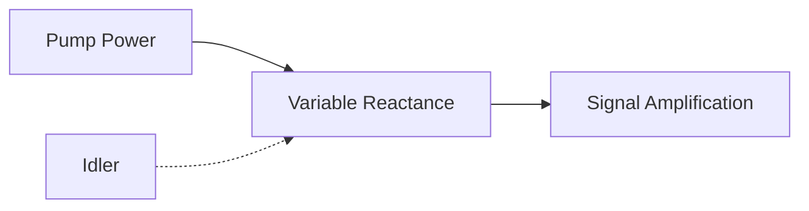

**યાદાશ્ત સૂત્ર**: "નોન-ડીજનરેટ = નોટ-સિંગલ, ડીજનરેટ = ડબલ્ડ-ફ્રીક્વન્સી"

## પ્રશ્ન 4(ક) વિકલ્પ [7 ગુણ]

**ગન ડાયોડમાં સિદ્ધાંત અને ગન અસર સમજાવો. ગન ડાયોડને ઓસિલેટર તરીકે પણ સમજાવો.**

**જવાબ**:

**ગન અસર સિદ્ધાંત**: કોમ્પાઉન્ડ સેમિકંડક્ટર (GaAs, InP) માં **ટ્રાન્સફર્ડ ઇલેક્ટ્રોન અસર** પર આધારિત.

**એનર્જી બેન્ડ સ્ટ્રક્ચર:**

```goat
Energy ↑
       |     Upper valley
       |    /
       |   /  ΔE = 0.36 eV
       |  /
       |_/_______ Lower valley
              |
              |→ k (momentum)
        Γ valley   L valley
```

**ગન અસર મેકેનિઝમ:**

**ડિફરન્શિયલ મોબિલિટી:**

- **લો ફીલ્ડ** (<3 kV/cm): ઇલેક્ટ્રોન Γ વેલીમાં (હાઇ મોબિલિટી)
- **હાઇ ફીલ્ડ** (>3 kV/cm): ઇલેક્ટ્રોન L વેલીમાં ટ્રાન્સફર (લો મોબિલિટી)
- **પરિણામ**: નેગેટિવ ડિફરન્શિયલ મોબિલિટી (NDM)

**ડોમેઇન ફોર્મેશન:**


**કરંટ-વોલ્ટેજ લક્ષણો:**

```goat
Current ↑
        |
    I_p |●
        | ●
        |  ●
        |   ●_____ NDM region
        |        ●
        |         ●
        |__________●_________→ Voltage
        0    V_th    V_s
        
    Threshold  Sustaining
    voltage    voltage
```

**ગન ડાયોડ ઓસિલેટર:**

**બેસિક કન્ફિગરેશન:**

```goat
    +V_bias
      |
      R ← Bias resistor  
      |
    ──●──── RF Output
      |
   [Gunn]  ← Gunn diode
   Diode   
      |
    ──┴──── Ground
     GND
```

**ઓસિલેટર મોડ્સ:**

**ટ્રાન્ઝિટ ટાઇમ મોડ:**

- **ડોમેઇન ફોર્મેશન** કેથોડ પર
- **ડોમેઇન ટ્રાન્ઝિટ** એક્ટિવ રીજન પાર  
- **કરંટ પલ્સ** જ્યારે ડોમેઇન એનોડ પર પહોંચે
- **ફ્રીક્વન્સી**: f = v_d/L (જ્યાં v_d = ડ્રિફ્ટ વેલોસિટી, L = લંબાઇ)

**ક્વેન્ચ્ડ ડોમેઇન મોડ:**

- **રેઝોનન્ટ સર્કિટ** ટ્રાન્ઝિટ પહેલા ડોમેઇન ક્વેન્ચ કરે છે
- **ઉચ્ચ ફ્રીક્વન્સી** ઓપરેશન શક્ય
- **કાર્યક્ષમતા**: 5-20%

**LSA (લિમિટેડ સ્પેસ-ચાર્જ એક્યુમ્યુલેશન) મોડ:**

- **હાઇ ફ્રીક્વન્સી** ડોમેઇન ફોર્મેશન અટકાવે છે
- **યુનિફોર્મ ફીલ્ડ** જાળવવામાં આવે છે
- **ઉચ્ચ કાર્યક્ષમતા**: 10-25%

**પર્ફોર્મન્સ પરિમાપો:**

| પરિમાપ | મૂલ્ય | એકમ |
|---------|-------|------|
| ફ્રીક્વન્સી રેન્જ | 1-100 | GHz |
| પાવર આઉટપુટ | 1 mW-10 W | - |
| કાર્યક્ષમતા | 5-25 | % |
| નોઇઝ ફિગર | 35-50 | dB |

**ફાયદાઓ:**

- **સરળ સ્ટ્રક્ચર** - કોઈ બાહ્ય રેઝોનેટરની જરૂર નથી
- **બ્રોડબેન્ડ ટ્યુનિંગ** ક્ષમતા
- **લો નોઇઝ** માઇક્રોવેવ ફ્રીક્વન્સીએ
- **વિશ્વસનીય ઓપરેશન**

**ઉપયોગો:**

- **લોકલ ઓસિલેટર** રિસીવરમાં
- **CW રડાર ટ્રાન્સમિટર**  
- **માઇક્રોવેવ કોમ્યુનિકેશન સિસ્ટમ**
- **ટેસ્ટ ઇક્વિપમેન્ટ સિગ્નલ સોર્સ**

**યાદાશ્ત સૂત્ર**: "ગન ગેલિયમ-આર્સેનાઇડ દ્વારા ગોઇંગ મેળવે"

## પ્રશ્ન 5(અ) [3 ગુણ]

**બ્લોક ડાયાગ્રામની મદદથી મૂળભૂત રડાર સિસ્ટમના કાર્ય સિદ્ધાંતને સમજાવો.**

**જવાબ**:

**રડાર સિદ્ધાંત**: **રેડિયો ડિટેક્શન એન્ડ રેન્જિંગ** - RF પલ્સ ટ્રાન્સમિટ કરે છે અને ટાર્ગેટથી પ્રતિબિંબિત સિગ્નલ ડિટેક્ટ કરે છે.

**બેસિક રડાર બ્લોક ડાયાગ્રામ:**

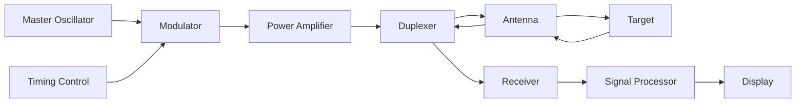

**કાર્યપ્રણાલી સિદ્ધાંત**:

- **ટ્રાન્સમિશન**: ટાર્ગેટ તરફ હાઇ પાવર RF પલ્સ ટ્રાન્સમિટ કરવામાં આવે છે
- **પ્રસારણ**: EM તરંગ પ્રકાશની ગતિ (c) થી ચાલે છે
- **પ્રતિબિંબ**: ટાર્ગેટ એનર્જીનો ભાગ પાછો રડાર તરફ પ્રતિબિંબિત કરે છે
- **રિસેપ્શન**: પ્રતિબિંબિત સિગ્નલ પ્રાપ્ત અને પ્રોસેસ કરવામાં આવે છે
- **રેન્જ કેલ્ક્યુલેશન**: R = (c × t)/2

**મુખ્ય પરિમાપો**:

- **પલ્સ વિડ્થ**: τ = 0.1 થી 10 μs
- **પલ્સ રિપીટિશન ફ્રીક્વન્સી**: PRF = 100 Hz થી 10 kHz
- **પીક પાવર**: 1 kW થી 10 MW

**યાદાશ્ત સૂત્ર**: "રડાર રાઉન્ડ-ટ્રિપ રિફ્લેક્શન દ્વારા રેન્જ માપે"

## પ્રશ્ન 5(બ) [4 ગુણ]

**યોગ્ય આકૃતિની મદદથી A-સ્કોપ ડિસ્પ્લે પદ્ધતિ સમજાવો.**

**જવાબ**:

**A-સ્કોપ ડિસ્પ્લે**: પ્રાપ્ત ઇકોઝનો **એમ્પ્લિટ્યુડ વર્સિસ ટાઇમ** સંબંધ દર્શાવે છે.

**A-સ્કોપ પ્રેઝન્ટેશન:**

```goat
Amplitude ↑
          |
          |    ●  Target echo
          |   /|\  
     Main |  / | \  
    pulse | /  |  \  
          |/   |   \
          |    |    \___
          |____|_________\______→ Time
          0    |         
               |
           2R/c (Range)
           
    ←Ground→←Sea→←Target→←Noise→
     clutter clutter
```

**ડિસ્પ્લે કોમ્પોનન્ટ્સ**:

- **મેઇન પલ્સ**: પ્રારંભિક ટ્રાન્સમિટેડ પલ્સ (રેફરન્સ)
- **ગ્રાઉન્ડ ક્લટર**: નજીકના ટેરેઇનથી પ્રતિબિંબ
- **સી ક્લટર**: દરિયાની સપાટીથી પ્રતિબિંબ  
- **ટાર્ગેટ ઇકો**: વાસ્તવિક ટાર્ગેટથી પ્રતિબિંબ
- **નોઇઝ**: રેન્ડમ બેકગ્રાઉન્ડ સિગ્નલ

**રેન્જ માપન**:

- **હોરિઝોન્ટલ એક્સિસ**: ટાઇમ (રેન્જના પ્રમાણસર)
- **વર્ટિકલ એક્સિસ**: સિગ્નલ એમ્પ્લિટ્યુડ
- **રેન્જ ફોર્મ્યુલા**: R = (c × t)/2

**ઉપયોગો**:

- **એર ટ્રાફિક કંટ્રોલ**
- **હાઇટ ફાઇન્ડિંગ રડાર**  
- **રેન્જ માપન**
- **સિગ્નલ એનાલિસિસ**

**યાદાશ્ત સૂત્ર**: "A-સ્કોપ ટાઇમ એક્સિસ સાથે એમ્પ્લિટ્યુડ દર્શાવે"

## પ્રશ્ન 5(ક) [7 ગુણ]

**ડોપ્લર અસર અને બ્લોક ડાયાગ્રામની મદદથી MTI (મૂવિંગ ટાર્ગેટ ઇન્ડિકેટર) રડાર સિસ્ટમની કામગીરી સમજાવો.**

**જવાબ**:

**ડોપ્લર અસર**: રડાર અને ટાર્ગેટ વચ્ચે સાપેક્ષ ગતિ હોય ત્યારે ફ્રીક્વન્સી શિફ્ટ થાય છે.

**ડોપ્લર ફ્રીક્વન્સી શિફ્ટ:**
f_d = (2 × v_r × f_0)/c

જ્યાં:

- f_d = ડોપ્લર ફ્રીક્વન્સી શિફ્ટ
- v_r = ટાર્ગેટની રેડિયલ વેલોસિટી
- f_0 = ટ્રાન્સમિટેડ ફ્રીક્વન્સી  
- c = પ્રકાશની ગતિ

**ડોપ્લર શિફ્ટ કેસિસ**:

- **પાસ આવતું ટાર્ગેટ**: f_d > 0 (પોઝિટિવ શિફ્ટ)
- **દૂર જતું ટાર્ગેટ**: f_d < 0 (નેગેટિવ શિફ્ટ)
- **સ્થિર ટાર્ગેટ**: f_d = 0 (કોઈ શિફ્ટ નથી)

**MTI રડાર બ્લોક ડાયાગ્રામ:**

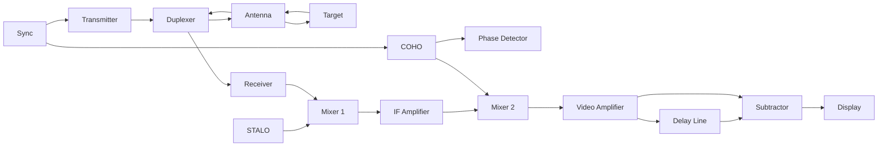

**MTI સિસ્ટમ કોમ્પોનન્ટ્સ:**

**STALO (સ્ટેબલ લોકલ ઓસિલેટર):**

- **ફ્રીક્વન્સી**: ટ્રાન્સમિટેડ ફ્રીક્વન્સીની નજીક
- **સ્ટેબિલિટી**: ઉચ્ચ ફ્રીક્વન્સી સ્થિરતા જરૂરી
- **ફંક્શન**: ફર્સ્ટ મિક્સર LO

**COHO (કોહેરન્ટ ઓસિલેટર):**

- **ફેઝ રેફરન્સ**: ફેઝ કોહેરન્સ જાળવે છે
- **સિંક્રોનાઇઝેશન**: ટ્રાન્સમિટર ફેઝ સાથે લોક્ડ
- **ફંક્શન**: સેકન્ડ મિક્સર LO અને ફેઝ રેફરન્સ

**MTI પ્રોસેસિંગ:**

- **ડિલે લાઇન**: અગાઉના પલ્સ ઇકો સ્ટોર કરે છે
- **સબટ્રેક્ટર**: વર્તમાનમાંથી અગાઉનો પલ્સ બાદ કરે છે
- **પરિણામ**: સ્થિર ટાર્ગેટ કેન્સલ, મૂવિંગ ટાર્ગેટ એન્હાન્સ

**MTI ટ્રાન્સફર ફંક્શન:**

```goat
|H(f)| ↑
       |     
    1.0|     ●●●     ●●●     ●●●
       |    ●   ●   ●   ●   ●   ●
    0.5|   ●     ● ●     ● ●     ●
       |  ●       ●       ●       ●
     0 |_●_______●_______●_______●___→ fd
       0  PRF/4  PRF/2  3PRF/4  PRF
       
       ← Blind speeds →
```

**બ્લાઇન્ડ સ્પીડ્સ**: ચોક્કસ વેલોસિટી ધરાવતા ટાર્ગેટ સ્થિર દેખાય છે:
v_blind = (n × λ × PRF)/2  (જ્યાં n = 1,2,3...)

**પર્ફોર્મન્સ સુધારણા:**

**મલ્ટિ-પલ્સ MTI:**

- **મલ્ટિપલ ડિલે લાઇન** વધુ સારા ક્લટર રિજેક્શન માટે
- **સ્ટેગર્ડ PRF** બ્લાઇન્ડ સ્પીડ ઘટાડવા માટે
- **વેટેડ કોઇફિશન્ટ** ઓપ્ટિમમ રિસ્પોન્સ માટે

**ક્લટર મેપ:**

- **ડિજિટલ મેમરી** ક્લટર પેટર્ન સ્ટોર કરે છે
- **એડાપ્ટિવ થ્રેશહોલ્ડ** લોકલ ક્લટર લેવલ અનુસાર એડજસ્ટ કરે છે
- **ઓટોમેટિક અપડેટ** ધીમા ક્લટર ચેન્જને ટ્રેક કરે છે

**MTI પર્ફોર્મન્સ મેટ્રિક્સ:**

| પરિમાપ | સામાન્ય મૂલ્ય |
|---------|---------------|
| ક્લટર એટેન્યુએશન | 30-60 dB |
| મિનિમમ ડિટેક્ટેબલ વેલોસિટી | 1-10 m/s |
| બ્લાઇન્ડ સ્પીડ | λ×PRF/2 |
| ઇમ્પ્રુવમેન્ટ ફેક્ટર | 20-40 dB |

**ફાયદાઓ:**

- **ક્લટર સપ્રેશન**: સ્થિર ક્લટર દૂર કરે છે
- **મૂવિંગ ટાર્ગેટ એમ્ફેસિસ**: મૂવિંગ ટાર્ગેટ વધારે છે
- **ઓટોમેટિક ઓપરેશન**: ઓપરેટરનો વર્કલોડ ઘટાડે છે

**મર્યાદાઓ:**

- **બ્લાઇન્ડ સ્પીડ્સ**: કેટલીક વેલોસિટી ડિટેક્ટ કરી શકાતી નથી
- **ટેન્જેન્શિયલ ટાર્ગેટ**: કોઈ રેડિયલ કોમ્પોનન્ટ નથી
- **વેધર અસર**: વરસાદ/બરફ ટાર્ગેટને માસ્ક કરી શકે છે

**ઉપયોગો:**

- **એર ટ્રાફિક કંટ્રોલ**: એરક્રાફ્ટને ગ્રાઉન્ડ ક્લટરથી અલગ કરે છે
- **વેધર રડાર**: પ્રેસિપિટેશન મૂવમેન્ટ ડિટેક્ટ કરે છે  
- **મિલિટરી સર્વેલન્સ**: મૂવિંગ વેહિકલ ડિટેક્ટ કરે છે
- **મરીન રડાર**: સી ક્લટર ઘટાડે છે

**યાદાશ્ત સૂત્ર**: "MTI ડોપ્લર ડિફરન્સ દ્વારા ટાર્ગેટ આઇડેન્ટિફાઇ કરે"

## પ્રશ્ન 5(અ) વિકલ્પ [3 ગુણ]

**વ્યાખ્યા આપો: a) બ્લાઇન્ડ સ્પીડ, અને b) MUR**

**જવાબ**:

**બ્લાઇન્ડ સ્પીડ:**

- **વ્યાખ્યા**: ટાર્ગેટની રેડિયલ વેલોસિટી કે જે MTI રડારમાં ઝીરો ડોપ્લર શિફ્ટ ઉત્પન્ન કરે છે
- **ફોર્મ્યુલા**: v_blind = (n × λ × PRF)/2
- **કારણ**: ટાર્ગેટ મૂવમેન્ટ પલ્સ રિપીટિશન સાથે સિંક્રોનાઇઝ્ડ
- **પરિણામ**: મૂવિંગ ટાર્ગેટ સ્થિર દેખાય છે

**MUR (મેક્સિમમ અનએમ્બિગ્યુઅસ રેન્જ):**

- **વ્યાખ્યા**: મહત્તમ રેન્જ કે જ્યાં રેન્જ એમ્બિગ્યુટી વિના ટાર્ગેટ ડિટેક્ટ કરી શકાય
- **ફોર્મ્યુલા**: R_max = (c × PRT)/2 = c/(2 × PRF)
- **મર્યાદા**: આગળનો પલ્સ ઇકો પાછો આવે તે પહેલા ટ્રાન્સમિટ થાય છે
- **એમ્બિગ્યુટી**: MUR કરતા વધારે ટાર્ગેટ ખોટી રેન્જ પર દેખાય છે

**સંબંધ કોષ્ટક:**

| પરિમાપ | ફોર્મ્યુલા | એકમ |
|---------|---------|------|
| બ્લાઇન્ડ સ્પીડ | nλPRF/2 | m/s |
| MUR | c/(2×PRF) | મીટર |
| PRT | 1/PRF | સેકન્ડ |

**યાદાશ્ત સૂત્ર**: "બ્લાઇન્ડ સ્પીડ બ્લોક કરે, MUR મેક્સિમમ માપે"

## પ્રશ્ન 5(બ) વિકલ્પ [4 ગુણ]

**મહત્તમ રડાર રેન્જને અસર કરતા પરિબળો સમજાવો.**

**જવાબ**:

**રડાર રેન્જ સમીકરણ:**
R_max = [(P_t × G² × λ² × σ)/(64π³ × P_min × L)]^(1/4)

**મહત્તમ રેન્જને અસર કરતા પરિબળો:**

**ટ્રાન્સમિટેડ પાવર (P_t):**

- **વધારે પાવર** = વધારે રેન્જ
- **સંબંધ**: R ∝ P_t^(1/4)
- **મર્યાદા**: પીક પાવર ટ્રાન્સમિટર દ્વારા મર્યાદિત

**એન્ટેના ગેઇન (G):**

- **ડાયરેક્શનલ એન્ટેના** એનર્જી કન્સન્ટ્રેટ કરે છે
- **સંબંધ**: R ∝ G^(1/2)
- **ટ્રેડ-ઓફ**: વધારે ગેઇન = સાંકડો બીમવિડ્થ

**તરંગલંબાઇ (λ):**

- **લો ફ્રીક્વન્સી** = વધુ સારો પ્રસારણ
- **સંબંધ**: R ∝ λ^(1/2)
- **વિચારણા**: ફ્રીક્વન્સી સાથે એટમોસ્ફેરિક એબ્સોર્પશન વધે છે

**ટાર્ગેટ ક્રોસ સેક્શન (σ):**

- **મોટા ટાર્ગેટ** વધારે એનર્જી રિફ્લેક્ટ કરે છે
- **સંબંધ**: R ∝ σ^(1/4)
- **વેરિયેશન**: ટાર્ગેટ શેપ, મટિરિયલ, એસ્પેક્ટ એંગલ પર આધાર રાખે છે

**પરિબળો કોષ્ટક:**

| પરિબળ | રેન્જ પર અસર | સામાન્ય મૂલ્યો |
|--------|-----------------|----------------|
| પીક પાવર | R ∝ Pt^0.25 | 1 kW - 10 MW |
| એન્ટેના ગેઇન | R ∝ G^0.5 | 20 - 50 dB |
| ફ્રીક્વન્સી | R ∝ λ^0.5 | 1 - 100 GHz |
| ટાર્ગેટ RCS | R ∝ σ^0.25 | 0.1 - 1000 m² |

**યાદાશ્ત સૂત્ર**: "પાવર-ગેઇન-લેમ્બડા-સિગ્મા રેન્જ નક્કી કરે"

## પ્રશ્ન 5(ક) વિકલ્પ [7 ગુણ]

**પલ્સ્ડ રડાર અને CW ડોપ્લર રડારની સરખામણી કરો.**

**જવાબ**:

**વ્યાપક સરખામણી:**

**બેસિક સિદ્ધાંત:**

- **પલ્સ્ડ રડાર**: હાઇ-પાવર પલ્સ ટ્રાન્સમિટ કરે છે, રાઉન્ડ-ટ્રિપ ટાઇમ માપે છે
- **CW ડોપ્લર**: કન્ટિન્યુઅસ વેવ ટ્રાન્સમિટ કરે છે, ડોપ્લર ફ્રીક્વન્સી શિફ્ટ માપે છે

**સિસ્ટમ બ્લોક ડાયાગ્રામ:**

**પલ્સ્ડ રડાર:**

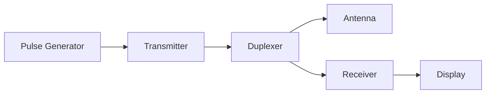

**CW ડોપ્લર રડાર:**

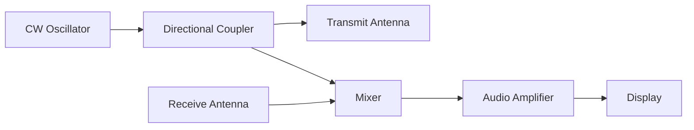

**વિગતવાર સરખામણી કોષ્ટક:**

| પરિમાપ | પલ્સ્ડ રડાર | CW ડોપ્લર રડાર |
|----------|-------------|----------------|
| **ટ્રાન્સમિશન** | હાઇ પાવર પલ્સ | કન્ટિન્યુઅસ લો પાવર |
| **માહિતી** | રેન્જ + વેલોસિટી | ફક્ત વેલોસિટી |
| **એન્ટેના** | સિંગલ (ડુપ્લેક્સર) | અલગ Tx/Rx |
| **રેન્જ ક્ષમતા** | ઉત્તમ | કોઈ નથી (FM-CW સિવાય) |
| **વેલોસિટી રેઝોલ્યુશન** | મર્યાદિત | ઉત્તમ |
| **પીક પાવર** | ખૂબ ઉચ્ચ (MW) | લો (mW થી W) |
| **એવરેજ પાવર** | લો | મધ્યમ |
| **જટિલતા** | ઉચ્ચ | સરળ |
| **કિંમત** | મોંઘું | કિફાયતી |
| **સાઇઝ** | મોટું | કોમ્પેક્ટ |

**પર્ફોર્મન્સ લક્ષણો:**

| પાસું | પલ્સ્ડ રડાર | CW ડોપ્લર રડાર |
|-------|-------------|----------------|
| **રેન્જ એક્યુરેસી** | ±10-100 m | લાગુ નથી |
| **વેલોસિટી એક્યુરેસી** | ±1-10 m/s | ±0.1-1 m/s |
| **મિનિમમ રેન્જ** | પલ્સ વિડ્થ દ્વારા મર્યાદિત | શૂન્ય |
| **મેક્સિમમ રેન્જ** | 10-1000 km | 1-50 km |
| **ક્લટર રિજેક્શન** | મધ્યમ | ઉત્તમ |
| **વેધર અસર** | મહત્વપૂર્ણ | ન્યૂનતમ |

**ફાયદા અને ગેરફાયદા:**

**પલ્સ્ડ રડાર ફાયદા:**

- **રેન્જ માપન** ક્ષમતા
- **હાઇ પીક પાવર** લાંબી રેન્જ માટે
- **સિંગલ એન્ટેના** સિસ્ટમ
- **વેલ-એસ્ટેબ્લિશ્ડ** ટેક્નોલોજી

**પલ્સ્ડ રડાર ગેરફાયદા:**

- **જટિલ સર્કિટરી** (ડુપ્લેક્સર, ટાઇમિંગ)
- **ઉચ્ચ કિંમત** અને મેન્ટેનન્સ  
- **પાવર સપ્લાય** જરૂરિયાત
- **બ્લાઇન્ડ રેન્જ** પલ્સ વિડ્થને કારણે

**CW ડોપ્લર ફાયદા:**

- **સરળ ડિઝાઇન** અને લો કોસ્ટ
- **ઉત્તમ વેલોસિટી રેઝોલ્યુશન**
- **કન્ટિન્યુઅસ મોનિટરિંગ**
- **લો પાવર કન્ઝમ્પશન**
- **કોમ્પેક્ટ સાઇઝ**

**CW ડોપ્લર ગેરફાયદા:**

- **કોઈ રેન્જ માહિતી નથી**
- **અલગ એન્ટેના** જરૂરી
- **મર્યાદિત રેન્જ** ક્ષમતા
- **ઇન્ટરફેરન્સ માટે વલ્નરેબલ**

**ઉપયોગો:**

**પલ્સ્ડ રડાર એપ્લિકેશન:**

- **એર ટ્રાફિક કંટ્રોલ**
- **વેધર મોનિટરિંગ**
- **મિલિટરી સર્વેલન્સ**
- **મેરિટાઇમ નેવિગેશન**
- **સેટેલાઇટ ટ્રેકિંગ**

**CW ડોપ્લર એપ્લિકેશન:**

- **ટ્રાફિક સ્પીડ મોનિટરિંગ**
- **સ્પોર્ટ્સ રડાર ગન**
- **બર્ગલર એલાર્મ**
- **ઓટોમેટિક ડોર ઓપનર**
- **હાર્ટ રેટ મોનિટરિંગ**

**હાઇબ્રિડ સિસ્ટમ:**

**પલ્સ ડોપ્લર રડાર:**

- **બંનેના ફાયદા** કોમ્બાઇન કરે છે
- **રેન્જ અને વેલોસિટી** માપન
- **વધારે જટિલતા** પરંતુ વધુ સારું પર્ફોર્મન્સ

**FM-CW રડાર:**

- **ફ્રીક્વન્સી મોડ્યુલેટેડ** કન્ટિન્યુઅસ વેવ
- **રેન્જ ક્ષમતા** CW સિસ્ટમમાં ઉમેરાય છે
- **ઓટોમોટિવ** રડાર એપ્લિકેશનમાં વપરાય છે

**સિલેક્શન ક્રાઇટેરિયા:**

| જરૂરિયાત | પલ્સ્ડ પસંદ કરો | CW ડોપ્લર પસંદ કરો |
|------------|------------------|-------------------|
| રેન્જ માપન જરૂરી | ✓ | ✗ |
| હાઇ વેલોસિટી એક્યુરેસી | ✗ | ✓ |
| લાંબી રેન્જ ઓપરેશન | ✓ | ✗ |
| લો કોસ્ટ જરૂરિયાત | ✗ | ✓ |
| પોર્ટેબલ એપ્લિકેશન | ✗ | ✓ |
| વેધર રડાર | ✓ | ✗ |

**ભવિષ્યના ટ્રેન્ડ:**

- **ડિજિટલ સિગ્નલ પ્રોસેસિંગ** બંને પ્રકારને સુધારે છે
- **સોફ્ટવેર-ડિફાઇન્ડ રડાર** લવચીકતા આપે છે
- **MIMO ટેકનિક** પર્ફોર્મન્સ વધારે છે
- **અન્ય સેન્સર સાથે ઇન્ટીગ્રેશન**

**યાદાશ્ત સૂત્ર**: "પલ્સ્ડ પોઝિશન આપે, CW કન્ટિન્યુઅસ-વેલોસિટી આપે"
