## Question 1(a) [3 marks]

**Sketch the standing wave pattern for voltage and current along the transmission line when it is terminated with (i) Short Circuit, (ii) Open circuit, and (iii) Matched Load.**

**Answer**:

**Diagram:**

```goat
Short Circuit (Z_L = 0):
     V      
     |      
     |      
     |______|______|______|______ 0V
       λ/4   λ/2   3λ/4    λ
     
     I      
   I_max ---|---|---|---
     |                  
     |      
     0 __________________ 0A

Open Circuit (Z_L = ∞):
   V_max ---|---|---|---
     |                  
     V      
     0 __________________ 0V
       λ/4   λ/2   3λ/4    λ
     
     I      
     |      
     |      
     |______|______|______|______ 0A
       λ/4   λ/2   3λ/4    λ

Matched Load (Z_L = Z_0):
     V      
   ---|---|---|---|--- Constant
     
     I      
   ---|---|---|---|--- Constant
```

- **Short Circuit**: Voltage minimum at load, current maximum at load
- **Open Circuit**: Voltage maximum at load, current minimum at load  
- **Matched Load**: Constant voltage and current, no reflections

**Mnemonic:** "SOC - Short Opens Current, Open Shorts Current"

## Question 1(b) [4 marks]

**Draw and Explain equivalent circuit of two parallel wire transmission line at microwave frequency.**

**Answer**:

**Diagram:**

```goat
       R      L      R      L
    ---|^^^|--|||||---|^^^|--|||||---
    |      |       |      |       |
    |      G       C      G       C
    |     |||     ---    |||     ---
    |     |||     ---    |||     ---
    ---|^^^|--|||||---|^^^|--|||||---
       R      L      R      L
       
       ←-- Δz --→
```

- **R**: Series resistance per unit length (conductor losses)
- **L**: Series inductance per unit length (magnetic field storage)
- **G**: Shunt conductance per unit length (dielectric losses)
- **C**: Shunt capacitance per unit length (electric field storage)

**Primary Constants Table:**

| Parameter | Symbol | Unit | Effect |
|-----------|--------|------|--------|
| Resistance | R | Ω/m | Power loss |
| Inductance | L | H/m | Magnetic energy |
| Conductance | G | S/m | Leakage current |
| Capacitance | C | F/m | Electric energy |

**Mnemonic:** "RLGC - Really Largeガイド Cables"

## Question 1(c) [7 marks]

**Explain Principle, construction and working of Isolator with necessary sketch.**

**Answer**:

**Principle**: Isolator allows microwave signal to pass in forward direction only using **ferrite material** and **Faraday rotation effect**.

**Construction Diagram:**

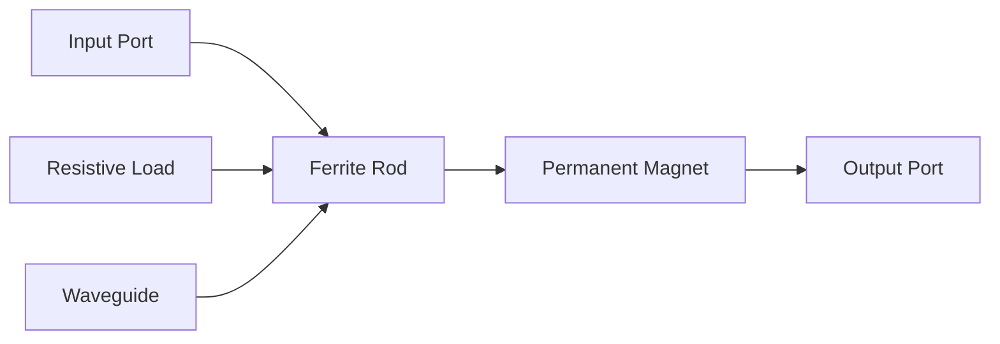

**Working**:

- **Forward direction**: Signal passes through ferrite with minimal loss
- **Reverse direction**: Signal is rotated 45° and absorbed by resistive load
- **Magnetic field** biases ferrite material
- **Isolation**: 20-30 dB typical

**Applications**:

- **Protects** transmitter from reflected power
- **Prevents** oscillations in amplifier circuits
- **Maintains** source impedance matching

**Specifications Table:**

| Parameter | Value | Unit |
|-----------|-------|------|
| Isolation | 20-30 | dB |
| Insertion Loss | 0.5-1 | dB |
| VSWR | <1.5 | - |

**Mnemonic:** "Isolate Forward, Absorb Reverse"

## Question 1(c OR) [7 marks]

**Compare Transmission Line and Waveguide.**

**Answer**:

**Comparison Table:**

| Parameter | Transmission Line | Waveguide |
|-----------|------------------|-----------|
| **Frequency Range** | DC to microwave | Above cutoff frequency |
| **Power Handling** | Limited | High power capability |
| **Losses** | Higher (I²R losses) | Lower (no center conductor) |
| **Size** | Compact | Bulky at low frequencies |
| **Modes** | TEM mode | TE and TM modes |
| **Installation** | Easy | Complex mounting |
| **Cost** | Lower | Higher |
| **Bandwidth** | Wide | Limited by modes |

**Key Differences:**

- **Transmission line**: Uses two conductors, supports TEM mode
- **Waveguide**: Single hollow conductor, supports TE/TM modes
- **Cutoff frequency**: Waveguide has minimum operating frequency
- **Field pattern**: Different electromagnetic field distributions

**Applications:**

- **Transmission lines**: Low power, broadband applications
- **Waveguides**: High power radar, satellite communication

**Mnemonic:** "Transmission Travels Two-wire, Waveguide Walks Wide"

## Question 2(a) [3 marks]

**Define: (i) VSWR, (ii) Reflection Coefficient, and (iii) Skin effect**

**Answer**:

**Definitions:**

- **VSWR (Voltage Standing Wave Ratio)**: Ratio of maximum to minimum voltage amplitudes on transmission line
  - Formula: VSWR = V_max/V_min = (1+|Γ|)/(1-|Γ|)
  
- **Reflection Coefficient (Γ)**: Ratio of reflected to incident voltage amplitude
  - Formula: Γ = (Z_L - Z_0)/(Z_L + Z_0)
  
- **Skin Effect**: Current flows mainly on conductor surface at high frequencies
  - Skin depth: δ = √(2/ωμσ)

**Parameters Table:**

| Parameter | Range | Ideal Value |
|-----------|-------|-------------|
| VSWR | 1 to ∞ | 1 (matched) |
| |Γ| | 0 to 1 | 0 (no reflection) |
| Skin Depth | μm to mm | Frequency dependent |

**Mnemonic:** "VSWR Varies, Gamma Guides, Skin Shrinks"

## Question 2(b) [4 marks]

**Explain working of Two-hole Directional Coupler with Proper sketch.**

**Answer**:

**Construction Diagram:**

```goat
Main Waveguide:
|===============================|
|    →  P1      →  P2           |
|===============================|
         ○    ○  ← Two holes
|===============================|
|    ←  P4      ←  P3           |
|===============================|
Auxiliary Waveguide
```

**Working Principle:**

- **Two holes** spaced λ/4 apart couple energy between waveguides
- **Forward wave**: Coupled signals add at P3, cancel at P4
- **Reverse wave**: Coupled signals add at P4, cancel at P3
- **Directivity**: Achieved by proper hole spacing and size

**Coupling Mechanism:**

- **Electric field coupling** through holes
- **Phase difference** creates directional coupling
- **Coupling factor**: C = 10 log(P1/P3) dB

**Performance Parameters:**

| Parameter | Typical Value |
|-----------|---------------|
| Coupling | 10-30 dB |
| Directivity | 25-40 dB |
| VSWR | <1.3 |

**Mnemonic:** "Two Holes, Two Directions, Total Control"

## Question 2(c) [7 marks]

**Describe Propagation of microwaves through waveguide and get the equation of cut off wavelength.**

**Answer**:

**Propagation Theory:**
Electromagnetic waves propagate through waveguide in **TE and TM modes** with specific field patterns.

**Wave Equation:**
For rectangular waveguide, the wave equation is:
∇²E + γ²E = 0

Where γ² = β² - k²

**Cutoff Wavelength Derivation:**

For **TE_mn mode** in rectangular waveguide:

- **Cutoff frequency**: f_c = (c/2)√[(m/a)² + (n/b)²]
- **Cutoff wavelength**: λ_c = 2/√[(m/a)² + (n/b)²]

For **dominant TE₁₀ mode**:

- λ_c = 2a (where a is broad dimension)

**Propagation Conditions:**

- **Below cutoff** (f < f_c): Evanescent wave, exponential decay
- **Above cutoff** (f > f_c): Propagating wave
- **Phase velocity**: v_p = c/√[1 - (f_c/f)²]
- **Group velocity**: v_g = c√[1 - (f_c/f)²]

**Mode Chart:**

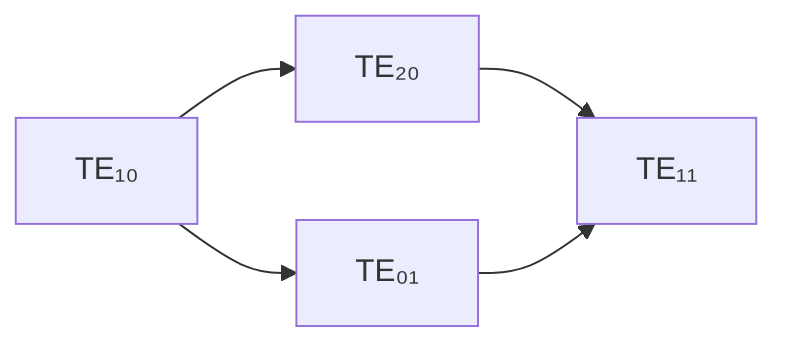

**Key Relations:**

- v_p × v_g = c²
- λ_g = λ₀/√[1 - (λ₀/λ_c)²]

**Mnemonic:** "Cut-off Comes, Propagation Proceeds"

## Question 2(a OR) [3 marks]

**Explain Impedance Matching using Single stub.**

**Answer**:

**Principle**: Single stub matching uses a **short-circuited** or **open-circuited** stub to cancel reactive component of load impedance.

**Stub Diagram:**

```goat
Source ---|---●---|--- Load
  Z₀      |       |    Z_L
          |       |
         ---      |
        Stub      |
         l_s      d
```

**Design Steps:**

- **Step 1**: Find distance 'd' where normalized conductance = 1
- **Step 2**: Calculate required stub susceptance: B_s = -B_load  
- **Step 3**: Determine stub length: l_s from B_s

**Smith Chart Method:**

- Plot normalized load impedance
- Move toward generator to find matching point
- Add stub susceptance to achieve center point

**Mnemonic:** "Single Stub Solves Susceptance"

## Question 2(b OR) [4 marks]

**Explain Hybrid ring with necessary sketch.**

**Answer**:

**Construction Diagram:**

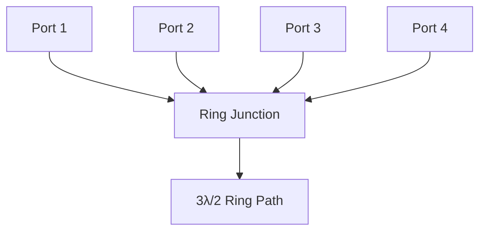

**Working Principle:**

- **Ring circumference**: 3λ/2 (1.5 wavelengths)
- **Equal path lengths** from each port to opposite port
- **180° phase difference** between adjacent ports

**S-Matrix Properties:**

- **Isolation**: Ports 1-3 and ports 2-4 are isolated
- **Power division**: Equal split with 180° phase difference
- **Impedance**: All ports matched to Z₀

**Applications:**

- **Balanced mixers**
- **Push-pull amplifiers**
- **Phase comparison circuits**

**Performance Table:**

| Parameter | Value |
|-----------|-------|
| Isolation | >25 dB |
| Return Loss | >20 dB |
| Phase Balance | ±5° |

**Mnemonic:** "Ring Rotates, Ports Pair-up"

## Question 2(c OR) [7 marks]

**Explain construction, working and any one application of Magic Tee with necessary diagram.**

**Answer**:

**Construction**: Magic Tee is formed by joining **E-plane** and **H-plane** tees at their junction.

**Structure Diagram:**

```goat
       H-arm (Sum port)
           |
           |
    -------●------- 
   |               |
E-arm     Junction  Collinear
(Diff)              arms
   |               |
    -------●-------
           |
           |
       Matched load
```

**Working Principle:**

- **Ports 1,2**: Collinear arms (input/output ports)
- **Port 3**: H-arm (sum/Σ port)  
- **Port 4**: E-arm (difference/Δ port)
- **Isolation**: Between sum and difference ports

**S-Matrix Properties:**

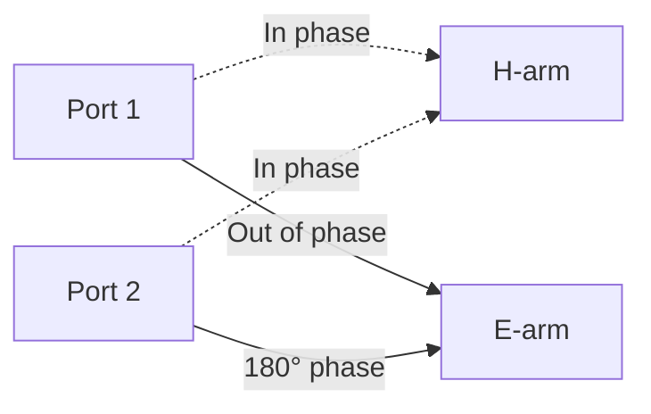

**Application - Radar Duplexer:**

- **Transmit**: Power fed to H-arm, splits equally to ports 1,2
- **Receive**: Received signals combine at E-arm for receiver
- **Isolation**: Protects receiver during transmission
- **Advantage**: Single antenna for transmit/receive

**Performance Specifications:**

| Parameter | Value |
|-----------|-------|
| Isolation | >30 dB |
| VSWR | <1.3 |
| Power Split | 3 dB |
| Phase Balance | ±5° |

**Key Features:**

- **Symmetric structure** ensures equal power division
- **Orthogonal fields** provide port isolation
- **Broadband operation** over octave bandwidth

**Mnemonic:** "Magic Makes Isolation, Tee Transmits Together"

## Question 3(a) [3 marks]

**Explain Attenuation measurement with the help of block diagram.**

**Answer**:

**Block Diagram:**

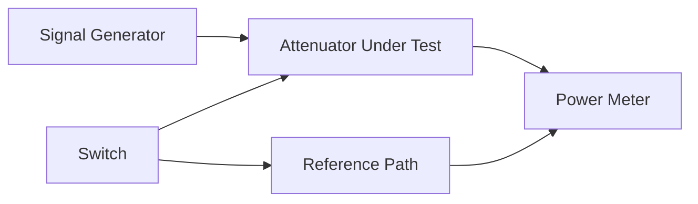

**Measurement Procedure:**

- **Step 1**: Measure power without attenuator (P₁)
- **Step 2**: Insert attenuator, measure power (P₂)  
- **Step 3**: Calculate attenuation = 10 log(P₁/P₂) dB

**Methods:**

- **Substitution method**: Compare with known attenuator
- **Direct method**: Measure input and output power
- **IF substitution**: Use intermediate frequency

**Mnemonic:** "Attenuation = Power₁/Power₂"

## Question 3(b) [4 marks]

**Explain velocity modulation in two cavity klystron with the help of Applegate diagram.**

**Answer**:

**Two Cavity Klystron Diagram:**

```goat
Electron -----> ●======● -----> ●======● -----> Collector
Gun            Input    Drift   Output
               Cavity   Space   Cavity
                 |               |
              RF Input         RF Output
```

**Applegate Diagram:**

```goat
Distance →
   |     
   |  ╱  ╲     ╱  ╲     ╱  ╲
   | ╱    ╲   ╱    ╲   ╱    ╲
   |╱      ╲ ╱      ╲ ╱      ╲
   |        X        X        X  ← Bunching
Tim|       ╱ ╲      ╱ ╲      ╱ ╲  
   ↓      ╱   ╲    ╱   ╲    ╱   ╲
         ╱     ╲  ╱     ╲  ╱     ╲
        ╱       ╲╱       ╲╱       ╲
Fast electrons ←→ Slow electrons
```

**Velocity Modulation Process:**

- **Input cavity**: Electrons gain/lose energy from RF field
- **Drift space**: Fast electrons catch up to slow electrons
- **Bunching**: Electron density varies periodically
- **Output cavity**: Bunched electrons induce RF current

**Key Parameters:**

- **Transit time**: τ = L/v₀ (where L = drift space length)
- **Bunching parameter**: X = βn/2
- **Optimum bunching**: X = 1.84

**Mnemonic:** "Velocity Varies, Bunching Builds"

## Question 3(c) [7 marks]

**Explain the principle, construction and effect of electric and magnetic field in Magnetron.**

**Answer**:

**Principle**: Magnetron uses **crossed electric and magnetic fields** to generate high-power microwave oscillations through **cyclotron motion** of electrons.

**Construction Diagram:**

```goat
    Permanent Magnet (N)
         ↓  ↓  ↓  ↓
    ┌─────────────────┐
    │  ○  ○  ○  ○  ○  │ ← Resonant Cavities
    │○               ○│
    │  ●─ Cathode ─●  │ ← Central cathode
    │○               ○│
    │  ○  ○  ○  ○  ○  │
    └─────────────────┘
         ↑  ↑  ↑  ↑
    Permanent Magnet (S)
```

**Field Effects:**

- **Electric Field (E)**: Radial, from cathode to anode
- **Magnetic Field (B)**: Axial, perpendicular to E-field
- **Crossed fields**: Create cycloidal electron motion

**Electron Motion Analysis:**


**Operating Conditions:**

- **Cutoff condition**: E/B = v_drift
- **Synchronism**: Electron drift velocity matches phase velocity
- **Hull cutoff**: Minimum magnetic field for operation

**Resonant Cavities:**

- **π-mode operation**: Alternate cavities have opposite phases
- **Frequency**: f = c/(2√LC) for cavity resonance
- **Mode separation**: Prevents mode competition

**Performance Characteristics:**

| Parameter | Typical Value |
|-----------|---------------|
| Efficiency | 60-80% |
| Power Output | 10 kW - 10 MW |
| Frequency | 1-100 GHz |
| Pulse/CW | Both modes |

**Advantages:**

- **High efficiency** compared to other tubes
- **High power capability**
- **Compact structure**
- **Good frequency stability**

**Applications:**

- **Radar transmitters**
- **Microwave ovens**
- **Industrial heating**
- **Electronic warfare**

**Mnemonic:** "Magnetron Makes Microwaves via Magnetic Motion"

## Question 3(a OR) [3 marks]

**Explain working of TWT (Travelling Wave Tube) as an Amplifier.**

**Answer**:

**TWT Structure:**

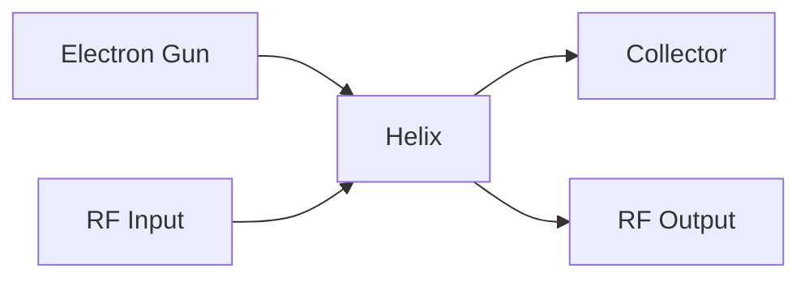

**Amplification Process:**

- **Electron beam** travels along helix axis
- **RF signal** propagates along helix (slow wave structure)
- **Velocity synchronism**: v_electron ≈ v_RF
- **Energy transfer** from DC beam to RF wave

**Gain Mechanism:**

- **Bunching**: RF field modulates electron velocity
- **Induced current**: Bunched electrons induce RF current in helix
- **Progressive amplification** along helix length

**Mnemonic:** "Travelling Wave Transfers Energy"

## Question 3(b OR) [4 marks]

**Explain Bolometer method for low power measurement at microwave frequency.**

**Answer**:

**Principle**: Bolometer measures microwave power by detecting **temperature rise** in resistive element.

**Bolometer Types:**

- **Thermistor**: Negative temperature coefficient
- **Barretter**: Positive temperature coefficient

**Circuit Diagram:**

```goat
    RF Power -----> [Bolometer] -----> Temperature
         |              |               Change
         |              |                 |
    DC Bridge ←---------●---------→ DC Voltmeter
```

**Measurement Process:**

- **Step 1**: Balance bridge with DC power only
- **Step 2**: Apply RF power, note bridge unbalance
- **Step 3**: Reduce DC power to rebalance bridge
- **Step 4**: RF power = Reduction in DC power

**Advantages:**

- **High sensitivity** (µW to mW range)
- **Square law response**
- **Broadband operation**

**Mnemonic:** "Bolometer Burns, Bridge Balances"

## Question 3(c OR) [7 marks]

**Explain frequency and wavelength measurement method with the help of block diagram.**

**Answer**:

**Frequency Measurement - Direct Method:**

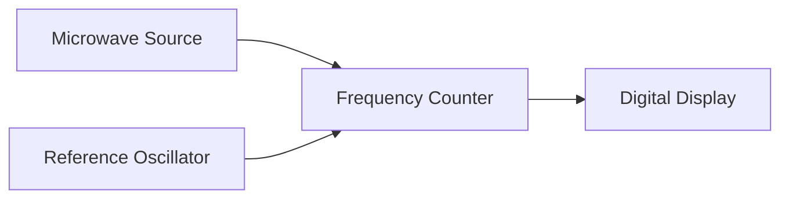

**Frequency Measurement - Heterodyne Method:**

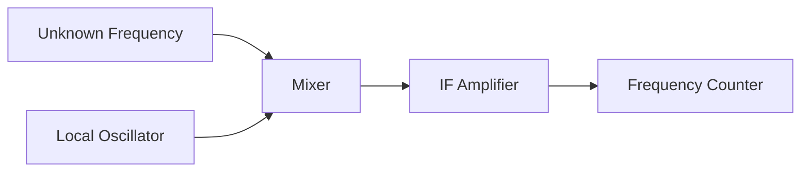

**Wavelength Measurement - Slotted Line Method:**

**Setup Diagram:**

```goat
Microwave --|-----|====|-----|-- Slotted Line --|-- Load
Source      |  Isolator  |                     |
            |            |                     |
         Attenuator   Detector              Movable
                                           Probe
```

**Measurement Procedure:**

**Free Space Wavelength (λ₀):**

- **Step 1**: Connect matched load, measure frequency
- **Step 2**: Calculate λ₀ = c/f

**Guided Wavelength (λ_g):**

- **Step 1**: Connect short circuit, find two consecutive minima
- **Step 2**: λ_g = 2 × distance between minima
- **Step 3**: Verify: λ_g = λ₀/√[1-(λ₀/λ_c)²]

**Cut-off Wavelength (λ_c):**

- **Method 1**: From waveguide dimensions: λ_c = 2a (for TE₁₀)
- **Method 2**: From λ₀ and λ_g: λ_c = λ₀/√[1-(λ₀/λ_g)²]

**Measurement Table:**

| Parameter | Method | Accuracy |
|-----------|--------|----------|
| Frequency | Direct counting | ±0.01% |
| λ₀ | Calculate from f | ±0.01% |
| λ_g | Slotted line | ±1% |
| λ_c | Calculation/measurement | ±2% |

**Advantages of Each Method:**

- **Direct method**: High accuracy, simple
- **Heterodyne method**: Extended frequency range
- **Slotted line**: Measures guided parameters directly

**Error Sources:**

- **Probe coupling** variations
- **Temperature effects** on dimensions
- **Detector nonlinearity**
- **Standing wave** disturbances

**Applications:**

- **Waveguide characterization**
- **Material property measurement**
- **Antenna testing**
- **Component verification**

**Mnemonic:** "Frequency First, Wavelength With-measurement"

## Question 4(a) [3 marks]

**State Frequency limitations of vacuum tubes at microwave frequency.**

**Answer**:

**Frequency Limitations:**

- **Transit time effects**: Electron transit time becomes comparable to RF period
- **Inter-electrode capacitance**: Reduces gain at high frequencies  
- **Lead inductance**: Parasitic inductances limit performance
- **Skin effect**: Current concentration reduces effective conductance

**Limiting Factors Table:**

| Factor | Effect | Frequency Impact |
|--------|--------|------------------|
| Transit Time | Phase delay | f < 1/(2πτ) |
| Capacitance | Reactance loading | Gain ∝ 1/f |
| Inductance | Resonance effects | Stability issues |
| Skin Effect | Increased resistance | Efficiency ↓ |

**Solutions:**

- **Reduce electrode spacing**
- **Use special geometries**
- **Employ microwave tubes** (Klystron, Magnetron)

**Mnemonic:** "Transit Time Troubles Traditional Tubes"

## Question 4(b) [4 marks]

**Explain Negative resistance effect in IMPATT Diode.**

**Answer**:

**IMPATT Structure:**

```goat
P+ |--| I |--| P |--| N+ |
   ←--|------|------|--→
   Avalanche  Drift
   Region     Region
```

**Negative Resistance Mechanism:**

**Two-step Process:**

1. **Impact Ionization**: High field creates electron-hole pairs
2. **Transit Time Delay**: Carriers drift across depletion region

**Phase Relationships:**

- **Current**: Lags voltage by 90° (avalanche delay) + 90° (transit delay) = 180°
- **Result**: I = -G*V (negative conductance)

**Operating Cycle:**


**Key Parameters:**

- **Avalanche frequency**: f_a = v_s/(2W_a)
- **Transit frequency**: f_t = v_d/(2W_d)
- **Optimum frequency**: f_0 = 1/(2π√L*|C_negative|)

**Mnemonic:** "Impact Ionization, Transit Time = Negative Resistance"

## Question 4(c) [7 marks]

**Explain Principle, tunneling phenomenon and any one application of Tunnel Diode.**

**Answer**:

**Principle**: Tunnel diode operates on **quantum mechanical tunneling** effect through thin potential barrier in heavily doped p-n junction.

**Energy Band Diagram:**

```goat
Forward Bias States:

State 1 (Low bias):    State 2 (Peak):      State 3 (Valley):
   P side | N side        P side | N side        P side | N side
    ___   |  ___           ___   |  ___           ___   |  ___
   |   |  | |   |         |   |  | |   |         |   |  | |   |
   |___|  | |___|         |___| /| |___|         |___| /| |___|
          |               Tunneling              No tunnel
       Tunneling                               
```

**I-V Characteristics:**

```goat
Current ↑
        |    
     Ip |●     
        |  ●    
        |    ●   Forward region
        |      ●  
        |        ●
     Iv |         ●____
        |                ●
        |                  ●
        |________________________→ Voltage
        0   Vp    Vv    Vf
        
    Peak    Valley  Forward
    point   point   region
```

**Tunneling Phenomenon:**

**Quantum Mechanics**: Electrons can penetrate potential barrier even if their energy is less than barrier height.

**Tunneling Probability**: T = exp(-2√(2m*φ*d²)/ħ)
Where:

- m = electron mass
- φ = barrier height  
- d = barrier width
- ħ = reduced Planck constant

**Operating Regions:**

- **Tunneling region** (0 to Vp): Current increases with voltage
- **Negative resistance** (Vp to Vv): Current decreases with increasing voltage
- **Forward bias** (>Vv): Normal diode behavior

**Key Parameters Table:**

| Parameter | Symbol | Typical Value |
|-----------|--------|---------------|
| Peak Current | Ip | 1-100 mA |
| Peak Voltage | Vp | 50-100 mV |
| Valley Current | Iv | 0.1*Ip |
| Valley Voltage | Vv | 300-500 mV |

**Application - High Frequency Oscillator:**

**Circuit Diagram:**

```goat
    +Vcc
      |
      R ← Bias resistor
      |
      ●---L---●---Output
      |       |
   Tunnel     C
   Diode      |
      |       |
    ──┴──   ──┴──
     GND     GND
```

**Oscillator Operation:**

- **Bias point**: Set in negative resistance region
- **Tank circuit**: LC determines oscillation frequency
- **Condition**: |R_negative| > R_positive for oscillation
- **Frequency**: f = 1/(2π√LC)

**Advantages:**

- **Ultra-high frequency** operation (up to 100 GHz)
- **Low noise** figure
- **Fast switching** (picosecond range)
- **Low power consumption**
- **Temperature stable**

**Applications:**

- **Microwave oscillators**
- **High-speed switches**
- **Microwave amplifiers**
- **Frequency converters**
- **Computer memory circuits**

**Limitations:**

- **Low power handling**
- **Critical bias requirements**
- **Limited temperature range**
- **Expensive manufacturing**

**Design Considerations:**

- **Doping concentration**: >10¹⁹ cm⁻³ for both sides
- **Junction area**: Small for high frequency operation  
- **Parasitic elements**: Minimize package inductance/capacitance
- **Bias stability**: Temperature compensation required

**Mnemonic:** "Tunnel Through, Negative Grows, Oscillator Flows"

## Question 4(a OR) [3 marks]

**Explain Hazards due to microwave radiation.**

**Answer**:

**Types of Hazards:**

**HERP (Hazards of Electromagnetic Radiation to Personnel):**

- **Thermal effects**: Tissue heating above 41°C
- **Non-thermal effects**: Cellular damage at low power levels
- **Cumulative effects**: Long-term exposure risks

**HERO (Hazards of Electromagnetic Radiation to Ordnance):**

- **Premature ignition**: RF energy can trigger explosive devices
- **Fuel ignition**: Microwave heating of fuel vapors
- **Electronic interference**: Disruption of control systems

**HERF (Hazards of Electromagnetic Radiation to Fuels):**

- **Fuel heating**: Dielectric heating of hydrocarbon fuels
- **Static discharge**: RF-induced sparking in fuel systems
- **Vapor ignition**: Heating of fuel-air mixtures

**Safety Guidelines Table:**

| Exposure Level | Power Density | Duration | Effect |
|----------------|---------------|----------|--------|
| Safe | <10 mW/cm² | 8 hours | No effect |
| Caution | 10-100 mW/cm² | Limited | Possible heating |
| Danger | >100 mW/cm² | Avoid | Tissue damage |

**Mnemonic:** "HERP-HERO-HERF = Health-Explosive-Fuel Risks"

## Question 4(b OR) [4 marks]

**Explain Degenerate and non-degenerate mode in Parametric Amplifier.**

**Answer**:

**Parametric Amplifier Principle**: Uses **time-varying reactance** to transfer energy from pump to signal.

**Mode Classifications:**

**Non-degenerate Mode:**

- **Three frequencies**: f_s (signal), f_i (idler), f_p (pump)
- **Frequency relation**: f_p = f_s + f_i
- **Two separate circuits** for signal and idler
- **Higher gain** but more complex

**Degenerate Mode:**

- **Two frequencies**: f_s (signal), f_p (pump)  
- **Frequency relation**: f_p = 2f_s
- **Single resonant circuit**
- **Simpler design** but lower gain

**Comparison Table:**

| Parameter | Non-degenerate | Degenerate |
|-----------|----------------|------------|
| Frequencies | 3 (fs, fi, fp) | 2 (fs, fp) |
| Circuits | Separate | Combined |
| Gain | Higher | Lower |
| Complexity | More | Less |
| Bandwidth | Narrower | Wider |

**Energy Transfer:**

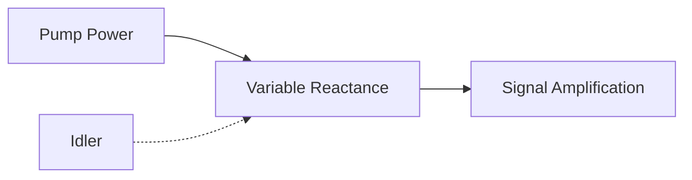

**Mnemonic:** "Non-degenerate = Not-single, Degenerate = Doubled-frequency"

## Question 4(c OR) [7 marks]

**Explain principle and Gunn effect in Gunn Diode. Also Explain Gunn Diode as an Oscillator.**

**Answer**:

**Gunn Effect Principle**: Based on **transferred electron effect** in compound semiconductors (GaAs, InP).

**Energy Band Structure:**

```goat
Energy ↑
       |     Upper valley
       |    /
       |   /  ΔE = 0.36 eV
       |  /
       |_/_______ Lower valley
              |
              |→ k (momentum)
        Γ valley   L valley
```

**Gunn Effect Mechanism:**

**Differential Mobility:**

- **Low field** (<3 kV/cm): Electrons in Γ valley (high mobility)
- **High field** (>3 kV/cm): Electrons transfer to L valley (low mobility)
- **Result**: Negative differential mobility (NDM)

**Domain Formation:**


**Current-Voltage Characteristics:**

```goat
Current ↑
        |
    I_p |●
        | ●
        |  ●
        |   ●_____ NDM region
        |        ●
        |         ●
        |__________●_________→ Voltage
        0    V_th    V_s
        
    Threshold  Sustaining
    voltage    voltage
```

**Gunn Diode Oscillator:**

**Basic Configuration:**

```goat
    +V_bias
      |
      R ← Bias resistor  
      |
    ──●──── RF Output
      |
   [Gunn]  ← Gunn diode
   Diode   
      |
    ──┴──── Ground
     GND
```

**Oscillator Modes:**

**Transit Time Mode:**

- **Domain formation** at cathode
- **Domain transit** across active region  
- **Current pulse** when domain reaches anode
- **Frequency**: f = v_d/L (where v_d = drift velocity, L = length)

**Quenched Domain Mode:**

- **Resonant circuit** quenches domain before transit
- **Higher frequency** operation possible
- **Efficiency**: 5-20%

**LSA (Limited Space-charge Accumulation) Mode:**

- **High frequency** prevents domain formation
- **Uniform field** maintained
- **Higher efficiency**: 10-25%

**Performance Parameters:**

| Parameter | Value | Unit |
|-----------|-------|------|
| Frequency Range | 1-100 | GHz |
| Power Output | 1 mW-10 W | - |
| Efficiency | 5-25 | % |
| Noise Figure | 35-50 | dB |

**Advantages:**

- **Simple structure** - no external resonator needed
- **Broadband tuning** capability
- **Low noise** at microwave frequencies
- **Reliable operation**

**Applications:**

- **Local oscillators** in receivers
- **CW radar transmitters**  
- **Microwave communication systems**
- **Test equipment signal sources**

**Design Considerations:**

- **Doping profile**: Uniform n-type doping
- **Length optimization**: L = v_d/f for transit time mode
- **Thermal management**: Heat dissipation critical
- **Circuit design**: Impedance matching important

**Comparison with Other Oscillators:**

| Oscillator | Frequency | Power | Efficiency |
|------------|-----------|-------|------------|
| Gunn Diode | 1-100 GHz | mW-10W | 5-25% |
| IMPATT | 1-300 GHz | 1W-100W | 10-20% |
| Klystron | 1-20 GHz | 1kW-1MW | 30-60% |

**Mnemonic:** "Gunn Gets Going via Gallium-Arsenide"

## Question 5(a) [3 marks]

**Explain working principle of Basic RADAR system with the help of block diagram.**

**Answer**:

**RADAR Principle**: **Radio Detection And Ranging** - transmits RF pulses and detects reflected signals from targets.

**Basic RADAR Block Diagram:**

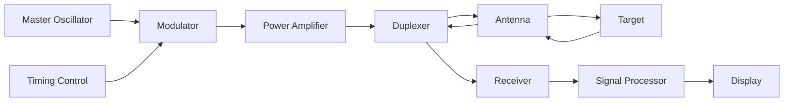

**Working Principle:**

- **Transmission**: High power RF pulse transmitted toward target
- **Propagation**: EM wave travels at speed of light (c)
- **Reflection**: Target reflects portion of energy back to radar
- **Reception**: Reflected signal received and processed
- **Range calculation**: R = (c × t)/2

**Key Parameters:**

- **Pulse width**: τ = 0.1 to 10 μs
- **Pulse repetition frequency**: PRF = 100 Hz to 10 kHz
- **Peak power**: 1 kW to 10 MW

**Mnemonic:** "RADAR Ranges by Round-trip Reflection"

## Question 5(b) [4 marks]

**Explain A-scope display method with the help of proper figure.**

**Answer**:

**A-Scope Display**: Shows **amplitude vs time** relationship of received echoes.

**A-Scope Presentation:**

```goat
Amplitude ↑
          |
          |    ●  Target echo
          |   /|\  
     Main |  / | \  
    pulse | /  |  \  
          |/   |   \
          |    |    \___
          |____|_________\______→ Time
          0    |         
               |
           2R/c (Range)
           
    ←Ground→←Sea→←Target→←Noise→
     clutter clutter
```

**Display Components:**

- **Main pulse**: Initial transmitted pulse (reference)
- **Ground clutter**: Reflections from nearby terrain
- **Sea clutter**: Reflections from sea surface  
- **Target echo**: Reflection from actual target
- **Noise**: Random background signals

**Range Measurement:**

- **Horizontal axis**: Time (proportional to range)
- **Vertical axis**: Signal amplitude
- **Range formula**: R = (c × t)/2

**Applications:**

- **Air traffic control**
- **Height finding radars**  
- **Range measurement**
- **Signal analysis**

**Mnemonic:** "A-scope shows Amplitude Along time Axis"

## Question 5(c) [7 marks]

**Explain Doppler effect and working of MTI (Moving Target Indicator) RADAR system with the help of block diagram.**

**Answer**:

**Doppler Effect**: Frequency shift occurs when there is relative motion between radar and target.

**Doppler Frequency Shift:**
f_d = (2 × v_r × f_0)/c

Where:

- f_d = Doppler frequency shift
- v_r = radial velocity of target
- f_0 = transmitted frequency  
- c = speed of light

**Doppler Shift Cases:**

- **Approaching target**: f_d > 0 (positive shift)
- **Receding target**: f_d < 0 (negative shift)
- **Stationary target**: f_d = 0 (no shift)

**MTI RADAR Block Diagram:**

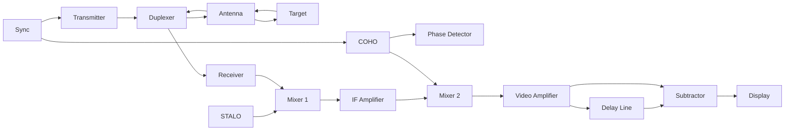

**MTI System Components:**

**STALO (Stable Local Oscillator):**

- **Frequency**: Close to transmitted frequency
- **Stability**: High frequency stability required
- **Function**: First mixer LO

**COHO (Coherent Oscillator):**

- **Phase reference**: Maintains phase coherence
- **Synchronization**: Locked to transmitter phase
- **Function**: Second mixer LO and phase reference

**MTI Processing:**

- **Delay line**: Stores previous pulse echo
- **Subtractor**: Subtracts current from previous pulse
- **Result**: Stationary targets cancelled, moving targets enhanced

**MTI Transfer Function:**

```goat
|H(f)| ↑
       |     
    1.0|     ●●●     ●●●     ●●●
       |    ●   ●   ●   ●   ●   ●
    0.5|   ●     ● ●     ● ●     ●
       |  ●       ●       ●       ●
     0 |_●_______●_______●_______●___→ fd
       0  PRF/4  PRF/2  3PRF/4  PRF
       
       ← Blind speeds →
```

**Blind Speeds**: Targets with certain velocities appear stationary:
v_blind = (n × λ × PRF)/2  (where n = 1,2,3...)

**Performance Improvements:**

**Multi-pulse MTI:**

- **Multiple delay lines** for better clutter rejection
- **Staggered PRF** to reduce blind speeds
- **Weighted coefficients** for optimum response

**Clutter Map:**

- **Digital memory** stores clutter pattern
- **Adaptive threshold** adjusts to local clutter level
- **Automatic updates** track slow clutter changes

**MTI Performance Metrics:**

| Parameter | Typical Value |
|-----------|---------------|
| Clutter Attenuation | 30-60 dB |
| Minimum Detectable Velocity | 1-10 m/s |
| Blind Speed | λ×PRF/2 |
| Improvement Factor | 20-40 dB |

**Advantages:**

- **Clutter suppression**: Eliminates stationary clutter
- **Moving target emphasis**: Enhances moving targets
- **Automatic operation**: Reduces operator workload

**Limitations:**

- **Blind speeds**: Some velocities undetectable
- **Tangential targets**: No radial component
- **Weather effects**: Rain/snow can mask targets

**Applications:**

- **Air traffic control**: Separates aircraft from ground clutter
- **Weather radar**: Detects precipitation movement  
- **Military surveillance**: Detects moving vehicles
- **Marine radar**: Reduces sea clutter

**Mnemonic:** "MTI Makes Targets Identifiable via Doppler Difference"

## Question 5(a OR) [3 marks]

**Define: a) Blind speed, and b) MUR**

**Answer**:

**Blind Speed:**

- **Definition**: Target radial velocities that produce zero Doppler shift in MTI radar
- **Formula**: v_blind = (n × λ × PRF)/2
- **Cause**: Target motion synchronized with pulse repetition
- **Result**: Moving target appears stationary

**MUR (Maximum Unambiguous Range):**

- **Definition**: Maximum range at which targets can be detected without range ambiguity
- **Formula**: R_max = (c × PRT)/2 = c/(2 × PRF)
- **Limitation**: Next pulse transmitted before echo returns
- **Ambiguity**: Targets beyond MUR appear at incorrect range

**Relationship Table:**

| Parameter | Formula | Unit |
|-----------|---------|------|
| Blind Speed | nλPRF/2 | m/s |
| MUR | c/(2×PRF) | meters |
| PRT | 1/PRF | seconds |

**Mnemonic:** "Blind speed Blocks, MUR Measures maximum"

## Question 5(b OR) [4 marks]

**Explain the factors affecting Maximum RADAR range.**

**Answer**:

**RADAR Range Equation:**
R_max = [(P_t × G² × λ² × σ)/(64π³ × P_min × L)]^(1/4)

**Factors Affecting Maximum Range:**

**Transmitted Power (P_t):**

- **Higher power** = greater range
- **Relationship**: R ∝ P_t^(1/4)
- **Limitation**: Peak power limited by transmitter

**Antenna Gain (G):**

- **Directional antenna** concentrates energy
- **Relationship**: R ∝ G^(1/2)
- **Trade-off**: Higher gain = narrower beamwidth

**Wavelength (λ):**

- **Lower frequency** = better propagation
- **Relationship**: R ∝ λ^(1/2)
- **Consideration**: Atmospheric absorption increases with frequency

**Target Cross Section (σ):**

- **Larger targets** reflect more energy
- **Relationship**: R ∝ σ^(1/4)
- **Variation**: Depends on target shape, material, aspect angle

**Factors Table:**

| Factor | Effect on Range | Typical Values |
|--------|-----------------|----------------|
| Peak Power | R ∝ Pt^0.25 | 1 kW - 10 MW |
| Antenna Gain | R ∝ G^0.5 | 20 - 50 dB |
| Frequency | R ∝ λ^0.5 | 1 - 100 GHz |
| Target RCS | R ∝ σ^0.25 | 0.1 - 1000 m² |

**Mnemonic:** "Power-Gain-Lambda-Sigma determine Range"

## Question 5(c OR) [7 marks]

**Compare Pulsed RADAR and CW Doppler RADAR.**

**Answer**:

**Comprehensive Comparison:**

**Basic Principle:**

- **Pulsed RADAR**: Transmits high-power pulses, measures round-trip time
- **CW Doppler**: Transmits continuous wave, measures Doppler frequency shift

**System Block Diagrams:**

**Pulsed RADAR:**

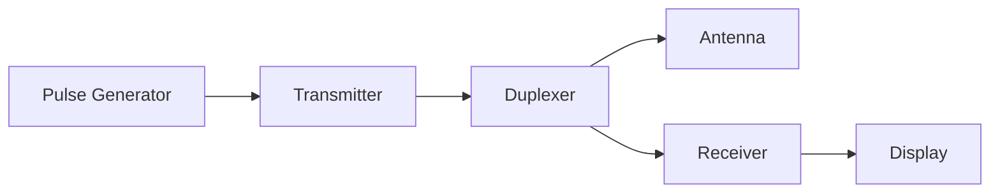

**CW Doppler RADAR:**

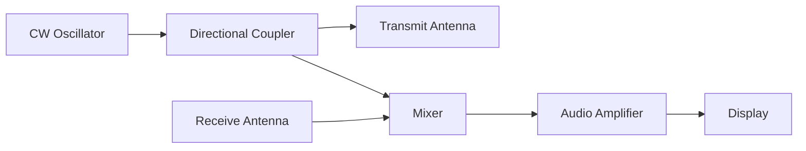

**Detailed Comparison Table:**

| Parameter | Pulsed RADAR | CW Doppler RADAR |
|-----------|--------------|------------------|
| **Transmission** | High power pulses | Continuous low power |
| **Information** | Range + velocity | Velocity only |
| **Antenna** | Single (duplexer) | Separate Tx/Rx |
| **Range Capability** | Excellent | None (unless FM-CW) |
| **Velocity Resolution** | Limited | Excellent |
| **Peak Power** | Very high (MW) | Low (mW to W) |
| **Average Power** | Low | Moderate |
| **Complexity** | High | Simple |
| **Cost** | Expensive | Economical |
| **Size** | Large | Compact |

**Performance Characteristics:**

| Aspect | Pulsed RADAR | CW Doppler RADAR |
|--------|--------------|------------------|
| **Range Accuracy** | ±10-100 m | Not applicable |
| **Velocity Accuracy** | ±1-10 m/s | ±0.1-1 m/s |
| **Minimum Range** | Limited by pulse width | Zero |
| **Maximum Range** | 10-1000 km | 1-50 km |
| **Clutter Rejection** | Moderate | Excellent |
| **Weather Effects** | Significant | Minimal |

**Advantages & Disadvantages:**

**Pulsed RADAR Advantages:**

- **Range measurement** capability
- **High peak power** for long range
- **Single antenna** system
- **Well-established technology**

**Pulsed RADAR Disadvantages:**

- **Complex circuitry** (duplexer, timing)
- **High cost** and maintenance  
- **Power supply** requirements
- **Blind ranges** due to pulse width

**CW Doppler Advantages:**

- **Simple design** and low cost
- **Excellent velocity resolution**
- **Continuous monitoring**
- **Low power consumption**
- **Compact size**

**CW Doppler Disadvantages:**

- **No range information**
- **Separate antennas** required
- **Limited range** capability
- **Vulnerable to interference**

**Applications:**

**Pulsed RADAR Applications:**

- **Air traffic control**
- **Weather monitoring**
- **Military surveillance**
- **Maritime navigation**
- **Satellite tracking**

**CW Doppler Applications:**

- **Traffic speed monitoring**
- **Sports radar guns**
- **Burglar alarms**
- **Automatic door openers**
- **Heart rate monitoring**

**Hybrid Systems:**

**Pulse Doppler RADAR:**

- **Combines advantages** of both systems
- **Range and velocity** measurement
- **Higher complexity** but better performance

**FM-CW RADAR:**

- **Frequency modulated** continuous wave
- **Range capability** added to CW system
- **Used in automotive** radar applications

**Selection Criteria:**

| Requirement | Choose Pulsed | Choose CW Doppler |
|-------------|---------------|-------------------|
| Range measurement needed | ✓ | ✗ |
| High velocity accuracy | ✗ | ✓ |
| Long range operation | ✓ | ✗ |
| Low cost requirement | ✗ | ✓ |
| Portable application | ✗ | ✓ |
| Weather radar | ✓ | ✗ |

**Future Trends:**

- **Digital signal processing** improving both types
- **Software-defined radars** offering flexibility
- **MIMO techniques** enhancing performance
- **Integration** with other sensors

**Mnemonic:** "Pulsed gives Position, CW gives Continuous-Velocity"
