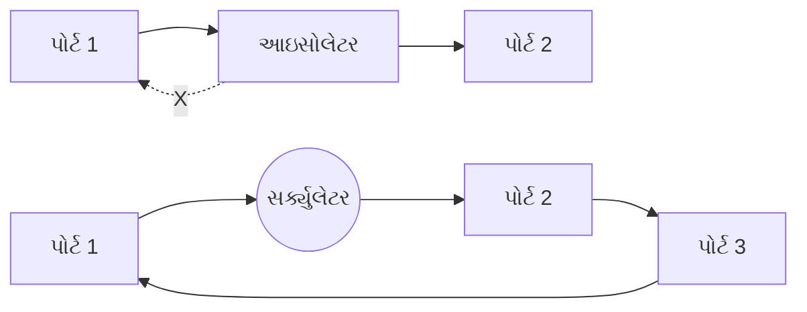
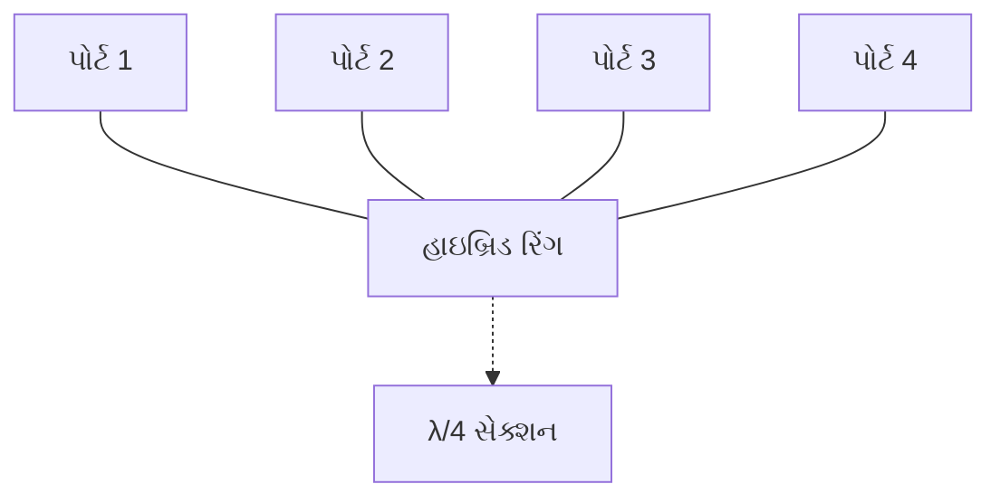
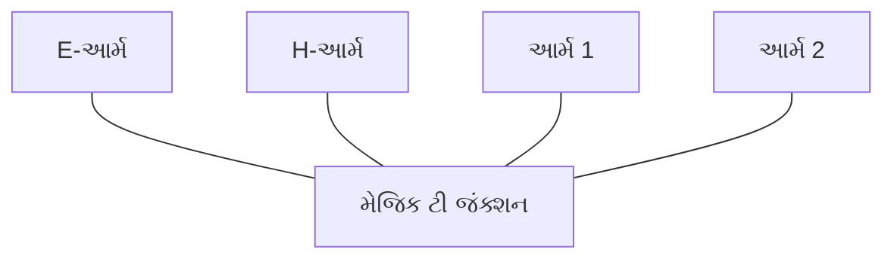
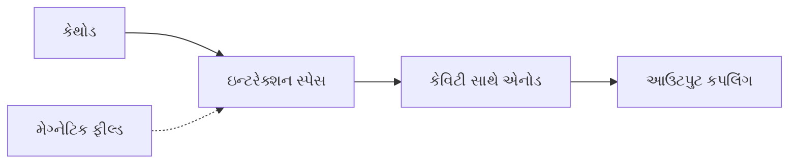
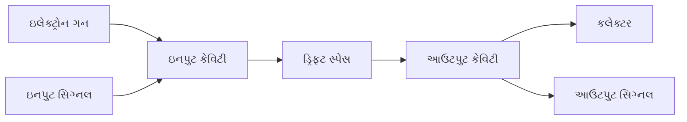
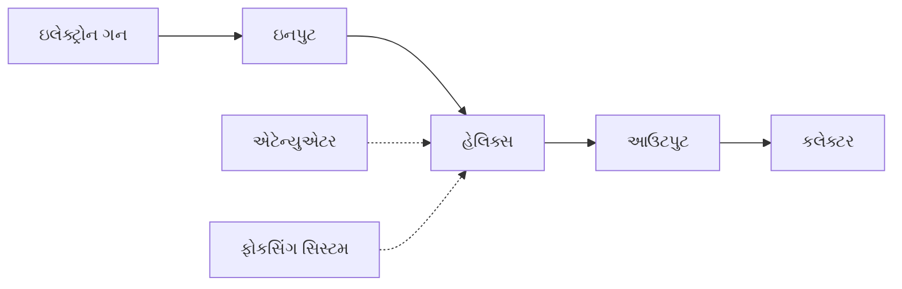
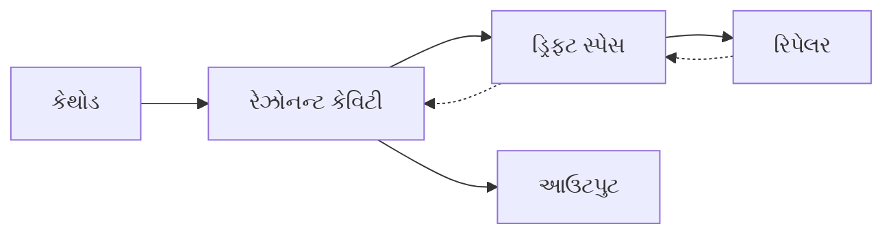
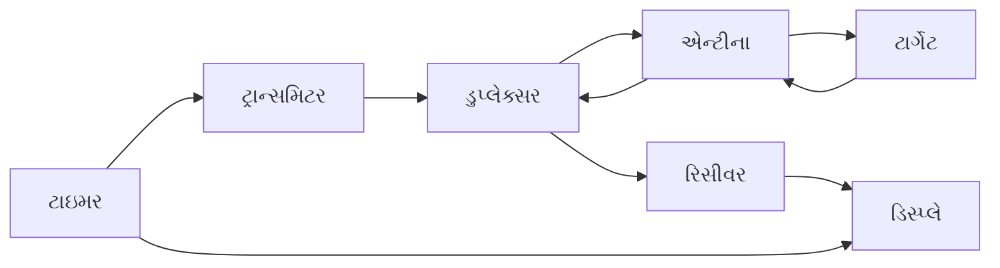

## પ્રશ્ન 1(અ) [3 ગુણ]

**ટ્રાન્સમિશન લાઇન અને વેવગાઇડ વચ્ચે સરખામણી કરો.**

**જવાબ**:

| પેરામીટર | ટ્રાન્સમિશન લાઇન | વેવગાઇડ |
|-----------|------------------|-----------|
| **ફ્રીક્વન્સી રેન્જ** | નીચી થી મધ્યમ ફ્રીક્વન્સી | ઉચ્ચ ફ્રીક્વન્સી (1 GHz થી વધુ) |
| **સ્ટ્રક્ચર** | બે કે વધુ કંડક્ટર | એક હોલો કંડક્ટર |
| **પ્રોપેગેશન મોડ** | TEM મોડ | TE અને TM મોડ |
| **પાવર હેન્ડલિંગ** | મર્યાદિત પાવર કેપેસિટી | ઉચ્ચ પાવર હેન્ડલિંગ ક્ષમતા |
| **લોસેસ** | ઉચ્ચ ફ્રીક્વન્સીએ વધુ નુકસાન | માઇક્રોવેવ ફ્રીક્વન્સીએ ઓછું નુકસાન |

**મેમરી ટ્રીક:** "વેવ્સ વધુ સારી રીતે ટ્રાવેલ કરે છે"

---

## પ્રશ્ન 1(બ) [4 ગુણ]

**નીચેની વ્યાખ્યા આપો: (1) લોસલેસ લાઇન (2) VSWR (3) STUB (4) રિફ્લેક્શન કોઓફીશિઅન્ટ**

**જવાબ**:

- **લોસલેસ લાઇન**: શૂન્ય રેઝિસ્ટન્સ અને કંડક્ટન્સ ધરાવતી ટ્રાન્સમિશન લાઇન, જેમાં સિગ્નલ ટ્રાન્સમિશન દરમિયાન કોઈ પાવર લોસ નથી.

- **VSWR (વોલ્ટેજ સ્ટેન્ડિંગ વેવ રેશિયો)**: ટ્રાન્સમિશન લાઇન પર મેક્સિમમ અને મિનિમમ વોલ્ટેજનો રેશિયો, જે ઇમ્પીડન્સ મિસમેચ દર્શાવે છે.

- **STUB**: ઇમ્પીડન્સ મેચિંગ માટે મુખ્ય લાઇન સાથે જોડાયેલી ટ્રાન્સમિશન લાઇનનો ટૂંકો ભાગ.

- **રિફ્લેક્શન કોઓફીશિઅન્ટ**: ટ્રાન્સમિશન લાઇન પર કોઈપણ બિંદુએ રિફ્લેક્ટેડ વેવ અને ઇન્સિડન્ટ વેવના એમ્પ્લિટ્યુડનો રેશિયો.

**મેમરી ટ્રીક:** "લાઇટ વોલ્યુમ સ્ટે રિફ્લેક્ટેડ"

---

## પ્રશ્ન 1(ક) [7 ગુણ]

**આઇસોલેટર અને સર્ક્યુલેટર આકૃતિની મદદથી સમજાવો.**

**જવાબ**:



**આઇસોલેટર:**

- **કાર્ય**: માત્ર એક દિશામાં સિગ્નલ ફ્લોની પરવાનગી આપે છે
- **કન્સ્ટ્રક્શન**: મેગ્નેટિક બાયાસ સાથે ફેરાઇટ મટેરિયલનો ઉપયોગ
- **ઉપયોગ**: રિફ્લેક્શનથી સોર્સનું રક્ષણ કરે છે

**સર્ક્યુલેટર:**

- **કાર્ય**: ત્રણ કે ચાર પોર્ટ વચ્ચે સર્ક્યુલર પેટર્નમાં સિગ્નલ રૂટ કરે છે
- **કન્સ્ટ્રક્શન**: ફેરાઇટ મટેરિયલ સાથે Y-જંક્શન
- **ઉપયોગ**: રડાર સિસ્ટમમાં ડુપ્લેક્સર તરીકે

**મેમરી ટ્રીક:** "આઇસોલેટેડ સર્કિટ ફોરવર્ડ ફ્લો"

---

## પ્રશ્ન 1(ક અથવા) [7 ગુણ]

**વેવગાઇડમાં ડોમિનન્ટ મોડ શું છે? 10 સેમી breadth ધરાવતા રેક્ટેન્ગ્યુલર વેવગાઇડ માટે કટ ઓફ વેવલેન્થ શોધો. 2.5 GHz સિગ્નલ propagate થવા માટે ગાઇડ વેવલેન્થ, ગ્રુપ વેલોસિટી, ફેઝ વેલોસિટી અને Z₀ની વેલ્યુ શોધો.**

**જવાબ**:

**ડોમિનન્ટ મોડ**: વેવગાઇડમાં propagate થઈ શકતો સૌથી નીચો ઓર્ડર મોડ. રેક્ટેન્ગ્યુલર વેવગાઇડ માટે TE₁₀ મોડ છે.

**આપેલા ડેટા:**

- Breadth (a) = 10 cm = 0.1 m
- Frequency (f) = 2.5 GHz = 2.5 × 10⁹ Hz
- c = 3 × 10⁸ m/s

**ગણતરીઓ:**

| પેરામીટર | ફોર્મ્યુલા | વેલ્યુ |
|-----------|---------|-------|
| **કટ ઓફ વેવલેન્થ** | λc = 2a | λc = 2 × 0.1 = 0.2 m |
| **ફ્રી સ્પેસ વેવલેન્થ** | λ₀ = c/f | λ₀ = 0.12 m |
| **ગાઇડ વેવલેન્થ** | λg = λ₀/√(1-(λ₀/λc)²) | λg = 0.133 m |
| **ગ્રુપ વેલોસિટી** | vg = c√(1-(λ₀/λc)²) | vg = 2.7 × 10⁸ m/s |
| **ફેઝ વેલોસિટી** | vp = c/√(1-(λ₀/λc)²) | vp = 3.33 × 10⁸ m/s |

**મેમરી ટ્રીક:** "ડોમિનન્ટ મોડ કેલ્ક્યુલેટ ગાઇડ પેરામીટર"

---

## પ્રશ્ન 2(અ) [3 ગુણ]

**સિંગલ સ્ટબ ઇમ્પીડન્સ મેચિંગ શું છે, અને આ કેવી રીતે કાર્ય કરે છે?**

**જવાબ**:

**સિંગલ સ્ટબ મેચિંગ**: ઇમ્પીડન્સ મેચિંગ માટે ટ્રાન્સમિશન લાઇન સાથે પેરેલલમાં જોડાયેલા એક શોર્ટ-સર્કિટ અથવા ઓપન-સર્કિટ સ્ટબનો ઉપયોગ કરતી ટેકનિક.

**કાર્યસિદ્ધાંત:**

- **સ્ટબ રિએક્ટિવ એલિમેન્ટ તરીકે કાર્ય કરે છે** (ઇન્ડક્ટિવ અથવા કેપેસિટિવ)
- **લોડ ઇમ્પીડન્સના રિએક્ટિવ ઘટકને કેન્સલ કરે છે**
- **ઇમ્પીડન્સને કેરેક્ટરિસ્ટિક ઇમ્પીડન્સમાં ટ્રાન્સફોર્મ કરે છે**

**મેમરી ટ્રીક:** "સિંગલ સ્ટબ ટ્રાન્સફોર્મ રિએક્ટન્સ"

---

## પ્રશ્ન 2(બ) [4 ગુણ]

**રેક્ટેન્ગ્યુલર અને સર્ક્યુલર વેવગાઇડ વચ્ચે કોઈ પણ ત્રણ તફાવત આપો.**

**જવાબ**:

| પેરામીટર | રેક્ટેન્ગ્યુલર વેવગાઇડ | સર્ક્યુલર વેવગાઇડ |
|-----------|----------------------|-------------------|
| **ક્રોસ-સેક્શન** | લંબચોરસ આકાર | વર્તુળાકાર આકાર |
| **ડોમિનન્ટ મોડ** | TE₁₀ મોડ | TE₁₁ મોડ |
| **ફીલ્ડ પેટર્ન** | સરળ ફીલ્ડ વિતરણ | જટિલ ફીલ્ડ વિતરણ |
| **મેન્યુફેક્ચરિંગ** | બનાવવામાં સહેલું | બનાવવામાં મુશ્કેલ |

**મેમરી ટ્રીક:** "લંબચોરસ દસ પર ડોમિનેટ કરે" vs "વર્તુળ અગિયાર પર ડોમિનેટ કરે"

---

## પ્રશ્ન 2(ક) [7 ગુણ]

**હાઇબ્રિડ રિંગનું બાંધકામ અને કાર્ય આકૃતિ સાથે સમજાવો.**

**જવાબ**:



**બાંધકામ:**

- **રિંગ સ્ટ્રક્ચર** ચાર પોર્ટ સાથે
- **પરિઘ** = 1.5λ (દોઢ વેવલેન્થ)
- **બાજુના પોર્ટ** λ/4 દ્વારા અલગ
- **વિરુદ્ધ પોર્ટ** 3λ/4 દ્વારા અલગ

**કાર્ય:**

- **પાવર ડિવિઝન**: એક પોર્ટનું ઇનપુટ બે બાજુના પોર્ટમાં સમાન રીતે વહેંચાય છે
- **આઇસોલેશન**: વિરુદ્ધ પોર્ટને કોઈ પાવર મળતું નથી
- **ફેઝ રિલેશનશિપ**: આઉટપુટ પોર્ટ વચ્ચે 180° ફેઝ ડિફરન્સ

**ઉપયોગ:**

- **બેલેન્સ્ડ મિક્સર**
- **પાવર કમ્બાઇનર/ડિવાઇડર**
- **એન્ટીના ફીડ**

**મેમરી ટ્રીક:** "હાઇબ્રિડ રિંગ પાવર સમાન વહેંચે છે"

---

## પ્રશ્ન 2(અ અથવા) [3 ગુણ]

**માઇક્રોવેવ શું છે? માઇક્રોવેવના કોઈ પણ ચાર ઉપયોગો લખો.**

**જવાબ**:

**માઇક્રોવેવ**: 1 GHz થી 300 GHz સુધીની ફ્રીક્વન્સી રેન્જ ધરાવતા ઇલેક્ટ્રોમેગ્નેટિક વેવ્સ.

**ઉપયોગ:**

- **રડાર સિસ્ટમ** ડિટેક્શન અને રેન્જિંગ માટે
- **સેટેલાઇટ કમ્યુનિકેશન** લાંબા અંતરના ટ્રાન્સમિશન માટે
- **માઇક્રોવેવ ઓવન** ખોરાક ગરમ કરવા માટે
- **મોબાઇલ કમ્યુનિકેશન** (સેલ્યુલર નેટવર્ક)

**મેમરી ટ્રીક:** "માઇક્રોવેવ રીચ સ્પેસ મોબાઇલ"

---

## પ્રશ્ન 2(બ અથવા) [4 ગુણ]

**કેવિટી રેઝોનેટર પર ટૂંકી નોંધ લખો.**

**જવાબ**:

**કેવિટી રેઝોનેટર**: ચોક્કસ રેઝોનન્ટ ફ્રીક્વન્સીએ ઇલેક્ટ્રોમેગ્નેટિક એનર્જીને સીમિત કરતું બંધ મેટાલિક સ્ટ્રક્ચર.

**બાંધકામ:**

- **ચોક્કસ માપના મેટાલિક એન્ક્લોઝર**
- **ઉચ્ચ Q ફેક્ટર** (ઓછું નુકસાન)
- **રેઝોનન્ટ ફ્રીક્વન્સી** કેવિટીના માપ પર આધાર રાખે છે

**પ્રકાર:**

- **રેક્ટેન્ગ્યુલર કેવિટી**
- **સિલિન્ડ્રિકલ કેવિટી**
- **સ્ફેરિકલ કેવિટી**

**ઉપયોગ:**

- **ફ્રીક્વન્સી મીટર**
- **ઓસીલેટર સર્કિટ**
- **ફિલ્ટર સર્કિટ**

**મેમરી ટ્રીક:** "કેવિટી રેઝોનેટ હાઇ ક્વોલિટી"

---

## પ્રશ્ન 2(ક અથવા) [7 ગુણ]

**મેજિક ટીને આકૃતિની મદદથી સમજાવો. તે આઇસોલેટર તરીકે કઈ રીતે કાર્ય કરે છે?**

**જવાબ**:



**મેજિક ટી બાંધકામ:**

- **E-પ્લેન ટી** અને **H-પ્લેન ટી** સંયુક્ત
- **ચાર પોર્ટ**: E-આર્મ, H-આર્મ, અને બે સાઇડ આર્મ
- **E-આર્મ** H-આર્મ પર વર્ટિકલ

**આઇસોલેટર તરીકે કાર્ય:**

- **E-આર્મનું સિગ્નલ** સાઇડ આર્મમાં સમાન રીતે વહેંચાય છે (in-phase)
- **H-આર્મનું સિગ્નલ** સાઇડ આર્મમાં સમાન રીતે વહેંચાય છે (out-of-phase)
- **E-આર્મ અને H-આર્મ વચ્ચે આઇસોલેશન**
- **પર્પેન્ડિક્યુલર આર્મ વચ્ચે કોઈ કપલિંગ નથી**

**ગુણધર્મો:**

- **બધા પોર્ટ પર મેચ્ડ**
- **રેસિપ્રોકલ ડિવાઇસ**
- **પાવર ડિવિઝન અને આઇસોલેશન**

**મેમરી ટ્રીક:** "મેજિક આઇસોલેટ પર્પેન્ડિક્યુલર આર્મ"

---

## પ્રશ્ન 3(અ) [3 ગુણ]

**મેઝરનો કાર્યસિદ્ધાંત વર્ણવો.**

**જવાબ**:

**મેઝર (Microwave Amplification by Stimulated Emission of Radiation):**

- **એક્ટિવ મીડિયમમાં પોપ્યુલેશન ઇન્વર્શન** બનાવવામાં આવે છે
- **સ્ટિમ્યુલેટેડ એમિશન** કોહેરન્ટ માઇક્રોવેવ પેદા કરે છે
- **એનર્જી લેવલ ટ્રાન્ઝિશન દ્વારા એમ્પ્લિફિકેશન** થાય છે

**કાર્યસિદ્ધાંત:**

- **પરમાણુ ઉચ્ચ એનર્જી લેવલમાં ઉત્તેજિત થાય છે**
- **સ્ટિમ્યુલેટેડ ફોટોન એમિશન ટ્રિગર કરે છે**
- **માઇક્રોવેવ સિગ્નલનું કોહેરન્ટ એમ્પ્લિફિકેશન**

**મેમરી ટ્રીક:** "માઇક્રોવેવ એમ્પ્લિફાઇ સ્ટિમ્યુલેટેડ એમિશન રેડિએશન"

---

## પ્રશ્ન 3(બ) [4 ગુણ]

**ચાર માઇક્રોવેવ ડાયોડના નામ લખો અને એકનું વર્ણન કરો.**

**જવાબ**:

**ચાર માઇક્રોવેવ ડાયોડ:**

1. **GUNN ડાયોડ**
2. **IMPATT ડાયોડ**
3. **TRAPATT ડાયોડ**
4. **PIN ડાયોડ**

**GUNN ડાયોડ વિગતવાર:**

- **સિદ્ધાંત**: GaAs માં ટ્રાન્સફર્ડ ઇલેક્ટ્રોન એફેક્ટ
- **બાંધકામ**: ઓહ્મિક કોન્ટેક્ટ સાથે N-ટાઇપ GaAs
- **ઓપરેશન**: માઇક્રોવેવ ફ્રીક્વન્સીએ નેગેટિવ રેઝિસ્ટન્સ
- **ઉપયોગ**: ઓસીલેટર, એમ્પ્લિફાયર

**VI લાક્ષણિકતા:**

```goat
    I ^
      |    /
      |   /
      |  /___
      | /    \
      |/      \___
      +----------> V
      Negative resistance region
```

**મેમરી ટ્રીક:** "GUNN જનરેટ નેગેટિવ રેઝિસ્ટન્સ"

---

## પ્રશ્ન 3(ક) [7 ગુણ]

**મેગ્નેટ્રોન ઓસીલેટરનું નિર્માણ, કાર્યસિદ્ધાંત અને ઉપયોગો સાથે વિસ્તારવાર વર્ણન કરો.**

**જવાબ**:



**બાંધકામ:**

- **કેન્દ્રમાં સિલિન્ડ્રિકલ કેથોડ**
- **કેથોડની આસપાસ રેઝોનન્ટ કેવિટી સાથે એનોડ**
- **ઇલેક્ટ્રિક ફીલ્ડ પર વર્ટિકલ મજબૂત મેગ્નેટિક ફીલ્ડ**
- **વેવગાઇડ દ્વારા આઉટપુટ કપલિંગ**

**કાર્યસિદ્ધાંત:**

- **ગરમ કેથોડમાંથી ઇલેક્ટ્રોન ઉત્સર્જન**
- **ક્રોસ્ડ E અને B ફીલ્ડને કારણે સાયક્લોઇડ ગતિ**
- **બંચિંગ એફેક્ટ ઇલેક્ટ્રોન ક્લાઉડ બનાવે છે**
- **ઇલેક્ટ્રોનથી RF ફીલ્ડમાં એનર્જી ટ્રાન્સફર**
- **કેવિટી રેઝોનન્ટ ફ્રીક્વન્સીએ ઓસીલેશન**

**ઉપયોગ:**

- **રડાર ટ્રાન્સમિટર**
- **માઇક્રોવેવ ઓવન**
- **ઇન્ડસ્ટ્રિયલ હીટિંગ**
- **મેડિકલ ડાયાથર્મી**

**મેમરી ટ્રીક:** "મેગ્નેટ્રોન મેક માઇક્રોવેવ ઓસીલેશન"

---

## પ્રશ્ન 3(અ અથવા) [3 ગુણ]

**રૂબી મેઝરની કામગીરીનું વર્ણન કરો.**

**જવાબ**:

**રૂબી મેઝર કાર્ય:**

- **રૂબી ક્રિસ્ટલ** (Al₂O₃ જેમાં Cr³⁺ આયન) એક્ટિવ મીડિયમ તરીકે
- **ક્રોમિયમ આયનમાં ત્રણ એનર્જી લેવલ**
- **પમ્પ ફ્રીક્વન્સી પોપ્યુલેશન ઇન્વર્શન બનાવે છે**
- **2.9 GHz પર સિગ્નલ એમ્પ્લિફિકેશન**

**પ્રક્રિયા:**

- **ઓપ્ટિકલ પમ્પિંગ ઇલેક્ટ્રોનને ઉચ્ચ લેવલમાં ઉત્તેજિત કરે છે**
- **સ્ટિમ્યુલેટેડ એમિશન કોહેરન્ટ માઇક્રોવેવ પેદા કરે છે**
- **લો નોઇઝ એમ્પ્લિફિકેશન પ્રાપ્ત થાય છે**

**મેમરી ટ્રીક:** "રૂબી રેડિએટ એમ્પ્લિફાઇડ માઇક્રોવેવ"

---

## પ્રશ્ન 3(બ અથવા) [4 ગુણ]

**ગન ડાયોડની VI કેરેક્ટરિસ્ટિક દોરો અને સમજાવો**

**જવાબ**:

```goat
    I ^
      |      
      |    B /
      |     /
      |    /
      | A /
      |  /
      | /_____ C
      |/      \
      |        \_____ D
      +-----------> V
    Valley    Peak
    Current   Current
```

**VI કેરેક્ટરિસ્ટિક સમજૂતી:**

- **રીજન OA**: ઓહ્મિક રીજન (પોઝિટિવ રેઝિસ્ટન્સ)
- **રીજન AB**: નેગેટિવ રેઝિસ્ટન્સ રીજન
- **રીજન BC**: વેલી કરન્ટ રીજન
- **રીજન CD**: સેચ્યુરેશન રીજન

**મુખ્ય મુદ્દાઓ:**

- **પીક વોલ્ટેજ**: નેગેટિવ રેઝિસ્ટન્સ પહેલાં મેક્સિમમ વોલ્ટેજ
- **વેલી કરન્ટ**: નેગેટિવ રેઝિસ્ટન્સ રીજનમાં મિનિમમ કરન્ટ
- **નેગેટિવ રેઝિસ્ટન્સ**: વોલ્ટેજ વધવા સાથે કરન્ટ ઘટે છે

**મેમરી ટ્રીક:** "વેલી પીક નેગેટિવ રેઝિસ્ટન્સ"

---

## પ્રશ્ન 3(ક અથવા) [7 ગુણ]

**માઇક્રોવેવ ફ્રીક્વન્સી પર "frequency measurement method" અને "attenuation measurement method" વિશે વર્ણન કરો.**

**જવાબ**:

**ફ્રીક્વન્સી મેઝરમેન્ટ મેથડ:**

| મેથડ | સિદ્ધાંત | ચોકસાઈ |
|--------|-----------|----------|
| **કેવિટી વેવમીટર** | રેઝોનન્ટ કેવિટી ટ્યુનિંગ | ઉચ્ચ |
| **ડાયરેક્ટ રીડિંગ મીટર** | ફ્રીક્વન્સી કાઉન્ટર | ખૂબ ઉચ્ચ |
| **હેટેરોડાયન મેથડ** | બીટ ફ્રીક્વન્સી ટેકનિક | મધ્યમ |

**એટેન્યુએશન મેઝરમેન્ટ મેથડ:**

| મેથડ | વર્ણન | ઉપયોગ |
|--------|-------------|-------------|
| **સબસ્ટિટ્યુશન મેથડ** | એટેન્યુએટરને કેલિબ્રેટેડ એટેન્યુએટર સાથે બદલો | પ્રિસિઝન મેઝરમેન્ટ |
| **પાવર રેશિયો મેથડ** | ઇનપુટ અને આઉટપુટ પાવરની તુલના | સામાન્ય હેતુ |
| **RF બ્રિજ મેથડ** | બ્રિજ સર્કિટ બેલેન્સ | લેબોરેટરી ઉપયોગ |

**મેઝરમેન્ટ સેટઅપ:**

- **સિગ્નલ જનરેટર** ટેસ્ટ સિગ્નલ પૂરું પાડે છે
- **કેલિબ્રેટેડ એટેન્યુએટર** રેફરન્સ માટે
- **પાવર મીટર** સિગ્નલ લેવલ માપે છે
- **VSWR મીટર** ઇમ્પીડન્સ મેચિંગ મોનિટર કરે છે

**મેમરી ટ્રીક:** "ફ્રીક્વન્સી એટેન્યુએશન પ્રિસાઇઝલી મેઝર્ડ"

---

## પ્રશ્ન 4(અ) [3 ગુણ]

**P-i-N ડાયોડની કામગીરી વર્ણન કરો.**

**જવાબ**:

**P-i-N ડાયોડ સ્ટ્રક્ચર:**

- **P-ટાઇપ રીજન** (હેવિલી ડોપ્ડ)
- **ઇન્ટ્રિન્સિક રીજન** (અનડોપ્ડ, હાઇ રેઝિસ્ટન્સ)
- **N-ટાઇપ રીજન** (હેવિલી ડોપ્ડ)

**કાર્ય:**

- **ફોરવર્ડ બાયાસ**: લો રેઝિસ્ટન્સ, કંડક્ટર તરીકે કાર્ય કરે છે
- **રિવર્સ બાયાસ**: હાઇ રેઝિસ્ટન્સ, ઇન્સુલેટર તરીકે કાર્ય કરે છે
- **RF સ્વિચિંગ**: ચાર્જ સ્ટોરેજને કારણે ફાસ્ટ સ્વિચિંગ

**ઉપયોગ:**

- **RF સ્વિચ**
- **એટેન્યુએટર**
- **ફેઝ શિફ્ટર**

**મેમરી ટ્રીક:** "PIN પ્રોવાઇડ ઇન્સ્ટન્ટ સ્વિચિંગ"

---

## પ્રશ્ન 4(બ) [4 ગુણ]

**મેગ્નેટ્રોન માટે π મોડ ઓસીલેશનનું વર્ણન કરો.**

**જવાબ**:

**π મોડ ઓસીલેશન:**

- **બાજુની કેવિટી** 180° આઉટ ઓફ ફેઝમાં ઓસીલેટ કરે છે
- **ઇલેક્ટ્રોન બંચિંગ** RF ફીલ્ડ સાથે સિંક્રોનાઇઝ
- **ઇલેક્ટ્રોનથી RF માં મેક્સિમમ પાવર ટ્રાન્સફર**
- **ડિઝાઇન કરેલી ફ્રીક્વન્સીએ સ્ટેબલ ઓસીલેશન**

**લાક્ષણિકતાઓ:**

- **ફેઝ ડિફરન્સ**: બાજુની કેવિટી વચ્ચે π રેડિયન
- **ફ્રીક્વન્સી**: કેવિટીના માપ દ્વારા નક્કી
- **કાર્યક્ષમતા**: બધા મોડમાં સૌથી વધુ
- **સ્થિરતા**: સૌથી સ્થિર ઓસીલેશન મોડ

**મોડ ચાર્ટ:**

```goat
Cavity: 1  2  3  4  5  6  7  8
Phase:  0  π  0  π  0  π  0  π
```

**મેમરી ટ્રીક:** "પાઇ મોડ મેક્સિમમ પાવર પ્રોડ્યુસ કરે"

---

## પ્રશ્ન 4(ક) [7 ગુણ]

**જરૂરી ડાયાગ્રામ સાથે ટ્વો કેવિટી ક્લિસ્ટ્રોન એમ્પ્લિફાયરનું કન્સ્ટ્રક્શન અને કામગીરી સમજાવો.**

**જવાબ**:



**બાંધકામ:**

- **ઇલેક્ટ્રોન ગન** ઇલેક્ટ્રોન બીમ પેદા કરે છે
- **ઇનપુટ કેવિટી** (બંચર) ઇલેક્ટ્રોન બીમ મોડ્યુલેટ કરે છે
- **ડ્રિફ્ટ સ્પેસ** વેલોસિટી મોડ્યુલેશનની પરવાનગી આપે છે
- **આઉટપુટ કેવિટી** (કેચર) RF એનર્જી બહાર કાઢે છે
- **કલેક્ટર** વપરાયેલા ઇલેક્ટ્રોન એકત્ર કરે છે

**કાર્યસિદ્ધાંત:**

- **ઇનપુટ કેવિટીમાં વેલોસિટી મોડ્યુલેશન**
- **ડ્રિફ્ટ સ્પેસમાં ઇલેક્ટ્રોન બંચિંગ**
- **ડેન્સિટી મોડ્યુલેશન કરન્ટ વેરિએશન બનાવે છે**
- **આઉટપુટ કેવિટીમાં એનર્જી એક્સટ્રેક્શન**
- **બીમ-ફીલ્ડ ઇન્ટરેક્શન દ્વારા એમ્પ્લિફિકેશન**

**મુખ્ય પેરામીટર:**

- **બીમ વોલ્ટેજ**: ઇલેક્ટ્રોન વેલોસિટી નક્કી કરે છે
- **કેવિટી ટ્યુનિંગ**: ઓપરેટિંગ ફ્રીક્વન્સી સેટ કરે છે
- **ડ્રિફ્ટ સ્પેસ લેન્થ**: બંચિંગ અસરકારકતા કંટ્રોલ કરે છે

**ઉપયોગ:**

- **રડાર ટ્રાન્સમિટર**
- **સેટેલાઇટ કમ્યુનિકેશન**
- **લિનિયર એક્સેલેરેટર**

**મેમરી ટ્રીક:** "ક્લિસ્ટ્રોન બંચિંગ દ્વારા એમ્પ્લિફાઇ કરે છે"

---

## પ્રશ્ન 4(અ અથવા) [3 ગુણ]

**પેરામેટ્રિક એમ્પ્લિફાયરનું વર્ણન કરો.**

**જવાબ**:

**પેરામેટ્રિક એમ્પ્લિફાયર:**

- **વેરેક્ટર ડાયોડ ઉપયોગ કરતું વેરિએબલ રિએક્ટન્સ** ડિવાઇસ
- **પમ્પ ફ્રીક્વન્સી** ડાયોડ કેપેસિટન્સ મોડ્યુલેટ કરે છે
- **પમ્પથી સિગ્નલમાં એનર્જી ટ્રાન્સફર**
- **લો નોઇઝ એમ્પ્લિફિકેશન** પ્રાપ્ત થાય છે

**કાર્ય:**

- **પમ્પ પાવર** ડાયોડ રિએક્ટન્સ વેરી કરે છે
- **સિગ્નલ મિક્સિંગ** સમ અને ડિફરન્સ ફ્રીક્વન્સી પેદા કરે છે
- **આઇડલર ફ્રીક્વન્સી** fp = fs + fi
- **નોનલિનિયર મિક્સિંગ દ્વારા પાવર ગેઇન**

**ફાયદાઓ:**

- **ખૂબ લો નોઇઝ ફિગર**
- **હાઇ ગેઇન શક્ય**
- **વાઇડ બેન્ડવિડ્થ**

**મેમરી ટ્રીક:** "પેરામેટ્રિક એમ્પ્લિફાયર પમ્પ લો નોઇઝ"

---

## પ્રશ્ન 4(બ અથવા) [4 ગુણ]

**ટ્રાવેલિંગ વેવ ટ્યુબની આકૃતિ દોરો અને સમજાવો**

**જવાબ**:



**ઘટકો:**

- **ઇલેક્ટ્રોન ગન**: ઇલેક્ટ્રોન બીમ પેદા કરે છે
- **હેલિક્સ**: સ્લો-વેવ સ્ટ્રક્ચર
- **એટેન્યુએટર**: ઓસીલેશન અટકાવે છે
- **કલેક્ટર**: ઇલેક્ટ્રોન એકત્ર કરે છે
- **ફોકસિંગ સિસ્ટમ**: બીમ એલાઇનમેન્ટ જાળવે છે

**કાર્ય:**

- **ઇલેક્ટ્રોન બીમ** હેલિક્સ કેન્દ્રમાંથી જાય છે
- **RF સિગ્નલ** હેલિક્સ સાથે પ્રોપેગેટ થાય છે
- **બીમ અને RF વેવ વચ્ચે સિંક્રોનિઝમ**
- **બીમથી RF માં એનર્જી ટ્રાન્સફર**
- **હેલિક્સ લેન્થ સાથે કન્ટિન્યુઅસ એમ્પ્લિફિકેશન**

**મેમરી ટ્રીક:** "TWT વેવ્સ સાથે ટ્રાવેલ કરે છે"

---

## પ્રશ્ન 4(ક અથવા) [7 ગુણ]

**રિફ્લેક્સ ક્લિસ્ટ્રોનનો કાર્યસિદ્ધાંત ઉચિત આકૃતિ સાથે ઊંડાણમાં સમજાવો**

**જવાબ**:



**બાંધકામ:**

- **સિંગલ રેઝોનન્ટ કેવિટી** બંચર અને કેચર તરીકે કાર્ય કરે છે
- **રિપેલર ઇલેક્ટ્રોડ** ઇલેક્ટ્રોન બીમ રિફ્લેક્ટ કરે છે
- **ડ્રિફ્ટ સ્પેસ** વેલોસિટી મોડ્યુલેશનની પરવાનગી આપે છે
- **આઉટપુટ કપલિંગ** RF પાવર બહાર કાઢે છે

**કાર્યસિદ્ધાંત:**

**એપલગેટ ડાયાગ્રામ:**

```goat
Distance ^
         |    ___
         |   /   \  Bunched electrons
         |  /     \
         | /       \
         |/         \___
         +-------------> Time
         Transit time variation
```

**પ્રક્રિયા:**

1. **ઇલેક્ટ્રોન કેવિટીમાં દાખલ થાય છે** અને વેલોસિટી મોડ્યુલેટેડ થાય છે
2. **ઇલેક્ટ્રોન રિપેલર તરફ ડ્રિફ્ટ કરે છે**
3. **રિપેલર ઇલેક્ટ્રોનને કેવિટીમાં પાછા રિફ્લેક્ટ કરે છે**
4. **ટ્રાન્ઝિટ ટાઇમ** બંચિંગ ફેઝ નક્કી કરે છે
5. **બંચ્ડ ઇલેક્ટ્રોન** કેવિટીને એનર્જી પહોંચાડે છે
6. **ફીડબેક દ્વારા ઓસીલેશન કાયમ રાખવામાં આવે છે**

**ફ્રીક્વન્સી ટ્યુનિંગ:**

- **રિપેલર વોલ્ટેજ** ટ્રાન્ઝિટ ટાઇમ કંટ્રોલ કરે છે
- **કેવિટી ટ્યુનિંગ** કેન્દ્ર ફ્રીક્વન્સી સેટ કરે છે
- **ઇલેક્ટ્રોનિક ટ્યુનિંગ** શક્ય

**ઉપયોગ:**

- **લોકલ ઓસીલેટર**
- **ફ્રીક્વન્સી મીટર**
- **માઇક્રોવેવ સોર્સ**

**મેમરી ટ્રીક:** "રિફ્લેક્સ ઇલેક્ટ્રોન બંચ પાછા આપે છે"

---

## પ્રશ્ન 5(અ) [3 ગુણ]

**"PIN ડાયોડ સ્વિચ તરીકે કાર્ય કરે અને VARACTOR ડાયોડ વેરિયેબલ કૅપેસિટર તરીકે કાર્ય કરે." વિસ્તારમાં વર્ણન કરો.**

**જવાબ**:

**સ્વિચ તરીકે PIN ડાયોડ:**

- **ફોરવર્ડ બાયાસ**: લો રેઝિસ્ટન્સ (~1Ω), સ્વિચ ON
- **રિવર્સ બાયાસ**: હાઇ રેઝિસ્ટન્સ (~10kΩ), સ્વિચ OFF
- **I-રીજનમાં ચાર્જ સ્ટોરેજને કારણે ફાસ્ટ સ્વિચિંગ**
- **OFF સ્ટેટમાં RF આઇસોલેશન**

**વેરિયેબલ કૅપેસિટર તરીકે VARACTOR ડાયોડ:**

- **રિવર્સ બાયાસ વોલ્ટેજ** જંક્શન કૅપેસિટન્સ કંટ્રોલ કરે છે
- **રિવર્સ વોલ્ટેજ વધવા સાથે કૅપેસિટન્સ ઘટે છે**
- **ટ્યુનિંગ સર્કિટ માટે વોલ્ટેજ-કંટ્રોલ્ડ રિએક્ટન્સ**
- **મિકેનિકલ એડજસ્ટમેન્ટ વિના ઇલેક્ટ્રોનિક ટ્યુનિંગ**

**મેમરી ટ્રીક:** "PIN સ્વિચ કરે, VARACTOR વેરી કરે"

---

## પ્રશ્ન 5(બ) [4 ગુણ]

**રડારમાં વપરાતી ડિસ્પ્લે પદ્ધતિઓની યાદી બનાવો અને એકનું વિસ્તારવાર વર્ણન કરો.**

**જવાબ**:

**રડાર ડિસ્પ્લે પદ્ધતિઓ:**

1. **A-સ્કોપ ડિસ્પ્લે**
2. **PPI (Plan Position Indicator)**
3. **B-સ્કોપ ડિસ્પ્લે**
4. **RHI (Range Height Indicator)**

**PPI ડિસ્પ્લે સમજૂતી:**

- **સર્ક્યુલર ડિસ્પ્લે** ટાર્ગેટ પોઝિશન દર્શાવે છે
- **કેન્દ્ર રડાર લોકેશન દર્શાવે છે**
- **રેડિયલ ડિસ્ટન્સ** ટાર્ગેટ રેન્જ સૂચવે છે
- **એંગ્યુલર પોઝિશન** ટાર્ગેટ બેરિંગ દર્શાવે છે
- **એન્ટીના રોટેશન સાથે સિંક્રોનાઇઝ્ડ રોટેટિંગ સ્વીપ**

**લાક્ષણિકતાઓ:**

- **ટાર્ગેટ પોઝિશનનું રિયલ-ટાઇમ ડિસ્પ્લે**
- **રેન્જ અને બેરિંગ** માહિતી
- **મલ્ટિપલ ટાર્ગેટ ટ્રેકિંગ**
- **ક્લટર સપ્રેશન**

**મેમરી ટ્રીક:** "PPI પિક્ચર પોઝિશન ઇન્ડિકેટર"

---

## પ્રશ્ન 5(ક) [7 ગુણ]

**રડાર શું છે? વિવિધ પ્રકારના રડાર સિસ્ટમ્સની યાદી બનાવો? એક રડારનું વિસ્તારવાર વર્ણન કરો.**

**જવાબ**:

**રડાર (Radio Detection And Ranging):**
ઑબ્જેક્ટ ડિટેક્ટ કરવા અને તેમની રેન્જ, વેલોસિટી અને લાક્ષણિકતાઓ નક્કી કરવા માટે રેડિયો વેવ્સનો ઉપયોગ કરતી સિસ્ટમ.

**રડાર સિસ્ટમ્સના પ્રકાર:**

| પ્રકાર | ઉપયોગ | ફ્રીક્વન્સી બેન્ડ |
|------|-------------|----------------|
| **પલ્સ રડાર** | એર ટ્રાફિક કંટ્રોલ | L, S, C બેન્ડ |
| **CW ડોપ્લર રડાર** | સ્પીડ મેઝરમેન્ટ | X, K, Ka બેન્ડ |
| **MTI રડાર** | મૂવિંગ ટાર્ગેટ ડિટેક્શન | S, C બેન્ડ |
| **SAR રડાર** | ગ્રાઉન્ડ મેપિંગ | L, C, X બેન્ડ |

**પલ્સ રડાર વિગતવાર સમજૂતી:**



**કાર્ય:**

- **RF એનર્જીના ટૂંકા પલ્સ ટ્રાન્સમિટ કરે છે**
- **ટાર્ગેટથી ઇકો રિસીવ કરે છે**
- **રેન્જ કેલ્ક્યુલેશન માટે ટાઇમ ડિલે માપે છે**
- **ડિસ્પ્લે માટે સિગ્નલ પ્રોસેસ કરે છે**

**રેન્જ સમીકરણ:**
R = (c × t)/2

જ્યાં:

- R = ટાર્ગેટ સુધીની રેન્જ
- c = પ્રકાશની ઝડપ
- t = ટાઇમ ડિલે

**ઉપયોગ:**

- **એર ટ્રાફિક કંટ્રોલ**
- **વેધર મોનિટરિંગ**
- **મિલિટરી સર્વેલન્સ**
- **નેવિગેશન એઇડ્સ**

**મેમરી ટ્રીક:** "રડાર રેન્જ રેડિયો વેવ્સ"

---

## પ્રશ્ન 5(અ અથવા) [3 ગુણ]

**TRAPATT ડાયોડનું કાર્ય ડાયાગ્રામ સાથે વર્ણવો.**

**જવાબ**:

```goat
    I ^
      |      |\
      |      | \
      |      |  \
      |      |   \__ Trapped plasma
      |      |     \ avalanche
      |______|______\___
      +----------------> V
      Breakdown voltage
```

**TRAPATT ઓપરેશન:**

- **TRApped Plasma Avalanche Triggered Transit** ડાયોડ
- **હાઇ ફીલ્ડ રીજન** એવેલાન્ચ બ્રેકડાઉન બનાવે છે
- **પ્લાઝમા ફોર્મેશન** ચાર્જ કેરિયર ટ્રેપ કરે છે
- **ટ્રાન્ઝિટ ટાઇમ એફેક્ટ્સ** નેગેટિવ રેઝિસ્ટન્સ બનાવે છે
- **ટ્રાન્ઝિટ ટાઇમ દ્વારા ઓસીલેશન ફ્રીક્વન્સી નક્કી થાય છે**

**ઉપયોગ:**

- **હાઇ પાવર ઓસીલેટર**
- **રડાર ટ્રાન્સમિટર**
- **કમ્યુનિકેશન સિસ્ટમ**

**મેમરી ટ્રીક:** "TRAPATT ટ્રેપ પ્લાઝમા એવેલાન્ચ"

---

## પ્રશ્ન 5(બ અથવા) [4 ગુણ]

**રડારની સોનાર ની સાથે તુલના કરો.**

**જવાબ**:

| પેરામીટર | રડાર | સોનાર |
|-----------|-------|-------|
| **વેવ ટાઇપ** | ઇલેક્ટ્રોમેગ્નેટિક વેવ્સ | સાઉન્ડ વેવ્સ |
| **મીડિયમ** | હવા/વેક્યુમ | પાણી/લિક્વિડ |
| **ફ્રીક્વન્સી** | GHz રેન્જ | kHz રેન્જ |
| **સ્પીડ** | 3 × 10⁸ m/s | પાણીમાં 1500 m/s |
| **રેન્જ** | ખૂબ લાંબી રેન્જ | એબ્સોર્પ્શન દ્વારા મર્યાદિત |
| **ઉપયોગ** | હવા/સ્પેસ ડિટેક્શન | અંડરવોટર ડિટેક્શન |

**સમાનતાઓ:**

- **ડિટેક્શન માટે ઇકો સિદ્ધાંત**
- **ટાઇમ ડિલે વડે રેન્જ મેઝરમેન્ટ**
- **વેલોસિટી મેઝરમેન્ટ માટે ડોપ્લર એફેક્ટ**

**મેમરી ટ્રીક:** "રડાર રેડિએટ કરે, સોનાર સાઉન્ડ કરે"

---

## પ્રશ્ન 5(ક અથવા) [7 ગુણ]

**મહત્તમ રડાર રેન્જનું સમીકરણ મેળવો.**

**જવાબ**:

**રડાર રેન્જ સમીકરણ વ્યુત્પત્તિ:**

**ટ્રાન્સમિટેડ પાવર:** Pt

**ટાર્ગેટ પર પાવર ડેન્સિટી:**
Pd = Pt/(4πR²)

**ટાર્ગેટ દ્વારા ઇન્ટરસેપ્ટેડ પાવર:**
Pi = Pd × σ = (Pt × σ)/(4πR²)

**રડાર તરફ પાછું આવતું પાવર:**
Pr = Pi/(4πR²) = (Pt × σ)/(4πR²)²

**રિસીવ્ડ પાવર:**
Pr = (Pt × G² × λ² × σ)/((4π)³ × R⁴)

**મેક્સિમમ રેન્જ સમીકરણ:**

```
Rmax = ⁴√[(Pt × G² × λ² × σ)/((4π)³ × Prmin)]
```

**જ્યાં:**

- Pt = ટ્રાન્સમિટેડ પાવર
- G = એન્ટીના ગેઇન  
- λ = વેવલેન્થ
- σ = રડાર ક્રોસ સેક્શન
- Prmin = મિનિમમ ડિટેક્ટેબલ સિગ્નલ
- R = રેન્જ

**રેન્જ અસર કરતા પરિબળો:**

- **ટ્રાન્સમિટેડ પાવર** (રેન્જ વધારે છે)
- **એન્ટીના ગેઇન** (રેન્જ વધારે છે)
- **ટાર્ગેટ ક્રોસ-સેક્શન** (રેન્જ વધારે છે)
- **ફ્રીક્વન્સી** (પ્રોપેગેશનને અસર કરે છે)
- **રિસીવર સેન્સિટિવિટી** (મિનિમમ સિગ્નલને અસર કરે છે)

**પ્રેક્ટિકલ વિચારણાઓ:**

- **એટમોસ્ફેરિક લોસેસ**
- **ગ્રાઉન્ડ રિફ્લેક્શન**
- **નોઇઝ લિમિટેશન**
- **ક્લટર એફેક્ટ્સ**

**મેમરી ટ્રીક:** "પાવર ગેઇન લેમ્બડા સિગ્મા રેન્જ"

---
