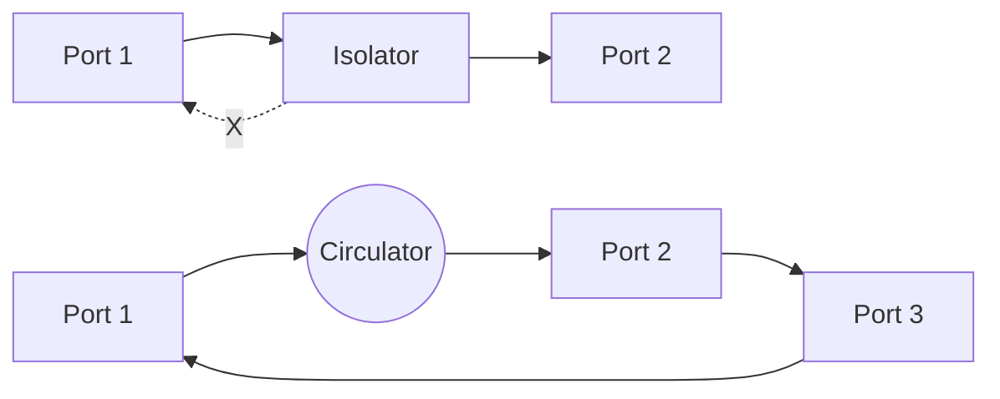
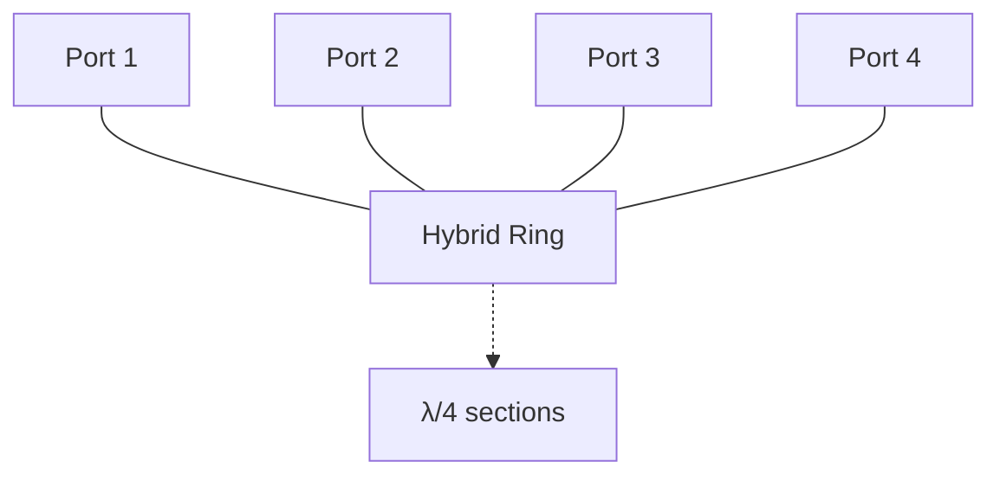
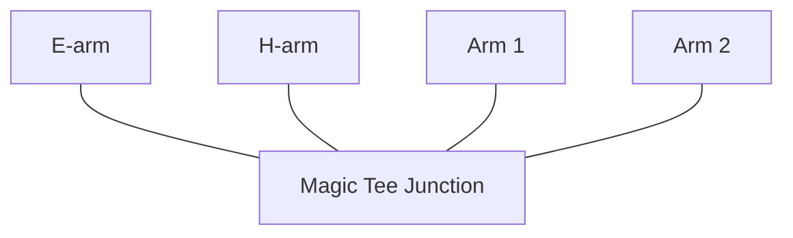
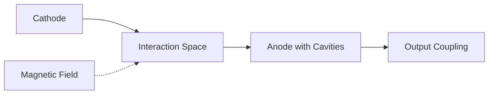
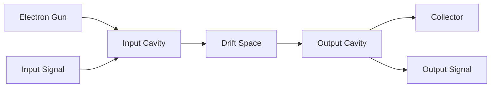
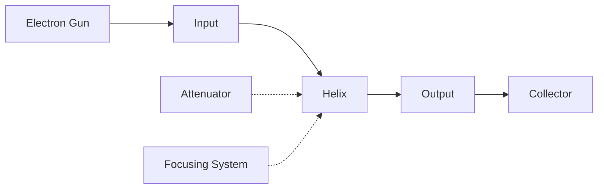
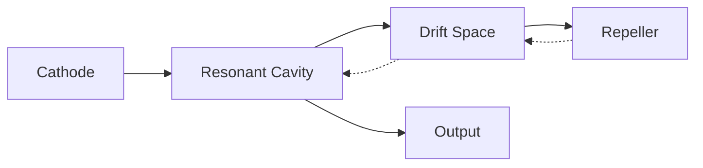
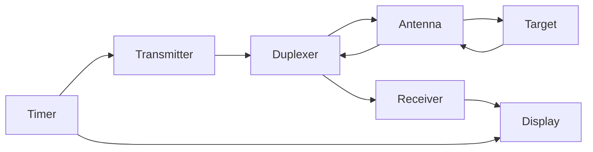

## Question 1(a) [3 marks]

**Give comparison between transmission line and waveguide.**

**Answer**:

| Parameter | Transmission Line | Waveguide |
|-----------|------------------|-----------|
| **Frequency Range** | Low to medium frequencies | High frequencies (above 1 GHz) |
| **Structure** | Two or more conductors | Single hollow conductor |
| **Propagation Mode** | TEM mode | TE and TM modes |
| **Power Handling** | Limited power capacity | High power handling capability |
| **Losses** | Higher losses at high frequencies | Lower losses at microwave frequencies |

**Mnemonic:** "WAVES Travel Better" (Waveguides - Advanced Versions Enabling Superior Transmission)

---

## Question 1(b) [4 marks]

**Define the following terms: (1) Lossless Line (2) VSWR (3) STUB (4) Reflection coefficient**

**Answer**:

- **Lossless Line**: A transmission line with zero resistance and conductance, having no power loss during signal transmission.

- **VSWR (Voltage Standing Wave Ratio)**: Ratio of maximum voltage to minimum voltage on a transmission line, indicating impedance mismatch.

- **STUB**: Short length of transmission line connected to main line for impedance matching purposes.

- **Reflection Coefficient**: Ratio of reflected wave amplitude to incident wave amplitude at any point on transmission line.

**Mnemonic:** "Light Volumes Stay Reflected" (Lossless-VSWR-Stub-Reflection)

---

## Question 1(c) [7 marks]

**Explain isolator and circulator with the help of sketch.**

**Answer**:



**Isolator:**

- **Function**: Allows signal flow in one direction only
- **Construction**: Uses ferrite material with magnetic bias
- **Applications**: Protects sources from reflections

**Circulator:**

- **Function**: Routes signals in circular pattern between three or four ports
- **Construction**: Y-junction with ferrite material
- **Applications**: Duplexers in radar systems

**Mnemonic:** "Isolated Circuits Flow Forward" (Isolator-Circulator-Forward-Flow)

---

## Question 1(c OR) [7 marks]

**What is dominant mode in a waveguide? What will be the cutoff wavelength for dominant mode, in a rectangular waveguide whose breadth is 10 cm? For a 2.5 GHz signal propagated through it calculate guide wavelength, group velocity and phase velocity and Z₀.**

**Answer**:

**Dominant Mode**: Lowest order mode that can propagate in a waveguide. For rectangular waveguide, it's TE₁₀ mode.

**Given Data:**

- Breadth (a) = 10 cm = 0.1 m
- Frequency (f) = 2.5 GHz = 2.5 × 10⁹ Hz
- c = 3 × 10⁸ m/s

**Calculations:**

| Parameter | Formula | Value |
|-----------|---------|-------|
| **Cutoff Wavelength** | λc = 2a | λc = 2 × 0.1 = 0.2 m |
| **Free Space Wavelength** | λ₀ = c/f | λ₀ = 0.12 m |
| **Guide Wavelength** | λg = λ₀/√(1-(λ₀/λc)²) | λg = 0.133 m |
| **Group Velocity** | vg = c√(1-(λ₀/λc)²) | vg = 2.7 × 10⁸ m/s |
| **Phase Velocity** | vp = c/√(1-(λ₀/λc)²) | vp = 3.33 × 10⁸ m/s |

**Mnemonic:** "Dominant Modes Calculate Guide Parameters" 

---

## Question 2(a) [3 marks]

**What is single stub impedance matching, and how does it work?**

**Answer**:

**Single Stub Matching**: Technique using one short-circuited or open-circuited stub connected in parallel to transmission line for impedance matching.

**Working Principle:**

- **Stub acts as reactive element** (inductive or capacitive)
- **Cancels reactive component** of load impedance
- **Transforms impedance** to characteristic impedance

**Mnemonic:** "Single Stubs Transform Reactance" (Single-Stub-Transform-Reactive)

---

## Question 2(b) [4 marks]

**Differentiate between rectangular and circular waveguide any three points.**

**Answer**:

| Parameter | Rectangular Waveguide | Circular Waveguide |
|-----------|----------------------|-------------------|
| **Cross-section** | Rectangular shape | Circular shape |
| **Dominant Mode** | TE₁₀ mode | TE₁₁ mode |
| **Field Pattern** | Simple field distribution | Complex field distribution |
| **Manufacturing** | Easy to manufacture | Difficult to manufacture |

**Mnemonic:** "Rectangles Dominate Ten" vs "Circles Dominate Eleven"

---

## Question 2(c) [7 marks]

**Explain the construction and working of Hybrid Ring with diagram.**

**Answer**:



**Construction:**

- **Ring structure** with four ports
- **Circumference** = 1.5λ (one and half wavelengths)
- **Adjacent ports** separated by λ/4
- **Opposite ports** separated by 3λ/4

**Working:**

- **Power division**: Input at one port divides equally between two adjacent ports
- **Isolation**: Opposite port receives no power
- **Phase relationship**: 180° phase difference between output ports

**Applications:**

- **Balanced mixers**
- **Power combiners/dividers**
- **Antenna feeds**

**Mnemonic:** "Hybrid Rings Divide Power Equally"

---

## Question 2(a OR) [3 marks]

**What is Microwave? List out any four applications of microwave.**

**Answer**:

**Microwave**: Electromagnetic waves with frequency range from 1 GHz to 300 GHz.

**Applications:**

- **Radar systems** for detection and ranging
- **Satellite communication** for long-distance transmission
- **Microwave ovens** for heating food
- **Mobile communication** (cellular networks)

**Mnemonic:** "Microwaves Reach Space Mobile" (Microwave-Radar-Satellite-Mobile)

---

## Question 2(b OR) [4 marks]

**Write short note on cavity resonator.**

**Answer**:

**Cavity Resonator**: Closed metallic structure that confines electromagnetic energy at specific resonant frequencies.

**Construction:**

- **Metallic enclosure** of specific dimensions
- **High Q factor** (low losses)
- **Resonant frequency** depends on cavity dimensions

**Types:**

- **Rectangular cavity**
- **Cylindrical cavity**
- **Spherical cavity**

**Applications:**

- **Frequency meters**
- **Oscillator circuits**
- **Filter circuits**

**Mnemonic:** "Cavities Resonate High Quality" (Cavity-Resonant-High-Q)

---

## Question 2(c OR) [7 marks]

**Explain MAGIC TEE with the help of sketch and how it works as an isolator?**

**Answer**:



**Magic Tee Construction:**

- **E-plane Tee** and **H-plane Tee** combined
- **Four ports**: E-arm, H-arm, and two side arms
- **E-arm** perpendicular to H-arm

**Working as Isolator:**

- **Signal at E-arm** divides equally between side arms (in-phase)
- **Signal at H-arm** divides equally between side arms (out-of-phase)
- **Isolation** between E-arm and H-arm
- **No coupling** between perpendicular arms

**Properties:**

- **Matched at all ports**
- **Reciprocal device**
- **Power division and isolation**

**Mnemonic:** "Magic Isolates Perpendicular Arms"

---

## Question 3(a) [3 marks]

**Describe the working principle of MASER.**

**Answer**:

**MASER (Microwave Amplification by Stimulated Emission of Radiation):**

- **Population inversion** created in active medium
- **Stimulated emission** produces coherent microwaves
- **Amplification** occurs through energy level transitions

**Working Principle:**

- **Atoms excited** to higher energy levels
- **Stimulated photons** trigger emission
- **Coherent amplification** of microwave signals

**Mnemonic:** "Microwaves Amplify Stimulated Emission Radiation"

---

## Question 3(b) [4 marks]

**List four microwave diodes and explain any one.**

**Answer**:

**Four Microwave Diodes:**

1. **GUNN Diode**
2. **IMPATT Diode** 
3. **TRAPATT Diode**
4. **PIN Diode**

**GUNN Diode Explanation:**

- **Principle**: Transferred electron effect in GaAs
- **Construction**: N-type GaAs with ohmic contacts
- **Operation**: Negative resistance at microwave frequencies
- **Applications**: Oscillators, amplifiers

**VI Characteristic:**

```goat
    I ^
      |    /
      |   /
      |  /___
      | /    \
      |/      \___
      +----------> V
      Negative resistance region
```

**Mnemonic:** "GUNN Generates Negative Resistance"

---

## Question 3(c) [7 marks]

**Write a detailed explanation of the Magnetron Oscillator, covering its construction, working principle, and applications?**

**Answer**:



**Construction:**

- **Cylindrical cathode** at center
- **Anode with resonant cavities** surrounding cathode
- **Strong magnetic field** perpendicular to electric field
- **Output coupling** through waveguide

**Working Principle:**

- **Electrons emitted** from heated cathode
- **Cycloid motion** due to crossed E and B fields
- **Bunching effect** creates electron clouds
- **Energy transfer** from electrons to RF field
- **Oscillation** at cavity resonant frequency

**Applications:**

- **Radar transmitters**
- **Microwave ovens**
- **Industrial heating**
- **Medical diathermy**

**Mnemonic:** "Magnetrons Make Microwave Oscillations"

---

## Question 3(a OR) [3 marks]

**Describe the working of RUBY MASER.**

**Answer**:

**Ruby MASER Working:**

- **Ruby crystal** (Al₂O₃ with Cr³⁺ ions) as active medium
- **Three energy levels** in chromium ions
- **Pump frequency** creates population inversion
- **Signal amplification** at 2.9 GHz

**Process:**

- **Optical pumping** excites electrons to higher level
- **Stimulated emission** produces coherent microwaves
- **Low noise amplification** achieved

**Mnemonic:** "Ruby Radiates Amplified Microwaves"

---

## Question 3(b OR) [4 marks]

**Draw and explain the VI characteristic of Gun diode**

**Answer**:

```goat
    I ^
      |      
      |    B /
      |     /
      |    /
      | A /
      |  /
      | /_____ C
      |/      \
      |        \_____ D
      +-----------> V
    Valley    Peak
    Current   Current
```

**VI Characteristic Explanation:**

- **Region OA**: Ohmic region (positive resistance)
- **Region AB**: Negative resistance region
- **Region BC**: Valley current region
- **Region CD**: Saturation region

**Key Points:**

- **Peak voltage**: Maximum voltage before negative resistance
- **Valley current**: Minimum current in negative resistance region
- **Negative resistance**: Current decreases with increasing voltage

**Mnemonic:** "Valley Peak Negative Resistance"

---

## Question 3(c OR) [7 marks]

**Explain "frequency measurement method" as well as "attenuation measurement method" at microwave frequency.**

**Answer**:

**Frequency Measurement Methods:**

| Method | Principle | Accuracy |
|--------|-----------|----------|
| **Cavity Wavemeter** | Resonant cavity tuning | High |
| **Direct Reading Meter** | Frequency counter | Very High |
| **Heterodyne Method** | Beat frequency technique | Medium |

**Attenuation Measurement Methods:**

| Method | Description | Application |
|--------|-------------|-------------|
| **Substitution Method** | Replace attenuator with calibrated attenuator | Precision measurement |
| **Power Ratio Method** | Compare input and output power | General purpose |
| **RF Bridge Method** | Balance bridge circuit | Laboratory use |

**Setup for Measurement:**

- **Signal generator** provides test signal
- **Calibrated attenuator** for reference
- **Power meter** measures signal levels
- **VSWR meter** monitors impedance matching

**Mnemonic:** "Frequency Attenuation Measured Precisely"

---

## Question 4(a) [3 marks]

**Explain working of P-i-N diode.**

**Answer**:

**P-i-N Diode Structure:**

- **P-type region** (heavily doped)
- **Intrinsic region** (undoped, high resistance)
- **N-type region** (heavily doped)

**Working:**

- **Forward bias**: Low resistance, acts as conductor
- **Reverse bias**: High resistance, acts as insulator
- **RF switching**: Fast switching due to charge storage

**Applications:**

- **RF switches**
- **Attenuators**
- **Phase shifters**

**Mnemonic:** "PIN Provides Instant Switching"

---

## Question 4(b) [4 marks]

**Explain π mode oscillations for magnetron.**

**Answer**:

**π Mode Oscillation:**

- **Adjacent cavities** oscillate 180° out of phase
- **Electron bunching** synchronized with RF field
- **Maximum power transfer** from electrons to RF
- **Stable oscillation** at designed frequency

**Characteristics:**

- **Phase difference**: π radians between adjacent cavities
- **Frequency**: Determined by cavity dimensions
- **Efficiency**: Highest among all modes
- **Stability**: Most stable oscillation mode

**Mode Chart:**

```goat
Cavity: 1  2  3  4  5  6  7  8
Phase:  0  π  0  π  0  π  0  π
```

**Mnemonic:** "Pi Mode Produces Maximum Power"

---

## Question 4(c) [7 marks]

**Explain the construction and working of two cavity klystron amplifiers with necessary diagram.**

**Answer**:



**Construction:**

- **Electron gun** produces electron beam
- **Input cavity** (buncher) modulates electron beam
- **Drift space** allows velocity modulation
- **Output cavity** (catcher) extracts RF energy
- **Collector** collects spent electrons

**Working Principle:**

- **Velocity modulation** in input cavity
- **Electron bunching** in drift space
- **Density modulation** creates current variation
- **Energy extraction** in output cavity
- **Amplification** achieved through beam-field interaction

**Key Parameters:**

- **Beam voltage**: Determines electron velocity
- **Cavity tuning**: Sets operating frequency
- **Drift space length**: Controls bunching effectiveness

**Applications:**

- **Radar transmitters**
- **Satellite communication**
- **Linear accelerators**

**Mnemonic:** "Klystrons Amplify Through Bunching"

---

## Question 4(a OR) [3 marks]

**Explain parametric amplifier.**

**Answer**:

**Parametric Amplifier:**

- **Variable reactance** device using varactor diode
- **Pump frequency** modulates diode capacitance
- **Energy transfer** from pump to signal
- **Low noise amplification** achieved

**Working:**

- **Pump power** varies diode reactance
- **Signal mixing** produces sum and difference frequencies
- **Idler frequency** fp = fs + fi
- **Power gain** through nonlinear mixing

**Advantages:**

- **Very low noise figure**
- **High gain possible**
- **Wide bandwidth**

**Mnemonic:** "Parametric Amplifiers Pump Low Noise"

---

## Question 4(b OR) [4 marks]

**Draw and explain schematic diagram of travelling wave tube with necessary notation**

**Answer**:



**Components:**

- **Electron gun**: Produces electron beam
- **Helix**: Slow-wave structure
- **Attenuator**: Prevents oscillation
- **Collector**: Collects electrons
- **Focusing system**: Maintains beam alignment

**Working:**

- **Electron beam** travels through helix center
- **RF signal** propagates along helix
- **Synchronism** between beam and RF wave
- **Energy transfer** from beam to RF
- **Continuous amplification** along helix length

**Mnemonic:** "TWT Travels With Waves"

---

## Question 4(c OR) [7 marks]

**Explain the working principle of a reflex klystron in detail with suitable diagram.**

**Answer**:



**Construction:**

- **Single resonant cavity** acts as buncher and catcher
- **Repeller electrode** reflects electron beam
- **Drift space** allows velocity modulation
- **Output coupling** extracts RF power

**Working Principle:**

**Applegate Diagram:**

```goat
Distance ^
         |    ___
         |   /   \  Bunched electrons
         |  /     \
         | /       \
         |/         \___
         +-------------> Time
         Transit time variation
```

**Process:**

1. **Electrons enter cavity** and get velocity modulated
2. **Electrons drift** toward repeller
3. **Repeller reflects** electrons back to cavity
4. **Transit time** determines bunching phase
5. **Bunched electrons** deliver energy to cavity
6. **Oscillation maintained** through feedback

**Frequency Tuning:**

- **Repeller voltage** controls transit time
- **Cavity tuning** sets center frequency
- **Electronic tuning** possible

**Applications:**

- **Local oscillators**
- **Frequency meters**
- **Microwave sources**

**Mnemonic:** "Reflex Returns Electron Bunches"

---

## Question 5(a) [3 marks]

**"PIN diode acts as a switch and VARACTOR diode acts as a variable capacitor" explain.**

**Answer**:

**PIN Diode as Switch:**

- **Forward bias**: Low resistance (~1Ω), switch ON
- **Reverse bias**: High resistance (~10kΩ), switch OFF
- **Fast switching** due to charge storage in I-region
- **RF isolation** in OFF state

**VARACTOR Diode as Variable Capacitor:**

- **Reverse bias voltage** controls junction capacitance
- **Capacitance decreases** with increasing reverse voltage
- **Voltage-controlled reactance** for tuning circuits
- **Electronic tuning** without mechanical adjustment

**Mnemonic:** "PIN Switches, VARACTOR Varies"

---

## Question 5(b) [4 marks]

**List the display methods used in RADAR and explain any one.**

**Answer**:

**RADAR Display Methods:**

1. **A-Scope Display**
2. **PPI (Plan Position Indicator)**
3. **B-Scope Display**
4. **RHI (Range Height Indicator)**

**PPI Display Explanation:**

- **Circular display** showing target positions
- **Center represents** radar location
- **Radial distance** indicates target range
- **Angular position** shows target bearing
- **Rotating sweep** synchronized with antenna rotation

**Features:**

- **Real-time display** of target positions
- **Range and bearing** information
- **Multiple target tracking**
- **Clutter suppression**

**Mnemonic:** "PPI Pictures Position Indicators"

---

## Question 5(c) [7 marks]

**What is radar? List out the different types of radar systems? Explain any One of radar in detail?**

**Answer**:

**RADAR (Radio Detection And Ranging):**
System using radio waves to detect objects and determine their range, velocity, and characteristics.

**Types of RADAR Systems:**

| Type | Application | Frequency Band |
|------|-------------|----------------|
| **Pulse Radar** | Air traffic control | L, S, C bands |
| **CW Doppler Radar** | Speed measurement | X, K, Ka bands |
| **MTI Radar** | Moving target detection | S, C bands |
| **SAR Radar** | Ground mapping | L, C, X bands |

**Pulse Radar Detailed Explanation:**



**Working:**

- **Transmits short pulses** of RF energy
- **Receives echoes** from targets
- **Measures time delay** for range calculation
- **Processes signals** for display

**Range Equation:**
R = (c × t)/2

Where:

- R = Range to target
- c = Speed of light
- t = Time delay

**Applications:**

- **Air traffic control**
- **Weather monitoring**
- **Military surveillance**
- **Navigation aids**

**Mnemonic:** "Radar Ranges Radio Waves"

---

## Question 5(a OR) [3 marks]

**Describe the operation of TRAPATT diode with diagram.**

**Answer**:

```goat
    I ^
      |      |\
      |      | \
      |      |  \
      |      |   \__ Trapped plasma
      |      |     \ avalanche
      |______|______\___
      +----------------> V
      Breakdown voltage
```

**TRAPATT Operation:**

- **TRApped Plasma Avalanche Triggered Transit** diode
- **High field region** creates avalanche breakdown
- **Plasma formation** traps charge carriers
- **Transit time effects** create negative resistance
- **Oscillation frequency** determined by transit time

**Applications:**

- **High power oscillators**
- **Radar transmitters**
- **Communication systems**

**Mnemonic:** "TRAPATT Traps Plasma Avalanche"

---

## Question 5(b OR) [4 marks]

**Compare RADAR with SONAR.**

**Answer**:

| Parameter | RADAR | SONAR |
|-----------|-------|-------|
| **Wave Type** | Electromagnetic waves | Sound waves |
| **Medium** | Air/vacuum | Water/liquid |
| **Frequency** | GHz range | kHz range |
| **Speed** | 3 × 10⁸ m/s | 1500 m/s in water |
| **Range** | Very long range | Limited by absorption |
| **Applications** | Air/space detection | Underwater detection |

**Similarities:**

- **Echo principle** for detection
- **Range measurement** using time delay
- **Doppler effect** for velocity measurement

**Mnemonic:** "RADAR Radiates, SONAR Sounds"

---

## Question 5(c OR) [7 marks]

**Obtain the equation for maximum radar range.**

**Answer**:

**RADAR Range Equation Derivation:**

**Power Transmitted:** Pt

**Power Density at Target:**
Pd = Pt/(4πR²)

**Power Intercepted by Target:**
Pi = Pd × σ = (Pt × σ)/(4πR²)

**Power Returned to Radar:**
Pr = Pi/(4πR²) = (Pt × σ)/(4πR²)²

**Power Received:**
Pr = (Pt × G² × λ² × σ)/((4π)³ × R⁴)

**Maximum Range Equation:**

```
Rmax = ⁴√[(Pt × G² × λ² × σ)/((4π)³ × Prmin)]
```

**Where:**

- Pt = Transmitted power
- G = Antenna gain  
- λ = Wavelength
- σ = Radar cross section
- Prmin = Minimum detectable signal
- R = Range

**Factors Affecting Range:**

- **Transmitted power** (increases range)
- **Antenna gain** (increases range)
- **Target cross-section** (increases range)
- **Frequency** (affects propagation)
- **Receiver sensitivity** (affects minimum signal)

**Practical Considerations:**

- **Atmospheric losses**
- **Ground reflections**
- **Noise limitations**
- **Clutter effects**

**Mnemonic:** "Power Gain Lambda Sigma Range"

---
