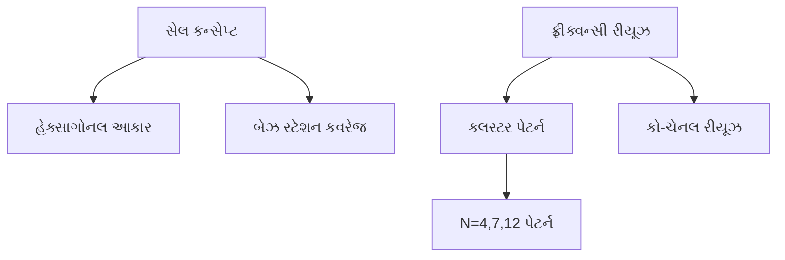
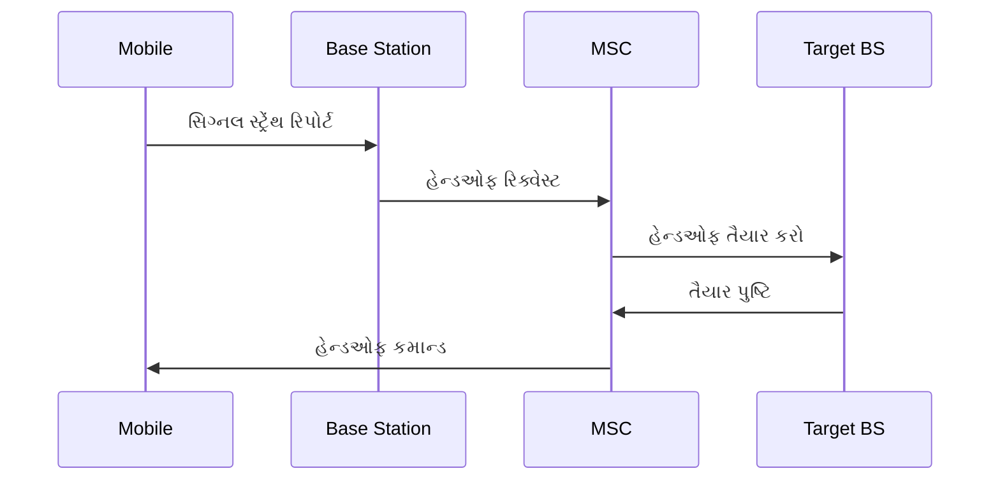
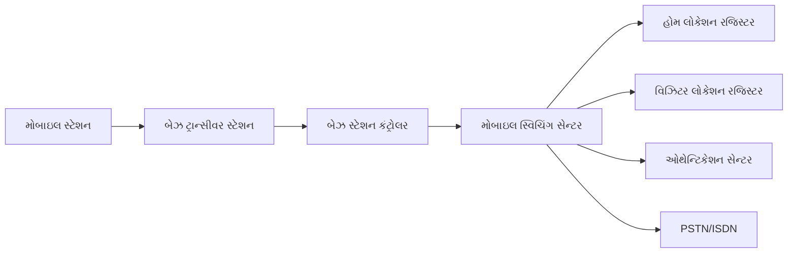
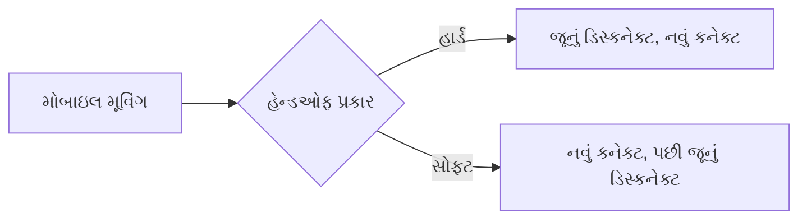
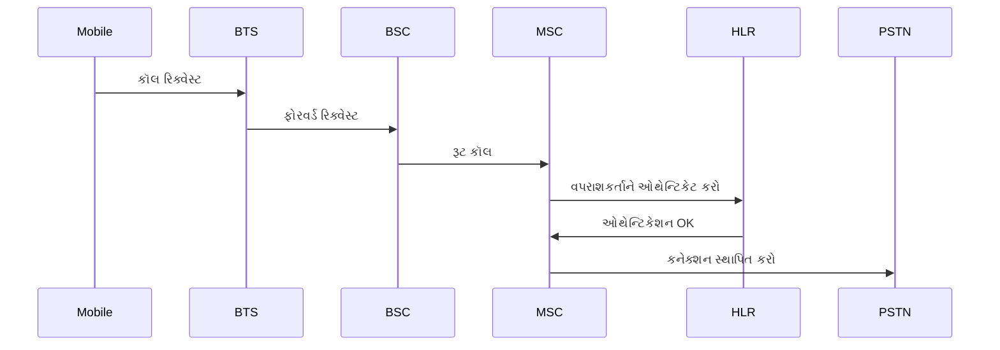
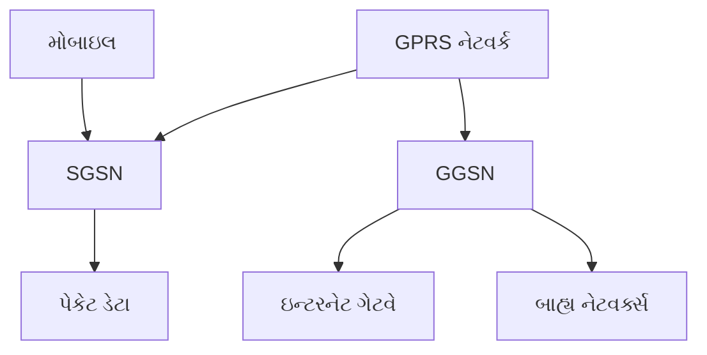
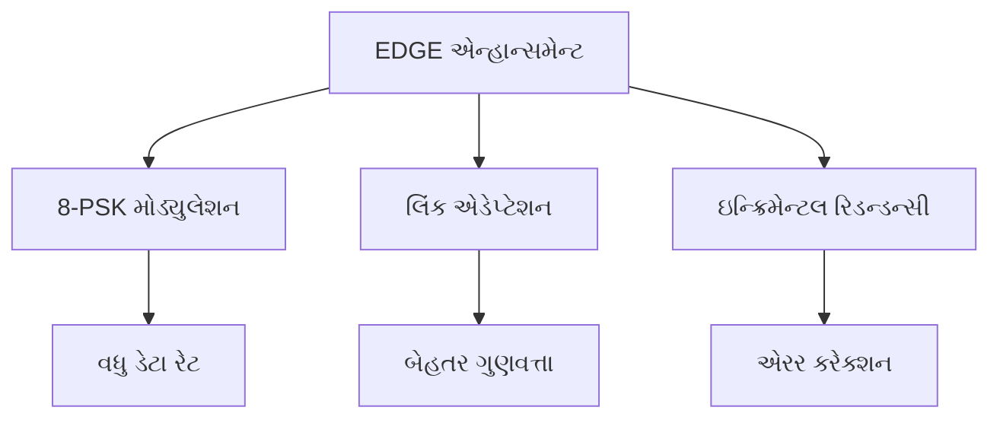
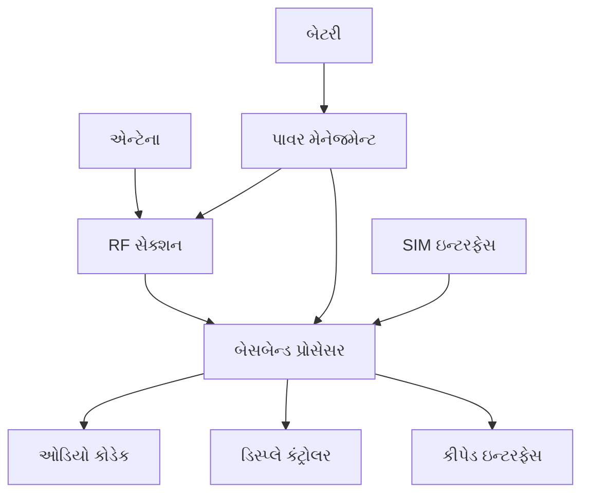
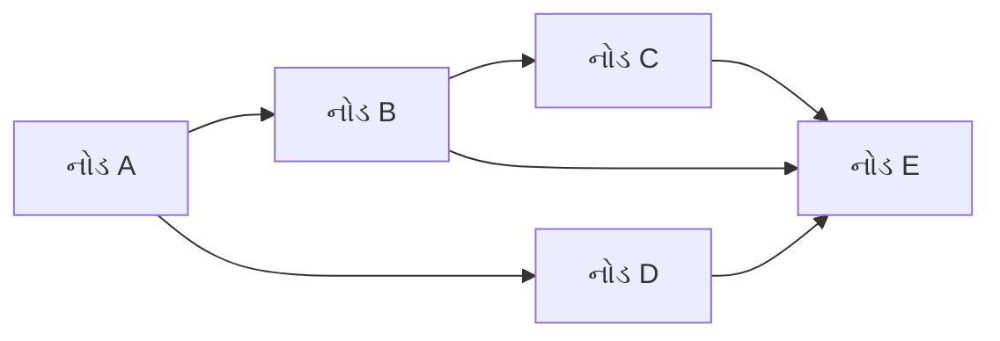

## પ્રશ્ન 1(અ) [3 ગુણ]

**સિલેક્ટિવ સેલ સમજાવો.**

**જવાબ:**

**કોષ્ટક: સિલેક્ટિવ સેલની લાક્ષણિકતાઓ**

| લક્ષણ | વર્ણન |
|-------|-------|
| હેતુ | ચોક્કસ વિસ્તારો માટે કવરેજ આપે છે |
| કદ | નાનો કવરેજ વિસ્તાર |
| ઉપયોગ | ઇન્ડોર લોકેશન, ટનલ, બિલ્ડિંગ |
| એન્ટેના | **ડાયરેક્શનલ એન્ટેના સિસ્ટમ** |

- **સિલેક્ટિવ કવરેજ**: સિગ્નલની જરૂર હોય તેવા ચોક્કસ ભૌગોલિક વિસ્તારોને લક્ષ્ય બનાવે છે
- **ઇન્ડોર સોલ્યૂશન**: મુખ્યત્વે બિલ્ડિંગ કવરેજ વધારવા માટે વપરાય છે
- **ડાયરેક્શનલ ટ્રાન્સમિશન**: કાર્યક્ષમતા માટે ફોકસ્ડ બીમ પેટર્ન વાપરે છે

**મેમરી ટ્રીક:** "સિલેક્ટ સ્પેશિયલ સ્પોટ્સ"

## પ્રશ્ન 1(બ) [4 ગુણ]

**અમ્બ્રેલા સેલ દોરો અને સમજાવો.**

**જવાબ:**

```goat
        Umbrella Cell
           +---+
          /     \
         /       \
        +         +
       / \       / \
      +   +     +   +
     Micro    Pico
     Cells    Cells
```

**કોષ્ટક: અમ્બ્રેલા સેલના લક્ષણો**

| પેરામીટર | વર્ણન |
|----------|-------|
| કવરેજ | મોટા વિસ્તારનું કવરેજ |
| હેતુ | નાના સેલ્સને ઓવરલે કરે છે |
| હેન્ડઓફ | ઇન્ટર-સેલ ટ્રાન્ઝિશન સંચાલિત કરે છે |
| ક્ષમતા | **ઓવરફ્લો ટ્રાફિક હેન્ડલ કરે છે** |

- **મોટું કવરેજ**: નાના સેલ્સ ઉપર વિશાળ વિસ્તારનું સિગ્નલ કવરેજ પૂરું પાડે છે
- **ટ્રાફિક મેનેજમેન્ટ**: માઇક્રો અને પિકો સેલ્સમાંથી ઓવરફ્લો હેન્ડલ કરે છે
- **સીમલેસ હેન્ડઓફ**: હલનચલન દરમિયાન સતત કમ્યુનિકેશન સુનિશ્ચિત કરે છે

**મેમરી ટ્રીક:** "અમ્બ્રેલા બધાને કવર કરે છે"

## પ્રશ્ન 1(ક) [7 ગુણ]

**સેલ શું છે? ફ્રીક્વન્સી રીયૂઝ વિગતવાર સમજાવો.**

**જવાબ:**

**કોષ્ટક: સેલ અને ફ્રીક્વન્સી રીયૂઝ કન્સેપ્ટ**

| કન્સેપ્ટ | વ્યાખ્યા | હેતુ |
|---------|-------|-----|
| સેલ | ભૌગોલિક કવરેજ વિસ્તાર | સેવા પ્રદાન |
| ફ્રીક્વન્સી રીયૂઝ | અલગ સેલ્સમાં સમાન ફ્રીક્વન્સી | સ્પેક્ટ્રમ કાર્યક્ષમતા |
| ક્લસ્ટર | અનોખી ફ્રીક્વન્સીઓ ધરાવતા સેલ્સનું જૂથ | ઇન્ટરફેરન્સ કંટ્રોલ |
| રીયૂઝ ડિસ્ટન્સ | સમાન ફ્રીક્વન્સીઓ વચ્ચેનું લઘુત્તમ અંતર | સિગ્નલ ગુણવત્તા |



- **સેલની વ્યાખ્યા**: એક બેઝ સ્ટેશન એન્ટેના દ્વારા કવર થતો ભૌગોલિક વિસ્તાર
- **હેક્સાગોનલ પેટર્ન**: ગેપ વિના કવરેજ માટે સૌથી કાર્યક્ષમ આકાર
- **ફ્રીક્વન્સી રીયૂઝ**: ક્ષમતા માટે બિન-નજીકના સેલ્સમાં સમાન ફ્રીક્વન્સી વપરાય છે
- **ક્લસ્ટર સાઇઝ**: ફ્રીક્વન્સી રીયૂઝ પેટર્ન નક્કી કરે છે (N=4,7,12)
- **કો-ચેનલ ઇન્ટરફેરન્સ**: લઘુત્તમ રીયૂઝ અંતર દ્વારા નિયંત્રિત

**મેમરી ટ્રીક:** "સેલ્સ રીયૂઝ ફ્રીક્વન્સીઝ એફિશિયન્ટલી"

## પ્રશ્ન 1(ક) OR [7 ગુણ]

**સેલ્યુલર કન્સેપ્ટને વિગતવાર સમજાવો.**

**જવાબ:**

**કોષ્ટક: સેલ્યુલર સિસ્ટમના ઘટકો**

| ઘટક | કાર્ય | ફાયદો |
|-----|------|-------|
| સેલ ડિવિઝન | વિસ્તારને સેલ્સમાં વહેંચવું | કવરેજ ઓપ્ટિમાઇઝેશન |
| બેઝ સ્ટેશનો | વ્યક્તિગત સેલ્સની સેવા | સિગ્નલ ટ્રાન્સમિશન |
| મોબાઇલ સ્વિચિંગ | કૉલ રૂટિંગ | નેટવર્ક કનેક્ટિવિટી |
| ફ્રીક્વન્સી પ્લાનિંગ | સ્પેક્ટ્રમ એલોકેશન | ઇન્ટરફેરન્સ કંટ્રોલ |


- **વિસ્તાર વિભાજન**: મોટા સર્વિસ વિસ્તારને નાના હેક્સાગોનલ સેલ્સમાં વહેંચવામાં આવે છે
- **પાવર કંટ્રોલ**: લો પાવર ટ્રાન્સમિટર ઇન્ટરફેરન્સ ઘટાડે છે
- **ફ્રીક્વન્સી કાર્યક્ષમતા**: દૂરના સેલ્સમાં સમાન ફ્રીક્વન્સી ફરીથી વાપરવામાં આવે છે
- **ક્ષમતા વૃદ્ધિ**: વધુ સાથે સાથે વપરાશકર્તાઓની સેવા કરવામાં આવે છે
- **સીમલેસ કવરેજ**: બધા સેલ્સમાં સતત સેવા

**મેમરી ટ્રીક:** "ડિવાઇડ એરિયા ફોર બેટર સર્વિસ"

## પ્રશ્ન 2(અ) [3 ગુણ]

**પૂર્ણ સ્વરૂપ લખો: (i) IMEI (ii) LTE (iii) GSM**

**જવાબ:**

**કોષ્ટક: પૂર્ણ સ્વરૂપો**

| સંક્ષેપ | પૂર્ણ સ્વરૂપ | હેતુ |
|-------|------------|-----|
| IMEI | International Mobile Equipment Identity | ડિવાઇસ ઓળખ |
| LTE | Long Term Evolution | 4G ટેકનોલોજી સ્ટાન્ડર્ડ |
| GSM | Global System for Mobile Communication | 2G સેલ્યુલર સ્ટાન્ડર્ડ |

**મેમરી ટ્રીક:** "આઇડેન્ટિટી, લોંગ-ટર્મ, ગ્લોબલ"

## પ્રશ્ન 2(બ) [4 ગુણ]

**MAHO ને વિગતવાર સમજાવો.**

**જવાબ:**

**કોષ્ટક: MAHO લાક્ષણિકતાઓ**

| લક્ષણ | વર્ણન |
|-------|-------|
| પૂર્ણ સ્વરૂપ | Mobile Assisted Handoff |
| કાર્ય | હેન્ડઓફ નિર્ણયમાં મોબાઇલ મદદ કરે છે |
| માપ | સિગ્નલ સ્ટ્રેંથ મોનિટરિંગ |
| રિપોર્ટિંગ | મોબાઇલ નેટવર્કને રિપોર્ટ કરે છે |



- **મોબાઇલ સહાયતા**: મોબાઇલ યુનિટ પડોશી સેલ સિગ્નલ્સ માપે છે
- **સિગ્નલ રિપોર્ટિંગ**: સતત માપ રિપોર્ટ્સ નેટવર્કને મોકલવામાં આવે છે
- **નિર્ણય સહાયતા**: નેટવર્ક હેન્ડઓફ નિર્ણયો માટે મોબાઇલ ડેટા વાપરે છે
- **ગુણવત્તા સુધારણા**: મોબાઇલ ઇનપુટ સાથે બેહતર હેન્ડઓફ નિર્ણયો

**મેમરી ટ્રીક:** "મોબાઇલ એસિસ્ટ્સ નેટવર્ક ડિસિઝન્સ"

## પ્રશ્ન 2(ક) [7 ગુણ]

**GSM આર્કિટેક્ચર આકૃતિ સાથે સમજાવો**

**જવાબ:**



**કોષ્ટક: GSM આર્કિટેક્ચર ઘટકો**

| ઘટક | કાર્ય | હેતુ |
|-----|------|-----|
| MS | મોબાઇલ સ્ટેશન | વપરાશકર્તા ઉપકરણ |
| BTS | બેઝ ટ્રાન્સીવર | રેડિયો ઇન્ટરફેસ |
| BSC | બેઝ સ્ટેશન કંટ્રોલર | રેડિયો રિસોર્સ મેનેજમેન્ટ |
| MSC | મોબાઇલ સ્વિચિંગ સેન્ટર | કૉલ સ્વિચિંગ |
| HLR | હોમ લોકેશન રજિસ્ટર | સબ્સ્ક્રાઇબર ડેટાબેઝ |
| VLR | વિઝિટર લોકેશન રજિસ્ટર | અસ્થાયી સબ્સ્ક્રાઇબર ડેટા |

- **રેડિયો સબસિસ્ટમ**: BTS અને BSC રેડિયો કમ્યુનિકેશન હેન્ડલ કરે છે
- **નેટવર્ક સબસિસ્ટમ**: MSC, HLR, VLR કૉલ્સ અને મોબિલિટી મેનેજ કરે છે
- **ડેટાબેઝ મેનેજમેન્ટ**: HLR પર્મેનન્ટ, VLR ટેમ્પરરી ડેટા સ્ટોર કરે છે
- **ઓથેન્ટિકેશન**: AuC સિક્યુરિટી ફંક્શન્સ પૂરા પાડે છે

**મેમરી ટ્રીક:** "મોબાઇલ બેઝ નેટવર્ક ડેટાબેઝ"

## પ્રશ્ન 2(અ) OR [3 ગુણ]

**સેલ સ્પ્લિટિંગ સમજાવો.**

**જવાબ:**

**કોષ્ટક: સેલ સ્પ્લિટિંગ પ્રક્રિયા**

| પગલું | ક્રિયા | પરિણામ |
|------|-------|-------|
| 1 | ટ્રાન્સમિટ પાવર ઘટાડો | નાનું કવરેજ |
| 2 | નવા બેઝ સ્ટેશનો ઉમેરો | કવરેજ ગેપ્સ ભરો |
| 3 | ફ્રીક્વન્સી પ્લાનિંગ | ઇન્ટરફેરન્સ કંટ્રોલ જાળવો |
| 4 | ક્ષમતા વૃદ્ધિ | વધુ વપરાશકર્તાઓની સેવા |

- **પાવર રિડક્શન**: કવરેજ ઘટાડવા માટે ઓરિજિનલ સેલ પાવર ઘટાડવામાં આવે છે
- **નવા સેલ્સ**: કવરેજ ગેપ્સમાં વધારાના બેઝ સ્ટેશનો ઇન્સ્ટોલ કરવામાં આવે છે
- **ક્ષમતા લાભ**: વધુ સેલ્સ એટલે સમાન વિસ્તારમાં વધુ વપરાશકર્તા ક્ષમતા

**મેમરી ટ્રીક:** "સ્પ્લિટ સેલ્સ ડબલ કેપેસિટી"

## પ્રશ્ન 2(બ) OR [4 ગુણ]

**હેન્ડઓફ શું છે? સોફ્ટ અને હાર્ડ હેન્ડઓફ સમજાવો.**

**જવાબ:**

**કોષ્ટક: હેન્ડઓફ પ્રકારોની સરખામણી**

| પ્રકાર | પ્રક્રિયા | ટેકનોલોજી | ગુણવત્તા |
|------|---------|-----------|---------|
| હાર્ડ હેન્ડઓફ | બ્રેક-ધેન-મેક | GSM, TDMA | ટૂંકો વિક્ષેપ |
| સોફ્ટ હેન્ડઓફ | મેક-ધેન-બ્રેક | CDMA | સીમલેસ ટ્રાન્ઝિશન |



- **હેન્ડઓફ વ્યાખ્યા**: એક સેલમાંથી બીજા સેલમાં કૉલ ટ્રાન્સફર કરવાની પ્રક્રિયા
- **હાર્ડ હેન્ડઓફ**: નવું કનેક્શન સ્થાપિત કરતા પહેલા કનેક્શન તૂટી જાય છે
- **સોફ્ટ હેન્ડઓફ**: જૂનું તોડતા પહેલા નવું કનેક્શન સ્થાપિત કરવામાં આવે છે
- **ગુણવત્તા તફાવત**: સોફ્ટ હેન્ડઓફ બેહતર કૉલ ગુણવત્તા પૂરી પાડે છે

**મેમરી ટ્રીક:** "હાર્ડ બ્રેક્સ, સોફ્ટ કનેક્ટ્સ"

## પ્રશ્ન 2(ક) OR [7 ગુણ]

**GSM સિગ્નલ પ્રોસેસિંગ આકૃતિ સાથે સમજાવો**

**જવાબ:**


**કોષ્ટક: GSM સિગ્નલ પ્રોસેસિંગ સ્ટેજ**

| સ્ટેજ | કાર્ય | હેતુ |
|------|------|-----|
| સ્પીચ કોડેક | વૉઇસ કમ્પ્રેશન | બેન્ડવિડ્થ કાર્યક્ષમતા |
| ચેનલ કોડિંગ | એરર કરેક્શન | ટ્રાન્સમિશન વિશ્વસનીયતા |
| ઇન્ટરલીવિંગ | બર્સ્ટ એરર પ્રોટેક્શન | ડેટા અખંડિતતા |
| એન્ક્રિપ્શન | સિક્યુરિટી | પ્રાઇવેસી પ્રોટેક્શન |
| મોડ્યુલેશન | RF કન્વર્ઝન | એર ઇન્ટરફેસ |

- **સ્પીચ પ્રોસેસિંગ**: RPE-LTP કોડેક વાપરીને વૉઇસ કમ્પ્રેસ કરવામાં આવે છે
- **એરર પ્રોટેક્શન**: કન્વોલ્યુશનલ કોડિંગ રિડન્ડન્સી ઉમેરે છે
- **સિક્યુરિટી લેયર**: A5 અલ્ગોરિધમ ડેટાને એન્ક્રિપ્ટ કરે છે
- **બર્સ્ટ સ્ટ્રક્ચર**: ડેટાને ટાઇમ સ્લોટ્સમાં ગોઠવવામાં આવે છે
- **મોડ્યુલેશન**: RF ટ્રાન્સમિશન માટે GMSK મોડ્યુલેશન

**મેમરી ટ્રીક:** "વૉઇસ કોડેડ ઇન્ટરલીવ્ડ એન્ક્રિપ્ટેડ મોડ્યુલેટેડ"

## પ્રશ્ન 3(અ) [3 ગુણ]

**સેલ સેક્ટરિંગ સમજાવો.**

**જવાબ:**

**કોષ્ટક: સેલ સેક્ટરિંગના ફાયદા**

| લક્ષણ | વર્ણન |
|-------|-------|
| એન્ટેના પેટર્ન | ઓમ્નિડાયરેક્શનલને બદલે ડાયરેક્શનલ |
| સેક્ટર્સ | સેલ દીઠ 3 અથવા 6 સેક્ટર્સ |
| ક્ષમતા | 3x અથવા 6x ક્ષમતા વૃદ્ધિ |
| ઇન્ટરફેરન્સ | કો-ચેનલ ઇન્ટરફેરન્સ ઘટાડે છે |

- **ડાયરેક્શનલ એન્ટેના**: ઓમ્નિડાયરેક્શનલને સેક્ટર એન્ટેના સાથે બદલો
- **ક્ષમતા ગુણાકાર**: દરેક સેક્ટરને અલગ સેલ તરીકે ગણવામાં આવે છે
- **ઇન્ટરફેરન્સ ઘટાડો**: ડાયરેક્શનલ પેટર્ન ઇન્ટરફેરન્સ ઘટાડે છે

**મેમરી ટ્રીક:** "સેક્ટર એન્ટેના ટ્રિપલ કેપેસિટી"

## પ્રશ્ન 3(બ) [4 ગુણ]

**GSM કૉલ પ્રક્રિયા સમજાવો.**

**જવાબ:**



**કોષ્ટક: કૉલ સેટઅપ પગલાં**

| પગલું | પ્રક્રિયા | હેતુ |
|------|---------|-----|
| 1 | ઓથેન્ટિકેશન | વપરાશકર્તા ચકાસણી |
| 2 | ચેનલ એલોકેશન | રિસોર્સ એસાઇનમેન્ટ |
| 3 | કૉલ રૂટિંગ | પાથ સ્થાપના |
| 4 | કનેક્શન સેટઅપ | કમ્યુનિકેશન લિંક |

- **ઓથેન્ટિકેશન**: નેટવર્ક સબ્સ્ક્રાઇબર આઇડેન્ટિટી ચકાસે છે
- **રિસોર્સ એલોકેશન**: કૉલ માટે ટ્રાફિક ચેનલ અસાઇન કરવામાં આવે છે
- **રૂટિંગ**: નેટવર્ક દ્વારા કૉલ પાથ નક્કી કરવામાં આવે છે
- **કનેક્શન**: એન્ડ-ટુ-એન્ડ કમ્યુનિકેશન સ્થાપિત કરવામાં આવે છે

**મેમરી ટ્રીક:** "ઓથેન્ટિકેટ એલોકેટ રૂટ કનેક્ટ"

## પ્રશ્ન 3(ક) [7 ગુણ]

**GPRS સમજાવો.**

**જવાબ:**

**કોષ્ટક: GPRS લક્ષણો**

| લક્ષણ | વર્ણન | ફાયદો |
|-------|-------|-------|
| ટેકનોલોજી | General Packet Radio Service | ડેટા સેવા |
| ડેટા રેટ | 114 kbps સુધી | હાઇ સ્પીડ |
| કનેક્શન | પેકેટ સ્વિચ્ડ | હંમેશા ઓન |
| એપ્લિકેશન્સ | ઇન્ટરનેટ, ઇમેઇલ | ડેટા સેવાઓ |



- **પેકેટ સ્વિચિંગ**: ડેટા સર્કિટ્સમાં નહીં પણ પેકેટ્સમાં ટ્રાન્સમિટ કરવામાં આવે છે
- **હંમેશા-ઓન કનેક્શન**: ડેટા એક્સેસ માટે ડાયલ-અપની જરૂર નથી
- **વધુ સ્પીડ**: સર્કિટ-સ્વિચ્ડ ડેટા કરતાં નોંધપાત્ર સુધારો
- **નવા નોડ્સ**: GSM આર્કિટેક્ચરમાં SGSN અને GGSN ઉમેરવામાં આવ્યા
- **ઇન્ટરનેટ એક્સેસ**: IP નેટવર્ક્સ સાથે સીધું કનેક્શન

**મેમરી ટ્રીક:** "જનરલ પેકેટ રેડિયો સર્વિસ"

## પ્રશ્ન 3(અ) OR [3 ગુણ]

**CDMA ના ફાયદા સમજાવો**

**જવાબ:**

**કોષ્ટક: CDMA ફાયદા**

| ફાયદો | વર્ણન |
|-------|-------|
| ક્ષમતા | વધુ વપરાશકર્તા ક્ષમતા |
| સિક્યુરિટી | બિલ્ટ-ઇન એન્ક્રિપ્શન |
| ગુણવત્તા | બેહતર વૉઇસ ગુણવત્તા |
| પાવર | કાર્યક્ષમ પાવર કંટ્રોલ |

- **વધેલી ક્ષમતા**: ફ્રીક્વન્સી બેન્ડ દીઠ વધુ વપરાશકર્તાઓ
- **વિકસિત સિક્યુરિટી**: સ્પ્રેડ સ્પેક્ટ્રમ કુદરતી એન્ક્રિપ્શન પૂરું પાડે છે
- **સોફ્ટ હેન્ડઓફ**: હેન્ડઓફ દરમિયાન બેહતર કૉલ ગુણવત્તા

**મેમરી ટ્રીક:** "કેપેસિટી સિક્યુરિટી ક્વોલિટી"

## પ્રશ્ન 3(બ) OR [4 ગુણ]

**ફ્રીક્વન્સી હોપિંગ તકનીકો સમજાવો.**

**જવાબ:**

**કોષ્ટક: ફ્રીક્વન્સી હોપિંગ પ્રકારો**

| પ્રકાર | હોપિંગ રેટ | એપ્લિકેશન |
|------|------------|-----------|
| સ્લો FH | સિમ્બોલ રેટ કરતાં ઓછું | GSM |
| ફાસ્ટ FH | સિમ્બોલ રેટ કરતાં વધારે | મિલિટરી |


- **ફ્રીક્વન્સી હોપિંગ**: કેરિયર ફ્રીક્વન્સી પેટર્ન મુજબ બદલાય છે
- **ઇન્ટરફેરન્સ રેઝિસ્ટન્સ**: નેરોબેન્ડ ઇન્ટરફેરન્સની અસર ઘટાડે છે
- **સિક્યુરિટી એન્હાન્સમેન્ટ**: હોપિંગ સિગ્નલ્સને ઇન્ટરસેપ્ટ કરવું મુશ્કેલ
- **GSM ઇમ્પ્લિમેન્ટેશન**: ગુણવત્તા માટે સ્લો ફ્રીક્વન્સી હોપિંગ વપરાય છે

**મેમરી ટ્રીક:** "ફ્રીક્વન્સી હોપ્સ ફોર સિક્યુરિટી"

## પ્રશ્ન 3(ક) OR [7 ગુણ]

**EDGE સમજાવો.**

**જવાબ:**

**કોષ્ટક: EDGE સ્પેસિફિકેશન્સ**

| પેરામીટર | મૂલ્ય | સુધારો |
|----------|------|-------|
| પૂર્ણ સ્વરૂપ | Enhanced Data rate for GSM Evolution | - |
| ડેટા રેટ | 384 kbps સુધી | 3x GPRS |
| મોડ્યુલેશન | 8-PSK | હાઇયર ઓર્ડર |
| સુસંગતતા | GSM/GPRS | બેકવર્ડ કમ્પેટિબલ |



- **એન્હાન્સ્ડ મોડ્યુલેશન**: GMSK ને બદલે 8-PSK ડેટા રેટ વધારે છે
- **લિંક એડેપ્ટેશન**: મોડ્યુલેશન સ્કીમ ચેનલ કંડિશન્સ મુજબ એડજસ્ટ થાય છે
- **ઇન્ક્રિમેન્ટલ રિડન્ડન્સી**: સુધારેલી એરર કરેક્શન મિકેનિઝમ
- **બેકવર્ડ કમ્પેટિબિલિટી**: હાલના GSM/GPRS ઇન્ફ્રાસ્ટ્રક્ચર સાથે કામ કરે છે
- **3G સ્ટેપિંગ સ્ટોન**: 2G અને 3G ટેકનોલોજીઓ વચ્ચે પુલ

**મેમરી ટ્રીક:** "એન્હાન્સ્ડ ડેટા ગેટ્સ એક્સેલન્સ"

## પ્રશ્ન 4(અ) [3 ગુણ]

**FHSS ટ્રાન્સમિટર બ્લોક આકૃતિ દોરો**

**જવાબ:**

```goat
Data --> Modulator --> Frequency --> RF Amp --> Antenna
Input               Synthesizer                   
                         ^
                    PN Sequence
                    Generator
```

**કોષ્ટક: FHSS ઘટકો**

| ઘટક | કાર્ય |
|-----|------|
| PN Generator | હોપિંગ સીક્વન્સ બનાવે છે |
| ફ્રીક્વન્સી સિન્થેસાઇઝર | કેરિયર ફ્રીક્વન્સી બદલે છે |
| મોડ્યુલેટર | ડેટાને મોડ્યુલેટ કરે છે |

**મેમરી ટ્રીક:** "ડેટા મોડ્યુલેટેડ ફ્રીક્વન્સી હોપ્સ"

## પ્રશ્ન 4(બ) [4 ગુણ]

**CDMA માં કૉલ પ્રોસેસિંગ સમજાવો**

**જવાબ:**

**કોષ્ટક: CDMA કૉલ પ્રોસેસિંગ**

| ફેઝ | પ્રક્રિયા | હેતુ |
|-----|---------|-----|
| એક્સેસ | સિસ્ટમ એક્સેસ | પ્રારંભિક કનેક્શન |
| ઓથેન્ટિકેશન | આઇડેન્ટિટી વેરિફિકેશન | સિક્યુરિટી |
| ટ્રાફિક | કમ્યુનિકેશન | ડેટા ટ્રાન્સફર |
| રિલીઝ | કૉલ ટર્મિનેશન | રિસોર્સ ક્લિનઅપ |

- **સિસ્ટમ એક્સેસ**: મોબાઇલ પાઇલટ ચેનલ એક્વાયર કરે છે અને સિંક્રોનાઇઝ થાય છે
- **ઓથેન્ટિકેશન**: નેટવર્ક સબ્સ્ક્રાઇબર ક્રેડેન્શિયલ્સ ચકાસે છે
- **ટ્રાફિક સ્ટેટ**: પાવર કંટ્રોલ સાથે સક્રિય કમ્યુનિકેશન
- **કૉલ રિલીઝ**: કૉલ સમાપ્ત થાય ત્યારે રિસોર્સ મુક્ત કરવામાં આવે છે

**મેમરી ટ્રીક:** "એક્સેસ ઓથેન્ટિકેટ ટ્રાન્સફર રિલીઝ"

## પ્રશ્ન 4(ક) [7 ગુણ]

**OFDM રિસીવર બ્લોક આકૃતિ દોરી સમજાવો**

**જવાબ:**

```goat
RF      --> Down    --> ADC --> Remove  --> FFT --> Parallel --> Channel --> Data
Input       Converter           Cyclic            to Serial    Decoder     Output
                                Prefix            Converter
```

**કોષ્ટક: OFDM રિસીવર ફંક્શન્સ**

| ઘટક | કાર્ય | હેતુ |
|-----|------|-----|
| ડાઉન કન્વર્ટર | RF to baseband | ફ્રીક્વન્સી કન્વર્ઝન |
| ADC | એનાલોગ ટુ ડિજિટલ | સિગ્નલ ડિજિટાઇઝેશન |
| રિમૂવ CP | સાયક્લિક પ્રીફિક્સ રિમૂવલ | ISI એલિમિનેશન |
| FFT | ફાસ્ટ ફૂરિયર ટ્રાન્સફોર્મ | સબકેરિયર સેપરેશન |
| ચેનલ ડિકોડર | એરર કરેક્શન | ડેટા રિકવરી |

- **RF પ્રોસેસિંગ**: પ્રાપ્ત RF સિગ્નલને બેસબેન્ડમાં કન્વર્ટ કરે છે
- **ડિજિટલ કન્વર્ઝન**: ADC એનાલોગ સિગ્નલને સેમ્પલ કરે છે
- **પ્રીફિક્સ રિમૂવલ**: ISI દૂર કરવા માટે સાયક્લિક પ્રીફિક્સ રિમૂવ કરવામાં આવે છે
- **FFT પ્રોસેસિંગ**: ઓર્થોગોનલ સબકેરિયર્સને અલગ કરે છે
- **ડેટા રિકવરી**: ચેનલ ડિકોડિંગ મૂળ ડેટા પુનઃપ્રાપ્ત કરે છે

**મેમરી ટ્રીક:** "રિસીવ કન્વર્ટ રિમૂવ ટ્રાન્સફોર્મ ડિકોડ"

## પ્રશ્ન 4(અ) OR [3 ગુણ]

**મોબાઇલને કારણે રેડિયેશનનું જોખમ સમજાવો.**

**જવાબ:**

**કોષ્ટક: મોબાઇલ રેડિયેશન અસરો**

| પેરામીટર | મૂલ્ય | અસર |
|----------|------|-----|
| SAR | સ્પેસિફિક એબસોર્પ્શન રેટ | ટિશ્યુ હીટિંગ |
| ફ્રીક્વન્સી | 900/1800 MHz | પેનિટ્રેશન ડેપ્થ |
| પાવર | ટ્રાન્સમિટ પાવર | એક્સપોઝર લેવલ |

- **SAR માપ**: સ્પેસિફિક એબસોર્પ્શન રેટ એનર્જી એબસોર્પ્શન માપે છે
- **થર્મલ અસરો**: વધુ SAR ટિશ્યુ હીટિંગનું કારણ બની શકે છે
- **સેફ્ટી લિમિટ્સ**: આંતરરાષ્ટ્રીય સ્ટાન્ડર્ડ SAR વેલ્યુઝને મર્યાદિત કરે છે

**મેમરી ટ્રીક:** "SAR સેફ્ટી એબસોર્પ્શન રેટ"

## પ્રશ્ન 4(બ) OR [4 ગુણ]

**મોબાઇલ હેન્ડસેટમાં વપરાતી લિ-પો પ્રકારની બેટરીઓ સમજાવો.**

**જવાબ:**

**કોષ્ટક: લિ-પો બેટરી લાક્ષણિકતાઓ**

| લક્ષણ | વર્ણન | ફાયદો |
|-------|-------|-------|
| કેમિસ્ટ્રી | લિથિયમ પોલિમર | હાઇ એનર્જી ડેન્સિટી |
| આકાર | ફ્લેક્સિબલ ફોર્મ ફેક્ટર | ડિઝાઇન ફ્રીડમ |
| વજન | હલકું | પોર્ટેબિલિટી |
| ચાર્જિંગ | ફાસ્ટ ચાર્જિંગ | વપરાશકર્તા સુવિધા |

- **પોલિમર ઇલેક્ટ્રોલાઇટ**: લિક્વિડ ઇલેક્ટ્રોલાઇટને બદલે પોલિમર વાપરે છે
- **ફ્લેક્સિબલ પેકેજિંગ**: ડિવાઇસ ડિઝાઇન મુજબ આકાર આપી શકાય છે
- **હાઇ એનર્જી ડેન્સિટી**: નાના કદમાં વધુ ક્ષમતા
- **ફાસ્ટ ચાર્જિંગ**: રેપિડ ચાર્જિંગ પ્રોટોકોલ્સને સપોર્ટ કરે છે

**મેમરી ટ્રીક:** "લિથિયમ પોલિમર પાવર"

## પ્રશ્ન 4(ક) OR [7 ગુણ]

**મોબાઇલ હેન્ડસેટ બ્લોક ડાયાગ્રામ સમજાવો.**

**જવાબ:**



**કોષ્ટક: મોબાઇલ હેન્ડસેટ ઘટકો**

| સેક્શન | કાર્ય | હેતુ |
|--------|------|-----|
| RF સેક્શન | રેડિયો ફ્રીક્વન્સી પ્રોસેસિંગ | એર ઇન્ટરફેસ |
| બેસબેન્ડ | ડિજિટલ સિગ્નલ પ્રોસેસિંગ | પ્રોટોકોલ હેન્ડલિંગ |
| ઓડિયો કોડેક | વૉઇસ પ્રોસેસિંગ | સાઉન્ડ કન્વર્ઝન |
| પાવર મેનેજમેન્ટ | બેટરી કંટ્રોલ | પાવર એફિશિયન્સી |
| SIM ઇન્ટરફેસ | સબ્સ્ક્રાઇબર આઇડેન્ટિટી | વપરાશકર્તા ઓથેન્ટિકેશન |

- **RF સેક્શન**: રેડિયો સિગ્નલ્સનું ટ્રાન્સમિશન અને રિસેપ્શન હેન્ડલ કરે છે
- **બેસબેન્ડ પ્રોસેસર**: કમ્યુનિકેશન પ્રોટોકોલ્સ ઇમ્પ્લિમેન્ટ કરે છે
- **ઓડિયો સબસિસ્ટમ**: વૉઇસ અને ઓડિયો સિગ્નલ્સ પ્રોસેસ કરે છે
- **પાવર મેનેજમેન્ટ**: બેટરી ઉપયોગ અને ચાર્જિંગ કંટ્રોલ કરે છે
- **યુઝર ઇન્ટરફેસ**: ડિસ્પ્લે, કીપેડ અને યુઝર ઇન્ટરેક્શન

**મેમરી ટ્રીક:** "રેડિયો બેસબેન્ડ ઓડિયો પાવર ઇન્ટરફેસ"

## પ્રશ્ન 5(અ) [3 ગુણ]

**CDMA અને GSM ની સરખામણી કરો**

**જવાબ:**

**કોષ્ટક: CDMA vs GSM સરખામણી**

| લક્ષણ | CDMA | GSM |
|-------|------|-----|
| એક્સેસ મેથડ | કોડ ડિવિઝન | ટાઇમ ડિવિઝન |
| ક્ષમતા | વધુ | ઓછી |
| હેન્ડઓફ | સોફ્ટ | હાર્ડ |
| SIM કાર્ડ | જરૂરી નથી | જરૂરી |

**મેમરી ટ્રીક:** "કોડ વર્સ ટાઇમ ડિવિઝન"

## પ્રશ્ન 5(બ) [4 ગુણ]

**HSDPA સમજાવો.**

**જવાબ:**

**કોષ્ટક: HSDPA લક્ષણો**

| લક્ષણ | વર્ણન |
|-------|-------|
| પૂર્ણ સ્વરૂપ | High Speed Downlink Packet Access |
| ડેટા રેટ | 14.4 Mbps સુધી |
| ટેકનોલોજી | 3.5G એન્હાન્સમેન્ટ |
| દિશા | ડાઉનલિંક ઓપ્ટિમાઇઝેશન |

- **3.5G ટેકનોલોજી**: 3G UMTS સિસ્ટમનું એન્હાન્સમેન્ટ
- **હાઇ સ્પીડ ડાઉનલિંક**: ડાઉનલોડ એપ્લિકેશન્સ માટે ઓપ્ટિમાઇઝ્ડ
- **એડેપ્ટિવ મોડ્યુલેશન**: ચેનલ આધારિત QPSK થી 16-QAM
- **ફાસ્ટ શેડ્યુલિંગ**: 2ms શેડ્યુલિંગ ઇન્ટરવલ્સ

**મેમરી ટ્રીક:** "હાઇ સ્પીડ ડાઉનલોડ એક્સેસ"

## પ્રશ્ન 5(ક) [7 ગુણ]

**બ્લૂટૂથના આર્કિટેક્ચર, સુવિધાઓ અને ફાયદા સમજાવો.**

**જવાબ:**


**કોષ્ટક: બ્લૂટૂથ લક્ષણો**

| લક્ષણ | વર્ણન | ફાયદો |
|-------|-------|-------|
| રેન્જ | 10 મીટર | પર્સનલ એરિયા નેટવર્ક |
| ફ્રીક્વન્સી | 2.4 GHz ISM | અનલાઇસન્સ્ડ બેન્ડ |
| ટોપોલોજી | સ્ટાર/સ્કેટરનેટ | ફ્લેક્સિબલ કનેક્શન્સ |
| પાવર | લો પાવર | બેટરી એફિશિયન્સી |

**કોષ્ટક: બ્લૂટૂથ એપ્લિકેશન્સ**

| એપ્લિકેશન | ઉપયોગ કેસ |
|-----------|-----------|
| ઓડિયો | વાયરલેસ હેડફોન્સ |
| ડેટા | ફાઇલ ટ્રાન્સફર |
| ઇનપુટ | વાયરલેસ કીબોર્ડ/માઉસ |
| નેટવર્કિંગ | ઇન્ટરનેટ શેરિંગ |

- **શોર્ટ રેન્જ**: પર્સનલ એરિયા નેટવર્ક્સ માટે ડિઝાઇન કરવામાં આવ્યું
- **લો પાવર**: બેટરી-પાવર્ડ ડિવાઇસ માટે ઓપ્ટિમાઇઝ કરવામાં આવ્યું
- **ફ્રીક્વન્સી હોપિંગ**: ઇન્ટરફેરન્સ રેઝિસ્ટન્સ માટે 79 ચેનલ્સ
- **માસ્ટર-સ્લેવ**: એક માસ્ટર 7 સ્લેવ્સ સાથે કનેક્ટ થઈ શકે છે
- **એપ્લિકેશન્સ**: ઓડિયો, ડેટા ટ્રાન્સફર, ઇનપુટ ડિવાઇસ

**મેમરી ટ્રીક:** "બ્લૂ પર્સનલ એરિયા નેટવર્ક"

## પ્રશ્ન 5(અ) OR [3 ગુણ]

**RFID ની મૂળભૂત વિભાવના સમજાવો.**

**જવાબ:**

**કોષ્ટક: RFID ઘટકો**

| ઘટક | કાર્ય |
|-----|------|
| RFID ટેગ | ઓળખ ડેટા સ્ટોર કરે છે |
| RFID રીડર | ટેગ માહિતી વાંચે છે |
| એન્ટેના | RF કમ્યુનિકેશન |
| બેકએન્ડ સિસ્ટમ | ડેટા પ્રોસેસિંગ |

- **રેડિયો ફ્રીક્વન્સી આઇડેન્ટિફિકેશન**: ઓળખ માટે RF તરંગોનો ઉપયોગ કરે છે
- **કોન્ટેક્ટલેસ ઓપરેશન**: ભૌતિક સંપર્કની જરૂર નથી
- **ઓટોમેટિક આઇડેન્ટિફિકેશન**: રેન્જમાં હોય તેવા ટેગ્સ આપોઆપ વાંચે છે

**મેમરી ટ્રીક:** "રેડિયો ફ્રીક્વન્સી આઇડેન્ટિફાઇઝ"

## પ્રશ્ન 5(બ) OR [4 ગુણ]

**5G સિસ્ટમનું આર્કિટેક્ચર સમજાવો.**

**જવાબ:**

**કોષ્ટક: 5G આર્કિટેક્ચર ઘટકો**

| ઘટક | કાર્ય |
|-----|------|
| gNodeB | 5G બેઝ સ્ટેશન |
| AMF | Access and Mobility Function |
| SMF | Session Management Function |
| UPF | User Plane Function |

- **સર્વિસ-બેઝ્ડ આર્કિટેક્ચર**: મોડ્યુલર નેટવર્ક ફંક્શન્સ
- **નેટવર્ક સ્લાઇસિંગ**: વિવિધ સેવાઓ માટે વર્ચ્યુઅલ નેટવર્ક્સ
- **એજ કમ્પ્યુટિંગ**: વપરાશકર્તાઓની નજીક પ્રોસેસિંગ
- **મેસિવ MIMO**: બહુવિધ એન્ટેના ટેકનોલોજી

**મેમરી ટ્રીક:** "સર્વિસ બેઝ્ડ નેટવર્ક સ્લાઇસિંગ"

## પ્રશ્ન 5(ક) OR [7 ગુણ]

**MANET ને વિગતવાર સમજાવો.**

**જવાબ:**

**કોષ્ટક: MANET લાક્ષણિકતાઓ**

| લક્ષણ | વર્ણન | ફાયદો |
|-------|-------|-------|
| ઇન્ફ્રાસ્ટ્રક્ચર | ઇન્ફ્રાસ્ટ્રક્ચર-લેસ | બેઝ સ્ટેશનોની જરૂર નથી |
| મોબિલિટી | મોબાઇલ નોડ્સ | ડાયનેમિક ટોપોલોજી |
| રૂટિંગ | મલ્ટી-હોપ રૂટિંગ | વિસ્તૃત કવરેજ |
| સેલ્ફ-ઓર્ગેનાઇઝિંગ | ઓટોમેટિક કન્ફિગરેશન | સરળ ડિપ્લોયમેન્ટ |



**કોષ્ટક: MANET vs સેલ્યુલર નેટવર્ક**

| પેરામીટર | MANET | સેલ્યુલર |
|----------|-------|---------|
| ઇન્ફ્રાસ્ટ્રક્ચર | કોઈ નથી | બેઝ સ્ટેશનો જરૂરી |
| ટોપોલોજી | ડાયનેમિક | ફિક્સ્ડ |
| રેન્જ | મલ્ટી-હોપ | સિંગલ હોપ |
| કિંમત | ઓછી | વધુ ઇન્ફ્રાસ્ટ્રક્ચર કોસ્ટ |

- **મોબાઇલ એડ-હોક નેટવર્ક**: મોબાઇલ ડિવાઇસનું સેલ્ફ-કન્ફિગરિંગ નેટવર્ક
- **કોઈ ઇન્ફ્રાસ્ટ્રક્ચર નથી**: નોડ્સ બેઝ સ્ટેશનો વિના સીધું કમ્યુનિકેટ કરે છે
- **ડાયનેમિક રૂટિંગ**: નોડ્સ હલે તેમ રૂટ્સ બદલાય છે
- **મલ્ટી-હોપ કમ્યુનિકેશન**: મેસેજ ઇન્ટરમીડિયેટ નોડ્સ દ્વારા રિલે થાય છે
- **એપ્લિકેશન્સ**: મિલિટરી, ડિઝાસ્ટર રિકવરી, સેન્સર નેટવર્ક્સ

**મેમરી ટ્રીક:** "મોબાઇલ એડહોક નેટવર્ક"
