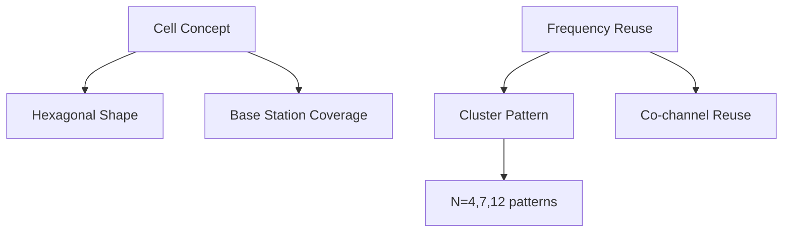
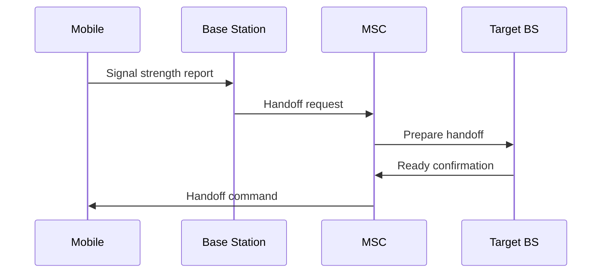
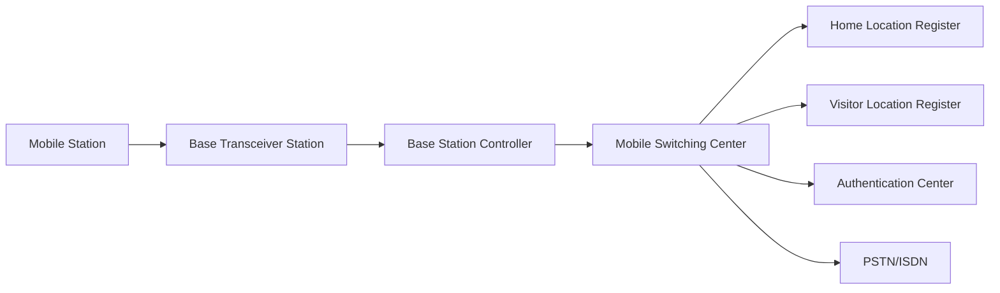
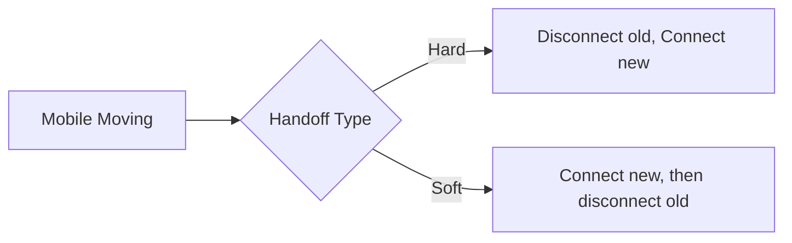
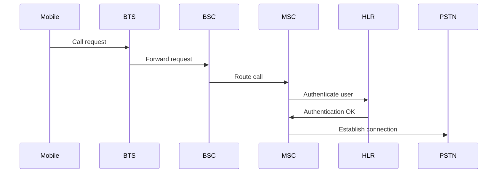
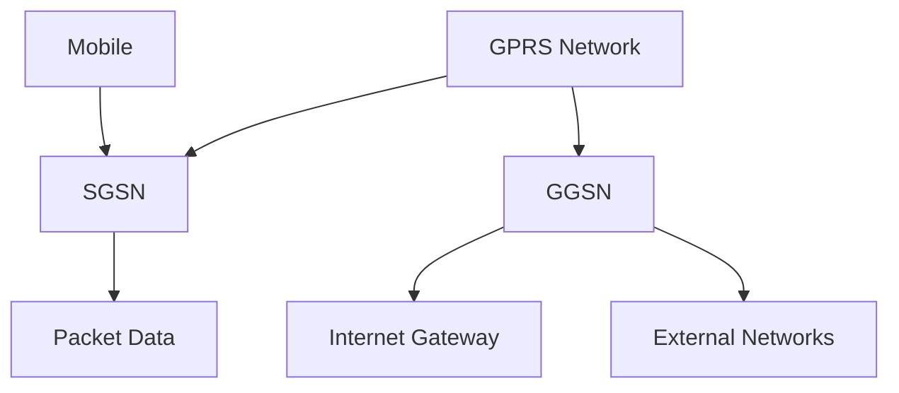
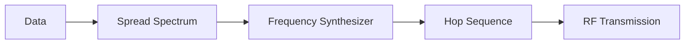
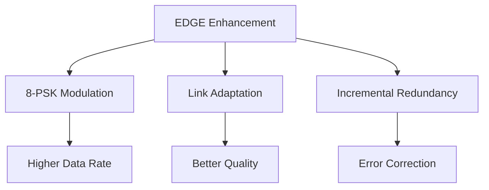
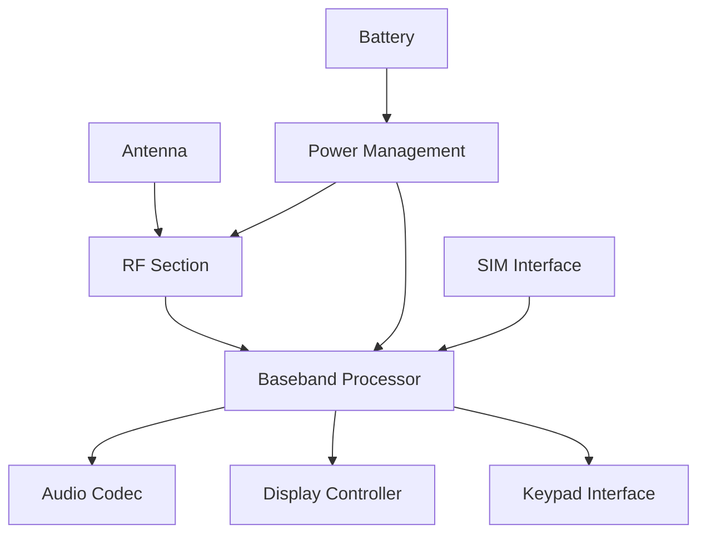
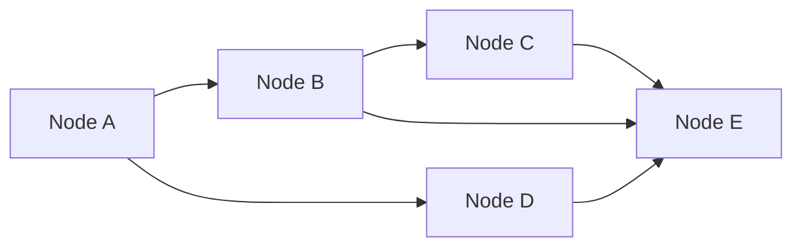

## Question 1(a) [3 marks]

**Explain selective cell.**

**Answer:**

**Table: Selective Cell Characteristics**

| Feature | Description |
|---------|-------------|
| Purpose | Provides coverage for specific areas |
| Size | Small coverage area |
| Application | Indoor locations, tunnels, buildings |
| Antenna | Directional antenna system |

- **Selective coverage**: Targets specific geographical areas needing signal
- **Indoor solution**: Primarily used for building coverage enhancement
- **Directional transmission**: Uses focused beam patterns for efficiency

**Mnemonic**: "Select Special Spots"

## Question 1(b) [4 marks]

**Draw and explain umbrella cell.**

**Answer:**

```goat
        Umbrella Cell
           +---+
          /     \
         /       \
        +         +
       / \       / \
      +   +     +   +
     Micro    Pico
     Cells    Cells
```

**Table: Umbrella Cell Features**

| Parameter | Description |
|-----------|-------------|
| Coverage | Large area coverage |
| Purpose | Overlays smaller cells |
| Handoff | Manages inter-cell transitions |
| Capacity | Handles overflow traffic |

- **Large coverage**: Provides wide area signal coverage over smaller cells
- **Traffic management**: Handles overflow from micro and pico cells
- **Seamless handoff**: Ensures continuous communication during movement

**Mnemonic**: "Umbrella Covers All"

## Question 1(c) [7 marks]

**What is the cell? Explain frequency reuse.**

**Answer:**

**Table: Cell and Frequency Reuse Concepts**

| Concept | Definition | Purpose |
|---------|------------|---------|
| Cell | Geographic coverage area | Service provision |
| Frequency Reuse | Same frequency in different cells | Spectrum efficiency |
| Cluster | Group of cells with unique frequencies | Interference control |
| Reuse Distance | Minimum distance between same frequencies | Signal quality |



- **Cell definition**: Geographical area covered by one base station antenna
- **Hexagonal pattern**: Most efficient shape for coverage without gaps
- **Frequency reuse**: Same frequencies used in non-adjacent cells for capacity
- **Cluster size**: Determines frequency reuse pattern (N=4,7,12)
- **Co-channel interference**: Controlled by minimum reuse distance

**Mnemonic**: "Cells Reuse Frequencies Efficiently"

## Question 1(c) OR [7 marks]

**Explain cellular concept in detail.**

**Answer:**

**Table: Cellular System Components**

| Component | Function | Benefit |
|-----------|----------|---------|
| Cell Division | Area split into cells | Coverage optimization |
| Base Stations | Serve individual cells | Signal transmission |
| Mobile Switching | Call routing | Network connectivity |
| Frequency Planning | Spectrum allocation | Interference control |


- **Area division**: Large service area divided into smaller hexagonal cells
- **Power control**: Low power transmitters reduce interference
- **Frequency efficiency**: Same frequencies reused in distant cells
- **Capacity increase**: More simultaneous users served
- **Seamless coverage**: Continuous service across all cells

**Mnemonic**: "Divide Area For Better Service"

## Question 2(a) [3 marks]

**Define full forms: (i) IMEI (ii) LTE (iii) GSM**

**Answer:**

**Table: Full Forms**

| Abbreviation | Full Form | Purpose |
|--------------|-----------|---------|
| IMEI | International Mobile Equipment Identity | Device identification |
| LTE | Long Term Evolution | 4G technology standard |
| GSM | Global System for Mobile Communication | 2G cellular standard |

**Mnemonic**: "Identity, Long-term, Global"

## Question 2(b) [4 marks]

**Explain MAHO in detail.**

**Answer:**

**Table: MAHO Characteristics**

| Feature | Description |
|---------|-------------|
| Full Form | Mobile Assisted Handoff |
| Function | Mobile helps in handoff decision |
| Measurement | Signal strength monitoring |
| Reporting | Mobile reports to network |



- **Mobile assistance**: Mobile unit measures neighboring cell signals
- **Signal reporting**: Continuous measurement reports sent to network
- **Decision support**: Network uses mobile data for handoff decisions
- **Quality improvement**: Better handoff decisions with mobile input

**Mnemonic**: "Mobile Assists Network Decisions"

## Question 2(c) [7 marks]

**Explain GSM architecture with diagram**

**Answer:**



**Table: GSM Architecture Components**

| Component | Function | Purpose |
|-----------|----------|---------|
| MS | Mobile Station | User equipment |
| BTS | Base Transceiver | Radio interface |
| BSC | Base Station Controller | Radio resource management |
| MSC | Mobile Switching Center | Call switching |
| HLR | Home Location Register | Subscriber database |
| VLR | Visitor Location Register | Temporary subscriber data |

- **Radio subsystem**: BTS and BSC handle radio communications
- **Network subsystem**: MSC, HLR, VLR manage calls and mobility
- **Database management**: HLR stores permanent, VLR stores temporary data
- **Authentication**: AuC provides security functions

**Mnemonic**: "Mobile Base Network Database"

## Question 2(a) OR [3 marks]

**Explain cell splitting.**

**Answer:**

**Table: Cell Splitting Process**

| Step | Action | Result |
|------|--------|--------|
| 1 | Reduce transmit power | Smaller coverage |
| 2 | Add new base stations | Fill coverage gaps |
| 3 | Frequency planning | Maintain interference control |
| 4 | Capacity increase | More users served |

- **Power reduction**: Original cell power decreased to shrink coverage
- **New cells**: Additional base stations installed in coverage gaps
- **Capacity gain**: More cells mean higher user capacity in same area

**Mnemonic**: "Split Cells Double Capacity"

## Question 2(b) OR [4 marks]

**What is handoff? Explain soft and hard handoffs.**

**Answer:**

**Table: Handoff Types Comparison**

| Type | Process | Technology | Quality |
|------|---------|------------|---------|
| Hard Handoff | Break-then-make | GSM, TDMA | Brief interruption |
| Soft Handoff | Make-then-break | CDMA | Seamless transition |



- **Handoff definition**: Process of transferring call from one cell to another
- **Hard handoff**: Connection broken before establishing new connection
- **Soft handoff**: New connection established before breaking old one
- **Quality difference**: Soft handoff provides better call quality

**Mnemonic**: "Hard Breaks, Soft Connects"

## Question 2(c) OR [7 marks]

**Explain GSM signal processing with diagram**

**Answer:**


**Table: GSM Signal Processing Stages**

| Stage | Function | Purpose |
|-------|----------|---------|
| Speech Codec | Voice compression | Bandwidth efficiency |
| Channel Coding | Error correction | Transmission reliability |
| Interleaving | Burst error protection | Data integrity |
| Encryption | Security | Privacy protection |
| Modulation | RF conversion | Air interface |

- **Speech processing**: Voice compressed using RPE-LTP codec
- **Error protection**: Convolutional coding adds redundancy
- **Security layer**: A5 algorithm encrypts data
- **Burst structure**: Data organized in time slots
- **Modulation**: GMSK modulation for RF transmission

**Mnemonic**: "Voice Coded Interleaved Encrypted Modulated"

## Question 3(a) [3 marks]

**Explain cell sectoring.**

**Answer:**

**Table: Cell Sectoring Benefits**

| Feature | Description |
|---------|-------------|
| Antenna Pattern | Directional instead of omnidirectional |
| Sectors | 3 or 6 sectors per cell |
| Capacity | 3x or 6x capacity increase |
| Interference | Reduced co-channel interference |

- **Directional antennas**: Replace omnidirectional with sector antennas
- **Capacity multiplication**: Each sector treated as separate cell
- **Interference reduction**: Directional pattern reduces interference

**Mnemonic**: "Sector Antennas Triple Capacity"

## Question 3(b) [4 marks]

**Explain GSM call procedure.**

**Answer:**



**Table: Call Setup Steps**

| Step | Process | Purpose |
|------|---------|---------|
| 1 | Authentication | User verification |
| 2 | Channel allocation | Resource assignment |
| 3 | Call routing | Path establishment |
| 4 | Connection setup | Communication link |

- **Authentication**: Network verifies subscriber identity
- **Resource allocation**: Traffic channel assigned to call
- **Routing**: Call path determined through network
- **Connection**: End-to-end communication established

**Mnemonic**: "Authenticate Allocate Route Connect"

## Question 3(c) [7 marks]

**Explain GPRS.**

**Answer:**

**Table: GPRS Features**

| Feature | Description | Benefit |
|---------|-------------|---------|
| Technology | General Packet Radio Service | Data service |
| Data Rate | Up to 114 kbps | High speed |
| Connection | Packet switched | Always on |
| Applications | Internet, email | Data services |



- **Packet switching**: Data transmitted in packets, not circuits
- **Always-on connection**: No dial-up required for data access
- **Higher speeds**: Significant improvement over circuit-switched data
- **New nodes**: SGSN and GGSN added to GSM architecture
- **Internet access**: Direct connection to IP networks

**Mnemonic**: "General Packet Radio Service"

## Question 3(a) OR [3 marks]

**Explain advantage of CDMA**

**Answer:**

**Table: CDMA Advantages**

| Advantage | Description |
|-----------|-------------|
| Capacity | Higher user capacity |
| Security | Built-in encryption |
| Quality | Better voice quality |
| Power | Efficient power control |

- **Increased capacity**: More users per frequency band
- **Enhanced security**: Spread spectrum provides natural encryption
- **Soft handoff**: Better call quality during handoffs

**Mnemonic**: "Capacity Security Quality"

## Question 3(b) OR [4 marks]

**Explain frequency hopping techniques.**

**Answer:**

**Table: Frequency Hopping Types**

| Type | Hopping Rate | Application |
|------|--------------|-------------|
| Slow FH | Less than symbol rate | GSM |
| Fast FH | Greater than symbol rate | Military |



- **Frequency hopping**: Carrier frequency changes according to pattern
- **Interference resistance**: Reduces effect of narrowband interference
- **Security enhancement**: Difficult to intercept hopping signals
- **GSM implementation**: Slow frequency hopping used for quality

**Mnemonic**: "Frequency Hops For Security"

## Question 3(c) OR [7 marks]

**Explain EDGE.**

**Answer:**

**Table: EDGE Specifications**

| Parameter | Value | Improvement |
|-----------|--------|-------------|
| Full Form | Enhanced Data rate for GSM Evolution | - |
| Data Rate | Up to 384 kbps | 3x GPRS |
| Modulation | 8-PSK | Higher order |
| Compatibility | GSM/GPRS | Backward compatible |



- **Enhanced modulation**: 8-PSK instead of GMSK increases data rate
- **Link adaptation**: Modulation scheme adapts to channel conditions
- **Incremental redundancy**: Improved error correction mechanism
- **Backward compatibility**: Works with existing GSM/GPRS infrastructure
- **3G stepping stone**: Bridge between 2G and 3G technologies

**Mnemonic**: "Enhanced Data Gets Excellence"

## Question 4(a) [3 marks]

**Draw FHSS transmitter block diagram**

**Answer:**

```goat
Data --> Modulator --> Frequency --> RF Amp --> Antenna
Input               Synthesizer                   
                         ^
                    PN Sequence
                    Generator
```

**Table: FHSS Components**

| Component | Function |
|-----------|----------|
| PN Generator | Produces hopping sequence |
| Frequency Synthesizer | Changes carrier frequency |
| Modulator | Modulates data |

**Mnemonic**: "Data Modulated Frequency Hops"

## Question 4(b) [4 marks]

**Explain call processing in CDMA**

**Answer:**

**Table: CDMA Call Processing**

| Phase | Process | Purpose |
|-------|---------|---------|
| Access | System access | Initial connection |
| Authentication | Identity verification | Security |
| Traffic | Communication | Data transfer |
| Release | Call termination | Resource cleanup |

- **System access**: Mobile acquires pilot channel and synchronizes
- **Authentication**: Network verifies subscriber credentials
- **Traffic state**: Active communication with power control
- **Call release**: Resources freed when call ends

**Mnemonic**: "Access Authenticate Transfer Release"

## Question 4(c) [7 marks]

**Draw OFDM receiver and explain its working**

**Answer:**

```goat
RF      --> Down    --> ADC --> Remove  --> FFT --> Parallel --> Channel --> Data
Input       Converter           Cyclic            to Serial    Decoder     Output
                                Prefix            Converter
```

**Table: OFDM Receiver Functions**

| Component | Function | Purpose |
|-----------|----------|---------|
| Down Converter | RF to baseband | Frequency conversion |
| ADC | Analog to digital | Signal digitization |
| Remove CP | Cyclic prefix removal | ISI elimination |
| FFT | Fast Fourier Transform | Subcarrier separation |
| Channel Decoder | Error correction | Data recovery |

- **RF processing**: Converts received RF signal to baseband
- **Digital conversion**: ADC samples the analog signal
- **Prefix removal**: Cyclic prefix removed to eliminate ISI
- **FFT processing**: Separates orthogonal subcarriers
- **Data recovery**: Channel decoding recovers original data

**Mnemonic**: "Receive Convert Remove Transform Decode"

## Question 4(a) OR [3 marks]

**Explain radiation hazard due to mobile.**

**Answer:**

**Table: Mobile Radiation Effects**

| Parameter | Value | Effect |
|-----------|--------|--------|
| SAR | Specific Absorption Rate | Tissue heating |
| Frequency | 900/1800 MHz | Penetration depth |
| Power | Transmit power | Exposure level |

- **SAR measurement**: Specific Absorption Rate measures energy absorption
- **Thermal effects**: High SAR can cause tissue heating
- **Safety limits**: International standards limit SAR values

**Mnemonic**: "SAR Safety Absorption Rate"

## Question 4(b) OR [4 marks]

**Explain Li-Po type batteries used in mobile handset.**

**Answer:**

**Table: Li-Po Battery Characteristics**

| Feature | Description | Advantage |
|---------|-------------|-----------|
| Chemistry | Lithium Polymer | High energy density |
| Shape | Flexible form factor | Design freedom |
| Weight | Lightweight | Portability |
| Charging | Fast charging | User convenience |

- **Polymer electrolyte**: Uses polymer instead of liquid electrolyte
- **Flexible packaging**: Can be shaped to fit device design
- **High energy density**: More capacity in smaller size
- **Fast charging**: Supports rapid charging protocols

**Mnemonic**: "Lithium Polymer Power"

## Question 4(c) OR [7 marks]

**Explain mobile handset block diagram.**

**Answer:**



**Table: Mobile Handset Components**

| Section | Function | Purpose |
|---------|----------|---------|
| RF Section | Radio frequency processing | Air interface |
| Baseband | Digital signal processing | Protocol handling |
| Audio Codec | Voice processing | Sound conversion |
| Power Management | Battery control | Power efficiency |
| SIM Interface | Subscriber identity | User authentication |

- **RF section**: Handles transmission and reception of radio signals
- **Baseband processor**: Implements communication protocols
- **Audio subsystem**: Processes voice and audio signals
- **Power management**: Controls battery usage and charging
- **User interface**: Display, keypad, and user interaction

**Mnemonic**: "Radio Baseband Audio Power Interface"

## Question 5(a) [3 marks]

**Compare CDMA and GSM**

**Answer:**

**Table: CDMA vs GSM Comparison**

| Feature | CDMA | GSM |
|---------|------|-----|
| Access Method | Code Division | Time Division |
| Capacity | Higher | Lower |
| Handoff | Soft | Hard |
| SIM Card | Not required | Required |

**Mnemonic**: "Code vs Time Division"

## Question 5(b) [4 marks]

**Explain HSDPA.**

**Answer:**

**Table: HSDPA Features**

| Feature | Description |
|---------|-------------|
| Full Form | High Speed Downlink Packet Access |
| Data Rate | Up to 14.4 Mbps |
| Technology | 3.5G enhancement |
| Direction | Downlink optimization |

- **3.5G technology**: Enhancement to 3G UMTS system
- **High speed downlink**: Optimized for download applications
- **Adaptive modulation**: QPSK to 16-QAM based on channel
- **Fast scheduling**: 2ms scheduling intervals

**Mnemonic**: "High Speed Download Access"

## Question 5(c) [7 marks]

**Explain architecture, features and advantage of Bluetooth.**

**Answer:**


**Table: Bluetooth Features**

| Feature | Description | Advantage |
|---------|-------------|-----------|
| Range | 10 meters | Personal area network |
| Frequency | 2.4 GHz ISM | Unlicensed band |
| Topology | Star/Scatternet | Flexible connections |
| Power | Low power | Battery efficiency |

**Table: Bluetooth Applications**

| Application | Use Case |
|-------------|----------|
| Audio | Wireless headphones |
| Data | File transfer |
| Input | Wireless keyboard/mouse |
| Networking | Internet sharing |

- **Short range**: Designed for personal area networks
- **Low power**: Optimized for battery-powered devices
- **Frequency hopping**: 79 channels for interference resistance
- **Master-slave**: One master can connect to 7 slaves
- **Applications**: Audio, data transfer, input devices

**Mnemonic**: "Blue Personal Area Network"

## Question 5(a) OR [3 marks]

**Explain basic concept of RFID.**

**Answer:**

**Table: RFID Components**

| Component | Function |
|-----------|----------|
| RFID Tag | Stores identification data |
| RFID Reader | Reads tag information |
| Antenna | RF communication |
| Backend System | Data processing |

- **Radio frequency identification**: Uses RF waves for identification
- **Contactless operation**: No physical contact required
- **Automatic identification**: Reads tags automatically in range

**Mnemonic**: "Radio Frequency Identifies"

## Question 5(b) OR [4 marks]

**Explain architecture of 5G system.**

**Answer:**

**Table: 5G Architecture Components**

| Component | Function |
|-----------|----------|
| gNodeB | 5G base station |
| AMF | Access and Mobility Function |
| SMF | Session Management Function |
| UPF | User Plane Function |

- **Service-based architecture**: Modular network functions
- **Network slicing**: Virtual networks for different services
- **Edge computing**: Processing closer to users
- **Massive MIMO**: Multiple antenna technology

**Mnemonic**: "Service Based Network Slicing"

## Question 5(c) OR [7 marks]

**Explain MANET in detail.**

**Answer:**

**Table: MANET Characteristics**

| Feature | Description | Benefit |
|---------|-------------|---------|
| Infrastructure | Infrastructure-less | No base stations needed |
| Mobility | Mobile nodes | Dynamic topology |
| Routing | Multi-hop routing | Extended coverage |
| Self-organizing | Automatic configuration | Easy deployment |



**Table: MANET vs Cellular Network**

| Parameter | MANET | Cellular |
|-----------|--------|----------|
| Infrastructure | None | Base stations required |
| Topology | Dynamic | Fixed |
| Range | Multi-hop | Single hop |
| Cost | Low | High infrastructure cost |

- **Mobile Ad-hoc Network**: Self-configuring network of mobile devices
- **No infrastructure**: Nodes communicate directly without base stations
- **Dynamic routing**: Routes change as nodes move
- **Multi-hop communication**: Messages relay through intermediate nodes
- **Applications**: Military, disaster recovery, sensor networks

**Mnemonic**: "Mobile Adhoc Network"
