## પ્રશ્ન 1(અ) [3 ગુણ]

**4G અને 5G સિસ્ટમની મુખ્ય વિશેષતાઓ લખો.**

**જવાબ**:

**મુખ્ય વિશેષતાઓ તુલના:**

| વિશેષતા | 4G સિસ્ટમ | 5G સિસ્ટમ |
|---------|-----------|-----------|
| **ડેટા સ્પીડ** | 100 Mbps સુધી | 10 Gbps સુધી |
| **લેટન્સી** | 30-50 ms | 1-10 ms |
| **ટેકનોલોજી** | LTE, OFDM | MIMO, Beamforming |
| **એપ્લિકેશન** | વિડિયો સ્ટ્રીમિંગ | IoT, AR/VR |

**મુખ્ય મુદ્દાઓ:**

- **4G**: OFDM મોડ્યુલેશન સાથે LTE ટેકનોલોજીનો ઉપયોગ હાઇ-સ્પીડ ડેટા માટે
- **5G**: અત્યંત ઓછી લેટન્સી સ્વાયત્ત વાહનો જેવી રીઅલ-ટાઇમ એપ્લિકેશન માટે સક્ષમ બનાવે છે
- **નેટવર્ક સ્લાઇસિંગ**: 5G ચોક્કસ એપ્લિકેશન માટે વર્ચ્યુઅલ નેટવર્કની મંજૂરી આપે છે

**યાદ રાખવા માટે:** "4G ઝડપી, 5G સુપર-ઝડપી"

---

## પ્રશ્ન 1(બ) [4 ગુણ]

**સેલ્યુલર મોબાઇલ સિસ્ટમમાં ફ્રીક્વન્સી રીયુઝનો કોન્સેપ્ટ સમજાવો.**

**જવાબ**:

**ડાયાગ્રામ:**

```goat
    F1      F2      F3
   +---+   +---+   +---+
   | A |   | B |   | C |
   +---+   +---+   +---+
    F4      F5      F6
   +---+   +---+   +---+
   | D |   | E |   | F |
   +---+   +---+   +---+
    F7      F1      F2
   +---+   +---+   +---+
   | G |   | A |   | B |
   +---+   +---+   +---+
```

**મુખ્ય મુદ્દાઓ:**

- **ફ્રીક્વન્સી રીયુઝ**: કેપેસિટી વધારવા માટે બિન-સંલગ્ન સેલમાં સમાન ફ્રીક્વન્સીનો ઉપયોગ
- **કો-ચેનલ અંતર**: સમાન ફ્રીક્વન્સીનો ઉપયોગ કરતા સેલ વચ્ચે ન્યૂનતમ અંતર
- **ક્લસ્ટર સાઇઝ**: અલગ ફ્રીક્વન્સીનો ઉપયોગ કરતા સેલનું જૂથ (સામાન્ય રીતે 3, 4, 7, 12)
- **કેપેસિટી વૃદ્ધિ**: મર્યાદિત સ્પેક્ટ્રમ સાથે વધુ વપરાશકર્તાઓને સેવા

**યાદ રાખવા માટે:** "સમાન ફ્રીક્વન્સી, અલગ સ્થળોએ"

---

## પ્રશ્ન 1(ક) [7 ગુણ]

**જો કોઈ ચોક્કસ FDD સેલ્યુલર ટેલિફોન સિસ્ટમને કુલ 33 MHz બેન્ડવિડ્થ ફાળવવામાં આવે છે જે ફુલ ડુપ્લેક્સ કોમ્યુનિકેશન પ્રદાન કરવા માટે બે 25 kHz સિમ્પ્લેક્સ ચેનલોનો ઉપયોગ કરે છે. જો ફાળવેલ સ્પેક્ટ્રમનો 1 મેગાહર્ટ્ઝ કંટ્રોલ ચેનલોને સમર્પિત કરવામાં આવે છે, તો 7 ના ક્લસ્ટર કદ માટે કંટ્રોલ ચેનલો અને વોઇસ ચેનલોનું સમાન વિતરણ નક્કી કરો.**

**જવાબ**:

**આપેલ માહિતી:**

- કુલ બેન્ડવિડ્થ = 33 MHz
- ચેનલ બેન્ડવિડ્થ = 25 kHz (સિમ્પ્લેક્સ)
- કંટ્રોલ સ્પેક્ટ્રમ = 1 MHz
- ક્લસ્ટર સાઇઝ = 7

**ગણતરીઓ:**

**પગલું 1: ટ્રાફિક માટે ઉપલબ્ધ સ્પેક્ટ્રમ**
ટ્રાફિક સ્પેક્ટ્રમ = 33 - 1 = 32 MHz

**પગલું 2: કુલ ડુપ્લેક્સ ચેનલો**
દરેક ડુપ્લેક્સ ચેનલને 2 × 25 kHz = 50 kHz જોઈએ
કુલ ચેનલો = 32 MHz ÷ 50 kHz = 640 ચેનલો

**પગલું 3: કંટ્રોલ ચેનલો**
કંટ્રોલ ચેનલો = 1 MHz ÷ 25 kHz = 40 ચેનલો

**પગલું 4: પ્રતિ સેલ વિતરણ**

- પ્રતિ સેલ વોઇસ ચેનલો = 640 ÷ 7 ≈ 91 ચેનલો
- પ્રતિ સેલ કંટ્રોલ ચેનલો = 40 ÷ 7 ≈ 6 ચેનલો

**અંતિમ વિતરણ કોષ્ટક:**

| પેરામીટર | કુલ | પ્રતિ સેલ |
|-----------|-----|----------|
| **વોઇસ ચેનલો** | 640 | 91 |
| **કંટ્રોલ ચેનલો** | 40 | 6 |
| **કુલ ચેનલો** | 680 | 97 |

**યાદ રાખવા માટે:** "કુલને ક્લસ્ટરથી ભાગો"

---

## પ્રશ્ન 1(ક OR) [7 ગુણ]

**સેલના પ્રકારોની યાદી બનાવો અને દરેકને સમજાવો.**

**જવાબ**:

**સેલના પ્રકારો કોષ્ટક:**

| સેલ પ્રકાર | કવરેજ | પાવર | એપ્લિકેશન |
|-----------|--------|-------|------------|
| **મેક્રો સેલ** | 1-30 km | હાઇ | ગ્રામીણ વિસ્તારો |
| **માઇક્રો સેલ** | 100m-1km | મધ્યમ | શહેરી વિસ્તારો |
| **પિકો સેલ** | 10-100m | લો | બિલ્ડિંગો |
| **ફેમ્ટો સેલ** | 10-50m | ખૂબ લો | ઘરો |

**વિગતવાર સમજૂતી:**

**મેક્રો સેલ:**

- **કવરેજ**: મોટા ભૌગોલિક વિસ્તારો (1-30 km ત્રિજ્યા)
- **પાવર**: હાઇ ટ્રાન્સમિશન પાવર (40W સુધી)
- **ઉપયોગ**: ઓછી વપરાશકર્તા ઘનતાવાળા ગ્રામીણ અને ઉપનગરીય વિસ્તારો

**માઇક્રો સેલ:**

- **કવરેજ**: મધ્યમ વિસ્તારો (100m થી 1km ત્રિજ્યા)
- **પાવર**: મધ્યમ ટ્રાન્સમિશન પાવર (1-10W)
- **ઉપયોગ**: શહેરી વિસ્તારો, હાઇવે કવરેજ

**પિકો સેલ:**

- **કવરેજ**: નાના ઇન્ડોર/આઉટડોર વિસ્તારો (10-100m)
- **પાવર**: લો ટ્રાન્સમિશન પાવર (100mW-1W)
- **ઉપયોગ**: શોપિંગ મોલ, એરપોર્ટ, ઓફિસો

**અમ્બ્રેલા સેલ:**

- **વિશેષ પ્રકાર**: અનેક નાના સેલને આવરી લે છે
- **હેતુ**: હાઇ-સ્પીડ મોબાઇલ વપરાશકર્તાઓને હેન્ડલ કરે છે
- **ફાયદો**: ઝડપથી ચાલતા વપરાશકર્તાઓ માટે હેન્ડઓફ ઘટાડે છે

**યાદ રાખવા માટે:** "મેક્રો-માઇક્રો-પિકો-ફેમ્ટો = મોટાથી નાના"

---

## પ્રશ્ન 2(અ) [3 ગુણ]

**સેલ અને ક્લસ્ટર વ્યાખ્યાયિત કરો.**

**જવાબ**:

**વ્યાખ્યાઓ:**

**સેલ:**

- **વ્યાખ્યા**: એક બેઝ સ્ટેશન દ્વારા આવરાયેલ ભૌગોલિક વિસ્તાર
- **આકાર**: આયોજન હેતુઓ માટે સામાન્ય રીતે ષટ્કોણ
- **કાર્ય**: તેના કવરેજ વિસ્તારમાં મોબાઇલ વપરાશકર્તાઓને સેવા આપે છે

**ક્લસ્ટર:**

- **વ્યાખ્યા**: અલગ ફ્રીક્વન્સી સેટનો ઉપયોગ કરતા સેલનું જૂથ
- **હેતુ**: ફ્રીક્વન્સી રીયુઝ પેટર્ન સક્ષમ બનાવે છે
- **સામાન્ય કદ**: પ્રતિ ક્લસ્ટર 3, 4, 7, 12 સેલ

**સેલ વિ. ક્લસ્ટર કોષ્ટક:**

| પેરામીટર | સેલ | ક્લસ્ટર |
|-----------|-----|---------|
| **એકમ** | એકલ કવરેજ વિસ્તાર | સેલનું જૂથ |
| **ફ્રીક્વન્સી** | એક ફ્રીક્વન્સી સેટ | અનેક ફ્રીક્વન્સી સેટ |
| **રીયુઝ** | નજીકમાં રીયુઝ ન કરી શકાય | ફ્રીક્વન્સી રીયુઝ સક્ષમ બનાવે છે |

**યાદ રાખવા માટે:** "સેલ = એક વિસ્તાર, ક્લસ્ટર = જૂથ વિસ્તારો"

---

## પ્રશ્ન 2(બ) [4 ગુણ]

**ક્ષમતા અને ઇન્ટર્ફેરન્સ પર ક્લસ્ટરના સાઇઝની અસર સમજાવો.**

**જવાબ**:

**અસરો કોષ્ટક:**

| ક્લસ્ટર સાઇઝ | ક્ષમતા | ઇન્ટર્ફેરન્સ | કો-ચેનલ અંતર |
|--------------|--------|-------------|---------------|
| **નાનું (3,4)** | હાઇ | હાઇ | ટૂંકું |
| **મોટું (7,12)** | લો | લો | લાંબું |

**મુખ્ય અસરો:**

**ક્ષમતા પર:**

- **નાનું ક્લસ્ટર**: પ્રતિ સેલ વધુ ચેનલો, વધુ ક્ષમતા
- **મોટું ક્લસ્ટર**: પ્રતિ સેલ ઓછા ચેનલો, ઓછી ક્ષમતા
- **ફોર્મ્યુલા**: પ્રતિ સેલ ચેનલો = કુલ ચેનલો ÷ ક્લસ્ટર સાઇઝ

**ઇન્ટર્ફેરન્સ પર:**

- **નાનું ક્લસ્ટર**: વધુ કો-ચેનલ ઇન્ટર્ફેરન્સ
- **મોટું ક્લસ્ટર**: ઓછું કો-ચેનલ ઇન્ટર્ફેરન્સ
- **ટ્રેડ-ઓફ**: ક્ષમતા વિ. ગુણવત્તા

**કો-ચેનલ અંતર:**

- **સંબંધ**: D = R√(3N) જ્યાં N = ક્લસ્ટર સાઇઝ
- **અસર**: મોટું N મતલબ કો-ચેનલ સેલ વચ્ચે મોટું અંતર

**યાદ રાખવા માટે:** "નાનું ક્લસ્ટર = વધુ ક્ષમતા, વધુ ઇન્ટર્ફેરન્સ"

---

## પ્રશ્ન 2(ક) [7 ગુણ]

**IS-95, CDMA2000 અને WCDMA ની મુખ્ય વિશેષતાઓ લખો.**

**જવાબ**:

**તુલના કોષ્ટક:**

| વિશેષતા | IS-95 | CDMA2000 | WCDMA |
|---------|-------|-----------|-------|
| **જનરેશન** | 2G | 3G | 3G |
| **ડેટા રેટ** | 14.4 kbps | 2 Mbps | 2 Mbps |
| **ચિપ રેટ** | 1.2288 Mcps | 3.6864 Mcps | 3.84 Mcps |
| **બેન્ડવિડ્થ** | 1.25 MHz | 1.25 MHz | 5 MHz |

**IS-95 વિશેષતાઓ:**

- **ટેકનોલોજી**: પ્રથમ કોમર્શિયલ CDMA સિસ્ટમ
- **વોઇસ ક્વોલિટી**: કેટલીક પરિસ્થિતિઓમાં GSM કરતાં વધુ સારી
- **સોફ્ટ હેન્ડઓફ**: હેન્ડઓફ દરમિયાન અનેક કનેક્શન જાળવે છે
- **પાવર કંટ્રોલ**: ચોક્કસ પાવર કંટ્રોલ ઇન્ટર્ફેરન્સ ઘટાડે છે

**CDMA2000 વિશેષતાઓ:**

- **બેકવર્ડ કમ્પેટિબિલિટી**: IS-95 નેટવર્ક સાથે કામ કરે છે
- **હાઇ ડેટા રેટ**: 1xEV-DO માટે 2 Mbps સુધી
- **મલ્ટિમીડિયા**: વોઇસ, ડેટા અને વિડિયોને સપોર્ટ કરે છે
- **કાર્યક્ષમતા**: IS-95 કરતાં વધુ સારી સ્પેક્ટ્રમ કાર્યક્ષમતા

**WCDMA વિશેષતાઓ:**

- **ગ્લોબલ સ્ટાન્ડર્ડ**: 3G માટે વિશ્વવ્યાપી ઉપયોગ
- **હાઇ કેપેસિટી**: વધુ સાથે-સાથે વપરાશકર્તાઓને સપોર્ટ કરે છે
- **QoS સપોર્ટ**: એપ્લિકેશન માટે અલગ સર્વિસ ક્લાસ
- **ઇન્ટરનેશનલ રોમિંગ**: ગ્લોબલ કમ્પેટિબિલિટી

**યાદ રાખવા માટે:** "IS-95 પ્રથમ, CDMA2000 ઝડપી, WCDMA ગ્લોબલ"

---

## પ્રશ્ન 2(અ OR) [3 ગુણ]

**સેલ સ્પ્લિટિંગ સમજાવો.**

**જવાબ**:

**વ્યાખ્યા:**
સેલ સ્પ્લિટિંગ એ ભીડભાડવાળા સેલને નાના સેલમાં વિભાજિત કરીને સિસ્ટમ ક્ષમતા વધારવાની તકનીક છે.

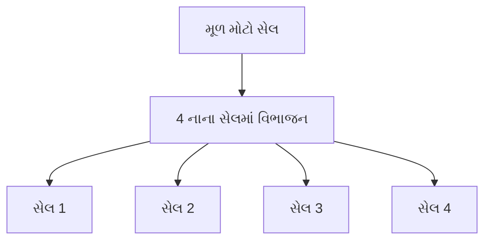

**પ્રક્રિયા:**

- **પગલું 1**: ઉચ્ચ ટ્રાફિક સાથે ભીડભાડવાળા સેલની ઓળખ
- **પગલું 2**: ઓછી પાવર સાથે નવા બેઝ સ્ટેશન સ્થાપિત કરો
- **પગલું 3**: મૂળ બેઝ સ્ટેશનની પાવર ઘટાડો
- **પગલું 4**: અનેક નાના કવરેજ વિસ્તારો બનાવો

**ફાયદા:**

- **ક્ષમતા વૃદ્ધિ**: સમાન વિસ્તારમાં વધુ ચેનલો ઉપલબ્ધ
- **વધુ સારી સિગ્નલ ક્વોલિટી**: ટૂંકા અંતર સિગ્નલ મજબૂતાઈ સુધારે છે

**યાદ રાખવા માટે:** "મોટા સેલને નાના સેલમાં વહેંચો"

---

## પ્રશ્ન 2(બ OR) [4 ગુણ]

**GSM માં HLR અને VLR ના કાર્યો લખો.**

**જવાબ**:

**કાર્યો કોષ્ટક:**

| ડેટાબેઝ | પૂરું નામ | મુખ્ય કાર્યો |
|----------|-----------|-------------|
| **HLR** | Home Location Register | કાયમી સબ્સ્ક્રાઇબર ડેટા |
| **VLR** | Visitor Location Register | અસ્થાયી વિઝિટર ડેટા |

**HLR કાર્યો:**

- **સબ્સ્ક્રાઇબર પ્રોફાઇલ**: કાયમી સબ્સ્ક્રાઇબર માહિતી સંગ્રહિત કરે છે (IMSI, સેવાઓ)
- **લોકેશન ટ્રેકિંગ**: સબ્સ્ક્રાઇબરનું વર્તમાન લોકેશન એરિયા જાળવે છે
- **ઓથેન્ટિકેશન**: સિક્યુરિટી માટે ઓથેન્ટિકેશન કીઝ પ્રદાન કરે છે
- **સર્વિસ મેનેજમેન્ટ**: સબ્સ્ક્રાઇબ કરેલી સેવાઓ અને પ્રતિબંધોને નિયંત્રિત કરે છે

**VLR કાર્યો:**

- **અસ્થાયી સંગ્રહ**: વિઝિટિંગ સબ્સ્ક્રાઇબર ડેટા અસ્થાયી રીતે સંગ્રહિત કરે છે
- **સ્થાનિક સેવાઓ**: રોમિંગ સબ્સ્ક્રાઇબર માટે સેવાઓ સક્ષમ બનાવે છે
- **કોલ રાઉટિંગ**: વિઝિટિંગ સબ્સ્ક્રાઇબર માટે કોલ રાઉટિંગમાં મદદ કરે છે
- **ઓથેન્ટિકેશન કોપી**: HLR થી ઓથેન્ટિકેશન ડેટાની કોપી જાળવે છે

**ઇન્ટરેક્શન:**

- સબ્સ્ક્રાઇબર નવા વિસ્તારમાં રોમ કરે ત્યારે HLR VLR ને અપડેટ કરે છે
- રજિસ્ટ્રેશન દરમિયાન VLR HLR પાસેથી સબ્સ્ક્રાઇબર ડેટાની વિનંતી કરે છે

**યાદ રાખવા માટે:** "HLR = ઘરનો ડેટા, VLR = વિઝિટરનો ડેટા"

---

## પ્રશ્ન 2(ક OR) [7 ગુણ]

**RFID ટેકનોલોજીનું વર્ણન કરો.**

**જવાબ**:

**RFID ઓવરવ્યુ:**
Radio Frequency Identification વસ્તુઓ સાથે જોડાયેલા ટેગને ઓળખવા અને ટ્રેક કરવા માટે ઇલેક્ટ્રોમેગ્નેટિક ફીલ્ડનો ઉપયોગ કરે છે.

**સિસ્ટમ ઘટકો:**

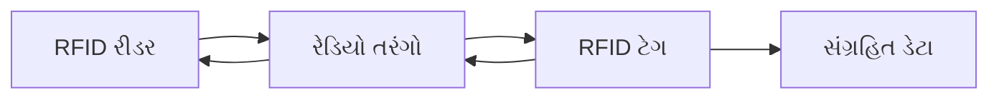

**પ્રકારો કોષ્ટક:**

| પ્રકાર | પાવર સોર્સ | રેન્જ | એપ્લિકેશન |
|------|-----------|------|------------|
| **પેસિવ** | રીડરની ઊર્જા | 0.1-10m | એક્સેસ કાર્ડ |
| **એક્ટિવ** | આંતરિક બેટરી | 10-100m | વાહન ટ્રેકિંગ |
| **સેમી-પેસિવ** | બેટરી + રીડર | 1-30m | ટેમ્પરેચર સેન્સર |

**મુખ્ય વિશેષતાઓ:**

- **લાઇન ઓફ સાઇટ નહીં**: સીધા દૃશ્ય સંપર્ક વિના કામ કરે છે
- **મલ્ટિપલ રીડિંગ**: એકસાથે અનેક ટેગ વાંચી શકે છે
- **ડેટા સ્ટોરેજ**: માહિતી સંગ્રહિત કરી અને અપડેટ કરી શકે છે
- **ટકાઉપણું**: પર્યાવરણીય પરિસ્થિતિઓ સામે પ્રતિરોધક

**એપ્લિકેશન:**

- **ઇન્વેન્ટરી મેનેજમેન્ટ**: વેરહાઉસ અને રિટેલ ટ્રેકિંગ
- **એક્સેસ કંટ્રોલ**: બિલ્ડિંગ અને વાહન એક્સેસ
- **પેમેન્ટ સિસ્ટમ**: કોન્ટેક્ટલેસ પેમેન્ટ કાર્ડ
- **સપ્લાઇ ચેઇન**: ઉત્પાદનથી વેચાણ સુધી પ્રોડક્ટ ટ્રેકિંગ

**ફાયદા:**

- **ઝડપી રીડિંગ**: સ્કેનિંગ વિના તાત્કાલિક ઓળખ
- **ઓટોમેશન**: મેન્યુઅલ ડેટા એન્ટ્રી ભૂલો ઘટાડે છે
- **રીઅલ-ટાઇમ ટ્રેકિંગ**: એસેટનું સતત મોનિટરિંગ

**યાદ રાખવા માટે:** "રેડિયો ફ્રીક્વન્સી બધું ઓળખે છે"

---

## પ્રશ્ન 3(અ) [3 ગુણ]

**GSM આર્કિટેક્ચર દોરો.**

**જવાબ**:

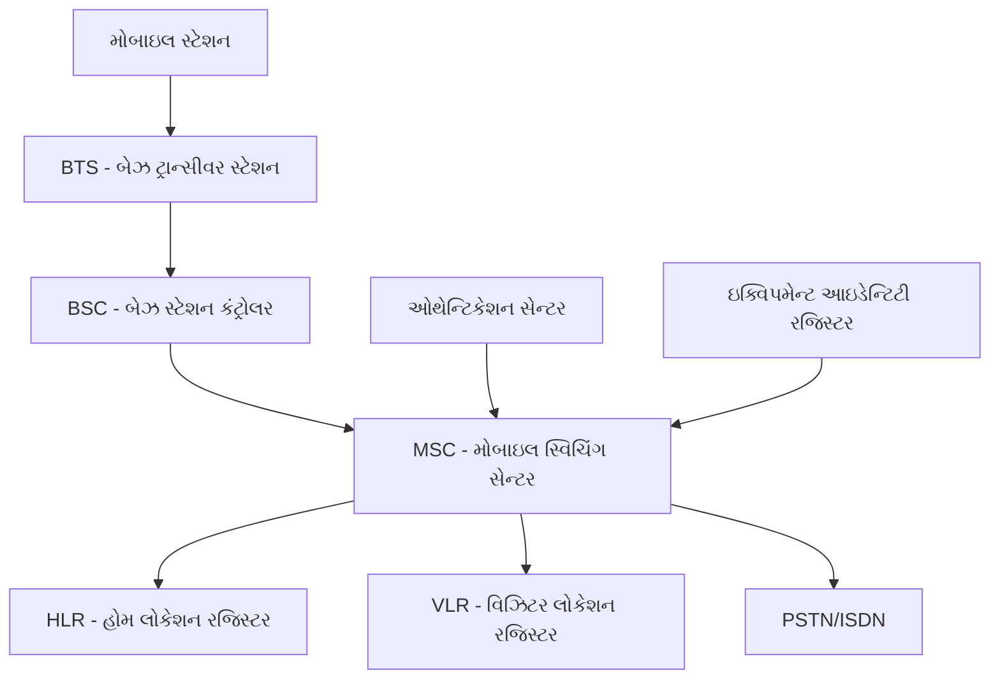

**ઘટકો:**

- **MS**: મોબાઇલ સ્ટેશન (હેન્ડસેટ + SIM)
- **BTS**: મોબાઇલ સાથે રેડિયો ઇન્ટરફેસ
- **BSC**: અનેક BTS નિયંત્રિત કરે છે, હેન્ડઓફ હેન્ડલ કરે છે
- **MSC**: સ્વિચિંગ અને કોલ કંટ્રોલ
- **HLR/VLR**: સબ્સ્ક્રાઇબર માહિતી માટે ડેટાબેઝ

**યાદ રાખવા માટે:** "મોબાઇલ BTS-BSC-MSC મારફતે વાત કરે છે"

---

## પ્રશ્ન 3(બ) [4 ગુણ]

**GSM 900 ના સ્પેશિફિકેશન લખો.**

**જવાબ**:

**GSM 900 સ્પેશિફિકેશન કોષ્ટક:**

| પેરામીટર | સ્પેશિફિકેશન |
|-----------|---------------|
| **ફ્રીક્વન્સી બેન્ડ** | 890-915 MHz (અપલિંક), 935-960 MHz (ડાઉનલિંક) |
| **ચેનલ સ્પેસિંગ** | 200 kHz |
| **કુલ ચેનલો** | 124 ચેનલો |
| **મોડ્યુલેશન** | GMSK (ગૌસિયન MSK) |
| **એક્સેસ મેથડ** | TDMA/FDMA |
| **ફ્રેમ ડ્યુરેશન** | 4.615 ms |
| **ટાઇમ સ્લોટ** | પ્રતિ ફ્રેમ 8 |
| **સ્પીચ કોડિંગ** | 13 kbps RPE-LTP |

**મુખ્ય વિશેષતાઓ:**

- **ડિજિટલ ટ્રાન્સમિશન**: એનાલોગ કરતાં વધુ સારી વોઇસ ક્વોલિટી
- **ઇન્ટરનેશનલ રોમિંગ**: ગ્લોબલ કમ્પેટિબિલિટી સ્ટાન્ડર્ડ
- **સિક્યુરિટી**: એન્ક્રિપ્શન અને ઓથેન્ટિકેશન બિલ્ટ-ઇન
- **SMS સપોર્ટ**: શોર્ટ મેસેજ સર્વિસ ક્ષમતા

**કવરેજ:**

- **સેલ રેડિયસ**: 35 km સુધી (ગ્રામીણ વિસ્તારો)
- **પાવર ક્લાસ**: 0.8W થી 20W સુધી 5 ક્લાસ

**યાદ રાખવા માટે:** "900 MHz, 200 kHz સ્પેસિંગ, 8 ટાઇમ સ્લોટ"

---

## પ્રશ્ન 3(ક) [7 ગુણ]

**GSM માં મોબાઇલ થી લેન્ડલાઇન અને લેન્ડલાઇન થી મોબાઇલ કોલ પ્રક્રિયા સમજાવો.**

**જવાબ**:

**મોબાઇલ થી લેન્ડલાઇન કોલ પ્રક્રિયા:**

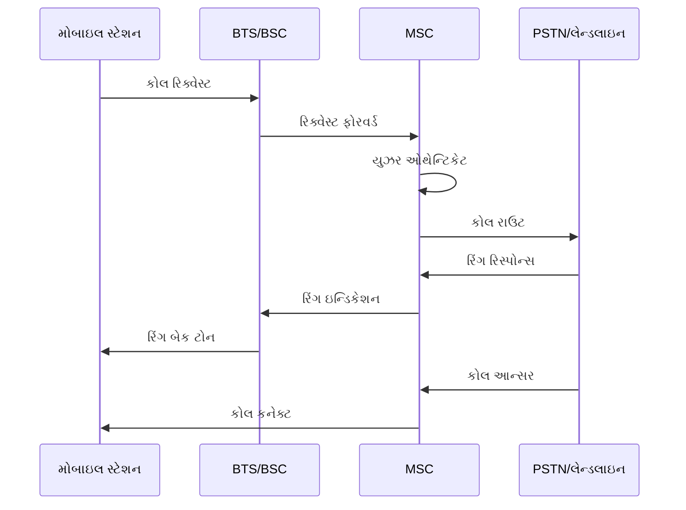

**પગલાં:**

1. **કોલ શરૂઆત**: મોબાઇલ લેન્ડલાઇન નંબર ડાયલ કરે છે
2. **ચેનલ એસાઇનમેન્ટ**: BSC ટ્રાફિક ચેનલ એસાઇન કરે છે
3. **ઓથેન્ટિકેશન**: MSC સબ્સ્ક્રાઇબર વેરિફાઇ કરે છે
4. **રાઉટિંગ**: MSC કોલને PSTN ગેટવે પર રાઉટ કરે છે
5. **કનેક્શન**: એન્ડ-ટુ-એન્ડ કનેક્શન સ્થાપિત થાય છે

**લેન્ડલાઇન થી મોબાઇલ કોલ પ્રક્રિયા:**

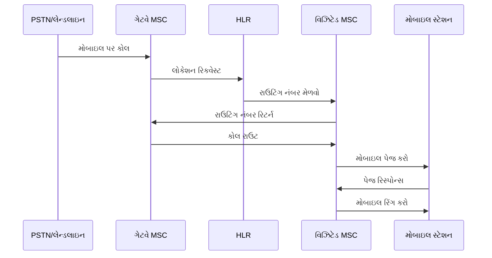

**પગલાં:**

1. **કોલ રિસેપ્શન**: PSTN મોબાઇલ નંબર પર કોલ મેળવે છે
2. **HLR ક્વેરી**: ગેટવે MSC લોકેશન માટે HLR ને ક્વેરી કરે છે
3. **લોકેશન અપડેટ**: HLR વર્તમાન MSC માહિતી પ્રદાન કરે છે
4. **પેજિંગ**: વિઝિટેડ MSC લોકેશન એરિયામાં મોબાઇલ પેજ કરે છે
5. **કનેક્શન**: મોબાઇલ જવાબ આપે છે અને કોલ કનેક્ટ થાય છે

**મુખ્ય તફાવતો:**

- **મોબાઇલ ઓરિજિનેટિંગ**: સર્વિંગ MSC મારફતે સીધું રાઉટિંગ
- **મોબાઇલ ટર્મિનેટિંગ**: HLR મારફતે લોકેશન લુકઅપ જરૂરી

**યાદ રાખવા માટે:** "મોબાઇલ આઉટ = સીધું, મોબાઇલ ઇન = પહેલા શોધો"

---

## પ્રશ્ન 3(અ OR) [3 ગુણ]

**ફાસ્ટ અને સ્લો ફ્રીક્વન્સી હોપિંગ સમજાવો.**

**જવાબ**:

**ફ્રીક્વન્સી હોપિંગ પ્રકારો:**

**ફાસ્ટ વિ. સ્લો હોપિંગ કોષ્ટક:**

| પેરામીટર | ફાસ્ટ હોપિંગ | સ્લો હોપિંગ |
|-----------|-------------|-------------|
| **હોપ રેટ** | > સિમ્બોલ રેટ | < સિમ્બોલ રેટ |
| **પ્રતિ હોપ સિમ્બોલ** | < 1 | > 1 |
| **જટિલતા** | હાઇ | લો |
| **GSM ઉપયોગ** | ઉપયોગ નથી | ઉપયોગ (217 hops/sec) |

**ફાસ્ટ ફ્રીક્વન્સી હોપિંગ:**

- **વ્યાખ્યા**: પ્રતિ સિમ્બોલ અનેક વખત ફ્રીક્વન્સી બદલાય છે
- **લક્ષણો**: ખૂબ હાઇ હોપ રેટ, જટિલ અમલીકરણ
- **ફાયદો**: ઉત્કૃષ્ટ ઇન્ટર્ફેરન્સ પ્રતિકાર

**સ્લો ફ્રીક્વન્સી હોપિંગ:**

- **વ્યાખ્યા**: પ્રતિ ફ્રીક્વન્સી અનેક સિમ્બોલ ટ્રાન્સમિટ થાય છે
- **GSM અમલીકરણ**: પ્રતિ સેકન્ડ 217 હોપ્સ
- **ફાયદો**: અમલીકરણ સરળ, અસરકારક ઇન્ટર્ફેરન્સ એવરેજિંગ

**યાદ રાખવા માટે:** "ફાસ્ટ = પ્રતિ સિમ્બોલ અનેક હોપ્સ, સ્લો = પ્રતિ હોપ અનેક સિમ્બોલ"

---

## પ્રશ્ન 3(બ OR) [4 ગુણ]

**GSM માં ઓથેન્ટિકેશન પ્રક્રિયા સમજાવો.**

**જવાબ**:

**ઓથેન્ટિકેશન પ્રક્રિયા:**

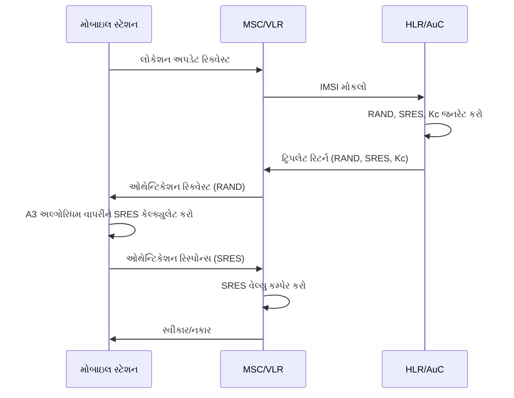

**મુખ્ય ઘટકો:**

- **RAND**: રેન્ડમ નંબર (128 બિટ્સ)
- **SRES**: સાઇન્ડ રિસ્પોન્સ (32 બિટ્સ)
- **Kc**: સાઇફર કી (64 બિટ્સ)
- **Ki**: વ્યક્તિગત સબ્સ્ક્રાઇબર ઓથેન્ટિકેશન કી

**પ્રક્રિયા પગલાં:**

1. **ચેલેન્જ**: નેટવર્ક રેન્ડમ નંબર (RAND) મોકલે છે
2. **રિસ્પોન્સ**: મોબાઇલ Ki અને RAND વાપરીને SRES કેલ્ક્યુલેટ કરે છે
3. **વેરિફિકેશન**: નેટવર્ક મળેલ અને અપેક્ષિત SRES સરખાવે છે
4. **પરિણામ**: ઓથેન્ટિકેશન સફળતા અથવા નિષ્ફળતા

**સિક્યુરિટી વિશેષતાઓ:**

- **મ્યુચ્યુઅલ ઓથેન્ટિકેશન**: નકલી બેઝ સ્ટેશનને અટકાવે છે
- **યુનિક કીઝ**: દરેક સબ્સ્ક્રાઇબરની વ્યક્તિગત Ki
- **ચેલેન્જ-રિસ્પોન્સ**: રિપ્લે એટેકને અટકાવે છે

**યાદ રાખવા માટે:** "રેન્ડમ ચેલેન્જ, સાઇન્ડ રિસ્પોન્સ, સરખાવો અને સ્વીકારો"

---

## પ્રશ્ન 3(ક OR) [7 ગુણ]

**GSM માં સિગ્નલ પ્રોસેસિંગનો બ્લોક ડાયાગ્રામ દોરો અને સમજાવો.**

**જવાબ**:

**GSM સિગ્નલ પ્રોસેસિંગ બ્લોક ડાયાગ્રામ:**

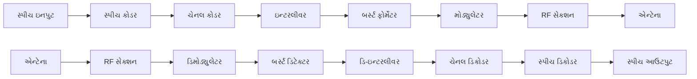

**ટ્રાન્સમિટર પ્રોસેસિંગ:**

**સ્પીચ કોડિંગ:**

- **કાર્ય**: એનાલોગ સ્પીચને 13 kbps ડિજિટલમાં કન્વર્ટ કરે છે
- **અલ્ગોરિધમ**: RPE-LTP (Regular Pulse Excitation - Long Term Prediction)
- **ફ્રેમ સાઇઝ**: 20 ms સ્પીચ ફ્રેમ્સ

**ચેનલ કોડિંગ:**

- **હેતુ**: એરર કરેક્શન માટે રિડન્ડન્સી ઉમેરે છે
- **પ્રકારો**: કન્વોલ્યુશનલ કોડિંગ, બ્લોક કોડિંગ
- **આઉટપુટ**: સુરક્ષિત 22.8 kbps ડેટા સ્ટ્રીમ

**ઇન્ટરલીવિંગ:**

- **કાર્ય**: કોડેડ બિટને અનેક ટાઇમ સ્લોટમાં ફેલાવે છે
- **ફાયદો**: ફેડિંગથી બર્સ્ટ એરરનો સામનો કરે છે
- **પ્રકારો**: 8 ટાઇમ સ્લોટ પર બ્લોક ઇન્ટરલીવિંગ

**બર્સ્ટ ફોર્મેટિંગ:**

- **પ્રક્રિયા**: ડેટાને GSM બર્સ્ટ સ્ટ્રક્ચરમાં વ્યવસ્થિત કરે છે
- **ઘટકો**: ટ્રેનિંગ સીક્વન્સ, ગાર્ડ બિટ્સ, ડેટા બિટ્સ
- **પ્રકારો**: નોર્મલ બર્સ્ટ, એક્સેસ બર્સ્ટ, સિંક બર્સ્ટ

**મોડ્યુલેશન:**

- **તકનીક**: GMSK (Gaussian Minimum Shift Keying)
- **બેન્ડવિડ્થ**: 200 kHz ચેનલ સ્પેસિંગ
- **સિમ્બોલ રેટ**: 270.833 kbps

**રિસીવર પ્રોસેસિંગ:**

- **ડિમોડ્યુલેશન**: RF સિગ્નલમાંથી ડિજિટલ બિટ્સ મેળવે છે
- **ઇક્વલાઇઝેશન**: મલ્ટિપાથ ડિસ્ટોર્શનની ભરપાઈ કરે છે
- **એરર કરેક્શન**: ચેનલ કોડિંગ રિડન્ડન્સીનો ઉપયોગ કરે છે
- **સ્પીચ ડિકોડિંગ**: મૂળ સ્પીચ પુનઃનિર્માણ કરે છે

**મુખ્ય વિશેષતાઓ:**

- **ડિજિટલ પ્રોસેસિંગ**: બધી ઓપરેશન ડિજિટલ ડોમેનમાં
- **એરર પ્રોટેક્શન**: અનેક સ્તરોનું એરર કરેક્શન
- **અડેપ્ટિવ**: પેરામીટર ચેનલ કન્ડિશન મુજબ એડજસ્ટ થાય છે

**યાદ રાખવા માટે:** "સ્પીચ-કોડ-ઇન્ટરલીવ-બર્સ્ટ-મોડ્યુલેટ-ટ્રાન્સમિટ"

---

## પ્રશ્ન 4(અ) [3 ગુણ]

**બેઝબેન્ડ સેક્શનનો બ્લોક ડાયાગ્રામ દોરો.**

**જવાબ**:

**બેઝબેન્ડ સેક્શન બ્લોક ડાયાગ્રામ:**

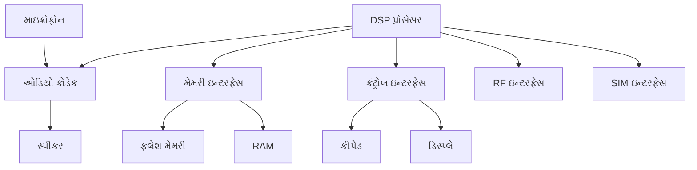

**ઘટકો:**

- **DSP**: સ્પીચ અને ડેટા માટે ડિજિટલ સિગ્નલ પ્રોસેસિંગ
- **ઓડિયો કોડેક**: એનાલોગ-ટુ-ડિજિટલ કન્વર્ઝન
- **મેમરી**: પ્રોગ્રામ સ્ટોરેજ (ફ્લેશ) અને વર્કિંગ મેમરી (RAM)
- **કંટ્રોલ**: યુઝર ઇન્ટરફેસ મેનેજમેન્ટ
- **ઇન્ટરફેસ**: RF સેક્શન, SIM કાર્ડ કનેક્શન

**કાર્યો:**

- **સિગ્નલ પ્રોસેસિંગ**: સ્પીચ કોડિંગ, ઇકો કેન્સલેશન
- **પ્રોટોકોલ સ્ટેક**: GSM લેયર 1, 2, 3 પ્રોટોકોલ
- **યુઝર ઇન્ટરફેસ**: ડિસ્પ્લે, કીપેડ, ઓડિયો મેનેજમેન્ટ

**યાદ રાખવા માટે:** "DSP ઓડિયો, મેમરી, ડિસ્પ્લે, RF નિયંત્રિત કરે છે"

---

## પ્રશ્ન 4(બ) [4 ગુણ]

**EDGE સમજાવો.**

**જવાબ**:

**EDGE ઓવરવ્યુ:**
Enhanced Data rates for GSM Evolution - GSM નેટવર્કમાં ડેટા ટ્રાન્સમિશન સુધારે છે.

**મુખ્ય વિશેષતાઓ કોષ્ટક:**

| પેરામીટર | GSM/GPRS | EDGE |
|-----------|----------|------|
| **મોડ્યુલેશન** | GMSK | 8-PSK |
| **ડેટા રેટ** | 9.6-171 kbps | 473 kbps સુધી |
| **જનરેશન** | 2.5G | 2.75G |
| **સિમ્બોલ રેટ** | 270.833 ksps | 270.833 ksps |

**તકનીકી સુધારાઓ:**

- **એડવાન્સ મોડ્યુલેશન**: 8-PSK GMSK ના 1 બિટની સરખામણીમાં પ્રતિ સિમ્બોલ 3 બિટ વહન કરે છે
- **લિંક અડેપ્ટેશન**: GMSK અને 8-PSK વચ્ચે ઓટોમેટિક સ્વિચ કરે છે
- **એન્હાન્સ કોડિંગ**: વધુ સારી એરર કરેક્શન સ્કીમ
- **ઇન્ક્રિમેન્ટલ રિડન્ડન્સી**: સુધારેલ રિટ્રાન્સમિશન સ્ટ્રેટેજી

**ફાયદા:**

- **વધુ ડેટા રેટ**: GPRS કરતાં 3x ઝડપી
- **બેકવર્ડ કમ્પેટિબિલિટી**: હાલના GSM ઇન્ફ્રાસ્ટ્રક્ચર સાથે કામ કરે છે
- **કોસ્ટ ઇફેક્ટિવ**: હાલના નેટવર્કને સોફ્ટવેર અપગ્રેડ
- **મલ્ટિમીડિયા સપોર્ટ**: વધુ સારો મોબાઇલ ઇન્ટરનેટ અનુભવ સક્ષમ બનાવે છે

**એપ્લિકેશન:**

- **મોબાઇલ ઇન્ટરનેટ**: ઝડપી વેબ બ્રાઉઝિંગ
- **ઇમેઇલ**: એટેચમેન્ટ સાથે ક્વિક ઇમેઇલ
- **મલ્ટિમીડિયા મેસેજિંગ**: MMS સપોર્ટ
- **વિડિયો કોલ**: બેઝિક વિડિયો કોમ્યુનિકેશન

**યાદ રાખવા માટે:** "EDGE = GSM Evolution માટે Enhanced Data rates"

---

## પ્રશ્ન 4(ક) [7 ગુણ]

**મોબાઇલ હેન્ડસેટનો બ્લોક ડાયાગ્રામ દોરો અને સમજાવો.**

**જવાબ**:

**મોબાઇલ હેન્ડસેટ બ્લોક ડાયાગ્રામ:**

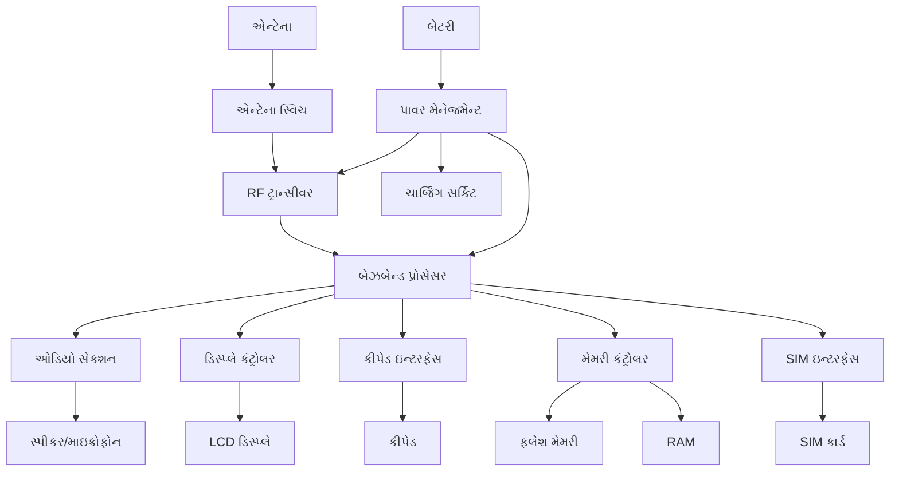

**મુખ્ય વિભાગો:**

**RF સેક્શન:**

- **એન્ટેના**: રેડિયો સિગ્નલ ટ્રાન્સમિટ અને રિસીવ કરે છે
- **ડુપ્લેક્સર**: TX અને RX સિગ્નલ અલગ કરે છે
- **RF ટ્રાન્સીવર**: અપ/ડાઉન કન્વર્ઝન, એમ્પ્લિફિકેશન
- **ફ્રીક્વન્સી સિન્થેસાઇઝર**: કેરિયર ફ્રીક્વન્સી જનરેટ કરે છે

**બેઝબેન્ડ સેક્શન:**

- **DSP**: સ્પીચ અને ડેટા માટે ડિજિટલ સિગ્નલ પ્રોસેસિંગ
- **પ્રોટોકોલ સ્ટેક**: GSM પ્રોટોકોલ અમલ કરે છે
- **કંટ્રોલ યુનિટ**: બધા મોબાઇલ ફંક્શન મેનેજ કરે છે
- **મેમરી ઇન્ટરફેસ**: પ્રોગ્રામ અને ડેટા સ્ટોરેજ નિયંત્રિત કરે છે

**ઓડિયો સેક્શન:**

- **ઓડિયો કોડેક**: A/D અને D/A કન્વર્ઝન
- **ઓડિયો એમ્પ્લિફાયર**: સ્પીકર ચલાવે છે
- **માઇક્રોફોન એમ્પ્લિફાયર**: વોઇસ ઇનપુટ એમ્પ્લિફાઇ કરે છે
- **હેન્ડ્સ-ફ્રી સપોર્ટ**: બાહ્ય ઓડિયો એક્સેસરીઝ

**યુઝર ઇન્ટરફેસ:**

- **ડિસ્પ્લે**: યુઝરને માહિતી બતાવે છે (LCD/OLED)
- **કીપેડ**: યુઝર ઇનપુટ ઇન્ટરફેસ
- **LED ઇન્ડિકેટર**: સ્ટેટસ ઇન્ડિકેશન
- **વાઇબ્રેટર**: એલર્ટ મિકેનિઝમ

**પાવર મેનેજમેન્ટ:**

- **બેટરી**: એનર્જી સ્ટોરેજ (સામાન્ય રીતે Li-ion)
- **ચાર્જિંગ સર્કિટ**: બેટરી ચાર્જિંગ કંટ્રોલ
- **પાવર રેગ્યુલેશન**: બધા સેક્શન માટે વોલ્ટેજ રેગ્યુલેશન
- **પાવર સેવિંગ**: સ્લીપ મોડ અને પાવર ઓપ્ટિમાઇઝેશન

**મેમરી સિસ્ટમ:**

- **ફ્લેશ મેમરી**: પ્રોગ્રામ સ્ટોરેજ અને યુઝર ડેટા
- **RAM**: પ્રોગ્રામ એક્ઝિક્યુશન માટે વર્કિંગ મેમરી
- **SIM ઇન્ટરફેસ**: સબ્સ્ક્રાઇબર આઇડેન્ટિટી માટે સિક્યોર એલિમેન્ટ

**ઇન્ટરકનેક્શન:**

- **કંટ્રોલ બસ**: કમાન્ડ અને કંટ્રોલ સિગ્નલ
- **ડેટા બસ**: માહિતી ટ્રાન્સફર
- **પાવર બસ**: પાવર ડિસ્ટ્રિબ્યુશન
- **ઓડિયો બસ**: વોઇસ અને ઓડિયો સિગ્નલ

**ઓપરેશન:**

1. **રિસીવ**: એન્ટેના → RF → બેઝબેન્ડ → ઓડિયો → સ્પીકર
2. **ટ્રાન્સમિટ**: માઇક્રોફોન → ઓડિયો → બેઝબેન્ડ → RF → એન્ટેના
3. **કંટ્રોલ**: યુઝર ઇનપુટ → બેઝબેન્ડ → ડિસ્પ્લે આઉટપુટ
4. **પ્રોસેસિંગ**: બેઝબેન્ડ પ્રોસેસર દ્વારા બધી ઓપરેશન નિયંત્રિત

**યાદ રાખવા માટે:** "એન્ટેના-RF-બેઝબેન્ડ-ઓડિયો-ડિસ્પ્લે-પાવર"

---

## પ્રશ્ન 4(અ OR) [3 ગુણ]

**મોબાઇલના કારણે રેડિયેશનના જોખમો સમજાવો.**

**જવાબ**:

**રેડિયેશન જોખમો:**

**SAR (Specific Absorption Rate):**

- **વ્યાખ્યા**: માનવ શરીર દ્વારા એનર્જી એબ્સોર્પ્શનનો દર
- **એકમ**: વોટ પ્રતિ કિલોગ્રામ (W/kg)
- **લિમિટ**: 2.0 W/kg (યુરોપ), 1.6 W/kg (USA)

**આરોગ્ય ચિંતાઓ કોષ્ટક:**

| અસર | રિસ્ક લેવલ | લક્ષણો |
|-----|-----------|--------|
| **થર્મલ** | કન્ફર્મ | ટિશ્યુ હીટિંગ |
| **નોન-થર્મલ** | અધ્યયન હેઠળ | માથાનો દુખાવો, થાક |
| **લોંગ-ટર્મ** | અનિશ્ચિત | કેન્સરની ચિંતા |

**નિવારણ પગલાં:**

- **અંતર**: કોલ દરમિયાન ફોનને શરીરથી દૂર રાખો
- **અવધિ**: કોલ અવધિ મર્યાદિત કરો
- **હેન્ડ્સ-ફ્રી**: હેડસેટ અથવા સ્પીકરફોનનો ઉપયોગ કરો
- **લો SAR**: નીચા SAR વેલ્યુવાળા ફોન પસંદ કરો

**સેફ્ટી ગાઇડલાઇન:**

- માથાની નજીક ફોન સાથે સૂવાનું ટાળો
- જરૂર ન હોય ત્યારે એરપ્લેન મોડનો ઉપયોગ કરો
- કોલ ટૂંકા રાખો અને શક્ય હોય ત્યારે ટેક્સ્ટનો ઉપયોગ કરો

**યાદ રાખવા માટે:** "SAR એબ્સોર્પ્શન રેટ માપે છે"

---

## પ્રશ્ન 4(બ OR) [4 ગુણ]

**મોબાઇલ હેન્ડસેટમાં ચાર્જિંગ સેક્શનનું કાર્ય વર્ણન કરો.**

**જવાબ**:

**ચાર્જિંગ સેક્શન બ્લોક ડાયાગ્રામ:**

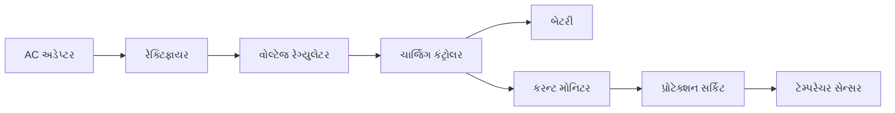

**ઘટકો અને કાર્યો:**

**ચાર્જિંગ કંટ્રોલર:**

- **કાર્ય**: ચાર્જિંગ કરન્ટ અને વોલ્ટેજ નિયંત્રિત કરે છે
- **પ્રકારો**: લિનિયર અને સ્વિચિંગ મોડ કંટ્રોલર
- **પ્રોટેક્શન**: ઓવરચાર્જિંગ અને ઓવરહીટિંગ અટકાવે છે

**ચાર્જિંગ પ્રક્રિયા:**

1. **કોન્સ્ટન્ટ કરન્ટ**: પ્રારંભિક હાઇ કરન્ટ ચાર્જિંગ (ફાસ્ટ ચાર્જ)
2. **કોન્સ્ટન્ટ વોલ્ટેજ**: વોલ્ટેજ જાળવાયું, કરન્ટ ઘટે છે
3. **ટ્રિકલ ચાર્જ**: લો કરન્ટ મેન્ટેનન્સ ચાર્જિંગ
4. **કટ-ઓફ**: બેટરી ફુલ થાય ત્યારે ચાર્જિંગ બંધ

**પ્રોટેક્શન ફીચર્સ:**

- **ઓવર-વોલ્ટેજ પ્રોટેક્શન**: હાઇ વોલ્ટેજથી નુકસાન અટકાવે છે
- **ઓવર-કરન્ટ પ્રોટેક્શન**: મેક્સિમમ ચાર્જિંગ કરન્ટ મર્યાદિત કરે છે
- **ટેમ્પરેચર મોનિટરિંગ**: બેટરી વધુ પડતી ગરમ થાય તો ચાર્જિંગ બંધ કરે છે
- **રિવર્સ પોલેરિટી**: ખોટા કનેક્શનથી નુકસાન અટકાવે છે

**બેટરી મેનેજમેન્ટ:**

- **ફ્યુઅલ ગેજ**: બેટરી કેપેસિટી મોનિટર કરે છે
- **સેલ બેલેન્સિંગ**: બેટરી સેલનું સમાન ચાર્જિંગ સુનિશ્ચિત કરે છે
- **હેલ્થ મોનિટરિંગ**: સમય સાથે બેટરીની સ્થિતિ ટ્રેક કરે છે

**યાદ રાખવા માટે:** "કરન્ટ, વોલ્ટેજ, ટેમ્પરેચર અને ટાઇમ નિયંત્રિત કરો"

---

## પ્રશ્ન 4(ક OR) [7 ગુણ]

**DSSS ટ્રાન્સમિટર અને રિસીવરનો બ્લોક ડાયાગ્રામ દોરો અને સમજાવો.**

**જવાબ**:

**DSSS ટ્રાન્સમિટર બ્લોક ડાયાગ્રામ:**

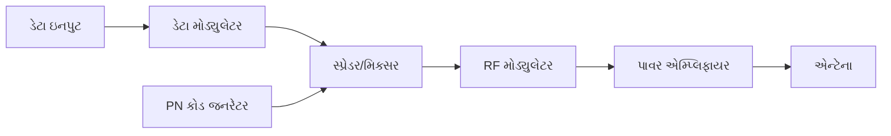

**DSSS રિસીવર બ્લોક ડાયાગ્રામ:**

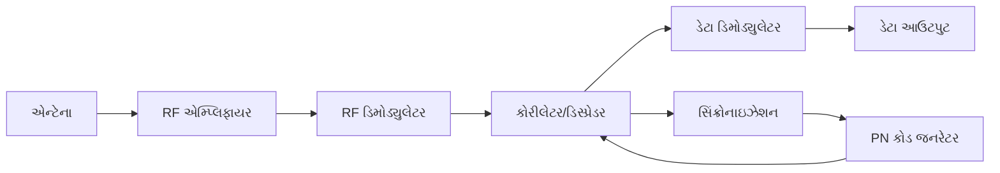

**ટ્રાન્સમિટર ઓપરેશન:**

**ડેટા મોડ્યુલેશન:**

- **ઇનપુટ**: મૂળ ડેટા સ્ટ્રીમ (લો રેટ)
- **મોડ્યુલેશન**: BPSK અથવા QPSK મોડ્યુલેશન
- **આઉટપુટ**: મોડ્યુલેટેડ નેરોબેન્ડ સિગ્નલ

**સ્પ્રેડિંગ પ્રક્રિયા:**

- **PN કોડ**: સ્યુડો-રેન્ડમ બાઇનરી સીક્વન્સ (હાઇ રેટ)
- **સ્પ્રેડિંગ**: ડેટા અને PN કોડ વચ્ચે XOR ઓપરેશન
- **પરિણામ**: વાઇડબેન્ડ સ્પ્રેડ સ્પેક્ટ્રમ સિગ્નલ

**RF મોડ્યુલેશન:**

- **કેરિયર**: હાઇ ફ્રીક્વન્સી કેરિયર સિગ્નલ
- **મોડ્યુલેશન**: સ્પ્રેડ સિગ્નલ RF કેરિયરને મોડ્યુલેટ કરે છે
- **ટ્રાન્સમિશન**: એન્ટેના મારફતે સિગ્નલ ટ્રાન્સમિટ થાય છે

**રિસીવર ઓપરેશન:**

**RF પ્રોસેસિંગ:**

- **રિસેપ્શન**: એન્ટેના સ્પ્રેડ સ્પેક્ટ્રમ સિગ્નલ મેળવે છે
- **એમ્પ્લિફિકેશન**: લો નોઇઝ એમ્પ્લિફાયર નબળા સિગ્નલને બૂસ્ટ કરે છે
- **ડિમોડ્યુલેશન**: બેઝબેન્ડ સ્પ્રેડ સિગ્નલ મેળવે છે

**ડિસ્પ્રેડિંગ પ્રક્રિયા:**

- **કોરીલેશન**: મળેલ સિગ્નલ સમાન PN કોડ સાથે કોરીલેટ થાય છે
- **સિંક્રોનાઇઝેશન**: PN કોડ ટાઇમિંગ મળેલ સિગ્નલ સાથે સિંક્રોનાઇઝ થાય છે
- **આઉટપુટ**: મૂળ નેરોબેન્ડ ડેટા સિગ્નલ પુનઃપ્રાપ્ત થાય છે

**મુખ્ય પેરામીટર:**

- **પ્રોસેસિંગ ગેઇન**: સ્પ્રેડ બેન્ડવિડ્થ અને ડેટા બેન્ડવિડ્થનો ગુણોત્તર
- **ચિપ રેટ**: PN કોડનો રેટ (ડેટા રેટ કरતાં વધારે)
- **સ્પ્રેડિંગ ફેક્ટર**: પ્રોસેસિંગ ગેઇન વેલ્યુ

**ફાયદા:**

- **ઇન્ટર્ફેરન્સ રિજેક્શન**: નેરોબેન્ડ ઇન્ટર્ફેરન્સ સામે પ્રતિરોધક
- **લો પ્રોબેબિલિટી ઓફ ઇન્ટરસેપ્ટ**: શોધવું અને જામ કરવું મુશ્કેલ
- **મલ્ટિપલ એક્સેસ**: અનેક યુઝર સમાન ફ્રીક્વન્સી શેર કરી શકે છે
- **મલ્ટિપાથ રિઝિસ્ટન્સ**: ફેડિંગ અસરો ઘટાડે છે

**એપ્લિકેશન:**

- **CDMA સેલ્યુલર**: IS-95, CDMA2000, WCDMA
- **GPS**: ગ્લોબલ પોઝિશનિંગ સિસ્ટમ
- **WiFi**: 802.11b સ્પ્રેડ સ્પેક્ટ્રમ મોડ
- **મિલિટરી**: સિક્યોર કોમ્યુનિકેશન

**યાદ રાખવા માટે:** "ડેટા PN સાથે સ્પ્રેડ થાય છે, કોરીલેટ કરીને પુનઃપ્રાપ્ત થાય છે"

---

## પ્રશ્ન 5(અ) [3 ગુણ]

**સ્પ્રેડ સ્પેક્ટ્રમની કોન્સેપ્ટ સમજાવો.**

**જવાબ**:

**સ્પ્રેડ સ્પેક્ટ્રમ કોન્સેપ્ટ:**
એક કોમ્યુનિકેશન તકનીક જ્યાં ટ્રાન્સમિટેડ સિગ્નલ બેન્ડવિડ્થ જરૂરી ન્યૂનતમ બેન્ડવિડ્થ કરતાં ઘણું વિશાળ હોય છે.

**બેઝિક પ્રિન્સિપલ:**

| પેરામીટર | સ્પ્રેડિંગ પહેલાં | સ્પ્રેડિંગ પછી |
|-----------|------------------|---------------|
| **બેન્ડવિડ્થ** | નેરો (ડેટા રેટ) | વાઇડ (ચિપ રેટ) |
| **પાવર ડેન્સિટી** | હાઇ | લો |
| **ઇન્ટર્ફેરન્સ** | સંવેદનશીલ | પ્રતિરોધક |

**મુખ્ય લક્ષણો:**

- **બેન્ડવિડ્થ વિસ્તરણ**: સિગ્નલ વિશાળ ફ્રીક્વન્સી રેન્જ પર ફેલાયેલ
- **પ્રોસેસિંગ ગેઇન**: સિગ્નલ-ટુ-નોઇઝ રેશિયોમાં સુધારો
- **સ્યુડો-રેન્ડમ સીક્વન્સ**: ફક્ત ઇચ્છિત રિસીવરને જ ખબર હોય તેવા સ્પ્રેડિંગ કોડ
- **સિક્યુરિટી**: અનધિકૃત યુઝર માટે ઇન્ટરસેપ્ટ કરવું મુશ્કેલ

**ફાયદા:**

- **જામ રિઝિસ્ટન્સ**: ઇરાદાપૂર્વકના ઇન્ટર્ફેરન્સ સામે રોગપ્રતિકારક
- **લો પાવર ડેન્સિટી**: નેરોબેન્ડ સિસ્ટમ સાથે સહઅસ્તિત્વ
- **મલ્ટિપલ એક્સેસ**: અનેક યુઝર સમાન સ્પેક્ટ્રમ શેર કરે છે
- **પ્રાઇવસી**: એન્ક્રિપ્ટેડ જેવું ટ્રાન્સમિશન

**યાદ રાખવા માટે:** "વાઇડ સ્પ્રેડ, પ્રોસેસિંગ પાવર મેળવો"

---

## પ્રશ્ન 5(બ) [4 ગુણ]

**સ્પ્રેડ સ્પેક્ટ્રમ ક્રાઇટેરિયા અને તેની એપ્લિકેશન લખો.**

**જવાબ**:

**સ્પ્રેડ સ્પેક્ટ્રમ ક્રાઇટેરિયા:**

**તકનીકી ક્રાઇટેરિયા:**

1. **બેન્ડવિડ્થ**: ટ્રાન્સમિટેડ બેન્ડવિડ્થ >> માહિતી બેન્ડવિડ્થ
2. **પ્રોસેસિંગ ગેઇન**: Gp = સ્પ્રેડ BW / ડેટા BW ≥ 10 dB
3. **સ્યુડો-રેન્ડમ**: સ્પ્રેડિંગ સીક્વન્સ રેન્ડમ દેખાય છે
4. **સિંક્રોનાઇઝેશન**: રિસીવરે ટ્રાન્સમિટર કોડ સાથે સિંક થવું જોઈએ

**પરફોર્મન્સ ક્રાઇટેરિયા કોષ્ટક:**

| ક્રાઇટેરિયા | આવશ્યકતા | ફાયદો |
|------------|----------|-------|
| **પ્રોસેસિંગ ગેઇન** | > 10 dB | ઇન્ટર્ફેરન્સ રિજેક્શન |
| **કોડ લેન્થ** | લાંબો પીરિયડ | સિક્યુરિટી અને રેન્ડમનેસ |
| **ક્રોસ-કોરીલેશન** | લો | મલ્ટિપલ યુઝર સેપરેશન |
| **ઓટો-કોરીલેશન** | શાર્પ પીક | સિંક્રોનાઇઝેશન |

**એપ્લિકેશન:**

**મિલિટરી કોમ્યુનિકેશન:**

- **એન્ટી-જામ**: દુશ્મન જામિંગ સામે પ્રતિરોધક
- **LPI/LPD**: લો પ્રોબેબિલિટી ઓફ ઇન્ટરસેપ્ટ/ડિટેક્શન
- **સિક્યોર**: એન્ક્રિપ્ટેડ ટ્રાન્સમિશન

**સેલ્યુલર સિસ્ટમ:**

- **CDMA**: IS-95, CDMA2000, WCDMA
- **કેપેસિટી**: પ્રતિ ફ્રીક્વન્સી અનેક યુઝર
- **ક્વોલિટી**: ઇન્ટર્ફેરન્સ ઘટાડાયેલ

**સેટેલાઇટ કોમ્યુનિકેશન:**

- **GPS**: ગ્લોબલ પોઝિશનિંગ સિસ્ટમ
- **વેધર**: સેટેલાઇટ ડેટા ટ્રાન્સમિશન
- **બ્રોડકાસ્ટિંગ**: સેટેલાઇટ રેડિયો/TV

**વાયરલેસ નેટવર્ક:**

- **WiFi**: 802.11b DSSS મોડ
- **બ્લુટૂથ**: ફ્રીક્વન્સી હોપિંગ
- **કોર્ડલેસ ફોન**: 2.4 GHz બેન્ડ

**યાદ રાખવા માટે:** "મિલિટરી, સેલ્યુલર, સેટેલાઇટ, વાયરલેસ સ્પ્રેડ સ્પેક્ટ્રમ વાપરે છે"

---

## પ્રશ્ન 5(ક) [7 ગુણ]

**CDMA માં કોલ પ્રોસેસિંગ સમજાવો.**

**જવાબ**:

**CDMA કોલ પ્રોસેસિંગ સીક્વન્સ:**

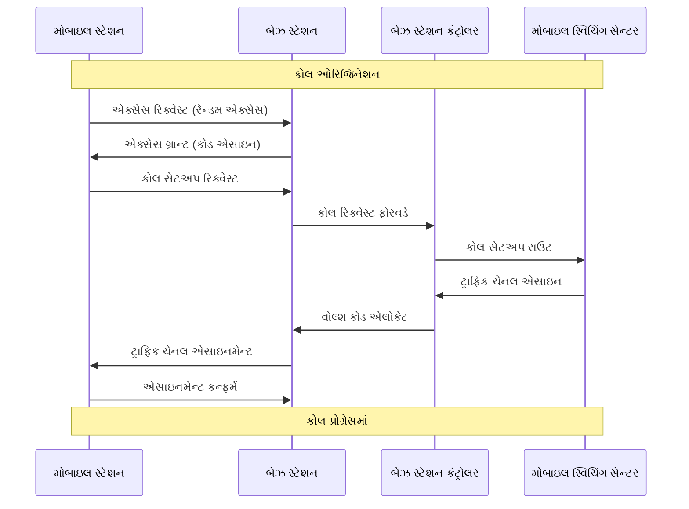

**કોલ ઓરિજિનેશન પ્રક્રિયા:**

**પગલું 1: સિસ્ટમ એક્સેસ**

- **રેન્ડમ એક્સેસ**: મોબાઇલ એક્સેસ ચેનલ પર એક્સેસ પ્રોબ મોકલે છે
- **પાવર કંટ્રોલ**: સ્વીકારાય ત્યાં સુધી ધીમે ધીમે પાવર વધારે છે
- **કોડ એસાઇનમેન્ટ**: બેઝ સ્ટેશન યુનિક સ્પ્રેડિંગ કોડ એસાઇન કરે છે

**પગલું 2: ઓથેન્ટિકેશન**

- **ચેલેન્જ**: નેટવર્ક ઓથેન્ટિકેશન ચેલેન્જ મોકલે છે
- **રિસ્પોન્સ**: મોબાઇલ કેલ્ક્યુલેટેડ ઓથેન્ટિકેશન સાથે જવાબ આપે છે
- **વેલિડેશન**: નેટવર્ક મોબાઇલ આઇડેન્ટિટી વેલિડેટ કરે છે

**પગલું 3: ચેનલ એસાઇનમેન્ટ**

- **વોલ્શ કોડ**: ફોરવર્ડ લિંક માટે યુનિક ઓર્થોગોનલ કોડ એસાઇન
- **PN ઓફસેટ**: PN સીક્વન્સ ઓફસેટ દ્વારા બેઝ સ્ટેશનની ઓળખ
- **પાવર લેવલ**: પ્રારંભિક ટ્રાન્સમિશન પાવર સેટ કરો

**પગલું 4: ટ્રાફિક ચેનલ સેટઅપ**

- **સર્વિસ ઓપ્શન**: વોઇસ, ડેટા અથવા મલ્ટિમીડિયા સર્વિસ નેગોશિએટ
- **રેટ સેટ**: ટ્રાન્સમિશન રેટ કોન્ફિગર (રેટ સેટ 1 અથવા 2)
- **હેન્ડઓફ પેરામીટર**: પડોશી સેલ માહિતી પ્રદાન

**કોલ પ્રોસેસિંગ ફીચર્સ:**

**સોફ્ટ હેન્ડઓફ:**

- **મલ્ટિપલ કનેક્શન**: મોબાઇલ અનેક બેઝ સ્ટેશન સાથે લિંક જાળવે છે
- **ડાયવર્સિટી**: કોલ ક્વોલિટી અને વિશ્વસનીયતા સુધારે છે
- **મેક-બિફોર-બ્રેક**: જૂનું છોડતા પહેલાં નવું કનેક્શન સ્થાપિત કરે છે

**પાવર કંટ્રોલ:**

- **ક્લોઝ્ડ લૂપ**: ઝડપી પાવર એડજસ્ટમેન્ટ (800 Hz રેટ)
- **ઓપન લૂપ**: પ્રારંભિક પાવર અંદાજ
- **હેતુ**: ઇન્ટર્ફેરન્સ મિનિમાઇઝ, કેપેસિટી મેક્સિમાઇઝ

**વેરિયેબલ રેટ વોકોડર:**

- **રેટ અડેપ્ટેશન**: સ્પીચ એક્ટિવિટી સાથે ટ્રાન્સમિશન રેટ બદલાય છે
- **સાઇલન્સ ડિટેક્શન**: સ્પીચ પોઝ દરમિયાન લોઅર રેટ
- **કેપેસિટી**: સિસ્ટમ કેપેસિટી વધારે છે

**કોલ ટર્મિનેશન પ્રક્રિયા:**

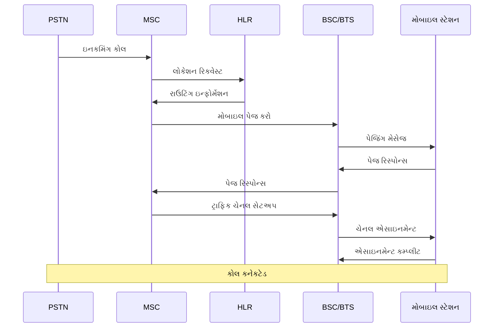
**મુખ્ય CDMA ફીચર્સ:**

**રેક રિસીવર:**

- **મલ્ટિપાથ કમ્બાઇનિંગ**: અનેક સિગ્નલ પાથ કમ્બાઇન કરે છે
- **ડાયવર્સિટી ગેઇન**: સિગ્નલ ક્વોલિટી સુધારે છે
- **ફિંગર એસાઇનમેન્ટ**: દરેક ફિંગર અલગ પાથ ટ્રેક કરે છે

**કેપેસિટી એડવાન્ટેજ:**

- **ફ્રીક્વન્સી રીયુઝ**: બધા સેલમાં સમાન ફ્રીક્વન્સીનો ઉપયોગ
- **ઇન્ટર્ફેરન્સ લિમિટેડ**: કેપેસિટી ઇન્ટર્ફેરન્સથી મર્યાદિત, ફ્રીક્વન્સીથી નહીં
- **વોઇસ એક્ટિવિટી**: સ્ટેટિસ્ટિકલ મલ્ટિપ્લેક્સિંગ કેપેસિટી વધારે છે

**ક્વોલિટી ફીચર્સ:**

- **એરર કરેક્શન**: ફોરવર્ડ એરર કરેક્શન કોડિંગ
- **ઇન્ટરલીવિંગ**: બર્સ્ટ એરર સામે સુરક્ષા
- **અડેપ્ટિવ રેટ**: ડેટા રેટ ચેનલ કન્ડિશન મુજબ અડેપ્ટ થાય છે

**કોલ સ્ટેટ:**

1. **આઇડલ**: મોબાઇલ પેજિંગ ચેનલ મોનિટર કરે છે
2. **એક્સેસ**: સિસ્ટમ એક્સેસ કરવાનો પ્રયાસ
3. **ટ્રાફિક**: એક્ટિવ કોલ પ્રગતિમાં
4. **હેન્ડઓફ**: બેઝ સ્ટેશન વચ્ચે ટ્રાન્ઝિશન

**યાદ રાખવા માટે:** "એક્સેસ-ઓથેન્ટિકેટ-એસાઇન-ટ્રાફિક-હેન્ડઓફ"

---

## પ્રશ્ન 5(અ OR) [3 ગુણ]

**ઝિગબીની વિશેષતાઓ અને ફાયદાઓ લખો.**

**જવાબ**:

**ઝિગબી વિશેષતાઓ:**

**તકનીકી સ્પેશિફિકેશન કોષ્ટક:**

| પેરામીટર | સ્પેશિફિકેશન |
|-----------|---------------|
| **સ્ટાન્ડર્ડ** | IEEE 802.15.4 |
| **ફ્રીક્વન્સી** | 2.4 GHz, 915 MHz, 868 MHz |
| **ડેટા રેટ** | 250 kbps (2.4 GHz) |
| **રેન્જ** | 10-100 મીટર |
| **પાવર** | અલ્ટ્રા-લો પાવર |

**મુખ્ય વિશેષતાઓ:**

- **મેશ નેટવર્ક**: સ્વ-વ્યવસ્થિત અને સ્વ-સુધારાયેલ નેટવર્ક
- **લો પાવર**: વર્ષો સુધી બેટરી લાઇફ
- **લો કોસ્ટ**: સસ્તા હાર્ડવેર અમલીકરણ
- **સિમ્પલ પ્રોટોકોલ**: અમલ કરવું અને ડિપ્લોય કરવું સરળ

**ફાયદાઓ:**

- **લાંબી બેટરી લાઇફ**: બેટરી-પાવર્ડ ડિવાઇસ માટે ઓપ્ટિમાઇઝ
- **નેટવર્ક રિલાયબિલિટી**: અનેક રાઉટિંગ પાથ ઉપલબ્ધ
- **સ્કેલેબિલિટી**: હજારો નોડ્સને સપોર્ટ કરે છે
- **ઇન્ટરઓપરેબિલિટી**: સ્ટાન્ડર્ડ ડિવાઇસ કમ્પેટિબિલિટી સુનિશ્ચિત કરે છે

**એપ્લિકેશન:**

- **હોમ ઓટોમેશન, ઇન્ડસ્ટ્રિયલ મોનિટરિંગ, સ્માર્ટ લાઇટિંગ**

**યાદ રાખવા માટે:** "લો પાવર, મેશ નેટવર્ક, અનેક એપ્લિકેશન"

---

## પ્રશ્ન 5(બ OR) [4 ગુણ]

**બ્લોક ડાયાગ્રામ સાથે OFDM સમજાવો.**

**જવાબ**:

**OFDM બ્લોક ડાયાગ્રામ:**

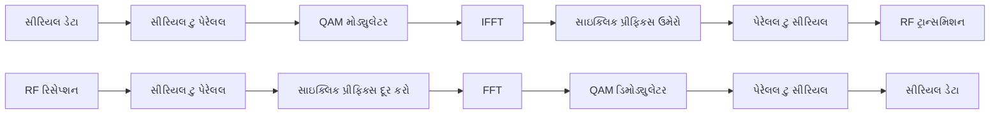

**OFDM સિદ્ધાંત:**
Orthogonal Frequency Division Multiplexing હાઇ-સ્પીડ ડેટાને અલગ ફ્રીક્વન્સી પર સાથે-સાથે ટ્રાન્સમિટ થતા અનેક પેરેલલ લો-સ્પીડ સ્ટ્રીમમાં વિભાજિત કરે છે.

**મુખ્ય ઘટકો:**

**IFFT/FFT:**

- **IFFT**: Inverse Fast Fourier Transform ઓર્થોગોનલ સબકેરિયર બનાવે છે
- **FFT**: Fast Fourier Transform રિસીવર પર ડેટા પુનઃપ્રાપ્ત કરે છે
- **ઓર્થોગોનાલિટી**: સબકેરિયર એકબીજા સાથે ઇન્ટર્ફેર નથી કરતા

**સાઇક્લિક પ્રીફિક્સ:**

- **કાર્ય**: ઇન્ટર-સિમ્બોલ ઇન્ટર્ફેરન્સ અટકાવે છે
- **અમલીકરણ**: સિગ્નલના અંતની કોપી શરૂઆતમાં ઉમેરાય છે
- **લેન્થ**: ચેનલ ડિલે સ્પ્રેડ કરતાં લાંબું

**ફાયદા:**

- **સ્પેક્ટ્રલ એફિશિયન્સી**: મર્યાદિત બેન્ડવિડ્થમાં હાઇ ડેટા રેટ
- **મલ્ટિપાથ ઇમ્યુનિટી**: ફેડિંગ ચેનલ સામે પ્રતિરોધક
- **ફ્લેક્સિબલ**: DSP સાથે અમલ કરવું સરળ

**એપ્લિકેશન:**

- **4G LTE**: મોબાઇલ કોમ્યુનિકેશન સ્ટાન્ડર્ડ
- **WiFi**: 802.11a/g/n/ac સ્ટાન્ડર્ડ
- **ડિજિટલ TV**: DVB-T, ISDB-T સ્ટાન્ડર્ડ

**યાદ રાખવા માટે:** "ઓર્થોગોનલ ફ્રીક્વન્સી મલ્ટિપ્લેક્સ્ડ ડેટાને વિભાજિત કરે છે"

---

## પ્રશ્ન 5(ક OR) [7 ગુણ]

**MANET નું વર્ણન કરો.**

**જવાબ**:

**MANET ઓવરવ્યુ:**
Mobile Ad-hoc Network એ ફિક્સ્ડ ઇન્ફ્રાસ્ટ્રક્ચર વિના વાયરલેસલી કનેક્ટ થયેલા મોબાઇલ ડિવાઇસનું સ્વ-કોન્ફિગરિંગ નેટવર્ક છે.

**નેટવર્ક ટોપોલોજી:**

```goat
     A ---- B
     |    / |
     |   /  |
     C ---- D ---- E
       \   /
        \ /
         F
```

**મુખ્ય લક્ષણો:**

**આર્કિટેક્ચર કોષ્ટક:**

| પેરામીટર | MANET | સેલ્યુલર નેટવર્ક |
|-----------|-------|------------------|
| **ઇન્ફ્રાસ્ટ્રક્ચર** | કોઈ ફિક્સ્ડ બેઝ સ્ટેશન નથી | બેઝ સ્ટેશન જરૂરી |
| **ટોપોલોજી** | ડાયનેમિક, વારંવાર બદલાય છે | ફિક્સ્ડ સેલ સ્ટ્રક્ચર |
| **રાઉટિંગ** | મલ્ટિ-હોપ પીઅર-ટુ-પીઅર | બેઝ સ્ટેશન સુધી સિંગલ હોપ |
| **કોસ્ટ** | લો ડિપ્લોયમેન્ટ કોસ્ટ | હાઇ ઇન્ફ્રાસ્ટ્રક્ચર કોસ્ટ |

**MANET વિશેષતાઓ:**

**ડાયનેમિક ટોપોલોજી:**

- **મોબાઇલ નોડ્સ**: બધા નોડ્સ મુક્તપણે ખસી શકે છે
- **બદલાતા લિંક્સ**: નોડ્સ હલચલ કરતાં નેટવર્ક કનેક્શન બદલાય છે
- **સ્વ-વ્યવસ્થા**: નેટવર્ક ઓટોમેટિક રીકોન્ફિગર થાય છે

**મલ્ટિ-હોપ કોમ્યુનિકેશન:**

- **રિલે ફંક્શન**: નોડ્સ અન્ય નોડ્સ માટે રાઉટર તરીકે કામ કરે છે
- **પાથ ડિસ્કવરી**: ડેસ્ટિનેશન સુધી ડાયનેમિક રૂટ શોધ
- **ડિસ્ટ્રિબ્યુટેડ કંટ્રોલ**: કોઈ કેન્દ્રીય સમન્વયની જરૂર નથી

**રાઉટિંગ પ્રોટોકોલ:**

**પ્રોએક્ટિવ પ્રોટોકોલ:**

- **DSDV**: Destination Sequenced Distance Vector
- **લક્ષણ**: સતત રાઉટિંગ ટેબલ જાળવે છે
- **ફાયદો**: રૂટ તાત્કાલિક ઉપલબ્ધ
- **નુકસાન**: મોબાઇલ એન્વાયરનમેન્ટમાં હાઇ ઓવરહેડ

**રિએક્ટિવ પ્રોટોકોલ:**

- **AODV**: Ad-hoc On-demand Distance Vector
- **DSR**: Dynamic Source Routing
- **લક્ષણ**: જરૂર પડે ત્યારે જ રૂટ શોધે છે
- **ફાયદો**: લોઅર ઓવરહેડ
- **નુકસાન**: રૂટ ડિસ્કવરી ડિલે

**હાઇબ્રિડ પ્રોટોકોલ:**

- **ZRP**: Zone Routing Protocol
- **કમ્બિનેશન**: ઝોનની અંદર પ્રોએક્ટિવ, ઝોન વચ્ચે રિએક્ટિવ
- **બેલેન્સ**: ઓવરહેડ વિ. ડિલે ઓપ્ટિમાઇઝેશન

**ફાયદા:**

- **કોઈ ઇન્ફ્રાસ્ટ્રક્ચર નથી**: બેઝ સ્ટેશન વિના ક્વિક ડિપ્લોયમેન્ટ
- **ફ્લેક્સિબિલિટી**: બદલાતી ટોપોલોજીમાં નેટવર્ક અડેપ્ટ થાય છે
- **કોસ્ટ ઇફેક્ટિવ**: લોઅર સેટઅપ અને મેન્ટેનન્સ કોસ્ટ
- **રોબસ્ટનેસ**: કોઈ સિંગલ પોઇન્ટ ઓફ ફેલ્યોર નથી

**નુકસાન:**

- **લિમિટેડ બેન્ડવિડ્થ**: શેર્ડ વાયરલેસ મીડિયમ
- **પાવર કન્ઝમ્પશન**: રાઉટિંગ ફંક્શન બેટરી ડ્રેઇન કરે છે
- **સિક્યુરિટી ઇશ્યુ**: એટેક સામે સંવેદનશીલ
- **સ્કેલેબિલિટી**: નેટવર્ક સાઇઝ સાથે પરફોર્મન્સ ઘટે છે

**એપ્લિકેશન:**

**મિલિટરી ઓપરેશન:**

- **બેટલફીલ્ડ કોમ્યુનિકેશન**: સૈનિક-થી-સૈનિક કોમ્યુનિકેશન
- **ઇમર્જન્સી રિસ્પોન્સ**: ડિઝાસ્ટર રિલીફ કોઓર્ડિનેશન
- **સર્વેલાન્સ**: સેન્સર નેટવર્ક ડિપ્લોયમેન્ટ

**કોમર્શિયલ એપ્લિકેશન:**

- **વેહિક્યુલર નેટવર્ક**: કાર-ટુ-કાર કોમ્યુનિકેશન
- **સેન્સર નેટવર્ક**: એન્વાયરનમેન્ટલ મોનિટરિંગ
- **કોન્ફરન્સ નેટવર્ક**: ટેમ્પરરી મીટિંગ નેટવર્ક
- **પર્સનલ એરિયા નેટવર્ક**: ડિવાઇસ ઇન્ટરકનેક્શન

**ચેલેન્જ:**

**તકનીકી ચેલેન્જ:**

- **રાઉટિંગ ઓવરહેડ**: કંટ્રોલ મેસેજ બેન્ડવિડ્થ કન્ઝમ્પશન
- **ક્વોલિટી ઓફ સર્વિસ**: સર્વિસ લેવલ ગેરંટી આપવામાં મુશ્કેલી
- **પાવર મેનેજમેન્ટ**: એનર્જી-એફિશિયન્ટ ઓપરેશન
- **ઇન્ટર્ફેરન્સ**: મલ્ટિપલ હોપ્સથી કો-ચેનલ ઇન્ટર્ફેરન્સ

**સિક્યુરિટી ચેલેન્જ:**

- **ઓથેન્ટિકેશન**: નોડ આઇડેન્ટિટી વેરિફાઇ કરવી
- **ડેટા ઇન્ટેગ્રિટી**: મેસેજ ઓથેન્ટિસિટી સુનિશ્ચિત કરવી
- **પ્રાઇવસી**: યુઝર ઇન્ફોર્મેશન સુરક્ષિત કરવી
- **ડિનાયલ ઓફ સર્વિસ**: નેટવર્ક એટેક અટકાવવા

**પરફોર્મન્સ મેટ્રિક્સ:**

- **થ્રુપુટ**: ડેટા ડિલિવરી રેટ
- **ડિલે**: એન્ડ-ટુ-એન્ડ પેકેટ ડિલિવરી ટાઇમ
- **પેકેટ લોસ**: ખોવાયેલા પેકેટનો ટકા
- **એનર્જી કન્ઝમ્પશન**: બેટરી લાઇફ ઓપ્ટિમાઇઝેશન

**ભવિષ્યના ટ્રેન્ડ:**

- **ઇન્ટિગ્રેશન**: સેલ્યુલર અને WiFi નેટવર્ક સાથે કમ્બિનેશન
- **IoT એપ્લિકેશન**: Internet of Things ડિવાઇસ નેટવર્ક
- **5G ઇન્ટિગ્રેશન**: 5G નેટવર્ક આર્કિટેક્ચરનો ભાગ
- **AI-આધારિત રાઉટિંગ**: ઓપ્ટિમલ રાઉટિંગ માટે મશીન લર્નિંગ

**યાદ રાખવા માટે:** "મોબાઇલ નોડ્સ, એડ-હોક રાઉટિંગ, કોઈ ઇન્ફ્રાસ્ટ્રક્ચર નથી, ટેમ્પરરી નેટવર્ક"
