## Question 1(a) [3 marks]

**Write key features of 4G and 5G system.**

**Answer**:

**Table: Key Features Comparison**

| Feature | 4G System | 5G System |
|---------|-----------|-----------|
| **Data Speed** | Up to 100 Mbps | Up to 10 Gbps |
| **Latency** | 30-50 ms | 1-10 ms |
| **Technology** | LTE, OFDM | MIMO, Beamforming |
| **Applications** | Video streaming | IoT, AR/VR |

**Key Points:**

- **4G**: Uses LTE technology with OFDM modulation for high-speed data
- **5G**: Ultra-low latency enables real-time applications like autonomous vehicles
- **Network Slicing**: 5G allows virtual networks for specific applications

**Mnemonic:** "4G Fast, 5G Super-Fast"

---

## Question 1(b) [4 marks]

**Explain concept of frequency reuse in cellular mobile system.**

**Answer**:

**Diagram:**

```goat
    F1      F2      F3
   +---+   +---+   +---+
   | A |   | B |   | C |
   +---+   +---+   +---+
    F4      F5      F6
   +---+   +---+   +---+
   | D |   | E |   | F |
   +---+   +---+   +---+
    F7      F1      F2
   +---+   +---+   +---+
   | G |   | A |   | B |
   +---+   +---+   +---+
```

**Key Points:**

- **Frequency Reuse**: Same frequencies used in non-adjacent cells to increase capacity
- **Co-channel Distance**: Minimum distance between cells using same frequency
- **Cluster Size**: Group of cells using different frequencies (typically 3, 4, 7, 12)
- **Capacity Improvement**: More users served with limited spectrum

**Mnemonic:** "Same Frequency, Different Places"

---

## Question 1(c) [7 marks]

**If a total of 33 MHz of bandwidth is allocated to a particular FDD cellular telephone system which uses two 25 kHz simplex channels to provide full duplex communication. If 1 MHz of the allocated spectrum is dedicated to control channels, determine an equitable distribution of control channels and voice channels for cluster size of 7.**

**Answer**:

**Given Data:**

- Total bandwidth = 33 MHz
- Channel bandwidth = 25 kHz (simplex)
- Control spectrum = 1 MHz
- Cluster size = 7

**Calculations:**

**Step 1: Available spectrum for traffic**
Traffic spectrum = 33 - 1 = 32 MHz

**Step 2: Total duplex channels**
Each duplex channel needs 2 × 25 kHz = 50 kHz
Total channels = 32 MHz ÷ 50 kHz = 640 channels

**Step 3: Control channels**
Control channels = 1 MHz ÷ 25 kHz = 40 channels

**Step 4: Distribution per cell**

- Voice channels per cell = 640 ÷ 7 ≈ 91 channels
- Control channels per cell = 40 ÷ 7 ≈ 6 channels

**Final Distribution Table:**

| Parameter | Total | Per Cell |
|-----------|-------|----------|
| **Voice Channels** | 640 | 91 |
| **Control Channels** | 40 | 6 |
| **Total Channels** | 680 | 97 |

**Mnemonic:** "Divide Total by Cluster"

---

## Question 1(c OR) [7 marks]

**List out types of cells and explain each.**

**Answer**:

**Table: Types of Cells**

| Cell Type | Coverage | Power | Applications |
|-----------|----------|-------|--------------|
| **Macro Cell** | 1-30 km | High | Rural areas |
| **Micro Cell** | 100m-1km | Medium | Urban areas |
| **Pico Cell** | 10-100m | Low | Buildings |
| **Femto Cell** | 10-50m | Very Low | Homes |

**Detailed Explanation:**

**Macro Cells:**

- **Coverage**: Large geographical areas (1-30 km radius)
- **Power**: High transmission power (up to 40W)
- **Usage**: Rural and suburban areas with low user density

**Micro Cells:**

- **Coverage**: Medium areas (100m to 1km radius)  
- **Power**: Medium transmission power (1-10W)
- **Usage**: Urban areas, highway coverage

**Pico Cells:**

- **Coverage**: Small indoor/outdoor areas (10-100m)
- **Power**: Low transmission power (100mW-1W)
- **Usage**: Shopping malls, airports, offices

**Umbrella Cells:**

- **Special Type**: Covers multiple smaller cells
- **Purpose**: Handles high-speed mobile users
- **Advantage**: Reduces handoffs for fast-moving users

**Mnemonic:** "Macro-Micro-Pico-Femto = Big to Small"

---

## Question 2(a) [3 marks]

**Define cell and cluster.**

**Answer**:

**Definitions:**

**Cell:**

- **Definition**: Geographical area covered by one base station
- **Shape**: Typically hexagonal for planning purposes
- **Function**: Serves mobile users within its coverage area

**Cluster:**

- **Definition**: Group of cells using different frequency sets
- **Purpose**: Enables frequency reuse pattern
- **Common Sizes**: 3, 4, 7, 12 cells per cluster

**Table: Cell vs Cluster**

| Parameter | Cell | Cluster |
|-----------|------|---------|
| **Unit** | Single coverage area | Group of cells |
| **Frequency** | One frequency set | Multiple frequency sets |
| **Reuse** | Cannot reuse nearby | Enables frequency reuse |

**Mnemonic:** "Cell = One Area, Cluster = Group Areas"

---

## Question 2(b) [4 marks]

**Explain effect of cluster size on capacity and interference.**

**Answer**:

**Effects Table:**

| Cluster Size | Capacity | Interference | Co-channel Distance |
|--------------|----------|--------------|-------------------|
| **Small (3,4)** | High | High | Short |
| **Large (7,12)** | Low | Low | Long |

**Key Effects:**

**On Capacity:**

- **Smaller Cluster**: More channels per cell, higher capacity
- **Larger Cluster**: Fewer channels per cell, lower capacity
- **Formula**: Channels per cell = Total channels ÷ Cluster size

**On Interference:**

- **Smaller Cluster**: Higher co-channel interference
- **Larger Cluster**: Lower co-channel interference
- **Trade-off**: Capacity vs. Quality

**Co-channel Distance:**

- **Relationship**: D = R√(3N) where N = cluster size
- **Effect**: Larger N means larger distance between co-channel cells

**Mnemonic:** "Small Cluster = More Capacity, More Interference"

---

## Question 2(c) [7 marks]

**Write key features of IS-95, CDMA2000 and WCDMA.**

**Answer**:

**Comparison Table:**

| Feature | IS-95 | CDMA2000 | WCDMA |
|---------|-------|-----------|-------|
| **Generation** | 2G | 3G | 3G |
| **Data Rate** | 14.4 kbps | 2 Mbps | 2 Mbps |
| **Chip Rate** | 1.2288 Mcps | 3.6864 Mcps | 3.84 Mcps |
| **Bandwidth** | 1.25 MHz | 1.25 MHz | 5 MHz |

**IS-95 Features:**

- **Technology**: First commercial CDMA system
- **Voice Quality**: Better than GSM in some conditions
- **Soft Handoff**: Maintains multiple connections during handoff
- **Power Control**: Precise power control reduces interference

**CDMA2000 Features:**

- **Backward Compatibility**: Works with IS-95 networks
- **High Data Rate**: Up to 2 Mbps for 1xEV-DO
- **Multimedia**: Supports voice, data, and video
- **Efficiency**: Better spectrum efficiency than IS-95

**WCDMA Features:**

- **Global Standard**: Used worldwide for 3G
- **High Capacity**: Supports more simultaneous users
- **QoS Support**: Different service classes for applications
- **International Roaming**: Global compatibility

**Mnemonic:** "IS-95 First, CDMA2000 Faster, WCDMA Global"

---

## Question 2(a OR) [3 marks]

**Explain cell splitting.**

**Answer**:

**Definition:**
Cell splitting is a technique to increase system capacity by subdividing congested cells into smaller cells.

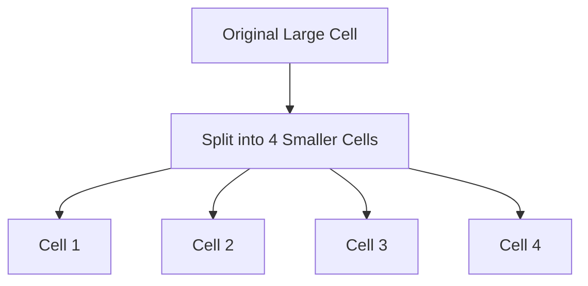

**Process:**

- **Step 1**: Identify congested cell with high traffic
- **Step 2**: Install new base stations with lower power
- **Step 3**: Reduce original base station power
- **Step 4**: Create multiple smaller coverage areas

**Benefits:**

- **Capacity Increase**: More channels available in same area
- **Better Signal Quality**: Shorter distances improve signal strength

**Mnemonic:** "Split Big Cell into Small Cells"

---

## Question 2(b OR) [4 marks]

**Write functions of HLR and VLR in GSM.**

**Answer**:

**Functions Table:**

| Database | Full Form | Primary Functions |
|----------|-----------|-------------------|
| **HLR** | Home Location Register | Permanent subscriber data |
| **VLR** | Visitor Location Register | Temporary visitor data |

**HLR Functions:**

- **Subscriber Profile**: Stores permanent subscriber information (IMSI, services)
- **Location Tracking**: Maintains current location area of subscriber
- **Authentication**: Provides authentication keys for security
- **Service Management**: Controls subscribed services and restrictions

**VLR Functions:**

- **Temporary Storage**: Stores visiting subscriber data temporarily
- **Local Services**: Enables services for roaming subscribers  
- **Call Routing**: Assists in routing calls to visiting subscribers
- **Authentication Copy**: Maintains copy of authentication data from HLR

**Interaction:**

- HLR updates VLR when subscriber roams to new area
- VLR requests subscriber data from HLR during registration

**Mnemonic:** "HLR = Home Data, VLR = Visitor Data"

---

## Question 2(c OR) [7 marks]

**Describe RFID technology.**

**Answer**:

**RFID Overview:**
Radio Frequency Identification uses electromagnetic fields to identify and track tags attached to objects.

**System Components:**

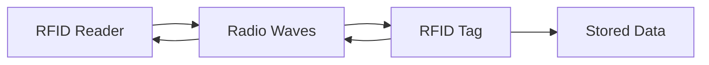

**Types Table:**

| Type | Power Source | Range | Applications |
|------|--------------|-------|--------------|
| **Passive** | Reader's energy | 0.1-10m | Access cards |
| **Active** | Internal battery | 10-100m | Vehicle tracking |
| **Semi-passive** | Battery + Reader | 1-30m | Temperature sensors |

**Key Features:**

- **No Line of Sight**: Works without direct visual contact
- **Multiple Reading**: Can read multiple tags simultaneously
- **Data Storage**: Can store and update information
- **Durability**: Resistant to environmental conditions

**Applications:**

- **Inventory Management**: Warehouse and retail tracking
- **Access Control**: Building and vehicle access
- **Payment Systems**: Contactless payment cards
- **Supply Chain**: Product tracking from manufacturing to sale

**Advantages:**

- **Fast Reading**: Instant identification without scanning
- **Automation**: Reduces manual data entry errors
- **Real-time Tracking**: Continuous monitoring of assets

**Mnemonic:** "Radio Frequency Identifies Everything"

---

## Question 3(a) [3 marks]

**Draw GSM architecture.**

**Answer**:

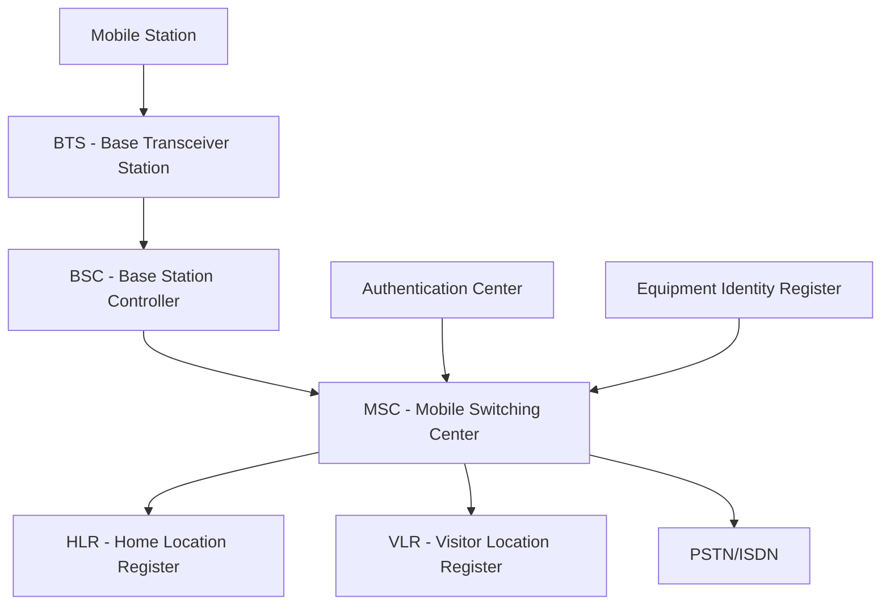

**Components:**

- **MS**: Mobile Station (handset + SIM)
- **BTS**: Radio interface with mobile
- **BSC**: Controls multiple BTS, handles handoffs
- **MSC**: Switching and call control
- **HLR/VLR**: Database for subscriber information

**Mnemonic:** "Mobile Talks Through BTS-BSC-MSC"

---

## Question 3(b) [4 marks]

**Write GSM 900 specifications.**

**Answer**:

**GSM 900 Specifications Table:**

| Parameter | Specification |
|-----------|---------------|
| **Frequency Band** | 890-915 MHz (Uplink), 935-960 MHz (Downlink) |
| **Channel Spacing** | 200 kHz |
| **Total Channels** | 124 channels |
| **Modulation** | GMSK (Gaussian MSK) |
| **Access Method** | TDMA/FDMA |
| **Frame Duration** | 4.615 ms |
| **Time Slots** | 8 per frame |
| **Speech Coding** | 13 kbps RPE-LTP |

**Key Features:**

- **Digital Transmission**: Superior voice quality compared to analog
- **International Roaming**: Global compatibility standard
- **Security**: Encryption and authentication built-in
- **SMS Support**: Short message service capability

**Coverage:**

- **Cell Radius**: Up to 35 km (rural areas)
- **Power Classes**: 5 classes from 0.8W to 20W

**Mnemonic:** "900 MHz, 200 kHz spacing, 8 time slots"

---

## Question 3(c) [7 marks]

**Explain mobile to landline and landline to mobile call procedure in GSM.**

**Answer**:

**Mobile to Landline Call Procedure:**

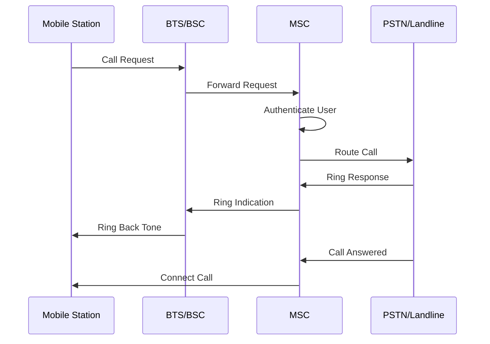

**Steps:**

1. **Call Initiation**: Mobile dials landline number
2. **Channel Assignment**: BSC assigns traffic channel
3. **Authentication**: MSC verifies subscriber
4. **Routing**: MSC routes call to PSTN gateway
5. **Connection**: End-to-end connection established

**Landline to Mobile Call Procedure:**

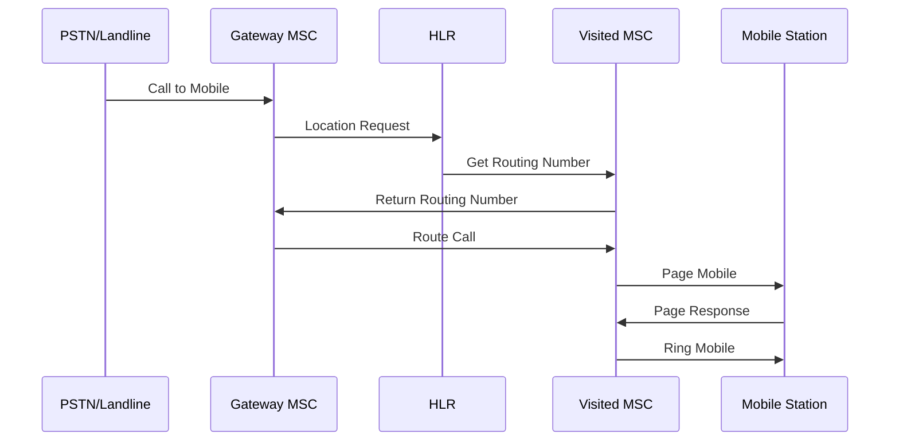

**Steps:**

1. **Call Reception**: PSTN receives call to mobile number
2. **HLR Query**: Gateway MSC queries HLR for location
3. **Location Update**: HLR provides current MSC information
4. **Paging**: Visited MSC pages mobile in location area
5. **Connection**: Mobile responds and call is connected

**Key Differences:**

- **Mobile Originating**: Direct routing through serving MSC
- **Mobile Terminating**: Requires location lookup through HLR

**Mnemonic:** "Mobile Out = Direct, Mobile In = Find First"

---

## Question 3(a OR) [3 marks]

**Explain fast and slow frequency hopping.**

**Answer**:

**Frequency Hopping Types:**

**Table: Fast vs Slow Hopping**

| Parameter | Fast Hopping | Slow Hopping |
|-----------|--------------|---------------|
| **Hop Rate** | > Symbol Rate | < Symbol Rate |
| **Symbols per Hop** | < 1 | > 1 |
| **Complexity** | High | Low |
| **GSM Usage** | Not used | Used (217 hops/sec) |

**Fast Frequency Hopping:**

- **Definition**: Frequency changes multiple times per symbol
- **Characteristics**: Very high hop rate, complex implementation
- **Advantage**: Excellent interference resistance

**Slow Frequency Hopping:**

- **Definition**: Multiple symbols transmitted per frequency
- **GSM Implementation**: 217 hops per second
- **Advantage**: Simple to implement, effective interference averaging

**Mnemonic:** "Fast = Many hops per symbol, Slow = Many symbols per hop"

---

## Question 3(b OR) [4 marks]

**Explain authentication process in GSM.**

**Answer**:

**Authentication Process:**

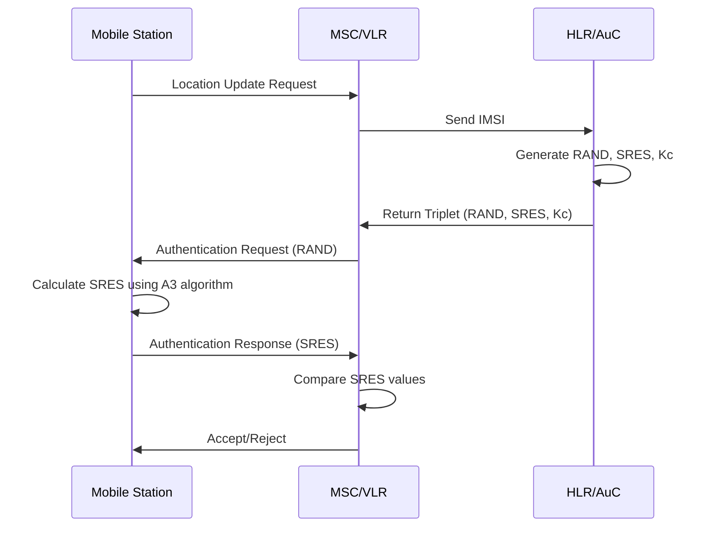

**Key Components:**

- **RAND**: Random number (128 bits)
- **SRES**: Signed response (32 bits)  
- **Kc**: Cipher key (64 bits)
- **Ki**: Individual subscriber authentication key

**Process Steps:**

1. **Challenge**: Network sends random number (RAND)
2. **Response**: Mobile calculates SRES using Ki and RAND
3. **Verification**: Network compares received and expected SRES
4. **Result**: Authentication success or failure

**Security Features:**

- **Mutual Authentication**: Prevents fake base stations
- **Unique Keys**: Each subscriber has individual Ki
- **Challenge-Response**: Prevents replay attacks

**Mnemonic:** "Random Challenge, Signed Response, Compare and Accept"

---

## Question 3(c OR) [7 marks]

**Draw and explain block diagram of Signal processing in GSM.**

**Answer**:

**GSM Signal Processing Block Diagram:**

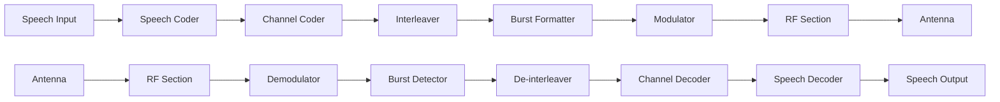

**Transmitter Processing:**

**Speech Coding:**

- **Function**: Converts analog speech to 13 kbps digital
- **Algorithm**: RPE-LTP (Regular Pulse Excitation - Long Term Prediction)
- **Frame Size**: 20 ms speech frames

**Channel Coding:**

- **Purpose**: Adds redundancy for error correction
- **Types**: Convolutional coding, block coding
- **Output**: Protected 22.8 kbps data stream

**Interleaving:**

- **Function**: Spreads coded bits across multiple time slots
- **Benefit**: Combats burst errors from fading
- **Types**: Block interleaving over 8 time slots

**Burst Formatting:**

- **Process**: Organizes data into GSM burst structure
- **Components**: Training sequence, guard bits, data bits
- **Types**: Normal burst, access burst, sync burst

**Modulation:**

- **Technique**: GMSK (Gaussian Minimum Shift Keying)
- **Bandwidth**: 200 kHz channel spacing
- **Symbol Rate**: 270.833 kbps

**Receiver Processing:**

- **Demodulation**: Recovers digital bits from RF signal
- **Equalization**: Compensates for multipath distortion
- **Error Correction**: Uses channel coding redundancy
- **Speech Decoding**: Reconstructs original speech

**Key Features:**

- **Digital Processing**: All operations in digital domain
- **Error Protection**: Multiple levels of error correction
- **Adaptive**: Parameters adjust to channel conditions

**Mnemonic:** "Speech-Code-Interleave-Burst-Modulate-Transmit"

---

## Question 4(a) [3 marks]

**Draw block diagram of baseband section.**

**Answer**:

**Baseband Section Block Diagram:**

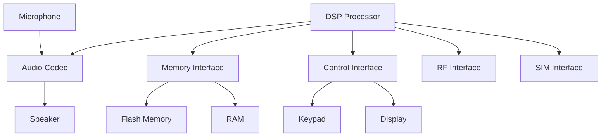

**Components:**

- **DSP**: Digital signal processing for speech and data
- **Audio Codec**: Analog-to-digital conversion
- **Memory**: Program storage (Flash) and working memory (RAM)
- **Control**: User interface management
- **Interfaces**: RF section, SIM card connections

**Functions:**

- **Signal Processing**: Speech coding, echo cancellation
- **Protocol Stack**: GSM layer 1, 2, 3 protocols
- **User Interface**: Display, keypad, audio management

**Mnemonic:** "DSP Controls Audio, Memory, Display, RF"

---

## Question 4(b) [4 marks]

**Explain EDGE.**

**Answer**:

**EDGE Overview:**
Enhanced Data rates for GSM Evolution - improves data transmission in GSM networks.

**Key Features Table:**

| Parameter | GSM/GPRS | EDGE |
|-----------|----------|------|
| **Modulation** | GMSK | 8-PSK |
| **Data Rate** | 9.6-171 kbps | Up to 473 kbps |
| **Generation** | 2.5G | 2.75G |
| **Symbol Rate** | 270.833 ksps | 270.833 ksps |

**Technical Improvements:**

- **Advanced Modulation**: 8-PSK carries 3 bits per symbol vs 1 bit in GMSK
- **Link Adaptation**: Automatically switches between GMSK and 8-PSK
- **Enhanced Coding**: Better error correction schemes
- **Incremental Redundancy**: Improved retransmission strategy

**Benefits:**

- **Higher Data Rates**: 3x faster than GPRS
- **Backward Compatibility**: Works with existing GSM infrastructure
- **Cost Effective**: Software upgrade to existing networks
- **Multimedia Support**: Enables better mobile internet experience

**Applications:**

- **Mobile Internet**: Faster web browsing
- **Email**: Quick email with attachments
- **Multimedia Messaging**: MMS support
- **Video Calls**: Basic video communication

**Mnemonic:** "EDGE = Enhanced Data rates for GSM Evolution"

---

## Question 4(c) [7 marks]

**Draw and explain block diagram of mobile handset.**

**Answer**:

**Mobile Handset Block Diagram:**

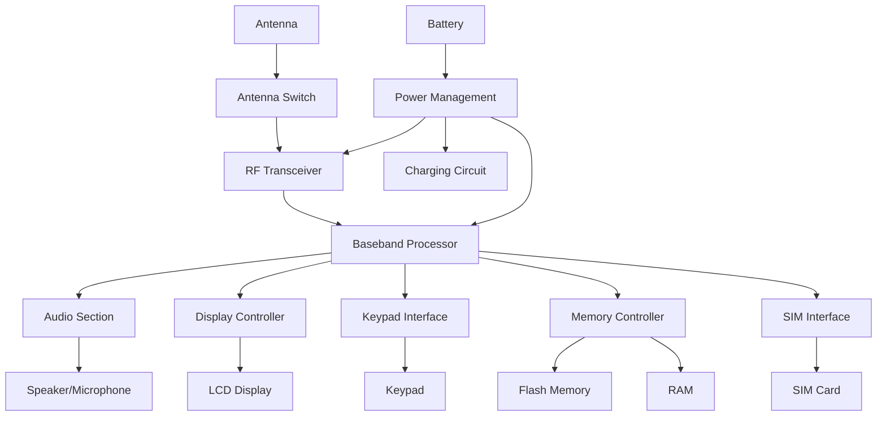

**Major Sections:**

**RF Section:**

- **Antenna**: Transmits and receives radio signals
- **Duplexer**: Separates TX and RX signals
- **RF Transceiver**: Up/down conversion, amplification
- **Frequency Synthesizer**: Generates carrier frequencies

**Baseband Section:**

- **DSP**: Digital signal processing for speech and data
- **Protocol Stack**: Implements GSM protocols
- **Control Unit**: Manages all mobile functions
- **Memory Interface**: Controls program and data storage

**Audio Section:**

- **Audio Codec**: A/D and D/A conversion
- **Audio Amplifier**: Drives speaker
- **Microphone Amplifier**: Amplifies voice input
- **Hands-free Support**: External audio accessories

**User Interface:**

- **Display**: Shows information to user (LCD/OLED)
- **Keypad**: User input interface
- **LED Indicators**: Status indication
- **Vibrator**: Alert mechanism

**Power Management:**

- **Battery**: Energy storage (Li-ion typically)
- **Charging Circuit**: Battery charging control
- **Power Regulation**: Voltage regulation for all sections
- **Power Saving**: Sleep modes and power optimization

**Memory System:**

- **Flash Memory**: Program storage and user data
- **RAM**: Working memory for program execution
- **SIM Interface**: Secure element for subscriber identity

**Interconnections:**

- **Control Bus**: Command and control signals
- **Data Bus**: Information transfer
- **Power Bus**: Power distribution
- **Audio Bus**: Voice and audio signals

**Operation:**

1. **Receive**: Antenna → RF → Baseband → Audio → Speaker
2. **Transmit**: Microphone → Audio → Baseband → RF → Antenna
3. **Control**: User input → Baseband → Display output
4. **Processing**: All operations controlled by baseband processor

**Mnemonic:** "Antenna-RF-Baseband-Audio-Display-Power"

---

## Question 4(a OR) [3 marks]

**Explain radiation hazards due to mobile.**

**Answer**:

**Radiation Hazards:**

**SAR (Specific Absorption Rate):**

- **Definition**: Rate of energy absorption by human body
- **Unit**: Watts per kilogram (W/kg)
- **Limit**: 2.0 W/kg (Europe), 1.6 W/kg (USA)

**Health Concerns Table:**

| Effect | Risk Level | Symptoms |
|--------|------------|----------|
| **Thermal** | Confirmed | Tissue heating |
| **Non-thermal** | Under study | Headaches, fatigue |
| **Long-term** | Uncertain | Cancer concerns |

**Prevention Measures:**

- **Distance**: Keep phone away from body during calls
- **Duration**: Limit call duration
- **Hands-free**: Use headsets or speakerphone
- **Low SAR**: Choose phones with lower SAR values

**Safety Guidelines:**

- Avoid sleeping with phone near head
- Use airplane mode when not needed
- Keep calls short and use text when possible

**Mnemonic:** "SAR measures absorption rate"

---

## Question 4(b OR) [4 marks]

**Describe working of charging section in mobile handset.**

**Answer**:

**Charging Section Block Diagram:**

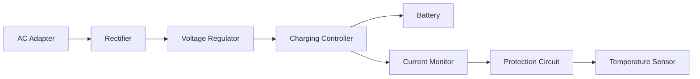

**Components & Functions:**

**Charging Controller:**

- **Function**: Controls charging current and voltage
- **Types**: Linear and switching mode controllers
- **Protection**: Prevents overcharging and overheating

**Charging Process:**

1. **Constant Current**: Initial high current charging (fast charge)
2. **Constant Voltage**: Voltage maintained, current decreases
3. **Trickle Charge**: Low current maintenance charging
4. **Cut-off**: Charging stops when battery full

**Protection Features:**

- **Over-voltage Protection**: Prevents damage from high voltage
- **Over-current Protection**: Limits maximum charging current
- **Temperature Monitoring**: Stops charging if battery gets too hot
- **Reverse Polarity**: Prevents damage from wrong connection

**Battery Management:**

- **Fuel Gauge**: Monitors battery capacity
- **Cell Balancing**: Ensures equal charging of battery cells
- **Health Monitoring**: Tracks battery condition over time

**Mnemonic:** "Control Current, Voltage, Temperature, and Time"

---

## Question 4(c OR) [7 marks]

**Draw and explain block diagram of DSSS transmitter and receiver.**

**Answer**:

**DSSS Transmitter Block Diagram:**

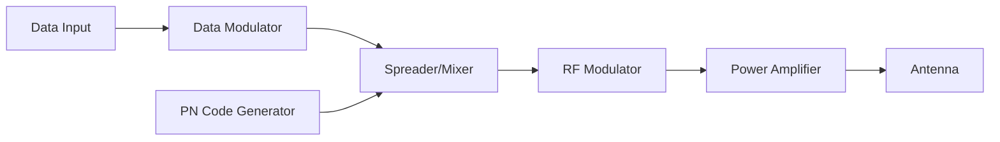

**DSSS Receiver Block Diagram:**

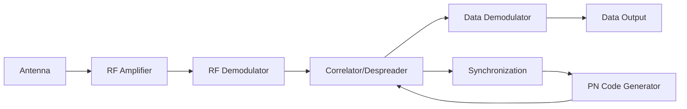

**Transmitter Operation:**

**Data Modulation:**

- **Input**: Original data stream (low rate)
- **Modulation**: BPSK or QPSK modulation
- **Output**: Modulated narrowband signal

**Spreading Process:**

- **PN Code**: Pseudo-random binary sequence (high rate)
- **Spreading**: XOR operation between data and PN code
- **Result**: Wideband spread spectrum signal

**RF Modulation:**

- **Carrier**: High frequency carrier signal
- **Modulation**: Spread signal modulates RF carrier
- **Transmission**: Signal transmitted through antenna

**Receiver Operation:**

**RF Processing:**

- **Reception**: Antenna receives spread spectrum signal
- **Amplification**: Low noise amplifier boosts weak signal
- **Demodulation**: Recovers baseband spread signal

**Despreading Process:**

- **Correlation**: Received signal correlated with same PN code
- **Synchronization**: PN code timing synchronized with received signal
- **Output**: Original narrowband data signal recovered

**Key Parameters:**

- **Processing Gain**: Ratio of spread bandwidth to data bandwidth
- **Chip Rate**: Rate of PN code (higher than data rate)
- **Spreading Factor**: Processing gain value

**Advantages:**

- **Interference Rejection**: Resistant to narrowband interference
- **Low Probability of Intercept**: Difficult to detect and jam
- **Multiple Access**: Many users can share same frequency
- **Multipath Resistance**: Reduces fading effects

**Applications:**

- **CDMA Cellular**: IS-95, CDMA2000, WCDMA
- **GPS**: Global positioning system
- **WiFi**: 802.11b spread spectrum mode
- **Military**: Secure communications

**Mnemonic:** "Data Spreads with PN, Correlates to Recover"

---

## Question 5(a) [3 marks]

**Explain the concept of spread spectrum.**

**Answer**:

**Spread Spectrum Concept:**
A communication technique where the transmitted signal bandwidth is much wider than the minimum required bandwidth.

**Basic Principle:**

| Parameter | Before Spreading | After Spreading |
|-----------|------------------|-----------------|
| **Bandwidth** | Narrow (data rate) | Wide (chip rate) |
| **Power Density** | High | Low |
| **Interference** | Vulnerable | Resistant |

**Key Characteristics:**

- **Bandwidth Expansion**: Signal spread over wide frequency range
- **Processing Gain**: Improvement in signal-to-noise ratio
- **Pseudo-random Sequence**: Spreading code known only to intended receiver
- **Security**: Difficult for unauthorized users to intercept

**Benefits:**

- **Jam Resistance**: Immune to intentional interference
- **Low Power Density**: Coexists with narrowband systems
- **Multiple Access**: Many users share same spectrum
- **Privacy**: Encrypted-like transmission

**Mnemonic:** "Spread Wide, Gain Processing Power"

---

## Question 5(b) [4 marks]

**Write criteria of spread spectrum and its applications.**

**Answer**:

**Spread Spectrum Criteria:**

**Technical Criteria:**

1. **Bandwidth**: Transmitted bandwidth >> Information bandwidth
2. **Processing Gain**: Gp = Spread BW / Data BW ≥ 10 dB
3. **Pseudo-random**: Spreading sequence appears random
4. **Synchronization**: Receiver must sync with transmitter code

**Performance Criteria Table:**

| Criteria | Requirement | Benefit |
|----------|-------------|---------|
| **Processing Gain** | > 10 dB | Interference rejection |
| **Code Length** | Long period | Security and randomness |
| **Cross-correlation** | Low | Multiple user separation |
| **Auto-correlation** | Sharp peak | Synchronization |

**Applications:**

**Military Communications:**

- **Anti-jam**: Resistant to enemy jamming
- **LPI/LPD**: Low probability of intercept/detection
- **Secure**: Encrypted transmission

**Cellular Systems:**

- **CDMA**: IS-95, CDMA2000, WCDMA
- **Capacity**: Multiple users per frequency
- **Quality**: Reduced interference

**Satellite Communications:**

- **GPS**: Global positioning system
- **Weather**: Satellite data transmission
- **Broadcasting**: Satellite radio/TV

**Wireless Networks:**

- **WiFi**: 802.11b DSSS mode
- **Bluetooth**: Frequency hopping
- **Cordless Phones**: 2.4 GHz band

**Mnemonic:** "Military, Cellular, Satellite, Wireless use Spread Spectrum"

---

## Question 5(c) [7 marks]

**Explain call processing in CDMA.**

**Answer**:

**CDMA Call Processing Sequence:**

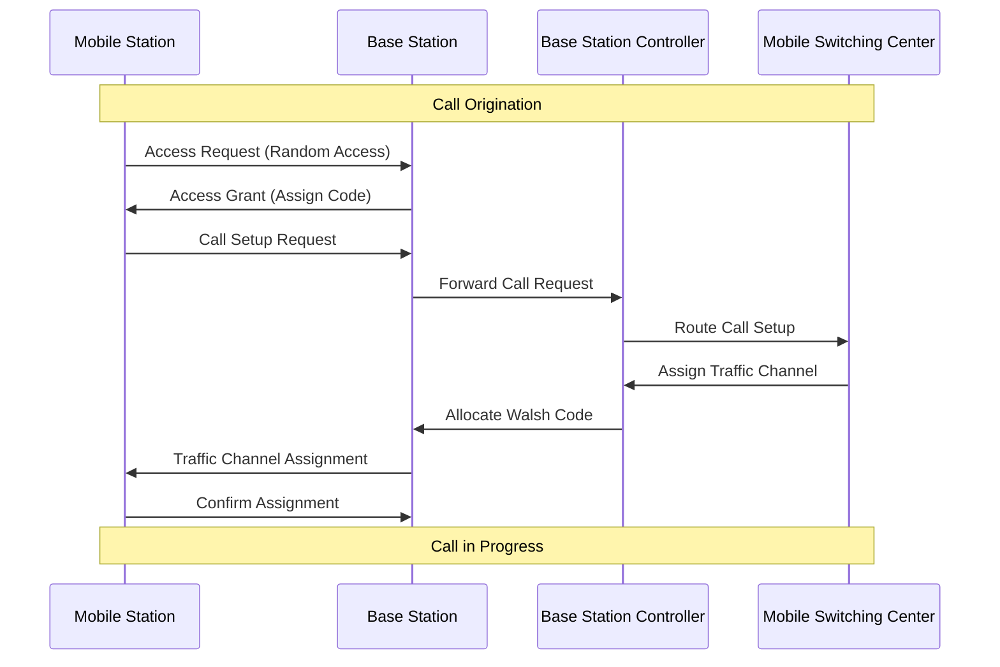

**Call Origination Process:**

**Step 1: System Access**

- **Random Access**: Mobile sends access probe on access channel
- **Power Control**: Gradually increases power until acknowledged
- **Code Assignment**: Base station assigns unique spreading code

**Step 2: Authentication**

- **Challenge**: Network sends authentication challenge
- **Response**: Mobile responds with calculated authentication
- **Validation**: Network validates mobile identity

**Step 3: Channel Assignment**

- **Walsh Code**: Unique orthogonal code assigned for forward link
- **PN Offset**: Base station identified by PN sequence offset
- **Power Level**: Initial transmission power set

**Step 4: Traffic Channel Setup**

- **Service Options**: Voice, data, or multimedia service negotiated
- **Rate Set**: Transmission rate configured (Rate Set 1 or 2)
- **Handoff Parameters**: Neighboring cell information provided

**Call Processing Features:**

**Soft Handoff:**

- **Multiple Connections**: Mobile maintains links to multiple base stations
- **Diversity**: Improves call quality and reliability
- **Make-before-Break**: New connection established before old one dropped

**Power Control:**

- **Closed Loop**: Rapid power adjustments (800 Hz rate)
- **Open Loop**: Initial power estimation
- **Purpose**: Minimize interference, maximize capacity

**Variable Rate Vocoder:**

- **Rate Adaptation**: Transmission rate varies with speech activity
- **Silence Detection**: Lower rates during speech pauses
- **Capacity**: Increases system capacity

**Call Termination Process:**

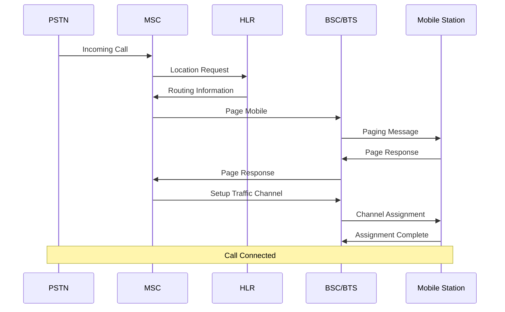

**Key CDMA Features:**

**Rake Receiver:**

- **Multipath Combining**: Combines multiple signal paths
- **Diversity Gain**: Improves signal quality
- **Finger Assignment**: Each finger tracks different path

**Capacity Advantages:**

- **Frequency Reuse**: Same frequency used in all cells
- **Interference Limited**: Capacity limited by interference, not frequency
- **Voice Activity**: Statistical multiplexing increases capacity

**Quality Features:**

- **Error Correction**: Forward error correction coding
- **Interleaving**: Protects against burst errors
- **Adaptive Rates**: Data rate adapts to channel conditions

**Call States:**

1. **Idle**: Mobile monitoring paging channel
2. **Access**: Attempting to access system
3. **Traffic**: Active call in progress
4. **Handoff**: Transitioning between base stations

**Mnemonic:** "Access-Authenticate-Assign-Traffic-Handoff"

---

## Question 5(a OR) [3 marks]

**Write features of Zigbee and advantages.**

**Answer**:

**Zigbee Features:**

**Technical Specifications Table:**

| Parameter | Specification |
|-----------|---------------|
| **Standard** | IEEE 802.15.4 |
| **Frequency** | 2.4 GHz, 915 MHz, 868 MHz |
| **Data Rate** | 250 kbps (2.4 GHz) |
| **Range** | 10-100 meters |
| **Power** | Ultra-low power |

**Key Features:**

- **Mesh Network**: Self-organizing and self-healing network
- **Low Power**: Battery life up to years
- **Low Cost**: Inexpensive hardware implementation
- **Simple Protocol**: Easy to implement and deploy

**Advantages:**

- **Long Battery Life**: Optimized for battery-powered devices
- **Network Reliability**: Multiple routing paths available
- **Scalability**: Supports thousands of nodes
- **Interoperability**: Standard ensures device compatibility

**Applications:**

- **Home automation, Industrial monitoring, Smart lighting**

**Mnemonic:** "Low Power, Mesh Network, Many Applications"

---

## Question 5(b OR) [4 marks]

**Explain OFDM with block diagram.**

**Answer**:

**OFDM Block Diagram:**

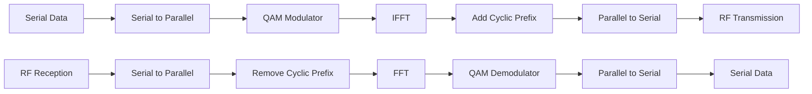

**OFDM Principle:**
Orthogonal Frequency Division Multiplexing divides high-speed data into multiple parallel low-speed streams transmitted simultaneously on different frequencies.

**Key Components:**

**IFFT/FFT:**

- **IFFT**: Inverse Fast Fourier Transform creates orthogonal subcarriers
- **FFT**: Fast Fourier Transform recovers data at receiver
- **Orthogonality**: Subcarriers don't interfere with each other

**Cyclic Prefix:**

- **Function**: Prevents inter-symbol interference
- **Implementation**: Copy of signal end added to beginning
- **Length**: Longer than channel delay spread

**Advantages:**

- **Spectral Efficiency**: High data rate in limited bandwidth
- **Multipath Immunity**: Resistant to fading channels
- **Flexible**: Easy to implement with DSP

**Applications:**

- **4G LTE**: Mobile communication standard
- **WiFi**: 802.11a/g/n/ac standards
- **Digital TV**: DVB-T, ISDB-T standards

**Mnemonic:** "Orthogonal Frequencies Divide Multiplexed data"

---

## Question 5(c OR) [7 marks]

**Describe MANET.**

**Answer**:

**MANET Overview:**
Mobile Ad-hoc Network is a self-configuring network of mobile devices connected wirelessly without fixed infrastructure.

**Network Topology:**

```goat
     A ---- B
     |    / |
     |   /  |
     C ---- D ---- E
       \   /
        \ /
         F
```

**Key Characteristics:**

**Architecture Table:**

| Parameter | MANET | Cellular Network |
|-----------|-------|------------------|
| **Infrastructure** | No fixed base stations | Base stations required |
| **Topology** | Dynamic, changes frequently | Fixed cell structure |
| **Routing** | Multi-hop peer-to-peer | Single hop to base station |
| **Cost** | Low deployment cost | High infrastructure cost |

**MANET Features:**

**Dynamic Topology:**

- **Mobile Nodes**: All nodes can move freely
- **Changing Links**: Network connections change as nodes move
- **Self-Organization**: Network automatically reconfigures

**Multi-hop Communication:**

- **Relay Function**: Nodes act as routers for other nodes
- **Path Discovery**: Dynamic route finding to destination
- **Distributed Control**: No central coordination needed

**Routing Protocols:**

**Proactive Protocols:**

- **DSDV**: Destination Sequenced Distance Vector
- **Characteristic**: Maintain routing tables continuously
- **Advantage**: Routes available immediately
- **Disadvantage**: High overhead in mobile environment

**Reactive Protocols:**

- **AODV**: Ad-hoc On-demand Distance Vector
- **DSR**: Dynamic Source Routing
- **Characteristic**: Find routes only when needed
- **Advantage**: Lower overhead
- **Disadvantage**: Route discovery delay

**Hybrid Protocols:**

- **ZRP**: Zone Routing Protocol
- **Combination**: Proactive within zone, reactive between zones
- **Balance**: Overhead vs. delay optimization

**Advantages:**

- **No Infrastructure**: Quick deployment without base stations
- **Flexibility**: Network adapts to changing topology
- **Cost Effective**: Lower setup and maintenance costs
- **Robustness**: No single point of failure

**Disadvantages:**

- **Limited Bandwidth**: Shared wireless medium
- **Power Consumption**: Routing functions drain battery
- **Security Issues**: Vulnerable to attacks
- **Scalability**: Performance degrades with network size

**Applications:**

**Military Operations:**

- **Battlefield Communications**: Soldier-to-soldier communication
- **Emergency Response**: Disaster relief coordination
- **Surveillance**: Sensor network deployment

**Commercial Applications:**

- **Vehicular Networks**: Car-to-car communication
- **Sensor Networks**: Environmental monitoring
- **Conference Networks**: Temporary meeting networks
- **Personal Area Networks**: Device interconnection

**Challenges:**

**Technical Challenges:**

- **Routing Overhead**: Control message bandwidth consumption
- **Quality of Service**: Difficulty in guaranteeing service levels
- **Power Management**: Energy-efficient operation
- **Interference**: Co-channel interference from multiple hops

**Security Challenges:**

- **Authentication**: Verifying node identity
- **Data Integrity**: Ensuring message authenticity
- **Privacy**: Protecting user information
- **Denial of Service**: Preventing network attacks

**Performance Metrics:**

- **Throughput**: Data delivery rate
- **Delay**: End-to-end packet delivery time
- **Packet Loss**: Percentage of lost packets
- **Energy Consumption**: Battery life optimization

**Future Trends:**

- **Integration**: Combination with cellular and WiFi networks
- **IoT Applications**: Internet of Things device networks
- **5G Integration**: Part of 5G network architecture
- **AI-based Routing**: Machine learning for optimal routing

**Mnemonic:** "Mobile Nodes, Ad-hoc Routing, No Infrastructure, Temporary Networks"
