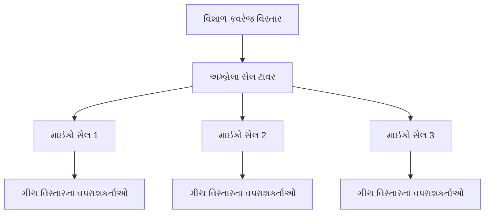
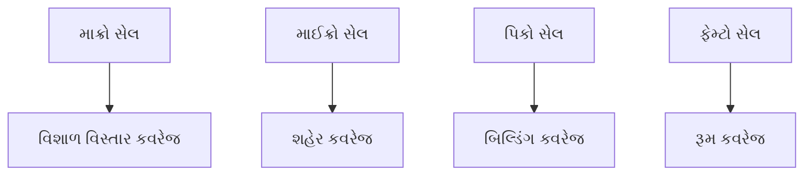
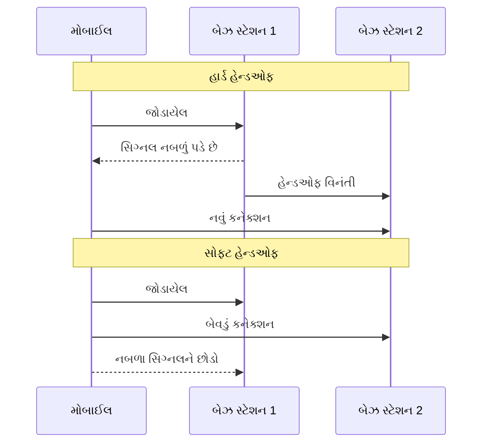
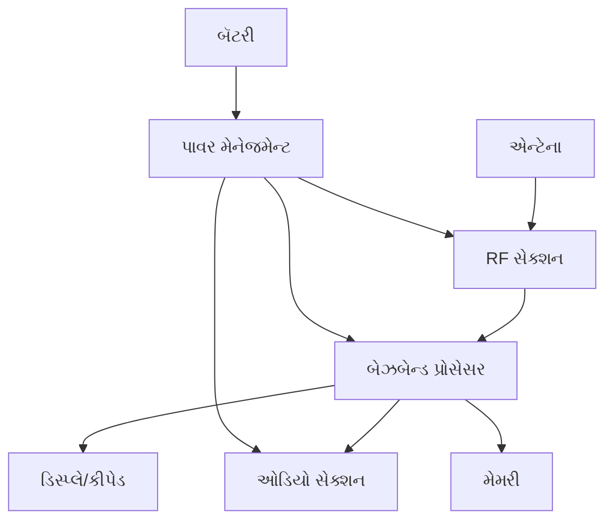
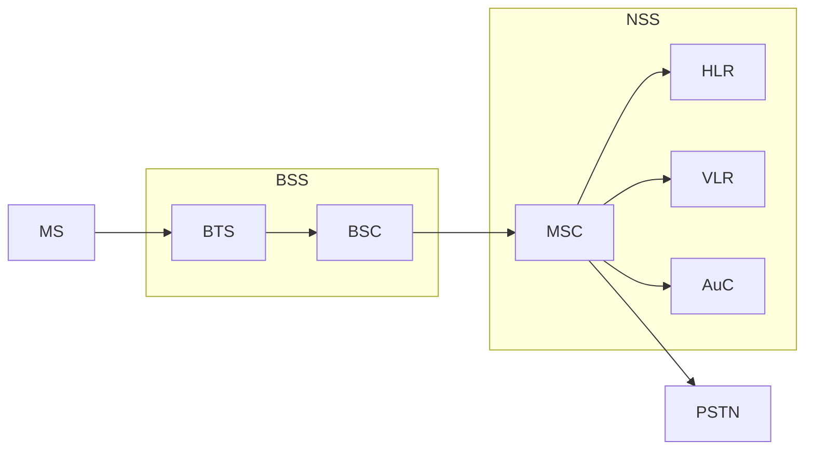
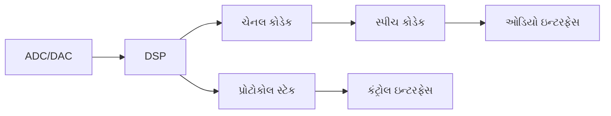
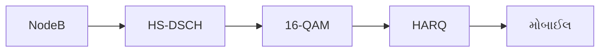
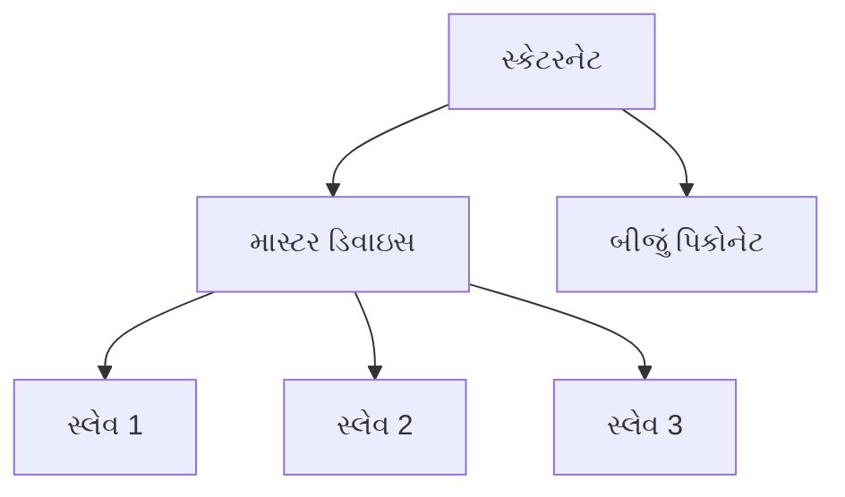
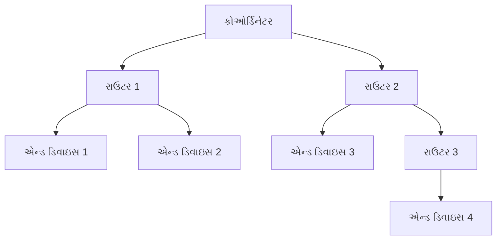

## પ્રશ્ન 1(અ) [3 ગુણ]

**અમ્બ્રેલા સેલ આકૃતિ દોરી સમજાવો.**

**જવાબ**:



- **અમ્બ્રેલા સેલ**: નાના સેલોને આવરી લેતા વિશાળ કવરેજ વાળા સેલ
- **હેતુ**: માઈક્રો/પિકો સેલોમાંથી વધારે ટ્રાફિક સંભાળે છે
- **કવરેજ**: ઉચ્ચ-ટ્રાફિક વિસ્તારો માટે બેકઅપ કવરેજ પૂરું પાડે છે

**મેમરી ટ્રીક:** "મારા મોટા છત્ર નીચે"

## પ્રશ્ન 1(બ) [4 ગુણ]

**ફુલ ફોર્મ લખો : (i) CCH (ii) TCH (iii) SCH (iv) BCCH**

**જવાબ**:

| સંક્ષેપ | પૂરું નામ | કાર્ય |
|---------|-----------|-------|
| CCH | Control Channel | નિયંત્રણ માહિતી વહન કરે છે |
| TCH | Traffic Channel | અવાજ/ડેટા ટ્રાફિક વહન કરે છે |
| SCH | Synchronization Channel | સમય સિંક્રોનાઈઝેશન પૂરું પાડે છે |
| BCCH | Broadcast Control Channel | સિસ્ટમ માહિતી પ્રસારિત કરે છે |

**મેમરી ટ્રીક:** "કંટ્રોલ ટ્રાફિક સિંક બ્રોડકાસ્ટ"

## પ્રશ્ન 1(ક) [7 ગુણ]

**સેલ શું છે? અલગ અલગ પ્રકારના સેલ સમજાવો.**

**જવાબ**:
**સેલ** એ સેલ્યુલર કમ્યુનિકેશનમાં એક બેઝ સ્ટેશન દ્વારા આવરી લેવાતો મૂળભૂત કવરેજ વિસ્તાર છે.

| સેલનો પ્રકાર | કવરેજ | પાવર | ઉપયોગ |
|-----------|----------|-------|-------|
| **માક્રો સેલ** | 1-30 km | ઉચ્ચ | ગ્રામ્ય વિસ્તારો |
| **માઈક્રો સેલ** | 100m-2km | મધ્યમ | શહેરી વિસ્તારો |
| **પિકો સેલ** | 10-100m | નીચું | ઇન્ડોર કવરેજ |
| **ફેમ્ટો સેલ** | 10-30m | ખૂબ નીચું | ઘર/ઓફિસ |



- **કાર્ય**: દરેક સેલ મોબાઈલ વપરાશકર્તાઓને વાયરલેસ સેવા પૂરી પાડે છે
- **આવૃત્તિ પુનઃઉપયોગ**: બિન-સંલગ્ન સેલોમાં સમાન આવૃત્તિઓનો ઉપયોગ
- **હેન્ડઓફ**: વપરાશકર્તાઓ સેલો વચ્ચે નિરંતર ખસી શકે છે

**મેમરી ટ્રીક:** "ઘણા મોબાઈલ લોકો કવરેજ શોધે છે"

## પ્રશ્ન 1(ક અથવા) [7 ગુણ]

**હેન્ડઓફ શું છે? સોફ્ટ અને હાર્ડ હેન્ડઓફ સમજાવો.**

**જવાબ**:
**હેન્ડઓફ** એ મોબાઈલ ખસતા સમયે ચાલુ કોલને એક સેલમાંથી બીજા સેલમાં સ્થાનાંતરિત કરવાની પ્રક્રિયા છે.

| લક્ષણ | હાર્ડ હેન્ડઓફ | સોફ્ટ હેન્ડઓફ |
|---------|--------------|--------------|
| **કનેક્શન** | તોડ્યા પછી જોડાણ | જોડાણ પછી તોડવું |
| **ચેનલો** | એક સમયે એક | એકસાથે ઘણા |
| **ટેક્નોલોજી** | GSM, TDMA | CDMA |
| **ગુણવત્તા** | થોડી વિક્ષેપ | સરળ સંક્રમણ |



- **પ્રારંભ**: સિગ્નલ મજબૂતાઈના માપ પર આધારિત
- **MAHO**: Mobile Assisted Handoff નિર્ણયની ચોકસાઈ સુધારે છે

**મેમરી ટ્રીક:** "હાર્ડ દુખાવે, સોફ્ટ સરળ"

## પ્રશ્ન 2(અ) [3 ગુણ]

**ફુલ ફોર્મ લખો : (i) SIM (ii) LTE (iii) WCDMA**

**જવાબ**:

| સંક્ષેપ | પૂરું નામ | હેતુ |
|---------|-----------|---------|
| SIM | Subscriber Identity Module | વપરાશકર્તા પ્રમાણીકરણ |
| LTE | Long Term Evolution | 4G ટેક્નોલોજી |
| WCDMA | Wideband Code Division Multiple Access | 3G માનક |

**મેમરી ટ્રીક:** "સબ્સ્ક્રાઈબરનું લાંબા વાઈડબેન્ડ કનેક્શન"

## પ્રશ્ન 2(બ) [4 ગુણ]

**મોબાઈલ હેન્ડસેટની બ્લોક આકૃતિ દોરો.**

**જવાબ**:



- **RF સેક્શન**: રેડિયો સિગ્નલ મોકલે/મેળવે છે
- **બેઝબેન્ડ**: ડિજિટલ સિગ્નલ અને પ્રોટોકોલ પ્રોસેસ કરે છે
- **ઓડિયો**: અવાજનું ઇનપુટ/આઉટપુટ સંભાળે છે
- **પાવર મેનેજમેન્ટ**: બૅટરીનો ઉપયોગ કાર્યક્ષમતાથી નિયંત્રિત કરે છે

**મેમરી ટ્રીક:** "રેડિયો બેઝબેન્ડ ઓડિયો પાવર"

## પ્રશ્ન 2(ક) [7 ગુણ]

**GSM આર્કિટેક્ચર આકૃતિ સાથે સમજાવો.**

**જવાબ**:



| ઘટક | કાર્ય |
|-----------|----------|
| **MS** | Mobile Station (હેન્ડસેટ) |
| **BTS** | Base Transceiver Station |
| **BSC** | Base Station Controller |
| **MSC** | Mobile Switching Center |
| **HLR** | Home Location Register |
| **VLR** | Visitor Location Register |

- **BSS**: Base Station Subsystem રેડિયો ઇન્ટરફેસ સંભાળે છે
- **NSS**: Network Switching Subsystem કોલો મેનેજ કરે છે
- **પ્રમાણીકરણ**: AuC સબ્સ્ક્રાઈબરની ઓળખ ચકાસે છે

**મેમરી ટ્રીક:** "મોબાઈલ બેઝ નેટવર્ક ઘર કોલ કરે છે"

## પ્રશ્ન 2(અ અથવા) [3 ગુણ]

**ફુલ ફોર્મ લખો : (i) RSSI (ii) MAHO (iii) NCHO**

**જવાબ**:

| સંક્ષેપ | પૂરું નામ | કાર્ય |
|---------|-----------|----------|
| RSSI | Received Signal Strength Indicator | સિગ્નલ ગુણવત્તા માપ |
| MAHO | Mobile Assisted Handoff | મોબાઈલ હેન્ડઓફ નિર્ણયમાં મદદ કરે છે |
| NCHO | Network Controlled Handoff | નેટવર્ક હેન્ડઓફ નક્કી કરે છે |

**મેમરી ટ્રીક:** "પ્રાપ્ત મોબાઈલ નેટવર્ક સિગ્નલો"

## પ્રશ્ન 2(બ અથવા) [4 ગુણ]

**બેઝબેન્ડ સેક્શનની બ્લોક આકૃતિ દોરો.**

**જવાબ**:



- **ADC/DAC**: Analog to Digital કન્વર્ઝન
- **DSP**: Digital Signal Processor
- **ચેનલ કોડેક**: ભૂલ સુધારણા કોડિંગ
- **સ્પીચ કોડેક**: અવાજ સંકોચન/વિસ્તારણ

**મેમરી ટ્રીક:** "એનાલોગ ડિજિટલ સ્પીચ પ્રોટોકોલ"

## પ્રશ્ન 2(ક અથવા) [7 ગુણ]

**GSM સિગ્નલ પ્રોસેસિંગ આકૃતિ સાથે સમજાવો.**

**જવાબ**:


| તબક્કો | કાર્ય | હેતુ |
|-------|----------|---------|
| **સ્પીચ કોડેક** | અવાજને 13 kbps માં સંકોચે છે | બેન્ડવિડ્થ કાર્યક્ષમતા |
| **ચેનલ કોડેક** | ભૂલ સુધારણા ઉમેરે છે | સિગ્નલ વિશ્વસનીયતા |
| **ઇન્ટરલીવિંગ** | બર્સ્ટ ભૂલો વિતરિત કરે છે | ભૂલ સુરક્ષા |
| **GMSK** | Gaussian MSK મોડ્યુલેશન | સ્પેક્ટ્રલ કાર્યક્ષમતા |

- **પ્રોસેસિંગ રેટ**: 270.833 kbps કુલ બિટ રેટ
- **ફ્રેમ સ્ટ્રક્ચર**: TDMA ફ્રેમ દીઠ 8 ટાઈમ સ્લોટ
- **ફ્રીક્વન્સી હોપિંગ**: પ્રતિ સેકન્ડ 217 હોપ્સ

**મેમરી ટ્રીક:** "સ્પીચ ચેનલ ઇન્ટરલીવ મોડ્યુલેટેડ રેડિયો"

## પ્રશ્ન 3(અ) [3 ગુણ]

**સેલ સ્પ્લિટિંગ સમજાવો.**

**જવાબ**:
સેલ સ્પ્લિટિંગ ગીચતાવાળા સેલોને નાના સેલોમાં વિભાજિત કરીને ક્ષમતા વધારે છે.

- **પ્રક્રિયા**: ઉચ્ચ-પાવર સેલને ઘણા નીચા-પાવર સેલો સાથે બદલવું
- **ફાયદો**: આવૃત્તિ પુનઃઉપયોગ દ્વારા સિસ્ટમ ક્ષમતા વધારે છે
- **અમલીકરણ**: એન્ટેનાની ઊંચાઈ અને ટ્રાન્સમિટ પાવર ઘટાડવું

**મેમરી ટ્રીક:** "સ્પ્લિટ નાના સેલો"

## પ્રશ્ન 3(બ) [4 ગુણ]

**મોબાઈલ હેન્ડસેટમાં વપરાતી Li-Ion બૅટરી વિશે તેના ફાયદા અને નુકસાનો સાથે સમજાવો.**

**જવાબ**:

| ફાયદા | નુકસાનો |
|------------|---------------|
| **ઉચ્ચ એનર્જી ડેન્સિટી** | **સુરક્ષાની ચિંતાઓ** |
| **મેમરી ઇફેક્ટ નથી** | **સમય સાથે બગાડ** |
| **નીચું સેલ્ફ-ડિસ્ચાર્જ** | **તાપમાન સંવેદનશીલ** |
| **હળવું વજન** | **મોંઘું** |

- **કેમિસ્ટ્રી**: લિથિયમ આયન ઇલેક્ટ્રોડ વચ્ચે ફરે છે
- **વોલ્ટેજ**: પ્રતિ સેલ 3.7V નોમિનલ
- **ક્ષમતા**: mAh (મિલિએમ્પિયર-કલાક) માં માપવામાં આવે છે

**મેમરી ટ્રીક:** "લાઇટ આયન એનર્જી સેફ્ટી"

## પ્રશ્ન 3(ક) [7 ગુણ]

**GPRS સમજાવો.**

**જવાબ**:
**GPRS** (General Packet Radio Service) GSM પર પેકેટ-સ્વિચ્ડ ડેટા સેવા પૂરી પાડે છે.

| લક્ષણ | સ્પેસિફિકેશન |
|---------|---------------|
| **ડેટા રેટ** | 171.2 kbps સુધી |
| **ટેક્નોલોજી** | પેકેટ સ્વિચિંગ |
| **ચેનલો** | બહુવિધ ટાઈમ સ્લોટનો ઉપયોગ |
| **બિલિંગ** | ડેટા વોલ્યુમ પર આધારિત |


- **PCU**: Packet Control Unit પેકેટ ડેટા મેનેજ કરે છે
- **SGSN**: Serving GPRS Support Node
- **GGSN**: Gateway GPRS Support Node
- **ક્લાસ**: વિવિધ સ્પીડ/સ્લોટ કોમ્બિનેશન સાથે ક્લાસ 1-12

**મેમરી ટ્રીક:** "જનરલ પેકેટ રેડિયો સર્વિસ"

## પ્રશ્ન 3(અ અથવા) [3 ગુણ]

**સેલ સેક્ટરિંગ સમજાવો.**

**જવાબ**:
સેલ સેક્ટરિંગ ડાયરેક્શનલ એન્ટેના વાપરીને ઓમ્નિડાયરેક્શનલ સેલને સેક્ટરોમાં વિભાજિત કરે છે.

- **સામાન્ય**: 3-સેક્ટર (120°) અથવા 6-સેક્ટર (60°) કોન્ફિગરેશન
- **ફાયદો**: કો-ચેનલ ઇન્ટરફેરન્સ ઘટાડે છે
- **અમલીકરણ**: સમાન સાઇટ પર ડાયરેક્શનલ એન્ટેના

**મેમરી ટ્રીક:** "સેક્ટર ઇન્ટરફેરન્સ ઘટાડે છે"

## પ્રશ્ન 3(બ અથવા) [4 ગુણ]

**મોબાઈલ હેન્ડસેટમાં વપરાતી Li-Po બૅટરી વિશે તેના ફાયદા અને નુકસાનો સાથે સमજાવો.**

**જવાબ**:

| ફાયદા | નુકસાનો |
|------------|---------------|
| **લવચીક આકાર** | **નીચી એનર્જી ડેન્સિટી** |
| **અતિ-પાતળી ડિઝાઇન** | **ઓછું જીવનકાળ** |
| **હળવું વજન** | **સુરક્ષા જોખમો** |
| **મેમરી ઇફેક્ટ નથી** | **વધુ કિંમત** |

- **ટેક્નોલોજી**: લિથિયમ પોલિમર ઇલેક્ટ્રોલાઇટ
- **ફોર્મ ફેક્ટર**: વિવિધ આકારોમાં મોલ્ડ કરી શકાય છે
- **વોલ્ટેજ**: પ્રતિ સેલ 3.7V નોમિનલ

**મેમરી ટ્રીક:** "પોલિમર લવચીક પાતળું હળવું"

## પ્રશ્ન 3(ક અથવા) [7 ગુણ]

**EDGE સમજાવો.**

**જવાબ**:
**EDGE** (Enhanced Data rates for GSM Evolution) GSM ડેટા રેટ સુધારે છે.

| પેરામીટર | GSM | EDGE |
|-----------|-----|------|
| **મોડ્યુલેશન** | GMSK | 8-PSK |
| **ડેટા રેટ** | 9.6 kbps | 384 kbps સુધી |
| **ભૂલ સુધારણા** | મૂળભૂત | અદ્યતન |
| **સ્પેક્ટ્રમ** | GSM જેવું જ | GSM જેવું જ |


- **8-PSK**: 8-Phase Shift Keying પ્રતિ સિમ્બોલ 3 બિટ્સ પૂરી પાડે છે
- **લિંક એડાપ્ટેશન**: ચેનલ ગુણવત્તા આધારે કોડિંગ સ્કીમ એડજસ્ટ કરે છે
- **ઇન્ક્રિમેન્ટલ રિડન્ડન્સી**: ભૂલ સુધારણા કાર્યક્ષમતા સુધારે છે

**મેમરી ટ્રીક:** "એન્હાન્સ્ડ ડેટા GSM ઇવોલ્યુશન"

## પ્રશ્ન 4(અ) [3 ગુણ]

**DSSS ટ્રાન્સમિટર અને રિસીવરની બ્લોક આકૃતિ દોરો.**

**જવાબ**:

```goat
Transmitter:
Data --> Spreader --> Modulator --> RF Out
         ^
         |
      PN Code

Receiver:
RF In --> Demodulator --> Despreader --> Data Out
                           ^
                           |
                        PN Code
```

- **સ્પ્રેડર**: ડેટાને PN સિક્વન્સ સાથે ગુણાકાર કરે છે
- **ડિસ્પ્રેડર**: પ્રાપ્ત સિગ્નલને સમાન PN કોડ સાથે કોરિલેટ કરે છે
- **પ્રોસેસિંગ ગેઇન**: સ્પ્રેડ અને મૂળ બેન્ડવિડ્થનો ગુણોત્તર

**મેમરી ટ્રીક:** "ડાયરેક્ટ સિક્વન્સ સ્પ્રેડ સ્પેક્ટ્રમ"

## પ્રશ્ન 4(બ) [4 ગુણ]

**CDMA અને GSM વચ્ચે તફાવત આપો.**

**જવાબ**:

| પેરામીટર | CDMA | GSM |
|-----------|------|-----|
| **મલ્ટિપલ એક્સેસ** | કોડ ડિવિઝન | ટાઈમ ડિવિઝન |
| **ક્ષમતા** | વધુ (સોફ્ટ ક્ષમતા) | નિયત ક્ષમતા |
| **હેન્ડઓફ** | સોફ્ટ હેન્ડઓફ | હાર્ડ હેન્ડઓફ |
| **પાવર કંટ્રોલ** | મહત્વપૂર્ણ | ઓછું મહત્વપૂર્ણ |
| **ફ્રીક્વન્સી પ્લાનિંગ** | જરૂરી નથી | જરૂરી |
| **અવાજની ગુણવત્તા** | વધુ સારી | સારી |

**મેમરી ટ્રીક:** "કોડ ડિવિઝન વિ ટાઈમ ડિવિઝન"

## પ્રશ્ન 4(ક) [7 ગુણ]

**સ્પ્રેડ સ્પેક્ટ્રમનો ખ્યાલ તેના ઉપયોગો સાથે સમજાવો.**

**જવાબ**:
**સ્પ્રેડ સ્પેક્ટ્રમ** સિગ્નલની બેન્ડવિડ્થને ડેટા ટ્રાન્સમિશન માટે જરૂરી કરતાં ઘણી વિશાળ ફેલાવે છે.


| પ્રકાર | પદ્ધતિ | એપ્લિકેશન |
|------|--------|-------------|
| **DSSS** | PN સિક્વન્સ ગુણાકાર | CDMA, WiFi |
| **FHSS** | ફ્રીક્વન્સી હોપિંગ | Bluetooth |
| **THSS** | ટાઈમ હોપિંગ | UWB સિસ્ટમો |

**ફાયદા**:

- **એન્ટી-જેમિંગ**: ઇન્ટરફેરન્સ સામે પ્રતિકાર
- **લો પાવર ડેન્સિટી**: શોધવામાં મુશ્કેલ
- **મલ્ટિપલ એક્સેસ**: ઘણા વપરાશકર્તાઓ સ્પેક્ટ્રમ શેર કરે છે
- **મલ્ટિપાથ રેઝિસ્ટન્સ**: વિલંબિત સિગ્નલો રિઝોલ્વ કરે છે

**એપ્લિકેશનો**: GPS, WiFi, Bluetooth, લશ્કરી કમ્યુનિકેશન

**મેમરી ટ્રીક:** "સ્પ્રેડ સિગ્નલ સ્પેક્ટ્રમ સિક્યુરિટી"

## પ્રશ્ન 4(અ અથવા) [3 ગુણ]

**FHSS ટ્રાન્સમિટરની બ્લોક આકૃતિ દોરો.**

**જવાબ**:

```goat
Data --> Modulator --> Frequency --> RF Out
                       Synthesizer
                           ^
                           |
                    Hopping Sequence
                       Generator
```

- **ફ્રીક્વન્સી સિન્થેસાઇઝર**: કેરિયર ફ્રીક્વન્સી ઝડપથી બદલે છે
- **હોપિંગ સિક્વન્સ**: સ્યુડો-રેન્ડમ ફ્રીક્વન્સી પેટર્ન
- **ડ્વેલ ટાઈમ**: દરેક ફ્રીક્વન્સી પર વિત

**મેમરી ટ્રીક:** "ફ્રીક્વન્સી હોપિંગ સ્પ્રેડ સ્પેક્ટ્રમ"

## પ્રશ્ન 4(બ અથવા) [4 ગુણ]

**CDMA માં કોલ પ્રોસેસિંગ સમજાવો.**

**જવાબ**:

| તબક્કો | પ્રક્રિયા | વર્ણન |
|-------|---------|-------------|
| **સિસ્ટમ એક્સેસ** | પાવર કંટ્રોલ | મોબાઈલ પાવર એડજસ્ટ કરે છે |
| **કોલ સેટઅપ** | ચેનલ અસાઈનમેન્ટ | વોલ્શ કોડ અસાઈન કરો |
| **ટ્રાફિક** | સોફ્ટ હેન્ડઓફ | બહુવિધ બેઝ સ્ટેશનો |
| **કોલ રિલીઝ** | પાવર ડાઉન | ક્રમશઃ પાવર ઘટાડો |

- **રેક રિસીવર**: મલ્ટિપાથ સિગ્નલો કમ્બાઇન કરે છે
- **પાવર કંટ્રોલ**: પ્રતિ સેકન્ડ 800 વખત
- **સોફ્ટ કેપેસિટી**: લોડ સાથે ક્રમશઃ બગડે છે

**મેમરી ટ્રીક:** "કોડ ડિવિઝન મલ્ટિપલ એક્સેસ"

## પ્રશ્ન 4(ક અથવા) [7 ગુણ]

**HSDPA સમજાવો.**

**જવાબ**:
**HSDPA** (High Speed Downlink Packet Access) WCDMA ડાઉનલિંક ડેટા રેટ વધારે છે.

| લક્ષણ | સુધારો |
|---------|-------------|
| **ડેટા રેટ** | 14.4 Mbps સુધી |
| **મોડ્યુલેશન** | 16-QAM |
| **HARQ** | હાઇબ્રિડ ARQ |
| **ફાસ્ટ શેડ્યુલિંગ** | 2ms TTI |



- **HS-DSCH**: High Speed Downlink Shared Channel
- **AMC**: Adaptive Modulation and Coding
- **ફાસ્ટ સેલ સિલેક્શન**: સેલ એજ પર્ફોર્મન્સ સુધારે છે
- **MIMO**: બહુવિધ એન્ટેના કોન્ફિગરેશન શક્ય

**મેમરી ટ્રીક:** "હાઇ સ્પીડ ડાઉનલિંક પેકેટ એક્સેસ"

## પ્રશ્ન 5(અ) [3 ગુણ]

**LTE ના સ્પેસિફિકેશન જણાવો.**

**જવાબ**:

| પેરામીટર | સ્પેસિફિકેશન |
|-----------|---------------|
| **પીક ડેટા રેટ** | 300 Mbps DL, 75 Mbps UL |
| **બેન્ડવિડ્થ** | 1.4 થી 20 MHz |
| **લેટન્સી** | <10ms યુઝર પ્લેન |
| **મોબિલિટી** | 350 km/h સુધી |
| **સ્પેક્ટ્રમ કાર્યક્ષમતા** | 3G કરતાં 3-4x વધારે સારી |

**મેમરી ટ્રીક:** "લોંગ ટર્મ ઇવોલ્યુશન સ્પેસિફિકેશનો"

## પ્રશ્ન 5(બ) [4 ગુણ]

**OFDM રિસીવર બ્લોક આકૃતિ દોરી સમજાવો.**

**જવાબ**:


- **FFT**: Fast Fourier Transform સમય ડોમેઇનને ફ્રીક્વન્સી ડોમેઇનમાં કન્વર્ટ કરે છે
- **સાયક્લિક પ્રીફિક્સ**: ઇન્ટર-સિમ્બોલ ઇન્ટરફેરન્સ સામે રક્ષણ કરે છે
- **સબકેરિયર્સ**: બહુવિધ ફ્રીક્વન્સીઓ પર સમાંતર ટ્રાન્સમિશન
- **ડિમોડ્યુલેશન**: સબકેરિયર દીઠ QPSK/16QAM/64QAM

**મેમરી ટ્રીક:** "ઓર્થોગોનલ ફ્રીક્વન્સી ડિવિઝન મલ્ટિપ્લેક્સિંગ"

## પ્રશ્ન 5(ક) [7 ગુણ]

**બ્લુટૂથ ટેક્નોલોજી તેના ઉપયોગો સાથે સમજાવો.**

**જવાબ**:
**બ્લુટૂથ** પર્સનલ એરિયા નેટવર્ક માટે ટૂંકી રેન્જની વાયરલેસ કમ્યુનિકેશન ટેક્નોલોજી છે.

| પેરામીટર | સ્પેસિફિકેશન |
|-----------|---------------|
| **રેન્જ** | 10m (ક્લાસ 2) |
| **ફ્રીક્વન્સી** | 2.4 GHz ISM બેન્ડ |
| **ડેટા રેટ** | 3 Mbps સુધી |
| **ટોપોલોજી** | પિકોનેટ (8 ડિવાઇસો) |



**પ્રોટોકોલ સ્ટેક**:

- **RF લેયર**: ફિઝિકલ રેડિયો ઇન્ટરફેસ
- **બેઝબેન્ડ**: મીડિયમ એક્સેસ કંટ્રોલ
- **L2CAP**: લોજિકલ લિંક કંટ્રોલ
- **એપ્લિકેશનો**: વિવિધ પ્રોફાઇલ્સ (A2DP, HID, વગેરે)

**ઉપયોગો**:

- ઓડિયો ડિવાઇસો (હેડફોન્સ, સ્પીકર્સ)
- ડિવાઇસો વચ્ચે ફાઇલ ટ્રાન્સફર
- ઇનપુટ ડિવાઇસો (કીબોર્ડ, માઉસ)
- હેલ્થ મોનિટરિંગ ડિવાઇસો
- સ્માર્ટ હોમ ઓટોમેશન

**મેમરી ટ્રીક:** "બ્લુ ટૂથ પર્સનલ એરિયા નેટવર્ક"

## પ્રશ્ન 5(અ અથવા) [3 ગુણ]

**5G ટેક્નોલોજીના ફાયદા જણાવો.**

**જવાબ**:

| ફાયદો | લાભ |
|-----------|---------|
| **અલ્ટ્રા-લો લેટન્સી** | <1ms પ્રતિક્રિયા સમય |
| **ઉચ્ચ ડેટા રેટ** | 10 Gbps સુધી |
| **મેસિવ કનેક્ટિવિટી** | 1M ડિવાઇસો/km² |
| **નેટવર્ક સ્લાઇસિંગ** | કસ્ટમાઇઝ્ડ સેવાઓ |
| **એનર્જી કાર્યક્ષમતા** | 90% વધુ કાર્યક્ષમ |

**મેમરી ટ્રીક:** "પાંચમી જનરેશનના ફાયદા"

## પ્રશ્ન 5(બ અથવા) [4 ગુણ]

**OFDM ટ્રાન્સમિટર બ્લોક આકૃતિ દોરી સમજાવો.**

**જવાબ**:


- **મોડ્યુલેશન**: બિટ્સને સિમ્બોલ્સમાં મેપ કરે છે (QPSK/QAM)
- **IFFT**: ઇન્વર્સ FFT ફ્રીક્વન્સીને ટાઈમ ડોમેઇનમાં કન્વર્ટ કરે છે
- **સાયક્લિક પ્રીફિક્સ**: છેવટના સેમ્પલ્સને શરૂઆતમાં કૉપિ કરે છે
- **DAC**: ટ્રાન્સમિશન માટે ડિજિટલ ટુ એનાલોગ કન્વર્ટર

**મેમરી ટ્રીક:** "ઓર્થોગોનલ ફ્રીક્વન્સી ડિવિઝન મલ્ટિપ્લેક્સિંગ ટ્રાન્સમિટર"

## પ્રશ્ન 5(ક અથવા) [7 ગુણ]

**Zigbee ટેક્નોલોજી તેના ઉપયોગો સાથે સમજાવો.**

**જવાબ**:
**Zigbee** IEEE 802.15.4 પર આધારિત લો-પાવર વાયરલેસ મેશ નેટવર્કિંગ સ્ટાન્ડર્ડ છે.

| પેરામીટર | સ્પેસિફિકેશન |
|-----------|---------------|
| **રેન્જ** | 10-100m |
| **ડેટા રેટ** | 250 kbps |
| **પાવર** | ખૂબ નીચું (બૅટરી વર્ષો) |
| **ટોપોલોજી** | મેશ નેટવર્ક |
| **ફ્રીક્વન્સી** | વૈશ્વિક રીતે 2.4 GHz |



**નેટવર્ક રોલ્સ**:

- **કોઓર્ડિનેટર**: નેટવર્ક મેનેજર
- **રાઉટર**: મેસેજ ફોરવર્ડ કરે છે
- **એન્ડ ડિવાઇસ**: સાદા સેન્સર્સ/એક્ચ્યુએટર્સ

**ઉપયોગો**:

- હોમ ઓટોમેશન (લાઇટ્સ, થર્મોસ્ટેટ્સ)
- ઇન્ડસ્ટ્રિયલ મોનિટરિંગ
- સ્માર્ટ ગ્રિડ સિસ્ટમો
- હેલ્થકેર મોનિટરિંગ
- કૃષિ સેન્સર્સ
- બિલ્ડિંગ મેનેજમેન્ટ સિસ્ટમો

**લક્ષણો**:

- **સેલ્ફ-હીલિંગ**: ઓટોમેટિક રૂટ ડિસ્કવરી
- **ઓછી કિંમત**: સાદો અમલીકરણ
- **સુરક્ષિત**: AES એન્ક્રિપ્શન
- **વિશ્વસનીય**: મેશ રિડન્ડન્સી

**મેમરી ટ્રીક:** "Zigbee મેશ નેટવર્ક એપ્લિકેશનો"
