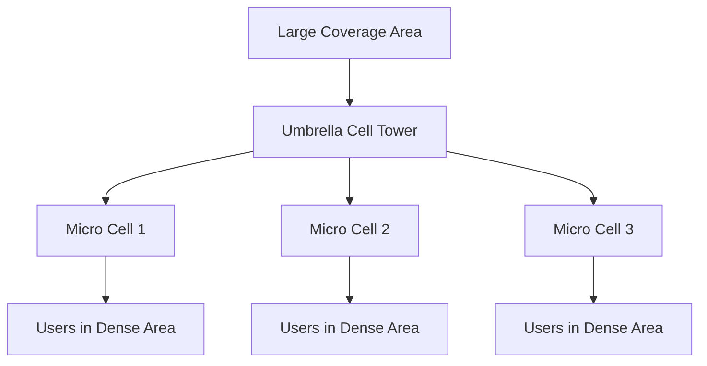
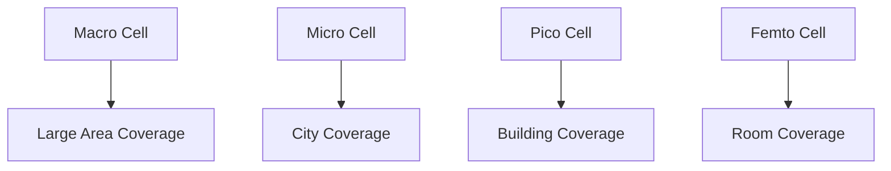
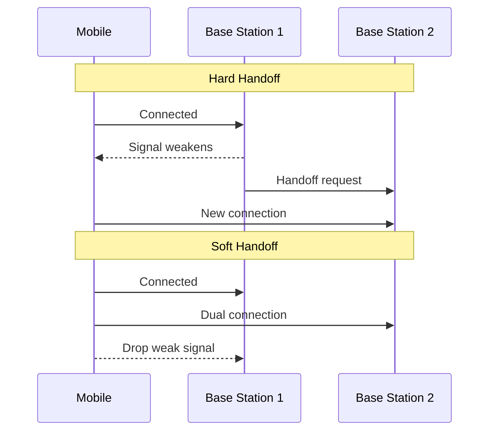
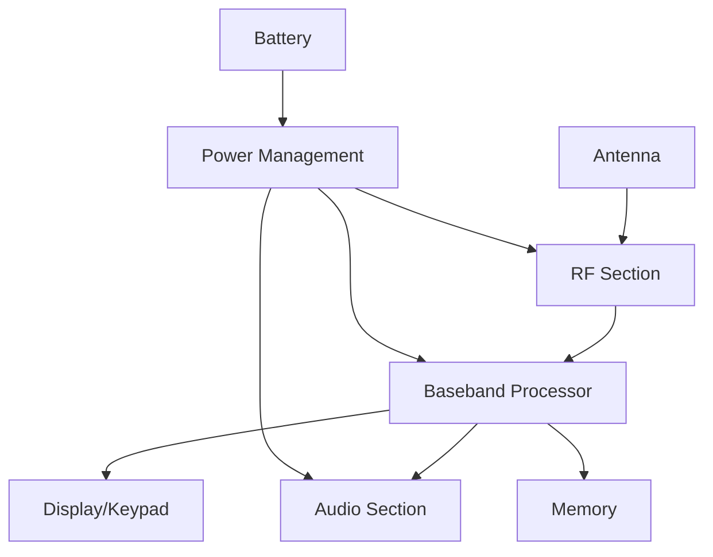
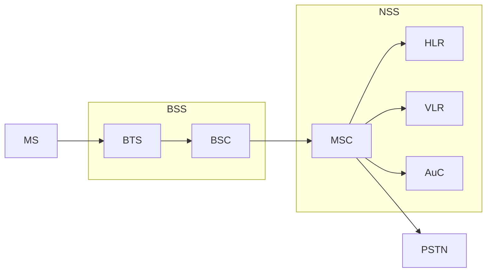
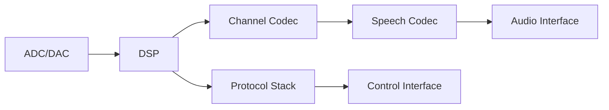
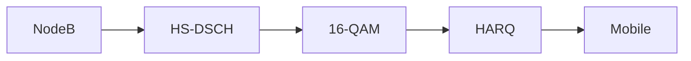
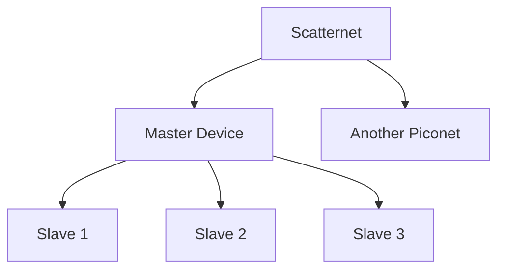
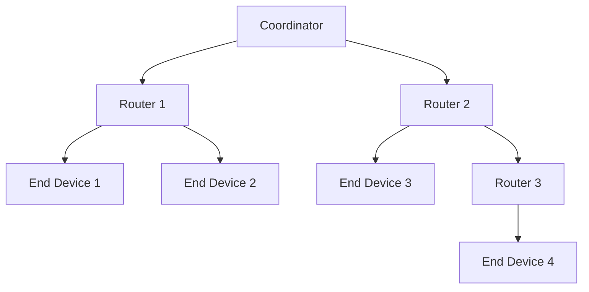

## Question 1(a) [3 marks]

**Draw & Explain umbrella cell.**

**Answer**:



- **Umbrella Cell**: Large coverage cell overlaying smaller cells
- **Purpose**: Handles overflow traffic from micro/pico cells
- **Coverage**: Provides backup coverage for high-traffic areas

**Mnemonic**: "Under My Big Umbrella"

## Question 1(b) [4 marks]

**Define full forms: (i) CCH (ii) TCH (iii) SCH (iv) BCCH**

**Answer**:

| Acronym | Full Form | Function |
|---------|-----------|----------|
| CCH | Control Channel | Carries control information |
| TCH | Traffic Channel | Carries voice/data traffic |
| SCH | Synchronization Channel | Provides timing sync |
| BCCH | Broadcast Control Channel | Broadcasts system info |

**Mnemonic**: "Control Traffic Sync Broadcast"

## Question 1(c) [7 marks]

**What is cell? Explain different types of cells.**

**Answer**:
**Cell** is the basic coverage area served by one base station in cellular communication.

| Cell Type | Coverage | Power | Usage |
|-----------|----------|-------|-------|
| **Macro Cell** | 1-30 km | High | Rural areas |
| **Micro Cell** | 100m-2km | Medium | Urban areas |
| **Pico Cell** | 10-100m | Low | Indoor coverage |
| **Femto Cell** | 10-30m | Very Low | Home/office |



- **Function**: Each cell provides wireless service to mobile users
- **Frequency Reuse**: Same frequencies used in non-adjacent cells
- **Handoff**: Users move between cells seamlessly

**Mnemonic**: "Many Mobile People Find coverage"

## Question 1(c OR) [7 marks]

**What is handoff? Explain soft and hard handoffs.**

**Answer**:
**Handoff** is the process of transferring an ongoing call from one cell to another as mobile moves.

| Feature | Hard Handoff | Soft Handoff |
|---------|--------------|--------------|
| **Connection** | Break-before-make | Make-before-break |
| **Channels** | One at a time | Multiple simultaneously |
| **Technology** | GSM, TDMA | CDMA |
| **Quality** | Brief interruption | Seamless transition |



- **Initiation**: Based on signal strength measurements
- **MAHO**: Mobile Assisted Handoff improves decision accuracy

**Mnemonic**: "Hard Hurts, Soft Smooth"

## Question 2(a) [3 marks]

**Define full forms: (i) SIM (ii) LTE (iii) WCDMA**

**Answer**:

| Acronym | Full Form | Purpose |
|---------|-----------|---------|
| SIM | Subscriber Identity Module | User authentication |
| LTE | Long Term Evolution | 4G technology |
| WCDMA | Wideband Code Division Multiple Access | 3G standard |

**Mnemonic**: "Subscriber's Long Wideband connection"

## Question 2(b) [4 marks]

**Draw mobile handset block diagram.**

**Answer**:



- **RF Section**: Transmits/receives radio signals
- **Baseband**: Processes digital signals and protocols
- **Audio**: Handles voice input/output
- **Power Management**: Controls battery usage efficiently

**Mnemonic**: "Radio Baseband Audio Power"

## Question 2(c) [7 marks]

**Explain GSM architecture with diagram.**

**Answer**:



| Component | Function |
|-----------|----------|
| **MS** | Mobile Station (handset) |
| **BTS** | Base Transceiver Station |
| **BSC** | Base Station Controller |
| **MSC** | Mobile Switching Center |
| **HLR** | Home Location Register |
| **VLR** | Visitor Location Register |

- **BSS**: Base Station Subsystem handles radio interface
- **NSS**: Network Switching Subsystem manages calls
- **Authentication**: AuC verifies subscriber identity

**Mnemonic**: "Mobile Base Network calls Home"

## Question 2(a OR) [3 marks]

**Define full forms: (i) RSSI (ii) MAHO (iii) NCHO**

**Answer**:

| Acronym | Full Form | Function |
|---------|-----------|----------|
| RSSI | Received Signal Strength Indicator | Signal quality measurement |
| MAHO | Mobile Assisted Handoff | Mobile helps handoff decision |
| NCHO | Network Controlled Handoff | Network decides handoff |

**Mnemonic**: "Received Mobile Network signals"

## Question 2(b OR) [4 marks]

**Draw baseband section block diagram.**

**Answer**:



- **ADC/DAC**: Analog to Digital conversion
- **DSP**: Digital Signal Processor
- **Channel Codec**: Error correction coding
- **Speech Codec**: Voice compression/decompression

**Mnemonic**: "Analog Digital Speech Protocol"

## Question 2(c OR) [7 marks]

**Explain GSM signal processing with diagram.**

**Answer**:


| Stage | Function | Purpose |
|-------|----------|---------|
| **Speech Codec** | Compress voice to 13 kbps | Bandwidth efficiency |
| **Channel Codec** | Add error correction | Signal reliability |
| **Interleaving** | Distribute burst errors | Error protection |
| **GMSK** | Gaussian MSK modulation | Spectral efficiency |

- **Processing Rate**: 270.833 kbps gross bit rate
- **Frame Structure**: 8 time slots per TDMA frame
- **Frequency Hopping**: 217 hops per second

**Mnemonic**: "Speech Channel Interleaves Modulated Radio"

## Question 3(a) [3 marks]

**Explain cell splitting.**

**Answer**:
Cell splitting divides congested cells into smaller cells to increase capacity.

- **Process**: Replace high-power cell with multiple low-power cells
- **Benefit**: Increases system capacity by frequency reuse
- **Implementation**: Reduce antenna height and transmit power

**Mnemonic**: "Split Small Cells"

## Question 3(b) [4 marks]

**Explain Li-Ion type batteries used in mobile handset with its advantages and disadvantages.**

**Answer**:

| Advantages | Disadvantages |
|------------|---------------|
| **High energy density** | **Safety concerns** |
| **No memory effect** | **Degradation over time** |
| **Low self-discharge** | **Temperature sensitive** |
| **Lightweight** | **Expensive** |

- **Chemistry**: Lithium ions move between electrodes
- **Voltage**: 3.7V nominal per cell
- **Capacity**: Measured in mAh (milliampere-hours)

**Mnemonic**: "Light Ion Energy Safety"

## Question 3(c) [7 marks]

**Explain GPRS.**

**Answer**:
**GPRS** (General Packet Radio Service) provides packet-switched data service over GSM.

| Feature | Specification |
|---------|---------------|
| **Data Rate** | Up to 171.2 kbps |
| **Technology** | Packet switching |
| **Channels** | Uses multiple time slots |
| **Billing** | Based on data volume |


- **PCU**: Packet Control Unit manages packet data
- **SGSN**: Serving GPRS Support Node
- **GGSN**: Gateway GPRS Support Node
- **Classes**: Class 1-12 with different speed/slot combinations

**Mnemonic**: "General Packet Radio Service"

## Question 3(a OR) [3 marks]

**Explain cell sectoring.**

**Answer**:
Cell sectoring divides omnidirectional cell into sectors using directional antennas.

- **Common**: 3-sector (120°) or 6-sector (60°) configurations
- **Benefit**: Reduces co-channel interference
- **Implementation**: Directional antennas at same site

**Mnemonic**: "Sector Reduces Interference"

## Question 3(b OR) [4 marks]

**Explain Li-Po type batteries used in mobile handset with its advantages and disadvantages.**

**Answer**:

| Advantages | Disadvantages |
|------------|---------------|
| **Flexible shape** | **Lower energy density** |
| **Ultra-thin design** | **Shorter lifespan** |
| **Lightweight** | **Safety risks** |
| **No memory effect** | **Higher cost** |

- **Technology**: Lithium Polymer electrolyte
- **Form Factor**: Can be molded into various shapes
- **Voltage**: 3.7V nominal per cell

**Mnemonic**: "Polymer Flexible Thin Light"

## Question 3(c OR) [7 marks]

**Explain EDGE.**

**Answer**:
**EDGE** (Enhanced Data rates for GSM Evolution) improves GSM data rates.

| Parameter | GSM | EDGE |
|-----------|-----|------|
| **Modulation** | GMSK | 8-PSK |
| **Data Rate** | 9.6 kbps | Up to 384 kbps |
| **Error Correction** | Basic | Advanced |
| **Spectrum** | Same as GSM | Same as GSM |


- **8-PSK**: 8-Phase Shift Keying provides 3 bits per symbol
- **Link Adaptation**: Adjusts coding scheme based on channel quality
- **Incremental Redundancy**: Improves error correction efficiency

**Mnemonic**: "Enhanced Data GSM Evolution"

## Question 4(a) [3 marks]

**Draw DSSS transmitter and receiver block diagram.**

**Answer**:

```goat
Transmitter:
Data --> Spreader --> Modulator --> RF Out
         ^
         |
      PN Code

Receiver:
RF In --> Demodulator --> Despreader --> Data Out
                           ^
                           |
                        PN Code
```

- **Spreader**: Multiplies data with PN sequence
- **Despreader**: Correlates received signal with same PN code
- **Processing Gain**: Ratio of spread to original bandwidth

**Mnemonic**: "Direct Sequence Spread Spectrum"

## Question 4(b) [4 marks]

**Compare CDMA and GSM.**

**Answer**:

| Parameter | CDMA | GSM |
|-----------|------|-----|
| **Multiple Access** | Code Division | Time Division |
| **Capacity** | Higher (soft capacity) | Fixed capacity |
| **Handoff** | Soft handoff | Hard handoff |
| **Power Control** | Critical | Less critical |
| **Frequency Planning** | Not required | Required |
| **Voice Quality** | Better | Good |

**Mnemonic**: "Code Division vs Time Division"

## Question 4(c) [7 marks]

**Explain concept of spread spectrum with applications.**

**Answer**:
**Spread Spectrum** spreads signal bandwidth much wider than required for data transmission.


| Type | Method | Application |
|------|--------|-------------|
| **DSSS** | PN sequence multiplication | CDMA, WiFi |
| **FHSS** | Frequency hopping | Bluetooth |
| **THSS** | Time hopping | UWB systems |

**Benefits**:

- **Anti-jamming**: Resistant to interference
- **Low Power Density**: Difficult to detect
- **Multiple Access**: Many users share spectrum
- **Multipath Resistance**: Resolves delayed signals

**Applications**: GPS, WiFi, Bluetooth, Military communications

**Mnemonic**: "Spread Signal Spectrum Security"

## Question 4(a OR) [3 marks]

**Draw FHSS transmitter block diagram.**

**Answer**:

```goat
Data --> Modulator --> Frequency --> RF Out
                       Synthesizer
                           ^
                           |
                    Hopping Sequence
                       Generator
```

- **Frequency Synthesizer**: Changes carrier frequency rapidly
- **Hopping Sequence**: Pseudo-random frequency pattern
- **Dwell Time**: Time spent on each frequency

**Mnemonic**: "Frequency Hopping Spread Spectrum"

## Question 4(b OR) [4 marks]

**Explain call processing in CDMA.**

**Answer**:

| Phase | Process | Description |
|-------|---------|-------------|
| **System Access** | Power control | Mobile adjusts power |
| **Call Setup** | Channel assignment | Assign Walsh code |
| **Traffic** | Soft handoff | Multiple base stations |
| **Call Release** | Power down | Gradual power reduction |

- **Rake Receiver**: Combines multipath signals
- **Power Control**: 800 times per second
- **Soft Capacity**: Degrades gracefully with load

**Mnemonic**: "Code Division Multiple Access"

## Question 4(c OR) [7 marks]

**Explain HSDPA.**

**Answer**:
**HSDPA** (High Speed Downlink Packet Access) enhances WCDMA downlink data rates.

| Feature | Enhancement |
|---------|-------------|
| **Data Rate** | Up to 14.4 Mbps |
| **Modulation** | 16-QAM |
| **HARQ** | Hybrid ARQ |
| **Fast Scheduling** | 2ms TTI |



- **HS-DSCH**: High Speed Downlink Shared Channel
- **AMC**: Adaptive Modulation and Coding
- **Fast Cell Selection**: Improves cell edge performance
- **MIMO**: Multiple antenna configurations possible

**Mnemonic**: "High Speed Downlink Packet Access"

## Question 5(a) [3 marks]

**List LTE specifications.**

**Answer**:

| Parameter | Specification |
|-----------|---------------|
| **Peak Data Rate** | 300 Mbps DL, 75 Mbps UL |
| **Bandwidth** | 1.4 to 20 MHz |
| **Latency** | <10ms user plane |
| **Mobility** | Up to 350 km/h |
| **Spectrum Efficiency** | 3-4x better than 3G |

**Mnemonic**: "Long Term Evolution specifications"

## Question 5(b) [4 marks]

**Draw OFDM receiver and explain its working.**

**Answer**:


- **FFT**: Fast Fourier Transform converts time to frequency domain
- **Cyclic Prefix**: Guards against inter-symbol interference
- **Subcarriers**: Parallel transmission on multiple frequencies
- **Demodulation**: QPSK/16QAM/64QAM per subcarrier

**Mnemonic**: "Orthogonal Frequency Division Multiplexing"

## Question 5(c) [7 marks]

**Explain Bluetooth Technology & list its applications.**

**Answer**:
**Bluetooth** is short-range wireless communication technology for personal area networks.

| Parameter | Specification |
|-----------|---------------|
| **Range** | 10m (Class 2) |
| **Frequency** | 2.4 GHz ISM band |
| **Data Rate** | Up to 3 Mbps |
| **Topology** | Piconet (8 devices) |



**Protocol Stack**:

- **RF Layer**: Physical radio interface
- **Baseband**: Medium access control
- **L2CAP**: Logical Link Control
- **Applications**: Various profiles (A2DP, HID, etc.)

**Applications**:

- Audio devices (headphones, speakers)
- File transfer between devices
- Input devices (keyboard, mouse)
- Health monitoring devices
- Smart home automation

**Mnemonic**: "Blue Tooth Personal Area Network"

## Question 5(a OR) [3 marks]

**List advantages of 5G Technology.**

**Answer**:

| Advantage | Benefit |
|-----------|---------|
| **Ultra-low latency** | <1ms response time |
| **High data rates** | Up to 10 Gbps |
| **Massive connectivity** | 1M devices/km² |
| **Network slicing** | Customized services |
| **Energy efficiency** | 90% more efficient |

**Mnemonic**: "Fifth Generation advantages"

## Question 5(b OR) [4 marks]

**Draw OFDM transmitter and explain its working.**

**Answer**:


- **Modulation**: Maps bits to symbols (QPSK/QAM)
- **IFFT**: Inverse FFT converts frequency to time domain
- **Cyclic Prefix**: Copies end samples to beginning
- **DAC**: Digital to Analog Converter for transmission

**Mnemonic**: "Orthogonal Frequency Division Multiplexing Transmitter"

## Question 5(c OR) [7 marks]

**Explain Zigbee Technology & list its applications.**

**Answer**:
**Zigbee** is low-power wireless mesh networking standard based on IEEE 802.15.4.

| Parameter | Specification |
|-----------|---------------|
| **Range** | 10-100m |
| **Data Rate** | 250 kbps |
| **Power** | Very low (battery years) |
| **Topology** | Mesh network |
| **Frequency** | 2.4 GHz globally |



**Network Roles**:

- **Coordinator**: Network manager
- **Router**: Forwards messages
- **End Device**: Simple sensors/actuators

**Applications**:

- Home automation (lights, thermostats)
- Industrial monitoring
- Smart grid systems
- Healthcare monitoring
- Agricultural sensors
- Building management systems

**Features**:

- **Self-healing**: Automatic route discovery
- **Low cost**: Simple implementation
- **Secure**: AES encryption
- **Reliable**: Mesh redundancy

**Mnemonic**: "Zigbee Mesh Network Applications"
