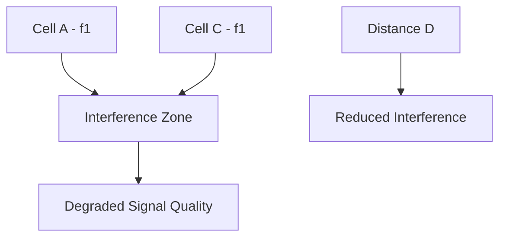
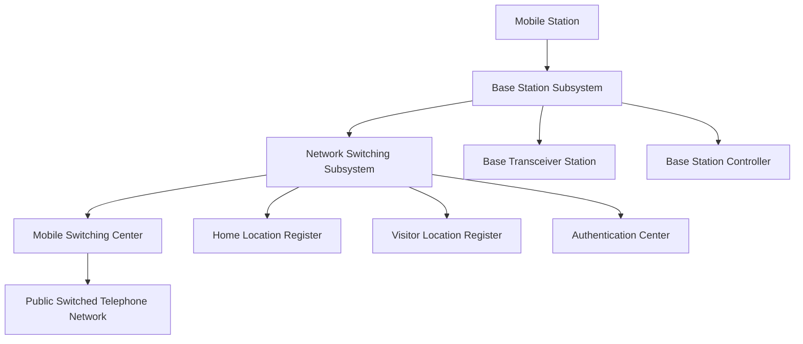
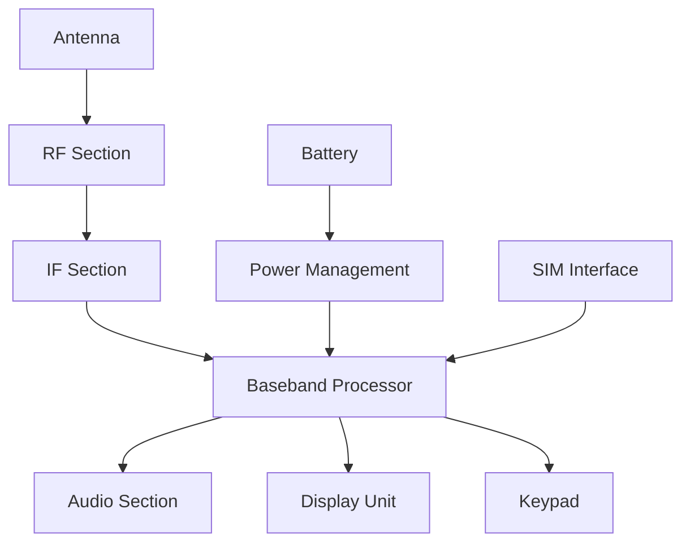
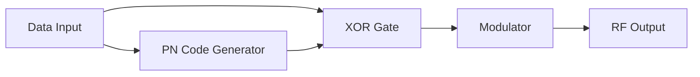
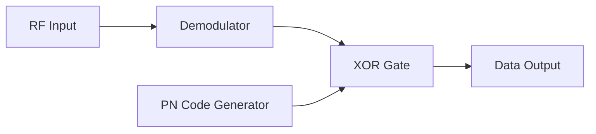
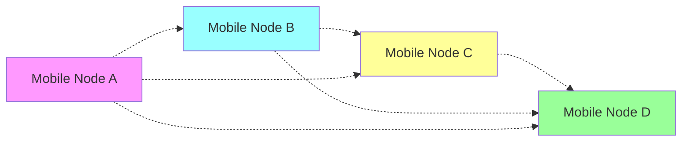

## પ્રશ્ન 1(અ) [3 ગુણ]

**અમ્બ્રેલા સેલ સમજાવો.**

**જવાબ**:
**અમ્બ્રેલા સેલ** મોટા કવરેજ એરિયાનો સેલ છે જે નાના સેલ્સને ઢાંકીને સતત કવરેજ પૂરું પાડે છે.

**ટેબલ: અમ્બ્રેલા સેલની લાક્ષણિકતાઓ**

| લક્ષણ | વર્ણન |
|-------|------|
| **કવરેજ** | મોટો ભૌગોલિક વિસ્તાર |
| **હેતુ** | માઇક્રોસેલ્સમાંથી overflow traffic સંભાળવો |
| **એન્ટેના** | હાઇ-પાવર, ઊંચી જગ્યાએ મૂકેલ |
| **યુઝર્સ** | ઝડપથી ફરતા વાહનો, emergency calls |

- **મોટું કવરેજ**: હાઇ-પાવર બેઝ સ્ટેશન સાથે વિશાળ ભૌગોલિક વિસ્તાર ઢાંકે છે
- **Traffic management**: નાના સેલ્સ ભરપૂર હોય ત્યારે calls સંભાળે છે
- **ગતિશીલતા સપોર્ટ**: બહુવિધ સેલ બાઉન્ડરી પાર કરતા ઝડપી યુઝર્સને સેવા આપે છે

**મેમરી ટ્રીક:** "Umbrella Covers Large Areas"

---

## પ્રશ્ન 1(બ) [4 ગુણ]

**સેલ અને ક્લસ્ટર વ્યાખ્યાયિત કરો.**

**જવાબ**:
**સેલ** અને **ક્લસ્ટર** સેલ્યુલર કોમ્યુનિકેશન સિસ્ટમના મૂળભૂત ખ્યાલો છે.

**ટેબલ: સેલ vs ક્લસ્ટર સરખામણી**

| પેરામીટર | સેલ | ક્લસ્ટર |
|----------|-----|--------|
| **વ્યાખ્યા** | એક બેઝ સ્ટેશન દ્વારા સેવા આપવામાં આવતો એક કવરેજ વિસ્તાર | અલગ-અલગ frequencies વાપરતા સેલ્સનું જૂથ |
| **સાઇઝ** | એન્ટેના પાવર અને interference દ્વારા મર્યાદિત | N સેલ્સ ધરાવે છે (સામાન્ય રીતે 3, 4, 7, 12) |
| **Frequency** | ચોક્કસ frequency set વાપરે છે | બધી ઉપલબ્ધ frequencies એકવાર વાપરે છે |
| **હેતુ** | ચોક્કસ વિસ્તારને કવરેજ આપવું | Frequency reuse pattern શક્ય બનાવવું |

- **સેલ**: એક બેઝ સ્ટેશન દ્વારા સેવા આપવામાં આવતો ભૌગોલિક વિસ્તાર
- **ક્લસ્ટર**: સંપૂર્ણ frequency spectrum વાપરતા પડોશી સેલ્સનું જૂથ
- **Frequency reuse**: અલગ-અલગ ક્લસ્ટર્સમાં સમાન frequencies ફરીથી વાપરી શકાય
- **Pattern repetition**: ક્લસ્ટર pattern સમગ્ર કવરેજમાં પુનરાવર્તિત થાય છે

**મેમરી ટ્રીક:** "Cells Cluster for Complete Coverage"

---

## પ્રશ્ન 1(ક) [7 ગુણ]

**સેલ્યુલર કોમ્યુનિકેશન સિસ્ટમ પાછળના મૂળભૂત ખ્યાલનું વર્ણન કરો.**

**જવાબ**:
**સેલ્યુલર કોમ્યુનિકેશન** સર્વિસ એરિયાને નાના સેલ્સમાં વહેંચીને spectrum efficiency અને capacity વધારે છે.

**આકૃતિ:**

```goat
    +-------+-------+-------+
    |   A   |   B   |   C   |
    |  f1   |  f2   |  f3   |
    +-------+-------+-------+
    |   D   |   E   |   F   |
    |  f4   |  f5   |  f6   |
    +-------+-------+-------+
    |   G   |   H   |   I   |
    |  f7   |  f1   |  f2   |
    +-------+-------+-------+
```

**ટેબલ: સેલ્યુલર સિસ્ટમના ફાયદા**

| ખ્યાલ | ફાયદો |
|------|------|
| **Frequency Reuse** | સમાન frequencies બહુવાર વાપરી શકાય |
| **Cell Division** | નાના કવરેજ વિસ્તારો, વધુ capacity |
| **Handoff** | સેલ્સ વચ્ચે seamless call transfer |
| **Power Control** | ઓછી interference, લાંબુ battery life |

- **નાના સેલનો ખ્યાલ**: કાર્યક્ષમ કવરેજ માટે સર્વિસ એરિયાને hexagonal સેલ્સમાં વહેંચાય છે
- **Frequency reuse**: મર્યાદિત spectrum યોગ્ય separation સાથે બહુવાર વાપરાય છે
- **બેઝ સ્ટેશન કંટ્રોલ**: દરેક સેલને low-power બેઝ સ્ટેશન દ્વારા સેવા આપવામાં આવે છે
- **Capacity improvement**: એક મોટા કવરેજ વિસ્તાર કરતાં વધુ યુઝર્સને સપોર્ટ મળે છે
- **Interference management**: યોગ્ય સેલ પ્લાનિંગ દ્વારા co-channel interference નિયંત્રિત કરાય છે

**મેમરી ટ્રીક:** "Small Cells Support Spectrum Sharing Successfully"

---

## પ્રશ્ન 1(ક OR) [7 ગુણ]

**સેલ્યુલર કોમ્યુનિકેશનમાં કો-ચેનલ ઇન્ટર્ફીરન્સ સમજાવો.**

**જવાબ**:
**કો-ચેનલ ઇન્ટર્ફીરન્સ** જ્યારે સમાન frequencies વાપરતા સેલ્સ ખૂબ નજીક હોય ત્યારે થાય છે.



**ટેબલ: કો-ચેનલ ઇન્ટર્ફીરન્સ પેરામીટર્સ**

| પેરામીટર | વર્ણન | અસર |
|----------|------|-----|
| **Reuse Distance** | કો-ચેનલ સેલ્સ વચ્ચેનું અંતર | વધુ અંતર = ઓછી interference |
| **C/I Ratio** | Carrier to Interference ratio | સારી quality માટે ≥ 18 dB હોવું જોઈએ |
| **Cluster Size** | ક્લસ્ટરમાં સેલ્સની સંખ્યા | મોટું ક્લસ્ટર = વધુ separation |

- **Signal overlap**: અલગ સેલ્સના સમાન frequency signals interfere કરે છે
- **Quality degradation**: call drops અને ખરાબ voice quality નું કારણ બને છે
- **Distance factor**: અંતરના વર્ગના પ્રમાણમાં interference ઘટે છે
- **ઘટાડવાની પદ્ધતિઓ**: યોગ્ય સેલ પ્લાનિંગ, power control, antenna design

**મેમરી ટ્રીક:** "Co-channel Causes Call Quality Concerns"

---

## પ્રશ્ન 2(અ) [3 ગુણ]

**સેલ સ્પ્લિટિંગ સમજાવો.**

**જવાબ**:
**સેલ સ્પ્લિટિંગ** ભીડવાળા સેલ્સને નાના સેલ્સમાં વહેંચીને સિસ્ટમ capacity વધારે છે.

**આકૃતિ:**

```goat
Original Large Cell          After Cell Splitting
    +-------+                   +---+---+
    |       |                   | A | B |
    |   X   |        →          +---+---+
    |       |                   | C | D |
    +-------+                   +---+---+
```

- **Capacity વધારો**: દરેક નવો સેલ ઓછા યુઝર્સને બેહતર સર્વિસ quality સાથે handle કરે છે
- **Power ઘટાડો**: નવા બેઝ સ્ટેશન્સ નાના વિસ્તારોને ઢાંકવા માટે ઓછી power વાપરે છે
- **Frequency management**: મૂળ frequencies નવા નાના સેલ્સમાં વહેંચાય છે

**મેમરી ટ્રીક:** "Split Cells Serve Subscribers Successfully"

---

## પ્રશ્ન 2(બ) [4 ગુણ]

**ચેનલ વહેંચણીની વ્યૂહરચના સમજાવો.**

**જવાબ**:
**ચેનલ assignment** વ્યૂહરચનાઓ નક્કી કરે છે કે optimal performance માટે સેલ્સને frequencies કેવી રીતે ફાળવવી.

**ટેબલ: ચેનલ Assignment વ્યૂહરચનાઓ**

| વ્યૂહરચના | વર્ણન | ફાયદા | નુકસાન |
|---------|------|------|-------|
| **Fixed** | સેલ્સને કાયમી ચેનલ્સ ફાળવવા | સરળ, અનુમાનિત | ઓછા traffic દરમિયાન બિનકાર્યક્ષમ |
| **Dynamic** | demand પર આધારિત ચેનલ assignment | કાર્યક્ષમ spectrum વપરાશ | જટિલ implementation |
| **Hybrid** | Fixed અને dynamic નું મિશ્રણ | સંતુલિત approach | મધ્યમ જટિલતા |

- **Fixed assignment**: દરેક સેલને પૂર્વનિર્ધારિત ચેનલ્સનો સેટ હોય છે
- **Dynamic assignment**: traffic demand પર આધારિત real-time માં ચેનલ્સ ફાળવાય છે
- **Load balancing**: ઉપલબ્ધ ચેનલ્સમાં traffic સમાનરૂપે વહેંચાય છે
- **Interference avoidance**: assignment માં co-channel interference ધ્યાનમાં લેવાય છે

**મેમરી ટ્રીક:** "Dynamic Distribution Delivers Optimal Performance"

---

## પ્રશ્ન 2(ક) [7 ગુણ]

**33MHz bandwidth, 25KHz simplex channels, 7-cell reuse, 1MHz control માટે સેલ દીઠ voice અને control channels ની ગણતરી કરો.**

**જવાબ**:
સેલ્યુલર સિસ્ટમમાં **ચેનલ allocation** માટે ગણતરી.

**આપેલ ડેટા:**

- Total bandwidth = 33 MHz
- Channel bandwidth = 25 KHz (simplex)
- Full duplex માટે જરૂરી = 2 × 25 KHz = 50 KHz
- Control spectrum = 1 MHz
- Cluster size = 7 cells

**ગણતરીઓ:**

**પગલું 1: કુલ ઉપલબ્ધ ચેનલ્સ**
Total channels = 33 MHz ÷ 25 KHz = 1320 channels

**પગલું 2: Control channels**
Control channels = 1 MHz ÷ 25 KHz = 40 channels

**પગલું 3: Voice channels**
Voice channels = 1320 - 40 = 1280 channels

**પગલું 4: Duplex voice channels**
Duplex voice channels = 1280 ÷ 2 = 640 channels

**પગલું 5: સેલ દીઠ ચેનલ્સ**
Voice channels per cell = 640 ÷ 7 ≈ 91 channels
Control channels per cell = 40 ÷ 7 ≈ 6 channels

**અંતિમ જવાબ:**

- **સેલ દીઠ Voice channels: 91**
- **સેલ દીઠ Control channels: 6**

**મેમરી ટ્રીક:** "Calculate Carefully for Channel Count"

---

## પ્રશ્ન 2(અ OR) [3 ગુણ]

**GSM માં FCCH અને SCH ના કાર્યો લખો.**

**જવાબ**:
**FCCH** અને **SCH** synchronization માટે GSM સિસ્ટમમાં જરૂરી control channels છે.

**ટેબલ: FCCH અને SCH કાર્યો**

| ચેનલ | Full Form | કાર્ય |
|------|-----------|------|
| **FCCH** | Frequency Correction Channel | Mobile ને frequency reference પૂરું પાડે છે |
| **SCH** | Synchronization Channel | Timing અને cell identity પૂરું પાડે છે |

- **FCCH કાર્ય**: Mobile ને બેઝ સ્ટેશન frequency સાથે synchronize કરવામાં મદદ કરે છે
- **SCH કાર્ય**: BSIC (Base Station Identity Code) અને frame number વહન કરે છે
- **Timing correction**: બંને ચેનલ્સ mobile ને યોગ્ય timing synchronization મેળવવામાં મદદ કરે છે

**મેમરી ટ્રીક:** "FCCH Fixes Frequency, SCH Synchronizes System"

---

## પ્રશ્ન 2(બ OR) [4 ગુણ]

**GSM 900 specifications લખો.**

**જવાબ**:
**GSM 900** 900 MHz frequency band માં ચોક્કસ તકનીકી પેરામીટર્સ સાથે કાર્ય કરે છે.

**ટેબલ: GSM 900 Specifications**

| પેરામીટર | Specification |
|----------|---------------|
| **Uplink Frequency** | 890-915 MHz |
| **Downlink Frequency** | 935-960 MHz |
| **Duplex Separation** | 45 MHz |
| **Channel Spacing** | 200 KHz |
| **Total Channels** | 124 channels |
| **Access Method** | TDMA/FDMA |
| **Modulation** | GMSK |
| **Power Classes** | 2W, 8W, 20W |

- **Frequency bands**: Full duplex operation માટે અલગ uplink અને downlink frequencies
- **TDMA structure**: દરેક carrier frequency પર 8 time slots

**મેમરી ટ્રીક:** "GSM 900 Gives Great Global Coverage"

---

## પ્રશ્ન 2(ક OR) [7 ગુણ]

**GSM આર્કિટેક્ચર દોરો અને સમજાવો.**

**જવાબ**:
**GSM આર્કિટેક્ચર** mobile communication માટે સાથે કાર્ય કરતા ત્રણ મુખ્ય subsystems ધરાવે છે.



**ટેબલ: GSM આર્કિટેક્ચર Components**

| Subsystem | Components | કાર્ય |
|-----------|------------|------|
| **Mobile Station** | Mobile Equipment + SIM | User interface અને identity |
| **BSS** | BTS + BSC | Radio interface અને control |
| **NSS** | MSC, HLR, VLR, AuC | Switching અને database management |

- **Mobile Station**: યુઝર identification માટે mobile equipment અને SIM card ધરાવે છે
- **Base Station Subsystem**: Radio communication અને resource management handle કરે છે
- **Network Switching Subsystem**: Call switching, routing, અને subscriber databases manage કરે છે
- **Interfaces**: A-bis (BTS-BSC), A (BSC-MSC) interfaces subsystems ને connect કરે છે

**મેમરી ટ્રીક:** "Mobile Base Network - Complete Communication Chain"

---

## પ્રશ્ન 3(અ) [3 ગુણ]

**GSM માં signal processing નો block diagram દોરો.**

**જવાબ**:
GSM માં **signal processing** voice અને data transmission માટે અનેક stages ધરાવે છે.

**આકૃતિ:**

```goat
Speech → Speech → Channel → Interleaving → Burst → RF
Input    Coding    Coding              Formatting  Processing
  ↓        ↓         ↓         ↓           ↓         ↓
13kbps → 22.8kbps → Error → Reordering → Time → Modulation
                  Protection              Slot    & Transmission
```

- **Speech coding**: RPE-LTP વાપરીને analog speech ને 13 kbps digital data માં convert કરે છે
- **Channel coding**: Error correction bits ઉમેરીને rate 22.8 kbps સુધી વધારે છે
- **Interleaving**: Fading થી burst errors સામે લડવા માટે data ફરીથી order કરે છે

**મેમરી ટ્રીક:** "Speech Signals Systematically Processed Successfully"

---

## પ્રશ્ન 3(બ) [4 ગુણ]

**GSM માં Common Control Channels ના કાર્યો લખો.**

**જવાબ**:
**Common Control Channels** GSM માં system information અને access procedures manage કરે છે.

**ટેબલ: Common Control Channels કાર્યો**

| ચેનલ | કાર્ય |
|------|------|
| **FCCH** | Frequency correction અને synchronization |
| **SCH** | Frame synchronization અને cell identification |
| **BCCH** | System information અને cell parameters broadcast કરે છે |
| **RACH** | Mobile દ્વારા call initiation માટે random access |
| **AGCH** | Mobiles ને dedicated channels assign કરે છે |
| **PCH** | Incoming calls માટે mobiles ને page કરે છે |

- **Broadcast કાર્ય**: BCCH સતત system information transmit કરે છે
- **Access management**: RACH mobiles ને service request કરવાની મંજૂરી આપે છે
- **Channel assignment**: AGCH active calls માટે resources allocate કરે છે
- **Paging service**: PCH mobiles ને incoming calls ની જાણ કરે છે

**મેમરી ટ્રીક:** "Common Channels Control Communication Completely"

---

## પ્રશ્ન 3(ક) [7 ગુણ]

**GSM આઇડેન્ટિફાયર્સ સમજાવો.**

**જવાબ**:
**GSM identifiers** subscribers, equipment, અને network elements ને uniquely identify કરે છે.

**ટેબલ: GSM Identifiers**

| Identifier | Full Form | હેતુ | Format |
|------------|-----------|------|---------|
| **IMSI** | International Mobile Subscriber Identity | Unique subscriber ID | 15 digits |
| **IMEI** | International Mobile Equipment Identity | Unique equipment ID | 15 digits |
| **MSISDN** | Mobile Station ISDN Number | Phone number | Variable length |
| **TMSI** | Temporary Mobile Subscriber Identity | Security માટે temporary ID | 32 bits |
| **LAI** | Location Area Identity | Geographic area identification | MCC+MNC+LAC |
| **BSIC** | Base Station Identity Code | Cell identification | 6 bits |

- **IMSI structure**: MCC (3) + MNC (2-3) + MSIN (9-10 digits)
- **Security હેતુ**: TMSI radio interface પર subscriber identity ની સુરક્ષા કરે છે
- **Location management**: LAI કાર્યક્ષમ paging અને location updates માં મદદ કરે છે
- **Network planning**: BSIC પડોશી સેલ્સ વચ્ચે confusion અટકાવે છે

**મેમરી ટ્રીક:** "Important Mobile System Identifiers Ensure Security"

---

## પ્રશ્ન 3(અ OR) [3 ગુણ]

**ઝડપી અને ધીમી frequency hopping ની તુલના કરો.**

**જવાબ**:
**Frequency hopping** techniques symbol rate ના સંબંધમાં hopping rate માં અલગ પડે છે.

**ટેબલ: Fast vs Slow Frequency Hopping**

| પેરામીટર | Fast Hopping | Slow Hopping |
|----------|-------------|--------------|
| **Hopping Rate** | > Symbol rate | < Symbol rate |
| **Symbols per Hop** | < 1 | > 1 |
| **જટિલતા** | ઊંચી | નીચી |
| **Applications** | Military, Bluetooth | GSM, CDMA |

- **Fast hopping**: પ્રતિ symbol બહુવિધ hops, બેહતર security પણ વધુ જટિલ
- **Slow hopping**: પ્રતિ hop બહુવિધ symbols, સરળ implementation

**મેમરી ટ્રીક:** "Fast Frequently Flips, Slow Stays Stable"

---

## પ્રશ્ન 3(બ OR) [4 ગુણ]

**Frequency reuse નો ઉપયોગ કર્યા વિના GSM 900 band માં એકસાથે વાત કરી શકે તેવા વપરાશકર્તાઓની સંખ્યાની ગણતરી કરો.**

**જવાબ**:
Frequency reuse વિના GSM 900 માં મહત્તમ યુઝર્સ માટે **ગણતરી**.

**આપેલ GSM 900 પેરામીટર્સ:**

- Uplink: 890-915 MHz (25 MHz)
- Downlink: 935-960 MHz (25 MHz)
- Channel spacing: 200 KHz
- પ્રતિ ચેનલ time slots: 8

**ગણતરીઓ:**

**પગલું 1: ઉપલબ્ધ ચેનલ્સ**
Total channels = 25 MHz ÷ 200 KHz = 125 channels

**પગલું 2: વાપરી શકાય તેવા ચેનલ્સ**
Guard channels કાઢ્યા પછી ≈ 124 channels

**પગલું 3: એકસાથે યુઝર્સ**
પ્રતિ ચેનલ યુઝર્સ = 8 time slots
કુલ યુઝર્સ = 124 × 8 = 992 યુઝર્સ

**જવાબ: 992 યુઝર્સ એકસાથે વાત કરી શકે છે**

**મેમરી ટ્રીક:** "Calculate Channels Times Time-slots"

---

## પ્રશ્ન 3(ક OR) [7 ગુણ]

**મોબાઇલ હેન્ડસેટનો સામાન્ય block diagram દોરો અને સમજાવો.**

**જવાબ**:
**મોબાઇલ હેન્ડસેટ** સાથે કાર્ય કરતા અનેક functional blocks ધરાવે છે.



**ટેબલ: મોબાઇલ હેન્ડસેટ બ્લોક્સ**

| બ્લોક | કાર્ય |
|------|------|
| **RF Section** | Signal transmission અને reception |
| **Baseband** | Digital signal processing |
| **Audio** | Voice input/output processing |
| **Power Management** | Battery અને power control |
| **User Interface** | Display, keypad, speaker, microphone |

- **RF processing**: Radio frequency transmission અને reception handle કરે છે
- **Digital processing**: Baseband channel coding, speech processing કરે છે
- **User interface**: Display, keypad, audio દ્વારા interaction પૂરું પાડે છે
- **Power control**: Battery usage અને charging functions manage કરે છે

**મેમરી ટ્રીક:** "Mobile Manages Multiple Modules Simultaneously"

---

## પ્રશ્ન 4(અ) [3 ગુણ]

**મોબાઈલના કારણે રેડિયેશનના જોખમો લખો.**

**જવાબ**:
મોબાઇલ ફોનમાંથી **રેડિયેશન જોખમો** RF energy exposure ને કારણે આરોગ્યની ચિંતા છે.

**ટેબલ: મોબાઇલ રેડિયેશન જોખમો**

| જોખમ | અસર | રોકથામ |
|------|-----|--------|
| **SAR Exposure** | Tissue heating | Hands-free devices વાપરો |
| **મગજ પર અસર** | Memory, sleep ની સમસ્યાઓ | Call duration મર્યાદિત રાખો |
| **કેન્સરનું જોખમ** | સંભવિત tumor નું જોખમ | ફોન શરીરથી દૂર રાખો |

- **SAR (Specific Absorption Rate)**: શરીરના tissue દ્વારા absorbed RF energy માપે છે
- **Thermal effects**: RF energy tissue ના localized heating નું કારણ બની શકે છે
- **Non-thermal effects**: Cellular functions અને DNA પર સંભવિત અસરો

**મેમરી ટ્રીક:** "Safety Awareness Reduces Radiation Risk"

---

## પ્રશ્ન 4(બ) [4 ગુણ]

**મોબાઈલ હેન્ડસેટમાં બેઝબેન્ડ વિભાગની કામગીરી સમજાવો.**

**જવાબ**:
**બેઝબેન્ડ વિભાગ** મોબાઇલ હેન્ડસેટમાં digital signal processing કાર્યો કરે છે.

**ટેબલ: બેઝબેન્ડ વિભાગના કાર્યો**

| કાર્ય | વર્ણન |
|------|------|
| **Speech Processing** | Vocoder વાપરીને voice encode/decode કરે છે |
| **Channel Coding** | Error correction અને detection ઉમેરે છે |
| **Modulation** | Digital data ને analog signals માં convert કરે છે |
| **Protocol Processing** | Signaling અને call control handle કરે છે |

- **Digital signal processor**: Speech coding algorithms execute કરે છે (GSM: RPE-LTP)
- **Error correction**: વિશ્વસનીય transmission માટે convolutional coding implement કરે છે
- **Control functions**: Call setup, handoff, અને power control manage કરે છે
- **Interface**: RF section ને user interface components સાથે connect કરે છે

**મેમરી ટ્રીક:** "Baseband Brings Better Communication Control"

---

## પ્રશ્ન 4(ક) [7 ગુણ]

**DSSS ટ્રાન્સમીટર અને રીસીવરની કામગીરી સમજાવો.**

**જવાબ**:
**DSSS (Direct Sequence Spread Spectrum)** pseudorandom codes વાપરીને signal bandwidth spread કરે છે.

**ટ્રાન્સમીટર આકૃતિ:**


**રીસીવર આકૃતિ:**


**ટેબલ: DSSS પ્રક્રિયા**

| સ્ટેજ | ટ્રાન્સમીટર | રીસીવર |
|------|-----------|--------|
| **Spreading** | Data XOR with PN code | Received signal XOR with PN |
| **Modulation** | Spread signal modulated | Demodulate received signal |
| **Processing** | Bandwidth વધારાય છે | Original data recover થાય છે |

- **Spreading પ્રક્રિયા**: Original data ને high-rate pseudorandom sequence સાથે XOR કરવામાં આવે છે
- **Bandwidth expansion**: Processing gain factor દ્વારા signal bandwidth વધે છે
- **Despreading**: Receiver સમાન PN code વાપરીને original data recover કરે છે
- **Interference rejection**: Spread spectrum jamming સામે પ્રતિકાર પૂરો પાડે છે

**મેમરી ટ્રીક:** "Direct Sequence Spreads Signals Successfully"

---

## પ્રશ્ન 4(અ OR) [3 ગુણ]

**10 Mcps chip rate અને 1 Mbps data rate સાથે DSSS સિસ્ટમ માટે processing gain ની ગણતરી કરો.**

**જવાબ**:
**Processing gain** spread spectrum સિસ્ટમના performance improvement નક્કી કરે છે.

**આપેલ:**

- Chip rate (Rc) = 10 million chips per second = 10 × 10⁶ cps
- Data rate (Rd) = 1 Mbps = 1 × 10⁶ bps

**ગણતરી:**
Processing Gain (Gp) = Chip rate ÷ Data rate
Gp = Rc ÷ Rd = (10 × 10⁶) ÷ (1 × 10⁶) = 10

**dB માં:**
Gp (dB) = 10 log₁₀(10) = 10 × 1 = 10 dB

**જવાબ: Processing Gain = 10 અથવા 10 dB**

**મેમરી ટ્રીક:** "Processing Power Provides Protection"

---

## પ્રશ્ન 4(બ OR) [4 ગુણ]

**EDGE માં data rate કેવી રીતે વધારાયેલ છે તે સમજાવો.**

**જવાબ**:
**EDGE (Enhanced Data rates for GSM Evolution)** advanced modulation દ્વારા data rates સુધારે છે.

**ટેબલ: EDGE સુધારાઓ**

| પેરામીટર | GSM | EDGE | સુધારો |
|----------|-----|------|--------|
| **Modulation** | GMSK | 8-PSK | 3 bits per symbol vs 1 bit |
| **Data Rate** | 9.6 kbps | 43.2 kbps per slot | ~4.5x વધારો |
| **Coding** | Fixed | Adaptive | Link adaptation |
| **Applications** | Voice, SMS | Multimedia, Internet | Enhanced services |

- **8-PSK modulation**: GMSK ના 1 bit નાં બદલે પ્રતિ symbol 3 bits transmit કરે છે
- **Link adaptation**: Channel quality પર આધારિત coding scheme dynamically select કરે છે
- **Backward compatibility**: હાલની GSM infrastructure સાથે કાર્ય કરે છે
- **Enhanced applications**: Multimedia અને higher data rate services support કરે છે

**મેમરી ટ્રીક:** "EDGE Enhances Exchange Efficiently"

---

## પ્રશ્ન 4(ક OR) [7 ગુણ]

**CDMA માં કોલ પ્રોસેસિંગ સમજાવો.**

**જવાબ**:
**CDMA call processing** code-based multiple access માટે unique procedures ધરાવે છે.


**ટેબલ: CDMA કોલ પ્રોસેસિંગ સ્ટેજો**

| સ્ટેજ | પ્રક્રિયા | કાર્ય |
|------|-------|------|
| **Initialization** | Pilot acquisition | સૌથી મજબૂત બેઝ સ્ટેશન શોધવું |
| **Idle State** | Monitor paging | Incoming calls માટે સાંભળવું |
| **Access** | Random access | Network પાસેથી service request કરવી |
| **Traffic** | Dedicated channel | Active communication |
| **Handoff** | Soft handoff | Seamless cell transition |

- **Pilot channel**: Timing reference અને system identification પૂરું પાડે છે
- **Rake receiver**: Improved performance માટે multipath signals combine કરે છે
- **Power control**: બધા યુઝર્સ માટે optimal signal levels maintain કરે છે
- **Soft handoff**: Mobile બહુવિધ બેઝ સ્ટેશન્સ સાથે એકસાથે communicate કરે છે
- **Code assignment**: દરેક યુઝરને unique spreading code assign કરવામાં આવે છે

**મેમરી ટ્રીક:** "CDMA Calls Connect Carefully and Clearly"

---

## પ્રશ્ન 5(અ) [3 ગુણ]

**CDMA અને GSM ની સરખામણી કરો.**

**જવાબ**:
**CDMA** અને **GSM** cellular communication માટે અલગ અલગ approaches રજૂ કરે છે.

**ટેબલ: CDMA vs GSM સરખામણી**

| પેરામીટર | CDMA | GSM |
|----------|------|-----|
| **Access Method** | Code Division | Time/Frequency Division |
| **Capacity** | વધુ | ઓછી |
| **Handoff** | Soft handoff | Hard handoff |
| **Security** | બેહતર (spreading codes) | સારી (encryption) |
| **Global Usage** | મર્યાદિત | વ્યાપક |
| **Power Control** | Continuous | Periodic |

- **Multiple access**: CDMA unique codes વાપરે છે, GSM time slots વાપરે છે
- **Call quality**: CDMA soft handoff પૂરું પાડે છે, GSM hard handoff કરે છે

**મેમરી ટ્રીક:** "Choose CDMA or GSM Carefully"

---

## પ્રશ્ન 5(બ) [4 ગુણ]

**CDMA ના લાભો લખો.**

**જવાબ**:
**CDMA લાભો** તેને high-capacity cellular systems માટે યોગ્ય બનાવે છે.

**ટેબલ: CDMA લાભો**

| લાભ | ફાયદો |
|-----|------|
| **High Capacity** | પ્રતિ spectrum વધુ યુઝર્સ |
| **Soft Handoff** | Seamless call transfer |
| **Variable Rate** | Speech patterns ને અનુકૂળ |
| **Privacy** | Spreading દ્વારા inherent security |
| **Multipath Resistance** | Rake receiver વાપરે છે |
| **Power Control** | Battery life optimize કરે છે |
| **Frequency Planning** | બધા સેલ્સમાં સમાન frequency |

- **Spectrum efficiency**: FDMA/TDMA systems કરતાં વધુ capacity
- **Quality લાભ**: Soft handoff cell transitions દરમિયાન call drops દૂર કરે છે
- **Security ફાયદો**: Spread spectrum inherent privacy protection પૂરું પાડે છે
- **Simplified planning**: Frequency reuse planning ની જરૂર નથી

**મેમરી ટ્રીક:** "CDMA Creates Considerable Communication Capacity"

---

## પ્રશ્ન 5(ક) [7 ગુણ]

**MANET ને સંક્ષિપ્તમાં સમજાવો અને તેની ઉપયોગો લખો.**

**જવાબ**:
**MANET (Mobile Ad Hoc Network)** મોબાઇલ ડિવાઇસેસનું infrastructure-less network છે.



**ટેબલ: MANET લાક્ષણિકતાઓ vs ઉપયોગો**

| લાક્ષણિકતા | વિશેષતા | ઉપયોગો |
|-----------|-------|---------|
| **Self-organizing** | કોઈ fixed infrastructure નથી | લશ્કરી સંદેશાવ્યવહાર |
| **Dynamic topology** | Nodes મુક્તપણે ફરે છે | Emergency response |
| **Multi-hop routing** | Intermediate node relay | Disaster recovery |
| **Distributed control** | કોઈ central authority નથી | Sensor networks |
| **Resource constraints** | મર્યાદિત battery, bandwidth | Vehicular networks |

**ઉપયોગો:**

- **લશ્કરી ઓપરેશન્સ**: Infrastructure વિના battlefield communications
- **Emergency services**: Disaster response અને rescue operations
- **Sensor networks**: Environmental monitoring અને data collection
- **Vehicular networks**: Traffic management માટે car-to-car communication
- **Personal area networks**: Device-to-device communication
- **Academic research**: Collaborative computing environments

**ફાયદા:**

- **Rapid deployment**: Infrastructure setup ની જરૂર નથી
- **Self-healing**: Nodes fail થાય ત્યારે automatic route reconfiguration
- **Cost effective**: Base station installation costs નથી

**નુકસાન:**

- **Limited bandwidth**: Shared wireless medium
- **Security challenges**: Attacks માટે vulnerable
- **Power constraints**: Battery-dependent operation

**મેમરી ટ્રીક:** "Mobile Ad Hoc Networks Enable Everywhere"

---

## પ્રશ્ન 5(અ OR) [3 ગુણ]

**WCDMA ના મુખ્ય લક્ષણો લખો.**

**જવાબ**:
**WCDMA (Wideband CDMA)** enhanced capabilities પૂરી પાડતો 3G standard છે.

**ટેબલ: WCDMA મુખ્ય લક્ષણો**

| લક્ષણ | Specification |
|------|---------------|
| **Chip Rate** | 3.84 Mcps |
| **Bandwidth** | 5 MHz |
| **Data Rates** | 2 Mbps સુધી |
| **Spreading** | Variable spreading factor |
| **Power Control** | Fast closed-loop |
| **Handoff** | Soft અને softer handoff |

- **Wideband operation**: 5 MHz bandwidth high data rates પૂરી પાડે છે
- **Variable spreading**: અલગ-અલગ service requirements ને અનુકૂળ થાય છે

**મેમરી ટ્રીક:** "WCDMA Widens Communication Data Magnificently"

---

## પ્રશ્ન 5(બ OR) [4 ગુણ]

**5G ના લાભો લખો.**

**જવાબ**:
**5G લાભો** અગાઉની generations કરતાં નોંધપાત્ર સુધારાઓ રજૂ કરે છે.

**ટેબલ: 5G લાભો**

| લાભ | ફાયદો |
|-----|------|
| **Ultra-high Speed** | 20 Gbps સુધી peak data rate |
| **Low Latency** | Critical applications માટે <1ms |
| **Massive IoT** | પ્રતિ km² 1 million devices |
| **Network Slicing** | Customized virtual networks |
| **Enhanced Coverage** | બેહતર indoor અને edge coverage |
| **Energy Efficiency** | 4G કરતાં 100x વધુ કાર્યક્ષમ |
| **High Reliability** | 99.999% availability |

- **Enhanced mobile broadband**: AR/VR અને 4K/8K video streaming support કરે છે
- **Ultra-reliable communications**: Autonomous vehicles અને remote surgery શક્ય બનાવે છે
- **Massive machine communications**: Smart cities અને Industry 4.0 support કરે છે
- **Flexible network architecture**: Software-defined networking capabilities

**મેમરી ટ્રીક:** "5G Generates Great Gigabit Growth"

---

## પ્રશ્ન 5(ક OR) [7 ગુણ]

**બ્લોક ડાયાગ્રામ સાથે OFDM ની કામગીરી સમજાવો.**

**જવાબ**:
**OFDM (Orthogonal Frequency Division Multiplexing)** high-speed data transmission માટે બહુવિધ subcarriers વાપરે છે.

**OFDM ટ્રાન્સમીટર:**


**OFDM રીસીવર:**


**ટેબલ: OFDM પ્રક્રિયાના પગલાં**

| સ્ટેજ | ટ્રાન્સમીટર કાર્ય | રીસીવર કાર્ય |
|------|----------------|-------------|
| **Data Conversion** | Serial to parallel conversion | Parallel to serial reconstruction |
| **Modulation** | Subcarriers પર QAM mapping | QAM demapping |
| **Transform** | IFFT time domain signal બનાવે છે | FFT frequency domain recover કરે છે |
| **Guard Period** | Cyclic prefix ISI અટકાવે છે | Cyclic prefix removal |

**મુખ્ય લક્ષણો:**

- **Orthogonal subcarriers**: બહુવિધ parallel low-rate data streams interference અટકાવે છે
- **FFT/IFFT processing**: Fast transforms વાપરીને કાર્યક્ષમ digital implementation
- **Cyclic prefix**: Multipath થી inter-symbol interference અટકાવતો guard interval
- **Spectral efficiency**: મર્યાદિત bandwidth માં high data rates હાંસલ કરાય છે
- **Multipath resistance**: વ્યક્તિગત subcarriers flat fading અનુભવે છે

**ઉપયોગો:**

- **WiFi (802.11)**: Wireless LAN communications
- **LTE/4G**: Mobile broadband networks
- **Digital TV**: DVB-T terrestrial broadcasting
- **WiMAX**: Broadband wireless access

**ફાયદા:**

- **High spectral efficiency**: Optimal bandwidth utilization
- **મજબૂતાઈ**: Frequency selective fading સામે પ્રતિકારક
- **લવચીકતા**: પ્રતિ subcarrier adaptive modulation
- **Implementation**: Digital signal processing hardware સરળ બનાવે છે

**ટેબલ: OFDM પેરામીટર્સ**

| પેરામીટર | સામાન્ય મૂલ્યો |
|----------|-------------|
| **Subcarriers** | 64, 128, 256, 512, 1024 |
| **Modulation** | BPSK, QPSK, 16-QAM, 64-QAM |
| **Cyclic Prefix** | Symbol duration નો 1/4, 1/8, 1/16 |
| **Applications** | WiFi, LTE, DVB, WiMAX |

**મેમરી ટ્રીક:** "OFDM Offers Outstanding Data Multiplexing"

---
