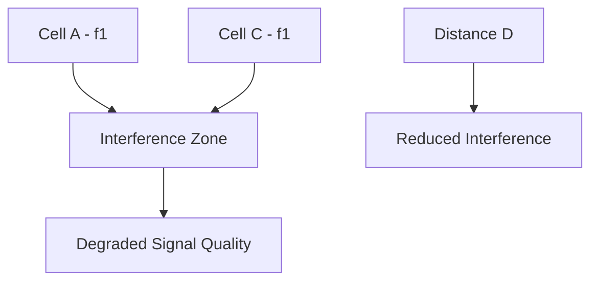
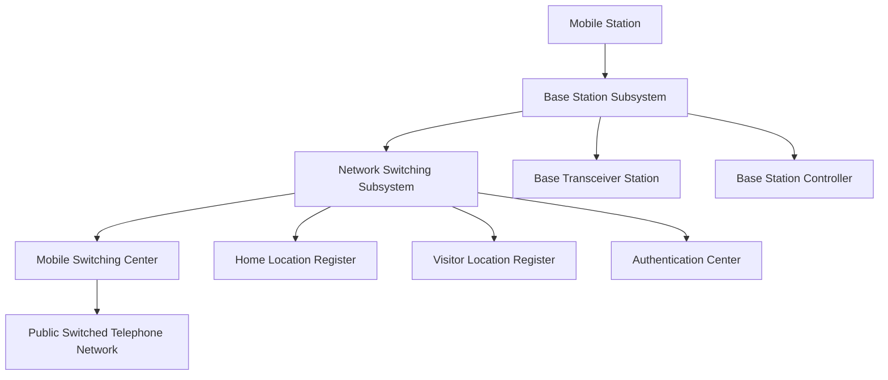
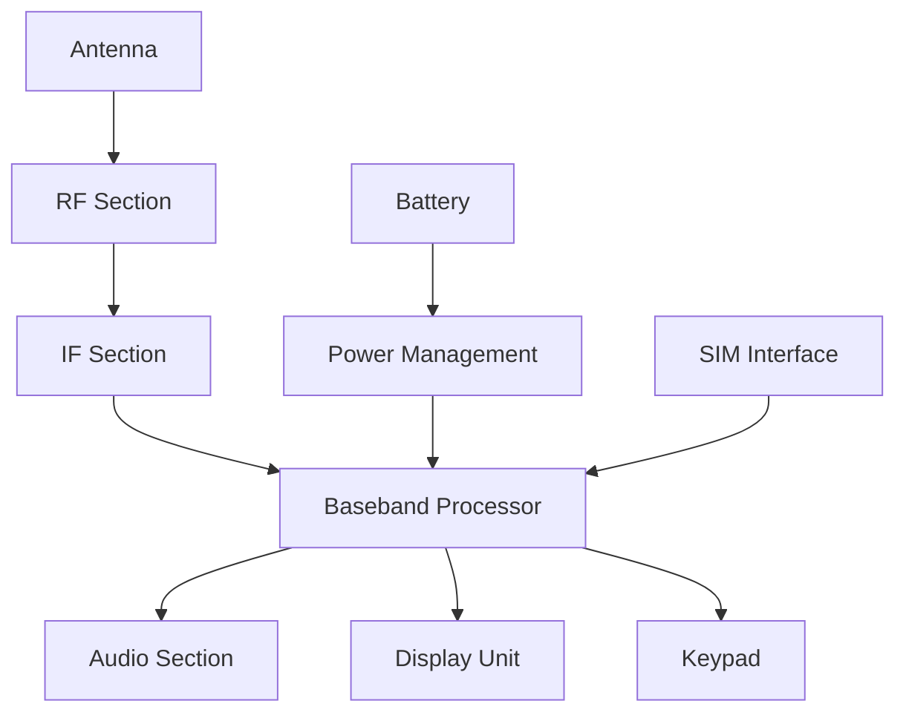
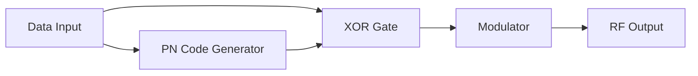
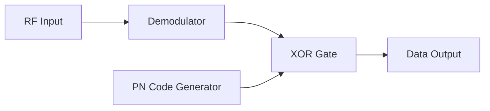
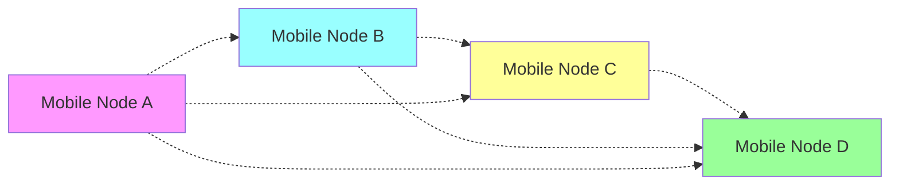

## Question 1(a) [3 marks]

**Explain umbrella cell.**

**Answer**:
**Umbrella cell** is a large coverage area cell that overlays smaller cells to provide continuous coverage and handle overflow traffic.

**Table: Umbrella Cell Characteristics**

| Feature | Description |
|---------|-------------|
| **Coverage** | Large geographic area |
| **Purpose** | Handle overflow traffic from microcells |
| **Antenna** | High-power, elevated position |
| **Users** | Fast-moving vehicles, emergency calls |

- **Large coverage**: Covers wide geographical area with high-power base station
- **Traffic management**: Handles calls when smaller cells are congested
- **Mobility support**: Serves fast-moving users crossing multiple cell boundaries

**Mnemonic:** "Umbrella Covers Large Areas"

---

## Question 1(b) [4 marks]

**Define cell and cluster.**

**Answer**:
**Cell** and **cluster** are fundamental concepts in cellular communication systems.

**Table: Cell vs Cluster Comparison**

| Parameter | Cell | Cluster |
|-----------|------|---------|
| **Definition** | Single coverage area served by one base station | Group of cells using different frequencies |
| **Size** | Limited by antenna power and interference | Contains N cells (typically 3, 4, 7, 12) |
| **Frequency** | Uses specific frequency set | Uses all available frequencies once |
| **Purpose** | Provide coverage to specific area | Enable frequency reuse pattern |

- **Cell**: Geographic area served by single base station with specific frequency allocation
- **Cluster**: Group of adjacent cells that collectively use entire frequency spectrum
- **Frequency reuse**: Same frequencies can be reused in different clusters
- **Pattern repetition**: Cluster pattern repeats throughout coverage area

**Mnemonic:** "Cells Cluster for Complete Coverage"

---

## Question 1(c) [7 marks]

**Describe fundamental concept behind cellular communication systems.**

**Answer**:
**Cellular communication** divides service area into small cells to maximize spectrum efficiency and capacity.

**Diagram:**

```goat
    +-------+-------+-------+
    |   A   |   B   |   C   |
    |  f1   |  f2   |  f3   |
    +-------+-------+-------+
    |   D   |   E   |   F   |
    |  f4   |  f5   |  f6   |
    +-------+-------+-------+
    |   G   |   H   |   I   |
    |  f7   |  f1   |  f2   |
    +-------+-------+-------+
```

**Table: Cellular System Benefits**

| Concept | Advantage |
|---------|-----------|
| **Frequency Reuse** | Same frequencies used multiple times |
| **Cell Division** | Smaller coverage areas, more capacity |
| **Handoff** | Seamless call transfer between cells |
| **Power Control** | Reduced interference, longer battery life |

- **Small cell concept**: Service area divided into hexagonal cells for efficient coverage
- **Frequency reuse**: Limited spectrum used multiple times with adequate separation
- **Base station control**: Each cell served by low-power base station
- **Capacity improvement**: More users supported compared to single large coverage area
- **Interference management**: Co-channel interference controlled through proper cell planning

**Mnemonic:** "Small Cells Support Spectrum Sharing Successfully"

---

## Question 1(c OR) [7 marks]

**Explain co-channel interference in cellular communication.**

**Answer**:
**Co-channel interference** occurs when cells using same frequencies are too close, causing signal degradation.



**Table: Co-channel Interference Parameters**

| Parameter | Description | Impact |
|-----------|-------------|---------|
| **Reuse Distance** | Distance between co-channel cells | Higher distance = Less interference |
| **C/I Ratio** | Carrier to Interference ratio | Must be ≥ 18 dB for good quality |
| **Cluster Size** | Number of cells in cluster | Larger cluster = More separation |

- **Signal overlap**: Same frequency signals from different cells interfere
- **Quality degradation**: Causes call drops and poor voice quality
- **Distance factor**: Interference reduces with square of distance
- **Mitigation methods**: Proper cell planning, power control, antenna design

**Mnemonic:** "Co-channel Causes Call Quality Concerns"

---

## Question 2(a) [3 marks]

**Explain cell splitting.**

**Answer**:
**Cell splitting** divides congested cells into smaller cells to increase system capacity.

**Diagram:**

```goat
Original Large Cell          After Cell Splitting
    +-------+                   +---+---+
    |       |                   | A | B |
    |   X   |        →          +---+---+
    |       |                   | C | D |
    +-------+                   +---+---+
```

- **Capacity increase**: Each new cell handles fewer users with better service quality
- **Power reduction**: New base stations use lower power to cover smaller areas
- **Frequency management**: Original frequencies distributed among new smaller cells

**Mnemonic:** "Split Cells Serve Subscribers Successfully"

---

## Question 2(b) [4 marks]

**Explain channel assignment strategies.**

**Answer**:
**Channel assignment** strategies determine how frequencies are allocated to cells for optimal performance.

**Table: Channel Assignment Strategies**

| Strategy | Description | Advantages | Disadvantages |
|----------|-------------|------------|---------------|
| **Fixed** | Channels permanently assigned to cells | Simple, predictable | Inefficient during low traffic |
| **Dynamic** | Channels assigned based on demand | Efficient spectrum use | Complex implementation |
| **Hybrid** | Combination of fixed and dynamic | Balanced approach | Moderate complexity |

- **Fixed assignment**: Each cell has predetermined set of channels
- **Dynamic assignment**: Channels allocated in real-time based on traffic demand
- **Load balancing**: Distributes traffic evenly across available channels
- **Interference avoidance**: Considers co-channel interference in assignment decisions

**Mnemonic:** "Dynamic Distribution Delivers Optimal Performance"

---

## Question 2(c) [7 marks]

**Calculate voice and control channels per cell for 33MHz bandwidth, 25KHz simplex channels, 7-cell reuse, 1MHz for control.**

**Answer**:
**Calculation** for channel allocation in cellular system.

**Given Data:**

- Total bandwidth = 33 MHz
- Channel bandwidth = 25 KHz (simplex)
- Full duplex requires = 2 × 25 KHz = 50 KHz
- Control spectrum = 1 MHz
- Cluster size = 7 cells

**Calculations:**

**Step 1: Total available channels**
Total channels = 33 MHz ÷ 25 KHz = 1320 channels

**Step 2: Control channels**
Control channels = 1 MHz ÷ 25 KHz = 40 channels

**Step 3: Voice channels**
Voice channels = 1320 - 40 = 1280 channels

**Step 4: Duplex voice channels**
Duplex voice channels = 1280 ÷ 2 = 640 channels

**Step 5: Channels per cell**
Voice channels per cell = 640 ÷ 7 ≈ 91 channels
Control channels per cell = 40 ÷ 7 ≈ 6 channels

**Final Answer:**

- **Voice channels per cell: 91**
- **Control channels per cell: 6**

**Mnemonic:** "Calculate Carefully for Channel Count"

---

## Question 2(a OR) [3 marks]

**Write functions of FCCH and SCH in GSM.**

**Answer**:
**FCCH** and **SCH** are essential control channels in GSM system for synchronization.

**Table: FCCH and SCH Functions**

| Channel | Full Form | Function |
|---------|-----------|----------|
| **FCCH** | Frequency Correction Channel | Provides frequency reference to mobile |
| **SCH** | Synchronization Channel | Provides timing and cell identity |

- **FCCH function**: Enables mobile to synchronize with base station frequency
- **SCH function**: Carries BSIC (Base Station Identity Code) and frame number
- **Timing correction**: Both channels help mobile achieve proper timing synchronization

**Mnemonic:** "FCCH Fixes Frequency, SCH Synchronizes System"

---

## Question 2(b OR) [4 marks]

**Write GSM 900 specifications.**

**Answer**:
**GSM 900** operates in 900 MHz frequency band with specific technical parameters.

**Table: GSM 900 Specifications**

| Parameter | Specification |
|-----------|---------------|
| **Uplink Frequency** | 890-915 MHz |
| **Downlink Frequency** | 935-960 MHz |
| **Duplex Separation** | 45 MHz |
| **Channel Spacing** | 200 KHz |
| **Total Channels** | 124 channels |
| **Access Method** | TDMA/FDMA |
| **Modulation** | GMSK |
| **Power Classes** | 2W, 8W, 20W |

- **Frequency bands**: Separate uplink and downlink frequencies for full duplex operation
- **TDMA structure**: 8 time slots per carrier frequency

**Mnemonic:** "GSM 900 Gives Great Global Coverage"

---

## Question 2(c OR) [7 marks]

**Draw and explain GSM architecture.**

**Answer**:
**GSM architecture** consists of three main subsystems working together for mobile communication.



**Table: GSM Architecture Components**

| Subsystem | Components | Function |
|-----------|------------|----------|
| **Mobile Station** | Mobile Equipment + SIM | User interface and identity |
| **BSS** | BTS + BSC | Radio interface and control |
| **NSS** | MSC, HLR, VLR, AuC | Switching and database management |

- **Mobile Station**: Consists of mobile equipment and SIM card for user identification
- **Base Station Subsystem**: Handles radio communication and resource management
- **Network Switching Subsystem**: Manages call switching, routing, and subscriber databases
- **Interfaces**: A-bis (BTS-BSC), A (BSC-MSC) interfaces connect subsystems

**Mnemonic:** "Mobile Base Network - Complete Communication Chain"

---

## Question 3(a) [3 marks]

**Draw block diagram of signal processing in GSM.**

**Answer**:
**Signal processing** in GSM involves multiple stages for voice and data transmission.

**Diagram:**

```goat
Speech → Speech → Channel → Interleaving → Burst → RF
Input    Coding    Coding              Formatting  Processing
  ↓        ↓         ↓         ↓           ↓         ↓
13kbps → 22.8kbps → Error → Reordering → Time → Modulation
                  Protection              Slot    & Transmission
```

- **Speech coding**: Converts analog speech to 13 kbps digital data using RPE-LTP
- **Channel coding**: Adds error correction bits increasing rate to 22.8 kbps
- **Interleaving**: Reorders data to combat burst errors from fading

**Mnemonic:** "Speech Signals Systematically Processed Successfully"

---

## Question 3(b) [4 marks]

**Write functions of Common Control Channels in GSM.**

**Answer**:
**Common Control Channels** manage system information and access procedures in GSM.

**Table: Common Control Channels Functions**

| Channel | Function |
|---------|----------|
| **FCCH** | Frequency correction and synchronization |
| **SCH** | Frame synchronization and cell identification |
| **BCCH** | Broadcasts system information and cell parameters |
| **RACH** | Random access for call initiation by mobile |
| **AGCH** | Assigns dedicated channels to mobiles |
| **PCH** | Pages mobiles for incoming calls |

- **Broadcast function**: BCCH continuously transmits system information
- **Access management**: RACH allows mobiles to request service
- **Channel assignment**: AGCH allocates resources for active calls
- **Paging service**: PCH notifies mobiles of incoming calls

**Mnemonic:** "Common Channels Control Communication Completely"

---

## Question 3(c) [7 marks]

**Explain GSM identifiers.**

**Answer**:
**GSM identifiers** uniquely identify subscribers, equipment, and network elements.

**Table: GSM Identifiers**

| Identifier | Full Form | Purpose | Format |
|------------|-----------|---------|---------|
| **IMSI** | International Mobile Subscriber Identity | Unique subscriber ID | 15 digits |
| **IMEI** | International Mobile Equipment Identity | Unique equipment ID | 15 digits |
| **MSISDN** | Mobile Station ISDN Number | Phone number | Variable length |
| **TMSI** | Temporary Mobile Subscriber Identity | Temporary ID for security | 32 bits |
| **LAI** | Location Area Identity | Geographic area identification | MCC+MNC+LAC |
| **BSIC** | Base Station Identity Code | Cell identification | 6 bits |

- **IMSI structure**: MCC (3) + MNC (2-3) + MSIN (9-10 digits)
- **Security purpose**: TMSI protects subscriber identity over radio interface
- **Location management**: LAI helps in efficient paging and location updates
- **Network planning**: BSIC prevents confusion between adjacent cells

**Mnemonic:** "Important Mobile System Identifiers Ensure Security"

---

## Question 3(a OR) [3 marks]

**Compare Fast and Slow frequency hopping.**

**Answer**:
**Frequency hopping** techniques differ in hopping rate relative to symbol rate.

**Table: Fast vs Slow Frequency Hopping**

| Parameter | Fast Hopping | Slow Hopping |
|-----------|-------------|--------------|
| **Hopping Rate** | > Symbol rate | < Symbol rate |
| **Symbols per Hop** | < 1 | > 1 |
| **Complexity** | High | Low |
| **Applications** | Military, Bluetooth | GSM, CDMA |

- **Fast hopping**: Multiple hops per symbol, better security but more complex
- **Slow hopping**: Multiple symbols per hop, simpler implementation

**Mnemonic:** "Fast Frequently Flips, Slow Stays Stable"

---

## Question 3(b OR) [4 marks]

**Calculate number of users in GSM 900 band without frequency reuse.**

**Answer**:
**Calculation** for maximum users in GSM 900 without frequency reuse.

**Given GSM 900 Parameters:**

- Uplink: 890-915 MHz (25 MHz)
- Downlink: 935-960 MHz (25 MHz)
- Channel spacing: 200 KHz
- Time slots per channel: 8

**Calculations:**

**Step 1: Available channels**
Total channels = 25 MHz ÷ 200 KHz = 125 channels

**Step 2: Usable channels**
Guard channels removed ≈ 124 channels

**Step 3: Simultaneous users**
Users per channel = 8 time slots
Total users = 124 × 8 = 992 users

**Answer: 992 users can talk simultaneously**

**Mnemonic:** "Calculate Channels Times Time-slots"

---

## Question 3(c OR) [7 marks]

**Draw and explain general block diagram of mobile handset.**

**Answer**:
**Mobile handset** consists of several functional blocks working together.



**Table: Mobile Handset Blocks**

| Block | Function |
|-------|----------|
| **RF Section** | Signal transmission and reception |
| **Baseband** | Digital signal processing |
| **Audio** | Voice input/output processing |
| **Power Management** | Battery and power control |
| **User Interface** | Display, keypad, speaker, microphone |

- **RF processing**: Handles radio frequency transmission and reception
- **Digital processing**: Baseband performs channel coding, speech processing
- **User interface**: Provides interaction through display, keypad, audio
- **Power control**: Manages battery usage and charging functions

**Mnemonic:** "Mobile Manages Multiple Modules Simultaneously"

---

## Question 4(a) [3 marks]

**Write radiation hazards due to mobile.**

**Answer**:
**Radiation hazards** from mobile phones are a health concern due to RF energy exposure.

**Table: Mobile Radiation Hazards**

| Hazard | Effect | Prevention |
|--------|--------|------------|
| **SAR Exposure** | Tissue heating | Use hands-free devices |
| **Brain Effects** | Memory, sleep issues | Limit call duration |
| **Cancer Risk** | Potential tumor risk | Keep phone away from body |

- **SAR (Specific Absorption Rate)**: Measures RF energy absorbed by body tissue
- **Thermal effects**: RF energy can cause localized heating of tissues
- **Non-thermal effects**: Possible impacts on cellular functions and DNA

**Mnemonic:** "Safety Awareness Reduces Radiation Risk"

---

## Question 4(b) [4 marks]

**Explain working of baseband section in mobile handset.**

**Answer**:
**Baseband section** performs digital signal processing functions in mobile handset.

**Table: Baseband Section Functions**

| Function | Description |
|----------|-------------|
| **Speech Processing** | Encode/decode voice using vocoder |
| **Channel Coding** | Add error correction and detection |
| **Modulation** | Convert digital data to analog signals |
| **Protocol Processing** | Handle signaling and call control |

- **Digital signal processor**: Executes speech coding algorithms (GSM: RPE-LTP)
- **Error correction**: Implements convolutional coding for reliable transmission
- **Control functions**: Manages call setup, handoff, and power control
- **Interface**: Connects RF section with user interface components

**Mnemonic:** "Baseband Brings Better Communication Control"

---

## Question 4(c) [7 marks]

**Explain working of DSSS transmitter and receiver.**

**Answer**:
**DSSS (Direct Sequence Spread Spectrum)** spreads signal bandwidth using pseudorandom codes.

**Transmitter Diagram:**



**Receiver Diagram:**



**Table: DSSS Process**

| Stage | Transmitter | Receiver |
|-------|-------------|----------|
| **Spreading** | Data XOR with PN code | Received signal XOR with PN |
| **Modulation** | Spread signal modulated | Demodulate received signal |
| **Processing** | Bandwidth increased | Original data recovered |

- **Spreading process**: Original data XORed with high-rate pseudorandom sequence
- **Bandwidth expansion**: Signal bandwidth increased by processing gain factor
- **Despreading**: Receiver uses same PN code to recover original data
- **Interference rejection**: Spread spectrum provides resistance to jamming

**Mnemonic:** "Direct Sequence Spreads Signals Successfully"

---

## Question 4(a OR) [3 marks]

**Calculate processing gain for DSSS system with 10 Mcps chip rate and 1 Mbps data rate.**

**Answer**:
**Processing gain** determines spread spectrum system's performance improvement.

**Given:**

- Chip rate (Rc) = 10 million chips per second = 10 × 10⁶ cps
- Data rate (Rd) = 1 Mbps = 1 × 10⁶ bps

**Calculation:**
Processing Gain (Gp) = Chip rate ÷ Data rate
Gp = Rc ÷ Rd = (10 × 10⁶) ÷ (1 × 10⁶) = 10

**In dB:**
Gp (dB) = 10 log₁₀(10) = 10 × 1 = 10 dB

**Answer: Processing Gain = 10 or 10 dB**

**Mnemonic:** "Processing Power Provides Protection"

---

## Question 4(b OR) [4 marks]

**Explain how data rate is improved in EDGE.**

**Answer**:
**EDGE (Enhanced Data rates for GSM Evolution)** improves data rates through advanced modulation.

**Table: EDGE Improvements**

| Parameter | GSM | EDGE | Improvement |
|-----------|-----|------|------------|
| **Modulation** | GMSK | 8-PSK | 3 bits per symbol vs 1 bit |
| **Data Rate** | 9.6 kbps | 43.2 kbps per slot | ~4.5x increase |
| **Coding** | Fixed | Adaptive | Link adaptation |
| **Applications** | Voice, SMS | Multimedia, Internet | Enhanced services |

- **8-PSK modulation**: Transmits 3 bits per symbol instead of 1 bit in GMSK
- **Link adaptation**: Dynamically selects coding scheme based on channel quality
- **Backward compatibility**: Works with existing GSM infrastructure
- **Enhanced applications**: Supports multimedia and higher data rate services

**Mnemonic:** "EDGE Enhances Exchange Efficiently"

---

## Question 4(c OR) [7 marks]

**Explain call processing in CDMA.**

**Answer**:
**CDMA call processing** involves unique procedures for code-based multiple access.


**Table: CDMA Call Processing Stages**

| Stage | Process | Function |
|-------|---------|----------|
| **Initialization** | Pilot acquisition | Find strongest base station |
| **Idle State** | Monitor paging | Listen for incoming calls |
| **Access** | Random access | Request service from network |
| **Traffic** | Dedicated channel | Active communication |
| **Handoff** | Soft handoff | Seamless cell transition |

- **Pilot channel**: Provides timing reference and system identification
- **Rake receiver**: Combines multipath signals for improved performance
- **Power control**: Maintains optimal signal levels for all users
- **Soft handoff**: Mobile communicates with multiple base stations simultaneously
- **Code assignment**: Each user assigned unique spreading code

**Mnemonic:** "CDMA Calls Connect Carefully and Clearly"

---

## Question 5(a) [3 marks]

**Compare CDMA and GSM.**

**Answer**:
**CDMA** and **GSM** represent different approaches to cellular communication.

**Table: CDMA vs GSM Comparison**

| Parameter | CDMA | GSM |
|-----------|------|-----|
| **Access Method** | Code Division | Time/Frequency Division |
| **Capacity** | Higher | Lower |
| **Handoff** | Soft handoff | Hard handoff |
| **Security** | Better (spreading codes) | Good (encryption) |
| **Global Usage** | Limited | Widespread |
| **Power Control** | Continuous | Periodic |

- **Multiple access**: CDMA uses unique codes, GSM uses time slots
- **Call quality**: CDMA provides soft handoff, GSM has hard handoff

**Mnemonic:** "Choose CDMA or GSM Carefully"

---

## Question 5(b) [4 marks]

**Write advantages of CDMA.**

**Answer**:
**CDMA advantages** make it suitable for high-capacity cellular systems.

**Table: CDMA Advantages**

| Advantage | Benefit |
|-----------|---------|
| **High Capacity** | More users per spectrum |
| **Soft Handoff** | Seamless call transfer |
| **Variable Rate** | Adapts to speech patterns |
| **Privacy** | Inherent security through spreading |
| **Multipath Resistance** | Uses rake receiver |
| **Power Control** | Optimizes battery life |
| **Frequency Planning** | Same frequency in all cells |

- **Spectrum efficiency**: Higher capacity compared to FDMA/TDMA systems
- **Quality advantage**: Soft handoff eliminates call drops during cell transitions
- **Security benefit**: Spread spectrum provides inherent privacy protection
- **Simplified planning**: No frequency reuse planning required

**Mnemonic:** "CDMA Creates Considerable Communication Capacity"

---

## Question 5(c) [7 marks]

**Explain MANET in brief and write its applications.**

**Answer**:
**MANET (Mobile Ad Hoc Network)** is infrastructure-less network of mobile devices.



**Table: MANET Characteristics vs Applications**

| Characteristic | Feature | Applications |
|----------------|---------|--------------|
| **Self-organizing** | No fixed infrastructure | Military communications |
| **Dynamic topology** | Nodes move freely | Emergency response |
| **Multi-hop routing** | Intermediate node relay | Disaster recovery |
| **Distributed control** | No central authority | Sensor networks |
| **Resource constraints** | Limited battery, bandwidth | Vehicular networks |

**Applications:**

- **Military operations**: Battlefield communications without infrastructure
- **Emergency services**: Disaster response and rescue operations
- **Sensor networks**: Environmental monitoring and data collection
- **Vehicular networks**: Car-to-car communication for traffic management
- **Personal area networks**: Device-to-device communication
- **Academic research**: Collaborative computing environments

**Advantages:**

- **Rapid deployment**: No infrastructure setup required
- **Self-healing**: Automatic route reconfiguration when nodes fail
- **Cost effective**: No base station installation costs

**Disadvantages:**

- **Limited bandwidth**: Shared wireless medium
- **Security challenges**: Vulnerable to attacks
- **Power constraints**: Battery-dependent operation

**Mnemonic:** "Mobile Ad Hoc Networks Enable Everywhere"

---

## Question 5(a OR) [3 marks]

**Write key features of WCDMA.**

**Answer**:
**WCDMA (Wideband CDMA)** is the 3G standard offering enhanced capabilities.

**Table: WCDMA Key Features**

| Feature | Specification |
|---------|---------------|
| **Chip Rate** | 3.84 Mcps |
| **Bandwidth** | 5 MHz |
| **Data Rates** | Up to 2 Mbps |
| **Spreading** | Variable spreading factor |
| **Power Control** | Fast closed-loop |
| **Handoff** | Soft and softer handoff |

- **Wideband operation**: 5 MHz bandwidth provides high data rates
- **Variable spreading**: Adapts to different service requirements

**Mnemonic:** "WCDMA Widens Communication Data Magnificently"

---

## Question 5(b OR) [4 marks]

**Enlist advantages of 5G.**

**Answer**:
**5G advantages** represent significant improvements over previous generations.

**Table: 5G Advantages**

| Advantage | Benefit |
|-----------|---------|
| **Ultra-high Speed** | Up to 20 Gbps peak data rate |
| **Low Latency** | <1ms for critical applications |
| **Massive IoT** | 1 million devices per km² |
| **Network Slicing** | Customized virtual networks |
| **Enhanced Coverage** | Better indoor and edge coverage |
| **Energy Efficiency** | 100x more efficient than 4G |
| **High Reliability** | 99.999% availability |

- **Enhanced mobile broadband**: Supports AR/VR and 4K/8K video streaming
- **Ultra-reliable communications**: Enables autonomous vehicles and remote surgery
- **Massive machine communications**: Supports smart cities and Industry 4.0
- **Flexible network architecture**: Software-defined networking capabilities

**Mnemonic:** "5G Generates Great Gigabit Growth"

---

## Question 5(c OR) [7 marks]

**Explain working of OFDM with block diagram.**

**Answer**:
**OFDM (Orthogonal Frequency Division Multiplexing)** uses multiple subcarriers for high-speed data transmission.

**OFDM Transmitter:**


**OFDM Receiver:**


**Table: OFDM Process Steps**

| Stage | Transmitter Function | Receiver Function |
|-------|---------------------|-------------------|
| **Data Conversion** | Serial to parallel conversion | Parallel to serial reconstruction |
| **Modulation** | QAM mapping on subcarriers | QAM demapping |
| **Transform** | IFFT creates time domain signal | FFT recovers frequency domain |
| **Guard Period** | Cyclic prefix prevents ISI | Cyclic prefix removal |

**Key Features:**

- **Orthogonal subcarriers**: Multiple parallel low-rate data streams prevent interference
- **FFT/IFFT processing**: Efficient digital implementation using fast transforms
- **Cyclic prefix**: Guard interval prevents inter-symbol interference from multipath
- **Spectral efficiency**: High data rates achieved in limited bandwidth
- **Multipath resistance**: Individual subcarriers experience flat fading

**Applications:**

- **WiFi (802.11)**: Wireless LAN communications
- **LTE/4G**: Mobile broadband networks
- **Digital TV**: DVB-T terrestrial broadcasting
- **WiMAX**: Broadband wireless access

**Advantages:**

- **High spectral efficiency**: Optimal bandwidth utilization
- **Robustness**: Resistant to frequency selective fading
- **Flexibility**: Adaptive modulation per subcarrier
- **Implementation**: Digital signal processing simplifies hardware

**Table: OFDM Parameters**

| Parameter | Typical Values |
|-----------|---------------|
| **Subcarriers** | 64, 128, 256, 512, 1024 |
| **Modulation** | BPSK, QPSK, 16-QAM, 64-QAM |
| **Cyclic Prefix** | 1/4, 1/8, 1/16 of symbol duration |
| **Applications** | WiFi, LTE, DVB, WiMAX |

**Mnemonic:** "OFDM Offers Outstanding Data Multiplexing"

---
