## પ્રશ્ન 1(અ) [3 ગુણ]

**Python માં for લૂપનો ઉદ્દેશ્ય શું છે? ઉદાહરણ સાથે સમજાવો.**

**જવાબ**:
for લૂપનો ઉપયોગ કોઈ sequence (જેમ કે લિસ્ટ, ટપલ, સ્ટ્રિંગ) અથવા અન્ય iterable ઓબ્જેક્ટ પર પુનરાવર્તન કરવા માટે અને sequence ના દરેક આઇટમ માટે કોડનો બ્લોક ચલાવવા માટે થાય છે.

**કોડ ઉદાહરણ:**

```python
# દરેક ફળને લિસ્ટમાંથી પ્રિન્ટ કરો
fruits = ["apple", "banana", "cherry"]
for fruit in fruits:
    print(fruit)
```

- **પુનરાવર્તન**: સ્વયંસંચાલિત રીતે દરેક આઇટમ માટે કોડ પુનરાવર્તિત કરે છે
- **સરળતા**: કાઉન્ટર્સ સાથે while લૂપ્સ કરતાં સ્વચ્છ

**મેમરી ટ્રીક:** "દરેક આઇટમ માટે કરો"

## પ્રશ્ન 1(બ) [4 ગુણ]

**Python માં variable ડિફાઇન કરવાના નિયમો જણાવો અને Python માં ડેટાપ્રકારો (data types) ની યાદી આપો.**

**જવાબ**:

**વેરિએબલ ડિફાઈન કરવાના નિયમો:**

| નિયમ | ઉદાહરણ | અમાન્ય ઉદાહરણ |
|------|---------|----------------|
| અક્ષર અથવા અંડરસ્કોરથી શરૂ થવું જોઈએ | `name = "John"` | `1name = "John"` |
| અક્ષરો, નંબરો, અંડરસ્કોર સમાવિષ્ટ કરી શકે | `user_1 = "Alice"` | `user-1 = "Alice"` |
| કેસ-સેન્સિટિવ | `age` અને `Age` અલગ છે | |
| રિઝર્વ્ડ કીવર્ડનો ઉપયોગ ન કરી શકાય | `count = 5` | `if = 5` |

**પાયથોન ડેટા ટાઈપ્સ:**

| ડેટા ટાઈપ | વિવરણ | ઉદાહરણ |
|-----------|-------------|---------|
| int | પૂર્ણાંક સંખ્યાઓ | `x = 10` |
| float | દશાંશ સંખ્યાઓ | `y = 10.5` |
| str | ટેક્સ્ટ સ્ટ્રિંગ્સ | `name = "John"` |
| bool | બૂલિયન મૂલ્યો | `is_active = True` |
| list | ક્રમબદ્ધ, બદલી શકાય તેવા સંગ્રહ | `fruits = ["apple", "banana"]` |
| tuple | ક્રમબદ્ધ, બદલી ન શકાય તેવા સંગ્રહ | `coordinates = (10, 20)` |
| dict | કી-વેલ્યુ જોડી | `person = {"name": "John", "age": 30}` |
| set | અનોર્ડર્ડ અનન્ય આઇટમનો સંગ્રહ | `numbers = {1, 2, 3}` |

- **વેરિએબલ નિયમો**: તેમને વર્ણનાત્મક અને અર્થપૂર્ણ બનાવો
- **ડેટા ટાઈપ્સ**: પાયથોન આપમેળે પ્રકાર નક્કી કરે છે

**મેમરી ટ્રીક:** "SILB-DTS" (String, Integer, List, Boolean, Dictionary, Tuple, Set)

## પ્રશ્ન 1(ક) [7 ગુણ]

**1 થી N સુધીના પ્રાઇમ નંબર પ્રિન્ટ કરવા પ્રોગ્રામ બનાવો.**

**જવાબ**:

```python
def print_primes(n):
    print("1 અને", n, "વચ્ચેના પ્રાઇમ નંબરો:")
    
    for num in range(2, n + 1):
        is_prime = True
        
        # Check if num is divisible by any number from 2 to sqrt(num)
        for i in range(2, int(num**0.5) + 1):
            if num % i == 0:
                is_prime = False
                break
                
        if is_prime:
            print(num, end=" ")

# Get input from user
N = int(input("N નંબર દાખલ કરો: "))
print_primes(N)
```

**એલ્ગોરિધમ ડાયાગ્રામ:**

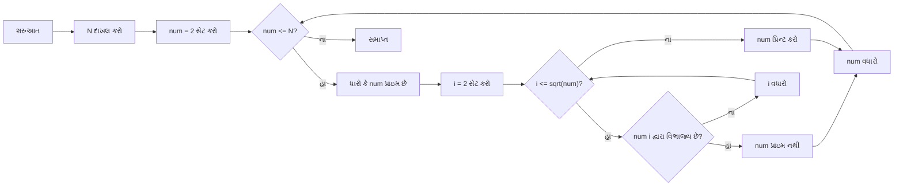

- **ટાઇમ કોમ્પ્લેક્સિટી**: O(N√N) - વર્ગમૂળ અભિગમ સાથે ઓપ્ટિમાઇઝ કરેલ
- **સ્પેસ કોમ્પ્લેક્સિટી**: O(1) - માત્ર સ્થિર સ્પેસનો ઉપયોગ કરે છે

**મેમરી ટ્રીક:** "ભાગ કરીને પ્રાઇમ નક્કી કરો"

## પ્રશ્ન 1(ક) OR [7 ગુણ]

**Python માં break, continue, અને pass સ્ટેટમેન્ટનું કાર્ય અને ઉદાહરણ સાથે સમજાવો.**

**જવાબ**:

| સ્ટેટમેન્ટ | ઉદ્દેશ | ઉદાહરણ |
|-----------|---------|---------|
| break | લૂપને સંપૂર્ણપણે સમાપ્ત કરે છે | શરત પૂરી થાય ત્યારે લૂપ બંધ કરો |
| continue | વર્તમાન પુનરાવર્તન છોડી દે છે, આગળના સાથે ચાલુ રાખે છે | ચોક્કસ આઇટમ્સ છોડો |
| pass | નલ ઓપરેશન, કંઈ કરતું નથી | ભવિષ્યના કોડ માટે પ્લેસહોલ્ડર |

**1. break સ્ટેટમેન્ટ:**

```python
# 5 મળે ત્યારે લૂપ બંધ કરો
for num in range(1, 10):
    if num == 5:
        print("5 મળ્યું, લૂપ બંધ કરું છું")
        break
    print(num)
# આઉટપુટ: 1 2 3 4 5 મળ્યું, લૂપ બંધ કરું છું
```

**2. continue સ્ટેટમેન્ટ:**

```python
# બેકી સંખ્યાઓ છોડો
for num in range(1, 6):
    if num % 2 == 0:
        continue
    print(num)
# આઉટપુટ: 1 3 5
```

**3. pass સ્ટેટમેન્ટ:**

```python
# ખાલી ફંક્શન કાર્યાન્વયન
def my_function():
    pass

# ખાલી શરતી બ્લોક
x = 10
if x > 5:
    pass  # પછીથી અમલ કરીશું
```

**ફ્લો કંટ્રોલ ડાયાગ્રામ:**

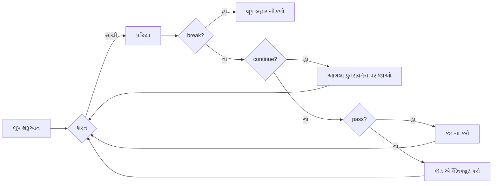

- **break**: લૂપમાંથી સંપૂર્ણપણે બહાર નીકળે છે
- **continue**: આગલા પુનરાવર્તન પર જાય છે
- **pass**: કંઈ કરતું નથી, ભવિષ્યના કોડ માટે પ્લેસહોલ્ડર

**મેમરી ટ્રીક:** "BCP - સંપૂર્ણપણે બંધ કરો, આંશિક રીતે ચાલુ રાખો, શાંતિથી પસાર થાઓ"

## પ્રશ્ન 2(અ) [3 ગુણ]

**યુઝરે આપેલ વર્ષ લીપ વર્ષ છે કે નહીં તે માટે પ્રોગ્રામ બનાવો.**

**જવાબ**:

```python
def is_leap_year(year):
    # લીપ વર્ષ 4 થી વિભાજ્ય હોય છે
    # પરંતુ જો તે 100 થી વિભાજ્ય હોય, તો 400 થી પણ વિભાજ્ય હોવું જોઈએ
    if (year % 4 == 0 and year % 100 != 0) or (year % 400 == 0):
        return True
    else:
        return False

# યુઝર પાસેથી ઇનપુટ લો
year = int(input("વર્ષ દાખલ કરો: "))

# લીપ વર્ષ છે કે નહીં તપાસો
if is_leap_year(year):
    print(f"{year} લીપ વર્ષ છે")
else:
    print(f"{year} લીપ વર્ષ નથી")
```

**નિર્ણય વૃક્ષ:**

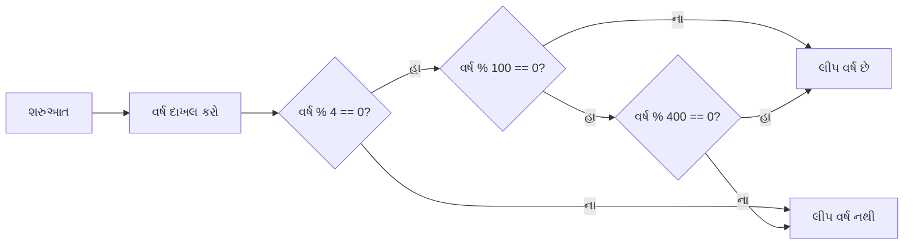

- **નિયમ 1**: 4 થી વિભાજ્ય, 100 થી નહીં
- **નિયમ 2**: અથવા 400 થી વિભાજ્ય

**મેમરી ટ્રીક:** "4 હા, 100 ના, 400 હા"

## પ્રશ્ન 2(બ) [4 ગુણ]

**Python માં લિસ્ટ અને ટ્યુપલ વચ્ચેના મુખ્ય તફાવત શું છે?**

**જવાબ**:

| વિશેષતા | લિસ્ટ | ટ્યુપલ |
|---------|------|-------|
| સિન્ટેક્સ | `[]` નો ઉપયોગ કરીને બનાવવામાં આવે છે | `()` નો ઉપયોગ કરીને બનાવવામાં આવે છે |
| પરિવર્તનશીલતા | મ્યુટેબલ (બદલી શકાય છે) | ઇમ્યુટેબલ (બદલી શકાતું નથી) |
| મેથડ્સ | ઘણી મેથડ્સ (append, remove, વગેરે) | મર્યાદિત મેથડ્સ (count, index) |
| પર્ફોર્મન્સ | ધીમું | ઝડપી |
| ઉપયોગ કેસ | જ્યારે સંશોધન જરૂરી હોય | જ્યારે ડેટા બદલવો ન જોઈએ |
| મેમરી | વધુ મેમરી વાપરે છે | ઓછી મેમરી વાપરે છે |

**તુલના ડાયાગ્રામ:**

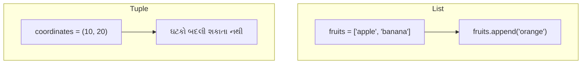

- **લિસ્ટ્સ**: જ્યારે તમારે સંગ્રહને સંશોધિત કરવાની જરૂર હોય
- **ટ્યુપલ્સ**: જ્યારે તમને અપરિવર્તનીય ડેટાની જરૂર હોય (ઝડપી, સુરક્ષિત)

**મેમરી ટ્રીક:** "LIST - બદલી શકાય તેવા ઘટકો, TUPLE - બદલી ન શકાય તેવા ઘટકો"

## પ્રશ્ન 2(ક) [7 ગુણ]

**યુઝરે દાખલ કરેલ તમામ positive number છે કે નહી તે શોધવાનો પ્રોગ્રામ બનાવો. જ્યારે યુઝર negative number દાખલ કરે, ત્યારે ઇનપુટ લેવાનું બંધ કરો અને તમામ positive number નો સરવાળો કરો.**

**જવાબ**:

```python
def sum_positives():
    total_sum = 0
    
    while True:
        num = float(input("નંબર દાખલ કરો (negative બંધ કરવા માટે): "))
        
        # Check if number is negative
        if num < 0:
            break
            
        # Add positive number to total
        total_sum += num
    
    print(f"બધા પોઝિટિવ નંબરનો સરવાળો: {total_sum}")

# Run the function
sum_positives()
```

**પ્રક્રિયા ફ્લો:**

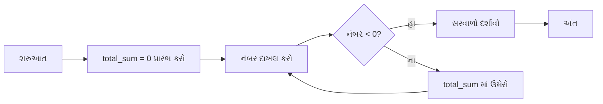

- **લૂપ કંટ્રોલ**: નકારાત્મક ઇનપુટ પર સમાપ્ત થાય છે
- **એક્યુમ્યુલેટર**: દરેક હકારાત્મક સંખ્યાને ચાલુ કુલમાં ઉમેરે છે

**મેમરી ટ્રીક:** "નેગેટિવ આવે ત્યાં સુધી સરવાળો કરો"

## પ્રશ્ન 2(અ) OR [3 ગુણ]

**તમે આપેલ ત્રણ number માંથી મોટો number શોધવાનું પ્રોગ્રામ બનાવો.**

**જવાબ**:

```python
# યુઝર પાસેથી ત્રણ સંખ્યાઓ મેળવો
num1 = float(input("પહેલી સંખ્યા દાખલ કરો: "))
num2 = float(input("બીજી સંખ્યા દાખલ કરો: "))
num3 = float(input("ત્રીજી સંખ્યા દાખલ કરો: "))

# if-else વાપરીને મહત્તમ શોધો
if num1 >= num2 and num1 >= num3:
    maximum = num1
elif num2 >= num1 and num2 >= num3:
    maximum = num2
else:
    maximum = num3

print(f"મહત્તમ સંખ્યા: {maximum}")

# બિલ્ટ-ઇન max() ફંક્શન વાપરવાનો વૈકલ્પિક રસ્તો
# maximum = max(num1, num2, num3)
# print(f"મહત્તમ સંખ્યા: {maximum}")
```

**તુલના લોજિક:**

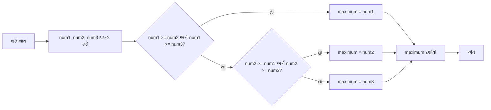

- **તુલના**: મહત્તમ શોધવા માટે લોજિકલ ઓપરેટર્સનો ઉપયોગ કરે છે
- **વૈકલ્પિક**: સરળતા માટે બિલ્ટ-ઇન max() ફંક્શન

**મેમરી ટ્રીક:** "દરેકની તુલના કરો, મોટામાં મોટો લો"

## પ્રશ્ન 2(બ) OR [4 ગુણ]

**str = "abcdefghijklmnopqrstuvwxyz" આપેલ છે. ઉપરોક્ત સ્ટ્રિંગમાંથી દરેક બીજાં અક્ષર જુદો કાઢવા માટે Python પ્રોગ્રામ લખો.**

**જવાબ**:

```python
# આપેલ સ્ટ્રિંગ
str = "abcdefghijklmnopqrstuvwxyz"

# સ્લાઇસિંગનો ઉપયોગ કરીને દરેક બીજા અક્ષરને કાઢો
# સિન્ટેક્સ છે [start:end:step]
# start=0 (શરુઆત), end=len(str) (સ્ટ્રિંગનો અંત), step=2 (દરેક બીજો અક્ષર)
result = str[0::2]

print("મૂળ સ્ટ્રિંગ:", str)
print("દરેક બીજો અક્ષર:", result)
# આઉટપુટ: દરેક બીજો અક્ષર: acegikmoqsuwy
```

**સ્ટ્રિંગ સ્લાઇસિંગ ડાયાગ્રામ:**

```
+---+---+---+---+---+---+---+---+---+---+---+
| a | b | c | d | e | f | g | h | i | j | k |...
+---+---+---+---+---+---+---+---+---+---+---+
  ^       ^       ^       ^       ^
  |       |       |       |       |
  0       2       4       6       8   (indices)
```

- **સ્ટ્રિંગ સ્લાઇસિંગ**: [start:end:step] સિન્ટેક્સ
- **સ્ટેપ વેલ્યુ**: 2 દરેક બીજા અક્ષરને પસંદ કરે છે

**મેમરી ટ્રીક:** "સ્લાઇસ સ્ટેપ સિલેક્ટર"

## પ્રશ્ન 2(ક) OR [7 ગુણ]

**વિદ્યાર્થીઓના નામ અને તેમના માર્ક્સ સંગ્રહિત કરવા માટે ડિક્શનરી બનાવવાનું Python પ્રોગ્રામ લખો. 75 થી વધુ માર્ક્સ મેળવનાર વિદ્યાર્થીઓના નામ ડિસ્પ્લે કરવો.**

**જવાબ**:

```python
def high_scorers():
    # ખાલી ડિક્શનરી બનાવો
    students = {}
    
    # વિદ્યાર્થીઓની સંખ્યા મેળવો
    n = int(input("વિદ્યાર્થીઓની સંખ્યા દાખલ કરો: "))
    
    # વિદ્યાર્થી ડેટા દાખલ કરો
    for i in range(n):
        name = input(f"વિદ્યાર્થી {i+1} નું નામ દાખલ કરો: ")
        marks = float(input(f"વિદ્યાર્થી {i+1} ના માર્ક્સ દાખલ કરો: "))
        students[name] = marks
    
    # ડિક્શનરી દર્શાવો
    print("\nવિદ્યાર્થી રેકોર્ડ્સ:", students)
    
    # ઉચ્ચ સ્કોરર્સ દર્શાવો
    print("\n75 થી વધુ માર્ક્સ મેળવનાર વિદ્યાર્થીઓ:")
    for name, marks in students.items():
        if marks > 75:
            print(f"{name}: {marks}")

# ફંક્શન ચલાવો
high_scorers()
```

**પ્રક્રિયા ડાયાગ્રામ:**

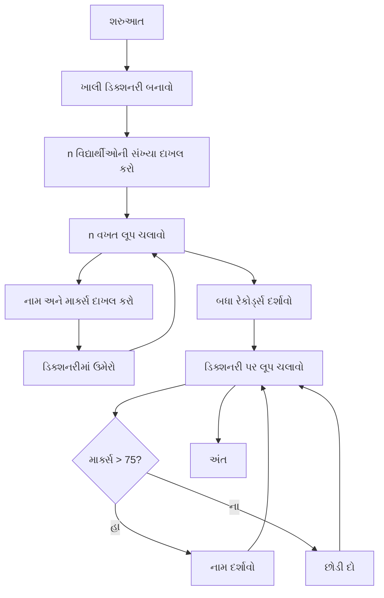

- **ડિક્શનરી**: વિદ્યાર્થીઓના નામ અને માર્ક્સની કી-વેલ્યુ જોડી
- **શરતી ફિલ્ટરિંગ**: ઉચ્ચ સ્કોરર્સ (>75) પસંદ કરે છે

**મેમરી ટ્રીક:** "બધું સંગ્રહો, કેટલાક ફિલ્ટર કરો"

## પ્રશ્ન 3(અ) [3 ગુણ]

**સ્પેસને બહાર રાખીને સ્ટ્રિંગની લંબાઈ શોધવાનો પ્રોગ્રામ લખો.**

**જવાબ**:

```python
def length_without_spaces():
    # ઇનપુટ સ્ટ્રિંગ મેળવો
    input_string = input("સ્ટ્રિંગ દાખલ કરો: ")
    
    # સ્પેસ દૂર કરો અને લંબાઈ ગણો
    # મેથડ 1: replace નો ઉપયોગ
    no_spaces = input_string.replace(" ", "")
    length = len(no_spaces)
    
    # મેથડ 2: કાઉન્ટરનો ઉપયોગ
    # count = 0
    # for char in input_string:
    #     if char != " ":
    #         count += 1
    
    print(f"મૂળ સ્ટ્રિંગ: '{input_string}'")
    print(f"સ્પેસ વિના લંબાઈ: {length}")

# ફંક્શન ચલાવો
length_without_spaces()
```

**સ્ટ્રિંગ પ્રોસેસિંગ:**

```
"Hello World" → "HelloWorld" → લંબાઈ: 10
```

- **સ્પેસ દૂર કરવી**: replace() અથવા ફિલ્ટરિંગનો ઉપયોગ
- **સ્ટ્રિંગ લંબાઈ**: સ્પેસ દૂર કર્યા પછી ગણતરી કરવામાં આવે છે

**મેમરી ટ્રીક:** "અક્ષરો ગણો, સ્પેસ છોડો"

## પ્રશ્ન 3(બ) [4 ગુણ]

**Python માં ડિક્શનરી methods યાદી આપો અને દરેકને યોગ્ય ઉદાહરણ સાથે સમજાવો.**

**જવાબ**:

| મેથડ | વિવરણ | ઉદાહરણ |
|--------|-------------|---------|
| `clear()` | બધી વસ્તુઓ દૂર કરે છે | `dict.clear()` |
| `copy()` | ઉથલી નકલ પાછી આપે છે | `new_dict = dict.copy()` |
| `get()` | કી માટે મૂલ્ય પાછું આપે છે | `value = dict.get('key', default)` |
| `items()` | કી-વેલ્યુ જોડી પાછી આપે છે | `for k, v in dict.items():` |
| `keys()` | બધી કી પાછી આપે છે | `for k in dict.keys():` |
| `values()` | બધા મૂલ્યો પાછા આપે છે | `for v in dict.values():` |
| `pop()` | કી સાથે આઇટમ દૂર કરે છે | `value = dict.pop('key')` |
| `update()` | ડિક્શનરી અપડેટ કરે છે | `dict.update({'key': value})` |

**કોડ ઉદાહરણ:**

```python
student = {'name': 'John', 'age': 20, 'grade': 'A'}

# get મેથડ
print(student.get('name'))  # આઉટપુટ: John
print(student.get('city', 'Not found'))  # આઉટપુટ: Not found

# update મેથડ
student.update({'city': 'New York', 'grade': 'A+'})
print(student)  # {'name': 'John', 'age': 20, 'grade': 'A+', 'city': 'New York'}

# pop મેથડ
removed = student.pop('age')
print(removed)  # 20
print(student)  # {'name': 'John', 'grade': 'A+', 'city': 'New York'}
```

- **એક્સેસ મેથડ્સ**: get(), keys(), values(), items()
- **મોડિફિકેશન મેથડ્સ**: update(), pop(), clear()

**મેમરી ટ્રીક:** "GCUP-KPIV" (Get-Copy-Update-Pop, Keys-Pop-Items-Values)

## પ્રશ્ન 3(ક) [7 ગુણ]

**Python ના લિસ્ટ ડેટા ટાઇપને સમજાવો.**

**જવાબ**:

**પાયથોન લિસ્ટ**: એક ક્રમબદ્ધ, પરિવર્તનશીલ સંગ્રહ જે વિવિધ ડેટા પ્રકારોની વસ્તુઓ સંગ્રહિત કરી શકે છે.

| વિશેષતા | વિવરણ | ઉદાહરણ |
|---------|-------------|---------|
| નિર્માણ | ચોરસ કૌંસનો ઉપયોગ | `my_list = [1, 'hello', True]` |
| ઇન્ડેક્સિંગ | શૂન્ય-આધારિત, નકારાત્મક ઇન્ડિસીસ | `my_list[0]`, `my_list[-1]` |
| સ્લાઇસિંગ | ભાગો કાઢો | `my_list[1:3]` |
| પરિવર્તનશીલતા | સંશોધિત કરી શકાય છે | `my_list[0] = 10` |
| મેથડ્સ | ઘણી બિલ્ટ-ઇન મેથડ્સ | `append()`, `insert()`, `remove()` |
| નેસ્ટિંગ | લિસ્ટોની અંદર લિસ્ટો | `nested = [[1, 2], [3, 4]]` |

**સામાન્ય લિસ્ટ મેથડ્સ:**

| મેથડ | હેતુ | ઉદાહરણ |
|--------|---------|---------|
| `append()` | અંતમાં આઇટમ ઉમેરો | `my_list.append(5)` |
| `insert()` | પોઝિશન પર ઉમેરો | `my_list.insert(1, 'new')` |
| `remove()` | મૂલ્ય દ્વારા દૂર કરો | `my_list.remove('hello')` |
| `pop()` | ઇન્ડેક્સ દ્વારા દૂર કરો | `my_list.pop(2)` |
| `sort()` | લિસ્ટ સોર્ટ કરો | `my_list.sort()` |
| `reverse()` | ક્રમ ઉલટાવો | `my_list.reverse()` |

**લિસ્ટ ઓપરેશન્સ ડાયાગ્રામ:**

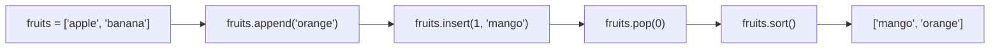

- **બહુમુખી**: એક સંગ્રહમાં વિવિધ ડેટા પ્રકારો સ્ટોર કરે છે
- **ડાયનેમિક સાઇઝિંગ**: જરૂરિયાત મુજબ મોટું થાય છે અથવા સંકોચાય છે

**મેમરી ટ્રીક:** "CAMP-IS" (Create, Access, Modify, Process, Index, Slice)

## પ્રશ્ન 3(અ) OR [3 ગુણ]

**યુઝર પાસેથી સ્ટ્રિંગ ઇનપુટ લેવા માટેનું પ્રોગ્રામ લખો અને નવી સ્ટ્રિંગ બનાવ્યા વિના તેને reverse order માં છાપો.**

**જવાબ**:

```python
def reverse_string():
    # ઇનપુટ સ્ટ્રિંગ મેળવો
    input_string = input("સ્ટ્રિંગ દાખલ કરો: ")
    
    # મૂળ સ્ટ્રિંગ પ્રિન્ટ કરો
    print(f"મૂળ સ્ટ્રિંગ: {input_string}")
    
    # સ્લાઇસ નોટેશનનો ઉપયોગ કરીને ઉલટી સ્ટ્રિંગ પ્રિન્ટ કરો
    # સિન્ટેક્સ છે [start:end:step]
    # start=None (ડિફોલ્ટ), end=None (ડિફોલ્ટ), step=-1 (ઉલટું)
    print(f"ઉલટી સ્ટ્રિંગ: {input_string[::-1]}")

# ફંક્શન ચલાવો
reverse_string()
```

**સ્ટ્રિંગ રિવર્સિંગ વિઝ્યુલાઇઝેશન:**

```
"Hello" → "olleH"

ઇન્ડિસીસ:  0   1   2   3   4
સ્ટ્રિંગ:    H   e   l   l   o
ઉલટી:      o   l   l   e   H
ઇન્ડિસીસ: -1  -2  -3  -4  -5
```

- **નકારાત્મક સ્ટેપ સાથે સ્લાઇસિંગ**: નવી સ્ટ્રિંગ વિના ઉલટી કરે છે
- **કાર્યક્ષમ**: નવી સ્ટ્રિંગ માટે વધારાની મેમરીનો ઉપયોગ થતો નથી

**મેમરી ટ્રીક:** "પાછળની તરફ સ્લાઇસ કરો"

## પ્રશ્ન 3(બ) OR [4 ગુણ]

**Python માં ડિક્શનરી ઓપરેશન્સની યાદી આપો અને દરેકને યોગ્ય ઉદાહરણ સાથે સમજાવો.**

**જવાબ**:

| ઓપરેશન | વિવરણ | ઉદાહરણ |
|-----------|-------------|---------|
| નિર્માણ | નવી ડિક્શનરી બનાવો | `d = {'key': 'value'}` |
| એક્સેસ | કી દ્વારા એક્સેસ | `value = d['key']` |
| અસાઇનમેન્ટ | આઇટમ્સ ઉમેરો અથવા અપડેટ કરો | `d['new_key'] = 'new_value'` |
| ડિલીશન | આઇટમ્સ દૂર કરો | `del d['key']` |
| મેમ્બરશિપ | કી અસ્તિત્વમાં છે કે નહીં તપાસો | `if 'key' in d:` |
| લંબાઈ | આઇટમ્સ ગણો | `len(d)` |
| ઇટરેશન | આઇટમ્સ પર લૂપ | `for key in d:` |
| કોમ્પ્રિહેન્શન | નવી ડિક્શનરી બનાવો | `{x: x**2 for x in range(5)}` |

**કોડ ઉદાહરણ:**

```python
# નિર્માણ
student = {'name': 'John', 'age': 20}

# એક્સેસ
print(student['name'])  # આઉટપુટ: John

# અસાઇનમેન્ટ
student['grade'] = 'A'  # નવી કી-વેલ્યુ જોડી ઉમેરો
student['age'] = 21     # હાલની વેલ્યુ અપડેટ કરો

# મેમ્બરશિપ ટેસ્ટ
if 'grade' in student:
    print("ગ્રેડ અસ્તિત્વમાં છે")  # પ્રિન્ટ થશે

# ડિલીશન
del student['age']
print(student)  # {'name': 'John', 'grade': 'A'}

# ડિક્શનરી કોમ્પ્રિહેન્શન
squares = {x: x**2 for x in range(1, 5)}
print(squares)  # {1: 1, 2: 4, 3: 9, 4: 16}
```

- **કી-આધારિત એક્સેસ**: કી દ્વારા ઝડપી લુકઅપ
- **ડાયનેમિક સ્ટ્રક્ચર**: જરૂરિયાત મુજબ આઇટમ્સ ઉમેરો/દૂર કરો

**મેમરી ટ્રીક:** "CADMIL" (Create, Access, Delete, Modify, Iterate, Length

## પ્રશ્ન 3(ક) OR [7 ગુણ]

**Python ના સેટ ડેટા ટાઇપને વિગતે સમજાવો.**

**જવાબ**:

**પાયથોન સેટ**: અનન્ય, અપરિવર્તનીય આઇટમ્સનો એક અનૌર્ડર્ડ સંગ્રહ.

| વિશેષતા | વિવરણ | ઉદાહરણ |
|---------|-------------|---------|
| નિર્માણ | કર્લી બ્રેસિસ અથવા set() નો ઉપયોગ | `my_set = {1, 2, 3}` અથવા `set([1, 2, 3])` |
| અનન્યતા | ડુપ્લિકેટ્સની મંજૂરી નથી | `{1, 2, 2, 3}` `{1, 2, 3}` બની જાય છે |
| અનૌર્ડર્ડ | ઇન્ડેક્સિંગ નહીં | `my_set[0]` વાપરી શકાતું નથી |
| પરિવર્તનશીલતા | સેટ પોતે મ્યુટેબલ છે, પણ ઘટકો અપરિવર્તનીય હોવા જોઈએ | આઇટમ્સ ઉમેરી/દૂર કરી શકાય છે |
| ગણિત ઓપરેશન્સ | સેટ થિયરી ઓપરેશન્સ | યુનિયન, ઇન્ટરસેક્શન, ડિફરન્સ |
| ઉપયોગ કેસ | ડુપ્લિકેટ્સ દૂર કરવા, મેમ્બરશિપ ટેસ્ટિંગ | ઝડપી લુકઅપ્સ |

**સામાન્ય સેટ ઓપરેશન્સ:**

| ઓપરેશન | ઓપરેટર | મેથડ | વિવરણ |
|-----------|----------|--------|-------------|
| યુનિયન | `\|` | `union()` | બંને સેટ્સના બધા ઘટકો |
| ઇન્ટરસેક્શન | `&` | `intersection()` | સામાન્ય ઘટકો |
| ડિફરન્સ | `-` | `difference()` | પ્રથમમાં પરંતુ બીજામાં નહીં તેવા ઘટકો |
| સિમેટ્રિક ડિફરન્સ | `^` | `symmetric_difference()` | કોઈપણ એકમાં પરંતુ બંનેમાં નહીં તેવા ઘટકો |

**સેટ ઓપરેશન્સ ડાયાગ્રામ:**

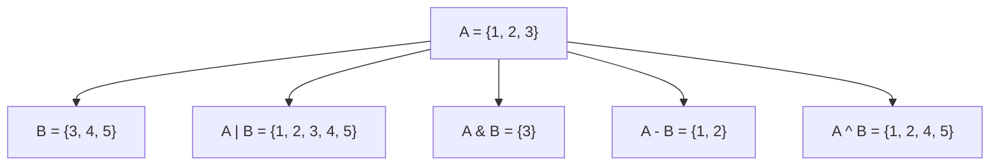

- **ઝડપી મેમ્બરશિપ**: O(1) સરેરાશ સમય જટિલતા
- **ગાણિતિક ઓપરેશન્સ**: સેટ થિયરી ઓપરેશન્સ બિલ્ટ-ઇન

**મેમરી ટ્રીક:** "SUMO" (Sets અનન્ય, મ્યુટેબલ, અને ઓર્ડર વિનાના)

## પ્રશ્ન 4(અ) [3 ગુણ]

**statistics મોડ્યુલને સમજાવો અને તેમાંની ત્રણ પદ્ધતિઓ સાથે ઉદાહરણ આપો.**

**જવાબ**:

statistics મોડ્યુલ ન્યુમેરિક ડેટાની ગણિતીય આંકડાકીય ગણતરી માટે ફંક્શન્સ પ્રદાન કરે છે.

| મેથડ | વિવરણ | ઉદાહરણ |
|--------|-------------|---------|
| `mean()` | ગાણિતિક સરેરાશ | `statistics.mean([1, 2, 3, 4, 5])` 3.0 પાછું આપે છે |
| `median()` | મધ્ય મૂલ્ય | `statistics.median([1, 3, 5, 7, 9])` 5 પાછું આપે છે |
| `mode()` | સૌથી સામાન્ય મૂલ્ય | `statistics.mode([1, 2, 2, 3, 4])` 2 પાછું આપે છે |
| `stdev()` | સ્ટાન્ડર્ડ ડેવિએશન | `statistics.stdev([1, 2, 3, 4, 5])` 1.58... પાછું આપે છે |

**કોડ ઉદાહરણ:**

```python
import statistics

data = [2, 5, 7, 9, 12, 13, 14, 5]

# Mean (સરેરાશ)
print("Mean:", statistics.mean(data))  # આઉટપુટ: 8.375

# Median (મધ્ય મૂલ્ય)
print("Median:", statistics.median(data))  # આઉટપુટ: 8.0

# Mode (સૌથી વારંવાર)
print("Mode:", statistics.mode(data))  # આઉટપુટ: 5
```

- **ડેટા એનાલિસિસ**: આંકડાકીય ગણતરી માટે ફંક્શન્સ
- **બિલ્ટ-ઇન મોડ્યુલ**: બાહ્ય ઇન્સ્ટોલેશનની જરૂર નથી

**મેમરી ટ્રીક:** "MMM Stats" (Mean, Median, Mode Statistics)

## પ્રશ્ન 4(બ) [4 ગુણ]

**Python માં યુઝર ડિફાઇન્ડ ફંક્શન અને યુઝર ડિફાઇન્ડ મોડ્યુલને સમજાવો.**

**જવાબ**:

| વિશેષતા | યુઝર-ડિફાઇન્ડ ફંક્શન | યુઝર-ડિફાઇન્ડ મોડ્યુલ |
|---------|----------------------|---------------------|
| વ્યાખ્યા | ફરીથી વાપરી શકાય તેવા કોડનો બ્લોક | ફંક્શન્સ/ક્લાસિસ સાથે પાયથોન ફાઇલ |
| હેતુ | કોડ ઓર્ગેનાઇઝેશન અને રીયુઝ | સંબંધિત કોડ ઓર્ગેનાઇઝ કરવો |
| નિર્માણ | `def` કીવર્ડનો ઉપયોગ | .py ફાઇલ બનાવવી |
| ઉપયોગ | ફંક્શન નામથી કૉલ | `import` સ્ટેટમેન્ટનો ઉપયોગ |
| સ્કોપ | ફંક્શનમાં લોકલ | ઇમ્પોર્ટ પછી એક્સેસિબલ |
| લાભો | પુનરાવર્તન ઘટાડે છે | કોડ ઓર્ગેનાઇઝેશનને પ્રોત્સાહન આપે છે |

**યુઝર-ડિફાઇન્ડ ફંક્શન ઉદાહરણ:**

```python
# ફંક્શન વ્યાખ્યા
def calculate_area(length, width):
    """લંબચોરસનું ક્ષેત્રફળ ગણો"""
    area = length * width
    return area

# ફંક્શન કૉલ
result = calculate_area(5, 3)
print("ક્ષેત્રફળ:", result)  # આઉટપુટ: 15
```

**યુઝર-ડિફાઇન્ડ મોડ્યુલ ઉદાહરણ:**

```python
# ફાઇલ: geometry.py
def calculate_area(length, width):
    return length * width

def calculate_perimeter(length, width):
    return 2 * (length + width)

# બીજી ફાઇલમાં
import geometry

area = geometry.calculate_area(5, 3)
print("ક્ષેત્રફળ:", area)  # આઉટપુટ: 15
```

**મોડ્યુલ ઓર્ગેનાઇઝેશન:**

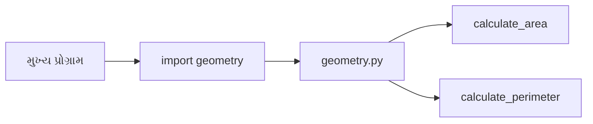

- **ફંક્શન લાભો**: કોડ રીયુઝ, મોડ્યુલર ડિઝાઇન
- **મોડ્યુલ લાભો**: ઓર્ગેનાઇઝ્ડ કોડ, નેમસ્પેસ સેપરેશન

**મેમરી ટ્રીક:** "FIR-MID" (Functions આંતરિક રીયુઝ માટે, Modules ફાઇલો વચ્ચે વિતરણ માટે)

## પ્રશ્ન 4(ક) [7 ગુણ]

**Using recursion આપેલ આંકડાના ફેક્ટોરિયલને શોધવા માટે યુઝર ડિફાઇન્ડ ફંક્શનનો ઉપયોગ કરીને Python કોડ લખો.**

**જવાબ**:

```python
def factorial(n):
    """
    રિકર્ઝનનો ઉપયોગ કરીને n નું ફેક્ટોરિયલ ગણો
    n! = n * (n-1)!
    """
    # બેઝ કેસ: 0 અથવા 1 નું ફેક્ટોરિયલ 1 છે
    if n == 0 or n == 1:
        return 1
    
    # રિકર્સિવ કેસ: n! = n * (n-1)!
    else:
        return n * factorial(n-1)

# યુઝર પાસેથી ઇનપુટ મેળવો
number = int(input("હકારાત્મક પૂર્ણાંક દાખલ કરો: "))

# ચકાસો કે ઇનપુટ માન્ય છે
if number < 0:
    print("નકારાત્મક સંખ્યાઓ માટે ફેક્ટોરિયલ વ્યાખ્યાયિત નથી.")
else:
    # ગણતરી કરો અને પરિણામ દર્શાવો
    result = factorial(number)
    print(f"{number} નું ફેક્ટોરિયલ {result} છે")
```

**રિકર્સિવ ફંક્શન વિઝ્યુલાઇઝેશન:**

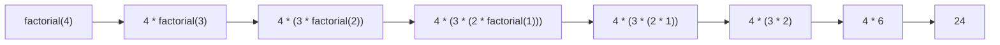

- **બેઝ કેસ**: n=0 અથવા n=1 હોય ત્યારે રિકર્ઝન રોકે છે
- **રિકર્સિવ કેસ**: સમસ્યાને નાના ઉપ-સમસ્યાઓમાં તોડે છે

**મેમરી ટ્રીક:** "ફેક્ટોરિયલ = સંખ્યા ગુણ્યા (સંખ્યા માઇનસ વન)!"

## પ્રશ્ન 4(અ) OR [3 ગુણ]

**મેથ મોડ્યુલને સમજાવો અને તેમાંની ત્રણ methods ઉદાહરણ સાથે સમજાવો.**

**જવાબ**:

math મોડ્યુલ C સ્ટાન્ડર્ડ દ્વારા વ્યાખ્યાયિત ગાણિતિક ફંક્શન્સની એક્સેસ પ્રદાન કરે છે.

| મેથડ | વિવરણ | ઉદાહરણ |
|--------|-------------|---------|
| `math.sqrt()` | વર્ગમૂળ | `math.sqrt(16)` 4.0 પાછું આપે છે |
| `math.pow()` | પાવર ફંક્શન | `math.pow(2, 3)` 8.0 પાછું આપે છે |
| `math.floor()` | નીચે રાઉન્ડ | `math.floor(4.7)` 4 પાછું આપે છે |
| `math.ceil()` | ઉપર રાઉન્ડ | `math.ceil(4.2)` 5 પાછું આપે છે |
| `math.sin()` | સાઇન ફંક્શન | `math.sin(math.pi/2)` 1.0 પાછું આપે છે |

**કોડ ઉદાહરણ:**

```python
import math

# વર્ગમૂળ
print("25 નું વર્ગમૂળ:", math.sqrt(25))  # આઉટપુટ: 5.0

# પાવર
print("2 ને પાવર 3 ચડાવતા:", math.pow(2, 3))  # આઉટપુટ: 8.0

# કોન્સ્ટન્ટ્સ
print("પાઈનું મૂલ્ય:", math.pi)  # આઉટપુટ: 3.141592653589793
```

- **ગાણિતિક ઓપરેશન્સ**: એડવાન્સ મેથ ફંક્શન્સ
- **કોન્સ્ટન્ટ્સ**: પાઈ અને e જેવા ગાણિતિક અચળાંકો

**મેમરી ટ્રીક:** "SPT Math" (Square root, Power, Trigonometry in Math module)

## પ્રશ્ન 4(બ) OR [4 ગુણ]

**Python માં global અને local variables સમજાવો.**

**જવાબ**:

| વેરિએબલ પ્રકાર | સ્કોપ | વ્યાખ્યા | એક્સેસ |
|--------------|-------|------------|--------|
| લોકલ | ફંક્શનની અંદર | ફંક્શનની અંદર વ્યાખ્યાયિત | માત્ર ફંક્શનની અંદર |
| ગ્લોબલ | આખો પ્રોગ્રામ | ફંક્શનની બહાર વ્યાખ્યાયિત | પ્રોગ્રામમાં ગમે ત્યાં |

**ઉદાહરણ:**

```python
# ગ્લોબલ વેરિએબલ
total = 0

def add_numbers(a, b):
    # લોકલ વેરિએબલ્સ
    result = a + b
    
    # ગ્લોબલ વેરિએબલ એક્સેસ
    global total
    total += result
    
    return result

# ફંક્શન કૉલ
sum_result = add_numbers(5, 3)
print("સરવાળો:", sum_result)  # આઉટપુટ: 8
print("કુલ:", total)  # આઉટપુટ: 8
```

**વેરિએબલ સ્કોપ ડાયાગ્રામ:**

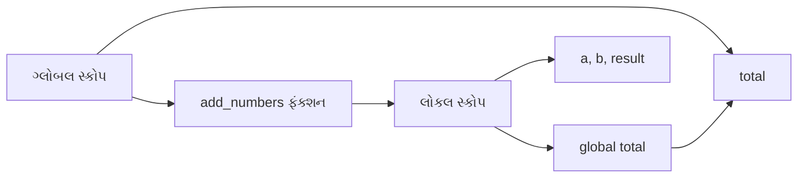

- **ગ્લોબલ**: દરેક જગ્યાએ એક્સેસિબલ પરંતુ સંશોધિત કરવા માટે `global` કીવર્ડની જરૂર
- **લોકલ**: ફંક્શન સ્કોપ સુધી મર્યાદિત, ફંક્શન એક્ઝિક્યુશન પછી મુક્ત

**મેમરી ટ્રીક:** "GLOBAL બધે જાય, LOCAL ફક્ત ફંક્શનમાં રહે"

## પ્રશ્ન 4(ક) OR [7 ગુણ]

**આપેલ સ્ટ્રિંગ પેલિન્ડ્રોમ છે કે નહીં તે તપાસવા માટે યુઝર ડિફાઇન્ડ ફંક્શન બનાવો.**

**જવાબ**:

```python
def is_palindrome(text):
    """
    ચકાસો કે સ્ટ્રિંગ પેલિન્ડ્રોમ છે કે નહીં.
    પેલિન્ડ્રોમ આગળથી અને પાછળથી એક સરખું વંચાય છે.
    """
    # સ્પેસ દૂર કરો અને લોવરકેસમાં ફેરવો
    cleaned_text = text.replace(" ", "").lower()
    
    # ચકાસો કે સ્ટ્રિંગ તેના રિવર્સ સાથે સમાન છે
    return cleaned_text == cleaned_text[::-1]

def check_palindrome():
    # યુઝર પાસેથી ઇનપુટ મેળવો
    input_string = input("સ્ટ્રિંગ દાખલ કરો: ")
    
    # ચકાસો કે તે પેલિન્ડ્રોમ છે
    if is_palindrome(input_string):
        print(f"'{input_string}' પેલિન્ડ્રોમ છે!")
    else:
        print(f"'{input_string}' પેલિન્ડ્રોમ નથી.")
    
    # સંદર્ભ માટે ઉદાહરણો
    print("\nપેલિન્ડ્રોમના ઉદાહરણો:")
    print("'radar' →", is_palindrome("radar"))
    print("'level' →", is_palindrome("level"))
    print("'A man a plan a canal Panama' →", is_palindrome("A man a plan a canal Panama"))

# ફંક્શન ચલાવો
check_palindrome()
```

**પેલિન્ડ્રોમ ટેસ્ટિંગ પ્રક્રિયા:**

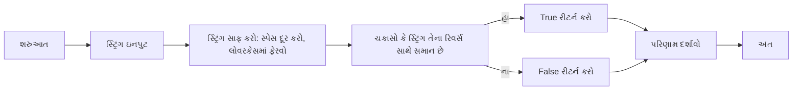

- **સ્ટ્રિંગ ક્લીનિંગ**: સ્પેસ દૂર કરે છે, લોવરકેસમાં ફેરવે છે
- **તુલના**: રિવર્સ સ્ટ્રિંગ સાથે ચકાસે છે
- **ઉદાહરણ પેલિન્ડ્રોમ્સ**: "radar", "madam", "A man a plan a canal Panama"

**મેમરી ટ્રીક:** "સાફ કરો, ઉલટાવો, સરખાવો"

## પ્રશ્ન 5(અ) [3 ગુણ]

**ક્લાસ અને ઑબ્જેક્ટને વ્યાખ્યાયિત કરો અને ઉદાહરણ સાથે સમજાવો.**

**જવાબ**:

**ક્લાસ**: ઓબ્જેક્ટ્સ બનાવવા માટેનો એક બ્લુપ્રિન્ટ જે એટ્રિબ્યુટ્સ અને મેથડ્સ વ્યાખ્યાયિત કરે છે.

**ઓબ્જેક્ટ**: ચોક્કસ એટ્રિબ્યુટ મૂલ્યો સાથે ક્લાસનો એક ઇન્સ્ટન્સ.

**કોડ ઉદાહરણ:**

```python
# ક્લાસ વ્યાખ્યા
class Dog:
    # ક્લાસ એટ્રિબ્યુટ
    species = "Canis familiaris"
    
    # કન્સ્ટ્રક્ટર (ઇન્સ્ટન્સ એટ્રિબ્યુટ્સ શરૂ કરે છે)
    def __init__(self, name, age):
        self.name = name
        self.age = age
    
    # ઇન્સ્ટન્સ મેથડ
    def bark(self):
        return f"{self.name} કહે છે ભૌ ભૌ!"

# ઓબ્જેક્ટ્સ (ઇન્સ્ટન્સિસ) બનાવવા
dog1 = Dog("Rex", 3)
dog2 = Dog("Buddy", 5)

# એટ્રિબ્યુટ્સ અને મેથડ્સ એક્સેસ કરવી
print(dog1.name)  # આઉટપુટ: Rex
print(dog2.species)  # આઉટપુટ: Canis familiaris
print(dog1.bark())  # આઉટપુટ: Rex કહે છે ભૌ ભૌ!
```

**ક્લાસ-ઓબ્જેક્ટ સંબંધ:**

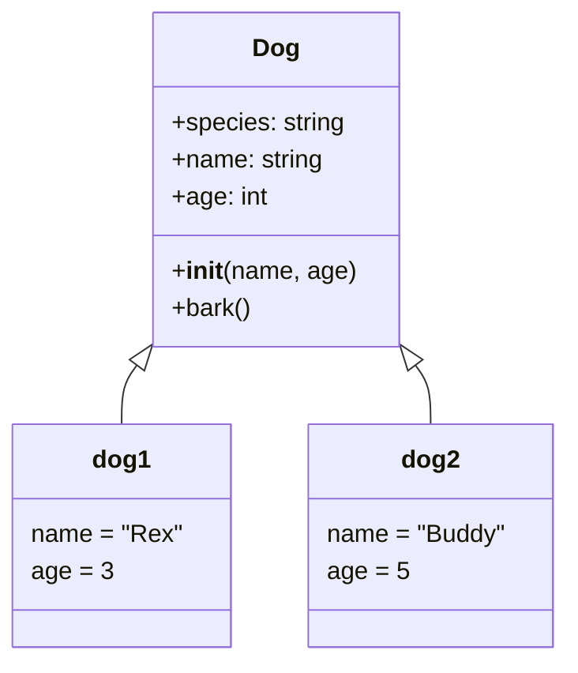

- **ક્લાસ**: એટ્રિબ્યુટ્સ અને મેથડ્સ સાથેનો ટેમ્પલેટ
- **ઓબ્જેક્ટ**: ચોક્કસ મૂલ્યો સાથેનો કોંક્રીટ ઇન્સ્ટન્સ

**મેમરી ટ્રીક:** "CAMBO" (ક્લાસ સાંચો છે, ઓબ્જેક્ટ બનાવે છે)

## પ્રશ્ન 5(બ) [4 ગુણ]

**કન્સ્ટ્રક્ટરનું વર્ગીકરણ કરો. જેમાંથી એકને વિગતે સમજાવો.**

**જવાબ**:

| કન્સ્ટ્રક્ટર પ્રકાર | વિવરણ | ક્યારે વાપરવું |
|-----------------|-------------|-----------|
| ડિફોલ્ટ કન્સ્ટ્રક્ટર | જો કોઈ વ્યાખ્યાયિત ન હોય તો પાયથોન દ્વારા બનાવવામાં આવે છે | સરળ ક્લાસ નિર્માણ |
| પેરામિટરાઇઝ્ડ કન્સ્ટ્રક્ટર | પેરામીટર્સ લે છે અને શરૂ કરે છે | કસ્ટમાઇઝ્ડ ઓબ્જેક્ટ નિર્માણ |
| નોન-પેરામિટરાઇઝ્ડ કન્સ્ટ્રક્ટર | કોઈ પેરામીટર્સ લેતું નથી | બેસિક ઇનિશિયલાઇઝેશન |
| કોપી કન્સ્ટ્રક્ટર | હાલના ઑબ્જેક્ટમાંથી ઑબ્જેક્ટ બનાવે છે | ઓબ્જેક્ટ ડુપ્લિકેશન |

**પેરામિટરાઇઝ્ડ કન્સ્ટ્રક્ટર ઉદાહરણ:**

```python
class Student:
    # પેરામિટરાઇઝ્ડ કન્સ્ટ્રક્ટર
    def __init__(self, name, roll_no, marks):
        self.name = name
        self.roll_no = roll_no
        self.marks = marks
        
    def display(self):
        print(f"નામ: {self.name}, રોલ નં: {self.roll_no}, માર્ક્સ: {self.marks}")

# પેરામીટર્સ સાથે ઓબ્જેક્ટ્સ બનાવવા
student1 = Student("Alice", 101, 85)
student2 = Student("Bob", 102, 78)

# વિદ્યાર્થી માહિતી દર્શાવવી
student1.display()  # આઉટપુટ: નામ: Alice, રોલ નં: 101, માર્ક્સ: 85
student2.display()  # આઉટપુટ: નામ: Bob, રોલ નં: 102, માર્ક્સ: 78
```

**કન્સ્ટ્રક્ટર ફ્લો:**

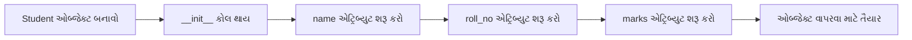

- **હેતુ**: ઓબ્જેક્ટ એટ્રિબ્યુટ્સ શરૂ કરવા
- **સેલ્ફ પેરામીટર**: બનાવવામાં આવી રહેલા ઇન્સ્ટન્સનો સંદર્ભ
- **ઓટોમેટિક કોલ**: ઓબ્જેક્ટ બનાવવામાં આવે ત્યારે કોલ કરવામાં આવે છે

**મેમરી ટ્રીક:** "PICAN" (પેરામીટર્સ કન્સ્ટ્રક્ટર અને નામ શરૂ કરે છે)

## પ્રશ્ન 5(ક) [7 ગુણ]

**hierarchical inheritance માટે Python કોડ વિકસાવો અને સમજાવો.**

**જવાબ**:

```python
# બેઝ ક્લાસ
class Vehicle:
    def __init__(self, make, model, year):
        self.make = make
        self.model = model
        self.year = year
    
    def display_info(self):
        return f"{self.year} {self.make} {self.model}"
    
    def start_engine(self):
        return "એન્જિન શરૂ થયું!"

# ડેરાઇવ્ડ ક્લાસ 1
class Car(Vehicle):
    def __init__(self, make, model, year, doors):
        # પેરેન્ટ ક્લાસ કન્સ્ટ્રક્ટર કોલ
        super().__init__(make, model, year)
        self.doors = doors
    
    def drive(self):
        return "કાર ચલાવાય છે!"

# ડેરાઇવ્ડ ક્લાસ 2
class Motorcycle(Vehicle):
    def __init__(self, make, model, year, has_sidecar):
        # પેરેન્ટ ક્લાસ કન્સ્ટ્રક્ટર કોલ
        super().__init__(make, model, year)
        self.has_sidecar = has_sidecar
    
    def wheelie(self):
        if not self.has_sidecar:
            return "વ્હીલી કરવામાં આવે છે!"
        else:
            return "સાઇડકાર સાથે વ્હીલી નહીં કરી શકાય!"

# ઓબ્જેક્ટ્સ બનાવો
car = Car("Toyota", "Corolla", 2023, 4)
motorcycle = Motorcycle("Honda", "CBR", 2024, False)

# પેરેન્ટ ક્લાસથી મેથડ્સ વાપરો
print(car.display_info())  # આઉટપુટ: 2023 Toyota Corolla
print(motorcycle.start_engine())  # આઉટપુટ: એન્જિન શરૂ થયું!

# સ્પેસિફિક ક્લાસિસથી મેથડ્સ વાપરો
print(car.drive())  # આઉટપુટ: કાર ચલાવાય છે!
print(motorcycle.wheelie())  # આઉટપુટ: વ્હીલી કરવામાં આવે છે!
```

**હાયરાર્કિકલ ઇન્હેરિટન્સ ડાયાગ્રામ:**

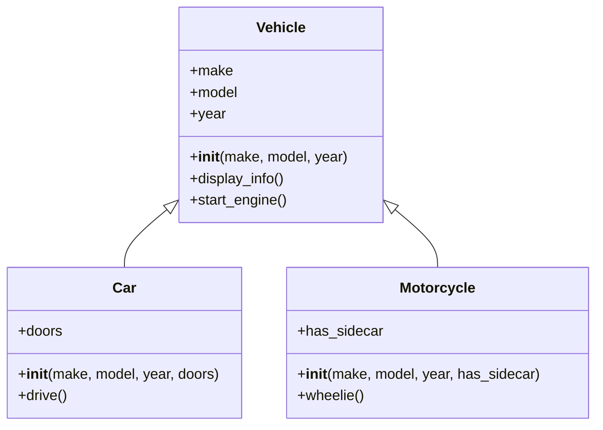

- **બેઝ ક્લાસ**: બધા વાહનો માટે સામાન્ય એટ્રિબ્યુટ્સ/મેથડ્સ
- **ડેરાઇવ્ડ ક્લાસિસ**: ચોક્કસ વાહન પ્રકારો માટે સ્પેશિયલાઇઝ્ડ વર્તન
- **મેથડ ઇન્હેરિટન્સ**: ચાઇલ્ડ ક્લાસિસ પેરેન્ટ ક્લાસ મેથડ્સ વારસામાં મેળવે છે

**મેમરી ટ્રીક:** "પેરેન્ટ્સ શેર કરે, ચિલ્ડ્રન સ્પેશિયલાઇઝ કરે"

## પ્રશ્ન 5(અ) OR [3 ગુણ]

**Python માં __init__ method શું છે? તેના હેતુને યોગ્ય ઉદાહરણ સાથે સમજાવો.**

**જવાબ**:

`__init__` મેથડ એ પાયથોન ક્લાસિસમાં એક ખાસ મેથડ (કન્સ્ટ્રક્ટર) છે જે ઓબ્જેક્ટ બનાવવામાં આવે ત્યારે આપોઆપ કોલ થાય છે.

**હેતુ:**

1. ઓબ્જેક્ટ એટ્રિબ્યુટ્સ શરૂ કરવા
2. ઓબ્જેક્ટની પ્રારંભિક સ્થિતિ સેટ કરવી
3. ઓબ્જેક્ટ બનાવવામાં આવે ત્યારે ચલાવવાનો કોડ એક્ઝિક્યુટ કરવો

**ઉદાહરણ:**

```python
class Rectangle:
    def __init__(self, length, width):
        # એટ્રિબ્યુટ્સ શરૂ કરો
        self.length = length
        self.width = width
        self.area = length * width  # ગણતરી કરેલ એટ્રિબ્યુટ
        
        # કન્ફર્મેશન મેસેજ પ્રિન્ટ કરો
        print(f"{length}x{width} પરિમાણો સાથે લંબચોરસ બનાવવામાં આવ્યો")
    
    def display(self):
        return f"લંબચોરસ: {self.length}x{self.width}, ક્ષેત્રફળ: {self.area}"

# લંબચોરસ ઓબ્જેક્ટ્સ બનાવો
rect1 = Rectangle(5, 3)  # __init__ આપમેળે કોલ થાય છે
rect2 = Rectangle(10, 2)  # __init__ આપમેળે કોલ થાય છે

# માહિતી દર્શાવો
print(rect1.display())
print(rect2.display())
```

- **આપમેળે એક્ઝિક્યુશન**: ઓબ્જેક્ટ બનાવવામાં આવે ત્યારે કોલ થાય છે
- **સેલ્ફ પેરામીટર**: વર્તમાન ઇન્સ્ટન્સનો સંદર્ભ આપે છે
- **મલ્ટિપલ પેરામીટર્સ**: ગમે તેટલી આર્ગ્યુમેન્ટ્સ સ્વીકારી શકે છે

**મેમરી ટ્રીક:** "ASAP" (એટ્રિબ્યુટ્સ બનતા વખતે સેટ થાય છે)

## પ્રશ્ન 5(બ) OR [4 ગુણ]

**Python class માટે methods નું વર્ગીકરણ કરો. તે માંથી એકને વિગતવાર સમજાવો.**

**જવાબ**:

| મેથડ પ્રકાર | વિવરણ | વ્યાખ્યા |
|------------|-------------|------------|
| ઇન્સ્ટન્સ મેથડ | ઓબ્જેક્ટ ઇન્સ્ટન્સ પર કામ કરે છે | `self` સાથે નિયમિત મેથડ |
| ક્લાસ મેથડ | ક્લાસ પોતે પર કામ કરે છે | `@classmethod` સાથે ડેકોરેટ કરેલ |
| સ્ટેટિક મેથડ | ક્લાસ કે ઇન્સ્ટન્સની જરૂર નથી | `@staticmethod` સાથે ડેકોરેટ કરેલ |
| મેજિક/ડન્ડર મેથડ | ખાસ બિલ્ટ-ઇન મેથડ્સ | ડબલ અંડરસ્કોર્સથી ઘેરાયેલ |

**ઇન્સ્ટન્સ મેથડ ઉદાહરણ:**

```python
class Student:
    # ક્લાસ વેરિએબલ
    school = "ABC સ્કૂલ"
    
    def __init__(self, name, age):
        # ઇન્સ્ટન્સ વેરિએબલ્સ
        self.name = name
        self.age = age
    
    # ઇન્સ્ટન્સ મેથડ - ઇન્સ્ટન્સ પર કામ કરે છે
    def display_info(self):
        return f"નામ: {self.name}, ઉંમર: {self.age}, સ્કૂલ: {self.school}"
    
    # પેરામીટર સાથે ઇન્સ્ટન્સ મેથડ
    def is_eligible(self, min_age):
        return self.age >= min_age

# ઓબ્જેક્ટ બનાવો
student = Student("John", 15)

# ઇન્સ્ટન્સ મેથડ્સ કોલ કરો
print(student.display_info())  # આઉટપુટ: નામ: John, ઉંમર: 15, સ્કૂલ: ABC સ્કૂલ
print(student.is_eligible(16))  # આઉટપુટ: False
```

**મેથડ ક્લાસિફિકેશન:**

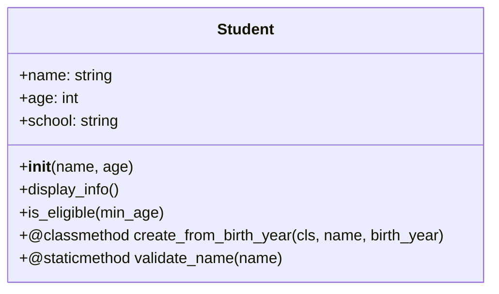

- **ઇન્સ્ટન્સ મેથડ્સ**: ઓબ્જેક્ટ સ્ટેટ એક્સેસ અને મોડિફાય કરે છે
- **સેલ્ફ પેરામીટર**: ઇન્સ્ટન્સનો સંદર્ભ
- **ઓબ્જેક્ટ-સ્પેસિફિક**: પરિણામો ઇન્સ્ટન્સ સ્ટેટ પર આધાર રાખે છે

**મેમરી ટ્રીક:** "SIAM" (Self Is Always Mentioned in instance methods)

## પ્રશ્ન 5(ક) OR [7 ગુણ]

**પોલીમોર્ફિઝમ માટે Python કોડ વિકસાવો અને સમજાવો.**

**જવાબ**:

```python
# બેઝ ક્લાસ
class Animal:
    def __init__(self, name):
        self.name = name
    
    def make_sound(self):
        # જનરિક સાઉન્ડ - સબક્લાસિસ દ્વારા ઓવરરાઇડ કરવામાં આવશે
        return "કોઈ સામાન્ય અવાજ"

# ડેરાઇવ્ડ ક્લાસ 1
class Dog(Animal):
    def make_sound(self):
        # બેઝ ક્લાસ મેથડ ઓવરરાઇડ
        return "ભૌ ભૌ!"

# ડેરાઇવ્ડ ક્લાસ 2
class Cat(Animal):
    def make_sound(self):
        # બેઝ ક્લાસ મેથડ ઓવરરાઇડ
        return "મ્યાઉં!"

# ડેરાઇવ્ડ ક્લાસ 3
class Cow(Animal):
    def make_sound(self):
        # બેઝ ક્લાસ મેથડ ઓવરરાઇડ
        return "મ્બાઆ!"

# પોલીમોર્ફિઝમનો ઉપયોગ કરતું ફંક્શન
def animal_sound(animal):
    # એક જ ફંક્શન કોઈપણ Animal સબક્લાસ માટે કામ કરે છે
    return animal.make_sound()

# વિવિધ ક્લાસિસના ઓબ્જેક્ટ્સ બનાવો
dog = Dog("Rex")
cat = Cat("Whiskers")
cow = Cow("Daisy")

# પોલીમોર્ફિઝમ દર્શાવો
animals = [dog, cat, cow]
for animal in animals:
    print(f"{animal.name} કહે છે: {animal_sound(animal)}")

# આઉટપુટ:
# Rex કહે છે: ભૌ ભૌ!
# Whiskers કહે છે: મ્યાઉં!
# Daisy કહે છે: મ્બાઆ!
```

**પોલીમોર્ફિઝમ ડાયાગ્રામ:**

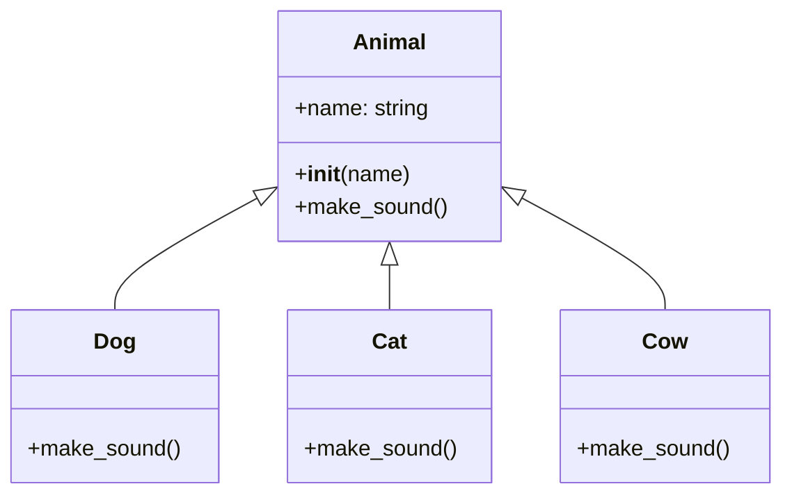

- **મેથડ ઓવરરાઇડિંગ**: સબક્લાસિસ તેમના પોતાના સંસ્કરણો લાગુ કરે છે
- **સિંગલ ઇન્ટરફેસ**: વિવિધ વર્તન માટે એક જ મેથડ નામ
- **ફ્લેક્સિબિલિટી**: કોડ હાયરાર્કીમાં કોઈપણ ક્લાસ સાથે કામ કરે છે
- **ડાયનેમિક બાઇન્ડિંગ**: ઓબ્જેક્ટ ટાઇપ પર આધારિત સાચી મેથડ કોલ થાય છે

**મેમરી ટ્રીક:** "એક મેથડ, વિવિધ વર્તન"
