## Question 1(a) [3 marks]

**What is the purpose of a for loop in Python? Write an example.**

**Answer**:
A for loop is used to iterate over a sequence (like list, tuple, string) or other iterable objects and execute a block of code for each item in the sequence.

**Code Example:**

```python
# Print each fruit in a list
fruits = ["apple", "banana", "cherry"]
for fruit in fruits:
    print(fruit)
```

- **Iteration**: Automatically repeats code for each item
- **Simplicity**: Cleaner than using while loops with counters

**Mnemonic:** "For Each Item Do"

## Question 1(b) [4 marks]

**List out rules for defining variables in python and list out data types in python.**

**Answer**:

**Rules for defining variables:**

| Rule | Example | Invalid Example |
|------|---------|----------------|
| Must start with letter or underscore | `name = "John"` | `1name = "John"` |
| Can contain letters, numbers, underscores | `user_1 = "Alice"` | `user-1 = "Alice"` |
| Case-sensitive | `age` and `Age` are different | |
| Cannot use reserved keywords | `count = 5` | `if = 5` |

**Python Data Types:**

| Data Type | Description | Example |
|-----------|-------------|---------|
| int | Integer numbers | `x = 10` |
| float | Decimal numbers | `y = 10.5` |
| str | Text strings | `name = "John"` |
| bool | Boolean values | `is_active = True` |
| list | Ordered, changeable collection | `fruits = ["apple", "banana"]` |
| tuple | Ordered, unchangeable collection | `coordinates = (10, 20)` |
| dict | Key-value pairs | `person = {"name": "John", "age": 30}` |
| set | Unordered collection of unique items | `numbers = {1, 2, 3}` |

- **Variable rules**: Make them descriptive and meaningful
- **Data types**: Python automatically determines the type

**Mnemonic:** "SILB-DTS" (String, Integer, List, Boolean, Dictionary, Tuple, Set)

## Question 1(c) [7 marks]

**Create a program to print prime numbers between 1 to N.**

**Answer**:

```python
def print_primes(n):
    print("Prime numbers between 1 and", n, "are:")
    
    for num in range(2, n + 1):
        is_prime = True
        
        # Check if num is divisible by any number from 2 to sqrt(num)
        for i in range(2, int(num**0.5) + 1):
            if num % i == 0:
                is_prime = False
                break
                
        if is_prime:
            print(num, end=" ")

# Get input from user
N = int(input("Enter a number N: "))
print_primes(N)
```

**Algorithm Diagram:**

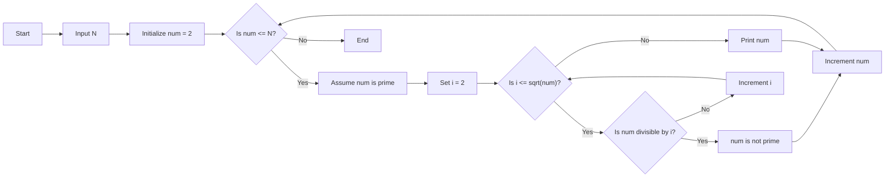

- **Time complexity**: O(N√N) - Optimized with square root approach
- **Space complexity**: O(1) - Only uses constant space

**Mnemonic:** "Divide To Decide Prime"

## Question 1(c) OR [7 marks]

**Explain working of break, continue and pass statement in Python with examples.**

**Answer**:

| Statement | Purpose | Example |
|-----------|---------|---------|
| break | Terminates the loop completely | Stop loop when condition met |
| continue | Skips current iteration, continues with next | Skip specific items |
| pass | Null operation, does nothing | Placeholder for future code |

**1. break statement:**

```python
# Exit loop when finding number 5
for num in range(1, 10):
    if num == 5:
        print("Found 5, breaking loop")
        break
    print(num)
# Output: 1 2 3 4 Found 5, breaking loop
```

**2. continue statement:**

```python
# Skip even numbers
for num in range(1, 6):
    if num % 2 == 0:
        continue
    print(num)
# Output: 1 3 5
```

**3. pass statement:**

```python
# Empty function implementation
def my_function():
    pass

# Empty conditional block
x = 10
if x > 5:
    pass  # will implement later
```

**Flow Control Diagram:**

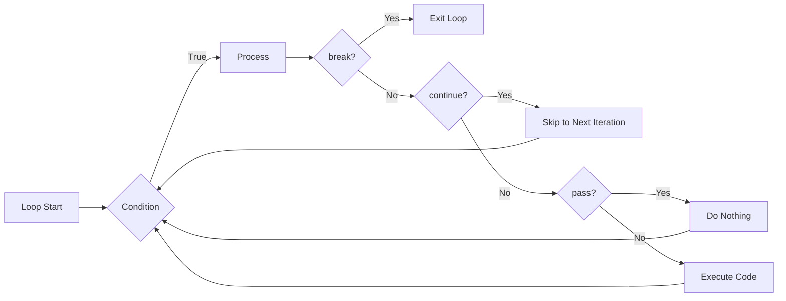

- **break**: Exits completely from the loop
- **continue**: Jumps to the next iteration
- **pass**: Does nothing, placeholder for future code

**Mnemonic:** "BCP - Break Completely, Continue Partially, Pass silently"

## Question 2(a) [3 marks]

**Create a program that asks the user for a year and prints out whether it is a leap year or not.**

**Answer**:

```python
def is_leap_year(year):
    # A leap year is divisible by 4
    # But if it's divisible by 100, it must also be divisible by 400
    if (year % 4 == 0 and year % 100 != 0) or (year % 400 == 0):
        return True
    else:
        return False

# Get input from user
year = int(input("Enter a year: "))

# Check if it's a leap year
if is_leap_year(year):
    print(f"{year} is a leap year")
else:
    print(f"{year} is not a leap year")
```

**Decision Tree:**

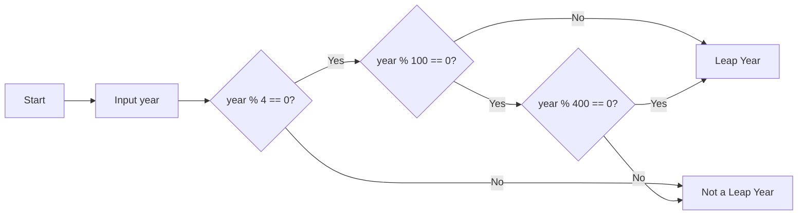

- **Rule 1**: Divisible by 4, not by 100
- **Rule 2**: Or divisible by 400

**Mnemonic:** "4 Yes, 100 No, 400 Yes"

## Question 2(b) [4 marks]

**What are the key differences between a list and a tuple in Python?**

**Answer**:

| Feature | List | Tuple |
|---------|------|-------|
| Syntax | Created using `[]` | Created using `()` |
| Mutability | Mutable (can be changed) | Immutable (cannot be changed) |
| Methods | Many methods (append, remove, etc.) | Limited methods (count, index) |
| Performance | Slower | Faster |
| Use Case | When modification needed | When data shouldn't change |
| Memory | Uses more memory | Uses less memory |

**Comparison Diagram:**

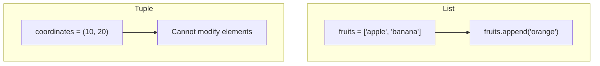

- **Lists**: When you need to modify the collection
- **Tuples**: When you need immutable data (faster, safer)

**Mnemonic:** "LIST - Lets Items Stay Transformable, TUPLE - Totally Unchangeable Permanent List Elements"

## Question 2(c) [7 marks]

**Create a program to find the sum of all the positive numbers entered by the user. As soon as the user enters a negative number, stop taking in any further input from the user and display the sum.**

**Answer**:

```python
def sum_positives():
    total_sum = 0
    
    while True:
        num = float(input("Enter a number (negative to stop): "))
        
        # Check if number is negative
        if num < 0:
            break
            
        # Add positive number to total
        total_sum += num
    
    print(f"Sum of all positive numbers: {total_sum}")

# Run the function
sum_positives()
```

**Process Flow:**

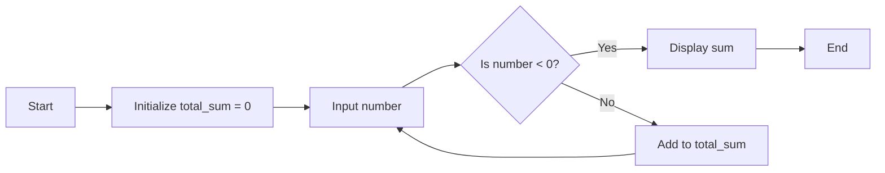

- **Loop control**: Terminates on negative input
- **Accumulator**: Adds each positive number to running total

**Mnemonic:** "Sum Till Negative"

## Question 2(a) OR [3 marks]

**Create a program to find a maximum number among the given three numbers.**

**Answer**:

```python
# Get three numbers from user
num1 = float(input("Enter first number: "))
num2 = float(input("Enter second number: "))
num3 = float(input("Enter third number: "))

# Find maximum using if-else
if num1 >= num2 and num1 >= num3:
    maximum = num1
elif num2 >= num1 and num2 >= num3:
    maximum = num2
else:
    maximum = num3

print(f"Maximum number is: {maximum}")

# Alternative using built-in max() function
# maximum = max(num1, num2, num3)
# print(f"Maximum number is: {maximum}")
```

**Comparison Logic:**

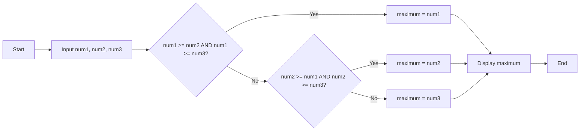

- **Comparison**: Uses logical operators to find maximum
- **Alternative**: Built-in max() function for simplicity

**Mnemonic:** "Compare Each, Take Largest"

## Question 2(b) OR [4 marks]

**Given the str="abcdefghijklmnopqrstuvwxyz". Write a python program to extract every second character from above string.**

**Answer**:

```python
# Given string
str = "abcdefghijklmnopqrstuvwxyz"

# Extract every second character using slicing
# The syntax is [start:end:step]
# start=0 (beginning), end=len(str) (end of string), step=2 (every second character)
result = str[0::2]

print("Original string:", str)
print("Every second character:", result)
# Output: Every second character: acegikmoqsuwy
```

**String Slicing Diagram:**

```
+---+---+---+---+---+---+---+---+---+---+---+
| a | b | c | d | e | f | g | h | i | j | k |...
+---+---+---+---+---+---+---+---+---+---+---+
  ^       ^       ^       ^       ^
  |       |       |       |       |
  0       2       4       6       8   (indices)
```

- **String slicing**: [start:end:step] syntax
- **Step value**: 2 selects every second character

**Mnemonic:** "Slice Step Selector"

## Question 2(c) OR [7 marks]

**Write a Python program to create a dictionary that stores student names and their marks. Display the names of students who have scored more than 75 marks.**

**Answer**:

```python
def high_scorers():
    # Create empty dictionary
    students = {}
    
    # Get number of students
    n = int(input("Enter number of students: "))
    
    # Input student data
    for i in range(n):
        name = input(f"Enter name of student {i+1}: ")
        marks = float(input(f"Enter marks of student {i+1}: "))
        students[name] = marks
    
    # Display dictionary
    print("\nStudent Records:", students)
    
    # Display high scorers
    print("\nStudents who scored more than 75 marks:")
    for name, marks in students.items():
        if marks > 75:
            print(f"{name}: {marks}")

# Run the function
high_scorers()
```

**Process Diagram:**

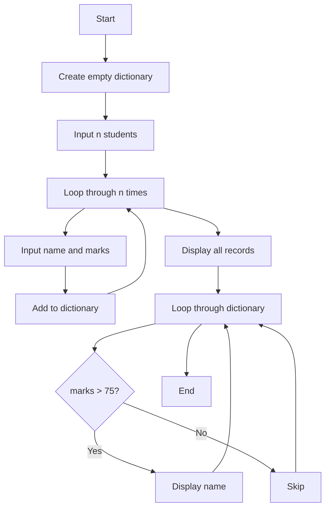

- **Dictionary**: Key-value pairs of student names and marks
- **Conditional filtering**: Selects high scorers (>75)

**Mnemonic:** "Store All, Filter Some"

## Question 3(a) [3 marks]

**Write a program to find the length of a string excluding spaces.**

**Answer**:

```python
def length_without_spaces():
    # Get input string
    input_string = input("Enter a string: ")
    
    # Remove spaces and calculate length
    # Method 1: Using replace
    no_spaces = input_string.replace(" ", "")
    length = len(no_spaces)
    
    # Method 2: Using a counter
    # count = 0
    # for char in input_string:
    #     if char != " ":
    #         count += 1
    
    print(f"Original string: '{input_string}'")
    print(f"Length excluding spaces: {length}")

# Run the function
length_without_spaces()
```

**String Processing:**

```
"Hello World" → "HelloWorld" → Length: 10
```

- **Space removal**: Using replace() or filtering
- **String length**: Calculated after space removal

**Mnemonic:** "Count Characters, Skip Spaces"

## Question 3(b) [4 marks]

**List the dictionary methods in python and explain each with suitable examples.**

**Answer**:

| Method | Description | Example |
|--------|-------------|---------|
| `clear()` | Removes all items | `dict.clear()` |
| `copy()` | Returns a shallow copy | `new_dict = dict.copy()` |
| `get()` | Returns value for key | `value = dict.get('key', default)` |
| `items()` | Returns key-value pairs | `for k, v in dict.items():` |
| `keys()` | Returns all keys | `for k in dict.keys():` |
| `values()` | Returns all values | `for v in dict.values():` |
| `pop()` | Removes item with key | `value = dict.pop('key')` |
| `update()` | Updates dictionary | `dict.update({'key': value})` |

**Code Example:**

```python
student = {'name': 'John', 'age': 20, 'grade': 'A'}

# get method
print(student.get('name'))  # Output: John
print(student.get('city', 'Not found'))  # Output: Not found

# update method
student.update({'city': 'New York', 'grade': 'A+'})
print(student)  # {'name': 'John', 'age': 20, 'grade': 'A+', 'city': 'New York'}

# pop method
removed = student.pop('age')
print(removed)  # 20
print(student)  # {'name': 'John', 'grade': 'A+', 'city': 'New York'}
```

- **Access methods**: get(), keys(), values(), items()
- **Modification methods**: update(), pop(), clear()

**Mnemonic:** "GCUP-KPIV" (Get-Copy-Update-Pop, Keys-Pop-Items-Values)

## Question 3(c) [7 marks]

**Explain Python's List data type in detail.**

**Answer**:

**Python List**: An ordered, mutable collection that can store items of different data types.

| Feature | Description | Example |
|---------|-------------|---------|
| Creation | Using square brackets | `my_list = [1, 'hello', True]` |
| Indexing | Zero-based, negative indices | `my_list[0]`, `my_list[-1]` |
| Slicing | Extract parts | `my_list[1:3]` |
| Mutability | Can be modified | `my_list[0] = 10` |
| Methods | Many built-in methods | `append()`, `insert()`, `remove()` |
| Nesting | Lists within lists | `nested = [[1, 2], [3, 4]]` |

**Common List Methods:**

| Method | Purpose | Example |
|--------|---------|---------|
| `append()` | Add item to end | `my_list.append(5)` |
| `insert()` | Add at position | `my_list.insert(1, 'new')` |
| `remove()` | Remove by value | `my_list.remove('hello')` |
| `pop()` | Remove by index | `my_list.pop(2)` |
| `sort()` | Sort list | `my_list.sort()` |
| `reverse()` | Reverse order | `my_list.reverse()` |

**List Operations Diagram:**

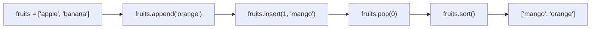

- **Versatility**: Stores different data types in one collection
- **Dynamic sizing**: Grows or shrinks as needed

**Mnemonic:** "CAMP-IS" (Create, Access, Modify, Process, Index, Slice)

## Question 3(a) OR [3 marks]

**Write a program to input a string from the user and print it in the reverse order without creating a new string.**

**Answer**:

```python
def reverse_string():
    # Get input string
    input_string = input("Enter a string: ")
    
    # Print original string
    print(f"Original string: {input_string}")
    
    # Print reversed string using slice notation
    # The syntax is [start:end:step]
    # start=None (default), end=None (default), step=-1 (reverse)
    print(f"Reversed string: {input_string[::-1]}")

# Run the function
reverse_string()
```

**String Reversing Visualization:**

```
"Hello" → "olleH"

Indices:  0   1   2   3   4
String:   H   e   l   l   o
Reversed: o   l   l   e   H
Indices: -1  -2  -3  -4  -5
```

- **Slicing with negative step**: Reverses without new string
- **Efficient**: No extra memory used for new string

**Mnemonic:** "Slice Backwards"

## Question 3(b) OR [4 marks]

**List the dictionary operations in python and explain each with suitable examples.**

**Answer**:

| Operation | Description | Example |
|-----------|-------------|---------|
| Creation | Create a new dictionary | `d = {'key': 'value'}` |
| Access | Access by key | `value = d['key']` |
| Assignment | Add or update items | `d['new_key'] = 'new_value'` |
| Deletion | Remove items | `del d['key']` |
| Membership | Check if key exists | `if 'key' in d:` |
| Length | Count items | `len(d)` |
| Iteration | Loop through items | `for key in d:` |
| Comprehension | Create new dict | `{x: x**2 for x in range(5)}` |

**Code Example:**

```python
# Creation
student = {'name': 'John', 'age': 20}

# Access
print(student['name'])  # Output: John

# Assignment
student['grade'] = 'A'  # Add new key-value pair
student['age'] = 21     # Update existing value

# Membership test
if 'grade' in student:
    print("Grade exists")  # Will be printed

# Deletion
del student['age']
print(student)  # {'name': 'John', 'grade': 'A'}

# Dictionary comprehension
squares = {x: x**2 for x in range(1, 5)}
print(squares)  # {1: 1, 2: 4, 3: 9, 4: 16}
```

- **Key-based access**: Fast lookup by keys
- **Dynamic structure**: Add/remove items as needed

**Mnemonic:** "CADMIL" (Create, Access, Delete, Modify, Iterate, Length)

## Question 3(c) OR [7 marks]

**Explain Python's set data type in detail.**

**Answer**:

**Python Set**: An unordered collection of unique, immutable items.

| Feature | Description | Example |
|---------|-------------|---------|
| Creation | Using curly braces or set() | `my_set = {1, 2, 3}` or `set([1, 2, 3])` |
| Uniqueness | No duplicates allowed | `{1, 2, 2, 3}` becomes `{1, 2, 3}` |
| Unordered | No indexing | Cannot use `my_set[0]` |
| Mutability | Set itself is mutable, but elements must be immutable | Can add/remove items |
| Math Operations | Set theory operations | union, intersection, difference |
| Use Cases | Remove duplicates, membership testing | Fast lookups |

**Common Set Operations:**

| Operation | Operator | Method | Description |
|-----------|----------|--------|-------------|
| Union | `\|` | `union()` | All elements from both sets |
| Intersection | `&` | `intersection()` | Common elements |
| Difference | `-` | `difference()` | Elements in first but not second |
| Symmetric Difference | `^` | `symmetric_difference()` | Elements in either but not both |

**Set Operations Diagram:**

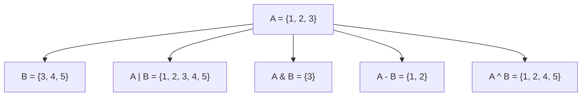

- **Fast membership**: O(1) average time complexity
- **Mathematical operations**: Set theory operations built-in

**Mnemonic:** "SUMO" (Sets are Unique, Mutable, and Ordered-less)

## Question 4(a) [3 marks]

**Explain statistics module with any three methods.**

**Answer**:

The statistics module provides functions for calculating mathematical statistics of numeric data.

| Method | Description | Example |
|--------|-------------|---------|
| `mean()` | Arithmetic average | `statistics.mean([1, 2, 3, 4, 5])` returns 3.0 |
| `median()` | Middle value | `statistics.median([1, 3, 5, 7, 9])` returns 5 |
| `mode()` | Most common value | `statistics.mode([1, 2, 2, 3, 4])` returns 2 |
| `stdev()` | Standard deviation | `statistics.stdev([1, 2, 3, 4, 5])` returns 1.58... |

**Code Example:**

```python
import statistics

data = [2, 5, 7, 9, 12, 13, 14, 5]

# Mean (average)
print("Mean:", statistics.mean(data))  # Output: 8.375

# Median (middle value)
print("Median:", statistics.median(data))  # Output: 8.0

# Mode (most frequent)
print("Mode:", statistics.mode(data))  # Output: 5
```

- **Data analysis**: Functions for statistical calculations
- **Built-in module**: No external installation needed

**Mnemonic:** "MMM Stats" (Mean, Median, Mode Statistics)

## Question 4(b) [4 marks]

**Explain function of user define function and user defined module in Python.**

**Answer**:

| Feature | User-defined Function | User-defined Module |
|---------|----------------------|---------------------|
| Definition | Block of reusable code | Python file with functions/classes |
| Purpose | Code organization and reuse | Organizing related code |
| Creation | Using `def` keyword | Creating .py file |
| Usage | Call by function name | Import using `import` statement |
| Scope | Local to function | Accessible after import |
| Benefits | Reduces redundancy | Promotes code organization |

**User-defined Function Example:**

```python
# Function definition
def calculate_area(length, width):
    """Calculate area of rectangle"""
    area = length * width
    return area

# Function call
result = calculate_area(5, 3)
print("Area:", result)  # Output: 15
```

**User-defined Module Example:**

```python
# File: geometry.py
def calculate_area(length, width):
    return length * width

def calculate_perimeter(length, width):
    return 2 * (length + width)

# In another file
import geometry

area = geometry.calculate_area(5, 3)
print("Area:", area)  # Output: 15
```

**Module Organization:**

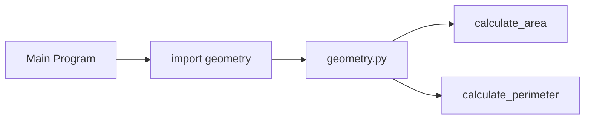

- **Function benefits**: Code reuse, modular design
- **Module benefits**: Organized code, namespace separation

**Mnemonic:** "FIR-MID" (Functions for Internal Reuse, Modules for Inter-file Distribution)

## Question 4(c) [7 marks]

**Write a Python code using user defined function to find the factorial of a given number using recursion.**

**Answer**:

```python
def factorial(n):
    """
    Calculate factorial of n using recursion
    n! = n * (n-1)!
    """
    # Base case: factorial of 0 or 1 is 1
    if n == 0 or n == 1:
        return 1
    
    # Recursive case: n! = n * (n-1)!
    else:
        return n * factorial(n-1)

# Get input from user
number = int(input("Enter a positive integer: "))

# Check if input is valid
if number < 0:
    print("Factorial is not defined for negative numbers.")
else:
    # Calculate and display result
    result = factorial(number)
    print(f"Factorial of {number} is {result}")
```

**Recursive Function Visualization:**

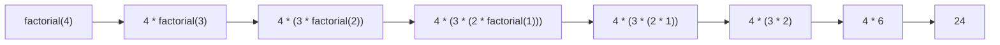

- **Base case**: Stops recursion when n=0 or n=1
- **Recursive case**: Breaks problem into smaller subproblems

**Mnemonic:** "Factorial = Number times (Number minus one)!"

## Question 4(a) OR [3 marks]

**Explain math module with any three methods.**

**Answer**:

The math module provides access to mathematical functions defined by the C standard.

| Method | Description | Example |
|--------|-------------|---------|
| `math.sqrt()` | Square root | `math.sqrt(16)` returns 4.0 |
| `math.pow()` | Power function | `math.pow(2, 3)` returns 8.0 |
| `math.floor()` | Round down | `math.floor(4.7)` returns 4 |
| `math.ceil()` | Round up | `math.ceil(4.2)` returns 5 |
| `math.sin()` | Sine function | `math.sin(math.pi/2)` returns 1.0 |

**Code Example:**

```python
import math

# Square root
print("Square root of 25:", math.sqrt(25))  # Output: 5.0

# Power
print("2 raised to power 3:", math.pow(2, 3))  # Output: 8.0

# Constants
print("Value of pi:", math.pi)  # Output: 3.141592653589793
```

- **Mathematical operations**: Advanced math functions
- **Constants**: Mathematical constants like pi and e

**Mnemonic:** "SPT Math" (Square root, Power, Trigonometry in Math module)

## Question 4(b) OR [4 marks]

**Explain the concepts of global and local variables in Python.**

**Answer**:

| Variable Type | Scope | Definition | Access |
|--------------|-------|------------|--------|
| Local | Inside function | Defined within function | Only within the function |
| Global | Entire program | Defined outside functions | Anywhere in the program |

**Example:**

```python
# Global variable
total = 0

def add_numbers(a, b):
    # Local variables
    result = a + b
    
    # Accessing global variable
    global total
    total += result
    
    return result

# Function call
sum_result = add_numbers(5, 3)
print("Sum:", sum_result)  # Output: 8
print("Total:", total)  # Output: 8
```

**Variable Scope Diagram:**

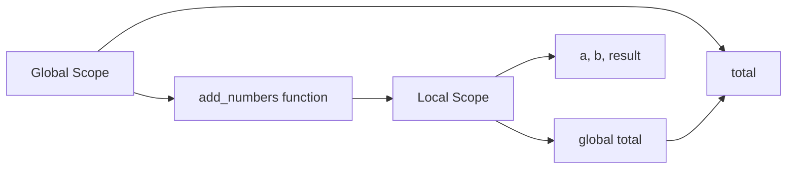

- **Global**: Accessible everywhere but needs `global` keyword to modify
- **Local**: Limited to function scope, freed after function execution

**Mnemonic:** "GLOBAL Goes Everywhere, LOCAL Lives in Functions"

## Question 4(c) OR [7 marks]

**Create code with user defined function to check if given string is palindrome or not.**

**Answer**:

```python
def is_palindrome(text):
    """
    Check if a string is a palindrome.
    A palindrome reads the same forwards and backwards.
    """
    # Remove spaces and convert to lowercase
    cleaned_text = text.replace(" ", "").lower()
    
    # Check if the string equals its reverse
    return cleaned_text == cleaned_text[::-1]

def check_palindrome():
    # Get input from user
    input_string = input("Enter a string: ")
    
    # Check if it's a palindrome
    if is_palindrome(input_string):
        print(f"'{input_string}' is a palindrome!")
    else:
        print(f"'{input_string}' is not a palindrome.")
    
    # Examples for reference
    print("\nExamples of palindromes:")
    print("'radar' →", is_palindrome("radar"))
    print("'level' →", is_palindrome("level"))
    print("'A man a plan a canal Panama' →", is_palindrome("A man a plan a canal Panama"))

# Run the function
check_palindrome()
```

**Palindrome Testing Process:**

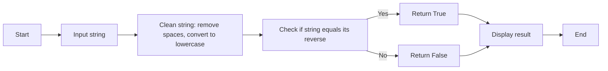

- **String cleaning**: Removes spaces, converts to lowercase
- **Comparison**: Checks against reversed string
- **Example palindromes**: "radar", "madam", "A man a plan a canal Panama"

**Mnemonic:** "Clean, Reverse, Compare"

## Question 5(a) [3 marks]

**Define class and object with example.**

**Answer**:

**Class**: A blueprint for creating objects that defines attributes and methods.

**Object**: An instance of a class with specific attribute values.

**Code Example:**

```python
# Class definition
class Dog:
    # Class attribute
    species = "Canis familiaris"
    
    # Constructor (initializes instance attributes)
    def __init__(self, name, age):
        self.name = name
        self.age = age
    
    # Instance method
    def bark(self):
        return f"{self.name} says Woof!"

# Creating objects (instances)
dog1 = Dog("Rex", 3)
dog2 = Dog("Buddy", 5)

# Accessing attributes and methods
print(dog1.name)  # Output: Rex
print(dog2.species)  # Output: Canis familiaris
print(dog1.bark())  # Output: Rex says Woof!
```

**Class-Object Relationship:**

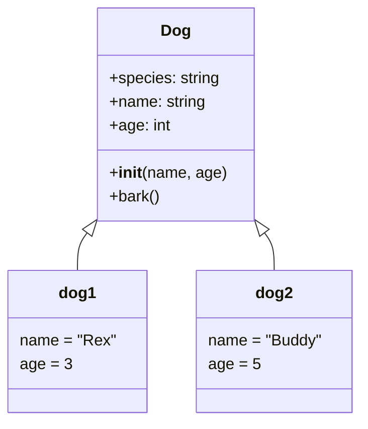

- **Class**: Template with attributes and methods
- **Object**: Concrete instance with specific values

**Mnemonic:** "CAMBO" (Classes Are Molds, Build Objects)

## Question 5(b) [4 marks]

**Classify constructor. Explain any one in detail.**

**Answer**:

| Constructor Type | Description | When Used |
|-----------------|-------------|-----------|
| Default constructor | Created by Python if none defined | Simple class creation |
| Parameterized constructor | Takes parameters to initialize | Customized object creation |
| Non-parameterized constructor | Takes no parameters | Basic initialization |
| Copy constructor | Creates object from existing object | Object duplication |

**Parameterized Constructor Example:**

```python
class Student:
    # Parameterized constructor
    def __init__(self, name, roll_no, marks):
        self.name = name
        self.roll_no = roll_no
        self.marks = marks
        
    def display(self):
        print(f"Name: {self.name}, Roll No: {self.roll_no}, Marks: {self.marks}")

# Creating objects with parameters
student1 = Student("Alice", 101, 85)
student2 = Student("Bob", 102, 78)

# Displaying student information
student1.display()  # Output: Name: Alice, Roll No: 101, Marks: 85
student2.display()  # Output: Name: Bob, Roll No: 102, Marks: 78
```

**Constructor Flow:**

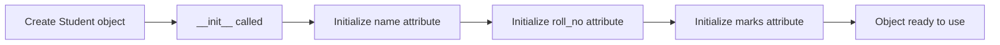

- **Purpose**: Initialize object attributes
- **Self parameter**: Reference to the instance being created
- **Automatic call**: Called when object is created

**Mnemonic:** "PICAN" (Parameters Initialize Constructor And Name)

## Question 5(c) [7 marks]

**Develop and explain a python code to implement hierarchical inheritance.**

**Answer**:

```python
# Base class
class Vehicle:
    def __init__(self, make, model, year):
        self.make = make
        self.model = model
        self.year = year
    
    def display_info(self):
        return f"{self.year} {self.make} {self.model}"
    
    def start_engine(self):
        return "Engine started!"

# Derived class 1
class Car(Vehicle):
    def __init__(self, make, model, year, doors):
        # Call parent class constructor
        super().__init__(make, model, year)
        self.doors = doors
    
    def drive(self):
        return "Car is being driven!"

# Derived class 2
class Motorcycle(Vehicle):
    def __init__(self, make, model, year, has_sidecar):
        # Call parent class constructor
        super().__init__(make, model, year)
        self.has_sidecar = has_sidecar
    
    def wheelie(self):
        if not self.has_sidecar:
            return "Performing wheelie!"
        else:
            return "Cannot perform wheelie with sidecar!"

# Create objects
car = Car("Toyota", "Corolla", 2023, 4)
motorcycle = Motorcycle("Honda", "CBR", 2024, False)

# Use methods from parent class
print(car.display_info())  # Output: 2023 Toyota Corolla
print(motorcycle.start_engine())  # Output: Engine started!

# Use methods from specific classes
print(car.drive())  # Output: Car is being driven!
print(motorcycle.wheelie())  # Output: Performing wheelie!
```

**Hierarchical Inheritance Diagram:**

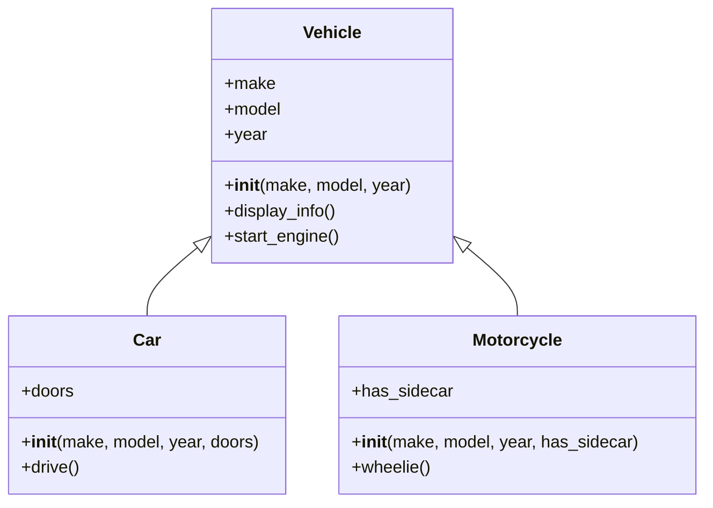

- **Base class**: Common attributes/methods for all vehicles
- **Derived classes**: Specialized behaviors for specific vehicle types
- **Method inheritance**: Child classes inherit parent class methods

**Mnemonic:** "Parents Share, Children Specialize"

## Question 5(a) OR [3 marks]

**What is the __init__ method in Python? Explain its purpose with a suitable example.**

**Answer**:

The `__init__` method is a special method (constructor) in Python classes that is automatically called when an object is created.

**Purpose:**

1. Initialize object attributes
2. Set up the initial state of the object
3. Execute code that must run when object is created

**Example:**

```python
class Rectangle:
    def __init__(self, length, width):
        # Initialize attributes
        self.length = length
        self.width = width
        self.area = length * width  # Calculated attribute
        
        # Print confirmation message
        print(f"Rectangle created with dimensions {length}x{width}")
    
    def display(self):
        return f"Rectangle: {self.length}x{self.width}, Area: {self.area}"

# Create rectangle objects
rect1 = Rectangle(5, 3)  # __init__ called automatically
rect2 = Rectangle(10, 2)  # __init__ called automatically

# Display information
print(rect1.display())
print(rect2.display())
```

- **Automatic execution**: Called when object is created
- **Self parameter**: References the current instance
- **Multiple parameters**: Can accept any number of arguments

**Mnemonic:** "ASAP" (Attributes Set At Production)

## Question 5(b) OR [4 marks]

**Classify methods in Python class. Explain any one in detail.**

**Answer**:

| Method Type | Description | Definition |
|------------|-------------|------------|
| Instance Method | Operates on object instance | Regular method with `self` |
| Class Method | Operates on class itself | Decorated with `@classmethod` |
| Static Method | Doesn't need class or instance | Decorated with `@staticmethod` |
| Magic/Dunder Method | Special built-in methods | Surrounded by double underscores |

**Instance Method Example:**

```python
class Student:
    # Class variable
    school = "ABC School"
    
    def __init__(self, name, age):
        # Instance variables
        self.name = name
        self.age = age
    
    # Instance method - operates on instance
    def display_info(self):
        return f"Name: {self.name}, Age: {self.age}, School: {self.school}"
    
    # Instance method with parameter
    def is_eligible(self, min_age):
        return self.age >= min_age

# Create object
student = Student("John", 15)

# Call instance methods
print(student.display_info())  # Output: Name: John, Age: 15, School: ABC School
print(student.is_eligible(16))  # Output: False
```

**Method Classification:**

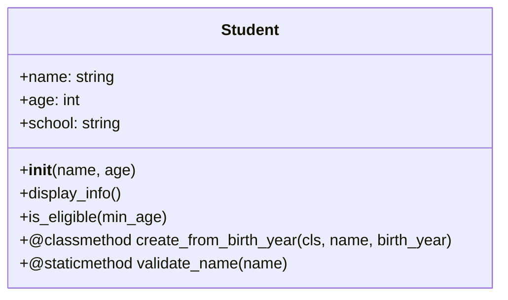

- **Instance methods**: Access and modify object state
- **Self parameter**: Reference to the instance
- **Object-specific**: Results depend on the instance state

**Mnemonic:** "SIAM" (Self Is Always Mentioned in instance methods)

## Question 5(c) OR [7 marks]

**Develop a Python code for Polymorphism and explain it.**

**Answer**:

```python
# Base class
class Animal:
    def __init__(self, name):
        self.name = name
    
    def make_sound(self):
        # Generic sound - will be overridden by subclasses
        return "Some generic sound"

# Derived class 1
class Dog(Animal):
    def make_sound(self):
        # Override base class method
        return "Woof!"

# Derived class 2
class Cat(Animal):
    def make_sound(self):
        # Override base class method
        return "Meow!"

# Derived class 3
class Cow(Animal):
    def make_sound(self):
        # Override base class method
        return "Moo!"

# Function using polymorphism
def animal_sound(animal):
    # Same function works for any Animal subclass
    return animal.make_sound()

# Create objects of different classes
dog = Dog("Rex")
cat = Cat("Whiskers")
cow = Cow("Daisy")

# Demonstrate polymorphism
animals = [dog, cat, cow]
for animal in animals:
    print(f"{animal.name} says: {animal_sound(animal)}")

# Output:
# Rex says: Woof!
# Whiskers says: Meow!
# Daisy says: Moo!
```

**Polymorphism Diagram:**

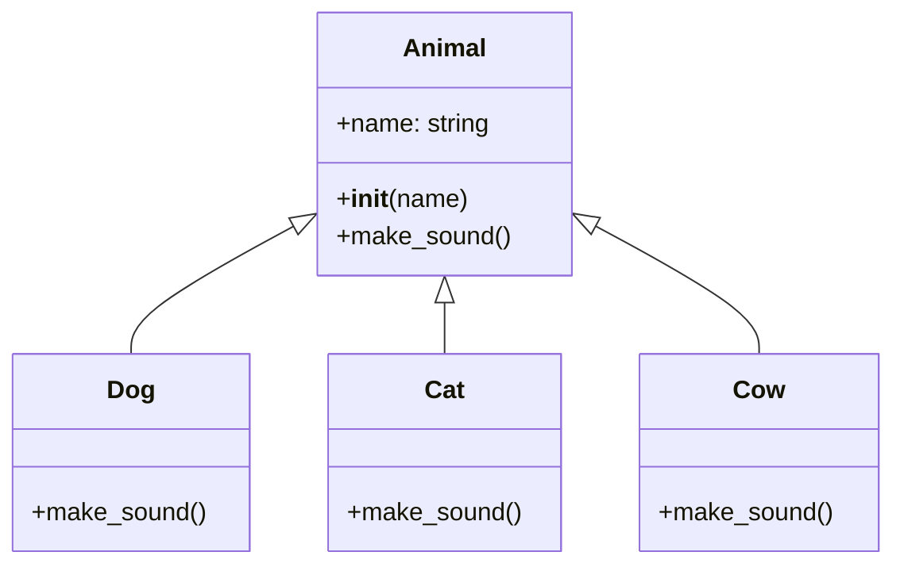

- **Method overriding**: Subclasses implement their own versions
- **Single interface**: Same method name for different behavior
- **Flexibility**: Code works with any class in the hierarchy
- **Dynamic binding**: Correct method called based on object type

**Mnemonic:** "Same Method, Different Behavior"
