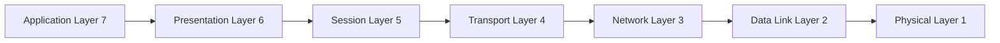
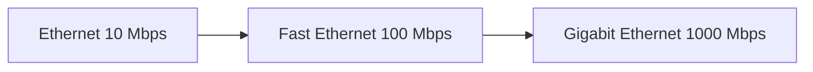
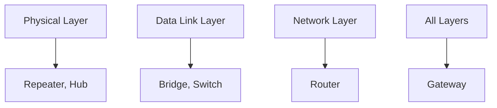
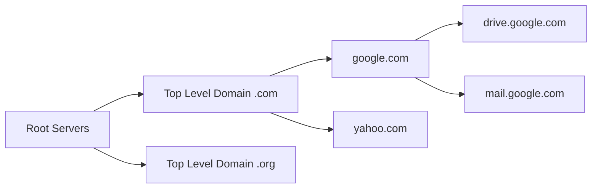
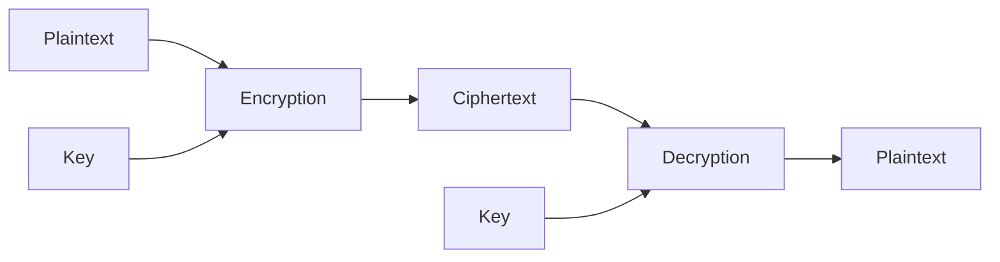
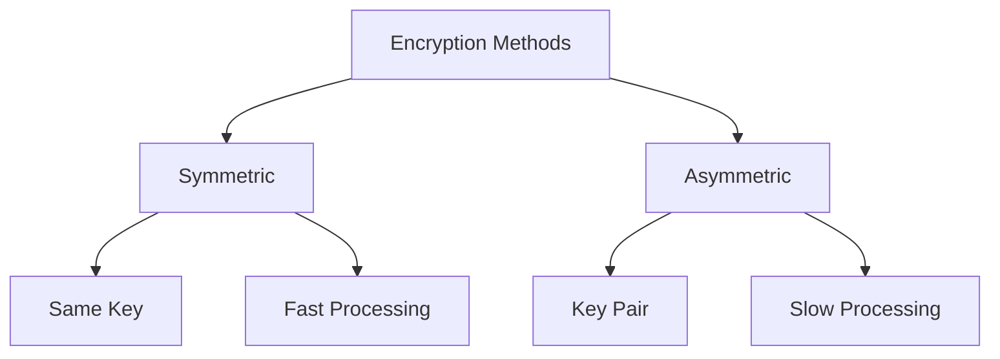

## પ્રશ્ન 1(અ) [3 ગુણ]

**વિવિધ નેટવર્ક ટોપોલોજીની યાદી બનાવો અને કોઈપણ એકની વિગતવાર ચર્ચા કરો.**

**જવાબ**:

| ટોપોલોજી | વર્ણન |
|----------|-------|
| **સ્ટાર** | બધા ઉપકરણો કેન્દ્રીય હબ/સ્વિચ સાથે જોડાયેલા |
| **રિંગ** | ઉપકરણો ગોળાકાર ફેશનમાં જોડાયેલા |
| **બસ** | બધા ઉપકરણો એક જ કેબલ સાથે જોડાયેલા |
| **મેશ** | દરેક ઉપકરણ બીજા દરેક ઉપકરણ સાથે જોડાયેલું |
| **ટ્રી** | રૂટ નોડ સાથે વંશવેલો માળખું |
| **હાઇબ્રિડ** | બે અથવા વધુ ટોપોલોજીનું સંયોજન |

**સ્ટાર ટોપોલોજી વિગતો:**

- **કેન્દ્રીય હબ**: બધા નોડ્સ એક કેન્દ્રીય ઉપકરણ સાથે જોડાય છે
- **પોઇન્ટ-ટુ-પોઇન્ટ**: દરેક કનેક્શન નોડ અને હબ વચ્ચે સમર્પિત છે
- **સરળ મેનેજમેન્ટ**: ઇન્સ્ટોલ અને ટ્રબલશૂટ કરવું સરળ

**મેમરી ટ્રીક:** "STAR = Single Terminal All Reach"

## પ્રશ્ન 1(બ) [4 ગુણ]

**આધુનિક સંચાર પ્રણાલીઓમાં પોઇન્ટ-ટુ-પોઇન્ટ અને બ્રોડકાસ્ટ ટ્રાન્સમિશન ટેકનોલોજીનો ઉપયોગ કેવી રીતે થાય છે તે ઉદાહરણો સાથે સમજાવો. અને તેમના ફાયદા અને મર્યાદાઓની ચર્ચા કરો.**

**જવાબ**:

| ટેકનોલોજી | પોઇન્ટ-ટુ-પોઇન્ટ | બ્રોડકાસ્ટ |
|-----------|-----------------|-----------|
| **કનેક્શન** | બે ઉપકરણો વચ્ચે સીધી લિંક | એક-થી-અનેક સંદેશાવ્યવહાર |
| **ઉદાહરણ** | ટેલિફોન, VPN ટનલ્સ | રેડિયો, TV, WiFi |
| **ડેટા ફ્લો** | દ્વિદિશાત્મક | એકદિશાત્મક/બહુદિશાત્મક |

**પોઇન્ટ-ટુ-પોઇન્ટ એપ્લિકેશન્સ:**

- **સમર્પિત લાઇન્સ**: ઓફિસો વચ્ચે લીઝ્ડ લાઇન્સ
- **સેટેલાઇટ લિંક્સ**: ગ્રાઉન્ડ સ્ટેશનથી સેટેલાઇટ સંદેશાવ્યવહાર
- **કેબલ મોડેમ્સ**: ઘરથી ISP કનેક્શન

**બ્રોડકાસ્ટ એપ્લિકેશન્સ:**

- **WiFi નેટવર્કસ**: રાઉટર બહુવિધ ઉપકરણોને બ્રોડકાસ્ટ કરે છે
- **ટેલિવિઝન**: એક ટ્રાન્સમિટરથી અનેક રિસીવર્સ

**મેમરી ટ્રીક:** "P2P = Private Path, Broadcast = Big Audience"

## પ્રશ્ન 1(ક) [7 ગુણ]

**દરેક લેયરના કાર્ય સાથે OSI મોડેલનું વર્ણન કરો.**

**જવાબ**:

| લેયર | નામ | કાર્ય |
|------|------|-------|
| **7** | એપ્લિકેશન | યુઝર ઇન્ટરફેસ, નેટવર્ક સેવાઓ |
| **6** | પ્રેઝન્ટેશન | ડેટા એન્ક્રિપ્શન, કોમ્પ્રેશન, ફોર્મેટિંગ |
| **5** | સેશન | સેશન સ્થાપિત કરે, મેનેજ કરે, સમાપ્ત કરે |
| **4** | ટ્રાન્સપોર્ટ | વિશ્વસનીય ડેટા ટ્રાન્સફર, એરર કરેક્શન |
| **3** | નેટવર્ક | રાઉટિંગ, લોજિકલ એડ્રેસિંગ (IP) |
| **2** | ડેટા લિંક | ફ્રેમ ફોર્મેટિંગ, એરર ડિટેક્શન |
| **1** | ફિઝિકલ | બિટ ટ્રાન્સમિશન, ઇલેક્ટ્રિકલ સિગ્નલ્સ |



**મુખ્ય કાર્યો:**

- **ઉપરના લેયર્સ (5-7)**: એપ્લિકેશન-સંબંધિત સેવાઓ સંભાળે છે
- **નીચેના લેયર્સ (1-4)**: ડેટા ટ્રાન્સમિશન અને રાઉટિંગ સંભાળે છે
- **એન્કેપ્સુલેશન**: દરેક લેયર પોતાનું હેડર ઉમેરે છે

**મેમરી ટ્રીક:** "All People Seem To Need Data Processing"

## પ્રશ્ન 1(ક અથવા) [7 ગુણ]

**TCP/IP મોડેલના દરેક લેયરના કાર્ય સાથે વર્ણન લખો.**

**જવાબ**:

| લેયર | નામ | કાર્ય | પ્રોટોકોલ્સ |
|------|------|-------|------------|
| **4** | એપ્લિકેશન | યુઝર સેવાઓ, એપ્લિકેશન્સ | HTTP, FTP, SMTP, DNS |
| **3** | ટ્રાન્સપોર્ટ | એન્ડ-ટુ-એન્ડ કમ્યુનિકેશન | TCP, UDP |
| **2** | ઇન્ટરનેટ | રાઉટિંગ, લોજિકલ એડ્રેસિંગ | IP, ICMP, ARP |
| **1** | નેટવર્ક એક્સેસ | ફિઝિકલ ટ્રાન્સમિશન | Ethernet, WiFi |


**લેયર કાર્યો:**

- **એપ્લિકેશન**: એપ્લિકેશન્સને નેટવર્ક સેવાઓ પ્રદાન કરે છે
- **ટ્રાન્સપોર્ટ**: વિશ્વસનીય અથવા અવિશ્વસનીય ડિલિવરી સુનિશ્ચિત કરે છે
- **ઇન્ટરનેટ**: IP એડ્રેસનો ઉપયોગ કરીને નેટવર્કમાં પેકેટ્સ રાઉટ કરે છે
- **નેટવર્ક એક્સેસ**: ફિઝિકલ ટ્રાન્સમિશન મીડિયા સંભાળે છે

**મેમરી ટ્રીક:** "Applications Transport Internet Networks"

## પ્રશ્ન 2(અ) [3 ગુણ]

**નેટવર્ક સુરક્ષામાં ફાયરવોલના કાર્યનું વર્ણન કરો.**

**જવાબ**:

**ફાયરવોલ કાર્યો:**

- **પેકેટ ફિલ્ટરિંગ**: આવતા અને જતા નેટવર્ક ટ્રાફિકને નિયંત્રિત કરે છે
- **એક્સેસ કંટ્રોલ**: અનધિકૃત એક્સેસ પ્રયાસોને અવરોધે છે
- **ટ્રાફિક મોનિટરિંગ**: નેટવર્ક એક્ટિવિટીને લોગ કરે અને વિશ્લેષિત કરે છે

**પ્રકારો:**

- **હાર્ડવેર ફાયરવોલ**: સંપૂર્ણ નેટવર્કનું રક્ષણ કરતું ભૌતિક ઉપકરણ
- **સોફ્ટવેર ફાયરવોલ**: વ્યક્તિગત કમ્પ્યુટર્સ પર ઇન્સ્ટોલ કરાયેલો પ્રોગ્રામ
- **સ્ટેટફુલ ઇન્સ્પેક્શન**: કનેક્શન સ્ટેટ્સ અને કોન્ટેક્સ્ટ ટ્રેક કરે છે

**મેમરી ટ્રીક:** "Firewall = Filter, Access, Monitor"

## પ્રશ્ન 2(બ) [4 ગુણ]

**FDDI અને CDDI તેમની મુખ્ય લાક્ષણિકતાઓ, ફાયદા અને એપ્લિકેશનના સંદર્ભમાં સરખામણી કરો.**

**જવાબ**:

| લક્ષણ | FDDI | CDDI |
|-------|------|------|
| **મીડિયમ** | ઓપ્ટિકલ ફાઇબર | ટ્વિસ્ટેડ પેર કોપર |
| **સ્પીડ** | 100 Mbps | 100 Mbps |
| **અંતર** | 200 કિમી સુધી | 100 મીટર સુધી |
| **કિંમત** | વધુ | ઓછી |
| **સુરક્ષા** | વધુ (ટેપ કરવું મુશ્કેલ) | ઓછી (ટેપ કરવું સરળ) |
| **ઇન્સ્ટોલેશન** | જટિલ | સરળ |

**FDDI ફાયદાઓ:**

- **લાંબું અંતર**: કેમ્પસ-વ્યાપી નેટવર્કને સપોર્ટ કરે છે
- **ઉચ્ચ સુરક્ષા**: ઇલેક્ટ્રોમેગ્નેટિક ઇન્ટરફેરન્સથી મુક્ત
- **વિશ્વસનીયતા**: વધુ સારી એરર ડિટેક્શન અને રિકવરી

**CDDI ફાયદાઓ:**

- **કિફાયતી**: વર્તમાન કોપર ઇન્ફ્રાસ્ટ્રક્ચરનો ઉપયોગ
- **સરળ ઇન્સ્ટોલેશન**: સ્ટાન્ડર્ડ ટ્વિસ્ટેડ પેર કેબ્લિંગ
- **સુસંગતતા**: વર્તમાન નેટવર્ક સાધનો સાથે કામ કરે છે

**મેમરી ટ્રીક:** "FDDI = Fiber Distance, CDDI = Copper Cost"

## પ્રશ્ન 2(ક) [7 ગુણ]

**ઇથરનેટ, ફાસ્ટ ઇથરનેટ, ગીગાબિટ ઇથરનેટ સમજાવો અને સરખામણી કરો.**

**જવાબ**:

| પ્રકાર | સ્પીડ | સ્ટાન્ડર્ડ | કેબલ પ્રકાર | અંતર |
|------|-------|---------|-------------|-------|
| **ઇથરનેટ** | 10 Mbps | 802.3 | Coax/UTP | 100m |
| **ફાસ્ટ ઇથરનેટ** | 100 Mbps | 802.3u | UTP Cat5 | 100m |
| **ગીગાબિટ ઇથરનેટ** | 1000 Mbps | 802.3z/ab | Cat5e/6, Fiber | 100m/5km |



**મુખ્ય તફાવતો:**

- **સ્પીડ ઇવોલ્યુશન**: દરેક જનરેશનમાં 10x વધારો
- **મીડિયા સપોર્ટ**: કોક્સથી ટ્વિસ્ટેડ પેરથી ફાઇબર સુધી
- **એપ્લિકેશન્સ**: LAN બેકબોન, સર્વર કનેક્શન્સ, ડેસ્કટોપ
- **બેકવર્ડ કોમ્પેટિબિલિટી**: નવા સ્ટાન્ડર્ડ જૂના ઉપકરણોને સપોર્ટ કરે છે

**સ્ટાન્ડર્ડ્સ:**

- **10Base-T**: ટ્વિસ્ટેડ પેર પર 10 Mbps
- **100Base-TX**: કેટેગરી 5 UTP પર 100 Mbps
- **1000Base-T**: કેટેગરી 5e/6 UTP પર 1 Gbps

**મેમરી ટ્રીક:** "Every Fast Gigabit = 10, 100, 1000"

## પ્રશ્ન 2(અ અથવા) [3 ગુણ]

**નેટવર્ક ઇન્ફ્રાસ્ટ્રક્ચરમાં રાઉટરની તેની ભૂમિકા અને કાર્ય સમજાવો.**

**જવાબ**:

**રાઉટર કાર્યો:**

- **પેકેટ ફોરવર્ડિંગ**: વિવિધ નેટવર્કો વચ્ચે ડેટા પેકેટ્સ રાઉટ કરે છે
- **પાથ ડિટર્મિનેશન**: રાઉટિંગ ટેબલનો ઉપયોગ કરીને શ્રેષ્ઠ રૂટ પસંદ કરે છે
- **નેટવર્ક આઇસોલેશન**: બ્રોડકાસ્ટ ડોમેઇન્સને અલગ કરે છે

**મુખ્ય ભૂમિકાઓ:**

- **ઇન્ટર-નેટવર્ક કમ્યુનિકેશન**: LANs ને WANs સાથે જોડે છે
- **ટ્રાફિક મેનેજમેન્ટ**: નેટવર્કો વચ્ચે ડેટા ફ્લોને નિયંત્રિત કરે છે
- **પ્રોટોકોલ ટ્રાન્સલેશન**: વિવિધ નેટવર્ક પ્રોટોકોલ્સ વચ્ચે કન્વર્ટ કરે છે

**મેમરી ટ્રીક:** "Router = Route, Isolate, Connect"

## પ્રશ્ન 2(બ અથવા) [4 ગુણ]

**FDDI (ફાઇબર ડિસ્ટ્રિબ્યુટેડ ડેટા ઇન્ટરફેસ) ની રચના સમજાવો અને તેના ફાયદાઓ જણાવો.**

**જવાબ**:

**FDDI રચના:**

```goat
    Node A -------- Node B
      |               |
      |               |
    Node D -------- Node C
    
    Primary Ring: Clockwise
    Secondary Ring: Counter-clockwise
```

**ઘટકો:**

- **ડ્યુઅલ રિંગ**: રિડન્ડન્સી માટે પ્રાઇમરી અને સેકન્ડરી રિંગ્સ
- **ટોકન પાસિંગ**: મીડિયા એક્સેસ કંટ્રોલ માટે ટોકનનો ઉપયોગ
- **કન્સન્ટ્રેટર્સ**: બહુવિધ સ્ટેશનોને રિંગ સાથે જોડે છે

**ફાયદાઓ:**

- **ઉચ્ચ વિશ્વસનીયતા**: ફોલ્ટ ટોલેરન્સ માટે ડ્યુઅલ રિંગ
- **ઝડપી સ્પીડ**: 100 Mbps ડેટા ટ્રાન્સમિશન રેટ
- **લાંબું અંતર**: 200 કિમી સુધી રિંગ સર્કમફરન્સને સપોર્ટ કરે છે
- **સેલ્ફ-હીલિંગ**: લિંક નિષ્ફળ જાય ત્યારે ઓટોમેટિક રીકોન્ફિગરેશન

**મેમરી ટ્રીક:** "FDDI = Fast, Dual, Distance, Immune"

## પ્રશ્ન 2(ક અથવા) [7 ગુણ]

**નેટવર્ક ઉપકરણોનો રોલ સમજાવો. બધા ઉપકરણો વિશે ટૂંકમાં વર્ણન કરો.**

**જવાબ**:

| ઉપકરણ | લેયર | કાર્ય |
|--------|------|-------|
| **રીપીટર** | ફિઝિકલ | સિગ્નલ્સ રિજનરેટ કરે છે, અંતર વધારે છે |
| **હબ** | ફિઝિકલ | બહુવિધ ઉપકરણો જોડે છે, શેર કરેલ બેન્ડવિડ્થ |
| **બ્રિજ** | ડેટા લિંક | LANs જોડે છે, કોલિઝન્સ ઘટાડે છે |
| **સ્વિચ** | ડેટા લિંક | ઇન્ટેલિજન્ટ હબ, સમર્પિત બેન્ડવિડ્થ |
| **રાઉટર** | નેટવર્ક | વિવિધ નેટવર્કો જોડે છે, રાઉટિંગ |
| **ગેટવે** | બધા લેયર્સ | પ્રોટોકોલ કન્વર્ઝન, નેટવર્ક ઇન્ટરકનેક્શન |



**ઉપકરણ કાર્યો:**

- **રીપીટર**: સિગ્નલ્સ એમ્પ્લિફાઇ અને રિજનરેટ કરે છે
- **હબ**: બહુવિધ ઉપકરણો માટે સરળ કનેક્શન પોઇન્ટ
- **બ્રિજ**: MAC એડ્રેસના આધારે ઇન્ટેલિજન્ટ ફોરવર્ડિંગ
- **સ્વિચ**: બહુવિધ પોર્ટ્સ સાથે ઉચ્ચ-પ્રદર્શન બ્રિજ
- **રાઉટર**: નેટવર્કો વચ્ચે ઇન્ટેલિજન્ટ પાથ સિલેક્શન
- **ગેટવે**: સંપૂર્ણ પ્રોટોકોલ સ્ટેક કન્વર્ઝન

**મેમરી ટ્રીક:** "Repeat, Hub, Bridge, Switch, Route, Gateway"

## પ્રશ્ન 3(અ) [3 ગુણ]

**કોઈપણ ત્રણ ડેટા લિંક લેયર પ્રોટોકોલને નામ આપો અને કોઈપણ એકને વિગતવાર સમજાવો.**

**જવાબ**:

**ડેટા લિંક લેયર પ્રોટોકોલ્સ:**

- **HDLC** (High-Level Data Link Control)
- **PPP** (Point-to-Point Protocol)
- **Ethernet** (IEEE 802.3)

**HDLC પ્રોટોકોલ વિગતો:**

- **ફ્રેમ સ્ટ્રક્ચર**: Flag, Address, Control, Data, FCS, Flag
- **એરર ડિટેક્શન**: ફ્રેમ ચેક સિક્વન્સ (FCS)
- **ફ્લો કંટ્રોલ**: સ્લાઇડિંગ વિન્ડો મેકેનિઝમ

**HDLC ફ્રેમ ફોર્મેટ:**

```goat
+------+------+------+------+------+------+
| Flag |Addr  |Ctrl  | Data | FCS  | Flag |
| 8bit |8bit  |8bit  |      |16bit | 8bit |
+------+------+------+------+------+------+
```

**મેમરી ટ્રીક:** "HDLC = High Data Link Control"

## પ્રશ્ન 3(બ) [4 ગુણ]

**ડેટા લિંક સ્તર પર error control અને flow control સમજાવો**

**જવાબ**:

| કંટ્રોલ પ્રકાર | હેતુ | પદ્ધતિઓ |
|---------------|------|---------|
| **Error Control** | ટ્રાન્સમિશન એરર્સ ડિટેક્ટ અને કરેક્ટ કરવા | CRC, Checksum, Parity |
| **Flow Control** | ડેટા ટ્રાન્સમિશન રેટ મેનેજ કરવા | Stop-and-Wait, Sliding Window |

**Error Control પદ્ધતિઓ:**

- **ડિટેક્શન**: CRC, Checksum એરર્સ ઓળખે છે
- **કરેક્શન**: ARQ (Automatic Repeat Request)
- **પ્રિવેન્શન**: Forward Error Correction (FEC)

**Flow Control પદ્ધતિઓ:**

- **Stop-and-Wait**: એક ફ્રેમ મોકલો, ACK ની રાહ જુઓ
- **Sliding Window**: ACK પહેલાં બહુવિધ ફ્રેમ્સ મોકલો
- **બફર મેનેજમેન્ટ**: રિસીવર ઓવરફ્લો અટકાવે છે

**મેમરી ટ્રીક:** "Error = Detect, Flow = Control"

## પ્રશ્ન 3(ક) [7 ગુણ]

**IPv6 અને IPv4 ની સરખામણી કરો.**

**જવાબ**:

| લક્ષણ | IPv4 | IPv6 |
|-------|------|------|
| **એડ્રેસ લેન્થ** | 32 બિટ્સ | 128 બિટ્સ |
| **એડ્રેસ સ્પેસ** | 4.3 બિલિયન | 340 અન્ડેસિલિયન |
| **હેડર સાઇઝ** | 20-60 બાઇટ્સ (વેરિએબલ) | 40 બાઇટ્સ (ફિક્સ્ડ) |
| **નોટેશન** | ડેસિમલ (192.168.1.1) | હેક્સાડેસિમલ (2001:db8::1) |
| **ફ્રેગમેન્ટેશન** | રાઉટર અને હોસ્ટ | માત્ર હોસ્ટ |
| **સિક્યુરિટી** | વૈકલ્પિક (IPSec) | બિલ્ટ-ઇન (IPSec) |
| **કોન્ફિગરેશન** | મેન્યુઅલ/DHCP | ઓટો-કોન્ફિગરેશન |

**IPv4 ઉદાહરણ:** 192.168.1.100
**IPv6 ઉદાહરણ:** 2001:0db8:85a3:0000:0000:8a2e:0370:7334

**મુખ્ય તફાવતો:**

- **એડ્રેસ એક્ઝોસ્ચન**: IPv4 એડ્રેસ લગભગ સમાપ્ત
- **હેડર એફિશિયન્સી**: IPv6 સિમ્પ્લિફાઇડ હેડર સ્ટ્રક્ચર
- **સિક્યુરિટી**: IPv6 માં બિલ્ટ-ઇન સિક્યુરિટી ફીચર્સ
- **ક્વોલિટી ઓફ સર્વિસ**: IPv6 માં વધુ સારો QoS સપોર્ટ

**મેમરી ટ્રીક:** "IPv6 = Infinite, Integrated, Improved"

## પ્રશ્ન 3(અ અથવા) [3 ગુણ]

**કમ્પ્યુટર નેટવર્કમાં વપરાતા guided અને unguided ટ્રાન્સમિશન મીડિયા વચ્ચેનો તફાવત સમજાવો**

**જવાબ**:

| મીડિયા પ્રકાર | Guided | Unguided |
|---------------|--------|----------|
| **વ્યાખ્યા** | ભૌતિક પાથ અસ્તિત્વમાં છે | કોઈ ભૌતિક પાથ નથી |
| **ઉદાહરણો** | ટ્વિસ્ટેડ પેર, Coax, ફાઇબર | રેડિયો, માઇક્રોવેવ, સેટેલાઇટ |
| **દિશા** | પોઇન્ટ-ટુ-પોઇન્ટ | બ્રોડકાસ્ટ |

**Guided મીડિયા:**

- **ટ્વિસ્ટેડ પેર**: ટેલિફોન લાઇન્સ, LANs
- **કોએક્સિયલ કેબલ**: કેબલ TV, જૂના નેટવર્કસ
- **ફાઇબર ઓપ્ટિક**: હાઇ-સ્પીડ, લોંગ-ડિસ્ટન્સ

**Unguided મીડિયા:**

- **રેડિયો વેવ્સ**: WiFi, Bluetooth
- **માઇક્રોવેવ્સ**: પોઇન્ટ-ટુ-પોઇન્ટ લિંક્સ
- **ઇન્ફ્રારેડ**: શોર્ટ-રેન્જ કમ્યુનિકેશન

**મેમરી ટ્રીક:** "Guided = Ground, Unguided = Air"

## પ્રશ્ન 3(બ અથવા) [4 ગુણ]

**સર્કિટ સ્વિચિંગ અને પેકેટ સ્વિચિંગનું વર્ણન કરો.**

**જવાબ**:

| લક્ષણ | સર્કિટ સ્વિચિંગ | પેકેટ સ્વિચિંગ |
|-------|-----------------|-----------------|
| **કનેક્શન** | સમર્પિત પાથ સ્થાપિત | કોઈ સમર્પિત પાથ નથી |
| **રિસોર્સ એલોકેશન** | ફિક્સ્ડ બેન્ડવિડ્થ | શેર કરેલા રિસોર્સિસ |
| **ઉદાહરણ** | પરંપરાગત ટેલિફોન | ઇન્ટરનેટ |
| **ડિલે** | કોન્સ્ટન્ટ | વેરિએબલ |

**સર્કિટ સ્વિચિંગ:**

- **સેટઅપ ફેઝ**: સમર્પિત કનેક્શન સ્થાપિત કરે છે
- **ડેટા ટ્રાન્સફર**: કોન્ટિન્યુઅસ ટ્રાન્સમિશન
- **ટિયરડાઉન**: કનેક્શન રિસોર્સિસ રિલીઝ કરે છે

**પેકેટ સ્વિચિંગ:**

- **સ્ટોર-એન્ડ-ફોરવર્ડ**: પેકેટ્સ ઇન્ટરમીડિયેટ નોડ્સ પર સ્ટોર થાય છે
- **ડાયનેમિક રાઉટિંગ**: દરેક પેકેટ સ્વતંત્ર રીતે રાઉટ થાય છે
- **રિસોર્સ શેરિંગ**: બેન્ડવિડ્થ યુઝર્સ વચ્ચે શેર થાય છે

**મેમરી ટ્રીક:** "Circuit = Continuous, Packet = Pieces"

## પ્રશ્ન 3(ક અથવા) [7 ગુણ]

**IPv4 અથવા IPv6 ને વિગતવાર સમજાવો.**

**જવાબ** (IPv4):

**IPv4 એડ્રેસ સ્ટ્રક્ચર:**

- **32-બિટ એડ્રેસ**: 4 ઓક્ટેટ્સમાં વિભાજિત
- **ડોટેડ ડેસિમલ**: 192.168.1.1 ફોર્મેટ
- **નેટવર્ક + હોસ્ટ**: એડ્રેસ નેટવર્ક અને હોસ્ટ ભાગોમાં વિભાજિત

| ક્લાસ | રેન્જ | નેટવર્ક બિટ્સ | હોસ્ટ બિટ્સ | ઉપયોગ |
|------|------|-------------|------------|-----|
| **A** | 1-126 | 8 | 24 | મોટા નેટવર્કસ |
| **B** | 128-191 | 16 | 16 | મધ્યમ નેટવર્કસ |
| **C** | 192-223 | 24 | 8 | નાના નેટવર્કસ |

**સ્પેશિયલ એડ્રેસિસ:**

- **લૂપબેક**: 127.0.0.1 (લોકલ હોસ્ટ)
- **પ્રાઇવેટ**: 192.168.x.x, 10.x.x.x, 172.16-31.x.x
- **બ્રોડકાસ્ટ**: 255.255.255.255

**સબનેટિંગ:**

- **સબનેટ માસ્ક**: નેટવર્ક પોર્શન ઓળખે છે
- **CIDR**: Classless Inter-Domain Routing
- **વેરિએબલ લેન્થ**: વિવિધ સબનેટ સાઇઝિસ

**IPv4 હેડર:**

```goat
0               16              32
+---------------+---------------+
|Version| IHL   |Type of Service|
+---------------+---------------+
|     Total Length              |
+---------------+---------------+
|Identification |Flags|Fragment |
+---------------+---------------+
| TTL  |Protocol|Header Checksum|
+---------------+---------------+
|     Source Address            |
+---------------+---------------+
|   Destination Address         |
+---------------+---------------+
```

**મેમરી ટ્રીક:** "IPv4 = 4 octets, 32 bits, Classes A-C"

## પ્રશ્ન 4(અ) [3 ગુણ]

**ARP અને RARP ના પૂરા નામ આપો અને તેમનું વર્ણન કરો.**

**જવાબ**:

**પૂરા નામો:**

- **ARP**: Address Resolution Protocol
- **RARP**: Reverse Address Resolution Protocol

| પ્રોટોકોલ | કાર્ય |
|----------|-------|
| **ARP** | IP એડ્રેસને MAC એડ્રેસ પર મેપ કરે છે |
| **RARP** | MAC એડ્રેસને IP એડ્રેસ પર મેપ કરે છે |

**ARP પ્રોસેસ:**

- **રિક્વેસ્ટ**: "કોની પાસે IP 192.168.1.1 છે?"
- **રિપ્લાય**: "192.168.1.1 MAC 00:1A:2B:3C:4D:5E પર છે"
- **કેશ**: ભવિષ્યના ઉપયોગ માટે મેપિંગ્સ સ્ટોર કરે છે

**RARP પ્રોસેસ:**

- **ડિસ્કલેસ વર્કસ્ટેશન્સ**: સર્વરથી IP મેળવે છે
- **બ્રોડકાસ્ટ રિક્વેસ્ટ**: MAC એડ્રેસ મોકલે છે
- **સર્વર રિસ્પોન્સ**: એસાઇન કરેલ IP રિટર્ન કરે છે

**મેમરી ટ્રીક:** "ARP = Address to MAC, RARP = Reverse"

## પ્રશ્ન 4(બ) [4 ગુણ]

**DSL ટેકનોલોજીનું તેના ફાયદા અને મર્યાદાઓ સાથે વર્ણન કરો.**

**જવાબ**:

**DSL (Digital Subscriber Line):**

| પ્રકાર | સ્પીડ | અંતર |
|------|-------|------|
| **ADSL** | 8 Mbps સુધી | 5.5 કિમી |
| **VDSL** | 52 Mbps સુધી | 1.5 કિમી |
| **SDSL** | 2 Mbps સુધી | 3 કિમી |

**ફાયદાઓ:**

- **વર્તમાન ઇન્ફ્રાસ્ટ્રક્ચર**: ટેલિફોન લાઇન્સનો ઉપયોગ કરે છે
- **હંમેશા ઓન**: કોન્ટિન્યુઅસ ઇન્ટરનેટ કનેક્શન
- **વોઇસ + ડેટા**: સાથે સાથે ફોન અને ઇન્ટરનેટ
- **કિફાયતી**: ઘરેલું ઉપયોગકર્તાઓ માટે પોસાય

**મર્યાદાઓ:**

- **અંતર આધારિત**: અંતર સાથે સ્પીડ ઘટે છે
- **અપલોડ સ્પીડ**: ડાઉનલોડ સ્પીડ કરતાં ઓછી (ADSL)
- **લાઇન ક્વોલિટી**: કોપર વાયરની સ્થિતિથી પ્રભાવિત
- **ઉપલબ્ધતા**: બધા વિસ્તારોમાં ઉપલબ્ધ નથી

**મેમરી ટ્રીક:** "DSL = Digital Subscriber Line"

## પ્રશ્ન 4(ક) [7 ગુણ]

**DNS- ડોમેન નેમ સિસ્ટમની ભૂમિકા.**

**જવાબ**:

**DNS કાર્યો:**

- **નેમ રિઝોલ્યુશન**: ડોમેન નેમ્સને IP એડ્રેસિસમાં કન્વર્ટ કરે છે
- **હાયરાર્કિકલ સ્ટ્રક્ચર**: ટ્રી-જેવા માળખામાં ગોઠવાયેલું
- **ડિસ્ટ્રિબ્યુટેડ ડેટાબેસ**: માહિતી બહુવિધ સર્વર્સ પર સ્ટોર થાય છે



**DNS હાયરાર્કી:**

- **રૂટ ડોમેન**: સર્વોચ્ચ સ્તર (.)
- **ટોપ-લેવલ ડોમેન**: .com, .org, .net, .edu
- **સેકન્ડ-લેવલ ડોમેન**: google.com, yahoo.com
- **સબડોમેન**: www.google.com, mail.google.com

**DNS રિઝોલ્યુશન પ્રોસેસ:**

1. **ક્લાયન્ટ ક્વેરી**: યુઝર www.example.com ટાઇપ કરે છે
2. **લોકલ DNS**: લોકલ કેશ ચેક કરે છે
3. **રૂટ સર્વર**: રૂટ DNS સર્વર ક્વેરી કરે છે
4. **TLD સર્વર**: .com સર્વર ક્વેરી કરે છે
5. **ઓથોરિટેટિવ સર્વર**: IP એડ્રેસ મેળવે છે
6. **રિસ્પોન્સ**: ક્લાયન્ટને IP રિટર્ન કરે છે

**DNS રેકોર્ડ પ્રકારો:**

- **A રેકોર્ડ**: ડોમેનને IPv4 એડ્રેસ પર મેપ કરે છે
- **AAAA રેકોર્ડ**: ડોમેનને IPv6 એડ્રેસ પર મેપ કરે છે
- **CNAME**: કેનોનિકલ નેમ (એલિયાસ)
- **MX**: મેઇલ એક્સચેન્જ સર્વર
- **NS**: નેમ સર્વર રેકોર્ડ્સ

**મેમરી ટ્રીક:** "DNS = Domain Name System"

## પ્રશ્ન 4(અ અથવા) [3 ગુણ]

**DHCP અને BOOTP નું પૂરું નામ આપો. અને તેમનું વર્ણન કરો.**

**જવાબ**:

**પૂરા નામો:**

- **DHCP**: Dynamic Host Configuration Protocol
- **BOOTP**: Bootstrap Protocol

| પ્રોટોકોલ | કાર્ય |
|----------|-------|
| **DHCP** | ઓટોમેટિકલી IP એડ્રેસિસ એસાઇન કરે છે |
| **BOOTP** | ડિસ્કલેસ વર્કસ્ટેશન્સને IP એડ્રેસ પ્રદાન કરે છે |

**DHCP પ્રોસેસ:**

- **ડિસ્કવર**: ક્લાયન્ટ બ્રોડકાસ્ટ રિક્વેસ્ટ
- **ઓફર**: સર્વર IP એડ્રેસ ઓફર કરે છે
- **રિક્વેસ્ટ**: ક્લાયન્ટ સ્પેસિફિક IP રિક્વેસ્ટ કરે છે
- **એકનોલેજ**: સર્વર એસાઇનમેન્ટ કન્ફર્મ કરે છે

**BOOTP પ્રોસેસ:**

- **સ્ટેટિક કોન્ફિગરેશન**: પ્રી-કોન્ફિગર્ડ IP એસાઇનમેન્ટ્સ
- **ડિસ્કલેસ બૂટ**: વર્કસ્ટેશન્સ નેટવર્કથી બૂટ થાય છે
- **સર્વર રિસ્પોન્સ**: IP અને બૂટ માહિતી પ્રદાન કરે છે

**મેમરી ટ્રીક:** "DHCP = Dynamic, BOOTP = Bootstrap"

## પ્રશ્ન 4(બ અથવા) [4 ગુણ]

**વર્ચુઅલ સર્કિટ્સ અને ડેટાગ્રામ નેટવર્ક્સ વચ્ચેના તફાવતો લખો.**

**જવાબ**:

| લક્ષણ | વર્ચુઅલ સર્કિટ્સ | ડેટાગ્રામ નેટવર્ક્સ |
|-------|-----------------|-------------------|
| **કનેક્શન** | કનેક્શન-ઓરિએન્ટેડ | કનેક્શનલેસ |
| **સેટઅપ** | સેટઅપ ફેઝ જરૂરી | કોઈ સેટઅપ જરૂરી નથી |
| **રાઉટિંગ** | બધા પેકેટ્સ માટે એક જ પાથ | સ્વતંત્ર રાઉટિંગ |
| **ઓર્ડર** | પેકેટ્સ ક્રમમાં આવે છે | ક્રમ બહાર આવી શકે છે |
| **વિશ્વસનીયતા** | વધુ વિશ્વસનીય | ઓછી વિશ્વસનીય |
| **ઓવરહેડ** | વધુ સેટઅપ ઓવરહેડ | ઓછો પર-પેકેટ ઓવરહેડ |

**વર્ચુઅલ સર્કિટ્સ:**

- **પાથ એસ્ટેબ્લિશમેન્ટ**: વર્ચુઅલ કનેક્શન બનાવે છે
- **સ્ટેટ ઇન્ફોર્મેશન**: કનેક્શન સ્ટેટ મેન્ટેઇન કરે છે
- **ઉદાહરણો**: ATM, Frame Relay

**ડેટાગ્રામ નેટવર્ક્સ:**

- **સ્વતંત્ર પેકેટ્સ**: દરેક પેકેટ અલગથી રાઉટ થાય છે
- **સ્ટેટલેસ**: કોઈ કનેક્શન સ્ટેટ મેન્ટેઇન નથી
- **ઉદાહરણો**: ઇન્ટરનેટ પ્રોટોકોલ (IP)

**મેમરી ટ્રીક:** "Virtual = Connection, Datagram = Independent"

## પ્રશ્ન 4(ક અથવા) [7 ગુણ]

**ટ્રાન્સપોર્ટ લેયરમાં TCP અને UDP પ્રોટોકોલ સમજાવો**

**જવાબ**:

| લક્ષણ | TCP | UDP |
|-------|-----|-----|
| **કનેક્શન** | કનેક્શન-ઓરિએન્ટેડ | કનેક્શનલેસ |
| **વિશ્વસનીયતા** | વિશ્વસનીય | અવિશ્વસનીય |
| **હેડર સાઇઝ** | 20 બાઇટ્સ | 8 બાઇટ્સ |
| **ફ્લો કંટ્રોલ** | હા | ના |
| **એરર કંટ્રોલ** | હા | મૂળભૂત |
| **સ્પીડ** | ધીમી | ઝડપી |

**TCP (Transmission Control Protocol):**

- **થ્રી-વે હેન્ડશેક**: SYN, SYN-ACK, ACK
- **ફ્લો કંટ્રોલ**: સ્લાઇડિંગ વિન્ડો મેકેનિઝમ
- **એરર રિકવરી**: ગુમ થયેલા પેકેટ્સનું રિટ્રાન્સમિશન
- **કંજેશન કંટ્રોલ**: નેટવર્ક ઓવરલોડ અટકાવે છે

**TCP હેડર:**

```goat
0               16              32
+---------------+----------------+
|Source Port    |Destination Port|
+---------------+----------------+
|      Sequence Number           |
+---------------+----------------+
|   Acknowledgment Number        |
+---------------+----------------+
|Hdr|   |U|A|P|R|S|F|    Window  |
|Len|   |R|C|S|S|Y|I|     Size   |
+---------------+----------------+
```

**UDP (User Datagram Protocol):**

- **સરળ પ્રોટોકોલ**: ન્યૂનતમ ઓવરહેડ
- **બેસ્ટ એફર્ટ**: ડિલિવરીની કોઈ ગેરંટી નથી
- **એપ્લિકેશન્સ**: DNS, DHCP, સ્ટ્રીમિંગ મીડિયા
- **રીઅલ-ટાઇમ કમ્યુનિકેશન**: વોઇસ, વિડિયો એપ્લિકેશન્સ

**UDP હેડર:**

```goat
0               16              32
+---------------+----------------+
|Source Port    |Destination Port|
+---------------+----------------+
|    Length     |   Checksum     |
+---------------+----------------+
```

**એપ્લિકેશન્સ:**

- **TCP**: વેબ બ્રાઉઝિંગ, ઈમેઇલ, ફાઇલ ટ્રાન્સફર
- **UDP**: ઓનલાઇન ગેમિંગ, વિડિયો સ્ટ્રીમિંગ, DNS ક્વેરીઝ

**મેમરી ટ્રીક:** "TCP = Reliable, UDP = Fast"

## પ્રશ્ન 5(અ) [3 ગુણ]

**નીચેનામાંથી કોઈ પણ બે સમજાવો. (1) WWW (2) FTP (3) SMTP**

**જવાબ**:

**WWW (World Wide Web):**

- **HTTP પ્રોટોકોલ**: HyperText Transfer Protocol
- **વેબ બ્રાઉઝર**: ક્લાયન્ટ સોફ્ટવેર (Chrome, Firefox)
- **વેબ સર્વર**: વેબ પેજ સર્વ કરે છે (Apache, IIS)

**FTP (File Transfer Protocol):**

- **ફાઇલ ટ્રાન્સફર**: ફાઇલો અપલોડ અને ડાઉનલોડ કરવા
- **બે મોડ્સ**: એક્ટિવ અને પેસિવ મોડ
- **ઓથેન્ટિકેશન**: યુઝરનેમ અને પાસવર્ડ જરૂરી

| સેવા | પોર્ટ | કાર્ય |
|------|------|-------|
| **WWW** | 80/443 | વેબ પેજ ડિલિવરી |
| **FTP** | 20/21 | ફાઇલ ટ્રાન્સફર |

**મેમરી ટ્રીક:** "WWW = Web, FTP = Files"

## પ્રશ્ન 5(બ) [4 ગુણ]

**સિમેટ્રિક અને એસિમેટ્રિક એન્ક્રિપ્શન અલ્ગોરિધમ્સ વચ્ચેનો તફાવત લખો.**

**જવાબ**:

| લક્ષણ | સિમેટ્રિક | એસિમેટ્રિક |
|-------|-----------|-------------|
| **કીઝ** | એન્ક્રિપ્શન/ડિક્રિપ્શન માટે એક જ કી | વિવિધ કીઝ (પબ્લિક/પ્રાઇવેટ) |
| **સ્પીડ** | ઝડપી | ધીમી |
| **કી ડિસ્ટ્રિબ્યુશન** | મુશ્કેલ | સરળ |
| **ઉદાહરણો** | AES, DES | RSA, ECC |

**સિમેટ્રિક એન્ક્રિપ્શન:**

- **સિંગલ કી**: મોકલનાર અને મેળવનાર બંને એક જ કીનો ઉપયોગ
- **કી મેનેજમેન્ટ**: સુરક્ષિત કી ડિસ્ટ્રિબ્યુશન જરૂરી
- **પર્ફોર્મન્સ**: ઝડપી એન્ક્રિપ્શન/ડિક્રિપ્શન
- **એપ્લિકેશન્સ**: બલ્ક ડેટા એન્ક્રિપ્શન

**એસિમેટ્રિક એન્ક્રિપ્શન:**

- **કી પેર**: એન્ક્રિપ્શન માટે પબ્લિક કી, ડિક્રિપ્શન માટે પ્રાઇવેટ કી
- **કી ડિસ્ટ્રિબ્યુશન**: પબ્લિક કી ખુલ્લેઆમ શેર કરી શકાય
- **પર્ફોર્મન્સ**: સિમેટ્રિક કરતાં ધીમું
- **એપ્લિકેશન્સ**: ડિજિટલ સિગ્નેચર્સ, કી એક્સચેન્જ

**મેમરી ટ્રીક:** "Symmetric = Same, Asymmetric = Different"

## પ્રશ્ન 5(ક) [7 ગુણ]

**ક્રિપ્ટોગ્રાફીના સંદર્ભમાં "એન્ક્રિપ્શન" અને "ડિક્રિપ્શન" શબ્દોને વ્યાખ્યાયિત કરો.**

**જવાબ**:

**એન્ક્રિપ્શન:**

- **વ્યાખ્યા**: પ્લેઇનટેક્સ્ટને સાઇફરટેક્સ્ટમાં કન્વર્ટ કરવાની પ્રક્રિયા
- **હેતુ**: ડેટાની ગોપનીયતાનું રક્ષણ
- **ઇનપુટ**: પ્લેઇનટેક્સ્ટ + કી
- **આઉટપુટ**: સાઇફરટેક્સ્ટ

**ડિક્રિપ્શન:**

- **વ્યાખ્યા**: સાઇફરટેક્સ્ટને પાછા પ્લેઇનટેક્સ્ટમાં કન્વર્ટ કરવાની પ્રક્રિયા
- **હેતુ**: મૂળ ડેટા પુનઃપ્રાપ્ત કરવા
- **ઇનપુટ**: સાઇફરટેક્સ્ટ + કી
- **આઉટપુટ**: પ્લેઇનટેક્સ્ટ



**ક્રિપ્ટોગ્રાફિક પ્રક્રિયા:**

1. **મોકલનાર**: કીનો ઉપયોગ કરીને મેસેજ એન્ક્રિપ્ટ કરે છે
2. **ટ્રાન્સમિશન**: નેટવર્ક પર સાઇફરટેક્સ્ટ મોકલે છે
3. **મેળવનાર**: કીનો ઉપયોગ કરીને સાઇફરટેક્સ્ટ ડિક્રિપ્ટ કરે છે
4. **રિકવરી**: મૂળ પ્લેઇનટેક્સ્ટ મેસેજ મેળવે છે

**એન્ક્રિપ્શનના પ્રકારો:**

- **સ્ટ્રીમ સાઇફર**: એક સમયે એક બિટ/બાઇટ એન્ક્રિપ્ટ કરે છે
- **બ્લોક સાઇફર**: નિર્ધારિત-સાઇઝના બ્લોક્સ એન્ક્રિપ્ટ કરે છે
- **હેશ ફંક્શન**: વન-વે એન્ક્રિપ્શન (કોઈ ડિક્રિપ્શન નથી)

**એપ્લિકેશન્સ:**

- **ડેટા પ્રોટેક્શન**: સુરક્ષિત ફાઇલ સ્ટોરેજ
- **કમ્યુનિકેશન**: સુરક્ષિત મેસેજિંગ
- **ઓથેન્ટિકેશન**: ડિજિટલ સિગ્નેચર્સ
- **પ્રાઇવસી**: વ્યક્તિગત માહિતીનું રક્ષણ

**સિક્યુરિટી આવશ્યકતાઓ:**

- **ગોપનીયતા**: માત્ર અધિકૃત યુઝર્સ જ વાંચી શકે
- **અખંડિતા**: ડેટા સાથે છેડછાડ થઈ નથી
- **ઓથેન્ટિકેશન**: મોકલનારની ઓળખ ચકાસવી
- **નોન-રિપ્યુડિએશન**: મોકલનાર મોકલવાનો ઇનકાર કરી શકતો નથી

**મેમરી ટ્રીક:** "Encryption = Hide, Decryption = Reveal"

## પ્રશ્ન 5(અ અથવા) [3 ગુણ]

**IMAP અને POP3 વચ્ચેનો તફાવત લખો.**

**જવાબ**:

| લક્ષણ | IMAP | POP3 |
|-------|------|------|
| **સ્ટોરેજ** | સર્વર-સાઇડ | ક્લાયન્ટ-સાઇડ |
| **એક્સેસ** | બહુવિધ ઉપકરણો | એક ઉપકરણ |
| **ઓફલાઇન** | મર્યાદિત | સંપૂર્ણ એક્સેસ |

**IMAP (Internet Message Access Protocol):**

- **સર્વર સ્ટોરેજ**: મેસેજ સર્વર પર રહે છે
- **મલ્ટિ-ડીવાઇસ**: બહુવિધ ઉપકરણોથી એક્સેસ
- **સિન્ક્રોનાઇઝેશન**: ફેરફારો બધા ઉપકરણોમાં સિન્ક થાય છે

**POP3 (Post Office Protocol 3):**

- **ડાઉનલોડ**: મેસેજ ક્લાયન્ટ પર ડાઉનલોડ થાય છે
- **સિંગલ ડીવાઇસ**: એક ઉપકરણ એક્સેસ માટે શ્રેષ્ઠ
- **સ્ટોરેજ**: ક્લાયન્ટ મેસેજ સ્ટોરેજ મેનેજ કરે છે

**મેમરી ટ્રીક:** "IMAP = Internet Access, POP3 = Post Office"

## પ્રશ્ન 5(બ અથવા) [4 ગુણ]

**સંક્ષિપ્તમાં Information Technology (સુધારા) અધિનિયમ, 2008 અને ભારતમાં સાયબર કાયદાઓ પર તેની અસરનું વર્ણન કરો.**

**જવાબ**:

**IT અધિનિયમ 2008 મુખ્ય લક્ષણો:**

- **સાયબર ક્રાઇમ્સ**: વિવિધ સાયબર અપરાધોની વ્યાખ્યા
- **ડેટા પ્રોટેક્શન**: પ્રાઇવસી અને સિક્યુરિટી આવશ્યકતાઓ
- **ડિજિટલ સિગ્નેચર્સ**: ઈ-સિગ્નેચર્સની કાનૂની માન્યતા
- **પેનલ્ટીઝ**: ઉલ્લંઘન માટે દંડ અને કેદ

**મુખ્ય સુધારાઓ:**

- **કલમ 66A**: આક્રામક મેસેજને ગુનાહિત બનાવ્યું (પછીથી રદ)
- **કલમ 69**: માહિતી ઇન્ટરસેપ્ટ કરવાની સરકારી શક્તિ
- **કલમ 72A**: વ્યક્તિગત માહિતી જાહેર કરવા માટે સજા
- **કલમ 43A**: ડેટા બ્રીચ માટે વળતર

**સાયબર કાયદાઓ પર અસર:**

- **કાનૂની ફ્રેમવર્ક**: વ્યાપક સાયબર કાયદાનું માળખું
- **બિઝનેસ કોમ્પ્લાયન્સ**: ડેટા સુરક્ષા આવશ્યકતાઓ
- **વ્યક્તિગત અધિકારો**: પ્રાઇવસી પ્રોટેક્શન મેકેનિઝમ
- **કાયદાનો અમલ**: સાયબર ક્રાઇમ્સની તપાસ માટે સાધનો

**મેમરી ટ્રીક:** "IT Act = Internet Technology Act"

## પ્રશ્ન 5(ક અથવા) [7 ગુણ]

**સિમેટ્રિક અને એસિમેટ્રિક એન્ક્રિપ્શન અલ્ગોરિધમ્સ વચ્ચેનો તફાવત.**

**જવાબ**:

| પાસું | સિમેટ્રિક એન્ક્રિપ્શન | એસિમેટ્રિક એન્ક્રિપ્શન |
|------|---------------------|----------------------|
| **કીનો ઉપયોગ** | એન્ક્રિપ્ટ/ડિક્રિપ્ટ માટે એક જ કી | વિવિધ કીઝ (પબ્લિક/પ્રાઇવેટ) |
| **કી મેનેજમેન્ટ** | મુશ્કેલ કી ડિસ્ટ્રિબ્યુશન | સરળ કી ડિસ્ટ્રિબ્યુશન |
| **પર્ફોર્મન્સ** | ઝડપી પ્રોસેસિંગ | ધીમી પ્રોસેસિંગ |
| **કી લેન્થ** | ટૂંકી કીઝ (128-256 બિટ્સ) | લાંબી કીઝ (1024-4096 બિટ્સ) |
| **સ્કેલેબિલિટી** | નબળી (n² કી પેર્સ જરૂરી) | સારી (n કી પેર્સ જરૂરી) |
| **ઉદાહરણો** | AES, DES, 3DES, Blowfish | RSA, ECC, DSA, ElGamal |

**સિમેટ્રિક એન્ક્રિપ્શન વિગતો:**

- **અલ્ગોરિધમ પ્રકારો**: સ્ટ્રીમ સાઇફર્સ, બ્લોક સાઇફર્સ
- **કી ડિસ્ટ્રિબ્યુશન પ્રોબ્લેમ**: કી એક્સચેન્જ માટે સુરક્ષિત ચેનલ જરૂરી
- **એપ્લિકેશન્સ**: બલ્ક ડેટા એન્ક્રિપ્શન, VPNs, ફાઇલ એન્ક્રિપ્શન
- **ફાયદાઓ**: ઝડપી, મોટા પ્રમાણમાં ડેટા માટે કાર્યક્ષમ
- **ગેરફાયદાઓ**: કી મેનેજમેન્ટ જટિલતા, ડિજિટલ સિગ્નેચર્સ નથી

**એસિમેટ્રિક એન્ક્રિપ્શન વિગતો:**

- **પબ્લિક કી ઇન્ફ્રાસ્ટ્રક્ચર**: કી મેનેજમેન્ટ માટે PKI
- **ડિજિટલ સિગ્નેચર્સ**: ઓથેન્ટિકેશન અને નોન-રિપ્યુડિએશન
- **એપ્લિકેશન્સ**: ઈમેઇલ સિક્યુરિટી, SSL/TLS, ડિજિટલ સર્ટિફિકેટ્સ
- **ફાયદાઓ**: સુરક્ષિત કી એક્સચેન્જ, ડિજિટલ સિગ્નેચર્સ
- **ગેરફાયદાઓ**: કોમ્પ્યુટેશનલી ઇન્ટેન્સિવ, ધીમી પ્રોસેસિંગ

**હાઇબ્રિડ અપ્રોચ:**

- **બેસ્ટ ઓફ બોથ**: સિમેટ્રિક અને એસિમેટ્રિક એન્ક્રિપ્શનનું સંયોજન
- **કી એક્સચેન્જ**: કી ડિસ્ટ્રિબ્યુશન માટે એસિમેટ્રિક
- **ડેટા એન્ક્રિપ્શન**: વાસ્તવિક ડેટા માટે સિમેટ્રિક
- **ઉદાહરણ**: SSL/TLS બંને પદ્ધતિનો ઉપયોગ કરે છે



**વાસ્તવિક-દુનિયાના એપ્લિકેશન્સ:**

- **બેંકિંગ**: ATM ટ્રાન્ઝેક્શન્સ સિમેટ્રિક એન્ક્રિપ્શનનો ઉપયોગ કરે છે
- **ઈ-કોમર્સ**: HTTPS હાઇબ્રિડ એન્ક્રિપ્શનનો ઉપયોગ કરે છે
- **ઈમેઇલ**: PGP કી એક્સચેન્જ માટે એસિમેટ્રિકનો ઉપયોગ કરે છે
- **મોબાઇલ**: WhatsApp એન્ડ-ટુ-એન્ડ એન્ક્રિપ્શનનો ઉપયોગ કરે છે

**સિક્યુરિટી વિચારણાઓ:**

- **કી લેન્થ**: લાંબી કીઝ વધુ સારી સિક્યુરિટી પ્રદાન કરે છે
- **અલ્ગોરિધમ મજબૂતતા**: સાબિત અલ્ગોરિધમ્સ પસંદ કરો
- **ઇમ્પ્લિમેન્ટેશન**: યોગ્ય કોડિંગ વલ્નરેબિલિટીઝ અટકાવે છે
- **કી સ્ટોરેજ**: સુરક્ષિત કી મેનેજમેન્ટ આવશ્યક

**પર્ફોર્મન્સ સરખામણી:**

| ઓપરેશન | સિમેટ્રિક (AES) | એસિમેટ્રિક (RSA) |
|---------|----------------|------------------|
| **એન્ક્રિપ્શન** | ~1000 MB/s | ~1 MB/s |
| **કી જનરેશન** | ઝડપી | ધીમી |
| **મેમરી ઉપયોગ** | ઓછો | વધુ |
| **CPU ઉપયોગ** | ઓછો | વધુ |

**ભવિષ્યના ટ્રેન્ડ્સ:**

- **ક્વોન્ટમ કમ્પ્યુટિંગ**: વર્તમાન એસિમેટ્રિક અલ્ગોરિધમ્સ માટે ખતરો
- **પોસ્ટ-ક્વોન્ટમ ક્રિપ્ટોગ્રાફી**: નવા અલ્ગોરિધમ્સ વિકસાવાઈ રહ્યા છે
- **એલિપ્ટિક કર્વ**: વધુ કાર્યક્ષમ એસિમેટ્રિક એન્ક્રિપ્શન
- **લાઇટવેઇટ ક્રિપ્ટોગ્રાફી**: IoT ઉપકરણો માટે

**મેમરી ટ્રીક:** "Symmetric = Same Speed, Asymmetric = Advanced Security"
