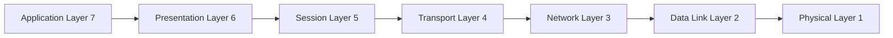
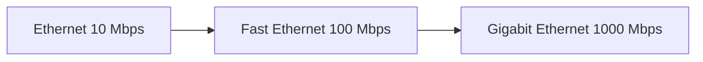
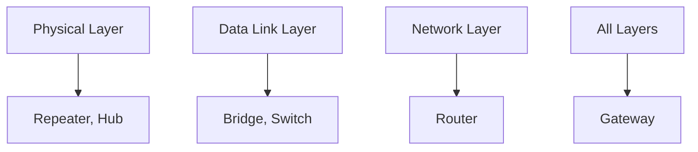
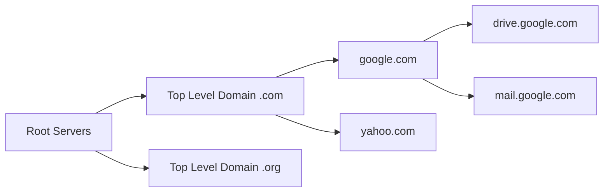
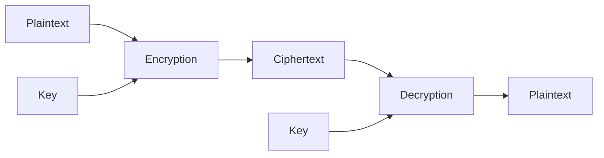
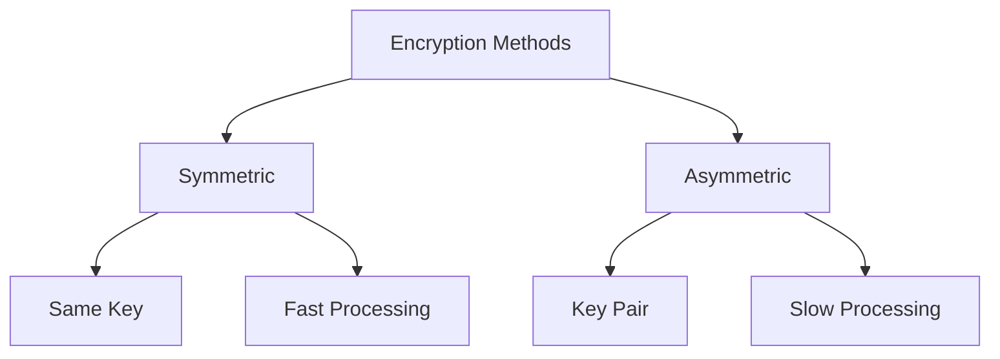

## Question 1(a) [3 marks]

**List the different Network Topologies and discuss any one in detail.**

**Answer**:

| Topology | Description |
|----------|-------------|
| **Star** | All devices connected to central hub/switch |
| **Ring** | Devices connected in circular fashion |
| **Bus** | All devices connected to single cable |
| **Mesh** | Every device connected to every other device |
| **Tree** | Hierarchical structure with root node |
| **Hybrid** | Combination of two or more topologies |

**Star Topology Details:**

- **Central Hub**: All nodes connect to one central device
- **Point-to-Point**: Each connection is dedicated between node and hub
- **Easy Management**: Simple to install and troubleshoot

**Mnemonic:** "STAR = Single Terminal All Reach"

## Question 1(b) [4 marks]  

**Explain how point-to-point and broadcast transmission technologies are used in modern communication systems with examples of real-world applications and discuss their advantages and limitations.**

**Answer**:

| Technology | Point-to-Point | Broadcast |
|------------|----------------|-----------|
| **Connection** | Direct link between two devices | One-to-many communication |
| **Example** | Telephone, VPN tunnels | Radio, TV, WiFi |
| **Data Flow** | Bidirectional | Unidirectional/Multidirectional |

**Point-to-Point Applications:**

- **Dedicated Lines**: Leased lines between offices
- **Satellite Links**: Ground station to satellite communication
- **Cable Modems**: Home to ISP connection

**Broadcast Applications:**

- **WiFi Networks**: Router broadcasts to multiple devices
- **Television**: One transmitter to many receivers

**Mnemonic:** "P2P = Private Path, Broadcast = Big Audience"

## Question 1(c) [7 marks]

**Describe OSI model with function of all layers.**

**Answer**:

| Layer | Name | Function |
|-------|------|----------|
| **7** | Application | User interface, network services |
| **6** | Presentation | Data encryption, compression, formatting |
| **5** | Session | Establishes, manages, terminates sessions |
| **4** | Transport | Reliable data transfer, error correction |
| **3** | Network | Routing, logical addressing (IP) |
| **2** | Data Link | Frame formatting, error detection |
| **1** | Physical | Bit transmission, electrical signals |



**Key Functions:**

- **Upper Layers (5-7)**: Handle application-related services
- **Lower Layers (1-4)**: Handle data transmission and routing
- **Encapsulation**: Each layer adds its own header

**Mnemonic:** "All People Seem To Need Data Processing"

## Question 1(c OR) [7 marks]

**Write a functional description of all layer of TCP/IP model.**

**Answer**:

| Layer | Name | Function | Protocols |
|-------|------|----------|-----------|
| **4** | Application | User services, applications | HTTP, FTP, SMTP, DNS |
| **3** | Transport | End-to-end communication | TCP, UDP |
| **2** | Internet | Routing, logical addressing | IP, ICMP, ARP |
| **1** | Network Access | Physical transmission | Ethernet, WiFi |


**Layer Functions:**

- **Application**: Provides network services to applications
- **Transport**: Ensures reliable or unreliable delivery
- **Internet**: Routes packets across networks using IP addresses
- **Network Access**: Handles physical transmission media

**Mnemonic:** "Applications Transport Internet Networks"

## Question 2(a) [3 marks]

**Describe Function of firewall in network security.**

**Answer**:

**Firewall Functions:**

- **Packet Filtering**: Controls incoming and outgoing network traffic
- **Access Control**: Blocks unauthorized access attempts
- **Traffic Monitoring**: Logs and analyzes network activity

**Types:**

- **Hardware Firewall**: Physical device protecting entire network
- **Software Firewall**: Program installed on individual computers
- **Stateful Inspection**: Tracks connection states and contexts

**Mnemonic:** "Firewall = Filter, Access, Monitor"

## Question 2(b) [4 marks]

**Compare FDDI (Fiber Distributed Data Interface) and CDDI (Copper Distributed Data Interface) in terms of their key characteristics, advantages, and applications.**

**Answer**:

| Feature | FDDI | CDDI |
|---------|------|------|
| **Medium** | Optical fiber | Twisted pair copper |
| **Speed** | 100 Mbps | 100 Mbps |
| **Distance** | Up to 200 km | Up to 100 meters |
| **Cost** | Higher | Lower |
| **Security** | Higher (difficult to tap) | Lower (easier to tap) |
| **Installation** | Complex | Simple |

**FDDI Advantages:**

- **Long Distance**: Supports campus-wide networks
- **High Security**: Immune to electromagnetic interference
- **Reliability**: Better error detection and recovery

**CDDI Advantages:**

- **Cost Effective**: Uses existing copper infrastructure
- **Easy Installation**: Standard twisted pair cabling
- **Compatibility**: Works with existing network equipment

**Mnemonic:** "FDDI = Fiber Distance, CDDI = Copper Cost"

## Question 2(c) [7 marks]

**Explain and distinguish Ethernet, Fast Ethernet, Gigabit Ethernet.**

**Answer**:

| Type | Speed | Standard | Cable Type | Distance |
|------|-------|----------|------------|----------|
| **Ethernet** | 10 Mbps | 802.3 | Coax/UTP | 100m |
| **Fast Ethernet** | 100 Mbps | 802.3u | UTP Cat5 | 100m |
| **Gigabit Ethernet** | 1000 Mbps | 802.3z/ab | Cat5e/6, Fiber | 100m/5km |



**Key Differences:**

- **Speed Evolution**: 10x increase at each generation
- **Media Support**: From coax to twisted pair to fiber
- **Applications**: LAN backbone, server connections, desktop
- **Backward Compatibility**: Newer standards support older devices

**Standards:**

- **10Base-T**: 10 Mbps over twisted pair
- **100Base-TX**: 100 Mbps over Category 5 UTP
- **1000Base-T**: 1 Gbps over Category 5e/6 UTP

**Mnemonic:** "Every Fast Gigabit = 10, 100, 1000"

## Question 2(a OR) [3 marks]

**Explain its role and function of router within a network infrastructure.**

**Answer**:

**Router Functions:**

- **Packet Forwarding**: Routes data packets between different networks
- **Path Determination**: Selects best route using routing tables
- **Network Isolation**: Separates broadcast domains

**Key Roles:**

- **Inter-network Communication**: Connects LANs to WANs
- **Traffic Management**: Controls data flow between networks
- **Protocol Translation**: Converts between different network protocols

**Mnemonic:** "Router = Route, Isolate, Connect"

## Question 2(b OR) [4 marks]

**Explain the structure of FDDI (Fiber Distributed Data Interface) and give its advantages.**

**Answer**:

**FDDI Structure:**

```goat
    Node A -------- Node B
      |               |
      |               |
    Node D -------- Node C
    
    Primary Ring: Clockwise
    Secondary Ring: Counter-clockwise
```

**Components:**

- **Dual Ring**: Primary and secondary rings for redundancy
- **Token Passing**: Uses token for media access control
- **Concentrators**: Connect multiple stations to ring

**Advantages:**

- **High Reliability**: Dual ring provides fault tolerance
- **Fast Speed**: 100 Mbps data transmission rate
- **Long Distance**: Supports up to 200 km ring circumference
- **Self-Healing**: Automatic reconfiguration when link fails

**Mnemonic:** "FDDI = Fast, Dual, Distance, Immune"

## Question 2(c OR) [7 marks]

**Explain roll of network Devices. Describe in brief about all the devices.**

**Answer**:

| Device | Layer | Function |
|--------|-------|----------|
| **Repeater** | Physical | Regenerates signals, extends distance |
| **Hub** | Physical | Connects multiple devices, shared bandwidth |
| **Bridge** | Data Link | Connects LANs, reduces collisions |
| **Switch** | Data Link | Intelligent hub, dedicated bandwidth |
| **Router** | Network | Connects different networks, routing |
| **Gateway** | All Layers | Protocol conversion, network interconnection |



**Device Functions:**

- **Repeater**: Amplifies and regenerates signals
- **Hub**: Simple connection point for multiple devices
- **Bridge**: Intelligent forwarding based on MAC addresses
- **Switch**: High-performance bridge with multiple ports
- **Router**: Intelligent path selection between networks
- **Gateway**: Complete protocol stack conversion

**Mnemonic:** "Repeat, Hub, Bridge, Switch, Route, Gateway"

## Question 3(a) [3 marks]

**Name any three data link layer protocol and explain any one in detail.**

**Answer**:

**Data Link Layer Protocols:**

- **HDLC** (High-Level Data Link Control)
- **PPP** (Point-to-Point Protocol)
- **Ethernet** (IEEE 802.3)

**HDLC Protocol Details:**

- **Frame Structure**: Flag, Address, Control, Data, FCS, Flag
- **Error Detection**: Frame Check Sequence (FCS)
- **Flow Control**: Sliding window mechanism

**HDLC Frame Format:**

```goat
+------+------+------+------+------+------+
| Flag |Addr  |Ctrl  | Data | FCS  | Flag |
| 8bit |8bit  |8bit  |      |16bit | 8bit |
+------+------+------+------+------+------+
```

**Mnemonic:** "HDLC = High Data Link Control"

## Question 3(b) [4 marks]

**Explain error control and flow control at data link layer**

**Answer**:

| Control Type | Purpose | Methods |
|--------------|---------|---------|
| **Error Control** | Detect and correct transmission errors | CRC, Checksum, Parity |
| **Flow Control** | Manage data transmission rate | Stop-and-Wait, Sliding Window |

**Error Control Methods:**

- **Detection**: CRC, Checksum identify errors
- **Correction**: ARQ (Automatic Repeat Request)
- **Prevention**: Forward Error Correction (FEC)

**Flow Control Methods:**

- **Stop-and-Wait**: Send one frame, wait for ACK
- **Sliding Window**: Send multiple frames before ACK
- **Buffer Management**: Prevent receiver overflow

**Mnemonic:** "Error = Detect, Flow = Control"

## Question 3(c) [7 marks]

**Compare IPv6 and IPv4.**

**Answer**:

| Feature | IPv4 | IPv6 |
|---------|------|------|
| **Address Length** | 32 bits | 128 bits |
| **Address Space** | 4.3 billion | 340 undecillion |
| **Header Size** | 20-60 bytes (variable) | 40 bytes (fixed) |
| **Notation** | Decimal (192.168.1.1) | Hexadecimal (2001:db8::1) |
| **Fragmentation** | Router and host | Host only |
| **Security** | Optional (IPSec) | Built-in (IPSec) |
| **Configuration** | Manual/DHCP | Auto-configuration |

**IPv4 Example:** 192.168.1.100
**IPv6 Example:** 2001:0db8:85a3:0000:0000:8a2e:0370:7334

**Key Differences:**

- **Address Exhaustion**: IPv4 addresses nearly exhausted
- **Header Efficiency**: IPv6 simplified header structure
- **Security**: IPv6 has built-in security features
- **Quality of Service**: Better QoS support in IPv6

**Mnemonic:** "IPv6 = Infinite, Integrated, Improved"

## Question 3(a OR) [3 marks]

**Explain the differences between guided and unguided transmission media used in computer networks**

**Answer**:

| Media Type | Guided | Unguided |
|------------|--------|----------|
| **Definition** | Physical path exists | No physical path |
| **Examples** | Twisted pair, Coax, Fiber | Radio, Microwave, Satellite |
| **Direction** | Point-to-point | Broadcast |

**Guided Media:**

- **Twisted Pair**: Telephone lines, LANs
- **Coaxial Cable**: Cable TV, older networks
- **Fiber Optic**: High-speed, long-distance

**Unguided Media:**

- **Radio Waves**: WiFi, Bluetooth
- **Microwaves**: Point-to-point links
- **Infrared**: Short-range communication

**Mnemonic:** "Guided = Ground, Unguided = Air"

## Question 3(b OR) [4 marks]

**Describe circuit switching and packet switching.**

**Answer**:

| Feature | Circuit Switching | Packet Switching |
|---------|------------------|------------------|
| **Connection** | Dedicated path established | No dedicated path |
| **Resource Allocation** | Fixed bandwidth | Shared resources |
| **Example** | Traditional telephone | Internet |
| **Delay** | Constant | Variable |

**Circuit Switching:**

- **Setup Phase**: Establishes dedicated connection
- **Data Transfer**: Continuous transmission
- **Teardown**: Releases connection resources

**Packet Switching:**

- **Store-and-Forward**: Packets stored at intermediate nodes
- **Dynamic Routing**: Each packet routed independently
- **Resource Sharing**: Bandwidth shared among users

**Mnemonic:** "Circuit = Continuous, Packet = Pieces"

## Question 3(c OR) [7 marks]

**Explain IPv4 OR IPv6 in detail.**

**Answer** (IPv4):

**IPv4 Address Structure:**

- **32-bit Address**: Divided into 4 octets
- **Dotted Decimal**: 192.168.1.1 format
- **Network + Host**: Address split into network and host portions

| Class | Range | Network Bits | Host Bits | Use |
|-------|-------|--------------|-----------|-----|
| **A** | 1-126 | 8 | 24 | Large networks |
| **B** | 128-191 | 16 | 16 | Medium networks |
| **C** | 192-223 | 24 | 8 | Small networks |

**Special Addresses:**

- **Loopback**: 127.0.0.1 (local host)
- **Private**: 192.168.x.x, 10.x.x.x, 172.16-31.x.x
- **Broadcast**: 255.255.255.255

**Subnetting:**

- **Subnet Mask**: Identifies network portion
- **CIDR**: Classless Inter-Domain Routing
- **Variable Length**: Different subnet sizes

**IPv4 Header:**

```goat
0               16              32
+---------------+---------------+
|Version| IHL   |Type of Service|
+---------------+---------------+
|     Total Length              |
+---------------+---------------+
|Identification |Flags|Fragment |
+---------------+---------------+
| TTL  |Protocol|Header Checksum|
+---------------+---------------+
|     Source Address            |
+---------------+---------------+
|   Destination Address         |
+---------------+---------------+
```

**Mnemonic:** "IPv4 = 4 octets, 32 bits, Classes A-C"

## Question 4(a) [3 marks]

**Give full name of ARP and RARP and describe them.**

**Answer**:

**Full Names:**

- **ARP**: Address Resolution Protocol
- **RARP**: Reverse Address Resolution Protocol

| Protocol | Function |
|----------|----------|
| **ARP** | Maps IP address to MAC address |
| **RARP** | Maps MAC address to IP address |

**ARP Process:**

- **Request**: "Who has IP 192.168.1.1?"
- **Reply**: "192.168.1.1 is at MAC 00:1A:2B:3C:4D:5E"
- **Cache**: Stores mappings for future use

**RARP Process:**

- **Diskless Workstations**: Get IP from server
- **Broadcast Request**: Sends MAC address
- **Server Response**: Returns assigned IP address

**Mnemonic:** "ARP = Address to MAC, RARP = Reverse"

## Question 4(b) [4 marks]

**Describe DSL technology with its advantages and limitations.**

**Answer**:

**DSL (Digital Subscriber Line):**

| Type | Speed | Distance |
|------|-------|----------|
| **ADSL** | Up to 8 Mbps | 5.5 km |
| **VDSL** | Up to 52 Mbps | 1.5 km |
| **SDSL** | Up to 2 Mbps | 3 km |

**Advantages:**

- **Existing Infrastructure**: Uses telephone lines
- **Always-On**: Continuous internet connection
- **Voice + Data**: Simultaneous phone and internet
- **Cost-Effective**: Affordable for home users

**Limitations:**

- **Distance Dependent**: Speed decreases with distance
- **Upload Speed**: Lower than download speed (ADSL)
- **Line Quality**: Affected by copper wire condition
- **Availability**: Not available in all areas

**Mnemonic:** "DSL = Digital Subscriber Line"

## Question 4(c) [7 marks]

**Role of DNS- Domain Name System.**

**Answer**:

**DNS Functions:**

- **Name Resolution**: Converts domain names to IP addresses
- **Hierarchical Structure**: Organized in tree-like structure
- **Distributed Database**: Information stored across multiple servers



**DNS Hierarchy:**

- **Root Domain**: Highest level (.)
- **Top-Level Domain**: .com, .org, .net, .edu
- **Second-Level Domain**: google.com, yahoo.com
- **Subdomain**: www.google.com, mail.google.com

**DNS Resolution Process:**

1. **Client Query**: User types www.example.com
2. **Local DNS**: Checks local cache
3. **Root Server**: Queries root DNS server
4. **TLD Server**: Queries .com server
5. **Authoritative Server**: Gets IP address
6. **Response**: Returns IP to client

**DNS Record Types:**

- **A Record**: Maps domain to IPv4 address
- **AAAA Record**: Maps domain to IPv6 address
- **CNAME**: Canonical name (alias)
- **MX**: Mail exchange server
- **NS**: Name server records

**Mnemonic:** "DNS = Domain Name System"

## Question 4(a OR) [3 marks]

**Give full name of DHCP and BOOTP. and describe them.**

**Answer**:

**Full Names:**

- **DHCP**: Dynamic Host Configuration Protocol
- **BOOTP**: Bootstrap Protocol

| Protocol | Function |
|----------|----------|
| **DHCP** | Automatically assigns IP addresses |
| **BOOTP** | Provides IP address to diskless workstations |

**DHCP Process:**

- **Discover**: Client broadcasts request
- **Offer**: Server offers IP address
- **Request**: Client requests specific IP
- **Acknowledge**: Server confirms assignment

**BOOTP Process:**

- **Static Configuration**: Pre-configured IP assignments
- **Diskless Boot**: Workstations boot from network
- **Server Response**: Provides IP and boot information

**Mnemonic:** "DHCP = Dynamic, BOOTP = Bootstrap"

## Question 4(b OR) [4 marks]

**Differences Between Virtual Circuits and Datagram Networks.**

**Answer**:

| Feature | Virtual Circuits | Datagram Networks |
|---------|------------------|-------------------|
| **Connection** | Connection-oriented | Connectionless |
| **Setup** | Requires setup phase | No setup required |
| **Routing** | Same path for all packets | Independent routing |
| **Order** | Packets arrive in order | May arrive out of order |
| **Reliability** | More reliable | Less reliable |
| **Overhead** | Higher setup overhead | Lower per-packet overhead |

**Virtual Circuits:**

- **Path Establishment**: Creates virtual connection
- **State Information**: Maintains connection state
- **Examples**: ATM, Frame Relay

**Datagram Networks:**

- **Independent Packets**: Each packet routed separately
- **Stateless**: No connection state maintained
- **Examples**: Internet Protocol (IP)

**Mnemonic:** "Virtual = Connection, Datagram = Independent"

## Question 4(c OR) [7 marks]

**Explain TCP and UDP protocol in transport layer**

**Answer**:

| Feature | TCP | UDP |
|---------|-----|-----|
| **Connection** | Connection-oriented | Connectionless |
| **Reliability** | Reliable | Unreliable |
| **Header Size** | 20 bytes | 8 bytes |
| **Flow Control** | Yes | No |
| **Error Control** | Yes | Basic |
| **Speed** | Slower | Faster |

**TCP (Transmission Control Protocol):**

- **Three-Way Handshake**: SYN, SYN-ACK, ACK
- **Flow Control**: Sliding window mechanism
- **Error Recovery**: Retransmission of lost packets
- **Congestion Control**: Prevents network overload

**TCP Header:**

```goat
0               16              32
+---------------+----------------+
|Source Port    |Destination Port|
+---------------+----------------+
|      Sequence Number           |
+---------------+----------------+
|   Acknowledgment Number        |
+---------------+----------------+
|Hdr|   |U|A|P|R|S|F|    Window  |
|Len|   |R|C|S|S|Y|I|     Size   |
+---------------+----------------+
```

**UDP (User Datagram Protocol):**

- **Simple Protocol**: Minimal overhead
- **Best Effort**: No guarantee of delivery
- **Applications**: DNS, DHCP, streaming media
- **Real-time Communication**: Voice, video applications

**UDP Header:**

```goat
0               16              32
+---------------+----------------+
|Source Port    |Destination Port|
+---------------+----------------+
|    Length     |   Checksum     |
+---------------+----------------+
```

**Applications:**

- **TCP**: Web browsing, email, file transfer
- **UDP**: Online gaming, video streaming, DNS queries

**Mnemonic:** "TCP = Reliable, UDP = Fast"

## Question 5(a) [3 marks]

**Explain any two of following. (1) WWW (2) FTP (3) SMTP**

**Answer**:

**WWW (World Wide Web):**

- **HTTP Protocol**: HyperText Transfer Protocol
- **Web Browser**: Client software (Chrome, Firefox)
- **Web Server**: Serves web pages (Apache, IIS)

**FTP (File Transfer Protocol):**

- **File Transfer**: Upload and download files
- **Two Modes**: Active and passive mode
- **Authentication**: Username and password required

| Service | Port | Function |
|---------|------|----------|
| **WWW** | 80/443 | Web page delivery |
| **FTP** | 20/21 | File transfer |

**Mnemonic:** "WWW = Web, FTP = Files"

## Question 5(b) [4 marks]

**Difference between symmetric and asymmetric encryption algorithms.**

**Answer**:

| Feature | Symmetric | Asymmetric |
|---------|-----------|------------|
| **Keys** | Same key for encryption/decryption | Different keys (public/private) |
| **Speed** | Fast | Slow |
| **Key Distribution** | Difficult | Easy |
| **Examples** | AES, DES | RSA, ECC |

**Symmetric Encryption:**

- **Single Key**: Same key used by sender and receiver
- **Key Management**: Secure key distribution required
- **Performance**: Fast encryption/decryption
- **Applications**: Bulk data encryption

**Asymmetric Encryption:**

- **Key Pair**: Public key for encryption, private key for decryption
- **Key Distribution**: Public key can be shared openly
- **Performance**: Slower than symmetric
- **Applications**: Digital signatures, key exchange

**Mnemonic:** "Symmetric = Same, Asymmetric = Different"

## Question 5(c) [7 marks]

**Define the terms "encryption" and "decryption" in the context of cryptography.**

**Answer**:

**Encryption:**

- **Definition**: Process of converting plaintext into ciphertext
- **Purpose**: Protect data confidentiality
- **Input**: Plaintext + Key
- **Output**: Ciphertext

**Decryption:**

- **Definition**: Process of converting ciphertext back to plaintext
- **Purpose**: Retrieve original data
- **Input**: Ciphertext + Key
- **Output**: Plaintext



**Cryptographic Process:**

1. **Sender**: Encrypts message using key
2. **Transmission**: Sends ciphertext over network
3. **Receiver**: Decrypts ciphertext using key
4. **Recovery**: Gets original plaintext message

**Types of Encryption:**

- **Stream Cipher**: Encrypts one bit/byte at a time
- **Block Cipher**: Encrypts fixed-size blocks
- **Hash Function**: One-way encryption (no decryption)

**Applications:**

- **Data Protection**: Secure file storage
- **Communication**: Secure messaging
- **Authentication**: Digital signatures
- **Privacy**: Personal information protection

**Security Requirements:**

- **Confidentiality**: Only authorized users can read
- **Integrity**: Data hasn't been tampered with
- **Authentication**: Verify sender identity
- **Non-repudiation**: Sender cannot deny sending

**Mnemonic:** "Encryption = Hide, Decryption = Reveal"

## Question 5(a OR) [3 marks]

**Difference between IMAP and POP3**

**Answer**:

| Feature | IMAP | POP3 |
|---------|------|------|
| **Storage** | Server-side | Client-side |
| **Access** | Multiple devices | Single device |
| **Offline** | Limited | Full access |

**IMAP (Internet Message Access Protocol):**

- **Server Storage**: Messages remain on server
- **Multi-Device**: Access from multiple devices
- **Synchronization**: Changes sync across devices

**POP3 (Post Office Protocol 3):**

- **Download**: Messages downloaded to client
- **Single Device**: Best for one device access
- **Storage**: Client manages message storage

**Mnemonic:** "IMAP = Internet Access, POP3 = Post Office"

## Question 5(b OR) [4 marks]

**Briefly describe the Information Technology (Amendment) Act, 2008, and its impact on cyber laws in India.**

**Answer**:

**IT Act 2008 Key Features:**

- **Cyber Crimes**: Defines various cyber offenses
- **Data Protection**: Privacy and security requirements
- **Digital Signatures**: Legal recognition of e-signatures
- **Penalties**: Fines and imprisonment for violations

**Major Amendments:**

- **Section 66A**: Criminalized offensive messages (later struck down)
- **Section 69**: Government power to intercept information
- **Section 72A**: Punishment for disclosure of personal information
- **Section 43A**: Compensation for data breach

**Impact on Cyber Laws:**

- **Legal Framework**: Comprehensive cyber law structure
- **Business Compliance**: Data protection requirements
- **Individual Rights**: Privacy protection mechanisms
- **Law Enforcement**: Tools for investigating cyber crimes

**Mnemonic:** "IT Act = Internet Technology Act"

## Question 5(c OR) [7 marks]

**Difference between symmetric and asymmetric encryption algorithms.**

**Answer**:

| Aspect | Symmetric Encryption | Asymmetric Encryption |
|--------|---------------------|----------------------|
| **Key Usage** | Same key for encrypt/decrypt | Different keys (public/private) |
| **Key Management** | Difficult key distribution | Easy key distribution |
| **Performance** | Fast processing | Slow processing |
| **Key Length** | Shorter keys (128-256 bits) | Longer keys (1024-4096 bits) |
| **Scalability** | Poor (n² key pairs needed) | Good (n key pairs needed) |
| **Examples** | AES, DES, 3DES, Blowfish | RSA, ECC, DSA, ElGamal |

**Symmetric Encryption Details:**

- **Algorithm Types**: Stream ciphers, Block ciphers
- **Key Distribution Problem**: Secure channel needed for key exchange
- **Applications**: Bulk data encryption, VPNs, file encryption
- **Advantages**: Fast, efficient for large amounts of data
- **Disadvantages**: Key management complexity, no digital signatures

**Asymmetric Encryption Details:**

- **Public Key Infrastructure**: PKI for key management
- **Digital Signatures**: Authentication and non-repudiation
- **Applications**: Email security, SSL/TLS, digital certificates
- **Advantages**: Secure key exchange, digital signatures
- **Disadvantages**: Computationally intensive, slower processing

**Hybrid Approach:**

- **Best of Both**: Combines symmetric and asymmetric encryption
- **Key Exchange**: Asymmetric for key distribution
- **Data Encryption**: Symmetric for actual data
- **Example**: SSL/TLS uses both methods



**Real-world Applications:**

- **Banking**: ATM transactions use symmetric encryption
- **E-commerce**: HTTPS uses hybrid encryption  
- **Email**: PGP uses asymmetric for key exchange
- **Mobile**: WhatsApp uses end-to-end encryption

**Security Considerations:**

- **Key Length**: Longer keys provide better security
- **Algorithm Strength**: Choose proven algorithms
- **Implementation**: Proper coding prevents vulnerabilities
- **Key Storage**: Secure key management essential

**Performance Comparison:**

| Operation | Symmetric (AES) | Asymmetric (RSA) |
|-----------|----------------|------------------|
| **Encryption** | ~1000 MB/s | ~1 MB/s |
| **Key Generation** | Fast | Slow |
| **Memory Usage** | Low | High |
| **CPU Usage** | Low | High |

**Future Trends:**

- **Quantum Computing**: Threat to current asymmetric algorithms
- **Post-Quantum Cryptography**: New algorithms being developed
- **Elliptic Curve**: More efficient asymmetric encryption
- **Lightweight Cryptography**: For IoT devices

**Mnemonic:** "Symmetric = Same Speed, Asymmetric = Advanced Security"
