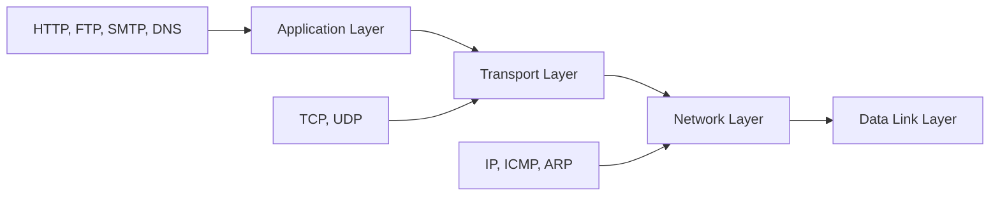
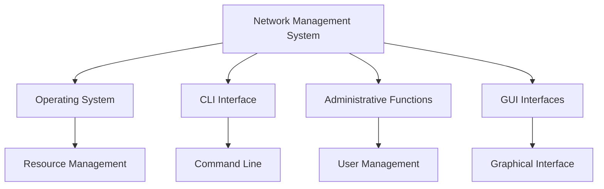
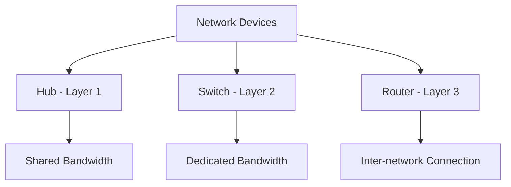
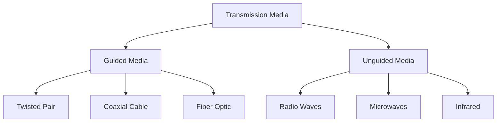
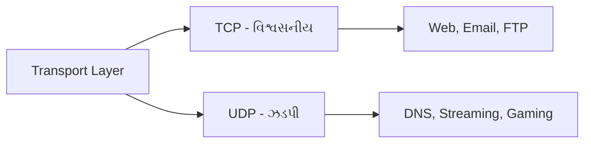
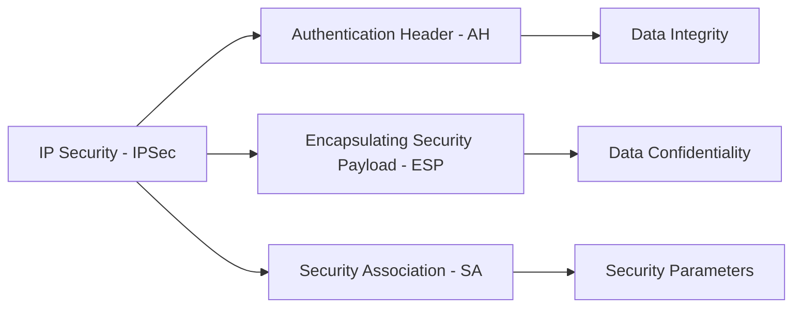
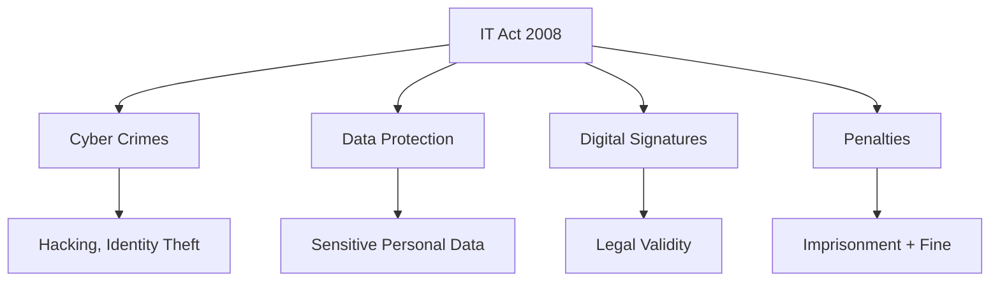

## પ્રશ્ન 1(અ) [3 ગુણ]

**વિવિધ DSL ટેકનોલોજી જણાવો અને ADSL પર ચર્ચા કરો**

**જવાબ**:

**DSL ટેકનોલોજીના પ્રકારો:**

| DSL પ્રકાર | પૂરું નામ | સ્પીડ |
|----------|-----------|-------|
| **ADSL** | Asymmetric DSL | 1-8 Mbps |
| **SDSL** | Symmetric DSL | 768 Kbps |
| **VDSL** | Very high DSL | 52 Mbps |
| **HDSL** | High bit-rate DSL | 1.5 Mbps |

**ADSL ની વિશેષતાઓ:**

- **અસમપ્રમાણ**: અલગ upload/download સ્પીડ
- **Frequency Division**: હાલની તાંબાની ટેલિફોન લાઇનનો ઉપયોગ
- **Download સ્પીડ**: Upload કરતાં વધારે

**મેમરી ટ્રીક:** "ADSL ડાઉનલોડ ઝડપી"

---

## પ્રશ્ન 1(બ) [4 ગુણ]

**આર્કિટેક્ચરના આધારે નેટવર્ક વર્ગીકરણનું વર્ણન કરો.**

**જવાબ**:

**નેટવર્ક આર્કિટેક્ચર વર્ગીકરણ:**

| આર્કિટેક્ચર | વર્ણન | વિશેષતાઓ |
|--------------|-------------|----------|
| **Peer-to-Peer** | બધા nodes સમાન | કોઈ કેન્દ્રીય સર્વર નથી |
| **Client-Server** | કેન્દ્રીકૃત મોડેલ | સમર્પિત સર્વર |

**Client-Server ફાયદાઓ:**

- **કેન્દ્રીય નિયંત્રણ**: સરળ વ્યવસ્થાપન અને સુરક્ષા
- **સંસાધન શેરિંગ**: સંસાધનોનો કાર્યક્ષમ ઉપયોગ
- **સ્કેલેબિલિટી**: વધુ વપરાશકર્તાઓને સંભાળી શકે
- **ડેટા સુરક્ષા**: બેહતર બેકઅપ અને પુનઃપ્રાપ્તિ

**P2P લાક્ષણિકતાઓ:**

- **વિકેન્દ્રીકૃત**: નિષ્ફળતાનો એક બિંદુ નથી
- **ખર્ચ અસરકારક**: સમર્પિત સર્વરની જરૂર નથી

**મેમરી ટ્રીક:** "Client સારી સેવા આપે"

---

## પ્રશ્ન 1(ક) [7 ગુણ]

**OSI મોડેલની આકૃતિ દોરો અને બધા સ્તરો સાથે વિગતવાર સમજાવો.**

**જવાબ**:


**OSI સ્તરોના કાર્યો:**

| સ્તર | કાર્ય | ઉદાહરણો |
|-------|----------|----------|
| **Application** | વપરાશકર્તા ઇન્ટરફેસ | HTTP, FTP, SMTP |
| **Presentation** | ડેટા ફોર્મેટિંગ | Encryption, Compression |
| **Session** | Session વ્યવસ્થાપન | NetBIOS, RPC |
| **Transport** | End-to-end ડિલિવરી | TCP, UDP |
| **Network** | Routing | IP, ICMP |
| **Data Link** | Frame ડિલિવરી | Ethernet, PPP |
| **Physical** | Bit પ્રસારણ | Cables, Signals |

**મુખ્ય વિશેષતાઓ:**

- **સ્તરબદ્ધ અભિગમ**: દરેક સ્તર ચોક્કસ કાર્ય કરે છે
- **માનકીકરણ**: સાર્વત્રિક સંચાર મોડેલ
- **સમસ્યા નિવારણ**: નેટવર્ક સમસ્યાઓ ઓળખવામાં સરળ

**મેમરી ટ્રીક:** "બધા લોકો ધંધો કરવા ડેટા પ્રોસેસિંગ કરે"

---

## પ્રશ્ન 1(ક OR) [7 ગુણ]

**TCP/IP protocol suite નો diagram દોરો અને Application Layer, Transport Layer અને Network Layer ના કાર્યો વિગતવાર સમજાવો.**

**જવાબ**:



**સ્તરોના કાર્યો:**

| સ્તર | મુખ્ય કાર્ય | Protocols |
|-------|------------------|-----------|
| **Application** | વપરાશકર્તા સેવાઓ | HTTP, FTP, SMTP |
| **Transport** | End-to-end ડિલિવરી | TCP, UDP |
| **Network** | Routing packets | IP, ICMP |

**Application Layer કાર્યો:**

- **Web સેવાઓ**: વેબ બ્રાઉઝિંગ માટે HTTP
- **File Transfer**: ફાઇલ શેરિંગ માટે FTP
- **Email**: મેઇલ ડિલિવરી માટે SMTP

**Transport Layer કાર્યો:**

- **વિશ્વસનીય ડિલિવરી**: TCP ડેટાની અખંડિતતા સુનિશ્ચિત કરે
- **અવિશ્વસનીય ડિલિવરી**: ઝડપી પ્રસારણ માટે UDP
- **Port Numbers**: ચોક્કસ applications ઓળખે

**Network Layer કાર્યો:**

- **Logical Addressing**: ઉપકરણો માટે IP addresses
- **Routing**: packets માટે શ્રેષ્ઠ માર્ગ પસંદગી
- **Fragmentation**: મોટા packets તોડવા

**મેમરી ટ્રીક:** "Applications Transport Networks"

---

## પ્રશ્ન 2(અ) [3 ગુણ]

**WWW સમજાવો.**

**જવાબ**:

**World Wide Web (WWW):**

| ઘટક | વર્ણન |
|-----------|-------------|
| **Web Browser** | Client software |
| **Web Server** | વેબસાઇટ્સ host કરે |
| **HTTP** | સંચાર protocol |
| **URL** | વેબ address |

**WWW વિશેષતાઓ:**

- **Hypertext**: HTML વાપરીને linked documents
- **Client-Server Model**: Browser વિનંતી કરે, server જવાબ આપે
- **સાર્વત્રિક પ્રવેશ**: Platform independent

**ઘટકો:**

- **HTML**: વેબ પેજ માટે markup language
- **Browser**: Firefox, Chrome, Safari

**મેમરી ટ્રીક:** "Web વિશ્વભર કામ કરે"

---

## પ્રશ્ન 2(બ) [4 ગુણ]

**FDDI અને CDDI સમજાવો.**

**જવાબ**:

**FDDI vs CDDI સરખામણી:**

| વિશેષતા | FDDI | CDDI |
|---------|------|------|
| **Medium** | Fiber optic | Copper wire |
| **સ્પીડ** | 100 Mbps | 100 Mbps |
| **અંતર** | 200 km | 100 meters |
| **ખર્ચ** | વધારે | ઓછો |

**FDDI વિશેષતાઓ:**

- **Dual Ring Topology**: Primary અને secondary rings
- **Token Passing**: Access control પદ્ધતિ
- **Fault Tolerance**: Self-healing ક્ષમતા

**CDDI વિશેષતાઓ:**

- **Copper આધારિત**: Twisted pair cables વાપરે
- **ખર્ચ અસરકારક**: Fiber કરતાં સસ્તું
- **મર્યાદિત અંતર**: ટૂંકી પ્રસારણ રેન્જ

**ઉપયોગ:**

- **FDDI**: Backbone networks, લાંબા અંતર
- **CDDI**: Local area networks, ખર્ચ-સંવેદનશીલ વાતાવરણ

**મેમરી ટ્રીક:** "Fiber ઝડપી, Copper સસ્તું"

---

## પ્રશ્ન 2(ક) [7 ગુણ]

**OS, CLI, Administrative Functions, Interfaces ના કાર્યો સાથે નેટવર્ક મેનેજમેન્ટ સિસ્ટમનું વર્ણન કરો.**

**જવાબ**:



**નેટવર્ક મેનેજમેન્ટ ઘટકો:**

| ઘટક | કાર્ય | ઉદાહરણો |
|-----------|----------|----------|
| **OS કાર્યો** | સંસાધન વ્યવસ્થાપન | Process, memory, file management |
| **CLI** | Command interface | Terminal, console commands |
| **Admin કાર્યો** | સિસ્ટમ નિયંત્રણ | User accounts, security |
| **Interfaces** | વપરાશકર્તા ક્રિયાપ્રતિક્રિયા | GUI, web interface |

**Operating System કાર્યો:**

- **Process Management**: ચાલતી applications નિયંત્રણ
- **Memory Management**: સિસ્ટમ સંસાધનો ફાળવવા
- **File System**: ડેટા ગોઠવવા અને સંગ્રહ

**CLI કાર્યો:**

- **સીધા Commands**: Text-based નિયંત્રણ
- **Scripting**: સ્વચાલિત કાર્ય અમલીકરણ
- **Remote Access**: SSH, Telnet connections

**Administrative કાર્યો:**

- **User Management**: વપરાશકર્તા accounts બનાવવા, બદલવા
- **Security Policies**: Access control, permissions
- **System Monitoring**: કાર્યક્ષમતા ટ્રેકિંગ

**Interfaces:**

- **GUI**: સરળ નેવિગેશન માટે graphical user interface
- **Web Interface**: Browser-based management
- **SNMP**: Simple Network Management Protocol

**મેમરી ટ્રીક:** "OS CLI Admin Interfaces"

---

## પ્રશ્ન 2(અ OR) [3 ગુણ]

**Connection-oriented protocol અને connectionless protocol ની સરખામણી કરો.**

**જવાબ**:

**Protocol સરખામણી:**

| વિશેષતા | Connection-Oriented | Connectionless |
|---------|-------------------|----------------|
| **Setup** | જરૂરી | જરૂરી નથી |
| **વિશ્વસનીયતા** | વધારે | ઓછી |
| **સ્પીડ** | ધીમી | ઝડપી |
| **ઉદાહરણ** | TCP | UDP |

**Connection-Oriented વિશેષતાઓ:**

- **Three-way Handshake**: ડેટા transfer પહેલાં connection સ્થાપિત કરે
- **વિશ્વસનીય ડિલિવરી**: Packet delivery અને order ની ખાતરી

**Connectionless વિશેષતાઓ:**

- **કોઈ Setup નથી**: સીધું ડેટા પ્રસારણ
- **Best Effort**: ડિલિવરીની કોઈ ખાતરી નથી

**મેમરી ટ્રીક:** "TCP કનેક્ટ કરે, UDP ડિલિવર કરે"

---

## પ્રશ્ન 2(બ OR) [4 ગુણ]

**નેટવર્ક ડિવાઇસ Repeater સમજાવો.**

**જવાબ**:

**Repeater કાર્યો:**

| કાર્ય | વર્ણન |
|----------|-------------|
| **Signal Amplification** | નબળા signals વધારે |
| **Range Extension** | નેટવર્ક અંતર વધારે |
| **Noise Reduction** | Signal ગુણવત્તા સાફ કરે |

```goat
Input Signal    Repeater    Output Signal
     |             |             |
weak ------>  [AMPLIFY] -----> strong
noisy              |          clean
```

**Repeater લાક્ષણિકતાઓ:**

- **Physical Layer Device**: Layer 1 પર કામ કરે
- **Bit-by-Bit**: Digital signals પુનઃ ઉત્પન્ન કરે
- **કોઈ Intelligence નથી**: ડેટા filter અથવા route કરી શકતું નથી

**ઉપયોગ:**

- **LAN Extension**: Ethernet segments વિસ્તૃત કરવા
- **Signal Recovery**: ક્ષતિગ્રસ્ત signals પુનઃસ્થાપિત કરવા

**મર્યાદાઓ:**

- **Collision Domain**: Collisions segment કરતું નથી
- **કોઈ Filtering નથી**: બધા signals forward કરે

**મેમરી ટ્રીક:** "Repeater Signals પુનઃ ઉત્પન્ન કરે"

---

## પ્રશ્ન 2(ક OR) [7 ગુણ]

**Router, Hub અને Switch વચ્ચેનો ભેદ આપો.**

**જવાબ**:

**નેટવર્ક ડિવાઇસ સરખામણી:**

| વિશેષતા | Hub | Switch | Router |
|---------|-----|--------|--------|
| **OSI Layer** | Physical (1) | Data Link (2) | Network (3) |
| **Collision Domain** | એક | અનેક | અનેક |
| **Broadcast Domain** | એક | એક | અનેક |
| **Intelligence** | કંઈ નથી | MAC શીખવું | IP routing |
| **Full Duplex** | ના | હા | હા |



**Hub લાક્ષણિકતાઓ:**

- **Shared Medium**: બધા ports bandwidth શેર કરે
- **Half Duplex**: એક સાથે send અને receive કરી શકતું નથી
- **Collision Prone**: એક collision domain

**Switch લાક્ષણિકતાઓ:**

- **MAC Address Table**: ઉપકરણોના સ્થાનો શીખે
- **Full Duplex**: એક સાથે send/receive
- **VLAN Support**: Virtual network segmentation

**Router લાક્ષણિકતાઓ:**

- **IP Routing**: નેટવર્ક વચ્ચે packets forward કરે
- **Routing Table**: નેટવર્ક topology જાળવે
- **NAT Support**: Network Address Translation

**ઉપયોગ:**

- **Hub**: Legacy networks (મોટે ભાગે અપ્રચલિત)
- **Switch**: LAN connectivity, VLAN implementation
- **Router**: Internet connectivity, WAN connections

**મેમરી ટ્રીક:** "Hub શેર કરે, Switch સ્વિચ કરે, Router રૂટ કરે"

---

## પ્રશ્ન 3(અ) [3 ગુણ]

**UTP, Coaxial અને Fiber optic cable નો સઘડ આકૃતિ દોરો**

**જવાબ**:

```goat
UTP Cable:
   +-- Plastic Jacket
   |   +-- Twisted Pairs
   |   |
   +---+===+  +===+
       |   |  |   |
       +---+  +---+

Coaxial Cable:
   +-- Outer Jacket
   |   +-- Shield
   |   |   +-- Dielectric
   |   |   |   +-- Center Conductor
   +---+---+---+===+
       |   |   |
       +---+---+

Fiber Optic Cable:
   +-- Outer Jacket
   |   +-- Strength Member
   |   |   +-- Cladding
   |   |   |   +-- Core
   +---+---+---+===+
       |   |   |
       +---+---+
```

**Cable લાક્ષણિકતાઓ:**

| Cable પ્રકાર | Core સામગ્રી | Bandwidth |
|------------|---------------|-----------|
| **UTP** | Copper wire | 100 MHz |
| **Coaxial** | Copper conductor | 1 GHz |
| **Fiber Optic** | Glass/Plastic | ખૂબ વધારે |

**મેમરી ટ્રીક:** "વળેલું તાંબું કાચ"

---

## પ્રશ્ન 3(બ) [4 ગુણ]

**Circuit switching અને packet switching circuit વચ્ચેનો ભેદ આપો.**

**જવાબ**:

**Switching પદ્ધતિઓ સરખામણી:**

| વિશેષતા | Circuit Switching | Packet Switching |
|---------|------------------|------------------|
| **Path** | સમર્પિત | સહેજ |
| **Setup Time** | જરૂરી | જરૂરી નથી |
| **Bandwidth** | નિશ્ચિત | ચલાયમાન |
| **ઉદાહરણ** | ટેલિફોન | Internet |

**Circuit Switching વિશેષતાઓ:**

- **સમર્પિત Path**: સંચાર કરતા પક્ષો વચ્ચે વિશિષ્ટ કનેક્શન
- **સ્થિર Bandwidth**: સમગ્ર સંચાર દરમિયાન નિશ્ચિત ડેટા રેટ
- **Setup Phase**: ડેટા transfer પહેલાં connection સ્થાપિત

**Packet Switching વિશેષતાઓ:**

- **Store and Forward**: મધ્યવર્તી nodes પર packets સંગ્રહ
- **Dynamic Routing**: વિવિધ packets માટે વિવિધ paths
- **Resource Sharing**: અનેક વપરાશકર્તાઓ નેટવર્ક સંસાધનો શેર કરે

**ફાયદાઓ:**

- **Circuit**: ખાતરીકૃત bandwidth, ઓછી latency
- **Packet**: કાર્યક્ષમ સંસાધન ઉપયોગ, fault tolerance

**મેમરી ટ્રીક:** "Circuit કનેક્ટ કરે, Packet શેર કરે"

---

## પ્રશ્ન 3(ક) [7 ગુણ]

**Unguided media અને guided media સમજાવો.**

**જવાબ**:

**પ્રસારણ માધ્યમ વર્ગીકરણ:**



**Guided Media લાક્ષણિકતાઓ:**

| પ્રકાર | સામગ્રી | અંતર | ખર્ચ |
|------|----------|----------|------|
| **Twisted Pair** | તાંબું | 100m | ઓછો |
| **Coaxial** | તાંબું + Shield | 500m | મધ્યમ |
| **Fiber Optic** | કાચ | 2km+ | વધારે |

**Unguided Media લાક્ષણિકતાઓ:**

| પ્રકાર | આવર્તન | રેન્જ | ઉપયોગ |
|------|-----------|-------|-------------|
| **Radio Waves** | 3KHz-1GHz | લાંબી | AM/FM રેડિયો |
| **Microwaves** | 1GHz-300GHz | Line of sight | Satellite |
| **Infrared** | 300GHz-400THz | ટૂંકી | Remote control |

**Guided Media ફાયદાઓ:**

- **સુરક્ષા**: Interference થી ભૌતિક સુરક્ષા
- **વિશ્વસનીયતા**: સ્થિર signal પ્રસારણ
- **ઉચ્ચ Bandwidth**: વધારે ડેટા ક્ષમતા

**Unguided Media ફાયદાઓ:**

- **ગતિશીલતા**: Wireless connectivity
- **કવરેજ**: વિશાળ વિસ્તાર પહોંચ
- **સ્થાપના**: ભૌતિક cabling ની જરૂર નથી

**ઉપયોગ:**

- **Guided**: LAN, backbone networks, high-speed connections
- **Unguided**: Mobile networks, satellite communication, WiFi

**મેમરી ટ્રીક:** "Guided વાયર, Unguided હવા"

---

## પ્રશ્ન 3(અ OR) [3 ગુણ]

**Computer Networks માં ઉપયોગમાં લેવાતા વિવિધ connectors ની ચર્ચા કરો.**

**જવાબ**:

**નેટવર્ક Connectors:**

| Connector | Cable પ્રકાર | ઉપયોગ |
|-----------|------------|-------------|
| **RJ-45** | UTP/STP | Ethernet |
| **BNC** | Coaxial | Legacy networks |
| **SC/ST** | Fiber optic | High-speed networks |

**Connector વિશેષતાઓ:**

- **RJ-45**: Twisted pair માટે 8-pin modular connector
- **BNC**: Coaxial cables માટે bayonet connector
- **SC/ST**: Fiber માટે push-pull અને twist-lock connectors

**મેમરી ટ્રીક:** "RJ BNC Fiber કનેક્ટ"

---

## પ્રશ્ન 3(બ OR) [4 ગુણ]

**ઉદાહરણો સાથે IP addressing scheme સમજાવો.**

**જવાબ**:

**IP Address Classes:**

| Class | Range | Default Mask | ઉદાહરણ |
|-------|-------|--------------|---------|
| **A** | 1-126 | /8 | 10.0.0.1 |
| **B** | 128-191 | /16 | 172.16.0.1 |
| **C** | 192-223 | /24 | 192.168.1.1 |

**IP Address બંધારણ:**

- **Network ભાગ**: નેટવર્ક ઓળખે
- **Host ભાગ**: ઉપકરણ ઓળખે
- **Subnet Mask**: નેટવર્ક અને host ભાગો અલગ કરે

**વિશિષ્ટ Addresses:**

- **Loopback**: 127.0.0.1 (localhost)
- **Private**: 10.x.x.x, 172.16.x.x, 192.168.x.x
- **Broadcast**: બધા host bits 1 પર સેટ

**ઉદાહરણ ગણતરી:**
IP: 192.168.1.100/24

- Network: 192.168.1.0
- Broadcast: 192.168.1.255

**મેમરી ટ્રીક:** "એક મોટો Class નેટવર્ક"

---

## પ્રશ્ન 3(ક OR) [7 ગુણ]

**IPv4 અને IPv6 વચ્ચેનો ભેદ આપો.**

**જવાબ**:

**IPv4 vs IPv6 સરખામણી:**

| વિશેષતા | IPv4 | IPv6 |
|---------|------|------|
| **Address લંબાઈ** | 32 bits | 128 bits |
| **Address ફોર્મેટ** | દશાંશ | હેક્સાડેસિમલ |
| **Address સ્પેસ** | 4.3 બિલિયન | 340 undecillion |
| **Header સાઇઝ** | 20-60 bytes | 40 bytes |
| **Fragmentation** | Router/Host | ફક્ત Host |
| **સુરક્ષા** | વૈકલ્પિક | બિલ્ટ-ઇન |

**IPv4 લાક્ષણિકતાઓ:**

- **Address ઉદાહરણ**: 192.168.1.1
- **Dotted Decimal**: ચાર octets dots વડે અલગ
- **Classes**: A, B, C, D, E addressing scheme
- **NAT જરૂરી**: Address exhaustion ને કારણે

**IPv6 લાક્ષણિકતાઓ:**

- **Address ઉદાહરણ**: 2001:0db8:85a3::8a2e:0370:7334
- **Colon Notation**: આઠ hexadecimal digits ના જૂથો
- **કોઈ Classes નથી**: Hierarchical addressing
- **Auto-configuration**: Stateless address configuration

**IPv6 ફાયદાઓ:**

- **મોટી Address સ્પેસ**: Address exhaustion દૂર કરે
- **સરળ Header**: સુધારેલ processing કાર્યક્ષમતા
- **Built-in સુરક્ષા**: IPSec ફરજિયાત
- **બહેતર QoS**: Traffic prioritization માટે flow labeling

**Migration વ્યૂહરચનાઓ:**

- **Dual Stack**: IPv4 અને IPv6 બંને ચલાવો
- **Tunneling**: IPv4 માં IPv6 encapsulate કરો
- **Translation**: Protocols વચ્ચે convert કરો

**મેમરી ટ્રીક:** "IPv6 વધુ Addresses છે"

---

## પ્રશ્ન 4(અ) [3 ગુણ]

**File Transfer Protocol સમજાવો.**

**જવાબ**:

**FTP લાક્ષણિકતાઓ:**

| વિશેષતા | વર્ણન |
|---------|-------------|
| **Port Numbers** | 20 (data), 21 (control) |
| **Protocol** | TCP-આધારિત |
| **Authentication** | Username/password |

**FTP કામગીરી:**

- **Upload**: Server પર ફાઇલો transfer કરવા PUT command
- **Download**: Server માંથી ફાઇલો retrieve કરવા GET command
- **Directory**: ફાઇલ listings બતાવવા LIST command

**FTP Modes:**

- **Active Mode**: Server ડેટા connection શરૂ કરે
- **Passive Mode**: Client ડેટા connection શરૂ કરે

**મેમરી ટ્રીક:** "FTP ફાઇલો Transfer કરે"

---

## પ્રશ્ન 4(બ) [4 ગુણ]

**DNS પર નોંધ લખો.**

**જવાબ**:

**Domain Name System (DNS):**

| ઘટક | કાર્ય |
|-----------|----------|
| **DNS Server** | Domain names resolve કરે |
| **DNS Cache** | તાજેતરના lookups સંગ્રહ કરે |
| **DNS Records** | Names ને addresses સાથે map કરે |

**DNS વંશવેલો:**

- **Root Domain**: Top-level (.)
- **Top-Level Domain**: .com, .org, .net
- **Second-Level Domain**: google.com
- **Subdomain**: <www.google.com>

**DNS Records:**

- **A Record**: Domain ને IPv4 address સાથે map કરે
- **AAAA Record**: Domain ને IPv6 address સાથે map કરે
- **CNAME**: Canonical name alias
- **MX**: Mail exchange server

**DNS Resolution પ્રક્રિયા:**

1. **Local Cache**: Browser cache તપાસો
2. **Recursive Query**: DNS resolver સાથે સંપર્ક
3. **Iterative Query**: Authoritative servers query કરો

**મેમરી ટ્રીક:** "DNS નામો Servers"

---

## પ્રશ્ન 4(ક) [7 ગુણ]

**Electronic Mail સમજાવો.**

**જવાબ**:


**Email સિસ્ટમ ઘટકો:**

| ઘટક | કાર્ય | Protocol |
|-----------|----------|----------|
| **User Agent** | Email client | Outlook, Gmail |
| **Mail Server** | Store/forward | SMTP, POP3, IMAP |
| **Message Transfer** | Delivery | SMTP |

**Email Protocols:**

| Protocol | હેતુ | Port |
|----------|---------|------|
| **SMTP** | Mail મોકલવા | 25 |
| **POP3** | Mail retrieve કરવા | 110 |
| **IMAP** | Mail access કરવા | 143 |

**Email Message ફોર્મેટ:**

- **Header**: To, From, Subject, Date
- **Body**: Message content
- **Attachments**: Binary files

**SMTP vs POP3 vs IMAP:**

- **SMTP**: Outgoing mail protocol
- **POP3**: Local device પર mail download કરે
- **IMAP**: Devices પર mail synchronize કરે

**Email પ્રક્રિયા:**

1. **Compose**: વપરાશકર્તા message બનાવે
2. **Send**: SMTP server પર transfer કરે
3. **Route**: Destination સુધી internet routing
4. **Deliver**: Recipient mailbox માં store કરે
5. **Retrieve**: POP3/IMAP client પર download કરે

**સુરક્ષા વિશેષતાઓ:**

- **Encryption**: સુરક્ષિત mail transmission
- **Authentication**: Sender identity verify કરે
- **Spam Filtering**: અનિચ્છનીય mail block કરે

**મેમરી ટ્રીક:** "SMTP મોકલે, POP3 લે, IMAP એકીકૃત કરે"

---

## પ્રશ્ન 4(અ OR) [3 ગુણ]

**Web browser સમજાવો.**

**જવાબ**:

**Web Browser કાર્યો:**

| કાર્ય | વર્ણન |
|----------|-------------|
| **HTTP Client** | Web pages વિનંતી કરે |
| **HTML Renderer** | Web content પ્રદર્શિત કરે |
| **JavaScript Engine** | Scripts execute કરે |

**Browser ઘટકો:**

- **User Interface**: Address bar, bookmarks, navigation
- **Rendering Engine**: HTML/CSS interpretation
- **Networking**: HTTP/HTTPS communication

**લોકપ્રિય Browsers:**

- **Chrome**: Google નું browser
- **Firefox**: Mozilla નું browser
- **Safari**: Apple નું browser

**મેમરી ટ્રીક:** "Browser Web Render કરે"

---

## પ્રશ્ન 4(બ OR) [4 ગુણ]

**Mail Protocols સમજાવો.**

**જવાબ**:

**Email Protocol સરખામણી:**

| Protocol | પ્રકાર | કાર્ય | Port |
|----------|------|----------|------|
| **SMTP** | Outgoing | Mail મોકલવા | 25 |
| **POP3** | Incoming | Mail download કરવા | 110 |
| **IMAP** | Incoming | Mail sync કરવા | 143 |

**SMTP વિશેષતાઓ:**

- **Push Protocol**: Sender transfer શરૂ કરે
- **Store and Forward**: મધ્યવર્તી mail servers
- **Text-based**: ASCII command protocol

**POP3 વિશેષતાઓ:**

- **Download and Delete**: Server માંથી mail દૂર કરે
- **Offline Access**: Local mail storage
- **Single Device**: અનેક devices માટે યોગ્ય નથી

**IMAP વિશેષતાઓ:**

- **Server Storage**: Mail server પર રહે
- **Multi-device**: અનેક clients માંથી access
- **Folder Sync**: Server-client synchronization

**મેમરી ટ્રીક:** "SMTP મોકલે, POP3 ખેંચે, IMAP એકીકૃત કરે"

---

## પ્રશ્ન 4(ક OR) [7 ગુણ]

**TCP અને UDP protocols નું વર્ણન કરો.**

**જવાબ**:

**TCP vs UDP સરખામણી:**

| વિશેષતા | TCP | UDP |
|---------|-----|-----|
| **Connection** | Connection-oriented | Connectionless |
| **વિશ્વસનીયતા** | વિશ્વસનીય | અવિશ્વસનીય |
| **સ્પીડ** | ધીમી | ઝડપી |
| **Header સાઇઝ** | 20 bytes | 8 bytes |
| **Flow Control** | હા | ના |
| **Error Control** | હા | ના |



**TCP વિશેષતાઓ:**

- **Three-way Handshake**: SYN, SYN-ACK, ACK
- **Sequence Numbers**: ક્રમબદ્ધ packet delivery
- **Acknowledgments**: Packet receipt confirm કરે
- **Flow Control**: Buffer overflow અટકાવે
- **Congestion Control**: Network traffic manage કરે

**UDP વિશેષતાઓ:**

- **Stateless**: કોઈ connection state maintain કરતું નથી
- **Best Effort**: Delivery ની કોઈ ખાતરી નથી
- **Low Overhead**: ન્યૂનતમ header માહિતી
- **Broadcast Support**: One-to-many communication

**TCP ઉપયોગ:**

- **Web Browsing**: HTTP/HTTPS
- **Email**: SMTP, POP3, IMAP
- **File Transfer**: FTP

**UDP ઉપયોગ:**

- **DNS Queries**: Domain name resolution
- **Streaming**: Video/audio transmission
- **Gaming**: Real-time applications

**TCP Header Fields:**

- **Source/Destination Port**: Application identification
- **Sequence Number**: Packet ordering
- **Window Size**: Flow control

**UDP Header Fields:**

- **Source/Destination Port**: Application identification
- **Length**: Datagram size
- **Checksum**: Error detection

**મેમરી ટ્રીક:** "TCP સાવચેતીથી પ્રયાસ કરે, UDP ડેટા છોડે"

---

## પ્રશ્ન 5(અ) [3 ગુણ]

**નેટવર્ક ડિવાઇસ Bridge નું વર્ણન કરો.**

**જવાબ**:

**Bridge લાક્ષણિકતાઓ:**

| વિશેષતા | વર્ણન |
|---------|-------------|
| **OSI Layer** | Data Link (Layer 2) |
| **કાર્ય** | Collision domains segment કરે |
| **Learning** | MAC address table |

**Bridge કામગીરી:**

- **Learning**: Frames માંથી MAC addresses record કરે
- **Filtering**: જરૂર હોય ત્યારે જ frames forward કરે
- **Forwarding**: યોગ્ય segment પર frames મોકલે

**Bridge પ્રકારો:**

- **Transparent Bridge**: આપોઆપ learning
- **Source Routing**: Frame માં path specify કરેલ

**મેમરી ટ્રીક:** "Bridge Collisions તોડે"

---

## પ્રશ્ન 5(બ) [4 ગુણ]

**સામાજિક મુદ્દાઓ અને Hacking સમજાવો તેની સાવચેતીઓની પણ ચર્ચા કરો.**

**જવાબ**:

**નેટવર્કમાં સામાજિક મુદ્દાઓ:**

| મુદ્દો | અસર |
|-------|--------|
| **Digital Divide** | ટેકનોલોજીની અસમાન પહોંચ |
| **Privacy ચિંતાઓ** | વ્યક્તિગત ડેટાનો દુરુપયોગ |
| **Cyberbullying** | ઓનલાઇન હેરાનગતિ |

**Hacking પ્રકારો:**

- **White Hat**: સુરક્ષા પરીક્ષણ માટે નૈતિક hacking
- **Black Hat**: ગેરકાયદે લાભ માટે દુષ્ટ hacking
- **Gray Hat**: નૈતિક અને દુષ્ટ વચ્ચે

**સાવચેતીઓ:**

- **મજબૂત Passwords**: જટિલ, અનોખા passwords વાપરો
- **Software Updates**: સિસ્ટમ patched રાખો
- **Firewall**: અનધિકૃત access block કરો
- **Antivirus**: Malware detect અને remove કરો

**સુરક્ષા પગલાઓ:**

- **શિક્ષણ**: વપરાશકર્તા જાગૃતિ તાલીમ
- **Backup**: નિયમિત ડેટા backup
- **Monitoring**: નેટવર્ક traffic analysis

**મેમરી ટ્રીક:** "સુરક્ષિત સિસ્ટમ સમાજ બચાવે"

---

## પ્રશ્ન 5(ક) [7 ગુણ]

**IP સુરક્ષાને વિગતવાર સમજાવો.**

**જવાબ**:



**IPSec ઘટકો:**

| ઘટક | કાર્ય | સુરક્ષા સેવા |
|-----------|----------|------------------|
| **AH** | Authentication Header | Data integrity, authentication |
| **ESP** | Encapsulating Security Payload | Confidentiality, integrity |
| **SA** | Security Association | Security parameters |

**IPSec Modes:**

| Mode | વર્ણન | ઉપયોગ |
|------|-------------|-------|
| **Transport** | ફક્ત payload સુરક્ષિત કરે | Host-to-host |
| **Tunnel** | સંપૂર્ણ packet સુરક્ષિત કરે | Network-to-network |

**IPSec Protocols:**

- **IKE**: Key management માટે Internet Key Exchange
- **ISAKMP**: Internet Security Association and Key Management
- **DES/3DES/AES**: Encryption algorithms

**સુરક્ષા સેવાઓ:**

- **Authentication**: Sender identity verify કરે
- **Integrity**: ડેટા modified નથી તેની ખાતરી
- **Confidentiality**: ડેટા content encrypt કરે
- **Non-repudiation**: મોકલવાનો ઇનકાર અટકાવે

**IPSec પ્રક્રિયા:**

1. **Policy Definition**: સુરક્ષા આવશ્યકતાઓ define કરો
2. **Key Exchange**: IKE વાપરીને shared keys સ્થાપિત કરો
3. **SA Establishment**: Security association બનાવો
4. **Data Protection**: Packets પર AH/ESP લાગુ કરો
5. **Transmission**: સુરક્ષિત packets મોકલો

**ઉપયોગ:**

- **VPN**: Virtual Private Networks
- **Remote Access**: સુરક્ષિત remote connections
- **Site-to-Site**: Branch offices કનેક્ટ કરો

**ફાયદાઓ:**

- **Transparent સુરક્ષા**: Network layer પર કામ કરે
- **મજબૂત Authentication**: Cryptographic verification
- **લવચીક Implementation**: અનેક algorithms support કરે

**મેમરી ટ્રીક:** "IPSec Authenticates, Encrypts, Secures"

---

## પ્રશ્ન 5(અ OR) [3 ગુણ]

**Wireless LAN સમજાવો.**

**જવાબ**:

**Wireless LAN લાક્ષણિકતાઓ:**

| વિશેષતા | વર્ણન |
|---------|-------------|
| **Standard** | IEEE 802.11 |
| **Frequency** | 2.4 GHz, 5 GHz |
| **Access Method** | CSMA/CA |

**WLAN ઘટકો:**

- **Access Point**: કેન્દ્રીય wireless hub
- **Wireless Clients**: Laptops, phones, tablets
- **SSID**: નેટવર્ક identifier

**WLAN Standards:**

- **802.11a**: 54 Mbps, 5 GHz
- **802.11g**: 54 Mbps, 2.4 GHz
- **802.11n**: 600 Mbps, MIMO

**મેમરી ટ્રીક:** "Wireless તરંગો કામ કરે"

---

## પ્રશ્ન 5(બ OR) [4 ગુણ]

**Symmetric અને asymmetric encryption algorithms વચ્ચેનો ભેદ આપો**

**જવાબ**:

**Encryption Algorithm સરખામણી:**

| વિશેષતા | Symmetric | Asymmetric |
|---------|-----------|------------|
| **Keys** | એક shared key | Key pair (public/private) |
| **સ્પીડ** | ઝડપી | ધીમી |
| **Key Distribution** | મુશ્કેલ | સરળ |
| **ઉદાહરણ** | AES, DES | RSA, ECC |

**Symmetric Encryption:**

- **સમાન Key**: Encryption અને decryption સમાન key વાપરે
- **ઝડપી Processing**: મોટા ડેટા માટે કાર્યક્ષમ
- **Key Management**: Key distribution માં પડકાર

**Asymmetric Encryption:**

- **Key Pair**: Public key encrypt કરે, private key decrypt કરે
- **Digital Signatures**: Non-repudiation support
- **સુરક્ષિત Communication**: પહેલાંથી key exchange ની જરૂર નથી

**ઉપયોગ:**

- **Symmetric**: Bulk data encryption, disk encryption
- **Asymmetric**: Key exchange, digital certificates

**મેમરી ટ્રીક:** "Symmetric સમાન, Asymmetric જોડી"

---

## પ્રશ્ન 5(ક OR) [7 ગુણ]

**Information Technology (Amendment) Act, 2008 નું સંક્ષિપ્ત વર્ણન કરો અને ભારતમાં cyber laws પર તેની અસર સમજાવો.**

**જવાબ**:

**IT Act 2008 મુખ્ય જોગવાઈઓ:**

| કલમ | અપરાધ | દંડ |
|---------|---------|---------|
| **66** | Computer hacking | 3 વર્ષ કેદ |
| **66A** | અપમાનજનક સંદેશા | 3 વર્ષ + દંડ |
| **66B** | ઓળખ ચોરી | 3 વર્ષ + દંડ |
| **66C** | Password ચોરી | 3 વર્ષ + દંડ |
| **66D** | Computer વાપરીને છેતરપિંડી | 3 વર્ષ + દંડ |



**મુખ્ય સુધારાઓ:**

| સુધારો | વર્ણન | અસર |
|-----------|-------------|--------|
| **કલમ 66A** | ઓનલાઇન અપમાનજનક સામગ્રી | Cyber bullying ને ગુનો બનાવ્યો |
| **કલમ 69** | સરકારી interception | Monitoring શક્તિઓ |
| **કલમ 79** | Intermediary જવાબદારી | Platform જવાબદારીઓ |

**મુખ્ય વિશેષતાઓ:**

- **Extraterritorial Jurisdiction**: ભારતીય computers ને અસર કરતા ભારત બહારના અપરાધો પર લાગુ
- **Cyber Appellate Tribunal**: વિશિષ્ટ adjudication body
- **વળતર**: ડેટા breach માટે ₹5 કરોડ સુધીનું નુકસાન

**ડેટા સુરક્ષા જોગવાઈઓ:**

- **Sensitive Personal Data**: નાણાકીય, આરોગ્ય ડેટા માટે વિશેષ સુરક્ષા
- **Reasonable Security**: સંસ્થાઓએ પર્યાપ્ત પગલાં લાગુ કરવા
- **Breach Notification**: સુરક્ષા ઘટનાઓની ફરજિયાત જાણ

**Digital Signature ફ્રેમવર્ક:**

- **કાનૂની માન્યતા**: Electronic signatures કાનૂની રીતે માન્ય
- **Certification Authority**: લાયસન્સ મેળવેલી સંસ્થાઓ digital certificates જારી કરે
- **Non-repudiation**: Electronic transactions નો ઇનકાર અટકાવે

**Cybercrime વર્ગો:**

- **Computer સંબંધિત અપરાધો**: અનધિકૃત પ્રવેશ, ડેટા ચોરી
- **સંચાર અપરાધો**: અશ્લીલ સામગ્રી, cyber stalking
- **ઓળખ અપરાધો**: Impersonation, છેતરપિંડી

**કાયદા અમલીકરણ શક્તિઓ:**

- **શોધ અને જપ્તી**: Computer systems તપાસવાની સત્તા
- **Preservation Orders**: તપાસ માટે ડેટા retention જરૂરી
- **Blocking Orders**: Internet માંથી અપમાનજનક સામગ્રી દૂર કરવા

**ઉદ્યોગ પર અસર:**

- **Compliance આવશ્યકતાઓ**: સંસ્થાઓએ સુરક્ષા પગલાં અપનાવવા
- **જવાબદારી ફ્રેમવર્ક**: Service providers માટે સ્પષ્ટ જવાબદારીઓ
- **Business Process**: E-commerce, digital transactions માટે કાનૂની ફ્રેમવર્ક

**પડકારો:**

- **ટેકનોલોજી Gap**: કાયદો ટેકનોલોજી સાથે તાલ મેળવવામાં સંઘર્ષ
- **Jurisdiction મુદ્દાઓ**: Cross-border cybercrime તપાસ
- **Privacy ચિંતાઓ**: સુરક્ષા અને વ્યક્તિગત અધિકારો વચ્ચે સંતુલન

**તાજેતરના વિકાસ:**

- **Personal Data Protection Bill**: વ્યાપક privacy કાયદો
- **Cybersecurity Framework**: રાષ્ટ્રીય cyber security વ્યૂહરચના
- **Digital India**: સરકારી digitization પહેલ

**મેમરી ટ્રીક:** "IT Act Digital India બચાવે"
