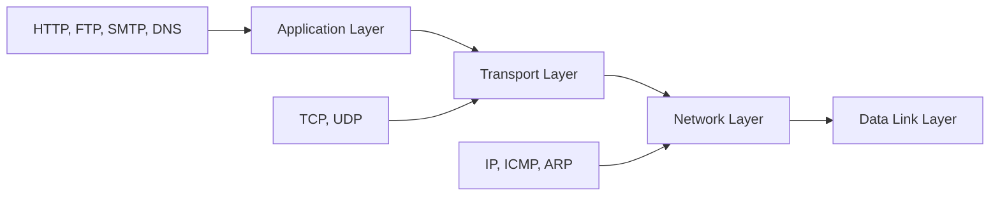
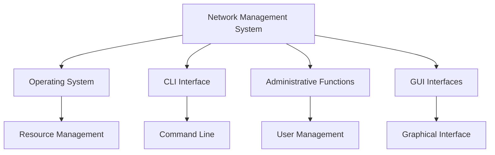
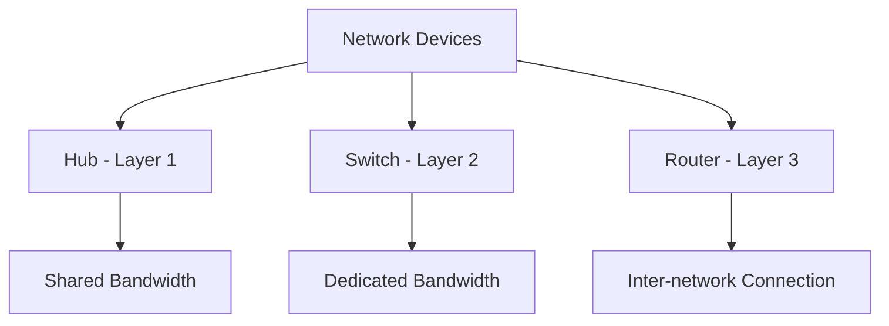
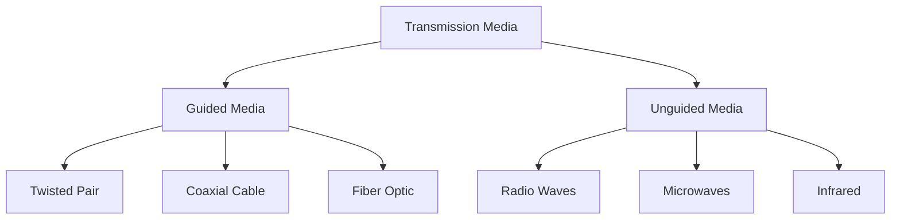
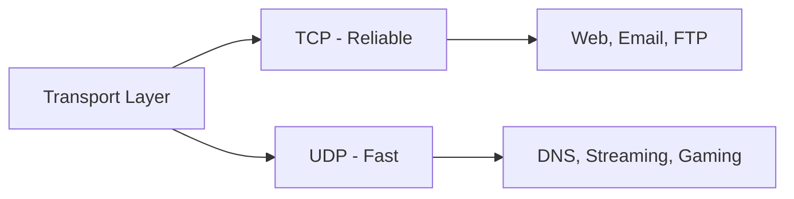
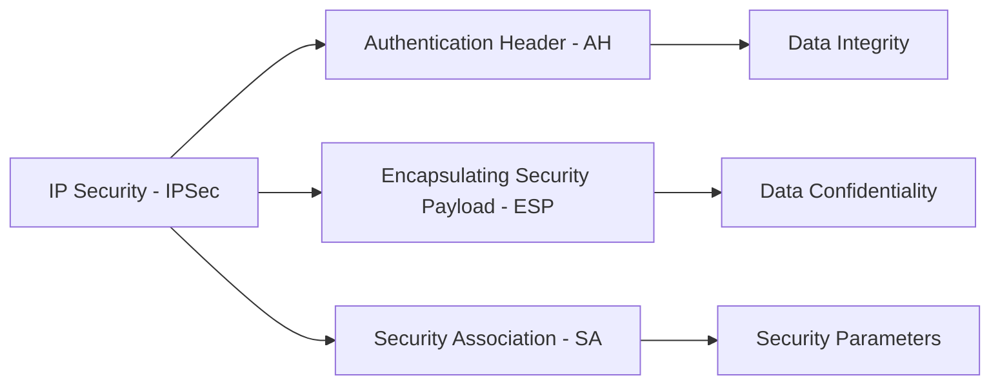
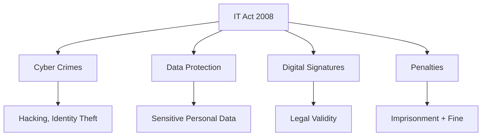

## Question 1(a) [3 marks]

**State different DSL technology and discuss ADSL**

**Answer**:

**DSL Technology Types:**

| DSL Type | Full Name | Speed |
|----------|-----------|-------|
| **ADSL** | Asymmetric DSL | 1-8 Mbps |
| **SDSL** | Symmetric DSL | 768 Kbps |
| **VDSL** | Very high DSL | 52 Mbps |
| **HDSL** | High bit-rate DSL | 1.5 Mbps |

**ADSL Features:**

- **Asymmetric**: Different upload/download speeds
- **Frequency Division**: Uses existing copper telephone lines
- **Download Speed**: Higher than upload speed

**Mnemonic:** "ADSL Downloads Faster"

---

## Question 1(b) [4 marks]

**Describe the network classification of based on Architecture.**

**Answer**:

**Network Architecture Classification:**

| Architecture | Description | Features |
|--------------|-------------|----------|
| **Peer-to-Peer** | All nodes equal | No central server |
| **Client-Server** | Centralized model | Dedicated server |

**Client-Server Advantages:**

- **Centralized Control**: Easy management and security
- **Resource Sharing**: Efficient utilization of resources
- **Scalability**: Can handle more users effectively
- **Data Security**: Better backup and recovery

**P2P Characteristics:**

- **Decentralized**: No single point of failure
- **Cost Effective**: No need for dedicated server

**Mnemonic:** "Client Serves Better"

---

## Question 1(c) [7 marks]

**Draw the diagram of OSI Model and explain in detail with all layers.**

**Answer**:


**OSI Layer Functions:**

| Layer | Function | Examples |
|-------|----------|----------|
| **Application** | User interface | HTTP, FTP, SMTP |
| **Presentation** | Data formatting | Encryption, Compression |
| **Session** | Session management | NetBIOS, RPC |
| **Transport** | End-to-end delivery | TCP, UDP |
| **Network** | Routing | IP, ICMP |
| **Data Link** | Frame delivery | Ethernet, PPP |
| **Physical** | Bit transmission | Cables, Signals |

**Key Features:**

- **Layered Approach**: Each layer serves specific function
- **Standardization**: Universal communication model
- **Troubleshooting**: Easy to identify network problems

**Mnemonic:** "All People Seem To Need Data Processing"

---

## Question 1(c OR) [7 marks]

**Draw the diagram of TCP/IP protocol suite and explain the functions of Application Layer, Transport Layer and Network Layer in detail.**

**Answer**:



**Layer Functions:**

| Layer | Primary Function | Protocols |
|-------|------------------|-----------|
| **Application** | User services | HTTP, FTP, SMTP |
| **Transport** | End-to-end delivery | TCP, UDP |
| **Network** | Routing packets | IP, ICMP |

**Application Layer Functions:**

- **Web Services**: HTTP for web browsing
- **File Transfer**: FTP for file sharing
- **Email**: SMTP for mail delivery

**Transport Layer Functions:**

- **Reliable Delivery**: TCP ensures data integrity
- **Unreliable Delivery**: UDP for fast transmission
- **Port Numbers**: Identify specific applications

**Network Layer Functions:**

- **Logical Addressing**: IP addresses for devices
- **Routing**: Best path selection for packets
- **Fragmentation**: Breaking large packets

**Mnemonic:** "Applications Transport Networks"

---

## Question 2(a) [3 marks]

**Explain WWW.**

**Answer**:

**World Wide Web (WWW):**

| Component | Description |
|-----------|-------------|
| **Web Browser** | Client software |
| **Web Server** | Hosts websites |
| **HTTP** | Communication protocol |
| **URL** | Web address |

**WWW Features:**

- **Hypertext**: Linked documents using HTML
- **Client-Server Model**: Browser requests, server responds
- **Universal Access**: Platform independent

**Components:**

- **HTML**: Markup language for web pages
- **Browser**: Firefox, Chrome, Safari

**Mnemonic:** "Web Works Worldwide"

---

## Question 2(b) [4 marks]

**Explain FDDI and CDDI.**

**Answer**:

**FDDI vs CDDI Comparison:**

| Feature | FDDI | CDDI |
|---------|------|------|
| **Medium** | Fiber optic | Copper wire |
| **Speed** | 100 Mbps | 100 Mbps |
| **Distance** | 200 km | 100 meters |
| **Cost** | High | Low |

**FDDI Features:**

- **Dual Ring Topology**: Primary and secondary rings
- **Token Passing**: Access control method
- **Fault Tolerance**: Self-healing capability

**CDDI Features:**

- **Copper Based**: Uses twisted pair cables
- **Cost Effective**: Cheaper than fiber
- **Limited Distance**: Shorter transmission range

**Applications:**

- **FDDI**: Backbone networks, long distances
- **CDDI**: Local area networks, cost-sensitive environments

**Mnemonic:** "Fiber Fast, Copper Cheap"

---

## Question 2(c) [7 marks]

**Describe a network management system with functions of OS, CLI, Administrative Functions, Interfaces.**

**Answer**:



**Network Management Components:**

| Component | Function | Examples |
|-----------|----------|----------|
| **OS Functions** | Resource management | Process, memory, file management |
| **CLI** | Command interface | Terminal, console commands |
| **Admin Functions** | System control | User accounts, security |
| **Interfaces** | User interaction | GUI, web interface |

**Operating System Functions:**

- **Process Management**: Control running applications
- **Memory Management**: Allocate system resources
- **File System**: Organize and store data

**CLI Functions:**

- **Direct Commands**: Text-based control
- **Scripting**: Automated task execution
- **Remote Access**: SSH, Telnet connections

**Administrative Functions:**

- **User Management**: Create, modify user accounts
- **Security Policies**: Access control, permissions
- **System Monitoring**: Performance tracking

**Interfaces:**

- **GUI**: Graphical user interface for easy navigation
- **Web Interface**: Browser-based management
- **SNMP**: Simple Network Management Protocol

**Mnemonic:** "Operating CLI Administers Interfaces"

---

## Question 2(a OR) [3 marks]

**Compare connection-oriented protocol and connection less protocol.**

**Answer**:

**Protocol Comparison:**

| Feature | Connection-Oriented | Connectionless |
|---------|-------------------|----------------|
| **Setup** | Required | Not required |
| **Reliability** | High | Low |
| **Speed** | Slower | Faster |
| **Example** | TCP | UDP |

**Connection-Oriented Features:**

- **Three-way Handshake**: Establishes connection before data transfer
- **Reliable Delivery**: Guarantees packet delivery and order

**Connectionless Features:**

- **No Setup**: Direct data transmission
- **Best Effort**: No delivery guarantee

**Mnemonic:** "TCP Connects, UDP Delivers"

---

## Question 2(b OR) [4 marks]

**Explain Network device Repeater.**

**Answer**:

**Repeater Functions:**

| Function | Description |
|----------|-------------|
| **Signal Amplification** | Boosts weak signals |
| **Range Extension** | Increases network distance |
| **Noise Reduction** | Cleans signal quality |

```goat
Input Signal    Repeater    Output Signal
     |             |             |
weak ------>  [AMPLIFY] -----> strong
noisy              |          clean
```

**Repeater Characteristics:**

- **Physical Layer Device**: Operates at Layer 1
- **Bit-by-Bit**: Regenerates digital signals
- **No Intelligence**: Cannot filter or route data

**Applications:**

- **LAN Extension**: Extend Ethernet segments
- **Signal Recovery**: Restore degraded signals

**Limitations:**

- **Collision Domain**: Does not segment collisions
- **No Filtering**: Forwards all signals

**Mnemonic:** "Repeater Regenerates Signals"

---

## Question 2(c OR) [7 marks]

**Differentiate between Router, Hub and Switch.**

**Answer**:

**Network Device Comparison:**

| Feature | Hub | Switch | Router |
|---------|-----|--------|--------|
| **OSI Layer** | Physical (1) | Data Link (2) | Network (3) |
| **Collision Domain** | Single | Multiple | Multiple |
| **Broadcast Domain** | Single | Single | Multiple |
| **Intelligence** | None | MAC learning | IP routing |
| **Full Duplex** | No | Yes | Yes |



**Hub Characteristics:**

- **Shared Medium**: All ports share bandwidth
- **Half Duplex**: Cannot send and receive simultaneously
- **Collision Prone**: Single collision domain

**Switch Characteristics:**

- **MAC Address Table**: Learns device locations
- **Full Duplex**: Simultaneous send/receive
- **VLAN Support**: Virtual network segmentation

**Router Characteristics:**

- **IP Routing**: Forwards packets between networks
- **Routing Table**: Maintains network topology
- **NAT Support**: Network Address Translation

**Applications:**

- **Hub**: Legacy networks (mostly obsolete)
- **Switch**: LAN connectivity, VLAN implementation
- **Router**: Internet connectivity, WAN connections

**Mnemonic:** "Hub Shares, Switch Switches, Router Routes"

---

## Question 3(a) [3 marks]

**Draw neat diagram of UTP, Coaxial and Fiber optic cable**

**Answer**:

```goat
UTP Cable:
   +-- Plastic Jacket
   |   +-- Twisted Pairs
   |   |
   +---+===+  +===+
       |   |  |   |
       +---+  +---+

Coaxial Cable:
   +-- Outer Jacket
   |   +-- Shield
   |   |   +-- Dielectric
   |   |   |   +-- Center Conductor
   +---+---+---+===+
       |   |   |
       +---+---+

Fiber Optic Cable:
   +-- Outer Jacket
   |   +-- Strength Member
   |   |   +-- Cladding
   |   |   |   +-- Core
   +---+---+---+===+
       |   |   |
       +---+---+
```

**Cable Characteristics:**

| Cable Type | Core Material | Bandwidth |
|------------|---------------|-----------|
| **UTP** | Copper wire | 100 MHz |
| **Coaxial** | Copper conductor | 1 GHz |
| **Fiber Optic** | Glass/Plastic | Very high |

**Mnemonic:** "Twisted Copper Glass"

---

## Question 3(b) [4 marks]

**Differentiate switching circuit and packet switching circuit.**

**Answer**:

**Switching Methods Comparison:**

| Feature | Circuit Switching | Packet Switching |
|---------|------------------|------------------|
| **Path** | Dedicated | Shared |
| **Setup Time** | Required | Not required |
| **Bandwidth** | Fixed | Variable |
| **Example** | Telephone | Internet |

**Circuit Switching Features:**

- **Dedicated Path**: Exclusive connection between communicating parties
- **Constant Bandwidth**: Fixed data rate throughout communication
- **Setup Phase**: Connection established before data transfer

**Packet Switching Features:**

- **Store and Forward**: Packets stored at intermediate nodes
- **Dynamic Routing**: Different paths for different packets
- **Resource Sharing**: Multiple users share network resources

**Advantages:**

- **Circuit**: Guaranteed bandwidth, low latency
- **Packet**: Efficient resource utilization, fault tolerance

**Mnemonic:** "Circuit Connects, Packet Shares"

---

## Question 3(c) [7 marks]

**Describe unguided media and guided media.**

**Answer**:

**Transmission Media Classification:**



**Guided Media Characteristics:**

| Type | Material | Distance | Cost |
|------|----------|----------|------|
| **Twisted Pair** | Copper | 100m | Low |
| **Coaxial** | Copper + Shield | 500m | Medium |
| **Fiber Optic** | Glass | 2km+ | High |

**Unguided Media Characteristics:**

| Type | Frequency | Range | Application |
|------|-----------|-------|-------------|
| **Radio Waves** | 3KHz-1GHz | Long | AM/FM Radio |
| **Microwaves** | 1GHz-300GHz | Line of sight | Satellite |
| **Infrared** | 300GHz-400THz | Short | Remote control |

**Guided Media Advantages:**

- **Security**: Physical protection from interference
- **Reliability**: Stable signal transmission
- **High Bandwidth**: Greater data capacity

**Unguided Media Advantages:**

- **Mobility**: Wireless connectivity
- **Coverage**: Wide area reach
- **Installation**: No physical cabling required

**Applications:**

- **Guided**: LAN, backbone networks, high-speed connections
- **Unguided**: Mobile networks, satellite communication, WiFi

**Mnemonic:** "Guided Wires, Unguided Airs"

---

## Question 3(a OR) [3 marks]

**Discuss various connectors used in Computer Networks.**

**Answer**:

**Network Connectors:**

| Connector | Cable Type | Application |
|-----------|------------|-------------|
| **RJ-45** | UTP/STP | Ethernet |
| **BNC** | Coaxial | Legacy networks |
| **SC/ST** | Fiber optic | High-speed networks |

**Connector Features:**

- **RJ-45**: 8-pin modular connector for twisted pair
- **BNC**: Bayonet connector for coaxial cables
- **SC/ST**: Push-pull and twist-lock fiber connectors

**Mnemonic:** "RJ BNC Fiber Connect"

---

## Question 3(b OR) [4 marks]

**Explain IP addressing scheme with examples.**

**Answer**:

**IP Address Classes:**

| Class | Range | Default Mask | Example |
|-------|-------|--------------|---------|
| **A** | 1-126 | /8 | 10.0.0.1 |
| **B** | 128-191 | /16 | 172.16.0.1 |
| **C** | 192-223 | /24 | 192.168.1.1 |

**IP Address Structure:**

- **Network Part**: Identifies the network
- **Host Part**: Identifies the device
- **Subnet Mask**: Separates network and host portions

**Special Addresses:**

- **Loopback**: 127.0.0.1 (localhost)
- **Private**: 10.x.x.x, 172.16.x.x, 192.168.x.x
- **Broadcast**: All host bits set to 1

**Example Calculation:**
IP: 192.168.1.100/24

- Network: 192.168.1.0
- Broadcast: 192.168.1.255

**Mnemonic:** "A Big Class Networks"

---

## Question 3(c OR) [7 marks]

**Differentiate between IPv4 and IPv6.**

**Answer**:

**IPv4 vs IPv6 Comparison:**

| Feature | IPv4 | IPv6 |
|---------|------|------|
| **Address Length** | 32 bits | 128 bits |
| **Address Format** | Decimal | Hexadecimal |
| **Address Space** | 4.3 billion | 340 undecillion |
| **Header Size** | 20-60 bytes | 40 bytes |
| **Fragmentation** | Router/Host | Host only |
| **Security** | Optional | Built-in |

**IPv4 Characteristics:**

- **Address Example**: 192.168.1.1
- **Dotted Decimal**: Four octets separated by dots
- **Classes**: A, B, C, D, E addressing scheme
- **NAT Required**: Due to address exhaustion

**IPv6 Characteristics:**

- **Address Example**: 2001:0db8:85a3::8a2e:0370:7334
- **Colon Notation**: Eight groups of hexadecimal digits
- **No Classes**: Hierarchical addressing
- **Auto-configuration**: Stateless address configuration

**IPv6 Advantages:**

- **Larger Address Space**: Eliminates address exhaustion
- **Simplified Header**: Improved processing efficiency
- **Built-in Security**: IPSec mandatory
- **Better QoS**: Flow labeling for traffic prioritization

**Migration Strategies:**

- **Dual Stack**: Run both IPv4 and IPv6
- **Tunneling**: Encapsulate IPv6 in IPv4
- **Translation**: Convert between protocols

**Mnemonic:** "IPv6 Has More Addresses"

---

## Question 4(a) [3 marks]

**Explain File Transfer Protocol.**

**Answer**:

**FTP Characteristics:**

| Feature | Description |
|---------|-------------|
| **Port Numbers** | 20 (data), 21 (control) |
| **Protocol** | TCP-based |
| **Authentication** | Username/password |

**FTP Operations:**

- **Upload**: PUT command transfers files to server
- **Download**: GET command retrieves files from server
- **Directory**: LIST command shows file listings

**FTP Modes:**

- **Active Mode**: Server initiates data connection
- **Passive Mode**: Client initiates data connection

**Mnemonic:** "FTP Transfers Files"

---

## Question 4(b) [4 marks]

**Write note on DNS.**

**Answer**:

**Domain Name System (DNS):**

| Component | Function |
|-----------|----------|
| **DNS Server** | Resolves domain names |
| **DNS Cache** | Stores recent lookups |
| **DNS Records** | Maps names to addresses |

**DNS Hierarchy:**

- **Root Domain**: Top-level (.)
- **Top-Level Domain**: .com, .org, .net
- **Second-Level Domain**: google.com
- **Subdomain**: www.google.com

**DNS Records:**

- **A Record**: Maps domain to IPv4 address
- **AAAA Record**: Maps domain to IPv6 address
- **CNAME**: Canonical name alias
- **MX**: Mail exchange server

**DNS Resolution Process:**

1. **Local Cache**: Check browser cache
2. **Recursive Query**: Contact DNS resolver
3. **Iterative Query**: Query authoritative servers

**Mnemonic:** "DNS Names Servers"

---

## Question 4(c) [7 marks]

**Explain Electronic Mail.**

**Answer**:


**Email System Components:**

| Component | Function | Protocol |
|-----------|----------|----------|
| **User Agent** | Email client | Outlook, Gmail |
| **Mail Server** | Store/forward | SMTP, POP3, IMAP |
| **Message Transfer** | Delivery | SMTP |

**Email Protocols:**

| Protocol | Purpose | Port |
|----------|---------|------|
| **SMTP** | Send mail | 25 |
| **POP3** | Retrieve mail | 110 |
| **IMAP** | Access mail | 143 |

**Email Message Format:**

- **Header**: To, From, Subject, Date
- **Body**: Message content
- **Attachments**: Binary files

**SMTP vs POP3 vs IMAP:**

- **SMTP**: Outgoing mail protocol
- **POP3**: Downloads mail to local device
- **IMAP**: Synchronizes mail across devices

**Email Process:**

1. **Compose**: User creates message
2. **Send**: SMTP transfers to server
3. **Route**: Internet routing to destination
4. **Deliver**: Store in recipient mailbox
5. **Retrieve**: POP3/IMAP download to client

**Security Features:**

- **Encryption**: Secure mail transmission
- **Authentication**: Verify sender identity
- **Spam Filtering**: Block unwanted mail

**Mnemonic:** "SMTP Sends, POP3 Picks, IMAP Integrates"

---

## Question 4(a OR) [3 marks]

**Explain Web browser.**

**Answer**:

**Web Browser Functions:**

| Function | Description |
|----------|-------------|
| **HTTP Client** | Requests web pages |
| **HTML Renderer** | Displays web content |
| **JavaScript Engine** | Executes scripts |

**Browser Components:**

- **User Interface**: Address bar, bookmarks, navigation
- **Rendering Engine**: HTML/CSS interpretation
- **Networking**: HTTP/HTTPS communication

**Popular Browsers:**

- **Chrome**: Google's browser
- **Firefox**: Mozilla's browser
- **Safari**: Apple's browser

**Mnemonic:** "Browser Renders Web"

---

## Question 4(b OR) [4 marks]

**Explain Mail Protocols.**

**Answer**:

**Email Protocol Comparison:**

| Protocol | Type | Function | Port |
|----------|------|----------|------|
| **SMTP** | Outgoing | Send mail | 25 |
| **POP3** | Incoming | Download mail | 110 |
| **IMAP** | Incoming | Sync mail | 143 |

**SMTP Features:**

- **Push Protocol**: Sender initiates transfer
- **Store and Forward**: Intermediate mail servers
- **Text-based**: ASCII command protocol

**POP3 Features:**

- **Download and Delete**: Mail removed from server
- **Offline Access**: Local mail storage
- **Single Device**: Not suitable for multiple devices

**IMAP Features:**

- **Server Storage**: Mail remains on server
- **Multi-device**: Access from multiple clients
- **Folder Sync**: Server-client synchronization

**Mnemonic:** "SMTP Sends, POP3 Pulls, IMAP Integrates"

---

## Question 4(c OR) [7 marks]

**Describe TCP and UDP protocols.**

**Answer**:

**TCP vs UDP Comparison:**

| Feature | TCP | UDP |
|---------|-----|-----|
| **Connection** | Connection-oriented | Connectionless |
| **Reliability** | Reliable | Unreliable |
| **Speed** | Slower | Faster |
| **Header Size** | 20 bytes | 8 bytes |
| **Flow Control** | Yes | No |
| **Error Control** | Yes | No |



**TCP Features:**

- **Three-way Handshake**: SYN, SYN-ACK, ACK
- **Sequence Numbers**: Ordered packet delivery
- **Acknowledgments**: Confirms packet receipt
- **Flow Control**: Prevents buffer overflow
- **Congestion Control**: Manages network traffic

**UDP Features:**

- **Stateless**: No connection state maintained
- **Best Effort**: No delivery guarantee
- **Low Overhead**: Minimal header information
- **Broadcast Support**: One-to-many communication

**TCP Applications:**

- **Web Browsing**: HTTP/HTTPS
- **Email**: SMTP, POP3, IMAP
- **File Transfer**: FTP

**UDP Applications:**

- **DNS Queries**: Domain name resolution
- **Streaming**: Video/audio transmission
- **Gaming**: Real-time applications

**TCP Header Fields:**

- **Source/Destination Port**: Application identification
- **Sequence Number**: Packet ordering
- **Window Size**: Flow control

**UDP Header Fields:**

- **Source/Destination Port**: Application identification
- **Length**: Datagram size
- **Checksum**: Error detection

**Mnemonic:** "TCP Tries Carefully, UDP Unleashes Data"

---

## Question 5(a) [3 marks]

**Describe Network device Bridge.**

**Answer**:

**Bridge Characteristics:**

| Feature | Description |
|---------|-------------|
| **OSI Layer** | Data Link (Layer 2) |
| **Function** | Segment collision domains |
| **Learning** | MAC address table |

**Bridge Operations:**

- **Learning**: Records MAC addresses from frames
- **Filtering**: Forwards frames only when necessary
- **Forwarding**: Sends frames to appropriate segment

**Bridge Types:**

- **Transparent Bridge**: Automatic learning
- **Source Routing**: Path specified in frame

**Mnemonic:** "Bridge Breaks Collisions"

---

## Question 5(b) [4 marks]

**Explain Social issues and Hacking also discuss its precautions.**

**Answer**:

**Social Issues in Networks:**

| Issue | Impact |
|-------|--------|
| **Digital Divide** | Unequal access to technology |
| **Privacy Concerns** | Personal data misuse |
| **Cyberbullying** | Online harassment |

**Hacking Types:**

- **White Hat**: Ethical hacking for security testing
- **Black Hat**: Malicious hacking for illegal gain
- **Gray Hat**: Between ethical and malicious

**Precautions:**

- **Strong Passwords**: Use complex, unique passwords
- **Software Updates**: Keep systems patched
- **Firewall**: Block unauthorized access
- **Antivirus**: Detect and remove malware

**Security Measures:**

- **Education**: User awareness training
- **Backup**: Regular data backup
- **Monitoring**: Network traffic analysis

**Mnemonic:** "Secure Systems Save Societies"

---

## Question 5(c) [7 marks]

**Explain IP Security in detail.**

**Answer**:



**IPSec Components:**

| Component | Function | Security Service |
|-----------|----------|------------------|
| **AH** | Authentication Header | Data integrity, authentication |
| **ESP** | Encapsulating Security Payload | Confidentiality, integrity |
| **SA** | Security Association | Security parameters |

**IPSec Modes:**

| Mode | Description | Usage |
|------|-------------|-------|
| **Transport** | Protects payload only | Host-to-host |
| **Tunnel** | Protects entire packet | Network-to-network |

**IPSec Protocols:**

- **IKE**: Internet Key Exchange for key management
- **ISAKMP**: Internet Security Association and Key Management
- **DES/3DES/AES**: Encryption algorithms

**Security Services:**

- **Authentication**: Verify sender identity
- **Integrity**: Ensure data not modified
- **Confidentiality**: Encrypt data content
- **Non-repudiation**: Prevent denial of sending

**IPSec Process:**

1. **Policy Definition**: Define security requirements
2. **Key Exchange**: Establish shared keys using IKE
3. **SA Establishment**: Create security association
4. **Data Protection**: Apply AH/ESP to packets
5. **Transmission**: Send protected packets

**Applications:**

- **VPN**: Virtual Private Networks
- **Remote Access**: Secure remote connections
- **Site-to-Site**: Connect branch offices

**Benefits:**

- **Transparent Security**: Works at network layer
- **Strong Authentication**: Cryptographic verification
- **Flexible Implementation**: Multiple algorithms supported

**Mnemonic:** "IPSec Authenticates, Encrypts, Secures"

---

## Question 5(a OR) [3 marks]

**Explain wireless LAN.**

**Answer**:

**Wireless LAN Characteristics:**

| Feature | Description |
|---------|-------------|
| **Standard** | IEEE 802.11 |
| **Frequency** | 2.4 GHz, 5 GHz |
| **Access Method** | CSMA/CA |

**WLAN Components:**

- **Access Point**: Central wireless hub
- **Wireless Clients**: Laptops, phones, tablets
- **SSID**: Network identifier

**WLAN Standards:**

- **802.11a**: 54 Mbps, 5 GHz
- **802.11g**: 54 Mbps, 2.4 GHz
- **802.11n**: 600 Mbps, MIMO

**Mnemonic:** "Wireless Waves Work"

---

## Question 5(b OR) [4 marks]

**Differentiate between symmetric and asymmetric encryption algorithms**

**Answer**:

**Encryption Algorithm Comparison:**

| Feature | Symmetric | Asymmetric |
|---------|-----------|------------|
| **Keys** | Single shared key | Key pair (public/private) |
| **Speed** | Fast | Slow |
| **Key Distribution** | Difficult | Easy |
| **Example** | AES, DES | RSA, ECC |

**Symmetric Encryption:**

- **Same Key**: Encryption and decryption use same key
- **Faster Processing**: Efficient for large data
- **Key Management**: Challenge in key distribution

**Asymmetric Encryption:**

- **Key Pair**: Public key encrypts, private key decrypts
- **Digital Signatures**: Non-repudiation support
- **Secure Communication**: No prior key exchange needed

**Applications:**

- **Symmetric**: Bulk data encryption, disk encryption
- **Asymmetric**: Key exchange, digital certificates

**Mnemonic:** "Symmetric Same, Asymmetric Pair"

---

## Question 5(c OR) [7 marks]

**Briefly describe the Information Technology (Amendment) Act, 2008, and its impact on cyber laws in India.**

**Answer**:

**IT Act 2008 Key Provisions:**

| Section | Offense | Penalty |
|---------|---------|---------|
| **66** | Computer hacking | 3 years imprisonment |
| **66A** | Offensive messages | 3 years + fine |
| **66B** | Identity theft | 3 years + fine |
| **66C** | Password theft | 3 years + fine |
| **66D** | Cheating using computer | 3 years + fine |



**Major Amendments:**

| Amendment | Description | Impact |
|-----------|-------------|--------|
| **Section 66A** | Offensive content online | Criminalized cyber bullying |
| **Section 69** | Government interception | Monitoring powers |
| **Section 79** | Intermediary liability | Platform responsibilities |

**Key Features:**

- **Extraterritorial Jurisdiction**: Applies to offenses outside India affecting Indian computers
- **Cyber Appellate Tribunal**: Specialized adjudication body
- **Compensation**: Damages up to ₹5 crore for data breach

**Data Protection Provisions:**

- **Sensitive Personal Data**: Special protection for financial, health data
- **Reasonable Security**: Organizations must implement adequate measures
- **Breach Notification**: Mandatory reporting of security incidents

**Digital Signature Framework:**

- **Legal Validity**: Electronic signatures legally recognized
- **Certification Authority**: Licensed bodies issue digital certificates
- **Non-repudiation**: Prevents denial of electronic transactions

**Cybercrime Categories:**

- **Computer Related Offenses**: Unauthorized access, data theft
- **Communication Offenses**: Obscene content, cyber stalking
- **Identity Crimes**: Impersonation, fraud

**Law Enforcement Powers:**

- **Search and Seizure**: Authority to examine computer systems
- **Preservation Orders**: Require data retention for investigation
- **Blocking Orders**: Remove offensive content from internet

**Industry Impact:**

- **Compliance Requirements**: Organizations must adopt security measures
- **Liability Framework**: Clear responsibilities for service providers
- **Business Process**: Legal framework for e-commerce, digital transactions

**Challenges:**

- **Technology Gap**: Law struggles to keep pace with technology
- **Jurisdiction Issues**: Cross-border cybercrime investigation
- **Privacy Concerns**: Balance between security and individual rights

**Recent Developments:**

- **Personal Data Protection Bill**: Comprehensive privacy legislation
- **Cybersecurity Framework**: National cyber security strategy
- **Digital India**: Government digitization initiatives

**Mnemonic:** "IT Act Protects Digital India"
