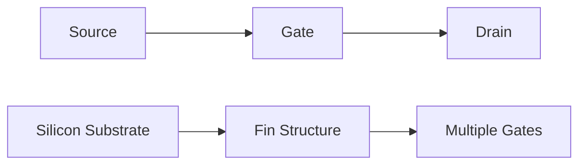
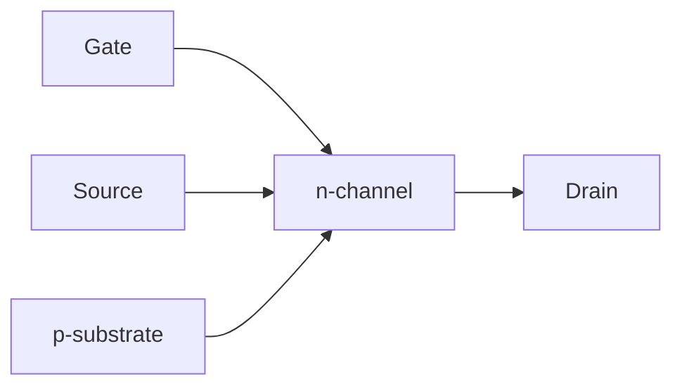
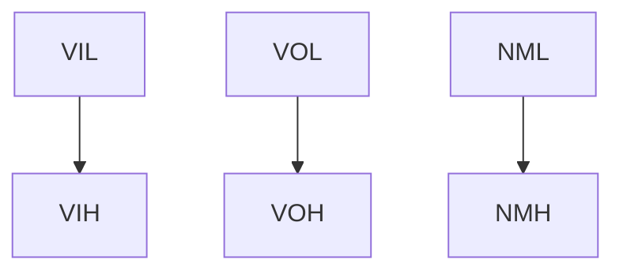
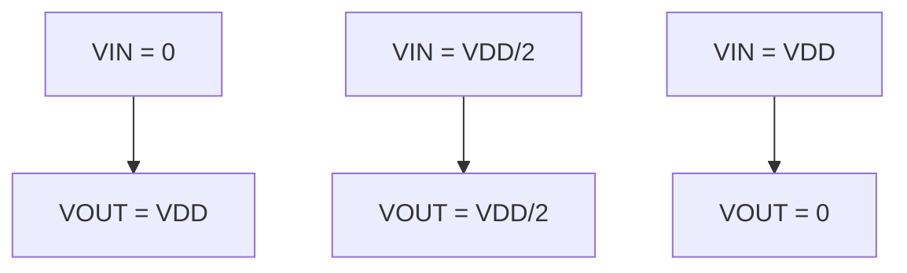
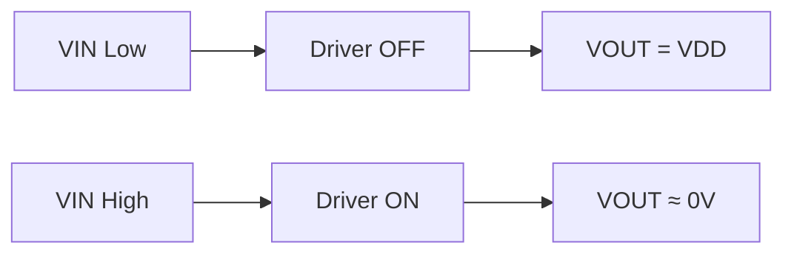
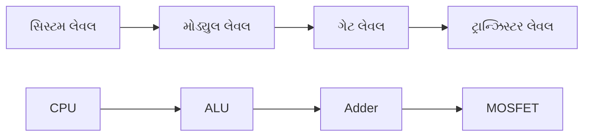
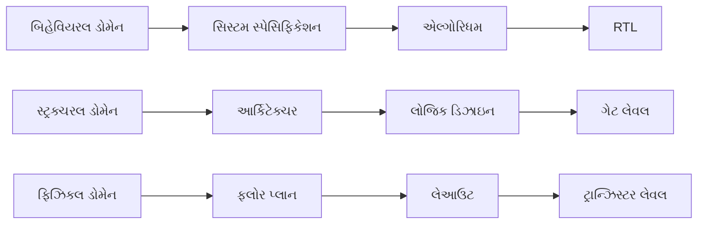
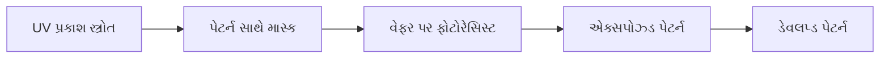
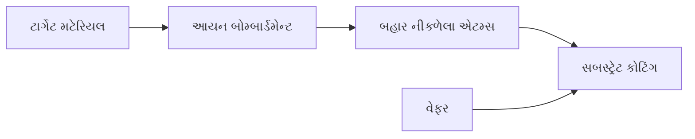

## પ્રશ્ન 1(અ) [3 ગુણ]

**FinFET ની રચના દોરો અને તેના ફાયદા લખો.**

**જવાબ:**



**કોષ્ટક: FinFET ના ફાયદા**

| ફાયદો | વર્ણન |
|--------|--------|
| **બેહતર નિયંત્રણ** | ગુણાકાર gates બહેતર channel control આપે છે |
| **ઘટાડેલ લીકેજ** | 3D રચનાના કારણે ઓછું off-state current |
| **સુધારેલ કામગીરી** | વધુ drive current અને ઝડપી switching |

**યાદાશ્ત ટેકનિક:** "BCR - Better Control Reduces leakage"

---

## પ્રશ્ન 1(બ) [4 ગુણ]

**એક્સટર્નલ બાયઝ હેઠળ MOS રચનાનું ડેપ્લીશન અને ઇનવર્શન સમજાવો**

**જવાબ:**

**કોષ્ટક: MOS બાયઝ પરિસ્થિતિઓ**

| બાયઝ પ્રકાર | ગેટ વોલ્ટેજ | ચેનલ સ્થિતિ | ચાર્જ કેરિયર્સ |
|-------------|-------------|-------------|---------------|
| **ડેપ્લીશન** | થોડું પોઝિટિવ | Depleted | Holes દૂર ધકેલાય છે |
| **ઇનવર્શન** | વધુ પોઝિટિવ | Inverted | Electrons આકર્ષાય છે |

**ડાયાગ્રામ:**

```goat
VG > 0 (Depletion)        VG >> 0 (Inversion)
    +                         +
   Gate                      Gate
   ----                      ----
    -                         -
   Depletion                Electron
   Region                   Channel
   --------                 --------
   p-substrate              p-substrate
```

- **ડેપ્લીશન**: પોઝિટિવ ગેટ વોલ્ટેજ electric field બનાવે છે જે holes ને દૂર ધકેલે છે
- **ઇનવર્શન**: વધુ વોલ્ટેજ electrons ને આકર્ષે છે અને conducting channel બનાવે છે

**યાદાશ્ત ટેકનિક:** "DI - Depletion Inverts to conducting channel"

---

## પ્રશ્ન 1(ક) [7 ગુણ]

**n-ચેનલ MOSFET ને તેની કરંટ-વોલ્ટેજ લાક્ષણિકતાઓની મદદથી સમજાવો.**

**જવાબ:**

**કોષ્ટક: MOSFET ઓપરેટિંગ વિભાગો**

| વિભાગ | શરત | ડ્રેઇન કરંટ | લાક્ષણિકતાઓ |
|-------|-----|------------|-------------|
| **કટ-ઓફ** | VGS < VTH | ID ≈ 0 | કોઈ conduction નથી |
| **લિનિયર** | VDS < VGS-VTH | ID ∝ VDS | Resistive વર્તન |
| **સેચ્યુરેશન** | VDS ≥ VGS-VTH | ID ∝ (VGS-VTH)² | કરંટ VDS પર આધારિત નથી |



**મુખ્ય સમીકરણો:**

- Linear: ID = μnCox(W/L)[(VGS-VTH)VDS - VDS²/2]
- Saturation: ID = (μnCox/2)(W/L)(VGS-VTH)²

- **રચના**: ગેટ source અને drain વચ્ચે channel ને નિયંત્રિત કરે છે
- **કામગીરી**: ગેટ વોલ્ટેજ channel conductivity ને modulate કરે છે
- **ઉપયોગો**: ડિજિટલ switching અને analog amplification

**યાદાશ્ત ટેકનિક:** "CLS - Cut-off, Linear, Saturation regions"

---

## પ્રશ્ન 1(ક OR) [7 ગુણ]

**સ્કેલિંગ વ્યાખ્યાયિત કરો. full voltage સ્કેલિંગ સાથે constant voltage સ્કેલિંગની તુલના કરો. સ્કેલિંગના ગેરફાયદા લખો.**

**જવાબ:**

**વ્યાખ્યા:** સ્કેલિંગ એ ડેન્સિટી અને performance વધારવા માટે device dimensions ઘટાડવાની પ્રક્રિયા છે.

**કોષ્ટક: સ્કેલિંગ તુલના**

| પેરામીટર | Full Voltage Scaling | Constant Voltage Scaling |
|----------|---------------------|-------------------------|
| **વોલ્ટેજ** | α દ્વારા ઘટાડાય છે | સ્થિર રહે છે |
| **પાવર ડેન્સિટી** | સ્થિર | α દ્વારા વધે છે |
| **ઇલેક્ટ્રિક ફિલ્ડ** | સ્થિર | α દ્વારા વધે છે |
| **પરફોર્મન્સ** | બેહતર | મધ્યમ સુધારો |

**ગેરફાયદા:**

- **શોર્ટ ચેનલ ઇફેક્ટ્સ**: ચેનલ લેન્થ modulation વધે છે
- **હોટ કેરિયર ઇફેક્ટ્સ**: વધુ electric fields devices ને નુકસાન કરે છે
- **ક્વોન્ટમ ઇફેક્ટ્સ**: ટનલિંગ currents નોંધપાત્ર રીતે વધે છે

**યાદાશ્ત ટેકનિક:** "SHQ - Short channel, Hot carriers, Quantum effects"

---

## પ્રશ્ન 2(અ) [3 ગુણ]

**CMOS ની મદદથી બે ઇનપુટ NAND ગેટ દોરો.**

**જવાબ:**

```goat
    VDD
     |
   ┌─┴─┐ pMOS
A──┤   ├──┐
   └───┘  │
          │ Y
   ┌─────┐ │
B──┤     ├─┘
   └─┬─┬─┘ pMOS
     │ │
   ┌─┴─┐ nMOS
A──┤   ├──┐
   └───┘  │
          │
   ┌─────┐ │
B──┤     ├─┘
   └─┬─┬─┘ nMOS
     │ │
    GND
```

**કોષ્ટક: NAND સત્ય કોષ્ટક**

| A | B | Y |
|---|---|---|
| 0 | 0 | 1 |
| 0 | 1 | 1 |
| 1 | 0 | 1 |
| 1 | 1 | 0 |

**યાદાશ્ત ટેકનિક:** "PP-SS: Parallel PMOS, Series NMOS"

---

## પ્રશ્ન 2(બ) [4 ગુણ]

**nMOS ઇન્વર્ટર માટે નોઇઝ ઇમ્યુનિટી અને નોઇઝ માર્જિન સમજાવો.**

**જવાબ:**

**કોષ્ટક: નોઇઝ પેરામીટર્સ**

| પેરામીટર | વ્યાખ્યા | ફોર્મ્યુલા |
|----------|---------|----------|
| **NMH** | હાઇ નોઇઝ માર્જિન | VOH - VIH |
| **NML** | લો નોઇઝ માર્જિન | VIL - VOL |
| **નોઇઝ ઇમ્યુનિટી** | નોઇઝ રિજેક્ટ કરવાની ક્ષમતા | Min(NMH, NML) |



- **VIL**: મહત્તમ લો ઇનપુટ વોલ્ટેજ
- **VIH**: લઘુત્તમ હાઇ ઇનપુટ વોલ્ટેજ
- **સારી નોઇઝ ઇમ્યુનિટી**: મોટા નોઇઝ માર્જિન ખોટી switching ને રોકે છે

**યાદાશ્ત ટેકનિક:** "HILOL - High/Low Input/Output Levels"

---

## પ્રશ્ન 2(ક) [7 ગુણ]

**CMOS ઇન્વર્ટરની વોલ્ટેજ ટ્રાન્સફર લાક્ષણિકતાઓ (VTC) સમજાવો.**

**જવાબ:**

**કોષ્ટક: VTC વિભાગો**

| વિભાગ | ઇનપુટ રેન્જ | આઉટપુટ | ટ્રાન્ઝિસ્ટર સ્થિતિઓ |
|-------|------------|--------|---------------------|
| **A** | 0 to VTN | VDD | pMOS ON, nMOS OFF |
| **B** | VTN to VDD/2 | ટ્રાન્ઝિશન | બંને આંશિક રીતે ON |
| **C** | VDD/2 to VDD-\|VTP\| | ટ્રાન્ઝિશન | બંને આંશિક રીતે ON |
| **D** | VDD-\|VTP\| to VDD | 0V | pMOS OFF, nMOS ON |



**મુખ્ય લક્ષણો:**

- **તીક્ષ્ણ ટ્રાન્ઝિશન**: આદર્શ switching વર્તન
- **હાઇ ગેઇન**: ટ્રાન્ઝિશન વિભાગમાં મોટો slope
- **રેઇલ-ટુ-રેઇલ**: આઉટપુટ સંપૂર્ણ સપ્લાય રેન્જમાં swing કરે છે

**યાદાશ્ત ટેકનિક:** "ASH - A-region, Sharp transition, High gain"

---

## પ્રશ્ન 2(અ OR) [3 ગુણ]

**ડિપ્લીશન લોડ nMOS નો ઉપયોગ કરીને NOR2 ગેટનો અમલ કરો.**

**જવાબ:**

```goat
    VDD
     |
   ┌─┴─┐ Depletion Load
   │   │ (VGS = 0)
   └─┬─┘
     │ Y
   ┌─┴─┐ nMOS
A──┤   ├──┐
   └───┘  │
          │
   ┌─────┐ │
B──┤     ├─┘
   └─┬─┬─┘ nMOS
     │ │
    GND
```

**કોષ્ટક: NOR2 સત્ય કોષ્ટક**

| A | B | Y |
|---|---|---|
| 0 | 0 | 1 |
| 0 | 1 | 0 |
| 1 | 0 | 0 |
| 1 | 1 | 0 |

**યાદાશ્ત ટેકનિક:** "DPN - Depletion load, Parallel NMOS"

---

## પ્રશ્ન 2(બ OR) [4 ગુણ]

**એન્હાન્સમેન્ટ લોડ ઇન્વર્ટર અને ડિપ્લીશન લોડ ઇન્વર્ટર વચ્ચે તફાવત શોધો.**

**જવાબ:**

**કોષ્ટક: લોડ ઇન્વર્ટર તુલના**

| પેરામીટર | એન્હાન્સમેન્ટ લોડ | ડિપ્લીશન લોડ |
|----------|------------------|---------------|
| **થ્રેશોલ્ડ વોલ્ટેજ** | VT > 0 | VT < 0 |
| **ગેટ કનેક્શન** | VGS = VDS | VGS = 0 |
| **લોજિક હાઇ** | VDD - VT | VDD |
| **પાવર કન્ઝમ્પશન** | વધુ | ઓછું |
| **સ્વિચિંગ સ્પીડ** | ધીમું | ઝડપી |

- **એન્હાન્સમેન્ટ**: conduction માટે પોઝિટિવ ગેટ વોલ્ટેજની જરૂર
- **ડિપ્લીશન**: ઝીરો ગેટ વોલ્ટેજ સાથે conduct કરે છે
- **પરફોર્મન્સ**: ડિપ્લીશન લોડ બેહતર લાક્ષણિકતાઓ આપે છે

**યાદાશ્ત ટેકનિક:** "EPDLH - Enhancement Positive, Depletion Lower power, Higher speed"

---

## પ્રશ્ન 2(ક OR) [7 ગુણ]

**ડિપ્લીશન લોડ nMOS ઇન્વર્ટરને તેના VTC સાથે સમજાવો.**

**જવાબ:**

**સર્કિટ ઓપરેશન:**

- **લોડ ટ્રાન્ઝિસ્ટર**: હંમેશા conducting (VGS = 0, VT < 0)
- **ડ્રાઇવર ટ્રાન્ઝિસ્ટર**: ઇનપુટ વોલ્ટેજ દ્વારા નિયંત્રિત
- **આઉટપુટ**: વોલ્ટેજ ડિવાઇડર એક્શન દ્વારા નક્કી થાય છે



**કોષ્ટક: ઓપરેટિંગ પોઇન્ટ્સ**

| ઇનપુટ સ્થિતિ | ડ્રાઇવર | લોડ | આઉટપુટ |
|-------------|--------|-----|--------|
| **VIN = 0** | OFF | ON | VDD |
| **VIN = VDD** | ON | ON | ≈ 0V |

**VTC લાક્ષણિકતાઓ:**

- **VOH**: VDD (એન્હાન્સમેન્ટ લોડ કરતાં બેહતર)
- **VOL**: ડિપ્લીશન લોડ લાક્ષણિકતાઓના કારણે ઓછું
- **ટ્રાન્ઝિશન**: સ્થિતિઓ વચ્ચે તીક્ષ્ણ switching

**યાદાશ્ત ટેકનિક:** "DLB - Depletion Load gives Better high output"

---

## પ્રશ્ન 3(અ) [3 ગુણ]

**ડિપ્લીશન લોડ nMOS નો ઉપયોગ કરીને EX-OR નો અમલ કરો.**

**જવાબ:**

```goat
    VDD      VDD
     |        |
   ┌─┴─┐    ┌─┴─┐  Depletion
   │   │    │   │  Loads
   └─┬─┘    └─┬─┘
     │        │
A────┼────────┼────B
     │        │
   ┌─┴─┐    ┌─┴─┐
   │   │    │   │  nMOS
   └─┬─┘    └─┬─┘
     │        │
    A'       B'
     │        │
     └────┬───┘ Y
          │
         GND
```

**કોષ્ટક: XOR સત્ય કોષ્ટક**

| A | B | Y |
|---|---|---|
| 0 | 0 | 0 |
| 0 | 1 | 1 |
| 1 | 0 | 1 |
| 1 | 1 | 0 |

**અમલીકરણ**: Y = A⊕B = A'B + AB'

**યાદાશ્ત ટેકનિક:** "XOR - eXclusive OR, અલગ inputs 1 આપે છે"

---

## પ્રશ્ન 3(બ) [4 ગુણ]

**ડિઝાઇન હાઇરાર્કીને ઉદાહરણ સાથે સમજાવો.**

**જવાબ:**

**કોષ્ટક: હાઇરાર્કી લેવલ્સ**

| લેવલ | કમ્પોનન્ટ | ઉદાહરણ |
|------|----------|---------|
| **સિસ્ટમ** | સંપૂર્ણ ચિપ | માઇક્રોપ્રોસેસર |
| **મોડ્યુલ** | ફંક્શનલ બ્લોક્સ | ALU, મેમરી |
| **ગેટ** | લોજિક ગેટ્સ | NAND, NOR |
| **ટ્રાન્ઝિસ્ટર** | વ્યક્તિગત ડિવાઇસેસ | MOSFET |



**ફાયદા:**

- **મોડ્યુલારિટી**: સ્વતંત્ર ડિઝાઇન અને ટેસ્ટિંગ
- **પુનઃઉપયોગ**: સામાન્ય બ્લોક્સ ઘણી વખત વપરાય છે
- **જાળવણીયોગ્યતા**: સરળ debugging અને modification

**યાદાશ્ત ટેકનિક:** "SMG-T: System, Module, Gate, Transistor levels"

---

## પ્રશ્ન 3(ક) [7 ગુણ]

**Y ચાર્ટ ડિઝાઇન ફ્લો દોરો અને સમજાવો.**

**જવાબ:**



**કોષ્ટક: Y-ચાર્ટ ડોમેન્સ**

| ડોમેન | વર્ણન | ઉદાહરણો |
|-------|-------|----------|
| **બિહેવિયરલ** | સિસ્ટમ શું કરે છે | એલ્ગોરિધમ્સ, RTL |
| **સ્ટ્રક્ચરલ** | તે કેવી રીતે ગોઠવાયેલું છે | આર્કિટેક્ચર, ગેટ્સ |
| **ફિઝિકલ** | કમ્પોનન્ટ્સ ક્યાં મૂકાયેલા છે | ફ્લોરપ્લાન, લેઆઉટ |

**ડિઝાઇન ફ્લો:**

- **ટોપ-ડાઉન**: બિહેવિયરલ → સ્ટ્રક્ચરલ → ફિઝિકલ
- **બોટમ-અપ**: ફિઝિકલ constraints ઉપરના લેવલ્સને પ્રભાવિત કરે છે
- **પુનરાવર્તી**: ઓપ્ટિમાઇઝેશન માટે બહુવિધ passes

**યાદાશ્ત ટેકનિક:** "BSP - Behavioral, Structural, Physical domains"

---

## પ્રશ્ન 3(અ OR) [3 ગુણ]

**CMOS નો ઉપયોગ કરીને NAND2 - SR લેચનો અમલ કરો**

**જવાબ:**

```goat
    S ────┐   ┌──── Q
          │   │
        ┌─┴─┐ │ ┌─┴─┐
        │   ├─┘ │   │ NAND
        └─┬─┘   └─┬─┘
          │       │
          └───┬───┘
              │
        ┌─────┴─────┐
        │           │
      ┌─┴─┐       ┌─┴─┐
      │   ├───────┤   │ NAND
      └─┬─┘       └─┬─┘
        │           │
        R ──────────┘
                    │
                   Q'
```

**કોષ્ટક: SR લેચ ઓપરેશન**

| S | R | Q | Q' | સ્થિતિ |
|---|---|---|----| ------|
| 0 | 0 | Q | Q' | હોલ્ડ |
| 0 | 1 | 0 | 1 | રીસેટ |
| 1 | 0 | 1 | 0 | સેટ |
| 1 | 1 | 1 | 1 | અમાન્ય |

**યાદાશ્ત ટેકનિક:** "SR-HRI: Set, Reset, Hold, Invalid states"

---

## પ્રશ્ન 3(બ OR) [4 ગુણ]

**સિલિકોન વેફર પર પેટર્ન અથવા માસ્ક ટ્રાન્સફર કરવા માટે કઈ પદ્ધતિનો ઉપયોગ થાય છે? તેને સ્વચ્છ આકૃતિઓ સાથે સમજાવો.**

**જવાબ:**

**પદ્ધતિ**: **લિથોગ્રાફી** - પ્રકાશ એક્સપોઝર વાપરીને પેટર્ન ટ્રાન્સફર



**પ્રક્રિયાના પગલાં:**

| પગલું | ક્રિયા | પરિણામ |
|-------|-------|--------|
| **કોટિંગ** | ફોટોરેસિસ્ટ લગાવો | સમાન સ્તર |
| **એક્સપોઝર** | માસ્ક દ્વારા UV | રાસાયણિક ફેરફાર |
| **ડેવલપમેન્ટ** | એક્સપોઝ્ડ રેસિસ્ટ દૂર કરો | પેટર્ન ટ્રાન્સફર |

**ઉપયોગો**: ગેટ્સ, interconnects, contact holes બનાવવા

**યાદાશ્ત ટેકનિક:** "CED - Coating, Exposure, Development"

---

## પ્રશ્ન 3(ક OR) [7 ગુણ]

**MOSFET ફેબ્રિકેશનમાં મેટલ deposit કરવા માટે કઈ પદ્ધતિઓનો ઉપયોગ થાય છે? યોગ્ય ડાયાગ્રામ સાથે ડિપોઝિશનને વિગતવાર સમજાવો.**

**જવાબ:**

**કોષ્ટક: મેટલ ડિપોઝિશન પદ્ધતિઓ**

| પદ્ધતિ | ટેકનિક | ઉપયોગ |
|-------|--------|-------|
| **ફિઝિકલ વેપર ડિપોઝિશન** | Sputtering, Evaporation | એલ્યુમિનિયમ, કોપર |
| **કેમિકલ વેપર ડિપોઝિશન** | CVD, PECVD | ટંગસ્ટન, ટાઇટેનિયમ |
| **ઇલેક્ટ્રોપ્લેટિંગ** | ઇલેક્ટ્રોકેમિકલ | કોપર interconnects |



**સ્પટરિંગ પ્રક્રિયા:**

- **આયન બોમ્બાર્ડમેન્ટ**: આર્ગોન આયન્સ ટાર્ગેટ મટેરિયલને અથડાવે છે
- **એટમ ઇજેક્શન**: ટાર્ગેટ એટમ્સ બહાર નીકળે છે
- **ડિપોઝિશન**: એટમ્સ વેફર સપાટી પર સ્થિર થાય છે
- **નિયંત્રણ**: દબાણ અને પાવર દર નક્કી કરે છે

**ફાયદા:**

- **સમાન જાડાઈ**: ઉત્તમ સ્ટેપ કવરેજ
- **ઓછું તાપમાન**: ડિવાઇસ integrity જાળવે છે
- **વિવિધતા**: બહુવિધ મટેરિયલ્સ શક્ય

**યાદાશ્ત ટેકનિક:** "IBE-DC: Ion Bombardment Ejects atoms for Deposition Control"

---

## પ્રશ્ન 4(અ) [3 ગુણ]

**ડિપ્લીશન nMOS લોડ સાથે Z= ((A+B+C)·(D+E+F). G)' અમલમાં મૂકો.**

**જવાબ:**

```goat
    VDD
     |
   ┌─┴─┐ Depletion Load
   │   │
   └─┬─┘
     │ Z
A────┼────┐
B────┼────┤ Parallel
C────┼────┘ (OR)
     │
D────┼────┐
E────┼────┤ Parallel  
F────┼────┘ (OR)
     │
G────┼────┘ Series
     │      (AND)
    GND
```

**લોજિક અમલીકરણ:**

- **પ્રથમ સ્તર**: (A+B+C) અને (D+E+F) OR ફંક્શન્સ
- **બીજું સ્તર**: G સાથે AND
- **આઉટપુટ**: nMOS રચનાના કારણે ઉલટાવેલું પરિણામ

**યાદાશ્ત ટેકનિક:** "POI - Parallel OR, Inversion at output"

---

## પ્રશ્ન 4(બ) [4 ગુણ]

**VERILOG માં વપરાતી ડિઝાઇન શૈલીઓની સૂચિ બનાવો અને સમજાવો.**

**જવાબ:**

**કોષ્ટક: વેરિલોગ ડિઝાઇન શૈલીઓ**

| શૈલી | વર્ણન | ઉપયોગનો કેસ | ઉદાહરણ |
|-----|-------|-------------|---------|
| **બિહેવિયરલ** | એલ્ગોરિધમ વર્ણન | ઉચ્ચ-સ્તરીય મોડેલિંગ | always blocks |
| **ડેટાફ્લો** | બૂલિયન expressions | કમ્બિનેશનલ લોજિક | assign statements |
| **સ્ટ્રક્ચરલ** | કમ્પોનન્ટ instantiation | હાઇરાર્કિકલ ડિઝાઇન | module connections |
| **ગેટ-લેવલ** | પ્રિમિટિવ ગેટ્સ | લો-લેવલ ડિઝાઇન | and, or, not gates |

**લાક્ષણિકતાઓ:**

- **બિહેવિયરલ**: સર્કિટ શું કરે છે તેનું વર્ણન
- **સ્ટ્રક્ચરલ**: કમ્પોનન્ટ્સ કેવી રીતે જોડાય છે તે બતાવે છે
- **મિશ્રિત**: જટિલ ડિઝાઇન માટે બહુવિધ શૈલીઓ જોડે છે

**યાદાશ્ત ટેકનિક:** "BDSG - Behavioral, Dataflow, Structural, Gate-level"

---

## પ્રશ્ન 4(ક) [7 ગુણ]

**CMOS નો ઉપયોગ કરીને NAND2 SR લેચનો અમલ કરો અને CMOS નો ઉપયોગ કરીને NOR2 SR લેચનો પણ અમલ કરો.**

**જવાબ:**

**NAND2 SR લેચ:**

```verilog
module nand_sr_latch(
    input S, R,
    output Q, Q_bar
);
    nand(Q, S, Q_bar);
    nand(Q_bar, R, Q);
endmodule
```

**NOR2 SR લેચ:**

```verilog
module nor_sr_latch(
    input S, R,
    output Q, Q_bar
);
    nor(Q_bar, R, Q);
    nor(Q, S, Q_bar);
endmodule
```

**કોષ્ટક: લેચ તુલના**

| પ્રકાર | સક્રિય સ્તર | સેટ ઓપરેશન | રીસેટ ઓપરેશન |
|------|-----------|-------------|---------------|
| **NAND** | લો (0) | S=0, R=1 | S=1, R=0 |
| **NOR** | હાઇ (1) | S=1, R=0 | S=0, R=1 |

**મુખ્ય તફાવતો:**

- **NAND**: લો ઇનપુટ્સ સાથે Set/Reset
- **NOR**: હાઇ ઇનપુટ્સ સાથે Set/Reset
- **ફીડબેક**: ક્રોસ-કપલ્ડ ગેટ્સ સ્થિતિ જાળવે છે

**યાદાશ્ત ટેકનિક:** "NAND-Low, NOR-High active"

---

## પ્રશ્ન 4(અ OR) [3 ગુણ]

**Y= (ABC + DE + F)' ને ડિપ્લીશન nMOS લોડ સાથે અમલમાં મૂકો.**

**જવાબ:**

```goat
    VDD
     |
   ┌─┴─┐ Depletion Load
   │   │
   └─┬─┘
     │ Y
A────┼────┐
B────┼────┤ Series (AND)
C────┼────┘
     │
D────┼────┐
E────┼────┘ Series (AND)
     │
F────┼────┘ Single
     │
    GND
```

**અમલીકરણ લોજિક:**

- **ABC**: સીરિઝ કનેક્શન (AND ફંક્શન)
- **DE**: સીરિઝ કનેક્શન (AND ફંક્શન)  
- **F**: સિંગલ ટ્રાન્ઝિસ્ટર
- **પરિણામ**: ઇનવર્શનના કારણે Y = (ABC + DE + F)'

**યાદાશ્ત ટેકનિક:** "SSS-I: Series-Series-Single with Inversion"

---

## પ્રશ્ન 4(બ OR) [4 ગુણ]

**ફુલ એડરને અમલમાં મૂકવા માટે વેરિલોગ કોડ લખો.**

**જવાબ:**

```verilog
module full_adder(
    input a, b, cin,
    output sum, cout
);
    assign sum = a ^ b ^ cin;
    assign cout = (a & b) | (cin & (a ^ b));
endmodule
```

**કોષ્ટક: ફુલ એડર સત્ય કોષ્ટક**

| A | B | Cin | Sum | Cout |
|---|---|-----|-----|------|
| 0 | 0 | 0 | 0 | 0 |
| 0 | 0 | 1 | 1 | 0 |
| 0 | 1 | 0 | 1 | 0 |
| 0 | 1 | 1 | 0 | 1 |
| 1 | 0 | 0 | 1 | 0 |
| 1 | 0 | 1 | 0 | 1 |
| 1 | 1 | 0 | 0 | 1 |
| 1 | 1 | 1 | 1 | 1 |

**લોજિક ફંક્શન્સ:**

- **સમ**: ટ્રિપલ XOR ઓપરેશન
- **કેરી**: ઇનપુટ્સનું મેજોરિટી ફંક્શન

**યાદાશ્ત ટેકનિક:** "XOR-Sum, Majority-Carry"

---

## પ્રશ્ન 4(ક OR) [7 ગુણ]

**ડિપ્લીશન લોડનો ઉપયોગ કરીને Y = (S1'S0'I0 + S1'S0 I1 + S1 S0' I2 + S1 S2 I3) લાગૂ કરો**

**જવાબ:**

**નોંધ**: છેલ્લા ટર્મમાં S2 એ S0 હોવું જોઈએ.

```verilog
// 4:1 મલ્ટિપ્લેક્સર અમલીકરણ
module mux_4to1(
    input [1:0] sel,  // S1, S0
    input [3:0] data, // I3, I2, I1, I0
    output Y
);
    assign Y = (sel == 2'b00) ? data[0] :
               (sel == 2'b01) ? data[1] :
               (sel == 2'b10) ? data[2] :
                                data[3];
endmodule
```

**કોષ્ટક: મલ્ટિપ્લેક્સર સિલેક્શન**

| S1 | S0 | પસંદ કરેલ ઇનપુટ | આઉટપુટ |
|----|----| --------------|--------|
| 0 | 0 | I0 | Y = I0 |
| 0 | 1 | I1 | Y = I1 |
| 1 | 0 | I2 | Y = I2 |
| 1 | 1 | I3 | Y = I3 |

**સર્કિટ અમલીકરણ:**

- **ડીકોડર**: S1, S0 select signals જનરેટ કરે છે
- **AND ગેટ્સ**: દરેક ઇનપુટ સંબંધિત select સાથે ANDed
- **OR ગેટ**: બધા AND આઉટપુટ્સને જોડે છે

**યાદાશ્ત ટેકનિક:** "DAO - Decoder, AND gates, OR combination"

---

## પ્રશ્ન 5(અ) [3 ગુણ]

**CMOS નો ઉપયોગ કરીને લોજિક ફંક્શન G = (PQR +U(S+T))' નો અમલ કરો**

**જવાબ:**

```goat
    VDD
     |
P────┼────┐
Q────┼────┤ Parallel pMOS
R────┼────┘ (NOR)
     │
U────┼────┐
     │    │
S────┼────┤ Series pMOS  
T────┼────┘ (NAND)
     │
     │ G
P────┼────┐
Q────┼────┤ Series nMOS
R────┼────┘ (AND)
     │
U────┼────┐
     │    │
S────┼────┤ Parallel nMOS
T────┼────┘ (OR)
     │
    GND
```

**અમલીકરણ**:

- **pMOS**: OR માટે Parallel, AND માટે Series (ઉલટી લોજિક)
- **nMOS**: AND માટે Series, OR માટે Parallel (સામાન્ય લોજિક)
- **પરિણામ**: ડી મોર્ગનનો નિયમ આપોઆપ લાગુ થાય છે

**યાદાશ્ત ટેકનિક:** "PSSP - Parallel Series Series Parallel"

---

## પ્રશ્ન 5(બ) [4 ગુણ]

**વેરિલોગનો ઉપયોગ કરીને 8×1 મલ્ટિપ્લેક્સર અમલમાં મૂકો.**

**જવાબ:**

```verilog
module mux_8to1(
    input [2:0] sel,     // 3-bit select
    input [7:0] data,    // 8 data inputs
    output reg Y         // Output
);
    always @(*) begin
        case(sel)
            3'b000: Y = data[0];
            3'b001: Y = data[1];
            3'b010: Y = data[2];
            3'b011: Y = data[3];
            3'b100: Y = data[4];
            3'b101: Y = data[5];
            3'b110: Y = data[6];
            3'b111: Y = data[7];
        endcase
    end
endmodule
```

**કોષ્ટક: 8:1 MUX સિલેક્શન**

| S2 | S1 | S0 | આઉટપુટ |
|----|----|----|--------|
| 0 | 0 | 0 | data[0] |
| 0 | 0 | 1 | data[1] |
| 0 | 1 | 0 | data[2] |
| 0 | 1 | 1 | data[3] |
| 1 | 0 | 0 | data[4] |
| 1 | 0 | 1 | data[5] |
| 1 | 1 | 0 | data[6] |
| 1 | 1 | 1 | data[7] |

**યાદાશ્ત ટેકનિક:** "Case-Always: always block માં case statement વાપરો"

---

## પ્રશ્ન 5(ક) [7 ગુણ]

**વેરિલોગમાં સ્ટ્રક્ચરલ મોડેલિંગ શૈલીનો ઉપયોગ કરીને 4 બીટ ફુલ એડરને લાગૂ કરો.**

**જવાબ:**

```verilog
module full_adder_4bit(
    input [3:0] a, b,
    input cin,
    output [3:0] sum,
    output cout
);
    wire c1, c2, c3;
    
    full_adder fa0(.a(a[0]), .b(b[0]), .cin(cin), 
                   .sum(sum[0]), .cout(c1));
    full_adder fa1(.a(a[1]), .b(b[1]), .cin(c1), 
                   .sum(sum[1]), .cout(c2));
    full_adder fa2(.a(a[2]), .b(b[2]), .cin(c2), 
                   .sum(sum[2]), .cout(c3));
    full_adder fa3(.a(a[3]), .b(b[3]), .cin(c3), 
                   .sum(sum[3]), .cout(cout));
endmodule

module full_adder(
    input a, b, cin,
    output sum, cout
);
    assign sum = a ^ b ^ cin;
    assign cout = (a & b) | (cin & (a ^ b));
endmodule
```

**સ્ટ્રક્ચરલ લક્ષણો:**

- **મોડ્યુલ instantiation**: ચાર 1-બીટ ફુલ એડર્સ
- **કેરી ચેઇન**: સ્ટેજો વચ્ચે carries કનેક્ટ કરે છે
- **હાઇરાર્કિકલ ડિઝાઇન**: બેસિક ફુલ એડર મોડ્યુલનો પુનઃઉપયોગ

**કોષ્ટક: રિપલ કેરી એડિશન**

| સ્ટેજ | ઇનપુટ્સ | કેરી ઇન | સમ | કેરી આઉટ |
|------|--------|----------|-----|-----------|
| **FA0** | A[0], B[0] | Cin | S[0] | C1 |
| **FA1** | A[1], B[1] | C1 | S[1] | C2 |
| **FA2** | A[2], B[2] | C2 | S[2] | C3 |
| **FA3** | A[3], B[3] | C3 | S[3] | Cout |

**યાદાશ્ત ટેકનિક:** "RCC - Ripple Carry Chain connection"

---

## પ્રશ્ન 5(અ OR) [3 ગુણ]

**CMOS નો ઉપયોગ કરીને લોજિક ફંક્શન Y = ((AF(D + E) )+ (B+ C))' ને અમલમાં મૂકો.**

```goat
    VDD
     |
A────┼────┐
F────┼────┤
     │    │ Series pMOS
D────┼────┤ Parallel
E────┼────┘
     │
B────┼────┐
C────┼────┘ Parallel pMOS
     │
     │ Y
A────┼────┐
F────┼────┤
     │    │ Series nMOS
D────┼────┤ Parallel
E────┼────┘
     │
B────┼────┐
C────┼────┘ Parallel nMOS
     │
    GND
```

**લોજિક વિભાજન:**

- **આંતરિક ટર્મ**: AF(D + E) = A AND F AND (D OR E)
- **બાહ્ય ટર્મ**: (B + C) = B OR C
- **અંતિમ**: Y = (AF(D + E) + (B + C))'

**CMOS અમલીકરણ:**

- **PMOS નેટવર્ક**: ફંક્શનનું complement અમલ કરે છે
- **NMOS નેટવર્ક**: મૂળ ફંક્શન અમલ કરે છે
- **પરિણામ**: કુદરતી inversion Y આપે છે

**યાદાશ્ત ટેકનિક:** "PNAI - PMOS Network Applies Inversion"

---

## પ્રશ્ન 5(બ OR) [4 ગુણ]

**વેરિલોગનો ઉપયોગ કરીને 4 બીટ અપ કાઉન્ટર અમલમાં મૂકવું**

**જવાબ:**

```verilog
module counter_4bit_up(
    input clk, reset,
    output reg [3:0] count
);
    always @(posedge clk or posedge reset) begin
        if (reset)
            count <= 4'b0000;
        else
            count <= count + 1;
    end
endmodule
```

**કોષ્ટક: કાઉન્ટર સિક્વન્સ**

| ક્લોક | રીસેટ | કાઉન્ટ | નેક્સ્ટ કાઉન્ટ |
|-------|-------|-------|------------|
| ↑ | 1 | X | 0000 |
| ↑ | 0 | 0000 | 0001 |
| ↑ | 0 | 0001 | 0010 |
| ↑ | 0 | ... | ... |
| ↑ | 0 | 1111 | 0000 |

**લક્ષણો:**

- **સિંક્રોનસ રીસેટ**: ક્લોક એજ પર રીસેટ
- **ઓટો રોલઓવર**: 1111 → 0000
- **4-બીટ રેન્જ**: 0 થી 15 સુધી ગણે છે

**યાદાશ્ત ટેકનિક:** "SRA - Synchronous Reset with Auto rollover"

---

## પ્રશ્ન 5(ક OR) [7 ગુણ]

**વેરિલોગમાં બિહેવિયરલ મોડેલિંગ સ્ટાઈલનો ઉપયોગ કરીને 3:8 ડીકોડરનો અમલ કરો**

**જવાબ:**

```verilog
module decoder_3to8(
    input [2:0] select,
    input enable,
    output reg [7:0] out
);
    always @(*) begin
        if (enable) begin
            case(select)
                3'b000: out = 8'b00000001;
                3'b001: out = 8'b00000010;
                3'b010: out = 8'b00000100;
                3'b011: out = 8'b00001000;
                3'b100: out = 8'b00010000;
                3'b101: out = 8'b00100000;
                3'b110: out = 8'b01000000;
                3'b111: out = 8'b10000000;
                default: out = 8'b00000000;
            endcase
        end else begin
            out = 8'b00000000;
        end
    end
endmodule
```

**કોષ્ટક: 3:8 ડીકોડર સત્ય કોષ્ટક**

| Enable | A2 | A1 | A0 | Y7 | Y6 | Y5 | Y4 | Y3 | Y2 | Y1 | Y0 |
|--------|----|----|----|----|----|----|----|----|----|----|----| 
| 0 | X | X | X | 0 | 0 | 0 | 0 | 0 | 0 | 0 | 0 |
| 1 | 0 | 0 | 0 | 0 | 0 | 0 | 0 | 0 | 0 | 0 | 1 |
| 1 | 0 | 0 | 1 | 0 | 0 | 0 | 0 | 0 | 0 | 1 | 0 |
| 1 | 0 | 1 | 0 | 0 | 0 | 0 | 0 | 0 | 1 | 0 | 0 |
| 1 | 0 | 1 | 1 | 0 | 0 | 0 | 0 | 1 | 0 | 0 | 0 |
| 1 | 1 | 0 | 0 | 0 | 0 | 0 | 1 | 0 | 0 | 0 | 0 |
| 1 | 1 | 0 | 1 | 0 | 0 | 1 | 0 | 0 | 0 | 0 | 0 |
| 1 | 1 | 1 | 0 | 0 | 1 | 0 | 0 | 0 | 0 | 0 | 0 |
| 1 | 1 | 1 | 1 | 1 | 0 | 0 | 0 | 0 | 0 | 0 | 0 |

**મુખ્ય લક્ષણો:**

- **બિહેવિયરલ મોડેલિંગ**: always બ્લોક અને case statement વાપરે છે
- **Enable કંટ્રોલ**: enable = 0 હોય ત્યારે બધા આઉટપુટ્સ disabled
- **વન-હોટ આઉટપુટ**: એક સમયે માત્ર એક આઉટપુટ active
- **3-બીટ ઇનપુટ**: 8 આઉટપુટ્સમાંથી એક પસંદ કરે છે

**ઉપયોગો:**

- **મેમરી એડ્રેસિંગ**: ચિપ select જનરેશન
- **ડેટા રાઉટિંગ**: ચેનલ સિલેક્શન
- **કંટ્રોલ લોજિક**: સ્ટેટ મશીન આઉટપુટ્સ

**યાદાશ્ત ટેકનિક:** "BEOH - Behavioral Enable One-Hot decoder"
