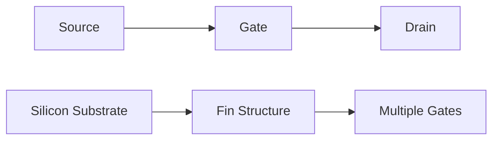
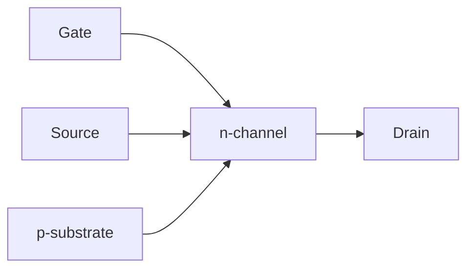
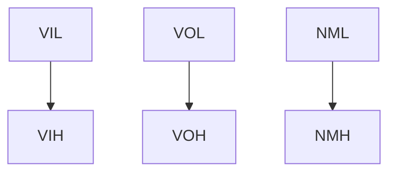
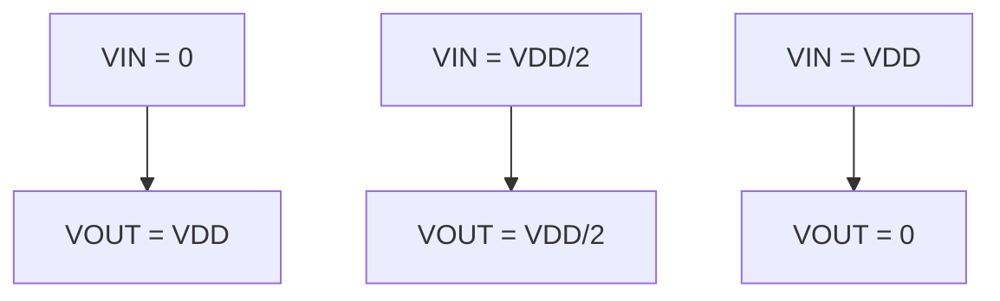
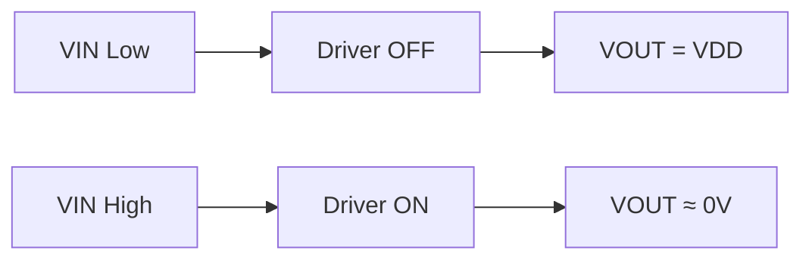
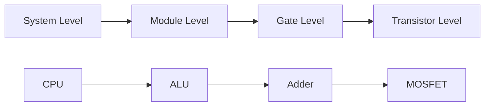
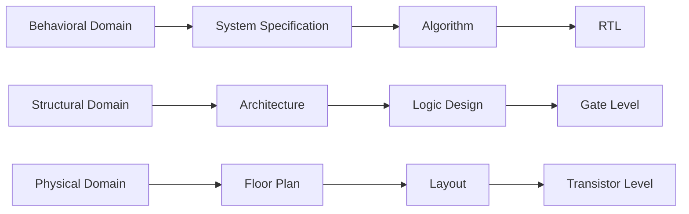
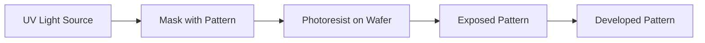
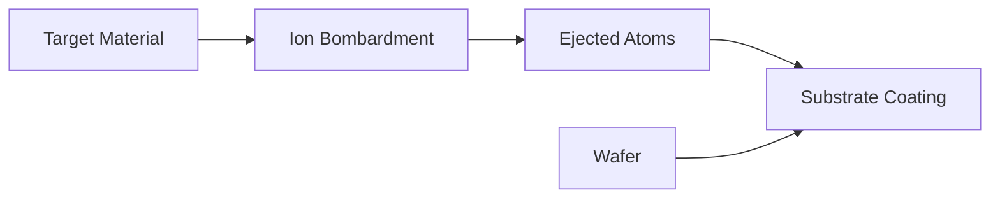

## Question 1(a) [3 marks]

**Draw the structure of FinFET and write its advantages.**

**Answer:**



**Table: FinFET Advantages**

| Advantage | Description |
|-----------|-------------|
| **Better Control** | Multiple gates provide superior channel control |
| **Reduced Leakage** | Lower off-state current due to 3D structure |
| **Improved Performance** | Higher drive current and faster switching |

**Mnemonic:** "BCR - Better Control Reduces leakage"

---

## Question 1(b) [4 marks]

**Explain depletion and inversion of MOS structure under external bias**

**Answer:**

**Table: MOS Bias Conditions**

| Bias Type | Gate Voltage | Channel State | Charge Carriers |
|-----------|--------------|---------------|-----------------|
| **Depletion** | Slightly Positive | Depleted | Holes pushed away |
| **Inversion** | High Positive | Inverted | Electrons attracted |

**Diagram:**

```goat
VG > 0 (Depletion)        VG >> 0 (Inversion)
    +                         +
   Gate                      Gate
   ----                      ----
    -                         -
   Depletion                Electron
   Region                   Channel
   --------                 --------
   p-substrate              p-substrate
```

- **Depletion**: Positive gate voltage creates electric field pushing holes away
- **Inversion**: Higher voltage attracts electrons forming conducting channel

**Mnemonic:** "DI - Depletion Inverts to conducting channel"

---

## Question 1(c) [7 marks]

**Explain n-channel MOSFET with the help of its Current-Voltage characteristics.**

**Answer:**

**Table: MOSFET Operating Regions**

| Region | Condition | Drain Current | Characteristics |
|--------|-----------|---------------|-----------------|
| **Cut-off** | VGS < VTH | ID ≈ 0 | No conduction |
| **Linear** | VDS < VGS-VTH | ID ∝ VDS | Resistive behavior |
| **Saturation** | VDS ≥ VGS-VTH | ID ∝ (VGS-VTH)² | Current independent of VDS |



**Key Equations:**

- Linear: ID = μnCox(W/L)[(VGS-VTH)VDS - VDS²/2]
- Saturation: ID = (μnCox/2)(W/L)(VGS-VTH)²

- **Structure**: Gate controls channel between source and drain
- **Operation**: Gate voltage modulates channel conductivity
- **Applications**: Digital switching and analog amplification

**Mnemonic:** "CLS - Cut-off, Linear, Saturation regions"

---

## Question 1(c OR) [7 marks]

**Define scaling. Compare full voltage scaling with constant voltage scaling. Write the disadvantages of scaling.**

**Answer:**

**Definition:** Scaling reduces device dimensions to increase density and performance.

**Table: Scaling Comparison**

| Parameter | Full Voltage Scaling | Constant Voltage Scaling |
|-----------|---------------------|-------------------------|
| **Voltage** | Reduced by α | Remains constant |
| **Power Density** | Constant | Increases by α |
| **Electric Field** | Constant | Increases by α |
| **Performance** | Better | Moderate improvement |

**Disadvantages:**

- **Short Channel Effects**: Channel length modulation increases
- **Hot Carrier Effects**: High electric fields damage devices
- **Quantum Effects**: Tunneling currents increase significantly

**Mnemonic:** "SHQ - Short channel, Hot carriers, Quantum effects"

---

## Question 2(a) [3 marks]

**Draw two input NAND gate using CMOS.**

**Answer:**

```goat
    VDD
     |
   ┌─┴─┐ pMOS
A──┤   ├──┐
   └───┘  │
          │ Y
   ┌─────┐ │
B──┤     ├─┘
   └─┬─┬─┘ pMOS
     │ │
   ┌─┴─┐ nMOS
A──┤   ├──┐
   └───┘  │
          │
   ┌─────┐ │
B──┤     ├─┘
   └─┬─┬─┘ nMOS
     │ │
    GND
```

**Table: NAND Truth Table**

| A | B | Y |
|---|---|---|
| 0 | 0 | 1 |
| 0 | 1 | 1 |
| 1 | 0 | 1 |
| 1 | 1 | 0 |

**Mnemonic:** "PP-SS: Parallel PMOS, Series NMOS"

---

## Question 2(b) [4 marks]

**Explain noise immunity and noise margin for nMOS inverter.**

**Answer:**

**Table: Noise Parameters**

| Parameter | Definition | Formula |
|-----------|------------|---------|
| **NMH** | High noise margin | VOH - VIH |
| **NML** | Low noise margin | VIL - VOL |
| **Noise Immunity** | Ability to reject noise | Min(NMH, NML) |



- **VIL**: Maximum low input voltage
- **VIH**: Minimum high input voltage  
- **Good noise immunity**: Large noise margins prevent false switching

**Mnemonic:** "HILOL - High/Low Input/Output Levels"

---

## Question 2(c) [7 marks]

**Explain Voltage Transfer Characteristics (VTC) of CMOS inverter.**

**Answer:**

**Table: VTC Regions**

| Region | Input Range | Output | Transistor States |
|--------|-------------|--------|-------------------|
| **A** | 0 to VTN | VDD | pMOS ON, nMOS OFF |
| **B** | VTN to VDD/2 | Transition | Both partially ON |
| **C** | VDD/2 to VDD-|VTP| | Transition | Both partially ON |
| **D** | VDD-|VTP| to VDD | 0V | pMOS OFF, nMOS ON |



**Key Features:**

- **Sharp transition**: Ideal switching behavior
- **High gain**: Large slope in transition region
- **Rail-to-rail**: Output swings full supply range

**Mnemonic:** "ASH - A-region, Sharp transition, High gain"

---

## Question 2(a OR) [3 marks]

**Implement NOR2 gate using depletion load nMOS.**

**Answer:**

```goat
    VDD
     |
   ┌─┴─┐ Depletion Load
   │   │ (VGS = 0)
   └─┬─┘
     │ Y
   ┌─┴─┐ nMOS
A──┤   ├──┐
   └───┘  │
          │
   ┌─────┐ │
B──┤     ├─┘
   └─┬─┬─┘ nMOS
     │ │
    GND
```

**Table: NOR2 Truth Table**

| A | B | Y |
|---|---|---|
| 0 | 0 | 1 |
| 0 | 1 | 0 |
| 1 | 0 | 0 |
| 1 | 1 | 0 |

**Mnemonic:** "DPN - Depletion load, Parallel NMOS"

---

## Question 2(b OR) [4 marks]

**Differentiate between enhancement load inverter and Depletion load inverter.**

**Answer:**

**Table: Load Inverter Comparison**

| Parameter | Enhancement Load | Depletion Load |
|-----------|------------------|----------------|
| **Threshold Voltage** | VT > 0 | VT < 0 |
| **Gate Connection** | VGS = VDS | VGS = 0 |
| **Logic High** | VDD - VT | VDD |
| **Power Consumption** | Higher | Lower |
| **Switching Speed** | Slower | Faster |

- **Enhancement**: Requires positive gate voltage for conduction
- **Depletion**: Conducts with zero gate voltage
- **Performance**: Depletion load provides better characteristics

**Mnemonic:** "EPDLH - Enhancement Positive, Depletion Lower power, Higher speed"

---

## Question 2(c OR) [7 marks]

**Explain Depletion load nMOS inverter with its VTC.**

**Answer:**

**Circuit Operation:**

- **Load transistor**: Always conducting (VGS = 0, VT < 0)
- **Driver transistor**: Controlled by input voltage
- **Output**: Determined by voltage divider action



**Table: Operating Points**

| Input State | Driver | Load | Output |
|-------------|--------|------|--------|
| **VIN = 0** | OFF | ON | VDD |
| **VIN = VDD** | ON | ON | ≈ 0V |

**VTC Characteristics:**

- **VOH**: VDD (better than enhancement load)
- **VOL**: Lower due to depletion load characteristics
- **Transition**: Sharp switching between states

**Mnemonic:** "DLB - Depletion Load gives Better high output"

---

## Question 3(a) [3 marks]

**Implement EX-OR using Depletion load nMOS.**

**Answer:**

```goat
    VDD      VDD
     |        |
   ┌─┴─┐    ┌─┴─┐  Depletion
   │   │    │   │  Loads
   └─┬─┘    └─┬─┘
     │        │
A────┼────────┼────B
     │        │
   ┌─┴─┐    ┌─┴─┐
   │   │    │   │  nMOS
   └─┬─┘    └─┬─┘
     │        │
    A'       B'
     │        │
     └────┬───┘ Y
          │
         GND
```

**Table: XOR Truth Table**

| A | B | Y |
|---|---|---|
| 0 | 0 | 0 |
| 0 | 1 | 1 |
| 1 | 0 | 1 |
| 1 | 1 | 0 |

**Implementation**: Y = A⊕B = A'B + AB'

**Mnemonic:** "XOR - eXclusive OR, different inputs give 1"

---

## Question 3(b) [4 marks]

**Explain design hierarchy with example.**

**Answer:**

**Table: Hierarchy Levels**

| Level | Component | Example |
|-------|-----------|---------|
| **System** | Complete chip | Microprocessor |
| **Module** | Functional blocks | ALU, Memory |
| **Gate** | Logic gates | NAND, NOR |
| **Transistor** | Individual devices | MOSFET |



**Benefits:**

- **Modularity**: Independent design and testing
- **Reusability**: Common blocks used multiple times
- **Maintainability**: Easy debugging and modification

**Mnemonic:** "SMG-T: System, Module, Gate, Transistor levels"

---

## Question 3(c) [7 marks]

**Draw and explain Y chart design flow.**

**Answer:**



**Table: Y-Chart Domains**

| Domain | Description | Examples |
|--------|-------------|----------|
| **Behavioral** | What system does | Algorithms, RTL |
| **Structural** | How it's organized | Architecture, Gates |
| **Physical** | Where components placed | Floorplan, Layout |

**Design Flow:**

- **Top-down**: Behavioral → Structural → Physical
- **Bottom-up**: Physical constraints influence upper levels
- **Iterative**: Multiple passes for optimization

**Mnemonic:** "BSP - Behavioral, Structural, Physical domains"

---

## Question 3(a OR) [3 marks]

**Implement NAND2 - SR latch using CMOS**

**Answer:**

```goat
    S ────┐   ┌──── Q
          │   │
        ┌─┴─┐ │ ┌─┴─┐
        │   ├─┘ │   │ NAND
        └─┬─┘   └─┬─┘
          │       │
          └───┬───┘
              │
        ┌─────┴─────┐
        │           │
      ┌─┴─┐       ┌─┴─┐
      │   ├───────┤   │ NAND
      └─┬─┘       └─┬─┘
        │           │
        R ──────────┘
                    │
                   Q'
```

**Table: SR Latch Operation**

| S | R | Q | Q' | State |
|---|---|---|----| ------|
| 0 | 0 | Q | Q' | Hold |
| 0 | 1 | 0 | 1 | Reset |
| 1 | 0 | 1 | 0 | Set |
| 1 | 1 | 1 | 1 | Invalid |

**Mnemonic:** "SR-HRI: Set, Reset, Hold, Invalid states"

---

## Question 3(b OR) [4 marks]

**Which method is used to transfer pattern or mask on the silicon wafer? Explain it with neat diagrams**

**Answer:**

**Method**: **Lithography** - Pattern transfer using light exposure



**Process Steps:**

| Step | Action | Result |
|------|--------|--------|
| **Coating** | Apply photoresist | Uniform layer |
| **Exposure** | UV through mask | Chemical change |
| **Development** | Remove exposed resist | Pattern transfer |

**Applications**: Creating gates, interconnects, contact holes

**Mnemonic:** "CED - Coating, Exposure, Development"

---

## Question 3(c OR) [7 marks]

**Which are the methods used to deposit metal in MOSFET fabrication? Explain deposition in detail with proper diagram.**

**Answer:**

**Table: Metal Deposition Methods**

| Method | Technique | Application |
|--------|-----------|-------------|
| **Physical Vapor Deposition** | Sputtering, Evaporation | Aluminum, Copper |
| **Chemical Vapor Deposition** | CVD, PECVD | Tungsten, Titanium |
| **Electroplating** | Electrochemical | Copper interconnects |



**Sputtering Process:**

- **Ion bombardment**: Argon ions hit target material
- **Atom ejection**: Target atoms knocked off
- **Deposition**: Atoms settle on wafer surface
- **Control**: Pressure and power determine rate

**Advantages:**

- **Uniform thickness**: Excellent step coverage
- **Low temperature**: Preserves device integrity
- **Variety**: Multiple materials possible

**Mnemonic:** "IBE-DC: Ion Bombardment Ejects atoms for Deposition Control"

---

## Question 4(a) [3 marks]

**Implement Z= ((A+B+C)·(D+E+F). G)' with depletion nMOS load.**

**Answer:**

```goat
    VDD
     |
   ┌─┴─┐ Depletion Load
   │   │
   └─┬─┘
     │ Z
A────┼────┐
B────┼────┤ Parallel
C────┼────┘ (OR)
     │
D────┼────┐
E────┼────┤ Parallel  
F────┼────┘ (OR)
     │
G────┼────┘ Series
     │      (AND)
    GND
```

**Logic Implementation:**

- **First level**: (A+B+C) and (D+E+F) OR functions
- **Second level**: AND with G
- **Output**: Inverted result due to nMOS structure

**Mnemonic:** "POI - Parallel OR, Inversion at output"

---

## Question 4(b) [4 marks]

**List and explain the design styles used in VERILOG.**

**Answer:**

**Table: Verilog Design Styles**

| Style | Description | Use Case | Example |
|-------|-------------|----------|---------|
| **Behavioral** | Algorithm description | High-level modeling | always blocks |
| **Dataflow** | Boolean expressions | Combinational logic | assign statements |
| **Structural** | Component instantiation | Hierarchical design | module connections |
| **Gate-level** | Primitive gates | Low-level design | and, or, not gates |

**Characteristics:**

- **Behavioral**: Describes what circuit does
- **Structural**: Shows how components connect
- **Mixed**: Combines multiple styles for complex designs

**Mnemonic:** "BDSG - Behavioral, Dataflow, Structural, Gate-level"

---

## Question 4(c) [7 marks]

**Implement NAND2 SR latch using CMOS and also implement NOR2 SR latch using CMOS.**

**Answer:**

**NAND2 SR Latch:**

```verilog
module nand_sr_latch(
    input S, R,
    output Q, Q_bar
);
    nand(Q, S, Q_bar);
    nand(Q_bar, R, Q);
endmodule
```

**NOR2 SR Latch:**

```verilog
module nor_sr_latch(
    input S, R,
    output Q, Q_bar
);
    nor(Q_bar, R, Q);
    nor(Q, S, Q_bar);
endmodule
```

**Table: Latch Comparison**

| Type | Active Level | Set Operation | Reset Operation |
|------|-------------|---------------|-----------------|
| **NAND** | Low (0) | S=0, R=1 | S=1, R=0 |
| **NOR** | High (1) | S=1, R=0 | S=0, R=1 |

**Key Differences:**

- **NAND**: Set/Reset with low inputs
- **NOR**: Set/Reset with high inputs
- **Feedback**: Cross-coupled gates maintain state

**Mnemonic:** "NAND-Low, NOR-High active"

---

## Question 4(a OR) [3 marks]

**Implement Y= (ABC + DE + F)' with depletion nMOS load.**

**Answer:**

```goat
    VDD
     |
   ┌─┴─┐ Depletion Load
   │   │
   └─┬─┘
     │ Y
A────┼────┐
B────┼────┤ Series (AND)
C────┼────┘
     │
D────┼────┐
E────┼────┘ Series (AND)
     │
F────┼────┘ Single
     │
    GND
```

**Implementation Logic:**

- **ABC**: Series connection (AND function)
- **DE**: Series connection (AND function)  
- **F**: Single transistor
- **Result**: Y = (ABC + DE + F)' due to inversion

**Mnemonic:** "SSS-I: Series-Series-Single with Inversion"

---

## Question 4(b OR) [4 marks]

**Write Verilog Code to implement full adder.**

**Answer:**

```verilog
module full_adder(
    input a, b, cin,
    output sum, cout
);
    assign sum = a ^ b ^ cin;
    assign cout = (a & b) | (cin & (a ^ b));
endmodule
```

**Table: Full Adder Truth Table**

| A | B | Cin | Sum | Cout |
|---|---|-----|-----|------|
| 0 | 0 | 0 | 0 | 0 |
| 0 | 0 | 1 | 1 | 0 |
| 0 | 1 | 0 | 1 | 0 |
| 0 | 1 | 1 | 0 | 1 |
| 1 | 0 | 0 | 1 | 0 |
| 1 | 0 | 1 | 0 | 1 |
| 1 | 1 | 0 | 0 | 1 |
| 1 | 1 | 1 | 1 | 1 |

**Logic Functions:**

- **Sum**: Triple XOR operation
- **Carry**: Majority function of inputs

**Mnemonic:** "XOR-Sum, Majority-Carry"

---

## Question 4(c OR) [7 marks]

**Implement Y =(S1'S0'I0 + S1'S0 I1 + S1 S0' I2 + S1 S2 I3) using depletion load**

**Answer:**

**Note**: Assuming S2 in last term should be S0.

```verilog
// 4:1 Multiplexer implementation
module mux_4to1(
    input [1:0] sel,  // S1, S0
    input [3:0] data, // I3, I2, I1, I0
    output Y
);
    assign Y = (sel == 2'b00) ? data[0] :
               (sel == 2'b01) ? data[1] :
               (sel == 2'b10) ? data[2] :
                                data[3];
endmodule
```

**Table: Multiplexer Selection**

| S1 | S0 | Selected Input | Output |
|----|----| --------------|--------|
| 0 | 0 | I0 | Y = I0 |
| 0 | 1 | I1 | Y = I1 |
| 1 | 0 | I2 | Y = I2 |
| 1 | 1 | I3 | Y = I3 |

**Circuit Implementation:**

- **Decoder**: S1, S0 generate select signals
- **AND gates**: Each input ANDed with corresponding select
- **OR gate**: Combines all AND outputs

**Mnemonic:** "DAO - Decoder, AND gates, OR combination"

---

## Question 5(a) [3 marks]

**Implement the logic function G = (PQR +U(S+T))' using CMOS**

**Answer:**

```goat
    VDD
     |
P────┼────┐
Q────┼────┤ Parallel pMOS
R────┼────┘ (NOR)
     │
U────┼────┐
     │    │
S────┼────┤ Series pMOS  
T────┼────┘ (NAND)
     │
     │ G
P────┼────┐
Q────┼────┤ Series nMOS
R────┼────┘ (AND)
     │
U────┼────┐
     │    │
S────┼────┤ Parallel nMOS
T────┼────┘ (OR)
     │
    GND
```

**Implementation**:

- **pMOS**: Parallel for OR, Series for AND (inverted logic)
- **nMOS**: Series for AND, Parallel for OR (normal logic)
- **Result**: De Morgan's law applied automatically

**Mnemonic:** "PSSP - Parallel Series Series Parallel"

---

## Question 5(b) [4 marks]

**Implement 8×1 multiplexer using Verilog**

**Answer:**

```verilog
module mux_8to1(
    input [2:0] sel,     // 3-bit select
    input [7:0] data,    // 8 data inputs
    output reg Y         // Output
);
    always @(*) begin
        case(sel)
            3'b000: Y = data[0];
            3'b001: Y = data[1];
            3'b010: Y = data[2];
            3'b011: Y = data[3];
            3'b100: Y = data[4];
            3'b101: Y = data[5];
            3'b110: Y = data[6];
            3'b111: Y = data[7];
        endcase
    end
endmodule
```

**Table: 8:1 MUX Selection**

| S2 | S1 | S0 | Output |
|----|----|----|--------|
| 0 | 0 | 0 | data[0] |
| 0 | 0 | 1 | data[1] |
| 0 | 1 | 0 | data[2] |
| 0 | 1 | 1 | data[3] |
| 1 | 0 | 0 | data[4] |
| 1 | 0 | 1 | data[5] |
| 1 | 1 | 0 | data[6] |
| 1 | 1 | 1 | data[7] |

**Mnemonic:** "Case-Always: Use case statement in always block"

---

## Question 5(c) [7 marks]

**Implement 4 bit full adder using structural modeling style in Verilog.**

**Answer:**

```verilog
module full_adder_4bit(
    input [3:0] a, b,
    input cin,
    output [3:0] sum,
    output cout
);
    wire c1, c2, c3;
    
    full_adder fa0(.a(a[0]), .b(b[0]), .cin(cin), 
                   .sum(sum[0]), .cout(c1));
    full_adder fa1(.a(a[1]), .b(b[1]), .cin(c1), 
                   .sum(sum[1]), .cout(c2));
    full_adder fa2(.a(a[2]), .b(b[2]), .cin(c2), 
                   .sum(sum[2]), .cout(c3));
    full_adder fa3(.a(a[3]), .b(b[3]), .cin(c3), 
                   .sum(sum[3]), .cout(cout));
endmodule

module full_adder(
    input a, b, cin,
    output sum, cout
);
    assign sum = a ^ b ^ cin;
    assign cout = (a & b) | (cin & (a ^ b));
endmodule
```

**Structural Features:**

- **Module instantiation**: Four 1-bit full adders
- **Carry chain**: Connects carries between stages
- **Hierarchical design**: Reuses basic full adder module

**Table: Ripple Carry Addition**

| Stage | Inputs | Carry In | Sum | Carry Out |
|-------|--------|----------|-----|-----------|
| **FA0** | A[0], B[0] | Cin | S[0] | C1 |
| **FA1** | A[1], B[1] | C1 | S[1] | C2 |
| **FA2** | A[2], B[2] | C2 | S[2] | C3 |
| **FA3** | A[3], B[3] | C3 | S[3] | Cout |

**Mnemonic:** "RCC - Ripple Carry Chain connection"

---

## Question 5(a OR) [3 marks]

**Implement logic function Y = ((AF(D + E) )+ (B+ C))' using CMOS.**

**Answer:**

```goat
    VDD
     |
A────┼────┐
F────┼────┤
     │    │ Series pMOS
D────┼────┤ Parallel
E────┼────┘
     │
B────┼────┐
C────┼────┘ Parallel pMOS
     │
     │ Y
A────┼────┐
F────┼────┤
     │    │ Series nMOS
D────┼────┤ Parallel
E────┼────┘
     │
B────┼────┐
C────┼────┘ Parallel nMOS
     │
    GND
```

**Logic Breakdown:**

- **Inner term**: AF(D + E) = A AND F AND (D OR E)
- **Outer term**: (B + C) = B OR C
- **Final**: Y = (AF(D + E) + (B + C))'

**CMOS Implementation:**

- **PMOS network**: Implements complement of function
- **NMOS network**: Implements original function
- **Result**: Natural inversion provides Y

**Mnemonic:** "PNAI - PMOS Network Applies Inversion"

---

## Question 5(b OR) [4 marks]

**Implement 4 bit up counter using Verilog**

**Answer:**

```verilog
module counter_4bit_up(
    input clk, reset,
    output reg [3:0] count
);
    always @(posedge clk or posedge reset) begin
        if (reset)
            count <= 4'b0000;
        else
            count <= count + 1;
    end
endmodule
```

**Table: Counter Sequence**

| Clock | Reset | Count | Next Count |
|-------|-------|-------|------------|
| ↑ | 1 | X | 0000 |
| ↑ | 0 | 0000 | 0001 |
| ↑ | 0 | 0001 | 0010 |
| ↑ | 0 | ... | ... |
| ↑ | 0 | 1111 | 0000 |

**Features:**

- **Synchronous reset**: Reset on clock edge
- **Auto rollover**: 1111 → 0000
- **4-bit range**: Counts 0 to 15

**Mnemonic:** "SRA - Synchronous Reset with Auto rollover"

---

## Question 5(c OR) [7 marks]

**Implement 3:8 decoder using behavioral modeling style in Verilog.**

**Answer:**

```verilog
module decoder_3to8(
    input [2:0] select,
    input enable,
    output reg [7:0] out
);
    always @(*) begin
        if (enable) begin
            case(select)
                3'b000: out = 8'b00000001;
                3'b001: out = 8'b00000010;
                3'b010: out = 8'b00000100;
                3'b011: out = 8'b00001000;
                3'b100: out = 8'b00010000;
                3'b101: out = 8'b00100000;
                3'b110: out = 8'b01000000;
                3'b111: out = 8'b10000000;
                default: out = 8'b00000000;
            endcase
        end else begin
            out = 8'b00000000;
        end
    end
endmodule
```

**Table: 3:8 Decoder Truth Table**

| Enable | A2 | A1 | A0 | Y7 | Y6 | Y5 | Y4 | Y3 | Y2 | Y1 | Y0 |
|--------|----|----|----|----|----|----|----|----|----|----|----| 
| 0 | X | X | X | 0 | 0 | 0 | 0 | 0 | 0 | 0 | 0 |
| 1 | 0 | 0 | 0 | 0 | 0 | 0 | 0 | 0 | 0 | 0 | 1 |
| 1 | 0 | 0 | 1 | 0 | 0 | 0 | 0 | 0 | 0 | 1 | 0 |
| 1 | 0 | 1 | 0 | 0 | 0 | 0 | 0 | 0 | 1 | 0 | 0 |
| 1 | 0 | 1 | 1 | 0 | 0 | 0 | 0 | 1 | 0 | 0 | 0 |
| 1 | 1 | 0 | 0 | 0 | 0 | 0 | 1 | 0 | 0 | 0 | 0 |
| 1 | 1 | 0 | 1 | 0 | 0 | 1 | 0 | 0 | 0 | 0 | 0 |
| 1 | 1 | 1 | 0 | 0 | 1 | 0 | 0 | 0 | 0 | 0 | 0 |
| 1 | 1 | 1 | 1 | 1 | 0 | 0 | 0 | 0 | 0 | 0 | 0 |

**Key Features:**

- **Behavioral modeling**: Uses always block and case statement
- **Enable control**: All outputs disabled when enable = 0
- **One-hot output**: Only one output active at a time
- **3-bit input**: Selects one of 8 outputs

**Applications:**

- **Memory addressing**: Chip select generation
- **Data routing**: Channel selection
- **Control logic**: State machine outputs

**Mnemonic:** "BEOH - Behavioral Enable One-Hot decoder"
