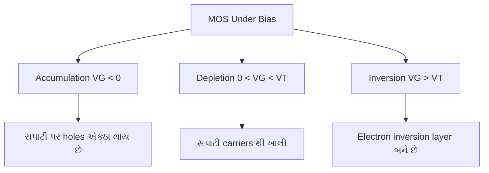
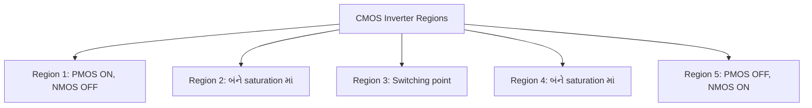
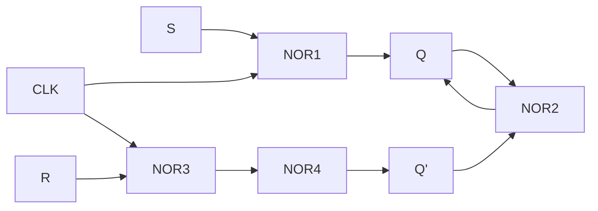
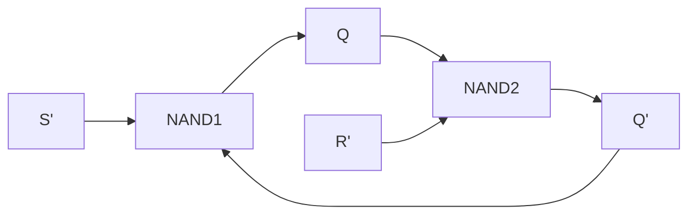
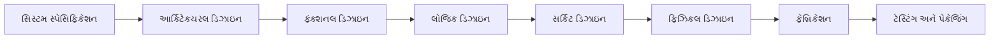
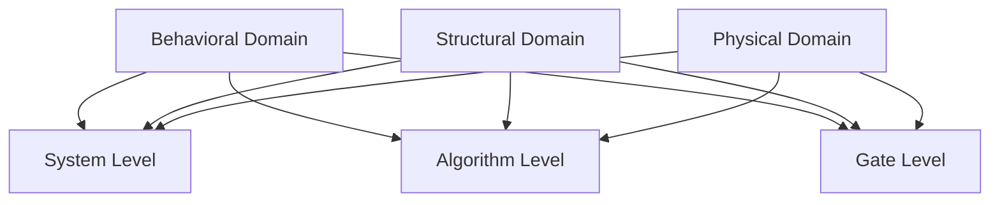
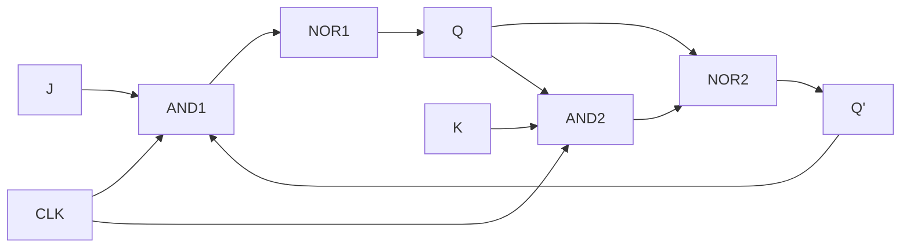

## પ્રશ્ન 1(અ) [3 ગુણ]

**સ્કેલિંગનું મહત્વ જણાવો**

**જવાબ**:
સ્કેલિંગ semiconductor technology ને આગળ વધારવા અને device performance સુધારવા માટે અત્યંત મહત્વપૂર્ણ છે.

| **સ્કેલિંગ ફાયદા** | **વર્ણન** |
|---------------------|-----------------|
| **Device Size** | ઊંચી density માટે transistor dimensions ઘટાડે છે |
| **Speed** | ટૂંકી channel length થી ઝડપી switching |
| **Power** | પ્રતિ operation ઓછો power consumption |
| **Cost** | વધુ chips per wafer, function દીઠ ઓછો cost |

- **Technology advancement**: Moore's Law ચાલુ રાખવામાં સક્ષમ બનાવે છે
- **Performance boost**: ઊંચી frequency operation શક્ય બનાવે છે
- **Market competitiveness**: નાના, ઝડપી, સસ્તા products

**યાદરાખવાની ટિપ:** "Small Devices Speed Progress Cheaply"

---

## પ્રશ્ન 1(બ) [4 ગુણ]

**Planar MOSFET અને FINFET ની તુલના કરો**

**જવાબ**:
FinFET technology નાના nodes પર planar MOSFET ની મર્યાદાઓનો ઉકેલ આપે છે.

| **પેરામીટર** | **Planar MOSFET** | **FinFET** |
|---------------|-------------------|------------|
| **Structure** | 2D flat channel | 3D fin-shaped channel |
| **Gate Control** | Single gate | Tri-gate/multi-gate |
| **Short Channel Effects** | નાના nodes પર ઊંચી | નોંધપાત્ર રીતે ઓછી |
| **Leakage Current** | ઊંચી subthreshold leakage | ખૂબ ઓછી leakage |

- **Scalability**: FinFET sub-22nm technology nodes શક્ય બનાવે છે
- **Power efficiency**: FinFET વધુ સારો power-performance ratio આપે છે
- **Manufacturing**: FinFET વધુ જટિલ fabrication માંગે છે

**યાદરાખવાની ટિપ:** "Fins Control Current Better Than Flat"

---

## પ્રશ્ન 1(ક) [7 ગુણ]

**N channel MOSFET ની VDS-ID અને VGS-ID લાક્ષણિકતાઓ દોરો અને સમજાવો**

**જવાબ**:
N-channel MOSFET characteristics અલગ અલગ operating regions માં device behavior દર્શાવે છે.

**આકૃતિ:**

```goat
VGS-ID Characteristics        VDS-ID Characteristics
                                     
    ID ↑                            ID ↑
      |    VGS4                       |     VGS4>VGS3>VGS2>VGS1
      |   VGS3 ___                    |    ________________
      |  VGS2 ___                     |   /
      | VGS1___                       |  /  Linear Region
    VT|/__                            | /
      |________________________→      |/________________________→
         VGS                             VDS
```

| **પ્રદેશ** | **સ્થિતિ** | **કરંટ સમીકરણ** |
|------------|---------------|---------------------|
| **Cutoff** | VGS < VT | ID = 0 |
| **Linear** | VDS < (VGS-VT) | ID ∝ VDS |
| **Saturation** | VDS ≥ (VGS-VT) | ID ∝ (VGS-VT)² |

- **થ્રેશોલ્ડ વોલ્ટેજ (VT)**: conduction માટે લઘુત્તમ VGS
- **Transconductance**: saturation માં VGS-ID curve નો slope
- **આઉટપુટ પ્રતિકાર**: saturation region માં વિપરીત slope

**યાદરાખવાની ટિપ:** "Threshold Gates Linear Saturation"

---

## પ્રશ્ન 1(ક OR) [7 ગુણ]

**એક્સટર્નલ બાયસ હેઠળ MOS પર ઉદ્ભવતી અલગ અલગ અસર સમજાવો**

**જવાબ**:
External bias અલગ અલગ charge distributions બનાવે છે જે MOS capacitor behavior ને અસર કરે છે.

**આકૃતિ:**



| **બાયસ સ્થિતિ** | **સપાટીની સ્થિતિ** | **કેપેસિટન્સ** |
|-------------------|-------------------|-----------------|
| **Accumulation** | સપાટી પર majority carriers | ઊંચી (Cox) |
| **Depletion** | કોઈ mobile carriers નથી | મધ્યમ |
| **Inversion** | Minority carriers channel બનાવે છે | ઊંચી (Cox) |

- **ફ્લેટ બેન્ડ વોલ્ટેજ**: કોઈ charge separation અસ્તિત્વમાં નથી
- **એનર્જી બેન્ડ બેન્ડિંગ**: carrier distribution નક્કી કરે છે
- **સપાટીનો વિભવ**: inversion layer formation નિયંત્રિત કરે છે

**યાદરાખવાની ટિપ:** "Accumulate, Deplete, then Invert"

---

## પ્રશ્ન 2(અ) [3 ગુણ]

**આદર્શ ઇન્વર્ટરની વોલ્ટેજ ટ્રાન્સફર લાક્ષણિકતા દોરો**

**જવાબ**:
આદર્શ ઇન્વર્ટર infinite gain સાથે logic levels વચ્ચે તીક્ષ્ણ પરિવર્તન આપે છે.

**આકૃતિ:**

```goat
    VOUT ↑
        |
    VOH |    |
        |    |
        |    |
        |    |_______________
        |                    |
        |                    | VOL
        |____________________|_______→
           VIL   VIH        VIN
```

- **તીક્ષ્ણ પરિવર્તન**: switching point પર infinite slope
- **નોઈઝ માર્જિન**: NMH = VOH - VIH, NML = VIL - VOL
- **સંપૂર્ણ લોજિક લેવલ**: VOH = VDD, VOL = 0V

**યાદરાખવાની ટિપ:** "Sharp Switch, Perfect Levels"

---

## પ્રશ્ન 2(બ) [4 ગુણ]

**નોઈઝ ઇમ્યુનિટી અને નોઈઝ માર્જિન સમજાવો**

**જવાબ**:
નોઈઝ ઇમ્યુનિટી circuit ની અનચાહેલા સિગ્નલ વેરિએશન ને નકારવાની ક્ષમતા માપે છે.

| **પેરામીટર** | **વ્યાખ્યા** | **ફોર્મ્યુલા** |
|---------------|----------------|-------------|
| **NMH** | હાઈ-લેવલ નોઈઝ માર્જિન | VOH - VIH |
| **NML** | લો-લેવલ નોઈઝ માર્જિન | VIL - VOL |
| **નોઈઝ ઇમ્યુનિટી** | નોઈઝ નકારવાની ક્ષમતા | Min(NMH, NML) |

- **લોજિક થ્રેશોલ્ડ લેવલ**: VIH (input high), VIL (input low)
- **આઉટપુટ લેવલ**: VOH (output high), VOL (output low)
- **વધુ સારી ઇમ્યુનિટી**: મોટા નોઈઝ માર્જિન વધુ સારી સુરક્ષા આપે છે
- **ડિઝાઇન લક્ષ્ય**: મજબૂત operation માટે નોઈઝ માર્જિન વધારવા

**યાદરાખવાની ટિપ:** "Margins Protect Against Noise"

---

## પ્રશ્ન 2(ક) [7 ગુણ]

**Saturated અને linear depletion load nMOS ઇન્વર્ટર સાથે ઇન્વર્ટર સર્કિટનું વર્ણન કરો**

**જવાબ**:
Depletion load nMOS ઇન્વર્ટર active load resistor તરીકે depletion transistor વાપરે છે.

**આકૃતિ:**

```goat
       VDD
        |
        |
    |---+---| MD (Depletion Load)
    |       | VT < 0
    |       |
    +-------+------ VOUT
    |
    |
|---+---| MN (Driver)
|       | VT > 0
|       |
|_______|
   VIN    GND
```

| **લોડ પ્રકાર** | **ગેટ કનેક્શન** | **ઓપરેશન** |
|---------------|-------------------|---------------|
| **Saturated Load** | VG = VD | હંમેશા saturation માં |
| **Linear Load** | VG = VDD | Linear region માં કામ કરી શકે છે |

- **ડિપ્લીશન ડિવાઇસ**: VGS = 0 સાથે વહન કરે છે, current source તરીકે કામ કરે છે
- **લોડ લાઇન વિશ્લેષણ**: operating point intersection નક્કી કરે છે
- **પાવર કન્ઝ્યુમ્પશન**: હંમેશા વહન કરે છે, ઊંચો static power
- **સ્વિચિંગ સ્પીડ**: pull-up કરતાં pull-down ઝડપી

**યાદરાખવાની ટિપ:** "Depletion Loads Drive Outputs"

---

## પ્રશ્ન 2(અ OR) [3 ગુણ]

**એન્હાન્સમેન્ટ લોડ ઇન્વર્ટર દોરો અને સમજાવો**

**જવાબ**:
Enhancement load ઇન્વર્ટર ખાસ biasing સાથે enhancement MOSFET ને load તરીકે વાપરે છે.

**આકૃતિ:**

```goat
       VDD
        |
        |
    |---+---| ME (Enhancement Load)
    |   |   | VT > 0
    |   +---+
    +-------+------ VOUT
    |
    |
|---+---| MN (Driver)
|       |
|       |
|_______|
   VIN    GND
```

- **બૂટસ્ટ્રેપ કનેક્શન**: લોડ માટે gate ને drain સાથે જોડાયેલ
- **મર્યાદિત આઉટપુટ હાઈ**: VOUT(max) = VDD - VT
- **થ્રેશોલ્ડ નુકસાન**: Enhancement load વોલ્ટેજ ડ્રોપ કરાવે છે

**યાદરાખવાની ટિપ:** "Enhancement Loses Threshold"

---

## પ્રશ્ન 2(બ OR) [4 ગુણ]

**CMOS ઇન્વર્ટરના ફાયદા જણાવો**

**જવાબ**:
CMOS technology NMOS ઇન્વર્ટર કરતાં શ્રેષ્ઠ performance આપે છે.

| **ફાયદો** | **લાભ** |
|---------------|-------------|
| **શૂન્ય સ્ટેટિક પાવર** | steady state માં કોઈ current path નથી |
| **રેલ-ટુ-રેલ આઉટપુટ** | સંપૂર્ણ VDD અને 0V આઉટપુટ લેવલ |
| **ઊંચી નોઈઝ ઇમ્યુનિટી** | મોટા નોઈઝ માર્જિન |
| **સમપ્રમાણ સ્વિચિંગ** | બરાબર rise અને fall times |

- **પાવર એફિશિયન્સી**: માત્ર switching દરમિયાન dynamic power
- **સ્કેલેબિલિટી**: બધા technology nodes પર સારી રીતે કામ કરે છે
- **ફેન-આઉટ ક્ષમતા**: અનેક inputs ડ્રાઇવ કરી શકે છે
- **તાપમાન સ્થિરતા**: performance તાપમાન પર ઓછી સંવેદનશીલ

**યાદરાખવાની ટિપ:** "CMOS Saves Power Perfectly"

---

## પ્રશ્ન 2(ક OR) [7 ગુણ]

**CMOS ઇન્વર્ટરના ઓપરેટિંગ મોડ પ્રદેશ દોરો અને સમજાવો**

**જવાબ**:
CMOS ઇન્વર્ટર operation input voltage ના આધારે પાંચ અલગ અલગ regions સમાવે છે.

**આકૃતિ:**



| **પ્રદેશ** | **NMOS સ્થિતિ** | **PMOS સ્થિતિ** | **આઉટપુટ** |
|------------|----------------|----------------|------------|
| **1** | OFF | Linear | VOH ≈ VDD |
| **2** | Saturation | Saturation | Transition |
| **3** | Saturation | Saturation | VDD/2 |
| **4** | Saturation | Saturation | Transition |
| **5** | Linear | OFF | VOL ≈ 0V |

- **સ્વિચિંગ થ્રેશોલ્ડ**: VTC region 3 પર VDD/2 ને પાર કરે છે
- **કરંટ ફ્લો**: માત્ર transition regions 2,3,4 દરમિયાન
- **નોઈઝ માર્જિન**: Regions 1 અને 5 ઇમ્યુનિટી આપે છે
- **ગેઇન**: Region 3 માં મહત્તમ (switching point)

**યાદરાખવાની ટિપ:** "Five Regions Control CMOS Switching"

---

## પ્રશ્ન 3(અ) [3 ગુણ]

**CMOS વાપરીને બે ઇનપુટ NOR ગેટ દોરો**

**જવાબ**:
CMOS NOR ગેટ complementary networks વાપરીને De Morgan's law અમલમાં મૂકે છે.

**આકૃતિ:**

```goat
       VDD
        |
    |---+---| MP1
    |A  |   |
    +---+---+
    |       |
    |   |---+---| MP2
    |   |B  |   |
    +---+---+---+------ Y = (A+B)'
    |           |
|---+---|   |---+---| MN2
|A      |   |B      |
|       |   |       |
|_______|   |_______|
            |
           GND
```

- **પુલ-અપ નેટવર્ક**: સીરીઝ PMOS transistors (હાઈ આઉટપુટ માટે A અને B બંને લો)
- **પુલ-ડાઉન નેટવર્ક**: પેરેલલ NMOS transistors (લો આઉટપુટ માટે A અથવા B હાઈ)
- **લોજિક ફંક્શન**: Y = (A+B)' = A' · B'

**યાદરાખવાની ટિપ:** "Series PMOS, Parallel NMOS"

---

## પ્રશ્ન 3(બ) [4 ગુણ]

**CMOS વાપરીને બૂલિયન ફંક્શન Z= [(A+B)C+DE]' અમલ કરો**

**જવાબ**:
જટિલ CMOS લોજિક કાર્યક્ષમ અમલીકરણ માટે AOI (AND-OR-Invert) સ્ટ્રક્ચર વાપરે છે.

**આકૃતિ:**

```goat
                    VDD
                     |
         +-----------+-----------+
         |                       |
     |---+---|               |---+---|
     |A      |               |D      |
     |_______|               |_______|
         |                       |
     |---+---|               |---+---|
     |B      |               |E      |
     |_______|               |_______|
         |                       |
     |---+---|               
     |C      |               
     |_______|               
         |                       |
         +-----------+-----------+------ Z
                     |
         +-----------+-----------+
         |           |           |
     |---+---|   |---+---|   |---+---|
     |A      |   |B      |   |C      |
     |       |   |       |   |       |
     |_______|   |_______|   |_______|
                     |           |
                 |---+---|   |---+---|
                 |D      |   |E      |
                 |       |   |       |
                 |_______|   |_______|
                             |
                            GND
```

- **AOI સ્ટ્રક્ચર**: કાર્યક્ષમ single-stage અમલીકરણ
- **ડ્યુઅલ નેટવર્ક**: કોમ્પ્લિમેન્ટરી pull-up અને pull-down
- **લોજિક ઓપ્ટિમાઇઝેશન**: અલગ ગેટ કરતાં ઓછા transistors

**યાદરાખવાની ટિપ:** "AOI Inverts Complex Logic Efficiently"

---

## પ્રશ્ન 3(ક) [7 ગુણ]

**પેરાસિટિક ડિવાઇસ કેપેસિટન્સ સાથે CMOS NAND2 ગેટ દોરો અને સમજાવો**

**જવાબ**:
CMOS ગેટમાં પેરાસિટિક કેપેસિટન્સ switching speed અને power consumption ને અસર કરે છે.

**આકૃતિ:**

```goat
       VDD
        |
    |---+---| MP1  Cgd1
    |A  |   |      
    +---+---+------ Y = (AB)'
    |       |       |
    |   |---+---| MP2  Cgd2
    |   |B  |   |      |
    +---+---+---+------+
    |           |      |
|---+---|   |---+---|  | Cload
|A      |   |B      |  |
|       |   |       |  |
|_______|   |_______|  |
    |           |      |
   Cgs1        Cgs2    |
    |           |      |
   GND         GND    GND

પેરાસિટિક કેપેસિટન્સ:
Cgs - Gate to Source
Cgd - Gate to Drain  
Cdb - Drain to Bulk
Csb - Source to Bulk
```

| **કેપેસિટન્સ** | **સ્થાન** | **અસર** |
|-----------------|--------------|------------|
| **Cgs** | Gate-Source | Input capacitance |
| **Cgd** | Gate-Drain | Miller effect |
| **Cdb** | Drain-Bulk | Output loading |
| **Csb** | Source-Bulk | Source loading |

- **સ્વિચિંગ વિલંબ**: પેરાસિટિક કેપેસિટન્સ transitions ધીમા કરે છે
- **પાવર કન્ઝ્યુમ્પશન**: પેરાસિટિક caps ચાર્જ/ડિસ્ચાર્જ કરવા
- **મિલર ઇફેક્ટ**: Cgd feedback બનાવે છે, switching ધીમું કરે છે
- **લેઆઉટ ઓપ્ટિમાઇઝેશન**: પેરાસિટિક કેપેસિટન્સ ઓછા કરવા

**યાદરાખવાની ટિપ:** "Parasitics Slow Gates Down"

---

## પ્રશ્ન 3(અ OR) [3 ગુણ]

**CMOS વાપરીને NOR આધારિત Clocked SR latch દોરો અને સમજાવો**

**જવાબ**:
Clocked SR latch synchronous operation માટે clock enable સાથે NOR gates વાપરે છે.

**આકૃતિ:**



- **ક્લોક કંટ્રોલ**: S અને R માત્ર CLK = 1 હોય ત્યારે જ અસરકારક
- **ટ્રાન્સપેરન્ટ મોડ**: clock સક્રિય હોય ત્યારે આઉટપુટ input ને અનુસરે છે
- **હોલ્ડ મોડ**: clock નિષ્ક્રિય હોય ત્યારે આઉટપુટ સ્થિતિ જાળવે છે
- **મૂળભૂત બિલ્ડિંગ બ્લોક**: flip-flops માટે પાયો

**યાદરાખવાની ટિપ:** "Clock Controls Transparent Latching"

---

## પ્રશ્ન 3(બ OR) [4 ગુણ]

**CMOS વાપરીને બૂલિયન ફંક્શન Z=[AB+C(D+E)]' અમલ કરો**

**જવાબ**:
આ ફંક્શન AOI લોજિક સ્ટ્રક્ચર વાપરીને inverted sum-of-products અમલમાં મૂકે છે.

**લોજિક વિશ્લેષણ:**

- મૂળ: Z = [AB + C(D+E)]'
- વિસ્તૃત: Z = [AB + CD + CE]'
- અમલીકરણ: ત્રણ AND terms NOR ને આપવામાં આવે છે

| **ટર્મ** | **ઇનપુટ્સ** | **ફંક્શન** |
|----------|------------|--------------|
| **ટર્મ 1** | A, B | AB |
| **ટર્મ 2** | C, D | CD |
| **ટર્મ 3** | C, E | CE |
| **આઉટપુટ** | બધા terms | (AB + CD + CE)' |

- **AOI અમલીકરણ**: સિંગલ સ્ટેજ, કાર્યક્ષમ ડિઝાઇન
- **ટ્રાન્ઝિસ્ટર કાઉન્ટ**: અલગ ગેટ અમલીકરણ કરતાં ઓછા
- **પરફોર્મન્સ**: ઝડપી switching, ઓછો power

**યાદરાખવાની ટિપ:** "Three AND Terms Feed One NOR"

---

## પ્રશ્ન 3(ક OR) [7 ગુણ]

**ઉદાહરણ સાથે AOI અને OAI લોજિકને અલગ પાડો**

**જવાબ**:
AOI અને OAI કાર્યક્ષમ CMOS અમલીકરણ માટે પૂરક લોજિક પરિવારો છે.

| **પેરામીટર** | **AOI (AND-OR-Invert)** | **OAI (OR-AND-Invert)** |
|---------------|--------------------------|--------------------------|
| **સ્ટ્રક્ચર** | AND gates → OR → Invert | OR gates → AND → Invert |
| **ફંક્શન** | (AB + CD + ...)' | ((A+B)(C+D)...)' |
| **PMOS નેટવર્ક** | Series-parallel | Parallel-series |
| **NMOS નેટવર્ક** | Parallel-series | Series-parallel |

**AOI ઉદાહરણ: Y = (AB + CD)'**

```goat
PMOS: Series A-B parallel with Series C-D
NMOS: Parallel A,B series with Parallel C,D
```

**OAI ઉદાહરણ: Y = ((A+B)(C+D))'**

```goat
PMOS: Parallel A,B series with Parallel C,D  
NMOS: Series A-B parallel with Series C-D
```

- **ડિઝાઇન પસંદગી**: બૂલિયન ફંક્શન ફોર્મ આધારે પસંદ કરો
- **ઓપ્ટિમાઇઝેશન**: ટ્રાન્ઝિસ્ટર કાઉન્ટ અને વિલંબ ઓછો કરે છે
- **દ્વૈતતા**: AOI અને OAI De Morgan duals છે

**યાદરાખવાની ટિપ:** "AOI ANDs then ORs, OAI ORs then ANDs"

---

## પ્રશ્ન 4(અ) [3 ગુણ]

**વ્યાખ્યા આપો: 1) Regularity 2) Modularity 3) Locality**

**જવાબ**:
VLSI જટિલતાને સંચાલિત કરવા અને સફળ અમલીકરણ સુનિશ્ચિત કરવા માટે ડિઝાઇન હાયરાર્કી સિદ્ધાંતો આવશ્યક છે.

| **સિદ્ધાંત** | **વ્યાખ્યા** | **ફાયદો** |
|---------------|----------------|-------------|
| **Regularity** | સમાન સ્ટ્રક્ચર્સનો વારંવાર ઉપયોગ | સરળ લેઆઉટ, ટેસ્ટિંગ |
| **Modularity** | ડિઝાઇનને નાના બ્લોક્સમાં વહેંચવું | સ્વતંત્ર ડિઝાઇન, પુનઃઉપયોગ |
| **Locality** | મોટે ભાગે સ્થાનિક interconnections | ઓછી routing જટિલતા |

- **ડિઝાઇન કાર્યક્ષમતા**: સિદ્ધાંતો ડિઝાઇન સમય અને પ્રયાસ ઘટાડે છે
- **વેરિફિકેશન**: મોડ્યુલર અભિગમ ટેસ્ટિંગ સરળ બનાવે છે
- **સ્કેલેબિલિટી**: મોટા, વધુ જટિલ ડિઝાઇન્સ શક્ય બનાવે છે

**યાદરાખવાની ટિપ:** "Regular Modules Stay Local"

---

## પ્રશ્ન 4(બ) [4 ગુણ]

**CMOS ઇન્વર્ટર વાપરીને SR latch (NAND ગેટ) અમલ કરો**

**જવાબ**:
NAND ગેટ વાપરીને SR latch active-low inputs સાથે set-reset functionality આપે છે.

**આકૃતિ:**



**સત્ય કોષ્ટક:**

| **S'** | **R'** | **Q** | **Q'** | **સ્થિતિ** |
|--------|--------|-------|--------|-----------|
| 0 | 1 | 1 | 0 | Set |
| 1 | 0 | 0 | 1 | Reset |
| 1 | 1 | Q | Q' | Hold |
| 0 | 0 | 1 | 1 | અમાન્ય |

- **ક્રોસ-કપ્લ્ડ સ્ટ્રક્ચર**: મેમરી ફંક્શન આપે છે
- **એક્ટિવ-લો ઇનપુટ્સ**: S' = 0 સેટ કરે છે, R' = 0 રીસેટ કરે છે
- **પ્રતિબંધિત સ્થિતિ**: બંને ઇનપુટ્સ એકસાથે લો

**યાદરાખવાની ટિપ:** "Cross-Coupled NANDS Remember State"

---

## પ્રશ્ન 4(ક) [7 ગુણ]

**VLSI ડિઝાઇન ફ્લો સમજાવો**

**જવાબ**:
VLSI ડિઝાઇન ફ્લો specification થી fabrication સુધીના વ્યવસ્થિત પગલાંઓ અનુસરે છે.



| **લેવલ** | **પ્રવૃત્તિઓ** | **આઉટપુટ** |
|-----------|----------------|------------|
| **સિસ્ટમ** | આવશ્યકતા વિશ્લેષણ | સ્પેસિફિકેશન્સ |
| **આર્કિટેક્ચર** | બ્લોક-લેવલ ડિઝાઇન | સિસ્ટમ આર્કિટેક્ચર |
| **લોજિક** | બૂલિયન ઓપ્ટિમાઇઝેશન | ગેટ નેટલિસ્ટ |
| **સર્કિટ** | ટ્રાન્ઝિસ્ટર સાઇઝિંગ | સર્કિટ નેટલિસ્ટ |
| **ફિઝિકલ** | લેઆઉટ, routing | GDSII ફાઇલ |

- **ડિઝાઇન વેરિફિકેશન**: દરેક લેવલે માન્યતા જરૂરી
- **પુનરાવર્તન**: ઓપ્ટિમાઇઝેશન માટે ફીડબેક લૂપ્સ
- **CAD ટૂલ્સ**: જટિલ ડિઝાઇન્સ માટે ઓટોમેશન આવશ્યક
- **ટાઇમ-ટુ-માર્કેટ**: કાર્યક્ષમ ફ્લો ડિઝાઇન સાયકલ ઘટાડે છે

**યાદરાખવાની ટિપ:** "System Architects Love Circuit Physical Fabrication"

---

## પ્રશ્ન 4(અ OR) [3 ગુણ]

**Y-ચાર્ટ દોરો અને સમજાવો**

**જવાબ**:
Y-ચાર્ટ VLSI ડિઝાઇનમાં ત્રણ ડિઝાઇન ડોમેન અને તેમના abstraction levels દર્શાવે છે.

**આકૃતિ:**



- **ત્રણ ડોમેન**: Behavioral (ફંક્શન), Structural (components), Physical (geometry)
- **એબ્સ્ટ્રેક્શન લેવલ**: System → Algorithm → Gate → Circuit → Layout
- **ડિઝાઇન પદ્ધતિ**: સમાન abstraction level પર ડોમેન વચ્ચે ફરવું

**યાદરાખવાની ટિપ:** "Behavior, Structure, Physics at All Levels"

---

## પ્રશ્ન 4(બ OR) [4 ગુણ]

**CMOS ઇન્વર્ટરનો ઉપયોગ કરીને clocked JK latch (NOR ગેટ) અમલ કરો**

**જવાબ**:
JK latch toggle ક્ષમતા સાથે SR latch ની પ્રતિબંધિત સ્થિતિ દૂર કરે છે.

**આકૃતિ:**



**સત્ય કોષ્ટક:**

| **J** | **K** | **Q(next)** | **ઓપરેશન** |
|-------|-------|-------------|---------------|
| 0 | 0 | Q | Hold |
| 0 | 1 | 0 | Reset |
| 1 | 0 | 1 | Set |
| 1 | 1 | Q' | Toggle |

- **ટોગલ મોડ**: J=K=1 આઉટપુટ સ્થિતિ ફ્લિપ કરે છે
- **ક્લોક એનેબલ**: માત્ર CLK=1 હોય ત્યારે જ સક્રિય
- **ફીડબેક**: ઇનપુટ્સ સક્ષમ કરવા માટે વર્તમાન આઉટપુટ વાપરે છે

**યાદરાખવાની ટિપ:** "JK Toggles, No Forbidden State"

---

## પ્રશ્ન 4(ક OR) [7 ગુણ]

**લિથોગ્રાફી, એચિંગ, જમાવટ, ઓક્સિડેશન, આયન પ્રત્યારોપણ, પ્રસરણ જેવા શબ્દો સમજાવો**

**જવાબ**:
Integrated circuits બનાવવા માટે આવશ્યક semiconductor fabrication processes.

| **પ્રક્રિયા** | **હેતુ** | **પદ્ધતિ** |
|-------------|-------------|------------|
| **લિથોગ્રાફી** | પેટર્ન ટ્રાન્સફર | માસ્ક દ્વારા UV exposure |
| **એચિંગ** | મેટેરિયલ રિમૂવલ | ભીના/સૂકા રાસાયણિક પ્રક્રિયાઓ |
| **જમાવટ** | લેયર ઉમેરો | CVD, PVD, sputtering |
| **ઓક્સિડેશન** | ઇન્સ્યુલેટર વૃદ્ધિ | થર્મલ/પ્લાઝ્મા ઓક્સિડેશન |
| **આયન પ્રત્યારોપણ** | ડોપિંગ પરિચય | ઉચ્ચ-ઊર્જા આયન બોમ્બાર્ડમેન્ટ |
| **પ્રસરણ** | ડોપન્ટ વિતરણ | ઉચ્ચ તાપમાને ફેલાવો |

- **પેટર્ન વ્યાખ્યા**: લિથોગ્રાફી ડિવાઇસ લક્ષણો બનાવે છે
- **પસંદગીયુક્ત રિમૂવલ**: એચિંગ અનચાહેલ મેટેરિયલ દૂર કરે છે
- **લેયર બિલ્ડિંગ**: જમાવટ જરૂરી મેટેરિયલ ઉમેરે છે
- **ડોપિંગ કંટ્રોલ**: પ્રત્યારોપણ અને પ્રસરણ junctions બનાવે છે
- **ગુણવત્તા નિયંત્રણ**: દરેક પગલું અંતિમ ડિવાઇસ પરફોર્મન્સને અસર કરે છે

**યાદરાખવાની ટિપ:** "Light Etches Deposited Oxides, Ions Diffuse"

---

## પ્રશ્ન 5(અ) [3 ગુણ]

**વેરિલોગની મદદથી 2 ઇનપુટ XNOR ગેટને અમલમાં મૂકો**

**જવાબ**:
XNOR ગેટ ઇનપુટ્સ સમાન હોય ત્યારે ઊંચો આઉટપુટ આપે છે.

```verilog
module xnor_gate(
    input a, b,
    output y
);
    assign y = ~(a ^ b);
endmodule
```

- **લોજિક ફંક્શન**: Y = (A ⊕ B)' = A'B' + AB
- **સત્ય કોષ્ટક**: ઇનપુટ્સ મેચ થાય ત્યારે આઉટપુટ ઊંચો
- **ઉપયોગ**: સમાનતા તુલનાકાર, પેરિટી ચેકર

**યાદરાખવાની ટિપ:** "XNOR Equals Equal Inputs"

---

## પ્રશ્ન 5(બ) [4 ગુણ]

**વેરિલોગમાં CASE સ્ટેટમેન્ટનો ઉપયોગ કરીને એનકોડર (8:3) અમલ કરો**

**જવાબ**:
પ્રાયોરિટી એનકોડર 8-બિટ ઇનપુટને 3-બિટ બાઇનરી આઉટપુટમાં રૂપાંતરિત કરે છે.

```verilog
module encoder_8to3(
    input [7:0] in,
    output reg [2:0] out
);
    always @(*) begin
        case(in)
            8'b00000001: out = 3'b000;
            8'b00000010: out = 3'b001;
            8'b00000100: out = 3'b010;
            8'b00001000: out = 3'b011;
            8'b00010000: out = 3'b100;
            8'b00100000: out = 3'b101;
            8'b01000000: out = 3'b110;
            8'b10000000: out = 3'b111;
            default: out = 3'b000;
        endcase
    end
endmodule
```

- **વન-હોટ એન્કોડિંગ**: માત્ર એક ઇનપુટ બિટ ઊંચો હોવો જોઈએ
- **પ્રાયોરિટી સ્ટ્રક્ચર**: ઊંચા બિટ્સ પ્રાધાન્ય લે છે
- **ડિફોલ્ટ કેસ**: અમાન્ય ઇનપુટ સંયોજનો સંભાળે છે

**યાદરાખવાની ટિપ:** "One Hot Input, Binary Output"

---

## પ્રશ્ન 5(ક) [7 ગુણ]

**યોગ્ય ઉદાહરણો સાથે વેરિલોગમાં કેસ સ્ટેટમેન્ટ સમજાવો**

**જવાબ**:
CASE સ્ટેટમેન્ટ expression value આધારે મલ્ટિ-વે બ્રાન્ચિંગ આપે છે.

**સિન્ટેક્સ:**

```verilog
case (expression)
    value1: statement1;
    value2: statement2;
    default: default_statement;
endcase
```

**ઉદાહરણ 1 - 4:1 MUX:**

```verilog
module mux_4to1(
    input [1:0] sel,
    input [3:0] in,
    output reg out
);
    always @(*) begin
        case(sel)
            2'b00: out = in[0];
            2'b01: out = in[1];
            2'b10: out = in[2];
            2'b11: out = in[3];
        endcase
    end
endmodule
```

**ઉદાહરણ 2 - 7-સેગમેન્ટ ડિકોડર:**

```verilog
case(digit)
    4'h0: segments = 7'b1111110;
    4'h1: segments = 7'b0110000;
    4'h2: segments = 7'b1101101;
    default: segments = 7'b0000000;
endcase
```

| **વેરિઅન્ટ** | **સિન્ટેક્સ** | **ઉપયોગ કેસ** |
|-------------|------------|--------------|
| **case** | case(expr) | સંપૂર્ણ મેચિંગ |
| **casex** | casex(expr) | ડોન્ટ કેર (X) |
| **casez** | casez(expr) | હાઈ-Z (Z) |

- **કોમ્બિનેશનલ લોજિક**: always @(*) બ્લોક વાપરો
- **સિક્વેન્શિયલ લોજિક**: always @(posedge clk) વાપરો
- **ડિફોલ્ટ કેસ**: સિન્થેસિસમાં લેચેસ અટકાવે છે
- **પેરેલલ ઇવેલ્યુએશન**: બધા કેસ એકસાથે ચકાસાય છે

**યાદરાખવાની ટિપ:** "CASE Chooses Actions Systematically Everywhere"

---

## પ્રશ્ન 5(અ OR) [3 ગુણ]

**વેરિલોગ કોડનો ઉપયોગ કરીને full subtractor અમલ કરો**

**જવાબ**:
Full subtractor borrow input અને output સાથે બાઇનરી બાદબાકી કરે છે.

```verilog
module full_subtractor(
    input a, b, bin,
    output diff, bout
);
    assign diff = a ^ b ^ bin;
    assign bout = (~a & b) | (~a & bin) | (b & bin);
endmodule
```

**સત્ય કોષ્ટક:**

| **A** | **B** | **Bin** | **Diff** | **Bout** |
|-------|-------|---------|----------|----------|
| 0 | 0 | 0 | 0 | 0 |
| 0 | 0 | 1 | 1 | 1 |
| 0 | 1 | 0 | 1 | 1 |
| 1 | 1 | 1 | 1 | 1 |

- **અંતર**: ત્રણેય ઇનપુટ્સનો XOR
- **ઉધાર**: A < (B + Bin) હોય ત્યારે ઉત્પન્ન થાય છે

**યાદરાખવાની ટિપ:** "Subtract Borrows When Insufficient"

---

## પ્રશ્ન 5(બ OR) [4 ગુણ]

**વેરિલોગમાં Behavioural મોડેલિંગ શૈલીનો ઉપયોગ કરીને JK flipflop અમલ કરો**

**જવાબ**:
Behavioral modeling વાપરીને toggle ક્ષમતા સાથે JK flip-flop.

```verilog
module jk_flipflop(
    input j, k, clk, reset,
    output reg q, qbar
);
    always @(posedge clk or posedge reset) begin
        if(reset) begin
            q <= 1'b0;
            qbar <= 1'b1;
        end
        else begin
            case({j,k})
                2'b00: q <= q;        // Hold
                2'b01: q <= 1'b0;     // Reset
                2'b10: q <= 1'b1;     // Set
                2'b11: q <= ~q;       // Toggle
            endcase
            qbar <= ~q;
        end
    end
endmodule
```

- **બિહેવિયરલ શૈલી**: ફંક્શનનું વર્ણન કરે છે, સ્ટ્રક્ચરનું નહીં
- **સિંક્રોનસ રીસેટ**: ક્લોક એજ પર રીસેટ
- **નોન-બ્લોકિંગ અસાઇનમેન્ટ**: clocked always block માં <= વાપરો

**યાદરાખવાની ટિપ:** "JK Behavior: Hold, Reset, Set, Toggle"

---

## પ્રશ્ન 5(ક OR) [7 ગુણ]

**ઉદાહરણ આપીને વિવિધ વેરિલોગ મોડેલિંગ શૈલી સમજાવો**

**જવાબ**:
વેરિલોગ અલગ અલગ abstraction levels માટે ત્રણ મોડેલિંગ શૈલીઓ આપે છે.

| **શૈલી** | **એબ્સ્ટ્રેક્શન** | **વર્ણન** | **કન્સ્ટ્રક્ટ્સ** |
|-----------|-----------------|-----------------|----------------|
| **Behavioral** | ઊંચી | ફંક્શનનું વર્ણન કરે છે | always, if-else, case |
| **Dataflow** | મધ્યમ | ડેટા હલચલનું વર્ણન કરે છે | assign, operators |
| **Structural** | નીચી | કનેક્શન્સનું વર્ણન કરે છે | module instantiation |

**1. બિહેવિયરલ મોડેલિંગ:**
સર્કિટ શું કરે છે તેનું વર્ણન કરે છે, કેવી રીતે બનાવેલ છે તે નહીં.

```verilog
// 4-બિટ કાઉન્ટર
module counter(
    input clk, reset,
    output reg [3:0] count
);
    always @(posedge clk or posedge reset) begin
        if(reset)
            count <= 4'b0000;
        else
            count <= count + 1;
    end
endmodule
```

**2. ડેટાફ્લો મોડેલિંગ:**
કોમ્બિનેશનલ લોજિક માટે સતત અસાઇનમેન્ટ વાપરે છે.

```verilog
// 4-બિટ એડર
module adder_4bit(
    input [3:0] a, b,
    input cin,
    output [3:0] sum,
    output cout
);
    assign {cout, sum} = a + b + cin;
    assign overflow = (a[3] & b[3] & ~sum[3]) | 
                     (~a[3] & ~b[3] & sum[3]);
endmodule
```

**3. સ્ટ્રક્ચરલ મોડેલિંગ:**
નીચલા-સ્તરના મોડ્યુલો instantiate અને કનેક્ટ કરે છે.

```verilog
// હાફ એડર વાપરીને ફુલ એડર
module full_adder(
    input a, b, cin,
    output sum, cout
);
    wire s1, c1, c2;
    
    half_adder ha1(.a(a), .b(b), .sum(s1), .carry(c1));
    half_adder ha2(.a(s1), .b(cin), .sum(sum), .carry(c2));
    
    assign cout = c1 | c2;
endmodule

module half_adder(
    input a, b,
    output sum, carry
);
    assign sum = a ^ b;
    assign carry = a & b;
endmodule
```

**તુલના કોષ્ટક:**

| **પાસાં** | **Behavioral** | **Dataflow** | **Structural** |
|------------|----------------|--------------|----------------|
| **જટિલતા** | ઉચ્ચ-સ્તર | મધ્યમ-સ્તર | નીચલા-સ્તર |
| **વાંચનીયતા** | સૌથી વાંચવા યોગ્ય | મધ્યમ | સૌથી ઓછી વાંચવા યોગ્ય |
| **સિન્થેસિસ** | ટૂલ આધારિત | સીધી | સ્પષ્ટ |
| **ડિબગિંગ** | કઠિન | મધ્યમ | સરળ |
| **પુનઃઉપયોગ** | ઊંચો | મધ્યમ | ઊંચો |

**મિશ્રિત મોડેલિંગ ઉદાહરણ:**

```verilog
module cpu_alu(
    input [7:0] a, b,
    input [2:0] opcode,
    input clk,
    output reg [7:0] result
);
    // બિહેવિયરલ: કંટ્રોલ લોજિક
    always @(posedge clk) begin
        case(opcode)
            3'b000: result <= add_result;
            3'b001: result <= sub_result;
            3'b010: result <= and_result;
            default: result <= 8'h00;
        endcase
    end
    
    // ડેટાફ્લો: અંકગણિત ઓપરેશન્સ
    wire [7:0] add_result = a + b;
    wire [7:0] sub_result = a - b;
    wire [7:0] and_result = a & b;
    
    // સ્ટ્રક્ચરલ: સમર્પિત અંકગણિત યુનિટ્સ instantiate કરી શકાય
endmodule
```

**ડિઝાઇન માર્ગદર્શિકા:**

- **બિહેવિયરલ**: જટિલ કંટ્રોલ લોજિક, સ્ટેટ મશીન માટે વાપરો
- **ડેટાફ્લો**: સરળ કોમ્બિનેશનલ લોજિક માટે વાપરો
- **સ્ટ્રક્ચરલ**: હાયરાર્કિકલ ડિઝાઇન્સ, IP integration માટે વાપરો
- **મિશ્રિત અભિગમ**: શ્રેષ્ઠ ડિઝાઇન માટે શૈલીઓને જોડો

**સિમ્યુલેશન વિ સિન્થેસિસ:**

- **બિહેવિયરલ**: અપેક્ષા મુજબ synthesize નહીં થઈ શકે
- **ડેટાફ્લો**: સીધી હાર્ડવેર મેપિંગ
- **સ્ટ્રક્ચરલ**: બાંયધરીકૃત સિન્થેસિસ મેચ

**યાદરાખવાની ટિપ:** "Behavior Describes, Dataflow Assigns, Structure Connects"
