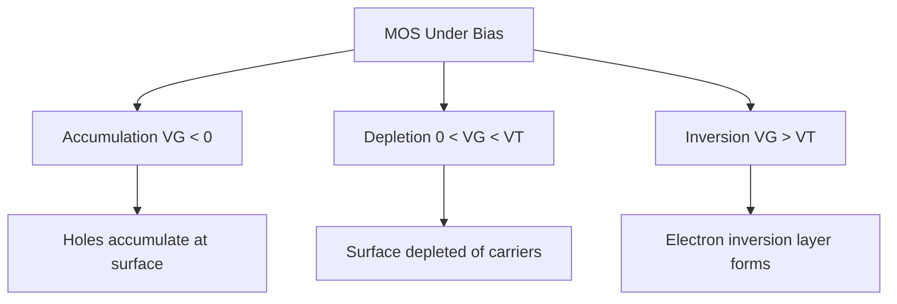
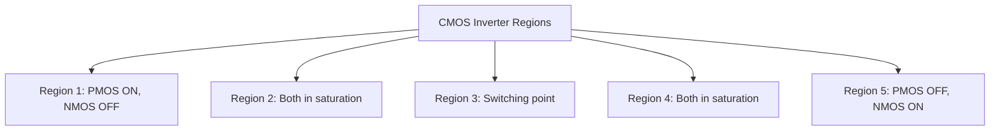
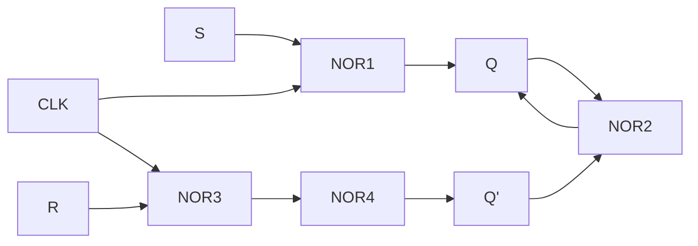
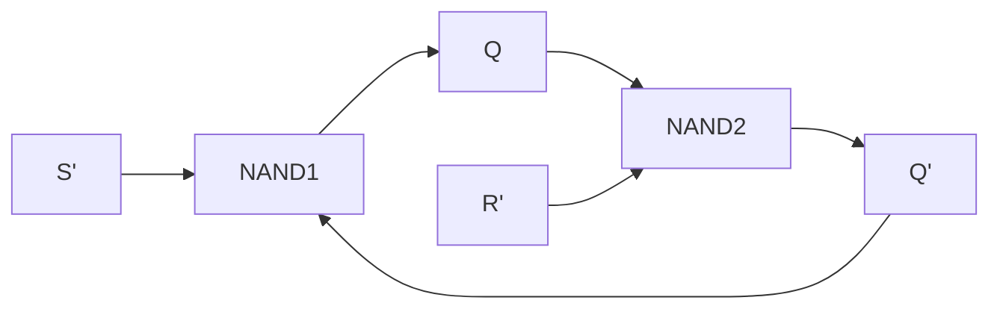
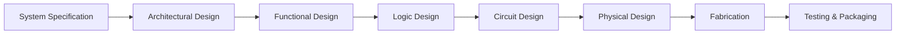
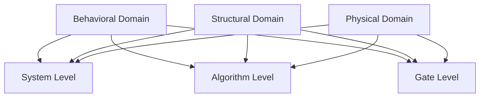
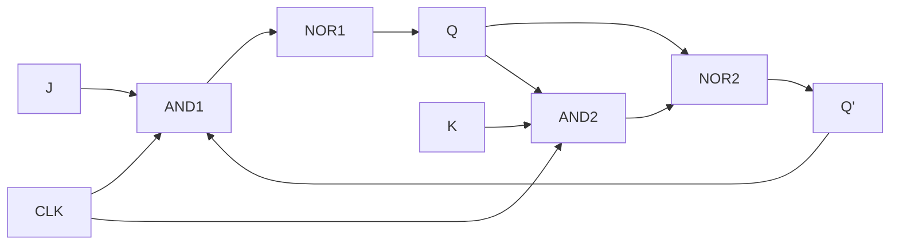

## Question 1(a) [3 marks]

**State importance of scaling**

**Answer**:
Scaling is crucial for advancing semiconductor technology and improving device performance.

| **Scaling Benefits** | **Description** |
|---------------------|-----------------|
| **Device Size** | Reduces transistor dimensions for higher density |
| **Speed** | Faster switching due to shorter channel length |
| **Power** | Lower power consumption per operation |
| **Cost** | More chips per wafer, reducing cost per function |

- **Technology advancement**: Enables Moore's Law continuation
- **Performance boost**: Higher frequency operation possible
- **Market competitiveness**: Smaller, faster, cheaper products

**Mnemonic:** "Small Devices Speed Progress Cheaply"

---

## Question 1(b) [4 marks]

**Compare Planar MOSFET and FINFET**

**Answer**:
FinFET technology addresses limitations of planar MOSFET at smaller nodes.

| **Parameter** | **Planar MOSFET** | **FinFET** |
|---------------|-------------------|------------|
| **Structure** | 2D flat channel | 3D fin-shaped channel |
| **Gate Control** | Single gate | Tri-gate/multi-gate |
| **Short Channel Effects** | High at small nodes | Significantly reduced |
| **Leakage Current** | Higher subthreshold leakage | Much lower leakage |

- **Scalability**: FinFET enables sub-22nm technology nodes
- **Power efficiency**: FinFET offers better power-performance ratio
- **Manufacturing**: FinFET requires more complex fabrication

**Mnemonic:** "Fins Control Current Better Than Flat"

---

## Question 1(c) [7 marks]

**Draw and Explain VDS-ID AND VGS-ID characteristics of N channel MOSFET**

**Answer**:
N-channel MOSFET characteristics show device behavior in different operating regions.

**Diagram:**

```goat
VGS-ID Characteristics        VDS-ID Characteristics
                                     
    ID ↑                            ID ↑
      |    VGS4                       |     VGS4>VGS3>VGS2>VGS1
      |   VGS3 ___                    |    ________________
      |  VGS2 ___                     |   /
      | VGS1___                       |  /  Linear Region
    VT|/__                            | /
      |________________________→      |/________________________→
         VGS                             VDS
```

| **Region** | **Condition** | **Current Equation** |
|------------|---------------|---------------------|
| **Cutoff** | VGS < VT | ID = 0 |
| **Linear** | VDS < (VGS-VT) | ID ∝ VDS |
| **Saturation** | VDS ≥ (VGS-VT) | ID ∝ (VGS-VT)² |

- **Threshold voltage (VT)**: Minimum VGS for conduction
- **Transconductance**: Slope of VGS-ID curve in saturation
- **Output resistance**: Inverse slope in saturation region

**Mnemonic:** "Threshold Gates Linear Saturation"

---

## Question 1(c OR) [7 marks]

**Explain different condition of MOS under external bias**

**Answer**:
External bias creates different charge distributions affecting MOS capacitor behavior.

**Diagram:**



| **Bias Condition** | **Surface State** | **Capacitance** |
|-------------------|-------------------|-----------------|
| **Accumulation** | Majority carriers at surface | High (Cox) |
| **Depletion** | No mobile carriers | Medium |
| **Inversion** | Minority carriers form channel | High (Cox) |

- **Flat band voltage**: No charge separation exists
- **Energy band bending**: Determines carrier distribution
- **Surface potential**: Controls inversion layer formation

**Mnemonic:** "Accumulate, Deplete, then Invert"

---

## Question 2(a) [3 marks]

**Draw voltage transfer characteristic of ideal inverter**

**Answer**:
Ideal inverter provides sharp transition between logic levels with infinite gain.

**Diagram:**

```goat
    VOUT ↑
        |
    VOH |    |
        |    |
        |    |
        |    |_______________
        |                    |
        |                    | VOL
        |____________________|_______→
           VIL   VIH        VIN
```

- **Sharp transition**: Infinite slope at switching point
- **Noise margins**: NMH = VOH - VIH, NML = VIL - VOL
- **Perfect logic levels**: VOH = VDD, VOL = 0V

**Mnemonic:** "Sharp Switch, Perfect Levels"

---

## Question 2(b) [4 marks]

**Explain noise immunity and noise margin**

**Answer**:
Noise immunity measures circuit's ability to reject unwanted signal variations.

| **Parameter** | **Definition** | **Formula** |
|---------------|----------------|-------------|
| **NMH** | High-level noise margin | VOH - VIH |
| **NML** | Low-level noise margin | VIL - VOL |
| **Noise Immunity** | Ability to reject noise | Min(NMH, NML) |

- **Logic threshold levels**: VIH (input high), VIL (input low)
- **Output levels**: VOH (output high), VOL (output low)
- **Better immunity**: Larger noise margins provide better protection
- **Design goal**: Maximize noise margins for robust operation

**Mnemonic:** "Margins Protect Against Noise"

---

## Question 2(c) [7 marks]

**Describe inverter circuit with saturated and linear depletion load nMOS inverter**

**Answer**:
Depletion load nMOS inverters use depletion transistor as active load resistor.

**Diagram:**

```goat
       VDD
        |
        |
    |---+---| MD (Depletion Load)
    |       | VT < 0
    |       |
    +-------+------ VOUT
    |
    |
|---+---| MN (Driver)
|       | VT > 0
|       |
|_______|
   VIN    GND
```

| **Load Type** | **Gate Connection** | **Operation** |
|---------------|-------------------|---------------|
| **Saturated Load** | VG = VD | Always in saturation |
| **Linear Load** | VG = VDD | Can operate in linear region |

- **Depletion device**: Conducts with VGS = 0, acts as current source
- **Load line analysis**: Determines operating point intersection
- **Power consumption**: Always conducting, higher static power
- **Switching speed**: Faster pull-down than pull-up

**Mnemonic:** "Depletion Loads Drive Outputs"

---

## Question 2(a OR) [3 marks]

**Draw and explain enhancement load inverter**

**Answer**:
Enhancement load inverter uses enhancement MOSFET as load with special biasing.

**Diagram:**

```goat
       VDD
        |
        |
    |---+---| ME (Enhancement Load)
    |   |   | VT > 0
    |   +---+
    +-------+------ VOUT
    |
    |
|---+---| MN (Driver)
|       |
|       |
|_______|
   VIN    GND
```

- **Bootstrap connection**: Gate connected to drain for load
- **Limited output high**: VOUT(max) = VDD - VT
- **Threshold loss**: Enhancement load causes voltage drop

**Mnemonic:** "Enhancement Loses Threshold"

---

## Question 2(b OR) [4 marks]

**List the advantages of CMOS inverter**

**Answer**:
CMOS technology offers superior performance compared to NMOS inverters.

| **Advantage** | **Benefit** |
|---------------|-------------|
| **Zero static power** | No current path in steady state |
| **Rail-to-rail output** | Full VDD and 0V output levels |
| **High noise immunity** | Large noise margins |
| **Symmetric switching** | Equal rise and fall times |

- **Power efficiency**: Only dynamic power during switching
- **Scalability**: Works well at all technology nodes
- **Fan-out capability**: Can drive multiple inputs
- **Temperature stability**: Performance less sensitive to temperature

**Mnemonic:** "CMOS Saves Power Perfectly"

---

## Question 2(c OR) [7 marks]

**Draw and Explain operating mode of region for CMOS Inverter**

**Answer**:
CMOS inverter operation involves five distinct regions based on input voltage.

**Diagram:**



| **Region** | **NMOS State** | **PMOS State** | **Output** |
|------------|----------------|----------------|------------|
| **1** | OFF | Linear | VOH ≈ VDD |
| **2** | Saturation | Saturation | Transition |
| **3** | Saturation | Saturation | VDD/2 |
| **4** | Saturation | Saturation | Transition |
| **5** | Linear | OFF | VOL ≈ 0V |

- **Switching threshold**: VTC crosses VDD/2 at region 3
- **Current flow**: Only during transition regions 2,3,4
- **Noise margins**: Regions 1 and 5 provide immunity
- **Gain**: Maximum in region 3 (switching point)

**Mnemonic:** "Five Regions Control CMOS Switching"

---

## Question 3(a) [3 marks]

**Draw two input NOR gate using CMOS**

**Answer**:
CMOS NOR gate implements De Morgan's law using complementary networks.

**Diagram:**

```goat
       VDD
        |
    |---+---| MP1
    |A  |   |
    +---+---+
    |       |
    |   |---+---| MP2
    |   |B  |   |
    +---+---+---+------ Y = (A+B)'
    |           |
|---+---|   |---+---| MN2
|A      |   |B      |
|       |   |       |
|_______|   |_______|
            |
           GND
```

- **Pull-up network**: Series PMOS transistors (A AND B both low for high output)
- **Pull-down network**: Parallel NMOS transistors (A OR B high for low output)
- **Logic function**: Y = (A+B)' = A' · B'

**Mnemonic:** "Series PMOS, Parallel NMOS"

---

## Question 3(b) [4 marks]

**Implement Boolean function Z= [(A+B)C+DE]' using CMOS**

**Answer**:
Complex CMOS logic uses AOI (AND-OR-Invert) structure for efficient implementation.

**Diagram:**

```goat
                    VDD
                     |
         +-----------+-----------+
         |                       |
     |---+---|               |---+---|
     |A      |               |D      |
     |_______|               |_______|
         |                       |
     |---+---|               |---+---|
     |B      |               |E      |
     |_______|               |_______|
         |                       |
     |---+---|               
     |C      |               
     |_______|               
         |                       |
         +-----------+-----------+------ Z
                     |
         +-----------+-----------+
         |           |           |
     |---+---|   |---+---|   |---+---|
     |A      |   |B      |   |C      |
     |       |   |       |   |       |
     |_______|   |_______|   |_______|
                     |           |
                 |---+---|   |---+---|
                 |D      |   |E      |
                 |       |   |       |
                 |_______|   |_______|
                             |
                            GND
```

- **AOI structure**: Efficient single-stage implementation
- **Dual networks**: Complementary pull-up and pull-down
- **Logic optimization**: Fewer transistors than separate gates

**Mnemonic:** "AOI Inverts Complex Logic Efficiently"

---

## Question 3(c) [7 marks]

**Draw and explain CMOS NAND2 gate with the parasitic device capacitances**

**Answer**:
Parasitic capacitances in CMOS gates affect switching speed and power consumption.

**Diagram:**

```goat
       VDD
        |
    |---+---| MP1  Cgd1
    |A  |   |      
    +---+---+------ Y = (AB)'
    |       |       |
    |   |---+---| MP2  Cgd2
    |   |B  |   |      |
    +---+---+---+------+
    |           |      |
|---+---|   |---+---|  | Cload
|A      |   |B      |  |
|       |   |       |  |
|_______|   |_______|  |
    |           |      |
   Cgs1        Cgs2    |
    |           |      |
   GND         GND    GND

Parasitic Capacitances:
Cgs - Gate to Source
Cgd - Gate to Drain  
Cdb - Drain to Bulk
Csb - Source to Bulk
```

| **Capacitance** | **Location** | **Effect** |
|-----------------|--------------|------------|
| **Cgs** | Gate-Source | Input capacitance |
| **Cgd** | Gate-Drain | Miller effect |
| **Cdb** | Drain-Bulk | Output loading |
| **Csb** | Source-Bulk | Source loading |

- **Switching delay**: Parasitic capacitances slow transitions
- **Power consumption**: Charging/discharging parasitic caps
- **Miller effect**: Cgd creates feedback, slows switching
- **Layout optimization**: Minimize parasitic capacitances

**Mnemonic:** "Parasitics Slow Gates Down"

---

## Question 3(a OR) [3 marks]

**Draw and explain NOR based Clocked SR latch using CMOS**

**Answer**:
Clocked SR latch uses NOR gates with clock enable for synchronous operation.

**Diagram:**



- **Clock control**: S and R effective only when CLK = 1
- **Transparent mode**: Output follows input when clock active
- **Hold mode**: Output maintains state when clock inactive
- **Basic building block**: Foundation for flip-flops

**Mnemonic:** "Clock Controls Transparent Latching"

---

## Question 3(b OR) [4 marks]

**Implement Boolean function Z=[AB+C(D+E)]' using CMOS**

**Answer**:
This function implements inverted sum-of-products using AOI logic structure.

**Logic Analysis:**

- Original: Z = [AB + C(D+E)]'
- Expanded: Z = [AB + CD + CE]'
- Implementation: Three AND terms fed to NOR

| **Term** | **Inputs** | **Function** |
|----------|------------|--------------|
| **Term 1** | A, B | AB |
| **Term 2** | C, D | CD |
| **Term 3** | C, E | CE |
| **Output** | All terms | (AB + CD + CE)' |

- **AOI implementation**: Single stage, efficient design
- **Transistor count**: Fewer than separate gate implementation
- **Performance**: Fast switching, low power

**Mnemonic:** "Three AND Terms Feed One NOR"

---

## Question 3(c OR) [7 marks]

**Differentiate AOI and OAI Logic with example**

**Answer**:
AOI and OAI are complementary logic families for efficient CMOS implementation.

| **Parameter** | **AOI (AND-OR-Invert)** | **OAI (OR-AND-Invert)** |
|---------------|--------------------------|--------------------------|
| **Structure** | AND gates → OR → Invert | OR gates → AND → Invert |
| **Function** | (AB + CD + ...)' | ((A+B)(C+D)...)' |
| **PMOS Network** | Series-parallel | Parallel-series |
| **NMOS Network** | Parallel-series | Series-parallel |

**AOI Example: Y = (AB + CD)'**

```goat
PMOS: Series A-B in parallel with Series C-D
NMOS: Parallel A,B in series with Parallel C,D
```

**OAI Example: Y = ((A+B)(C+D))'**

```goat
PMOS: Parallel A,B in series with Parallel C,D  
NMOS: Series A-B in parallel with Series C-D
```

- **Design choice**: Select based on Boolean function form
- **Optimization**: Minimizes transistor count and delay
- **Duality**: AOI and OAI are De Morgan duals

**Mnemonic:** "AOI ANDs then ORs, OAI ORs then ANDs"

---

## Question 4(a) [3 marks]

**Define: 1) Regularity 2) Modularity 3) Locality**

**Answer**:
Design hierarchy principles essential for managing VLSI complexity and ensuring successful implementation.

| **Principle** | **Definition** | **Benefit** |
|---------------|----------------|-------------|
| **Regularity** | Repeated use of similar structures | Easier layout, testing |
| **Modularity** | Breaking design into smaller blocks | Independent design, reuse |
| **Locality** | Interconnections mostly local | Reduced routing complexity |

- **Design efficiency**: Principles reduce design time and effort
- **Verification**: Modular approach simplifies testing
- **Scalability**: Enables larger, more complex designs

**Mnemonic:** "Regular Modules Stay Local"

---

## Question 4(b) [4 marks]

**Implement SR latch (NAND gate) using CMOS inverter**

**Answer**:
SR latch using NAND gates provides set-reset functionality with active-low inputs.

**Diagram:**



**Truth Table:**

| **S'** | **R'** | **Q** | **Q'** | **State** |
|--------|--------|-------|--------|-----------|
| 0 | 1 | 1 | 0 | Set |
| 1 | 0 | 0 | 1 | Reset |
| 1 | 1 | Q | Q' | Hold |
| 0 | 0 | 1 | 1 | Invalid |

- **Cross-coupled structure**: Provides memory function
- **Active-low inputs**: S' = 0 sets, R' = 0 resets
- **Forbidden state**: Both inputs low simultaneously

**Mnemonic:** "Cross-Coupled NANDS Remember State"

---

## Question 4(c) [7 marks]

**Explain VLSI design flow**

**Answer**:
VLSI design flow follows systematic steps from specification to fabrication.



| **Level** | **Activities** | **Output** |
|-----------|----------------|------------|
| **System** | Requirements analysis | Specifications |
| **Architecture** | Block-level design | System architecture |
| **Logic** | Boolean optimization | Gate netlist |
| **Circuit** | Transistor sizing | Circuit netlist |
| **Physical** | Layout, routing | GDSII file |

- **Design verification**: Each level requires validation
- **Iteration**: Feedback loops for optimization
- **CAD tools**: Automation essential for complex designs
- **Time-to-market**: Efficient flow reduces design cycle

**Mnemonic:** "System Architects Love Circuit Physical Fabrication"

---

## Question 4(a OR) [3 marks]

**Draw and explain Y-chart**

**Answer**:
Y-chart represents three design domains and their abstraction levels in VLSI design.

**Diagram:**



- **Three domains**: Behavioral (function), Structural (components), Physical (geometry)
- **Abstraction levels**: System → Algorithm → Gate → Circuit → Layout
- **Design methodology**: Move between domains at same abstraction level

**Mnemonic:** "Behavior, Structure, Physics at All Levels"

---

## Question 4(b OR) [4 marks]

**Implement clocked JK latch (NOR gate) using CMOS inverter**

**Answer**:
JK latch eliminates forbidden state of SR latch with toggle capability.

**Diagram:**



**Truth Table:**

| **J** | **K** | **Q(next)** | **Operation** |
|-------|-------|-------------|---------------|
| 0 | 0 | Q | Hold |
| 0 | 1 | 0 | Reset |
| 1 | 0 | 1 | Set |
| 1 | 1 | Q' | Toggle |

- **Toggle mode**: J=K=1 flips output state
- **Clock enable**: Active only when CLK=1
- **Feedback**: Uses current output to enable inputs

**Mnemonic:** "JK Toggles, No Forbidden State"

---

## Question 4(c OR) [7 marks]

**Explain the terms Lithography, Etching, Deposition, Oxidation, Ion implantation, Diffusion**

**Answer**:
Semiconductor fabrication processes essential for creating integrated circuits.

| **Process** | **Purpose** | **Method** |
|-------------|-------------|------------|
| **Lithography** | Pattern transfer | UV exposure through masks |
| **Etching** | Material removal | Wet/dry chemical processes |
| **Deposition** | Layer addition | CVD, PVD, sputtering |
| **Oxidation** | Insulator growth | Thermal/plasma oxidation |
| **Ion Implantation** | Doping introduction | High-energy ion bombardment |
| **Diffusion** | Dopant distribution | High-temperature spreading |

- **Pattern definition**: Lithography creates device features
- **Selective removal**: Etching removes unwanted material  
- **Layer building**: Deposition adds required materials
- **Doping control**: Implantation and diffusion create junctions
- **Quality control**: Each step affects final device performance

**Mnemonic:** "Light Etches Deposited Oxides, Ions Diffuse"

---

## Question 5(a) [3 marks]

**Implement 2 input XNOR gate using Verilog**

**Answer**:
XNOR gate produces high output when inputs are equal.

```verilog
module xnor_gate(
    input a, b,
    output y
);
    assign y = ~(a ^ b);
endmodule
```

- **Logic function**: Y = (A ⊕ B)' = A'B' + AB
- **Truth table**: Output high when inputs match
- **Applications**: Equality comparator, parity checker

**Mnemonic:** "XNOR Equals Equal Inputs"

---

## Question 5(b) [4 marks]

**Implement Encoder (8:3) using CASE statement in Verilog**

**Answer**:
Priority encoder converts 8-bit input to 3-bit binary output.

```verilog
module encoder_8to3(
    input [7:0] in,
    output reg [2:0] out
);
    always @(*) begin
        case(in)
            8'b00000001: out = 3'b000;
            8'b00000010: out = 3'b001;
            8'b00000100: out = 3'b010;
            8'b00001000: out = 3'b011;
            8'b00010000: out = 3'b100;
            8'b00100000: out = 3'b101;
            8'b01000000: out = 3'b110;
            8'b10000000: out = 3'b111;
            default: out = 3'b000;
        endcase
    end
endmodule
```

- **One-hot encoding**: Only one input bit should be high
- **Priority structure**: Higher bits take precedence
- **Default case**: Handles invalid input combinations

**Mnemonic:** "One Hot Input, Binary Output"

---

## Question 5(c) [7 marks]

**Explain CASE statement in Verilog with suitable examples**

**Answer**:
CASE statement provides multi-way branching based on expression value.

**Syntax:**

```verilog
case (expression)
    value1: statement1;
    value2: statement2;
    default: default_statement;
endcase
```

**Example 1 - 4:1 MUX:**

```verilog
module mux_4to1(
    input [1:0] sel,
    input [3:0] in,
    output reg out
);
    always @(*) begin
        case(sel)
            2'b00: out = in[0];
            2'b01: out = in[1];
            2'b10: out = in[2];
            2'b11: out = in[3];
        endcase
    end
endmodule
```

**Example 2 - 7-Segment Decoder:**

```verilog
case(digit)
    4'h0: segments = 7'b1111110;
    4'h1: segments = 7'b0110000;
    4'h2: segments = 7'b1101101;
    default: segments = 7'b0000000;
endcase
```

| **Variant** | **Syntax** | **Use Case** |
|-------------|------------|--------------|
| **case** | case(expr) | Full matching |
| **casex** | casex(expr) | Don't care (X) |
| **casez** | casez(expr) | High-Z (Z) |

- **Combinational logic**: Use always @(*) block
- **Sequential logic**: Use always @(posedge clk)
- **Default case**: Prevents latches in synthesis
- **Parallel evaluation**: All cases checked simultaneously

**Mnemonic:** "CASE Chooses Actions Systematically Everywhere"

---

## Question 5(a OR) [3 marks]

**Implement full subtractor using Verilog code**

**Answer**:
Full subtractor performs binary subtraction with borrow input and output.

```verilog
module full_subtractor(
    input a, b, bin,
    output diff, bout
);
    assign diff = a ^ b ^ bin;
    assign bout = (~a & b) | (~a & bin) | (b & bin);
endmodule
```

**Truth Table:**

| **A** | **B** | **Bin** | **Diff** | **Bout** |
|-------|-------|---------|----------|----------|
| 0 | 0 | 0 | 0 | 0 |
| 0 | 0 | 1 | 1 | 1 |
| 0 | 1 | 0 | 1 | 1 |
| 1 | 1 | 1 | 1 | 1 |

- **Difference**: XOR of all three inputs
- **Borrow**: Generated when A < (B + Bin)

**Mnemonic:** "Subtract Borrows When Insufficient"

---

## Question 5(b OR) [4 marks]

**Implement JK flipflop using Behavioural modeling style in Verilog**

**Answer**:
JK flip-flop with toggle capability using behavioral modeling.

```verilog
module jk_flipflop(
    input j, k, clk, reset,
    output reg q, qbar
);
    always @(posedge clk or posedge reset) begin
        if(reset) begin
            q <= 1'b0;
            qbar <= 1'b1;
        end
        else begin
            case({j,k})
                2'b00: q <= q;        // Hold
                2'b01: q <= 1'b0;     // Reset
                2'b10: q <= 1'b1;     // Set
                2'b11: q <= ~q;       // Toggle
            endcase
            qbar <= ~q;
        end
    end
endmodule
```

- **Behavioral style**: Describes function, not structure
- **Synchronous reset**: Reset on clock edge
- **Non-blocking assignment**: Use <= in clocked always block

**Mnemonic:** "JK Behavior: Hold, Reset, Set, Toggle"

---

## Question 5(c OR) [7 marks]

**Explain different Verilog modeling style with examples**

**Answer**:
Verilog provides three modeling styles for different abstraction levels.

| **Style** | **Abstraction** | **Description** | **Constructs** |
|-----------|-----------------|-----------------|----------------|
| **Behavioral** | High | Describes function | always, if-else, case |
| **Dataflow** | Medium | Describes data movement | assign, operators |
| **Structural** | Low | Describes connections | module instantiation |

**1. Behavioral Modeling:**
Describes what the circuit does, not how it's built.

```verilog
// 4-bit counter
module counter(
    input clk, reset,
    output reg [3:0] count
);
    always @(posedge clk or posedge reset) begin
        if(reset)
            count <= 4'b0000;
        else
            count <= count + 1;
    end
endmodule
```

**2. Dataflow Modeling:**
Uses continuous assignments for combinational logic.

```verilog
// 4-bit adder
module adder_4bit(
    input [3:0] a, b,
    input cin,
    output [3:0] sum,
    output cout
);
    assign {cout, sum} = a + b + cin;
    assign overflow = (a[3] & b[3] & ~sum[3]) | 
                     (~a[3] & ~b[3] & sum[3]);
endmodule
```

**3. Structural Modeling:**
Instantiates and connects lower-level modules.

```verilog
// Full adder using half adders
module full_adder(
    input a, b, cin,
    output sum, cout
);
    wire s1, c1, c2;
    
    half_adder ha1(.a(a), .b(b), .sum(s1), .carry(c1));
    half_adder ha2(.a(s1), .b(cin), .sum(sum), .carry(c2));
    
    assign cout = c1 | c2;
endmodule

module half_adder(
    input a, b,
    output sum, carry
);
    assign sum = a ^ b;
    assign carry = a & b;
endmodule
```

**Comparison Table:**

| **Aspect** | **Behavioral** | **Dataflow** | **Structural** |
|------------|----------------|--------------|----------------|
| **Complexity** | High-level | Medium-level | Low-level |
| **Readability** | Most readable | Moderate | Least readable |
| **Synthesis** | Tool dependent | Direct | Explicit |
| **Debugging** | Harder | Moderate | Easier |
| **Reusability** | High | Medium | High |

**Mixed Modeling Example:**

```verilog
module cpu_alu(
    input [7:0] a, b,
    input [2:0] opcode,
    input clk,
    output reg [7:0] result
);
    // Behavioral: Control logic
    always @(posedge clk) begin
        case(opcode)
            3'b000: result <= add_result;
            3'b001: result <= sub_result;
            3'b010: result <= and_result;
            default: result <= 8'h00;
        endcase
    end
    
    // Dataflow: Arithmetic operations
    wire [7:0] add_result = a + b;
    wire [7:0] sub_result = a - b;
    wire [7:0] and_result = a & b;
    
    // Structural: Could instantiate dedicated arithmetic units
endmodule
```

**Design Guidelines:**

- **Behavioral**: Use for complex control logic, state machines
- **Dataflow**: Use for simple combinational logic
- **Structural**: Use for hierarchical designs, IP integration
- **Mixed approach**: Combine styles for optimal design

**Simulation vs Synthesis:**

- **Behavioral**: May not synthesize as expected
- **Dataflow**: Direct hardware mapping
- **Structural**: Guaranteed synthesis match

**Mnemonic:** "Behavior Describes, Dataflow Assigns, Structure Connects"
