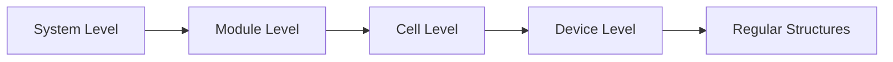
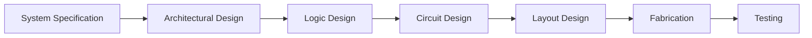

## પ્રશ્ન 1(અ) [3 ગુણ]

**High K FINFET ના ફાયદા લખો.**

**જવાબ**:

| **ફાયદો** | **વર્ણન** |
|-----------|-----------|
| **ઓછો leakage current** | સારું **ગેટ કંટ્રોલ** પાવર consumption ઘટાડે છે |
| **સુધારેલી performance** | વધુ **ડ્રાઇવ કરંટ** અને ઝડપી switching |
| **વધુ સારી scalability** | **Moore's law scaling** ચાલુ રાખવાની મંજૂરી આપે છે |

- **High K dielectric**: **ગેટ leakage** નોંધપાત્ર રીતે ઘટાડે છે
- **3D structure**: **ચેનલ પર વધુ સારું electrostatic control**
- **ઓછી પાવર**: **static અને dynamic power** બંને ઘટાડે છે

**મેમરી ટ્રીક:** "High Performance, Low Power, Better Control"

---

## પ્રશ્ન 1(બ) [4 ગુણ]

**વ્યાખ્યા કરો: (1) pinch off point (2) Threshold Voltage.**

**જવાબ**:

**મુખ્ય MOSFET Parameters:**

| **શબ્દ** | **વ્યાખ્યા** | **મહત્વ** |
|---------|------------|----------|
| **Pinch-off Point** | **ચેનલ સંપૂર્ણ deplete** થતું સ્થાન | **Saturation region** માં પ્રવેશ દર્શાવે છે |
| **Threshold Voltage** | **Conducting channel** બનાવવા માટે લઘુતમ VGS | **ON/OFF switching point** નિર્ધારે છે |

- **Pinch-off point**: VDS = VGS - VT, **ચેનલ શૂન્ય પહોળાઈ** સુધી સંકુચિત થાય છે
- **Threshold voltage**: **Enhancement MOSFET** માટે સામાન્ય રીતે 0.7V
- **મહત્વપૂર્ણ parameters**: બંને **MOSFET operating regions** નિર્ધારે છે

**મેમરી ટ્રીક:** "Threshold Turns ON, Pinch-off Points to Saturation"

---

## પ્રશ્ન 1(ક) [7 ગુણ]

**MOSFET transistor નું બંધારણ દોરો અને સમજાવો.**

**જવાબ**:

**ડાયાગ્રામ:**

```goat
    Gate (G)
      |
   ┌──┴──┐
   │ SiO2│    
┌──┴─────┴──┐
│  n+   n+  │ ← Source (S) and Drain (D)
│     p     │ ← P-substrate  
└───────────┘
    Body (B)
```

**બંધારણના ઘટકો:**

| **ઘટક** | **સામગ્રી** | **કાર્ય** |
|---------|------------|----------|
| **Gate** | **Polysilicon/Metal** | **ચેનલ formation** કંટ્રોલ કરે છે |
| **Gate oxide** | **SiO2** | **Gate ને substrate** થી અલગ કરે છે |
| **Source/Drain** | **n+ doped silicon** | **Current ના પ્રવેશ/બહાર નીકળવાના સ્થળો** |
| **Substrate** | **p-type silicon** | **Body connection** પૂરું પાડે છે |

- **ચેનલ formation**: **Oxide-semiconductor interface** પર થાય છે
- **Enhancement mode**: VGS > VT હોય ત્યારે **ચેનલ બને છે**
- **ચાર-terminal device**: **Gate, Source, Drain, Body connections**

**મેમરી ટ્રીક:** "Gate Controls, Oxide Isolates, Source-Drain Conducts"

---

## પ્રશ્ન 1(ક OR) [7 ગુણ]

**Full Voltage Scaling અને Constant Voltage Scaling ની સરખામણી કરો.**

**જવાબ**:

**સરખામણી કોષ્ટક:**

| **Parameter** | **Full Voltage Scaling** | **Constant Voltage Scaling** |
|---------------|-------------------------|------------------------------|
| **Supply voltage** | α વડે **scale down** | **સ્થિર રહે છે** |
| **Gate oxide thickness** | α વડે **scale down** | α વડે **scale down** |
| **Channel length** | α વડે **scale down** | α વડે **scale down** |
| **Power density** | **સ્થિર રહે છે** | α² વડે **વધે છે** |
| **Performance** | **મધ્યમ સુધારો** | **વધુ સારી performance** |
| **Reliability** | **વધુ સારી** | **High fields** ને કારણે નબળી |

- **Full scaling**: **બધા dimensions અને voltages** પ્રમાણસર scale કરાય છે
- **Constant voltage**: **ફક્ત physical dimensions** scale કરાય છે, voltage અપરિવર્તિત
- **Trade-off**: **Performance vs power vs reliability**

**મેમરી ટ્રીક:** "Full scales All, Constant keeps Voltage"

---

## પ્રશ્ન 2(અ) [3 ગુણ]

**રેસિસ્ટિવ લોડ ઇનવર્ટર દોરો. જુદા જુદા ઓપરેશન રીજન માટે ઇનપુટ વોલ્ટેજની રેન્જ લખો.**

**જવાબ**:

**સર્કિટ ડાયાગ્રામ:**

```goat
VDD ──┬── RL
      │
      ├── Vout
      │
Vin ──┤ M1 (NMOS)
      │
     GND
```

**ઓપરેટિંગ રીજન કોષ્ટક:**

| **રીજન** | **ઇનપુટ વોલ્ટેજ રેન્જ** | **આઉટપુટ સ્થિતિ** |
|----------|------------------------|------------------|
| **Cut-off** | Vin < VT | Vout = VDD |
| **Triode** | VT < Vin < VDD-VT | **ટ્રાન્ઝિશન** |
| **Saturation** | Vin > VDD-VT | Vout ≈ 0V |

**મેમરી ટ્રીક:** "Cut-off High, Triode Transition, Saturation Low"

---

## પ્રશ્ન 2(બ) [4 ગુણ]

**N channel MOSFET ની VDS-ID અને VGS-ID લાક્ષણિકતાઓ દોરો અને સમજાવો.**

**જવાબ**:

**VDS-ID લાક્ષણિકતાઓ:**

```goat
ID ↑
   │    VGS3
   │   ╱ VGS2
   │  ╱  VGS1
   │ ╱   (VGS3>VGS2>VGS1>VT)
   │╱
   └────────→ VDS
   Triode  Saturation
```

**લાક્ષણિકતાઓ કોષ્ટક:**

| **લાક્ષણિકતા** | **રીજન** | **વર્તન** |
|-----------------|----------|-----------|
| **VDS-ID** | **Triode** | VDS સાથે **Linear વૃદ્ધિ** |
| **VDS-ID** | **Saturation** | **સ્થિર ID** (square law) |
| **VGS-ID** | **Sub-threshold** | **Exponential વૃદ્ધિ** |
| **VGS-ID** | **VT ઉપર** | **Square law relationship** |

- **Triode region**: ID વડે VDS સાથે **linearly વધે છે**
- **Saturation**: ID **VDS થી સ્વતંત્ર**, VGS પર આધારિત
- **Square law**: **Saturation** માં ID ∝ (VGS-VT)²

**મેમરી ટ્રીક:** "Linear in Triode, Square in Saturation"

---

## પ્રશ્ન 2(ક) [7 ગુણ]

**ડિપ્લેશન લોડ NMOS ઇનવર્ટર સર્કિટ દોરો અને તેની કાર્યપદ્ધતિ સમજાવો.**

**જવાબ**:

**સર્કિટ ડાયાગ્રામ:**

```goat
VDD ──┬─── ML (Depletion)
      │    Gate connected to Source
      ├─── Vout
      │
Vin ──┤    M1 (Enhancement)
      │
     GND
```

**ઓપરેશન કોષ્ટક:**

| **ઇનપુટ** | **M1 સ્થિતિ** | **ML સ્થિતિ** | **આઉટપુટ** |
|-----------|-------------|-------------|------------|
| **Low (0V)** | **Cut-off** | **Active load** | **High (VDD)** |
| **High (VDD)** | **Saturated** | **Linear** | **Low** |

- **Depletion load**: **હંમેશા conducting**, **current source** તરીકે કાર્ય કરે છે
- **વધુ સારી performance**: **Resistive load** કરતાં **higher output voltage swing**
- **Gate connection**: **Depletion operation** માટે ML નું **gate source સાથે જોડાયેલું**
- **સુધારેલું noise margin**: **Enhancement load** કરતાં **વધુ સારું VOH**

**મેમરી ટ્રીક:** "Depletion Always ON, Enhancement Controls Flow"

---

## પ્રશ્ન 2(અ OR) [3 ગુણ]

**CMOS ઇનવર્ટર ના ફાયદા વર્ણવો.**

**જવાબ**:

**ફાયદા કોષ્ટક:**

| **ફાયદો** | **લાભ** |
|-----------|----------|
| **શૂન્ય static power** | **Steady state** માં કોઈ current નહીં |
| **સંપૂર્ણ voltage swing** | **આઉટપુટ 0V થી VDD** સુધી swing કરે છે |
| **ઉચ્ચ noise margins** | **વધુ સારી noise immunity** |

- **Complementary operation**: **એક transistor હંમેશા OFF**
- **ઉચ્ચ input impedance**: **Gate isolation** ઉચ્ચ impedance પૂરું પાડે છે
- **ઝડપી switching**: **ઓછા parasitic capacitances**

**મેમરી ટ્રીક:** "Zero Power, Full Swing, High Immunity"

---

## પ્રશ્ન 2(બ OR) [4 ગુણ]

**નોઇસ માર્જિન વિગતવાર દોરો અને સમજાવો.**

**જવાબ**:

**વોલ્ટેજ ટ્રાન્સફર લાક્ષણિકતાઓ:**

```goat
Vout ↑
VDD  ┌─────┐
     │     │
     │     │ ← NMH
VOH  ┤     └─────
     │           ╲
     │            ╲
     │             ╲
VOL  ┤              └─────
     │                   
  0V └─────────────────→ Vin
    0V  VIL  VIH      VDD
       ←NML→
```

**નોઇસ માર્જિન Parameters:**

| **Parameter** | **Formula** | **સામાન્ય મૂલ્ય** |
|---------------|-------------|------------------|
| **NMH** | VOH - VIH | **VDD ના 40%** |
| **NML** | VIL - VOL | **VDD ના 40%** |

- **High noise margin**: **Positive noise** સામે immunity
- **Low noise margin**: **Negative noise** સામે immunity
- **વધુ સારા CMOS**: **અન્ય logic families** કરતાં **higher noise margins**

**મેમરી ટ્રીક:** "High goes Higher, Low goes Lower"

---

## પ્રશ્ન 2(ક OR) [7 ગુણ]

**N MOS ઇનવર્ટર ની VTC દોરો અને સમજાવો.**

**જવાબ**:

**વોલ્ટેજ ટ્રાન્સફર લાક્ષણિકતાઓ:**

```goat
Vout ↑
VDD  ┌─┐
     │ │
     │ │ ← Region I
     │ └─┐
     │   │ ← Region II  
     │   │
     │   └─┐
     │     │ ← Region III
     │     └────→ Vin
  0V └─────────────
    0V VT        VDD
```

**ઓપરેટિંગ રીજન કોષ્ટક:**

| **રીજન** | **Vin રેન્જ** | **M1 સ્થિતિ** | **Vout** |
|----------|---------------|-------------|----------|
| **I** | **0 થી VT** | **Cut-off** | **VDD** |
| **II** | **VT થી VT+VTL** | **Saturation** | **ઘટતું** |
| **III** | **VT+VTL થી VDD** | **Triode** | **નીચું** |

- **Region I**: **M1 OFF**, કોઈ current flow નહીં, Vout = VDD
- **Region II**: **M1 saturation** માં, **તીવ્ર transition**
- **Region III**: **M1 triode** માં, **ધીમેથી ઘટાડો**
- **Load line**: **Operating point intersection** નિર્ધારે છે

**મેમરી ટ્રીક:** "Cut-off High, Saturation Sharp, Triode Low"

---

## પ્રશ્ન 3(અ) [3 ગુણ]

**Generalized મલ્ટીપલ ઇનપુટ NOR gate નું બાંધકામ ડિપ્લેશન NMOS લોડ સાથે દોરો અને સમજાવો.**

**જવાબ**:

**સર્કિટ ડાયાગ્રામ:**

```goat
VDD ──┬─── ML (Depletion Load)
      │
      ├─── Y = (A+B+C)'
      │
A  ───┤ M1
      │
B  ───┤ M2  ← Parallel Connection
      │
C  ───┤ M3
      │
     GND
```

**સત્ય કોષ્ટક:**

| **ઇનપુટ્સ** | **કોઈ ઇનપુટ High?** | **આઉટપુટ Y** |
|------------|-------------------|--------------|
| **બધા Low** | **ના** | **High (1)** |
| **કોઈ High** | **હા** | **Low (0)** |

- **Parallel NMOS**: **કોઈપણ input HIGH** હોય તો **output LOW** થાય છે
- **NOR operation**: Y = (A+B+C)'
- **Depletion load**: **Pull-up current** પૂરું પાડે છે

**મેમરી ટ્રીક:** "Parallel Pulls Down, Depletion Pulls Up"

---

## પ્રશ્ન 3(બ) [4 ગુણ]

**AOI અને OAI ના તફાવત લખો.**

**જવાબ**:

**સરખામણી કોષ્ટક:**

| **Parameter** | **AOI (AND-OR-Invert)** | **OAI (OR-AND-Invert)** |
|---------------|------------------------|------------------------|
| **Logic function** | Y = (AB + CD)' | Y = ((A+B)(C+D))' |
| **NMOS structure** | **Series-parallel** | **Parallel-series** |
| **PMOS structure** | **Parallel-series** | **Series-parallel** |
| **જટિલતા** | **મધ્યમ** | **મધ્યમ** |

- **AOI**: **AND terms ORed** પછી **inverted**
- **OAI**: **OR terms ANDed** પછી **inverted**
- **CMOS implementation**: **Dual network structure**
- **Applications**: **Single stage** માં **complex logic functions**

**મેમરી ટ્રીક:** "AOI: AND-OR-Invert, OAI: OR-AND-Invert"

---

## પ્રશ્ન 3(ક) [7 ગુણ]

**EX-OR gate CMOS ની મદદથી અને લોજીક ફંક્શન Z = (AB +CD)' NMOS લોડની મદદથી અમલમાં મૂકો.**

**જવાબ**:

**EX-OR CMOS Implementation:**

```goat
VDD ─┬─ pMOS network
     │  (A'B + AB')
     ├─ Y = A⊕B  
     │
     ├─ nMOS network
     │  (AB + A'B')
    GND
```

**Z = (AB + CD)' NMOS Implementation:**

```goat
VDD ─┬─ Resistive Load
     │
     ├─ Z = (AB + CD)'
     │
A ─┬─┤ M1 ── B ─┤ M2  (Series: AB)
   │ │           │
C ─┤ M3 ── D ─┤ M4     (Series: CD)
   │           │
  GND ────────┴─      (Parallel connection)
```

**લોજીક Implementation કોષ્ટક:**

| **સર્કિટ** | **ફંક્શન** | **Implementation** |
|------------|-------------|-------------------|
| **EX-OR** | A⊕B | **Complementary CMOS** |
| **AOI** | (AB+CD)' | **Series-parallel NMOS** |

- **EX-OR**: **Efficient implementation** માટે **transmission gates** જરૂરી
- **AOI function**: **Natural NMOS implementation**
- **Power consideration**: **CMOS માં zero static power**

**મેમરી ટ્રીક:** "EX-OR needs Transmission, AOI uses Series-Parallel"

---

## પ્રશ્ન 3(અ OR) [3 ગુણ]

**Generalized મલ્ટીપલ ઇનપુટ NAND gate નું બાંધકામ ડિપ્લેશન NMOS લોડ સાથે દોરો અને સમજાવો.**

**જવાબ**:

**સર્કિટ ડાયાગ્રામ:**

```goat
VDD ──┬─── ML (Depletion Load)
      │
      ├─── Y = (ABC)'
      │
A  ───┤ M1
      │
B  ───┤ M2  ← Series Connection  
      │
C  ───┤ M3
      │
     GND
```

**ઓપરેશન કોષ્ટક:**

| **સ્થિતિ** | **Ground તરફ પાથ** | **આઉટપુટ Y** |
|-----------|-------------------|--------------|
| **બધા inputs HIGH** | **સંપૂર્ણ પાથ** | **Low (0)** |
| **કોઈ input LOW** | **તૂટેલો પાથ** | **High (1)** |

- **Series NMOS**: **બધા inputs HIGH** હોવા જરૂરી **output LOW** કરવા માટે
- **NAND operation**: Y = (ABC)'
- **Depletion load**: **હંમેશા pull-up current** પૂરું પાડે છે

**મેમરી ટ્રીક:** "Series Needs All, NAND Says Not-AND"

---

## પ્રશ્ન 3(બ OR) [4 ગુણ]

**((P+R)(S+T))' લોજીક ફંક્શન CMOS લોજીકની મદદથી અમલીકરણ કરો.**

**જવાબ**:

**CMOS Implementation:**

```goat
VDD ─┬─ pMOS Network
     │  P─┤├─R in series with S─┤├─T in series
     ├─ Y = ((P+R)(S+T))'
     │
     ├─ nMOS Network  
     │  (P,R parallel) in series with (S,T parallel)
    GND
```

**સત્ય કોષ્ટક Implementation:**

| **PMOS Network** | **NMOS Network** | **ઓપરેશન** |
|------------------|------------------|-------------|
| **(P+R)'+(S+T)'** | **(P+R)(S+T)** | **Complementary** |
| **P'R' + S'T'** | **PS + PT + RS + RT** | **De Morgan's law** |

- **PMOS**: **Groups વિથિન parallel**, **groups વચ્ચે series**
- **NMOS**: **Groups વિથિન series**, **groups વચ્ચે parallel**
- **Dual network**: **Complementary operation** સુનિશ્ચિત કરે છે

**મેમરી ટ્રીક:** "PMOS does Opposite of NMOS"

---

## પ્રશ્ન 3(ક OR) [7 ગુણ]

**SR latch circuit ની કાર્યપદ્ધતિ વર્ણવો.**

**જવાબ**:

**SR Latch સર્કિટ:**

```goat
S ─┤ NOR   ├─┬─ Q
   │  G1   │ │
   └───────┤ │
           │ │
   ┌───────┤ │
   │ NOR   │ │
R ─┤  G2   ├─┴─ Q'
   └───────┘
```

**સત્ય કોષ્ટક:**

| **S** | **R** | **Q(n+1)** | **Q'(n+1)** | **સ્થિતિ** |
|-------|-------|------------|-------------|-----------|
| **0** | **0** | Q(n) | Q'(n) | **Hold** |
| **0** | **1** | 0 | 1 | **Reset** |
| **1** | **0** | 1 | 0 | **Set** |
| **1** | **1** | 0 | 0 | **અમાન્ય** |

- **Set operation**: S=1, R=0 થી Q=1 થાય છે
- **Reset operation**: S=0, R=1 થી Q=0 થાય છે
- **Hold state**: S=0, R=0 **પહેલાની state** જાળવે છે
- **અમાન્ય state**: S=1, R=1 **ટાળવી જોઈએ**
- **Cross-coupled**: **એક gate નું output બીજાના input** માં જાય છે

**મેમરી ટ્રીક:** "Set Sets, Reset Resets, Both Bad"

---

## પ્રશ્ન 4(અ) [3 ગુણ]

**ચિપ ફેબ્રિકેશન માં Etching methods ની સરખામણી કરો.**

**જવાબ**:

**Etching Methods સરખામણી:**

| **પદ્ધતિ** | **પ્રકાર** | **ફાયદા** | **નુકસાન** |
|----------|----------|-----------|------------|
| **Wet Etching** | **રાસાયણિક** | **ઉચ્ચ selectivity**, સરળ | **Isotropic**, undercut |
| **Dry Etching** | **ભૌતિક/રાસાયણિક** | **Anisotropic**, ચોક્કસ | **જટિલ સાધનો** |
| **Plasma Etching** | **Ion bombardment** | **Directional control** | **સપાટીને નુકસાન** |

- **Wet etching**: **પ્રવાહી રસાયણો** વાપરે છે, **બધી દિશાઓમાં હુમલો**
- **Dry etching**: **ગેસ/plasma** વાપરે છે, **વધુ સારું directional control**
- **Selectivity**: **એક સામગ્રીને બીજા કરતાં etch** કરવાની ક્ષમતા

**મેમરી ટ્રીક:** "Wet is Wide, Dry is Directional"

---

## પ્રશ્ન 4(બ) [4 ગુણ]

**ટૂંક નોંધ લખો : Lithography**

**જવાબ**:

**Lithography Process Steps:**

| **સ્ટેપ** | **પ્રક્રિયા** | **હેતુ** |
|----------|-------------|----------|
| **Resist coating** | **Photoresist નું spin-on** | **પ્રકાશ-સંવેદનશીલ layer** |
| **Exposure** | **Mask દ્વારા UV light** | **Pattern transfer** |
| **Development** | **Exposed resist દૂર કરવું** | **Pattern પ્રગટ કરવું** |
| **Etching** | **અસુરક્ષિત material દૂર કરવું** | **Features બનાવવા** |

- **Pattern transfer**: **Mask થી silicon wafer** પર
- **Resolution**: **Minimum feature size** નિર્ધારે છે
- **Alignment**: **Multiple layer processing** માટે મહત્વપૂર્ણ
- **UV wavelength**: **ટૂંકી wavelength** વધુ સારું resolution આપે છે

**મેમરી ટ્રીક:** "Coat, Expose, Develop, Etch"

---

## પ્રશ્ન 4(ક) [7 ગુણ]

**Regularity, Modularity and Locality સમજાવો.**

**જવાબ**:

**ડિઝાઈન સિદ્ધાંતો કોષ્ટક:**

| **સિદ્ધાંત** | **વ્યાખ્યા** | **ફાયદા** | **ઉદાહરણ** |
|-------------|------------|-----------|-----------|
| **Regularity** | **સમાન structures નું પુનરાવર્તન** | **સરળ design, testing** | **Memory arrays** |
| **Modularity** | **Hierarchical design blocks** | **Reusability, maintainability** | **Standard cells** |
| **Locality** | **સંબંધિત functions નું જૂથ** | **ઓછું interconnect** | **Functional blocks** |

**Implementation વિગતો:**

- **Regularity**: **સમાન cell બારંબાર** વાપરવાથી **design complexity** ઘટે છે
- **Modularity**: **Well-defined interfaces** સાથે **top-down design**
- **Locality**: **Wire delays અને routing congestion** ઘટાડે છે
- **Design benefits**: **ઝડપી design cycle**, **વધુ સારી testability**
- **Manufacturing**: **Regular patterns** દ્વારા **સુધારેલી yield**

**Mermaid Diagram:**



**મેમરી ટ્રીક:** "Regular Modules with Local Connections"

---

## પ્રશ્ન 4(અ OR) [3 ગુણ]

**Design Hierarchy વ્યાખ્યાયિત કરો.**

**જવાબ**:

**Design Hierarchy Levels:**

| **સ્તર** | **વિવરણ** | **ઘટકો** |
|---------|-----------|----------|
| **System** | **સંપૂર્ણ chip functionality** | **Processors, memories** |
| **Module** | **મુખ્ય functional blocks** | **ALU, cache, I/O** |
| **Cell** | **મૂળભૂત logic elements** | **Gates, flip-flops** |

- **Top-down approach**: **System નાના modules** માં વિભાજિત
- **Abstraction levels**: **દરેક level નીચેની details છુપાવે** છે
- **Interface definition**: **Levels વચ્ચે સ્પષ્ટ boundaries**

**મેમરી ટ્રીક:** "System to Module to Cell"

---

## પ્રશ્ન 4(બ OR) [4 ગુણ]

**VLSI design flow chart દોરો અને સમજાવો.**

**જવાબ**:

**VLSI Design Flow:**



**Design Flow કોષ્ટક:**

| **તબક્કો** | **ઇનપુટ** | **આઉટપુટ** | **સાધનો** |
|-----------|-----------|------------|----------|
| **Architecture** | **Specifications** | **Block diagram** | **High-level modeling** |
| **Logic** | **Architecture** | **Gate netlist** | **HDL synthesis** |
| **Circuit** | **Netlist** | **Transistor sizing** | **SPICE simulation** |
| **Layout** | **Circuit** | **Mask data** | **Place & route** |

**મેમરી ટ્રીક:** "Specify, Architect, Logic, Circuit, Layout, Fabricate, Test"

---

## પ્રશ્ન 4(ક OR) [7 ગુણ]

**ટૂંક નોંધ લખો : 'VLSI Fabrication Process'**

**જવાબ**:

**મુખ્ય Fabrication Steps:**

| **પ્રક્રિયા** | **હેતુ** | **પરિણામ** |
|-------------|----------|------------|
| **Oxidation** | **SiO2 layer વૃદ્ધિ** | **Gate oxide formation** |
| **Lithography** | **Pattern transfer** | **Device areas વ્યાખ્યા** |
| **Etching** | **અનાવશ્યક material દૂર કરવું** | **Device structures બનાવવા** |
| **Ion Implantation** | **Dopants ઉમેરવા** | **P/N regions બનાવવા** |
| **Deposition** | **Material layers ઉમેરવા** | **Metal interconnects** |
| **Diffusion** | **Dopants ફેલાવવા** | **Junction formation** |

**Process Flow:**

- **Wafer preparation**: **સ્વચ્છ silicon substrate**
- **Device formation**: **બિનેક steps દ્વારા transistors** બનાવવા
- **Interconnect**: **Connections માટે metal layers** ઉમેરવા
- **Passivation**: **પૂર્ણ થયેલા circuit ની સુરક્ષા**
- **Testing**: **Packaging પહેલાં functionality verify** કરવી

**Clean Room જરૂરિયાતો:**

- **Class 1-10**: **અત્યંત સ્વચ્છ વાતાવરણ** જરૂરી
- **Temperature control**: **ચોક્કસ process control**
- **Chemical purity**: **ઉચ્ચ-ગ્રેડ materials** જરૂરી

**મેમરી ટ્રીક:** "Oxidize, Pattern, Etch, Implant, Deposit, Diffuse"

---

## પ્રશ્ન 5(અ) [3 ગુણ]

**વેરીલોગ પ્રોગ્રામિંગની જુદી જુદી પદ્ધતિ સરખાવો.**

**જવાબ**:

**Verilog Modeling Styles:**

| **શૈલી** | **વિવરણ** | **ઉપયોગ** |
|---------|-----------|----------|
| **Behavioral** | **Algorithm description** | **High-level modeling** |
| **Dataflow** | **Boolean expressions** | **Combinational logic** |
| **Structural** | **Gate-level description** | **Hardware representation** |

- **Behavioral**: **Always blocks, if-else, case statements** વાપરે છે
- **Dataflow**: **Boolean operators સાથે assign statements** વાપરે છે
- **Structural**: **Gates અને modules explicitly instantiate** કરે છે

**મેમરી ટ્રીક:** "Behavior Describes, Dataflow Assigns, Structure Connects"

---

## પ્રશ્ન 5(બ) [4 ગુણ]

**બિહેવિયરલ પદ્ધતિ થી NAND gate નો વેરીલોગ પ્રોગ્રામ લખો.**

**જવાબ**:

```verilog
module nand_gate_behavioral(
    input wire a, b,
    output reg y
);

always @(a or b) begin
    if (a == 1'b1 && b == 1'b1)
        y = 1'b0;
    else
        y = 1'b1;
end

endmodule
```

**કોડ સમજૂતી:**

- **Always block**: **Inputs બદલાય** ત્યારે execute થાય છે
- **Sensitivity list**: **બધા input signals** સમાવે છે
- **Conditional statement**: **NAND logic implement** કરે છે
- **Reg declaration**: **Procedural assignment** માટે જરૂરી

**મેમરી ટ્રીક:** "Always watch, IF both high THEN low ELSE high"

---

## પ્રશ્ન 5(ક) [7 ગુણ]

**4X1 multiplexer ની સર્કિટ દોરો. Case સ્ટેટમેંટ થી આ સર્કિટ નો વેરીલોગ પ્રોગ્રામ બનાવો.**

**જવાબ**:

**4X1 Multiplexer સર્કિટ:**

```goat
I0 ──┐
I1 ──┼─── MUX ──── Y
I2 ──┤    4X1
I3 ──┘
  S1,S0 (Select)
```

**Verilog કોડ:**

```verilog
module mux_4x1_case(
    input wire [1:0] sel,
    input wire i0, i1, i2, i3,
    output reg y
);

always @(*) begin
    case (sel)
        2'b00: y = i0;
        2'b01: y = i1;
        2'b10: y = i2;
        2'b11: y = i3;
        default: y = 1'bx;
    endcase
end

endmodule
```

**સત્ય કોષ્ટક:**

| **S1** | **S0** | **આઉટપુટ Y** |
|--------|--------|-------------|
| **0** | **0** | **I0** |
| **0** | **1** | **I1** |
| **1** | **0** | **I2** |
| **1** | **1** | **I3** |

**મેમરી ટ્રીક:** "Case Selects, Default Protects"

---

## પ્રશ્ન 5(અ OR) [3 ગુણ]

**ઉદાહરણ સાથે Testbench વ્યાખ્યાયિત કરો.**

**જવાબ**:

**Testbench વ્યાખ્યા:**
**Testbench એ Verilog module** છે જે **design under test (DUT) ને stimulus** પૂરું પાડે છે અને **તેના response ને monitor** કરે છે.

**ઉદાહરણ Testbench:**

```verilog
module test_and_gate;
    reg a, b;
    wire y;
    
    and_gate dut(.a(a), .b(b), .y(y));
    
    initial begin
        a = 0; b = 0; #10;
        a = 0; b = 1; #10;
        a = 1; b = 0; #10;
        a = 1; b = 1; #10;
    end
endmodule
```

- **DUT instantiation**: **Design under test નું instance** બનાવે છે
- **Stimulus generation**: **Input test vectors** પૂરા પાડે છે
- **કોઈ ports નહીં**: **Testbench top-level module** છે

**મેમરી ટ્રીક:** "Test Provides Stimulus, Monitors Response"

---

## પ્રશ્ન 5(બ OR) [4 ગુણ]

**ડેટા ફ્લો પદ્ધતિ થી Half Adder નો વેરીલોગ પ્રોગ્રામ લખો.**

**જવાબ**:

```verilog
module half_adder_dataflow(
    input wire a, b,
    output wire sum, carry
);

assign sum = a ^ b;    // XOR for sum
assign carry = a & b;  // AND for carry

endmodule
```

**લોજીક Implementation:**

- **Sum**: **Inputs વચ્ચે XOR operation**
- **Carry**: **Inputs વચ્ચે AND operation**
- **Assign statement**: **Dataflow માટે continuous assignment**
- **Boolean operators**: **^ (XOR), & (AND)**

**સત્ય કોષ્ટક:**

| **A** | **B** | **Sum** | **Carry** |
|-------|-------|---------|-----------|
| **0** | **0** | **0** | **0** |
| **0** | **1** | **1** | **0** |
| **1** | **0** | **1** | **0** |
| **1** | **1** | **0** | **1** |

**મેમરી ટ્રીક:** "XOR Sums, AND Carries"

---

## પ્રશ્ન 5(ક OR) [7 ગુણ]

**Encoder નું કાર્ય લખો. if..else વડે 8X3 Encoder નો વેરીલોગ કોડ બનાવો.**

**જવાબ**:

**Encoder કાર્ય:**
**Encoder 2ⁿ input lines ને n output lines** માં convert કરે છે. **8X3 encoder 8 inputs ને 3-bit binary output** માં convert કરે છે.

**Priority કોષ્ટક:**

| **ઇનપુટ** | **Binary આઉટપુટ** |
|-----------|-------------------|
| **I7** | **111** |
| **I6** | **110** |
| **I5** | **101** |
| **I4** | **100** |
| **I3** | **011** |
| **I2** | **010** |
| **I1** | **001** |
| **I0** | **000** |

**Verilog કોડ:**

```verilog
module encoder_8x3(
    input wire [7:0] i,
    output reg [2:0] y
);

always @(*) begin
    if (i[7])
        y = 3'b111;
    else if (i[6])
        y = 3'b110;
    else if (i[5])
        y = 3'b101;
    else if (i[4])
        y = 3'b100;
    else if (i[3])
        y = 3'b011;
    else if (i[2])
        y = 3'b010;
    else if (i[1])
        y = 3'b001;
    else if (i[0])
        y = 3'b000;
    else
        y = 3'bxxx;
end

endmodule
```

- **Priority encoding**: **ઉચ્ચ index inputs ને priority**
- **If-else chain**: **Priority logic implement** કરે છે
- **Binary encoding**: **Active input ને binary representation** માં convert કરે છે

**મેમરી ટ્રીક:** "Priority from High to Low, Binary Output Flows"
