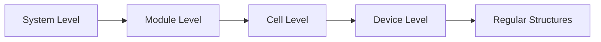
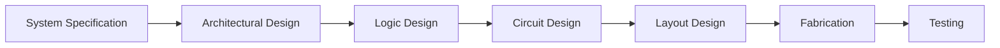

## Question 1(a) [3 marks]

**Write advantages of High K FINFET.**

**Answer**:

| **Advantage** | **Description** |
|---------------|-----------------|
| **Reduced leakage current** | Better gate control reduces power consumption |
| **Improved performance** | Higher drive current and faster switching |
| **Better scalability** | Enables continued Moore's law scaling |

- **High K dielectric**: Reduces gate leakage significantly
- **3D structure**: Better electrostatic control over channel
- **Lower power**: Reduced static and dynamic power consumption

**Mnemonic:** "High Performance, Low Power, Better Control"

---

## Question 1(b) [4 marks]

**Define terms: (1) pinch off point (2) Threshold Voltage.**

**Answer**:

**Table: Key MOSFET Parameters**

| **Term** | **Definition** | **Significance** |
|----------|----------------|------------------|
| **Pinch-off Point** | Point where channel becomes completely depleted | Marks transition to saturation region |
| **Threshold Voltage** | Minimum VGS needed to form conducting channel | Determines ON/OFF switching point |

- **Pinch-off point**: VDS = VGS - VT, channel narrows to zero width
- **Threshold voltage**: Typically 0.7V for enhancement MOSFET
- **Critical parameters**: Both determine MOSFET operating regions

**Mnemonic:** "Threshold Turns ON, Pinch-off Points to Saturation"

---

## Question 1(c) [7 marks]

**Draw and explain structure of MOSFET transistor.**

**Answer**:

**Diagram:**

```goat
    Gate (G)
      |
   ┌──┴──┐
   │ SiO2│    
┌──┴─────┴──┐
│  n+   n+  │ ← Source (S) and Drain (D)
│     p     │ ← P-substrate  
└───────────┘
    Body (B)
```

**Structure Components Table:**

| **Component** | **Material** | **Function** |
|---------------|-------------|--------------|
| **Gate** | Polysilicon/Metal | Controls channel formation |
| **Gate oxide** | SiO2 | Insulates gate from substrate |
| **Source/Drain** | n+ doped silicon | Current entry/exit points |
| **Substrate** | p-type silicon | Provides body connection |

- **Channel formation**: Occurs at oxide-semiconductor interface
- **Enhancement mode**: Channel forms when VGS > VT
- **Four-terminal device**: Gate, Source, Drain, Body connections

**Mnemonic:** "Gate Controls, Oxide Isolates, Source-Drain Conducts"

---

## Question 1(c OR) [7 marks]

**Compare Full Voltage Scaling and Constant Voltage Scaling.**

**Answer**:

**Comparison Table:**

| **Parameter** | **Full Voltage Scaling** | **Constant Voltage Scaling** |
|---------------|-------------------------|------------------------------|
| **Supply voltage** | Scaled down by α | Remains constant |
| **Gate oxide thickness** | Scaled down by α | Scaled down by α |
| **Channel length** | Scaled down by α | Scaled down by α |
| **Power density** | Remains constant | Increases by α² |
| **Performance** | Moderate improvement | Better performance |
| **Reliability** | Better | Degraded due to high fields |

- **Full scaling**: All dimensions and voltages scaled proportionally
- **Constant voltage**: Only physical dimensions scaled, voltage unchanged
- **Trade-off**: Performance vs power vs reliability

**Mnemonic:** "Full scales All, Constant keeps Voltage"

---

## Question 2(a) [3 marks]

**Draw Resistive Load Inverter. Write the input voltage range for different operating region of operation.**

**Answer**:

**Circuit Diagram:**

```goat
VDD ──┬── RL
      │
      ├── Vout
      │
Vin ──┤ M1 (NMOS)
      │
     GND
```

**Operating Regions Table:**

| **Region** | **Input Voltage Range** | **Output State** |
|------------|------------------------|------------------|
| **Cut-off** | Vin < VT | Vout = VDD |
| **Triode** | VT < Vin < VDD-VT | Transition |
| **Saturation** | Vin > VDD-VT | Vout ≈ 0V |

**Mnemonic:** "Cut-off High, Triode Transition, Saturation Low"

---

## Question 2(b) [4 marks]

**Draw and Explain VDS-ID and VGS-ID characteristics of N channel MOSFET.**

**Answer**:

**VDS-ID Characteristics:**

```goat
ID ↑
   │    VGS3
   │   ╱ VGS2
   │  ╱  VGS1
   │ ╱   (VGS3>VGS2>VGS1>VT)
   │╱
   └────────→ VDS
   Triode  Saturation
```

**Characteristics Table:**

| **Characteristic** | **Region** | **Behavior** |
|-------------------|------------|--------------|
| **VDS-ID** | Triode | Linear increase with VDS |
| **VDS-ID** | Saturation | Constant ID (square law) |
| **VGS-ID** | Sub-threshold | Exponential increase |
| **VGS-ID** | Above VT | Square law relationship |

- **Triode region**: ID increases linearly with VDS
- **Saturation**: ID independent of VDS, depends on VGS
- **Square law**: ID ∝ (VGS-VT)² in saturation

**Mnemonic:** "Linear in Triode, Square in Saturation"

---

## Question 2(c) [7 marks]

**Draw & Explain working of Depletion Load NMOS Inverter circuit.**

**Answer**:

**Circuit Diagram:**

```goat
VDD ──┬─── ML (Depletion)
      │    Gate connected to Source
      ├─── Vout
      │
Vin ──┤    M1 (Enhancement)
      │
     GND
```

**Operation Table:**

| **Input** | **M1 State** | **ML State** | **Output** |
|-----------|-------------|-------------|------------|
| **Low (0V)** | Cut-off | Active load | High (VDD) |
| **High (VDD)** | Saturated | Linear | Low |

- **Depletion load**: Always conducting, acts as current source
- **Better performance**: Higher output voltage swing than resistive load
- **Gate connection**: ML gate tied to source for depletion operation
- **Improved noise margin**: Better VOH compared to enhancement load

**Mnemonic:** "Depletion Always ON, Enhancement Controls Flow"

---

## Question 2(a OR) [3 marks]

**Describe advantages of CMOS Inverter.**

**Answer**:

**Advantages Table:**

| **Advantage** | **Benefit** |
|---------------|-------------|
| **Zero static power** | No current in steady state |
| **Full voltage swing** | Output swings from 0V to VDD |
| **High noise margins** | Better noise immunity |

- **Complementary operation**: One transistor always OFF
- **High input impedance**: Gate isolation provides high impedance
- **Fast switching**: Low parasitic capacitances

**Mnemonic:** "Zero Power, Full Swing, High Immunity"

---

## Question 2(b OR) [4 marks]

**Draw and Explain Noise Margin in detail.**

**Answer**:

**Voltage Transfer Characteristics:**

```goat
Vout ↑
VDD  ┌─────┐
     │     │
     │     │ ← NMH
VOH  ┤     └─────
     │           ╲
     │            ╲
     │             ╲
VOL  ┤              └─────
     │                   
  0V └─────────────────→ Vin
    0V  VIL  VIH      VDD
       ←NML→
```

**Noise Margin Parameters:**

| **Parameter** | **Formula** | **Typical Value** |
|---------------|-------------|-------------------|
| **NMH** | VOH - VIH | 40% of VDD |
| **NML** | VIL - VOL | 40% of VDD |

- **High noise margin**: Immunity to positive noise
- **Low noise margin**: Immunity to negative noise
- **Better CMOS**: Higher noise margins than other logic families

**Mnemonic:** "High goes Higher, Low goes Lower"

---

## Question 2(c OR) [7 marks]

**Draw and Explain VTC of N MOS Inverter.**

**Answer**:

**Voltage Transfer Characteristics:**

```goat
Vout ↑
VDD  ┌─┐
     │ │
     │ │ ← Region I
     │ └─┐
     │   │ ← Region II  
     │   │
     │   └─┐
     │     │ ← Region III
     │     └────→ Vin
  0V └─────────────
    0V VT        VDD
```

**Operating Regions Table:**

| **Region** | **Vin Range** | **M1 State** | **Vout** |
|------------|---------------|-------------|----------|
| **I** | 0 to VT | Cut-off | VDD |
| **II** | VT to VT+VTL | Saturation | Decreasing |
| **III** | VT+VTL to VDD | Triode | Low |

- **Region I**: M1 OFF, no current flow, Vout = VDD
- **Region II**: M1 in saturation, sharp transition
- **Region III**: M1 in triode, gradual decrease
- **Load line**: Determines operating point intersection

**Mnemonic:** "Cut-off High, Saturation Sharp, Triode Low"

---

## Question 3(a) [3 marks]

**Draw and explain generalized multiple input NOR gate structure with Depletion NMOS load.**

**Answer**:

**Circuit Diagram:**

```goat
VDD ──┬─── ML (Depletion Load)
      │
      ├─── Y = (A+B+C)'
      │
A  ───┤ M1
      │
B  ───┤ M2  ← Parallel Connection
      │
C  ───┤ M3
      │
     GND
```

**Truth Table:**

| **Inputs** | **Any Input High?** | **Output Y** |
|------------|-------------------|--------------|
| **All Low** | No | High (1) |
| **Any High** | Yes | Low (0) |

- **Parallel NMOS**: Any input HIGH pulls output LOW
- **NOR operation**: Y = (A+B+C)'
- **Depletion load**: Provides pull-up current

**Mnemonic:** "Parallel Pulls Down, Depletion Pulls Up"

---

## Question 3(b) [4 marks]

**Differentiate AOI and OAI logic circuits.**

**Answer**:

**Comparison Table:**

| **Parameter** | **AOI (AND-OR-Invert)** | **OAI (OR-AND-Invert)** |
|---------------|------------------------|------------------------|
| **Logic function** | Y = (AB + CD)' | Y = ((A+B)(C+D))' |
| **NMOS structure** | Series-parallel | Parallel-series |
| **PMOS structure** | Parallel-series | Series-parallel |
| **Complexity** | Moderate | Moderate |

- **AOI**: AND terms ORed then inverted
- **OAI**: OR terms ANDed then inverted  
- **CMOS implementation**: Dual network structure
- **Applications**: Complex logic functions in single stage

**Mnemonic:** "AOI: AND-OR-Invert, OAI: OR-AND-Invert"

---

## Question 3(c) [7 marks]

**Implement two input EX-OR gate using CMOS, and logic function Z = (AB +CD)' using NMOS Load.**

**Answer**:

**EX-OR CMOS Implementation:**

```goat
VDD ─┬─ pMOS network
     │  (A'B + AB')
     ├─ Y = A⊕B  
     │
     ├─ nMOS network
     │  (AB + A'B')
    GND
```

**Z = (AB + CD)' NMOS Implementation:**

```goat
VDD ─┬─ Resistive Load
     │
     ├─ Z = (AB + CD)'
     │
A ─┬─┤ M1 ── B ─┤ M2  (Series: AB)
   │ │           │
C ─┤ M3 ── D ─┤ M4     (Series: CD)
   │           │
  GND ────────┴─      (Parallel connection)
```

**Logic Implementation Table:**

| **Circuit** | **Function** | **Implementation** |
|-------------|-------------|-------------------|
| **EX-OR** | A⊕B | Complementary CMOS |
| **AOI** | (AB+CD)' | Series-parallel NMOS |

- **EX-OR**: Requires transmission gates for efficient implementation
- **AOI function**: Natural NMOS implementation
- **Power consideration**: CMOS has zero static power

**Mnemonic:** "EX-OR needs Transmission, AOI uses Series-Parallel"

---

## Question 3(a OR) [3 marks]

**Draw and explain generalized multiple input NAND gate structure with Depletion NMOS load.**

**Answer**:

**Circuit Diagram:**

```goat
VDD ──┬─── ML (Depletion Load)
      │
      ├─── Y = (ABC)'
      │
A  ───┤ M1
      │
B  ───┤ M2  ← Series Connection  
      │
C  ───┤ M3
      │
     GND
```

**Operation Table:**

| **Condition** | **Path to Ground** | **Output Y** |
|---------------|-------------------|--------------|
| **All inputs HIGH** | Complete path | Low (0) |
| **Any input LOW** | Broken path | High (1) |

- **Series NMOS**: All inputs must be HIGH to pull output LOW
- **NAND operation**: Y = (ABC)'
- **Depletion load**: Always provides pull-up current

**Mnemonic:** "Series Needs All, NAND Says Not-AND"

---

## Question 3(b OR) [4 marks]

**Implement logic function Y = ((P+R)(S+T))' using CMOS logic.**

**Answer**:

**CMOS Implementation:**

```goat
VDD ─┬─ pMOS Network
     │  P─┤├─R in series with S─┤├─T in series
     ├─ Y = ((P+R)(S+T))'
     │
     ├─ nMOS Network  
     │  (P,R parallel) in series with (S,T parallel)
    GND
```

**Truth Table Implementation:**

| **PMOS Network** | **NMOS Network** | **Operation** |
|------------------|------------------|---------------|
| **(P+R)'+(S+T)'** | **(P+R)(S+T)** | Complementary |
| **P'R' + S'T'** | **PS + PT + RS + RT** | De Morgan's law |

- **PMOS**: Parallel within groups, series between groups
- **NMOS**: Series within groups, parallel between groups
- **Dual network**: Ensures complementary operation

**Mnemonic:** "PMOS does Opposite of NMOS"

---

## Question 3(c OR) [7 marks]

**Describe the working of SR latch circuit.**

**Answer**:

**SR Latch Circuit:**

```goat
S ─┤ NOR   ├─┬─ Q
   │  G1   │ │
   └───────┤ │
           │ │
   ┌───────┤ │
   │ NOR   │ │
R ─┤  G2   ├─┴─ Q'
   └───────┘
```

**Truth Table:**

| **S** | **R** | **Q(n+1)** | **Q'(n+1)** | **State** |
|-------|-------|------------|-------------|-----------|
| **0** | **0** | Q(n) | Q'(n) | Hold |
| **0** | **1** | 0 | 1 | Reset |
| **1** | **0** | 1 | 0 | Set |
| **1** | **1** | 0 | 0 | Invalid |

- **Set operation**: S=1, R=0 makes Q=1
- **Reset operation**: S=0, R=1 makes Q=0  
- **Hold state**: S=0, R=0 maintains previous state
- **Invalid state**: S=1, R=1 should be avoided
- **Cross-coupled**: Output of one gate feeds input of other

**Mnemonic:** "Set Sets, Reset Resets, Both Bad"

---

## Question 4(a) [3 marks]

**Compare Etching methods in chip fabrication.**

**Answer**:

**Etching Methods Comparison:**

| **Method** | **Type** | **Advantages** | **Disadvantages** |
|------------|----------|----------------|-------------------|
| **Wet Etching** | Chemical | High selectivity, simple | Isotropic, undercut |
| **Dry Etching** | Physical/Chemical | Anisotropic, precise | Complex equipment |
| **Plasma Etching** | Ion bombardment | Directional control | Damage to surface |

- **Wet etching**: Uses liquid chemicals, attacks all directions
- **Dry etching**: Uses gases/plasma, better directional control  
- **Selectivity**: Ability to etch one material over another

**Mnemonic:** "Wet is Wide, Dry is Directional"

---

## Question 4(b) [4 marks]

**Write short note on Lithography.**

**Answer**:

**Lithography Process Steps:**

| **Step** | **Process** | **Purpose** |
|----------|-------------|-------------|
| **Resist coating** | Spin-on photoresist | Light-sensitive layer |
| **Exposure** | UV light through mask | Pattern transfer |
| **Development** | Remove exposed resist | Reveal pattern |
| **Etching** | Remove unprotected material | Create features |

- **Pattern transfer**: From mask to silicon wafer
- **Resolution**: Determines minimum feature size
- **Alignment**: Critical for multiple layer processing
- **UV wavelength**: Shorter wavelength gives better resolution

**Mnemonic:** "Coat, Expose, Develop, Etch"

---

## Question 4(c) [7 marks]

**Explain Regularity, Modularity and Locality.**

**Answer**:

**Design Principles Table:**

| **Principle** | **Definition** | **Benefits** | **Example** |
|---------------|----------------|--------------|-------------|
| **Regularity** | Repeated identical structures | Easier design, testing | Memory arrays |
| **Modularity** | Hierarchical design blocks | Reusability, maintainability | Standard cells |
| **Locality** | Related functions grouped | Reduced interconnect | Functional blocks |

**Implementation Details:**

- **Regularity**: Same cell repeated multiple times reduces design complexity
- **Modularity**: Top-down design with well-defined interfaces
- **Locality**: Minimizes wire delays and routing congestion
- **Design benefits**: Faster design cycle, better testability
- **Manufacturing**: Improved yield through regular patterns

**Mnemaid Diagram:**



**Mnemonic:** "Regular Modules with Local Connections"

---

## Question 4(a OR) [3 marks]

**Define Design Hierarchy.**

**Answer**:

**Design Hierarchy Levels:**

| **Level** | **Description** | **Components** |
|-----------|-----------------|----------------|
| **System** | Complete chip functionality | Processors, memories |
| **Module** | Major functional blocks | ALU, cache, I/O |
| **Cell** | Basic logic elements | Gates, flip-flops |

- **Top-down approach**: System broken into smaller modules
- **Abstraction levels**: Each level hides lower level details
- **Interface definition**: Clear boundaries between levels

**Mnemonic:** "System to Module to Cell"

---

## Question 4(b OR) [4 marks]

**Draw and Explain VLSI design flow chart.**

**Answer**:

**VLSI Design Flow:**



**Design Flow Table:**

| **Stage** | **Input** | **Output** | **Tools** |
|-----------|-----------|------------|-----------|
| **Architecture** | Specifications | Block diagram | High-level modeling |
| **Logic** | Architecture | Gate netlist | HDL synthesis |
| **Circuit** | Netlist | Transistor sizing | SPICE simulation |
| **Layout** | Circuit | Mask data | Place & route |

**Mnemonic:** "Specify, Architect, Logic, Circuit, Layout, Fabricate, Test"

---

## Question 4(c OR) [7 marks]

**Write short note on 'VLSI Fabrication Process'**

**Answer**:

**Major Fabrication Steps:**

| **Process** | **Purpose** | **Result** |
|-------------|-------------|------------|
| **Oxidation** | Grow SiO2 layer | Gate oxide formation |
| **Lithography** | Pattern transfer | Define device areas |
| **Etching** | Remove unwanted material | Create device structures |
| **Ion Implantation** | Add dopants | Create P/N regions |
| **Deposition** | Add material layers | Metal interconnects |
| **Diffusion** | Spread dopants | Junction formation |

**Process Flow:**

- **Wafer preparation**: Clean silicon substrate
- **Device formation**: Create transistors through multiple steps
- **Interconnect**: Add metal layers for connections
- **Passivation**: Protect completed circuit
- **Testing**: Verify functionality before packaging

**Clean Room Requirements:**

- **Class 1-10**: Ultra-clean environment needed
- **Temperature control**: Precise process control
- **Chemical purity**: High-grade materials required

**Mnemonic:** "Oxidize, Pattern, Etch, Implant, Deposit, Diffuse"

---

## Question 5(a) [3 marks]

**Compare different styles of Verilog programming in VLSI.**

**Answer**:

**Verilog Modeling Styles:**

| **Style** | **Description** | **Application** |
|-----------|-----------------|----------------|
| **Behavioral** | Algorithm description | High-level modeling |
| **Dataflow** | Boolean expressions | Combinational logic |
| **Structural** | Gate-level description | Hardware representation |

- **Behavioral**: Uses always blocks, if-else, case statements
- **Dataflow**: Uses assign statements with Boolean operators
- **Structural**: Instantiates gates and modules explicitly

**Mnemonic:** "Behavior Describes, Dataflow Assigns, Structure Connects"

---

## Question 5(b) [4 marks]

**Write Verilog program of NAND gate using behavioral method.**

**Answer**:

```verilog
module nand_gate_behavioral(
    input wire a, b,
    output reg y
);

always @(a or b) begin
    if (a == 1'b1 && b == 1'b1)
        y = 1'b0;
    else
        y = 1'b1;
end

endmodule
```

**Code Explanation:**

- **Always block**: Executes when inputs change
- **Sensitivity list**: Contains all input signals
- **Conditional statement**: Implements NAND logic
- **Reg declaration**: Required for procedural assignment

**Mnemonic:** "Always watch, IF both high THEN low ELSE high"

---

## Question 5(c) [7 marks]

**Draw 4X1 multiplexer circuit. Develop Verilog program of the circuit using case statement.**

**Answer**:

**4X1 Multiplexer Circuit:**

```goat
I0 ──┐
I1 ──┼─── MUX ──── Y
I2 ──┤    4X1
I3 ──┘
  S1,S0 (Select)
```

**Verilog Code:**

```verilog
module mux_4x1_case(
    input wire [1:0] sel,
    input wire i0, i1, i2, i3,
    output reg y
);

always @(*) begin
    case (sel)
        2'b00: y = i0;
        2'b01: y = i1;
        2'b10: y = i2;
        2'b11: y = i3;
        default: y = 1'bx;
    endcase
end

endmodule
```

**Truth Table:**

| **S1** | **S0** | **Output Y** |
|--------|--------|-------------|
| **0** | **0** | I0 |
| **0** | **1** | I1 |
| **1** | **0** | I2 |
| **1** | **1** | I3 |

**Mnemonic:** "Case Selects, Default Protects"

---

## Question 5(a OR) [3 marks]

**Define Testbench with example.**

**Answer**:

**Testbench Definition:**
Testbench is a Verilog module that provides stimulus to design under test (DUT) and monitors its response.

**Example Testbench:**

```verilog
module test_and_gate;
    reg a, b;
    wire y;
    
    and_gate dut(.a(a), .b(b), .y(y));
    
    initial begin
        a = 0; b = 0; #10;
        a = 0; b = 1; #10;
        a = 1; b = 0; #10;
        a = 1; b = 1; #10;
    end
endmodule
```

- **DUT instantiation**: Creates instance of design under test
- **Stimulus generation**: Provides input test vectors
- **No ports**: Testbench is top-level module

**Mnemonic:** "Test Provides Stimulus, Monitors Response"

---

## Question 5(b OR) [4 marks]

**Write Verilog program of Half Adder using Dataflow method.**

**Answer**:

```verilog
module half_adder_dataflow(
    input wire a, b,
    output wire sum, carry
);

assign sum = a ^ b;    // XOR for sum
assign carry = a & b;  // AND for carry

endmodule
```

**Logic Implementation:**

- **Sum**: XOR operation between inputs
- **Carry**: AND operation between inputs
- **Assign statement**: Continuous assignment for dataflow
- **Boolean operators**: ^ (XOR), & (AND)

**Truth Table:**

| **A** | **B** | **Sum** | **Carry** |
|-------|-------|---------|-----------|
| **0** | **0** | 0 | 0 |
| **0** | **1** | 1 | 0 |
| **1** | **0** | 1 | 0 |
| **1** | **1** | 0 | 1 |

**Mnemonic:** "XOR Sums, AND Carries"

---

## Question 5(c OR) [7 marks]

**Write function of Encoder. Develop code of 8X3 Encoder using if….else statement.**

**Answer**:

**Encoder Function:**
Encoder converts 2ⁿ input lines to n output lines. 8X3 encoder converts 8 inputs to 3-bit binary output.

**Priority Table:**

| **Input** | **Binary Output** |
|-----------|-------------------|
| **I7** | 111 |
| **I6** | 110 |
| **I5** | 101 |
| **I4** | 100 |
| **I3** | 011 |
| **I2** | 010 |
| **I1** | 001 |
| **I0** | 000 |

**Verilog Code:**

```verilog
module encoder_8x3(
    input wire [7:0] i,
    output reg [2:0] y
);

always @(*) begin
    if (i[7])
        y = 3'b111;
    else if (i[6])
        y = 3'b110;
    else if (i[5])
        y = 3'b101;
    else if (i[4])
        y = 3'b100;
    else if (i[3])
        y = 3'b011;
    else if (i[2])
        y = 3'b010;
    else if (i[1])
        y = 3'b001;
    else if (i[0])
        y = 3'b000;
    else
        y = 3'bxxx;
end

endmodule
```

- **Priority encoding**: Higher index inputs have priority
- **If-else chain**: Implements priority logic
- **Binary encoding**: Converts active input to binary representation

**Mnemonic:** "Priority from High to Low, Binary Output Flows"
