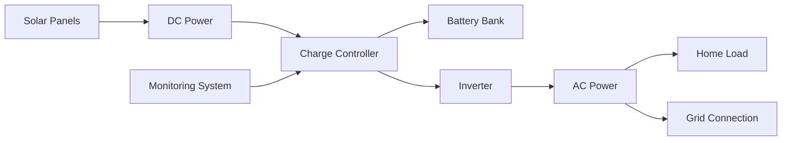
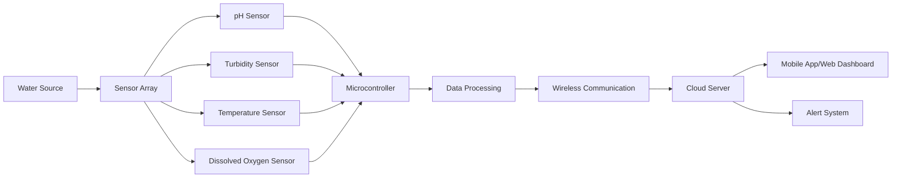
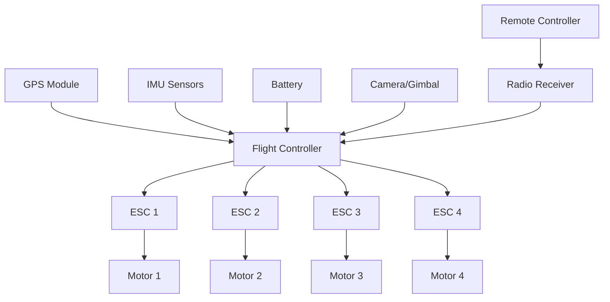
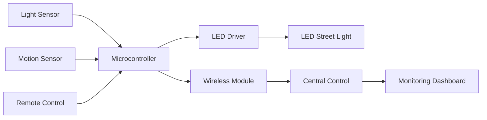
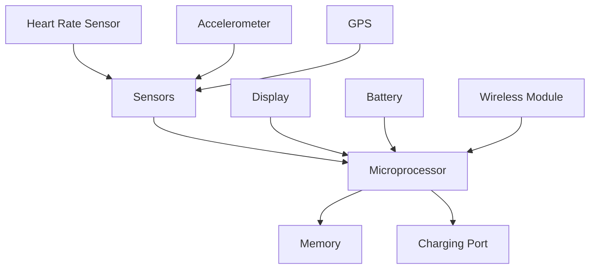
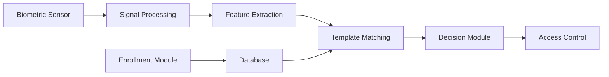
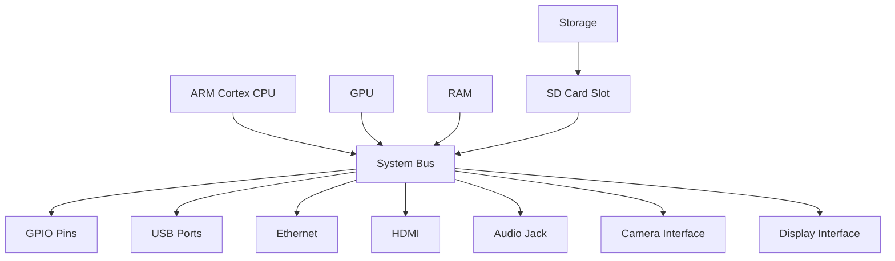
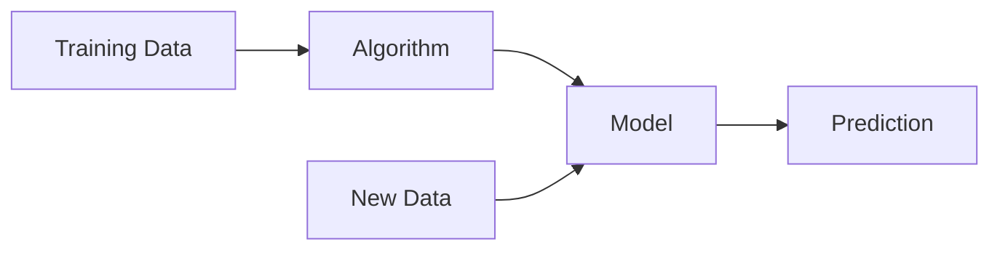

## પ્રશ્ન 1(અ) [3 ગુણ]

**રિન્યુએબલ એનર્જી શું છે? તેનું મહત્વ સમજાવો.**

**જવાબ**:
રિન્યુએબલ એનર્જી એ કુદરતી સ્ત્રોતોમાંથી મેળવાતી ઊર્જા છે જે સમય સાથે ફરીથી બનતી રહે છે, જેમ કે સૌર, પવન, જળ, બાયોમાસ અને ભૂગર્ભીય ઊર્જા.

**ટેબલ: રિન્યુએબલ એનર્જીનું મહત્વ**

| પાસું | ફાયદો |
|--------|---------|
| **પર્યાવરણીય** | ગ્રીનહાઉસ ગેસ ઉત્સર્જન અને પ્રદૂષણ ઘટાડે છે |
| **આર્થિક** | નોકરીઓ બનાવે છે અને લાંબા ગાળે ઊર્જા ખર્ચ ઘટાડે છે |
| **ઊર્જા સુરક્ષા** | અશ્મિભૂત ઇંધણની આયાત પર નિર્ભરતા ઘટાડે છે |
| **ટકાઉપણું** | ભાવિ પેઢીઓ માટે અખૂટ ઊર્જા સ્ત્રોતો |

**મુખ્ય મુદ્દાઓ:**

- **સ્વચ્છ ઊર્જા**: કામગીરી દરમિયાન શૂન્ય કાર્બન ઉત્સર્જન
- **ખર્ચ-અસરકારક**: ઘટતી ટેકનોલોજી કિંમતો તેને આર્થિક બનાવે છે
- **રોજગાર સર્જન**: વધતો ઉદ્યોગ રોજગારની તકો પૂરી પાડે છે

**યાદ રાખવાની ટેકનીક:** "EEES" - Environmental protection, Economic benefits, Energy security, Sustainability

---

## પ્રશ્ન 1(બ) [4 ગુણ]

**ઇલેક્ટ્રિક વાહનોના પ્રકારોની યાદી બનાવો. દરેકને સંક્ષિપ્તમાં સમજાવો.**

**જવાબ**:

**ટેબલ: ઇલેક્ટ્રિક વાહનોના પ્રકારો**

| પ્રકાર | સંપૂર્ણ નામ | વર્ણન |
|------|-----------|-------------|
| **BEV** | Battery Electric Vehicle | સંપૂર્ણ ઇલેક્ટ્રિક, માત્ર બેટરીથી ચાલે છે |
| **HEV** | Hybrid Electric Vehicle | ગેસોલિન એન્જિન અને ઇલેક્ટ્રિક મોટરનું મિશ્રણ |
| **PHEV** | Plug-in Hybrid Electric Vehicle | બાહ્ય પાવર સ્ત્રોતથી ચાર્જ કરી શકાય છે |
| **FCEV** | Fuel Cell Electric Vehicle | પાવર માટે હાઇડ્રોજન ફ્યૂઅલ સેલનો ઉપયોગ |

**મુખ્ય લક્ષણો:**

- **BEV**: શૂન્ય ઉત્સર્જન, ચાર્જિંગ સ્ટેશનની જરૂર
- **HEV**: બહેતર ઇંધણ દક્ષતા, રિજનરેટિવ બ્રેકિંગ દ્વારા સ્વ-ચાર્જિંગ
- **PHEV**: બેવડા પાવર વિકલ્પો, વિસ્તૃત રેન્જ
- **FCEV**: ઝડપી રિફ્યુઅલિંગ, એકમાત્ર ઉત્સર્જન પાણી

**યાદ રાખવાની ટેકનીક:** "Big Hybrid Plug Fuel" BEV, HEV, PHEV, FCEV માટે

---

## પ્રશ્ન 1(ક) [7 ગુણ]

**સૌર ઊર્જા અને સૌર થર્મલ ઊર્જા વચ્ચે શું તફાવત છે? હોમ સોલાર રૂફટોપ સિસ્ટમના બ્લોક ડાયાગ્રામની ચર્ચા કરો.**

**જવાબ**:

**ટેબલ: સૌર ઊર્જા વિ સૌર થર્મલ ઊર્જા**

| પેરામીટર | સૌર ઊર્જા (PV) | સૌર થર્મલ ઊર્જા |
|-----------|-------------------|----------------------|
| **રૂપાંતરણ** | સીધો સૂર્યપ્રકાશ વીજળીમાં | સૂર્યપ્રકાશ ગરમી ઊર્જામાં |
| **ટેકનોલોજી** | ફોટોવોલ્ટેઇક સેલ્સ | સોલાર કલેક્ટર્સ/પેનલ્સ |
| **આઉટપુટ** | વિદ્યુત ઊર્જા | ઉષ્મા ઊર્જા (ગરમ પાણી/વરાળ) |
| **ઉપયોગો** | પાવર જનરેશન, લાઇટિંગ | પાણી ગરમ કરવું, સ્પેસ હીટિંગ |
| **કાર્યક્ષમતા** | 15-22% | 70-80% |

**બ્લોક ડાયાગ્રામ: હોમ સોલાર રૂફટોપ સિસ્ટમ**



**મુખ્ય ઘટકો:**

- **સોલાર પેનલ્સ**: સૂર્યપ્રકાશને DC વીજળીમાં ફેરવે છે
- **ચાર્જ કંટ્રોલર**: બેટરી ચાર્જિંગ નિયંત્રિત કરે છે
- **ઇન્વર્ટર**: DC ને AC પાવરમાં ફેરવે છે
- **બેટરી બેંક**: વધારાની ઊર્જા સ્ટોર કરે છે
- **ગ્રિડ કનેક્શન**: બે-માર્ગી પાવર ફ્લો

**યાદ રાખવાની ટેકનીક:** "Solar Converts Battery Inverter Grid" મુખ્ય ઘટકો માટે

---

## પ્રશ્ન 1(ક OR) [7 ગુણ]

**સૌર ફોટોવોલ્ટેઇક અસર શું છે? ફોટોવોલ્ટેઇક રૂપાંતરણનો સિદ્ધાંત સમજાવો.**

**જવાબ**:
સૌર ફોટોવોલ્ટેઇક અસર એ સેમિકંડક્ટર સામગ્રી પર પ્રકાશ પડતાં વિદ્યુત પ્રવાહ ઉત્પન્ન થવાની ઘટના છે.

**ફોટોવોલ્ટેઇક રૂપાંતરણનો સિદ્ધાંત:**


**કાર્યપ્રક્રિયા:**

- **ફોટોન શોષણ**: પ્રકાશ ફોટોન સેમિકંડક્ટર સામગ્રીને અથડાવે છે
- **ઇલેક્ટ્રોન ઉત્તેજના**: ઇલેક્ટ્રોન્સ ઊર્જા મેળવીને કંડક્શન બેન્ડમાં જાય છે
- **P-N જંક્શન**: વિદ્યુત ક્ષેત્ર બનાવીને ચાર્જ અલગ કરે છે
- **કરંટ જનરેશન**: ઇલેક્ટ્રોન્સનો પ્રવાહ વિદ્યુત પ્રવાહ બનાવે છે

**મુખ્ય મુદ્દાઓ:**

- **ઊર્જા રૂપાંતરણ**: પ્રકાશ ઊર્જા → વિદ્યુત ઊર્જા
- **સેમિકંડક્ટર મટીરિયલ**: સામાન્ય રીતે સિલિકોન આધારિત
- **સીધું રૂપાંતરણ**: કોઈ હલનચલન ભાગોની જરૂર નથી
- **ક્વોન્ટમ અસર**: ફોટોઇલેક્ટ્રિક અસર પર આધારિત

**ટેબલ: PV સેલ સામગ્રીઓ**

| સામગ્રી | કાર્યક્ષમતા | કિંમત | ઉપયોગ |
|----------|------------|------|-------------|
| **મોનોક્રિસ્ટલાઇન સિલિકોન** | 18-22% | ઊંચી | રેસિડેન્શિયલ |
| **પોલિક્રિસ્ટલાઇન સિલિકોન** | 15-17% | મધ્યમ | કોમર્શિયલ |
| **થિન ફિલ્મ** | 10-12% | ઓછી | મોટા પાયે |

**યાદ રાખવાની ટેકનીક:** "Photons Push Electrons Producing Power"

---

## પ્રશ્ન 2(અ) [3 ગુણ]

**નેનો ટેકનોલોજી શું છે? નેનો ટેકનોલોજી પર આધારિત કોઈપણ ત્રણ એપ્લિકેશનની યાદી બનાવો.**

**જવાબ**:
નેનો ટેકનોલોજી એ મોલેક્યુલર અને પરમાણુ સ્તરે (1-100 નેનોમીટર) પદાર્થોની હેરફેર વિજ્ઞાન છે.

**ટેબલ: નેનો ટેકનોલોજી એપ્લિકેશન્સ**

| એપ્લિકેશન | વર્ણન | ફાયદો |
|-------------|-------------|---------|
| **મેડિકલ** | ડ્રગ ડિલિવરી સિસ્ટમ, કેન્સર ટ્રીટમેન્ટ | લક્ષિત ઉપચાર |
| **ઇલેક્ટ્રોનિક્સ** | નાના, ઝડપી પ્રોસેસર અને મેમોરી | ઉચ્ચ કાર્યક્ષમતા |
| **ઊર્જા** | સોલાર સેલ્સ, બેટરીઓ, ફ્યૂઅલ સેલ્સ | બહેતર કાર્યક્ષમતા |

**મુખ્ય મુદ્દાઓ:**

- **સ્કેલ**: નેનોમીટર સ્તરે કામ કરે છે (10⁻⁹ મીટર)
- **ચોકસાઈ**: પરમાણુ સ્તરે હેરફેર
- **ક્રાંતિકારી**: વિવિધ ઉદ્યોગોનું રૂપાંતરણ

**યાદ રાખવાની ટેકનીક:** "Nano Makes Everything Better" - Medical, Electronics, Energy

---

## પ્રશ્ન 2(બ) [4 ગુણ]

**મહત્વપૂર્ણ ઉભરતી નવીનીકરણીય ઊર્જા તકનીક તરીકે ભરતી તરંગ ઊર્જા પર ટૂંકી નોંધ લખો.**

**જવાબ**:
ભરતી તરંગ ઊર્જા સમુદ્રી ભરતીઓ અને તરંગોની ગતિશીલ ઊર્જાનો ઉપયોગ કરીને વીજળી ઉત્પન્ન કરે છે.

**મુખ્ય લક્ષણો:**

- **પૂર્વાનુમાન**: ભરતી નિયમિત પેટર્ન અનુસરે છે
- **ઉચ્ચ ઘનતા**: પાણી હવા કરતાં 800 ગણું ઘન છે
- **સ્થિર**: દિવસ-રાત ઉપલબ્ધ
- **સ્વચ્છ**: કોઈ ઉત્સર્જન અથવા બળતણ વપરાશ નથી

**ટેબલ: ભરતી ઊર્જા સિસ્ટમ્સ**

| પ્રકાર | પદ્ધતિ | ફાયદો |
|------|--------|-----------|
| **ટાઇડલ બેરેજ** | નદીમુખ પર બંધ | ઉચ્ચ પાવર આઉટપુટ |
| **ટાઇડલ સ્ટ્રીમ** | પાણીની અંદર ટર્બાઇન | ન્યૂનતમ પર્યાવરણીય અસર |
| **વેવ એનર્જી** | સપાટીના તરંગ ગતિ | વિપુલ સંસાધન |

**ઉપયોગો:**

- **કોસ્ટલ પાવર જનરેશન**: દૂરના દરિયાકાંઠાના સમુદાયો
- **ગ્રિડ ઇન્ટિગ્રેશન**: અન્ય નવીનીકરણીય સ્ત્રોતોના પૂરક
- **આઇલેન્ડ નેશન્સ**: દરિયાઈ દેશો માટે આદર્શ

**યાદ રાખવાની ટેકનીક:** "Tides Provide Predictable Power"

---

## પ્રશ્ન 2(ક) [7 ગુણ]

**સ્માર્ટ વોટર મોનિટરિંગ સિસ્ટમ શું છે? સ્માર્ટ વોટર ક્વોલિટી મોનિટરિંગ સિસ્ટમનો બ્લોક ડાયાગ્રામ સમજાવો.**

**જવાબ**:
સ્માર્ટ વોટર મોનિટરિંગ સિસ્ટમ IoT સેન્સર્સનો ઉપયોગ કરીને પાણીની ગુણવત્તાના પેરામીટર્સનું સતત નિરીક્ષણ કરે છે અને નિર્ણય લેવા માટે રીઅલ-ટાઇમ ડેટા પ્રદાન કરે છે.

**બ્લોક ડાયાગ્રામ: સ્માર્ટ વોટર ક્વોલિટી મોનિટરિંગ સિસ્ટમ**



**મુખ્ય ઘટકો:**

- **સેન્સર્સ**: pH, ટર્બિડિટી, તાપમાન, ઓગળેલા ઓક્સિજનનું નિરીક્ષણ
- **માઇક્રોકંટ્રોલર**: ડેટા પ્રોસેસિંગ માટે Arduino/Raspberry Pi
- **કમ્યુનિકેશન**: ડેટા ટ્રાન્સમિશન માટે WiFi/GSM
- **ક્લાઉડ પ્લેટફોર્મ**: ડેટા સ્ટોરેજ અને વિશ્લેષણ
- **યુઝર ઇન્ટરફેસ**: મોનિટરિંગ માટે મોબાઇલ એપ

**ફાયદા:**

- **રીઅલ-ટાઇમ મોનિટરિંગ**: સતત પાણીની ગુણવત્તા મૂલ્યાંકન
- **અર્લી વોર્નિંગ**: દૂષણ માટે તાત્કાલિક અલર્ટ
- **ડેટા એનાલિટિક્સ**: ઐતિહાસિક પ્રવૃત્તિઓ અને અનુમાનો
- **ખર્ચ અસરકારક**: મેન્યુઅલ પરીક્ષણ ખર્ચ ઘટાડે છે

**ટેબલ: પાણીની ગુણવત્તાના પેરામીટર્સ**

| પેરામીટર | સામાન્ય રેન્જ | સેન્સર પ્રકાર |
|-----------|--------------|-------------|
| **pH** | 6.5-8.5 | pH ઇલેક્ટ્રોડ |
| **ટર્બિડિટી** | <1 NTU | ઓપ્ટિકલ સેન્સર |
| **તાપમાન** | 15-25°C | થર્મિસ્ટર |
| **ઓગળેલા ઓક્સિજન** | >5 mg/L | ઇલેક્ટ્રોકેમિકલ |

**યાદ રાખવાની ટેકનીક:** "Smart Sensors Send Signals Safely"

---

## પ્રશ્ન 2(અ OR) [3 ગુણ]

**વેરેબલ ટેકનોલોજી શું છે? વેરેબલ ટેકનોલોજીની ઓછામાં ઓછી બે એપ્લિકેશનના નામ આપો?**

**જવાબ**:
વેરેબલ ટેકનોલોજી એ ઇલેક્ટ્રોનિક ઉપકરણો છે જે કપડાં અથવા એક્સેસરીઝ તરીકે પહેરી શકાય છે, જેમાં સ્માર્ટ સેન્સર્સ અને કનેક્ટિવિટી સામેલ છે.

**એપ્લિકેશન્સ:**

- **આરોગ્ય નિરીક્ષણ**: હાર્ટ રેટ, પગલાં, ઊંઘની પેટર્ન ટ્રેક કરતી સ્માર્ટવોચ
- **ફિટનેસ ટ્રેકિંગ**: કેલોરી, અંતર, કસરતનું માપ કરતા એક્ટિવિટી મોનિટર્સ
- **મેડિકલ ડિવાઇસેસ**: સતત ગ્લુકોઝ મોનિટર્સ, બ્લડ પ્રેશર મોનિટર્સ
- **સ્માર્ટ ગ્લાસીસ**: ઓગમેન્ટેડ રિયાલિટી ડિસ્પ્લે, હેન્ડ્સ-ફ્રી કમ્પ્યુટિંગ

**મુખ્ય લક્ષણો:**

- **પોર્ટેબલ**: હળવા અને પહેરવા માટે આરામદાયક
- **કનેક્ટેડ**: સ્માર્ટફોન સાથે Bluetooth/WiFi કનેક્ટિવિટી
- **સેન્સર-રિચ**: ડેટા એકત્રીકરણ માટે બહુવિધ સેન્સર્સ

**યાદ રાખવાની ટેકનીક:** "Wearables Watch Wellness Wirelessly"

---

## પ્રશ્ન 2(બ OR) [4 ગુણ]

**વિવિધ પ્રકારના સોલાર સેલની યાદી બનાવો. ઇલેક્ટ્રિક વાહન માટે વિવિધ ઊર્જા સ્ત્રોતોની યાદી બનાવો.**

**જવાબ**:

**ટેબલ: સોલાર સેલના પ્રકારો**

| પ્રકાર | સામગ્રી | કાર્યક્ષમતા | કિંમત |
|------|----------|------------|------|
| **મોનોક્રિસ્ટલાઇન** | સિંગલ ક્રિસ્ટલ સિલિકોન | 18-22% | ઊંચી |
| **પોલિક્રિસ્ટલાઇન** | મલ્ટિ-ક્રિસ્ટલ સિલિકોન | 15-17% | મધ્યમ |
| **થિન ફિલ્મ** | એમોર્ફસ સિલિકોન | 10-12% | ઓછી |
| **કેડમિયમ ટેલ્યુરાઇડ** | CdTe કમ્પાઉન્ડ | 16-18% | મધ્યમ |

**ટેબલ: ઇલેક્ટ્રિક વાહનો માટે ઊર્જા સ્ત્રોતો**

| સ્ત્રોત | વર્ણન | ફાયદો |
|--------|-------------|-----------|
| **બેટરી** | લિથિયમ-આયન સેલ્સ | ઉચ્ચ ઊર્જા ઘનતા |
| **ફ્યૂઅલ સેલ** | હાઇડ્રોજન રૂપાંતરણ | ઝડપી રિફ્યુઅલિંગ |
| **અલ્ટ્રાકેપેસિટર** | ઝડપી ચાર્જ/ડિસચાર્જ | ફાસ્ટ ચાર્જિંગ |
| **રિજનરેટિવ બ્રેકિંગ** | ગતિશીલ ઊર્જા પુનઃપ્રાપ્તિ | ઊર્જા કાર્યક્ષમતા |

**યાદ રાખવાની ટેકનીક:** "Solar: Mono Poly Thin Cadmium" / "EV: Battery Fuel Ultra Regen"

---

## પ્રશ્ન 2(ક OR) [7 ગુણ]

**ડ્રોનના બ્લોક ડાયાગ્રામ અને તેના મુખ્ય ઘટકોનું વર્ણન કરો.**

**જવાબ**:

**બ્લોક ડાયાગ્રામ: ડ્રોન સિસ્ટમ**



**મુખ્ય ઘટકો:**

**ટેબલ: ડ્રોન ઘટકો**

| ઘટક | કાર્ય | મહત્વ |
|-----------|----------|------------|
| **ફ્લાઇટ કંટ્રોલર** | સેન્ટ્રલ પ્રોસેસિંગ યુનિટ | ડ્રોનનું મગજ |
| **ESC** | મોટર સ્પીડ કંટ્રોલ | ચોક્કસ મોટર કંટ્રોલ |
| **મોટર્સ અને પ્રોપેલર્સ** | થ્રસ્ટ જનરેટ કરે છે | ફ્લાઇટ ક્ષમતા |
| **બેટરી** | પાવર સપ્લાય | ફ્લાઇટ અવધિ |
| **GPS** | પોઝિશન ટ્રેકિંગ | નેવિગેશન |
| **IMU** | મોશન સેન્સિંગ | સ્ટેબિલિટી કંટ્રોલ |

**મુખ્ય સિસ્ટમ્સ:**

- **પ્રોપલ્શન સિસ્ટમ**: લિફ્ટ અને કંટ્રોલ માટે 4 મોટર્સ પ્રોપેલર્સ સાથે
- **કંટ્રોલ સિસ્ટમ**: સ્ટેબિલાઇઝેશન એલ્ગોરિધમ સાથે ફ્લાઇટ કંટ્રોલર
- **નેવિગેશન સિસ્ટમ**: પોઝિશનિંગ માટે GPS અને કંપાસ
- **પાવર સિસ્ટમ**: ઇલેક્ટ્રિકલ પાવર માટે LiPo બેટરી
- **કમ્યુનિકેશન**: ગ્રાઉન્ડ કંટ્રોલર સાથે રેડિયો લિંક

**કાર્યસિદ્ધાંત:**

- **લિફ્ટ**: રોટર્સ ઉપરની દિશામાં થ્રસ્ટ બનાવે છે
- **કંટ્રોલ**: વિવિધ રોટર સ્પીડ મૂવમેન્ટ કંટ્રોલ કરે છે
- **સ્ટેબિલિટી**: સેન્સર્સ બેલેન્સ અને ઓરિએન્ટેશન જાળવે છે

**યાદ રાખવાની ટેકનીક:** "Drones Fly Using Motors, Electronics, Sensors, Power"

---

## પ્રશ્ન 3(અ) [3 ગુણ]

**IoT શું છે? IoT ના મુખ્ય ઘટકોની યાદી બનાવો.**

**જવાબ**:
IoT (Internet of Things) એ ભૌતિક ઉપકરણોનું નેટવર્ક છે જે ઇન્ટરનેટ દ્વારા ડેટા એકત્રિત અને વિનિમય કરે છે.

**ટેબલ: IoT ના મુખ્ય ઘટકો**

| ઘટક | કાર્ય | ઉદાહરણ |
|-----------|----------|---------|
| **સેન્સર્સ** | ડેટા એકત્રીકરણ | તાપમાન, ભેજ સેન્સર્સ |
| **કનેક્ટિવિટી** | ડેટા ટ્રાન્સમિશન | WiFi, Bluetooth, GSM |
| **ડેટા પ્રોસેસિંગ** | માહિતી વિશ્લેષણ | ક્લાઉડ કમ્પ્યુટિંગ |
| **યુઝર ઇન્ટરફેસ** | માનવીય ક્રિયાપ્રતિક્રિયા | મોબાઇલ એપ્સ, ડેશબોર્ડ |

**મુખ્ય લક્ષણો:**

- **આંતરકનેક્ટેડ**: ઉપકરણો એકબીજા સાથે વાતચીત કરે છે
- **સ્માર્ટ**: સ્વચાલિત નિર્ણય લેવું
- **ડેટા-ડ્રિવન**: સતત નિરીક્ષણ અને વિશ્લેષણ

**યાદ રાખવાની ટેકનીક:** "IoT Connects Smart Devices Using Internet"

---

## પ્રશ્ન 3(બ) [4 ગુણ]

**કાર્બનિક અને અકાર્બનિક ઇલેક્ટ્રોનિક્સ વચ્ચે સરખામણી કરો.**

**જવાબ**:

**ટેબલ: કાર્બનિક વિ અકાર્બનિક ઇલેક્ટ્રોનિક્સ**

| પેરામીટર | કાર્બનિક ઇલેક્ટ્રોનિક્સ | અકાર્બનિક ઇલેક્ટ્રોનિક્સ |
|-----------|--------------------|-----------------------|
| **સામગ્રી** | કાર્બન આધારિત સંયોજનો | સિલિકોન, ધાતુઓ |
| **ઉત્પાદન** | ઓછું તાપમાન, પ્રિન્ટિંગ | ઊંચું તાપમાન, ક્લીન રૂમ |
| **લવચીકતા** | લવચીક, વળી શકાય તેવું | કઠોર, બરડ |
| **કિંમત** | ઓછી ઉત્પાદન કિંમત | ઊંચી ઉત્પાદન કિંમત |
| **કાર્યક્ષમતા** | ઓછી ઝડપ, કાર્યક્ષમતા | ઊંચી ઝડપ, કાર્યક્ષમતા |
| **એપ્લિકેશન્સ** | ડિસ્પ્લે, સોલાર સેલ્સ | પ્રોસેસર્સ, મેમોરી |

**મુખ્ય તફાવતો:**

- **પ્રોસેસિંગ**: કાર્બનિક સોલ્યુશન આધારિત પ્રોસેસિંગ વાપરે છે
- **સબસ્ટ્રેટ**: કાર્બનિક પ્લાસ્ટિક સબસ્ટ્રેટ વાપરી શકે છે
- **ટકાઉપણું**: અકાર્બનિક વધુ સ્થિર અને ટકાઉ
- **નવીનતા**: કાર્બનિક નવા ફોર્મ ફેક્ટર્સ સક્ષમ કરે છે

**યાદ રાખવાની ટેકનીક:** "Organic: Flexible, Cheap, Printable vs Inorganic: Fast, Stable, Expensive"

---

## પ્રશ્ન 3(ક) [7 ગુણ]

**સ્માર્ટ સ્ટ્રીટ લાઇટ કંટ્રોલ અને મોનિટરિંગ સિસ્ટમનો બ્લોક ડાયાગ્રામ દોરો. ઉદ્યોગમાં AR/VR ટેકનોલોજીના ફાયદા અને ઉપયોગની ચર્ચા કરો.**

**જવાબ**:

**બ્લોક ડાયાગ્રામ: સ્માર્ટ સ્ટ્રીટ લાઇટ સિસ્ટમ**



**ઉદ્યોગમાં AR/VR ટેકનોલોજી:**

**ટેબલ: AR/VR એપ્લિકેશન્સ**

| ઉદ્યોગ | AR એપ્લિકેશન | VR એપ્લિકેશન |
|----------|----------------|----------------|
| **મેન્યુફેક્ચરિંગ** | એસેમ્બલી સૂચનાઓ | ટ્રેનિંગ સિમ્યુલેશન |
| **હેલ્થકેર** | સર્જરી સહાયતા | મેડિકલ ટ્રેનિંગ |
| **શિક્ષણ** | ઇન્ટરેક્ટિવ લર્નિંગ | વર્ચ્યુઅલ ક્લાસરૂમ |
| **રિટેલ** | પ્રોડક્ટ વિઝ્યુઅલાઇઝેશન | વર્ચ્યુઅલ શોરૂમ |

**ફાયદા:**

- **વિકસિત પ્રશિક્ષણ**: સુરક્ષિત, પુનરાવર્તિત શીખવાનું વાતાવરણ
- **રિમોટ કોલેબોરેશન**: વર્ચ્યુઅલ મીટિંગ્સ અને શેર્ડ વર્કસ્પેસ
- **ડિઝાઇન વિઝ્યુઅલાઇઝેશન**: 3D પ્રોટોટાઇપિંગ અને મોડેલિંગ
- **મેઇન્ટેનન્સ સપોર્ટ**: રીઅલ-ટાઇમ માર્ગદર્શન અને સમસ્યા નિવારણ

**મુખ્ય ફાયદા:**

- **કિંમત ઘટાડો**: ઓછા પ્રશિક્ષણ અને પ્રવાસ ખર્ચ
- **સલામતી**: જોખમ-મુક્ત પ્રશિક્ષણ વાતાવરણ
- **કાર્યક્ષમતા**: ઝડપી શીખવું અને સમસ્યા-નિવારણ
- **નવીનતા**: માનવ-કમ્પ્યુટર ક્રિયાપ્રતિક્રિયાની નવી રીતો

**યાદ રાખવાની ટેકનીક:** "AR/VR: Training, Design, Remote, Maintenance"

---

## પ્રશ્ન 3(અ OR) [3 ગુણ]

**સ્માર્ટ સિસ્ટમ શું છે? કોઈપણ ચાર પ્રકારની સ્માર્ટ સિસ્ટમની યાદી બનાવો.**

**જવાબ**:
સ્માર્ટ સિસ્ટમ એ બુદ્ધિશાળી સિસ્ટમ છે જે સેન્સર્સ, ડેટા પ્રોસેસિંગ અને ઓટોમેશનનો ઉપયોગ કરીને નિર્ણયો લે છે અને બદલાતી પરિસ્થિતિઓમાં અનુકૂલન કરે છે.

**ટેબલ: સ્માર્ટ સિસ્ટમના પ્રકારો**

| પ્રકાર | વર્ણન | ઉદાહરણ |
|------|-------------|---------|
| **સ્માર્ટ હોમ** | સ્વચાલિત ઘર નિયંત્રણ | લાઇટિંગ, HVAC, સિક્યુરિટી |
| **સ્માર્ટ સિટી** | શહેરી ઇન્ફ્રાસ્ટ્રક્ચર મેનેજમેન્ટ | ટ્રાફિક, યુટિલિટીઝ, કચરો |
| **સ્માર્ટ ગ્રિડ** | બુદ્ધિશાળી પાવર વિતરણ | ઊર્જા મેનેજમેન્ટ |
| **સ્માર્ટ હેલ્થકેર** | મેડિકલ મોનિટરિંગ સિસ્ટમ | દર્દી મોનિટરિંગ, ડાયાગ્નોસ્ટિક્સ |

**મુખ્ય લક્ષણો:**

- **સ્વચાલિત**: સ્વ-સંચાલન ક્ષમતાઓ
- **કનેક્ટેડ**: ઇન્ટરનેટ કનેક્ટિવિટી
- **અનુકૂલનશીલ**: સમય સાથે શીખવું અને સુધારવું

**યાદ રાખવાની ટેકનીક:** "Smart: Home, City, Grid, Health"

---

## પ્રશ્ન 3(બ OR) [4 ગુણ]

**ઓર્ગેનિક ઇલેક્ટ્રોનિક્સના ફાયદા અને એપ્લિકેશનની યાદી બનાવો.**

**જવાબ**:

**ટેબલ: ઓર્ગેનિક ઇલેક્ટ્રોનિક્સના ફાયદા**

| ફાયદો | વર્ણન | લાભ |
|-----------|-------------|---------|
| **લવચીકતા** | વળી શકાય, ખેંચાય તેવું | પહેરી શકાય તેવા ઉપકરણો |
| **ઓછી કિંમત** | સસ્તું ઉત્પાદન | મોટા પાયે ઉત્પાદન |
| **મોટો વિસ્તાર** | મોટી સપાટી પર પ્રિન્ટિંગ | મોટા ડિસ્પ્લે |
| **ઓછું તાપમાન** | રૂમ ટેમ્પરેચર પ્રોસેસિંગ | ઊર્જા કાર્યક્ષમ |

**એપ્લિકેશન્સ:**

- **OLED ડિસ્પ્લે**: સ્માર્ટફોન, TV, લાઇટિંગ
- **ઓર્ગેનિક સોલાર સેલ્સ**: લવચીક સોલાર પેનલ્સ
- **ઓર્ગેનિક ટ્રાન્ઝિસ્ટર**: લવચીક સર્કિટ્સ
- **ઇલેક્ટ્રોનિક પેપર**: E-રીડર્સ, સ્માર્ટ લેબલ્સ

**મુખ્ય ફાયદા:**

- **હળવા**: પોર્ટેબલ ઉપકરણો માટે યોગ્ય
- **પારદર્શક**: સી-થ્રુ ઇલેક્ટ્રોનિક્સ
- **પર્યાવરણને અનુકૂળ**: બાયોડિગ્રેડેબલ સામગ્રી

**યાદ રાખવાની ટેકનીક:** "Organic: Flexible, Cheap, Large, Low-temp"

---

## પ્રશ્ન 3(ક OR) [7 ગુણ]

**(i) પહેરી શકાય તેવી સ્માર્ટ ઘડિયાળ અને (ii) બાયોમેટ્રિક સિસ્ટમનો મૂળભૂત બ્લોક ડાયાગ્રામ દોરો.**

**જવાબ**:

**(i) વેરેબલ સ્માર્ટ વોચ બ્લોક ડાયાગ્રામ:**



**(ii) બાયોમેટ્રિક સિસ્ટમ બ્લોક ડાયાગ્રામ:**



**સ્માર્ટ વોચ ઘટકો:**

- **સેન્સર્સ**: હાર્ટ રેટ, એક્સેલેરોમીટર, જાયરોસ્કોપ
- **પ્રોસેસર**: ARM આધારિત માઇક્રોકંટ્રોલર
- **ડિસ્પ્લે**: ટચસ્ક્રીન OLED/LCD
- **કનેક્ટિવિટી**: Bluetooth, WiFi, સેલ્યુલર
- **પાવર**: રિચાર્જેબલ લિથિયમ બેટરી

**બાયોમેટ્રિક સિસ્ટમ ઘટકો:**

- **સેન્સર મોડ્યુલ**: બાયોમેટ્રિક ડેટા કેપ્ચર કરે છે
- **પ્રોસેસિંગ યુનિટ**: ફીચર્સનું વિશ્લેષણ અને નિષ્કર્ષણ
- **ડેટાબેસ**: નોંધાયેલા ટેમ્પ્લેટ્સ સ્ટોર કરે છે
- **મેચિંગ એન્જિન**: સ્ટોર કરેલા ડેટા સાથે સરખામણી
- **ડિસિઝન લોજિક**: પ્રવેશ મંજૂર અથવા નકારે છે

**મુખ્ય લક્ષણો:**

- **ઓથેન્ટિકેશન**: સુરક્ષિત યુઝર આઇડેન્ટિફિકેશન
- **રીઅલ-ટાઇમ**: તાત્કાલિક પ્રોસેસિંગ અને પ્રતિસાદ
- **ચોકસાઈ**: આઇડેન્ટિફિકેશનમાં ઉચ્ચ ચોકસાઈ

**યાદ રાખવાની ટેકનીક:** "Smart Watch: Sense, Process, Display, Connect" / "Biometric: Capture, Process, Match, Decide"

---

## પ્રશ્ન 4(અ) [3 ગુણ]

**રાસ્પબેરી પાઇમાં NOOBS, GPIO અને LXDE નું સંપૂર્ણ સ્વરૂપ આપો.**

**જવાબ**:

**ટેબલ: રાસ્પબેરી પાઇ સંક્ષેપ**

| સંક્ષેપ | સંપૂર્ણ સ્વરૂપ | હેતુ |
|---------|-----------|---------|
| **NOOBS** | New Out Of Box Software | સરળ OS ઇન્સ્ટોલેશન |
| **GPIO** | General Purpose Input Output | હાર્ડવેર ઇન્ટરફેસ પિન્સ |
| **LXDE** | Lightweight X11 Desktop Environment | ડેસ્કટોપ ઇન્ટરફેસ |

**કાર્યો:**

- **NOOBS**: શરૂઆતીઓ માટે રાસ્પબેરી પાઇ સેટઅપ સરળ બનાવે છે
- **GPIO**: બાહ્ય હાર્ડવેર માટે 40-પિન કનેક્ટર
- **LXDE**: યુઝર-ફ્રેન્ડલી ગ્રાફિકલ ઇન્ટરફેસ

**યાદ રાખવાની ટેકનીક:** "New GPIO, Lightweight Experience"

---

## પ્રશ્ન 4(બ) [4 ગુણ]

**OLED પર ટૂંકી નોંધ લખો.**

**જવાબ**:
OLED (Organic Light Emitting Diode) એ ડિસ્પ્લે ટેકનોલોજી છે જે કાર્બનિક સંયોજનોનો ઉપયોગ કરે છે જે વિદ્યુત પ્રવાહ લાગુ કરવામાં આવે ત્યારે પ્રકાશ ઉત્સર્જન કરે છે.

**મુખ્ય લક્ષણો:**

- **સ્વ-પ્રકાશિત**: બેકલાઇટની જરૂર નથી
- **પાતળું પ્રોફાઇલ**: અત્યંત પાતળા ડિસ્પ્લે
- **ઉચ્ચ કોન્ટ્રાસ્ટ**: સાચા કાળા પિક્સેલ્સ
- **વાઇડ વ્યુઇંગ એંગલ**: કોઈ કલર ડિસ્ટોર્શન નથી

**ટેબલ: OLED વિ LCD**

| પેરામીટર | OLED | LCD |
|-----------|------|-----|
| **બેકલાઇટ** | જરૂરી નથી | જરૂરી |
| **કોન્ટ્રાસ્ટ** | અનંત | 1000:1 |
| **જાડાઈ** | અલ્ટ્રા-થિન | જાડું |
| **પાવર** | ઓછું (ડાર્ક ઇમેજ) | સતત |

**એપ્લિકેશન્સ:**

- **સ્માર્ટફોન**: Samsung, iPhone ડિસ્પ્લે
- **TV**: પ્રીમિયમ ટેલિવિઝન સેટ્સ
- **ઓટોમોટિવ**: ડેશબોર્ડ ડિસ્પ્લે
- **વેરેબલ્સ**: સ્માર્ટવોચ સ્ક્રીન

**ફાયદા:**

- **ઊર્જા કાર્યક્ષમ**: ઓછો પાવર વપરાશ
- **લવચીક**: વળી શકાય તેવું બનાવી શકાય
- **ફાસ્ટ રિસ્પોન્સ**: કોઈ મોશન બ્લર નથી

**યાદ રાખવાની ટેકનીક:** "OLED: Organic, Light, Emitting, Display"

---

## પ્રશ્ન 4(ક) [7 ગુણ]

**રાસ્પબેરી પાઇનું આર્કિટેક્ચર અને બ્લોક ડાયાગ્રામ સમજાવો.**

**જવાબ**:

**બ્લોક ડાયાગ્રામ: રાસ્પબેરી પાઇ આર્કિટેક્ચર**



**મુખ્ય ઘટકો:**

**ટેબલ: રાસ્પબેરી પાઇ ઘટકો**

| ઘટક | સ્પેસિફિકેશન | કાર્ય |
|-----------|---------------|----------|
| **CPU** | ARM Cortex-A72 Quad-core | મુખ્ય પ્રોસેસિંગ |
| **GPU** | VideoCore VI | ગ્રાફિક્સ પ્રોસેસિંગ |
| **RAM** | 4GB LPDDR4 | સિસ્ટમ મેમોરી |
| **સ્ટોરેજ** | MicroSD કાર્ડ | ઓપરેટિંગ સિસ્ટમ |
| **GPIO** | 40-પિન હેડર | હાર્ડવેર ઇન્ટરફેસ |
| **કનેક્ટિવિટી** | WiFi, Bluetooth, Ethernet | નેટવર્ક એક્સેસ |

**આર્કિટેક્ચર લક્ષણો:**

- **SoC ડિઝાઇન**: સિસ્ટમ ઓન ચિપ ઇન્ટિગ્રેશન
- **લો પાવર**: ઊર્જા-કાર્યક્ષમ ARM પ્રોસેસર
- **એક્સપેન્ડેબલ**: હાર્ડવેર પ્રોજેક્ટ્સ માટે GPIO પિન્સ
- **મલ્ટિમીડિયા**: વીડિયો માટે હાર્ડવેર એક્સેલેરેશન

**ઇન્ટરફેસ:**

- **વીડિયો**: 4K સુધી HDMI આઉટપુટ
- **ઓડિયો**: 3.5mm જેક અને HDMI ઓડિયો
- **કેમેરા**: CSI કેમેરા કનેક્ટર
- **ડિસ્પ્લે**: DSI ડિસ્પ્લે કનેક્ટર

**એપ્લિકેશન્સ:**

- **શિક્ષણ**: પ્રોગ્રામિંગ અને ઇલેક્ટ્રોનિક્સ શીખવું
- **IoT પ્રોજેક્ટ્સ**: હોમ ઓટોમેશન, સેન્સર્સ
- **મીડિયા સેન્ટર**: હોમ એન્ટરટેઇનમેન્ટ સિસ્ટમ
- **રોબોટિક્સ**: રોબોટ્સ માટે કંટ્રોલ સિસ્ટમ્સ

**યાદ રાખવાની ટેકનીક:** "Pi: Processor, Interfaces, Projects, Internet"

---

## પ્રશ્ન 4(અ OR) [3 ગુણ]

**રાસ્પબેરી પાઇ શું છે અને તેના ફાયદા અને ગેરફાયદા શું છે?**

**જવાબ**:
રાસ્પબેરી પાઇ એ નાનું, સસ્તું સિંગલ-બોર્ડ કમ્પ્યુટર છે જે શિક્ષણ અને શોખીન પ્રોજેક્ટ્સ માટે ડિઝાઇન કરવામાં આવ્યું છે.

**ટેબલ: ફાયદા અને ગેરફાયદા**

| ફાયદા | ગેરફાયદા |
|------------|---------------|
| **ઓછી કિંમત** | **મર્યાદિત કાર્યક્ષમતા** |
| **નાનું સાઇઝ** | **બિલ્ટ-ઇન સ્ટોરેજ નથી** |
| **GPIO પિન્સ** | **SD કાર્ડની જરૂર** |
| **Linux સપોર્ટ** | **રીઅલ-ટાઇમ OS નથી** |
| **શૈક્ષણિક** | **પાવર સપ્લાય સમસ્યાઓ** |
| **કમ્યુનિટી સપોર્ટ** | **મર્યાદિત RAM** |

**મુખ્ય લક્ષણો:**

- **સસ્તું**: ખર્ચ-અસરકારк કમ્પ્યુટિંગ સોલ્યુશન
- **વર્સેટાઇલ**: બહુવિધ પ્રોગ્રામિંગ ભાષાઓ સપોર્ટેડ
- **ઓપન સોર્સ**: મફત સોફ્ટવેર અને ડોક્યુમેન્ટેશન

**યાદ રાખવાની ટેકનીક:** "Pi: Cheap, Small, Educational vs Limited, External, Power"

---

## પ્રશ્ન 4(બ OR) [4 ગુણ]

**OFET પર ટૂંકી નોંધ લખો.**

**જવાબ**:
OFET (Organic Field Effect Transistor) એ કાર્બનિક સેમિકંડક્ટિંગ સામગ્રીનો ઉપયોગ કરીને સ્વિચિંગ અને એમ્પ્લિફિકેશન માટેનો ટ્રાન્ઝિસ્ટર છે.

**મુખ્ય લક્ષણો:**

- **ઓર્ગેનિક મટીરિયલ્સ**: કાર્બન આધારિત સેમિકંડક્ટર્સ
- **લો ટેમ્પરેચર**: સોલ્યુશન આધારિત પ્રોસેસિંગ
- **ફ્લેક્સિબલ**: પ્લાસ્ટિક સબસ્ટ્રેટ પર બનાવી શકાય
- **લાર્જ એરિયા**: મોટા ડિસ્પ્લે માટે યોગ્ય

**ટેબલ: OFET સ્ટ્રક્ચર**

| ઘટક | સામગ્રી | કાર્ય |
|-----------|----------|----------|
| **ગેટ** | મેટલ ઇલેક્ટ્રોડ | કરંટ ફ્લો કંટ્રોલ કરે છે |
| **ડાઇઇલેક્ટ્રિક** | ઇન્સ્યુલેટિંગ લેયર | ગેટને ચેનલથી અલગ કરે છે |
| **સોર્સ/ડ્રેઇન** | મેટલ કોન્ટેક્ટ્સ | કરંટ ઇન્જેક્શન/કલેક્શન |
| **ચેનલ** | ઓર્ગેનિક સેમિકંડક્ટર | કરંટ કંડક્શન પાથ |

**એપ્લિકેશન્સ:**

- **ફ્લેક્સિબલ ડિસ્પ્લે**: વળી શકાય તેવી સ્ક્રીન્સ
- **સ્માર્ટ કાર્ડ્સ**: RFID એપ્લિકેશન્સ
- **સેન્સર્સ**: કેમિકલ અને બાયોલોજિકલ ડિટેક્શન
- **લોજિક સર્કિટ્સ**: સિમ્પલ ડિજિટલ સર્કિટ્સ

**ફાયદા:**

- **મેકેનિકલ ફ્લેક્સિબિલિટી**: વળી શકાય તેવી ઇલેક્ટ્રોનિક્સ
- **લો કોસ્ટ**: સસ્તું ઉત્પાદન
- **રૂમ ટેમ્પરેચર**: ઊંચા તાપમાનની પ્રોસેસિંગ નથી

**મર્યાદાઓ:**

- **લોઅર મોબિલિટી**: સિલિકોન કરતાં ધીમું
- **સ્ટેબિલિટી ઇશ્યુઝ**: સમય સાથે ક્ષીણતા
- **મર્યાદિત કાર્યક્ષમતા**: ઓછી સ્વિચિંગ સ્પીડ્સ

**યાદ રાખવાની ટેકનીક:** "OFET: Organic, Flexible, Easy, Transistor"

---

## પ્રશ્ન 4(ક OR) [7 ગુણ]

**રાસ્પબેરી પાઇ પોર્ટ્સના પ્રકારોની સૂચિ બનાવો. રાસ્પબેરી પાઇની વિવિધ ઓપરેટિંગ સિસ્ટમ્સની ચર્ચા કરો.**

**જવાબ**:

**ટેબલ: રાસ્પબેરી પાઇ પોર્ટ્સ**

| પોર્ટ પ્રકાર | સંખ્યા | કાર્ય |
|-----------|----------|----------|
| **USB** | 4 પોર્ટ્સ | પેરિફેરલ્સ કનેક્ટ કરવા |
| **HDMI** | 2 માઇક્રો HDMI | વીડિયો આઉટપુટ |
| **GPIO** | 40 પિન્સ | હાર્ડવેર ઇન્ટરફેસ |
| **Ethernet** | 1 પોર્ટ | વાયર્ડ નેટવર્ક |
| **ઓડિયો** | 3.5mm જેક | ઓડિયો આઉટપુટ |
| **પાવર** | USB-C | પાવર ઇનપુટ |
| **કેમેરા** | CSI કનેક્ટર | કેમેરા મોડ્યુલ |
| **ડિસ્પ્લે** | DSI કનેક્ટર | ડિસ્પ્લે પેનલ |

**રાસ્પબેરી પાઇ માટે ઓપરેટિંગ સિસ્ટમ્સ:**

**ટેબલ: રાસ્પબેરી પાઇ ઓપરેટિંગ સિસ્ટમ્સ**

| OS | પ્રકાર | શ્રેષ્ઠ માટે |
|----|------|----------|
| **Raspberry Pi OS** | Debian આધારિત | સામાન્ય ઉપયોગ, શરૂઆતીઓ |
| **Ubuntu** | Linux વિતરણ | સર્વર એપ્લિકેશન્સ |
| **LibreELEC** | મીડિયા સેન્ટર | હોમ એન્ટરટેઇનમેન્ટ |
| **RetroPie** | ગેમિંગ | રેટ્રો ગેમિંગ કન્સોલ |
| **Windows 10 IoT** | Microsoft OS | IoT ડેવેલપમેન્ટ |
| **OSMC** | મીડિયા સેન્ટર | મીડિયા સ્ટ્રીમિંગ |

**Raspberry Pi OS ના મુખ્ય લક્ષણો:**

- **પ્રી-ઇન્સ્ટોલ્ડ સોફ્ટવેર**: પ્રોગ્રામિંગ ટૂલ્સ, ઓફિસ સ્યુટ
- **GPIO સપોર્ટ**: હાર્ડવેર ઇન્ટરફેસિંગ લાઇબ્રેરીઓ
- **શૈક્ષણિક**: Scratch, Python, Minecraft Pi
- **લાઇટવેઇટ**: ARM પ્રોસેસર્સ માટે ઓપ્ટિમાઇઝ્ડ

**ઇન્સ્ટોલેશન પદ્ધતિઓ:**

- **NOOBS**: શરૂઆતી-મૈત્રીપૂર્ણ ઇન્સ્ટોલર
- **Raspberry Pi Imager**: ઓફિશિયલ ઇમેજિંગ ટૂલ
- **ડાયરેક્ટ ફ્લેશ**: એડવાન્સ્ડ યુઝર્સ

**ફાયદા:**

- **વેરાઇટી**: વિવિધ હેતુઓ માટે બહુવિધ OS વિકલ્પો
- **કમ્યુનિટી**: મોટો યુઝર બેઝ અને સપોર્ટ
- **અપડેટ્સ**: નિયમિત સિક્યુરિટી અને ફીચર અપડેટ્સ
- **કસ્ટમાઇઝેશન**: ઓપન સોર્સ લવચીકતા

**યાદ રાખવાની ટેકનીક:** "Pi Ports: USB, HDMI, GPIO, Ethernet" / "Pi OS: Official, Ubuntu, Media, Gaming"

---

## પ્રશ્ન 5(અ) [3 ગુણ]

**મશીન લર્નિંગ માટે NumPy python library સમજાવો.**

**જવાબ**:
NumPy (Numerical Python) એ વૈજ્ઞાનિક કમ્પ્યુટિંગ માટેની મૂળભૂત લાઇબ્રેરી છે, જે મોટા મલ્ટિ-ડાઇમેન્શનલ એરેઝ અને ગાણિતિક ફંક્શન્સ માટે સપોર્ટ પ્રદાન કરે છે.

**મુખ્ય લક્ષણો:**

- **N-dimensional Arrays**: કાર્યક્ષમ એરે ઓપરેશન્સ
- **ગાણિતિક ફંક્શન્સ**: લિનિયર અલજેબ્રા, ફોરિયર ટ્રાન્સફોર્મ
- **બ્રોડકાસ્ટિંગ**: વિવિધ આકારના એરે પર ઓપરેશન્સ
- **મેમોરી એફિશિયન્ટ**: Python lists કરતાં ઝડપી

**ટેબલ: મશીન લર્નિંગમાં NumPy**

| ફંક્શન | ઉપયોગ | ઉદાહરણ |
|----------|-------|---------|
| **એરેઝ** | ડેટા સ્ટોરેજ | np.array([1,2,3]) |
| **લિનિયર અલજેબ્રા** | મેટ્રિક્સ ઓપરેશન્સ | np.dot(a,b) |
| **સ્ટેટિસ્ટિક્સ** | ડેટા એનાલિસિસ | np.mean(), np.std() |
| **રેન્ડમ** | ડેટા જનરેશન | np.random.rand() |

**ML માં એપ્લિકેશન્સ:**

- **ડેટા પ્રીપ્રોસેસિંગ**: એરે મેનિપ્યુલેશન અને ક્લીનિંગ
- **ફીચર એન્જિનિયરિંગ**: ગાણિતિક રૂપાંતરણો
- **મોડલ ઇમ્પ્લિમેન્ટેશન**: એલ્ગોરિધમ માટે મેટ્રિક્સ ઓપરેશન્સ

**યાદ રાખવાની ટેકનીક:** "NumPy: Numbers, Python, Arrays, Math"

---

## પ્રશ્ન 5(બ) [4 ગુણ]

**ઓર્ગેનિક ફોટોવોલ્ટેઇક સેલ (OPV) શું છે? તેના કાર્ય સિદ્ધાંતને સમજાવો.**

**જવાબ**:
OPV (Organic Photovoltaic) સેલ એ કાર્બનિક સેમિકંડક્ટર્સનો ઉપયોગ કરીને પ્રકાશને વીજળીમાં રૂપાંતરિત કરતા સોલાર સેલ છે.

**કાર્યસિદ્ધાંત:**


**મુખ્ય પગલાં:**

- **પ્રકાશ શોષણ**: કાર્બનિક મોલેક્યુલ્સ ફોટોન્સ શોષે છે
- **એક્સિટન ફોર્મેશન**: બાઉન્ડ ઇલેક્ટ્રોન-હોલ પેર્સ બને છે
- **ચાર્જ સેપરેશન**: ડોનર-એક્સેપ્ટર ઇન્ટરફેસ પર એક્સિટન્સ વિભાજિત થાય છે
- **ચાર્જ ટ્રાન્સપોર્ટ**: ઇલેક્ટ્રોન્સ અને હોલ્સ ઇલેક્ટ્રોડ્સ તરફ જાય છે
- **કરંટ કલેક્શન**: બાહ્ય સર્કિટ પ્રવાહ પૂર્ણ કરે છે

**ટેબલ: OPV સ્ટ્રક્ચર**

| લેયર | સામગ્રી | કાર્ય |
|-------|----------|----------|
| **એનોડ** | ITO | પારદર્શક ઇલેક્ટ્રોડ |
| **એક્ટિવ લેયર** | ઓર્ગેનિક બ્લેન્ડ | પ્રકાશ શોષણ |
| **કેથોડ** | એલ્યુમિનિયમ | બેક ઇલેક્ટ્રોડ |
| **બફર લેયર્સ** | PEDOT:PSS | કાર્યક્ષમતા સુધારે છે |

**ફાયદા:**

- **લવચીક**: પ્લાસ્ટિક પર બનાવી શકાય
- **હળવા**: પોર્ટેબલ એપ્લિકેશન્સ
- **ઓછી કિંમત**: સોલ્યુશન પ્રોસેસિંગ
- **પારદર્શક**: સી-થ્રુ પેનલ્સ

**મર્યાદાઓ:**

- **ઓછી કાર્યક્ષમતા**: 10-15% વિ 20%+ સિલિકોન
- **સ્ટેબિલિટી**: ડિગ્રેડેશન ઇશ્યુઝ
- **લાઇફટાઇમ**: અકાર્બનિક સેલ્સ કરતાં ઓછું

**યાદ રાખવાની ટેકનીક:** "OPV: Organic, Photons, Voltage, Excitons"

---

## પ્રશ્ન 5(ક) [7 ગુણ]

**કોઈપણ ચાર મશીન લર્નિંગ ટૂલ્સની યાદી બનાવો. કોઈપણ એકની સંક્ષિપ્તમાં ચર્ચા કરો.**

**જવાબ**:

**ટેબલ: મશીન લર્નિંગ ટૂલ્સ**

| ટૂલ | પ્રકાર | શ્રેષ્ઠ માટે |
|------|------|----------|
| **TensorFlow** | ડીપ લર્નિંગ ફ્રેમવર્ક | ન્યુરલ નેટવર્ક્સ |
| **Scikit-learn** | જનરલ ML લાઇબ્રેરી | પરંપરાગત એલ્ગોરિધમ |
| **PyTorch** | ડીપ લર્નિંગ ફ્રેમવર્ક | સંશોધન અને વિકાસ |
| **Keras** | હાઇ-લેવલ API | ઝડપી પ્રોટોટાઇપિંગ |

**વિગતવાર ચર્ચા: TensorFlow**

TensorFlow એ Google દ્વારા વિકસિત ML મોડેલ્સ બનાવવા અને તૈનાત કરવા માટેનું ઓપન-સોર્સ મશીન લર્નિંગ ફ્રેમવર્ક છે.

**મુખ્ય લક્ષણો:**

**ટેબલ: TensorFlow ઘટકો**

| ઘટક | કાર્ય | ફાયદો |
|-----------|----------|---------|
| **ટેન્સર્સ** | મલ્ટિ-ડાઇમેન્શનલ એરેઝ | ડેટા રિપ્રેઝન્ટેશન |
| **ગ્રાફ્સ** | કોમ્પ્યુટેશનલ ફ્લો | મોડલ વિઝ્યુઅલાઇઝેશન |
| **સેશન્સ** | એક્ઝિક્યુશન એન્વાયરનમેન્ટ | રિસોર્સ મેનેજમેન્ટ |
| **એસ્ટિમેટર્સ** | હાઇ-લેવલ APIs | સરળ મોડલ બિલ્ડિંગ |

**આર્કિટેક્ચર:**

- **ફ્રન્ટએન્ડ**: Python, C++, Java APIs
- **બેકએન્ડ**: CPU, GPU, TPU સપોર્ટ
- **ડિસ્ટ્રિબ્યુટેડ**: મલ્ટિ-ડિવાઇસ ટ્રેનિંગ
- **પ્રોડક્શન**: મોડલ સર્વિંગ અને ડિપ્લોયમેન્ટ

**એપ્લિકેશન્સ:**

- **ઇમેજ રેકગ્નિશન**: કમ્પ્યુટર વિઝન ટાસ્ક
- **નેચરલ લેંગ્વેજ**: ટેક્સ્ટ પ્રોસેસિંગ અને ટ્રાન્સલેશન
- **રેકમેન્ડેશન સિસ્ટમ્સ**: વ્યક્તિગત કન્ટેન્ટ
- **ટાઇમ સિરીઝ**: ફોરકાસ્ટિંગ અને પ્રિડિક્શન

**ફાયદા:**

- **સ્કેલેબિલિટી**: મોબાઇલથી ડેટા સેન્ટર સુધી
- **ફ્લેક્સિબિલિટી**: સંશોધનથી પ્રોડક્શન સુધી
- **કમ્યુનિટી**: મોટું ઇકોસિસ્ટમ અને સપોર્ટ
- **વિઝ્યુઅલાઇઝેશન**: મોનિટરિંગ માટે TensorBoard

**કોડ ઉદાહરણ:**

```python
import tensorflow as tf
model = tf.keras.Sequential([
    tf.keras.layers.Dense(128, activation='relu'),
    tf.keras.layers.Dense(10, activation='softmax')
])
```

**ઉદ્યોગમાં ઉપયોગ:**

- **Google**: સર્ચ અને એડ્સ ઓપ્ટિમાઇઝેશન
- **હેલ્થકેર**: મેડિકલ ઇમેજ એનાલિસિસ
- **ફાઇનાન્સ**: ફ્રોડ ડિટેક્શન સિસ્ટમ્સ
- **ઓટોમોટિવ**: ઓટોનોમસ વહિકલ ડેવેલપમેન્ટ

**યાદ રાખવાની ટેકનીક:** "TensorFlow: Tensors, Graphs, Scale, Deploy"

---

## પ્રશ્ન 5(અ OR) [3 ગુણ]

**મશીન લર્નિંગ માટે પાન્ડા python library સમજાવો.**

**જવાબ**:
Pandas એ ડેટા મેનિપ્યુલેશન અને એનાલિસિસ માટેની Python લાઇબ્રેરી છે, જે સ્ટ્રક્ચર્ડ ડેટા હેન્ડલ કરવા માટે ડેટા સ્ટ્રક્ચર્ અને ટૂલ્સ પ્રદાન કરે છે.

**મુખ્ય લક્ષણો:**

- **DataFrame**: 2D લેબલ્ડ ડેટા સ્ટ્રક્ચર
- **Series**: 1D લેબલ્ડ એરે
- **ડેટા ક્લીનિંગ**: મિસિંગ વેલ્યુઝ, ડુપ્લિકેટ્સ હેન્ડલ કરવું
- **ફાઇલ I/O**: CSV, Excel, JSON, SQL રીડ/રાઇટ

**ટેબલ: મશીન લર્નિંગમાં Pandas**

| ફંક્શન | ઉપયોગ | ઉદાહરણ |
|----------|-------|---------|
| **ડેટા લોડિંગ** | ડેટાસેટ્સ ઇમ્પોર્ટ | pd.read_csv() |
| **ડેટા ક્લીનિંગ** | મિસિંગ રિમૂવ/ફિલ | df.dropna() |
| **ડેટા સિલેક્શન** | ડેટા ફિલ્ટર | df[df['col'] > 5] |
| **એગ્રીગેશન** | ગ્રુપ અને સમરાઇઝ | df.groupby().mean() |

**ML માં એપ્લિકેશન્સ:**

- **ડેટા પ્રીપ્રોસેસિંગ**: ડેટાસેટ્સ ક્લીન અને તૈયાર કરવું
- **ફીચર એન્જિનિયરિંગ**: અસ્તિત્વમાંના ડેટામાંથી નવા ફીચર્સ બનાવવા
- **એક્સપ્લોરેટરી એનાલિસિસ**: ડેટા પેટર્ન અને સંબંધો સમજવા

**યાદ રાખવાની ટેકનીક:** "Pandas: Python, Analysis, Data, Structure"

---

## પ્રશ્ન 5(બ OR) [4 ગુણ]

**ઓગમેન્ટેડ રિયાલિટી અને વર્ચ્યુઅલ રિયાલિટી વચ્ચેનો તફાવત સમજાવો.**

**જવાબ**:

**ટેબલ: AR વિ VR સરખામણી**

| પેરામીટર | ઓગમેન્ટેડ રિયાલિટી (AR) | વર્ચ્યુઅલ રિયાલિટી (VR) |
|-----------|------------------------|----------------------|
| **પર્યાવરણ** | વાસ્તવિક વિશ્વ + ડિજિટલ ઓવરલે | સંપૂર્ણપણે વર્ચ્યુઅલ વિશ્વ |
| **હાર્ડવેર** | સ્માર્ટફોન, AR ગ્લાસીસ | VR હેડસેટ, કંટ્રોલર્સ |
| **ઇમર્શન** | આંશિક ઇમર્શન | સંપૂર્ણ ઇમર્શન |
| **ઇન્ટરેક્શન** | વાસ્તવિક વિશ્વ + ડિજિટલ ઓબ્જેક્ટ્સ | માત્ર વર્ચ્યુઅલ ઓબ્જેક્ટ્સ |
| **કિંમત** | ઓછી કિંમત | ઊંચી કિંમત |
| **મોબિલિટી** | મોબાઇલ અને પોર્ટેબલ | સ્ટેશનરી સેટઅપ |

**મુખ્ય તફાવતો:**

- **રિયાલિટી મિક્સ**: AR વાસ્તવિક અને વર્ચ્યુઅલ મિશ્રણ કરે છે, VR વાસ્તવિકતા બદલે છે
- **યુઝર એક્સપિરિયન્સ**: AR વાસ્તવિકતા વધારે છે, VR નવી વાસ્તવિકતા બનાવે છે
- **એપ્લિકેશન્સ**: AR નેવિગેશન, શોપિંગ માટે; VR ગેમિંગ, ટ્રેનિંગ માટે
- **હાર્ડવેર આવશ્યકતાઓ**: AR ઓછા શક્તિશાળી હાર્ડવેરની જરૂર

**ઉદાહરણો:**

- **AR**: Pokemon Go, Snapchat ફિલ્ટર્સ, Google Maps નેવિગેશન
- **VR**: Oculus ગેમ્સ, વર્ચ્યુઅલ ટૂર્સ, ફ્લાઇટ સિમ્યુલેટર્સ

**ઉપયોગ કેસેસ:**

- **AR**: રિટેલ, શિક્ષણ, મેઇન્ટેનન્સ, માર્કેટિંગ
- **VR**: એન્ટરટેઇનમેન્ટ, ટ્રેનિંગ, થેરાપી, ડિઝાઇન

**યાદ રાખવાની ટેકનીક:** "AR: Augments Reality vs VR: Virtual Reality"

---

## પ્રશ્ન 5(ક OR) [7 ગુણ]

**મશીન લર્નિંગ શું છે? મશીન લર્નિંગના વિવિધ પ્રકારોની ચર્ચા કરો.**

**જવાબ**:
મશીન લર્નિંગ એ આર્ટિફિશિયલ ઇન્ટેલિજન્સનો ઉપવિભાગ છે જે કમ્પ્યુટર્સને સ્પષ્ટ રીતે પ્રોગ્રામ કર્યા વિના ડેટામાંથી શીખવા અને નિર્ણયો લેવા સક્ષમ બનાવે છે.

**વ્યાખ્યા:**
મશીન લર્નિંગ ડેટાનું વિશ્લેષણ કરવા, પેટર્ન ઓળખવા અને શીખેલા પેટર્ન આધારે અનુમાન અથવા નિર્ણયો લેવા માટે એલ્ગોરિધમનો ઉપયોગ કરે છે.

**મશીન લર્નિંગના પ્રકારો:**

**ટેબલ: મશીન લર્નિંગના પ્રકારો**

| પ્રકાર | વર્ણન | ઉદાહરણો | ઉપયોગ કેસેસ |
|------|-------------|----------|-----------|
| **સુપરવાઇઝ્ડ** | લેબલ્ડ ડેટામાંથી શીખે છે | ક્લાસિફિકેશન, રિગ્રેશન | ઇમેઇલ સ્પામ, કિંમત પૂર્વાનુમાન |
| **અનસુપરવાઇઝ્ડ** | અનલેબલ્ડ ડેટામાં પેટર્ન શોધે છે | ક્લસ્ટરિંગ, એસોસિએશન | કસ્ટમર સેગમેન્ટેશન |
| **રિઇન્ફોર્સમેન્ટ** | ટ્રાયલ અને એરર દ્વારા શીખે છે | Q-learning, પોલિસી ગ્રેડિએન્ટ | ગેમ પ્લેઇંગ, રોબોટિક્સ |

**1. સુપરવાઇઝ્ડ લર્નિંગ:**


**સુપરવાઇઝ્ડ લર્નિંગના પ્રકારો:**

- **ક્લાસિફિકેશન**: કેટેગરીઝનું અનુમાન (સ્પામ/નોટ સ્પામ)
- **રિગ્રેશન**: સતત વેલ્યુઝનું અનુમાન (ઘરની કિંમતો)

**2. અનસુપરવાઇઝ્ડ લર્નિંગ:**

- **ક્લસ્ટરિંગ**: સમાન ડેટા પોઇન્ટ્સને ગ્રુપ કરે છે
- **એસોસિએશન**: વેરિએબલ્સ વચ્ચેના સંબંધો શોધે છે
- **ડાઇમેન્શનાલિટી રિડક્શન**: ડેટા કોમ્પ્લેક્સિટી ઘટાડે છે

**3. રિઇન્ફોર્સમેન્ટ લર્નિંગ:**

- **એજન્ટ**: લર્નિંગ એન્ટિટી
- **એન્વાયરનમેન્ટ**: લર્ન થતી સિસ્ટમ
- **રિવોર્ડ**: ફીડબેક મેકેનિઝમ
- **પોલિસી**: ક્રિયાઓ માટેની રણનીતિ

**પ્રકાર પ્રમાણે એપ્લિકેશન્સ:**

**ટેબલ: ML એપ્લિકેશન્સ**

| પ્રકાર | એપ્લિકેશન | ઉદ્યોગ |
|------|-------------|----------|
| **સુપરવાઇઝ્ડ** | મેડિકલ ડાયાગ્નોસિસ | હેલ્થકેર |
| **અનસુપરવાઇઝ્ડ** | માર્કેટ બાસ્કેટ એનાલિસિસ | રિટેલ |
| **રિઇન્ફોર્સમેન્ટ** | ઓટોનોમસ ડ્રાઇવિંગ | ઓટોમોટિવ |

**મુખ્ય એલ્ગોરિધમ:**

- **સુપરવાઇઝ્ડ**: લિનિયર રિગ્રેશન, ડિસિઝન ટ્રીઝ, SVM, ન્યુરલ નેટવર્ક્સ
- **અનસુપરવાઇઝ્ડ**: K-Means, DBSCAN, PCA, Apriori
- **રિઇન્ફોર્સમેન્ટ**: Q-Learning, Actor-Critic, Deep Q-Networks

**મશીન લર્નિંગ પ્રક્રિયા:**

1. **ડેટા એકત્રીકરણ**: સંબંધિત ડેટાસેટ્સ એકત્રિત કરવા
2. **ડેટા પ્રીપ્રોસેસિંગ**: ડેટા ક્લીન અને તૈયાર કરવા
3. **ફીચર સિલેક્શન**: મહત્વપૂર્ણ વેરિએબલ્સ પસંદ કરવા
4. **મોડલ ટ્રેનિંગ**: ડેટા પર એલ્ગોરિધમ ટ્રેન કરવું
5. **મોડલ ઇવેલ્યુએશન**: કાર્યક્ષમતા ટેસ્ટ કરવી
6. **ડિપ્લોયમેન્ટ**: પ્રોડક્શનમાં અમલીકરણ

**ફાયદા:**

- **ઓટોમેશન**: મેન્યુઅલ કામ ઘટાડે છે
- **ચોકસાઈ**: ઘણા કાર્યોમાં માનવીય કાર્યક્ષમતા કરતાં સારું
- **સ્કેલેબિલિટી**: મોટા ડેટાસેટ્સ હેન્ડલ કરે છે
- **અનુકૂલનક્ષમતા**: વધુ ડેટા સાથે સુધારે છે

**પડકારો:**

- **ડેટા ક્વોલિટી**: સ્વચ્છ, સંબંધિત ડેટાની જરૂર
- **ઓવરફિટિંગ**: મોડલ ટ્રેનિંગ ડેટા માટે ખૂબ વિશિષ્ટ
- **ઇન્ટરપ્રિટેબિલિટી**: કેટલાક એલ્ગોરિધમનું બ્લેક બોક્સ સ્વભાવ
- **કોમ્પ્યુટેશનલ રિસોર્સ**: નોંધપાત્ર પ્રોસેસિંગ પાવરની જરૂર

**વાસ્તવિક દુનિયાના ઉદાહરણો:**

- **Netflix**: મૂવી રેકમેન્ડેશન્સ (સુપરવાઇઝ્ડ)
- **Amazon**: કસ્ટમર સેગમેન્ટેશન (અનસુપરવાઇઝ્ડ)
- **AlphaGo**: ગેમ પ્લેઇંગ (રિઇન્ફોર્સમેન્ટ)

**ભાવિ ટ્રેન્ડ્સ:**

- **ડીપ લર્નિંગ**: બહુવિધ લેયર્સ સાથે ન્યુરલ નેટવર્ક્સ
- **AutoML**: ઓટોમેટેડ મશીન લર્નિંગ પાઇપલાઇન્સ
- **એજ AI**: મોબાઇલ અને IoT ડિવાઇસેસ પર ML
- **એક્સપ્લેનેબલ AI**: ML નિર્ણયોને ઇન્ટરપ્રિટેબલ બનાવવું

**યાદ રાખવાની ટેકનીક:** "ML Types: Supervised teaches, Unsupervised discovers, Reinforcement rewards"
