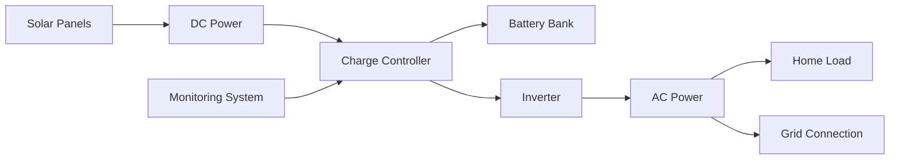
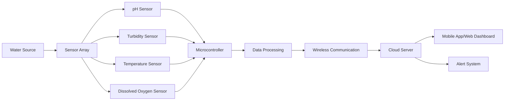
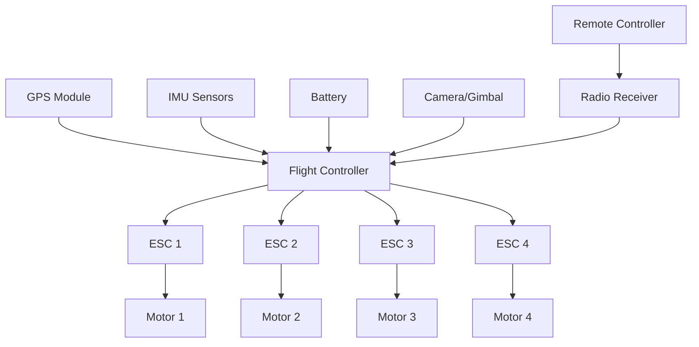
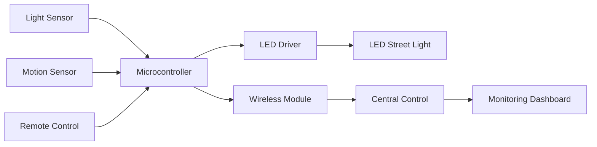
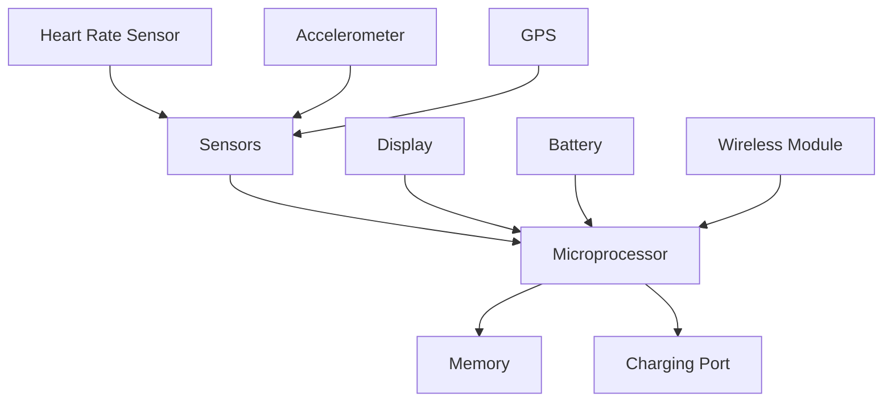
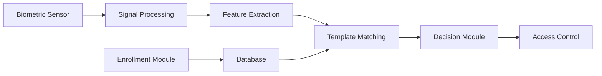
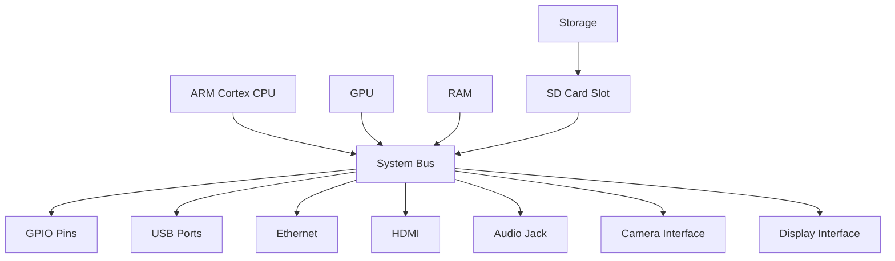
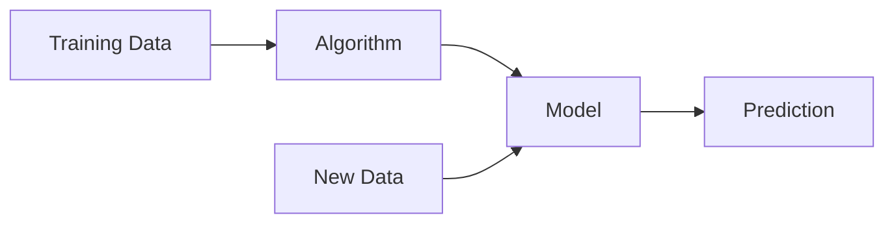

## Question 1(a) [3 marks]

**What is Renewable energy? Explain its importance.**

**Answer**:
Renewable energy is energy derived from natural sources that replenish themselves over time, such as solar, wind, hydro, biomass, and geothermal.

**Table: Importance of Renewable Energy**

| Aspect | Benefit |
|--------|---------|
| **Environmental** | Reduces greenhouse gas emissions and pollution |
| **Economic** | Creates jobs and reduces energy costs long-term |
| **Energy Security** | Reduces dependence on fossil fuel imports |
| **Sustainability** | Inexhaustible energy sources for future generations |

**Key Points:**

- **Clean Energy**: Zero carbon emissions during operation
- **Cost-effective**: Decreasing technology costs make it economical
- **Job Creation**: Growing industry providing employment opportunities

**Mnemonic:** "EEES" - Environmental protection, Economic benefits, Energy security, Sustainability

---

## Question 1(b) [4 marks]

**List the types of Electric Vehicles. Explain each in brief.**

**Answer**:

**Table: Types of Electric Vehicles**

| Type | Full Form | Description |
|------|-----------|-------------|
| **BEV** | Battery Electric Vehicle | Fully electric, powered only by battery |
| **HEV** | Hybrid Electric Vehicle | Combines gasoline engine with electric motor |
| **PHEV** | Plug-in Hybrid Electric Vehicle | Can be charged from external power source |
| **FCEV** | Fuel Cell Electric Vehicle | Uses hydrogen fuel cells for power |

**Key Features:**

- **BEV**: Zero emissions, requires charging stations
- **HEV**: Better fuel efficiency, self-charging through regenerative braking
- **PHEV**: Dual power options, extended range
- **FCEV**: Quick refueling, water as only emission

**Mnemonic:** "Big Hybrid Plug Fuel" for BEV, HEV, PHEV, FCEV

---

## Question 1(c) [7 marks]

**What is the difference between solar energy and solar thermal energy? Discuss the block diagram of home solar rooftop system.**

**Answer**:

**Table: Solar Energy vs Solar Thermal Energy**

| Parameter | Solar Energy (PV) | Solar Thermal Energy |
|-----------|-------------------|----------------------|
| **Conversion** | Direct sunlight to electricity | Sunlight to heat energy |
| **Technology** | Photovoltaic cells | Solar collectors/panels |
| **Output** | Electrical energy | Thermal energy (hot water/steam) |
| **Applications** | Power generation, lighting | Water heating, space heating |
| **Efficiency** | 15-22% | 70-80% |

**Block Diagram: Home Solar Rooftop System**



**Key Components:**

- **Solar Panels**: Convert sunlight to DC electricity
- **Charge Controller**: Regulates battery charging
- **Inverter**: Converts DC to AC power
- **Battery Bank**: Stores excess energy
- **Grid Connection**: Two-way power flow

**Mnemonic:** "Solar Converts Battery Inverter Grid" for main components

---

## Question 1(c OR) [7 marks]

**What is solar photovoltaic effect? Explain principle of photovoltaic conversion.**

**Answer**:
Solar photovoltaic effect is the generation of electric current when light falls on semiconductor materials.

**Principle of Photovoltaic Conversion:**


**Working Process:**

- **Photon Absorption**: Light photons hit semiconductor material
- **Electron Excitation**: Electrons gain energy and move to conduction band
- **P-N Junction**: Creates electric field separating charges
- **Current Generation**: Flow of electrons creates electrical current

**Key Points:**

- **Energy Conversion**: Light energy → Electrical energy
- **Semiconductor Material**: Usually silicon-based
- **Direct Conversion**: No moving parts required
- **Quantum Effect**: Based on photoelectric effect principle

**Table: PV Cell Materials**

| Material | Efficiency | Cost | Application |
|----------|------------|------|-------------|
| **Monocrystalline Silicon** | 18-22% | High | Residential |
| **Polycrystalline Silicon** | 15-17% | Medium | Commercial |
| **Thin Film** | 10-12% | Low | Large scale |

**Mnemonic:** "Photons Push Electrons Producing Power"

---

## Question 2(a) [3 marks]

**What is nanotechnology? List any three applications based on nanotechnology.**

**Answer**:
Nanotechnology is the science of manipulating matter at the molecular and atomic scale (1-100 nanometers).

**Table: Nanotechnology Applications**

| Application | Description | Benefit |
|-------------|-------------|---------|
| **Medical** | Drug delivery systems, cancer treatment | Targeted therapy |
| **Electronics** | Smaller, faster processors and memory | Higher performance |
| **Energy** | Solar cells, batteries, fuel cells | Better efficiency |

**Key Points:**

- **Scale**: Works at nanometer level (10⁻⁹ meters)
- **Precision**: Atomic-level manipulation
- **Revolutionary**: Transforms multiple industries

**Mnemonic:** "Nano Makes Everything Better" - Medical, Electronics, Energy

---

## Question 2(b) [4 marks]

**Write short note on Tidal wave energy as important emerging renewable energy technology.**

**Answer**:
Tidal wave energy harnesses the kinetic energy of ocean tides and waves to generate electricity.

**Key Features:**

- **Predictable**: Tides follow regular patterns
- **High Density**: Water is 800 times denser than air
- **Consistent**: Available day and night
- **Clean**: No emissions or fuel consumption

**Table: Tidal Energy Systems**

| Type | Method | Advantage |
|------|--------|-----------|
| **Tidal Barrage** | Dam across estuary | High power output |
| **Tidal Stream** | Underwater turbines | Minimal environmental impact |
| **Wave Energy** | Surface wave motion | Abundant resource |

**Applications:**

- **Coastal Power Generation**: Remote coastal communities
- **Grid Integration**: Supplement to other renewable sources
- **Island Nations**: Ideal for maritime countries

**Mnemonic:** "Tides Provide Predictable Power"

---

## Question 2(c) [7 marks]

**What is smart water monitoring system? Explain the block diagram of Smart water Quality monitoring system.**

**Answer**:
Smart water monitoring system uses IoT sensors to continuously monitor water quality parameters and provide real-time data for decision making.

**Block Diagram: Smart Water Quality Monitoring System**



**Key Components:**

- **Sensors**: Monitor pH, turbidity, temperature, dissolved oxygen
- **Microcontroller**: Arduino/Raspberry Pi for data processing
- **Communication**: WiFi/GSM for data transmission
- **Cloud Platform**: Data storage and analysis
- **User Interface**: Mobile app for monitoring

**Benefits:**

- **Real-time Monitoring**: Continuous water quality assessment
- **Early Warning**: Immediate alerts for contamination
- **Data Analytics**: Historical trends and predictions
- **Cost Effective**: Reduces manual testing costs

**Table: Water Quality Parameters**

| Parameter | Normal Range | Sensor Type |
|-----------|--------------|-------------|
| **pH** | 6.5-8.5 | pH electrode |
| **Turbidity** | <1 NTU | Optical sensor |
| **Temperature** | 15-25°C | Thermistor |
| **Dissolved Oxygen** | >5 mg/L | Electrochemical |

**Mnemonic:** "Smart Sensors Send Signals Safely"

---

## Question 2(a OR) [3 marks]

**What is wearable technology? Name atleast two applications of wearable technology?**

**Answer**:
Wearable technology refers to electronic devices that can be worn as clothing or accessories, incorporating smart sensors and connectivity.

**Applications:**

- **Health Monitoring**: Smartwatches tracking heart rate, steps, sleep patterns
- **Fitness Tracking**: Activity monitors measuring calories, distance, exercise
- **Medical Devices**: Continuous glucose monitors, blood pressure monitors
- **Smart Glasses**: Augmented reality displays, hands-free computing

**Key Features:**

- **Portable**: Lightweight and comfortable to wear
- **Connected**: Bluetooth/WiFi connectivity to smartphones
- **Sensor-rich**: Multiple sensors for data collection

**Mnemonic:** "Wearables Watch Wellness Wirelessly"

---

## Question 2(b OR) [4 marks]

**List the different types of solar cell. List different energy sources for Electric vehicle.**

**Answer**:

**Table: Types of Solar Cells**

| Type | Material | Efficiency | Cost |
|------|----------|------------|------|
| **Monocrystalline** | Single crystal silicon | 18-22% | High |
| **Polycrystalline** | Multi-crystal silicon | 15-17% | Medium |
| **Thin Film** | Amorphous silicon | 10-12% | Low |
| **Cadmium Telluride** | CdTe compound | 16-18% | Medium |

**Table: Energy Sources for Electric Vehicles**

| Source | Description | Advantage |
|--------|-------------|-----------|
| **Battery** | Lithium-ion cells | High energy density |
| **Fuel Cell** | Hydrogen conversion | Quick refueling |
| **Ultracapacitor** | Rapid charge/discharge | Fast charging |
| **Regenerative Braking** | Kinetic energy recovery | Energy efficiency |

**Mnemonic:** "Solar: Mono Poly Thin Cadmium" / "EV: Battery Fuel Ultra Regen"

---

## Question 2(c OR) [7 marks]

**Describe the block diagram of a drone and its major components.**

**Answer**:

**Block Diagram: Drone System**



**Major Components:**

**Table: Drone Components**

| Component | Function | Importance |
|-----------|----------|------------|
| **Flight Controller** | Central processing unit | Brain of drone |
| **ESC** | Motor speed control | Precise motor control |
| **Motors & Propellers** | Generate thrust | Flight capability |
| **Battery** | Power supply | Flight duration |
| **GPS** | Position tracking | Navigation |
| **IMU** | Motion sensing | Stability control |

**Key Systems:**

- **Propulsion System**: 4 motors with propellers for lift and control
- **Control System**: Flight controller with stabilization algorithms
- **Navigation System**: GPS and compass for positioning
- **Power System**: LiPo battery for electrical power
- **Communication**: Radio link with ground controller

**Working Principle:**

- **Lift**: Rotors create upward thrust
- **Control**: Varying rotor speeds controls movement
- **Stability**: Sensors maintain balance and orientation

**Mnemonic:** "Drones Fly Using Motors, Electronics, Sensors, Power"

---

## Question 3(a) [3 marks]

**What is IoT? List Key Components of IoT.**

**Answer**:
IoT (Internet of Things) is a network of interconnected physical devices that collect and exchange data through the internet.

**Table: Key Components of IoT**

| Component | Function | Example |
|-----------|----------|---------|
| **Sensors** | Data collection | Temperature, humidity sensors |
| **Connectivity** | Data transmission | WiFi, Bluetooth, GSM |
| **Data Processing** | Information analysis | Cloud computing |
| **User Interface** | Human interaction | Mobile apps, dashboards |

**Key Features:**

- **Interconnected**: Devices communicate with each other
- **Smart**: Automated decision making
- **Data-driven**: Continuous monitoring and analysis

**Mnemonic:** "IoT Connects Smart Devices Using Internet"

---

## Question 3(b) [4 marks]

**Compare between organic and inorganic electronics.**

**Answer**:

**Table: Organic vs Inorganic Electronics**

| Parameter | Organic Electronics | Inorganic Electronics |
|-----------|--------------------|-----------------------|
| **Material** | Carbon-based compounds | Silicon, metals |
| **Manufacturing** | Low temperature, printing | High temperature, clean room |
| **Flexibility** | Flexible, bendable | Rigid, brittle |
| **Cost** | Lower production cost | Higher production cost |
| **Performance** | Lower speed, efficiency | Higher speed, efficiency |
| **Applications** | Displays, solar cells | Processors, memory |

**Key Differences:**

- **Processing**: Organic uses solution-based processing
- **Substrate**: Organic can use plastic substrates
- **Durability**: Inorganic more stable and durable
- **Innovation**: Organic enables new form factors

**Mnemonic:** "Organic: Flexible, Cheap, Printable vs Inorganic: Fast, Stable, Expensive"

---

## Question 3(c) [7 marks]

**Draw block diagram of smart street light control and monitoring system. Discuss advantages and applications of AR/VR technology in industry.**

**Answer**:

**Block Diagram: Smart Street Light System**



**AR/VR Technology in Industry:**

**Table: AR/VR Applications**

| Industry | AR Application | VR Application |
|----------|----------------|----------------|
| **Manufacturing** | Assembly instructions | Training simulations |
| **Healthcare** | Surgery assistance | Medical training |
| **Education** | Interactive learning | Virtual classrooms |
| **Retail** | Product visualization | Virtual showrooms |

**Advantages:**

- **Enhanced Training**: Safe, repeatable learning environments
- **Remote Collaboration**: Virtual meetings and shared workspaces
- **Design Visualization**: 3D prototyping and modeling
- **Maintenance Support**: Real-time guidance and troubleshooting

**Key Benefits:**

- **Cost Reduction**: Lower training and travel costs
- **Safety**: Risk-free training environments
- **Efficiency**: Faster learning and problem-solving
- **Innovation**: New ways of human-computer interaction

**Mnemonic:** "AR/VR: Training, Design, Remote, Maintenance"

---

## Question 3(a OR) [3 marks]

**What is Smart System? List any four types of smart system.**

**Answer**:
Smart System is an intelligent system that uses sensors, data processing, and automation to make decisions and adapt to changing conditions.

**Table: Types of Smart Systems**

| Type | Description | Example |
|------|-------------|---------|
| **Smart Home** | Automated home control | Lighting, HVAC, security |
| **Smart City** | Urban infrastructure management | Traffic, utilities, waste |
| **Smart Grid** | Intelligent power distribution | Energy management |
| **Smart Healthcare** | Medical monitoring systems | Patient monitoring, diagnostics |

**Key Features:**

- **Automated**: Self-operating capabilities
- **Connected**: Internet connectivity
- **Adaptive**: Learning and improving over time

**Mnemonic:** "Smart: Home, City, Grid, Health"

---

## Question 3(b OR) [4 marks]

**List the advantages and applications of organic electronics.**

**Answer**:

**Table: Advantages of Organic Electronics**

| Advantage | Description | Benefit |
|-----------|-------------|---------|
| **Flexibility** | Bendable, stretchable | Wearable devices |
| **Low Cost** | Cheap manufacturing | Mass production |
| **Large Area** | Printing on large surfaces | Big displays |
| **Low Temperature** | Room temperature processing | Energy efficient |

**Applications:**

- **OLED Displays**: Smartphones, TVs, lighting
- **Organic Solar Cells**: Flexible solar panels
- **Organic Transistors**: Flexible circuits
- **Electronic Paper**: E-readers, smart labels

**Key Benefits:**

- **Lightweight**: Suitable for portable devices
- **Transparent**: See-through electronics
- **Environmentally Friendly**: Biodegradable materials

**Mnemonic:** "Organic: Flexible, Cheap, Large, Low-temp"

---

## Question 3(c OR) [7 marks]

**Draw basic block diagram of (i) wearable smart watch and (ii) biometric system.**

**Answer**:

**(i) Wearable Smart Watch Block Diagram:**



**(ii) Biometric System Block Diagram:**



**Smart Watch Components:**

- **Sensors**: Heart rate, accelerometer, gyroscope
- **Processor**: ARM-based microcontroller
- **Display**: Touchscreen OLED/LCD
- **Connectivity**: Bluetooth, WiFi, cellular
- **Power**: Rechargeable lithium battery

**Biometric System Components:**

- **Sensor Module**: Captures biometric data
- **Processing Unit**: Analyzes and extracts features
- **Database**: Stores enrolled templates
- **Matching Engine**: Compares with stored data
- **Decision Logic**: Grants or denies access

**Key Features:**

- **Authentication**: Secure user identification
- **Real-time**: Instant processing and response
- **Accuracy**: High precision in identification

**Mnemonic:** "Smart Watch: Sense, Process, Display, Connect" / "Biometric: Capture, Process, Match, Decide"

---

## Question 4(a) [3 marks]

**Give full form of NOOBS, GPIO & LXDE in raspberry pi.**

**Answer**:

**Table: Raspberry Pi Acronyms**

| Acronym | Full Form | Purpose |
|---------|-----------|---------|
| **NOOBS** | New Out Of Box Software | Easy OS installation |
| **GPIO** | General Purpose Input Output | Hardware interface pins |
| **LXDE** | Lightweight X11 Desktop Environment | Desktop interface |

**Functions:**

- **NOOBS**: Simplifies Raspberry Pi setup for beginners
- **GPIO**: 40-pin connector for external hardware
- **LXDE**: User-friendly graphical interface

**Mnemonic:** "New GPIO, Lightweight Experience"

---

## Question 4(b) [4 marks]

**Write a short note on OLED.**

**Answer**:
OLED (Organic Light Emitting Diode) is a display technology using organic compounds that emit light when electric current is applied.

**Key Features:**

- **Self-illuminating**: No backlight required
- **Thin Profile**: Extremely thin displays
- **High Contrast**: True black pixels
- **Wide Viewing Angle**: No color distortion

**Table: OLED vs LCD**

| Parameter | OLED | LCD |
|-----------|------|-----|
| **Backlight** | Not required | Required |
| **Contrast** | Infinite | 1000:1 |
| **Thickness** | Ultra-thin | Thicker |
| **Power** | Lower (dark images) | Constant |

**Applications:**

- **Smartphones**: Samsung, iPhone displays
- **TVs**: Premium television sets
- **Automotive**: Dashboard displays
- **Wearables**: Smartwatch screens

**Advantages:**

- **Energy Efficient**: Lower power consumption
- **Flexible**: Can be made bendable
- **Fast Response**: No motion blur

**Mnemonic:** "OLED: Organic, Light, Emitting, Display"

---

## Question 4(c) [7 marks]

**Explain the architecture and block diagram of Raspberry Pi.**

**Answer**:

**Block Diagram: Raspberry Pi Architecture**



**Key Components:**

**Table: Raspberry Pi Components**

| Component | Specification | Function |
|-----------|---------------|----------|
| **CPU** | ARM Cortex-A72 Quad-core | Main processing |
| **GPU** | VideoCore VI | Graphics processing |
| **RAM** | 4GB LPDDR4 | System memory |
| **Storage** | MicroSD card | Operating system |
| **GPIO** | 40-pin header | Hardware interface |
| **Connectivity** | WiFi, Bluetooth, Ethernet | Network access |

**Architecture Features:**

- **SoC Design**: System on Chip integration
- **Low Power**: Energy-efficient ARM processor
- **Expandable**: GPIO pins for hardware projects
- **Multimedia**: Hardware acceleration for video

**Interfaces:**

- **Video**: HDMI output up to 4K
- **Audio**: 3.5mm jack and HDMI audio
- **Camera**: CSI camera connector
- **Display**: DSI display connector

**Applications:**

- **Education**: Learning programming and electronics
- **IoT Projects**: Home automation, sensors
- **Media Center**: Home entertainment system
- **Robotics**: Control systems for robots

**Mnemonic:** "Pi: Processor, Interfaces, Projects, Internet"

---

## Question 4(a OR) [3 marks]

**What is Raspberry Pi and its advantages and disadvantages?**

**Answer**:
Raspberry Pi is a small, affordable single-board computer designed for education and hobbyist projects.

**Table: Advantages and Disadvantages**

| Advantages | Disadvantages |
|------------|---------------|
| **Low Cost** | **Limited Performance** |
| **Small Size** | **No Built-in Storage** |
| **GPIO Pins** | **Requires SD Card** |
| **Linux Support** | **No Real-time OS** |
| **Educational** | **Power Supply Issues** |
| **Community Support** | **Limited RAM** |

**Key Features:**

- **Affordable**: Cost-effective computing solution
- **Versatile**: Multiple programming languages supported
- **Open Source**: Free software and documentation

**Mnemonic:** "Pi: Cheap, Small, Educational vs Limited, External, Power"

---

## Question 4(b OR) [4 marks]

**Write a short note on OFET.**

**Answer**:
OFET (Organic Field Effect Transistor) is a transistor using organic semiconducting materials for switching and amplification.

**Key Features:**

- **Organic Materials**: Carbon-based semiconductors
- **Low Temperature**: Solution-based processing
- **Flexible**: Can be made on plastic substrates
- **Large Area**: Suitable for big displays

**Table: OFET Structure**

| Component | Material | Function |
|-----------|----------|----------|
| **Gate** | Metal electrode | Controls current flow |
| **Dielectric** | Insulating layer | Isolates gate from channel |
| **Source/Drain** | Metal contacts | Current injection/collection |
| **Channel** | Organic semiconductor | Current conduction path |

**Applications:**

- **Flexible Displays**: Bendable screens
- **Smart Cards**: RFID applications
- **Sensors**: Chemical and biological detection
- **Logic Circuits**: Simple digital circuits

**Advantages:**

- **Mechanical Flexibility**: Bendable electronics
- **Low Cost**: Cheap manufacturing
- **Room Temperature**: No high-temperature processing

**Limitations:**

- **Lower Mobility**: Slower than silicon
- **Stability Issues**: Degradation over time
- **Limited Performance**: Lower switching speeds

**Mnemonic:** "OFET: Organic, Flexible, Easy, Transistor"

---

## Question 4(c OR) [7 marks]

**List the types of Ports in Raspberry Pi. Discuss various operating systems of raspberry Pi.**

**Answer**:

**Table: Raspberry Pi Ports**

| Port Type | Quantity | Function |
|-----------|----------|----------|
| **USB** | 4 ports | Connect peripherals |
| **HDMI** | 2 micro HDMI | Video output |
| **GPIO** | 40 pins | Hardware interface |
| **Ethernet** | 1 port | Wired network |
| **Audio** | 3.5mm jack | Audio output |
| **Power** | USB-C | Power input |
| **Camera** | CSI connector | Camera module |
| **Display** | DSI connector | Display panel |

**Operating Systems for Raspberry Pi:**

**Table: Raspberry Pi Operating Systems**

| OS | Type | Best For |
|----|------|----------|
| **Raspberry Pi OS** | Debian-based | General use, beginners |
| **Ubuntu** | Linux distribution | Server applications |
| **LibreELEC** | Media center | Home entertainment |
| **RetroPie** | Gaming | Retro gaming console |
| **Windows 10 IoT** | Microsoft OS | IoT development |
| **OSMC** | Media center | Media streaming |

**Key Features of Raspberry Pi OS:**

- **Pre-installed Software**: Programming tools, office suite
- **GPIO Support**: Hardware interfacing libraries
- **Educational**: Scratch, Python, Minecraft Pi
- **Lightweight**: Optimized for ARM processors

**Installation Methods:**

- **NOOBS**: Beginner-friendly installer
- **Raspberry Pi Imager**: Official imaging tool
- **Direct Flash**: Advanced users

**Benefits:**

- **Variety**: Multiple OS options for different purposes
- **Community**: Large user base and support
- **Updates**: Regular security and feature updates
- **Customization**: Open source flexibility

**Mnemonic:** "Pi Ports: USB, HDMI, GPIO, Ethernet" / "Pi OS: Official, Ubuntu, Media, Gaming"

---

## Question 5(a) [3 marks]

**Explain NumPy python library For Machine Learning.**

**Answer**:
NumPy (Numerical Python) is a fundamental library for scientific computing, providing support for large multi-dimensional arrays and mathematical functions.

**Key Features:**

- **N-dimensional Arrays**: Efficient array operations
- **Mathematical Functions**: Linear algebra, Fourier transforms
- **Broadcasting**: Operations on arrays of different shapes
- **Memory Efficient**: Faster than Python lists

**Table: NumPy in Machine Learning**

| Function | Usage | Example |
|----------|-------|---------|
| **Arrays** | Data storage | np.array([1,2,3]) |
| **Linear Algebra** | Matrix operations | np.dot(a,b) |
| **Statistics** | Data analysis | np.mean(), np.std() |
| **Random** | Data generation | np.random.rand() |

**Applications in ML:**

- **Data Preprocessing**: Array manipulation and cleaning
- **Feature Engineering**: Mathematical transformations
- **Model Implementation**: Matrix operations for algorithms

**Mnemonic:** "NumPy: Numbers, Python, Arrays, Math"

---

## Question 5(b) [4 marks]

**What is organic photovoltaic cell (OPV)? Explain its working principle.**

**Answer**:
OPV (Organic Photovoltaic) cell is a solar cell using organic semiconductors to convert light into electricity.

**Working Principle:**


**Key Steps:**

- **Light Absorption**: Organic molecules absorb photons
- **Exciton Formation**: Bound electron-hole pairs created
- **Charge Separation**: Excitons split at donor-acceptor interface
- **Charge Transport**: Electrons and holes move to electrodes
- **Current Collection**: External circuit completes the flow

**Table: OPV Structure**

| Layer | Material | Function |
|-------|----------|----------|
| **Anode** | ITO | Transparent electrode |
| **Active Layer** | Organic blend | Light absorption |
| **Cathode** | Aluminum | Back electrode |
| **Buffer Layers** | PEDOT:PSS | Improve efficiency |

**Advantages:**

- **Flexible**: Can be made on plastic
- **Lightweight**: Portable applications
- **Low Cost**: Solution processing
- **Transparent**: See-through panels

**Limitations:**

- **Lower Efficiency**: 10-15% vs 20%+ silicon
- **Stability**: Degradation issues
- **Lifetime**: Shorter than inorganic cells

**Mnemonic:** "OPV: Organic, Photons, Voltage, Excitons"

---

## Question 5(c) [7 marks]

**List any four Machine learning tools. Discuss any one in brief.**

**Answer**:

**Table: Machine Learning Tools**

| Tool | Type | Best For |
|------|------|----------|
| **TensorFlow** | Deep learning framework | Neural networks |
| **Scikit-learn** | General ML library | Traditional algorithms |
| **PyTorch** | Deep learning framework | Research and development |
| **Keras** | High-level API | Rapid prototyping |

**Detailed Discussion: TensorFlow**

TensorFlow is an open-source machine learning framework developed by Google for building and deploying ML models.

**TensorFlow Features:**

**Table: TensorFlow Components**

| Component | Function | Benefit |
|-----------|----------|---------|
| **Tensors** | Multi-dimensional arrays | Data representation |
| **Graphs** | Computational flow | Model visualization |
| **Sessions** | Execution environment | Resource management |
| **Estimators** | High-level APIs | Easy model building |

**Architecture:**

- **Frontend**: Python, C++, Java APIs
- **Backend**: CPU, GPU, TPU support  
- **Distributed**: Multi-device training
- **Production**: Model serving and deployment

**Applications:**

- **Image Recognition**: Computer vision tasks
- **Natural Language**: Text processing and translation
- **Recommendation Systems**: Personalized content
- **Time Series**: Forecasting and prediction

**Advantages:**

- **Scalability**: From mobile to data center
- **Flexibility**: Research to production
- **Community**: Large ecosystem and support
- **Visualization**: TensorBoard for monitoring

**Code Example:**

```python
import tensorflow as tf
model = tf.keras.Sequential([
    tf.keras.layers.Dense(128, activation='relu'),
    tf.keras.layers.Dense(10, activation='softmax')
])
```

**Use Cases in Industry:**

- **Google**: Search and ads optimization
- **Healthcare**: Medical image analysis
- **Finance**: Fraud detection systems
- **Automotive**: Autonomous vehicle development

**Mnemonic:** "TensorFlow: Tensors, Graphs, Scale, Deploy"

---

## Question 5(a OR) [3 marks]

**Explain Pandas python library For Machine Learning.**

**Answer**:
Pandas is a Python library for data manipulation and analysis, providing data structures and tools for handling structured data.

**Key Features:**

- **DataFrame**: 2D labeled data structure
- **Series**: 1D labeled array
- **Data Cleaning**: Handle missing values, duplicates
- **File I/O**: Read/write CSV, Excel, JSON, SQL

**Table: Pandas in Machine Learning**

| Function | Usage | Example |
|----------|-------|---------|
| **Data Loading** | Import datasets | pd.read_csv() |
| **Data Cleaning** | Remove/fill missing | df.dropna() |
| **Data Selection** | Filter data | df[df['col'] > 5] |
| **Aggregation** | Group and summarize | df.groupby().mean() |

**Applications in ML:**

- **Data Preprocessing**: Clean and prepare datasets
- **Feature Engineering**: Create new features from existing data
- **Exploratory Analysis**: Understand data patterns and relationships

**Mnemonic:** "Pandas: Python, Analysis, Data, Structure"

---

## Question 5(b OR) [4 marks]

**Explain the Differences between augmented reality and virtual reality.**

**Answer**:

**Table: AR vs VR Comparison**

| Parameter | Augmented Reality (AR) | Virtual Reality (VR) |
|-----------|------------------------|----------------------|
| **Environment** | Real world + digital overlay | Completely virtual world |
| **Hardware** | Smartphone, AR glasses | VR headset, controllers |
| **Immersion** | Partial immersion | Full immersion |
| **Interaction** | Real world + digital objects | Virtual objects only |
| **Cost** | Lower cost | Higher cost |
| **Mobility** | Mobile and portable | Stationary setup |

**Key Differences:**

- **Reality Mix**: AR blends real and virtual, VR replaces reality
- **User Experience**: AR enhances reality, VR creates new reality
- **Applications**: AR for navigation, shopping; VR for gaming, training
- **Hardware Requirements**: AR needs less powerful hardware

**Examples:**

- **AR**: Pokemon Go, Snapchat filters, Google Maps navigation
- **VR**: Oculus games, virtual tours, flight simulators

**Use Cases:**

- **AR**: Retail, education, maintenance, marketing
- **VR**: Entertainment, training, therapy, design

**Mnemonic:** "AR: Augments Reality vs VR: Virtual Reality"

---

## Question 5(c OR) [7 marks]

**What is Machine learning? Discuss various types of Machine learning.**

**Answer**:
Machine Learning is a subset of artificial intelligence that enables computers to learn and make decisions from data without being explicitly programmed.

**Definition:**
Machine learning uses algorithms to analyze data, identify patterns, and make predictions or decisions based on the learned patterns.

**Types of Machine Learning:**

**Table: Types of Machine Learning**

| Type | Description | Examples | Use Cases |
|------|-------------|----------|-----------|
| **Supervised** | Learns from labeled data | Classification, Regression | Email spam, Price prediction |
| **Unsupervised** | Finds patterns in unlabeled data | Clustering, Association | Customer segmentation |
| **Reinforcement** | Learns through trial and error | Q-learning, Policy gradient | Game playing, Robotics |

**1. Supervised Learning:**


**Supervised Learning Types:**

- **Classification**: Predicts categories (spam/not spam)
- **Regression**: Predicts continuous values (house prices)

**2. Unsupervised Learning:**

- **Clustering**: Groups similar data points
- **Association**: Finds relationships between variables
- **Dimensionality Reduction**: Reduces data complexity

**3. Reinforcement Learning:**

- **Agent**: Learning entity
- **Environment**: System being learned
- **Reward**: Feedback mechanism
- **Policy**: Strategy for actions

**Applications by Type:**

**Table: ML Applications**

| Type | Application | Industry |
|------|-------------|----------|
| **Supervised** | Medical diagnosis | Healthcare |
| **Unsupervised** | Market basket analysis | Retail |
| **Reinforcement** | Autonomous driving | Automotive |

**Key Algorithms:**

- **Supervised**: Linear Regression, Decision Trees, SVM, Neural Networks
- **Unsupervised**: K-Means, DBSCAN, PCA, Apriori
- **Reinforcement**: Q-Learning, Actor-Critic, Deep Q-Networks

**Machine Learning Process:**

1. **Data Collection**: Gather relevant datasets
2. **Data Preprocessing**: Clean and prepare data
3. **Feature Selection**: Choose important variables
4. **Model Training**: Train algorithm on data
5. **Model Evaluation**: Test performance
6. **Deployment**: Implement in production

**Benefits:**

- **Automation**: Reduces manual work
- **Accuracy**: Better than human performance in many tasks
- **Scalability**: Handles large datasets
- **Adaptability**: Improves with more data

**Challenges:**

- **Data Quality**: Requires clean, relevant data
- **Overfitting**: Model too specific to training data
- **Interpretability**: Black box nature of some algorithms
- **Computational Resources**: Requires significant processing power

**Real-world Examples:**

- **Netflix**: Movie recommendations (supervised)
- **Amazon**: Customer segmentation (unsupervised)
- **AlphaGo**: Game playing (reinforcement)

**Future Trends:**

- **Deep Learning**: Neural networks with multiple layers
- **AutoML**: Automated machine learning pipelines
- **Edge AI**: ML on mobile and IoT devices
- **Explainable AI**: Making ML decisions interpretable

**Mnemonic:** "ML Types: Supervised teaches, Unsupervised discovers, Reinforcement rewards"
