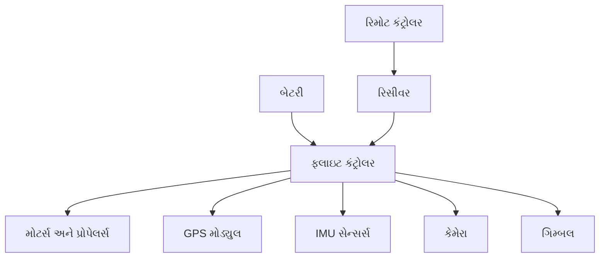
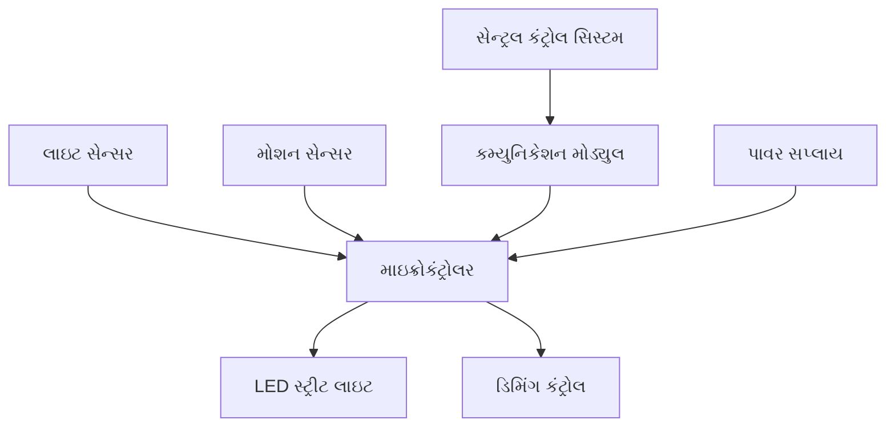
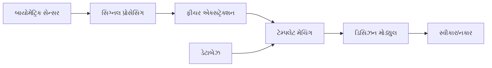
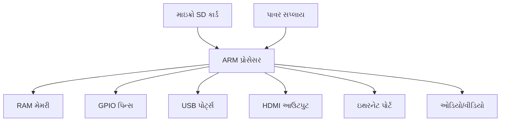
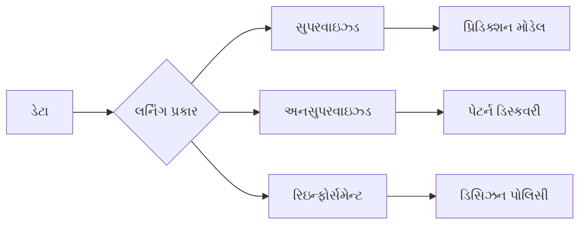

## પ્રશ્ન 1(અ) [3 ગુણ]

**રિન્યુએબલ એનર્જીની વ્યાખ્યા આપો અને તેનું મહત્વ સમજાવો.**

**જવાબ**:

**રિન્યુએબલ એનર્જી** એ કુદરતી સ્ત્રોતોમાંથી મેળવવામાં આવતી ઊર્જા છે જે સતત ભરપાઈ થતી રહે છે, જેમ કે સૌર, પવન, પાણી, બાયોમાસ અને ભૂગર્ભીય ઊર્જા.

**કોષ્ટક: રિન્યુએબલ એનર્જી સ્ત્રોતોના પ્રકારો**

| પ્રકાર | સ્ત્રોત | ફાયદો |
|------|-------|--------|
| **સોલર** | સૂર્યનું કિરણોત્સર્ગ | સ્વચ્છ, પુષ્કળ |
| **વિન્ડ** | હવાની હલનચલન | કોઈ ઉત્સર્જન નહીં |
| **હાઇડ્રો** | પાણીનો પ્રવાહ | વિશ્વસનીય પાવર |
| **બાયોમાસ** | કાર્બનિક પદાર્થ | કાર્બન તટસ્થ |

**મહત્વ:**

- **પર્યાવરણ સુરક્ષા**: પ્રદૂષણ અને ગ્રીનહાઉસ ગેસો ઘટાડે છે
- **ઊર્જા સુરક્ષા**: અશ્મિભૂત ઇંધન પર નિર્ભરતા ઘટાડે છે
- **આર્થિક ફાયદા**: રોજગાર સર્જન અને ઊર્જા ખર્ચ ઘટાડે છે

**મેમરી ટ્રીક:** "SEEB" - સોલર, એન્વાયર્નમેન્ટલ, ઇકોનોમિક, બાયોમાસ

## પ્રશ્ન 1(બ) [4 ગુણ]

**સૌર ફોટોવોલ્ટેઇક અસર અને ફોટોવોલ્ટેઇક રૂપાંતરનો સિદ્ધાંત સમજાવો.**

**જવાબ**:

**ફોટોવોલ્ટેઇક અસર** એ સેમિકંડક્ટર પદાર્થ પર પ્રકાશ પડવાથી વિદ્યુત વિવાહની ઉત્પત્તિ છે.

**કાર્યસિદ્ધાંત:**

- **ફોટોન શોષણ**: પ્રકાશ ફોટોન્સ સોલર સેલની સપાટી પર અથડાય છે
- **ઇલેક્ટ્રોન ઉત્તેજના**: ઇલેક્ટ્રોન્સ ઊર્જા મેળવે છે અને કંડક્શન બેન્ડમાં જાય છે
- **ચાર્જ વિભાજન**: બિલ્ટ-ઇન ઇલેક્ટ્રિક ફીલ્ડ પોઝિટિવ અને નેગેટિવ ચાર્જ અલગ કરે છે
- **કરંટ ઉત્પાદન**: ઇલેક્ટ્રોન્સનો પ્રવાહ DC વીજળી બનાવે છે

**આકૃતિ:**

```goat
    Light Photons
         ↓
    ┌─────────────┐
    │  P-type     │ ← Holes (+)
    │─────────────│ ← Junction
    │  N-type     │ ← Electrons (-)
    └─────────────┘
         ↓
    Electric Current
```

**મેમરી ટ્રીક:** "PACE" - ફોટોન્સ, શોષણ, ચાર્જ, ઇલેક્ટ્રિસિટી

## પ્રશ્ન 1(ક) [7 ગુણ]

**ઇલેક્ટ્રિક વ્હીકલ (EV) ના પ્રકારો અને EV માટે વિવિધ ઊર્જા સ્ત્રોતોનું વર્ણન કરો.**

**જવાબ**:

**કોષ્ટક: ઇલેક્ટ્રિક વ્હીકલના પ્રકારો**

| EV પ્રકાર | સંપૂર્ણ સ્વરૂપ | પાવર સ્ત્રોત | રેંજ |
|---------|-------------|------------|------|
| **BEV** | બેટરી ઇલેક્ટ્રિક વ્હીકલ | માત્ર બેટરી | 150-400 કિમી |
| **HEV** | હાયબ્રિડ ઇલેક્ટ્રિક વ્હીકલ | બેટરી + એન્જિન | 600+ કિમી |
| **PHEV** | પ્લગ-ઇન હાયબ્રિડ | બેટરી + એન્જિન | 50-100 કિમી ઇલેક્ટ્રિક |
| **FCEV** | ફ્યુઅલ સેલ ઇલેક્ટ્રિક | હાઇડ્રોજન ફ્યુઅલ સેલ | 400-600 કિમી |

**EV માટે ઊર્જા સ્ત્રોતો:**

- **બેટરી**: લિથિયમ-આયન બેટરીઓ વિદ્યુત ઊર્જા સંગ્રહ કરે છે
- **ફ્યુઅલ સેલ**: હાઇડ્રોજનને વીજળીમાં રૂપાંતરિત કરે છે
- **અલ્ટ્રાકેપેસિટર**: ઝડપી ઊર્જા સંગ્રહ અને છોડવાની પ્રક્રિયા
- **ફ્લાયવ્હીલ**: યાંત્રિક ઊર્જા સંગ્રહ
- **રિજનરેટિવ બ્રેકિંગ**: બ્રેકિંગ દરમિયાન ઊર્જા પુનઃપ્રાપ્ત કરે છે
- **હાયબ્રિડ સ્ત્રોતો**: બહુવિધ ઊર્જા સ્ત્રોતોનું સંયોજન

**આકૃતિ: EV આર્કિટેક્ચર**

```goat
┌────────────┐    ┌─────────────┐    ┌──────────┐
│   Battery  │────│  Controller │────│  Motor   │
└────────────┘    └─────────────┘    └──────────┘
                         │
                  ┌─────────────┐
                  │ Charging    │
                  │ System      │
                  └─────────────┘
```

**મેમરી ટ્રીક:** "BHPF-BUFR" - બેટરી, હાયબ્રિડ, પ્લગઇન, ફ્યુઅલસેલ - બેટરી, અલ્ટ્રાકેપ, ફ્લાયવ્હીલ, રિજન

## પ્રશ્ન 1(ક) અથવા [7 ગુણ]

**વિવિધ પ્રકારના રિન્યુએબલ ઊર્જા સ્ત્રોતોની ચર્ચા કરો.**

**જવાબ**:

**કોષ્ટક: રિન્યુએબલ ઊર્જા સ્ત્રોતોની સરખામણી**

| સ્ત્રોત | કેવી રીતે કામ કરે છે | ફાયદા | ઉપયોગ |
|-------|------------------|-------|-------|
| **સૌર** | સૂર્યપ્રકાશને વીજળીમાં રૂપાંતરિત કરે છે | સ્વચ્છ, પુષ્કળ | રૂફટોપ સિસ્ટમ, ફાર્મ |
| **પવન** | પવન ટર્બાઇન ફેરવે છે | કોઈ ઇંધન ખર્ચ નથી | વિન્ડ ફાર્મ, ઓફશોર |
| **હાઇડ્રોઇલેક્ટ્રિક** | પાણીનો પ્રવાહ પાવર જનરેટ કરે છે | વિશ્વસનીય, લાંબા સમય સુધી ચાલે છે | ડેમ, નદીઓ |
| **બાયોમાસ** | કાર્બનિક પદાર્થોનું દહન | કાર્બન તટસ્થ | પાવર પ્લાન્ટ, હીટિંગ |
| **જીઓથર્મલ** | પૃથ્વીની ગરમ ઊર્જા | સતત ઉપલબ્ધતા | હીટિંગ, વીજળી |

**ઉભરતા વલણો:**

- **ટાઇડલ વેવ**: મહાસાગરની તરંગ ઊર્જા રૂપાંતરણ
- **સૌર થર્મલ**: કેન્દ્રિત સૌર ઊર્જા સિસ્ટમ
- **હાઇડ્રોજન**: રિન્યુએબલ સ્ત્રોતોમાંથી સ્વચ્છ ઇંધન

**ફાયદા:**

- **ટકાઉપણું**: ક્યારેય ખતમ થતું નથી
- **પર્યાવરણીય**: ન્યુનતમ પ્રદૂષણ
- **આર્થિક**: લાંબા ગાળે ઊર્જા ખર્ચ ઘટાડે છે

**મેમરી ટ્રીક:** "SWHBG-THS" - સૌર, વિન્ડ, હાઇડ્રો, બાયોમાસ, જીઓથર્મલ - ટાઇડલ, હાઇડ્રોજન, સૌર થર્મલ

## પ્રશ્ન 2(અ) [3 ગુણ]

**નેનોટેકનોલોજી વ્યાખ્યાયિત કરો અને નેનોટેકનોલોજીની એપ્લિકેશનોની સૂચિ બનાવો.**

**જવાબ**:

**નેનોટેકનોલોજી** એ અણુ અને આણવિક સ્તરે (1-100 નેનોમીટર) પદાર્થનું હેરફેર કરવાનું વિજ્ઞાન છે.

**એપ્લિકેશનો:**

- **ઇલેક્ટ્રોનિક્સ**: નાના, ઝડપી પ્રોસેસર
- **મેડિસિન**: દવા પહોંચાડવાની સિસ્ટમ
- **ઊર્જા**: સૌર સેલ, બેટરીઓ
- **સામગ્રી**: મજબૂત, હળવા કમ્પોઝિટ

**મેમરી ટ્રીક:** "NEMS" - નેનો ઇલેક્ટ્રોનિક્સ, મેડિસિન, સૌર

## પ્રશ્ન 2(બ) [4 ગુણ]

**સંપૂર્ણ સ્વરૂપો આપો: UAV, IOT, AI, M2M**

**જવાબ**:

**કોષ્ટક: ટેકનોલોજી સંક્ષેપો**

| સંક્ષેપ | સંપૂર્ણ સ્વરૂપ | એપ્લિકેશન |
|-------|-------------|------------|
| **UAV** | અનમેન્ડ એરિયલ વ્હીકલ | સર્વેલન્સ, ડિલિવરી |
| **IOT** | ઇન્ટરનેટ ઓફ થિંગ્સ | સ્માર્ટ હોમ, શહેરો |
| **AI** | આર્ટિફિશિયલ ઇન્ટેલિજન્સ | મશીન લર્નિંગ, ઓટોમેશન |
| **M2M** | મશીન ટુ મશીન | ઇન્ડસ્ટ્રિયલ ઓટોમેશન |

**મેમરી ટ્રીક:** "UIAM" - UAV, IOT, AI, M2M

## પ્રશ્ન 2(ક) [7 ગુણ]

**ડ્રોનના બ્લોક ડાયાગ્રામ અને તેના મુખ્ય ઘટકોનું વર્ણન કરો.**

**જવાબ**:

**બ્લોક ડાયાગ્રામ:**



**મુખ્ય ઘટકો:**

- **ફ્લાઇટ કંટ્રોલર**: ડ્રોનનું મગજ, સેન્સર ડેટાને પ્રોસેસ કરે છે
- **મોટર્સ અને પ્રોપેલર્સ**: થ્રસ્ટ અને કંટ્રોલ મૂવમેન્ટ પ્રદાન કરે છે
- **બેટરી**: બધા ઇલેક્ટ્રોનિક ઘટકોને પાવર આપે છે
- **GPS મોડ્યુલ**: સ્થાન અને નેવિગેશન ડેટા પ્રદાન કરે છે
- **IMU સેન્સર્સ**: પ્રવેગ, પરિભ્રમણ, ચુંબકીય ક્ષેત્ર માપે છે
- **કેમેરા**: છબીઓ અને વીડિયો કેપ્ચર કરે છે
- **ગિમ્બલ**: સરળ ફૂટેજ માટે કેમેરાને સ્થિર કરે છે

**કાર્યસિદ્ધાંત:**

- **કંટ્રોલ**: રિમોટ રિસીવરને કમાન્ડ મોકલે છે
- **પ્રોસેસિંગ**: ફ્લાઇટ કંટ્રોલર કમાન્ડનું અર્થઘટન કરે છે
- **સ્થિરીકરણ**: IMU સેન્સર સંતુલન જાળવે છે
- **નેવિગેશન**: GPS પોઝિશન ફીડબેક પ્રદાન કરે છે

**મેમરી ટ્રીક:** "FMBGIC" - ફ્લાઇટ કંટ્રોલર, મોટર્સ, બેટરી, GPS, IMU, કેમેરા

## પ્રશ્ન 2(અ) અથવા [3 ગુણ] 

**IOT અને તેના મહત્વની ચર્ચા કરો.**

**જવાબ**:

**ઇન્ટરનેટ ઓફ થિંગ્સ (IOT)** રોજિંદા ઉપકરણોને ડેટા એક્સચેન્જ અને રિમોટ કંટ્રોલ માટે ઇન્ટરનેટ સાથે જોડે છે.

**મહત્વ:**

- **ઓટોમેશન**: સ્માર્ટ હોમ અને શહેરો
- **કાર્યક્ષમતા**: સંસાધનોનો ઓપ્ટિમાઇઝ્ડ ઉપયોગ
- **મોનિટરિંગ**: રીઅલ-ટાઇમ ડેટા કલેક્શન

**મેમરી ટ્રીક:** "AEM" - ઓટોમેશન, કાર્યક્ષમતા, મોનિટરિંગ

## પ્રશ્ન 2(બ) અથવા [4 ગુણ]

**વેરેબલ ટેકનોલોજી વ્યાખ્યાયિત કરો. વેરેબલ ટેકનોલોજીની ઓછામાં ઓછી ત્રણ એપ્લિકેશનના નામ આપો.**

**જવાબ**:

**વેરેબલ ટેકનોલોજી** એ શરીર પર પહેરવામાં આવતા ઇલેક્ટ્રોનિક ઉપકરણોનો સંદર્ભ આપે છે જે આરોગ્ય, ફિટનેસ અથવા માહિતી પ્રદાન કરવા માટે મોનિટર કરે છે.

**એપ્લિકેશનો:**

- **સ્માર્ટ વોચ**: ફિટનેસ ટ્રેકિંગ, નોટિફિકેશન
- **સ્માર્ટ ગ્લાસ**: ઓગમેન્ટેડ રિયાલિટી, નેવિગેશન
- **હેલ્થ મોનિટર્સ**: હાર્ટ રેટ, બ્લડ પ્રેશર મોનિટરિંગ

**મેમરી ટ્રીક:** "WSH" - વોચ, સ્માર્ટ ગ્લાસ, હેલ્થ મોનિટર્સ

## પ્રશ્ન 2(ક) અથવા [7 ગુણ]

**બ્લોક ડાયાગ્રામની મદદથી સ્માર્ટ સ્ટ્રીટ લાઇટ કંટ્રોલ અને મોનિટરિંગ સમજાવો.**

**જવાબ**:

**બ્લોક ડાયાગ્રામ:**



**ઘટકો:**

- **લાઇટ સેન્સર**: આસપાસના પ્રકાશના સ્તરને શોધે છે
- **મોશન સેન્સર**: પદયાત્રી/વાહનની હલનચલન શોધે છે
- **માઇક્રોકંટ્રોલર**: સેન્સર ડેટાને પ્રોસેસ કરે છે અને લાઇટિંગ કંટ્રોલ કરે છે
- **કમ્યુનિકેશન મોડ્યુલ**: કંટ્રોલ સેન્ટર સાથે વાયરલેસ કનેક્શન
- **LED સ્ટ્રીટ લાઇટ**: ઊર્જા-કાર્યક્ષમ લાઇટિંગ
- **ડિમિંગ કંટ્રોલ**: જરૂરિયાત આધારિત તેજ ગોઠવે છે

**કાર્યપ્રણાલી:**

- **ઓટો ON/OFF**: સાંજે લાઇટ ચાલુ, સવારે બંધ
- **મોશન ડિટેક્શન**: હલનચલન શોધાતાં તેજ વધારે છે
- **રિમોટ મોનિટરિંગ**: સેન્ટ્રલ સિસ્ટમ બધી લાઇટ મોનિટર કરે છે
- **ઊર્જા બચત**: કોઈ પ્રવૃત્તિ ન હોય ત્યારે લાઇટ ડિમ કરે છે

**મેમરી ટ્રીક:** "LMCL" - લાઇટ સેન્સર, મોશન સેન્સર, કંટ્રોલર, LED

## પ્રશ્ન 3(અ) [3 ગુણ]

**ઓર્ગેનિક અને ઇનઓર્ગેનિક ઇલેક્ટ્રોનિક્સની સરખામણી કરો.**

**જવાબ**:

**કોષ્ટક: ઓર્ગેનિક vs ઇનઓર્ગેનિક ઇલેક્ટ્રોનિક્સ**

| પરિમાણ | ઓર્ગેનિક ઇલેક્ટ્રોનિક્સ | ઇનઓર્ગેનિક ઇલેક્ટ્રોનિક્સ |
|---------|------------------|-------------------|
| **સામગ્રી** | કાર્બન-આધારિત સંયોજનો | સિલિકોન, ધાતુઓ |
| **કિંમત** | ઓછી ઉત્પાદન કિંમત | વધારે કિંમત |
| **લવચીકતા** | લવચીક, વાંકી શકાય તેવું | કઠોર માળખું |
| **પ્રોસેસિંગ** | ઓછું તાપમાન | વધારે તાપમાન |

**મેમરી ટ્રીક:** "MCFP" - મટેરિયલ, કોસ્ટ, ફ્લેક્સિબિલિટી, પ્રોસેસિંગ

## પ્રશ્ન 3(બ) [4 ગુણ]

**OPVD પર ટૂંકનોંધ લખો.**

**જવાબ**:

**OPVD (ઓર્ગેનિક ફોટોવોલ્ટેઇક ડિવાઇસ)** એ ઓર્ગેનિક સેમિકંડક્ટીંગ સામગ્રીમાંથી બનાવેલા સોલર સેલ છે.

**લાક્ષણિકતાઓ:**

- **લવચીક**: લવચીક સબસ્ટ્રેટ પર બનાવી શકાય છે
- **ઓછી કિંમત**: સસ્તી ઉત્પાદન પ્રક્રિયા
- **હળવાવજન**: પોર્ટેબલ એપ્લિકેશન માટે યોગ્ય
- **અર્ધ-પારદર્શક**: વિન્ડોમાં એકીકૃત કરી શકાય છે

**એપ્લિકેશનો:**

- **બિલ્ડિંગ એકીકરણ**: સોલર વિન્ડો
- **પોર્ટેબલ ડિવાઇસ**: લવચીક સોલર ચાર્જર
- **વેરેબલ ઇલેક્ટ્રોનિક્સ**: સોલર-પાવર્ડ ગેજેટ

**મેમરી ટ્રીક:** "FLLW" - ફ્લેક્સિબલ, લો-કોસ્ટ, લાઇટવેઇટ, વિન્ડોઝ

## પ્રશ્ન 3(ક) [7 ગુણ]

**બાયોમેટ્રિક સિસ્ટમ અને તેમના મૂળભૂત બ્લોક ડાયાગ્રામ સમજાવો.**

**જવાબ**:

**બાયોમેટ્રિક સિસ્ટમ** અનન્ય જૈવિક લાક્ષણિકતાઓના આધારે વ્યક્તિઓને ઓળખે છે.

**બ્લોક ડાયાગ્રામ:**



**ઘટકો:**

- **સેન્સર મોડ્યુલ**: બાયોમેટ્રિક ડેટા કેપ્ચર કરે છે (ફિંગરપ્રિન્ટ, આઇરિસ, ચહેરો)
- **સિગ્નલ પ્રોસેસિંગ**: કેપ્ચર્ડ સિગ્નલને વધારે છે અને સાફ કરે છે
- **ફીચર એક્સટ્રેક્શન**: અનન્ય લાક્ષણિકતાઓને ઓળખે છે
- **ડેટાબેઝ મોડ્યુલ**: બાયોમેટ્રિક ટેમ્પલેટ સ્ટોર કરે છે
- **મેચિંગ મોડ્યુલ**: કેપ્ચર્ડ ડેટાને સ્ટોર્ડ ટેમ્પલેટ સાથે સરખાવે છે
- **ડિસિઝન મોડ્યુલ**: અંતિમ સ્વીકાર/નકાર નિર્ણય લે છે

**બાયોમેટ્રિક્સના પ્રકારો:**

- **ફિંગરપ્રિન્ટ**: આંગળીઓ પર રિજ પેટર્ન
- **આઇરિસ**: આંખના આઇરિસ પેટર્ન
- **ચહેરાની ઓળખ**: ચહેરાની વિશેષતાઓ
- **અવાજ**: અવાજની પેટર્ન અને લાક્ષણિકતાઓ

**એપ્લિકેશન:**

- **સુરક્ષા**: એક્સેસ કંટ્રોલ સિસ્ટમ
- **બેંકિંગ**: ATM ઓથેન્ટિકેશન
- **મોબાઇલ**: ફોન અનલોકિંગ
- **બોર્ડર કંટ્રોલ**: ઇમિગ્રેશન સિસ્ટમ

**મેમરી ટ્રીક:** "SFEMD" - સેન્સર, ફીચર એક્સટ્રેક્શન, મેચિંગ, ડેટાબેઝ, ડિસિઝન

## પ્રશ્ન 3(અ) અથવા [3 ગુણ]

**ઓર્ગેનિક ઇલેક્ટ્રોનિક્સના ફાયદા અને એપ્લિકેશનની યાદી બનાવો.**

**જવાબ**:

**ફાયદા:**

- **લવચીક**: વાંકી શકાય તેવા ઇલેક્ટ્રોનિક ઉપકરણો
- **ઓછી કિંમત**: સસ્તી ઉત્પાદન
- **મોટા વિસ્તાર**: મોટી સપાટીઓને ઢાંકી શકે છે

**એપ્લિકેશન:**

- **OLED ડિસ્પ્લે**: લવચીક સ્ક્રીન
- **સોલર સેલ**: હળવાવજન પેનલ
- **RFID ટેગ**: લવચીક ઓળખ

**મેમરી ટ્રીક:** "FLL-OSR" - ફ્લેક્સિબલ, લો-કોસ્ટ, લાર્જ-એરિયા - OLED, સોલર, RFID

## પ્રશ્ન 3(બ) અથવા [4 ગુણ]

**OLED પર ટૂંકનોંધ લખો.**

**જવાબ**:

**OLED (ઓર્ગેનિક લાઇટ એમિટિંગ ડાયોડ)** એ ડિસ્પ્લે ટેકનોલોજી છે જે ઓર્ગેનિક સંયોજનોનો ઉપયોગ કરે છે જે ઇલેક્ટ્રિક કરંટ લાગુ કરવામાં આવે ત્યારે પ્રકાશ ઉત્સર્જન કરે છે.

**ફાયદા:**

- **સ્વ-પ્રકાશિત**: બેકલાઇટની જરૂર નથી
- **હાઇ કોન્ટ્રાસ્ટ**: સાચા કાળા રંગો
- **લવચીક**: વાંકી અને વળાંકવાળું બનાવી શકાય છે
- **ઊર્જા કાર્યક્ષમ**: ઓછો પાવર વપરાશ

**એપ્લિકેશન:**

- **સ્માર્ટફોન**: OLED સ્ક્રીન
- **ટીવી**: અલ્ટ્રા-થિન ડિસ્પ્લે
- **વેરેબલ**: સ્માર્ટવોચ ડિસ્પ્લે

**મેમરી ટ્રીક:** "SHFE" - સ્વ-પ્રકાશિત, હાઇ કોન્ટ્રાસ્ટ, ફ્લેક્સિબલ, કાર્યક્ષમ

## પ્રશ્ન 3(ક) અથવા [7 ગુણ]

**AR/VR કોર ટેકનોલોજી સમજાવો અને તેની એપ્લિકેશનોની ચર્ચા કરો.**

**જવાબ**:

**AR (ઓગમેન્ટેડ રિયાલિટી)** વાસ્તવિક વિશ્વ પર ડિજિટલ માહિતીને ઓવરલે કરે છે, જ્યારે **VR (વર્ચ્યુઅલ રિયાલિટી)** સંપૂર્ણપણે ઇમર્સિવ ડિજિટલ વાતાવરણ બનાવે છે.

**કોર ટેકનોલોજી:**

- **ડિસ્પ્લે સિસ્ટમ**: હેડ-માઉન્ટેડ ડિસ્પ્લે, સ્ક્રીન
- **ટ્રેકિંગ સિસ્ટમ**: મોશન સેન્સર, કેમેરા
- **પ્રોસેસિંગ યુનિટ**: GPU, સ્પેશિયલાઇઝ્ડ ચિપ્સ
- **ઇનપુટ મેથડ**: કંટ્રોલર, જેસ્ચર રેકગ્નિશન

**AR એપ્લિકેશન:**

- **ગેમિંગ**: પોકેમોન ગો, મોબાઇલ AR ગેમ્સ
- **શિક્ષણ**: ઇન્ટરેક્ટિવ લર્નિંગ અનુભવો
- **નેવિગેશન**: વાસ્તવિક રસ્તાઓ પર GPS ઓવરલે
- **શોપિંગ**: વર્ચ્યુઅલ ટ્રાય-ઓન અનુભવો

**VR એપ્લિકેશન:**

- **મનોરંજન**: ઇમર્સિવ ગેમિંગ, મૂવીઝ
- **ટ્રેનિંગ**: ફ્લાઇટ સિમ્યુલેટર, મેડિકલ ટ્રેનિંગ
- **આર્કિટેક્ચર**: વર્ચ્યુઅલ બિલ્ડિંગ વોકથ્રુ
- **થેરાપી**: ફોબિયા, PTSD ની સારવાર

**કોષ્ટક: AR vs VR સરખામણી**

| પાસું | AR | VR |
|------|----|----|
| **વાસ્તવિકતા** | વાસ્તવિક વિશ્વ સાથે મિશ્રિત | સંપૂર્ણપણે વર્ચ્યુઅલ |
| **સાધનો** | સ્માર્ટફોન, AR ચશ્મા | VR હેડસેટ, કંટ્રોલર |
| **ઇમર્શન** | આંશિક | સંપૂર્ણ |
| **ગતિશીલતા** | મોબાઇલ ફ્રેન્ડલી | સ્થિર સેટઅપ |

**મેમરી ટ્રીક:** "DTPI-GENT" - ડિસ્પ્લે, ટ્રેકિંગ, પ્રોસેસિંગ, ઇનપુટ - ગેમિંગ, એજ્યુકેશન, નેવિગેશન, ટ્રેનિંગ

## પ્રશ્ન 4(અ) [3 ગુણ]

**હોમ સોલર રૂફટોપ સિસ્ટમનો બ્લોક ડાયાગ્રામ દોરો.**

**જવાબ**:

**બ્લોક ડાયાગ્રામ:**

```goat
┌─────────────┐    ┌─────────────┐    ┌─────────────┐
│Solar Panels │────│   Inverter  │────│AC Load Panel│
└─────────────┘    └─────────────┘    └─────────────┘
                          │                   │
                   ┌─────────────┐    ┌─────────────┐
                   │   Battery   │    │Utility Grid │
                   │   Storage   │    │ Connection  │
                   └─────────────┘    └─────────────┘
```

**ઘટકો:**

- **સોલર પેનલ્સ**: સૂર્યપ્રકાશને DC વીજળીમાં રૂપાંતરિત કરે છે
- **ઇન્વર્ટર**: DC ને AC પાવરમાં રૂપાંતરિત કરે છે
- **બેટરી સ્ટોરેજ**: વધારાની ઊર્જા સંગ્રહ કરે છે

**મેમરી ટ્રીક:** "SIB" - સોલર પેનલ્સ, ઇન્વર્ટર, બેટરી

## પ્રશ્ન 4(બ) [4 ગુણ]

**OFET નો કાર્યસિદ્ધાંત સમજાવો.**

**જવાબ**:

**OFET (ઓર્ગેનિક ફીલ્ડ ઇફેક્ટ ટ્રાન્ઝિસ્ટર)** કરંટ ફ્લોને કંટ્રોલ કરવા માટે ઓર્ગેનિક સેમિકંડક્ટરનો ઉપયોગ કરે છે.

**કાર્યસિદ્ધાંત:**

- **ગેટ વોલ્ટેજ**: લાગુ વોલ્ટેજ ઇલેક્ટ્રિક ફીલ્ડ બનાવે છે
- **ચેનલ ફોર્મેશન**: ઇલેક્ટ્રિક ફીલ્ડ કંડક્ટિવિટી મોડ્યુલેટ કરે છે
- **કરંટ કંટ્રોલ**: સોર્સ-ડ્રેન કરંટ ગેટ દ્વારા કંટ્રોલ થાય છે
- **સ્વિચિંગ**: ડિજિટલ એપ્લિકેશન માટે ON/OFF સ્ટેટ

**માળખું:**

- **સોર્સ/ડ્રેન**: કરંટ ઇન્જેક્શન પોઇન્ટ
- **ગેટ**: કંટ્રોલ ઇલેક્ટ્રોડ
- **ઓર્ગેનિક લેયર**: એક્ટિવ સેમિકंડક્ટર મટેરિયલ

**મેમરી ટ્રીક:** "GCCS" - ગેટ વોલ્ટેજ, ચેનલ, કરંટ, સ્વિચિંગ

## પ્રશ્ન 4(ક) [7 ગુણ]

**વિવિધ મશીન લર્નિંગ ટૂલ્સની યાદી બનાવો. કોઈપણ બેની ટૂંકમાં ચર્ચા કરો.**

**જવાબ**:

**મશીન લર્નિંગ ટૂલ્સ:**

- **TensorFlow**: ગૂગલનું ML ફ્રેમવર્ક
- **PyTorch**: ફેસબુકની ડીપ લર્નિંગ લાઇબ્રેરી
- **Scikit-learn**: પાયથોન ML લાઇબ્રેરી
- **Keras**: હાઇ-લેવલ ન્યુરલ નેટવર્ક API
- **Machine Learning for Kids**: શૈક્ષણિક પ્લેટફોર્મ
- **Scratch**: ML માટે વિઝ્યુઅલ પ્રોગ્રામિંગ

**TensorFlow:**

- **હેતુ**: ડીપ લર્નિંગ અને ન્યુરલ નેટવર્ક
- **વિશેષતાઓ**: મોટા પાયે ML, પ્રોડક્શન ડિપ્લોયમેન્ટ
- **એપ્લિકેશન**: ઇમેજ રેકગ્નિશન, NLP, રેકમેન્ડેશન સિસ્ટમ
- **ફાયદા**: સ્કેલેબલ, વ્યાપક ડોક્યુમેન્ટેશન

**Scikit-learn:**

- **હેતુ**: સામાન્ય મશીન લર્નિંગ અલગોરિધમ
- **વિશેષતાઓ**: ક્લાસિફિકેશન, રિગ્રેશન, ક્લસ્ટરિંગ
- **એપ્લિકેશન**: ડેટા એનાલિસિસ, પ્રિડિક્ટિવ મોડેલિંગ
- **ફાયદા**: ઉપયોગમાં સરળ, સારી રીતે ડોક્યુમેન્ટેડ

**કોષ્ટક: ML ટૂલ્સ સરખામણી**

| ટૂલ | પ્રકાર | સર્વોત્તમ | મુશ્કેલી |
|-----|------|---------|---------|
| **TensorFlow** | ડીપ લર્નિંગ | જટિલ મોડેલ | એડવાન્સ |
| **Scikit-learn** | જનરલ ML | બિગિનર્સ | સરળ |

**મેમરી ટ્રીક:** "TPSKMS-TF.SL" - TensorFlow, PyTorch, Scikit, Keras, ML4Kids, Scratch - TensorFlow, Scikit-learn

## પ્રશ્ન 4(અ) અથવા [3 ગુણ]

**રિન્યુએબલ એનર્જીમાં ઇમર્જિંગ ટ્રેન્ડ્સને સંક્ષિપ્તમાં સમજાવો.**

**જવાબ**:

**ઉભરતા વલણો:**

- **ફ્લોટિંગ સોલર**: પાણીના શરીર પર સોલર પેનલ
- **પેરોવ્સકાઇટ સેલ**: આગામી પેઢીની સોલર ટેકનોલોજી
- **ગ્રીન હાઇડ્રોજન**: રિન્યુએબલ સ્ત્રોતોમાંથી સ્વચ્છ ઇંધન

**ફાયદા:**

- **વધારે કાર્યક્ષમતા**: બહેતર ઊર્જા રૂપાંતરણ
- **કિંમત ઘટાડો**: સસ્તી રિન્યુએબલ એનર્જી

**મેમરી ટ્રીક:** "FPG" - ફ્લોટિંગ સોલર, પેરોવ્સકાઇટ, ગ્રીન હાઇડ્રોજન

## પ્રશ્ન 4(બ) અથવા [4 ગુણ]

**સંપૂર્ણ સ્વરૂપો આપો: AR, OLED, OPVD, OFET**

**જવાબ**:

**કોષ્ટક: ટેકનોલોજી સંપૂર્ણ સ્વરૂપો**

| સંક્ષેપ | સંપૂર્ણ સ્વરૂપ | ટેકનોલોજી વિસ્તાર |
|-------|-------------|----------------|
| **AR** | ઓગમેન્ટેડ રિયાલિટી | મિક્સ્ડ રિયાલિટી |
| **OLED** | ઓર્ગેનિક લાઇટ એમિટિંગ ડાયોડ | ડિસ્પ્લે ટેકનોલોજી |
| **OPVD** | ઓર્ગેનિક ફોટોવોલ્ટેઇક ડિવાઇસ | સોલર સેલ |
| **OFET** | ઓર્ગેનિક ફીલ્ડ ઇફેક્ટ ટ્રાન્ઝિસ્ટર | ઇલેક્ટ્રોનિક્સ |

**મેમરી ટ્રીક:** "AOOO" - AR, OLED, OPVD, OFET

## પ્રશ્ન 4(ક) અથવા [7 ગુણ]

**રાસ્પબેરી પાઈનો બ્લોક ડાયાગ્રામ સમજાવો.**

**જવાબ**:

**બ્લોક ડાયાગ્રામ:**



**ઘટકો:**

- **ARM પ્રોસેસર**: સેન્ટ્રલ પ્રોસેસિંગ યુનિટ (ક્વાડ-કોર)
- **RAM મેમરી**: સિસ્ટમ મેમરી (1GB-8GB)
- **GPIO પિન્સ**: સેન્સર/ઉપકરણોને ઇન્ટરફેસ કરવા માટે 40 પિન્સ
- **USB પોર્ટ્સ**: પેરિફેરલ્સ કનેક્ટ કરે છે
- **HDMI આઉટપુટ**: વીડિયો ડિસ્પ્લે કનેક્શન
- **ઇથરનેટ પોર્ટ**: નેટવર્ક કનેક્ટિવિટી
- **માઇક્રો SD કાર્ડ**: OS અને ડેટા માટે સ્ટોરેજ
- **પાવર સપ્લાય**: 5V માઇક્રો-USB અથવા USB-C

**વિશેષતાઓ:**

- **ઓપરેટિંગ સિસ્ટમ**: રાસ્પબેરી પાઈ OS (લિનક્સ-આધારિત)
- **પ્રોગ્રામિંગ**: પાયથોન, C++, Scratch સપોર્ટ
- **કનેક્ટિવિટી**: બિલ્ટ-ઇન Wi-Fi, બ્લુટૂથ
- **વિસ્તરણક્ષમતા**: કેમેરા, ડિસ્પ્લે કનેક્ટર

**એપ્લિકેશન:**

- **IoT પ્રોજેક્ટ્સ**: હોમ ઓટોમેશન
- **શિક્ષણ**: પ્રોગ્રામિંગ શીખવું
- **રોબોટિક્સ**: રોબોટ કંટ્રોલ સિસ્ટમ
- **મીડિયા સેન્ટર**: હોમ એન્ટરટેઇનમેન્ટ

**મેમરી ટ્રીક:** "ARGC-EPMS" - ARM, RAM, GPIO, કનેક્ટિવિટી - ઇથરનેટ, પાવર, માઇક્રોSD, સ્ટોરેજ

## પ્રશ્ન 5(અ) [3 ગુણ]

**રાસ્પબેરી પાઈ સાથે LED ઇન્ટરફેસ કરો.**

**જવાબ**:

**સર્કિટ કનેક્શન:**

```goat
રાસ્પબેરી પાઈ          LED સર્કિટ
GPIO Pin 18 ────── 220Ω ────── LED ────── GND
                   રેઝિસ્ટર   એનોડ     કેથોડ
```

**પાયથોન કોડ:**

```python
import RPi.GPIO as GPIO
import time

GPIO.setmode(GPIO.BCM)
GPIO.setup(18, GPIO.OUT)

while True:
    GPIO.output(18, GPIO.HIGH)  # LED ON
    time.sleep(1)
    GPIO.output(18, GPIO.LOW)   # LED OFF
    time.sleep(1)
```

**મેમરી ટ્રીક:** "GPIO-RC" - GPIO પિન, રેઝિસ્ટર, કોડ

## પ્રશ્ન 5(બ) [4 ગુણ]

**મશીન લર્નિંગ માટે Pandas પાયથોન લાઇબ્રેરી સમજાવો.**

**જવાબ**:

**Pandas** એ ડેટા મેનિપ્યુલેશન અને એનાલિસિસ માટેની પાયથોન લાઇબ્રેરી છે, જે ML ડેટા પ્રીપ્રોસેસિંગ માટે આવશ્યક છે.

**મુખ્ય વિશેષતાઓ:**

- **DataFrame**: ટેબ્યુલર ડેટા સ્ટ્રક્ચર
- **ડેટા ક્લીનિંગ**: ગુમ થયેલ વેલ્યુ, ડુપ્લિકેટ હેન્ડલ કરે છે
- **ડેટા ઇમ્પોર્ટ**: CSV, Excel, JSON ફાઇલો વાંચે છે
- **ડેટા એનાલિસિસ**: આંકડાકીય ઓપરેશન્સ, ગ્રુપિંગ

**ML એપ્લિકેશન:**

- **ડેટા પ્રીપ્રોસેસિંગ**: ડેટાસેટ સાફ અને તૈયાર કરે છે
- **ફીચર એન્જિનિયરિંગ**: ડેટામાંથી નવી વિશેષતાઓ બનાવે છે
- **ડેટા એક્સપ્લોરેશન**: ડેટા પેટર્ન સમજે છે
- **ડેટા ટ્રાન્સફોર્મેશન**: ડેટાને નોર્મલાઇઝ, સ્કેલ કરે છે

**સામાન્ય ફંક્શન્સ:**

```python
import pandas as pd
df = pd.read_csv('data.csv')    # ડેટા લોડ કરો
df.info()                       # ડેટા માહિતી
df.describe()                   # આંકડાકીય માહિતી
```

**મેમરી ટ્રીક:** "DCIF" - DataFrame, ક્લીનિંગ, ઇમ્પોર્ટ, ફંક્શન્સ

## પ્રશ્ન 5(ક) [7 ગુણ]

**મશીન લર્નિંગ તકનીકોના પ્રકારો સમજાવો: સુપરવાઇઝ્ડ, અનસુપરવાઇઝ્ડ અને રિઇન્ફોર્સમેન્ટ લર્નિંગ.**

**જવાબ**:

**કોષ્ટક: મશીન લર્નિંગ પ્રકારો**

| પ્રકાર | જરૂરી ડેટા | ધ્યેય | ઉદાહરણો |
|------|-----------|------|---------|
| **સુપરવાઇઝ્ડ** | લેબલ્ડ ડેટા | પરિણામોની આગાહી | ક્લાસિફિકેશન, રિગ્રેશન |
| **અનસુપરવાઇઝ્ડ** | અનલેબલ્ડ ડેટા | પેટર્ન શોધવું | ક્લસ્ટરિંગ, ડાઇમેન્શનલિટી રિડક્શન |
| **રિઇન્ફોર્સમેન્ટ** | રિવાર્ડ સિગ્નલ્સ | શ્રેષ્ઠ ક્રિયાઓ શીખવી | ગેમ પ્લેઇંગ, રોબોટિક્સ |

**સુપરવાઇઝ્ડ લર્નિંગ:**

- **વ્યાખ્યા**: ઇનપુટ-આઉટપુટ જોડીઓમાંથી શીખે છે
- **પ્રક્રિયા**: જાણીતા જવાબો સાથે ટ્રેનિંગ
- **એપ્લિકેશન**: ઇમેઇલ સ્પામ ડિટેક્શન, ઇમેજ રેકગ્નિશન
- **અલગોરિધમ**: લિનિયર રિગ્રેશન, ડિસિઝન ટ્રી, ન્યુરલ નેટવર્ક

**અનસુપરવાઇઝ્ડ લર્નિંગ:**

- **વ્યાખ્યા**: ડેટામાં છુપાયેલા પેટર્ન શોધે છે
- **પ્રક્રિયા**: કોઈ ટાર્ગેટ વેરિએબલ પ્રદાન કરવામાં આવતું નથી
- **એપ્લિકેશન**: કસ્ટમર સેગમેન્ટેશન, એનોમલી ડિટેક્શન
- **અલગોરિધમ**: K-means ક્લસ્ટરિંગ, PCA, હાઇરાર્કિકલ ક્લસ્ટરિંગ

**રિઇન્ફોર્સમેન્ટ લર્નિંગ:**

- **વ્યાખ્યા**: ટ્રાયલ અને એરર દ્વારા શીખે છે
- **પ્રક્રિયા**: એજન્ટ વાતાવરણ સાથે ઇન્ટરેક્ટ કરે છે
- **એપ્લિકેશન**: ગેમ AI, ઓટોનોમસ વ્હીકલ, રોબોટિક્સ
- **ઘટકો**: એજન્ટ, વાતાવરણ, રિવાર્ડ, ક્રિયાઓ

**આકૃતિ: ML લર્નિંગ પ્રક્રિયા**



**મેમરી ટ્રીક:** "SUR-PLR-CPD" - સુપરવાઇઝ્ડ, અનસુપરવાઇઝ્ડ, રિઇન્ફોર્સમેન્ટ - પ્રિડિક્શન, લર્નિંગ, રિવાર્ડ - ક્લાસિફિકેશન, પેટર્ન, ડિસિઝન

## પ્રશ્ન 5(અ) અથવા [3 ગુણ]

**મશીન લર્નિંગ માટે NumPy પાયથોન લાઇબ્રેરી સમજાવો.**

**જવાબ**:

**NumPy** એ પાયથોનમાં ન્યુમેરિકલ કમ્પ્યુટિંગ માટેની મૂળભૂત લાઇબ્રેરી છે, જે ML ઓપરેશન્સ માટે આવશ્યક છે.

**મુખ્ય વિશેષતાઓ:**

- **એરે**: મલ્ટિ-ડાઇમેન્શનલ એરે ઓબ્જેક્ટ
- **મેથેમેટિકલ ફંક્શન્સ**: લિનિયર આલ્જેબ્રા ઓપરેશન્સ
- **બ્રોડકાસ્ટિંગ**: અલગ સાઇઝના એરે પર ઓપરેશન્સ

**ML એપ્લિકેશન:**

- **ડેટા સ્ટોરેજ**: કાર્યક્ષમ ન્યુમેરિકલ ડેટા સ્ટોરેજ
- **મેટ્રિક્સ ઓપરેશન્સ**: ન્યુરલ નેટવર્ક કમ્પ્યુટેશન્સ
- **મેથેમેટિકલ કમ્પ્યુટેશન્સ**: આંકડાકીય ઓપરેશન્સ

**મેમરી ટ્રીક:** "AMB" - એરે, મેથેમેટિકલ ફંક્શન્સ, બ્રોડકાસ્ટિંગ

## પ્રશ્ન 5(બ) અથવા [4 ગુણ]

**Raspberry Pi Imager નો ઉપયોગ કરીને SD કાર્ડ પર Raspberry Pi OS ઇન્સ્ટોલેશનના સ્ટેપ્સ લખો.**

**જવાબ**:

**ઇન્સ્ટોલેશન સ્ટેપ્સ:**

1. **ડાઉનલોડ**: ઓફિશિયલ વેબસાઇટથી Raspberry Pi Imager ઇન્સ્ટોલ કરો
2. **SD કાર્ડ ઇન્સર્ટ**: કમ્પ્યુટરમાં SD કાર્ડ (16GB+) કનેક્ટ કરો
3. **OS સિલેક્ટ**: યાદીમાંથી Raspberry Pi OS પસંદ કરો
4. **સ્ટોરેજ સિલેક્ટ**: ટાર્ગેટ તરીકે SD કાર્ડ પસંદ કરો
5. **રાઇટ**: OS ને SD કાર્ડમાં ફ્લેશ કરવા માટે "Write" ક્લિક કરો
6. **ઇજેક્ટ**: પૂર્ણ થયા પછી SD કાર્ડને સુરક્ષિત રીતે કાઢો

**પૂર્વ-ગોઠવણી વિકલ્પો:**

- **SSH એનેબલ**: રિમોટ એક્સેસ માટે
- **યુઝરનેમ/પાસવર્ડ સેટ**: સુરક્ષા ક્રેડેન્શિયલ્સ
- **Wi-Fi કોન્ફિગર**: નેટવર્ક સેટિંગ્સ

**મેમરી ટ્રીક:** "DISWS-ESP" - ડાઉનલોડ, ઇન્સર્ટ, સિલેક્ટ OS, રાઇટ, સ્ટોરેજ - SSH એનેબલ, ક્રેડેન્શિયલ્સ સેટ, પૂર્વ-કોન્ફિગર

## પ્રશ્ન 5(ક) અથવા [7 ગુણ]

**Raspberry Pi સાથે Temperature અને humidity સેન્સર ઇન્ટરફેસ કરો અને તેના માટે Python પ્રોગ્રામ લખો.**

**જવાબ**:

**સર્કિટ કનેક્શન:**

```goat
DHT22 સેન્સર          રાસ્પબેરી પાઈ
VCC  ────────────────  3.3V (Pin 1)
DATA ────────────────  GPIO 4 (Pin 7)
GND  ────────────────  GND (Pin 6)
```

**પાયથોન પ્રોગ્રામ:**

```python
import Adafruit_DHT
import time

# સેન્સર પ્રકાર અને GPIO પિન
sensor = Adafruit_DHT.DHT22
pin = 4

while True:
    try:
        # સેન્સર ડેટા વાંચો
        humidity, temperature = Adafruit_DHT.read_retry(sensor, pin)
        
        if humidity is not None and temperature is not None:
            print(f'તાપમાન: {temperature:.1f}°C')
            print(f'ભેજ: {humidity:.1f}%')
        else:
            print('સેન્સર ડેટા વાંચવામાં નિષ્ફળ')
            
        time.sleep(2)  # 2 સેકંડ રાહ જુઓ
        
    except KeyboardInterrupt:
        print("\nપ્રોગ્રામ બંધ")
        break
```

**જરૂરી લાઇબ્રેરી:**

```bash
pip install Adafruit_DHT
```

**ઉપયોગમાં લેવાયેલા ઘટકો:**

- **DHT22**: તાપમાન અને ભેજ સેન્સર
- **રાસ્પબેરી પાઈ**: પ્રોસેસિંગ યુનિટ
- **પાયથોન**: પ્રોગ્રામિંગ લેંગ્વેજ
- **Adafruit લાઇબ્રેરી**: સેન્સર ઇન્ટરફેસ લાઇબ્રેરી

**વિશેષતાઓ:**

- **રીઅલ-ટાઇમ રીડિંગ**: સતત મોનિટરિંગ
- **એરર હેન્ડલિંગ**: સેન્સર રીડ ફેઇલ્યુર હેન્ડલ કરે છે
- **ડેટા ડિસ્પ્લે**: તાપમાન અને ભેજના મૂલ્યો બતાવે છે
- **યુઝર કંટ્રોલ**: પ્રોગ્રામ બંધ કરવા માટે કીબોર્ડ ઇન્ટરપ્ટ

**એપ્લિકેશન:**

- **વેધર સ્ટેશન**: સ્થાનિક હવામાન મોનિટરિંગ
- **હોમ ઓટોમેશન**: ક્લાઇમેટ કંટ્રોલ સિસ્ટમ
- **કૃષિ**: ગ્રીનહાઉસ મોનિટરિંગ
- **ઇન્ડસ્ટ્રિયલ**: પર્યાવરણીય મોનિટરિંગ

**મેમરી ટ્રીક:** "DHT-RPL" - DHT સેન્સર, રાસ્પબેરી પાઈ, પાયથોન, લાઇબ્રેરી
