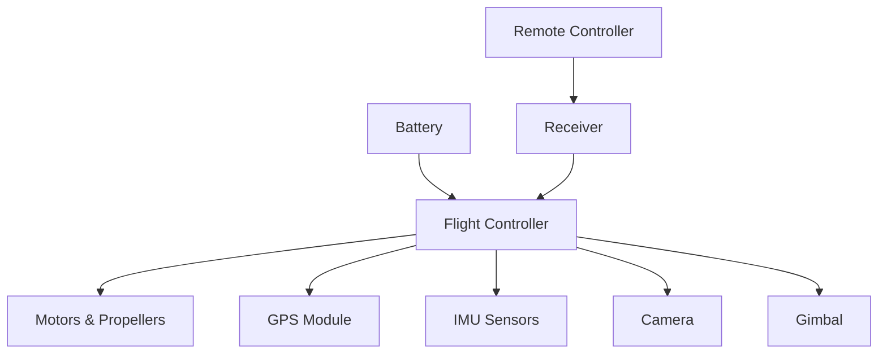
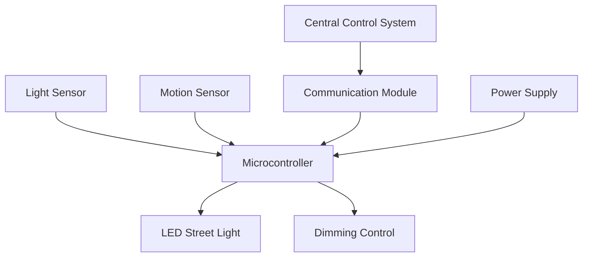
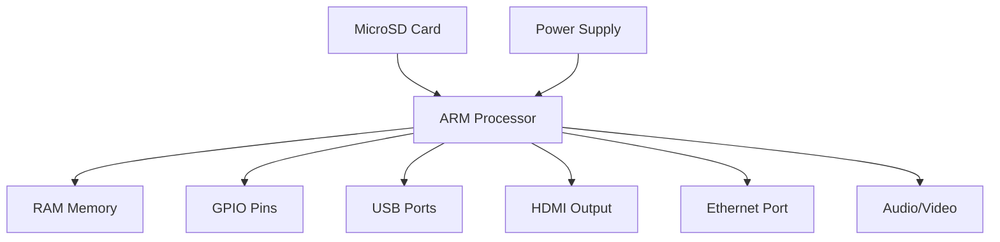
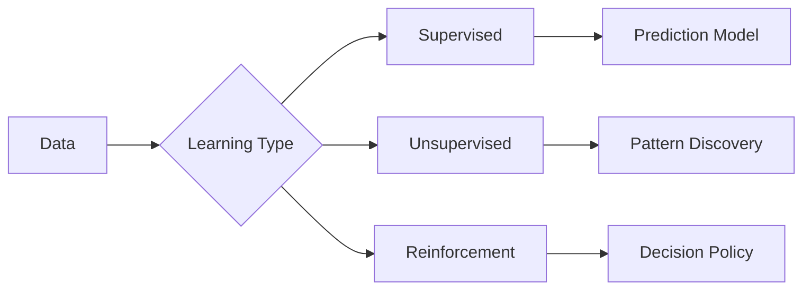

## Question 1(a) [3 marks]

**Define Renewable Energy and explain its importance.**

**Answer**:

**Renewable Energy** is energy derived from natural sources that are continuously replenished, such as solar, wind, hydroelectric, biomass, and geothermal energy.

**Table: Types of Renewable Energy Sources**

| Type | Source | Advantage |
|------|--------|-----------|
| **Solar** | Sun's radiation | Clean, abundant |
| **Wind** | Air movement | No emissions |
| **Hydro** | Water flow | Reliable power |
| **Biomass** | Organic matter | Carbon neutral |

**Importance:**

- **Environmental protection**: Reduces pollution and greenhouse gases
- **Energy security**: Reduces dependence on fossil fuels
- **Economic benefits**: Creates jobs and reduces energy costs

**Mnemonic:** "SEEB" - Solar, Environmental, Economic, Biomass

## Question 1(b) [4 marks]

**Explain Solar Photovoltaic effect & Principle of photovoltaic conversion.**

**Answer**:

**Photovoltaic Effect** is the generation of electric current when light strikes a semiconductor material.

**Working Principle:**

- **Photon absorption**: Light photons hit solar cell surface
- **Electron excitation**: Electrons gain energy and move to conduction band
- **Charge separation**: Built-in electric field separates positive and negative charges
- **Current generation**: Flow of electrons creates DC electricity

**Diagram:**

```goat
    Light Photons
         ↓
    ┌─────────────┐
    │  P-type     │ ← Holes (+)
    │─────────────│ ← Junction
    │  N-type     │ ← Electrons (-)
    └─────────────┘
         ↓
    Electric Current
```

**Mnemonic:** "PACE" - Photons, Absorption, Charge, Electricity

## Question 1(c) [7 marks]

**Describe the types of Electric Vehicle (EV) and different Energy sources for EV.**

**Answer**:

**Table: Types of Electric Vehicles**

| EV Type | Full Form | Power Source | Range |
|---------|-----------|--------------|-------|
| **BEV** | Battery Electric Vehicle | Battery only | 150-400 km |
| **HEV** | Hybrid Electric Vehicle | Battery + Engine | 600+ km |
| **PHEV** | Plug-in Hybrid | Battery + Engine | 50-100 km electric |
| **FCEV** | Fuel Cell Electric | Hydrogen fuel cell | 400-600 km |

**Energy Sources for EVs:**

- **Battery**: Lithium-ion batteries store electrical energy
- **Fuel Cell**: Converts hydrogen to electricity
- **Ultracapacitor**: Quick energy storage and release
- **Flywheel**: Mechanical energy storage
- **Regenerative Braking**: Recovers energy during braking
- **Hybrid Sources**: Combination of multiple energy sources

**Diagram: EV Architecture**

```goat
┌────────────┐    ┌─────────────┐    ┌──────────┐
│   Battery  │────│  Controller │────│  Motor   │
└────────────┘    └─────────────┘    └──────────┘
                         │
                  ┌─────────────┐
                  │ Charging    │
                  │ System      │
                  └─────────────┘
```

**Mnemonic:** "BHPF-BUFR" - Battery, Hybrid, Plugin, FuelCell - Battery, Ultracap, Flywheel, Regen

## Question 1(c) OR [7 marks]

**Discuss different types of Renewable Energy Sources.**

**Answer**:

**Table: Renewable Energy Sources Comparison**

| Source | How it Works | Advantages | Applications |
|--------|-------------|------------|-------------|
| **Solar** | Converts sunlight to electricity | Clean, abundant | Rooftop systems, farms |
| **Wind** | Wind turns turbines | No fuel cost | Wind farms, offshore |
| **Hydroelectric** | Water flow generates power | Reliable, long-lasting | Dams, rivers |
| **Biomass** | Organic matter combustion | Carbon neutral | Power plants, heating |
| **Geothermal** | Earth's heat energy | Constant availability | Heating, electricity |

**Emerging Trends:**

- **Tidal Wave**: Ocean wave energy conversion
- **Solar Thermal**: Concentrated solar power systems
- **Hydrogen**: Clean fuel from renewable sources

**Benefits:**

- **Sustainability**: Never depletes
- **Environmental**: Minimal pollution
- **Economic**: Reduces energy costs long-term

**Mnemonic:** "SWHBG-THS" - Solar, Wind, Hydro, Biomass, Geothermal - Tidal, Hydrogen, Solar thermal

## Question 2(a) [3 marks]

**Define Nanotechnology & List Applications of Nanotechnology.**

**Answer**:

**Nanotechnology** is the science of manipulating matter at atomic and molecular scale (1-100 nanometers).

**Applications:**

- **Electronics**: Smaller, faster processors
- **Medicine**: Drug delivery systems
- **Energy**: Solar cells, batteries
- **Materials**: Stronger, lighter composites

**Mnemonic:** "NEMS" - Nano Electronics, Medicine, Solar

## Question 2(b) [4 marks]

**Give Full forms of: UAV, IOT, AI, M2M**

**Answer**:

**Table: Technology Abbreviations**

| Abbreviation | Full Form | Application |
|-------------|-----------|-------------|
| **UAV** | Unmanned Aerial Vehicle | Surveillance, delivery |
| **IOT** | Internet of Things | Smart homes, cities |
| **AI** | Artificial Intelligence | Machine learning, automation |
| **M2M** | Machine to Machine | Industrial automation |

**Mnemonic:** "UIAM" - UAV, IOT, AI, M2M

## Question 2(c) [7 marks]

**Describe the block diagram of a drone and its major components.**

**Answer**:

**Block Diagram:**



**Major Components:**

- **Flight Controller**: Brain of drone, processes sensor data
- **Motors & Propellers**: Provide thrust and control movement
- **Battery**: Powers all electronic components
- **GPS Module**: Provides location and navigation data
- **IMU Sensors**: Measure acceleration, rotation, magnetic field
- **Camera**: Captures images and videos
- **Gimbal**: Stabilizes camera for smooth footage

**Working Principle:**

- **Control**: Remote sends commands to receiver
- **Processing**: Flight controller interprets commands
- **Stabilization**: IMU sensors maintain balance
- **Navigation**: GPS provides position feedback

**Mnemonic:** "FMBGIC" - Flight controller, Motors, Battery, GPS, IMU, Camera

## Question 2(a) OR [3 marks] 

**Discuss IOT and its importance.**

**Answer**:

**Internet of Things (IOT)** connects everyday devices to the internet for data exchange and remote control.

**Importance:**

- **Automation**: Smart homes and cities
- **Efficiency**: Optimized resource usage
- **Monitoring**: Real-time data collection

**Mnemonic:** "AEM" - Automation, Efficiency, Monitoring

## Question 2(b) OR [4 marks]

**Define wearable technology. Name at least three applications of wearable technology.**

**Answer**:

**Wearable Technology** refers to electronic devices worn on the body to monitor health, fitness, or provide information.

**Applications:**

- **Smart Watches**: Fitness tracking, notifications
- **Smart Glasses**: Augmented reality, navigation
- **Health Monitors**: Heart rate, blood pressure monitoring

**Mnemonic:** "WSH" - Watches, Smart glasses, Health monitors

## Question 2(c) OR [7 marks]

**Explain with the help of Block diagram Smart Street light control and monitoring.**

**Answer**:

**Block Diagram:**



**Components:**

- **Light Sensor**: Detects ambient light levels
- **Motion Sensor**: Detects pedestrian/vehicle movement
- **Microcontroller**: Processes sensor data and controls lighting
- **Communication Module**: Wireless connection to control center
- **LED Street Light**: Energy-efficient lighting
- **Dimming Control**: Adjusts brightness based on need

**Working:**

- **Auto ON/OFF**: Lights turn on at dusk, off at dawn
- **Motion Detection**: Increases brightness when movement detected
- **Remote Monitoring**: Central system monitors all lights
- **Energy Saving**: Dims lights when no activity detected

**Mnemonic:** "LMCL" - Light sensor, Motion sensor, Controller, LED

## Question 3(a) [3 marks]

**Compare Organic and Inorganic electronics.**

**Answer**:

**Table: Organic vs Inorganic Electronics**

| Parameter | Organic Electronics | Inorganic Electronics |
|-----------|-------------------|---------------------|
| **Material** | Carbon-based compounds | Silicon, metals |
| **Cost** | Lower manufacturing cost | Higher cost |
| **Flexibility** | Flexible, bendable | Rigid structure |
| **Processing** | Low temperature | High temperature |

**Mnemonic:** "MCFP" - Material, Cost, Flexibility, Processing

## Question 3(b) [4 marks]

**Write a short note on OPVD.**

**Answer**:

**OPVD (Organic Photovoltaic Devices)** are solar cells made from organic semiconducting materials.

**Characteristics:**

- **Flexible**: Can be made on flexible substrates
- **Low-cost**: Cheaper manufacturing process
- **Lightweight**: Suitable for portable applications
- **Semi-transparent**: Can be integrated into windows

**Applications:**

- **Building Integration**: Solar windows
- **Portable Devices**: Flexible solar chargers
- **Wearable Electronics**: Solar-powered gadgets

**Mnemonic:** "FLLW" - Flexible, Low-cost, Lightweight, Windows

## Question 3(c) [7 marks]

**Explain Biometric systems and their basic block diagram.**

**Answer**:

**Biometric System** identifies individuals based on unique biological characteristics.

**Block Diagram:**


**Components:**

- **Sensor Module**: Captures biometric data (fingerprint, iris, face)
- **Signal Processing**: Enhances and cleans captured signal
- **Feature Extraction**: Identifies unique characteristics
- **Database Module**: Stores biometric templates
- **Matching Module**: Compares captured data with stored templates
- **Decision Module**: Makes final accept/reject decision

**Types of Biometrics:**

- **Fingerprint**: Ridge patterns on fingers
- **Iris**: Eye iris patterns
- **Face Recognition**: Facial features
- **Voice**: Voice patterns and characteristics

**Applications:**

- **Security**: Access control systems
- **Banking**: ATM authentication
- **Mobile**: Phone unlocking
- **Border Control**: Immigration systems

**Mnemonic:** "SFEMD" - Sensor, Feature extraction, Matching, Database, Decision

## Question 3(a) OR [3 marks]

**List the advantages and applications of organic electronics.**

**Answer**:

**Advantages:**

- **Flexible**: Bendable electronic devices
- **Low-cost**: Cheaper manufacturing
- **Large-area**: Can cover large surfaces

**Applications:**

- **OLED Displays**: Flexible screens
- **Solar Cells**: Lightweight panels
- **RFID Tags**: Flexible identification

**Mnemonic:** "FLL-OSR" - Flexible, Low-cost, Large-area - OLED, Solar, RFID

## Question 3(b) OR [4 marks]

**Write a short note on OLED.**

**Answer**:

**OLED (Organic Light Emitting Diode)** is a display technology using organic compounds that emit light when electric current is applied.

**Advantages:**

- **Self-illuminating**: No backlight needed
- **High contrast**: True black colors
- **Flexible**: Can be bent and curved
- **Energy efficient**: Lower power consumption

**Applications:**

- **Smartphones**: OLED screens
- **TVs**: Ultra-thin displays
- **Wearables**: Smartwatch displays

**Mnemonic:** "SHFE" - Self-illuminating, High contrast, Flexible, Efficient

## Question 3(c) OR [7 marks]

**Explain AR/VR core technology and discuss its applications.**

**Answer**:

**AR (Augmented Reality)** overlays digital information on real world, while **VR (Virtual Reality)** creates completely immersive digital environment.

**Core Technologies:**

- **Display Systems**: Head-mounted displays, screens
- **Tracking Systems**: Motion sensors, cameras
- **Processing Units**: GPU, specialized chips
- **Input Methods**: Controllers, gesture recognition

**AR Applications:**

- **Gaming**: Pokemon Go, mobile AR games
- **Education**: Interactive learning experiences
- **Navigation**: GPS overlays on real roads
- **Shopping**: Virtual try-on experiences

**VR Applications:**

- **Entertainment**: Immersive gaming, movies
- **Training**: Flight simulators, medical training
- **Architecture**: Virtual building walkthroughs
- **Therapy**: Treatment of phobias, PTSD

**Table: AR vs VR Comparison**

| Aspect | AR | VR |
|--------|----|----|
| **Reality** | Mixed with real world | Completely virtual |
| **Equipment** | Smartphone, AR glasses | VR headset, controllers |
| **Immersion** | Partial | Complete |
| **Mobility** | Mobile friendly | Stationary setup |

**Mnemonic:** "DTPI-GENT" - Display, Tracking, Processing, Input - Gaming, Education, Navigation, Training

## Question 4(a) [3 marks]

**Draw Block Diagram of a Home Solar rooftop system.**

**Answer**:

**Block Diagram:**

```goat
┌─────────────┐    ┌─────────────┐    ┌─────────────┐
│Solar Panels │────│   Inverter  │────│AC Load Panel│
└─────────────┘    └─────────────┘    └─────────────┘
                          │                   │
                   ┌─────────────┐    ┌─────────────┐
                   │   Battery   │    │Utility Grid │
                   │   Storage   │    │ Connection  │
                   └─────────────┘    └─────────────┘
```

**Components:**

- **Solar Panels**: Convert sunlight to DC electricity
- **Inverter**: Converts DC to AC power
- **Battery Storage**: Stores excess energy

**Mnemonic:** "SIB" - Solar panels, Inverter, Battery

## Question 4(b) [4 marks]

**Explain working principle of OFET.**

**Answer**:

**OFET (Organic Field Effect Transistor)** uses organic semiconductors to control current flow.

**Working Principle:**

- **Gate Voltage**: Applied voltage creates electric field
- **Channel Formation**: Electric field modulates conductivity
- **Current Control**: Source-drain current controlled by gate
- **Switching**: ON/OFF states for digital applications

**Structure:**

- **Source/Drain**: Current injection points
- **Gate**: Control electrode
- **Organic Layer**: Active semiconductor material

**Mnemonic:** "GCCS" - Gate voltage, Channel, Current, Switching

## Question 4(c) [7 marks]

**List various Machine learning tools. Discuss any two in brief.**

**Answer**:

**Machine Learning Tools:**

- **TensorFlow**: Google's ML framework
- **PyTorch**: Facebook's deep learning library
- **Scikit-learn**: Python ML library
- **Keras**: High-level neural network API
- **Machine Learning for Kids**: Educational platform
- **Scratch**: Visual programming for ML

**TensorFlow:**

- **Purpose**: Deep learning and neural networks
- **Features**: Large-scale ML, production deployment
- **Applications**: Image recognition, NLP, recommendation systems
- **Advantages**: Scalable, extensive documentation

**Scikit-learn:**

- **Purpose**: General machine learning algorithms
- **Features**: Classification, regression, clustering
- **Applications**: Data analysis, predictive modeling
- **Advantages**: Easy to use, well-documented

**Table: ML Tools Comparison**

| Tool | Type | Best For | Difficulty |
|------|------|----------|------------|
| **TensorFlow** | Deep Learning | Complex models | Advanced |
| **Scikit-learn** | General ML | Beginners | Easy |

**Mnemonic:** "TPSKMS-TF.SL" - TensorFlow, PyTorch, Scikit, Keras, ML4Kids, Scratch - TensorFlow, Scikit-learn

## Question 4(a) OR [3 marks]

**Briefly explain Emerging Trends in Renewable Energy.**

**Answer**:

**Emerging Trends:**

- **Floating Solar**: Solar panels on water bodies
- **Perovskite Cells**: Next-generation solar technology
- **Green Hydrogen**: Clean fuel from renewable sources

**Benefits:**

- **Higher efficiency**: Better energy conversion
- **Cost reduction**: Cheaper renewable energy

**Mnemonic:** "FPG" - Floating solar, Perovskite, Green hydrogen

## Question 4(b) OR [4 marks]

**Give Full forms of: AR, OLED, OPVD, OFET**

**Answer**:

**Table: Technology Full Forms**

| Abbreviation | Full Form | Technology Area |
|-------------|-----------|----------------|
| **AR** | Augmented Reality | Mixed reality |
| **OLED** | Organic Light Emitting Diode | Display technology |
| **OPVD** | Organic Photovoltaic Device | Solar cells |
| **OFET** | Organic Field Effect Transistor | Electronics |

**Mnemonic:** "AOOO" - AR, OLED, OPVD, OFET

## Question 4(c) OR [7 marks]

**Explain Block diagram of Raspberry Pi.**

**Answer**:

**Block Diagram:**



**Components:**

- **ARM Processor**: Central processing unit (Quad-core)
- **RAM Memory**: System memory (1GB-8GB)
- **GPIO Pins**: 40 pins for interfacing sensors/devices
- **USB Ports**: Connect peripherals
- **HDMI Output**: Video display connection
- **Ethernet Port**: Network connectivity
- **MicroSD Card**: Storage for OS and data
- **Power Supply**: 5V micro-USB or USB-C

**Features:**

- **Operating System**: Raspberry Pi OS (Linux-based)
- **Programming**: Python, C++, Scratch support
- **Connectivity**: Wi-Fi, Bluetooth built-in
- **Expandability**: Camera, display connectors

**Applications:**

- **IoT Projects**: Home automation
- **Education**: Learning programming
- **Robotics**: Robot control systems
- **Media Center**: Home entertainment

**Mnemonic:** "ARGC-EPMS" - ARM, RAM, GPIO, Connectivity - Ethernet, Power, MicroSD, Storage

## Question 5(a) [3 marks]

**Interface LED with Raspberry Pi.**

**Answer**:

**Circuit Connection:**

```goat
Raspberry Pi          LED Circuit
GPIO Pin 18 ────── 220Ω ────── LED ────── GND
                   Resistor    Anode     Cathode
```

**Python Code:**

```python
import RPi.GPIO as GPIO
import time

GPIO.setmode(GPIO.BCM)
GPIO.setup(18, GPIO.OUT)

while True:
    GPIO.output(18, GPIO.HIGH)  # LED ON
    time.sleep(1)
    GPIO.output(18, GPIO.LOW)   # LED OFF
    time.sleep(1)
```

**Mnemonic:** "GPIO-RC" - GPIO pin, Resistor, Code

## Question 5(b) [4 marks]

**Explain Pandas python library For Machine Learning.**

**Answer**:

**Pandas** is a Python library for data manipulation and analysis, essential for ML data preprocessing.

**Key Features:**

- **DataFrame**: Tabular data structure
- **Data Cleaning**: Handle missing values, duplicates
- **Data Import**: Read CSV, Excel, JSON files
- **Data Analysis**: Statistical operations, grouping

**ML Applications:**

- **Data Preprocessing**: Clean and prepare datasets
- **Feature Engineering**: Create new features from data
- **Data Exploration**: Understand data patterns
- **Data Transformation**: Normalize, scale data

**Common Functions:**

```python
import pandas as pd
df = pd.read_csv('data.csv')    # Load data
df.info()                       # Data info
df.describe()                   # Statistics
```

**Mnemonic:** "DCIF" - DataFrame, Cleaning, Import, Functions

## Question 5(c) [7 marks]

**Explain types of machine learning techniques: supervised, unsupervised and reinforcement learning.**

**Answer**:

**Table: Machine Learning Types**

| Type | Data Required | Goal | Examples |
|------|--------------|------|----------|
| **Supervised** | Labeled data | Predict outcomes | Classification, Regression |
| **Unsupervised** | Unlabeled data | Find patterns | Clustering, Dimensionality reduction |
| **Reinforcement** | Reward signals | Learn optimal actions | Game playing, Robotics |

**Supervised Learning:**

- **Definition**: Learns from input-output pairs
- **Process**: Training with known answers
- **Applications**: Email spam detection, image recognition
- **Algorithms**: Linear regression, decision trees, neural networks

**Unsupervised Learning:**

- **Definition**: Finds hidden patterns in data
- **Process**: No target variable provided
- **Applications**: Customer segmentation, anomaly detection
- **Algorithms**: K-means clustering, PCA, hierarchical clustering

**Reinforcement Learning:**

- **Definition**: Learns through trial and error
- **Process**: Agent interacts with environment
- **Applications**: Game AI, autonomous vehicles, robotics
- **Components**: Agent, environment, rewards, actions

**Diagram: ML Learning Process**



**Mnemonic:** "SUR-PLR-CPD" - Supervised, Unsupervised, Reinforcement - Prediction, Learning, Rewards - Classification, Patterns, Decisions

## Question 5(a) OR [3 marks]

**Explain NumPy python library For Machine Learning.**

**Answer**:

**NumPy** is fundamental library for numerical computing in Python, essential for ML operations.

**Key Features:**

- **Arrays**: Multi-dimensional array objects
- **Mathematical Functions**: Linear algebra operations
- **Broadcasting**: Operations on different sized arrays

**ML Applications:**

- **Data Storage**: Efficient numerical data storage
- **Matrix Operations**: Neural network computations
- **Mathematical Computations**: Statistical operations

**Mnemonic:** "AMB" - Arrays, Mathematical functions, Broadcasting

## Question 5(b) OR [4 marks]

**Write Installation steps of Raspberry Pi OS on SD card using Raspberry Pi Imager.**

**Answer**:

**Installation Steps:**

1. **Download**: Install Raspberry Pi Imager from official website
2. **Insert SD Card**: Connect SD card (16GB+) to computer
3. **Select OS**: Choose Raspberry Pi OS from list
4. **Select Storage**: Choose SD card as target
5. **Write**: Click "Write" to flash OS to SD card
6. **Eject**: Safely remove SD card after completion

**Pre-configuration Options:**

- **Enable SSH**: For remote access
- **Set Username/Password**: Security credentials
- **Configure Wi-Fi**: Network settings

**Mnemonic:** "DISWS-ESP" - Download, Insert, Select OS, Write, Storage - Enable SSH, Set credentials, Pre-configure

## Question 5(c) OR [7 marks]

**Interface Temperature and humidity sensors with Raspberry Pi and write Python Program for it.**

**Answer**:

**Circuit Connection:**

```goat
DHT22 Sensor          Raspberry Pi
VCC  ────────────────  3.3V (Pin 1)
DATA ────────────────  GPIO 4 (Pin 7)
GND  ────────────────  GND (Pin 6)
```

**Python Program:**

```python
import Adafruit_DHT
import time

# Sensor type and GPIO pin
sensor = Adafruit_DHT.DHT22
pin = 4

while True:
    try:
        # Read sensor data
        humidity, temperature = Adafruit_DHT.read_retry(sensor, pin)
        
        if humidity is not None and temperature is not None:
            print(f'Temperature: {temperature:.1f}°C')
            print(f'Humidity: {humidity:.1f}%')
        else:
            print('Failed to read sensor data')
            
        time.sleep(2)  # Wait 2 seconds
        
    except KeyboardInterrupt:
        print("\nProgram stopped")
        break
```

**Required Library:**

```bash
pip install Adafruit_DHT
```

**Components Used:**

- **DHT22**: Temperature and humidity sensor
- **Raspberry Pi**: Processing unit
- **Python**: Programming language
- **Adafruit Library**: Sensor interface library

**Features:**

- **Real-time Reading**: Continuous monitoring
- **Error Handling**: Handles sensor read failures
- **Data Display**: Shows temperature and humidity values
- **User Control**: Keyboard interrupt to stop program

**Applications:**

- **Weather Station**: Local weather monitoring
- **Home Automation**: Climate control systems
- **Agriculture**: Greenhouse monitoring
- **Industrial**: Environmental monitoring

**Mnemonic:** "DHT-RPL" - DHT sensor, Raspberry Pi, Python, Library
