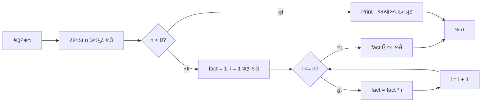

## પ્રશ્ન 1(a) [3 ગુણ]

**પ્રોબ્લેમ સોલ્વિંગમાં સામેલ પગલાં સમજાવો.**

**જવાબ**:

**ટેબલ:**

| પગલું | વર્ણન |
|------|-------------|
| **સમસ્યા સમજવી** | સમસ્યાને સ્પષ્ટ રીતે વાંચો અને સમજો |
| **વિશ્લેષણ** | સમસ્યાને નાના ભાગોમાં વિભાજિત કરો |
| **અલ્ગોરિધમ ડિઝાઇન** | પગલાંવાર ઉકેલનો અભિગમ બનાવો |
| **અમલીકરણ** | પ્રોગ્રામિંગ લેંગ્વેજનો ઉપયોગ કરીને કોડ કરો |
| **ટેસ્ટિંગ** | વિવિધ ટેસ્ટ કેસ સાથે સોલ્યુશન ચકાસો |
| **ડોક્યુમેન્ટેશન** | ભવિષ્યના ઉપયોગ માટે સોલ્યુશન દસ્તાવેજીકરણ કરો |

**મુખ્ય મુદ્દાઓ:**

- **સમસ્યા વ્યાખ્યા**: શું હલ કરવાની જરૂર છે તે સ્પષ્ટ રીતે ઓળખો
- **ઇનપુટ/આઉટપુટ**: જરૂરી ઇનપુટ અને અપેક્ષિત આઉટપુટ નક્કી કરો
- **લોજિક બિલ્ડિંગ**: સોલ્યુશનનો તાર્કિક પ્રવાહ બનાવો

**મેમરી ટ્રીક:** "લોકો હંમેશા ડિઝાઇન કરીને અમલીકરણ ટેસ્ટ કરે છે દરરોજ"

## પ્રશ્ન 1(b) [4 ગુણ]

**Python ના ફીચર્સ લખો.**

**જવાબ**:

**ટેબલ:**

| ફીચર | વર્ણન |
|---------|-------------|
| **સરળ સિન્ટેક્સ** | કોડ વાંચવામાં અને લખવામાં સરળ |
| **ઇન્ટરપ્રિટેડ** | કોમ્પાઇલેશનની જરૂર નથી, સીધું ચાલે છે |
| **પ્લેટફોર્મ ઇન્ડિપેન્ડન્ટ** | Windows, Mac, Linux પર ચાલે છે |
| **ઓબ્જેક્ટ-ઓરિએન્ટેડ** | ક્લાસ અને ઓબ્જેક્ટને સપોર્ટ કરે છે |
| **મોટી લાઇબ્રેરી** | વ્યાપક બિલ્ટ-ઇન મોડ્યુલ્સ |
| **ડાયનામિક ટાઇપિંગ** | વેરિએબલ ટાઇપ ડિક્લેર કરવાની જરૂર નથી |

**મુખ્ય ફીચર્સ:**

- **ફ્રી અને ઓપન સોર્સ**: દરેક માટે ઉપયોગ કરવા માટે ઉપલબ્ધ
- **હાઇ-લેવલ લેંગ્વેજ**: માનવ ભાષાની નજીક
- **વ્યાપક સપોર્ટ**: મોટો કમ્યુનિટી અને ડોક્યુમેન્ટેશન

**મેમરી ટ્રીક:** "સરળ ઇન્ટરપ્રિટેડ પ્લેટફોર્મ-ઇન્ડિપેન્ડન્ટ ઓબ્જેક્ટ-ઓરિએન્ટેડ લાઇબ્રેરીઝ ડાયનામિક"

## પ્રશ્ન 1(c) [7 ગુણ]

**આપેલી સંખ્યાનો ફેક્ટોરિયલ શોધવા માટેનો ફ્લોચાર્ટ દોરો તેમજ અલ્ગોરિધમ લખો.**

**જવાબ**:

**ફ્લોચાર્ટ:**



**અલ્ગોરિધમ:**

1. શરૂઆત
2. સંખ્યા n ઇનપુટ કરો
3. જો n < 0, તો "અયોગ્ય ઇનપુટ" પ્રિન્ટ કરો અને પગલું 8 પર જાઓ
4. fact = 1, i = 1 શરૂ કરો
5. જ્યાં સુધી i <= n, કરો:
   - fact = fact * i
   - i = i + 1
6. fact પ્રિન્ટ કરો
7. અંત

**મુખ્ય મુદ્દાઓ:**

- **બેઝ કેસ**: 0! = 1 અને 1! = 1
- **વેલિડેશન**: નેગેટિવ નંબર માટે ચેક કરો
- **લૂપ લોજિક**: 1 થી n સુધીના બધા નંબર ગુણો

**મેમરી ટ્રીક:** "ઇનપુટ વેલિડેટ ઇનિશિયલાઇઝ લૂપ પ્રિન્ટ"

## પ્રશ્ન 1(c OR) [7 ગુણ]

**ઉદાહરણ સાથે રિલેશનલ અને એસાઇનમેન્ટ ઓપરેટરો સમજાવો.**

**જવાબ**:

**રિલેશનલ ઓપરેટર્સ ટેબલ:**

| ઓપરેટર | વર્ણન | ઉદાહરણ |
|----------|-------------|---------|
| **==** | બરાબર | 5 == 5 (True) |
| **!=** | બરાબર નથી | 5 != 3 (True) |
| **>** | મોટું | 7 > 3 (True) |
| **<** | નાનું | 2 < 8 (True) |
| **>=** | મોટું અથવા બરાબર | 5 >= 5 (True) |
| **<=** | નાનું અથવા બરાબર | 4 <= 6 (True) |

**એસાઇનમેન્ટ ઓપરેટર્સ ટેબલ:**

| ઓપરેટર | વર્ણન | ઉદાહરણ |
|----------|-------------|---------|
| **=** | સાદું એસાઇનમેન્ટ | x = 5 |
| **+=** | ઉમેરીને એસાઇન કરો | x += 3 (x = x + 3) |
| **-=** | બાદ કરીને એસાઇન કરો | x -= 2 (x = x - 2) |
| **\*=** | ગુણીને એસાઇન કરો | x *= 4 (x = x \* 4) |
| **/=** | ભાગીને એસાઇન કરો | x /= 2 (x = x / 2) |

**કોડ ઉદાહરણ:**

```python
# રિલેશનલ ઓપરેટર્સ
a, b = 10, 5
print(a > b)   # True
print(a == b)  # False

# એસાઇનમેન્ટ ઓપરેટર્સ
x = 10
x += 5  # x બને છે 15
x *= 2  # x બને છે 30
```

**મેમરી ટ્રીક:** "સંબંધ તુલના કરો, મૂલ્યો એસાઇન કરો"

## પ્રશ્ન 2(a) [3 ગુણ]

**ફ્લોચાર્ટ માટે ઉપયોગમાં લેવાતા વિવિધ પ્રતીકો દોરો અને દરેક પ્રતીકનો હેતુ લખો.**

**જવાબ**:

**ફ્લોચાર્ટ સિમ્બોલ્સ ટેબલ:**

| સિમ્બોલ | નામ | હેતુ |
|--------|------|---------|
| **અંડાકાર** | ટર્મિનલ | પ્રોગ્રામની શરૂઆત/અંત |
| **લંબચોરસ** | પ્રોસેસ | પ્રોસેસિંગ ઓપરેશન્સ |
| **હીરા** | ડિસિઝન | શરતી સ્ટેટમેન્ટ્સ |
| **સમાંતરચતુષ્કોણ** | ઇનપુટ/આઉટપુટ | ડેટા ઇનપુટ/આઉટપુટ |
| **વર્તુળ** | કનેક્ટર | વિવિધ ભાગોને જોડવા |
| **તીર** | ફ્લો લાઇન | પ્રવાહની દિશા |

**ASCII ડાયાગ્રામ:**

```goat
   ( Start/End )     [ Process ]     < Decision >
        
   / Input/Output \     O Connector     ---> Flow
```

**મુખ્ય મુદ્દાઓ:**

- **સ્ટાન્ડર્ડ સિમ્બોલ્સ**: સાર્વત્રિક રીતે માન્ય આકારો
- **સ્પષ્ટ ફ્લો**: તીરો પ્રોગ્રામની દિશા દર્શાવે છે
- **તાર્કિક માળખું**: પ્રોગ્રામ લોજિકને વિઝ્યુઅલાઇઝ કરવામાં મદદ કરે છે

**મેમરી ટ્રીક:** "ટર્મિનલ્સ પ્રોસેસ ડિસિઝન્સ ઇનપુટ કનેક્ટર્સ ફ્લો"

## પ્રશ્ન 2(b) [4 ગુણ]

**સારા અલ્ગોરિધમની લાક્ષણિકતાઓ સૂચિબદ્ધ કરો.**

**જવાબ**:

**ટેબલ:**

| લાક્ષણિકતા | વર્ણન |
|----------------|-------------|
| **મર્યાદિત** | મર્યાદિત પગલાં પછી સમાપ્ત થવું જોઈએ |
| **નિશ્ચિત** | દરેક પગલું સ્પષ્ટ રીતે વ્યાખ્યાયિત |
| **ઇનપુટ** | શૂન્ય અથવા વધુ ઇનપુટ્સ સ્પષ્ટ |
| **આઉટપુટ** | ઓછામાં ઓછું એક આઉટપુટ |
| **અસરકારક** | પગલાં સરળ અને શક્ય હોવા જોઈએ |
| **અસ્પષ્ટ નહીં** | દરેક પગલાંનો માત્ર એક જ અર્થ |

**મુખ્ય લાક્ષણિકતાઓ:**

- **શુદ્ધતા**: બધા યોગ્ય ઇનપુટ્સ માટે સાચા પરિણામો
- **કાર્યક્ષમતા**: ન્યૂનતમ સમય અને જગ્યાના સંસાધનોનો ઉપયોગ
- **સ્પષ્ટતા**: સમજવામાં અને અમલ કરવામાં સરળ

**મેમરી ટ્રીક:** "મર્યાદિત નિશ્ચિત ઇનપુટ આઉટપુટ અસરકારક અસ્પષ્ટ નહીં"

## પ્રશ્ન 2(c) [7 ગુણ]

**નીચેના ડેટા મૂલ્યોને રજૂ કરવા માટે યોગ્ય ડેટા ટાઇપનો ઉપયોગ કરો.**

**જવાબ**:

**ડેટા ટાઇપ મેપિંગ ટેબલ:**

| ડેટા મૂલ્ય | ડેટા ટાઇપ | ઉદાહરણ |
|------------|-----------|---------|
| **(1) અઠવાડિયામાં દિવસોની સંખ્યા** | **int** | `days = 7` |
| **(2) ગુજરાતનો રહેવાસી છે કે નહીં** | **bool** | `is_resident = True` |
| **(3) મોબાઇલ નંબર** | **str** | `mobile = "9876543210"` |
| **(4) બેંક ખાતાનો બેલેન્સ** | **float** | `balance = 15000.50` |
| **(5) એક ગોળાનું ઘનફળ** | **float** | `volume = 523.33` |
| **(6) ચોરસનો પરિમિતિ** | **float** | `perimeter = 20.0` |
| **(7) વિદ્યાર્થીનું નામ** | **str** | `name = "રાહુલ"` |

**કોડ ઉદાહરણ:**

```python
# ડેટા ટાઇપ ઉદાહરણો
days = 7                    # int
is_resident = True          # bool
mobile = "9876543210"       # str
balance = 15000.50          # float
volume = 523.33            # float
perimeter = 20.0           # float
name = "રાહુલ"             # str
```

**મુખ્ય મુદ્દાઓ:**

- **int**: દશાંશ વિના પૂર્ણ સંખ્યાઓ
- **float**: દશાંશ બિંદુ સાથેની સંખ્યાઓ
- **str**: કોટ્સમાં ટેક્સ્ટ ડેટા
- **bool**: માત્ર True/False મૂલ્યો

**મેમરી ટ્રીક:** "ઇન્ટિજર્સ ફ્લોટ સ્ટ્રિંગ્સ બુલિયન્સ"

## પ્રશ્ન 2(a OR) [3 ગુણ]

**નીચેના કોડનું આઉટપુટ શોધો.**

```python
num1 = 2+9*((3*12)-8)/10
print(num1)
```

**જવાબ**:

**પગલાંવાર ગણતરી:**

```python
num1 = 2+9*((3*12)-8)/10
# પગલું 1: 3*12 = 36
# પગલું 2: 36-8 = 28
# પગલું 3: 9*28 = 252
# પગલું 4: 252/10 = 25.2
# પગલું 5: 2+25.2 = 27.2
```

**આઉટપુટ:** `27.2`

**મુખ્ય મુદ્દાઓ:**

- **BODMAS નિયમ**: કૌંસ, ઓર્ડર્સ, ભાગાકાર, ગુણાકાર, સરવાળો, બાદબાકી
- **ઓપરેટર પ્રિસિડન્સ**: પહેલા કૌંસ, પછી ગુણાકાર/ભાગાકાર
- **પરિણામ ટાઇપ**: ભાગાકાર ઓપરેશનને કારણે ફ્લોટ

**મેમરી ટ્રીક:** "કૌંસ ઓર્ડર્સ ભાગાકાર ગુણાકાર સરવાળો બાદબાકી"

## પ્રશ્ન 2(b OR) [4 ગુણ]

**Python માં ઉપયોગમાં લેવાતા વિવિધ પ્રકારના ઓપરેટર્સની સૂચિ બનાવો.**

**જવાબ**:

**Python ઓપરેટર્સ ટેબલ:**

| પ્રકાર | ઓપરેટર્સ | ઉદાહરણ |
|------|-----------|---------|
| **અરિથમેટિક** | +, -, *, /, %, **, // | `5 + 3 = 8` |
| **તુલના** | ==, !=, >, <, >=, <= | `5 > 3 = True` |
| **લોજિકલ** | and, or, not | `True and False = False` |
| **એસાઇનમેન્ટ** | =, +=, -=, *=, /= | `x += 5` |
| **બિટવાઇઝ** | &, \|, ^, ~, <<, >> | `5 & 3 = 1` |
| **મેમ્બરશિપ** | in, not in | `'a' in 'cat' = True` |
| **આઇડેન્ટિટી** | is, is not | `x is y` |

**મુખ્ય મુદ્દાઓ:**

- **અરિથમેટિક**: ગાણિતિક ઓપરેશન્સ
- **તુલના**: મૂલ્યોની તુલના કરે છે અને બુલિયન પરત કરે છે
- **લોજિકલ**: બુલિયન એક્સપ્રેશન્સને જોડે છે

**મેમરી ટ્રીક:** "અરિથમેટિક તુલના લોજિકલ એસાઇનમેન્ટ બિટવાઇઝ મેમ્બરશિપ આઇડેન્ટિટી"

## પ્રશ્ન 2(c OR) [7 ગુણ]

**યુઝર દ્વારા દાખલ કરેલા બધા ધન સંખ્યાઓનો સરવાળો અને સરેરાશ શોધવા માટે પ્રોગ્રામ લખો. જ્યારે યુઝર કોઈ નેગેટિવ નંબરમાં એન્ટર કરે ત્યારે યુઝર પાસેથી આગળનું કોઈપણ ઇનપુટ લેવાનું બંધ કરો અને સરવાળો અને સરેરાશ પ્રદર્શિત કરો.**

**જવાબ**:

**કોડ:**

```python
# ધન સંખ્યાઓનો સરવાળો અને સરેરાશ શોધવાનો પ્રોગ્રામ
total_sum = 0
count = 0

print("ધન સંખ્યાઓ દાખલ કરો (નેગેટિવ રોકવા માટે):")

while True:
    num = float(input("સંખ્યા દાખલ કરો: "))
    
    if num < 0:
        break
    
    total_sum += num
    count += 1

if count > 0:
    average = total_sum / count
    print(f"સરવાળો: {total_sum}")
    print(f"સરેરાશ: {average}")
else:
    print("કોઈ ધન સંખ્યાઓ દાખલ કરાયેલ નથી")
```

**મુખ્ય મુદ્દાઓ:**

- **લૂપ કંટ્રોલ**: break સ્ટેટમેન્ટ સાથે while લૂપ
- **ઇનપુટ વેલિડેશન**: નેગેટિવ નંબર્સ માટે ચેક કરો
- **શૂન્ય દ્વારા ભાગાકાર**: જ્યારે કોઈ નંબર દાખલ ન થયા હોય ત્યારે હેન્ડલ કરો

**મેમરી ટ્રીક:** "ઇનપુટ લૂપ ચેક કેલ્ક્યુલેટ ડિસ્પ્લે"

## પ્રશ્ન 3(a) [3 ગુણ]

**ઉદાહરણ સાથે while લૂપ સમજાવો.**

**જવાબ**:

**While લૂપ સ્ટ્રક્ચર:**

```python
while condition:
    # statements
    # update condition
```

**ઉદાહરણ:**

```python
# 1 થી 5 સુધીના નંબર્સ પ્રિન્ટ કરો
i = 1
while i <= 5:
    print(i)
    i += 1
```

**મુખ્ય મુદ્દાઓ:**

- **પ્રી-ટેસ્ટેડ લૂપ**: એક્ઝિક્યુશન પહેલાં કંડિશન ચેક થાય છે
- **અનંત લૂપ જોખમ**: કંડિશન આખરે False થવી જોઈએ
- **લૂપ વેરિએબલ**: લૂપની અંદર અપડેટ થવું જોઈએ

**મેમરી ટ્રીક:** "જ્યારે કંડિશન સાચી હોય ત્યારે એક્ઝિક્યુટ કરો"

## પ્રશ્ન 3(b) [4 ગુણ]

**યુઝર દ્વારા ઇનપુટ કરેલ પૂર્ણાંક સંખ્યાના ડિજિટનો સરવાળો શોધવા માટે પ્રોગ્રામ લખો.**

**જવાબ**:

**કોડ:**

```python
# ડિજિટનો સરવાળો શોધવાનો પ્રોગ્રામ
num = int(input("સંખ્યા દાખલ કરો: "))
original_num = num
digit_sum = 0

while num > 0:
    digit = num % 10
    digit_sum += digit
    num = num // 10

print(f"{original_num} ના ડિજિટનો સરવાળો {digit_sum} છે")
```

**મુખ્ય મુદ્દાઓ:**

- **મોડ્યુલો ઓપરેશન**: %10 વાપરીને છેલ્લો ડિજિટ કાઢો
- **ઇન્ટિજર ડિવિઝન**: //10 વાપરીને છેલ્લો ડિજિટ હટાવો
- **શૂન્ય સુધી લૂપ**: ડિજિટ્સ બાકી ન રહે ત્યાં સુધી ચાલુ રાખો

**મેમરી ટ્રીક:** "કાઢો ઉમેરો હટાવો પુનરાવર્તન કરો"

## પ્રશ્ન 3(c) [7 ગુણ]

**યુઝર-નિર્ધારિત ફંક્શનનો ઉપયોગ કરીને 100 થી 10000 ના વચ્ચેના આર્મસ્ટ્રોંગ નંબરો છાપવા માટે પ્રોગ્રામ લખો.**

**જવાબ**:

**કોડ:**

```python
def is_armstrong(num):
    """નંબર આર્મસ્ટ્રોંગ નંબર છે કે નહીં ચેક કરો"""
    original = num
    num_digits = len(str(num))
    sum_powers = 0
    
    while num > 0:
        digit = num % 10
        sum_powers += digit ** num_digits
        num //= 10
    
    return sum_powers == original

def print_armstrong_range(start, end):
    """આપેલી રેન્જમાં આર્મસ્ટ્રોંગ નંબર્સ પ્રિન્ટ કરો"""
    print(f"{start} અને {end} વચ્ચેના આર્મસ્ટ્રોંગ નંબર્સ:")
    
    for num in range(start, end + 1):
        if is_armstrong(num):
            print(num, end=" ")
    print()

# મુખ્ય પ્રોગ્રામ
print_armstrong_range(100, 10000)
```

**મુખ્ય મુદ્દાઓ:**

- **ફંક્શન ડેફિનિશન**: def કીવર્ડ વાપરીને ફંક્શન્સ બનાવો
- **આર્મસ્ટ્રોંગ લોજિક**: ડિજિટ્સનો સરવાળો ડિજિટ્સની સંખ્યાની પાવર સુધી
- **રેન્જ ફંક્શન**: સ્પષ્ટ રેન્જમાં નંબર્સ જનરેટ કરો

**મેમરી ટ્રીક:** "ડિફાઇન ચેક કેલ્ક્યુલેટ કમ્પેર પ્રિન્ટ"

## પ્રશ્ન 3(a OR) [3 ગુણ]

**નીચેના પેટર્ન છાપવા માટે પ્રોગ્રામ લખો.**

```
5 4 3 2 1
4 3 2 1
3 2 1
2 1
1
```

**જવાબ**:

**કોડ:**

```python
# પેટર્ન પ્રિન્ટિંગ પ્રોગ્રામ
for i in range(5, 0, -1):
    for j in range(i, 0, -1):
        print(j, end=" ")
    print()
```

**મુખ્ય મુદ્દાઓ:**

- **નેસ્ટેડ લૂપ્સ**: બાહ્ય લૂપ રો માટે, અંદરનું કોલમ માટે
- **રિવર્સ રેન્જ**: ઘટવા માટે range(start, stop, -1)
- **પ્રિન્ટ કંટ્રોલ**: સ્પેસ માટે end=" ", newline માટે print()

**મેમરી ટ્રીક:** "બાહ્ય અંદરનું રિવર્સ પ્રિન્ટ"

## પ્રશ્ન 3(b OR) [4 ગુણ]

**નેસ્ટેડ if...else સ્ટેટમેન્ટ સમજાવો.**

**જવાબ**:

**સ્ટ્રક્ચર:**

```python
if condition1:
    if condition2:
        # statements
    else:
        # statements
else:
    if condition3:
        # statements
    else:
        # statements
```

**ઉદાહરણ:**

```python
marks = 85

if marks >= 50:
    if marks >= 90:
        grade = "A+"
    elif marks >= 80:
        grade = "A"
    else:
        grade = "B"
else:
    grade = "F"

print(f"ગ્રેડ: {grade}")
```

**મુખ્ય મુદ્દાઓ:**

- **અંદરની શરતો**: બીજા if-else ની અંદર if-else
- **અનેક સ્તરો**: અનેક સ્તરો સુધી નેસ્ટ કરી શકાય છે
- **લોજિકલ ફ્લો**: અંદરની શરતો ફક્ત ત્યારે જ એક્ઝિક્યુટ થાય છે જ્યારે બાહ્ય સાચી હોય

**મેમરી ટ્રીક:** "બાહ્ય અંદરનું અનેક સ્તરો"

## પ્રશ્ન 3(c OR) [7 ગુણ]

**લિસ્ટમાં n નંબરો દાખલ કરવા તેમજ statistics મોડ્યુલનો ઉપયોગ કરીને તેમનો mean, median અને mode શોધવા માટેનો પ્રોગ્રામ લખો.**

**જવાબ**:

**કોડ:**

```python
import statistics

# એલિમેન્ટ્સની સંખ્યા ઇનપુટ કરો
n = int(input("એલિમેન્ટ્સની સંખ્યા દાખલ કરો: "))
numbers = []

# નંબર્સ ઇનપુટ કરો
for i in range(n):
    num = float(input(f"નંબર {i+1} દાખલ કરો: "))
    numbers.append(num)

# આંકડાશાસ્ત્ર ગણો
mean_val = statistics.mean(numbers)
median_val = statistics.median(numbers)

try:
    mode_val = statistics.mode(numbers)
except statistics.StatisticsError:
    mode_val = "કોઈ યુનિક mode નથી"

# પરિણામો દર્શાવો
print(f"નંબર્સ: {numbers}")
print(f"મીન: {mean_val}")
print(f"મેડિયન: {median_val}")
print(f"મોડ: {mode_val}")
```

**મુખ્ય મુદ્દાઓ:**

- **Statistics મોડ્યુલ**: આંકડાકીય ફંક્શન્સ માટે બિલ્ટ-ઇન મોડ્યુલ
- **લિસ્ટ ઇનપુટ**: પ્રોસેસિંગ માટે લિસ્ટમાં નંબર્સ સ્ટોર કરો
- **એક્સેપ્શન હેન્ડલિંગ**: mode કેલ્ક્યુલેશન એરર્સ હેન્ડલ કરો

**મેમરી ટ્રીક:** "ઇમ્પોર્ટ ઇનપુટ કેલ્ક્યુલેટ ડિસ્પ્લે"

## પ્રશ્ન 4(a) [3 ગુણ]

**Python માં for લૂપ અને while લૂપ વચ્ચે તફાવત લખો.**

**જવાબ**:

**તુલના ટેબલ:**

| ફીચર | For લૂપ | While લૂપ |
|---------|----------|------------|
| **હેતુ** | જાણીતા પુનરાવર્તનો | અજાણ્યા પુનરાવર્તનો |
| **સિન્ટેક્સ** | for var in sequence | while condition |
| **ઇનિશિયલાઇઝેશન** | ઓટોમેટિક | મેન્યુઅલ |
| **અપડેટ** | ઓટોમેટિક | મેન્યુઅલ |
| **ઉપયોગ** | કલેક્શન્સ પર પુનરાવર્તન | શરત સુધી પુનરાવર્તન |

**ઉદાહરણો:**

```python
# For લૂપ
for i in range(5):
    print(i)

# While લૂપ  
i = 0
while i < 5:
    print(i)
    i += 1
```

**મેમરી ટ્રીક:** "For જાણીતા While અજાણ્યા"

## પ્રશ્ન 4(b) [4 ગુણ]

**નીચેના જોડકા બનાવો.**

**જવાબ**:

**સાચા મેચિંગ:**

- **A. If statement → 3.** ચોક્કસ સ્થિતિના આધારે કોડના બ્લોકને શરતીવાર ચલાવવા માટે વપરાય છે
- **B. While loop → 1.** જ્યાં સુધી કોઈ ચોક્કસ સ્થિતિ પૂરી થાય ત્યાં સુધી કોડના બ્લોકને વારંવાર ચલાવે છે
- **C. Break statement → 5.** વર્તમાન લૂપને સમાપ્ત કરે છે અને આગલા પુનરાવર્તન તરફ આગળ વધે છે
- **D. Continue statement → 2.** વર્તમાન પુનરાવર્તનને અવગણે છે અને આગળના એક તરફ આગળ વધે છે

**મુખ્ય મુદ્દાઓ:**

- **If Statement**: શરતીવાર એક્ઝિક્યુશન
- **While Loop**: શરત સાથે પુનરાવર્તિત એક્ઝિક્યુશન
- **Break**: લૂપમાંથી સંપૂર્ણ બહાર નીકળો
- **Continue**: માત્ર વર્તમાન પુનરાવર્તન છોડો

**મેમરી ટ્રીક:** "If શરતો While પુનરાવર્તન Break બહાર Continue છોડો"

## પ્રશ્ન 4(c) [7 ગુણ]

**ઉદાહરણની મદદથી નીચેના તફાવત સમજાવો:**
**a) Argument and Parameter**
**b) Global and Local variable**

**જવાબ**:

**a) Argument vs Parameter:**

```python
def greet(name, age):  # name, age પેરામીટર્સ છે
    print(f"હેલો {name}, તમારી ઉંમર {age} વર્ષ છે")

greet("રાજ", 20)  # "રાજ", 20 આર્ગ્યુમેન્ટ્સ છે
```

**b) Global vs Local Variable:**

```python
x = 10  # Global variable

def my_function():
    y = 5  # Local variable
    global x
    x = 15  # Global variable ને બદલવું
    print(f"Local y: {y}")
    print(f"Global x: {x}")

my_function()
print(f"બહાર Global x: {x}")
```

**તુલના ટેબલ:**

| પ્રકાર | સ્કોપ | એક્સેસ | ઉદાહરણ |
|------|-------|--------|---------|
| **Parameter** | ફંક્શન ડેફિનિશન | મૂલ્યો મેળવે છે | `def func(param):` |
| **Argument** | ફંક્શન કોલ | મૂલ્યો પાસ કરે છે | `func(argument)` |
| **Global** | આખો પ્રોગ્રામ | બધે | `x = 10` |
| **Local** | ફંક્શનની અંદર | માત્ર ફંક્શનમાં | ફંક્શનમાં `y = 5` |

**મેમરી ટ્રીક:** "પેરામીટર્સ મેળવે આર્ગ્યુમેન્ટ્સ પાસ કરે Globals બધે Locals ફંક્શન"

## પ્રશ્ન 4(a OR) [3 ગુણ]

**નીચેના સ્ટેટમેન્ટના આઉટપુટ લખો.**

**જવાબ**:

**કોડ વિશ્લેષણ:**

```python
import math
(i) print(math.ceil(-9.7))   # આઉટપુટ: -9
(ii) print(math.floor(-9.7)) # આઉટપુટ: -10  
(iii) print(math.fabs(-12.3)) # આઉટપુટ: 12.3
```

**સમજૂતી:**

- **ceil(-9.7)**: Ceiling નજીકના integer સુધી ઉપર કરે છે = -9
- **floor(-9.7)**: Floor નજીકના integer સુધી નીચે કરે છે = -10
- **fabs(-12.3)**: Absolute value નેગેટિવ સાઇન દૂર કરે છે = 12.3

**મુખ્ય મુદ્દાઓ:**

- **Math Module**: ગાણિતિક ફંક્શન્સ માટે ઇમ્પોર્ટ જરૂરી
- **નેગેટિવ નંબર્સ**: Ceiling અને floor નેગેટિવ સાથે અલગ રીતે કામ કરે છે
- **Absolute Value**: હંમેશા પોઝિટિવ મૂલ્ય પરત કરે છે

**મેમરી ટ્રીક:** "Ceiling ઉપર Floor નીચે Absolute પોઝિટિવ"

## પ્રશ્ન 4(b OR) [4 ગુણ]

**Function ના ફાયદા લખો.**

**જવાબ**:

**ફાયદા ટેબલ:**

| ફાયદો | વર્ણન |
|-----------|-------------|
| **કોડ રીયુઝેબિલિટી** | એકવાર લખો, ઘણીવાર વાપરો |
| **મોડ્યુલારિટી** | જટિલ સમસ્યાઓને નાના ભાગોમાં વિભાજિત કરો |
| **સરળ ડિબગિંગ** | એરર્સ સરળતાથી શોધો અને ઠીક કરો |
| **કોડ ઓર્ગેનાઇઝેશન** | વધુ સારું માળખું અને વાંચવાક્ષમતા |
| **મેઇન્ટેનેબિલિટી** | અપડેટ અને મોડિફાય કરવું સરળ |
| **જટિલતા ઘટાડવી** | જટિલ ઓપરેશન્સને સરળ બનાવો |

**મુખ્ય ફાયદાઓ:**

- **પુનરાવર્તન ટાળો**: ફરીથી તે જ કોડ લખવાની જરૂર નથી
- **ટીમ કોલેબોરેશન**: અલગ અલગ લોકો અલગ ફંક્શન્સ પર કામ કરી શકે છે
- **ટેસ્ટિંગ**: દરેક ફંક્શનને સ્વતંત્ર રીતે ટેસ્ટ કરી શકાય છે

**મેમરી ટ્રીક:** "રીયુઝ મોડ્યુલર ડિબગ ઓર્ગેનાઇઝ મેઇન્ટેન ઘટાડો"

## પ્રશ્ન 4(c OR) [7 ગુણ]

**બિલ્ટ ઇન ફંક્શન્સનો ઉપયોગ કયા વિના આપેલ લિસ્ટમાં સૌથી નાનો અને સૌથી મોટો નંબર શોધવા માટે પ્રોગ્રામ લખો.**

**જવાબ**:

**કોડ:**

```python
# બિલ્ટ-ઇન ફંક્શન્સ વિના સૌથી નાનો અને મોટો શોધવાનો પ્રોગ્રામ
def find_min_max(numbers):
    """બિલ્ટ-ઇન ફંક્શન્સ વિના minimum અને maximum શોધો"""
    if not numbers:
        return None, None
    
    smallest = numbers[0]
    largest = numbers[0]
    
    for num in numbers[1:]:
        if num < smallest:
            smallest = num
        if num > largest:
            largest = num
    
    return smallest, largest

# ઇનપુટ લિસ્ટ
n = int(input("એલિમેન્ટ્સની સંખ્યા દાખલ કરો: "))
numbers = []

for i in range(n):
    num = float(input(f"નંબર {i+1} દાખલ કરો: "))
    numbers.append(num)

# min અને max શોધો
min_num, max_num = find_min_max(numbers)

print(f"લિસ્ટ: {numbers}")
print(f"સૌથી નાનો નંબર: {min_num}")
print(f"સૌથી મોટો નંબર: {max_num}")
```

**મુખ્ય મુદ્દાઓ:**

- **મેન્યુઅલ કમ્પેરિઝન**: min()/max() ની જગ્યાએ if શરતોનો ઉપયોગ કરો
- **વેરિએબલ ઇનિશિયલાઇઝ કરો**: પહેલા એલિમેન્ટથી શરૂ કરો
- **લૂપ થ્રુ**: દરેક એલિમેન્ટને વર્તમાન min/max સાથે કમ્પેર કરો

**મેમરી ટ્રીક:** "ઇનિશિયલાઇઝ કમ્પેર અપડેટ રિટર્ન"

## પ્રશ્ન 5(a) [3 ગુણ]

**Python માં list માટેના sort() અને sorted() મેથડ વચ્ચેનો તફાવત સમજાવો.**

**જવાબ**:

**તુલના ટેબલ:**

| ફીચર | sort() | sorted() |
|---------|--------|----------|
| **રિટર્ન ટાઇપ** | None (ઓરિજિનલ બદલે છે) | નવી સોર્ટેડ લિસ્ટ |
| **ઓરિજિનલ લિસ્ટ** | ઇન-પ્લેસ બદલે છે | અપરિવર્તિત |
| **ઉપયોગ** | list.sort() | sorted(list) |
| **મેમરી** | કાર્યક્ષમ | વધારાની મેમરી વાપરે છે |

**ઉદાહરણો:**

```python
# sort() મેથડ
list1 = [3, 1, 4, 2]
list1.sort()
print(list1)  # [1, 2, 3, 4]

# sorted() ફંક્શન
list2 = [3, 1, 4, 2]
new_list = sorted(list2)
print(list2)      # [3, 1, 4, 2] (અપરિવર્તિત)
print(new_list)   # [1, 2, 3, 4]
```

**મેમરી ટ્રીક:** "Sort બદલે છે Sorted બનાવે છે"

## પ્રશ્ન 5(b) [4 ગુણ]

**ઉદાહરણ સાથે Python માં સ્ટ્રિંગને ટ્રાવર્સ કરવાની વિવિધ રીત સમજાવો.**

**જવાબ**:

**સ્ટ્રિંગ ટ્રાવર્સલ મેથડ્સ:**

**1. For લૂપ વાપરીને:**

```python
text = "Python"
for char in text:
    print(char, end=" ")  # P y t h o n
```

**2. ઇન્ડેક્સ વાપરીને:**

```python
text = "Python"
for i in range(len(text)):
    print(text[i], end=" ")  # P y t h o n
```

**3. While લૂપ વાપરીને:**

```python
text = "Python"
i = 0
while i < len(text):
    print(text[i], end=" ")
    i += 1
```

**4. Enumerate વાપરીને:**

```python
text = "Python"
for index, char in enumerate(text):
    print(f"{index}:{char}", end=" ")  # 0:P 1:y 2:t 3:h 4:o 5:n
```

**મેમરી ટ્રીક:** "For ઇન્ડેક્સ While Enumerate"

## પ્રશ્ન 5(c) [7 ગુણ]

**નીચે આપેલા સ્ક્રિપ્ટનું આઉટપુટ લખો.**

**જવાબ**:

**આઉટપુટ પરિણામો:**

```python
(1) s = "Hello, World!"
    print(s[0:5])              # આઉટપુટ: Hello

(2) lst = [1, 2, 3, 4, 5]
    print(lst[2:4])            # આઉટપુટ: [3, 4]

(3) s = "python"
    print(len(s))              # આઉટપુટ: 6

(4) lst = [5, 2, 3, 1, 8]
    lst.sort()                 # lst બને છે [1, 2, 3, 5, 8]

(5) s1 = "hello"
    s2 = "world"
    print(s1 + s2)             # આઉટપુટ: helloworld

(6) lst = [1, 2, 3, 4, 5]
    print(sum(lst))            # આઉટપુટ: 15

(7) s = "python"
    print(s[::-1])             # આઉટપુટ: nohtyp
```

**મુખ્ય મુદ્દાઓ:**

- **સ્લાઇસિંગ**: [start:end] સબસ્ટ્રિંગ/સબલિસ્ટ કાઢે છે
- **સ્ટ્રિંગ લેન્થ**: len() કેરેક્ટરની સંખ્યા પરત કરે છે
- **લિસ્ટ સોર્ટિંગ**: sort() લિસ્ટને ઇન-પ્લેસ બદલે છે
- **સ્ટ્રિંગ કન્કેટેનેશન**: + ઓપરેટર સ્ટ્રિંગ્સ જોડે છે
- **Sum ફંક્શન**: બધા લિસ્ટ એલિમેન્ટ્સ ઉમેરે છે
- **રિવર્સ સ્લાઇસિંગ**: [::-1] સિક્વન્સ ઉલટાવે છે

**મેમરી ટ્રીક:** "સ્લાઇસ લેન્થ સોર્ટ કન્કેટેનેટ સમ રિવર્સ"

## પ્રશ્ન 5(a OR) [3 ગુણ]

**Python માં type conversion સમજાવો.**

**જવાબ**:

**ટાઇપ કન્વર્ઝન ટેબલ:**

| ટાઇપ | ફંક્શન | ઉદાહરણ |
|------|----------|---------|
| **int()** | ઇન્ટિજરમાં કન્વર્ટ કરો | `int("5")` → 5 |
| **float()** | ફ્લોટમાં કન્વર્ટ કરો | `float("3.14")` → 3.14 |
| **str()** | સ્ટ્રિંગમાં કન્વર્ટ કરો | `str(25)` → "25" |
| **bool()** | બુલિયનમાં કન્વર્ટ કરો | `bool(1)` → True |
| **list()** | લિસ્ટમાં કન્વર્ટ કરો | `list("abc")` → ['a','b','c'] |

**ઉદાહરણો:**

```python
# Implicit conversion
x = 5 + 3.2  # int + float = float (8.2)

# Explicit conversion
num_str = "123"
num_int = int(num_str)  # "123" → 123
```

**મુખ્ય મુદ્દાઓ:**

- **Implicit**: Python આપોઆપ કન્વર્ટ કરે છે
- **Explicit**: પ્રોગ્રામર મેન્યુઅલી ફંક્શન્સ વાપરીને કન્વર્ટ કરે છે
- **ટાઇપ સેફ્ટી**: કેટલાક કન્વર્ઝન એરર્સ આપી શકે છે

**મેમરી ટ્રીક:** "Implicit આપોઆપ Explicit મેન્યુઅલ"

## પ્રશ્ન 5(b OR) [4 ગુણ]

**ઉદાહરણ સાથે string પર કન્કેટેનેશન અને પુનરાવર્તન કામગીરીને સમજાવો.**

**જવાબ**:

**સ્ટ્રિંગ ઓપરેશન્સ:**

**1. કન્કેટેનેશન (+):**

```python
str1 = "Hello"
str2 = "World"
result = str1 + " " + str2
print(result)  # Hello World

# મલ્ટિપલ કન્કેટેનેશન
name = "Python"
version = "3.9"
info = "Language: " + name + " Version: " + version
print(info)  # Language: Python Version: 3.9
```

**2. પુનરાવર્તન (*):**

```python
text = "Hi! "
repeated = text * 3
print(repeated)  # Hi! Hi! Hi! 

# પેટર્ન બનાવવું
pattern = "-" * 10
print(pattern)  # ----------
```

**મુખ્ય મુદ્દાઓ:**

- **કન્કેટેનેશન**: + વાપરીને સ્ટ્રિંગ્સ જોડે છે
- **પુનરાવર્તન**: * વાપરીને સ્ટ્રિંગને n વખત રિપીટ કરે છે
- **અપરિવર્તનીય**: ઓરિજિનલ સ્ટ્રિંગ્સ અપરિવર્તિત રહે છે

**મેમરી ટ્રીક:** "Plus જોડે Star રિપીટ કરે"

## પ્રશ્ન 5(c OR) [7 ગુણ]

**શબ્દમાળામાં સ્વર, વ્યંજન, અપરકેસ, લોઅરકેસ અક્ષરોની સંખ્યાની ગણતરી પ્રદર્શિત કરવા માટેનો પ્રોગ્રામ લખો.**

**જવાબ**:

**કોડ:**

```python
def analyze_string(text):
    """વિવિધ કેરેક્ટર પ્રકારો માટે સ્ટ્રિંગનું વિશ્લેષણ કરો"""
    vowels = "aeiouAEIOU"
    
    vowel_count = 0
    consonant_count = 0
    uppercase_count = 0
    lowercase_count = 0
    
    for char in text:
        if char.isalpha():  # કેરેક્ટર આલ્ફાબેટ છે કે નહીં ચેક કરો
            if char in vowels:
                vowel_count += 1
            else:
                consonant_count += 1
            
            if char.isupper():
                uppercase_count += 1
            elif char.islower():
                lowercase_count += 1
    
    return vowel_count, consonant_count, uppercase_count, lowercase_count

# ઇનપુટ સ્ટ્રિંગ
text = input("સ્ટ્રિંગ દાખલ કરો: ")

# સ્ટ્રિંગનું વિશ્લેષણ કરો
vowels, consonants, uppercase, lowercase = analyze_string(text)

# પરિણામો દર્શાવો
print(f"સ્ટ્રિંગ: '{text}'")
print(f"સ્વર: {vowels}")
print(f"વ્યંજન: {consonants}")
print(f"અપરકેસ: {uppercase}")
print(f"લોઅરકેસ: {lowercase}")
```

**મુખ્ય મુદ્દાઓ:**

- **કેરેક્ટર ક્લાસિફિકેશન**: isalpha(), isupper(), islower() નો ઉપયોગ કરો
- **સ્વર ચેક**: સ્વર સ્ટ્રિંગ સાથે કમ્પેર કરો
- **લૂપ પ્રોસેસિંગ**: દરેક કેરેક્ટરને વ્યક્તિગત રીતે ચેક કરો

**મેમરી ટ્રીક:** "ચેક ક્લાસિફાય કાઉન્ટ ડિસ્પ્લે"
